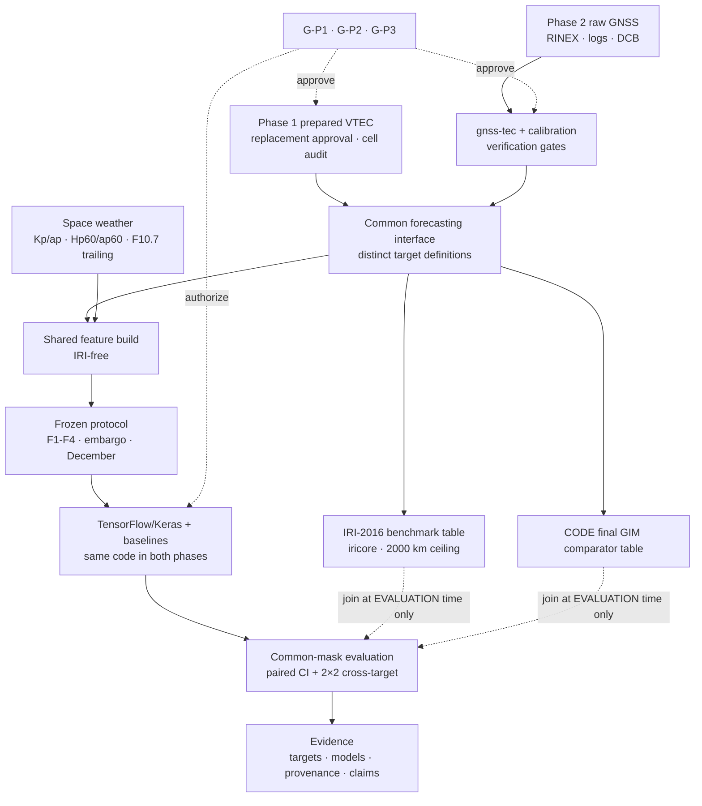

# Technical Environment and Research Implementation

**Project:** Modeling and Error Reduction in Ionospheric TEC Estimation Using GNSS Data and Machine Learning  
**Author:** Kimia Rezaei  
**Supervisor:** Dr. Reza Saraf Shirazi  
**Institution:** Amirkabir University of Technology, Faculty of Electrical Engineering  
**Document version:** 3.4  
**Date:** 22 August 2026  
**Status:** Draft for technical approval; subordinate to *Project Vision and Research Definition* v4.3

<!--
  Version-header correction applied 2026-08-22 on the project decision owner's
  ruling, against governance finding DP-CHAIR-01 (`GOV-2026-08-22-DP-01`).

  The v3.4 amendment was approved and applied on 2026-08-22 under change record
  `CR-2026-08-22-TE-AMEND` and is recorded in the §1.2 change history, but this
  header field was left reading 3.3. Verified present in this document before the
  correction was made: `src/data/config.py` and `src/data/locked_test.py` in the
  §12 tree, `tests/test_determinism.py` in the §12 tests tree, and
  `export PYTHONHASHSEED=0` in the §13.2 clean-run sequence.

  ADMINISTRATIVE ONLY. Exactly two fields changed — the version number and the
  date. No scientific value, technical requirement, gate, checklist row, or
  governance rule was introduced, altered or removed under this correction, and
  no new change record was opened: the amendment this header now names was
  already approved under `CR-2026-08-22-TE-AMEND`.
-->
<!-- markdownlint-disable-line -->


---

## 1. Document Status and Approvals

### 1.1 Purpose and authority

This document is the implementation specification for *Project Vision and Research Definition* v4.3 ("Vision Document"). It translates the approved scientific and methodological rules into software, data, environment, integration, testing, artifact, and reproducibility requirements.

The Vision Document remains the normative source of truth. This document:

- must not redefine the research question, IRI role, estimand, success framework, practical-relevance policy, claim boundary, model set, or evaluation protocol;
- is superseded immediately if the Vision Document changes materially;
- may be updated only through the change-control process in Vision §15.2;
- does not grant scientific approval or open the locked test.

Terms such as **must**, **shall**, and **required** describe implementation obligations derived from the Vision Document. An unresolved value is written as **"TBD — freeze gate"**. **No implementer or coding agent may fill such a value by convenience.**

### 1.2 Change History

| Version | Date | Change |
|---|---|---|
| 1.0 | 30 July 2026 | Initial implementation specification for Vision v2.0 |
| 2.0 | 8 August 2026 | Rewritten for Vision v3.0 and questionnaire decisions Q-01–Q-33 |
| 3.0 | 11 August 2026 | Implemented the approved two-phase amendment, ICTP prepared-data gate, one TensorFlow/Keras stack, phase-transition freeze, cross-processor validation, code-reuse/licensing controls, and Phase 2 acceptance gates |
| 3.1 | 11 August 2026 | Made the supplied Kaggle notebook the approved student-facing Phase 1 ICTP acquisition interface; added its output contract, integrity/provenance evidence, repository location, clean-run relationship, and acceptance checks |
| 3.2 | 11 August 2026 | Recorded the executed ICTP audit as a failed source gate; rejected ICTP for model training; specified a conditional MIT Haystack Madrigal MAPGPS `gps` replacement workflow, gridded-target contract, audit evidence, risks, and blocking approvals |
| 3.3 | 21 August 2026 | Annotated §1.5 and §19 TA-25 for the D-144 approval. Recorded downstream of Vision v4.3 and of decisions **D-15** (locked-month custody relocation), **D-16** (Phase 1 hourly aggregation statistic = median; zenith-weighted declared as a sensitivity and deferred as not computable from the five-column product) and **D-17** (Phase 1 target-row contract, defined from the audited product schema). §6.1's ten-field row contract and its provisional support minima are **not** rewritten here: they remain in conflict with Vision §6.6/§6.1A for Phase 1 and that conflict is recorded, open, at § Known defects row 10 of the requirements artifact. Amendments applied **in place with inline annotations** naming their change records |

| 3.4 | 22 August 2026 | Applied the §12 tree amendment for `tests/test_acquisition_window.py` **countersigned 2026-08-16**, which had never been written into this document. Added `src/data/config.py`, `src/data/locked_test.py` and `tests/test_determinism.py` to §12 and the `PYTHONHASHSEED` requirement to §13.2 under **ADR-10**, approved 2026-08-22 by the project owner under the recorded student/supervisor authority equivalence. Annotated §6.1 to record that **D-17**, **D-16** and **D-19** govern the Phase 1 target-row contract and support thresholds, preserving the provisional text. Clarified §19 TA-09's Phase 1 bound against approved FR-WS-4, and recorded that §13.2's script ordinals are phase-scoped. Change record `CR-2026-08-22-TE-AMEND`; governance report `GOV-2026-08-22-REM-01`. No scientific value was introduced or changed |

### 1.3 What Changed in Version 2.0

| Area | v1.0 | v2.0 | Source |
|---|---|---|---|
| IRI role in code | Feature, residual anchor, and baseline | Benchmark-only table, architecturally isolated, enforced by a failing denial test | Q-01, Q-02 |
| Model modules | 8 models incl. residual RF/LSTM | 6 trained/derived models + 1 benchmark + 1 comparator; residual modules deleted | Q-20 |
| GRU | Gated by TQ-22 | Removed; gate closed | Q-20, Q-33 |
| Constellations | Unspecified | GPS-only L1/L2 at 30 s | Q-07 |
| Processor | "Established processor," unselected | `gnss-tec` + project calibration layer, with contingency and cross-check | Q-08 |
| DCB | Unselected source | Published satellite + receiver DCBs, hand-verified sign, reversed-sign control | Q-09 |
| Scripts | 18 | 7 | Q-30 |
| Notebooks | 11 | 4 | Q-30 |
| Config files | ~15 across directories | 4 | Q-30 |
| NFRs | 13 | 8 critical | Q-30 |
| Platforms | Kaggle + Colab + Drive + local | Kaggle + local | Q-29 |
| Container | Optional gate TQ-20 | Gate closed | Q-29 |
| Python | "3.x" | 3.11, exact pins, per-run freeze | Q-29 |
| Compute | GPU-centred, CPU fallback TBD | CPU is a complete path; GPU optional | Q-29 |
| Bootstrap | Within-station, 2,000 | Vector, 10,000, seed 20221201 | Q-27 |
| Grids | "≤20 trials" | Exact: 6 / 18 / 16 | Q-21 |
| Folds | F1–F3 | F1–F4 | Q-23 |
| Fixtures | One 7-day | 7-day plumbing + 1-month scientific | Q-31 |
| Agent authority | Not specified | Hard preflight; explicit forbidden-choice list | Q-32 |

### 1.4 Readiness gates supported

| Vision gate | How this document supports it | Approval effect |
|---|---|---|
| G-01 Scientific framing | Preserves the approved question, IRI-benchmark-only role, estimand, and model hierarchy in implementation | No independent scientific sign-off |
| G-02 Station/data viability | Defines inventories, station registry, coverage and constellation reports, provenance controls | Supplies evidence for review |
| G-03 GNSS target | Defines package integration, calibration layer, DCB verification, sensitivities, target pipeline, uncertainty budget | Supplies processor and target evidence |
| G-04 Feature safety | Defines the availability matrix, frozen dictionary, causal transformations, leakage tests, **IRI-denial test** | Supplies feature-safety evidence |
| G-05 Experiment freeze | Defines fold, mask, grid, seed, metric, bootstrap, regime, and configuration artifacts, plus the December regime audit | Supplies the signed technical bundle |
| G-06 Locked evaluation | Defines write-once execution, hash-before-metrics, registry fields, test-access flag | Does not authorize December access |
| G-07 Reproducibility | Defines the CPU clean-run contract, lock file, hashes | Supplies clean-run evidence |
| G-08 Claims | Preserves traceable outputs and bounded reporting artifacts | Does not approve thesis claims |
| G-09 Agent preflight | Defines required configs, gate tests, forbidden choices, zero-TBD check | Blocks coding until P0 freezes pass |
| G-P1 Prepared-data MVP | Preserves the failed ICTP audit and defines approval/audit of one replacement, prepared-target release, Phase 1 training, and locked evaluation | Supplies the Phase 1 go/no-go evidence only after replacement viability passes |
| G-P2 Phase transition | Defines the immutable TensorFlow/Keras model/evaluation freeze | Authorizes raw-pipeline work only after approval |
| G-P3 Raw-target acceptance | Defines raw-target coverage, processor validation, uncertainty, and matched-comparison checks | Blocks Phase 2 model training until the target passes |

### 1.5 Approval record

| Approval | Owner | Required before | Status/evidence |
|---|---|---|---|
| Technical structure accepted | Student | Repository build-out | Pending |
| IRI-benchmark-only role and IRI-free contract accepted | Student and supervisor | Feature construction | Pending — G-01/G-04 |
| GNSS implementation choices accepted | Student and supervisor | Full-year target generation | Pending — G-03 |
| Feature/evaluation configuration accepted | Student and supervisor | Model tuning | Pending — G-04/G-05 |
| CPU clean-run evidence accepted | Supervisor/reviewer | Thesis submission | Pending — G-07 |
| Agent preflight passed | Student and supervisor | Any affected component is coded | Pending — G-09 |
| ICTP Kaggle acquisition/audit interface | Student | ICTP source audit | **Executed — D-142; ZIP mechanics passed; G-P1A source viability failed under D-143** |
| Phase 1 replacement provider/product and gridded-target definition | Student and supervisor | Replacement acquisition for training | **Approved 2026-08-21 — D-144; Madrigal MAPGPS `gps` adopted.** Granted by the project owner under the recorded student/supervisor authority equivalence; no supervisor signature artifact exists and none is claimed. The gridded-target definition's two unfrozen sub-values — hourly aggregation statistic (Vision §6.6) and numerical coverage minimum (Vision §6.1B) — remain `TBD — supervisor freeze gate`. *[Amended in place 2026-08-21 per `governance/CHANGE_RECORD_2026-08-21_D-144.md`; effective version v3.3, not yet issued.]* |

---

## 2. System and Research Context

The thesis studies whether a pooled compact TensorFlow/Keras LSTM, trained **exclusively** on VTEC history and predeclared causal non-IRI predictors, produces more accurate one-hour-ahead VTEC forecasts than the IRI-2016 benchmark, and whether the conclusion is consistent across a provider-prepared target and an independently produced raw-observation target (Vision §2.2). The confirmatory quantity is the paired loss differential with a 95% confidence interval, equal-station weighted, sign convention positive-favours-LSTM (Vision §2.3).

In Phase 1, the system ingests one approved prepared 2022 VTEC product for the ARUC, BSHM, and NICO coordinates, constructs only forecast-time-available and architecturally IRI-free features, trains the approved models, and evaluates them across four chronological validation folds followed by one locked December test. ICTP has failed the source gate. The recommended replacement is Madrigal MAPGPS `gps` binned VTEC, conditional on D-144 and a successful experiment/schema/cell/coverage audit. In Phase 2, the system processes GPS-only L1/L2 observations at 30 s into quality-controlled hourly IPP-median VTEC, validates that independent target, and retrains the **unchanged** forecasting implementation.

### 2.1 Implementation scope parameters

| Parameter | Value | Implementation obligation | Source |
|---|---|---|---|
| **Confirmatory horizon** | **+1 h** | The only horizon on the critical path. Label construction, tensors, masks, metrics, and the clean-run contract are validated at +1 h. | Q-03 |
| **Optional horizon** | **+24 h** | `experiment.yaml` shall expose `horizons: [1]` with `24` implemented and testable but **not** included in the default run list. Building the +24 h label must require no code change, only a config change. No thesis claim, gate, or acceptance check depends on it, and it may not be added to the default list before the minimum thesis is complete and frozen. | Q-03, Q-33 |
| **Stations / year** | ARUC, BSHM, NICO; calendar 2022 | Fixed in `data.yaml`. Adding a station or year is a scope change requiring a change record, not a config edit. | Q-05 |
| **Model granularity** | **Pooled primary models** | One model trained across all three stations using station one-hot plus verified latitude. Roughly 26,000 pooled hourly rows versus roughly 8,700 per station, which is why pooling is required rather than optional for the sequence model. Per-station **metrics** remain mandatory diagnostics; per-station **models** are an optional post-completion sensitivity only. | Q-05 |
| **Geographic description** | "three IGS stations in the mid-latitude Eastern Mediterranean–South Caucasus sector" | The registry stores geodetic **and** IGRF geomagnetic coordinates for each station so the sector description is evidenced rather than asserted. The sector name is descriptive metadata only; no code, mask, or metric may aggregate across it as though it were a sampled population. | Q-04, Q-06 |

### 2.2 Phase Boundary and Software Interface

| Rule | Phase 1 | Phase 2 |
|---|---|---|
| Target input | Prepared provider VTEC only | Raw GNSS observations and independent TEC/VTEC calculation |
| Forbidden work | No RINEX parsing, DCB handling, STEC calculation, or mapping | No model-family or evaluation-protocol redesign in the confirmatory track |
| Shared interface | `timestamp_utc`, `station_id`, `vtec_tecu`, phase/source ID, target-definition ID, validity flag, and documented QC/support fields | Exactly the same target interface; Phase 2 may add raw-processing diagnostics but may not alter the forecasting contract |
| Forecasting code | TensorFlow/Keras M-06 and common scikit-learn baselines | Same source files, architecture, training policy, hyperparameters, features, splits, masks, seeds, and metrics |
| Exit evidence | Phase 1 results plus signed `phase_transition_manifest` | Raw-target acceptance plus cross-phase results and final reproducibility package |

The `phase_transition_manifest` shall hash the model source, TensorFlow/Keras environment, architecture serialization, feature manifest, target contract, split/mask manifests, grids, selected hyperparameters, optimizer/loss policy, seeds, metrics, and statistical configuration. Phase 2 refuses to train if any protected hash differs. A deliberate difference requires a change record and an `exploratory=true` label.

The shared interface is a software contract, not a claim that the physical targets are identical. With Madrigal MAPGPS, `station_id` is a location key linked to a recorded grid cell in Phase 1; in Phase 2 it identifies the receiver whose IPP observations form the target. Every dataset, prediction, mask, and comparison therefore carries `phase_id`, `source_id`, and `target_definition_id`.

**The single most important implementation invariant is the IRI boundary.** IRI values exist in a separate benchmark table and are joined only at evaluation time. Any code path that would deliver an IRI-derived value into ML training or inference is a defect, and a test must fail on it.

Because IRI is a climatology with no access to \(y_t\), the implementation must also always produce the mandatory difficulty controls — persistence, 24-hour seasonal persistence, and fitted climatology — in the **same** primary results table (Vision §2.4). This is a hard reporting requirement, not a convenience.

This implementation is constrained to one academic semester, roughly 26,000 hourly station rows, approximately 10 GB of storage, beginner-to-intermediate Python capacity, and a **CPU-sufficient** workload; the ~30 Kaggle GPU hours per week are available but not required (Vision §4.4).

---

## 3. Domain Glossary

| Term | Implementation-oriented meaning |
|---|---|
| STEC | Slant Total Electron Content along a satellite-to-receiver path; intermediate quantity. |
| VTEC | Vertical Total Electron Content after the frozen mapping and processing rules. |
| **IPP** | Ionospheric Pierce Point: where a satellite-to-receiver ray crosses the assumed thin shell. Within one hour a single station's IPPs form a cloud extending hundreds of kilometres. |
| **Phase 2 hourly receiver-derived VTEC** | The **median of valid VTEC values at the IPPs observed from that station during that hour**. It is a spatial-temporal aggregate over the IPP cloud, **not** a zenith column above the antenna. IRI and GIM are evaluated at the station coordinate, so every comparison carries a documented representativeness mismatch. |
| **Phase 1 prepared target** | Provider-produced VTEC standardized without recomputing DCB, STEC or mapping. If Madrigal MAPGPS `gps` is approved, it is location-sampled **gridded** VTEC selected by a frozen station-coordinate-to-cell rule and hourly aggregation, not receiver-specific station or IPP-median VTEC. Its distinct `target_definition_id` makes the target-domain shift explicit. |
| TECU | Total Electron Content Unit; required unit for stored VTEC values and VTEC errors. |
| DCB | Differential Code Bias for satellite and receiver signals; source, sign convention, and handling are freeze gates. |
| Levelling | Carrier-to-code levelling, elevation-weighted. A known source of systematic error of order 1 TECU or more. |
| Mapping function | Frozen transformation from slant STEC to vertical VTEC under the single-layer shell assumption. |
| Shell height | Assumed thin-layer altitude; primary 450 km, sensitivity 350 km. |
| RINEX/CRX | Standard GNSS observation format and its compressed representation. |
| IONEX | Format for ionosphere-map products including the CODE GIM comparator. |
| **IRI benchmark** | IRI-2016 via `iricore` with an explicit 2000 km ceiling, generated **only** as an external comparison reference. Never an ML input, target, residual anchor, or architectural element. |
| **GIM comparator** | CODE final IONEX, comparator only, never a forecasting input, not presumed independent. |
| Kp / ap | Three-hour planetary geomagnetic indices; safe lag ≥ 3 h. |
| **Hp60 / ap60** | Hourly-cadence geomagnetic indices; safe lag ≥ 1 h. Preferred over Kp alone because the cadence matches the hourly target. |
| Dst | Disturbance storm-time index. **Diagnostic / hindcast-only**; not a confirmatory feature. |
| F10.7 | Solar radio flux; observed value at 1-day lag; **trailing** 81-day mean only, never centered. |
| SSN | Sunspot number. **Removed** from the project. |
| Local solar time | \((UTC\ hour + longitude/15)\bmod 24\), sine/cosine encoded. The **only** channel through which longitude enters any model. |
| Freeze gate | A decision that must be measured, recorded, and approved before dependent work begins; it cannot be guessed. |
| Embargo | The 24-hour gap between training and validation partitions preventing a 24-hour input window from crossing a boundary. |
| Pooled model | One learned model trained across all three stations using station one-hot identity plus verified latitude. |
| **Difficulty control** | Persistence, seasonal persistence, or fitted climatology. Mandatory, co-reported in the primary table, never optional. |
| **Paired loss differential** | The confirmatory estimand: mean within-station difference of squared errors, benchmark minus model, combined with equal-station weighting. Positive favours the model. |
| **Vector time-block bootstrap** | Resampling 24-hour blocks on the common timeline **carrying all three stations together**, preserving serial and cross-sectional dependence. |
| **Comparison-wide mask** | The intersection of availability across **all** models in a declared comparison set, computed once and stored with a stable ID. Pairwise masks are prohibited. |
| **IRI-denial test** | A test that must fail if any `iri_*` field or IRI-derived target reaches ML training or inference. |
| Walking skeleton | Two fixtures: a seven-day single-station plumbing fixture and a one-month all-station scientific fixture. |
| Quiet / Disturbed / Storm | \(Kp<4\) / \(Kp\ge4\) / \(Kp\ge5\), per Vision §9.3. |
| Storm event | Contiguous \(Kp\ge5\); independent after ≥24 h of \(Kp<4\); reported over −12 h to +24 h. |
| Locked test | December 2022, accessed once after G-05, predictions hashed before metrics. |

---

## 4. Context Map



The dotted edges are the IRI/GIM boundary. **There is no solid arrow from X or Y into E, F, G or H, and none may ever be added to the confirmatory pipeline.**

---

## 5. Data Source Inventory

### 5.1 Inventory contract

Every inventory entry must record provider, role, filename/product identifier, station/date coverage, retrieval date, checksum, version or release status, license/access notes, and the configuration that consumes it. Exact filenames not present in the supplied source material remain unresolved rather than invented.

| Source/item | Provider | Role | Known local/available item | Required provenance | Freeze/status |
|---|---|---|---|---|---|
| **ICTP Calibrated GNSS TEC Service** | Abdus Salam ICTP | **Rejected Phase 1 candidate; audit evidence only** | Executed audit: ARUC 27 non-empty days (7.397%; one zero-byte file rejected), BSHM 35 (9.589%), NICO 0 with HTTP 404; ZIP integrity passed but three-location folds/December are impossible | Executed notebook, source URLs, station/date/size/status, retrieval time, per-file and ZIP SHA-256, manifests, coverage report, console output | **G-P1A failed — D-143; prohibited for training** |
| **MIT Haystack CEDAR Madrigal MAPGPS `gps` binned VTEC** | MIT Haystack Observatory | **Recommended Phase 1 replacement candidate; possible Phase 2 cross-target reference** | Standard prepared product documented as 1°×1° VTEC bins at 5-minute cadence; exact 2022 experiment, returned fields and three coordinate-cell coverage not yet audited | Permanent experiment/file citation, instrument/kindat (candidate 3500), parameter names/units/fill values, API/package version, coordinate-to-cell rule, cell bounds, dates, format, hash, contact/acknowledgment | **D-144 and G-P1A pending; not automatic** |
| IONOLAB-TEC | IONOLAB | Change-controlled second-choice Phase 1 candidate and potential station-level Phase 2 reference | Authenticated access and exact 2022 ARUC/BSHM/NICO coverage unverified | Account/access record, product definition, station identity, dates/cadence, files/hashes, citation and usage terms | Supervisor decision and full G-P1A audit required |
| ARUC GPS RINEX/CRX | Source provider not yet recorded | Raw dual-frequency GPS input | One `.crx` file reported available; exact filename/date not supplied | Provider, station, date, filename, SHA-256, retrieval date | Inventory incomplete — G-02 |
| BSHM GPS RINEX/CRX | Source provider not yet recorded | Raw dual-frequency GPS input | One `.crx` file reported available | Same as above | Inventory incomplete — G-02 |
| NICO GPS RINEX/CRX | Source provider not yet recorded | Raw dual-frequency GPS input | One `.crx` file reported available | Same as above | Inventory incomplete — G-02 |
| Full 2022 GPS RINEX/CRX archive | NASA CDDIS or approved authoritative archive | Full-year target input | Still required | Provider, station, dates, filenames, hashes, retrieval dates | Open dependency — G-02 |
| Official site logs | Authoritative station-log provider | Coordinates, DOMES, receiver/antenna/firmware intervals, changes | Still required | Log version/date, source, detected hardware/coordinate changes | Freeze gate — G-02 |
| `gnss-tec` package | PyPI / source repository | RINEX parsing and STEC groundwork | Still required | Name, exact release/commit, dependencies | Freeze gate — G-03 |
| Project calibration layer | This project | Arc, levelling, DCB application, mapping, aggregation | To be written, 300–500 lines, unit-tested | Module hashes, config ID, test report | Freeze gate — G-03 |
| DCB product (satellite **and receiver**) | CAS or DLR Bias-SINEX `.BSX`; or CODE monthly `.DCB` | Bias correction | Still required; **receiver entries for all three stations must be confirmed** | Analysis center, product date/version, method, units, sign convention, hash | Freeze gate — G-03 |
| CODE final IONEX GIM | CODE | **External comparator only** | One IONEX file reported available; provenance not supplied | Analysis center, product/version, filename, hash, retrieval date, interpolation rule, input-network audit | Freeze gate — G-03 |
| Second station-level TEC reference | IONOLAB-TEC or another approved receiver/station product | Phase 2 processor verification reference | ICTP lacks the required 2022 coverage; Madrigal gridded VTEC may be a cross-target reference but is not receiver-level truth | Product, version, physical definition, station, retrieval date, hash, overlap/independence statement | Freeze gate — G-P3 (DEP-07) |
| GPS-TEC (Seemala) | Seemala | Representative-day cross-check only | Optional | Version, platform, run log | Cross-check only — not a production path |
| `iricore` / IRI-2016 | Official or approved implementation | **External benchmark only** | Still required | Package/build, exact version/commit, switches, topside option, **2000 km ceiling**, drivers, units | Freeze gate — G-03/G-05 |
| `space_weather_2022.csv` | Provider not yet recorded | Candidate Kp/ap/Dst source | Reported available | Provider/product, observation **and publication** timestamps, release status, retrieval date, hash, units | Availability gate — G-04 |
| Hp60 / ap60 product | GFZ or approved source | Hourly geomagnetic features | Retrieval required | Product, timestamps, release status, retrieval date, hash | Availability gate — G-04 |
| F10.7 observed + trailing 81-day | Approved source | Solar activity features | Retrieval required | Product, timestamps, release/finality status, retrieval date, hash | Availability gate — G-04 |
| `sunspot_number_2022.csv` | — | **Not used** | Reported available | — | **Removed by Q-16; retained in inventory only as an unused file** |

### 5.2 Source separation

GNSS-derived VTEC, IRI-2016 benchmark output, and GIM comparator output must remain **separate columns, separate files, separate derivation paths, and separate versions**.

- GIM must not be relabeled as ground truth, and no independence claim may be made before the input-network overlap audit.
- Package choices may be checked against GIM and the second reference for reasonableness, but the pipeline must not be tuned to force agreement and later described as independently validated.
- **IRI must never be joined into any ML feature or target table.** The only permitted join is at evaluation time, onto the frozen comparison-wide mask.

---

## 6. Data Dictionary

### 6.1 Hourly VTEC target contract

One record represents one station and UTC interval \([h,h+1)\), labeled by interval start \(h\).

| Field | Type | Unit/format | Definition and rule |
|---|---|---|---|
| `station_id` | categorical string | `ARUC`, `BSHM`, `NICO` | Stable identifier validated against the station registry. |
| `interval_start_utc` | timezone-aware datetime | ISO 8601 UTC | Start \(h\); unique with `station_id`. |
| `vtec_tecu` | float | TECU | **Median of valid VTEC at observed IPPs within the hour.** Not zenith VTEC. Zenith-weighted aggregation is a declared sensitivity only. |
| `valid_observation_count` | integer | count | Valid observations supporting the hour. Provisional minimum **20** — freeze gate pending audit. |
| `valid_satellite_count` | integer | count | Distinct valid satellites. Provisional minimum **4** — freeze gate pending audit. |
| `within_hour_spread_tecu` | float | TECU | **Representativeness-uncertainty field.** Spread of valid IPP VTEC within the hour. Must be reported, not merely stored. Statistic and threshold TBD — freeze gate. |
| `largest_internal_gap_s` | integer/float | seconds | Largest gap between valid contributing observations. Provisional maximum **1200 s (20 min)** — freeze gate pending audit. |
| `processor_qc_flags` | string/list or bit field | coded | Package, DCB, arc, elevation, slip, mapping, or aggregation flags. Codebook versioned. |
| `aggregation_config_id` | string | stable ID | Identifier of the frozen hourly-target configuration snapshot. |
| `target_valid` | boolean | true/false | Whether the row satisfies all frozen target rules. Invalid primary targets are **never** imputed. |

Release-level companion fields may include `dataset_version`, `source_manifest_id`, `processor_config_id`, and `target_qc_version`; these do not replace the ten required row-level fields.

**Phase 1 supersession — annotation added 2026-08-22 (`CR-2026-08-22-TE-AMEND`). The provisional text above is preserved as written and is not deleted; the rows below record which approved decision governs each field in Phase 1.**

The table above states the target contract in its original, largely **Phase 2-shaped** form. Two approved decisions govern Phase 1 and were made before this annotation; nothing here is a new scientific rule.

| Field | Provisional text above | Phase 1 governing decision |
|---|---|---|
| Row contract as a whole | "Each row must retain exactly these fields" | **D-17** — the Phase 1 target-row contract. Fields the five-column Madrigal product (`ut1_unix`, `gdlat`, `glon`, `tec`, `dtec`) cannot yield are recorded **not applicable in Phase 1** rather than emitted empty |
| `vtec_tecu` | median of valid VTEC at observed IPPs | **D-16** — Phase 1 hourly statistic frozen as the **median**; zenith-weighted aggregation declared a sensitivity and deferred as not computable from this product |
| `valid_observation_count` | "Provisional minimum **20**" | **D-19** — Phase 1 minimum frozen at **3** contributing samples per cell-hour (retains 95.24%). **The provisional 20 is inapplicable to Phase 1, not merely strict: it retains zero cell-hours.** The product's native cadence is five-minutely, so an hour holds at most **12** slots, and the measured deduplicated maximum over 23,709 January–November cell-hours is exactly 12. The figure 20 was written for the Phase 2 IPP population, where dozens of observations per hour are normal |
| `valid_satellite_count` | "Provisional minimum **4**" | **D-17 / D-19** — **not applicable in Phase 1.** The quantity does not exist on the prepared gridded product, which carries no per-satellite information. TE §7.0's Phase 1 hard prohibition separately requires `test_phase_boundary.py` to **fail** if Phase 1 produces a satellite field |
| `within_hour_spread_tecu` | "Statistic and threshold TBD — freeze gate" | **D-19** — statistic frozen as **range (max − min)**; threshold **10.0 TECU**, above which the row is flagged and excluded from the primary target (p99 = 9.616) |
| `largest_internal_gap_s` | "Provisional maximum **1200 s**" | **D-19** — Phase 1 maximum frozen at **1800 s** (retains 93.39%); 1200 s would retain 85.81% |

D-19's values are **measured, not chosen**: 23,709 deduplicated cell-hours across all three cells, **January–November 2022 only, December excluded by construction**, so no locked-month record informed any of them. Both decisions were approved 2026-08-21 by the project owner under the recorded student/supervisor authority equivalence, TE §18.2 classing hourly support thresholds as a Student + Supervisor choice exercised under that delegation. **Phase 2 re-reads the provisional text above as its own starting point**; this annotation binds Phase 1 only.

### 6.2 ML feature dictionary — IRI-free schema

**Binding rule.** This table is the complete permitted ML input space. No `iri_*` field, no IRI-derived residual, and no field computed from IRI may appear here or in any derived tensor. `tests/test_iri_denial.py` must fail if one does.

| Stable field(s) | Definition/unit | Source and timestamp | Allowed lag | Transformation | Normalization | Missing-value rule | Track |
|---|---|---|---|---|---|---|---|
| `vtec_lag_1h`, `vtec_lag_2h`, `vtec_lag_3h`, `vtec_lag_24h` | Prior valid station VTEC, TECU | Hourly target table; interval start | Strictly causal, exact lags `[1,2,3,24]` | Lag construction after split manifest | Train-only standardization for ridge/LSTM; none for RF | Carry-forward prohibited for target-derived lags; window excluded | Primary |
| `vtec_seq_24` | 24-step causal VTEC sequence, TECU | Hourly target table | Strictly causal, 24 steps | Sequence tensor | Train-only standardization | Window excluded if incomplete | Primary (LSTM) |
| `utc_hour_sin`, `utc_hour_cos` | Cyclical UTC hour | Issue time \(t\) | 0 h | Sine/cosine | None | Not missing if timestamp valid | Primary |
| `doy_sin`, `doy_cos` | Cyclical day of year | Issue time \(t\) | 0 h | Sine/cosine | None | Not missing if timestamp valid | Primary; subject to the required **no-DOY ablation** |
| `lst_sin`, `lst_cos` | Local solar time from UTC and verified longitude | Issue time + station registry | 0 h | \((UTC+lon/15)\bmod24\), then sine/cosine | None | Excluded until longitude is verified | Primary. **The only channel through which longitude enters any model.** |
| `station_onehot_ARUC/BSHM/NICO` | Station identity | Station registry | Static | One-hot | None | No inference from station name; unresolved registry blocks use | Required for pooled models |
| `station_lat` | Verified geodetic latitude | Station registry | Static | Numeric | Train-only if scaled | Unresolved registry blocks use | Required |
| `kp_safe`, `ap_safe` | Geomagnetic indices from the **last completed** 3-hour interval | NOAA/GFZ or approved; observation + publication timestamps | **≥ 3 h** | Approved lag/encoding | Train-only if scaled | Carry-forward ≤ 3 h, then exclude | Primary |
| `hp60_safe`, `ap60_safe` | Hourly-cadence geomagnetic indices | GFZ or approved | **≥ 1 h** | Approved lag | Train-only if scaled | Carry-forward ≤ 3 h, then exclude | Primary |
| `f107_safe` | Observed F10.7 | Approved source | **1 day** | Approved lag | Train-only if scaled | Carry-forward ≤ 3 h, then exclude | Primary |
| `f107_81_trailing` | **Trailing** 81-day F10.7 mean | Approved source | Trailing window ending at the safe-lagged day | Trailing mean only | Train-only if scaled | Carry-forward ≤ 3 h, then exclude | Primary. **The centered 81-day mean is prohibited — it uses future days.** |
| `dst_*` | Disturbance storm-time index | OMNIWeb or approved | — | — | — | — | **Diagnostic / hindcast-only. Not a confirmatory feature.** |
| `ssn_*` | Sunspot number | — | — | — | — | — | **Removed. Not used anywhere.** |
| `valid_observation_count`, `valid_satellite_count`, spread/gap/QC fields | Target-support and quality descriptors | Hourly target table | **Only hours ≤ \(t\)** | Binning/flags only as approved | Train-only if modeled | Missing remains explicit or row excluded | **Diagnostic by default.** Model use requires explicit G-04 approval. Target-hour quality fields are future information and are permanently forbidden as features. |

### 6.3 Benchmark and comparator tables — evaluation-time only

These tables are physically and logically separate from §6.2. They are joined only at evaluation time onto the frozen comparison-wide mask.

| Field | Definition/unit | Source | Rule |
|---|---|---|---|
| `iri2016_t_plus_1_tecu` | IRI-2016 VTEC at target time, TECU, integrated to the explicit **2000 km** ceiling | Frozen `iricore` run | **Benchmark only.** Never an ML feature, target, or residual anchor. Drivers must be forecast-safe and must not be future-centered. |
| `iri_config_id`, `iri_ceiling_km`, `iri_topside_option` | Provenance of the benchmark run | Config snapshot | Must accompany every benchmark value |
| `gim_t_plus_1_tecu` | Interpolated CODE final GIM value at the station coordinate | Frozen IONEX product | **Comparator only.** Bilinear space + linear time with longitude-rotation correction. Missing values exclude the GIM comparison only. |
| `gim_network_overlap_flag` | Whether ARUC/BSHM/NICO appear in the GIM input network | Overlap audit | Disclosure is mandatory; no independence claim before the audit |

### 6.4 Matched-representation rule

For every matched comparison, the flattened matrix supplied to M-04 (ridge) and M-05 (RF) shall be the flattened form of the **identical causal window** supplied to M-06 (LSTM). Window length is one frozen value per feature-set ID, shared across all families.

Standardization for ridge and LSTM, and no scaling for RF, is a family-specific **representation** of one shared information set. It is not a different information set, and it must not change which underlying values a family can see.

No Random Forest importance score may add, remove, or rank features into the production feature set. RF importance may be saved only as a non-authoritative diagnostic figure.

---

## 7. Dataset Preparation Pipeline

Reusable logic belongs in `src/`; the nine phase-aware stage scripts orchestrate it; notebooks do not own production logic.

### 7.0 Phase 1 — Prepared-VTEC MVP Pipeline

| Order | Script/stage | Input | Required actions | Output / pass evidence |
|---:|---|---|---|---|
| P1-00 | Close rejected-source audit | Executed `00_ictp_phase1_download_kaggle.ipynb`, ZIP, manifests, hashes, coverage summary and console output | Verify audit integrity; record ARUC 27/365, BSHM 35/365 and NICO 0/365; store D-143; prevent ICTP artifacts from entering target construction | Immutable ICTP source-failure evidence; machine-readable `source_status=REJECTED_COVERAGE` |
| P1-01 | `notebooks/00_acquire_phase1_vtec.ipynb` and `scripts/00_acquire_prepared_vtec.py` | Supervisor-approved provider/product under D-144, API documentation, frozen station coordinates and access rules | For the Madrigal candidate: discover/freeze the exact experiment and `gps` binned-VTEC kindat/parameters; query/download without scientific transformation; record API/package version, permanent citation, requests, timestamps and SHA-256; retain native files | Executed replacement acquisition notebook, native files, immutable request/source manifest, file hashes, citation and access record |
| P1-02 | `01_inventory_and_registry.py --phase 1` | Prepared files, provider schema and official station logs | Validate coordinates, experiment/product, parameter names, units, fill values, UTC cadence and duplicates; apply and record the frozen coordinate-to-cell rule; audit file/cell/day/month/common-timestamp coverage including December; do not inspect model performance | Prepared-data schema/cell/coverage report; selected-cell registry; G-P1A replacement decision |
| P1-03 | `02_standardize_prepared_target.py` | Accepted provider VTEC and frozen target definition | Preserve provider values; apply only documented QC, UTC normalization, cell selection and frozen hourly aggregation; never estimate DCB/STEC, map `los` observations, or silently interpolate missing cells | Versioned Phase 1 hourly location-sampled gridded target with source, cell and target-definition IDs |
| P1-04 | Existing stages 4–5 | Phase 1 target plus external products | Build separate IRI/GIM tables, safe features, F1–F4 splits, embargo, locked-test guard and comparison masks | Dataset release, feature/split/mask manifests, leakage tests |
| P1-05 | Existing stages 6–7 | Frozen Phase 1 release | Tune on validation only; refit; hash predictions before opening metrics; run baselines, paired CI and diagnostics | Phase 1 model registry, results, MVP decision |
| P1-06 | Transition freeze | Complete Phase 1 evidence | Hash and sign protected forecasting protocol; record approved direct-code reuse and licenses | `phase_transition_manifest`; G-P2 approval |

**Phase 1 hard prohibition:** `src/gnss/rinex.py`, `src/gnss/calibration.py`, and every raw-processing adapter are inaccessible from the Phase 1 target-build command. `test_phase_boundary.py` shall fail if the Phase 1 dependency graph imports them or if Phase 1 produces DCB, STEC, mapping, satellite, or arc fields.

### 7.0A Phase 2 — Raw-Observation Pipeline

| Stage | Script | Required actions | Modules | Config |
|---|---|---|---|---|
| 1 | `01_inventory_and_registry.py` | Register files, providers, retrieval dates, hashes, stations, dates, immutable raw paths. Build station registry from official site logs; compute IGRF geomagnetic coordinates with a pinned version; cross-check RINEX headers; audit monthly coverage, observable codes, and cadence. | `src/data/inventory.py`, `src/data/registry.py` | `data.yaml` |
| 2 | `02_build_vtec_target.py` | Decompress and parse GPS RINEX/CRX; validate L1C/L2W and C1C/C1W/C2W availability, station ID, dates, 30 s cadence, timestamps. Run `gnss-tec` plus the project calibration layer with frozen arc, slip, DCB, elevation, mapping, shell, and levelling settings. Aggregate valid IPP VTEC into the ten-field hourly contract. **Never impute targets.** | `src/gnss/rinex.py`, `src/gnss/calibration.py`, `src/gnss/target.py` | `data.yaml` |
| 3 | `03_verify_processing.py` | Select six representative station-days by the documented rule **before** viewing results. Hand-check one satellite pass; run the reversed-sign DCB negative control. Run the 450/350 km, 30°/20°, 20/30 min, median/mean/zenith-weighted sensitivities. Compare against two independent references. Emit the **target uncertainty budget**. Evaluate acceptance criteria. | `src/gnss/verification.py` | `data.yaml` |
| 4 | `04_build_external_products.py` | Generate the IRI-2016 benchmark table via `iricore` with the explicit 2000 km ceiling and forecast-safe drivers; validate 5–10 samples against the official interface. Parse and interpolate CODE final IONEX with longitude-rotation correction; hand-check one sample; audit input-network overlap. Build the space-weather availability matrix with observation and publication timestamps **where the provider supplies them; for a series whose archive carries no publication timestamp, record the approved conservative availability convention and the documented absence in their place, and mark that series' publication latency unverified**. **Write benchmark and comparator to separate tables.** | `src/external/iri.py`, `src/external/gim.py`, `src/external/spaceweather.py` | `data.yaml`, `features.yaml` |
| 5 | `05_build_features_and_splits.py` | Build causal VTEC lags and the 24-step sequence, cyclical time, local solar time, station representation, and forecast-safe space-weather inputs. **Assert the IRI-free contract.** Assign each target to exactly one F1–F4 or December partition; apply the 24-hour embargo; exclude windows crossing boundaries; exclude and count the first 24 hours. Fit scalers on training partitions only, per fold. Build shared flattened matrices and sequence tensors from the identical window. Validate schemas, counts, leakage, units, hashes; emit the immutable dataset release manifest. | `src/features/availability.py`, `src/features/build.py`, `src/features/transforms.py`, `src/features/windows.py`, `src/data/splits.py`, `src/data/release.py` | `features.yaml`, `experiment.yaml` |
| 6 | `06_train_and_predict.py` | Run M-01 and M-02 as transparent index operations; fit M-03 climatology on training partitions only; tune M-04, M-05, M-06 over the exact frozen grids; select by mean per-fold skill across F1–F4 with the 1% simplicity rule; refit on Jan–Nov without changing hyperparameters; run the three final seeds; restore best checkpoints; execute the predeclared ablation runs of §7.2 on frozen Jan–Nov folds; write predictions and registry rows including failed runs. | `src/models/*`, `src/models/train.py`, `src/models/checkpoint.py` | `experiment.yaml`, `seeds.yaml` |
| 7 | `07_evaluate_and_report.py` | Build comparison-wide intersection masks once per comparison set; run the IRI-free denial check; join the benchmark and comparator tables; compute paired loss differentials, RMSE and supporting metrics; run the vector time-block bootstrap; compute regimes, storm events, quality strata, and the top-1%-removed sensitivity; emit figures, tables, and hashes. | `src/evaluation/*` | `experiment.yaml` |

The GNSS processing and verification stages must implement all ten steps in Vision §6.4 before full-year generation. A change to processing after verification creates a new configuration and dataset release, reruns affected tests, and invalidates dependent downstream artifacts.

### 7.0B Phase Transition Freeze

After Phase 1, the following are immutable in the confirmatory Phase 2 track: TensorFlow/Keras model source and serialized architecture, feature schema and safe lags, history window, target cadence/horizon, station encoding, loss, optimizer policy, selected hyperparameters, splits, embargo, baselines, comparison-set masks, seeds, metrics, bootstrap, and reporting hierarchy. Phase 2 changes target lineage from `prepared_provider` to `raw_independent` and, if Madrigal is used, target definition from `location_sampled_gridded_vtec` to `receiver_ipp_median_vtec`; it then retrains from newly initialized weights under the same seeds. It does **not** carry Phase 1 fitted weights forward unless a separately approved transfer-learning experiment is labelled exploratory.

The Phase 2 December run is a fixed-protocol replication because Phase 1 has already exposed December. The locked-test guard shall record `prior_period_exposure=true`; reports must not describe Phase 2 as a second independent blind holdout. No Phase 1 result may motivate a Phase 2 model or evaluation change.

### 7.0C Cross-Processor and Cross-Phase Validation

Before Phase 2 training, align Phase 2 candidate VTEC with Phase 1 prepared VTEC on location key and exact hourly timestamp. Report (n), coverage, bias, MAE, RMSE, median absolute difference, robust spread (MAD/IQR), Pearson and rank correlation, quantile differences, negative/out-of-range rates, and residuals versus local time, elevation/support, station, and geomagnetic regime. If Phase 1 uses Madrigal, report the grid-cell-versus-IPP-cloud mismatch explicitly. Agreement is evidence about the target-domain relationship, not proof that either source is truth or that they estimate the same physical quantity.

Run two independent reference checks on the six predeclared station-days and report physical-definition mismatches. Acceptance thresholds are **TBD — supervisor freeze gate** and must be fixed before matched values are inspected. At minimum, G-P3 also requires successful DCB-sign controls, stable units/time, no unexplained systematic station offset, adequate common-mask coverage, a target uncertainty budget, and complete reproducibility.

For attribution, Phase 2 reporting uses a 2×2 design on common timestamps:

| Model trained on | Evaluated against Phase 1 prepared target | Evaluated against Phase 2 independent target |
|---|---|---|
| Phase 1 target | Required | Required |
| Phase 2 target | Required | Required |

This separates degradation caused by target-domain shift from degradation caused by model training. The primary within-phase results remain on each phase's frozen target; cross-target cells are diagnostic and must use the same timestamps and evaluation mask.

### 7.1 Split configuration

The split configuration must encode the fixed Vision §8.2 calendar explicitly:

| Fold/partition | Training interval | Embargo | Evaluation interval |
|---|---|---|---|
| F1 | 1 January–31 March 2022 | 24 hours | April 2022 |
| F2 | 1 January–30 June 2022 | 24 hours | July 2022 |
| F3 | 1 January–30 September 2022 | 24 hours | October 2022 |
| **F4** | **1 January–31 October 2022** | **24 hours** | **November 2022** |
| Final refit | 1 January–30 November 2022 | Boundary protected by the frozen manifest | — |
| Locked test | — | — | December 2022 only |

Random or shuffled cross-validation is prohibited. If coverage evidence requires an adjustment, it must occur before tuning, use target-independent evidence, receive supervisor approval, and create a revised versioned split manifest. No second 2022 test period may be selected after results are observed.

### 7.2 Ablation registry (Q-18, Q-17, Q-11)

Ablations are **named, predeclared runs**, not exploratory experiments invented after results are seen. Each is registered in `experiment.yaml` with its own run ID and executes on **frozen January–November folds only**, using identical folds, masks, tuning budget, and the mean-skill selection rule of Vision §8.7.

| Ablation ID | Question | Configuration change | Primary remains |
|---|---|---|---|
| `ABL-NODOY` | Does December skill depend on a seasonal encoding the model has seen only once? | Drop `doy_sin`, `doy_cos`; all else identical | Full feature set |
| `ABL-DIFF` | Does a first-difference target improve learning? | Target becomes \(y_{t+1}-y_t\); predictions inverse-transformed to absolute TECU before any metric is computed | **Raw TECU** |
| `ABL-NOSW` | Do forecast-safe space-weather features add value beyond lagged VTEC and time? | Drop `kp_safe`, `ap_safe`, `hp60_safe`, `ap60_safe`, `f107_safe`, `f107_81_trailing` | Full feature set |
| `ABL-HIST48` | Is 24 h the right history length? | 48 h window and 48-step sequence. **Runs only after the primary configuration is frozen.** | 24 h |
| `ABL-ZENITH` | Does zenith-weighted aggregation change the target materially? | Zenith-weighted hourly aggregate (Vision §6.6); representative days only | IPP median |

Implementation rules:

- `ABL-DIFF` must inverse-transform to absolute TECU **before** metrics, so every ablation is scored on the same quantity in the same units as the primary. Error propagation through the inverse transform is recorded.
- Longitude enters **only** through `lst_sin` / `lst_cos`. No ablation may introduce raw longitude as a predictor.
- Ablation results are sensitivity evidence. They may inform interpretation and the limitations chapter, but **they can never replace the preregistered primary comparison after December**, and no ablation configuration may be promoted to primary once the locked test is opened.
- The evidence artifact is `feature_and_target_ablation_report`.

---

## 8. Approved Technical Stack

### 8.1 Required or preferred components

| Component | Status | Approved use |
|---|---|---|
| **Python 3.11** | Required, exact version | All implementation and orchestration |
| `numpy` | Required | Arrays, deterministic numerics, bootstrap implementation |
| `pandas` | Required | Tabular data, timestamps, manifests, registry, aggregation |
| `pyarrow` | Required | Parquet artifacts |
| `pyyaml` | Required | The four configuration files |
| `scikit-learn` | Required | Ridge (M-04), Random Forest (M-05), preprocessing, metrics, grid search |
| `tensorflow` / `tf.keras` | Required; one forecasting stack for both phases | Compact direct LSTM (M-06), training, SavedModel/`.keras` checkpoints, deterministic settings. **CPU is sufficient.** TensorFlow 2.21.0 is the current Python 3.11-compatible candidate; the exact compatible pin is frozen only after Kaggle/local fixture installation passes. |
| `gnss-tec` | **Required — primary GNSS path** | RINEX parsing and STEC groundwork. Not a complete GNSS-to-VTEC processor on its own; the project calibration layer completes it. |
| `iricore` | **Required** | IRI-2016 **benchmark** generation with explicit 2000 km ceiling |
| `matplotlib` | Required | Reproducible figures and diagnostics |
| `seaborn` | Preferred | Diagnostic plots |
| `tqdm` | Preferred | Progress reporting |
| `requests` | Preferred | Controlled downloads where provider terms permit |
| `madrigalWeb` client/API | Conditional on D-144 approval | Exact experiment/file discovery, parameter-filtered prepared `gps` product retrieval, and permanent citation support; pin the client or record the exact web-service interface |
| `h5py` and/or `netCDF4` | Conditional on the approved Madrigal export format | Read provider-exported prepared VTEC without recomputing TEC; exact format and dependency are frozen after the schema audit |
| Python standard library `urllib`, `hashlib`, `csv`, `json`, and `zipfile` | Required for acquisition/audit code | HTTPS retrieval, manifests, SHA-256 checksums, and packaging; no scientific TEC transformation |
| `georinex` | Conditional | RINEX/IONEX parsing or inspection cross-check only |
| `pytest` | Required | Unit, integration, leakage, schema, denial, and fixture checks |

The final environment lock must pin exact versions and transitive dependencies in `requirements.txt`, with a per-run `pip freeze` captured in the run manifest. A package listed here is not permission to bypass a freeze gate.

### 8.2 Model implementation ownership

| ID | Model | Implementation |
|---|---|---|
| M-01 | Persistence | `src/models/persistence.py` — transparent index operation, unit-tested |
| M-02 | 24-hour seasonal persistence | `src/models/persistence.py` — transparent index operation, unit-tested |
| M-03 | Fitted station×month×hour climatology | `src/models/climatology.py` — fitted on **training partitions only** |
| M-04 | Ridge | `scikit-learn` |
| M-05 | Direct Random Forest | `scikit-learn` |
| M-06 | Direct compact LSTM | TensorFlow/Keras (`tf.keras`) — identical implementation and serialization contract in both phases |
| B-01 | IRI-2016 benchmark | `src/external/iri.py` via `iricore` — **generated, not trained**; benchmark table only |
| C-01 | CODE final GIM comparator | `src/external/gim.py` — **generated, not trained**; comparator table only |

**Deleted from v1.0:** `random_forest.py` residual mode, `lstm.py` residual mode, `iri_baseline.py` as a model module. IRI is no longer a model in the ladder; it is a benchmark table.

### 8.3 Prohibited or unauthorized stack

| Tool/model | Status | Reason |
|---|---|---|
| **Any IRI-derived ML feature or target** | **Prohibited in the confirmatory experiment** | Would convert the independent comparison into learned post-processing of IRI (Vision §7.1) |
| **IRI-residual RF / IRI-residual LSTM** | **Removed** | Not the author-confirmed primary question (Q-01, Q-20) |
| **GRU** | **Removed; gate closed** | Absent from the approved ladder; adding it requires a scope-change record and may not delay required models |
| **GLONASS** | Prohibited in the primary product | Channel-dependent FDMA inter-frequency biases; substantially larger DCB disagreement than GPS |
| **Galileo** | Not in the primary product | Permitted only as an optional post-completion sensitivity |
| Transformer, attention, BiLSTM, GNN, broad architecture search | Out of scope | Explicitly excluded by Vision §4.2 |
| PyTorch | Prohibited in the governed pipeline | Avoids a second deep-learning stack and a framework-change confound between phases |
| Theano | Prohibited | Obsolete |
| MATLAB | Prohibited | Conflicts with the reproducible Python-centered environment |
| R | Prohibited for the pipeline | Avoids a second language/runtime |
| Julia | Prohibited | Unnecessary runtime |
| GPS-TEC (Seemala) as a production processor | Prohibited | Closed and platform-bound; breaks the Kaggle path and weakens reproducibility. Permitted as a representative-day cross-check only. |
| Bernese / GAMIT / full custom GNSS workflow | Out of scope | Disproportionate to a bachelor thesis |
| Docker / container as a required deliverable | **Gate closed** | Exact pins are sufficient; revisit only if lock-based reproduction fails |
| Google Colab, Google Drive as governed platforms | **Removed** | Multiplies platform drift and transfer governance for no scientific gain |

---

## 9. Platforms and Resource Constraints

### 9.1 Platform roles

| Platform | Role | Operating rule |
|---|---|---|
| Local environment | Development, small tests, fixture runs, review, artifact inspection | Same Python 3.11 and exact pins |
| Kaggle | Primary compute and Phase 1 acquisition/audit host | Enable Internet for the approved replacement acquisition notebook; write outputs under `/kaggle/working`; save/download the executed notebook, provider files and manifests; copy governed outputs back with hashes and registry entries. Retain the executed ICTP notebook separately as rejected-source evidence. |

Google Colab and Google Drive are **no longer governed platforms**. There are exactly two execution environments. If an artifact must move between them, it moves with a SHA-256 manifest and the transfer is recorded.

### 9.2 Compute posture

**CPU is a complete execution path, not an emergency mode.** With roughly 26,000 rows and a compact LSTM of at most 64 units, the full workflow is CPU-feasible. GPU is an optional accelerator.

- Run both walking-skeleton fixtures before any full-year job.

**Definition of "full-year job" (added 2026-08-22, `CR-2026-08-22-SCOPE-DEFS`).** The term
was used here, and as "full-year generation" in §7 and "full-year processing" in the source
table of §10, without ever being defined. Three activity classes are now distinguished, and
only the third is a full-year job:

| Class | Activities | Fixture evidence required first? |
|---|---|---|
| **A — Raw acquisition and custody** | Retrieval of provider byte streams; secure storage; integrity verification (hashes, manifests, schema conformance); minimal inventory sufficient to identify and verify what was retrieved | **No.** No scientific processing is performed, and the fixtures cannot be built before their inputs exist |
| **B — Fixture-scale development and testing** | Any development or test execution bounded to a frozen fixture window — `plumbing_7day` (D-11) or `scientific_1month` (D-14) | **No.** This class *is* the fixture work |
| **C — Full-year scientific processing and evaluation** | Full-year standardization, feature generation, training, prediction, bootstrap, and evaluation | **Yes.** Both fixtures must have passed, in order, with real evidence |

**Class A is not a licence.** Every locked-December restriction applies to it unchanged: no
analytical inspection of December target values, no December performance quantity computed
or examined, and every read or write under `evidence/locked_test_restricted/` routed
through the single access-log chokepoint, which writes its record **before** the read.
Integrity verification of December bytes is custody work, not analysis, and the distinction
is what Class A turns on. **Existing data is not re-downloaded without an independently
justified and recorded need** — the months already held are re-verified under the test
suite, not re-acquired.

- Baselines, climatology, ridge, and RF run on CPU.
- Keep tuning strictly within the frozen grids: ridge 6, RF 18, LSTM 16 combinations.
- LSTM training: maximum 100 epochs, patience 10, minimum improvement 1e-4 TECU, restore the lowest-validation-RMSE checkpoint.
- Record CPU/GPU type, runtime, peak memory where available, platform, and environment hash for every run.
- The `environment_and_cpu_preflight_report` must demonstrate a successful install from pins on both Kaggle and local, a completed skeleton run, and measured CPU runtime, RAM, and storage. No GPU-only dependency may exist.

### 9.3 Storage budget

A capacity plan, not a scientific freeze gate. Actual usage is measured and recorded; immutable releases and required evidence receive priority.

| Category | Planned ceiling | Contents/control |
|---|---:|---|
| Raw/sample source cache | 2.8 GB | GPS RINEX/CRX, site logs, DCB products, IONEX, space weather; retain compressed originals |
| Processing intermediates | 1.4 GB | Representative-day intermediates, sensitivity runs, QC evidence |
| Immutable processed datasets | 1.4 GB | Hourly VTEC, benchmark and comparator tables, features, folds, masks, manifests |
| Model checkpoints and fitted transforms | 1.0 GB | M-03–M-06 artifacts across folds and three seeds; best checkpoints only |
| Predictions, paired errors, metrics, bootstrap | 1.0 GB | Per-fold and locked-test outputs; 24 h/48 h bootstrap at 10,000 replicates; quality diagnostics |
| Figures, tables, registry, configs, logs, evidence | 0.6 GB | Thesis-ready outputs plus traceability/RAID/decision evidence |
| Dependency/cache allowance | 1.0 GB | Lock files and wheel cache |
| Safety margin | 0.8 GB | Unexpected product size and packaging |
| **Total** | **10.0 GB** | Hard planning envelope |

---

## 10. External Integrations

| Integration | Purpose | Interface and controls | Failure behavior |
|---|---|---|---|
| ICTP Calibrated GNSS TEC Service | Rejected Phase 1 candidate; evidence retention only | Preserve the executed notebook, native files/ZIP, manifests, hashes, coverage summary and D-143 result; ensure production acquisition and target-build paths reject `source_id=ICTP_2022_AUDIT` | Any attempt to train from ICTP is a hard failure; no retry can waive the measured three-location/December coverage failure |
| MIT Haystack CEDAR Madrigal MAPGPS | Recommended Phase 1 replacement candidate and possible Phase 2 cross-target reference | After D-144 approval, use a pinned `madrigalWeb` API/command and permanent citations; select only the prepared `gps` binned-VTEC product; freeze parameters, units/fill values, coordinate-to-cell method, cells and hourly aggregation; comply with CEDAR rules-of-the-road and acknowledgments | Approval, schema or coverage failure blocks G-P1A; do not switch to `los`, interpolate missing cells, or treat grid values as receiver observations |
| IONOLAB-TEC | Change-controlled second-choice candidate/reference | Verify authenticated access, station/product identity, physical definition and exact 2022 coverage before acquisition; preserve files, hashes, citation and terms | No automatic fallback; supervisor approval and the same full G-P1A audit are required |
| NASA CDDIS | Authoritative GPS observations and station products | Authenticated/manual or scripted retrieval; immutable local cache; retrieval metadata and SHA-256 | Do not substitute an undocumented mirror; record outage and retry |
| Official site logs | Station registry ground truth | Recorded log version and date; headers are cross-checks only | Unresolved metadata blocks full-year processing |
| CAS/DLR/CODE DCB products | Satellite **and receiver** bias correction | Pin file, version, hash, units, sign convention; hand-worked pass; reversed-sign negative control | Missing receiver entries trigger the predeclared per-station-day estimation fallback with disclosed uncertainty |
| `gnss-tec` + calibration layer | STEC/VTEC derivation | Pinned release/commit plus project modules with tests and a machine-readable config | Failure by the frozen contingency date triggers the TayAbsTEC/tec-suite contingency, recorded |
| CODE final IONEX | External VTEC comparator | Fetch approved product; bilinear-space and linear-time interpolation with longitude-rotation correction; hand-checked sample; input-network overlap audit | Missing comparator does not invalidate GNSS targets; it limits that comparison only |
| Second station-level TEC reference | Second independent verification reference | Product, version, retrieval metadata and hash | Verification cannot be accepted on a single reference |
| NOAA / GFZ Kp, ap, Hp60, ap60 | Geomagnetic features and regime labels | Preserve observation time, publication time, release status, retrieval time, units | Use the approved safe lag or move to hindcast-only; **never backfill from future final values** |
| F10.7 provider | Solar features | Observed value at 1-day lag; **trailing** 81-day mean only | Centered means are a defect, not a fallback |
| `iricore` / IRI-2016 | **Benchmark generation only** | Pinned implementation, switches, topside option, explicit 2000 km ceiling, forecast-safe drivers, 5–10 validated samples | Block benchmark generation if validation fails; do not silently switch implementation |

Credentials must be supplied through platform secret stores or environment configuration excluded from version control. No credential may appear in a notebook, configuration snapshot, log, registry note, or committed script.

### 10.1 External Method and Code-Reuse Register

Recommendation 7 Option 1 is approved: useful external code may be copied directly. Approval is conditional on license compatibility and scientific traceability; it is not permission to copy unattributed code or misrepresent authorship.

| Candidate source | Phase/use | Similarity and permitted reuse | License / mandatory control |
|---|---|---|---|
| [Global TEC forecasting for space-weather application](https://github.com/Laboratorio-Computacion-Cientifica/Global-TEC-forecasting-for-space-weather-application-based-on-deep-learning-techniques) | Phase 1 model/data workflow | Strong method-level match for acquisition, cleaning, interpolation, splitting, LSTM/GRU/CNN training and RMSE evaluation, but its global 24-hour problem is **not** equivalent to this station-level +1-hour experiment. Copy isolated utilities only after test adaptation. | GNU AGPLv3. Preserve notices and source link; record exact commit and modifications. Any copied/derived distributed code must remain license-compatible; obtain institutional advice if repository-distribution obligations are unclear. |
| [MITHaystack/madrigalWeb](https://github.com/MITHaystack/madrigalWeb) | Data discovery/download and permanent citation | Directly reusable API calls for Madrigal downloads and parameter filters. Do not copy a script before the product (`gps` vs `los`) and fields are frozen. | MIT License; preserve copyright/license notice and cite software/data. Follow CEDAR data rules-of-the-road. |
| [gnss-lab/gnss-tec](https://github.com/gnss-lab/gnss-tec) | Phase 2 STEC groundwork | Direct dependency or isolated adapter for RINEX v2/v3 carrier/code STEC reconstruction; it does not replace calibration, DCB, mapping, QC or validation. | MIT License; pin release/commit, preserve notice, cite and test adapter. |
| [TensorFlow/Keras](https://www.tensorflow.org/) | Both-phase forecasting model | Use official APIs and adapt only general training patterns; the project owns its station-level architecture, data contract and evaluation. | Record package versions and applicable license notices; cite TensorFlow in thesis/software documentation. |

Every copied or materially adapted fragment requires one register record with: `reuse_id`, repository URL, immutable commit/tag, upstream file and line/function identifier, retrieval date, license/SPDX ID, copied versus adapted status, destination file, scientific purpose, modifications, tests, original citation, notice location, reviewer, and approval date. Copied code lives behind a project-owned adapter; upstream functions are not pasted into notebooks. If a license is absent, ambiguous, or incompatible, direct copying is prohibited and only the published method may be reimplemented from the paper with a citation.

The source-reuse register is reviewed before G-P2 and is included in the thesis appendix. Reuse never exempts the project from unit tests, leakage tests, target validation, or independent interpretation.

---

## 11. Non-Functional Requirements

Reduced to the critical requirements that directly protect the scientific result.

| ID | Requirement | Implementation rule | Evidence |
|---|---|---|---|
| NFR-IRI-01 | **IRI boundary integrity** | No `iri_*` field, IRI-derived residual, or IRI-computed value reaches ML training or inference. Benchmark values join only at evaluation time on the frozen mask. | `tests/test_iri_denial.py` fails on deliberate injection |
| NFR-LEAK-01 | Forecast safety | No primary feature uses information published after issue time \(t\); no future-aware interpolation, no centered rolling means, no all-data scaling; target-hour QC fields are never features | Availability matrix, lag assertions, leakage tests |
| NFR-FAIR-01 | Fair comparisons | Same eligible targets, same target values, same allowed information, **same input window length and lag set**, comparison-wide intersection masks, stable mask IDs, reported row counts | Mask tests and comparison manifest |
| NFR-REP-01 | Clean CPU reproducibility | A fresh environment follows one documented ordered command sequence from declared input/config versions to required outputs, on CPU | `artifacts/reproducibility/clean_run_log.*` |
| NFR-DET-01 | Controlled randomness | Seeds live in `seeds.yaml`; the three-seed element-wise mean is the confirmatory prediction; deterministic settings enabled where supported; nondeterministic operations recorded | Seed config snapshot and run metadata |
| NFR-DQ-01 | Data quality and target uncertainty | Document units, times, signs and fill values; reject unexplained negative VTEC; report missingness and support by location/cell and month; verify raw processing against two references before the full year; **produce and report the target uncertainty budget** | QC report, coverage matrix, uncertainty budget |
| NFR-AUD-01 | Auditability and versioning | Stable requirement, decision, experiment, test, dataset, feature, mask, and artifact IDs connect inputs to claims; datasets, configs, commit, models, predictions, metrics, and figures are immutable or versioned; failed runs remain visible | Expanded traceability matrix, release and artifact manifests, registry |
| NFR-SEC-01 | Secret protection and privacy | No secrets in notebooks, source, configs, logs, or artifacts; no personally identifiable information is required or stored | Repository scan/checklist |
| NFR-PHASE-01 | Phase-boundary integrity | Phase 1 cannot import or execute raw GNSS/TEC-calculation modules; Phase 2 cannot alter the protected forecasting protocol in the confirmatory track | `test_phase_boundary.py`, transition-manifest hash test |
| NFR-TDEF-01 | Target-definition integrity | Every target/prediction carries phase/source/definition IDs; gridded Phase 1 values cannot be labelled receiver/station observations; common-interface comparisons disclose the grid-cell-versus-IPP mismatch | Schema tests, target-definition manifest, claims checklist |
| NFR-LIC-01 | Reuse and licensing integrity | Every copied/adapted fragment has immutable provenance, compatible license, preserved notices, modification log, citation, and tests | Source-reuse register, license scan and review checklist |

**Removed from v1.0 as non-load-bearing:** NFR-PORT-01 (multi-platform consistency — only two platforms remain), NFR-RES-01 (subsumed by §9), NFR-ROB-01 (subsumed by NFR-AUD-01 and the negative-path tests), NFR-VER-01 and NFR-PRI-01 (merged into NFR-AUD-01 and NFR-SEC-01), NFR-DQ-02 (coverage aspiration now stated in Vision §6.12 only).

The three success layers and the practical-relevance policy remain governed exclusively by Vision §5.3–5.4. Implementation code may compute configured metrics and compare them with a supervisor-approved setting, but this document does not create or modify that setting.

---

## 12. Repository and Artifact Structure

```text
tec-project/
├── README.md
├── pyproject.toml
├── requirements.txt                  # exact pins, Python 3.11
├── configs/                          # exactly four files
│   ├── data.yaml
│   ├── features.yaml
│   ├── experiment.yaml
│   └── seeds.yaml
├── src/                              # six domain packages
│   ├── data/
│   │   ├── config.py                 # config load, per-run snapshot, hashes, determinism helper
│   │   ├── inventory.py
│   │   ├── prepared.py               # Phase 1 provider-file validation/standardization only
│   │   ├── phase_contract.py         # boundary and transition-manifest hashes
│   │   ├── reuse_registry.py         # external code/method provenance and license records
│   │   ├── registry.py               # station registry, IGRF coordinates, coverage
│   │   ├── splits.py                 # F1-F4, embargo, locked test
│   │   ├── locked_test.py            # December path guard and access log
│   │   └── release.py
│   ├── gnss/
│   │   ├── rinex.py                  # GPS L1C/L2W, C1C/C1W/C2W, 30 s
│   │   ├── calibration.py            # arcs, slips, levelling, DCB, mapping  (300-500 lines)
│   │   ├── target.py                 # hourly IPP-median aggregation, 10-field contract
│   │   └── verification.py           # 6 station-days, 2 references, sensitivities, uncertainty budget
│   ├── external/
│   │   ├── iri.py                    # BENCHMARK ONLY - never imported by src/features or src/models
│   │   ├── gim.py                    # COMPARATOR ONLY - never imported by src/features or src/models
│   │   └── spaceweather.py           # Kp/ap, Hp60/ap60, F10.7 trailing
│   ├── features/
│   │   ├── availability.py
│   │   ├── build.py                  # asserts the IRI-free contract
│   │   ├── transforms.py             # train-only fitting, per fold
│   │   └── windows.py                # shared window -> flattened matrix + sequence tensor
│   ├── models/
│   │   ├── persistence.py            # M-01, M-02
│   │   ├── climatology.py            # M-03, fitted on training partitions only
│   │   ├── ridge.py                  # M-04
│   │   ├── random_forest.py          # M-05  (direct only)
│   │   ├── lstm.py                   # M-06  (direct only)
│   │   ├── train.py
│   │   └── checkpoint.py
│   └── evaluation/
│       ├── masks.py                  # comparison-wide intersection + IRI-free denial check
│       ├── metrics.py                # paired loss differential, RMSE, supporting metrics
│       ├── bootstrap.py              # vector time-block, 10,000 replicates, seed 20221201
│       ├── regimes.py                # Kp/Hp60 strata, storm-event rule
│       ├── diagnostics.py            # quality strata, top-1%-removed
│       └── plots.py
├── scripts/                          # nine phase-aware stages
│   ├── 00_acquire_prepared_vtec.py   # Phase 1 only; no raw processing
│   ├── 01_inventory_and_registry.py
│   ├── 02_standardize_prepared_target.py  # Phase 1 only
│   ├── 02_build_vtec_target.py
│   ├── 03_verify_processing.py
│   ├── 04_build_external_products.py
│   ├── 05_build_features_and_splits.py
│   ├── 06_train_and_predict.py
│   ├── 07_evaluate_and_report.py
│   └── run_walking_skeleton.py       # orchestrates both fixtures
├── tests/
│   ├── fixtures/
│   │   ├── plumbing_7day/
│   │   └── scientific_1month/
│   ├── test_station_registry.py
│   ├── test_acquisition_window.py    # run-window conformance; asserts the retrieved
│   │                                 #   record dates fall inside the declared window
│   ├── test_determinism.py           # PYTHONHASHSEED, seed plumbing, deterministic ops
│   ├── test_rinex_schema.py
│   ├── test_dcb_sign.py              # includes the reversed-sign negative control
│   ├── test_hourly_target.py
│   ├── test_iri_denial.py            # MUST fail if any iri_* field reaches ML
│   ├── test_phase_boundary.py         # blocks raw modules in Phase 1 and model drift in Phase 2
│   ├── test_reuse_registry.py         # provenance, license and notice completeness
│   ├── test_feature_availability.py  # asserts actual lag >= declared safe lag
│   ├── test_split_embargo.py
│   ├── test_train_only_transforms.py
│   ├── test_common_masks.py          # comparison-wide intersection, matched windows
│   ├── test_models_smoke.py
│   ├── test_checkpoint_restore.py
│   ├── test_bootstrap.py             # vector blocks, cross-station carry, seed reproducibility
│   ├── test_locked_test_guard.py
│   ├── test_release_hashes.py
│   ├── test_prepared_target_schema.py # D-17 Phase 1 target-row contract: exact
│   │                                  #   16-field set; excluded/additional field
│   │                                  #   fails, missing required field fails
│   ├── test_feature_leakage_guards.py # negative-path controls for TA-33..TA-36:
│   │                                  #   dictionary closure, vtec_lag carry-forward,
│   │                                  #   support-field rules, driver alignment
│   └── test_clean_run.py
├── notebooks/                        # five
│   ├── 00_acquire_phase1_vtec.ipynb  # replacement acquisition UI after D-144; download/manifest/audit only
│   ├── 01_data_and_target_audit.ipynb
│   ├── 02_processor_verification.ipynb
│   ├── 03_features_and_splits_review.ipynb
│   └── 04_results_and_figures.ipynb
└── artifacts/
    ├── source_audits/                # includes executed ICTP failure evidence; never a training source
    ├── datasets/
    ├── manifests/
    ├── registry/
    ├── models/
    ├── predictions/
    ├── metrics/
    ├── figures/
    ├── tables/
    ├── logs/
    └── reproducibility/
```

**Tree amendment provenance (added 2026-08-22, change record `CR-2026-08-22-TE-AMEND`).** Five entries above were added by amendment rather than in the original tree. They fall into **two distinct authority classes**, recorded separately because they were approved at different times by different acts:

| Entry | Class | Authority |
|---|---|---|
| `tests/test_acquisition_window.py` | **Already-approved historical amendment, applied late** | Countersigned by the supervisor **2026-08-16** (`governance/COUNTERSIGNATURE_REQUEST_2026-08-16.md` item 1). The approval predates this record by six days; only its *application* to this document is new. No new approval was sought or granted for it |
| `src/data/config.py` | **Newly approved amendment** | ADR-10, approved 2026-08-22 by the project owner under the recorded student/supervisor authority equivalence |
| `src/data/locked_test.py` | **Newly approved amendment** | as above |
| `tests/test_determinism.py` | **Newly approved amendment** | as above |
| `PYTHONHASHSEED` in §13.2 | **Newly approved amendment** | as above |
| `tests/test_prepared_target_schema.py` | **Newly approved amendment** | **BLK-05**, approved 2026-08-22 by the project owner under the recorded authority equivalence; change record `CR-2026-08-22-TARGET-SCHEMA-TEST`. Verifies the D-17 Phase 1 target-row contract: a valid row carrying exactly the approved 16 fields passes; a row carrying an excluded or additional field fails; a row missing any required field fails |
| `tests/test_feature_leakage_guards.py` | **Newly approved amendment** | Approved 2026-08-22 by the project owner under the recorded authority equivalence; change record `CR-2026-08-22-LEAKAGE-TA`. Houses the four negative-path controls **TA-33 (FR-P1-04-12)**, **TA-34 (FR-P1-04-13)**, **TA-35 (FR-P1-04-16)** and **TA-36 (FR-P1-04-17)**. For TA-36 the **primary rejection test sits at the feature-building enforcement boundary** (`features.build_features`); any upstream `external-products` data-contract test is documented separately and does not replace it |

Authority to create a module is **not** authority to write it: none of the six newly approved modules exists, and each remains subject to its own stage and to gate **G-09** before `code-generation` may create it.

**Approving a filename does not resolve BLK-05.** Four limbs are distinguished and only the first two are complete: **naming** (approved 2026-08-22), **documentation** (this tree entry and the downstream artifact updates), **test implementation** (not started — the module does not exist), and **execution evidence** (none — the test has never been run, and no result of any kind is claimed).

**Import-boundary rule, enforced by test.** `src/external/iri.py` and `src/external/gim.py` must never be imported, directly or transitively, by any module under `src/features/` or `src/models/`. They are imported only by `scripts/04_build_external_products.py` and `src/evaluation/`.

`artifacts/` contains versioned evidence, not uncontrolled scratch data. Large reproducible temporary files may live outside the repository but must be addressed through configuration and manifests. Locked-test artifacts use restricted paths until G-05 is complete and must include `locked_test_accessed = true` in the registry.

---

## 13. Reproducibility Plan

### 13.1 Environment lock

Python **3.11** exactly, with a `requirements.txt` of exact pins including transitive dependencies. Each run captures:

- `requirements.txt` hash and a per-run `pip freeze`;
- Python, operating system, CPU (and GPU if used), and key library versions;
- code commit;
- configuration snapshot hashes for all four config files;
- input dataset and manifest versions;
- platform (`local` or `kaggle`);
- known nondeterministic operations.

**The container gate is closed.** A container is added only if lock-based clean reproduction on both platforms demonstrably fails.

### 13.2 Ordered clean-run contract

The reproduction guide must provide one ordered sequence:

```bash
export PYTHONHASHSEED=0        # required; set before any command below
python scripts/run_walking_skeleton.py --config configs/ --fixture plumbing_7day
python scripts/run_walking_skeleton.py --config configs/ --fixture scientific_1month

# Phase 1 acquisition, only after D-144 and source settings are frozen:
# run notebooks/00_acquire_phase1_vtec.ipynb in Kaggle with Internet enabled.
# The equivalent reusable automation companion is:
python scripts/00_acquire_prepared_vtec.py        --config configs/
python scripts/01_inventory_and_registry.py       --config configs/ --phase 1
python scripts/02_standardize_prepared_target.py  --config configs/
python scripts/04_build_external_products.py      --config configs/ --phase 1
python scripts/05_build_features_and_splits.py    --config configs/ --phase 1
python scripts/06_train_and_predict.py            --config configs/ --phase 1
python scripts/07_evaluate_and_report.py          --config configs/ --phase 1

# Phase 2, only after G-P2
python scripts/01_inventory_and_registry.py       --config configs/ --phase 2
python scripts/02_build_vtec_target.py            --config configs/
python scripts/03_verify_processing.py            --config configs/
python scripts/04_build_external_products.py      --config configs/ --phase 2
python scripts/05_build_features_and_splits.py    --config configs/ --phase 2
python scripts/06_train_and_predict.py            --config configs/ --phase 2
python scripts/07_evaluate_and_report.py          --config configs/ --phase 2
```

Both fixtures must pass before full execution. The whole sequence must complete **on CPU**.

**`PYTHONHASHSEED` (added 2026-08-22, `CR-2026-08-22-TE-AMEND`, ADR-10).** `PYTHONHASHSEED=0` is set once before the first command and holds for the whole sequence. It is part of the clean-run contract, so `tests/test_clean_run.py`, **WS-20** and **TA-17** test the sequence including this line, and `tests/test_determinism.py` covers the setting itself. This records an environment requirement; it introduces no scientific value and changes no result.

**Script ordinals are phase-scoped (clarification added 2026-08-22, `CR-2026-08-22-TE-AMEND`, no behavioural change).** The ordinal prefix marks a script's position *within its own phase sequence*, not a globally unique key. Two distinct scripts therefore carry `02`: `02_standardize_prepared_target.py` occupies the target-processing position in **Phase 1**, and `02_build_vtec_target.py` occupies the same position in **Phase 2**. Both filenames are distinct and both live in `scripts/`; `03_verify_processing.py` appears in the Phase 2 sequence only. The §12 tree's "nine phase-aware stages" counts the nine **distinct scripts**, not the eight ordinals they span. No script is renamed, renumbered, reordered or removed by this clarification.

The final contract records expected schemas, row-count ranges by station and stage, required output paths, numerical tolerances, runtime ranges, storage use, and accepted nondeterminism. Exact counts, tolerances, and runtimes are measured from the fixtures and frozen; they are not invented here.

### 13.3 Immutable dataset release manifest

| Manifest field | Required content |
|---|---|
| `dataset_version`, `created_at_utc` | Stable release ID and creation time |
| `source_manifest_id` | Immutable prepared-source (Phase 1) or raw-source (Phase 2) inventory reference |
| `source_files` | Provider, permanent experiment/file citation or request, location/date, filename, retrieval date, SHA-256 |
| `processing` | Phase ID and target-definition ID; provider experiment/kindat, parameters, station-coordinate-to-cell rule, selected cell bounds and hourly aggregation for gridded Phase 1; `gnss-tec` release/commit, calibration-layer commit and full configuration ID for Phase 2 |
| `schema_version`, `units` | Column contract and units |
| `row_counts` | Counts by station, month, split, and QC stage |
| `exclusions_qc_summary` | Reasons and counts for exclusions |
| `fold_ids`, `mask_ids`, `feature_set_ids` | Stable identifiers |
| `output_files` | Relative artifact path and SHA-256 for every release file |
| `change_record_id` | Required for material changes |

Parent-release lineage chains are **not** required. The final-results dataset is write-protected or stored under a new version rather than overwritten.

### 13.4 Experiment registry

CSV or JSONL, including:

```text
run_id, started_at_utc, completed_at_utc, status,
code_commit, environment_lock_hash, platform,
dataset_version, fold_id, mask_id, feature_set_id,
model_id, hyperparameters_json, seed,
validation_metric_name, validation_metric_value,
artifact_manifest_path, prediction_hash, locked_test_accessed, notes
```

Registry writes must be atomic or append-safe. **Failed and aborted runs remain visible with status and reason; silent reruns are prohibited.** Artifact paths resolve to manifests whose hashes connect checkpoints, predictions, paired errors, metrics, bootstrap outputs, figures, and tables.

### 13.5 Seed policy

- `configs/seeds.yaml` stores development seed **42**, final seeds **{1337, 2024, 7}**, and bootstrap seed **20221201**.
- The development seed supports tuning only.
- After G-05, M-06 is run with the frozen selected configuration under all three final seeds.
- **The confirmatory prediction is the element-wise mean of the three seed predictions.** Selecting a seed on validation, or after seeing December, is prohibited.
- Each seed is a separate registry run with its own checkpoint, predictions, and metrics.
- The report presents each seed plus mean and spread.
- Python, NumPy, scikit-learn, and TensorFlow seeds are set through one tested utility using `tf.keras.utils.set_random_seed`; TensorFlow operation determinism is enabled with `tf.config.experimental.enable_op_determinism()` where supported. Performance cost and any remaining nondeterminism are recorded.
- Any operation that remains nondeterministic is named in the run manifest with its expected variation.

### 13.6 Bootstrap reproducibility

`src/evaluation/bootstrap.py` implements the procedure fixed by Vision §9.2:

- resample **24-hour blocks on the common timeline, carrying all three stations together as a vector**;
- **10,000 replicates**;
- fixed seed **20221201**;
- combine station effects with equal-station weighting;
- report 95% confidence intervals;
- repeat with **48-hour blocks** as a sensitivity;
- **report the cross-station paired-error correlation**.

Tests must verify pairing, vector construction across stations, block length, replicate count, weighting, seed reproducibility, and behavior with missing paired predictions. A synthetic dataset with known cross-station and temporal correlation must confirm that blocks carry all stations together and that intervals widen relative to a naive within-station bootstrap.

### 13.7 Numerical reproducibility

Exact equality is required for hashes, schemas, partition membership, IDs, and deterministic CPU transformations. Floating-point predictions and metrics use fixture-derived tolerances that distinguish expected platform variation from material divergence. A clean run fails when a value exceeds its declared tolerance; it must not silently update the expected value.

---

## 14. Notebook Experience

Five production notebooks: one replacement acquisition notebook and four analysis/review notebooks. The four analysis/review notebooks import functions from `src/` and read versioned artifacts; they must not contain the only copy of parsing, calibration, feature, split, training, evaluation, or bootstrap logic. `00_acquire_phase1_vtec.ipynb` is a narrowly approved self-contained acquisition/audit interface after D-144. It may discover and download the frozen prepared product, verify integrity/schema/cell coverage, build manifests and package provider files; it may not calculate TEC/VTEC from observations, map `los` data, create model features, or train a model. Its reusable companion implementation is `scripts/00_acquire_prepared_vtec.py`, and behavioral equivalence is tested. The executed `00_ictp_phase1_download_kaggle.ipynb` is archived under `artifacts/source_audits/` as failure evidence and is not counted as a production notebook or training path.

| Notebook | Purpose | Modules/artifacts used |
|---|---|---|
| `00_acquire_phase1_vtec.ipynb` | After D-144, student-executed acquisition and target-independent audit of the approved prepared product; records API requests, permanent citations, native files, hashes, schema, cell selection and common-timestamp coverage | Approved provider API/client and frozen source/cell configuration; outputs under `/kaggle/working` |
| `01_data_and_target_audit.ipynb` | Station registry, file coverage, observable codes and cadence, hourly VTEC support, missingness by station and month | `src.data.inventory`, `src.data.registry`, target artifacts |
| `02_processor_verification.ipynb` | Six representative days, hand-worked DCB pass and reversed-sign control, sensitivity table, two-reference comparison, target uncertainty budget, IRI and GIM sample alignment | `src.gnss.verification`, `src.external.*` outputs |
| `03_features_and_splits_review.ipynb` | Availability matrix and observation-versus-publication time, safe lags, IRI-denial demonstration, F1–F4 and embargo boundaries, comparison-wide mask row counts | availability, feature, split and mask manifests |
| `04_results_and_figures.ipynb` | Paired loss differentials with the mandatory difficulty controls in the same table, per-station and regime results, bootstrap intervals, quality diagnostics, top-1%-removed sensitivity, final thesis figures | evaluation and bootstrap artifacts |

Each analysis/review notebook begins with the dataset version, code commit, configuration IDs, and artifact IDs it expects. The acquisition notebook instead records its own version, year/stations, source URLs, retrieval timestamp, destination paths, and resulting hashes. "Run all" must either succeed from declared inputs or stop with a clear missing-artifact or Internet-access message.

---

## 15. Walking-Skeleton Definition

### 15.1 Two fixtures

A seven-day software demo proves that files connect but cannot expose monthly DCB behaviour, arc statistics, IRI generation at scale, or seasonal effects. Two fixture **date windows** are required. The Phase 1 fixture reads prepared provider VTEC only; after G-P2, the Phase 2 fixture uses the same station/time window from raw observations whenever both sources overlap, allowing an exact interface comparison.

**Fixture 1 — `plumbing_7day`.** One station, seven contiguous UTC days outside December. Provisionally **NICO, March 2022**, subject to the coverage audit. The exact interval is **TBD — freeze gate**, selected by a documented target-independent coverage rule before any model performance is viewed.

**Fixture 2 — `scientific_1month`.** One full calendar month outside December, **all three stations**, exercising prepared-data coverage and the full Phase 1 model path; in Phase 2 it additionally exercises monthly bias products, raw-target construction, external validation, missingness patterns, support distributions, and pooled comparison masks. The exact month is **TBD — freeze gate** and cannot be frozen unless prepared-data coverage exists for all three stations.

**Binding limitation.** The seven-day LSTM result is a smoke test and is explicitly **not scientific evidence**. It may not be cited, plotted as a result, or interpreted as skill.

### 15.2 Fixture manifests

`tests/fixtures/<fixture_id>/fixture_manifest.yaml` must define:

| Area | Required manifest content |
|---|---|
| Identity | Fixture ID, station(s), exact UTC dates, selection rule, creator, approval/status |
| Inputs | Exact RINEX/CRX, site-log, DCB, IRI, IONEX, and space-weather files with SHA-256 |
| Processing | `gnss-tec` version, calibration-layer commit, full config ID |
| Expected schema | Required raw, intermediate, hourly-target, feature, benchmark, comparator, prediction, metric, and registry fields |
| Units | UTC convention, coordinates, TECU, seconds/counts, external-index units |
| Row-count ranges | Expected range at parsing, valid-observation, hourly-target, feature-window, and split stages |
| Support/missingness | Allowed target support, invalid-hour, external-feature, and comparator missingness limits |
| Timestamp tolerances | Parser, hourly-boundary, IRI, GIM, and feature-alignment tolerances |
| Independent reference checks | Selected STEC/VTEC intermediate calculations, the hand-worked DCB pass, sample IRI and GIM values |
| Required outputs | Target, features, configs, manifests, registry rows, predictions, metrics, plots, logs, test report |
| Runtime | Expected **CPU** range, measured before freeze |
| Numerical variation | Exact fields and permitted floating-point tolerances |

### 15.3 Minimal model execution

Fixture 1 must run M-01, M-02, M-03, M-04, M-05, and a minimal M-06 that saves and restores its best checkpoint, plus B-01 and C-01 sample generation.

Fixture 2 must run the complete ladder across all three stations with pooled comparison-wide masks, the full benchmark join at evaluation time, and one bootstrap execution at reduced replicate count for timing.

### 15.4 Required outputs

```text
artifacts/walking_skeleton/<fixture_id>/
  input_manifest.yaml
  processing_config_snapshot.yaml
  hourly_vtec.parquet
  feature_table.parquet              # IRI-free; denial test evidence attached
  iri_benchmark.parquet              # separate table
  gim_comparator.parquet             # separate table
  split_manifest.json
  mask_manifest.json
  predictions.parquet
  metrics.json
  bootstrap_summary.json
  checkpoint_manifest.json
  registry_entry.json
  target_uncertainty_budget.json     # fixture 2 only
  plots/
    target_support.*
    predictions.*
    residuals.*
    quality_diagnostics.*
  test_report.*
  clean_run_log.*
  artifact_manifest.json
```

Every output is hash-listed in `artifact_manifest.json`.

---

## 16. Walking-Skeleton Acceptance Checklist

Every check is pass/fail and must link to machine-readable or reviewable evidence. Visual inspection alone is insufficient.

| ID | Pass/fail requirement | Producing script/test | Required evidence link |
|---|---|---|---|
| WS-01 | Station registry is populated from official site logs with pinned IGRF coordinates; header cross-check shows no unresolved conflict | `01_inventory_and_registry.py`; `test_station_registry.py` | Registry and coverage report |
| WS-02 | GPS RINEX/CRX parse matches the fixture manifest; L1C/L2W and code observables present at 30 s | `02_build_vtec_target.py`; `test_rinex_schema.py` | Parsed schema/count report and test result |
| WS-03 | `gnss-tec` version and full calibration configuration are captured | `02_build_vtec_target.py` | Config snapshot, version output, dependency record |
| WS-04 | **DCB sign worked example passes and the reversed-sign negative control clearly fails** | `03_verify_processing.py`; `test_dcb_sign.py` | Hand-calculation worksheet and control result |
| WS-05 | Hourly IPP-median VTEC and all ten contract fields match schema and tolerances | `02_build_vtec_target.py`; `test_hourly_target.py` | Hourly target validation report |
| WS-06 | Mapping/shell/cutoff/arc/aggregation sensitivities run and are tabulated | `03_verify_processing.py` | `gnss_processing_sensitivity_report` |
| WS-07 | **Two independent references are compared without forced agreement** | `03_verify_processing.py` | Reference comparison report and provenance |
| WS-08 | **Target uncertainty budget is produced** (fixture 2) | `03_verify_processing.py` | `target_uncertainty_budget.json` |
| WS-09 | IRI benchmark and GIM comparator sample alignment passes; IRI ceiling and drivers are recorded; GIM overlap audit is present | `04_build_external_products.py` | Tolerance report, config snapshot, overlap audit |
| WS-10 | **The IRI-denial test fails when an `iri_*` field is deliberately injected into the ML feature path** | `test_iri_denial.py` | Injection test result |
| WS-11 | Availability lag assertions pass for every primary feature; F10.7 mean is trailing; Dst is diagnostic-only; SSN is absent | `05_build_features_and_splits.py`; `test_feature_availability.py` | Availability matrix and assertion log |
| WS-12 | F1–F4 splits and the 24 h embargo produce no window crossing a boundary; first 24 h are excluded and counted | `05_build_features_and_splits.py`; `test_split_embargo.py` | Split manifest and boundary test |
| WS-13 | Flattened matrix and sequence tensor for a given feature-set ID contain the same underlying window values | `test_common_masks.py` | Matched-window assertion |
| WS-14 | M-01, M-02, M-03, M-04, M-05 predictions run | `06_train_and_predict.py`; `test_models_smoke.py` | Prediction files, model configs, registry rows |
| WS-15 | Minimal M-06 trains and restores its lowest-validation-RMSE checkpoint | `06_train_and_predict.py`; `test_checkpoint_restore.py` | Training log, best-checkpoint metadata, restored prediction run |
| WS-16 | Comparison-wide intersection masks are stored with stable IDs and row counts; no pairwise mask is produced | `07_evaluate_and_report.py`; `test_common_masks.py` | Mask manifests and row-count table |
| WS-17 | Vector time-block bootstrap carries all stations together and reproduces exactly from seed 20221201 | `test_bootstrap.py` | Synthetic-correlation test and replicate output |
| WS-18 | Locked-test guard blocks December performance execution before G-05 and records access | `test_locked_test_guard.py` | Guard test and access-log sample |
| WS-19 | Required prediction, residual, target-support, and quality plots exist | `07_evaluate_and_report.py` | Plot manifest plus source-data IDs |
| WS-20 | A clean **CPU** environment reproduces both fixtures within declared tolerances | `run_walking_skeleton.py`; `test_clean_run.py` | Clean-run log, environment hash, artifact comparison report |

Acceptance occurs only when all 20 rows are `PASS`, each evidence target exists, hashes match, and no unresolved failure is waived informally.

### 16.1 Phase-Specific Blocking Acceptance Gates

| Gate | Must pass | Measurable evidence | Failure action |
|---|---|---|---|
| G-P1A Source viability | ICTP failure evidence retained; one replacement is supervisor-approved; exact experiment/product/parameter/units/fill values and, when gridded, coordinate-to-cell rule verified; readable non-empty data and adequate common 2022 timestamps across all three locations/cells support F1–F4 and December | D-143/D-144 records; executed replacement notebook/environment; permanent citations and request manifest; file hashes; location/cell registry; monthly/common-timestamp coverage matrix; schema/unit report | Stop Phase 1 training; retain audit evidence; approve another single provider or a scope redesign under Vision §6.1B |
| G-P1B MVP validity | Phase 1 target release immutable; leakage and IRI-denial tests pass; all baselines share mask; tuning uses validation only; December opened once | Dataset/feature/mask manifests, test report, registry, prediction hash, paired CI | Correct without consulting December metrics, or declare the confirmatory run invalid |
| G-P1C MVP decision | Phase 1 result and uncertainty are fully reported, including negative/inconclusive outcomes and mandatory controls | MVP decision report and claims checklist | Do not begin Phase 2 merely to rescue an unfavourable result |
| G-P2 Transition | Architecture, code, framework, features, hyperparameters, splits, metrics, seeds, masks and reporting protocol hashes frozen; reuse/license register complete | Signed `phase_transition_manifest`, TensorFlow/Keras serialization check, source-reuse register | Phase 2 raw work remains blocked |
| G-P3A Raw pipeline validity | Raw inventory/observables/cadence, slips/arcs, DCB sign, STEC, mapping, aggregation, QC, and clean run pass | WS-01–WS-08, processing config and uncertainty budget | Fix target pipeline and regenerate; model training blocked |
| G-P3B Cross-processor validity | Phase 2 target compared on matched timestamps with Phase 1 and two approved references; thresholds frozen in advance; no unexplained station/time offset | Cross-processor metrics/plots, common-mask coverage, physical-definition statement | Reject target or revise it under change control; model training blocked |
| G-P3C Phase 2 model validity | Protected hashes unchanged; model reinitialized and retrained with frozen seeds; baselines and 2×2 cross-target evaluation complete | Hash-diff report, registry, predictions, common-mask comparison and CIs | Label any changed run exploratory; it cannot replace confirmatory Phase 2 result |
| G-P3D Reproducibility/claims | Both phases reproduce on CPU and conclusions distinguish target-processing effects from forecasting effects | Clean-run logs, artifact manifests, claims/limitations checklist | Thesis may report partial work but cannot claim a complete validated pipeline |

Numerical processor-agreement and minimum-coverage thresholds remain **TBD — supervisor freeze gate**. They shall be justified from literature, provider uncertainty, and representative development data before the matched Phase 2 comparison or model performance is viewed.

---

## 17. Remaining Technical Open Questions

All TQ-01 through TQ-22 from v1.0 are closed by questionnaire decisions Q-01–Q-33 (see the crosswalk in Vision §14.3). The measured ICTP result reopens exactly one source decision: **D-144 must approve, reject, modify, or postpone the Madrigal replacement recommendation**. The other rows are evidence obligations whose scientific settings must be measured and frozen.

| ID | Evidence obligation | Decision already fixed | Required evidence | Must be frozen before |
|---|---|---|---|---|
| EV-01 | Station registry values, hardware intervals, 2022 coverage | Q-06 Option A | Official site logs, all 2022 headers, monthly coverage matrix, pinned IGRF | Full-year processing |
| EV-02 | GPS-only support adequacy | Q-07 Option A | Observation-code and cadence audit; hourly support under GPS-only | Walking skeleton |
| EV-03 | `gnss-tec` + calibration layer viability | Q-08 Option A, contingency B | Time-boxed one-week trial producing STEC/VTEC, diurnal curve, support fields, one comparison | Walking skeleton, by the frozen contingency date |
| EV-04 | DCB receiver entries and sign | Q-09 Option A, fallback B | 2022 CAS/DLR and CODE files for all three stations; hand-worked pass; reversed-sign control | Processor verification |
| EV-05 | Mapping, shell, cutoff, slip, arc, levelling values | Q-10 — **Option A recommended, deferred to evidence; defaults rejected** | 450/350 km, 30°/20°, 20/30 min, median/mean/zenith-weighted runs on the six predeclared days | Full-year processing |
| EV-06 | Hourly support thresholds | Q-12 Option A | Jan–Nov distributions of `n_obs`, `n_sat`, largest gap, spread; coverage and reference error by support bin | Feature construction |
| EV-07 | Target physical definition sensitivity | Q-11 Option A, sensitivity B | Median versus zenith-weighted on representative days; spread, reference error, coverage | Model training |
| EV-08 | Second receiver/station-level verification reference availability | Q-13 Option A | Confirm IONOLAB-TEC or equivalent; ICTP lacks coverage and Madrigal gridded VTEC is cross-target evidence, not receiver-level truth | Processor verification |
| EV-09 | Target uncertainty budget values | Vision §6.9 | Levelling error, DCB stability, spread distribution, negative-VTEC rate, configuration spread | Practical-relevance policy and claims |
| EV-10 | IRI implementation equivalence and workload | Q-14 Option A | 5–10 samples versus the official interface within tolerance; 26k-call timing; driver safety check | Benchmark generation |
| EV-11 | GIM interpolation and network overlap | Q-15 Option A | Hand-calculated interpolation; input-network search for ARUC/BSHM/NICO | Comparator generation |
| EV-12 | External-feature publication latency | Q-16 Option A | Provider release documentation **where the provider supplies it**; 2022 availability matrix; Hp60 availability. **Where a provider archive carries no publication timestamp, the matrix records instead (a) the approved conservative availability convention frozen for that series, (b) the documented absence of a provider publication timestamp, and (c) an explicit statement that actual publication latency is unverified. For F10.7 this is D-25.** | Feature freeze |
| EV-13 | Fixture selection | Q-31 Option A | Coverage audit for March and candidate full months; runtime measurement | Walking-skeleton freeze |
| EV-14 | CPU runtime, RAM, storage | Q-29 Option A | Install from pins on Kaggle and local; run skeleton; measure | Full clean run |
| EV-15 | December regime composition | Vision §5.2, §8.3 | Kp/Hp60 histogram and disturbed-hour count, **without inspecting model performance** | G-05 |
| EV-16 | Agent preflight | Q-32 Option A | Zero-TBD check across all four configs; all gate tests pass; supervisor sign-off | Any affected component is coded |
| EV-17 | ICTP prepared-data viability | D-136 superseded by D-143 | **Completed:** ARUC 27/365 non-empty days, BSHM 35/365, NICO 0/365 (HTTP 404); G-P1A failed; audit artifacts retained | Closed before Phase 1 feature construction |
| EV-18 | TensorFlow/Keras environment and deterministic behavior | D-134 / R-01 | Python 3.11-compatible exact pins; local/Kaggle CPU fixture; optional GPU parity within frozen tolerance | Phase 1 tuning |
| EV-19 | Phase-transition integrity | D-137 / R-04 | Protected hashes and TensorFlow/Keras serialization round-trip; supervisor signature | Any Phase 2 raw processing |
| EV-20 | External code licensing | D-139–D-140 / R-06–R-07 | Complete reuse register, notices, citations, compatibility review and adapter tests | Before copied code is committed |
| EV-21 | Cross-processor thresholds | D-138 / R-05 | Literature/provider uncertainty justification fixed before matched values are viewed | Phase 2 target evaluation |
| EV-22 | ICTP Kaggle acquisition execution | D-142 / R-09 | **Completed:** executed notebook, Internet-enabled output, valid ZIP, per-file manifest/checksums, counts and coverage summary; acquisition mechanics passed but the source failed | Closed at G-P1A review |
| EV-23 | Madrigal replacement decision and viability | D-144 / R-10 | Supervisor approval; exact experiment/kindat/parameters; API/environment record; permanent citations; selected-cell registry; schema/units/fill-value checks; common 2022 and December coverage for all three coordinates | Phase 1 target construction |

No item in this table authorizes implementation with a provisional value. D-144 is unresolved, and Phase 1 replacement acquisition for training shall not begin until it is recorded. Where a provisional number appears in this document — `n_sat ≥ 4`, `n_obs ≥ 20`, gap `≤ 20 min`, 450 km, 30°, 20 min, NICO/March — it is a **starting recommendation pending its evidence obligation**, and it is marked as such in configuration.

---

## 18. Coding-Agent Authority and Preflight Gate

### 18.1 What the agent may do

The coding agent implements the agreed experiment. It may:

- write modules, scripts, tests, and notebook scaffolds against the contracts in this document;
- read values from the four configuration files;
- implement configuration schemas including explicit `TBD — freeze gate` sentinels;
- refactor, document, and optimise code that does not change a scientific value;
- report that a required value is missing and stop.

### 18.2 What the agent may never do

The agent is **forbidden** from choosing, inventing, defaulting, or silently changing any of the following. Each is human-owned and must be frozen with evidence.

| Forbidden choice | Owner | Freeze source |
|---|---|---|
| The primary research question or the IRI benchmark-only role | Student + Supervisor | Q-01, Q-02 |
| Any station coordinate, DOMES ID, or hardware interval | Student | Q-06 |
| Constellation, observable codes, or cadence | Student | Q-07 |
| GNSS package, calibration algorithm, or configuration | Student + Supervisor | Q-08 |
| DCB product, units, or sign convention | Student + Supervisor | Q-09 |
| Mapping function, shell height, elevation cutoff, slip rule, arc rule, levelling | Student + Supervisor | Q-10 |
| Target physical definition or aggregation statistic | Student + Supervisor | Q-11 |
| Hourly support thresholds | Student + Supervisor | Q-12 |
| IRI implementation, switches, topside option, or altitude ceiling | Student + Supervisor | Q-14 |
| GIM product or interpolation rule | Student | Q-15 |
| Any feature, its safe lag, or its missing rule | Student + Supervisor | Q-16, Q-17 |
| History window length | Student | Q-17 |
| Missingness, boundary, scaling, or QC-usage rules | Student | Q-19 |
| The model ladder | Student + Supervisor | Q-20 |
| Any hyperparameter grid value or range | Student | Q-21 |
| Seeds, or the confirmatory averaging rule | Student + Supervisor | Q-22 |
| Fold dates or embargo length | Student | Q-23 |
| Tuning criterion or refit rule | Student | Q-24 |
| Mask construction policy or locked-test handling | Student | Q-25 |
| The estimand, its sign convention, or the weighting hierarchy | Student + Supervisor | Q-26 |
| Bootstrap type, block length, replicate count, or seed | Student | Q-27 |
| Regime thresholds, storm-event rule, or the practical-relevance policy | Student + Supervisor | Q-28 |
| Fixture station, dates, or acceptance tolerances | Student | Q-31 |
| Prepared-data provider, target product/physical definition, cell-selection rule, hourly aggregation, or coverage threshold | Student + Supervisor | D-143/D-144 / G-P1 |
| Forecasting framework or Phase 1→Phase 2 protected model/protocol hash | Student + Supervisor | D-134, D-137 / G-P2 |
| Whether an external license permits direct copying | Student + Supervisor/institutional policy | D-139, D-140 |
| Cross-processor acceptance thresholds | Student + Supervisor | D-138 / G-P3 |

**Absolute rule:** the agent may never change a scientific value after seeing any result, validation or otherwise.

### 18.3 Preflight gate

Before the agent implements an affected component:

1. All P0 decision-register entries for that component are resolved and recorded.
2. An automated preflight asserts that no required field in `data.yaml`, `features.yaml`, `experiment.yaml`, or `seeds.yaml` is `TBD`, that every declared source and hash exists, and that all gate tests pass.
3. The supervisor has signed the scientific hierarchy, IRI role, horizons, estimand, seeds, and locked-test protocol.

**Decision criterion:** zero unresolved P0 fields and no failing critical test. The evidence artifact is `aws_ai_dlc_preflight_report`.

The required gate tests are: target contract and DCB sign; availability lags; **IRI-free denial**; split embargo; train-only transforms; comparison-wide masks and matched windows; checkpoint restore; vector bootstrap; release hashes; locked-test access guard.

Claude Code or any equivalent agent must not implement an affected component while its P0 decision is unresolved, and must stop and report rather than choose a default.

---

## 19. Technical Approval Checklist

This checklist approves implementation readiness only. It does not replace the Vision §17 scientific and data freeze checklist and does not authorize locked-test access.

| ID | Technical approval item | Evidence | Status |
|---|---|---|---|
| TA-01 | Repository skeleton exists with four configs, six packages, nine phase-aware stage scripts, five notebooks, tests, and artifacts | Repository tree and code commit | Pending |
| TA-02 | All four configuration files exist and every unresolved field is visibly marked `TBD — freeze gate` | Config inventory and schema validation | Pending |
| TA-03 | Python 3.11 and exact pins install successfully on both Kaggle and local | Lock file, install log, environment hash | Pending |
| TA-04 | Station registry, inventory, and hash tooling operate on both fixtures | Manifest, coverage report, hash test | Pending |
| TA-05 | `gnss-tec` adapter and calibration layer capture exact version and config, and block incomplete settings | Processing-capture tests | Pending |
| TA-06 | DCB sign worked example passes and the reversed-sign control fails | `test_dcb_sign.py` | Pending |
| TA-07 | **`test_iri_denial.py` fails on deliberate `iri_*` injection, and no module under `src/features` or `src/models` imports `src/external/iri.py`** | Denial test and import-boundary check | Pending |
| TA-08 | Availability lag assertions pass; F10.7 mean is trailing; Dst is diagnostic-only; SSN is absent from the codebase | Availability tests and grep evidence | Pending |
| TA-09 | Both walking-skeleton fixtures pass all 20 Section 16 checks with evidence links. **Phase 1 bound (clarification, 2026-08-22, `CR-2026-08-22-TE-AMEND`):** for a Phase 1 fixture run this means the approved Phase 1 acceptance set in FR-WS-4 — **WS-01 plus WS-09 through WS-20, 13 rows** — passes with evidence links; WS-02–WS-08 are deferred to G-P3A because §7.0's Phase 1 hard prohibition bars Phase 1 from producing their raw-processing evidence. This restates FR-WS-4 and §16.1 and establishes no new acceptance policy. The "all 20" wording continues to govern a Phase 2 run | Fixture test reports and artifact manifests | Pending |
| TA-10 | Experiment registry is operational, append-safe, and records failed as well as successful runs | Registry tests and sample entries | Pending |
| TA-11 | F1–F4 splits, 24 h embargo, train-only transforms, and comparison-wide mask tests pass, including the matched-window assertion | Test report | Pending |
| TA-12 | All required model IDs M-01–M-06 plus B-01 and C-01 are represented in modules and configs; **residual and GRU modules are absent from the codebase** | Model/config inventory and grep evidence | Pending |
| TA-13 | Best-checkpoint restoration and the three-seed element-wise mean are implemented | Checkpoint and seed tests | Pending |
| TA-14 | Vector time-block bootstrap produces reproducible 24-hour output, a 48-hour sensitivity, and cross-station correlation, verified on synthetic correlated data | Bootstrap tests and sample artifact | Pending |
| TA-15 | Dataset release records required provenance, row counts, exclusions, IDs, and SHA-256 hashes | Release manifest and mutation-protection test | Pending |
| TA-16 | Every analysis/review notebook declares expected versions and IDs and calls `src/` modules; the acquisition-notebook exception is limited to download/manifest/ZIP logic and matches the reusable script | Notebook review and acquisition-equivalence test | Pending |
| TA-17 | Full ordered clean-run contract succeeds **on CPU** in a fresh environment within declared runtime, storage, and numerical tolerances | G-07 clean-run log and comparison report | Pending |
| TA-18 | Locked-test guard prevents December performance execution before G-05; predictions are hashed before metrics; registry records all access | Guard test and access-log sample | Pending |
| TA-19 | Target uncertainty budget is produced and is reported adjacent to the primary result | `target_uncertainty_budget.json` and results table | Pending |
| TA-20 | Primary results table contains the mandatory difficulty controls (persistence, seasonal persistence, climatology) alongside the IRI benchmark comparison | Results table review | Pending |
| TA-21 | Traceability matrix connects each implemented requirement to a decision, test/experiment, and evidence artifact | Expanded traceability table | Pending |
| TA-22 | Security review confirms no secrets in notebooks, code, configs, logs, or artifacts, and no PII is stored | Secret scan and review checklist | Pending |
| TA-23 | **Agent preflight passes: zero `TBD` in required config fields, all gate tests green, supervisor sign-off recorded** | `aws_ai_dlc_preflight_report` | Pending |
| TA-24 | This document has been checked against the current Vision version and marked superseded if the Vision changed | Document review record | Pending |
| TA-25 | ICTP is excluded from training; the approved replacement's 2022 experiment/schema/cells/common timestamps pass G-P1A for all three coordinates, including F1–F4 and December | ICTP rejection record, replacement approval, prepared-source/cell manifest and coverage decision | **Blocked — replacement audit pending.** D-144 approved 2026-08-21; see Vision §14.2 and `governance/CHANGE_RECORD_2026-08-21_D-144.md`. The §6.1B experiment/schema/cell/coverage audit is the remaining blocker. *[Amended in place 2026-08-21; effective version v3.3, not yet issued.]* |
| TA-26 | TensorFlow/Keras is the only NN stack; exact pins install; deterministic seed utility and serialization restore pass locally and on Kaggle | Environment, seed, checkpoint and parity tests | Pending |
| TA-27 | Phase 1 cannot import raw GNSS modules and Phase 2 cannot change protected forecasting hashes | `test_phase_boundary.py` and `phase_transition_manifest` | Pending |
| TA-28 | All copied/adapted code has compatible licensing, notices, immutable provenance, modification logs, citations and passing adapter tests | Source-reuse register and license review | Pending |
| TA-29 | Phase 2 target passes the pre-frozen matched-timestamp processor criteria and target uncertainty gate before model training | G-P3 report | Pending |
| TA-30 | The common-mask 2×2 cross-target/model analysis is complete and clearly distinguished from within-phase primary results | Cross-phase results report | Pending |
| TA-31 | The ICTP Kaggle audit notebook completed, produced a valid audit ZIP/manifests/hashes, and correctly blocked training when G-P1A failed | Executed notebook output, ZIP integrity result, manifests and D-143 review record | **Pass for audit mechanics; source viability failed** |
| TA-32 | The replacement acquisition notebook runs only after D-144, retrieves the frozen prepared product, records permanent citations/requests/hashes, verifies schema/cells/common timestamps, and refuses training output until G-P1A passes | Executed replacement notebook, manifests, selected-cell and coverage reports | Pending |
| TA-33 | **Leakage-sensitive negative control — feature-dictionary closure (FR-P1-04-12).** Prohibited: a field outside the §6.2 dictionary, or a tensor derived from one, entering training or inference; and a tuned history window. Invalid input: a field absent from §6.2 injected into feature construction, and separately an `experiment.yaml` placing the window length in a grid. Expected: construction **raises** rather than passing silently, and the tuned-window run **fails** rather than proceeding | `tests/test_feature_leakage_guards.py` — executed negative-path test output showing both rejections; feature manifest enumerating only §6.2 fields; `experiment.yaml` window length equal to 24 and absent from every grid | Pending |
| TA-34 | **Leakage-sensitive negative control — target-derived lag contract (FR-P1-04-13).** Prohibited: a carried-forward `vtec_lag_*` value, and an incomplete `vtec_seq_24` window admitted rather than excluded. Invalid input: a `vtec_lag_*` value produced by carry-forward, and separately a 24-step sequence with a missing step. Expected: the carried-forward value **fails**; the incomplete window is **excluded and counted**. The ≤ 3 h carry-forward allowance is scoped to external drivers and must never reach `vtec_lag_*` | `tests/test_feature_leakage_guards.py` — executed negative-path test output showing both behaviours; feature manifest carrying the exact lag set `[1,2,3,24]`, the 24-step sequence, station one-hot columns and verified latitude; excluded-window count | Pending |
| TA-35 | **Leakage-sensitive negative control — support-field rules (FR-P1-04-16).** Prohibited: a support field used as a model input without a recorded G-04 approval ID, and a support field read at or beyond hour *t*. Invalid input: a support field admitted as a feature with no approval ID, and separately one read at the target hour. Expected: feature construction **fails** in both cases; target-hour quality fields remain permanently forbidden | `tests/test_feature_leakage_guards.py` — executed negative-path test output showing both rejections; feature manifest marking every support field diagnostic unless an approval ID is present | Pending |
| TA-36 | **Leakage-sensitive negative control — driver alignment contract (FR-P1-04-17, D-10.2).** Prohibited: a Kp value repeated outside its own 3-hour interval; a Dst value shifted to a neighbouring hour; any interpolation of a driver series at any stage. Invalid input: both misalignments injected as explicit negative controls. Expected: each **fails**; a code-level check finds no interpolation call on any driver series. Distinct from FR-P1-04-3's ≤ 3 h carry-forward, which governs a *missing* value where this governs how a *present* value maps onto the hourly grid | `tests/test_feature_leakage_guards.py` — executed negative-path test output carrying both negative controls, with the **primary rejection test at the feature-building enforcement boundary**; driver manifests recording per-series interval semantics; the no-interpolation check result | Pending |

<!--
  TA-33 through TA-36 added 2026-08-22 under Vision §15.2, change record
  `CR-2026-08-22-LEAKAGE-TA`, on the project decision owner's explicit approval
  ("Approve four distinct negative-path acceptance rows"). Origin: governance
  finding DP-ML-01 (`GOV-2026-08-22-DP-01`).

  Each row is derived from its requirement's existing pass/fail criterion in the
  requirements artifact. No new scientific rule, threshold or value is created,
  and no prohibition is widened or narrowed — what changes is that four
  previously untested prohibitions now have an acceptance row that tests them.

  Owning units: FR-P1-04-12, -13 and -16 are owned by `features-and-splits`
  (Bolt 7); FR-P1-04-17 is owned by `external-products` (Bolt 5), while its
  enforcement raise sits at `features.build_features` in `features-and-splits`.
  Evidence production is therefore shared, and is recorded that way in the
  story map rather than collapsed to one unit.

  STATUS IS `Pending` FOR ALL FOUR. No test module exists, none is implemented,
  none has been executed, and none has passed. Module placement for these four
  tests is an open naming question of the same class as BLK-05 and is assigned
  at functional design.
-->
<!-- markdownlint-disable-line -->

Technical readiness is achieved only when all applicable rows pass, evidence paths resolve, and the supervisor-required gates remain separately approved. The locked December run remains blocked until G-05 is formally complete.
