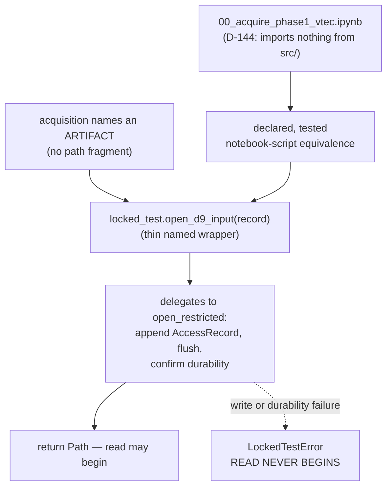

# Business Logic Model — `acquisition`

**Unit** `acquisition` (Bolt 3) · **Kind** `library` · **Depends on** `foundation`,
`governance-guards`

> **Re-established a sixth time 2026-08-24**, on a **new stage attempt** — Inception closed
> and Construction opened at 2026-08-24T11:46:26Z, resetting the receipt floor for every
> unit. **No content of this unit changed.** Both `foundation` passes of that day (the
> amendment pass and the sites 9–11 addendum, in
> `governance/CHANGE_RECORD_2026-08-24_foundation_amendments.md`) were checked against this
> unit and touch nothing it reads: `DeterminismRecord` is not among the
> `component-methods.md` contracts consumed here, no `release.py` signature was amended,
> the amended `services.md` § Run record and registry and `unit-of-work.md` § 1 are not the
> sections read here, and Amendment A was declined so **no count moved**. Its
> `governance-guards` upstream — **R-25** through **R-28** — re-confirmed the same day with
> no rule changed. **The READY verdict in § Review belongs to the previous attempt.**

> **Re-established a fifth time 2026-08-23**, after a redo aimed at four stale
> cross-references in `target-standardization`'s question file. **No content of this unit
> changed.**

> **Re-established 2026-08-23 after a redo jump taken to correct this unit.** The jump
> cleared the receipt floor; the TA-08 primary/supporting row was corrected under that
> cleared receipt at the project decision owner's explicit direction, with both superseded
> readings recorded in place; the summary was re-confirmed; a fresh adversarial pass
> reviews the corrected text. The jump reset the whole stage rather than this unit alone.
>
> **Re-established a second time 2026-08-23** after a further stage-wide redo aimed at
> `external-products`. **No content of these artifacts changed on that occasion**; the
> correction applied then was to this unit's **question file**, whose recorded receipt had
> previously been locked — it still carried the false *"largest untested share in the plan"*
> superlative these artifacts had already corrected. Both occurrences are now fixed there
> too, with the superseded text preserved.
>
> **Re-established a third time 2026-08-23** after a redo aimed at a misread depth policy in
> `component-methods.md`. **No content of this unit changed**; that re-reading **confirms**
> all three of its owed amendments — the named accessors are new symbols in a boundary block
> that exists and omits them, and both contract modifications touch existing boundary
> contracts, `scripts/` to `src/data` being genuinely cross-package.
>
> **A fourth re-establishment** followed a sweep of two sibling question files; **no content
> of this unit changed.**

The workflows this unit implements: retrieving the D-144-approved prepared VTEC
product and the three driver series, recording full provenance for every retrieved
file, hashing one manifest entry per provider file, storing gaps as explicit `NaN`,
routing every restricted-root access through the chokepoint, and closing the ICTP
rejected-source audit.

**This unit applies no scientific transformation at retrieval.** It fetches, records,
hashes and refuses. Every scientific constant it consumes is governed elsewhere.

**BLK-07 is an exit condition on this stage.** W-2 authors its **mechanism** limb.
The **authorization** limb — which units may reach the locked month, and when — is the
project decision owner's, and nothing here grants, implies or substitutes for it.
**No acquisition run may touch calendar 2022-12 while BLK-07 stands.**

## Sources

- `../../../inception/units-generation/unit-of-work.md` § 3 — `Owns`, the boundary, the 15 requirements, and BLK-07's register entry.
- `../../../inception/units-generation/unit-of-work-story-map.md` — Tables 1 and 2 plus § Per-unit coverage summary; both derivation paths agree on 15 requirements and **7** without an acceptance row.
- `../../../inception/requirements-analysis/requirements.md` — REQ-ENG-13; FR-P1-00-1, -2; FR-P1-01-1…-9, -11; REQ-NFR-A1, REQ-NFR-A2; FR-P1-04-11.
- `../../../inception/application-design/component-methods.md` — `src/data/locked_test.py`, `src/data/release.py`, and the §10 credential rule.
- `../../../inception/application-design/services.md` — § The nine stage scripts (`00_acquire_prepared_vtec.py`, phase 1 only); § Stage entry contract; § Execution platforms.
- `../../../inception/application-design/component-dependency.md` § Shared resources.
- `../governance-guards/functional-design/business-rules.md` — R-25, R-26, R-27, R-28. This unit is the first consumer of all four.
- `../foundation/functional-design/business-logic-model.md` — W-1's stage entry contract and credential resolution.
- `evidence/DECISIONS.md` — D-5, **D-6**, D-9, D-10.1/.2/.3, D-15, D-18, D-21, D-22, D-23, **D-25, D-26**, D-3/D-144; plus **D-143** in the **Vision register** (the ICTP rejection — terminal finding N1). *(List completed 2026-08-25, findings N6/F8.)*
- Workspace inspection, 2026-08-23: `tests/test_acquisition_window.py`, `scripts/audit_ec1_drivers.py`, `scripts/merge_coverage_year.py`.
- `functional-design-questions.md` (**Q1 through Q9**), `domain-entities.md`, `business-rules.md`.

---

## W-1 — Retrieving the approved prepared VTEC product

```
INPUT   config: ConfigSnapshot (configs/data.yaml), phase: int
OUTPUT  provider files, request_manifest.json, sha256_manifest.json
RAISES  AcquisitionError; PhaseBoundaryError (via the stage entry contract)
```

1. Enter through `foundation`'s six-step stage entry contract. **Step 4 is
   `governance-guards.assert_phase_boundary`** — `00_acquire_prepared_vtec.py` is
   phase **1 only** and does not skip it.
2. Resolve the frozen experiment, kindat and parameter set from `configs/data.yaml`.
   D-144 fixes them; this unit does not choose them.
3. Retrieve. **Apply no scientific transformation at retrieval** (FR-P1-01-1) — the
   retrieved values are stored as the provider returned them.
4. Record provenance per file (W-3), hash per file (W-4), account for gaps (W-7).
5. Write `request_manifest.json` and `sha256_manifest.json`.

**Why no transformation at retrieval.** FR-P1-01-1's acceptance is *"a diff of
retrieved against stored values shows no transformation."* A transformation applied at
retrieval is unrecoverable — the provider's bytes are gone and nothing downstream can
tell what was changed.

**Two of D-144's four attached freezes remain open** (`requirements.md` § Known defects
row 5). This design builds to D-144 as approved and does not resolve them.

## W-2 — Reaching a restricted artifact: BLK-07's mechanism

```
INPUT   artifact name (not a path), record: AccessRecord
OUTPUT  Path   (only after the access row is durable)
RAISES  LockedTestError
```

**Mechanism (Q1 = D).** `governance-guards`' `locked_test.py` exposes **named-artifact
accessors** — `open_d9_input(record)` for `audit_evidence_2022-FULL/`, and a
restricted **writer** for re-acquired December bytes (W-2a). `acquisition` calls them
**by name** and holds no path fragment at all.

**The accessors COMPOSE `open_restricted`; they do not reimplement it.** Each is a thin
named wrapper that resolves its artifact name to a path under `RESTRICTED_ROOT` and
**delegates to the approved `open_restricted`**, which owns the append, the flush, the
durability confirmation and the raise. Two consequences, both load-bearing:

1. **BLK-07's literal wording is satisfied.** The register requires routing *"through
   `governance-guards.open_restricted`"* — by name. Composition routes through it; a
   parallel implementation with identical behaviour would not, however equivalent it
   looked.
2. **There stays exactly ONE log-then-proceed code path**, not three behaviourally
   identical ones. "One path in" is a claim about code paths, and three wrappers each
   with their own write-flush-return would make it false while reading as true.

> **Added 2026-08-23 after an adversarial pass**, which found that neither the prose nor
> the diagram said whether the accessors composed `open_restricted` or duplicated it —
> leaving the register's by-name requirement unsettled and "one path in" ambiguous
> between one code path and several.



Text fallback: acquisition names an artifact rather than a path; the accessor in
`locked_test.py` owns the join and delegates to the approved `open_restricted`, which
writes and flushes the access record, and only then returns the path. A write or durability failure raises and the read never begins. The
D-144 notebook, which imports nothing from `src/`, reaches the same accessor through
the declared and tested notebook–script equivalence.

**Why a named accessor rather than a direct `open_restricted` call.**
`governance-guards` **R-28** asserts by static check that **no module outside
`locked_test.py` contains the restricted-root literal.** A named accessor satisfies
that **by construction** rather than by care: there is no string in `acquisition` for
the check to find, and adding a new restricted artifact becomes a visible change in
`governance-guards` rather than a new literal in a consumer.

**Why the notebook limb is not optional.** D-144 approved
`notebooks/00_acquire_phase1_vtec.ipynb` as a **self-contained** interface that
**imports nothing from `src/`** — so it cannot import `locked_test.py`. Without this
limb the one file exempt from the import rules, and the file that actually performs
acquisition, would have **no sanctioned route** to a restricted artifact: it would
duplicate the path or read unlogged, which is precisely the breach BLK-07 exists to
prevent, arriving through the one exempt caller. REQ-ENG-13 already mandates a
notebook–script equivalence test, so the access step rides a required mechanism rather
than a new one — and W-8's **declared equivalence scope** is where that coverage is
recorded.

> ## ⚠ THIS IS THE MECHANISM LIMB ONLY
>
> BLK-07's `Approval authority` row assigns **the contract** to `functional-design`
> (3.1). It assigns nothing else. **Which units may reach the locked month, and when,
> is the project decision owner's decision**, and this workflow neither grants it nor
> stands in for it. `governance-guards` R-28 states the same split from the other
> side: the static check enforces *how many* paths exist, never *who* may use one.
>
> **No acquisition run may touch calendar 2022-12 while BLK-07 stands.**

## W-2a — Writing under the restricted root

A **write** is not the same act as a read, and Q2 = C gives it its own entry point and
its own ordering contract.

```
INPUT   artifact name, payload, record: AccessRecord (purpose = acquisition_write)
OUTPUT  Path written
RAISES  LockedTestError — log write or durability failure, before any byte is written
```

**Ordering: log-before-WRITE.** `open_restricted`'s approved contract is written
around *"before the read"*, and borrowing it for a write would leave the worse failure
unspecified: **a partially written December artifact with no access row** is worse than
a blocked read, because it creates December bytes nobody recorded creating.

**`AccessRecord` needs values it does not have.** The approved enum is
`"coverage_audit" | "regime_audit" | "locked_evaluation"` and `authorization` is typed
as *"the G-05 signature reference, or the audit authority"*. **None fits an acquisition
read, and none fits a write at all.** Q2 = C extends the enum with `acquisition_read`
and `acquisition_write` and widens `authorization` to name a D-number.

> **This is an amendment owed to an approved stage-2.6 contract, stated not applied.**
> `component-methods.md`'s `src/data/locked_test.py` block is an approved artifact;
> this stage records the requirement and edits neither it nor the file. A change record
> is the route. **Recording a knowingly wrong `purpose` value instead was rejected:**
> the access log's whole value is that a G-05 reviewer can read its rows as meaning
> what they say, and a false `coverage_audit` row describes an audit that never
> happened.

**Raised for `governance-guards`, not built here:** an enum-membership test pinning the
declared values exactly, so a future value cannot be added silently. That enum lives in
`governance-guards`' contract; pinning a sibling unit's enum from this unit would
invert ownership.

## W-3 — Recording provenance per retrieved file

```
INPUT   provider response metadata, prior recorded suffix (if any)
OUTPUT  a ProviderFileRecord appended to request_manifest.json
```

Five fields per file (FR-P1-01-2): provider, permanent citation, **full provider
filename including its version suffix**, retrieval date, SHA-256.

**Version-suffix mismatch (Q3 = C), a three-step behaviour:**

1. **At retrieval — non-fatal.** Provider reissue is a normal event in this dataset;
   `g.002` versus `g.003` is already observed. Halting acquisition on a normal event is
   how a guard gets worked around.
2. **Record it as a machine-readable field** on the manifest — never console text.
   This is the completeness-shortfall tier `team.md` § Code Style fixes.
3. **`write_release` refuses** a release carrying an unresolved mismatch. Retrieving a
   reissued file is fine; **releasing it as though it were the recorded one is not**,
   and a release is what a later reader cites.

**Why the refusal sits at release rather than at retrieval.** It puts the stop where
the consequence is. "Surfaced, never silently accepted" (FR-P1-01-2) then means a
named gate reads the field, rather than the field existing in a manifest nobody is
required to read.

> **Noted for stage 3.2, not changed here:** FR-P1-04-11 enumerates §13.3's fourteen
> fields and **the mismatch field is not among them**, so the release manifest's input
> contract does not currently carry what this refusal reads.

**A per-file D-number was considered and declined.** It is right in principle — every
other governed disagreement in this project resolves to a decision record — but a
twelve-month re-acquisition would generate a decision per file, and a ritual that heavy
gets batched, which defeats it.

## W-4 — Hashing, and what the twelve pre-TC-06 months mean

```
INPUT   retrieved provider files, derived artifacts
OUTPUT  sha256_manifest.json — one entry per provider file PLUS one per derived artifact
```

FR-P1-01-4's acceptance arithmetic: *"each month's manifest hash count equals its
provider-file count plus its derived-artifact count."*

**What the workspace actually holds, read rather than assumed.** Every existing
`sha256_manifest.json` hashes exactly **four derived files** and never the contents of
`raw_isprint_cache/` — and that cache holds isprint **text extractions**, not provider
`.hdf5` bytes. **No provider byte stream exists anywhere in the workspace.** Three of
the twelve months — 2022-04, 2022-07 and 2022-12 — have no `raw_isprint_cache/` at all.
So the arithmetic evaluates to zero on the provider side for every existing month.

**Contract (Q5 = C):**

| Scope | Behaviour |
|---|---|
| Newly acquired months | One manifest entry per provider file plus one per derived artifact; the arithmetic holds |
| The twelve pre-TC-06 months | **Re-verified under the new suite, not re-acquired** (`team.md`), and each manifest carries an explicit **`provenance_class = derived_only`** field |
| Re-verification of any month | Records the **producing interpreter**, and marks an out-of-envelope artifact as such |

**Why `provenance_class` is a field rather than a document.** Without it the manifest
format means two different things depending on when a month was acquired, with nothing
in the artifact saying which. A downstream consumer — G-P1A, a release, a freeze gate —
can then refuse a derived-only month where full provenance is required, instead of
discovering the gap by reading history.

**Why the producing interpreter is recorded.** `evidence/experiment_registry.md`
records the 2026-08-16 corrected extracts as produced under **Python 3.14, local** —
outside the governed 3.11 pin. Without this field a passing hash on those files reads
as evidence the envelope held. It did not.

**The freeze-gate refusal is NOT written here.** `team.md`'s caveat — FULL must not be
relied on at a freeze gate — moved when **D-18 (2026-08-21) re-merged FULL**,
discharging the **superseded-hash** limb; what remains open is the **provenance** limb.
**FR-P1-01-11 owns that distinction**, and a second, coarser rule here would create two
rules about one fact.

## W-5 — Identity-field agreement at release

```
INPUT   manifest, files, out_dir, identity_fields: Sequence[str]   (declared by the caller)
OUTPUT  release path
RAISES  ReleaseError — fields disagree across source manifests, or identity_fields is empty
```

FR-P1-01-3 requires **two** checks, and states why: *"a single string test was
satisfiable by omission."*

1. **This unit's:** every `request_manifest.json` carries a **non-empty**
   `madrigalWeb_version`, and an **absent key fails exactly as `"unknown"` fails.**
2. **`foundation`'s, parameterised (Q4 = C):** a derived release **verifies** that its
   identity fields agree across every source manifest rather than asserting they do.

**Why the enforcement lives in `write_release`.** Guarding the artifact at the moment it
is created is the only placement no caller can route around. **Why the field set is a
caller-supplied parameter**: the domain knowledge — which eight fields are identity
fields, and that they come from per-month manifests — belongs to the caller that has
it, not to a shared API every unit depends on. **An empty field set is refused**, so a
caller cannot satisfy the check by passing nothing.

> **An amendment owed to an approved contract, stated not applied.**
> `src/data/release.py`'s `write_release` signature is stage 2.6's; this stage records
> the parameter requirement and does not edit `component-methods.md`.

**The live failure this guards is real and is in the workspace today.**
`evidence/locked_test_restricted/audit_evidence_2022-FULL/request_manifest.json` has
**no `madrigalWeb_version` key**, because `merge_coverage_year.py` copies eight
identity fields and drops that one.

> **Testing against that real artifact is DEFERRED, and attached to `RES-04`.** The
> FULL manifest sits under the restricted root, so reading it is a logged December
> access owing W-2's contract. Building that test now would either need authorization
> this stage cannot give or would read the root unlogged — the breach BLK-07 exists to
> prevent. It becomes available once W-2's contract exists, and it is the same shape as
> `RES-04`'s deferred rerun rather than a new obligation.

## W-6 — Driver acquisition and release-grade integrity

Four series, frozen by contract (FR-P1-01-6): **Kp/ap3 and Hp60/ap60 from GFZ**,
**hourly Dst from Kyoto WDC at a single recorded release grade for all of 2022**,
**observed (not 1-AU-adjusted) F10.7 from Canada's Solar Radio Monitoring Program**.
**SSN is absent**, and a `grep` confirms it.

Each series carries **all nine of TE §5.1's inventory fields** — provider, role,
filename or product identifier, coverage, retrieval date, checksum, version or release
status, licence and access notes, **and the configuration that consumes it**. A series
carrying fewer than nine fails.

**Release-grade integrity (REQ-NFR-A1).** One recorded grade per series for calendar
2022; **grades are never mixed within a series**; **no value is backfilled from a
future final or definitive archive.** NFR-LEAK-01 governs *timing* only — a series can
satisfy its declared lag while being built from reanalysed values, which is invisible
to every existing check and fatal on discovery.

**Two citation obligations are discharged before G-P1A rather than left uncollected**:
the **Kyoto non-commercial-use notice recorded verbatim** (D-6, EC1-R-1) and the
**CEDAR rules-of-the-road and acknowledgment** attached to `madrigalWeb`. **A notice
recorded by reference rather than verbatim fails.**

**The F10.7 window from 2022-03-18.** The audit found **no missing calendar day**: at
least one observation on 365 of 365. The three selection choices are frozen — daily
**median** (D-21), duplicate UT records take the **mean** with a quality-control flag
and provider-defined correction semantics taking precedence (D-22), and the four
high-spread days flagged and retained with the median as representative (D-23). **No
imputation, substitution or reconstruction occurs until the measured gap is recorded and
governed** (TC-20). **D-21's availability constraint, as SUPPLEMENTED BY D-25, binds: `median(D)`
becomes available no earlier than 00:00 UTC on day D+1 — never same-day** *(corrected 2026-08-25,
terminal finding N2; superseded: D-21's observation-completion wording, under which the value
could become available at 22–23 UT on day D once all observations required to compute it were
available.

`scripts/audit_ec1_drivers.py` migrates onto the §12 structure here.
**`audit_ec1_drivers.py:184` returns `0` regardless of missing months** — a known gap
against the two-tier posture, fixed at migration.

## W-7 — Gaps as NaN, and the conservation invariant

```
INPUT   retrieved series or binned product
OUTPUT  artifact with gaps as explicit NaN, plus a gap accounting on the manifest
```

D-5, extended to driver series by D-10.2: **gaps are stored as explicit `NaN` at
acquisition time; no interpolation, smoothing or fill occurs at acquisition.**

**Three limbs (Q6 = C), because one is not enough:**

| Limb | What it catches | What it misses |
|---|---|---|
| Injected-gap round trip | The realistic regression — someone adds a `fillna` for convenience | A fill on a branch the fixture does not exercise |
| Static scan for fill-class calls in this unit's modules | Branches a fixture misses | An alias, or a vectorised expression that fills without naming a fill function |
| **NaN-count conservation**: gaps counted at retrieval **equal** gaps in the written artifact | **Any** fill, on any branch, named or not — a filled gap changes the count | Nothing in this class |

**Why the conservation limb carries the rule.** It is a law rather than a spot check,
and it produces a **machine-readable manifest field** rather than only a passing test.
That matters here specifically: **FR-P1-01-9 has no §16/§19 acceptance row**, so a
manifest field is evidence that survives the absence of a gate, where a test result
does not.

**A per-day, per-series breakdown was considered and declined.** It is genuinely useful
for TC-20's measured-gap obligation, but that obligation belongs to FR-P1-01-7's audit
report, which already exists and already carries exact dates. Two records of one fact
is how they drift apart.

## W-8 — The notebook and the script

REQ-ENG-13: `00_acquire_phase1_vtec.ipynb` is a **self-contained acquisition/audit
interface approved under D-144**, so REQ-ENG-12's import-from-`src/` and no-only-copy
rules **do not reach it**. It owes a **different** declaration set — **six items, not
four**: its own version, year and stations, source URLs, retrieval timestamp,
destination paths, and resulting hashes.

**Its four prohibitions hold**: it may not calculate TEC/VTEC from observations, map
`los` data, create model features, or train a model. **Each prohibition has a check
that fails when the prohibited operation is introduced** — a negative control per rule,
per this project's affirmed methodology.

**Equivalence (Q7 = D).** Both are run against a **recorded-response fixture** — never
the live provider — and the produced `request_manifest.json`, `sha256_manifest.json`
and file hashes are asserted identical. A **declared equivalence scope** names what must
match and what need not:

| Must match | Need not match |
|---|---|
| `request_manifest.json` contents | Display and progress output |
| `sha256_manifest.json` contents | Cell structure |
| File hashes | Ordering of non-semantic output |
| NaN handling and the gap accounting (W-7) | — |
| Refusal paths — missing input, Internet-access failure, G-P1A refusal | — |
| **The restricted-artifact access step (W-2)** | — |

**Why the scope is part of the answer.** Without it, "behaviourally equivalent" is
renegotiated every time the test fails, which is how such a test ends up relaxed until
it proves nothing. A textual diff — TA-16's literal evidence wording — cannot carry the
requirement: two implementations can be behaviourally identical and textually
different, so a diff either fails constantly or is relaxed.

**Extracting the shared logic to a generated notebook was declined.** It would remove
the drift rather than detect it, which is stronger — but D-144 approved a
**self-contained** notebook, and whether a generated one still is is the owner's
reading, not a design choice.

**"Run all" either succeeds from declared inputs or stops with a clear missing-artifact
or Internet-access message** rather than proceeding on partial state.

## W-9 — Keeping credentials out of this unit's outputs

```
RAISES  CredentialEgressError — the redaction boundary is handed an unredacted
        credential-bearing value on any write path (integrity tier: run terminates,
        `aborted` row written via the IntegrityError catch)
```
*(Signature block added 2026-08-25 on adversarial finding F7: this workflow's failure was stated
in prose with no `RAISES`, leaving `CredentialEgressError` absent from every workflow signature.
The same finding applies to W-3/W-4/W-7, whose failures are `AcquisitionError`-tier records or
refusals already named in their bodies — the exception this unit's redaction boundary raises is
the one that had no signature anywhere.)*

Credentials reach the provider client **directly from the environment via
`foundation`'s resolution** — never through a config file, log, registry note or
notebook (§10, NFR-SEC-01). That is settled upstream. **The live risk here is egress**,
because this unit writes manifests, logs a run record, and runs inside a notebook whose
outputs are saved.

**Two named carriers, because they are the realistic ones**: a **signed request URL**
and an **auth header**. An acquisition client naturally has both in hand, and both are
things a manifest or a log would carry without anyone deciding to put them there.

**Mechanism (Q8 = D), two limbs:**

1. **One declared redaction serializer.** Every value this unit writes to a manifest,
   log or notebook output passes through it, and it **refuses unredacted
   credential-shaped values**. One checkable chokepoint instead of a rule repeated at
   every write site — the same one-path shape as `governance-guards` R-28 — and testable
   directly: feed it a token-shaped value and assert refusal. The definition of
   "credential-shaped" is heuristic, and that is accepted rather than hidden.
2. **Notebook outputs cleared as a precondition of commit.** This is the one egress a
   serializer inside the process cannot reach: a notebook's **saved output cells** are
   committed artifacts, and they are exactly where §10's "never in a notebook" would be
   breached in practice. `notebooks/madrigal_phase1_coverage_audit.ipynb` exists in the
   workspace today. `team.md` § Way of Working already commits this project to a
   pre-commit hook once git exists, so the mechanism has a home.

**Why not rely on TA-22's scan alone.** It covers tree, history, configs, logs and
artifacts — but it is detection **after** the artifact exists, and it is owned by
`foundation`. This unit would be relying on a sibling's gate to catch its own leak.

## W-10 — Closing the ICTP rejected-source audit

**FR-P1-00-1.** This workflow **produces** the ICTP source-failure evidence as an immutable,
machine-readable artifact set: `source_status = REJECTED_COVERAGE`, coverage recorded as
**ARUC 27/365, BSHM 35/365, NICO 0/365**, decision reference stored. **It does not exist yet.**

> *(Corrected 2026-08-25 on adversarial finding F1 of the post-reset pass, which was Critical.
> **Superseded wording, preserved:** "The evidence set exists, its hashes verify, and the status
> field is machine-readable rather than prose." Five negative checks refuted it: no `ictp` hit
> anywhere under `evidence/` except `DECISIONS.md`; `REJECTED_COVERAGE` appears in design and
> requirements documents and in **zero** data artifacts; no `*ictp*` file and no `.zip` exists
> in the workspace though TA-31's evidence is a ZIP; `artifacts/` does not exist. The rejection
> survives today **only as prose in D-3** — exactly the form R-43's own negative control fails.
> As first written, this workflow converted FR-P1-00-1's acceptance **criterion** into a present
> fact, so an owned requirement would have shipped unbuilt behind an already-passing row, and the
> sentence contradicted W-11 eleven lines later. **What W-10 specifies is the artifact set Bolt 3
> must CREATE** — from D-3's recorded coverage figures and, **if it can be located, the ICTP
> notebook TE §14 directs be archived** *(scoped 2026-08-25 on terminal finding N5: no `*ictp*`
> file, no `.zip`, and no `artifacts/` exists anywhere in the workspace, so the notebook input
> first named here as available is itself absent — an **OPEN item**: recover the notebook from
> outside the workspace, or build the evidence set from D-3's figures alone with the absence
> recorded in it as a machine-readable field)* —
> not a set it verifies. **The decision reference stored on the evidence set is D-143** — the
> **Vision decision-register** number for the ICTP rejection, cited by TE §7.0A P1-00 (*"store
> D-143"*), TE §19 TA-31's evidence column (*"D-143 review record"*), and FR-P1-00-1 itself.
> *(Corrected twice: the iteration-1 fix replaced D-143 with "D-3/D-144" on the false ground that
> D-143 "matches no entry" — **two decision registers coexist**: `evidence/DECISIONS.md` runs
> D-1…D-27 and cites D-143 twice inside D-3, while the Vision register holds D-143 itself.
> D-3/D-144 is the decision that **adopts Madrigal**, the wrong reference for the artifact
> documenting the **rejected** source. Restored 2026-08-25 on adversarial finding N1 of the
> terminal pass, which was Critical and was introduced by that very fix.)*

**FR-P1-00-2.** **No ICTP artifact enters target construction or training.** An
import/data-lineage check shows no ICTP artifact reachable from the target or feature
path — a reachability assertion, not a filename check, for the same reason R-31 gives
below.

## W-11 — What Bolt 3 builds, and what it must not

**Permitted before G-09**: module structure, interfaces, placeholder CLI definitions,
configuration wiring, safe fail-fast behaviour, and this unit's `tests/` scaffolding.

**Barred until G-09 is signed for the affected component**: implementing any component
whose P0 decision is unresolved; filling any `TBD — freeze gate` field; executing any
governed run; generating code for a unit carrying an open blocker on that scope.

> **`scripts/00_acquire_prepared_vtec.py` DOES NOT EXIST**, and neither does `src/` nor
> `configs/`. **BLK-07 is open**, and it is an exit condition on this stage:
> `acquisition` may enter functional design and may not exit it without the approved
> routing contract.
>
> **No December access of any kind occurs in this Bolt.** The routing is designed here;
> it is not exercised against the locked month. **`RES-04`'s documented rerun of the
> three existing test modules is not started and is deliberately not attempted** — all
> three reach the restricted root by recursive traversal, and running them before the
> chokepoint exists would manufacture the breach rather than document it.

---

## Requirement-to-workflow map

Acceptance derived from story-map Table 1; owners from Table 2's `primary` cell. Both
paths cross-checked and in agreement.

| Requirement | Workflow | Tested by (Table 1) | Row primary owner |
|---|---|---|---|
| REQ-ENG-13 | W-8 | TA-16 | `regimes-diagnostics-reporting` |
| FR-P1-00-1 | W-10 | TA-31 — **no Table 2 owner row exists** *(corrected 2026-08-25, finding F4: Table 1 alone links this requirement to TA-31; Table 2's IDs skip TA-29–31, and the coverage summary gives this unit TA-15/16/22/25 only. TE §19 records TA-31 as "Pass for audit mechanics; source viability failed")* | — *(superseded: "`acquisition` supporting")* |
| FR-P1-00-2 | W-10 | TA-25 | `inventory-and-registry` |
| FR-P1-01-1 | W-1 | TA-32 | **`acquisition`** |
| FR-P1-01-2 | W-3 | TA-15 | `foundation` |
| FR-P1-01-3 | W-5 | TA-03, TA-15 | `foundation` |
| FR-P1-01-4 | W-4 | TA-04, TA-15 | `foundation` |
| **FR-P1-01-5** | W-1, and `tests/test_acquisition_window.py` | ⚠ **NO ACCEPTANCE ROW** — but the test exists and is **green** | — |
| FR-P1-01-6 | W-6 | TA-08 | `features-and-splits` (`external-products` supporting) |
| **FR-P1-01-7** | W-6 | ⚠ **NO ACCEPTANCE ROW** | — |
<!-- TA-08 row corrected twice, 2026-08-23. First issue: primary/supporting reversed
     (`external-products` named primary). Iteration-1 fix corrected the primary and
     introduced the opposite error, adding "this unit and" to the supporting list — a
     claim story-map Table 2 does not make and which contradicts this artifact's own
     coverage-summary line below. This unit supports TA-15, TA-16, TA-22 and TA-25;
     TA-08's supporting unit is `external-products` alone. -->

| **FR-P1-01-8** | W-6 | ⚠ **NO ACCEPTANCE ROW** | — |
| **FR-P1-01-9** | W-7 | ⚠ **NO ACCEPTANCE ROW** | — |
| **FR-P1-01-11** | W-4 | ⚠ **NO ACCEPTANCE ROW** | — |
| **REQ-NFR-A1** | W-6 | ⚠ **NO ACCEPTANCE ROW** | — |
| **REQ-NFR-A2** | W-1, and `tests/test_acquisition_window.py` | ⚠ **NO ACCEPTANCE ROW** — but the test exists and is **green** | — |

**15 requirements, 7 without an acceptance row.** **Corrected 2026-08-23 after an
adversarial pass:** the first issue read *"the largest untested share of any unit in the
plan"*, which the cited story-map § Per-unit coverage summary contradicts. Derived from
that table: **`acquisition` 7/15, `models-and-baselines` 7/9,
`regimes-diagnostics-reporting` 7/11** — a **three-way tie on the raw count of 7**, and by
*share* `acquisition` is the **smallest** of the three at 46.7%. A superlative built on a
correct numeral is exactly the failure `project.md` § Corrections records. This unit **owns** TA-32 and **supports** TA-15, TA-16, TA-22 and
TA-25.

### The seven, in two named classes (Q9 = D)

The two classes are stated wherever the count **7** appears, so a later sweep keyed to
the numeral does not miss the qualitative claim.

**Class 1 — tested without a row (2).** Both discharge onto
`tests/test_acquisition_window.py`, which **exists and is green**. They lack a row, not
a test; closing them needs a Vision §15.2 change record and nothing else.

| ID | Evidence that would close it |
|---|---|
| FR-P1-01-5 | An approved §19 row asserting membership derives from record timestamps, with the existing green test cited as its result |
| REQ-NFR-A2 | The same row, or a sibling of it, scoped to fold and partition membership |

**Class 2 — untested and unrowed (5).** Each states **what evidence would close it**.
No §19 criterion is drafted: a drafted criterion in a functional-design artifact is
indistinguishable, months later, from an approved one, and §19 rows are owned by stage
3.2 and change control.

| ID | Evidence that would close it |
|---|---|
| FR-P1-01-7 | The audit report with exact dates (exists), **plus** a passing check that `features.yaml` carries D-21, D-22 and D-23's three selection choices and that the zero-TBD preflight fails when any is unset |
| FR-P1-01-8 | A passing reanalysed-value check per driver, plus each driver manifest carrying a release-status field |
| FR-P1-01-9 | A passing injected-gap round trip **and** a NaN-count conservation assertion over a fixture month (W-7) |
| FR-P1-01-11 | A passing assertion that a derived release's `source_runs` digests equal current per-month manifest hashes, **or** that a D-number re-pointing provenance exists and is cited at G-P1A — D-18 satisfies the first branch today |
| REQ-NFR-A1 | A passing mixed-grade injection test per series, and a single recorded grade for calendar 2022 |

## Assumptions & Open Questions

- **[assumption]** Rule IDs continue the single sequence — `foundation` R-01…R-17, `governance-guards` R-18…R-29 — so this unit opens at **R-30**. If per-unit numbering was intended, say so at the gate.
- **[assumption]** `tests/test_acquisition_window.py` is this unit's, per `unit-of-work.md` § 3 `Owns`. It exists and is green; this design builds around it rather than proposing to rewrite it.
- **[assumption]** `frontend-components.md` is not produced — `kind: library`, and the stage maps that artifact to `[ui]` only.
- **[assumption]** The re-acquisition itself is future work outside this stage's scope; its December limb is barred while BLK-07 stands.
- **Open — BLK-07's authorization limb.** W-2 authors the mechanism only. The owner decides which units may reach the locked month, and when.
- **Open — THREE amendments owed to approved stage-2.6 contracts, stated not applied.** All need change records before code-generation treats any of them as sanctioned. **Corrected 2026-08-23 after an adversarial pass**, which found the first issue listed only two and silently omitted the third — the one that *is* BLK-07's central mechanism:
  1. **`open_d9_input`, and any other named accessor**, added to `component-methods.md`'s `src/data/locked_test.py`. The approved block defines only `RESTRICTED_ROOT`, `AccessRecord`, `open_restricted` and `assert_no_december_outside_restricted` — **there is no `open_d9_input` in it.** Since BLK-07 is an exit condition on this stage and its approval authority is `functional-design` (3.1) *for the contract*, an unflagged central function would read as approved when it is not.
  2. The **`AccessRecord.purpose` extension** and the **restricted-write function** (W-2a), same file.
  3. The **`identity_fields` parameter** on `src/data/release.py`'s `write_release` (W-5).
- **Open — noted for stage 3.2:** FR-P1-04-11's fourteen fields do not carry W-3's suffix-mismatch field, which W-3's release refusal reads.
- **Open — raised for `governance-guards`:** an enum-membership test pinning `AccessRecord.purpose` exactly. Not built here, because that enum is a sibling unit's.
- **Open — `RES-04`.** Not started, deliberately not attempted. W-5's real-artifact test is the same shape and defers to it.
- **Open — `RES-01`**, permitted-read access logging is NOT TESTED, owned by stage 3.2. This unit is a consumer of the untested contract.
- **Open — FULL's provenance limb.** Unverifiable in principle: no provider byte stream exists, and three of twelve months have no `raw_isprint_cache/`. D-18 discharged only the superseded-hash limb. Owned by FR-P1-01-11.
- **Open — two of D-144's four attached freezes.** This design builds to D-144 as approved and resolves neither.
- **Open — the F10.7 measured gap** must be recorded and governed before any imputation, substitution or reconstruction.
- **Open — the Kyoto and CEDAR notices** must be recorded verbatim, not by reference, before G-P1A.
- **G-09 is not signed.** No workflow here authorises creating any module.
- **None** of the above adopts a reading on a supervisor-owned value, and none decides a scientific constant.

## Review

**Verdict:** READY
**Reviewer:** aidlc-architecture-reviewer-agent
**Date:** 2026-08-22T21:13:12Z
**Iteration:** 2 (final)

### Disposition of iteration-1 findings

| # | Original finding | Disposition | How verified |
|---|---|---|---|
| 1 (Critical) | `open_d9_input` was a new symbol absent from the approved `locked_test.py` contract and, unlike its two siblings, never flagged for change control. | **RESOLVED.** All three artifacts now state "THREE amendments owed" and name the accessors (`open_d9_input` and the restricted writer), the `AccessRecord.purpose` extension plus write function, and `write_release`'s `identity_fields` parameter — with `business-rules.md` R-32 and `domain-entities.md` § 9 additionally stating BLK-07's routing contract is **"proposed, not approved"** until a change record clears. | Re-read `component-methods.md`'s `src/data/locked_test.py` block directly: it still defines only `RESTRICTED_ROOT`, `AccessRecord`, `open_restricted`, `assert_no_december_outside_restricted` — no `open_d9_input`. Re-read the Assumptions & Open Questions section of all three artifacts and `business-rules.md` R-32/R-33: all three now list the accessors as amendment (1) of three, consistently. |
| 2 (Major) | Undisclosed whether the accessors compose or duplicate `open_restricted`. | **RESOLVED.** All three artifacts now state the accessors are "thin named wrappers" that "delegate to" `open_restricted`, owning none of the append/flush/durability logic themselves, with the two stated consequences (BLK-07's by-name wording satisfied; exactly one log-then-proceed code path). The `business-logic-model.md` W-2 mermaid diagram and text fallback now show `B --> C` as an explicit delegation step. | Re-read W-2, § 9, and R-32's composition paragraphs and the regenerated diagram/text-fallback; the delegation claim is stated in matching terms in all three artifacts. |
| 3 (Major) | "Largest untested share of any unit in the plan" is false against the cited story-map table. | **RESOLVED** in the three artifacts under review. Replaced with the derived three-way tie on the raw count of 7 (`acquisition` 7/15, `models-and-baselines` 7/9, `regimes-diagnostics-reporting` 7/11) and the correct statement that `acquisition` has the smallest share (46.7%). **`functional-design-questions.md` still carries the stale superlative twice (intro line 13, Q9 line 364), left deliberately unedited** because its confirmation digest is in the audit trail; the disposition states this and defers the correction to the gate. Judged **adequate**: the three design artifacts under review — the ones a developer and a downstream reviewer actually build from — are all corrected and each carries an explicit dated correction note, and the human is told plainly at the gate that the interview transcript still contains the superseded claim. This is not silent; it is a deliberate, disclosed trade-off consistent with `project.md`'s rule against reopening a settled receipt without new grounds. | Independently recomputed all three unit shares from `unit-of-work-story-map.md` § Per-unit coverage summary (`acquisition` 7/15 = 46.7%, `models-and-baselines` 7/9 = 77.8%, `regimes-diagnostics-reporting` 7/11 = 63.6%) — matches the artifacts' corrected numerals exactly. Confirmed by `grep` that `functional-design-questions.md` still contains the literal phrase at both cited locations. |
| 4 (Major) | TA-08's primary/supporting ownership was reversed. | **PARTIALLY RESOLVED, with a new defect substituted — see New Findings below.** The primary owner is now correctly `features-and-splits` in all three artifacts. But the parenthetical was rewritten to `(this unit and external-products supporting)`, which asserts `acquisition` itself is a supporting unit on TA-08 — a claim Table 2 does not make and that each artifact's own coverage-summary line contradicts. | Re-read `unit-of-work-story-map.md` line 191 (TA-08's row: primary `features-and-splits`, supporting `external-products` only) and line 230 (`acquisition`'s own Supporting-on column: `TA-15, TA-16, TA-22, TA-25` — no TA-08). Cross-checked against each artifact's own later summary sentence ("owns TA-32 and supports TA-15, TA-16, TA-22 and TA-25"), which excludes TA-08 and directly contradicts the FR-P1-01-6 row a few lines above it in the same document. |

### New findings (this iteration)

| # | Severity | Location | Finding | Recommendation |
|---|---|---|---|---|
| 1 | Major | `business-logic-model.md` § Requirement-to-workflow map (FR-P1-01-6 row); `domain-entities.md` § Requirement coverage (same row); `business-rules.md` R-40 Acceptance line | The iteration-1 fix for the TA-08 ownership reversal introduced a new, opposite-direction error: all three artifacts now read `features-and-splits` **(this unit and `external-products` supporting)** — asserting `acquisition` is a supporting unit on TA-08. `unit-of-work-story-map.md` Table 2's TA-08 row names only `external-products` as Supporting; `acquisition` is not listed. This is not a stray typo — it directly contradicts each artifact's **own** later summary line ("This unit owns TA-32 and supports TA-15, TA-16, TA-22 and TA-25"), which correctly omits TA-08. The claim is self-contradictory within each document, not merely inconsistent with an external table. | Drop `this unit and` from the parenthetical in all three locations, leaving `features-and-splits` (primary), `external-products` (supporting) — matching Table 2 and matching each artifact's own coverage-summary sentence. |
| 2 | Minor | `domain-entities.md` § 9 Assumptions bullet vs. `business-logic-model.md` / `business-rules.md` R-32/R-33 | The three artifacts do not agree on which of the "three amendments" bucket holds "the restricted writer." `business-logic-model.md` and `business-rules.md` (R-32 item 1 / R-33) consistently group it with the `AccessRecord.purpose` extension as amendment (2). `domain-entities.md`'s § 9 Assumptions bullet instead lists it under amendment (1) ("the named accessors themselves (`open_d9_input` **and the restricted writer**)") and then separately restates "the `AccessRecord.purpose` extension plus a restricted-write function" as item (2) — mentioning the same write function in both buckets. This does not drop any symbol from change control (all three artifacts still flag every new symbol), but the "three, not two" accounting is not identically reconstructable across the three documents, which is exactly the kind of drift the change-control amendment list exists to prevent. | Align `domain-entities.md`'s § 9 bullet to the same three-way split used in `business-logic-model.md` and `business-rules.md`: (1) the two named accessors, read-side only; (2) the `AccessRecord.purpose` extension together with the new write function; (3) `identity_fields`. |

### Failed refutation attempts

- **Re-verified all eight iteration-1 workspace-fact claims independently rather than trusting the prior pass**, per this project's own affirmed practice against carrying an unverified fact forward as established input: the eleven `sha256_manifest.json` four-entry hash counts, `raw_isprint_cache/` absence for 2022-04/2022-07, `merge_coverage_year.py`'s eight-field copy dropping `madrigalWeb_version`, `audit_ec1_drivers.py:184`'s unconditional `return 0`, `AccessRecord`'s three-value enum, `write_release`'s missing `identity_fields`, FR-P1-04-11's fourteen fields excluding `suffix_mismatch`, and BLK-07's quoted required-resolution wording. All eight hold exactly as stated, on direct re-reading of the cited files.
- **Re-derived the 15/7 requirement-and-acceptance-row arithmetic from scratch** against story-map Table 1, independent of the artifact's own list — matches exactly (FR-P1-01-5, -7, -8, -9, -11, REQ-NFR-A1, REQ-NFR-A2 unrowed).
- **Re-derived the three per-unit shares from the coverage-summary table** rather than accepting the artifact's percentages — 46.7% / 77.8% / 63.6% all reproduce exactly; the "smallest share" and "tied on raw count" claims both hold.
- **Attempted to find a fourth amendment hiding in W-2a/W-5** (a symbol touched by the design but omitted from the "three amendments" list) — found none; the `identity_fields` parameter, the `AccessRecord.purpose` enum widening, the write function, and the two named accessors are the complete set of new/changed symbols against the approved `component-methods.md` contracts for `locked_test.py` and `release.py`.
- **Attempted to find the TA-08 defect's twin elsewhere in the requirement tables** (another row where a "this unit" supporting claim isn't backed by Table 2) — checked every other cross-referenced row (TA-03, TA-04, TA-15, TA-16, TA-22, TA-25, TA-31, TA-32) against Table 2 and against each artifact's own Supporting-on summary sentence; all matched. The TA-08 row is an isolated defect, not a pattern.
- **Consistency with `governance-guards` R-25/R-26/R-27/R-28.** Re-read all four rules in `construction/governance-guards/functional-design/business-rules.md` directly (the one permitted sibling read). R-25's durable-before-read ordering, R-26's bounded Dst exclusion, R-27's recursive-walk-with-failure-on-unparseable, and R-28's one-path-in static check are all reflected accurately and without contradiction in `acquisition`'s R-31/R-32/R-40 and W-2/W-6.
- **BLK-07 register entry** (`unit-of-work.md` § Blocker register) re-read in full: "Approval authority: The contract: `functional-design` (3.1)"; "Status: Open... Exit condition on stage 3.1... may enter, may not complete or exit... without the approved routing contract" — the artifacts' framing of BLK-07 as an unresolved exit condition, and of the routing contract as "proposed, not approved" pending the three amendments' change records, is an accurate, not overstated, reading of this register entry.
- **`functional-design-questions.md`'s residual stale superlative** — confirmed present at both cited lines (13, 364) by direct `grep`; confirmed the three artifacts under review do not repeat it and each carries a dated correction note. Judged adequate disposition per the disposition table above, not a silent gap.

### Summary

Three of iteration 1's four findings are cleanly resolved and independently reverified from the workspace rather than taken on faith: the amendment-flagging gap is closed with all three new/changed `locked_test.py`/`release.py` symbols now named and routed to change control, the composition-versus-duplication question is now answered explicitly in prose and diagram, and the false "largest share" superlative is corrected everywhere it matters for a build decision (with the one deliberately unedited historical copy disclosed and justified rather than hidden). The fourth finding's fix, however, reintroduced the same class of defect it was meant to remove: correcting TA-08's primary owner to `features-and-splits` came bundled with a new, uncorroborated claim that `acquisition` itself supports TA-08 — a claim that contradicts both the story-map's Table 2 and each artifact's own coverage-summary sentence a few lines below it. This is exactly the "correction introduces a new defect one level down" pattern this project has been warned about, but it is a narrow, mechanical, single-line defect confined to one cross-reference across three documents, not a structural or scientific-integrity problem, and it does not by itself block a developer from implementing the unit correctly. Combined with one Minor cross-artifact inconsistency in how the "three amendments" are bucketed, this iteration's residual findings (1 Major, 1 Minor) fall within the READY threshold. The verdict is READY, with the TA-08 supporting-unit line named explicitly for a trivial fix before or alongside approval.

---

> **Re-saved 2026-08-24 under the post-redo receipt floor.** The project decision owner
> authorised a redo jump on `functional-design` at 2026-08-24T14:57:07Z so that three
> standing reviewer findings on `models-and-baselines` could be fixed and re-reviewed;
> a redo resets the receipt floor for **every** unit of the stage. **No content of this unit
> changed** — not a question, answer, amendment, rule, entity, workflow, count or scientific
> value. The only artifacts edited after the redo were `models-and-baselines`'s, whose
> three fixes are confined to its own files. That unit returned **READY** on the second pass of
> the restored budget, which is what the redo was authorised for. The two residuals riding that
> verdict — R-96's `PartitionError` mechanism and R-95's field label — are carried to the stage
> gate rather than applied, per the rule that a suggestion riding a READY verdict is gate input.

---

> **Re-saved 2026-08-25 under the receipt recorded after ten stage-wide redo floors** (all taken
> for `foundation`, which closed **READY**; `governance-guards` has since closed **READY** too).
> **Nothing in this unit's workflows changed.** Figures re-derived from `unit-of-work.md` § 3:
> **15** requirements (**7** untested: FR-P1-01-5/-7/-8/-9/-11, REQ-NFR-A1, REQ-NFR-A2), **1**
> acceptance row (TA-32), BLK-07 represented, zero Amendment C contamination. The one edit this
> pass makes is in the sibling artifacts: **`AcquisitionError` and `CredentialEgressError`
> declared `IntegrityError` subclasses**, imported from `src/data/config.py`, discharging the
> cross-unit obligation `foundation`'s R-01 records. **G-09 remains unsigned.**

---

## Review — 2026-08-25 post-reset pass, iteration 1

**Reviewer:** aidlc-architecture-reviewer-agent

**Verdict: NOT-READY**

**Class** adversarial · **Iteration** 1 of 2 · **Date** 2026-08-25

Two confirmed defects would mislead stage 3.5 into building the wrong thing (F1, F3) and a
third has a build limb (F2). Every count claimed by this unit was re-derived programmatically
and every one holds; the defects below are not counting errors but unverified present-tense
claims, an unnamed required field, and a superseded scientific citation. Findings are ranked
by severity, each with the derivation and the triage label the gate needs.

### F1 — Critical, **would mislead 3.5**. W-10 asserts the ICTP evidence set exists and verifies; nothing in the workspace does

**Location** `business-logic-model.md` § W-10, first paragraph.

**Quoted:** *"The evidence set exists, its hashes verify, and the status field is
machine-readable rather than prose."*

**Derived, five independent checks, all negative:**

| Check | Result |
|---|---|
| `grep -ril ictp evidence/` | one hit: `evidence/DECISIONS.md` — no data artifact |
| `grep -rl REJECTED_COVERAGE` (repo) | design, requirements and TE documents only; **zero** data artifacts |
| `find . -iname "*ictp*"` | 0 hits |
| `find . -iname "*.zip"` | 0 hits (TA-31's evidence is *"a valid audit ZIP/manifests/hashes"*) |
| `ls artifacts` | **No such file or directory** — while TE §14 declares the executed `00_ictp_phase1_download_kaggle.ipynb` *"archived under `artifacts/source_audits/`"* |

The only extant record of the ICTP rejection is **prose** in `evidence/DECISIONS.md` D-3
(*"ICTP for comparison (D-143): ARUC 27/365, BSHM 35/365, NICO 0/365 with HTTP 404"*) — the
exact form `business-rules.md` R-43's own negative control declares failing (*"Replace the
machine-readable status with prose → fails"*).

**Why it misleads 3.5.** `requirements.md` FR-P1-00-1 states those three clauses in its
**Criterion** column — an acceptance test, not a fact. W-10 converts them to the present
indicative, and TE §19 records TA-31 as *"Pass for audit mechanics; source viability failed"*,
which reinforces the reading. A developer building Bolt 3 concludes FR-P1-00-1 needs nothing
built, and a requirement this unit's Responsibility line explicitly assigns it (*"close the
ICTP rejected-source audit"*) ships unimplemented with an acceptance row already marked
passed.

**It also contradicts this same file.** W-11 correctly enumerates what does not exist
(*"`scripts/00_acquire_prepared_vtec.py` DOES NOT EXIST, and neither does `src/` nor
`configs/`"*) and omits `artifacts/`, eleven lines after W-10 asserts an artifact under it
verifies.

**Should be** W-10 states FR-P1-00-1's three criteria as **unmet**: the evidence set is not
located in this workspace, `artifacts/source_audits/` does not exist, and the rejection is
prose-only today — or, if the set is held off-repo from the Kaggle run, it names that location
and its hash reference rather than asserting verification. `business-rules.md` R-43's rule
statement is prescriptive and needs no change; only W-10's factual claim does.

### F2 — Major, documentation with a build limb. The F10.7 availability rule cites D-21 and omits D-25 and D-26, both of which supplement it

**Location** `business-rules.md` R-41 (*"Constraint — availability, binding (D-21)"*);
`business-logic-model.md` W-6 (*"D-21's availability constraint binds"*);
`domain-entities.md` § 6.

**Derived:** `grep -c "D-25\|D-26"` over the three artifacts → **0 / 0 / 0**. Each artifact's
`## Sources` enumerates its D-numbers explicitly (D-5, D-9, D-10.1/.2/.3, D-15, D-18, D-21,
D-22, D-23, D-143, D-144) and lists neither.

`evidence/DECISIONS.md` carries two later freezes, both dated **2026-08-22** and both stating
*"supplements **D-21**"*:

- **D-25 — F10.7 conservative availability convention (freeze).** Fixes exactly what R-41
  leaves open: `availability_ts(median(D)) = 00:00 UTC on D+1`; *"`median(D)` is therefore
  never available at any origin on day D"*; carry-forward recorded; trailing 81-day mean over
  daily medians. It also amended TE **EV-12**, TE **§7.0A stage 4** and `components.md` →
  `availability.py` under Vision §15.2 (`CR-2026-08-22-EV-12`).
- **D-26 — F10.7 March–April 2022 provenance: recorded unresolved.** R-41 states D-26's
  substance verbatim in effect (*"asserts neither measured nor reconstructed status… not
  determinable from it"*) **without attribution**, and does not carry D-26's reporting
  obligation.

**The build limb.** R-41's wording — *"must not become available to a forecast before all
observations required to compute it were actually available"* — is D-21's observation-completion
rule, which permits `median(D)` at 22 UT or 23 UT on day *D* (D-25's own measured figures: 22 UT
on 120 days, 23 UT on 245 days of 2022). D-25 forbids that by construction. An implementer who
builds the availability timestamp from R-41 as written implements a rule a freeze gate has
already narrowed, in the one project whose central concern is availability leakage.

**Mitigating, and stated rather than hidden:** the upstream `consumes` contract,
`requirements.md` FR-P1-01-7, carries the identical omission (it cites D-21/D-22/D-23 and
states the availability constraint as *"(D-21)"*), and R-41 correctly routes enforcement to
FR-P1-04-2's availability matrix (WS-11, TA-08), which is another unit's. So this unit faithfully
carried a stale upstream. That is what `project.md` § Way of Working's 2026-08-24 correction
addresses directly — the consuming stage's sweep is the only check between a stale figure and
Construction — so faithfulness to a stale upstream does not discharge it.

**Should be** R-41's availability constraint restated to D-25's frozen convention with D-25
cited; D-26 cited for the provenance finding it already states; both added to all three
`## Sources` lists; and the identical gap in `requirements.md` FR-P1-01-7 raised at the gate as
an upstream item this stage cannot fix.

### F3 — Major, **would mislead 3.5**. `suffix_mismatch` is labelled the "Sixth field" while TE §13.3's actual sixth `source_files` item is named nowhere

**Location** `domain-entities.md` § 1, lines 111 and 129; `business-rules.md` R-34, line 234.

**Quoted, eighteen lines apart in the same section:**
*"**Sixth field, added by this stage (Q3 = C): `suffix_mismatch`.**"* and
*"**`source_files` carries all six of TE §13.3's items, not five** — the earlier five-item list
fixed a truncated count as the bar (`DATA-09`)."*

**Derived.** TE §13.3's `source_files` row, verbatim: *"Provider, permanent experiment/file
citation or request, **location/date**, filename, retrieval date, SHA-256"* — six items, of
which the artifacts' `ProviderFileRecord` table enumerates five (`provider`,
`permanent_citation`, `provider_filename`, `retrieval_date`, `sha256`). `grep -ni location`
over the three artifacts returns **only** the prior review table's "Location" column header:
**`location/date` is named nowhere in this unit's design.**

**Why it misleads 3.5.** The nearest antecedent to *"all six"* is the field just numbered
"Sixth". An implementer builds `ProviderFileRecord` as the five plus `suffix_mismatch`, reads
the six-item constraint as satisfied, and drops §13.3's `location/date` — reproducing `DATA-09`
(whose entire point was that *"the earlier five-item list fixed a truncated count as the bar"*)
one level down, inside the artifact that quotes the correction. The two counts are also
different sets: `requirements.md` FR-P1-01-2 keeps them distinct (*"`request_manifest.json`
carries all five fields per provider file"* / *"`source_files` carries all six of TE §13.3's
items"*), and the artifacts collapse both onto one entity.

**Should be** name `location/date` explicitly; separate the request-manifest per-file record
(FR-P1-01-2's five) from the release manifest's `source_files` six-item projection; and
renumber `suffix_mismatch` as an addition to whichever of the two it belongs to, so no reader
can take it for a §13.3 item.

**Out of this pass's read scope, flagged for the gate:** whether `foundation`'s release
contract enumerates `location/date` could not be checked — only its R-01 and R-10 were in
scope. This finding rests entirely on `acquisition`'s own text.

### F4 — Major, documentation. The FR-P1-00-1 row asserts `acquisition` supports TA-31; no story-map row says so, and the artifacts' own summary excludes it

**Location** `business-logic-model.md` § Requirement-to-workflow map, FR-P1-00-1 row;
`domain-entities.md` § Requirement coverage, same row. Both cells read
*"`acquisition` supporting"* under a column headed **Row primary owner**.

**Derived.** `grep -n TA-31` over `unit-of-work-story-map.md` → **exactly one hit**, Table 1
line 51 (`FR-P1-00-1 | acquisition | TA-31`). **Table 2 has no TA-31 row**: its row IDs, read in
order, run … TA-26, TA-27, TA-28, **TA-32**, TA-33 … so TA-29, TA-30 and TA-31 carry no owner
assignment at all, and no primary or supporting unit for TA-31 is derivable from it. The story
map's own Per-unit coverage summary (line 230) gives `acquisition` Supporting-on =
`TA-15, TA-16, TA-22, TA-25`, which excludes TA-31 — and each artifact repeats that four-row
list in its own summary sentence a few lines below the offending row.

**This is the TA-08 defect's twin**, on the same table, contradicted by the same two sources,
in the same shape iteration 2 graded Major. It also falsifies a claim standing in the prior
`## Review` section, which lists among its failed refutations that it *"checked every other
cross-referenced row (TA-03, TA-04, TA-15, TA-16, TA-22, TA-25, **TA-31**, TA-32) against
Table 2 … all matched"*. TA-31 cannot have matched Table 2; there is no row to match. Recorded
here rather than edited there, per the instruction not to alter a prior review.

**Should be** `— (no Table 2 owner row; TE §19 records TA-31 as "Pass for audit mechanics;
source viability failed")`. Not build-affecting — nothing is built differently — but it inflates
this unit's supporting-row set from four to five in the two tables a §19 or change-control
reader consults.

### F5 — Minor, documentation. The base-class box cites Q1 for a permission Q1 does not give

**Location** `domain-entities.md` § 10 box: *"`AcquisitionError` and `CredentialEgressError`
are unit-local (**Q1 permits per-unit naming**)"*.

**Derived.** `functional-design-questions.md` Question 1 (line 65, `[Answer]: D` line 100)
asks *"How does `acquisition` reach `audit_evidence_2022-FULL/`?"*; its four options are all
restricted-accessor shapes and none mentions exception naming.
`grep -niE "Error|exception|base class"` over the whole question file hits **only** lines
599–617 — the pre-generation confirmation section, which is not a numbered question and grounds
the two exceptions in R-01's *"any future integrity-related exception"* clause, not in Q1. The
parallel box in `business-rules.md` makes **no** Q1 claim, so the same one-box edit is
inconsistent across the two artifacts it was applied to.

**Should be** drop the parenthetical, or cite the 2026-08-25 confirmation receipt that actually
carries it. The substantive declaration itself is correct: `acquisition` depends on `foundation`
(`unit-of-work.md` § 3), R-01 declares the base in `src/data/config.py` and states that the
non-`foundation` exceptions import it from there, so the direction is legal and no cycle is
created.

### F6 — Minor, documentation. The box declares two new subclasses without a declaration site, and without the reciprocal effect on R-01's enumeration

**Derived.** `foundation` R-01 reads *"**All fourteen** project-defined exceptions derive from
`IntegrityError`"* and enumerates fourteen — six raised by `foundation`, eight by other units.
Neither `AcquisitionError` nor `CredentialEgressError` is among them, so today's edit takes the
hierarchy to **sixteen** while its owner's count still says fourteen; and this unit's
amendments-owed list names **three** items, none of them this.

Two limbs, both stopping 3.5 rather than misleading it:

1. **No declaration site.** R-01 states that 3.1's job is *"placing them"*, and `foundation`
   placed its six in `src/data/config.py`. The box names where the **base** is imported from and
   no module to hold the two subclasses. This unit's `Owns` list (`unit-of-work.md` § 3) contains
   no `src/` module, and `component-methods.md` defines none for it (its `src/` blocks are
   `config`, `phase_contract`, `locked_test`, `splits`, `release`, `registry`, `features`,
   `models`, `evaluation`) — so there is no owned module to place them in, and inventing one is a
   TE §12 amendment this stage may not make.
2. **No amendment recorded against R-01's list.** R-01's own history records the earlier
   six→fourteen enumeration gap as *"the one finding in this unit's review history that would
   have made stage 3.5 build the wrong thing"*. Leaving a fourteen→sixteen gap unflagged repeats
   that class one step down.

**No misbuild follows** — R-01's *"any future integrity-related exception"* clause covers the
derivation and `except IntegrityError` catches both regardless of the count. **Should be** name
the declaration site or record that no owned module exists to hold them, and add the R-01
enumeration effect to the amendments-owed list as a fourth cross-unit item.

### F7 — Minor, documentation. Failure paths are missing from four workflow signatures, including the only one that raises the newly declared `CredentialEgressError`

**Derived.** `grep -nE "^RAISES"` over `business-logic-model.md` → four hits (lines 79, 105,
187, 296: W-1, W-2, W-2a, W-5). W-3, W-4 and W-7 carry `INPUT`/`OUTPUT` blocks with **no**
`RAISES` line although each states a failure (*"Omit any of the five fields → fails"*, *"a
pre-TC-06 month with no `provenance_class` → fails"*, *"the conservation assertion fails"*), and
**W-9 carries no signature block at all** — so `CredentialEgressError`, whose single occurrence
in this file sits in no `RAISES` line, appears in no workflow signature anywhere. `phases/construction.md`
§ Error Handling requires failure paths at integration boundaries be surfaced, and a provider
client, a manifest write and a notebook output cell are all boundaries.

**Not build-blocking:** `domain-entities.md` § 10's table is keyed by condition and does carry
all five exceptions, so the mapping is recoverable across artifacts. **Should be** `RAISES`
lines on W-3, W-4 and W-7, and a signature block on W-9.

### F8 — Trivial. Two of the three `## Sources` lists omit a D-number their bodies cite

`business-logic-model.md` W-6 and `domain-entities.md` § 6 both cite **D-6** (the Kyoto
non-commercial-use notice), and neither file's `## Sources` list includes it;
`business-rules.md`'s does. Derived: `grep -c "D-6\b"` → 1 / 2 / 1, against `## Sources` lists
naming D-5, D-9, D-10.x, D-15, D-18, D-21, D-22, D-23, D-143, D-144 in two of three files. The
claim-sources check reads `## Sources`.

### Failed refutation attempts

Every one of these was an attempt to break a claim the artifacts make, and every one failed:

- **Counts, derived not carried, per `project.md` § Way of Working.** ID-regexed
  `unit-of-work.md` § 3's `**Requirements carried (15).**` line → **15** unique IDs.
  Set-differenced (both directions) against the ID column of `business-logic-model.md`
  § Requirement-to-workflow map and `domain-entities.md` § Requirement coverage → **empty
  difference both ways, both files**. Totals were never compared.
- **The seven.** Bold IDs from that same line → `{FR-P1-01-5, -7, -8, -9, -11, REQ-NFR-A1,
  REQ-NFR-A2}`. Set-differenced against the `NO ROW` / `NO ACCEPTANCE ROW` rows of both
  artifacts → identical, both files; cross-checked against story-map line 260's explicit
  `acquisition (7)` list → identical. The letter-digit IDs a naive regex drops
  (`REQ-NFR-A1`, `REQ-NFR-A2`) are both present.
- **Acceptance rows.** `**Acceptance rows (1).** TA-32` in § 3; story-map line 230's primary
  cell = `TA-32`. **1**, as claimed.
- **The three shares.** Recomputed from the coverage summary: 7/15 = 46.7%, 7/9 = 77.8%,
  7/11 = 63.6%. Tie-on-7 and smallest-share-of-the-three both hold, and the claim is correctly
  bounded to the three tied units — `external-products` at 4/7 = 57.1% is a larger share but is
  not in the tie, so the sentence does not overreach.
- **Exception-table completeness.** Every `RAISES` line and every `*Error` token across the three
  artifacts yields `{AcquisitionError, PhaseBoundaryError, LockedTestError, ReleaseError,
  CredentialEgressError}` — all five present in § 10's table, none missing. `PartitionError`'s
  three occurrences are all inside the `models-and-baselines` re-save note, not an
  `acquisition` raise.
- **The box's ownership claim.** R-01's enumeration puts `ReleaseError` under `foundation` and
  `PhaseBoundaryError` / `LockedTestError` under `governance-guards`, so *"already in the
  hierarchy at its owner"* holds for all three of the table's non-local entries.
- **The three amendments owed.** Re-read `component-methods.md` directly: the
  `src/data/locked_test.py` block defines only `RESTRICTED_ROOT`, `AccessRecord` (`purpose`
  exactly three values, `authorization` typed as quoted), `open_restricted` and
  `assert_no_december_outside_restricted` — **no `open_d9_input`, no restricted writer**;
  `write_release(manifest, *, files, out_dir)` has **no** `identity_fields`; FR-P1-04-11's
  fields counted off the row (`dataset_version` … `change_record_id`) = **fourteen**, excluding
  `suffix_mismatch`. All three amendment claims hold exactly as stated.
- **Workspace facts, re-verified rather than inherited.** Eleven per-month
  `sha256_manifest.json`, **four** entries each; `raw_isprint_cache/` absent for **2022-04** and
  **2022-07**; `merge_coverage_year.py` lines 260–267 copy exactly **eight** carried-unchanged
  identity fields (`madrigal_url`, `instrument_code`, `kindat_code`, `parameters_requested`,
  `stations`, `coordinate_to_cell_convention`, `user_fullname`, `user_affiliation`) while
  `madrigalWeb_version` **is** present in the per-month manifests and **is not** among them;
  `audit_ec1_drivers.py` returns `0` unconditionally at the cited line. All hold.
- **Whether asserting FULL's missing key is itself a BLK-07 breach.** It is not: the claim is
  derivable from `merge_coverage_year.py`'s copy list and is already recorded in
  `requirements.md` FR-P1-01-3's criterion, so re-stating it required no restricted read. The
  artifacts' deferral of the *real-artifact test* to `RES-04` is consistent, not
  self-contradictory.
- **Hard rules, each attacked separately.** No interpolation, smoothing or fill at acquisition
  (R-37 / W-7, D-5 extended by D-10.2) — stated, with the conservation invariant as the limb
  that catches an unnamed fill. December excluded on **record dates**, never directory names
  (R-31), matching `project.md` § Forbidden's ML-07 rule and the realized
  `audit_evidence_2022-01/` defect. No IRI or GIM path exists in this unit, so the import-boundary
  and data-flow rules are not reachable here. No scientific constant is decided: D-21, D-22,
  D-23, D-143 and D-144 are cited as authorities and their values transcribed, and D-143's
  figures (ARUC 27/365, BSHM 35/365, NICO 0/365) match `evidence/DECISIONS.md` D-3 exactly. No
  `TBD` is filled. **G-09 is stated unsigned in all three artifacts.**
- **BLK-07's representation.** Against the register entry (*"Approval authority: The contract:
  `functional-design` (3.1)"*, *"Status: Open… Exit condition on stage 3.1"*), the artifacts'
  mechanism/authorization split is accurate and their self-assessment — the routing contract is
  *"proposed, not approved"* until the three change records clear, so the exit condition *"is
  not discharged by this artifact alone"* — is **more conservative than the register requires**,
  not an overstatement. Attempted to find a place where the artifacts imply a December access is
  authorized: none; the prohibition is restated in all three files and in W-11.
- **Q-answer citations.** R-32 Q1=D, R-33 Q2=C, R-34 Q3=C, R-35 Q4=C, R-36 Q5=C, R-37 Q6=C,
  R-38 Q7=D, R-39 Q8=D, § seven Q9=D — all nine match the `[Answer]:` lines at 100, 138, 175,
  215, 256, 291, 325, 362, 403. The single mismatched citation in the three artifacts is F5.
- **The four-headings diary rule and the re-save notes.** Checked that today's edit is confined
  to what the confirmation gate authorised (*"the same one-box base-class declaration… at the
  exception table in `domain-entities.md` and ahead of the relevant rule in
  `business-rules.md`"*). It is: the two boxes and nothing else. No count, rule, workflow or
  scientific value moved.

### Bounds on this pass, stated rather than left implicit

`governance-guards`' `construction/` artifacts are outside this pass's read scope, so
**R-25 – R-28** — which R-32, R-33 and R-40 rest on — were checked only indirectly, through
`foundation` R-01's enumeration and `component-methods.md`'s approved block, not at their owner.
`foundation`'s artifacts were read **only** for R-01 and R-10, so F3's `location/date` question
could not be pursued into `foundation`'s release contract. Both bounds are the brief's, not a
judgement that those files agree.

### Summary

The arithmetic of this unit is sound: 15 requirements, 7 unrowed in two named classes, 1
acceptance row, BLK-07 honestly and conservatively represented, and today's base-class edit
correctly grounded in `foundation` R-01's *"any future"* clause with a legal import direction.
What fails is not counting but claim discipline in three places a developer builds from. W-10
states an acceptance criterion as accomplished fact for an evidence set that exists nowhere in
this workspace — not under `artifacts/source_audits/`, which does not exist either — which would
retire an owned requirement unbuilt behind a §19 row already marked passed. § 1 numbers a
stage-added field "Sixth" beside a constraint requiring TE §13.3's six items, whose real sixth
item, `location/date`, appears in none of the three artifacts, so the truncated five become the
bar in exactly the way `DATA-09` was raised to prevent. And R-41 states the F10.7 availability
rule at D-21's strength while two freezes dated 2026-08-22 — D-25, which narrows it to
`00:00 UTC on D+1`, and D-26, whose finding R-41 restates unattributed — go uncited in all three
files, an omission inherited from `requirements.md` FR-P1-01-7 but landing here, where the
consuming stage's sweep is the last check before Construction. F4 additionally shows the TA-08
class of defect was not isolated: the same unsupported supporting-unit claim sits on TA-31, a
row the story map's Table 2 never assigns to anyone. None of these touches a scientific value,
grants a December access, or fills a `TBD`; all are precisely located and correctable inside the
second iteration. **NOT-READY.**

---

## Review — 2026-08-25 post-reset pass, iteration 2 (terminal)

**Reviewer:** aidlc-architecture-reviewer-agent

**Verdict: NOT-READY**

**Class** adversarial · **Iteration** 2 of 2, terminal · **Date** 2026-08-25

The brief states all eight iteration-1 findings were fixed. Verified at their sites, **five were
and three were not**: F2, F3 and F8 were applied to a strict subset of the locations their own
finding named, and the F1/F8 D-number "correction" **introduced a new Critical error** by
declaring a real, four-times-cited decision identifier nonexistent and substituting the wrong
decision in its place. Every count this unit claims was re-derived programmatically and every one
holds. Findings are ranked by severity; each carries its derivation and the triage label the gate
needs.

### Disposition of the eight iteration-1 findings, verified at site

| # | Fix | Verified at site | Verdict |
|---|---|---|---|
| F1 | W-10 rewritten to "must CREATE" | § W-10: present-fact wording replaced, superseded text preserved, five negative checks cited | **Resolved in part** — see **N1** (D-number substitution is wrong) and **N5** (creation input not located) |
| F2 | R-41 restated to D-25/D-26 | `business-rules.md` R-41: heading and correction note only; the operative constraint sentence beneath is **unchanged**; `business-logic-model.md` W-6 **untouched** — every D-25/D-26 token in this file sits inside the iteration-1 review section | **Not resolved** — see **N2** |
| F3 | six §13.3 `source_files` items enumerated | `domain-entities.md` § 1 enumerates all six including `location/date`, matching TE §13.3 verbatim; `business-rules.md` R-34 **still bare**, `location/date` absent from that whole file | **Resolved in one of two named locations** — see **N3** |
| F4 | FR-P1-00-1 "no Table 2 owner row" | § Requirement-to-workflow map and `domain-entities.md` § Requirement coverage both corrected; independently re-derived below | **Resolved, sound** |
| F5 | Q1 misattribution corrected | `domain-entities.md` § 10 box now cites `component-methods.md` § Assumptions; verified there: *"declared where raised until 3.1 places them"* | **Resolved, sound** (residual: the box says "naming", the convention says "declared where raised" — paraphrase, not a defect) |
| F6 | declaration site stated | `business-rules.md` § The two tiers names `src/data/config.py`; absent from the `domain-entities.md` § 10 box the finding named | **Resolved with a new defect** — see **N4** and **N7** |
| F7 | W-9 `RAISES` block | § W-9 carries `RAISES CredentialEgressError` with integrity-tier behaviour and a note covering W-3/W-4/W-7 | **Resolved.** W-3/W-4/W-7 still carry no `RAISES` line; the reasoned substitution (their failures are `AcquisitionError`-tier and named in body plus `domain-entities.md` § 10's table) is disclosed and adequate |
| F8 | D-6/D-25/D-26 into `## Sources` | `business-rules.md` ✓, `domain-entities.md` ✓, **this file's `## Sources` unchanged** — no D-6 (cited in its own body at W-6), no D-25, no D-26 | **Resolved in two of three files** — see **N6** |

### N1 — Critical, **would mislead 3.5**. "D-143" is a real decision identifier; the fix declares it nonexistent and stores the wrong decision in its place

**Location** § W-10 correction note; `## Sources` of `business-rules.md` and `domain-entities.md`.

**Quoted:** *"the \"D-143\" first written here matches no entry (D-144 is D-3's alternate
identifier; **D-143 is nothing**), a one-digit slip a reader could not resolve"*, and in both
Sources lists *"\"D-143\" corrected 2026-08-25 — no such entry exists"*.

**Derived — four independent citations of D-143 as a live identifier, plus its own register row:**

| Source | Text |
|---|---|
| `requirements.md` FR-P1-00-1 — **this unit's `consumes` contract** | *"decision stored as **D-143**"*, Source column `[TE §7.0 P1-00] [D-143]` |
| TE §7.0A row P1-00 | *"record ARUC 27/365, BSHM 35/365 and NICO 0/365; **store D-143**"* |
| TE §19 TA-31 | evidence = *"manifests and **D-143 review record**"* |
| Vision decision register | *"D-143 \| R-03/R-09 \| The measured ICTP audit is authoritative: ARUC 27/365 … ICTP is rejected for confirmatory Phase 1 training and retained only as audit evidence \| Approved by observed gate outcome"* |
| `evidence/DECISIONS.md` D-3 | *"replacing the ICTP prepared-VTEC source rejected at **D-143**"*; *"ICTP for comparison (**D-143**)"* |

**What the fix got right and where it went wrong.** Two registers coexist: `evidence/DECISIONS.md`
runs D-1…D-27 (heading scan: no D-143 entry, correctly observed), while the Vision document keeps
its own sequence — D-136, D-142, D-143, D-144 — and `evidence/DECISIONS.md` D-3 is titled
*"D-3 — D-144: Phase 1 source replacement"* precisely because DECISIONS.md D-3 **is** Vision D-144.
The accurate statement is therefore *"D-143 is the Vision-register number for the ICTP rejection,
referenced inside DECISIONS.md D-3, and is not itself a DECISIONS.md entry."* The fix instead
concluded that **D-143 does not exist** and substituted **D-3/D-144** — the decision that **adopts
Madrigal**, not the one that **rejects ICTP**.

**Why it misleads 3.5.** FR-P1-00-1's artifact carries a stored decision reference as a field.
Built from W-10 as it now reads, that field records the adoption of the replacement source on the
evidence set documenting the rejected one — semantically the wrong decision, and in direct conflict
with TE §7.0A's *"store D-143"* and with TA-31's evidence column, the row that grades it.

**It also fractures the three artifacts' agreement on one field value.** `business-rules.md` R-43
still reads *"decision stored as **D-143**"* — correct — while that same file's `## Sources` line
now says D-143 *"no such entry exists"*: a contradiction inside one file, against a correct value.
This file is self-contradictory too: its `## Sources` still cites D-143 while W-10's note calls it
nothing.

**Should be** restore **D-143** as the stored decision reference in W-10, keep D-3/D-144 as the
source-replacement citation it actually is, and state the two-register fact (Vision D-143;
DECISIONS.md D-3 = Vision D-144) once, in all three `## Sources` lists, in place of the
"no such entry" annotation.

### N2 — Major, **would mislead 3.5**. F2's fix reached R-41's heading and note, not its operative sentence, and never reached W-6 at all

**Location** `business-rules.md` R-41 constraint block; § W-6 of this file.

**Derived.** R-41's heading now reads *"(D-21 as SUPPLEMENTED BY D-25, with D-26's provenance
flag)"* and its parenthetical correctly states D-25's `00:00 UTC on D+1`. The sentence an
implementer codes from, immediately below, is **verbatim unchanged**: *"The approved daily F10.7
value must not become available to a forecast before all observations required to compute it were
actually available."* That is D-21's observation-completion rule — the note itself concedes it
*"would permit 22–23 UT on day D"* — so the block's rule and the block's own correction note state
incompatible conventions, with the superseded one in the normative position. The appended *"No
same-day look-ahead is introduced"* asserts D-25's **outcome** on top of the rule that permits it.

`grep -n "D-25\|D-26"` over this file returns eleven hits, **every one inside the iteration-1
review section**. W-6's body still reads *"D-21's availability constraint binds: the approved daily
value must not become available to a forecast before all observations required to compute it were
available"* — no D-25, no note, no correction. `domain-entities.md` states no availability rule in
its body, so it needed only the Sources entry it received.

Verified against `evidence/DECISIONS.md` D-25: *"`availability_ts( median(D) ) = 00:00 UTC on
D+1`"*, *"`median(D)` is therefore never available at any origin on day D"*, recorded carry-forward,
trailing 81-day mean over daily medians — plus D-25's measured completion figures (22 UT on 120
days, 23 UT on 245 days of 2022), which is exactly the window the unfixed sentence leaves open.

**Why it misleads 3.5.** The workflow document is what a developer builds the availability stamp
from, and it carries only D-21's rule. `project.md` § Way of Working's 2026-08-24 correction is
about precisely this: correcting one representation of a fact leaves the others asserting the
superseded version to the reader they were written for.

**Should be** replace R-41's constraint sentence with D-25's convention (availability timestamp,
most-recent-available selection, recorded carry-forward, trailing mean over medians), and restate it
in W-6 with D-25 and D-26 cited there.

### N3 — Major, **would mislead 3.5**. F3's enumeration reached `domain-entities.md` § 1 and not `business-rules.md` R-34, the second location the finding named

**Derived.** `grep -n "location/date"` over `business-rules.md` → **no hit**. R-34's constraint
block still reads *"**Constraint — five fields per retrieved file**: provider, permanent citation,
full provider filename including its version suffix, retrieval date, SHA-256. **`source_files`
carries all six of TE §13.3's items, not five**"* — the six unenumerated, with `suffix_mismatch`
named as the machine-readable addition eleven lines above as the nearest six-item candidate. That is
F3's exact mechanism, unchanged in the rules artifact.

TE §13.3, verbatim: *"Provider, permanent experiment/file citation or request, **location/date**,
filename, retrieval date, SHA-256"*. `requirements.md` FR-P1-01-2 keeps the two sets distinct (five
for `request_manifest.json`, six for `source_files`); `domain-entities.md` § 1 now does too,
correctly and in TE's order. `business-rules.md` does not.

**Should be** carry the same six-item enumeration into R-34, or cross-reference
`domain-entities.md` § 1 for it explicitly rather than restating the count alone.

### N4 — Major, documentation with a build limb. F6's fix places two new subclasses inside a module `foundation` owns, and rules out the amendment that placement needs

**Location** `business-rules.md` § The two tiers, inherited.

**Quoted:** *"both subclasses are **declared in `src/data/config.py` beside the base**, the
placement `foundation`'s R-01 decision uses… R-01's enumeration counts the shared-base contract's
fourteen names, not unit-local ones, so no amendment to it is needed."*

**Derived, from the two authorities this claim rests on:**

- `component-methods.md` § Assumptions names **fourteen** exceptions and fixes the default as
  *"they are **declared where raised** until 3.1 places them."* `AcquisitionError` and
  `CredentialEgressError` are raised in this unit's scripts, not in `config.py`.
- `foundation` R-01 states `config.py`'s scope precisely: *"`IntegrityError` **and the six
  subclasses this unit raises** are declared in `src/data/config.py`"*, and for everyone else
  *"the eight exceptions raised by other units **import the base** from `src/data/config.py`"* —
  import, not declare.
- `unit-of-work.md` § 3 `Owns` for `acquisition`: two scripts, two manifest writers, one test
  module. **No `src/` module** — the premise is right; the conclusion drawn from it is not.

So the fix has `acquisition` add two class definitions to a module `foundation` owns and whose
declared contents R-01 enumerates, and records that no amendment is owed. The count argument answers
a question nobody asked: the issue is **module ownership**, not whether "fourteen" is a census. 3.5
would edit a sibling unit's shipped Bolt-1 deliverable during Bolt 3 with no change record — in a
unit already carrying three "amendment owed, stated not applied" items for exactly this class of
act, which is what makes the omission conspicuous rather than incidental.

**Should be** either record this as a **fourth** cross-unit amendment owed against `foundation`
R-01's declaration site, or apply `component-methods.md`'s stated default and declare the two where
they are raised, saying so.

### N5 — Major, would stall 3.5. W-10 now names a creation input that F1 itself proved absent, and records no open item for it

**Location** § W-10, first paragraph and correction note.

**Derived.** W-10 now specifies *"the artifact set Bolt 3 must CREATE — from D-3's recorded coverage
figures and **the ICTP notebook TE §14 archives**"*. F1's own accepted derivation, in this same
file, records `ls artifacts` → **No such file or directory**, `find . -iname "*ictp*"` → **0 hits**,
`find . -iname "*.zip"` → **0 hits**, while TE §14 declares the executed
`00_ictp_phase1_download_kaggle.ipynb` *"archived under `artifacts/source_audits/`"*. `grep -n
"ICTP\|artifacts/source_audits"` returns **no hit between W-10 and the review section** — the
absence is stated nowhere in the design, and § Assumptions & Open Questions carries **no** ICTP
item. W-11's does-not-exist list still names only `scripts/00_acquire_prepared_vtec.py`, `src/` and
`configs/`, omitting `artifacts/`.

The coverage figures are recoverable from D-3's prose; the hash-verifiable ZIP, manifests and
notebook output that TA-31 grades are not, anywhere in this workspace. F1's own "should be" offered
the alternative the fix skipped: *"if the set is held off-repo from the Kaggle run, it names that
location and its hash reference"*. As it stands the criterion moved from falsely satisfied to
unbuildable, without the flag that difference needs.

**Should be** add an open item naming the missing input — the ICTP audit archive is not located in
this workspace and `artifacts/source_audits/` does not exist — and add `artifacts/` to W-11's
does-not-exist list.

### N6 — Minor, documentation. This file's own `## Sources` list received neither F2's nor F8's addition

**Derived.** It still reads *"`evidence/DECISIONS.md` — D-5, D-9, D-10.1/.2/.3, D-15, D-18, D-21,
D-22, D-23, D-143, D-144."* — unchanged. `grep -n "D-6\b"` on this file → W-6's Kyoto notice (the
body citation F8 was raised on) plus two hits inside the review section: the Sources gap F8 named is
open in the one file of three that still has it. D-25 and D-26, cited nowhere in this file's body,
are correspondingly absent. The claim-sources check reads `## Sources`.

### N7 — Trivial. Two residues of otherwise sound fixes

1. F6's declaration-site sentence went into `business-rules.md` only; the `domain-entities.md` § 10
   box the finding actually named still declares the two subclasses with no site.
2. `domain-entities.md` § 1's six-item sentence nests bold inside bold, so the enumeration will not
   render as intended. The content is correct.

### Failed refutation attempts

Every one of these was an attempt to break a claim these artifacts make; every one failed.

- **Counts, derived programmatically and printed before assertion**, per `project.md` § Way of
  Working. ID-regexed `unit-of-work.md` § 3's `**Requirements carried (15).**` line → **15** tokens,
  **15** unique. Set-differenced **both directions** against the ID column of § Requirement-to-workflow
  map and `domain-entities.md` § Requirement coverage → **empty both ways, both files**. Totals were
  never compared.
- **The seven.** Bold IDs off that same line → `{FR-P1-01-5, -7, -8, -9, -11, REQ-NFR-A1,
  REQ-NFR-A2}`; set-differenced against the `NO ROW` / `NO ACCEPTANCE ROW` rows of both artifacts →
  **empty both ways, both files**; cross-checked against the story map's `acquisition | 15 | 7` row.
  The letter-digit IDs a naive regex drops are both present.
- **Acceptance rows.** `**Acceptance rows (1).** TA-32` in § 3; the story map's per-unit coverage
  row gives primary `TA-32`. **1**, as claimed. F4's correction re-derived independently: `grep -n
  TA-31` over `unit-of-work-story-map.md` → **exactly one hit**, Table 1; Table 2 has no TA-31 row;
  the coverage row gives `acquisition` Supporting-on = `TA-15, TA-16, TA-22, TA-25`. The corrected
  rows in both artifacts match all three facts.
- **F3's fix on its merits.** `domain-entities.md` § 1's six items compared token-for-token against
  TE §13.3 — same items, same order, `location/date` in third position. Sound where applied.
- **F5's fix on its merits.** `component-methods.md` § Assumptions read directly: fourteen names,
  *"declared where raised until 3.1 places them"*; `functional-design-questions.md` Q1 confirmed to
  be about the restricted-root path only. The corrected attribution is right.
- **F1's rewrite against W-11 and against FR-P1-00-1's criterion.** `requirements.md` states the
  three clauses as a **Criterion** (*"The evidence set exists, hashes verify, and the status field is
  machine-readable"*), and W-10's *"It does not exist yet"* is now consistent with it and with
  W-11's does-not-exist framing. The eleven-line self-contradiction iteration 1 found is gone.
  Attempted to find a fresh contradiction between W-10 and W-11's permitted/barred lists: none that
  holds — creating the artifact set from an already-executed audit is not a new governed run.
- **Scientific values, re-transcribed rather than trusted.** R-41's D-23 dates (2022-01-18,
  2022-03-31, 2022-08-28, 2022-08-29) checked against `evidence/DECISIONS.md` D-23's table — exact
  match, including the spread-exceeds-20%-of-median criterion. D-21's daily-median rule, D-22's
  mean-plus-QC-flag with provider-correction precedence, and the 365-of-365 day-presence figure all
  match their entries. W-10's ARUC 27/365, BSHM 35/365, NICO 0/365 match D-3 and the Vision register
  exactly. **No scientific constant is decided here; none was perturbed by this pass's eight edits.**
- **Hard rules, attacked one at a time.** D-5 with D-10.2's extension — explicit `NaN` at
  acquisition, no interpolation, smoothing or fill — stated in W-7 and R-37, with the NaN-count
  conservation invariant as the limb that catches an unnamed fill. Record-date membership (ML-07) —
  R-31 asserts derivation from record timestamps, never a directory name or filename, with
  out-of-month and out-of-year exclusion, matching `project.md` § Forbidden and the realized
  `audit_evidence_2022-01/` defect. IRI/GIM — `grep -c` over the three artifacts → **1 / 0 / 0**,
  the single hit being the iteration-1 review's own sentence, so no IRI path, import or field exists
  here and neither the data-flow nor the import-boundary rule is reachable. No `TBD` is filled.
  **G-09 is stated unsigned** in W-11 and § Assumptions.
- **BLK-07.** Re-read the register entry in `unit-of-work.md` § 3: approval authority
  *"`functional-design` (3.1) for the contract"*, status *"Open — an **exit** condition on stage
  3.1"*, *"no acquisition run may touch calendar 2022-12"* while it stands. The artifacts'
  mechanism/authorization split is accurate and their self-assessment more conservative than the
  register requires. Attempted to find any place where the eight edits imply a December access is
  now authorized: none — the prohibition survives verbatim in W-2, W-11 and § Assumptions, and
  W-2's composition-over-duplication answer is untouched.
- **Whether F1's rewrite disturbed the three amendments owed.** Re-read `component-methods.md`'s
  `src/data/locked_test.py` block: still only `RESTRICTED_ROOT`, `AccessRecord` (`purpose` exactly
  three values), `open_restricted`, `assert_no_december_outside_restricted`; `write_release` still
  carries no `identity_fields`. All three amendment claims stand exactly as written; N4 is a
  candidate **fourth**, not a change to these.
- **F7's substitution.** Cross-checked `domain-entities.md` § 10's condition-keyed table: all five
  exceptions present, W-3/W-4/W-7's failures individually recoverable from it. The missing `RAISES`
  lines are a legibility gap, not a mapping gap.

### Bounds on this pass, stated rather than left implicit

`governance-guards`' `construction/` artifacts were outside read scope, so **R-25–R-28** were
checked only through `component-methods.md`'s approved block and `foundation`'s R-01, not at their
owner. `foundation`'s `business-rules.md` was read as the brief's named integration point, which is
what let N4 be checked at R-01 directly; nothing else of `foundation` was read, so whether its
release contract enumerates `location/date` remains unresolved and still belongs at the gate.

### Summary

The arithmetic and the governance posture of this unit remain sound — 15 requirements, 7 unrowed in
two named classes, 1 acceptance row, no scientific value decided, no `TBD` filled, no December
access implied, G-09 stated unsigned, and every hard rule reachable from this unit honoured. Five of
the eight fixes are sound at their sites. What fails is the sweep: F2, F3 and F8 each reached one of
the locations their own finding enumerated and left the others asserting the superseded version to
exactly the reader they were written for — R-41's operative sentence still carries D-21's rule under
a heading that says D-25, W-6 carries D-21 alone, R-34 still juxtaposes "five fields" with an
unenumerated "all six", and this file's `## Sources` received neither addition. F6's fix answers a
counting question and leaves the ownership question it was raised on unanswered, placing two new
classes in a sibling's module while declaring no amendment owed. And the D-number correction is
worse than the defect it replaced: **D-143 is a real, four-times-cited decision — the Vision-register
number for the ICTP rejection, named in this unit's own upstream requirement and in the very TE row
that says "store D-143"** — and W-10 now directs 3.5 to store the decision that adopted the
replacement source instead, while `business-rules.md` R-43 still stores the right one. This is the
terminal iteration, so these seven survivors go to the human gate rather than to a third pass. All
are precisely located, none requires a scientific ruling, and N1 is a one-token restoration plus one
sentence of two-register explanation. **NOT-READY.**

---

## Remediation of the terminal-pass findings — eleventh redo, 2026-08-25

*(Written after the human's consolidated-summary confirmation under the eleventh-redo floor.
Appended; no `## Review` section is altered.)*

**All seven findings fixed.** **N1 (Critical, introduced by the iteration-2 fix itself):** W-10's
decision reference is restored to **D-143** — the **Vision-register** number for the ICTP rejection,
cited by TE §7.0A P1-00, TA-31's evidence column and FR-P1-00-1 — with the two-register explanation
recorded (`evidence/DECISIONS.md` runs D-1…D-27 and cites D-143 twice inside D-3; the Vision
register holds D-143 itself), so the reference cannot be "corrected" a third time. All three Sources
lists carry the note. **N2:** R-41's operative sentence and W-6's build limb now state **D-25's
convention — `median(D)` available no earlier than 00:00 UTC on day D+1, never same-day** — with
D-21's observation-completion wording preserved as superseded at both sites. **N3:** the six §13.3
`source_files` items, including `location/date`, are now enumerated in `business-rules.md` R-34 as
well as `domain-entities.md`. **N4:** the exception declaration site is re-scoped as an **OPEN
item** with two stated options (a recorded cross-unit agreement into `config.py`, or the
`src/data/exceptions.py` §12 amendment already OPEN at `foundation`) — the iteration-2 text had
directed 3.5 to edit a sibling's Bolt-1 deliverable with no change record. **N5:** the absent ICTP
notebook is an **OPEN item** (recover externally, or build from D-3's figures with the absence
recorded as a machine-readable field). **N6/N7:** Sources completed; the nested-bold rendering
defect fixed.

**Counts, re-derived:** 15 requirements · 7 untested · 1 acceptance row (TA-32). **G-09 remains
unsigned**, no scientific value decided, no `TBD` filled, D-5's NaN rule and record-date membership
intact.

---

## Review — 2026-08-25 eleventh-redo pass, iteration 1

**Reviewer:** aidlc-architecture-reviewer-agent

**Verdict: READY**

**Scope.** Narrow, as dispatched: verify the seven terminal-pass fixes N1–N7 at their sites,
check whether any fix introduced a new defect, check the three named consistency pairs, and
re-confirm the hard rules. What both prior passes confirmed sound — counts, D-5/NaN,
record-date membership, the redaction boundary, BLK-07 — was not re-litigated.

### N1 (Critical) — settled from the documents; the restoration is correct

This reference had been corrected twice in opposite directions, so it was settled by reading
both registers rather than by trusting either prior pass.

**Derivation, from the primary sources:**

| Check | Command / locus | Result |
|---|---|---|
| Vision register holds D-143 | `vision_document(3)(2)(2).md` line 1265 | `D-143 \| R-03/R-09 \| "The measured ICTP audit is authoritative: ARUC 27/365 non-empty days, BSHM 35/365, NICO 0/365 with HTTP 404; ICTP is rejected for confirmatory Phase 1 training and retained only as audit evidence" \| Approved by observed gate outcome` |
| D-143 is the ICTP **rejection** | same file, line 417 | *"Therefore ICTP is rejected for Phase 1 training. Its notebook, ZIP, manifests, hashes, coverage summary, and console output remain in the evidence package under decision D-143."* |
| TE §7.0A P1-00 cites it | TE line 344 | *"…record ARUC 27/365, BSHM 35/365 and NICO 0/365; **store D-143**; prevent ICTP artifacts from entering target construction"* |
| TA-31 evidence column cites it | TE line 1127 | *"Executed notebook output, ZIP integrity result, manifests and **D-143 review record**"* |
| `evidence/DECISIONS.md` range | `grep -oE "^#+ D-[0-9]+" \| sort -n \| tail -3` | `25, 26, 27` — the register runs **D-1…D-27**, so D-143 is not one of its own entries |
| D-143 cited twice inside D-3 | `DECISIONS.md` lines 72 and 84; D-3 spans lines 68–94 | line 72 *"replacing the ICTP prepared-VTEC source rejected at D-143"*; line 84 *"ICTP for comparison (D-143): ARUC 27/365, BSHM 35/365, NICO 0/365"* — both inside D-3 |
| D-3/D-144 is the **adoption** | `DECISIONS.md` line 68–71 | *"D-3 — D-144: Phase 1 source replacement. **Decision.** Adopt MIT Haystack CEDAR Madrigal…"* |

Every limb of the two-register explanation is document-confirmed. D-143 is the correct
decision reference to store on an artifact documenting the **rejected** source; D-3/D-144
adopts Madrigal and would have been the wrong reference. The iteration-1 substitution was
indeed wrong, and the terminal-pass restoration is right. **Fix sound.**

The note is present at all three sites: `business-logic-model.md` § W-10 (lines 503–510),
and the three `## Sources` lists at `business-logic-model.md:68`, `business-rules.md:57`,
`domain-entities.md:51`.

### N2 — R-41, W-6 and D-25 now agree

**D-25 as frozen** (`DECISIONS.md` lines 1226–1234): *"A daily F10.7 median for UT day D
becomes available **no earlier than the start of the following UTC day**, `00:00 UTC on
D+1`"*, with *"`median(D)` is therefore **never available at any origin on day D**. Same-day
look-ahead is prevented by construction, not by review."*

| Site | Operative text | Agrees with D-25 |
|---|---|---|
| `business-rules.md` R-41 (lines 521–526) | *"becomes available **no earlier than 00:00 UTC on day D+1** … **No same-day availability, ever**, even when every observation of day D has completed intra-day"* | Yes |
| `business-logic-model.md` W-6 (lines 359–360) | *"`median(D)` becomes available no earlier than 00:00 UTC on day D+1 — never same-day"* | Yes |

Both sites preserve D-21's observation-completion wording as superseded and both frame the
relation as *D-21 as supplemented by D-25*, matching D-25's own *"supplements D-21"* header.
**Fix sound on substance** — but see finding **M1** on the W-6 site's markup.

### N3 — R-34's six items match TE §13.3 exactly

**TE §13.3 `source_files` required content**, verbatim: *"Provider, permanent
experiment/file citation or request, location/date, filename, retrieval date, SHA-256"* —
six items.

**R-34 as now written** (`business-rules.md` lines 251–255): *"provider; permanent citation
or request; **location/date**; filename; retrieval date; SHA-256 — not five"*. Six items,
same order, `location/date` restored. **Fix sound on substance** — see **M2** on markup.

**The 5-vs-6 juxtaposition is not a contradiction.** It was checked because R-34 carries
both a *"five fields per retrieved file"* label and an *"all six"* claim. They describe two
different objects, consistently in both artifacts: FR-P1-01-2's **five per-retrieved-file
record fields** (`provider`, `permanent_citation`, `provider_filename`, `retrieval_date`,
`sha256`) versus TE §13.3's **six `source_files` manifest items**, the difference being
exactly `location/date`. `domain-entities.md` § 1 states the same split explicitly — *"five
fields, plus one that decides a release"* for `ProviderFileRecord`, then the separate
`source_files` six-item sentence — so R-34's negative control *"Omit any of the five fields
→ fails"* is correctly scoped to the record, not the manifest field. The two artifacts and
TE §13.3 agree.

### N4 — declaration site correctly re-scoped as an OPEN item

`business-rules.md` § The two tiers (lines 74–90) now states the declaration site as *"an
OPEN item for the owner"*, with the reasoning that `src/data/config.py` is `foundation`'s
Bolt-1 deliverable whose R-01 enumerates its contents as the base plus the six subclasses
**that unit** raises. Both options are stated: (a) a recorded cross-unit agreement admitting
the two declarations into `config.py`, or (b) owner approval of `src/data/exceptions.py`, the
§12 amendment already OPEN at `foundation`. What remains settled is stated explicitly — the
base class (`IntegrityError`) and the import direction (this unit importing from
`foundation`, a legal direction on the dependency graph).

Critically, it closes with *"Until ruled, 3.5 must stop and report (TE §18.3)"*, which is the
correct disposition rather than a default choice. `domain-entities.md` § 10 (lines 356–366)
names only the base's import source and asserts no declaration site, so the two artifacts do
not conflict. **Fix sound.**

### N5 — ICTP notebook correctly recorded as an OPEN item

§ W-10's correction note (lines 496–502) scopes the creation input honestly: the notebook
*"first named here as available is itself absent"*, evidenced by no `*ictp*` file, no `.zip`
and no `artifacts/` anywhere in the workspace, and records the **OPEN item** with two options
— recover the notebook from outside the workspace, or build the evidence set from D-3's
figures alone with the absence recorded in it as a machine-readable field. W-10's opening
paragraph now reads *"**It does not exist yet.**"* and specifies the set Bolt 3 must
**create**, no longer asserting it verifies. This is consistent with W-11 eleven lines later,
which was the contradiction F1 originally caught. **Fix sound.**

### N6 — all three Sources lists completed

| File | Line | D-6 | D-25 | D-26 | Two-register note |
|---|---|---|---|---|---|
| `business-logic-model.md` | 68 | yes | yes | yes | yes |
| `business-rules.md` | 57 | yes | yes | yes | yes |
| `domain-entities.md` | 51 | yes | yes | yes | yes |

**Fix sound.** One observation, not a finding: `functional-design-questions.md:46` cites
D-143 without the register note, but that file states the two-register correction in full at
lines 627–631, and it is not one of the three `produces[]` artifacts.

### N7 — nested-bold defect fixed

`domain-entities.md` § 1 line 129 now closes the bold before the enumeration —
`**`source_files` carries all six of TE §13.3's items**` followed by the em-dash list with
`location/date` in backticks rather than nested bold. Renders correctly. `**` parity across
all three artifacts is even (1016 / 612 / 382). **Fix sound.**

### Hard rules

- **No scientific constant decided.** Every transcribed value cites a pre-existing frozen
  D-number (D-21, D-22, D-23's four high-spread dates, D-25's convention, D-11). D-25 was
  frozen 2026-08-22, well before this stage; the artifacts transcribe rather than decide.
- **No `TBD` filled.** `grep -n "TBD"` over `business-rules.md` and `domain-entities.md`
  returns only references to the zero-TBD preflight as a check that must fail when a field is
  unset — never a filled value.
- **G-09 unsigned**, stated in all three artifacts (`business-logic-model.md:625`,
  `business-rules.md:635`, `domain-entities.md:453`), with W-11's permitted/barred split
  intact and no December access implied.
- Both open items (N4, N5) route to *stop and report* under TE §18.3 rather than to a
  default, which is the §18.3-compliant disposition for an unresolved P0-adjacent choice.

### New findings — two, both Minor, neither barring READY

Both are markup defects introduced by the fixes under review. Neither changes, omits or
misstates any specification: in both cases the full normative content is present and correct
in reading order, so nothing would mislead 3.5. They are reported because a fix under review
being malformed is in scope, and because one of them is the very defect class N7 existed to
remove.

#### M1 (Minor) — W-6's N2 parenthetical is unclosed

**Location** `business-logic-model.md` § W-6, lines 360–363.

**Derived.** The note opens `*(corrected 2026-08-25,` at line 360 and ends `available.` at
line 363 with **no `)` and no closing `*`**. Confirmed structurally: `business-logic-model.md`
carries 10 occurrences of `*(` against 9 of `)*` — a single unclosed opener, and this is it.
R-41's parallel note at the sibling site closes correctly (`…on 2026-08-22.)*`).

**Effect.** The unmatched `*` renders literally, so the superseded-wording note appears as
plain text led by `*(` with no visible terminator. The paragraph break before
`` `scripts/audit_ec1_drivers.py` `` still bounds it, and the operative sentence — *"becomes
available no earlier than 00:00 UTC on day D+1 — never same-day"* — is complete and correctly
bolded **before** the parenthetical opens. No specification content is lost or altered.

**Should be** close the parenthetical after `available.` with `)*`.

#### M2 (Minor) — R-34 carries the nested-bold defect N7 removed from `domain-entities.md`

**Location** `business-rules.md` R-34, lines 251–255.

**Derived.** The six-item sentence opens `**`source_files` carries all six…` and contains
`**location/date**` inside that span. Markdown does not nest strong emphasis, so the inner
opener terminates the outer one: the rendered result garbles emphasis across the list, and
`location/date` — the item N3 restored — is the one element that loses its intended emphasis
while surrounding text gains it. `domain-entities.md` § 1 line 129 solves the identical
sentence correctly by closing the bold first and using backticks for `location/date`; N7's
fix was scoped to that file only, so this instance survived.

**Effect.** Cosmetic. All six items remain present, correctly ordered and individually
legible, so the §13.3 contract 3.5 must implement is unambiguous.

**Should be** mirror `domain-entities.md` § 1: close the bold after *"items"*, then render
`location/date` in backticks within the plain-text list.

### Basis for READY

The seven fixes are each sound at their site, N1 is settled from the primary documents rather
than from either prior pass, the three consistency pairs agree (R-41 ↔ W-6 ↔ D-25;
R-34 ↔ `domain-entities.md` § 1 ↔ TE §13.3), and the hard rules hold. The two new findings
are rendering defects with no specification consequence, and inherited disclosed
documentation defects do not bar READY under this pass's stated bar.

---

> **Re-saved unchanged 2026-08-26 under the third receipt** (twelfth redo, taken for
> `inventory-and-registry`; floor reset mechanical). **No content of this unit changed** since its
> READY. **G-09 remains unsigned.**

---

## Review — 2026-08-26 third-receipt confirming pass

**Reviewer:** aidlc-architecture-reviewer-agent

**Verdict: READY**

**Scope.** Narrow change-verification only, as dispatched. The eleventh-redo pass
(`## Review — 2026-08-25 eleventh-redo pass, iteration 1`) returned READY on the seven terminal
fixes and disclosed two Minor markup blemishes (M1, M2). A twelfth redo, taken for
`inventory-and-registry`, mechanically reset the receipt floor. This pass asks one question: did
anything of substance change in this unit's three `produces[]` artifacts since that READY? Nothing
the two prior passes settled was re-litigated.

### Test 1 — the additions since READY, isolated by markup arithmetic

The READY pass published three structural measurements of the artifacts as they stood *before* it
appended its own section: `*(` = 10 against `)*` = 9 in `business-logic-model.md`, and `**` parity
`1016 / 612 / 382`. Re-measuring today and subtracting the two known additions (the READY section
itself, and the one new provenance box per artifact) closes exactly:

| File | Measured now | READY-pass baseline | READY section | New box | Baseline + additions |
|---|---|---|---|---|---|
| `business-logic-model.md` `*(` | 13 | 10 | 3 | 0 | **13** ✔ |
| `business-logic-model.md` `)*` | 12 | 9 | 3 | 0 | **12** ✔ |
| `business-logic-model.md` `**` | 1124 | 1016 | 102 | 6 | **1124** ✔ |
| `business-rules.md` `**` | 618 | 612 | — | 6 | **618** ✔ |
| `domain-entities.md` `**` | 388 | 382 | — | 6 | **388** ✔ |

Every column reconciles with **zero residual**. Three independent token counts over three files
cannot all close to the byte on the two declared additions if a fourth edit had been made anywhere
in the bodies. The `*(`/`)*` imbalance of exactly 1 also survives unchanged, which independently
confirms M1 was neither repaired nor duplicated. **No substantive change.**

### Test 2 — the READY section's key anchors still resolve

| Anchor | Locus verified today | Result |
|---|---|---|
| D-143 restored as the stored decision reference | `business-logic-model.md` § W-10, line 503 (*"The decision reference stored on the evidence set is D-143"*) | present |
| Two-register note in all three `## Sources` | `business-logic-model.md:68`, `business-rules.md:57`, `domain-entities.md:51` | present in all three, each naming the Vision register and the `evidence/DECISIONS.md` D-1…D-27 range |
| D-25's convention at R-41 | `business-rules.md:517` — *"becomes available **no earlier than 00:00 UTC on day D+1**"* | present |
| D-25's convention at W-6 | `business-logic-model.md:359–360` — *"`median(D)` becomes available no earlier than 00:00 UTC on day D+1 — never same-day"* | present, operative sentence complete and bolded |
| Six `source_files` items, `business-rules.md` | R-34, line 245 — provider; permanent citation or request; `location/date`; filename; retrieval date; SHA-256 | six, ordered as TE §13.3 |
| Six `source_files` items, `domain-entities.md` | § 1, line 129 — the same six | six, ordered as TE §13.3 |
| OPEN item 1 — exception declaration site (N4) | `business-rules.md:81`, with both options and *"Until ruled, 3.5 must stop and report (TE §18.3)"* | still OPEN, no default chosen |
| OPEN item 2 — ICTP notebook (N5) | `business-logic-model.md:500`, with both options | still OPEN, no default chosen |
| G-09 unsigned | `business-logic-model.md:1523`, `business-rules.md:667`, `domain-entities.md:482`, plus the pre-existing body statements | stated in all three |

### Test 3 — counts re-derived from the artifact, not carried

Derived programmatically from § Requirement-to-workflow map (table body, lines 546–568), not read
from the prose that asserts them:

- **Requirement rows — 15:** REQ-ENG-13, FR-P1-00-1, FR-P1-00-2, FR-P1-01-1, -2, -3, -4, -5, -6,
  -7, -8, -9, -11, REQ-NFR-A1, REQ-NFR-A2.
- **Rows carrying `NO ACCEPTANCE ROW` — 7:** FR-P1-01-5, -7, -8, -9, -11, REQ-NFR-A1, REQ-NFR-A2.
  This is the identical ID set the READY pass and the 2026-08-23 correction recorded — checked by
  set difference over the IDs, not by comparing totals.
- **Acceptance rows owned by this unit — 1:** the single row whose primary-owner cell is
  **`acquisition`** (FR-P1-01-1 → **TA-32**).

**15 · 7 · 1 confirmed.**

### Test 4 — the new boxes assert nothing false

The three appended boxes are identically worded. Their claims, each checked:

| Claim | Verification |
|---|---|
| *"No content of this unit changed since its READY"* | Test 1's arithmetic closes to zero residual across three files; Test 2's anchors all resolve; Test 3's counts re-derive. **True.** |
| *"twelfth redo, taken for `inventory-and-registry`"* | `functional-design-questions.md:665` records the reset: *"Receipt reset by the twelfth authorised redo, 2026-08-26T05:43:39Z, taken for `inventory-and-registry`"*. **True**, and corroborated inside this unit's own record rather than by reading another unit's `construction/` tree. |
| *"floor reset mechanical"* | The live re-confirmation section (`functional-design-questions.md:667`) is titled *mechanical*, its answer tag reads `Looks correct`, and no question, option, answer or amendment changed. **True.** |
| *"G-09 remains unsigned"* | Stated unchanged at all three sites; no December access is implied anywhere, and W-11's permitted/barred split is intact. **True.** |

### Hard rules — spot-re-checked, all holding

- **No scientific constant decided.** Every transcribed value still cites a pre-existing frozen
  D-number (D-11, D-21, D-22, D-23, D-25). Nothing dated 2026-08-26 appears in the three artifacts
  except the provenance boxes, which carry no scientific value.
- **No `TBD` filled.** `grep -n "TBD"` on `business-rules.md` returns two hits, both the zero-TBD
  preflight as a check that must *fail* when a field is unset (lines 529, 609); `domain-entities.md`
  returns none.
- **Both OPEN items still route to *stop and report*** under TE §18.3 rather than to a default.
- **M1 and M2 persist, unrepaired and still disclosed.** That is the correct disposition: they were
  reported as gate input riding a READY verdict, and applying them during a mechanical re-save would
  have been an unauthorised post-READY edit.

### Observations — neither a finding nor barring READY

1. **The word "third" in the box label is not derivable from this unit's own record.** It is the
   third *provenance box* in each artifact, and the dispatch brief uses the same label — but the
   questions file records five receipts for `acquisition` (2026-08-24 pre-redo; 2026-08-24T15:26:16Z;
   2026-08-25T16:40Z; the eleventh-redo receipt; and today's). The ordinal misdescribes nothing a
   reader of the specification relies on and changes no content; it is reported only so a later
   sweep is not surprised by it.
2. **`functional-design-questions.md` line 669 says the artifacts are "byte-identical"** to the
   state the terminal READY reviewed. Strictly they are not — each gained its provenance box —
   though every byte of *specification* content is. Recorded for accuracy; that file is outside this
   pass's write scope and the overstatement carries no specification consequence.

### Basis for READY

Nothing of substance changed. The additions since the eleventh-redo READY are exactly that READY
section and one three-line provenance box per artifact, proved by arithmetic that closes to zero
residual on three independent token counts; every key anchor of that READY still resolves at its
named line; 15 · 7 · 1 re-derives from the table rather than from the prose; and each of the four
claims the new boxes make is true. The two disclosed Minor markup blemishes remain correctly
unapplied gate input.

---

> **Re-saved unchanged 2026-08-26 under the fourteenth-redo re-confirmation receipt** (redo taken
> for `external-products`; floor reset mechanical). **No content of this unit changed.**
> **G-09 remains unsigned.**

## Review — 2026-08-26 fourteenth-receipt confirming pass

**Reviewer:** aidlc-architecture-reviewer-agent

**Verdict: READY**

**Scope.** Narrow confirming pass only, as dispatched: the fourteenth authorised redo
(2026-08-26T08:18:34Z) was taken solely for unit `external-products` and mechanically reset every
unit's receipt floor. This unit's terminal state is its `## Review — 2026-08-26 third-receipt
confirming pass` above. The only change since is one appended provenance blockquote per design
artifact plus one appended re-confirmation section in the question file. No content re-litigated.

**Findings.**

1. In each of `business-logic-model.md`, `business-rules.md`, `domain-entities.md`, the content
   after the third-receipt review section (and the pre-existing twelfth-redo blockquote) consists
   of exactly one new blockquote, worded identically across the three files: "Re-saved unchanged
   2026-08-26 under the fourteenth-redo re-confirmation receipt (redo taken for `external-products`;
   floor reset mechanical). No content of this unit changed. G-09 remains unsigned." Nothing else
   was added or removed at the tail of any of the three files.
2. `functional-design-questions.md` gained one new section, `### Re-confirmation, 2026-08-26 —
   under the fourteenth-redo floor` (line 683), well-formed: both options ("Looks correct",
   "Request changes") carry an `> **Impact**:` line, exactly one `> **💡 Recommendation**:` line
   precedes the `[Answer]:` tag, and the tag is filled `Looks correct`.
3. A `bun -e` scripted scan across all four files for mojibake runs (`Ã`/`Â` followed by any
   character) and C1 control characters (U+0080–U+009F) returned zero hits on both counts in every
   file. This unit's question file was never mojibake-corrupted, and the scan confirms it remains
   clean.
4. The two previously disclosed Minor markup blemishes (M1, M2) remain unrepaired and are not
   touched by this pass, consistent with their status as gate input riding a standing READY rather
   than material for a mechanical re-save to apply.
5. G-09 is stated as unsigned at every provenance site checked, consistent with prior passes.

No regression found. This pass confirms the re-save carried no substantive change.

READY
