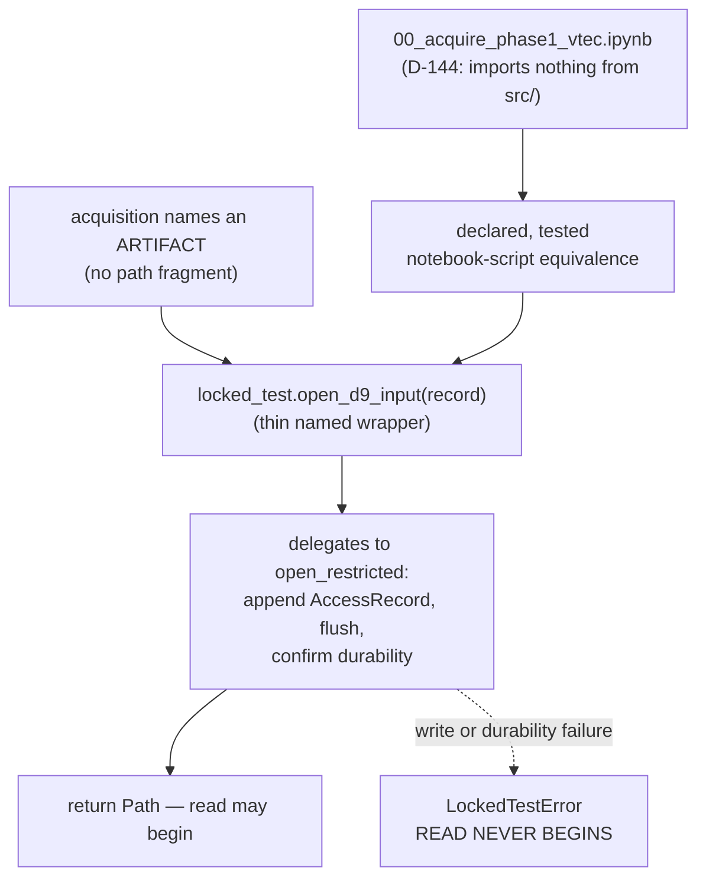

# Business Logic Model — `acquisition`

**Unit** `acquisition` (Bolt 3) · **Kind** `library` · **Depends on** `foundation`,
`governance-guards`

> **Re-established a sixth time 2026-08-24**, on a **new stage attempt** — Inception closed
> and Construction opened at 2026-08-24T11:46:26Z, resetting the receipt floor for every
> unit. **No content of this unit changed.** Both `foundation` passes of that day (the
> amendment pass and the sites 9–11 addendum, in
> `governance/CHANGE_RECORD_2026-08-24_foundation_amendments.md`) were checked against this
> unit and touch nothing it reads: `DeterminismRecord` is not among the
> `component-methods.md` contracts consumed here, no `release.py` signature was amended,
> the amended `services.md` § Run record and registry and `unit-of-work.md` § 1 are not the
> sections read here, and Amendment A was declined so **no count moved**. Its
> `governance-guards` upstream — **R-25** through **R-28** — re-confirmed the same day with
> no rule changed. **The READY verdict in § Review belongs to the previous attempt.**

> **Re-established a fifth time 2026-08-23**, after a redo aimed at four stale
> cross-references in `target-standardization`'s question file. **No content of this unit
> changed.**

> **Re-established 2026-08-23 after a redo jump taken to correct this unit.** The jump
> cleared the receipt floor; the TA-08 primary/supporting row was corrected under that
> cleared receipt at the project decision owner's explicit direction, with both superseded
> readings recorded in place; the summary was re-confirmed; a fresh adversarial pass
> reviews the corrected text. The jump reset the whole stage rather than this unit alone.
>
> **Re-established a second time 2026-08-23** after a further stage-wide redo aimed at
> `external-products`. **No content of these artifacts changed on that occasion**; the
> correction applied then was to this unit's **question file**, whose recorded receipt had
> previously been locked — it still carried the false *"largest untested share in the plan"*
> superlative these artifacts had already corrected. Both occurrences are now fixed there
> too, with the superseded text preserved.
>
> **Re-established a third time 2026-08-23** after a redo aimed at a misread depth policy in
> `component-methods.md`. **No content of this unit changed**; that re-reading **confirms**
> all three of its owed amendments — the named accessors are new symbols in a boundary block
> that exists and omits them, and both contract modifications touch existing boundary
> contracts, `scripts/` to `src/data` being genuinely cross-package.
>
> **A fourth re-establishment** followed a sweep of two sibling question files; **no content
> of this unit changed.**

The workflows this unit implements: retrieving the D-144-approved prepared VTEC
product and the three driver series, recording full provenance for every retrieved
file, hashing one manifest entry per provider file, storing gaps as explicit `NaN`,
routing every restricted-root access through the chokepoint, and closing the ICTP
rejected-source audit.

**This unit applies no scientific transformation at retrieval.** It fetches, records,
hashes and refuses. Every scientific constant it consumes is governed elsewhere.

**BLK-07 is an exit condition on this stage.** W-2 authors its **mechanism** limb.
The **authorization** limb — which units may reach the locked month, and when — is the
project decision owner's, and nothing here grants, implies or substitutes for it.
**No acquisition run may touch calendar 2022-12 while BLK-07 stands.**

## Sources

- `../../../inception/units-generation/unit-of-work.md` § 3 — `Owns`, the boundary, the 15 requirements, and BLK-07's register entry.
- `../../../inception/units-generation/unit-of-work-story-map.md` — Tables 1 and 2 plus § Per-unit coverage summary; both derivation paths agree on 15 requirements and **7** without an acceptance row.
- `../../../inception/requirements-analysis/requirements.md` — REQ-ENG-13; FR-P1-00-1, -2; FR-P1-01-1…-9, -11; REQ-NFR-A1, REQ-NFR-A2; FR-P1-04-11.
- `../../../inception/application-design/component-methods.md` — `src/data/locked_test.py`, `src/data/release.py`, and the §10 credential rule.
- `../../../inception/application-design/services.md` — § The nine stage scripts (`00_acquire_prepared_vtec.py`, phase 1 only); § Stage entry contract; § Execution platforms.
- `../../../inception/application-design/component-dependency.md` § Shared resources.
- `../governance-guards/functional-design/business-rules.md` — R-25, R-26, R-27, R-28. This unit is the first consumer of all four.
- `../foundation/functional-design/business-logic-model.md` — W-1's stage entry contract and credential resolution.
- `evidence/DECISIONS.md` — D-5, D-9, D-10.1/.2/.3, D-15, D-18, D-21, D-22, D-23, D-143, D-144.
- Workspace inspection, 2026-08-23: `tests/test_acquisition_window.py`, `scripts/audit_ec1_drivers.py`, `scripts/merge_coverage_year.py`.
- `functional-design-questions.md` (**Q1 through Q9**), `domain-entities.md`, `business-rules.md`.

---

## W-1 — Retrieving the approved prepared VTEC product

```
INPUT   config: ConfigSnapshot (configs/data.yaml), phase: int
OUTPUT  provider files, request_manifest.json, sha256_manifest.json
RAISES  AcquisitionError; PhaseBoundaryError (via the stage entry contract)
```

1. Enter through `foundation`'s six-step stage entry contract. **Step 4 is
   `governance-guards.assert_phase_boundary`** — `00_acquire_prepared_vtec.py` is
   phase **1 only** and does not skip it.
2. Resolve the frozen experiment, kindat and parameter set from `configs/data.yaml`.
   D-144 fixes them; this unit does not choose them.
3. Retrieve. **Apply no scientific transformation at retrieval** (FR-P1-01-1) — the
   retrieved values are stored as the provider returned them.
4. Record provenance per file (W-3), hash per file (W-4), account for gaps (W-7).
5. Write `request_manifest.json` and `sha256_manifest.json`.

**Why no transformation at retrieval.** FR-P1-01-1's acceptance is *"a diff of
retrieved against stored values shows no transformation."* A transformation applied at
retrieval is unrecoverable — the provider's bytes are gone and nothing downstream can
tell what was changed.

**Two of D-144's four attached freezes remain open** (`requirements.md` § Known defects
row 5). This design builds to D-144 as approved and does not resolve them.

## W-2 — Reaching a restricted artifact: BLK-07's mechanism

```
INPUT   artifact name (not a path), record: AccessRecord
OUTPUT  Path   (only after the access row is durable)
RAISES  LockedTestError
```

**Mechanism (Q1 = D).** `governance-guards`' `locked_test.py` exposes **named-artifact
accessors** — `open_d9_input(record)` for `audit_evidence_2022-FULL/`, and a
restricted **writer** for re-acquired December bytes (W-2a). `acquisition` calls them
**by name** and holds no path fragment at all.

**The accessors COMPOSE `open_restricted`; they do not reimplement it.** Each is a thin
named wrapper that resolves its artifact name to a path under `RESTRICTED_ROOT` and
**delegates to the approved `open_restricted`**, which owns the append, the flush, the
durability confirmation and the raise. Two consequences, both load-bearing:

1. **BLK-07's literal wording is satisfied.** The register requires routing *"through
   `governance-guards.open_restricted`"* — by name. Composition routes through it; a
   parallel implementation with identical behaviour would not, however equivalent it
   looked.
2. **There stays exactly ONE log-then-proceed code path**, not three behaviourally
   identical ones. "One path in" is a claim about code paths, and three wrappers each
   with their own write-flush-return would make it false while reading as true.

> **Added 2026-08-23 after an adversarial pass**, which found that neither the prose nor
> the diagram said whether the accessors composed `open_restricted` or duplicated it —
> leaving the register's by-name requirement unsettled and "one path in" ambiguous
> between one code path and several.



Text fallback: acquisition names an artifact rather than a path; the accessor in
`locked_test.py` owns the join and delegates to the approved `open_restricted`, which
writes and flushes the access record, and only then returns the path. A write or durability failure raises and the read never begins. The
D-144 notebook, which imports nothing from `src/`, reaches the same accessor through
the declared and tested notebook–script equivalence.

**Why a named accessor rather than a direct `open_restricted` call.**
`governance-guards` **R-28** asserts by static check that **no module outside
`locked_test.py` contains the restricted-root literal.** A named accessor satisfies
that **by construction** rather than by care: there is no string in `acquisition` for
the check to find, and adding a new restricted artifact becomes a visible change in
`governance-guards` rather than a new literal in a consumer.

**Why the notebook limb is not optional.** D-144 approved
`notebooks/00_acquire_phase1_vtec.ipynb` as a **self-contained** interface that
**imports nothing from `src/`** — so it cannot import `locked_test.py`. Without this
limb the one file exempt from the import rules, and the file that actually performs
acquisition, would have **no sanctioned route** to a restricted artifact: it would
duplicate the path or read unlogged, which is precisely the breach BLK-07 exists to
prevent, arriving through the one exempt caller. REQ-ENG-13 already mandates a
notebook–script equivalence test, so the access step rides a required mechanism rather
than a new one — and W-8's **declared equivalence scope** is where that coverage is
recorded.

> ## ⚠ THIS IS THE MECHANISM LIMB ONLY
>
> BLK-07's `Approval authority` row assigns **the contract** to `functional-design`
> (3.1). It assigns nothing else. **Which units may reach the locked month, and when,
> is the project decision owner's decision**, and this workflow neither grants it nor
> stands in for it. `governance-guards` R-28 states the same split from the other
> side: the static check enforces *how many* paths exist, never *who* may use one.
>
> **No acquisition run may touch calendar 2022-12 while BLK-07 stands.**

## W-2a — Writing under the restricted root

A **write** is not the same act as a read, and Q2 = C gives it its own entry point and
its own ordering contract.

```
INPUT   artifact name, payload, record: AccessRecord (purpose = acquisition_write)
OUTPUT  Path written
RAISES  LockedTestError — log write or durability failure, before any byte is written
```

**Ordering: log-before-WRITE.** `open_restricted`'s approved contract is written
around *"before the read"*, and borrowing it for a write would leave the worse failure
unspecified: **a partially written December artifact with no access row** is worse than
a blocked read, because it creates December bytes nobody recorded creating.

**`AccessRecord` needs values it does not have.** The approved enum is
`"coverage_audit" | "regime_audit" | "locked_evaluation"` and `authorization` is typed
as *"the G-05 signature reference, or the audit authority"*. **None fits an acquisition
read, and none fits a write at all.** Q2 = C extends the enum with `acquisition_read`
and `acquisition_write` and widens `authorization` to name a D-number.

> **This is an amendment owed to an approved stage-2.6 contract, stated not applied.**
> `component-methods.md`'s `src/data/locked_test.py` block is an approved artifact;
> this stage records the requirement and edits neither it nor the file. A change record
> is the route. **Recording a knowingly wrong `purpose` value instead was rejected:**
> the access log's whole value is that a G-05 reviewer can read its rows as meaning
> what they say, and a false `coverage_audit` row describes an audit that never
> happened.

**Raised for `governance-guards`, not built here:** an enum-membership test pinning the
declared values exactly, so a future value cannot be added silently. That enum lives in
`governance-guards`' contract; pinning a sibling unit's enum from this unit would
invert ownership.

## W-3 — Recording provenance per retrieved file

```
INPUT   provider response metadata, prior recorded suffix (if any)
OUTPUT  a ProviderFileRecord appended to request_manifest.json
```

Five fields per file (FR-P1-01-2): provider, permanent citation, **full provider
filename including its version suffix**, retrieval date, SHA-256.

**Version-suffix mismatch (Q3 = C), a three-step behaviour:**

1. **At retrieval — non-fatal.** Provider reissue is a normal event in this dataset;
   `g.002` versus `g.003` is already observed. Halting acquisition on a normal event is
   how a guard gets worked around.
2. **Record it as a machine-readable field** on the manifest — never console text.
   This is the completeness-shortfall tier `team.md` § Code Style fixes.
3. **`write_release` refuses** a release carrying an unresolved mismatch. Retrieving a
   reissued file is fine; **releasing it as though it were the recorded one is not**,
   and a release is what a later reader cites.

**Why the refusal sits at release rather than at retrieval.** It puts the stop where
the consequence is. "Surfaced, never silently accepted" (FR-P1-01-2) then means a
named gate reads the field, rather than the field existing in a manifest nobody is
required to read.

> **Noted for stage 3.2, not changed here:** FR-P1-04-11 enumerates §13.3's fourteen
> fields and **the mismatch field is not among them**, so the release manifest's input
> contract does not currently carry what this refusal reads.

**A per-file D-number was considered and declined.** It is right in principle — every
other governed disagreement in this project resolves to a decision record — but a
twelve-month re-acquisition would generate a decision per file, and a ritual that heavy
gets batched, which defeats it.

## W-4 — Hashing, and what the twelve pre-TC-06 months mean

```
INPUT   retrieved provider files, derived artifacts
OUTPUT  sha256_manifest.json — one entry per provider file PLUS one per derived artifact
```

FR-P1-01-4's acceptance arithmetic: *"each month's manifest hash count equals its
provider-file count plus its derived-artifact count."*

**What the workspace actually holds, read rather than assumed.** Every existing
`sha256_manifest.json` hashes exactly **four derived files** and never the contents of
`raw_isprint_cache/` — and that cache holds isprint **text extractions**, not provider
`.hdf5` bytes. **No provider byte stream exists anywhere in the workspace.** Three of
the twelve months — 2022-04, 2022-07 and 2022-12 — have no `raw_isprint_cache/` at all.
So the arithmetic evaluates to zero on the provider side for every existing month.

**Contract (Q5 = C):**

| Scope | Behaviour |
|---|---|
| Newly acquired months | One manifest entry per provider file plus one per derived artifact; the arithmetic holds |
| The twelve pre-TC-06 months | **Re-verified under the new suite, not re-acquired** (`team.md`), and each manifest carries an explicit **`provenance_class = derived_only`** field |
| Re-verification of any month | Records the **producing interpreter**, and marks an out-of-envelope artifact as such |

**Why `provenance_class` is a field rather than a document.** Without it the manifest
format means two different things depending on when a month was acquired, with nothing
in the artifact saying which. A downstream consumer — G-P1A, a release, a freeze gate —
can then refuse a derived-only month where full provenance is required, instead of
discovering the gap by reading history.

**Why the producing interpreter is recorded.** `evidence/experiment_registry.md`
records the 2026-08-16 corrected extracts as produced under **Python 3.14, local** —
outside the governed 3.11 pin. Without this field a passing hash on those files reads
as evidence the envelope held. It did not.

**The freeze-gate refusal is NOT written here.** `team.md`'s caveat — FULL must not be
relied on at a freeze gate — moved when **D-18 (2026-08-21) re-merged FULL**,
discharging the **superseded-hash** limb; what remains open is the **provenance** limb.
**FR-P1-01-11 owns that distinction**, and a second, coarser rule here would create two
rules about one fact.

## W-5 — Identity-field agreement at release

```
INPUT   manifest, files, out_dir, identity_fields: Sequence[str]   (declared by the caller)
OUTPUT  release path
RAISES  ReleaseError — fields disagree across source manifests, or identity_fields is empty
```

FR-P1-01-3 requires **two** checks, and states why: *"a single string test was
satisfiable by omission."*

1. **This unit's:** every `request_manifest.json` carries a **non-empty**
   `madrigalWeb_version`, and an **absent key fails exactly as `"unknown"` fails.**
2. **`foundation`'s, parameterised (Q4 = C):** a derived release **verifies** that its
   identity fields agree across every source manifest rather than asserting they do.

**Why the enforcement lives in `write_release`.** Guarding the artifact at the moment it
is created is the only placement no caller can route around. **Why the field set is a
caller-supplied parameter**: the domain knowledge — which eight fields are identity
fields, and that they come from per-month manifests — belongs to the caller that has
it, not to a shared API every unit depends on. **An empty field set is refused**, so a
caller cannot satisfy the check by passing nothing.

> **An amendment owed to an approved contract, stated not applied.**
> `src/data/release.py`'s `write_release` signature is stage 2.6's; this stage records
> the parameter requirement and does not edit `component-methods.md`.

**The live failure this guards is real and is in the workspace today.**
`evidence/locked_test_restricted/audit_evidence_2022-FULL/request_manifest.json` has
**no `madrigalWeb_version` key**, because `merge_coverage_year.py` copies eight
identity fields and drops that one.

> **Testing against that real artifact is DEFERRED, and attached to `RES-04`.** The
> FULL manifest sits under the restricted root, so reading it is a logged December
> access owing W-2's contract. Building that test now would either need authorization
> this stage cannot give or would read the root unlogged — the breach BLK-07 exists to
> prevent. It becomes available once W-2's contract exists, and it is the same shape as
> `RES-04`'s deferred rerun rather than a new obligation.

## W-6 — Driver acquisition and release-grade integrity

Four series, frozen by contract (FR-P1-01-6): **Kp/ap3 and Hp60/ap60 from GFZ**,
**hourly Dst from Kyoto WDC at a single recorded release grade for all of 2022**,
**observed (not 1-AU-adjusted) F10.7 from Canada's Solar Radio Monitoring Program**.
**SSN is absent**, and a `grep` confirms it.

Each series carries **all nine of TE §5.1's inventory fields** — provider, role,
filename or product identifier, coverage, retrieval date, checksum, version or release
status, licence and access notes, **and the configuration that consumes it**. A series
carrying fewer than nine fails.

**Release-grade integrity (REQ-NFR-A1).** One recorded grade per series for calendar
2022; **grades are never mixed within a series**; **no value is backfilled from a
future final or definitive archive.** NFR-LEAK-01 governs *timing* only — a series can
satisfy its declared lag while being built from reanalysed values, which is invisible
to every existing check and fatal on discovery.

**Two citation obligations are discharged before G-P1A rather than left uncollected**:
the **Kyoto non-commercial-use notice recorded verbatim** (D-6, EC1-R-1) and the
**CEDAR rules-of-the-road and acknowledgment** attached to `madrigalWeb`. **A notice
recorded by reference rather than verbatim fails.**

**The F10.7 window from 2022-03-18.** The audit found **no missing calendar day**: at
least one observation on 365 of 365. The three selection choices are frozen — daily
**median** (D-21), duplicate UT records take the **mean** with a quality-control flag
and provider-defined correction semantics taking precedence (D-22), and the four
high-spread days flagged and retained with the median as representative (D-23). **No
imputation, substitution or reconstruction occurs until the measured gap is recorded and
governed** (TC-20). D-21's availability constraint binds: the approved daily value must
not become available to a forecast before all observations required to compute it were
available.

`scripts/audit_ec1_drivers.py` migrates onto the §12 structure here.
**`audit_ec1_drivers.py:184` returns `0` regardless of missing months** — a known gap
against the two-tier posture, fixed at migration.

## W-7 — Gaps as NaN, and the conservation invariant

```
INPUT   retrieved series or binned product
OUTPUT  artifact with gaps as explicit NaN, plus a gap accounting on the manifest
```

D-5, extended to driver series by D-10.2: **gaps are stored as explicit `NaN` at
acquisition time; no interpolation, smoothing or fill occurs at acquisition.**

**Three limbs (Q6 = C), because one is not enough:**

| Limb | What it catches | What it misses |
|---|---|---|
| Injected-gap round trip | The realistic regression — someone adds a `fillna` for convenience | A fill on a branch the fixture does not exercise |
| Static scan for fill-class calls in this unit's modules | Branches a fixture misses | An alias, or a vectorised expression that fills without naming a fill function |
| **NaN-count conservation**: gaps counted at retrieval **equal** gaps in the written artifact | **Any** fill, on any branch, named or not — a filled gap changes the count | Nothing in this class |

**Why the conservation limb carries the rule.** It is a law rather than a spot check,
and it produces a **machine-readable manifest field** rather than only a passing test.
That matters here specifically: **FR-P1-01-9 has no §16/§19 acceptance row**, so a
manifest field is evidence that survives the absence of a gate, where a test result
does not.

**A per-day, per-series breakdown was considered and declined.** It is genuinely useful
for TC-20's measured-gap obligation, but that obligation belongs to FR-P1-01-7's audit
report, which already exists and already carries exact dates. Two records of one fact
is how they drift apart.

## W-8 — The notebook and the script

REQ-ENG-13: `00_acquire_phase1_vtec.ipynb` is a **self-contained acquisition/audit
interface approved under D-144**, so REQ-ENG-12's import-from-`src/` and no-only-copy
rules **do not reach it**. It owes a **different** declaration set — **six items, not
four**: its own version, year and stations, source URLs, retrieval timestamp,
destination paths, and resulting hashes.

**Its four prohibitions hold**: it may not calculate TEC/VTEC from observations, map
`los` data, create model features, or train a model. **Each prohibition has a check
that fails when the prohibited operation is introduced** — a negative control per rule,
per this project's affirmed methodology.

**Equivalence (Q7 = D).** Both are run against a **recorded-response fixture** — never
the live provider — and the produced `request_manifest.json`, `sha256_manifest.json`
and file hashes are asserted identical. A **declared equivalence scope** names what must
match and what need not:

| Must match | Need not match |
|---|---|
| `request_manifest.json` contents | Display and progress output |
| `sha256_manifest.json` contents | Cell structure |
| File hashes | Ordering of non-semantic output |
| NaN handling and the gap accounting (W-7) | — |
| Refusal paths — missing input, Internet-access failure, G-P1A refusal | — |
| **The restricted-artifact access step (W-2)** | — |

**Why the scope is part of the answer.** Without it, "behaviourally equivalent" is
renegotiated every time the test fails, which is how such a test ends up relaxed until
it proves nothing. A textual diff — TA-16's literal evidence wording — cannot carry the
requirement: two implementations can be behaviourally identical and textually
different, so a diff either fails constantly or is relaxed.

**Extracting the shared logic to a generated notebook was declined.** It would remove
the drift rather than detect it, which is stronger — but D-144 approved a
**self-contained** notebook, and whether a generated one still is is the owner's
reading, not a design choice.

**"Run all" either succeeds from declared inputs or stops with a clear missing-artifact
or Internet-access message** rather than proceeding on partial state.

## W-9 — Keeping credentials out of this unit's outputs

Credentials reach the provider client **directly from the environment via
`foundation`'s resolution** — never through a config file, log, registry note or
notebook (§10, NFR-SEC-01). That is settled upstream. **The live risk here is egress**,
because this unit writes manifests, logs a run record, and runs inside a notebook whose
outputs are saved.

**Two named carriers, because they are the realistic ones**: a **signed request URL**
and an **auth header**. An acquisition client naturally has both in hand, and both are
things a manifest or a log would carry without anyone deciding to put them there.

**Mechanism (Q8 = D), two limbs:**

1. **One declared redaction serializer.** Every value this unit writes to a manifest,
   log or notebook output passes through it, and it **refuses unredacted
   credential-shaped values**. One checkable chokepoint instead of a rule repeated at
   every write site — the same one-path shape as `governance-guards` R-28 — and testable
   directly: feed it a token-shaped value and assert refusal. The definition of
   "credential-shaped" is heuristic, and that is accepted rather than hidden.
2. **Notebook outputs cleared as a precondition of commit.** This is the one egress a
   serializer inside the process cannot reach: a notebook's **saved output cells** are
   committed artifacts, and they are exactly where §10's "never in a notebook" would be
   breached in practice. `notebooks/madrigal_phase1_coverage_audit.ipynb` exists in the
   workspace today. `team.md` § Way of Working already commits this project to a
   pre-commit hook once git exists, so the mechanism has a home.

**Why not rely on TA-22's scan alone.** It covers tree, history, configs, logs and
artifacts — but it is detection **after** the artifact exists, and it is owned by
`foundation`. This unit would be relying on a sibling's gate to catch its own leak.

## W-10 — Closing the ICTP rejected-source audit

**FR-P1-00-1.** The ICTP source-failure evidence is **immutable and machine-readable**:
`source_status = REJECTED_COVERAGE`, coverage recorded as **ARUC 27/365, BSHM 35/365,
NICO 0/365**, decision stored as **D-143**. The evidence set exists, its hashes verify,
and the status field is machine-readable rather than prose.

**FR-P1-00-2.** **No ICTP artifact enters target construction or training.** An
import/data-lineage check shows no ICTP artifact reachable from the target or feature
path — a reachability assertion, not a filename check, for the same reason R-31 gives
below.

## W-11 — What Bolt 3 builds, and what it must not

**Permitted before G-09**: module structure, interfaces, placeholder CLI definitions,
configuration wiring, safe fail-fast behaviour, and this unit's `tests/` scaffolding.

**Barred until G-09 is signed for the affected component**: implementing any component
whose P0 decision is unresolved; filling any `TBD — freeze gate` field; executing any
governed run; generating code for a unit carrying an open blocker on that scope.

> **`scripts/00_acquire_prepared_vtec.py` DOES NOT EXIST**, and neither does `src/` nor
> `configs/`. **BLK-07 is open**, and it is an exit condition on this stage:
> `acquisition` may enter functional design and may not exit it without the approved
> routing contract.
>
> **No December access of any kind occurs in this Bolt.** The routing is designed here;
> it is not exercised against the locked month. **`RES-04`'s documented rerun of the
> three existing test modules is not started and is deliberately not attempted** — all
> three reach the restricted root by recursive traversal, and running them before the
> chokepoint exists would manufacture the breach rather than document it.

---

## Requirement-to-workflow map

Acceptance derived from story-map Table 1; owners from Table 2's `primary` cell. Both
paths cross-checked and in agreement.

| Requirement | Workflow | Tested by (Table 1) | Row primary owner |
|---|---|---|---|
| REQ-ENG-13 | W-8 | TA-16 | `regimes-diagnostics-reporting` |
| FR-P1-00-1 | W-10 | TA-31 | `acquisition` supporting |
| FR-P1-00-2 | W-10 | TA-25 | `inventory-and-registry` |
| FR-P1-01-1 | W-1 | TA-32 | **`acquisition`** |
| FR-P1-01-2 | W-3 | TA-15 | `foundation` |
| FR-P1-01-3 | W-5 | TA-03, TA-15 | `foundation` |
| FR-P1-01-4 | W-4 | TA-04, TA-15 | `foundation` |
| **FR-P1-01-5** | W-1, and `tests/test_acquisition_window.py` | ⚠ **NO ACCEPTANCE ROW** — but the test exists and is **green** | — |
| FR-P1-01-6 | W-6 | TA-08 | `features-and-splits` (`external-products` supporting) |
| **FR-P1-01-7** | W-6 | ⚠ **NO ACCEPTANCE ROW** | — |
<!-- TA-08 row corrected twice, 2026-08-23. First issue: primary/supporting reversed
     (`external-products` named primary). Iteration-1 fix corrected the primary and
     introduced the opposite error, adding "this unit and" to the supporting list — a
     claim story-map Table 2 does not make and which contradicts this artifact's own
     coverage-summary line below. This unit supports TA-15, TA-16, TA-22 and TA-25;
     TA-08's supporting unit is `external-products` alone. -->

| **FR-P1-01-8** | W-6 | ⚠ **NO ACCEPTANCE ROW** | — |
| **FR-P1-01-9** | W-7 | ⚠ **NO ACCEPTANCE ROW** | — |
| **FR-P1-01-11** | W-4 | ⚠ **NO ACCEPTANCE ROW** | — |
| **REQ-NFR-A1** | W-6 | ⚠ **NO ACCEPTANCE ROW** | — |
| **REQ-NFR-A2** | W-1, and `tests/test_acquisition_window.py` | ⚠ **NO ACCEPTANCE ROW** — but the test exists and is **green** | — |

**15 requirements, 7 without an acceptance row.** **Corrected 2026-08-23 after an
adversarial pass:** the first issue read *"the largest untested share of any unit in the
plan"*, which the cited story-map § Per-unit coverage summary contradicts. Derived from
that table: **`acquisition` 7/15, `models-and-baselines` 7/9,
`regimes-diagnostics-reporting` 7/11** — a **three-way tie on the raw count of 7**, and by
*share* `acquisition` is the **smallest** of the three at 46.7%. A superlative built on a
correct numeral is exactly the failure `project.md` § Corrections records. This unit **owns** TA-32 and **supports** TA-15, TA-16, TA-22 and
TA-25.

### The seven, in two named classes (Q9 = D)

The two classes are stated wherever the count **7** appears, so a later sweep keyed to
the numeral does not miss the qualitative claim.

**Class 1 — tested without a row (2).** Both discharge onto
`tests/test_acquisition_window.py`, which **exists and is green**. They lack a row, not
a test; closing them needs a Vision §15.2 change record and nothing else.

| ID | Evidence that would close it |
|---|---|
| FR-P1-01-5 | An approved §19 row asserting membership derives from record timestamps, with the existing green test cited as its result |
| REQ-NFR-A2 | The same row, or a sibling of it, scoped to fold and partition membership |

**Class 2 — untested and unrowed (5).** Each states **what evidence would close it**.
No §19 criterion is drafted: a drafted criterion in a functional-design artifact is
indistinguishable, months later, from an approved one, and §19 rows are owned by stage
3.2 and change control.

| ID | Evidence that would close it |
|---|---|
| FR-P1-01-7 | The audit report with exact dates (exists), **plus** a passing check that `features.yaml` carries D-21, D-22 and D-23's three selection choices and that the zero-TBD preflight fails when any is unset |
| FR-P1-01-8 | A passing reanalysed-value check per driver, plus each driver manifest carrying a release-status field |
| FR-P1-01-9 | A passing injected-gap round trip **and** a NaN-count conservation assertion over a fixture month (W-7) |
| FR-P1-01-11 | A passing assertion that a derived release's `source_runs` digests equal current per-month manifest hashes, **or** that a D-number re-pointing provenance exists and is cited at G-P1A — D-18 satisfies the first branch today |
| REQ-NFR-A1 | A passing mixed-grade injection test per series, and a single recorded grade for calendar 2022 |

## Assumptions & Open Questions

- **[assumption]** Rule IDs continue the single sequence — `foundation` R-01…R-17, `governance-guards` R-18…R-29 — so this unit opens at **R-30**. If per-unit numbering was intended, say so at the gate.
- **[assumption]** `tests/test_acquisition_window.py` is this unit's, per `unit-of-work.md` § 3 `Owns`. It exists and is green; this design builds around it rather than proposing to rewrite it.
- **[assumption]** `frontend-components.md` is not produced — `kind: library`, and the stage maps that artifact to `[ui]` only.
- **[assumption]** The re-acquisition itself is future work outside this stage's scope; its December limb is barred while BLK-07 stands.
- **Open — BLK-07's authorization limb.** W-2 authors the mechanism only. The owner decides which units may reach the locked month, and when.
- **Open — THREE amendments owed to approved stage-2.6 contracts, stated not applied.** All need change records before code-generation treats any of them as sanctioned. **Corrected 2026-08-23 after an adversarial pass**, which found the first issue listed only two and silently omitted the third — the one that *is* BLK-07's central mechanism:
  1. **`open_d9_input`, and any other named accessor**, added to `component-methods.md`'s `src/data/locked_test.py`. The approved block defines only `RESTRICTED_ROOT`, `AccessRecord`, `open_restricted` and `assert_no_december_outside_restricted` — **there is no `open_d9_input` in it.** Since BLK-07 is an exit condition on this stage and its approval authority is `functional-design` (3.1) *for the contract*, an unflagged central function would read as approved when it is not.
  2. The **`AccessRecord.purpose` extension** and the **restricted-write function** (W-2a), same file.
  3. The **`identity_fields` parameter** on `src/data/release.py`'s `write_release` (W-5).
- **Open — noted for stage 3.2:** FR-P1-04-11's fourteen fields do not carry W-3's suffix-mismatch field, which W-3's release refusal reads.
- **Open — raised for `governance-guards`:** an enum-membership test pinning `AccessRecord.purpose` exactly. Not built here, because that enum is a sibling unit's.
- **Open — `RES-04`.** Not started, deliberately not attempted. W-5's real-artifact test is the same shape and defers to it.
- **Open — `RES-01`**, permitted-read access logging is NOT TESTED, owned by stage 3.2. This unit is a consumer of the untested contract.
- **Open — FULL's provenance limb.** Unverifiable in principle: no provider byte stream exists, and three of twelve months have no `raw_isprint_cache/`. D-18 discharged only the superseded-hash limb. Owned by FR-P1-01-11.
- **Open — two of D-144's four attached freezes.** This design builds to D-144 as approved and resolves neither.
- **Open — the F10.7 measured gap** must be recorded and governed before any imputation, substitution or reconstruction.
- **Open — the Kyoto and CEDAR notices** must be recorded verbatim, not by reference, before G-P1A.
- **G-09 is not signed.** No workflow here authorises creating any module.
- **None** of the above adopts a reading on a supervisor-owned value, and none decides a scientific constant.

## Review

**Verdict:** READY
**Reviewer:** aidlc-architecture-reviewer-agent
**Date:** 2026-08-22T21:13:12Z
**Iteration:** 2 (final)

### Disposition of iteration-1 findings

| # | Original finding | Disposition | How verified |
|---|---|---|---|
| 1 (Critical) | `open_d9_input` was a new symbol absent from the approved `locked_test.py` contract and, unlike its two siblings, never flagged for change control. | **RESOLVED.** All three artifacts now state "THREE amendments owed" and name the accessors (`open_d9_input` and the restricted writer), the `AccessRecord.purpose` extension plus write function, and `write_release`'s `identity_fields` parameter — with `business-rules.md` R-32 and `domain-entities.md` § 9 additionally stating BLK-07's routing contract is **"proposed, not approved"** until a change record clears. | Re-read `component-methods.md`'s `src/data/locked_test.py` block directly: it still defines only `RESTRICTED_ROOT`, `AccessRecord`, `open_restricted`, `assert_no_december_outside_restricted` — no `open_d9_input`. Re-read the Assumptions & Open Questions section of all three artifacts and `business-rules.md` R-32/R-33: all three now list the accessors as amendment (1) of three, consistently. |
| 2 (Major) | Undisclosed whether the accessors compose or duplicate `open_restricted`. | **RESOLVED.** All three artifacts now state the accessors are "thin named wrappers" that "delegate to" `open_restricted`, owning none of the append/flush/durability logic themselves, with the two stated consequences (BLK-07's by-name wording satisfied; exactly one log-then-proceed code path). The `business-logic-model.md` W-2 mermaid diagram and text fallback now show `B --> C` as an explicit delegation step. | Re-read W-2, § 9, and R-32's composition paragraphs and the regenerated diagram/text-fallback; the delegation claim is stated in matching terms in all three artifacts. |
| 3 (Major) | "Largest untested share of any unit in the plan" is false against the cited story-map table. | **RESOLVED** in the three artifacts under review. Replaced with the derived three-way tie on the raw count of 7 (`acquisition` 7/15, `models-and-baselines` 7/9, `regimes-diagnostics-reporting` 7/11) and the correct statement that `acquisition` has the smallest share (46.7%). **`functional-design-questions.md` still carries the stale superlative twice (intro line 13, Q9 line 364), left deliberately unedited** because its confirmation digest is in the audit trail; the disposition states this and defers the correction to the gate. Judged **adequate**: the three design artifacts under review — the ones a developer and a downstream reviewer actually build from — are all corrected and each carries an explicit dated correction note, and the human is told plainly at the gate that the interview transcript still contains the superseded claim. This is not silent; it is a deliberate, disclosed trade-off consistent with `project.md`'s rule against reopening a settled receipt without new grounds. | Independently recomputed all three unit shares from `unit-of-work-story-map.md` § Per-unit coverage summary (`acquisition` 7/15 = 46.7%, `models-and-baselines` 7/9 = 77.8%, `regimes-diagnostics-reporting` 7/11 = 63.6%) — matches the artifacts' corrected numerals exactly. Confirmed by `grep` that `functional-design-questions.md` still contains the literal phrase at both cited locations. |
| 4 (Major) | TA-08's primary/supporting ownership was reversed. | **PARTIALLY RESOLVED, with a new defect substituted — see New Findings below.** The primary owner is now correctly `features-and-splits` in all three artifacts. But the parenthetical was rewritten to `(this unit and external-products supporting)`, which asserts `acquisition` itself is a supporting unit on TA-08 — a claim Table 2 does not make and that each artifact's own coverage-summary line contradicts. | Re-read `unit-of-work-story-map.md` line 191 (TA-08's row: primary `features-and-splits`, supporting `external-products` only) and line 230 (`acquisition`'s own Supporting-on column: `TA-15, TA-16, TA-22, TA-25` — no TA-08). Cross-checked against each artifact's own later summary sentence ("owns TA-32 and supports TA-15, TA-16, TA-22 and TA-25"), which excludes TA-08 and directly contradicts the FR-P1-01-6 row a few lines above it in the same document. |

### New findings (this iteration)

| # | Severity | Location | Finding | Recommendation |
|---|---|---|---|---|
| 1 | Major | `business-logic-model.md` § Requirement-to-workflow map (FR-P1-01-6 row); `domain-entities.md` § Requirement coverage (same row); `business-rules.md` R-40 Acceptance line | The iteration-1 fix for the TA-08 ownership reversal introduced a new, opposite-direction error: all three artifacts now read `features-and-splits` **(this unit and `external-products` supporting)** — asserting `acquisition` is a supporting unit on TA-08. `unit-of-work-story-map.md` Table 2's TA-08 row names only `external-products` as Supporting; `acquisition` is not listed. This is not a stray typo — it directly contradicts each artifact's **own** later summary line ("This unit owns TA-32 and supports TA-15, TA-16, TA-22 and TA-25"), which correctly omits TA-08. The claim is self-contradictory within each document, not merely inconsistent with an external table. | Drop `this unit and` from the parenthetical in all three locations, leaving `features-and-splits` (primary), `external-products` (supporting) — matching Table 2 and matching each artifact's own coverage-summary sentence. |
| 2 | Minor | `domain-entities.md` § 9 Assumptions bullet vs. `business-logic-model.md` / `business-rules.md` R-32/R-33 | The three artifacts do not agree on which of the "three amendments" bucket holds "the restricted writer." `business-logic-model.md` and `business-rules.md` (R-32 item 1 / R-33) consistently group it with the `AccessRecord.purpose` extension as amendment (2). `domain-entities.md`'s § 9 Assumptions bullet instead lists it under amendment (1) ("the named accessors themselves (`open_d9_input` **and the restricted writer**)") and then separately restates "the `AccessRecord.purpose` extension plus a restricted-write function" as item (2) — mentioning the same write function in both buckets. This does not drop any symbol from change control (all three artifacts still flag every new symbol), but the "three, not two" accounting is not identically reconstructable across the three documents, which is exactly the kind of drift the change-control amendment list exists to prevent. | Align `domain-entities.md`'s § 9 bullet to the same three-way split used in `business-logic-model.md` and `business-rules.md`: (1) the two named accessors, read-side only; (2) the `AccessRecord.purpose` extension together with the new write function; (3) `identity_fields`. |

### Failed refutation attempts

- **Re-verified all eight iteration-1 workspace-fact claims independently rather than trusting the prior pass**, per this project's own affirmed practice against carrying an unverified fact forward as established input: the eleven `sha256_manifest.json` four-entry hash counts, `raw_isprint_cache/` absence for 2022-04/2022-07, `merge_coverage_year.py`'s eight-field copy dropping `madrigalWeb_version`, `audit_ec1_drivers.py:184`'s unconditional `return 0`, `AccessRecord`'s three-value enum, `write_release`'s missing `identity_fields`, FR-P1-04-11's fourteen fields excluding `suffix_mismatch`, and BLK-07's quoted required-resolution wording. All eight hold exactly as stated, on direct re-reading of the cited files.
- **Re-derived the 15/7 requirement-and-acceptance-row arithmetic from scratch** against story-map Table 1, independent of the artifact's own list — matches exactly (FR-P1-01-5, -7, -8, -9, -11, REQ-NFR-A1, REQ-NFR-A2 unrowed).
- **Re-derived the three per-unit shares from the coverage-summary table** rather than accepting the artifact's percentages — 46.7% / 77.8% / 63.6% all reproduce exactly; the "smallest share" and "tied on raw count" claims both hold.
- **Attempted to find a fourth amendment hiding in W-2a/W-5** (a symbol touched by the design but omitted from the "three amendments" list) — found none; the `identity_fields` parameter, the `AccessRecord.purpose` enum widening, the write function, and the two named accessors are the complete set of new/changed symbols against the approved `component-methods.md` contracts for `locked_test.py` and `release.py`.
- **Attempted to find the TA-08 defect's twin elsewhere in the requirement tables** (another row where a "this unit" supporting claim isn't backed by Table 2) — checked every other cross-referenced row (TA-03, TA-04, TA-15, TA-16, TA-22, TA-25, TA-31, TA-32) against Table 2 and against each artifact's own Supporting-on summary sentence; all matched. The TA-08 row is an isolated defect, not a pattern.
- **Consistency with `governance-guards` R-25/R-26/R-27/R-28.** Re-read all four rules in `construction/governance-guards/functional-design/business-rules.md` directly (the one permitted sibling read). R-25's durable-before-read ordering, R-26's bounded Dst exclusion, R-27's recursive-walk-with-failure-on-unparseable, and R-28's one-path-in static check are all reflected accurately and without contradiction in `acquisition`'s R-31/R-32/R-40 and W-2/W-6.
- **BLK-07 register entry** (`unit-of-work.md` § Blocker register) re-read in full: "Approval authority: The contract: `functional-design` (3.1)"; "Status: Open... Exit condition on stage 3.1... may enter, may not complete or exit... without the approved routing contract" — the artifacts' framing of BLK-07 as an unresolved exit condition, and of the routing contract as "proposed, not approved" pending the three amendments' change records, is an accurate, not overstated, reading of this register entry.
- **`functional-design-questions.md`'s residual stale superlative** — confirmed present at both cited lines (13, 364) by direct `grep`; confirmed the three artifacts under review do not repeat it and each carries a dated correction note. Judged adequate disposition per the disposition table above, not a silent gap.

### Summary

Three of iteration 1's four findings are cleanly resolved and independently reverified from the workspace rather than taken on faith: the amendment-flagging gap is closed with all three new/changed `locked_test.py`/`release.py` symbols now named and routed to change control, the composition-versus-duplication question is now answered explicitly in prose and diagram, and the false "largest share" superlative is corrected everywhere it matters for a build decision (with the one deliberately unedited historical copy disclosed and justified rather than hidden). The fourth finding's fix, however, reintroduced the same class of defect it was meant to remove: correcting TA-08's primary owner to `features-and-splits` came bundled with a new, uncorroborated claim that `acquisition` itself supports TA-08 — a claim that contradicts both the story-map's Table 2 and each artifact's own coverage-summary sentence a few lines below it. This is exactly the "correction introduces a new defect one level down" pattern this project has been warned about, but it is a narrow, mechanical, single-line defect confined to one cross-reference across three documents, not a structural or scientific-integrity problem, and it does not by itself block a developer from implementing the unit correctly. Combined with one Minor cross-artifact inconsistency in how the "three amendments" are bucketed, this iteration's residual findings (1 Major, 1 Minor) fall within the READY threshold. The verdict is READY, with the TA-08 supporting-unit line named explicitly for a trivial fix before or alongside approval.
