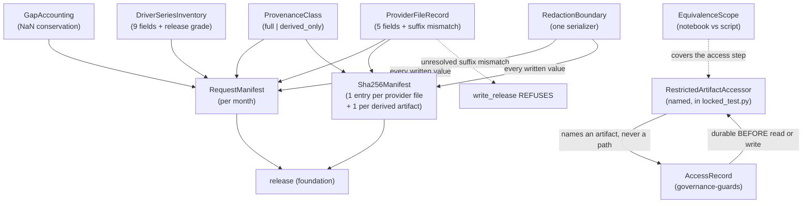

# Domain Entities — `acquisition`

> ## ✳ G-09 IS SIGNED — 2026-08-28, **D-31** (read this before any G-09 statement below)
>
> The project decision owner **signed and approved G-09 (Agent preflight)** on 2026-08-28,
> recorded as **D-31** in `evidence/DECISIONS.md` with change record
> `governance/CHANGE_RECORD_2026-08-28_G09_signed.md`. **Every statement below of the form
> "G-09 is not signed" / "G-09 stays unsigned" is superseded as to the gate's status**, and
> is left standing as the accurate record of the constraint that applied when it was
> written.
>
> ⚠ **D-31 records the gate's own TE §18.3 preconditions as UNMET, and that disclosure
> travels with the signature.** `configs/`, and until 2026-08-28 `src/`, did not exist, so
> the mandated automated zero-TBD preflight **could not run**; the ten named critical tests
> **cannot be executed in this environment** (no Python interpreter is installed — a
> zero-byte Windows Store stub, no registry entry, no interpreter on disk); and the evidence
> artifact `aws_ai_dlc_preflight_report` **does not exist**. "No failing critical test" is
> therefore **unproven, not proven** — an absence of executions, not an absence of failures.
> This is the owner **opening the gate by authority**, not a record that its evidentiary
> conditions were satisfied, and no reader may infer the second from the first.
>
> **What the signature changes here:** module creation is authorised, and any defect this
> unit deferred *solely* because G-09 barred editing a file is now correctable.
> **What it does NOT change:** G-05 and G-06 remain `Blocked`; G-P1A, G-P2, G-P3A, G-P3C
> and G-07 are unaffected; **TE §18.2's absolute rule stands** — every scientific value this
> unit routed to G-04/G-05 **stays routed**, and no agent may fill a freeze-gate value by
> convenience; and **§18.3's stop-and-report obligation survives its own gate**, being a
> standing rule on implementation rather than a one-time gate condition.

**Unit** `acquisition` (Bolt 3) · **Kind** `library` · **Depends on** `foundation`,
`governance-guards`

> **Re-established a sixth time 2026-08-24**, on a **new stage attempt** — Inception closed
> and Construction opened at 2026-08-24T11:46:26Z, resetting the receipt floor for every
> unit. **No content of this unit changed.** Both `foundation` passes of that day touch
> nothing this unit reads, Amendment A was declined so **no count moved**, and its
> `governance-guards` upstream **R-25**–**R-28** re-confirmed with no rule changed. **The
> READY verdict in § Review belongs to the previous attempt.**

> **Re-established a fifth time 2026-08-23**, after a redo aimed at a sibling unit's stale
> cross-references. **No content of this unit changed.**

> **Re-established 2026-08-23 after a redo jump taken to correct this unit.** The TA-08
> primary/supporting row was corrected under the cleared receipt at the project decision
> owner's explicit direction, with both superseded readings recorded in place; the summary
> was re-confirmed; a fresh adversarial pass reviews the corrected text.
>
> **Re-established a second time 2026-08-23** after a further stage-wide redo aimed at
> `external-products`. **No content of this artifact changed then**; the correction applied
> was to this unit's **question file**, which had still carried the false *"largest untested
> share in the plan"* superlative because its receipt was locked.
>
> **Re-established a third time 2026-08-23** after a redo aimed at a misread depth policy in
> `component-methods.md`. **No content changed**; that re-reading **confirms** this unit's
> three owed amendments as genuine cross-package boundary changes. **A fourth** followed a
> sweep of two sibling question files; **no content changed then either.**

The data shapes this unit owns: the two per-month manifests, the per-file provenance
record, the driver inventory, the gap accounting, the provenance class that
distinguishes pre-TC-06 evidence, the equivalence scope binding the notebook to the
script, and the redaction boundary every written value passes through.

**Nothing here is a scientific value.** These shapes *carry* governed values and
record how they were obtained. Every scientific constant this unit consumes —
experiment, kindat, parameters, driver contract, the three F10.7 selection choices —
is frozen elsewhere by a D-number.

## Sources

- `../../../inception/units-generation/unit-of-work.md` § 3 `acquisition` — the `Owns` list, the boundary, the 15 requirements, and BLK-07.
- `../../../inception/units-generation/unit-of-work-story-map.md` — Tables 1 and 2, and § Per-unit coverage summary. **Derived by reading the rows:** 15 requirements, **7** with no acceptance row; **owns** TA-32; **supports** TA-15, TA-16, TA-22, TA-25.
- `../../../inception/requirements-analysis/requirements.md` — REQ-ENG-13; FR-P1-00-1, -2; FR-P1-01-1…-9, -11; REQ-NFR-A1, REQ-NFR-A2; FR-P1-04-11 for the release manifest these manifests feed.
- `../../../inception/application-design/component-methods.md` — `src/data/locked_test.py`, `src/data/release.py`, the §10 credential rule.
- `../../../inception/application-design/services.md` § The nine stage scripts and § Stage entry contract.
- `../../../inception/application-design/component-dependency.md` § Shared resources.
- `../governance-guards/functional-design/domain-entities.md` — `AccessRecord`, `RESTRICTED_ROOT`, `DriverExclusionList`, the `IntegrityError` subclasses this unit raises through.
- `../foundation/functional-design/` — `ConfigSnapshot`, the `IntegrityError` base, the two-tier posture, credential resolution.
- `evidence/DECISIONS.md` — D-5, **D-6** *(cited in the body, added here 2026-08-25, finding F8)*, D-9, D-10.1/.2/.3, D-15, D-18, D-21, D-22, D-23, **D-25, D-26** *(finding F2)*, D-3/D-144, and **D-143** *(Vision-register number for the ICTP rejection; exists there, not in `evidence/DECISIONS.md` — terminal finding N1)*.
- Workspace inspection, 2026-08-23: the twelve `request_manifest.json` / `sha256_manifest.json` pairs, `tests/test_acquisition_window.py`, `scripts/audit_ec1_drivers.py`, `scripts/merge_coverage_year.py`.
- `functional-design-questions.md` (**Q1 through Q9**), `business-logic-model.md`, `business-rules.md`.

---

## Entity map

Text fallback: per-file provenance records feed both manifests, which carry the
provenance class, the gap accounting and the driver inventory, and which feed a
release. An unresolved version-suffix mismatch makes `write_release` refuse. Every
value this unit writes passes through one redaction boundary. Restricted-root access
goes through named accessors in `governance-guards`' `locked_test.py`, which write a
durable access record before the read or write; the notebook's copy of that step is
covered by the declared equivalence scope.

---

## 1. `ProviderFileRecord` — five fields, plus one that decides a release

FR-P1-01-2's five, per retrieved file:

| Field | Meaning |
|---|---|
| `provider` | The retrieval source |
| `permanent_citation` | The citable reference |
| `provider_filename` | **Full filename including the version suffix** — `g.002` versus `g.003` |
| `retrieval_date` | When it was fetched |
| `sha256` | Digest of the bytes as retrieved |

**Sixth field, added by this stage (Q3 = C): `suffix_mismatch`.** Machine-readable,
never console text. Set when the recorded suffix differs from a previously recorded one
for the same logical file.

**Its behaviour is three-step and deliberately not uniform:**

1. **Non-fatal at retrieval.** Provider reissue is normal in this dataset — `g.002`
   versus `g.003` is already observed — and halting on a normal event is how a guard
   gets worked around.
2. **Recorded as a field**, which is the completeness-shortfall tier `team.md`
   § Code Style fixes.
3. **`write_release` refuses** a release carrying an unresolved mismatch. Retrieving a
   reissued file is fine; **releasing it as the recorded one is not.**

> **Noted for stage 3.2, not changed here.** FR-P1-04-11 enumerates §13.3's fourteen
> release fields and **`suffix_mismatch` is not among them**, so the release manifest's
> input contract does not currently carry the field this refusal reads.

**`source_files` carries all six of TE §13.3's items** — provider; permanent citation or request; `location/date` *(the item this artifact had dropped — corrected 2026-08-25 on adversarial finding F3: "location" appeared nowhere in the three artifacts while this sentence claimed all six, reproducing the DATA-09 defect inside the artifact that quotes it)*; filename; retrieval date; SHA-256 — not five — the earlier
five-item list fixed a truncated count as the bar (`DATA-09`).

## 2. `RequestManifest` — per month, and the key that is missing today

Carries the per-month identity fields, the `ProviderFileRecord` list, the
`DriverSeriesInventory`, the `GapAccounting`, and the `ProvenanceClass`.

**`madrigalWeb_version` is required and must be non-empty**, and **an absent key fails
exactly as `"unknown"` fails** (FR-P1-01-3). A single string test was satisfiable by
omission, which is why the requirement states two checks rather than one.

**The live failure is in the workspace today.**
`evidence/locked_test_restricted/audit_evidence_2022-FULL/request_manifest.json` has
**no `madrigalWeb_version` key**, because `merge_coverage_year.py` copies eight identity
fields and drops that one.

> ⚠ **Testing against that artifact is DEFERRED and attached to `RES-04`.** It sits
> under the restricted root, so reading it is a logged December access owing § 9's
> contract. Building the test now would need authorization this stage cannot give, or
> would read the root unlogged.

The **pin also appears in the lock file**, so the recorded version and the installed one
are separately checkable.

## 3. `Sha256Manifest` — one entry per provider file, plus one per derived artifact

FR-P1-01-4's arithmetic: **each month's hash count equals its provider-file count plus
its derived-artifact count.**

**What the existing twelve months hold, read rather than assumed.** Every existing
`sha256_manifest.json` hashes exactly **four derived files** and never the contents of
`raw_isprint_cache/` — and that cache holds isprint **text extractions**, not provider
`.hdf5` bytes. **No provider byte stream exists anywhere in the workspace.** Three of
the twelve months — 2022-04, 2022-07 and 2022-12 — have no `raw_isprint_cache/` at all.
The provider-side term of the arithmetic is therefore **zero** for every existing
month, which is why § 4 exists.

## 4. `ProvenanceClass` — new, and the reason the manifest format stays legible

`full` | `derived_only`.

**`derived_only`** marks a month whose manifest hashes derived artifacts and no provider
bytes — every one of the twelve pre-TC-06 months. **`full`** marks a month acquired
under this contract, where the § 3 arithmetic holds.

**Why a field rather than a document.** Without it the manifest format means two
different things depending on when a month was acquired, with nothing in the artifact
saying which. With it, a downstream consumer — G-P1A, a release, a freeze gate — can
**refuse** a `derived_only` month where full provenance is required, instead of
discovering the gap by reading history.

**Companion field: `producing_interpreter`.** Recorded at re-verification, because
`evidence/experiment_registry.md` records the 2026-08-16 corrected extracts as produced
under **Python 3.14, local** — outside the governed 3.11 pin. Without it, a passing hash
on those files reads as evidence the envelope held. It did not. An out-of-envelope
artifact is **marked as such**, not silently re-verified.

**The freeze-gate refusal is NOT defined here.** `team.md`'s caveat moved when **D-18
(2026-08-21) re-merged FULL**, discharging the **superseded-hash** limb; the
**provenance** limb stands and is **FR-P1-01-11's**. A second, coarser rule here would
be two rules about one fact.

> ⚠ **THE RELEASE-SIDE REFUSAL THIS ENTITY EXISTS FOR HAS NO FIELD TO READ** *(added
> 2026-08-28, `GOV-2026-08-28-FD-01` Recommendation 28, option 1)*. This entity's stated
> purpose is that *"a downstream consumer — G-P1A, a release, a freeze gate — can **refuse** a
> `derived_only` month"*, and the field crosses **no unit boundary**. ⛔ **THAT CLAUSE IS
> SUPERSEDED — REBASED 2026-08-29. The field crosses into a second unit.** *(Corrected on
> adversarial finding F1 of the 2026-08-29 re-confirmation pass, Critical: the rebase was
> written into `business-logic-model.md` § Assumptions on 2026-08-28 and never swept into this
> box, this file's Open item, or `business-rules.md`.)* **Current figures, a dated observation
> and never a live invariant** (derived over the 48 stage artifacts immediately before the
> rebase note was written; writing such a note adds occurrences of each token):
> `provenance_class` **43**, `derived_only` **38**, `producing_interpreter` **17**, split
> `acquisition` **25 / 21 / 11** and `inventory-and-registry` **18 / 17 / 6** — that unit
> acquired the field under `GOV-2026-08-28-FD-01` **Recommendation 29**, which gave it a
> `data07_caveat` sourced from it. **The two stable facts to rely on: the fields reach exactly
> 2 units, and `foundation` carries all three ZERO times.** The second is what this entity's
> argument rests on and is **unchanged**, so nothing here is discharged and the Open item
> below stays open. Superseded figures preserved: Derived 2026-08-28 across
> all **48** artifacts of this stage: `provenance_class` = **9**, `derived_only` = **7**,
> `producing_interpreter` = **3**, all in this unit; **0 in `foundation`**, whose
> `domain-entities.md` enumerates the fourteen §13.3 release fields without it. `write_release`
> raises on an absent §13.3 field, and § 3 establishes that `source_files` cannot be populated
> with provider identity for the twelve months — so **3.5 faces a choice TE §18.3 forbids an
> agent to make**. Recorded as an **Open item for stage 3.2**, amendment **routed to G-P1A**;
> **no fifteenth field is added here**, because §13.3's set and FR-P1-04-11's fourteen are
> approved artifacts and `foundation` declined the analogous unilateral change for D-24's
> protected set. **Nothing here asserts the refusal is implemented.**
> `inventory-and-registry`'s coverage-report DATA-07 caveat reads this same field and is
> sequenced behind this seam.

## 5. `GapAccounting` — the conservation invariant, carried in the manifest

| Field | Meaning |
|---|---|
| `gaps_at_retrieval` | Count of missing values observed as retrieved |
| `gaps_in_artifact` | Count of `NaN` present in the written artifact |
| `series` | Which series or product the counts belong to |

**The invariant: the two counts are equal.** A fill of any kind — named, aliased, or
vectorised — changes the second, so the invariant catches it on branches no fixture
exercises and no static scan can name.

**Why it lives in the manifest rather than only in a test.** **FR-P1-01-9 has no §16/§19
acceptance row.** A manifest field is evidence that survives the absence of a gate; a
test result is not, because nothing is obliged to run it.

**Per-day, per-series breakdown declined.** Useful for TC-20's measured-gap obligation,
but that obligation belongs to FR-P1-01-7's audit report, which exists and carries exact
dates. Two records of one fact drift apart.

## 6. `DriverSeriesInventory` — nine fields, one grade

**All nine of TE §5.1's fields**, not three: provider, role, filename or product
identifier, coverage, retrieval date, checksum, version or release status, licence and
access notes, **and the configuration that consumes it**. A series carrying fewer than
nine **fails**.

The four series, frozen by contract: **Kp/ap3** and **Hp60/ap60** from GFZ, **hourly
Dst** from Kyoto WDC at a **single recorded release grade for all of 2022**, and
**observed (not 1-AU-adjusted) F10.7** from Canada's Solar Radio Monitoring Program.
**SSN is absent**, confirmed by `grep`.

**Release-grade integrity (REQ-NFR-A1)**: one recorded grade per series for calendar
2022; **grades never mixed within a series**; **no backfill from a future final or
definitive archive.** NFR-LEAK-01 governs *timing* only — a series can satisfy its
declared lag while being built from reanalysed values, invisible to every existing check.

**Four fields carry the reanalysed-value check, which is now defined** *(added 2026-08-28,
`GOV-2026-08-28-FD-01` Recommendation 14)*. **As found at the opening of this remediation** the
check was named **3 times, all three in this unit**, and **defined nowhere** across this
stage's **48** artifacts — a pre-remediation figure, since `external-products` R-63 was amended
the same day on the same recommendation as *"the driver-product half only"*. **R-40 now defines
the check** as a **declared-status check with a stated verifiability limit** (the **D-25**
pattern, sanctioned by `CR-2026-08-22-EV-12`) and is authoritative for that definition; this
entity carries its inputs:

| Field | Content |
|---|---|
| `release_status` | The **declared** grade for the whole of calendar 2022, in the provider's own vocabulary. This is the *"version or release status"* slot of the nine, now given an asserted meaning rather than a label |
| `retrieval_date` | When the bytes were retrieved |
| `provider_product_identity` | The **full** provider filename or product identifier, **including any version suffix** — `g.002` versus `g.003` drift is already observed in this project's data |
| `sha256` | Digest of the retrieved bytes |

**Asserted on this entity:** exactly **one** `release_status` per series for 2022; that status
**agrees with** the recorded `provider_product_identity`; and that it is the
**contemporaneous** grade the feature contract requires at a 2022 forecast origin. Where the
held file carries **no correction, revision, version or provenance column** — **D-22's**
finding for `fluxtable.txt` — the **recorded absence plus an explicit unverified-status
statement** is the sanctioned evidence; silence is not.

**The two GFZ series carry a second, substantive limb**, because **Kp/ap3 and Hp60/ap60 have
never been retrieved**: re-acquisition records the **near-real-time and the definitive
product** for 2022 and asserts them **value by value**, a mismatch **raising**.

> **Detection is BOUNDED, NOT CLOSED, for F10.7 and Dst.** On the bytes held, no mechanism can
> detect a reanalysed substitution: **D-21** records F10.7's publication latency as **not
> derivable** from the held file, and Dst's grade is inferable **from the filename alone**
> (`dst_provisional_2022MM.html`) with **D-10.1's 2022-grade item still unchecked** per D-11.
> The entity records a claim about a value for those two rather than detecting one, and the
> residual is an open verification obligation against **G-04**. **Which grade each contract
> requires is Student + Supervisor's**; EC1-R-4's provider-documentation limb is owned outside
> this project.

**Two citation obligations attach to this entity and are discharged before G-P1A**: the
**Kyoto non-commercial-use notice recorded verbatim** (D-6, EC1-R-1) and the **CEDAR
rules-of-the-road and acknowledgment** attached to `madrigalWeb`. **A notice recorded by
reference rather than verbatim fails.**

**Dst is diagnostic/hindcast-only** and never a confirmatory ML feature — and it is the
series `governance-guards` **R-26** names in its bounded driver exclusion, so a
December-dated Dst capture is not a December hit.

## 7. `EquivalenceScope` — new, and what keeps the equivalence test honest

The declared list of behaviours that must match between
`notebooks/00_acquire_phase1_vtec.ipynb` and `scripts/00_acquire_prepared_vtec.py`
(REQ-ENG-13, TA-16), and those that need not.

| Must match | Need not match |
|---|---|
| `request_manifest.json` contents | Display and progress output |
| `sha256_manifest.json` contents | Cell structure |
| File hashes | Ordering of non-semantic output |
| NaN handling and the § 5 gap accounting | — |
| Refusal paths — missing input, Internet-access failure, G-P1A refusal | — |
| **The restricted-artifact access step (§ 9)** | — |

**Why the scope is an entity rather than a paragraph.** Without a declared scope,
"behaviourally equivalent" is renegotiated every time the test fails, which is how such
a test ends up relaxed until it proves nothing. A textual diff — TA-16's literal
evidence wording — cannot carry the requirement, because two implementations can be
behaviourally identical and textually different.

**The notebook's six declarations** (REQ-ENG-13, distinct from REQ-ENG-12's four): its
own version, year and stations, source URLs, retrieval timestamp, destination paths,
resulting hashes. **Its four prohibitions**, each with a check that **fails** when the
prohibited operation is introduced: no TEC/VTEC calculation from observations, no `los`
mapping, no model features, no training.

**Both are run against a recorded-response fixture**, never the live provider.

## 8. `RedactionBoundary` — one serializer, every written value

Every value this unit writes to a manifest, log or notebook output passes through one
declared serializer that **refuses unredacted credential-shaped values**.

**Two named carriers, because they are the realistic ones**: a **signed request URL**
and an **auth header**. An acquisition client has both in hand naturally, and both are
things a manifest or log would carry without anyone deciding to put them there.

**One chokepoint rather than a rule repeated at every write site** — the same shape as
`governance-guards` R-28 — and directly testable: feed it a token-shaped value and
assert refusal. **"Credential-shaped" is heuristic**, and that is stated rather than
hidden.

**Companion, and the limb a serializer cannot reach: notebook outputs are cleared as a
precondition of commit.** Saved output cells are committed artifacts, and they are where
§10's "never in a notebook" would be breached in practice.
`notebooks/madrigal_phase1_coverage_audit.ipynb` exists in the workspace today.
`team.md` § Way of Working already commits this project to a pre-commit hook once git
exists.

**TA-22's secret scan** — tree, history, configs, logs and artifacts, owned by
`foundation` with this unit supporting — remains, but it is detection **after** the
artifact exists.

## 9. `RestrictedArtifactAccessor` — named, and not this unit's to hold

**Not owned here.** It lives in `governance-guards`' `src/data/locked_test.py`; this
unit is its first consumer, and the entity is recorded here because the shape of the
call is what BLK-07's contract fixes.

`acquisition` names an **artifact**, never a path: `open_d9_input(record)` for
`audit_evidence_2022-FULL/`, and a restricted **writer** for re-acquired December bytes.

**Each accessor COMPOSES `open_restricted`; none reimplements it.** A thin named wrapper
resolves the artifact name to a path under `RESTRICTED_ROOT` and **delegates**, so the
append, flush, durability confirmation and raise all live in the one approved function.
That is what makes BLK-07's literal *"through `governance-guards.open_restricted`"* true
by name rather than by resemblance, and what keeps **"one path in" a claim about code
paths** rather than about behaviour that merely matches.

> ⚠ **`open_d9_input` DOES NOT EXIST in the approved contract.** `component-methods.md`'s
> `src/data/locked_test.py` block defines only `RESTRICTED_ROOT`, `AccessRecord`,
> `open_restricted` and `assert_no_december_outside_restricted`. The accessors are the
> **first** of this unit's three amendments owed — see the box below — and BLK-07's
> central mechanism is therefore **not yet an approved contract**, only a proposed one.

**Why named rather than a direct `open_restricted` call with a constructed path.**
`governance-guards` **R-28** asserts by static check that no module outside
`locked_test.py` contains the restricted-root literal. A named accessor satisfies that
**by construction**: there is no string in `acquisition` for the check to find.

**`AccessRecord` needs values it does not have.** Its approved `purpose` enum is
`"coverage_audit" | "regime_audit" | "locked_evaluation"`, and `authorization` is typed
as *"the G-05 signature reference, or the audit authority"*. **None fits an acquisition
read, and none fits a write at all.** Q2 = C extends the enum with `acquisition_read`
and `acquisition_write`, widens `authorization` to name a D-number, and gives the write
path **its own function with log-before-WRITE ordering** — because a partially written
December artifact with no access row is a worse failure than a blocked read, and the
approved contract is written around *"before the read"*.

> **THREE amendments owed to approved stage-2.6 contracts, stated not applied.** **The
> named accessors themselves** (`open_d9_input` and the restricted writer), **the
> `AccessRecord.purpose` extension**, and — in `src/data/release.py` — **`write_release`'s
> `identity_fields` parameter** (§ 2). All three need change records. This stage records
> the requirements and edits neither file.
>
> **Corrected 2026-08-23 after an adversarial pass**, which found the first issue listing
> only two and omitting the accessors — the very symbols BLK-07's mechanism rests on.
>
> **Recording a knowingly wrong `purpose` was rejected.** The access log's value is that
> a G-05 reviewer reads its rows as meaning what they say; a false `coverage_audit` row
> describes an audit that never happened.

**Raised for `governance-guards`, not built here**: an enum-membership test pinning the
declared values exactly. Pinning a sibling unit's enum from this unit would invert
ownership.

> ## ⚠ BLK-07's AUTHORIZATION LIMB IS NOT CLOSED
>
> This entity fixes **how** a restricted access is routed. **Which units may reach the
> locked month, and when, is the project decision owner's decision.** Nothing here
> grants, implies or substitutes for it. **No acquisition run may touch calendar
> 2022-12 while BLK-07 stands.**

## 10. `IntegrityError` subclasses raised here

Deriving from `foundation`'s base, each carrying the affected resource and the violated
expectation:

> **Base class, stated 2026-08-25 to discharge this unit's half of the cross-unit exception
> obligation** (created by `foundation`'s R-01 after these artifacts were written). **Every
> exception in the table below derives from `IntegrityError`, imported from
> `src/data/config.py`** — a legal import, this unit depending on `foundation`. `AcquisitionError`
> and `CredentialEgressError` are unit-local *(per-unit naming is the convention `component-methods.md` § Assumptions defers to 3.1; this unit's Q1 concerns the restricted-root path, not exceptions — misattribution corrected 2026-08-25, finding F5)* and derive from the base
> under R-01's *"any future integrity-related exception"* clause; any exception listed below that
> `foundation` or `governance-guards` owns is already in the hierarchy at its owner. **Why it
> matters:** the stage-entry contract writes the `aborted` registry row by catching
> `IntegrityError` — outside the hierarchy, a credential-egress violation would exit unrecorded,
> in the unit that owns the redaction boundary.

| Exception | Raised when |
|---|---|
| `AcquisitionError` | A retrieval applies a transformation; a required declaration or inventory field is absent; a driver series carries fewer than TE §5.1's nine fields |
| `ReleaseError` | An identity field disagrees across source manifests; `identity_fields` is empty; a release carries an unresolved `suffix_mismatch`; a field of §13.3's fourteen is absent |
| `LockedTestError` | Raised **through** `governance-guards`' accessor — a log write or durability failure, before any read or write proceeds |
| `PhaseBoundaryError` | Raised **through** the stage entry contract's step 4 |
| `CredentialEgressError` | The redaction boundary is handed an unredacted credential-shaped value |

Catching `foundation`'s base is what lets the stage entry contract write the `aborted`
registry row for any of them.

---

## Requirement coverage

Derived from story-map Table 1, with owners from Table 2's `primary` cell. Both paths
cross-checked and in agreement.

| Requirement | Entities | Tested by (Table 1) | Row primary owner |
|---|---|---|---|
| REQ-ENG-13 | `EquivalenceScope` | TA-16 | `regimes-diagnostics-reporting` |
| FR-P1-00-1 | — (evidence set, § W-10) | TA-31 — **no Table 2 owner row** *(finding F4, 2026-08-25)* | — *(superseded: "`acquisition` supporting")* |
| FR-P1-00-2 | — (lineage check, § W-10) | TA-25 | `inventory-and-registry` |
| FR-P1-01-1 | `RequestManifest`, `Sha256Manifest` | TA-32 | **`acquisition`** |
| FR-P1-01-2 | `ProviderFileRecord` | TA-15 | `foundation` |
| FR-P1-01-3 | `RequestManifest` | TA-03, TA-15 | `foundation` |
| FR-P1-01-4 | `Sha256Manifest`, `ProvenanceClass` | TA-04, TA-15 | `foundation` |
| **FR-P1-01-5** | `RequestManifest` | ⚠ **NO ROW** — test exists and is **green** | — |
| FR-P1-01-6 | `DriverSeriesInventory` | TA-08 | `features-and-splits` (`external-products` supporting) |
| **FR-P1-01-7** | `DriverSeriesInventory`, `GapAccounting` | ⚠ **NO ROW** | — |
<!-- TA-08 row corrected twice, 2026-08-23. First issue reversed primary/supporting; the
     iteration-1 fix corrected the primary and added "this unit and" to the supporting
     list — a claim story-map Table 2 does not make. This unit supports TA-15, TA-16,
     TA-22 and TA-25; TA-08's supporting unit is `external-products` alone. -->

| **FR-P1-01-8** | `DriverSeriesInventory` | ⚠ **NO ROW** | — |
| **FR-P1-01-9** | `GapAccounting` | ⚠ **NO ROW** | — |
| **FR-P1-01-11** | `ProvenanceClass` | ⚠ **NO ROW** | — |
| **REQ-NFR-A1** | `DriverSeriesInventory` | ⚠ **NO ROW** | — |
| **REQ-NFR-A2** | `RequestManifest` | ⚠ **NO ROW** — test exists and is **green** | — |

**15 requirements, 7 without an acceptance row.** **Corrected 2026-08-23 after an
adversarial pass:** the first issue read *"the largest untested share of any unit in the
plan"*, which the cited story-map § Per-unit coverage summary contradicts. Derived from
that table: **`acquisition` 7/15, `models-and-baselines` 7/9,
`regimes-diagnostics-reporting` 7/11** — a **three-way tie on the raw count of 7**, and by
*share* `acquisition` is the **smallest** of the three at 46.7%. A superlative built on a
correct numeral is exactly the failure `project.md` § Corrections records. **Owns** TA-32; **supports** TA-15, TA-16, TA-22, TA-25.

> ## The seven are two different things, and the distinction is the point
>
> **Class 1 — tested without a row (2).** FR-P1-01-5 and REQ-NFR-A2 both discharge onto
> `tests/test_acquisition_window.py`, which **exists and is green**. They lack a row,
> not a test. Closing them needs a Vision §15.2 change record and nothing else.
>
> **Class 2 — untested and unrowed (5).** FR-P1-01-7, -8, -9, -11 and REQ-NFR-A1 lack
> both. `business-logic-model.md` § The seven states **what evidence would close each**,
> and deliberately **drafts no §19 criterion**: a drafted criterion in a
> functional-design artifact is indistinguishable, months later, from an approved one,
> and §19 rows are owned by stage 3.2 and change control.
>
> Both classes are named wherever the count **7** appears, so a later sweep keyed to the
> numeral does not miss the qualitative claim.
>
> **No artifact, manifest or report may state or imply that any of the seven is covered,
> satisfied or verified.** For Class 1 the test passing is not a row; for Class 2
> designing the mechanism is not a test.

## Assumptions & Open Questions

- **[assumption]** Rule IDs continue the single sequence — `foundation` R-01…R-17, `governance-guards` R-18…R-29 — so `business-rules.md` opens at **R-30**. If per-unit numbering was intended, say so at the gate.
- **[assumption]** `tests/test_acquisition_window.py` is this unit's, per `unit-of-work.md` § 3 `Owns`. It exists and is green.
- **[assumption]** `frontend-components.md` is not produced — `kind: library`, mapped to `[ui]` only.
- **[assumption]** `RestrictedArtifactAccessor` is `governance-guards`' entity; this unit consumes it and does not own it.
- **[assumption]** The re-acquisition is future work outside this stage's scope; its December limb is barred while BLK-07 stands.
- **Open — BLK-07's authorization limb.** § 9 fixes the mechanism only.
- **Open — THREE amendments owed to approved stage-2.6 contracts**: **the named accessors** (`open_d9_input` and the restricted writer, absent from the approved `locked_test.py` block), the `AccessRecord.purpose` extension plus a restricted-write function, and `write_release`'s `identity_fields` parameter. Stated, not applied; all three need change records. The first is BLK-07's central mechanism, so BLK-07's contract is **proposed, not approved**, until it clears change control.
- **Open — noted for stage 3.2:** `suffix_mismatch` is not among FR-P1-04-11's fourteen release fields, which § 1's refusal reads.
- **Open — noted for stage 3.2:** **`provenance_class` (§ 4)** is not among FR-P1-04-11's fourteen release fields, which **§ 4's release-side refusal reads** *(added 2026-08-28, `GOV-2026-08-28-FD-01` Recommendation 28, option 1 — the same form as the `suffix_mismatch` bullet above)*. § 4 states the field exists so *"a downstream consumer — G-P1A, a release, a freeze gate — can **refuse** a `derived_only` month"*, and § 3 establishes that **no provider byte stream exists anywhere in the workspace** for the twelve pre-TC-06 months. ⛔ **REBASED 2026-08-29 — the "all in this unit" clause is superseded; the field reaches TWO units.** *(Corrected on adversarial finding F1, Critical — the 2026-08-28 rebase reached only `business-logic-model.md` § Assumptions and was never swept here.)* **Current figures, a dated observation and never a live invariant** (derived over the 48 stage artifacts immediately before the rebase note was written; writing such a note adds occurrences of each token): `provenance_class` **43**, `derived_only` **38**, `producing_interpreter` **17**, split `acquisition` **25 / 21 / 11** and `inventory-and-registry` **18 / 17 / 6** — that unit acquired the field under `GOV-2026-08-28-FD-01` **Recommendation 29**, which gave it a `data07_caveat` sourced from it. **The two stable facts: the fields reach exactly 2 units, and `foundation` carries all three ZERO times.** The second is what this item's argument rests on and is **unchanged**, which is why it stays Open. Superseded figures preserved: Derived 2026-08-28 across all **48** artifacts of this stage: `provenance_class` = **9**, `derived_only` = **7**, `producing_interpreter` = **3**, **all in this unit; 0 in every other unit including `foundation`**, whose `domain-entities.md` enumerates all fourteen §13.3 release fields without it. `write_release` therefore faces a choice **§18.3 forbids an agent to make** — no writable Phase 1 release, or `source_files` accepted with placeholder provider terms. **No fifteenth field is added here**: §13.3's set and FR-P1-04-11's fourteen are approved artifacts, and `foundation` declined the analogous unilateral change for D-24's protected set. Routed to **G-P1A / stage 3.2**; `code-generation` must **stop and report**. `foundation`'s half is **gate input**, not an edit to a sibling's files.
- **Open — raised for `governance-guards`:** an enum-membership test pinning `AccessRecord.purpose`.
- **Open — `RES-04`**, not started and deliberately not attempted. § 2's real-artifact test defers to it.
- **Open — `RES-01`**, permitted-read access logging is NOT TESTED, owned by stage 3.2.
- **Open — FULL's provenance limb**, unverifiable in principle. D-18 discharged only the superseded-hash limb. Owned by FR-P1-01-11.
- **Open — two of D-144's four attached freezes.**
- **Open — the F10.7 measured gap**, to be recorded and governed before any imputation.
- **Open — the Kyoto and CEDAR notices**, to be recorded verbatim before G-P1A.
- **G-09 is not signed.** ⚠ **G-09 IS SIGNED as of 2026-08-28 (D-31)** — this prohibition's stated ground no longer holds, and module creation is authorised. **The other grounds stated alongside it, if any, are untouched**, and D-31's disclosure travels with the signature: the §18.3 preflight never ran, the critical tests are unexecuted in this environment, and `aws_ai_dlc_preflight_report` does not exist. **No scientific value becomes fillable** — TE §18.2 and §18.3's stop-and-report rule are unchanged. No entity here authorises creating `scripts/00_acquire_prepared_vtec.py` or any module.
- **None** of the above adopts a reading on a supervisor-owned value, and none decides a scientific constant.

---

> **Re-saved 2026-08-24 under the post-redo receipt floor.** The project decision owner
> authorised a redo jump on `functional-design` at 2026-08-24T14:57:07Z so that three
> standing reviewer findings on `models-and-baselines` could be fixed and re-reviewed;
> a redo resets the receipt floor for **every** unit of the stage. **No content of this unit
> changed** — not a question, answer, amendment, rule, entity, workflow, count or scientific
> value. The only artifacts edited after the redo were `models-and-baselines`'s, whose
> three fixes are confined to its own files. That unit returned **READY** on the second pass of
> the restored budget, which is what the redo was authorised for. The two residuals riding that
> verdict — R-96's `PartitionError` mechanism and R-95's field label — are carried to the stage
> gate rather than applied, per the rule that a suggestion riding a READY verdict is gate input.

---

> **Re-saved 2026-08-25 under the eleventh-redo receipt, after the terminal-pass remediation.**
> In this file: § 1's six-item `source_files` sentence had its nested-bold rendering fixed (N7);
> the FR-P1-00-1 row states TA-31 has **no Table 2 owner row** (F4, from the prior pass); and the
> Sources list carries the **two-register note** — D-143 is the Vision-register ICTP rejection,
> not a phantom (N1). No entity changed; figures unchanged (15 requirements, 7 untested, 1
> acceptance row). **G-09 remains unsigned. ⚠ **G-09 IS SIGNED as of 2026-08-28 (D-31)** — this prohibition's stated ground no longer holds, and module creation is authorised. **The other grounds stated alongside it, if any, are untouched**, and D-31's disclosure travels with the signature: the §18.3 preflight never ran, the critical tests are unexecuted in this environment, and `aws_ai_dlc_preflight_report` does not exist. **No scientific value becomes fillable** — TE §18.2 and §18.3's stop-and-report rule are unchanged.**

---

> **Re-saved unchanged 2026-08-26 under the third receipt** (twelfth redo, taken for
> `inventory-and-registry`; floor reset mechanical). **No content of this unit changed** since its
> READY. **G-09 remains unsigned. ⚠ **G-09 IS SIGNED as of 2026-08-28 (D-31)** — this prohibition's stated ground no longer holds, and module creation is authorised. **The other grounds stated alongside it, if any, are untouched**, and D-31's disclosure travels with the signature: the §18.3 preflight never ran, the critical tests are unexecuted in this environment, and `aws_ai_dlc_preflight_report` does not exist. **No scientific value becomes fillable** — TE §18.2 and §18.3's stop-and-report rule are unchanged.**

---

> **Re-saved unchanged 2026-08-26 under the fourteenth-redo re-confirmation receipt** (redo taken
> for `external-products`; floor reset mechanical). **No content of this unit changed.**
> **G-09 remains unsigned. ⚠ **G-09 IS SIGNED as of 2026-08-28 (D-31)** — this prohibition's stated ground no longer holds, and module creation is authorised. **The other grounds stated alongside it, if any, are untouched**, and D-31's disclosure travels with the signature: the §18.3 preflight never ran, the critical tests are unexecuted in this environment, and `aws_ai_dlc_preflight_report` does not exist. **No scientific value becomes fillable** — TE §18.2 and §18.3's stop-and-report rule are unchanged.**

---

> **Re-saved 2026-08-28 under the post-redo receipt, remediating `GOV-2026-08-28-FD-01`
> (verdict FAIL) on the project decision owner's ruling — mechanism written, value routed to
> the gate.** **In this file: § 6 `DriverSeriesInventory`** gained the four fields the now-defined
> **reanalysed-value check** reads (`release_status`, `retrieval_date`,
> `provider_product_identity` **including any version suffix**, `sha256`), the three assertions
> over them, the sanctioned-evidence rule for a file with no provenance column, the **GFZ
> two-product value-by-value limb** for the two series never retrieved, and the explicit
> statement that **detection is bounded, not closed, for F10.7 and Dst** (**Recommendation
> 14**; R-40 carries the rule and the re-worded negative controls). **§ 4 `ProvenanceClass`**
> gained a ⚠ box naming the release-side seam at its point of use, and **one Open item** was
> added in the `suffix_mismatch` form (**Recommendation 28**). **No fifteenth release-manifest
> field was added**: the amendment is routed to **G-P1A / stage 3.2**, and `foundation`'s half
> is gate input.
>
> **Counts derived 2026-08-28, printed before assertion.** Numbered entity sections **10**
> (§ 1…§ 10) — unchanged, none added or removed. `provenance_class` **9**, `derived_only` **7**,
> `producing_interpreter` **3** across this stage's **48** artifacts, all still inside this unit.
> **No scientific value was decided.** **G-09 remains unsigned**; **BLK-07's authorization limb
> remains open**; membership stays derived from **record timestamps**, never a directory name.

---

> **Re-confirmation receipt, 2026-08-29.** The 2026-08-27T21:49:36Z REDO jump reset every
> unit's receipt floor. This unit's content had already changed after that floor — provenance_class
> figures rebased with basis stated, G-09 signed under D-31 with its §18.3 preconditions
> disclosed unmet — so the owner re-confirmed the unchanged post-rebase content via the
> Consolidated Summary Confirmation at the foot of `functional-design-questions.md`, receipted
> `2026-08-29`. No line above this marker was touched by this pass. **The `provenance_class` 9 /
> `derived_only` 7 / `producing_interpreter` 3 counts above remain the dated observation their own
> basis line describes, not a live invariant re-derived by this pass.**
