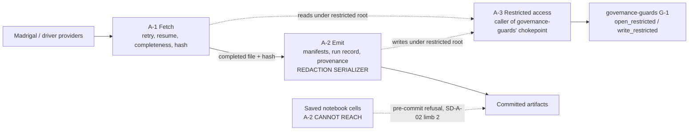

# Logical Components — `acquisition`

**Unit** `acquisition` (Bolt 3) · **Kind** `library` · **Stage** `nfr-design`

> **Re-saved 2026-09-02, content unchanged.** A `STAGE_JUMPED` redo of `nfr-design` — ordered
> by the project decision owner to repair a Critical finding in the sibling unit
> `external-products` — cleared this stage's per-unit checkpoint and review receipts for every
> unit. This unit's decomposition was **not** revised; the summary was re-confirmed and the
> artifact re-saved so the required receipts exist again. **No component, boundary or status
> claim is altered by this note.**
>
> **Repeated once more the same day**, after a second owner-directed redo, **and a third
> time** after the seventh reviewer pass on `external-products`.
>
> **And a fourth redo 2026-09-04**, to repair two Majors in `target-standardization`. **This
> unit was untouched by all four.**
>
> **And a fifth re-save 2026-09-04 — not a redo.** This stage's final pass ran on another clone
> of this repository, rooted at a different absolute path; the engine's completion check matches
> each artifact against the path recorded in its write receipt, so those confirmed writes are
> unreachable from this clone. The consolidated summary confirmation of `2026-09-04T14:07:48Z`
> **stands and was not re-asked**. This paragraph is the native-tool write that re-registers the
> artifact here. **No component, boundary or status claim is altered by this note.**

> ## ⚠ ALL THREE COMPONENTS ARE UNBUILT
>
> Written against the **workspace as it is on 2026-09-01**, per the owner's ruling, with
> `nfr-requirements` left unchanged. See `security-design.md` § SD-A-00 for the three
> upstream status claims this contradicts.
>
> **Nothing in this unit exists as code.** No retrieval module, no manifest writer, no
> **redaction serializer** (zero hits for `CredentialEgressError` or any redaction helper
> across `src/`, `scripts/`, `tests/`), no **`write_restricted`**. The one thing that does
> exist is the **read** accessor this unit calls — `open_restricted`, which is
> **`governance-guards`' module**, not this unit's.
>
> `scripts/merge_coverage_year.py` exists and already routes its restricted reads through
> that chokepoint via a `guarded()` helper — it is **pre-existing code this unit's design
> must eventually absorb**, not an implementation of the components below.
>
> **This is a logical decomposition, not an infrastructure deployment.** No services, no
> processes, no network boundaries. **G-09 signed (D-31), preconditions UNMET**; **stage
> 3.1 remains FAIL**.

## Sources

- `security-design.md` — **SD-A-00** … **SD-A-04**, this stage's sibling artifact; the boundaries below are where those decisions land, and § SD-A-00 carries the workspace evidence.
- `nfr-requirements/security-requirements.md` — **SEC-A-01** … **SEC-A-05** as the requirement set; **status claims superseded**.
- `nfr-requirements/tech-stack-decisions.md` — **TS-A-01** … **TS-A-05**, in particular **TS-A-04** (notebook and script are one behaviour within a declared scope).
- `functional-design/business-rules.md` — **R-31** (membership from record timestamps), **R-32**, **R-33**, **R-34**, **R-36**, **R-37**, **R-39**.
- `functional-design/business-logic-model.md` — **W-2**/**W-2a**, **W-3**, **W-4**, **W-9**.
- **The workspace, read 2026-09-01** — `src/data/locked_test.py`, `scripts/merge_coverage_year.py`, `evidence/locked_test_restricted/audit_evidence_2022-FULL/`.
- `../../governance-guards/nfr-design/logical-components.md` — **G-1**, the run-time guard component this unit's C-3 calls.
- `../../../inception/requirements-analysis/requirements.md` — **REQ-ENG-13**, **FR-P1-01-1** … **FR-P1-01-7**, **FR-P1-01-10**, **NFR-SEC-01**, **NFR-AUD-01**, **NFR-DQ-01**.
- `nfr-design-questions.md` — Q4 = A, and the receipted Consolidated Summary Confirmation.

---

## The boundary criterion (Q4 = A)

**The boundary is drawn on egress direction**, because SEC-A-03 states this unit's security
property outright: *"the live risk in this unit is egress."*

> **A failed fetch fails a run. A leaked credential in a manifest is permanent.**

Those are different failure kinds with different reversibility, and they run along the axis
of **which way data is moving** — in from a provider, or out into a committed artifact.

**Why not "acquire / verify / publish".** It reads naturally and maps to how the work would
be described aloud. But **"verify" spans both directions** — a fetch-side completeness check
and an emit-side hash comparison — so that boundary would cut **across** the egress property
rather than along it, putting the redaction chokepoint on a seam.

**Why not one component.** True to how callers import it, silent on the only property this
unit's design is actually about.

**Consistency with the sibling units, without a shared template.** `foundation` split on
**write-integrity**, `governance-guards` on **enforcement timing**, this unit on **egress
direction**. Each chose the axis its own failures run along. That the three differ is the
point: a template applied uniformly would have hidden at least two of the three properties.

---

## Component inventory

| # | Component | Contents | Failure kind | State |
|---|---|---|---|---|
| **A-1** | **Fetch** | Retrieval client; bounded retry with backoff; resumption; the completeness check; hashing **of the completed file** | **Fails the run**, loudly, before anything is emitted | **Unbuilt** |
| **A-2** | **Emit** | Manifest writing; the run record; provenance fields incl. version suffixes; **the redaction serializer** | **Permanent** — a leaked credential or a wrong provenance field enters a committed artifact | **Unbuilt** |
| **A-3** | **Restricted access** | Calls `open_restricted` for reads; calls `write_restricted` for writes | **Governance** — an unlogged access or an unrecorded mutation | **Read side exists (not ours); write side unbuilt** |

### A-1 — Fetch

**Isolation property.** A-1 **never emits**. Its outputs are a completed file and a
hash — both handed to A-2, which decides what is written. That is what allows the
completeness check to precede hashing without an emit path in between.

**Failure mode, and the one that matters.** An interrupted retrieval leaves the target
**absent** or **explicitly marked incomplete** — never a short file that looks whole. The
hash is computed **over the completed file**, because a truncated file hashed at truncation
produces a manifest that **verifies against itself forever**, and no later integrity check
in this project can surface that.

**Why hashing sits here and not in A-2.** It is the last fetch-side act, not the first
emit-side one: it answers *"did I receive what I asked for"*, which is A-1's question. A-2
writes the hash it is given; it does not compute one.

### A-2 — Emit

**Isolation property, and the reason for this boundary.** **Every value leaving this unit
passes through A-2**, so the **redaction serializer sits inside the component whose whole
job is emitting** — at the point every value it must inspect already crosses. A serializer
placed anywhere else would have values reaching artifacts around it.

**Failure mode.** `CredentialEgressError` at **integrity tier**: the run terminates and an
`aborted` row is written through the `IntegrityError` catch. Signed request URLs and auth
headers are refused **unconditionally**; everything else is blocked by the broader heuristic,
which **names what it matched**.

**What A-2 cannot reach, stated here rather than in Assumptions.** **Saved notebook output
cells.** They are committed artifacts written by a process A-2 is not inside, which is why
SEC-A-03 limb 2 puts a **pre-commit refusal** there instead. A component diagram that
implied A-2 covered all egress would be wrong in the one place it matters.

### A-3 — Restricted access

**The read side is not this unit's code.** `open_restricted` lives in
`src/data/locked_test.py` — **`governance-guards`' module** — and A-3 **calls** it. R-32
requires every restricted read to go through that named accessor and forbids this unit
constructing an ad-hoc path.

**The write side is designed here and lives there too.** Per Q2 = A, `write_restricted` is a
**sibling function in the same module**, sharing `_append_and_flush` and the same boundary
derivation, **logging durably before it writes**.

> **Why the write contract is not inside A-3's own module.** Placing it here would make a
> **second module name the restricted-root literal**, taking `governance-guards`' exempt
> list from **seven to eight**. DISC-1 at that unit records what each new holder costs — the
> seventh was admitted only because a membership assertion **fired on first run**. D-15's
> boundary *"does not weaken slightly; it ends."*
>
> **A-3 is therefore a caller, not an owner.** Its component boundary encloses **the calls
> and their contracts**, not the chokepoint.
>
> ⚠ **And the amendment A-3 calls is UNAPPROVED, not merely unbuilt** *(added 2026-09-04 on
> adversarial finding 3, Major)*. `component-methods.md`'s approved block for that module
> carries no `write_restricted` and no `_append_and_flush`, and R-33 states the writer and the
> `AccessRecord.purpose` extension *"need change records"*. Q2 = A is a proposal to that
> change-control gate; `governance-guards` must accept the interface amendment before anything
> exists to build.

---

## Shared resources and the egress boundary

**Text fallback.** Providers feed **A-1**, which hands a completed file and its hash to
**A-2**; A-2 is the only path to committed artifacts. Both A-1 and A-2 reach the restricted
root **only through A-3**, which calls `governance-guards`' G-1. **Saved notebook cells
reach committed artifacts without passing through A-2** — the dotted path A-2 cannot cover,
which is why a **pre-commit refusal** guards it instead.

**The shared resource is `foundation`'s credential resolution**, consumed **read-only** and
**never held**: A-1 obtains credentials for the provider client from the environment via
that interface, and **no credential value is written, logged, serialized or persisted**
anywhere in A-2's outputs. The one-way arrow matters — credentials enter A-1 and must not
appear downstream of it.

---

## Requirement coverage

| Requirement | Component | Acceptance row | Status |
|---|---|---|---|
| FR-P1-01-1 | A-1 | **TA-32** | `Pending` |
| FR-P1-01-2 | A-1, A-2 | **TA-15** | `Pending` |
| FR-P1-01-6 | A-3 | TA-08 | `Pending` |
| **FR-P1-01-10** | A-2 | TA-22 — **row owned by `foundation`, this unit supporting** | `Pending` — **NOT MET** |
| **NFR-SEC-01** | A-2 | TA-22 — **row owned by `foundation`, this unit supporting** | `Pending` — **unclaimed** |
| **NFR-AUD-01** | A-3 | **TA-10** (owned by `foundation`), **TA-21** (owned by **`fixtures-and-reproducibility`**) — this unit supporting both | `Pending` *(owner corrected 2026-09-04, mirroring `security-design.md`'s dated correction; superseded: "`foundation`/`inventory-and-registry`")* |
| **NFR-DQ-01** | A-2 | **TA-19** — **row owned by `target-standardization`, this unit supporting** | `Pending` |

**Derived and printed**: 3 components (A-1…A-3); **7** coverage rows — counted directly
from the table above. **0** rows claimed satisfied; **0** components built.

> ⚠ **CORRECTED 2026-09-04 on adversarial findings 1 and 2, both Critical.** FR-P1-01-1's and
> FR-P1-01-2's acceptance cells both read **TA-25** — FR-P1-00-2's real row, not theirs;
> `requirements.md`'s own rows give **TA-32** and **TA-15** respectively (the same shifted-row
> defect corrected across eight cells in `security-design.md`, whose correction box carries the
> full derivation). And four of this table's seven rows are **owned by other units** per
> `unit-of-work.md` — kept because A-2/A-3 genuinely contribute to each, now labelled with
> their owners instead of implying this unit's coverage. This unit's own **REQ-NFR-A1 and
> REQ-NFR-A2** (previously absent from both artifacts) are carried in `security-design.md`'s
> table; they raise **no component-boundary question** — both are SD-A-04 data-integrity
> obligations inside A-2's existing boundary — so they are decomposition-irrelevant here by the
> same rule the § Relation paragraph below applies to the other SD-only rows.

**Relation to `security-design.md`'s 19 rows, printed as a decomposition** *(figure corrected
2026-09-04 on adversarial finding 2; superseded: **14**, then **17**. This heading is exactly
the kind of site a correction keyed to the table alone would have missed — the count also
lives in the sentence introducing it, which is precisely where it went stale a second time)*
— the two tables
are **not nested**, so no single "N fewer" subtraction describes them; a subtraction of that
form went stale three times running on `models-and-baselines` at the previous stage:

- **7 rows shared** — FR-P1-01-1, FR-P1-01-2, FR-P1-01-6, FR-P1-01-10, NFR-SEC-01, NFR-AUD-01, NFR-DQ-01.
- **12 rows in `security-design.md` only** *(superseded: **7**, then **10**)* — REQ-ENG-13, FR-P1-00-1, FR-P1-00-2, FR-P1-01-3, FR-P1-01-4, FR-P1-01-5, FR-P1-01-7, the three added by the 2026-09-01 sweep (**FR-P1-01-8**, **FR-P1-01-9**, **FR-P1-01-11**), and the two added by adversarial finding 2 (**REQ-NFR-A1**, **REQ-NFR-A2** — this unit's own carried requirements, previously absent from both artifacts). Each is an obligation on **what a component does** rather than on **where a boundary sits** — the five late additions all land inside **A-2**'s emit responsibilities without moving a boundary.
- **0 rows here only.**
- **7 + 12 = 19**, matching `security-design.md`'s corrected total *(superseded: 7 + 7 = 14, then 7 + 10 = 17)*.

> **A decomposition that verifies is not evidence the decomposed set is complete.** That
> lesson came from `foundation` at this stage, where a sound 3/3/0 split sat over a row set
> missing three requirements. **The ID set here was set-differenced against
> `requirements.md` before either table was written** — and that sweep was still incomplete,
> because it ranged over `FR-P1-01-*` only and missed this unit's own **REQ-NFR-A1/A2**
> (adversarial finding 2). The correct range is the unit's full "Requirements carried" list,
> not one prefix family. The lesson compounds rather than replaces: a verified decomposition
> proves neither completeness of the set nor correctness of each cell's **value** — the eight
> wrong acceptance rows survived every set-level check ever run on this stage.

## Assumptions & Open Questions

- **[Q4 / A-2]** **The redaction serializer does not exist**, so A-2's defining property is **specified and unenforced**. Its heuristic is explicitly heuristic; only the two named carriers are rules.
- **[A-2]** **A-2 cannot reach saved notebook cells.** The pre-commit refusal is the only guard on that path, and **it does not exist either**.
- **[A-3]** **`write_restricted` does not exist.** The read side does — and it is **`governance-guards`' code**, so A-3's correctness rests on a sibling's module.
- **[A-1]** **Retry count, backoff schedule and timeout are owed at 3.5**, each to be recorded in the run record.
- **[assumption]** `scripts/merge_coverage_year.py`'s existing behaviour can be absorbed into A-1/A-2/A-3 without changing what it produces. **Unverified** — nothing has been migrated, and D-18's re-merge is a governed artifact that must not be silently re-derived.
- **[carried — DATA-07]** The twelve pre-TC-06 months are **unverifiable in principle**; **2022-04, 2022-07 and 2022-12** hold no `raw_isprint_cache/`. No component below changes that.
- **[carried]** The **NFR-SEC-01 / Madrigal-identity conflict is the supervisor's**; **no reading is adopted**.
- **None** of the above decides a scientific value, fills a `TBD — freeze gate` field, or claims a gate, acceptance row, install or test as discharged.

---

## Receipt-floor note — 2026-09-04 (re-saved after the second re-affirmation)

*A second redo jump was taken because the first recovery ran confirm/write/review out of
order. This unit's design is untouched by any of it.*

A **redo jump** on `nfr-design` reset this stage's receipt floor, invalidating this unit's
summary-confirmation and review receipts. **No design content changed and no claim above is
altered by this note**, including DATA-07's unverifiable-in-principle finding and the
supervisor-owned NFR-SEC-01 conflict, on which no reading is adopted. The stored confirmation
was re-affirmed by the owner on 2026-09-04 (its value was already `Looks correct`), and this
artifact is re-saved unchanged so the engine's write-after-confirmation precondition is
satisfied honestly rather than bypassed.
