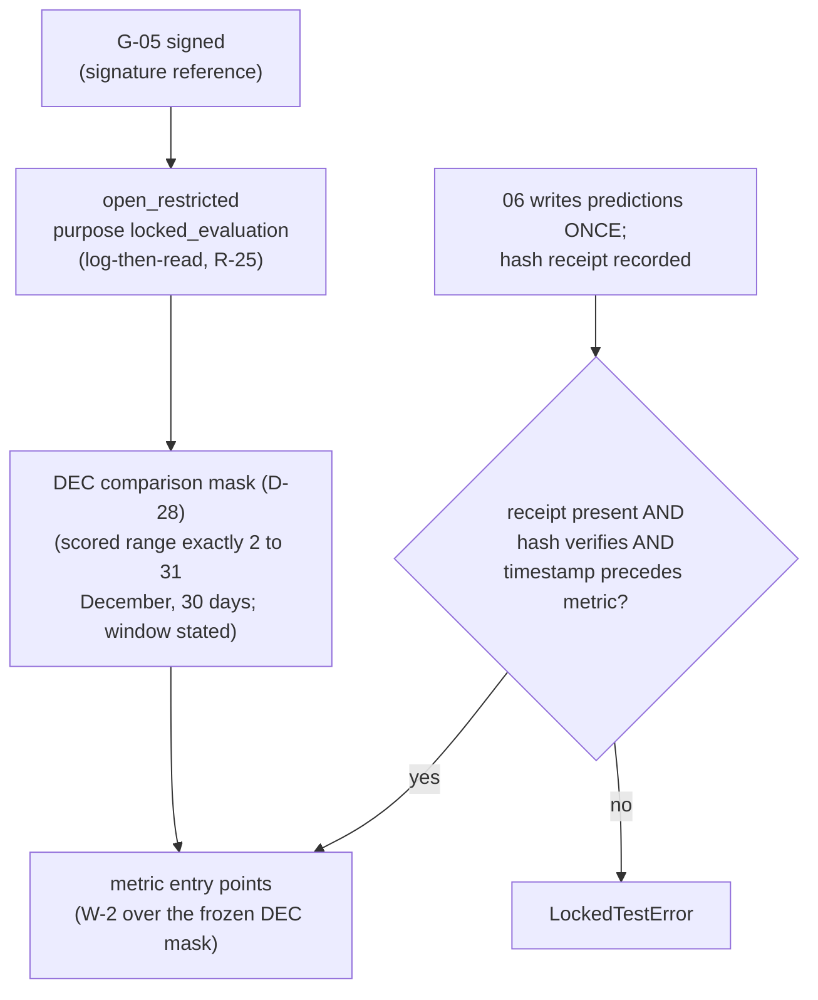

# Business Logic Model — `evaluation-and-comparison`

> ## ✳ G-09 IS SIGNED — 2026-08-28, **D-31** (read this before any G-09 statement below)
>
> The project decision owner **signed and approved G-09 (Agent preflight)** on 2026-08-28,
> recorded as **D-31** in `evidence/DECISIONS.md` with change record
> `governance/CHANGE_RECORD_2026-08-28_G09_signed.md`. **Every statement below of the form
> "G-09 is not signed" / "G-09 stays unsigned" is superseded as to the gate's status**, and
> is left standing as the accurate record of the constraint that applied when it was
> written.
>
> ⚠ **D-31 records the gate's own TE §18.3 preconditions as UNMET, and that disclosure
> travels with the signature.** `configs/`, and until 2026-08-28 `src/`, did not exist, so
> the mandated automated zero-TBD preflight **could not run**; the ten named critical tests
> **cannot be executed in this environment** (no Python interpreter is installed — a
> zero-byte Windows Store stub, no registry entry, no interpreter on disk); and the evidence
> artifact `aws_ai_dlc_preflight_report` **does not exist**. "No failing critical test" is
> therefore **unproven, not proven** — an absence of executions, not an absence of failures.
> This is the owner **opening the gate by authority**, not a record that its evidentiary
> conditions were satisfied, and no reader may infer the second from the first.
>
> **What the signature changes here:** module creation is authorised, and any defect this
> unit deferred *solely* because G-09 barred editing a file is now correctable.
> **What it does NOT change:** G-05 and G-06 remain `Blocked`; G-P1A, G-P2, G-P3A, G-P3C
> and G-07 are unaffected; **TE §18.2's absolute rule stands** — every scientific value this
> unit routed to G-04/G-05 **stays routed**, and no agent may fill a freeze-gate value by
> convenience; and **§18.3's stop-and-report obligation survives its own gate**, being a
> standing rule on implementation rather than a one-time gate condition.

**Unit** `evaluation-and-comparison` · **Kind** `library` · **Complexity** M ·
**Deployment** standalone · **Depends on** `models-and-baselines`, `external-products`

The workflows this unit implements: comparison-mask construction with once-only
registration over declared membership across **three** declared comparison sets, the
confirmatory estimand as one ordered executable
pipeline returning a stamped result, the **`ABL-DIFF`-only** inverse path through the narrowed
BLK-08 resolver with its refusal at every
metric boundary, `07`'s stamp refusal closing the eighth amendment's last open half, the
G-06 locked-test evaluation path — hash-receipt before metrics, one chokepoint, exactly
2–31 December (**D-28**) — and the honesty mechanics that make the mandated disclosures computable
preconditions rather than reporting-side hopes.

**It decides no scientific value.** The estimand's orientation and weighting are Vision
§2.3's, the scored December set is FU-7 = A's ruling **as ratified by D-28**, and the
comparison-set
memberships are **proposed to the gate, not fixed here** (R-106). **BLK-08 is owned here
and is an exit condition on this stage for both owners** (`business-rules.md` R-103 is the
joint contract); **BLK-03 ↓, BLK-04 ↓ and BLK-09 ↓ are inherited open exit conditions**,
and **no implementation may proceed while any stands. G-09 is not signed** — every workflow
below is design, and no module is created.

> ### Remediated 2026-08-28 — governance report `GOV-2026-08-28-FD-01`, verdict **FAIL**
>
> Six owner-ruled changes, each with a dated note at its own workflow and every superseded
> reading preserved in place. **W-3** is narrowed to `ABL-DIFF` and now cites **D-27**, whose
> reading makes the primary path need **no** inverse (Rec 7); **W-4** raises `PartitionError`
> on a `partition_id` mismatch, matching R-92 (Rec 8); **W-1** and **W-8** carry the third
> declared comparison set `{M-04, M-05, M-06}` (Rec 19); **W-2** returns an `EstimandResult`
> carrying the four mandated stamps (Rec 35); **W-1** and **W-5** carry the mask's reporting
> surface and **D-28**'s scored-window statement (Recs 16 and 6); **W-6** re-keys the GIM
> overlap disclosure to a comparison existing (Rec 41).
>
> **Counts re-derived 2026-08-28, printed at § Assumptions and never carried:** workflows
> **8** (W-1…W-8, unchanged); rules **10** (R-103…R-112, unchanged); entities **8**
> (unchanged); negative controls **31** (was 29: −1 relocated to the co-owner, +3 new, number
> (2) vacated); amendments owed **6 across 4 units** (total unchanged, content and status
> changed). **No blocker closed, no gate signed, no scientific value decided.**
>
> **The `## Review` section below is the 2026-08-27 first adversarial pass and is preserved
> byte-for-byte.** Its one surviving Major — R-105 versus R-92 on the exception raised for a
> `partition_id` mismatch — **is fixed above, not merely disclosed**; its Minor (the R-74
> citation) is **not applied** and is quoted at the gate instead, per `project.md`
> § Corrections.

## Sources

- `../../../inception/units-generation/unit-of-work.md` § 9 — the `Owns` list (4 files), the boundary, the 4 requirements, the implementation notes; **BLK-08** (owned) and **BLK-03/BLK-04/BLK-09** (inherited) with the exit-condition ruling.
- `../../../inception/units-generation/unit-of-work-story-map.md` — Table 1's four rows, Table 2's WS-16/TA-11/TA-18 rows, § Per-unit coverage summary, § Cross-unit responsibilities (the pre-G-05 coverage audit is `inventory-and-registry`'s), § Open verification gaps (BLK-08; WS-13's evidence departure).
- `../../../inception/requirements-analysis/requirements.md` — FR-P1-04-7, FR-P1-05-7, FR-P1-05-17, NFR-FAIR-01; context: FR-P1-05-6, FR-P1-05-9, FR-P1-05-12, FR-P1-05-20.
- `../../../inception/application-design/component-methods.md` — § `src/evaluation` (`build_comparison_mask`, `paired_loss_differential`), § `src/models` (`Prediction`, `three_seed_mean`, the `inverse_transform` paragraph), § `src/data/locked_test.py` (`AccessRecord`, `open_restricted`), § `src/data/splits.py` (`materialise_locked_partition`), § Depth.
- `../../../inception/application-design/services.md` — `07_evaluate_and_report.py`'s row, § Stage entry contract (the six ordered steps), the heaviest-CPU note, the derived `experiment_registry.csv` row.
- `../features-and-splits/functional-design/` — R-74's identity check with the one enumerated `REFIT` → `DEC` `score` exception, `FeatureBundle`/`Transform`, **FU-7 = A** (2–31 December, 30 days, first 24 h excluded and counted).
- `../models-and-baselines/functional-design/business-rules.md` — R-90 (`06`'s stamp refusal), R-91, R-92 (the (`station`, `interval_start_utc`) alignment key); the raised open item "`07`'s half of the eighth amendment is UNOWNED".
- `../external-products/functional-design/business-rules.md` — R-56 (the path grant), R-60 (the emitted-sentence pattern, `gim_network_overlap_flag`), R-62 (Dst diagnostic-only).
- `../governance-guards/functional-design/business-rules.md` — R-25 (log-then-read), R-28 (one path into the restricted root).
- `../foundation/functional-design/business-rules.md` — R-01 (the `IntegrityError` hierarchy), § Stage entry contract consumed by W-7.
- `aidlc/spaces/default/memory/project.md` § Mandated/Forbidden — the mask rule, the estimand, IRI/GIM evaluation-time-only, the disclosures, G-06 hash-before-metrics, `ABL-DIFF` inverse-to-TECU, the provenance stamp.
- Workspace inspection, 2026-08-26: `tests/` holds three modules, none this unit's; `src/` and `configs/` absent.
- **Added 2026-08-28:** `governance/reviews/GOV-2026-08-28-FD-01.md` Recommendations **6, 7, 8, 16, 19, 35, 41** with their owner rulings; `evidence/DECISIONS.md` **D-27** (2026-08-24) and **D-28** (2026-08-28), read in full; Vision **§2.4** tier 3 (line 172), **§8.4**'s model table (lines 774–776) and **§8.9** (the clause naming M-04/M-05 is at line 853; the report's "line 845" is the section heading); `component-methods.md:595-600` and `:773-781`; `component-dependency.md`'s `src/evaluation` matrix row and closing note; `models-and-baselines/…/business-rules.md` R-92; `statistical-inference/…/business-rules.md` R-113; `foundation/…/business-rules.md` R-01 as it stands on disk.
- `functional-design-questions.md` (**Q1 through Q9**, answered), `business-rules.md`, `domain-entities.md`.

---

## W-1 — Comparison-mask construction and once-only registration

```
INPUT   predictions: Sequence[Prediction], benchmark: Prediction
        (declared set read from ConfigSnapshot via the intra-package registration path)
OUTPUT  the registered ComparisonMask (mask_id, per-station row counts, stamps)
RAISES  FairnessError, LeakageError
```

The one comparison-wide **intersection** mask, computed **once per comparison set**
(FR-P1-04-7, NFR-FAIR-01). The sequence:

1. **Stamp check first** (R-105): every incoming `Prediction` carries non-`None`
   `partition_id`/`transform_id`, and all members agree on `partition_id`. **Absence raises
   `LeakageError`; a `partition_id` mismatch raises `PartitionError`** — corrected 2026-08-28
   per Recommendation 8 to match `models-and-baselines` R-92 exactly; superseded text,
   preserved: *"absence or mismatch **raises `LeakageError`**"*. Both fire before any row is
   intersected.
2. **Membership check** (R-106): the passed predictions match the declared
   `experiment.yaml` set **exactly** — missing, extra or duplicate member **raises
   `FairnessError`**. **Three** declared sets are proposed to the gate: primary
   {`M-01`, `M-02`, `M-03`, `M-06`, `B-01`}, GIM {`M-06`, `C-01`}, and **tier-3
   {`M-04`, `M-05`, `M-06`}** *(added 2026-08-28, Recommendation 19, so Vision §2.4 tier 3 —
   LSTM versus ridge and versus direct RF — becomes implementable at all)*; **never merged
   silently**, any two merged raises.
3. **Intersection** over the members' availability — adding a member shrinks the scored
   rows for every comparison in the set, which is exactly why membership is declared
   rather than whatever arrived, **and exactly why tier-3 gets its own mask rather than
   joining the primary set**: a ridge or RF availability quirk must not reduce the rows the
   confirmatory claim rests on. **Rows dropped here are counted per station** (the exclusion
   counts of step 4).
4. **Identity, registration and the reporting surface** (R-107): `mask_id` derives
   deterministically from the
   declared set and the masked row content; per-station **surviving** row counts and
   per-station **exclusion** counts are recorded; the mask
   carries `phase_id`/`source_id`/`target_definition_id` plus the `partition_id` and
   member-`transform_id` set, **and `feature_set_id` and the scored-window statement**;
   registration is **once-only** — a second registration for
   the same set **raises**. The registered set sits inside the G-05 frozen bundle
   (FR-P1-05-17). **Five of these values — `mask_id`, `feature_set_id`, surviving row counts,
   exclusion counts, scored-window statement — are exposed for
   `regimes-diagnostics-reporting` to print and never restate** *(added 2026-08-28,
   Recommendation 16)*, which is what gives Vision §8.9's *"exclusions and row counts are
   reported"* clause a reporting surface and puts **D-28**'s 30-day December scope on a claim
   artifact rather than only in the code that enforces it.

**Never a pairwise or model-specific mask** — a two-member per-pair call raises, which is
FR-P1-04-7's own criterion and WS-16's evidence.

## W-2 — The estimand pipeline, in its ordered form

```
INPUT   model: Prediction, benchmark: Prediction, *, mask (registered, frozen)
OUTPUT  EstimandResult (scalar, per-station components, orientation, weighting,
        sign-convention sentence, and the four mandated stamps copied from the
        registered mask: phase_id, source_id, target_definition_id, partition_id
        — domain-entities.md § 4)
RAISES  FairnessError, PartitionError, LeakageError, InverseTransformError,
        LockedTestError (DEC only)
```

The ordered contract (Q6 = D), one executable definition rather than prose:

1. **Preconditions**: the mask is a **registered frozen mask for the members' declared
   comparison set** (unregistered → `FairnessError`); both predictions pass R-105's stamp
   check against the mask's recorded stamps; both pass R-104's target-space check
   (transformed-space input → `InverseTransformError`); on `DEC`, R-109's hash-receipt
   precondition holds.
2. **Squared errors per (`station`, hour), on masked rows only.**
3. **Per-station mean of paired differences, benchmark minus model.**
4. **Unweighted mean of the three per-station values** — equal-station weighting, never
   pooled row-weighting.

The returned `EstimandResult` records the scalar, the three per-station components, the
orientation **`benchmark_minus_model`**, the weighting **`equal_station`**, and the
sign-convention sentence — so every downstream table inherits the convention
machine-readably (FR-P1-05-7's every-table obligation becomes a field assertion in
`regimes-diagnostics-reporting`).

5. **Stamping** *(added 2026-08-28, Recommendation 35)*: the result copies
   `phase_id`, `source_id`, `target_definition_id` and `partition_id` **from the registered
   mask at construction**. `project.md` § Mandated names four stamp targets — *"every dataset,
   prediction, mask **and comparison**"* — and **the comparison carried none of them**, though
   it is the object every downstream table and the abstract-level conclusion are built from.
   Copying rather than dereferencing `mask_id` is what makes a fold-validation differential and
   the G-06 locked-test differential distinguishable on their own faces; R-107's deterministic
   `mask_id` makes any drift from the mask a **failure** rather than a discrepancy.

**Controls with known answers**: an inverted orientation **fails** on a known-sign fixture;
a pooled row-weighted aggregation **fails** on a fixture with asymmetric per-station row
counts; **an `EstimandResult` missing any of the four stamps, or carrying values differing
from the registered mask's, fails**.

## W-3 — The `ABL-DIFF` inverse path only: the narrowed BLK-08 resolver and the boundary refusal

```
SCOPE   ABL-DIFF ONLY. The primary path never enters this workflow (D-27).
INPUT   prediction: Prediction (transform_id resolving to a persisted inverse)
CALLS   load_inverse(transform_id) -> Inverse    [co-owner surface, PENDING ADOPTION;
                                                  Inverse exposes ONLY inverse(frame)]
        Inverse.inverse(frame) -> DataFrame
OUTPUT  a NEW Prediction whose transform lineage records the inversion
RAISES  InverseTransformError
```

> ### ⚠ NARROWED 2026-08-28 — `GOV-2026-08-28-FD-01` **Recommendation 7**, on **D-27**'s strength
>
> **`evidence/DECISIONS.md` D-27 (2026-08-24) had already frozen the fact this workflow was
> treating as a status to be recorded** — and was cited **zero** times across this unit's four
> artifacts (derived 2026-08-28). D-27: the primary configuration's train-only transform acts
> on target-**derived inputs**; **the target stays raw TECU**; `ABL-DIFF` is the sole
> target-transforming configuration; the reading *"no longer requires a general
> `src/evaluation` → `src/features` route for the primary path"*; and *"**no import-boundary
> change is authorised by this decision.**"*
>
> **Consequence D-27 requires stated: the primary path needs no inverse transform.** The
> **paired loss differential (W-2), the vector time-block bootstrap interval and the
> practical-relevance threshold are computed on the quantity the model emits.** No inverse is
> resolved, no edge is traversed, no round-trip is checked on the confirmatory path.
>
> **The resolver narrows** from `load_transform(transform_id) -> Transform` to
> **`load_inverse(transform_id) -> Inverse`, exposing only `inverse(frame)`** — because
> `load_transform(id).apply(frame)` **is** `apply_transforms(frame, transform)`, the exact
> surface ADR-11 removed (*"A function that applies a fitted transform to an arbitrary frame
> **is** the hole"*, `component-methods.md:595-600`), reconstituted one package away from the
> frozen mask and the G-06 path. **The round-trip control relocates into `src/features`**,
> where `apply` is visible and where it can actually execute.
>
> **Superseded text, preserved verbatim:** *"The mechanism is R-103's permitted
> `src/evaluation` → `src/features` import edge"*; *"`load_transform(prediction.transform_id)`
> resolves the persisted fitted transform"*; *"For a target-touching transform,
> `Transform.inverse(frame)` produces a **new** `Prediction`"*; and *"**The round-trip
> control**: `inverse(apply(x)) == x` within the declared fixture tolerance, on a fixture — the
> check that a separately maintained inverse cannot silently disagree with its fit."*

The mechanism is R-103's **proposed** `src/evaluation` → `src/features` import edge, **scoped
to `ABL-DIFF` alone** — **one copy of the inverse, owned where the fit lives**, resolved by
the identity ADR-11 already persists. **The edge is unauthorised**: it is an amendment owed
**and** a gate item, so **`ABL-DIFF` has no executable inverse path today**. The path, once
authorised:

1. `load_inverse(prediction.transform_id)` resolves the persisted inverse; an
   unresolvable id **raises `InverseTransformError`** naming the identifier and the
   registry searched. **The returned object exposes no `apply`**, so nothing forward-applying
   crosses the edge.
2. The transform's machine-readable target-touching declaration is read. The **primary
   configuration is features-only** — **frozen by D-27**, not inferred here — so the primary
   path applies no inverse and passes R-104 natively. `ABL-DIFF` is the enumerated
   target-touching configuration, and the only one reaching step 3.
3. For a target-touching transform, `Inverse.inverse(frame)` produces a **new**
   `Prediction` whose lineage records the inversion — a fact on the artifact, not a
   memory of a call.
4. **Every metric entry point refuses transformed-space input** (R-104): an un-inverted
   `ABL-DIFF` prediction reaching any metric **raises**, whoever the caller is — script,
   notebook or test.

**The round-trip control is the co-owner's, in `src/features`**: `inverse(apply(x)) == x`
within the declared fixture tolerance — the check that a separately maintained inverse cannot
silently disagree with its fit, hosted where `apply` is visible. **The co-owner's half of this
path is pending its owner's adoption** (R-103; its narrowed half is being authored in
parallel and is not on disk as of 2026-08-28); this
workflow is executable only after that adoption **and** the edge's authorisation, which is
part of why BLK-08 stays an open exit condition.

**D-27's own limitation, carried not softened:** if `code-generation` or `build-and-test`
finds a model path that scales the target contrary to this reading, that is **a contradiction
to surface**, not a licence to adjust the target contract (TE §18.2). Step 2's declaration is
what makes that contradiction catchable rather than merely reportable.

## W-4 — `07`'s stamp refusal: the eighth amendment's last open half

```
INPUT   every Prediction entering any comparison; every mask consumed
CHECK   non-None partition_id/transform_id; members agree on partition_id;
        mask stamps match the members
RAISES  LeakageError   (absent stamp, or transform_id disagreement — the
                        information-flow limbs)
        PartitionError (partition_id mismatch between members — a declared-identity
                        disagreement; matches models-and-baselines R-92)
        FairnessError  (wrong mask: member-versus-mask partition disagreement)
```

> **Corrected 2026-08-28 — `GOV-2026-08-28-FD-01` Recommendation 8**, the standing Major of
> the 2026-08-27 pass. Superseded text, preserved: `RAISES  LeakageError (prediction stamps),
> FairnessError (wrong mask)`. R-92 raises **`PartitionError`** for a `partition_id`
> disagreement and `LeakageError` for a `transform_id` disagreement or `None`; this workflow
> raised `LeakageError` for both while claiming to mirror it, so a test asserting
> `pytest.raises(PartitionError)` would pass at `06` and fail at `07`. `PartitionError` is now
> `foundation` R-01's **fifteenth** exception on the owner's ruling — an amendment
> **`foundation` owns and has not yet written** (its R-01 still reads "all fourteen" on disk) ⚠ **SWEPT 2026-08-28 on the resume pass — this disk-state claim is SUPERSEDED.** `foundation` R-01 **has been amended** and now reads **fifteen**, with `PartitionError` promoted into the enumeration, the count restated as **derived and printed** rather than carried in prose, and `InverseTransformError` **explicitly disposed** — not a sixteenth, riding R-01's *"any future integrity-related exception"* clause, on the stated ground that the two units raising it agree on its condition and meaning, so nothing needs reconciling. Verified at `foundation/functional-design/business-rules.md` R-01 (the amendment row, the superseded-wording box, and the `InverseTransformError` box). **The dependency this sentence recorded is discharged; any open item stated alongside it is NOT** — see the sentence it accompanies.,
> disclosed rather than presumed. The correction also propagates to `statistical-inference`
> R-113 precondition 2, which imports R-105 "as written"; that edit is its owner's.

`features-and-splits` FU-4 = D obliged **`06` and `07`**; R-90 closed `06`'s half *"and
only `06`'s"*. This workflow is `07`'s half, owned here (Q4 = C), at the object `07`
actually receives — **`Prediction`s, not frames** ("the stamp has to travel the whole
way"). The refusal runs at W-1 step 1, again at W-2's precondition, and across `07`'s own
file-mediated handoff: the mask records the `partition_id` and member-`transform_id` set it
was built over, and scoring a `Prediction` against a mask built for a different partition
**raises**. B-01/C-01 — which `06` never sees — are stamped at generation with the scored
partition and the reserved literal `untransformed` (R-105). The unstamped, hand-assembled
prediction — R-74's named residual — is exactly what control (6) fires on.

## W-5 — The G-06 locked-test evaluation path



Text fallback: after G-05 is signed, `07`'s December target read arrives only through
`open_restricted` with purpose `"locked_evaluation"` and the G-05 signature reference,
log-then-read; the DEC comparison mask asserts the scored range is exactly 2–31 December
(30 days), first 24 hours excluded and counted; `06` has written the predictions exactly
once and recorded their hash; every metric entry point on DEC verifies the receipt exists,
the file re-hashes to it, and the receipt timestamp precedes the call — any failure raises
`LockedTestError` — and only then does the estimand pipeline run over the frozen DEC mask.

**The boundary, in both directions** (Q7 = D): this unit performs **no pre-G-05 December
read of any kind** — the required coverage and regime audit is `inventory-and-registry`'s
performance-blind read under purpose `"coverage_audit"`, a different event that a rule here
must not block; and a pre-signature `07` DEC execution is **blocked upstream** by
`materialise_locked_partition` **and additionally refused here**. Redundancy at the locked
boundary is by design: this is the one event that can never be re-run. **This unit
constructs no path of its own into the restricted root** (R-28's one-door rule). A 1
December row reaching metrics **raises** — the 30-day ruling encoded where it bites,
the mask that defines the scored rows.

**The scored set's authority is now `evidence/DECISIONS.md` D-28** *(cited 2026-08-28,
Recommendation 6, which the owner ratified as D-28)*. D-28 fixes **2–31 December 2022, 30
days, first 24 h excluded and counted**, ratifying the stage-3.1 ruling FU-7 = A of
2026-08-26 that this workflow previously cited alone, and it **discloses the authority
conflict rather than resolving it**: Vision:751 and TE:400 are byte-identical
(`| Locked test | — | — | December 2022 only |`, `—` in the Embargo column), while
`requirements.md` FR-P1-04-5 — a level-4 artifact — states the 24-hour embargo and cites those
very tables. D-28 accepts 30 days on physical, statistical and arithmetic grounds (notably:
720 hours divides by 48 and 744 does not, so the mandatory 48-hour block sensitivity would
itself have raised under the 31-day reading), records that **a revised split manifest is owed
at G-05**, and records that **no supervisor signature artifact exists** — the ratification is
the owner's under the recorded equivalence. This workflow implements the value D-28 fixed and
resolves nothing. **The mask's scored-window statement (W-1 step 4) is what discloses the
30 days to a reader of the result**, per D-28's own consequence that the scored set *"must be
disclosed as 30 days."*

## W-6 — The honesty mechanics: completeness, the trigger field, the emitted caveat

```
INPUT   each declared comparison set's EstimandResults over that set's one frozen mask
OUTPUT  the MetricsArtifact — complete, per-benchmark beats_model, disclosures emitted
RAISES  FairnessError (on incomplete emission)
```

Three limbs (Q8 = D), each a computable precondition only this unit can guarantee:

1. **Completeness refusal, per declared set**: the run computes the estimand for **every**
   declared member of **each** set over that set's frozen mask and refuses to emit a results
   artifact with any
   member's metric missing. The three difficulty controls (M-01, M-02, M-03) are thereby
   present and mask-matched by construction, and a **tier-3** artifact missing `M-04` or
   `M-05` is refused the same way *(scope generalised 2026-08-28 with the third declared set,
   Recommendation 19; the mechanism is unchanged — superseded text, preserved: "the estimand
   for **every** declared primary member over the one frozen mask")*. **Co-reporting the
   difficulty controls in the primary table is
   `regimes-diagnostics-reporting`'s obligation** (FR-P1-05-9, TA-20) — the split is
   stated, in both directions — as is the **tier-3 breakdown row** its R-127 completeness
   refusal needs.
2. **`beats_model` per benchmark**: derived from the estimand's sign under
   `benchmark_minus_model` orientation; FR-P1-05-20's abstract-level disclosure check
   downstream becomes a field comparison. It decides nothing scientific. **"Per benchmark"
   already assumes more than one benchmark per set** — the primary set has four (`B-01` plus
   the three controls) and tier-3 has two (`M-04`, `M-05`) against the one model `M-06`.
3. **Emitted disclosures**: every serialized IRI or GIM comparison artifact carries the
   spatial-representativeness sentence, emitted by the comparison-producing path itself
   (R-60's pattern). **The GIM overlap disclosure is keyed to a GIM comparison EXISTING**
   *(re-keyed 2026-08-28, Recommendation 41; superseded text, preserved: "the
   `gim_network_overlap_flag` value wherever GIM is compared **once the audit runs**")*:
   **emitting or reporting any GIM comparison without a registered overlap-audit result and
   its flag value fails**, and **the audit's timestamp is asserted to precede comparator
   generation** — the ordering `external-products` R-60 obligation 2 already asserts for the
   interpolation hand-check. Under the old phrasing the condition guarding the check was the
   very thing whose absence was the violation, so a GIM comparison emitted before the audit
   existed tripped nothing. A rule about every report — including reports nobody has written
   yet — survives only when the producing code emits it, **and only when its trigger is the
   report rather than the evidence.**

> **Where the old phrasing came from, and what is owed.** `project.md` § Mandated itself reads
> *"ALWAYS disclose the `gim_network_overlap_flag` result **once the input-network overlap
> audit runs**"* — this design and `regimes-diagnostics-reporting` R-126 were tracking the
> affirmed rule faithfully. Limb 3 now diverges from that wording, and **a correction to
> `project.md` § Mandated is owed at the §13 learnings ritual**, which is human-gated and the
> only sanctioned write path. **No memory file is edited by this remediation.**

## W-7 — What `scripts/07_evaluate_and_report.py` orchestrates, and what it must not

`07` is an **orchestrator of `src/` logic** (§7): every governed check above lives in
`src/evaluation`, none inline in the script. Its run:

1. **Stage entry**: `foundation`'s six ordered steps — `ensure_process_determinism`,
   `load_configs`, the §18.3 zero-`TBD` preflight, `assert_phase_boundary` under
   `--phase 1`, `seed_everything`, and the run record opened with the environment lock and
   a `started` registry row **before** domain work. Any `IntegrityError` subclass in steps
   1–5 exits non-zero with an `aborted` row (R-01/R-10).
2. **Reads**: predictions carrying `partition_id`/`transform_id`, the benchmark, the mask
   (`services.md`'s row). **Writes**: metrics, bootstrap intervals, breakdowns, figures —
   the intervals computed by `statistical-inference`'s `vector_block_bootstrap` and the
   breakdowns by `regimes-diagnostics-reporting`, both running **inside** this script
   while owned elsewhere (the path grant, R-56; no unit-level narrowing asserted).
3. **Registry**: regenerates the derived `experiment_registry.csv` from the JSONL, hashed
   and marked derived; on `DEC`, the access sets `locked_test_accessed = true` through the
   `AccessRecord` this unit consumes but does not construct paths for.
4. **Cost**: `07` carries the heaviest CPU cost in the pipeline (`services.md`) — the
   10,000-replicate bootstrap dominates; it is `statistical-inference`'s, inside TE §9.3's
   envelope, on the CPU-complete path.

**What it must not do**: no December read outside `open_restricted`; no metric before the
hash receipt verifies; no comparison off the registered mask; no scientific value filled —
a `TBD` in any of the four governed configs stops the run at step 3 of stage entry.

## W-8 — `tests/test_common_masks.py`: the verification plan

Scope per Q9 = C (design specified; **no module created — G-09 is not signed**):

| Check | Property | Requirement |
|---|---|---|
| Stable `mask_id`s: recomputation reproduces the registered ID | mask identity | FR-P1-04-7 |
| Per-station row counts recorded and reported | mask evidence | FR-P1-04-7, WS-16 |
| **Pairwise mask attempt fails** | no per-pair mask | FR-P1-04-7's criterion |
| **Mismatched window lengths fail — asserted on the tier-3 set `{M-04, M-05, M-06}` as well as on the primary and GIM sets** *(added 2026-08-28, Recommendation 19)* | matched windows at the **comparison** boundary — every member scored over the same window length and lag set | NFR-FAIR-01's matched-windows limb, TA-11's phrase, **Vision §8.9's M-04/M-05 clause** |
| **Recomputed mask with a different ID fails** | computed-once, executable | NFR-FAIR-01 |
| Once-only registration: a second registration raises | computed-once | NFR-FAIR-01 |
| **A registered mask missing `mask_id`, `feature_set_id`, surviving row counts, exclusion counts or the scored-window statement fails** *(added 2026-08-28, Recommendation 16)* | the reporting surface is supplied, not optional | Vision §8.9 (*"exclusions and row counts are reported"*; *"a stable mask ID and feature-set ID"*), **D-28** |
| **A table's `mask_id` not matching a registered frozen mask fails** | the printed number ties to the mask that produced it | Vision §8.9, Recommendation 16's closure evidence |

The matched-window assertion is a property of **comparisons**, distinct from `windows.py`'s
representation-parity property (WS-13, owned by `features-and-splits`) — two properties,
two homes, one fairness rule. **Until the tier-3 set was declared (R-106), Vision §8.9's
clause that *"the flattened matrix supplied to M-04 and M-05 is the flattened form of the
identical causal window supplied to M-06"* had no comparison set to be asserted in at all**;
this module now asserts its **window-length-and-lag-set** half, and the
**representation-form** half remains WS-13's `windows.py` parity property, consumed not
duplicated. **The WS-13 §16 evidence-column clarification goes to the
gate as one complete proposal** (R-111): WS-13's evidence recorded as the `windows.py`
parity assertion with `test_common_masks.py` supporting via the matched-window limb, for
the owner to route through Vision §15.2 **or decline**. Recorded, not resolved.

---

## Requirement coverage

| Requirement | Workflows | Acceptance |
|---|---|---|
| FR-P1-04-7 | W-1, W-8 | WS-16 (primary), TA-11 (supporting) |
| FR-P1-05-7 | W-2, W-3 | `UNTESTED` — no acceptance row; W-2's controls are the bar until stage 3.2 proposes a row under Vision §15.2 |
| FR-P1-05-17 | W-1 (step 4's frozen bundle), W-5 (the freeze-precedes-access ordering) | `UNTESTED` — the ordering is the G-05 record's to produce; this design requires it and cannot manufacture it |
| NFR-FAIR-01 | W-1, W-2, W-8 | WS-16, TA-11 |

**4 requirements, 2 untested** (FR-P1-05-7, FR-P1-05-17) — derived from the story map's
rows, the two upstream artifacts agreeing. TA-18 supports W-5 ("prediction hash preceding
any metric") without carrying a requirement of this unit's.

## Assumptions & Open Questions

- **[assumption]** The workflow count is **8** (W-1…W-8), the rule count **10** (R-103…R-112), the entity count **8** (`domain-entities.md` § 1…§ 8), and the negative-control count **31** — all four **re-derived 2026-08-28** by numbering this artifact set's own sections rather than carried. The control count moved from 29: **−1** (R-103's round-trip control relocated to `src/features`, Recommendation 7) **+3** ((30) `EstimandResult` stamps, (31) mask reporting-surface presence, (32) overlap-audit timestamp ordering) = **31**, with number **(2) vacated and not reused**, so the highest number (32) exceeds the count by exactly one. `business-rules.md` § Negative-control count prints the per-rule table.
- **[assumption]** The `src/evaluation` shapes these workflows use beyond the approved boundary calls — the registration path, the `EstimandResult` (including its four new stamps), the mask's reporting values, the receipt verification — are intra-package (§ Depth); R-103's dependency row and R-106's membership (**now three sets**) remain the two surfaces exceeding that grant, and § Amendments owed prints the check for each 2026-08-28 change.
- **[assumption]** `statistical-inference`'s bootstrap and `regimes-diagnostics-reporting`'s breakdowns run inside `07` under the module-path grant; this unit orchestrates them in W-7 and designs neither.
- **Open — BLK-08 is an exit condition on this stage for both owners**: W-3 is executable only after the co-owner adopts R-103's **narrowed** half B **and the `src/evaluation` → `src/features` edge is authorised**, which **D-27 expressly does not do**. **BLK-03 ↓, BLK-04 ↓, BLK-09 ↓ remain open inherited exit conditions** — nothing here closes them, and no implementation may proceed while any stands.
- **Open — the comparison-set memberships are proposed, not decided** (W-1, R-106): a student/supervisor-owned scientific confirmation at the gate, **now covering three sets including the new tier-3 `{M-04, M-05, M-06}`**.
- **Open — the WS-13 §16 evidence-column proposal** (W-8, R-111): one complete proposal for the owner to route through Vision §15.2 or decline.
- **Open — FR-P1-05-17's freeze evidence is partly outside this unit's control**: the freeze timestamp must precede any December access, an ordering the G-05 record produces.
- **Open — four corrections land in other units' files and are raised at the gate, not made here** *(2026-08-28)*: `foundation`'s amendment of R-01 to fifteen exceptions; `statistical-inference`'s R-113 precondition 2; `regimes-diagnostics-reporting`'s printing of the mask's five reporting values and its tier-3 breakdown row; and the `project.md` § Mandated wording correction on the GIM disclosure trigger, owed at the human-gated §13 learnings ritual. **No memory file and no sibling unit's artifact is edited by this remediation.**
- **G-09 is not signed.** ⚠ **G-09 IS SIGNED as of 2026-08-28 (D-31)** — this prohibition's stated ground no longer holds, and module creation is authorised. **The other grounds stated alongside it, if any, are untouched**, and D-31's disclosure travels with the signature: the §18.3 preflight never ran, the critical tests are unexecuted in this environment, and `aws_ai_dlc_preflight_report` does not exist. **No scientific value becomes fillable** — TE §18.2 and §18.3's stop-and-report rule are unchanged. No workflow here authorises creating any module; TE §18.3's stop-and-report rule binds every affected component while any P0 decision is unresolved.
- **None** of the above adopts a reading on a supervisor-owned value, and none decides a scientific constant: **D-27 and D-28 are cited, not made**, and the tier-3 membership is proposed to the gate.

## Review — 2026-08-27 first adversarial pass

**Reviewer:** aidlc-architecture-reviewer-agent
**Date:** 2026-08-26T20:33:09Z
**Iteration:** 1

### Findings

| # | Severity | Location | Finding | Recommendation |
|---|---|---|---|---|
| 1 | Major | `business-rules.md` R-105 limb 2 | R-105 claims to mirror `models-and-baselines` R-92's provenance-agreement rule ("mirroring R-92's provenance-agreement rule at this unit's boundary, so the two consuming units' accounts of the eighth amendment agree"), but the two rules diverge on exception taxonomy for the identical failure mode. Verified against `construction/models-and-baselines/functional-design/business-rules.md` R-92: *"`partition_id` disagreement or a training partition raises `PartitionError`; `transform_id` disagreement or `None` raises `LeakageError`."* R-105 instead raises `LeakageError` for **both** a `partition_id` mismatch (limb 2) and an absent stamp (limb 1). `PartitionError` appears in neither `domain-entities.md` § 8's four-row exception table (which lists only `FairnessError`, `LeakageError`, `LockedTestError`, `InverseTransformError` as this unit's raises) nor in `foundation` R-01's fourteen-exception enumeration read at `construction/foundation/functional-design/business-rules.md` R-01 (`ConfigError`, `PreflightError`, `PlatformError`, `DeterminismError`, `ReleaseError`, `RegistryError`, `PhaseBoundaryError`, `LockedTestError`, `LeakageError`, `AlignmentError`, `SeedError`, `FairnessError`, `BootstrapError`, `RegimeError`) — so `PartitionError` sits outside the hierarchy this design otherwise treats as exhaustive, and the claimed agreement between `06`'s half (R-90/R-92) and `07`'s half (R-105) of the eighth amendment does not actually hold on the exception a code-generation implementer would raise. | Either raise `PartitionError` at R-105 limb 2 for the `partition_id`-mismatch case (matching R-92 exactly, and adding `PartitionError` to `domain-entities.md` § 8 and to `foundation` R-01's declared-elsewhere set), or drop the word "mirroring" and state explicitly that `07`'s boundary deliberately collapses the two failure modes R-92 keeps separate, with the reason stated. Left as-is, this is a claimed cross-unit consistency that a spot-check against the cited rule disproves. |
| 2 | Minor | `business-rules.md` R-105, negative control (6) | Control (6) is described as "the exact residual R-74 names" but the artifact does not quote or pin the specific R-74 sentence being referenced, unlike every other cross-unit citation in this file which quotes verbatim. `features-and-splits` R-74 (verified) discusses ownership of fitted state via `transform_id`/`partition_id` persisted with the data but does not, in the portion inspected, use language obviously matching "hand-assembled prediction" or "exact residual." Not disqualifying, but it is the one citation in this otherwise heavily-quoted artifact set that does not carry its own verifiable anchor. | Quote the specific R-74 sentence being mirrored, or soften "the exact residual R-74 names" to a paraphrase that does not claim verbatim correspondence. |

### Failed refutation attempts (recorded for the audit trail)

- **Attempted:** R-103's chosen mechanism (a permitted `src/evaluation` → `src/features` import edge) contradicts `component-methods.md`'s explicit statement (§ `src/models`, lines 773–781) that the inverse "must be able to do that without importing `src/features` — an edge the dependency matrix does not carry and should not gain," and application-design's own approved finding M6 record (`application-design-questions.md` line 764) states the inverse was restored "deliberately **without** a new `src/evaluation` → `src/features` package edge." **Refuted on inspection**: the BLK-08 register entry in `unit-of-work.md` (verified, lines 826–842) explicitly reopens this exact question for stage 3.1, naming "a permitted import edge" as one of three legitimate candidate mechanisms and stating only that the reverse direction (`features` → `evaluation`) "is not available." R-103's own text preserves the primary-path/M6 outcome (primary configuration stays features-only, no edge exercised on that path) and adds the edge only for the `ABL-DIFF` target-touching case BLK-08 was registered to unblock — consistent with, not contradicting, M6's own stated fallback branch ("if it does [touch the target], add ... the edge"). No finding.
- **Attempted:** the R-83…R-89 rule-numbering gap between `features-and-splits` (ending R-82, verified) and `models-and-baselines` (starting R-90, verified) is a genuine 7-number gap. **Confirmed as fact, not a defect**: the artifact already flags it as an open `[assumption]` routed to the gate rather than silently absorbing or hiding it — correctly handled, not a finding.
- **Attempted:** the 29-negative-control count and the 6-across-4-units amendment total are carried rather than derived. **Refuted**: independently re-summed both from the artifact's own per-rule breakdown (2+2+3+4+3+3+6+4+1+1 = 29, matching; 5+0+1 = 6 with unit count 3+0+1 = 4, matching, and cross-checked the "5 across 3" input against `external-products` R-55's own text, which reads identically). Both derivations hold.
- **Attempted:** the "0 grep hits for `inverse`/`BLK-08`" claim about `features-and-splits`' finalized artifacts is asserted rather than true. **Refuted**: independently grepped all four `features-and-splits/functional-design/*.md` files; confirmed 0 hits for both terms in every file.
- **Attempted:** the FU-7=A "2–31 December, 30 days" figure, the WS-16/TA-11/TA-18 acceptance-row set, and the "4 requirements, 2 untested" count are stale or inconsistent with upstream. **Refuted**: all three verified byte-for-byte against `features-and-splits`' FU-7=A record and `unit-of-work-story-map.md`'s own per-unit coverage-summary row (`evaluation-and-comparison | 4 | 2 | WS-16 | TA-11, TA-18`), which matches exactly.
- **Attempted:** R-56 (path-grant), R-60 (emitted-sentence pattern), R-62 (Dst diagnostic-only), R-63 (time-indexed drivers), R-25 (log-then-read) and R-28 (one-door rule) are misquoted or misattributed. **Refuted**: all six checked against their owning units' actual `business-rules.md` text and found accurate, including the specific `AccessRecord.authorization` field name and the `purpose` enum values (`"coverage_audit"` / `"locked_evaluation"`), verified against `component-methods.md`.

### Validation Tool Results

No stage-declared validation tooling was listed for this dispatch; verification was performed by direct grep/read cross-reference against the passed shared-contract files and the named sibling business-rules.md excerpts, as enumerated above.

### Counts re-derived

- Rules: R-103…R-112 = **10**, contiguous. Confirmed.
- Workflows: W-1…W-8 = **8**. Confirmed.
- Entities: `domain-entities.md` §1…§8 = **8**. Confirmed.
- Requirements: **4** (FR-P1-04-7, FR-P1-05-7, FR-P1-05-17, NFR-FAIR-01), **2 untested** (FR-P1-05-7, FR-P1-05-17). Confirmed against `unit-of-work-story-map.md`.
- Negative controls: re-summed per-rule as 2+2+3+4+3+3+6+4+1+1 = **29**, matching the artifact's own count.
- Amendments owed: 5 (external-products basis, independently checked) + 0 (features-and-splits) + 1 (this unit) = **6 across 4 units**. Confirmed.

### Summary

This unit's three artifacts are unusually well cross-referenced against the shared inception contracts and sibling units' finalized designs — every count I re-derived matched, every quoted cross-unit rule matched its source, the BLK-08 mechanism choice is consistent with (not in conflict with) the prior application-design M6 approval once the full history is traced, and all four inherited/owned blockers (BLK-08, BLK-03 ↓, BLK-04 ↓, BLK-09 ↓) are correctly left open as exit conditions with no implementation authorized. One Major finding survives: R-105's claim to "mirror" `models-and-baselines` R-92 does not hold on the exception type raised for a `partition_id` mismatch (`LeakageError` here vs. `PartitionError` there), which is exactly the kind of claimed cross-unit agreement this project's own methodology (representation-sweep, count-derivation) exists to catch, and `PartitionError` is not declared anywhere in this unit's own exception hierarchy or in `foundation` R-01's fourteen-exception list. One Minor finding (an unquoted R-74 citation) is cosmetic. With one Major and zero Critical findings, this does not cross the NOT-READY threshold.

READY

---

> **Re-confirmation receipt, 2026-08-29 — `evaluation-and-comparison`.** The 2026-08-27T21:49:36Z REDO jump reset every unit's
> receipt floor, and this unit's content had already changed after that floor under the 2026-08-28
> post-execution pass (D-29 through D-32; **G-09 signed under D-31 with its TE §18.3 preconditions
> disclosed unmet**). The owner re-confirmed that post-execution content via the Consolidated
> Summary Confirmation at the foot of `functional-design-questions.md`, receipted `2026-08-29`.
> **No line above this marker was touched by this pass**, no count was re-derived, and nothing here
> discharges TA-15, WS-18 or TA-18, creates `aws_ai_dlc_preflight_report`, or alters the fact that
> stage 3.1 remains **FAIL** with no board having passed it.
