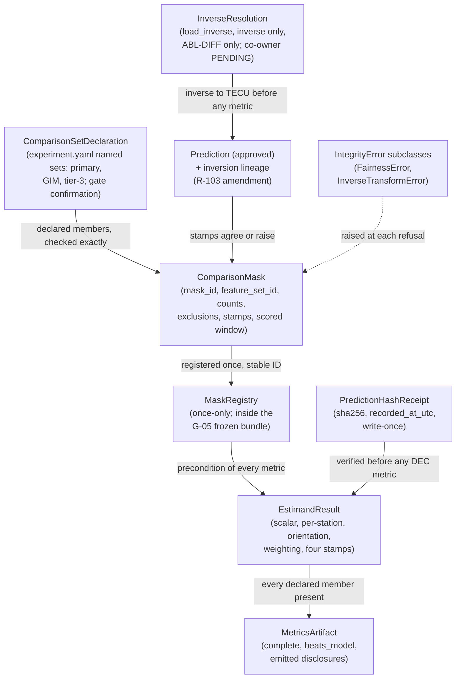

# Domain Entities — `evaluation-and-comparison`

> ## ✳ G-09 IS SIGNED — 2026-08-28, **D-31** (read this before any G-09 statement below)
>
> The project decision owner **signed and approved G-09 (Agent preflight)** on 2026-08-28,
> recorded as **D-31** in `evidence/DECISIONS.md` with change record
> `governance/CHANGE_RECORD_2026-08-28_G09_signed.md`. **Every statement below of the form
> "G-09 is not signed" / "G-09 stays unsigned" is superseded as to the gate's status**, and
> is left standing as the accurate record of the constraint that applied when it was
> written.
>
> ⚠ **D-31 records the gate's own TE §18.3 preconditions as UNMET, and that disclosure
> travels with the signature.** `configs/`, and until 2026-08-28 `src/`, did not exist, so
> the mandated automated zero-TBD preflight **could not run**; the ten named critical tests
> **cannot be executed in this environment** (no Python interpreter is installed — a
> zero-byte Windows Store stub, no registry entry, no interpreter on disk); and the evidence
> artifact `aws_ai_dlc_preflight_report` **does not exist**. "No failing critical test" is
> therefore **unproven, not proven** — an absence of executions, not an absence of failures.
> This is the owner **opening the gate by authority**, not a record that its evidentiary
> conditions were satisfied, and no reader may infer the second from the first.
>
> **What the signature changes here:** module creation is authorised, and any defect this
> unit deferred *solely* because G-09 barred editing a file is now correctable.
> **What it does NOT change:** G-05 and G-06 remain `Blocked`; G-P1A, G-P2, G-P3A, G-P3C
> and G-07 are unaffected; **TE §18.2's absolute rule stands** — every scientific value this
> unit routed to G-04/G-05 **stays routed**, and no agent may fill a freeze-gate value by
> convenience; and **§18.3's stop-and-report obligation survives its own gate**, being a
> standing rule on implementation rather than a one-time gate condition.

**Unit** `evaluation-and-comparison` · **Kind** `library` · **Complexity** M ·
**Deployment** standalone · **Depends on** `models-and-baselines`, `external-products`

The intra-package shapes `component-methods.md` § Depth assigns to this stage: the mask
object and its registry, the estimand result object, the prediction hash receipt consumed
as a metric precondition, and the transform-resolution shapes the BLK-08 joint contract
(R-103) names. Field names are indicative (§ Depth Q1 = B); the **obligations** each shape
carries are the contract. **No scientific value is fixed here; G-09 is not signed and no
module is created; BLK-08, BLK-03 ↓, BLK-04 ↓ and BLK-09 ↓ remain open exit conditions on
this stage.**

> ### Remediated 2026-08-28 — governance report `GOV-2026-08-28-FD-01`, verdict **FAIL**
>
> Six owner-ruled changes reach this artifact, each with a dated note at its own section and
> every superseded reading preserved in place: **§ 1** gains the third declared comparison set
> `{M-04, M-05, M-06}` (Rec 19); **§ 2** gains `feature_set_id`, exclusion counts and the
> scored-window statement, exposed for the reporting unit (Rec 16), and cites **D-28** for the
> 30-day range (Rec 6); **§ 4** gains the four mandated stamps (Rec 35); **§ 6** narrows the
> resolver to `load_inverse -> Inverse`, cites **D-27**, and relocates the round-trip control
> into `src/features` (Rec 7); **§ 7** re-keys the GIM overlap disclosure to a comparison
> existing (Rec 41); **§ 8** adds **`PartitionError`** as R-01's fifteenth (Rec 8). **Entity
> count is unchanged at 8** — derived by counting this file's numbered sections, not carried;
> no section was added or removed. **No blocker closed, no gate signed, no scientific value
> decided.**

## Sources

- `../../../inception/application-design/component-methods.md` — § `src/evaluation`'s approved boundary calls, § `src/models`' `Prediction` (the approved eight fields), § `src/data/locked_test.py`'s `AccessRecord`, § Depth's intra-package grant, the closing note's `Transform.inverse` gap (BLK-08).
- `../../../inception/units-generation/unit-of-work.md` § 9 — BLK-08's Required-resolution field; the boundary paragraph.
- `../../../inception/requirements-analysis/requirements.md` — FR-P1-04-7 (stable IDs, row counts), FR-P1-05-7 (the sign convention in every table), FR-P1-05-12 (write-once detection), FR-P1-05-17 (the frozen bundle), NFR-FAIR-01 (matched windows).
- `../features-and-splits/functional-design/domain-entities.md` — `Transform` (`transform_id`, `partition_id`) and `FeatureBundle`, the shapes R-103's half B extends, pending adoption.
- `../models-and-baselines/functional-design/business-rules.md` — R-92's provenance-agreement fields and alignment key, mirrored on the mask.
- `../external-products/functional-design/business-rules.md` — R-60 (the emitted sentence and `gim_network_overlap_flag`), consumed by § 7.
- `../foundation/functional-design/business-rules.md` — R-01: the `IntegrityError` hierarchy, its `src/data/config.py` base, and the *"any future integrity-related exception"* clause § 8 places this unit's exceptions under. **Its enumeration reads "all fourteen" on disk as of 2026-08-28; `PartitionError` is its fifteenth on the owner's Recommendation 8 ruling, an amendment `foundation` owns and has not yet written** (§ 8 discloses this rather than presuming it).
- `aidlc/spaces/default/memory/project.md` § Mandated — the `phase_id`/`source_id`/`target_definition_id` stamp on *"every dataset, prediction, mask **and comparison**"*, the estimand, the disclosures.
- **Added 2026-08-28:** `governance/reviews/GOV-2026-08-28-FD-01.md` Recommendations **6, 7, 8, 16, 19, 35, 41**; `evidence/DECISIONS.md` **D-27** and **D-28**, read in full; Vision **§2.4** tier 3, **§8.4**'s model table (M-04/M-05/M-06) and **§8.9**'s reported-exclusions and matched-window clauses; `component-methods.md:595-600` (`apply_transforms` removed) and `:894` (the fourteen-exception `[assumption]`); `models-and-baselines/…/business-rules.md` R-92 (`PartitionError` vs `LeakageError`); `foundation/…/business-rules.md` R-01 as it stands on disk (still "all fourteen"). ⚠ **SWEPT 2026-08-28 on the resume pass — this disk-state claim is SUPERSEDED.** `foundation` R-01 **has been amended** and now reads **fifteen**, with `PartitionError` promoted into the enumeration, the count restated as **derived and printed** rather than carried in prose, and `InverseTransformError` **explicitly disposed** — not a sixteenth, riding R-01's *"any future integrity-related exception"* clause, on the stated ground that the two units raising it agree on its condition and meaning, so nothing needs reconciling. Verified at `foundation/functional-design/business-rules.md` R-01 (the amendment row, the superseded-wording box, and the `InverseTransformError` box). **The dependency this sentence recorded is discharged; any open item stated alongside it is NOT** — see the sentence it accompanies.
- `functional-design-questions.md` (**Q1 through Q9**, answered), `business-rules.md`, `business-logic-model.md`.

## Entity map

Text fallback: the comparison-set declaration in `experiment.yaml` fixes the members each
mask is checked exactly against, across three declared sets — primary, GIM and tier-3;
predictions enter a mask only with agreeing non-`None`
provenance stamps; the inverse-resolution shapes return `ABL-DIFF`'s model output to TECU
before any metric, producing a new prediction whose lineage records the inversion, while the
primary path needs no inverse at all (D-27); the mask carries a
deterministic identity, `feature_set_id`, per-station surviving row counts, exclusion counts,
the scored-window statement and the full stamp set, asserts the DEC
scored range, and registers once in a registry frozen inside the G-05 bundle; the
registered mask and, on DEC, the verified prediction-hash receipt are preconditions of
every estimand computation; the estimand result carries its own orientation, weighting,
sign-convention sentence and the four mandated stamps copied from the mask; the metrics
artifact refuses to emit incomplete, carries a
per-benchmark `beats_model` flag, and emits the mandated disclosure sentences; and every
refusal raises an `IntegrityError` subclass.

---

## 1. `ComparisonSetDeclaration` — membership is configuration, and the memberships go to the gate

Read from `experiment.yaml` through `ConfigSnapshot` (the read side is intra-package;
TC-03e keeps the membership out of source). Indicative fields: `set_id`, `member_ids`
(enumerated, ordered), `benchmark_ids`.

**The three proposed declarations — a scientific confirmation at the gate, NOT a default and
NOT frozen here (R-106):**

| `set_id` | Members | Model | Benchmark(s) | Mask |
|---|---|---|---|---|
| primary | {`M-01`, `M-02`, `M-03`, `M-06`, `B-01`} | `M-06` | `B-01` plus the three difficulty controls | its own |
| GIM | {`M-06`, `C-01`} | `M-06` | `C-01` | its own |
| **tier-3** *(added 2026-08-28)* | {`M-04`, `M-05`, `M-06`} | `M-06` | `M-04` (ridge), `M-05` (direct RF) | its own |

Separate sets, separate masks, **never merged silently**. A passed
prediction list matching no declared set exactly **raises `FairnessError`** — missing,
extra, or duplicate member, and the silent merge of any two sets, all four.

> **Added 2026-08-28 — `GOV-2026-08-28-FD-01` Recommendation 19, ruled by the owner.**
> Superseded text, preserved: *"**The two proposed declarations** … primary {`M-01`, `M-02`,
> `M-03`, `M-06`, `B-01`}; GIM {`M-06`, `C-01`} … A passed prediction list matching **neither**
> declared set exactly raises `FairnessError`"*. Vision §2.4 tier 3 requires the LSTM-versus-RF
> and LSTM-versus-ridge comparisons and §8.9 spends a clause on M-04/M-05's window parity with
> M-06, yet **`M-04` and `M-05` occurred 0 times in this unit and 0 in each of
> `statistical-inference` and `regimes-diagnostics-reporting`** (derived 2026-08-28), and only
> two sets were declared anywhere in the twelve unit designs — so with R-108 raising
> `FairnessError` on any mask outside a declared set, **tier 3 was unimplementable**. The
> third set mirrors the GIM precedent so a secondary baseline's availability cannot shrink the
> primary scored set. **`benchmark_id` → `benchmark_ids`**: the primary set already carried
> four benchmarks against one model, so the singular name was already wrong; the field is
> indicative and intra-package, so no amendment arises (R-106's table prints that check).

## 2. `ComparisonMask` — one intersection, a stable identity, and the stamps that travel

The object `build_comparison_mask`'s approved `DataFrame` rows travel with (the manifest
fields are intra-package). Indicative fields: `mask_id`, `set_id`, `feature_set_id`,
`partition_id`,
`member_transform_ids` (the set), `phase_id`, `source_id`, `target_definition_id`,
`row_counts` (per station, surviving), `exclusion_counts` (per station, dropped by the
intersection), `masked_rows`, `scored_window_statement`, `window_length_hours`, `lag_set`,
`registered_at_utc`.

- **`mask_id` is deterministic** from the declared set and the masked row content;
  recomputation reproduces it or **raises** (R-107).
- **Per-station row counts are recorded** — WS-16's evidence.
- **The stamps** (`project.md` § Mandated plus Q4 = C): `phase_id`, `source_id`,
  `target_definition_id`, `partition_id` and the member-`transform_id` set. Scoring a
  `Prediction` against a mask whose `partition_id` differs from its own **raises
  `FairnessError`**. **The same four stamps are copied onto `EstimandResult` at
  construction** (§ 4, R-108) — the mask is the source of truth and the comparison carries
  them on its own face.
- **`window_length_hours` and `lag_set`** carry the matched-windows limb: every member of
  a comparison scored over the same window length and lag set (NFR-FAIR-01, TA-11's
  phrase, R-111) — **asserted on the tier-3 set as well**, which is the one instance Vision
  §8.9 names (`M-04`/`M-05` against `M-06`).
- **The reporting surface, exposed here and printed downstream** *(added 2026-08-28, R-107
  limb 6, Recommendation 16)*: `mask_id`, `feature_set_id`, per-station **surviving** row
  counts, per-station **exclusion** counts, and the **scored-window statement**. These five
  are what `regimes-diagnostics-reporting` **prints and never restates**, discharging Vision
  §8.9's *"exclusions and row counts are reported"* and *"the comparison records a stable
  mask ID and feature-set ID"*. A registered mask missing any of the five **fails** the
  presence test (control (31)).
- **The DEC mask additionally asserts its scored range is exactly 2–31 December 2022
  (30 days), first 24 h excluded and counted** — **D-28** (2026-08-28), ratifying FU-7 = A;
  a 1 December row **raises `LockedTestError`** (R-109). Its `scored_window_statement` reads
  **"2–31 December 2022, 30 days, first 24 h excluded and counted"**, which is how the
  30-day scope reaches a reader of the result rather than only the code that enforces it.

## 3. `MaskRegistry` — computed once, executable, and frozen at G-05

Intra-package registry shape (§ Depth). Indicative fields per entry: `mask_id`, `set_id`,
`row_counts`, `registered_at_utc`, plus the mask's stamp set.

- **Once-only registration**: a second registration for the same comparison set **raises
  `FairnessError`** — "computed once per comparison set" as a check, not a description
  (R-107).
- **The registered set sits inside the G-05 frozen bundle** (FR-P1-05-17): the registry is
  among the evaluation artifacts whose hashes the G-05 record freezes before December is
  opened.
- **A registered mask is the precondition of every metric** (R-108): `mask` values not in
  the registry raise, so an ad-hoc mask cannot produce a number.

## 4. `EstimandResult` — the result carries its own interpretation

The shape `paired_loss_differential`'s approved
`tuple[float, Mapping[str, float]]` return is specified as (intra-package; the tuple's
scalar and per-station mapping are its first two fields). Indicative fields: `scalar`,
`per_station` (three components), `orientation = "benchmark_minus_model"`,
`weighting = "equal_station"`, `sign_convention_sentence`, `mask_id`, `set_id`,
`model_id`, `benchmark_id`, **`phase_id`, `source_id`, `target_definition_id`,
`partition_id`**.

- **The ordered aggregation is the contract** (R-108): squared errors per (`station`,
  hour) on masked rows only → per-station mean of paired differences (benchmark minus
  model) → unweighted mean of the three per-station values.
- **The sign-convention sentence travels machine-readably**: *"positive values favour the
  model: the differential is benchmark minus model"* (Vision §2.3's binding convention) —
  `regimes-diagnostics-reporting` asserts the field's presence in every table instead of
  restating a sentence (FR-P1-05-7's every-table obligation, made checkable downstream).
- `mask_id` ties the number to the frozen mask it was computed over — provenance on the
  result, not in a log.
- **The four mandated stamps travel on the comparison itself, copied from the registered
  mask at construction** *(added 2026-08-28, `GOV-2026-08-28-FD-01` Recommendation 35)*:
  `phase_id`, `source_id`, `target_definition_id`, `partition_id`. `project.md` § Mandated
  names **four** stamp targets — *"every dataset, prediction, mask **and comparison**"* (TE
  §13; Vision §2.2, §6.6) — and **this shape previously carried none of the three stamps and
  no `partition_id`**, although it is the object every downstream table and the abstract-level
  conclusion are built from. Copying at construction rather than dereferencing `mask_id`
  means a fold-validation differential and the G-06 locked-test differential are
  distinguishable **on their own faces**, and Vision §2.2/§6.6's prohibition on claiming
  Phase 1 / Phase 2 target equivalence has its `target_definition_id` attached wherever a
  differential is reported. Drift is bounded by construction time and **detectable**: R-107
  limb 1's deterministic `mask_id` makes a mismatch against the registered mask a failure,
  not a discrepancy. **An `EstimandResult` missing any of the four fails** (control (30)), and
  `regimes-diagnostics-reporting` asserts their presence alongside the orientation field.

## 5. `PredictionHashReceipt` — hash-before-metrics as a consumable precondition

Indicative fields: `prediction_path`, `sha256`, `recorded_at_utc`, `run_id`,
`partition_id`.

- **Recording the receipt is `06`'s act** at the one-shot write; **this unit consumes it
  as a precondition**: every metric entry point on `DEC` requires it, re-verifies the
  prediction file against `sha256` (write-once detection, FR-P1-05-12 — a second write is
  *detected*, not assumed absent), and **raises `LockedTestError`** on absence, mismatch,
  or a `recorded_at_utc` not preceding the metric call (R-109; TA-18's supporting role).
- The receipt is distinct from `tests/test_release_hashes.py`'s scope (dataset releases),
  as FR-P1-05-12 itself records.

## 6. Inverse-resolution shapes — R-103's two halves as narrowed to `ABL-DIFF`, one of them pending

**The frozen fact this section now rests on: `evidence/DECISIONS.md` D-27 (2026-08-24).**
The primary configuration's train-only transform **acts on target-derived input features and
the target itself remains raw TECU**; `ABL-DIFF` is the **sole** configuration that transforms
the target. **The primary path therefore needs no inverse transform** — the paired loss
differential, the vector time-block bootstrap interval and the practical-relevance threshold
are computed on the quantity the model emits. Nothing in this section is exercised on the
confirmatory path.

**This unit's half (binding, `ABL-DIFF` only).** For a target-touching configuration —
`ABL-DIFF`, and no other — `src/evaluation` calls
**`load_inverse(transform_id) -> Inverse`** over the R-103 import edge, where **`Inverse`
exposes only `inverse(frame)`** — no `apply`, no fitted-state access, no route back to a
forward transform. An unresolvable id **raises `InverseTransformError`**; the
inverse produces a **new** `Prediction` whose transform lineage records the inversion —
the lineage field on `Prediction` is part of the one amendment R-103's package owes.
Metric entry points read the lineage and the declaration below and **refuse
transformed-space input** (R-104); the reserved literal `untransformed` (B-01/C-01, and
any generated product) reads as native target-space.

**The co-owner's half (PENDING ITS OWNER'S ADOPTION — `features-and-splits`; its narrowed
half is being authored in parallel).** The
persisted fitted `Transform` retrievable by `transform_id`; **`load_inverse(transform_id) ->
Inverse` exposed from `src/features`, returning an inverse-only object**; **`Transform`
declares its target-touching status machine-readably** (`touches_target: bool`, name
indicative); and **the round-trip control lives there** — `inverse(apply(x))` within the
declared fixture tolerance, hosted in `src/features` because that is the only package where
`apply` is visible. **Re-derived 2026-08-28**: `grep -c` over the co-owner's four finalized
artifacts returns **0** for each of `BLK-08`, `inverse`, `TECU` and `ABL-DIFF`, and
`load_inverse` returns **0** across the whole `construction/` tree — which is why **BLK-08
does not close on this unit's artifacts alone**.

**The import edge is unauthorised and owed, not held.** D-27: *"No import-boundary change is
authorised by this decision."* The `component-dependency.md` row is **an amendment owed and a
gate item** (`business-rules.md` § Amendments owed), so **`ABL-DIFF` has no executable inverse
path today** — a fact, not a deferral.

> **Narrowed 2026-08-28 — `GOV-2026-08-28-FD-01` Recommendation 7, ruled by the owner.**
> Superseded text, preserved verbatim: *"`src/evaluation` calls
> `load_transform(transform_id) -> Transform` over the R-103 import edge and
> `Transform.inverse(frame)`"*; *"the `load_transform` resolver exposed from `src/features` …
> `inverse` round-trips `apply` within the declared fixture tolerance"* (as **this** unit's
> control); and *"**The recorded fact (R-103):** the primary configuration's transforms are
> features-only … carried by the primary transform's declaration"*, which stated the fact
> **without citing D-27, which had frozen it three days before these artifacts were authored**
> (`grep -c "D-27"` = 0 in all four). The board found that returning `Transform` reconstitutes
> `apply_transforms(frame, transform)` as `load_transform(id).apply(frame)` — the exact surface
> ADR-11 removed at `component-methods.md:595-600` — **one package away from the frozen mask
> and the G-06 path.** Hence the inverse-only return type, and hence the round-trip control
> moving to where `apply` is visible.

## 7. `MetricsArtifact` — complete by construction, disclosing by construction

The results artifact `07` emits (intra-package shape; the serialized form is stage 3.5's
under G-09). Obligations (R-110):

- **Completeness, per declared set**: one estimand per declared member of **each** set over
  that set's one frozen mask;
  emission with any declared member missing is **refused** — a primary table missing a
  difficulty control, or a tier-3 table missing `M-04`, becomes impossible upstream of the
  table *(scope generalised 2026-08-28 with the third declared set, Recommendation 19)*.
- **`beats_model` per benchmark**: derived from the estimand's sign; FR-P1-05-20's
  disclosure check downstream is a field comparison. The flag decides nothing scientific.
- **Emitted disclosures**: every serialized IRI or GIM comparison carries the
  spatial-representativeness sentence (TEC-06's wording, emitted by the producing path —
  R-60's pattern). **The GIM overlap disclosure is keyed to a GIM comparison EXISTING, not to
  the audit having run** *(re-keyed 2026-08-28, Recommendation 41)*: **emitting or reporting
  any GIM comparison without a registered overlap-audit result and its
  `gim_network_overlap_flag` value fails**, and the audit's timestamp is asserted to **precede
  comparator generation**. **No independence claim precedes the audit.** Superseded text,
  preserved: *"the `gim_network_overlap_flag` value wherever GIM is compared **once the audit
  runs**"* — under which a GIM comparison emitted before the audit existed tripped no control,
  because the condition guarding the check was the very thing whose absence was the violation.
- The three difficulty controls are present and mask-matched here; **their co-reporting in
  the primary table is `regimes-diagnostics-reporting`'s obligation** (FR-P1-05-9, TA-20).

## 8. `IntegrityError` subclasses raised here — placement under the amended fifteen-exception hierarchy

`foundation` R-01: every project exception derives from `IntegrityError` (base in
`src/data/config.py`), *"and so does any future integrity-related exception"*; each
raising unit declares its own as subclasses. **`PartitionError` is R-01's fifteenth**, promoted
by the project decision owner on `GOV-2026-08-28-FD-01` **Recommendation 8**. **This unit
raises four of the fifteen and one unit-local exception under R-01's any-future clause:**

| Exception | Of the fifteen? | Declared | Raised on |
|---|---|---|---|
| `FairnessError` | yes | **here** (`src/evaluation`, this unit's raise site), importing the base from `src/data/config.py` | membership mismatch, pairwise mask, duplicate/extra/missing member, merged sets, recomputed-ID mismatch, second registration, unregistered mask, wrong-partition mask, mismatched windows, incomplete emission |
| **`PartitionError`** | **yes — the fifteenth**, per R-01's amended enumeration (Recommendation 8) | by `models-and-baselines` (its R-92 raise site, `src/models`); **imported here** | **a declared-identity disagreement: members of one comparison disagreeing on `partition_id`** (R-105 limb 2) — the same exception R-92 raises for the same condition |
| `LeakageError` | yes | by `features-and-splits` (its raise sites); imported here | **absent (`None`) `partition_id`/`transform_id` stamps, and `transform_id` disagreement** — the limbs implying information flow — on predictions entering a comparison (R-105 limb 1, matching R-92's `transform_id`-disagreement-or-`None` limb) |
| `LockedTestError` | yes | by `governance-guards` (`locked_test.py`); imported here | hash-receipt absence/mismatch/ordering, the detected second write, a 1 December row in the DEC scored set, a December read outside `open_restricted` (R-109) |
| **`InverseTransformError`** | **no — unit-local**, deriving from `IntegrityError` per R-01's clause | **here** (`src/evaluation`) | unresolvable `transform_id`, transformed-space input at a metric entry, un-inverted `ABL-DIFF` (R-103/R-104). **The round-trip failure is no longer raised here** — that control relocated to `src/features` with R-103's narrowing. |

**The discriminating rule, stated once so no caller has to guess**: **`PartitionError`** for a
declared-identity disagreement (a `partition_id` mismatch); **`LeakageError`** where the
disagreement implies information flow (`transform_id` disagreement, or a `None` stamp);
**`FairnessError`** for a member-versus-**mask** partition disagreement, which is scoring
against the wrong exam rather than a provenance disagreement among members.

> **Added 2026-08-28 — `GOV-2026-08-28-FD-01` Recommendation 8, ruled by the owner; the
> standing Major of this unit's 2026-08-27 adversarial pass.** Superseded text, preserved:
> *"all fourteen project exceptions derive from `IntegrityError` … **This unit raises three of
> the fourteen and one unit-local exception**"*, with `LeakageError`'s row reading *"absent or
> mismatched `partition_id`/`transform_id` stamps … (R-105, mirroring R-90/R-92)"*. The mirror
> claim was false: `models-and-baselines` R-92 raises **`PartitionError`** for a `partition_id`
> mismatch, and `PartitionError` appeared in **neither** this table **nor** R-01's enumeration —
> so a test asserting `pytest.raises(PartitionError)` would pass at `06` and fail at `07`, and
> an exception outside the declared hierarchy exits with **no `aborted` registry row**, the
> NFR-AUD-01 failure `foundation` documented and fixed once already.
>
> **Disclosed, not glossed:** the R-01 amendment is **`foundation`'s to author and is not on
> disk yet** — derived 2026-08-28, `foundation`'s `business-rules.md` R-01 still reads *"All
> fourteen project-defined exceptions"* and omits `PartitionError`. This section cites the
> **amended** enumeration on the owner's ruling and claims nothing about what R-01 currently
> says. **`statistical-inference` R-113 precondition 2** imports R-105 *"as written"* and still
> raises `LeakageError` for a mismatch; that correction is its owner's and is raised at the gate.

Every raise carries the affected file or resource and the violated expectation — R-01's
constructor contract, enforced by construction. The stage-entry catch (`foundation` R-10)
therefore writes the `aborted` registry row for all five without a hand-maintained list —
including the unit-local one, which is exactly the negative control R-01 specifies.

---

## Requirement coverage

| Requirement | Entities | Acceptance |
|---|---|---|
| FR-P1-04-7 | § 1, § 2, § 3 | WS-16 (primary), TA-11 (supporting) |
| FR-P1-05-7 | § 4, § 6 | `UNTESTED` — no acceptance row; § 4's machine-readable convention is what makes a future row assertable (stage 3.2, Vision §15.2) |
| FR-P1-05-17 | § 3 (the frozen bundle), § 5 (the ordering consumed) | `UNTESTED` — the freeze timestamp's precedence is the G-05 record's to produce |
| NFR-FAIR-01 | § 1, § 2 (matched-windows fields), § 3 | WS-16, TA-11 |

**4 requirements, 2 untested** (FR-P1-05-7, FR-P1-05-17) — derived from the story map's
rows. **8 entities**, derived 2026-08-28 by counting this file's numbered sections
(§ 1…§ 8 — unchanged by the remediation, which widened five sections and added none).

## Assumptions & Open Questions

- **[assumption]** Every field name above is indicative (§ Depth Q1 = B); the obligations are the contract. The two surfaces exceeding the intra-package grant are R-103's amendment package (§ 6's edge, the narrowed `load_inverse` resolver, the target-touching declaration and the lineage field) and § 1's `experiment.yaml` membership (a gate confirmation, **now three declared sets**). **Re-checked 2026-08-28:** § 2's three new reporting values and § 4's four new stamps are intra-package and add no amendment; `business-rules.md` § Amendments owed prints that check.
- **[assumption]** B-01 and C-01 are producible as `Prediction`s with `seed = None`, generated-not-trained provenance, stamped with the scored partition and the reserved literal `untransformed` (§ 6, R-105).
- **[assumption]** The declared fixture tolerance for the round-trip control lives in `tests/fixtures/<fixture_id>/fixture_manifest.yaml` (§15.2) — no tolerance value is decided here. **The control itself is no longer hosted in § 6**: it relocated to `src/features` with R-103's 2026-08-28 narrowing, because `src/evaluation` no longer obtains an object exposing `apply`.
- **Verification obligations owned here:** the deterministic-`mask_id`, once-only, pairwise and **reporting-surface presence** controls (§ 2, § 3); the orientation/weighting fixtures, unregistered-mask raise and **four-stamp presence/agreement** control (§ 4); the receipt absence/mismatch/ordering and second-write controls (§ 5); the unresolvable-id control (§ 6 — **the round-trip control is the co-owner's**); the completeness, `beats_model`, disclosure-presence and **overlap-audit existence and ordering** tests (§ 7); R-01's fresh-subclass catch control for `InverseTransformError` (§ 8).
- **Governance dependencies owned outside:** the co-owner's adoption of § 6's half B **as narrowed** (the gate; BLK-08 stays open for both owners until then, and **the import edge it needs is unauthorised** per D-27); the § 1 membership confirmation for **all three** sets (student/supervisor); **`foundation`'s amendment of R-01 to fifteen exceptions** (§ 8, Recommendation 8); **`statistical-inference`'s correction of R-113 precondition 2** to raise `PartitionError` on a `partition_id` mismatch; **`regimes-diagnostics-reporting`'s printing of § 2's five reporting values and its tier-3 breakdown row**; **the `project.md` § Mandated wording correction on the GIM disclosure trigger, at the §13 learnings ritual** (no memory file is edited here); BLK-03/BLK-04/BLK-09's limbs at their owning units; acceptance rows for FR-P1-05-7 and FR-P1-05-17 (stage 3.2, Vision §15.2); the G-05 freeze itself, and **D-28's owed revised split manifest** (Supervisor).
- **Open — BLK-08, BLK-03 ↓, BLK-04 ↓, BLK-09 ↓ are exit conditions on this stage.** Nothing in this file closes any of them; no implementation may proceed while any stands.
- **G-09 is not signed.** ⚠ **G-09 IS SIGNED as of 2026-08-28 (D-31)** — this prohibition's stated ground no longer holds, and module creation is authorised. **The other grounds stated alongside it, if any, are untouched**, and D-31's disclosure travels with the signature: the §18.3 preflight never ran, the critical tests are unexecuted in this environment, and `aws_ai_dlc_preflight_report` does not exist. **No scientific value becomes fillable** — TE §18.2 and §18.3's stop-and-report rule are unchanged. These shapes are design only; no module, dataclass or test is created.
- **None** of the above adopts a reading on a supervisor-owned value, and none decides a scientific constant: D-27 and D-28 are **cited**, not made, and the tier-3 membership is **proposed** to the gate as a §18.2/TC-03e frozen scientific choice.
