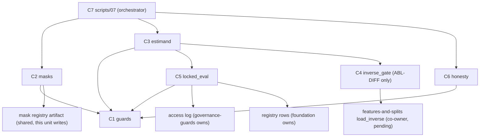

# Logical Components — `evaluation-and-comparison`

**Unit** `evaluation-and-comparison` (Bolt 9) · **Kind** `library` · **Stage** `nfr-design`

> ## ⚠ NOTHING HERE IS CLAIMED SATISFIED
>
> Component inventory for a unit whose modules **do not exist yet** — `src/` holds no
> `evaluation` package, `configs/` is absent, no Python interpreter is installed, and
> **BLK-07 / BLK-08 remain open exit conditions**. G-09's signature (D-31) authorises module
> creation and nothing more. Every component below is **design**, named so 3.5 has a layout
> to implement, not a claim that anything runs.

## Sources

- `nfr-design-questions.md` — **Q1 = A**, **Q2 = C**, receipted.
- `security-design.md` (this stage) — SD-C-01…SD-C-04, the mechanisms these components host.
- `../nfr-requirements/security-requirements.md` and `../nfr-requirements/tech-stack-decisions.md` — the SEC-C / TS-C requirements and stack constraints each component below traces to; the `library`-kind Scope note standing in for the absent `performance-requirements.md`, `scalability-requirements.md`, and `reliability-requirements.md` (not produced for this unit by design).
- `../functional-design/business-logic-model.md` — W-1…W-8, the workflows mapped onto components here.
- `../../../inception/application-design/component-methods.md` — § `src/evaluation` (`build_comparison_mask`, `paired_loss_differential`), consumed as the fixed public surface.
- `../../../inception/application-design/services.md` — `07_evaluate_and_report.py`'s row and stage entry contract.

---

## Component inventory

All inside `src/evaluation` (one of the six mandated §12 packages) except the script, which
is §12's `scripts/07_evaluate_and_report.py`. Names are **proposed to 3.5**; the shapes and
boundaries are this stage's.

| # | Component (proposed) | Owns | Workflows | Raises |
|---|---|---|---|---|
| C1 | `guards` module | the six refusal checks (SD-C-01 table; sixth — `require_mask_member_alignment` — added 2026-09-05 at the stage gate, governance Recommendation 1); the § SD-C-02 containment check | W-1.1, W-2 pre, W-4, W-5 | the guards' `IntegrityError` members |
| C2 | `masks` module | comparison-mask construction, intersection, once-only registration, mask manifest with `mask_id`/row counts/exclusion counts/scored-window statement; the reporting surface exposed to `regimes-diagnostics-reporting` | W-1 | via C1 |
| C3 | `estimand` module | the ordered estimand pipeline; `EstimandResult` with orientation/weighting/stamps | W-2 | via C1 |
| C4 | `inverse_gate` (thin) | the `ABL-DIFF`-only call into `features-and-splits`' `load_inverse` (edge unauthorised — BLK-08) | W-3 | `InverseTransformError` |
| C5 | `locked_eval` module | the `DEC` chokepoint composition: receipt → containment → D-28 window | W-5 | `LockedTestError` |
| C6 | `honesty` module | completeness refusal, `beats_model` fields, emitted caveats/disclosures | W-6 | `FairnessError` |
| C7 | `scripts/07_evaluate_and_report.py` | orchestration only — `foundation`'s six-step stage entry, reads/writes, registry rows; **no governed check inline** (§7) | W-7 | exits non-zero on any `IntegrityError` |

Test module (specified, unwritten): `tests/test_common_masks.py` (W-8) plus the per-entry
negative controls Q2 = C added — each public entry point of C2/C3/C5/C6 gets one control
proving an unguarded violating input raises.

## Component boundaries and isolation

Text fallback: C7 calls only C2/C3/C6 public surfaces; C2, C3, C5 and C6 all route through C1
before touching rows; C2 writes the mask registry; C5 reads `governance-guards`' access log
and `foundation`'s registry rows; C3 reaches C4 only on `ABL-DIFF`, and C4 is the sole
component touching the (unauthorised) `features-and-splits` inverse edge.

- **C1 is the single failure domain for refusal logic** (Q2 = C). Nothing else re-implements
  a check; drift between two copies of one rule — the R-105-vs-R-92 defect class — has no
  second copy to drift.
- **C4 isolates the import-boundary risk.** The `src/evaluation` → `src/features` edge is
  unauthorised (BLK-08, amendment owed); confining it to one thin component means
  authorisation, or refusal, touches one file. C4 exposes no forward-apply — `load_inverse`
  returns an object exposing only `inverse(frame)` (D-27 narrowing).
- **C5 constructs no path into the restricted root** (R-28's one door): it consumes
  `open_restricted`'s access record; it never opens December itself.
- **Import boundary (TA-07):** no component here imports `src/external/iri.py` or
  `src/external/gim.py` — IRI/GIM arrive as evaluation-time comparators through the declared
  comparison sets, joined onto the frozen mask (R-112). `src/evaluation` is a *permitted*
  importer per §12; this design still needs no such import at the component level and leaves
  any to 3.5's explicit justification.

## Failure domains and blast radius

| Failure | Domain | Blast radius | Containment |
|---|---|---|---|
| Guard defect (wrong condition) | C1 | every refusal — widest radius in the unit | one module to fix; negative-control set catches the observable half; adversarial review at 3.5 |
| Entry point forgets to call C1 | that entry point | one workflow computes unguarded | per-entry negative controls (Q2 = C) — designed to fail the build, not to be noticed |
| Mask registry corruption | C2's artifact | every comparison of that set | content-hash identity (TS-C-03): a mask that re-hashes differently is a **failure**, not a version |
| Clock divergence across hosts | none | none on ordering | § SD-C-02 containment removed the clock comparison |
| Receipt/containment fields absent | C5 | `DEC` metrics refuse — fail-closed | by design; the cost is a blocked run, never a wrong one |
| Incomplete results artifact | C6 | not emitted at all | completeness refusal (W-6.1) |
| C7 defect | orchestration | a run aborts with an `aborted` registry row | `foundation` R-01/R-10 stage entry; no silent rerun (NFR-AUD-01) |

The unit-level posture is uniform: **every failure mode lands on "compute nothing" rather
than "compute the wrong comparison"** — the reliability assessment `nfr-requirements`' Scope
note recorded, realised component-by-component.

## Shared resources

| Resource | Owner | This unit's access |
|---|---|---|
| Mask registry artifact (Parquet + manifest) | **this unit (C2)** | write-once per set; readers: C3/C5, `regimes-diagnostics-reporting` (five exposed values, never restated) |
| Locked-test access log | `governance-guards` | C5 reads; § SD-C-02 adds two fields to its record — half-contract, **not declared satisfied** |
| Prediction-hash receipt / registry rows | `foundation` (rows), `models-and-baselines` (hash) | C5 verifies; produces neither |
| Persisted inverses (`load_inverse`) | `features-and-splits` | C4 only, `ABL-DIFF` only, edge unauthorised (BLK-08) |
| Bootstrap intervals | `statistical-inference` | consumed by C7 output assembly; **never reimplemented** (TS-C-02) |
| The four governed configs | student/supervisor via freeze gates | read-only via `foundation`'s `load_configs`; zero-`TBD` preflight gates every run |

## Cross-cutting notes for Infrastructure Design and 3.5

- No new platform, no new dependency, no service: this is a `library` unit on the fixed
  TE §8 stack; `infrastructure-design` inherits nothing new from it beyond TS-C-05's
  in-Kaggle obligation for a Kaggle-hosted G-06.
- CPU-complete path unchanged; the heavy cost in C7's run is `statistical-inference`'s
  bootstrap, already recorded at W-7.
- Owed at 3.5 (carried, not new): guard-module naming and entry-point enumeration (Q2);
  registry-hash target if the registry is ever more than one artifact (Q1); where the mask
  registry's write lands relative to `foundation`'s release hashing.

## Assumptions & Open Questions

- **[Q1]** The containment fields ride `governance-guards`' access record — half-contract,
  populated there, enforced here, **satisfied by neither side alone**; unrunnable while
  **BLK-07** is open.
- **[assumption]** `component-methods.md`'s two named functions (`build_comparison_mask`,
  `paired_loss_differential`) remain the fixed public surface; C1–C6 decompose *behind* it
  and add no new public API beyond the mask reporting surface already granted at W-1 step 4.
- **Carried** — BLK-03 ↓, BLK-04 ↓, BLK-09 ↓ inherited open exit conditions; BLK-08 owned
  here and open; no implementation may proceed while any stands.
- **None** of the above decides a scientific value, fills a `TBD — freeze gate` field, or
  claims a gate, acceptance row, or test as discharged.
