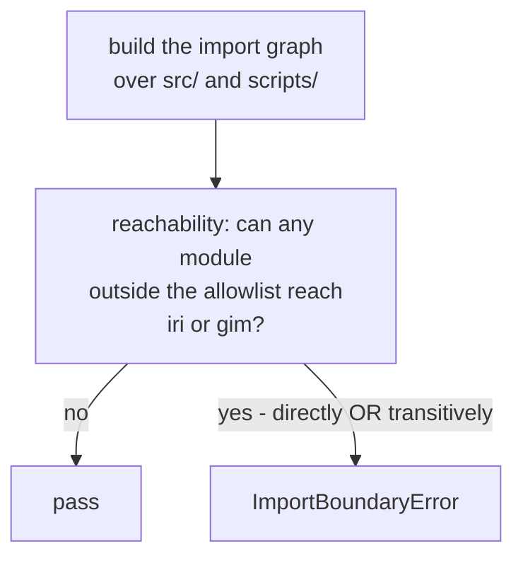

# Business Logic Model — `external-products`

**Unit** `external-products` (Bolt 5) · **Kind** `library` · **Depends on**
`inventory-and-registry`

The workflows this unit implements: the three driver series with their availability
semantics, the IRI-2016 benchmark with its pre-generation validation, and the CODE final
GIM comparator with its interpolation and network-overlap audit.

**This unit sits on the IRI/GIM containment boundary.** Nothing produced by `iri.py` or
`gim.py` may reach training or inference: those products join **only at evaluation time**,
onto the already-frozen comparison-wide mask. `spaceweather.py` is deliberately outside
that restriction — drivers **are** model inputs, subject to the availability lags.

**No workflow here decides a scientific value.** Every constant it applies — the lags, the
81-day trailing window, the 2000 km IRI ceiling, the alignment intervals — is frozen
elsewhere by a decision record.

> **Corrected and re-established 2026-08-23, after two adversarial passes and a redo jump.**
> Iteration 1 found two Criticals — TA-36's ownership misstated, and an amendment count that
> was both misattributed and wrong. Iteration 2 confirmed both fixed **and found that the
> correction sweep had itself missed other restatements of the same facts**, which is the
> failure `project.md` § Way of Working records. The redo cleared this stage's receipts so
> those could be swept: **six places in all**, two of which the reviewer's own line list had
> not named. Every superseded reading is preserved in place. **No answer to any question
> changed.**
>
> **A third redo followed**, aimed at a misread of `component-methods.md` § Depth. That
> policy specifies **cross-package boundary calls only** and names **this stage** as where
> intra-package shapes are specified — which makes `inventory-and-registry`'s `inventory.py`
> **not an amendment at all**, and narrows this unit's from "an entire package" to its three
> **boundary-importable** modules. **Corrected total: five across three units.** Q1's answer
> (D) stands; the pattern it argues is narrower than first stated.

## Sources

- `../../../inception/units-generation/unit-of-work.md` § 6 — the `Owns` list, the module-path allowlist, the 7 requirements, the implementation notes.
- `../../../inception/units-generation/unit-of-work-story-map.md` — Tables 1 and 2 plus § Per-unit coverage summary. **Derived by reading the rows:** 7 requirements, **4** with no acceptance row; **owns** WS-09; on **TA-36** this artifact contradicts itself and § Cross-unit responsibilities is the reconciling statement — see W-2a / § TA-36. **Supports** WS-10, WS-11, TA-08, TA-12.
- `../../../inception/requirements-analysis/requirements.md` — REQ-ENG-9; FR-P1-04-3, -4, -9, -15, -17, -18.
- `../../../inception/application-design/components.md` § `src/external` — the three modules and the importable-only rule.
- `../../../inception/application-design/component-methods.md` — boundary-call blocks for `src/features`, `src/models`, `src/evaluation`, and **no `src/external` block** (W-1).
- `../../../inception/application-design/services.md` § The nine stage scripts — `04_build_external_products.py`.
- `../inventory-and-registry/functional-design/business-rules.md` — R-44's source inventory and R-45's registry, consumed here.
- `evidence/DECISIONS.md` — **D-5**, **D-10.1**, **D-10.2**, **D-10.3**, **D-11**, **D-13**, **D-21/22/23**.
- Workspace inspection, 2026-08-23: `scripts/audit_ec1_drivers.py` line 184, and the absence of `src/` and `configs/`.
- `functional-design-questions.md` (**Q1 through Q9**), `domain-entities.md`, `business-rules.md`.

---

## W-1 — What this unit builds, and the contract that does not exist for it

```
INPUT   config: ConfigSnapshot, the source inventory and station registry
OUTPUT  driver series, the IRI benchmark, the GIM comparator, and their reports
RAISES  DriverError, BenchmarkError, ComparatorError
```

Three product families, three modules: `spaceweather.py` (drivers), `iri.py` (benchmark),
`gim.py` (comparator), orchestrated by `scripts/04_build_external_products.py`.

> ## ⚠ `src/external` HAS NO CONTRACT BLOCK — FOR ANY OF ITS THREE MODULES
>
> `components.md` § `src/external` names the modules and states the importable-only rule.
> `component-methods.md` carries boundary-call blocks for `src/features`, `src/models` and
> `src/evaluation` — and **nothing for `src/external`**: no signature, no dataclass, no
> raise-contract.
>
> **Q1 = D designs them here and records the package as ONE amendment owed** to
> `component-methods.md`, needing a change record before stage 3.5 treats it as approved.
>
> **This unit owes a boundary contract for `src/external`**, and the amendment total across
> the units designed so far is **five**, derived by re-checking each claim against
> `component-methods.md`'s stated depth policy rather than by counting recorded lists:
>
> | Unit | Owed amendments (boundary contracts only) | Count |
> |---|---|---|
> | `acquisition` | the named accessors (`open_d9_input` and the restricted writer); the `AccessRecord.purpose` extension plus a restricted-write function; `write_release`'s `identity_fields` parameter | **3** |
> | `inventory-and-registry` | `Station`'s provenance field — **`inventory.py`'s contract is intra-package and owed nothing** | **1** |
> | `external-products` (this unit) | boundary blocks for `iri.py`, `gim.py` and `spaceweather.py` | **1** |
> | **Total** | | **5 across 3 units** |
>
> > **Corrected 2026-08-23 after an adversarial pass.** Superseded text, preserved: *"the
> > third consecutive unit to find a named module with no contract — `governance-guards`'
> > `open_d9_input`, `inventory-and-registry`'s `inventory.py`, and now an entire package…
> > the four owed amendments… four coincidences."* **Two errors.** `open_d9_input` is
> > **`acquisition`'s** finding about `governance-guards`' module, not `governance-guards`'
> > own — that unit's artifacts record no missing-contract finding at all. And the total was
> > **"four across four"** where `inventory-and-registry`'s own artifacts already read *"five
> > owed amendments across two units"* before this unit added its package. A count carried
> > from prose rather than derived, in a passage arguing that a pattern be counted.
>
> ## ⚠ CORRECTED 2026-08-23 — THE "PATTERN" WAS PARTLY A MISREADING
>
> `component-methods.md` § Depth states its own policy: **"Full signatures with types for
> cross-package boundary calls. Names and one-line purposes for intra-package functions…
> Every signature below is a cross-package boundary."** Its Assumptions add: **"[Q1]
> Intra-package helper names are indicative. `functional-design` (3.1) specifies them per
> unit and may rename freely — only the signatures above are contracts."**
>
> **So an absent block is not automatically a gap** — for an intra-package module it is the
> artifact's stated design, naming **this stage** as where the shape is specified. Re-checked
> against that policy:
>
> | Claimed gap | Verdict |
> |---|---|
> | `acquisition`'s named accessors; the `AccessRecord.purpose` extension; `write_release`'s `identity_fields` | **Real** — new or changed symbols in **boundary blocks that exist**, `scripts/` to `src/data` being cross-package |
> | `inventory-and-registry`'s `inventory.py` contract | **NOT an amendment** — `inventory.py` and `release.py` are the **same package** |
> | `inventory-and-registry`'s `Station` provenance field | **Real** — modifies an existing boundary dataclass |
> | **this unit's `src/external`** | **Real but NARROWER than first stated** — `iri.py` and `gim.py` are importable from `scripts/` and `src/evaluation/`, and `spaceweather.py` feeds `src/features`, so **those are boundary calls**. "An entire package with no contract" overstated it |
>
> **Corrected total: FIVE across three units**, not six. **Superseded text, preserved:**
> *"the amendment total is six across three units… the third consecutive unit whose design
> finds a named module with no contract."* The recurrence is real for boundary calls and was
> **not** the systemic under-specification the first issue argued; the consolidated-change-record
> proposal below is offered on the corrected footing.
>
> **This stage proposes — and does not take — that the five be carried as ONE consolidated
> change record**, so a reviewer judges them as a set. That is the owner's call; this unit's
> amendment is recorded either way.

## W-2 — Which upstream artifact governs this unit's coverage figures

Two `consumes` inputs disagree, and the disagreement is about this unit:

| Claim | `unit-of-work.md` § 6 | `unit-of-work-story-map.md` |
|---|---|---|
| Untested requirements | **5** (bold list includes FR-P1-04-17) | **4** — REQ-ENG-9, FR-P1-04-4, FR-P1-04-15, FR-P1-04-18 |
| Acceptance rows owned | **1** — WS-09 | **WS-09**, plus TA-36 in § Per-unit coverage summary — which § Cross-unit responsibilities reconciles differently (W-2a) |

**The story map governs** (Q2 = D). `TA-36` was approved **2026-08-22** under Vision §15.2
(`CR-2026-08-22-LEAKAGE-TA`) as FR-P1-04-17's negative-path row, and the story map records
the sweep: *"Changed 2026-08-22 by the addition of TA-33…TA-36: untested 40 → 36."*
`unit-of-work.md` § 6 was not swept with it.

**Both stale statements are reported at the gate, not edited.**
`CHANGE_RECORD_PROCEDURE.md` reserves approved-stage artifacts: a sweep reports absent
owner approval for annotate-in-place. The exact stale text is § 6's five-item bold list and
its line `Acceptance rows (1). WS-09`.

**The second one carries no numeral**, which is why it is named explicitly. `project.md`
§ Way of Working records that a sweep keyed to a superseded number is structurally blind to
a stale claim of exactly this shape.

> **TA-36's status is `Pending`: the row exists; it is not implemented, not executed, not
> passing.** Every citation of it in this unit's artifacts carries that status. A row that
> exists but has never run is the precise shape of the defect that let FR-P1-02-8 look
> covered behind a withdrawn `TA-29` for five revisions, past four governance boards.


## W-2a — TA-36's ownership: the story map contradicts itself, and the reconciliation governs

**The story map makes two different statements about TA-36, and this stage must not pick the
convenient one.**

| Where | What it says |
|---|---|
| § Per-unit coverage summary | `external-products` — `Acceptance rows as primary: WS-09, TA-36` |
| Table 2, TA-36's row | primary `external-products`, supporting `features-and-splits` *("the enforcement raise sits at `features.build_features`")* |
| **§ Cross-unit responsibilities** | **`features-and-splits` — "enforcement and the primary negative-path acceptance test"**; `external-products` — **"upstream data production"** |

**§ Cross-unit responsibilities is the reconciling statement**, and it says so in its own
words: *"Reconciled 2026-08-22. This artifact assigned the requirement to `external-products`
while `unit-of-work-dependency.md` put the enforcement raise in `features.build_features`…
Both were right about different things."*

**Four ownerships are distinguished**, and this unit holds two of them — neither of which is
the primary test:

| Ownership | Unit |
|---|---|
| **Data production** — driver series carrying their own interval semantics, no interpolation at any stage | **`external-products`** |
| **Enforcement** — the raise at `features.build_features` | `features-and-splits` |
| **Primary acceptance test** — TA-36, sited at the feature-building enforcement boundary in `tests/test_feature_leakage_guards.py` | `features-and-splits` |
| **Upstream evidence / data-contract responsibility** — driver manifests recording per-series interval semantics and release grade | **`external-products`** |

**The clause that decides what this unit builds**, quoted: any upstream contract test is
*"documented separately and **not** replacing the primary rejection test."* So R-58's three
limbs are this unit's **upstream contract evidence**, not TA-36's primary test — which lives
in a module this unit does not own.

**This stage does NOT reallocate.** The reconciliation states the allocation *"is the
**default** and stands unless functional design produces verified evidence for a better one;
if it reallocates, it updates **both** artifacts."* This unit has produced no such evidence,
so the default stands and neither artifact is edited.

> **Corrected 2026-08-23 after an adversarial pass.** The first issue of these artifacts read
> **"owns WS-09 and TA-36"** flatly, in all three files, citing only § Per-unit coverage
> summary and Table 2 while never reaching § Cross-unit responsibilities or
> `unit-of-work-dependency.md`. That would have had this unit build a primary acceptance test
> sited in `tests/test_feature_leakage_guards.py`, a module owned by `features-and-splits` —
> the ownership overreach this project's reviews have caught twice before, arriving this time
> from reading one table and stopping.

## W-3 — Enforcing the module-path import allowlist

**The rule, at module-path granularity** (`unit-of-work.md` § 6): IRI/GIM imports are
permitted **only** in `scripts/04_build_external_products.py` and modules under
`src/evaluation/`. An import from `src/data`, `src/features`, `src/models`, `src/gnss`, a
training script or a notebook violates it **identically**.

**`src/evaluation/` is owned by three units** — `evaluation-and-comparison` (`masks.py`,
`metrics.py`), `statistical-inference` (`bootstrap.py`), `regimes-diagnostics-reporting`
(`regimes.py`, `diagnostics.py`, `plots.py`). The allowlist grants an authorized **path**,
never a whole unit's unrelated code.

**Mechanism (Q3 = D): a TRANSITIVE static reachability scan.**



Text fallback: build the import graph over `src/` and `scripts/`, then ask whether any
module outside the allowed paths can reach `iri` or `gim` directly or through
intermediaries; if so, fail.

**Why transitive rather than direct.** `project.md` § Forbidden states the constraint as
*"directly or transitively"*. A direct-import check does not implement the rule its own
citation states: a helper in `src/features` importing a shim that imports `gim` satisfies a
direct check and violates the rule.

**Why the static scan is AUTHORITATIVE here, unlike the phase boundary's.** A module graph
is a property of the **source tree**; a loaded module is a property of a **running
process**, which is why `assert_phase_boundary` reads `sys.modules`. **The asymmetry is
stated rather than left to be noticed**, because an unexplained inconsistency between two
neighbouring designs reads as an oversight.

> **`governance-guards` R-24's own rationale is different and is not restated as this one.**
> R-24 argues from **Kaggle-versus-local-checkout** — a static scan of a local tree
> constrains nothing about the session a governed run executes in. The source-tree-versus-process
> framing above is **this stage's** argument for **this** rule, not a paraphrase of R-24's.
> Corrected 2026-08-23 after an adversarial pass found the first issue attributing it to R-24.

**⚠ What the static scan CANNOT see, stated rather than assumed away.** A **dynamic import** —
`importlib.import_module("src.external.gim")`, `__import__`, or a module path assembled from a
string — is invisible to an `ast` reachability walk. Two partial controls and one residual:

1. A **grep-class check** for `importlib` and `__import__` in every module outside the
   allowlist, so a dynamic-import site is at least **visible** rather than silent. This is
   the same grep-evidence pattern the project already uses for SSN, residual and GRU absence.
2. Any such site found outside the allowlist is a **review item**, not an automatic pass.
3. **Residual, uncovered:** a dynamic import whose target is computed at run time and whose
   call site uses neither name. **No static check reaches it**, and a run-time caller check
   was declined for the coupling reason below. This is a **stated limit of the mechanism**,
   not a claim of completeness.

**A run-time caller check inside `iri.py` and `gim.py` was declined**, with its reason: it
would make the two guarded modules aware of three sibling units' paths — the coupling
`governance-guards` R-28 declined for the same reason — and it would catch the violation
later than a scan does.

**This is a module-graph constraint, distinct from the data-flow IRI rule.** `project.md`
§ Forbidden and `governance-guards` R-23 govern whether an `iri_*` value reaches training;
this governs whether the *module* is importable. Neither substitutes for the other.

## W-4 — The F10.7 trailing mean, proven as a property

**The rule** (`project.md` § Forbidden, quoted): *"NEVER use a centered rolling/trailing
window for F10.7 — only the trailing 81-day mean ending at the safe-lagged day is
permitted; a centered mean uses future days and is a defect, not a fallback."*

**Why this needs more than a spot check.** A centered mean produces a smoother, entirely
plausible series and every downstream check passes. The failure is **invisible in
validation** — it surfaces as unexplained optimism against a benchmark, or not at all.

**Mechanism (Q4 = C), two limbs:**

1. **Definitional:** the 81-day mean at day *d* equals the mean of the 81 days **ending at**
   the safe-lagged day.
2. **Future-independence, the limb that carries the rule:** perturbing **any** day after the
   safe-lagged day leaves the computed mean **unchanged**.

**Why limb 2 rather than limb 1 alone.** Limb 1 tests the value at chosen days. A window
that is trailing everywhere except at a boundary — the series start, or across the March
F10.7 gap — passes a spot check. Limb 2 is a **property that holds at every index**:
perturb a future day, the mean must not move. That is exactly what *"uses future days"*
means, stated so a test can fail on it, and it covers boundary handling and gap fill
without enumerating them.

**Not generalised to the other drivers**, with a reason: Kp/ap3, Hp60/ap60 and Dst are
governed by D-10.2's **alignment** contract rather than by a window, and FR-P1-04-17
already tests that with two named negative controls and an approved row. A second,
differently-shaped guarantee over the same series would be two rules about one fact.

**F10.7's frozen selection choices are D-21, D-22 and D-23**, applied here and decided
elsewhere: daily **median**; duplicate UT records take the **mean** with a QC flag and
provider-defined correction semantics taking precedence; the four high-spread days flagged
and retained with the median as representative.

## W-5 — Driver alignment: how a present value maps onto the hourly grid

**D-10.2's contract**, quoted through FR-P1-04-17:

| Series | Alignment |
|---|---|
| Kp / ap3 | Repeated **only within its own defined 3-hour interval** |
| Dst | Aligned to **its own hourly averaging interval** — *"not shifted to a neighbouring hour for convenience"* |
| F10.7 | Daily |
| **All** | **No driver is interpolated, at any stage** |

**Distinct from FR-P1-04-3's carry-forward, and the requirement says so.** Alignment governs
how a **present** value maps onto the grid; carry-forward (≤3 h, then exclude the row)
governs a **missing** value. **The two are tested separately** (Q5 = D), so neither passes on
the other's evidence — two rules governing adjacent behaviour on the same series is exactly
where one test gets counted twice.

**Three limbs, all of TA-36's criterion** (Q5 = D):

1. A Kp value repeated **outside** its 3-hour interval → **fails**.
2. A Dst value **shifted to a neighbouring hour** → **fails**.
3. A **grep-level check** finds no interpolation call on any driver series.

**Why limb 3 matters independently.** *"No driver is interpolated, at any stage"* is
absolute, and a grep is the only check that reaches a call site no fixture exercises.
Building limbs 1 and 2 alone leaves the row **partially satisfied while looking complete**.

> **TA-36 is `Pending`** — approved 2026-08-22, **not implemented, not executed, not
> passing**. Cited with that status wherever it appears.

## W-6 — The IRI benchmark: validated before generation, blocked on failure

```
INPUT   config: ConfigSnapshot, coordinates, times, solar and geomagnetic drivers
OUTPUT  the benchmark, and iri_implementation_validation_report
RAISES  BenchmarkError — no passing report, an incomplete report, or a tolerance
        declared after the comparison ran
```

FR-P1-04-15: *"a validation failure **blocks** benchmark generation rather than warning."*

**Four limbs (Q6 = D):**

1. **Generation refuses without a passing report.**
2. **The tolerance is recorded with a timestamp preceding the comparison**, and generation
   refuses if the ordering is violated.
3. **The report's required content is asserted field by field.**
4. **The benchmark's own drivers appear as rows in the same frozen availability matrix used
   for ML features**, each carrying observation timestamp, publication timestamp, release
   status and safe lag.

**Why limb 2.** *"A passing report exists"* is satisfiable by a report whose tolerance was
chosen **after** the comparison ran — the failure the **predeclared** clause exists to
prevent, and one no presence check can see. A frozen value plus a timestamp is the only
evidence class that distinguishes *declared before* from *fitted after*, and it is the same
shape `inventory-and-registry` adopted for retrospective split redesign.

**Why limb 3.** FR-P1-04-15 enumerates seven content areas and a **5–10 sample** range: the
pinned package/build with exact version or commit; all model switches and the topside
option; **the altitude ceiling stated explicitly as 2000 km**; units and output extraction;
the coordinate, time, solar and geomagnetic driver inputs **with confirmation that no driver
is future-centered or unavailable at target time**; the samples spanning sites, day and
night, quiet and disturbed, validated against the **official IRI interface**; and the
predeclared tolerance. A report missing the ceiling or the driver-availability confirmation
would otherwise pass on presence — the same defect class as a short protected-set list
passing a membership check.

**Why limb 4 has scientific consequence.** *A benchmark fed better-timed drivers than the
model gets is not a benchmark.* FR-P1-04-15's criterion states this limb explicitly, and it
is what keeps the IRI comparison fair.

> **The availability matrix is `features-and-splits`' artifact.** This unit **states the
> obligation and does not own the row**.

**Also recorded:** the **26,000-call workload is timed** and the measured runtime recorded,
and the `iri2016` Fortran build **re-establishes from pins on a cold session** (TC-04).

> **FR-P1-04-15 has NO acceptance row.** The blocking behaviour, the report's completeness
> and the predeclared tolerance are all unrowed. Designing them is not testing them.

## W-7 — The GIM comparator: four obligations stated as one contract

Vision §6.10 states them together, so FR-P1-04-18 does:

| # | Obligation | How it is built (Q7 = D) |
|---|---|---|
| 1 | Interpolation is **bilinear in space, linear in time, with a longitude-rotation correction** — a §18.2 **Student-owned forbidden choice** (Q-15) | ⚠ **BLOCKED.** Recorded as unset; **generation refuses while it is unset** |
| 2 | *"One sample interpolation must be hand-checked against the code"*, and **EV-11 places the hand-calculation BEFORE comparator generation** | The hand-check's **timestamp is asserted to precede** generation; generation **fails** otherwise |
| 3 | The Phase 1 GIM comparison *"is explicitly a map-product-to-map-product comparison … cannot validate receiver-level station VTEC or serve as an independent target check"*, stated **wherever the comparison is reported** | The sentence is **emitted by the reporting path itself** |
| 4 | The comparator is **never tuned and then claimed independent** | A reporting-discipline rule with **no code check** — stated, not papered over |

**Why obligation 1 is blocked rather than specified.** TE §18.2: *"No implementer or coding
agent may fill such a value by convenience."* Specifying the mechanism while leaving the
**value** implicitly fillable is exactly what that prohibits. Refusing to generate while it
is unset is the zero-TBD preflight's shape.

**Why obligation 3 is emitted by the code.** It is a rule about **every** report — including
ones nobody has written yet. A sentence a human must remember to include does not survive a
new report being added; one emitted from the path that produces the comparison does.

**Why obligation 4 has no check, said plainly.** *"Never tuned and then claimed
independent"* is a claim about what was **not** done. No injected value proves a negation of
that kind. It is carried as a reporting-discipline rule and named as uncheckable rather than
given a check that would not test it.

**Also required by FR-P1-04-9, and distinct from the above:** the
**`gim_network_overlap_flag` audit is present and its result disclosed**, and **no
independence claim precedes the audit**. The flag value **appears wherever GIM is
compared**. B-01 (the IRI benchmark) and C-01 (the GIM comparator) are represented in the
model/config inventory and labelled **generated, not trained** — never fitted.

> **FR-P1-04-18 has NO acceptance row.** Its criterion — the report carrying the
> interpolation rule, the hand-checked sample **with its worked arithmetic**, and the
> map-to-map statement, and *"a comparator generated before the hand-check **fails** rather
> than being accepted retrospectively"* — is unrowed.

## W-8 — Closing `audit_ec1_drivers.py`'s exit-code gap

**The workspace fact:** `scripts/audit_ec1_drivers.py` **line 184 returns `0` regardless of
missing months.**

**REQ-ENG-9's closure, and it is a TIER question rather than an exit-code bug** (Q8 = D):

| Condition | Tier | Behaviour |
|---|---|---|
| A missing month | **Completeness shortfall** | **Non-fatal.** Recorded as a machine-readable manifest field naming **which** months are missing |
| A hash mismatch | **Integrity violation** | **Terminates** the run non-zero, naming the file and the violated expectation |

**Why not simply return non-zero on missing months.** That collapses the two-tier posture
`team.md` § Code Style fixes: a month absent from the provider is a fact to record; a hash
that does not match invalidates everything downstream of it. Making an ordinary partial
retrieval abort the run is how a guard gets worked around.

**Why the field names the months rather than counting them.** A count says something is
wrong; the list says what to do. This unit's outputs feed G-P1A's coverage decision, where
`inventory-and-registry` R-51 forbids *"an unattributed number"* — a bare count is that same
shape.

**Both injections are tested**, because REQ-ENG-9's criterion names both and they assert
**opposite** outcomes: a missing month → the run continues with a record; a hash mismatch →
the run stops. A single test covers half the requirement and lets the other half regress
silently.

`audit_ec1_drivers.py` migrates here, gaining `--config configs/` and its numbered
position. This stage designs the target shape, not the migration commit.

> **REQ-ENG-9 has NO acceptance row.**

## W-9 — Dst's three restrictions, kept apart

They are easy to blur, and one has a live trap in the workspace today.

| # | Restriction | Source | Enforced how (Q9 = D) |
|---|---|---|---|
| 1 | **Diagnostic/hindcast-only** — never a confirmatory ML feature | `project.md` § Mandated; TC-11 | Enforced downstream by `features-and-splits`; stated here |
| 2 | **Release grades never mixed** within one series, grade recorded before use | D-10.1 | A **grade field** on the series; **mixed grades fail at construction** |
| 3 | **Provisional Dst may characterise fixture selection only** — never a modelling input, never a frozen tolerance, **never a G-05 regime count** | D-11 | The **provisional grade renders the series ineligible** for those three purposes, asserted **at the point of use** |

**The live trap.** `evidence/audit_ec1_2026-08-15/kyoto_dst/dst_provisional_202212.html`
exists in the workspace; D-11 used provisional Dst to characterise the fixture window — a
**permitted** use; and **D-13 requires the December regime count to come from GFZ Kp/Hp60 at
a recorded release grade**, explicitly barring any provisional-Dst-derived figure.

**Why eligibility is a property of the data rather than a rule about it.** A rule that
depends on three units remembering is the shape D-15 warns about for the restricted root.
Making the consumer read the grade is the only form that survives a consumer nobody has
written yet — and it makes the **permitted** fixture-characterisation use explicitly
distinguishable from the three that are not.

**Negative control:** a **regime count computed from a provisional-graded series fails**,
naming D-13's GFZ Kp/Hp60 requirement. This is the restriction with a concrete artifact
already present to get wrong, and this project's methodology pairs a negative control with
**every** hard rule rather than with the convenient ones.

`governance-guards` **R-26** separately names Dst as the driver class excluded from the
December-hit definition, on the grounds that it is diagnostic-only. That is a fourth,
distinct consequence of restriction 1 and is not restated as a rule here.

## W-10 — What Bolt 5 builds, and what it must not

**Permitted before G-09**: module structure, interfaces, placeholder CLI definitions,
configuration wiring, safe fail-fast behaviour, and this unit's `tests/` scaffolding.

**Barred until G-09 is signed for the affected component**: implementing any component whose
P0 decision is unresolved; filling any `TBD — freeze gate` field; executing any governed
run; generating code for a unit carrying an open blocker on that scope.

> **`src/external/spaceweather.py`, `src/external/iri.py`, `src/external/gim.py` and
> `scripts/04_build_external_products.py` DO NOT EXIST**, and neither does `src/` or
> `configs/`.
>
> **FR-P1-04-18's interpolation rule is a §18.2 Student-owned forbidden choice and is
> UNSET.** Comparator generation refuses while it stands. No implementer may fill it.
>
> **Nothing this unit produces from `iri.py` or `gim.py` reaches training or inference.**
> Those products join only at evaluation time, onto the already-frozen comparison-wide mask.

---

## Requirement-to-workflow map

Acceptance derived from story-map Table 1; owners from Table 2's `primary` cell. **Where
`unit-of-work.md` § 6 disagrees, the story map governs — see W-2.**

| Requirement | Workflow | Tested by (Table 1) | Row primary owner |
|---|---|---|---|
| **REQ-ENG-9** | W-8 | ⚠ **NO ACCEPTANCE ROW** | — |
| FR-P1-04-3 | W-5 (carry-forward, tested separately) | WS-11 | `features-and-splits` |
| **FR-P1-04-4** | W-5 | ⚠ **NO ACCEPTANCE ROW** | — |
| FR-P1-04-9 | W-7 | WS-09, TA-12 | **`external-products`** (WS-09); `models-and-baselines` (TA-12) |
| **FR-P1-04-15** | W-6 | ⚠ **NO ACCEPTANCE ROW** | — |
| FR-P1-04-17 | W-5 | **TA-36** — ⚠ **`Pending`**: row exists, **not implemented, not executed, not passing** | **`features-and-splits`** holds the primary test; **`external-products`** holds data production and upstream evidence (W-2a) |
| **FR-P1-04-18** | W-7 | ⚠ **NO ACCEPTANCE ROW** | — |

**7 requirements, 4 without an acceptance row.** This unit **owns WS-09**. On **TA-36** it
holds **data production** and **upstream evidence**, while `features-and-splits` holds
**enforcement** and the **primary acceptance test** — see W-2a. It **supports** WS-10, WS-11,
TA-08 and TA-12.

### The four, and what evidence would close each

No §19 criterion is drafted — §19 rows are owned by stage 3.2 and change control, and a
drafted criterion in a functional-design artifact is indistinguishable, months later, from
an approved one.

| Requirement | Evidence that would close it |
|---|---|
| **REQ-ENG-9** | An approved §19 row plus **two** passing results asserting opposite outcomes: an injected missing month yields a non-silent machine-readable record and the run continues; an injected hash mismatch yields a non-zero exit naming the file and the violated expectation |
| **FR-P1-04-4** | An approved row plus a passing schema test asserting **one value per epoch, identical across all three cells** — no per-cell driver measurement |
| **FR-P1-04-15** | An approved row plus passing results for: generation blocked on a failing report; the tolerance timestamp preceding the comparison; the report's seven content areas present; the benchmark's drivers present in the frozen availability matrix; the 26,000-call runtime recorded |
| **FR-P1-04-18** | An approved row plus a `gim_interpolation_and_independence_report` carrying the interpolation rule, the hand-checked sample **with its worked arithmetic**, and the map-to-map statement — with the hand-check's timestamp **preceding** comparator generation, and a comparator generated before the hand-check **failing** rather than being accepted retrospectively. **Blocked on the Student's Q-15 decision** for the interpolation rule itself |

## Assumptions & Open Questions

- **[assumption]** Rule IDs continue the single sequence — `foundation` R-01…R-17, `governance-guards` R-18…R-29, `acquisition` R-30…R-43, `inventory-and-registry` R-44…R-53 — so `business-rules.md` opens at **R-54**. If per-unit numbering was intended, say so at the gate.
- **[assumption]** The **story map governs** where it and `unit-of-work.md` § 6 disagree, because TA-36's 2026-08-22 §15.2 approval is what moved it. Neither artifact is edited by this stage.
- **[assumption]** The availability matrix W-6 limb 4 requires is **`features-and-splits`' artifact**. Obligation stated, row not owned.
- **[assumption]** `audit_ec1_drivers.py` migrates here with `--config configs/` and its numbered position. Target shape designed; migration commit not made.
- **[assumption]** `frontend-components.md` is not produced — `kind: library`.
- **Open — `src/external` has no contract block** for any of its three modules. W-1's contracts are **one amendment owed**, not approved.
- **Open — FIVE owed amendments across three units** (`acquisition` 3, `inventory-and-registry` 1, this unit 1), **boundary contracts only**. W-1 **proposes** carrying them as one consolidated change record; the owner accepts or declines. **Corrected twice on 2026-08-23:** first from "four across four" with `open_d9_input` misattributed to `governance-guards`; then from "six across three", after `component-methods.md` § Depth was found to specify **cross-package boundary calls only** and to name **this stage** as where intra-package shapes are specified — which makes `inventory-and-registry`'s `inventory.py` not an amendment at all, and narrows this unit's from "an entire package" to its three boundary-importable modules.
- **Open — TA-36's primary acceptance test is `features-and-splits`'** (W-2a), not this unit's. This unit holds data production and upstream evidence.
- **Open — FR-P1-04-18's interpolation rule is UNSET**, a §18.2 Student-owned forbidden choice (Q-15). Comparator generation refuses while it stands.
- **Open — four requirements with no acceptance row**: REQ-ENG-9, FR-P1-04-4, FR-P1-04-15, FR-P1-04-18.
- **Open — TA-36 is `Pending`**: approved, never run. Never cited as a result.
- **Open — `unit-of-work.md` § 6 carries stale text**, reported not edited: a five-item bold list including FR-P1-04-17, and `Acceptance rows (1). WS-09`. Both were correct before 2026-08-22.
- **Open — obligation 4 of FR-P1-04-18 has no code check.** "Never tuned and then claimed independent" is a claim about what was not done; no injected value proves that negation. Carried as a reporting-discipline rule and named uncheckable.
- **G-09 is not signed.** No workflow here authorises creating any module.
- **None** of the above adopts a reading on a supervisor-owned value, and none decides a scientific constant.

## Review

**Verdict:** READY
**Reviewer:** aidlc-architecture-reviewer-agent
**Date:** 2026-08-23T05:43:00Z
**Iteration:** 1 (final cycle after redo)

### Findings

| # | Severity | Location | Finding | Recommendation |
|---|---|---|---|---|
| 1 | Minor | `functional-design-questions.md` lines 26, 46, 107 | The top overview table (line 26), the Sources bullet (line 46) and Question 2's raw disagreement table (line 107) still state the upstream story-map claim as flat, unqualified **"WS-09 and TA-36"**, with no forward-pointer to the four-way reconciliation. Every sibling Sources bullet carries that pointer verbatim — `business-logic-model.md` line 31 ("…which § Cross-unit responsibilities is the reconciling statement — see W-2a / § TA-36"), `domain-entities.md` line 23, and `business-rules.md` line 27 ("the governing source where § 6 disagrees, see R-54's box") — and `functional-design-questions.md`'s own **Consolidated Summary** (line 436, corrected in this sweep) states the reconciliation in full. This is not a misstatement of the design's actual, approved conclusion — the file's binding position (line 436, the human-approved summary) is correct — but it is a genuine, checkable residual of the same fact-restatement gap the last two iterations were built to close, confined to this file's front-matter/raw-quote sections rather than its substantive answer. | Add the same forward-pointer ("— reconciled in Q2 / § Cross-unit responsibilities, see the Consolidated Summary") to lines 26, 46 and 107 so the file is internally self-consistent throughout, not only at its answer. |

No Critical or Major findings survive verification. Both prior Criticals (TA-36 ownership; the amendment count/attribution) and the iteration-2 finding (the two remaining unswept restatements — `business-logic-model.md`'s own footer and `functional-design-questions.md`'s Open bullet/Consolidated Summary) are now independently confirmed fixed across all four artifacts.

### Failed refutation attempts

- **Grepped all four artifacts for every live (non-quoted-superseded) restatement of the amendment count**: `business-logic-model.md` (line 506), `business-rules.md` (line 538), `domain-entities.md` (line 351) and `functional-design-questions.md` (line 418, plus the Consolidated Summary at lines 435/451) all now read "six owed amendments across three units" with a correction note; every remaining "four across four"/"four owed" string in all four files sits inside a blockquoted, explicitly labelled superseded-text box, never as live prose. `business-logic-model.md`'s own footer — the specific gap iteration 2 found — is now fixed (line 506), matching `business-rules.md` and `domain-entities.md`.
- **Verified the amendment count is arithmetically derived, not carried**: cross-checked against the two permitted carve-out files. `inventory-and-registry/functional-design/business-rules.md` attributes `open_d9_input` to `acquisition` (lines 79, 294) and states "Five owed amendments… across two units" (line 480) — resolving to exactly 2 (`inventory-and-registry`) + 3 (`acquisition`) = 5, which plus this unit's 1 gives the claimed 6 across 3. `governance-guards/functional-design/business-rules.md` has zero hits for `open_d9_input` or any "owed amendment"/"missing contract" language, confirming that unit recorded no such finding and that the original misattribution is corrected.
- **Verified rule numbering**: `governance-guards` runs R-18…R-29 and `inventory-and-registry` runs R-44…R-53 in their own files; this unit's `business-rules.md` opens at **R-54**, inserts **R-54a** immediately after it for the TA-36 reconciliation, and runs through **R-63** — a clean continuation with no gap or collision.
- **Re-verified the TA-36 reconciliation against the live story-map text**: `unit-of-work-story-map.md`'s § Cross-unit responsibilities row (its FR-P1-04-17/TA-36 entry) was read directly and diffed word-for-word against the quotes in W-2a, R-54a and `domain-entities.md` § 2 — an exact match, including "documented separately and not replacing the primary rejection test" and "the default and stands unless functional design produces verified evidence for a better one; if it reallocates, it updates both artifacts." The design correctly declines to reallocate and assigns this unit only data production and upstream-evidence responsibility, never the primary test.
- **Verified `governance-guards` R-24's rationale independently**: read R-24 directly — its stated rationale is "a static scan of a local checkout constrains nothing about a Kaggle session," exactly the Kaggle-vs-local-checkout framing this unit's R-56/W-3 now attribute to it, distinct from and not conflated with this unit's own source-tree-vs-process argument.
- **Re-verified all workspace facts cited**: `scripts/audit_ec1_drivers.py` line 184 is exactly `return 0`, independent of any missing-months field in the report dict it builds; `evidence/audit_ec1_2026-08-15/kyoto_dst/dst_provisional_202212.html` exists at the cited path; `src/` and `configs/` are both absent from the workspace root. All match the artifacts' claims exactly.
- **Cross-checked D-11, D-13, D-21/22/23 and D-10.1/.2/.3 against `evidence/DECISIONS.md`**: D-13's sourcing clause ("GFZ Kp/ap3 and Hp60/ap60 at a single recorded release grade… D-11 bars provisional Dst from becoming a G-05 regime count") matches W-9/R-62's Dst-eligibility claims verbatim in substance; all cited D-numbers exist and say what is attributed to them.
- **Checked the requirements-analysis source for every cited FR/REQ ID** (REQ-ENG-9, FR-P1-04-3/4/9/15/17/18): each requirement's stated criterion in `requirements.md` matches the design's stated limbs and negative controls (the seven IRI content areas, the four GIM obligations, the two REQ-ENG-9 tiers, the driver-alignment three limbs) with no invented or dropped obligation.
- **Hunted for a third fresh defect from this second sweep** (duplicated, orphaned or contradictory text; a fix that broke a neighbour): sorted all three main bodies for exact duplicate lines outside tables/blockquotes — the only repeats are legitimate shared acceptance-row citations (R-57 and R-62 both correctly citing "WS-11 and TA-08, both owned by `features-and-splits`"), not copy-paste damage. R-54/R-54a's insertion is cleanly structured with matching blockquote nesting; W-1's and R-55's correction boxes are intact. The one surviving residual (Finding 1) is confined to `functional-design-questions.md`'s raw-quote front-matter, not a new self-contradiction.

### Summary

Both Criticals from iteration 1 (TA-36's ownership; the amendment count and its misattribution) and the iteration-2 finding (unswept restatements in `business-logic-model.md`'s footer and throughout `functional-design-questions.md`) are now independently verified as fixed across all four artifacts, against the live upstream story map, the two permitted carve-out files, and direct workspace inspection — not merely trusted from the correction boxes' own claims. The TA-36 reconciliation is quoted accurately and the design correctly declines to reallocate; the amendment count is now derived (6 across 3 units) and consistent with both carve-outs; the dynamic-import residual and GIM obligation 4 are honestly scoped as partial controls with named, accepted gaps rather than false completeness claims; rule numbering is a clean continuation at R-54…R-63 with R-54a inserted; and every workspace fact, D-number and requirement citation checked out exactly as stated. One Minor residual survives: `functional-design-questions.md`'s top overview and Sources bullet still state the raw upstream disagreement ("WS-09 and TA-36") without the same forward-pointer to the reconciliation that every sibling artifact's Sources bullet carries — a real but non-substantive gap, since the same file's own approved Consolidated Summary already states the reconciliation correctly. This does not rise to Critical or Major: it does not misstate the design's binding position, does not affect any rule, contract, or test, and is confined to descriptive front-matter rather than the artifact set's actual conclusions. The artifact set is READY.
