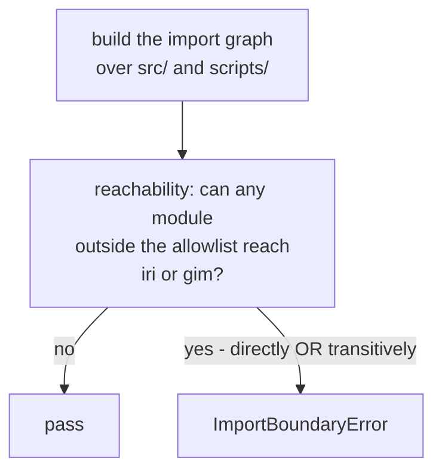

# Business Logic Model — `external-products`

**Unit** `external-products` (Bolt 5) · **Kind** `library` · **Depends on**
`inventory-and-registry`

> **Re-established a sixth time 2026-08-24**, on a **new stage attempt** — Inception closed
> and Construction opened at 2026-08-24T11:46:26Z, resetting the receipt floor for every
> unit. **No content of this unit changed.** Both `foundation` passes of that day (the
> amendment pass and the sites 9–11 addendum, in
> `governance/CHANGE_RECORD_2026-08-24_foundation_amendments.md`) touch nothing this unit
> reads. **Question 1's premise was re-verified against the current file rather than carried
> forward:** `grep -n "src/external" component-methods.md` returns **no hits**, so the
> absence of an `src/external` boundary-call block still holds — Amendment B added fields to
> a `foundation` entity and created no block. Amendment A was declined, so **no count
> moved**. **The READY verdict in § Review belongs to the previous attempt.**

> **Re-established a fifth time 2026-08-23**, after a redo aimed at four stale
> cross-references in `target-standardization`'s question file. **No content of this unit
> changed.**

The workflows this unit implements: the three driver series with their availability
semantics, the IRI-2016 benchmark with its pre-generation validation, and the CODE final
GIM comparator with its interpolation and network-overlap audit.

**This unit sits on the IRI/GIM containment boundary.** Nothing produced by `iri.py` or
`gim.py` may reach training or inference: those products join **only at evaluation time**,
onto the already-frozen comparison-wide mask. `spaceweather.py` is deliberately outside
that restriction — drivers **are** model inputs, subject to the availability lags.

**No workflow here decides a scientific value.** Every constant it applies — the lags, the
81-day trailing window, the 2000 km IRI ceiling, the alignment intervals — is frozen
elsewhere by a decision record.

> **Corrected and re-established 2026-08-23, after two adversarial passes and a redo jump.**
> Iteration 1 found two Criticals — TA-36's ownership misstated, and an amendment count that
> was both misattributed and wrong. Iteration 2 confirmed both fixed **and found that the
> correction sweep had itself missed other restatements of the same facts**, which is the
> failure `project.md` § Way of Working records. The redo cleared this stage's receipts so
> those could be swept: **six places in all**, two of which the reviewer's own line list had
> not named. Every superseded reading is preserved in place. **No answer to any question
> changed.**
>
> **A third redo followed**, aimed at a misread of `component-methods.md` § Depth. That
> policy specifies **cross-package boundary calls only** and names **this stage** as where
> intra-package shapes are specified — which makes `inventory-and-registry`'s `inventory.py`
> **not an amendment at all**, and narrows this unit's from "an entire package" to its three
> **boundary-importable** modules. **Corrected total: five across three units.** Q1's answer
> (D) stands; the pattern it argues is narrower than first stated.
>
> **A fourth redo** then swept this unit's **question file**, which an adversarial pass found
> still asserting "six across three" in **five** live places while these artifacts already
> read five. It had not been corrected alongside them because its receipt was recorded before
> the correction was applied. **No content of this artifact changed.** The ordering is changed
> going forward: corrections land in the artifacts **and** the question file before a
> confirmation receipt is recorded.

## Sources

- `../../../inception/units-generation/unit-of-work.md` § 6 — the `Owns` list, the module-path allowlist, the 7 requirements, the implementation notes.
- `../../../inception/units-generation/unit-of-work-story-map.md` — Tables 1 and 2 plus § Per-unit coverage summary. **Derived by reading the rows:** 7 requirements, **4** with no acceptance row; **owns** WS-09; on **TA-36** this artifact contradicts itself and § Cross-unit responsibilities is the reconciling statement — see W-2a / § TA-36. **Supports** WS-10, WS-11, TA-08, TA-12.
- `../../../inception/requirements-analysis/requirements.md` — REQ-ENG-9; FR-P1-04-3, -4, -9, -15, -17, -18.
- `../../../inception/application-design/components.md` § `src/external` — the three modules and the importable-only rule.
- `../../../inception/application-design/component-methods.md` — boundary-call blocks for `src/features`, `src/models`, `src/evaluation`, and **no `src/external` block** (W-1).
- `../../../inception/application-design/services.md` § The nine stage scripts — `04_build_external_products.py`.
- `../inventory-and-registry/functional-design/business-rules.md` — R-44's source inventory and R-45's registry, consumed here.
- `evidence/DECISIONS.md` — **D-5**, **D-10.1**, **D-10.2**, **D-10.3**, **D-11**, **D-13**, **D-21/22/23**.
- Workspace inspection, 2026-08-23: `scripts/audit_ec1_drivers.py` line 184, and the absence of `src/` and `configs/`.
- `functional-design-questions.md` (**Q1 through Q9**), `domain-entities.md`, `business-rules.md`.

---

## W-1 — What this unit builds, and the contract that does not exist for it

```
INPUT   config: ConfigSnapshot, the source inventory and station registry
OUTPUT  driver series, the IRI benchmark, the GIM comparator, and their reports
RAISES  DriverError, BenchmarkError, ComparatorError, ImportBoundaryError
        (fourth name added 2026-08-26, finding 5 — § 9 and R-56 declare it raised here)
```

Three product families, three modules: `spaceweather.py` (drivers), `iri.py` (benchmark),
`gim.py` (comparator), orchestrated by `scripts/04_build_external_products.py`.

> ## ⚠ `src/external` HAS NO CONTRACT BLOCK — FOR ANY OF ITS THREE MODULES
>
> `components.md` § `src/external` names the modules and states the importable-only rule.
> `component-methods.md` carries boundary-call blocks for `src/features`, `src/models` and
> `src/evaluation` — and **nothing for `src/external`**: no signature, no dataclass, no
> raise-contract.
>
> **Q1 = D designs them here and records the package as ONE amendment owed** to
> `component-methods.md`, needing a change record before stage 3.5 treats it as approved.
>
> **This unit owes a boundary contract for `src/external`**, and the amendment total across
> the units designed so far is **five**, derived by re-checking each claim against
> `component-methods.md`'s stated depth policy rather than by counting recorded lists:
>
> | Unit | Owed amendments (boundary contracts only) | Count |
> |---|---|---|
> | `acquisition` | the named accessors (`open_d9_input` and the restricted writer); the `AccessRecord.purpose` extension plus a restricted-write function; `write_release`'s `identity_fields` parameter | **3** |
> | `inventory-and-registry` | `Station`'s provenance field — **`inventory.py`'s contract is intra-package and owed nothing** | **1** |
> | `external-products` (this unit) | boundary blocks for `iri.py`, `gim.py` and `spaceweather.py` | **1** |
> | **Total** | | **5 across 3 units** |
>
> > **Corrected 2026-08-23 after an adversarial pass.** Superseded text, preserved: *"the
> > third consecutive unit to find a named module with no contract — `governance-guards`'
> > `open_d9_input`, `inventory-and-registry`'s `inventory.py`, and now an entire package…
> > the four owed amendments… four coincidences."* **Two errors.** `open_d9_input` is
> > **`acquisition`'s** finding about `governance-guards`' module, not `governance-guards`'
> > own — that unit's artifacts record no missing-contract finding at all. And the total was
> > **"four across four"** where `inventory-and-registry`'s own artifacts already read *"five
> > owed amendments across two units"* before this unit added its package. A count carried
> > from prose rather than derived, in a passage arguing that a pattern be counted.
>
> ## ⚠ CORRECTED 2026-08-23 — THE "PATTERN" WAS PARTLY A MISREADING
>
> `component-methods.md` § Depth states its own policy: **"Full signatures with types for
> cross-package boundary calls. Names and one-line purposes for intra-package functions…
> Every signature below is a cross-package boundary."** Its Assumptions add: **"[Q1]
> Intra-package helper names are indicative. `functional-design` (3.1) specifies them per
> unit and may rename freely — only the signatures above are contracts."**
>
> **So an absent block is not automatically a gap** — for an intra-package module it is the
> artifact's stated design, naming **this stage** as where the shape is specified. Re-checked
> against that policy:
>
> | Claimed gap | Verdict |
> |---|---|
> | `acquisition`'s named accessors; the `AccessRecord.purpose` extension; `write_release`'s `identity_fields` | **Real** — new or changed symbols in **boundary blocks that exist**, `scripts/` to `src/data` being cross-package |
> | `inventory-and-registry`'s `inventory.py` contract | **NOT an amendment** — `inventory.py` and `release.py` are the **same package** |
> | `inventory-and-registry`'s `Station` provenance field | **Real** — modifies an existing boundary dataclass |
> | **this unit's `src/external`** | **Real but NARROWER than first stated** — `iri.py` and `gim.py` are importable from `scripts/` and `src/evaluation/`, and `spaceweather.py` feeds `src/features`, so **those are boundary calls**. "An entire package with no contract" overstated it |
>
> **Corrected total: FIVE across three units**, not six. **Superseded text, preserved:**
> *"the amendment total is six across three units… the third consecutive unit whose design
> finds a named module with no contract."* The recurrence is real for boundary calls and was
> **not** the systemic under-specification the first issue argued; the consolidated-change-record
> proposal below is offered on the corrected footing.
>
> **This stage proposes — and does not take — that the five be carried as ONE consolidated
> change record**, so a reviewer judges them as a set. That is the owner's call; this unit's
> amendment is recorded either way.

## W-2 — Which upstream artifact governs this unit's coverage figures

Two `consumes` inputs disagreed — **resolved; § 6 was swept 2026-08-24** (finding 13: this lead was the one unconditional present-tense assertion placed before its own ⛔ box) — and the record of that disagreement is about this unit:

| Claim | `unit-of-work.md` § 6 | `unit-of-work-story-map.md` |
|---|---|---|
| Untested requirements | **5** (bold list includes FR-P1-04-17) | **4** — REQ-ENG-9, FR-P1-04-4, FR-P1-04-15, FR-P1-04-18 |
| Acceptance rows owned | **1** — WS-09 | **WS-09**, plus TA-36 in § Per-unit coverage summary — which § Cross-unit responsibilities reconciles differently (W-2a) |

**The story map governs** (Q2 = D). `TA-36` was approved **2026-08-22** under Vision §15.2
(`CR-2026-08-22-LEAKAGE-TA`) as FR-P1-04-17's negative-path row.

> **⛔ THE CONFLICT THIS RULE RESOLVES NO LONGER EXISTS — corrected 2026-08-26 on adversarial
> finding 1 of the post-reset pass, which was Critical.** `unit-of-work.md` § 6 **was swept**: the
> current file reads **4** untested and `Acceptance rows (2). WS-09, TA-36 (Pending …)`, with its
> own correction note, present since commit `45796f5` (2026-08-24) — **before** this unit's own
> re-establishment that day. The superseded paragraph below reported a stale five-item bold list
> and `Acceptance rows (1)` **to the approval gate as a live upstream defect**, which would have
> spent the gate's attention on a conflict already closed. Multiple locations across all four files carried the
> claim; the full set was derived by the terminal pass (eight in the design artifacts plus the Q&A surfaces) and every one is corrected or marked as of the fourteenth redo, 2026-08-26 — this sentence originally said "seven … this pass", which was false when written (findings 13/14). The reconciliation machinery (W-2/R-54) is kept —
> as the record of how the conflict WAS resolved, and as the standing rule should the two
> artifacts ever diverge again — but its trigger condition is stated as historical.
>
> **Superseded paragraph, preserved:** *"`unit-of-work.md` § 6 was not swept with it. Both stale
> statements are reported at the gate, not edited… The exact stale text is § 6's five-item bold
> list and its line `Acceptance rows (1). WS-09`."*

**The second one carries no numeral**, which is why it is named explicitly. `project.md`
§ Way of Working records that a sweep keyed to a superseded number is structurally blind to
a stale claim of exactly this shape.

> **TA-36's status is `Pending`: the row exists; it is not implemented, not executed, not
> passing.** Every citation of it in this unit's artifacts carries that status. A row that
> exists but has never run is the precise shape of the defect that let FR-P1-02-8 look
> covered behind a withdrawn `TA-29` for five revisions, past four governance boards.


## W-2a — TA-36's ownership: the story map contradicts itself, and the reconciliation governs

**The story map makes two different statements about TA-36, and this stage must not pick the
convenient one.**

| Where | What it says |
|---|---|
| § Per-unit coverage summary | `external-products` — `Acceptance rows as primary: WS-09, TA-36` |
| Table 2, TA-36's row | primary `external-products`, supporting `features-and-splits` *("the enforcement raise sits at `features.build_features`")* |
| **§ Cross-unit responsibilities** | **`features-and-splits` — "enforcement and the primary negative-path acceptance test"**; `external-products` — **"upstream data production"** |

**§ Cross-unit responsibilities is the reconciling statement**, and it says so in its own
words: *"Reconciled 2026-08-22. This artifact assigned the requirement to `external-products`
while `unit-of-work-dependency.md` put the enforcement raise in `features.build_features`…
Both were right about different things."*

**Four ownerships are distinguished**, and this unit holds two of them — neither of which is
the primary test:

| Ownership | Unit |
|---|---|
| **Data production** — driver series carrying their own interval semantics, no interpolation at any stage | **`external-products`** |
| **Enforcement** — the raise at `features.build_features` | `features-and-splits` |
| **Primary acceptance test** — TA-36, sited at the feature-building enforcement boundary in `tests/test_feature_leakage_guards.py` | `features-and-splits` |
| **Upstream evidence / data-contract responsibility** — driver manifests recording per-series interval semantics and release grade | **`external-products`** |

**The clause that decides what this unit builds**, quoted: any upstream contract test is
*"documented separately and **not** replacing the primary rejection test."* So R-58's three
limbs are this unit's **upstream contract evidence**, not TA-36's primary test — which lives
in a module this unit does not own.

**This stage does NOT reallocate.** The reconciliation states the allocation *"is the
**default** and stands unless functional design produces verified evidence for a better one;
if it reallocates, it updates **both** artifacts."* This unit has produced no such evidence,
so the default stands and neither artifact is edited.

> **Corrected 2026-08-23 after an adversarial pass.** The first issue of these artifacts read
> **"owns WS-09 and TA-36"** flatly, in all three files, citing only § Per-unit coverage
> summary and Table 2 while never reaching § Cross-unit responsibilities or
> `unit-of-work-dependency.md`. That would have had this unit build a primary acceptance test
> sited in `tests/test_feature_leakage_guards.py`, a module owned by `features-and-splits` —
> the ownership overreach this project's reviews have caught twice before, arriving this time
> from reading one table and stopping.

## W-3 — Enforcing the module-path import allowlist

**The rule, at module-path granularity** (`unit-of-work.md` § 6): IRI/GIM imports are
permitted **only** in `scripts/04_build_external_products.py` and modules under
`src/evaluation/`. An import from `src/data`, `src/features`, `src/models`, `src/gnss`, a
training script or a notebook violates it **identically**.

**`src/evaluation/` is owned by three units** — `evaluation-and-comparison` (`masks.py`,
`metrics.py`), `statistical-inference` (`bootstrap.py`), `regimes-diagnostics-reporting`
(`regimes.py`, `diagnostics.py`, `plots.py`). The allowlist grants an authorized **path**,
never a whole unit's unrelated code.

**Mechanism (Q3 = D): a TRANSITIVE static reachability scan.**



Text fallback: build the import graph over `src/` and `scripts/`, then ask whether any
module outside the allowed paths can reach `iri` or `gim` directly or through
intermediaries; if so, fail.

**Why transitive rather than direct.** `project.md` § Forbidden states the constraint as
*"directly or transitively"*. A direct-import check does not implement the rule its own
citation states: a helper in `src/features` importing a shim that imports `gim` satisfies a
direct check and violates the rule.

**Why the static scan is AUTHORITATIVE here, unlike the phase boundary's.** A module graph
is a property of the **source tree**; a loaded module is a property of a **running
process**, which is why `assert_phase_boundary` reads `sys.modules`. **The asymmetry is
stated rather than left to be noticed**, because an unexplained inconsistency between two
neighbouring designs reads as an oversight.

> **`governance-guards` R-24's own rationale is different and is not restated as this one.**
> R-24 argues from **Kaggle-versus-local-checkout** — a static scan of a local tree
> constrains nothing about the session a governed run executes in. The source-tree-versus-process
> framing above is **this stage's** argument for **this** rule, not a paraphrase of R-24's.
> Corrected 2026-08-23 after an adversarial pass found the first issue attributing it to R-24.

**⚠ What the static scan CANNOT see, stated rather than assumed away.** A **dynamic import** —
`importlib.import_module("src.external.gim")`, `__import__`, or a module path assembled from a
string — is invisible to an `ast` reachability walk. Two partial controls and one residual:

1. A **grep-class check** for `importlib` and `__import__` in every module outside the
   allowlist, so a dynamic-import site is at least **visible** rather than silent. This is
   the same grep-evidence pattern the project already uses for SSN, residual and GRU absence.
2. Any such site found outside the allowlist is a **review item**, not an automatic pass.
3. **Residual, uncovered:** a dynamic import whose target is computed at run time and whose
   call site uses neither name. **No static check reaches it**, and a run-time caller check
   was declined for the coupling reason below. This is a **stated limit of the mechanism**,
   not a claim of completeness.

**A run-time caller check inside `iri.py` and `gim.py` was declined**, with its reason: it
would make the two guarded modules aware of three sibling units' paths — the coupling
`governance-guards` R-28 declined for the same reason — and it would catch the violation
later than a scan does.

**This is a module-graph constraint, distinct from the data-flow IRI rule.** `project.md`
§ Forbidden and `governance-guards` R-23 govern whether an `iri_*` value reaches training;
this governs whether the *module* is importable. Neither substitutes for the other.

## W-4 — The F10.7 trailing mean, proven as a property

**The rule** (`project.md` § Forbidden, quoted): *"NEVER use a centered rolling/trailing
window for F10.7 — only the trailing 81-day mean ending at the safe-lagged day is
permitted; a centered mean uses future days and is a defect, not a fallback."*

**Why this needs more than a spot check.** A centered mean produces a smoother, entirely
plausible series and every downstream check passes. The failure is **invisible in
validation** — it surfaces as unexplained optimism against a benchmark, or not at all.

**Mechanism (Q4 = C), two limbs:**

1. **Definitional:** the 81-day mean at day *d* equals the mean of the 81 days **ending at**
   the safe-lagged day.
2. **Future-independence, the limb that carries the rule:** perturbing **any** day after the
   safe-lagged day leaves the computed mean **unchanged**.

**Why limb 2 rather than limb 1 alone.** Limb 1 tests the value at chosen days. A window
that is trailing everywhere except at a boundary — the series start *(the "March F10.7 gap"
formerly named here is corrected 2026-08-26, finding 2: D-21/D-26 measure 365/365 day presence;
March–April carries an unresolved PROVENANCE question, not missing days)* — passes a spot check. Limb 2 is a **property that holds at every index**:
perturb a future day, the mean must not move. That is exactly what *"uses future days"*
means, stated so a test can fail on it, and it covers boundary handling and gap fill
without enumerating them.

**Not generalised to the other drivers**, with a reason: Kp/ap3, Hp60/ap60 and Dst are
governed by D-10.2's **alignment** contract rather than by a window, and FR-P1-04-17
already tests that with two named negative controls and an approved row. A second,
differently-shaped guarantee over the same series would be two rules about one fact.

**F10.7's frozen selection choices are D-21, D-22 and D-23**, applied here and decided
elsewhere: daily **median**; duplicate UT records take the **mean** with a QC flag and
provider-defined correction semantics taking precedence; the four high-spread days flagged
and retained with the median as representative.

## W-5 — Driver alignment: how a present value maps onto the hourly grid

**D-10.2's contract**, quoted through FR-P1-04-17:

| Series | Alignment |
|---|---|
| Kp / ap3 | Repeated **only within its own defined 3-hour interval** |
| Dst | Aligned to **its own hourly averaging interval** — *"not shifted to a neighbouring hour for convenience"* |
| F10.7 | Daily |
| **All** | **No driver is interpolated, at any stage** |

**Distinct from FR-P1-04-3's carry-forward, and the requirement says so.** Alignment governs
how a **present** value maps onto the grid; carry-forward (≤3 h, then exclude the row)
governs a **missing** value. **The two are tested separately** (Q5 = D), so neither passes on
the other's evidence — two rules governing adjacent behaviour on the same series is exactly
where one test gets counted twice.

**Three limbs, all of TA-36's criterion** (Q5 = D):

1. A Kp value repeated **outside** its 3-hour interval → **fails**.
2. A Dst value **shifted to a neighbouring hour** → **fails**.
3. A **grep-level check** finds no interpolation call on any driver series.

**Why limb 3 matters independently.** *"No driver is interpolated, at any stage"* is
absolute, and a grep is the only check that reaches a call site no fixture exercises.
Building limbs 1 and 2 alone leaves the row **partially satisfied while looking complete**.

> **TA-36 is `Pending`** — approved 2026-08-22, **not implemented, not executed, not
> passing**. Cited with that status wherever it appears.

## W-6 — The IRI benchmark: validated before generation, blocked on failure

```
INPUT   config: ConfigSnapshot, coordinates, times, solar and geomagnetic drivers
OUTPUT  the benchmark, and iri_implementation_validation_report
RAISES  BenchmarkError — no passing report, an incomplete report, or a tolerance
        declared after the comparison ran
```

FR-P1-04-15: *"a validation failure **blocks** benchmark generation rather than warning."*

**Four limbs (Q6 = D):**

1. **Generation refuses without a passing report.**
2. **The tolerance is recorded with a timestamp preceding the comparison**, and generation
   refuses if the ordering is violated.
3. **The report's required content is asserted field by field.**
4. **The benchmark's own drivers appear as rows in the same frozen availability matrix used
   for ML features**, each carrying observation timestamp, **publication timestamp OR — where
   the provider supplies none — the approved conservative availability convention plus the
   documented absence and an unverified-latency statement** (the `components.md` row as amended
   2026-08-22 under `CR-2026-08-22-EV-12`; **for F10.7 this is D-25**: `availability_ts(median(D))`
   **= 00:00 UTC on day D+1, never same-day** — an explicit project assumption, not a measured
   latency), release status and safe lag. *(Field list corrected 2026-08-26 on adversarial
   finding 2, which was Critical: the unamended four-field row was stated here, and F10.7 has no
   provider publication timestamp, so the fourth limb was unsatisfiable for the one series D-25
   exists to govern. Superseded: "observation timestamp, publication timestamp, release status
   and safe lag.")*

**Why limb 2.** *"A passing report exists"* is satisfiable by a report whose tolerance was
chosen **after** the comparison ran — the failure the **predeclared** clause exists to
prevent, and one no presence check can see. A frozen value plus a timestamp is the only
evidence class that distinguishes *declared before* from *fitted after*, and it is the same
shape `inventory-and-registry` adopted for retrospective split redesign.

**Why limb 3.** FR-P1-04-15 enumerates seven content areas and a **5–10 sample** range: the
pinned package/build with exact version or commit; all model switches and the topside
option; **the altitude ceiling stated explicitly as 2000 km**; units and output extraction;
the coordinate, time, solar and geomagnetic driver inputs **with confirmation that no driver
is future-centered or unavailable at target time**; the samples spanning sites, day and
night, quiet and disturbed, validated against the **official IRI interface**; and the
predeclared tolerance. A report missing the ceiling or the driver-availability confirmation
would otherwise pass on presence — the same defect class as a short protected-set list
passing a membership check.

**Why limb 4 has scientific consequence.** *A benchmark fed better-timed drivers than the
model gets is not a benchmark.* FR-P1-04-15's criterion states this limb explicitly, and it
is what keeps the IRI comparison fair.

> **The availability matrix is `features-and-splits`' artifact.** This unit **states the
> obligation and does not own the row**.

**Also recorded:** the **26,000-call workload is timed** and the measured runtime recorded,
and the `iri2016` Fortran build **re-establishes from pins on a cold session** (TC-04).

> **FR-P1-04-15 has NO acceptance row.** The blocking behaviour, the report's completeness
> and the predeclared tolerance are all unrowed. Designing them is not testing them.

## W-7 — The GIM comparator: four obligations stated as one contract

Vision §6.10 states them together, so FR-P1-04-18 does:

| # | Obligation | How it is built (Q7 = D) |
|---|---|---|
| 1 | Interpolation is **bilinear in space, linear in time, with a longitude-rotation correction** — a §18.2 **Student-owned forbidden choice** (Q-15) | ⚠ **BLOCKED.** Recorded as unset; **generation refuses while it is unset** |
| 2 | *"One sample interpolation must be hand-checked against the code"*, and **EV-11 places the hand-calculation BEFORE comparator generation** | The hand-check's **timestamp is asserted to precede** generation; generation **fails** otherwise |
| 3 | The Phase 1 GIM comparison *"is explicitly a map-product-to-map-product comparison … cannot validate receiver-level station VTEC or serve as an independent target check"*, stated **wherever the comparison is reported** | The sentence is **emitted by the reporting path itself** |
| 4 | The comparator is **never tuned and then claimed independent** | A reporting-discipline rule with **no code check** — stated, not papered over |

**Why obligation 1 is blocked rather than specified.** TE §18.2: *"No implementer or coding
agent may fill such a value by convenience."* Specifying the mechanism while leaving the
**value** implicitly fillable is exactly what that prohibits. Refusing to generate while it
is unset is the zero-TBD preflight's shape.

**Why obligation 3 is emitted by the code.** It is a rule about **every** report — including
ones nobody has written yet. A sentence a human must remember to include does not survive a
new report being added; one emitted from the path that produces the comparison does.

**Why obligation 4 has no check, said plainly.** *"Never tuned and then claimed
independent"* is a claim about what was **not** done. No injected value proves a negation of
that kind. It is carried as a reporting-discipline rule and named as uncheckable rather than
given a check that would not test it.

**Also required by FR-P1-04-9, and distinct from the above:** the
**`gim_network_overlap_flag` audit is present and its result disclosed**, and **no
independence claim precedes the audit**. The flag value **appears wherever GIM is
compared**. B-01 (the IRI benchmark) and C-01 (the GIM comparator) are represented in the
model/config inventory and labelled **generated, not trained** — never fitted.

> **FR-P1-04-18 has NO acceptance row.** Its criterion — the report carrying the
> interpolation rule, the hand-checked sample **with its worked arithmetic**, and the
> map-to-map statement, and *"a comparator generated before the hand-check **fails** rather
> than being accepted retrospectively"* — is unrowed.

## W-8 — Closing `audit_ec1_drivers.py`'s exit-code gap

**The workspace fact:** `scripts/audit_ec1_drivers.py` **line 184 returns `0` regardless of
missing months.**

**REQ-ENG-9's closure, and it is a TIER question rather than an exit-code bug** (Q8 = D):

| Condition | Tier | Behaviour |
|---|---|---|
| A missing month | **Completeness shortfall** | **Non-fatal.** Recorded as a machine-readable manifest field naming **which** months are missing |
| A hash mismatch | **Integrity violation** | **Terminates** the run non-zero, naming the file and the violated expectation |

**Why not simply return non-zero on missing months.** That collapses the two-tier posture
`team.md` § Code Style fixes: a month absent from the provider is a fact to record; a hash
that does not match invalidates everything downstream of it. Making an ordinary partial
retrieval abort the run is how a guard gets worked around.

**Why the field names the months rather than counting them.** A count says something is
wrong; the list says what to do. This unit's outputs feed G-P1A's coverage decision, where
`inventory-and-registry` R-51 forbids *"an unattributed number"* — a bare count is that same
shape.

**Both injections are tested**, because REQ-ENG-9's criterion names both and they assert
**opposite** outcomes: a missing month → the run continues with a record; a hash mismatch →
the run stops. A single test covers half the requirement and lets the other half regress
silently.

`audit_ec1_drivers.py` migrates here, gaining `--config configs/` and its numbered
position. This stage designs the target shape, not the migration commit.

> **REQ-ENG-9 has NO acceptance row.**

## W-9 — Dst's three restrictions, kept apart

They are easy to blur, and one has a live trap in the workspace today.

| # | Restriction | Source | Enforced how (Q9 = D) |
|---|---|---|---|
| 1 | **Diagnostic/hindcast-only** — never a confirmatory ML feature | `project.md` § Mandated; TC-11 | Enforced downstream by `features-and-splits`; stated here |
| 2 | **Release grades never mixed** within one series, grade recorded before use | D-10.1 | A **grade field** on the series; **mixed grades fail at construction** |
| 3 | **Provisional Dst may characterise fixture selection only** — never a modelling input, never a frozen tolerance, **never a G-05 regime count** | D-11 | The **provisional grade renders the series ineligible** for those three purposes, asserted **at the point of use** |

**The live trap.** `evidence/audit_ec1_2026-08-15/kyoto_dst/dst_provisional_202212.html`
exists in the workspace; D-11 used provisional Dst to characterise the fixture window — a
**permitted** use; and **D-13 requires the December regime count to come from GFZ Kp/Hp60 at
a recorded release grade**, explicitly barring any provisional-Dst-derived figure.

**Why eligibility is a property of the data rather than a rule about it.** A rule that
depends on three units remembering is the shape D-15 warns about for the restricted root.
Making the consumer read the grade is the only form that survives a consumer nobody has
written yet — and it makes the **permitted** fixture-characterisation use explicitly
distinguishable from the three that are not.

**Negative control:** a **regime count computed from a provisional-graded series fails**,
naming D-13's GFZ Kp/Hp60 requirement. This is the restriction with a concrete artifact
already present to get wrong, and this project's methodology pairs a negative control with
**every** hard rule rather than with the convenient ones.

`governance-guards` **R-26** separately names Dst as the driver class excluded from the
December-hit definition, on the grounds that it is diagnostic-only. That is a fourth,
distinct consequence of restriction 1 and is not restated as a rule here.

## W-10 — What Bolt 5 builds, and what it must not

**Permitted before G-09**: module structure, interfaces, placeholder CLI definitions,
configuration wiring, safe fail-fast behaviour, and this unit's `tests/` scaffolding.

**Barred until G-09 is signed for the affected component**: implementing any component whose
P0 decision is unresolved; filling any `TBD — freeze gate` field; executing any governed
run; generating code for a unit carrying an open blocker on that scope.

> **`src/external/spaceweather.py`, `src/external/iri.py`, `src/external/gim.py` and
> `scripts/04_build_external_products.py` DO NOT EXIST**, and neither does `src/` or
> `configs/`.
>
> **FR-P1-04-18's interpolation rule is a §18.2 Student-owned forbidden choice and is
> UNSET.** Comparator generation refuses while it stands. No implementer may fill it.
>
> **Nothing this unit produces from `iri.py` or `gim.py` reaches training or inference.**
> Those products join only at evaluation time, onto the already-frozen comparison-wide mask.

---

## Requirement-to-workflow map

Acceptance derived from story-map Table 1; owners from Table 2's `primary` cell. **Where
`unit-of-work.md` § 6 disagrees, the story map governs — see W-2.**

| Requirement | Workflow | Tested by (Table 1) | Row primary owner |
|---|---|---|---|
| **REQ-ENG-9** | W-8 | ⚠ **NO ACCEPTANCE ROW** | — |
| FR-P1-04-3 | **R-57a** (the ≤3h carry-forward-then-exclude rule with its injected-4-hour-gap control; added 2026-08-26, finding 10 — this cell previously routed to W-5, which disclaims carry-forward) | WS-11 | `features-and-splits` |
| **FR-P1-04-4** | W-5 | ⚠ **NO ACCEPTANCE ROW** | — |
| FR-P1-04-9 | W-7 | WS-09, TA-12 | **`external-products`** (WS-09); `models-and-baselines` (TA-12) |
| **FR-P1-04-15** | W-6 | ⚠ **NO ACCEPTANCE ROW** | — |
| FR-P1-04-17 | W-5 | **TA-36** — ⚠ **`Pending`**: row exists, **not implemented, not executed, not passing** | **`features-and-splits`** holds the primary test; **`external-products`** holds data production and upstream evidence (W-2a) |
| **FR-P1-04-18** | W-7 | ⚠ **NO ACCEPTANCE ROW** | — |

**7 requirements, 4 without an acceptance row.** This unit **owns WS-09**. On **TA-36** it
holds **data production** and **upstream evidence**, while `features-and-splits` holds
**enforcement** and the **primary acceptance test** — see W-2a. It **supports** WS-10, WS-11,
TA-08 and TA-12.

### The four, and what evidence would close each

No §19 criterion is drafted — §19 rows are owned by stage 3.2 and change control, and a
drafted criterion in a functional-design artifact is indistinguishable, months later, from
an approved one.

| Requirement | Evidence that would close it |
|---|---|
| **REQ-ENG-9** | An approved §19 row plus **two** passing results asserting opposite outcomes: an injected missing month yields a non-silent machine-readable record and the run continues; an injected hash mismatch yields a non-zero exit naming the file and the violated expectation |
| **FR-P1-04-4** | An approved row plus a passing schema test asserting **one value per epoch, identical across all three cells** — no per-cell driver measurement |
| **FR-P1-04-15** | An approved row plus passing results for: generation blocked on a failing report; the tolerance timestamp preceding the comparison; the report's seven content areas present; the benchmark's drivers present in the frozen availability matrix; the 26,000-call runtime recorded |
| **FR-P1-04-18** | An approved row plus a `gim_interpolation_and_independence_report` carrying the interpolation rule, the hand-checked sample **with its worked arithmetic**, and the map-to-map statement — with the hand-check's timestamp **preceding** comparator generation, and a comparator generated before the hand-check **failing** rather than being accepted retrospectively. **Blocked on the Student's Q-15 decision** for the interpolation rule itself |

## Assumptions & Open Questions

- **[assumption]** Rule IDs continue the single sequence — `foundation` R-01…R-17, `governance-guards` R-18…R-29, `acquisition` R-30…R-43, `inventory-and-registry` R-44…R-53 — so `business-rules.md` opens at **R-54**. If per-unit numbering was intended, say so at the gate.
- **[assumption]** The **story map governs** where it and `unit-of-work.md` § 6 disagree, because TA-36's 2026-08-22 §15.2 approval is what moved it. Neither artifact is edited by this stage.
- **[assumption]** The availability matrix W-6 limb 4 requires is **`features-and-splits`' artifact**. Obligation stated, row not owned.
- **[assumption]** `audit_ec1_drivers.py` migrates here with `--config configs/` and its numbered position. Target shape designed; migration commit not made.
- **[assumption]** `frontend-components.md` is not produced — `kind: library`.
- **Open — `src/external` has no contract block** for any of its three modules. W-1's contracts are **one amendment owed**, not approved.
- **Open — FIVE owed amendments across three units** (`acquisition` 3, `inventory-and-registry` 1, this unit 1), **boundary contracts only**. W-1 **proposes** carrying them as one consolidated change record; the owner accepts or declines. **Corrected twice on 2026-08-23:** first from "four across four" with `open_d9_input` misattributed to `governance-guards`; then from "six across three", after `component-methods.md` § Depth was found to specify **cross-package boundary calls only** and to name **this stage** as where intra-package shapes are specified — which makes `inventory-and-registry`'s `inventory.py` not an amendment at all, and narrows this unit's from "an entire package" to its three boundary-importable modules.
- **Open — TA-36's primary acceptance test is `features-and-splits`'** (W-2a), not this unit's. This unit holds data production and upstream evidence.
- **Open — FR-P1-04-18's interpolation rule is UNSET**, a §18.2 Student-owned forbidden choice (Q-15). Comparator generation refuses while it stands.
- **Open — four requirements with no acceptance row**: REQ-ENG-9, FR-P1-04-4, FR-P1-04-15, FR-P1-04-18.
- **Open — TA-36 is `Pending`**: approved, never run. Never cited as a result.
- **Closed 2026-08-26 (finding 8): the § 6 conflict no longer exists — the file was swept 2026-08-24; kept as the dated record.** *(Superseded bullet:)*  — `unit-of-work.md` § 6 carries stale text**, reported not edited: a five-item bold list including FR-P1-04-17, and `Acceptance rows (1). WS-09`. Both were correct before 2026-08-22.
- **Open — obligation 4 of FR-P1-04-18 has no code check.** "Never tuned and then claimed independent" is a claim about what was not done; no injected value proves that negation. Carried as a reporting-discipline rule and named uncheckable.
- **G-09 is not signed.** No workflow here authorises creating any module.
- **None** of the above adopts a reading on a supervisor-owned value, and none decides a scientific constant.

## Review

**Verdict:** READY
**Reviewer:** aidlc-architecture-reviewer-agent
**Date:** 2026-08-23T06:26:33Z
**Iteration:** 2 (final)

### Disposition of the previous finding

The previous pass's single Critical named four live, uncorrected restatements of "six owed amendments across three units" (`inventory-and-registry` misattributed at 2) in `functional-design-questions.md` — Question 1's Option D Impact text (former line 88), the Assumptions bullet (former line 418), the Consolidated Summary Confirmation table's Q1 row (former line 435), and the paragraph following that table (former line 451) — against the file's own correct "five across three, not six" in its final Re-confirmation section.

Verified independently by grepping the whole scope (all three design artifacts plus the question file) for `six`, `four across (three|four)`, and `inventory-and-registry` co-occurring with `2`, rather than checking only the four named locations:

- All **five** live locations are now corrected, matching the disposition note (the four named plus one the disposition says was found by grepping — a line inside the file's own first re-confirmation note that had also restated "six across three units" in its cycle-history recap). Each corrected location preserves the superseded text explicitly (e.g. line 88: *"The count, corrected 2026-08-23: FIVE owed amendments... **Superseded:** 'six owed amendments across three units — `acquisition` 3, `inventory-and-registry` 2, this unit 1.'"*).
- Every remaining hit for `six` or `four across four`/`four across three` in the four in-scope files resolves to one of: (a) text explicitly labelled superseded/corrected and quoted as history, (b) the three sequential "Re-confirmation" narrative sections recounting the correction's own history, or (c) the previous `## Review` section being replaced by this one (which itself quoted the superseded text as evidence — not a live design assertion). No live, unlabelled restatement of "six" or of `inventory-and-registry` at 2 survives anywhere in scope.
- The three design artifacts (`business-logic-model.md`, `domain-entities.md`, `business-rules.md`) were re-checked and remain unchanged from the prior pass's verification: all three consistently read "FIVE owed amendments across three units (`acquisition` 3, `inventory-and-registry` 1, this unit 1)" with no stray "six" anywhere live.

### New findings (this iteration)

None survived verification. No Critical, Major, or Minor findings.

### Failed refutation attempts

- **Re-derived the corrected count of five independently, from the two permitted carve-outs plus this unit's own artifacts, not from any file's stated arithmetic.** `inventory-and-registry/functional-design/business-rules.md` line 505 states "**One** here (R-46's `Station.provenance` field), not two. With `acquisition`'s three that is **four across two units**." `acquisition` = 3 is undisputed across all sources cited in that carve-out and in this unit's artifacts. This unit's own boundary block (`iri.py`, `gim.py`, `spaceweather.py`) = 1. 3 + 1 + 1 = 5 across 3 units, matching what all three of this unit's design artifacts state and what the Consolidated Summary's corrected Q1 row states. Five is correct, independently re-derived, not merely trusted.
- **Tried to find a sixth live "six" or a live "four" that the disposition's sweep missed**, working from a fresh grep rather than the finding's own line list per the dispatch instruction. Found only the five now-corrected locations (each carrying the superseded text as a preserved quotation) and the historical narrative/review prose referenced above. No unswept location exists.
- **Checked whether the sweep introduced mangled text, an orphaned heading, or a contradiction between a correction note and the body it corrects.** The three sequential "Re-confirmation" sections in `functional-design-questions.md` (first, second, third) are non-duplicated, chronologically ordered, and each states "No question, option or answer changed" consistently; the Consolidated Summary table's nine rows (Q1–Q9) are all present with no orphaned or duplicated row; the corrected Q1 row's "five" and its cited superseded "six" text do not contradict each other or the final Re-confirmation note. No damage from the sweep found.
- **Checked whether the Consolidated Summary row is honest about what the human's "Looks correct" settled.** The single `[Answer]: Looks correct` tag sits at the very end of the file, after all three Re-confirmation sections documenting the amendment-count corrections — meaning the recorded approval covers the corrected content, not a stale figure it was originally shown. This is consistent: the row itself is explicit that it was "Corrected 2026-08-23" with the superseded text quoted, so a reader of the approved artifact is told the figure was corrected after the original answer was recorded, not left to infer it.
- **Spot-checked, without re-deriving, the items the previous pass already verified in full: TA-36's four-way ownership reconciliation, the 7-requirement/4-unrowed count, the transitive import-scan mechanism and its dynamic-import residual, the F10.7 trailing-mean property, the IRI validation's blocking limbs, the GIM comparator's obligations, Dst grade-eligibility, REQ-ENG-9's two-tier split, and rule numbering.** None of these depend on `functional-design-questions.md`, the only file touched by this iteration's sweep, and none show any change from the prior pass's verified state.

### Summary

The sole blocking Critical from iteration 1 — an incomplete sweep leaving "six owed amendments" live in four locations of `functional-design-questions.md` against the corrected "five" in the three design artifacts — is now fully resolved. A fresh, list-independent grep across all four in-scope files confirms every live, unlabelled assertion of the amendment count reads "five across three units" with `inventory-and-registry` at 1, and every surviving instance of "six" or "four across four/three" is explicitly labelled superseded, quoted as history inside a Re-confirmation narrative, or preserved as evidence in the review section this entry replaces. The corrected total of five is independently re-derivable from the two permitted carve-out files (`acquisition` 3 + `inventory-and-registry` 1) plus this unit's own boundary block (1), and the sweep introduced no mangled text, orphaned heading, or new internal contradiction. The Consolidated Summary's Q1 row is now honest about the correction's timing relative to the recorded human approval. No new findings survived verification, and every item the previous iteration verified in full remains unchanged. The artifact set is READY.

---

> **Re-saved 2026-08-24 under the post-redo receipt floor.** The project decision owner
> authorised a redo jump on `functional-design` at 2026-08-24T14:57:07Z so that three
> standing reviewer findings on `models-and-baselines` could be fixed and re-reviewed;
> a redo resets the receipt floor for **every** unit of the stage. **No content of this unit
> changed** — not a question, answer, amendment, rule, entity, workflow, count or scientific
> value. The only artifacts edited after the redo were `models-and-baselines`'s, whose
> three fixes are confined to its own files. That unit returned **READY** on the second pass of
> the restored budget, which is what the redo was authorised for. The two residuals riding that
> verdict — R-96's `PartitionError` mechanism and R-95's field label — are carried to the stage
> gate rather than applied, per the rule that a suggestion riding a READY verdict is gate input.

---

> **Re-saved 2026-08-25/26 under the receipt recorded after twelve stage-wide redo floors**, all
> taken for other units (all four now READY). **Nothing in this unit's workflows changed.**
> Figures re-derived from `unit-of-work.md` § 6: **7** requirements (**4** untested: REQ-ENG-9,
> FR-P1-04-4, FR-P1-04-15, FR-P1-04-18), **2** acceptance rows (WS-09, TA-36 — **Pending**: the row exists, not implemented, not executed, not passing), zero Amendment C
> contamination. The one edit: `domain-entities.md` § 9's base named explicitly
> (**`IntegrityError`**, R-01's "any future" clause; declaration site the standing OPEN item).
> **G-09 remains unsigned.**

---

## Review — 2026-08-26 post-reset pass, iteration 1

**Reviewer:** aidlc-architecture-reviewer-agent

**Verdict: NOT-READY**

**Class** `adversarial`, iteration 1 of 2. Every count below was derived from the named file
and printed before being asserted, per `project.md` § Way of Working; no figure is carried
from this artifact's prose, from a prior review, or from a finding's text.

### Derivations

**D1 — the 7 requirements.** `unit-of-work.md` § 6's `Requirements carried` line, ID-extracted
and set-sorted: `FR-P1-04-15 FR-P1-04-17 FR-P1-04-18 FR-P1-04-3 FR-P1-04-4 FR-P1-04-9
REQ-ENG-9` — **7**. Story-map Table 1 rows naming `external-products` (lines 48, 79, 80, 85,
86, 92, 94) yield the identical set. Set difference against this artifact's
§ Requirement-to-workflow map: **empty, both directions**. **7 is correct.**

**D2 — the 4 untested, by ID rather than by total.** Bold tokens extracted from § 6's
`Requirements carried` line: `REQ-ENG-9 FR-P1-04-4 FR-P1-04-15 FR-P1-04-18` — **4**, and
**`FR-P1-04-17` is NOT among them**. Story map line 263: `` `external-products` (4): REQ-ENG-9,
FR-P1-04-4, FR-P1-04-15, FR-P1-04-18 ``. Story-map per-unit row (line 233):
`` | `external-products` | 7 | 4 | WS-09, TA-36 | WS-10, WS-11, TA-08, TA-12 | ``. All three
sources agree with this artifact's list. **4 and its ID set are correct.**

**D3 — the acceptance rows.** § 6's line, printed verbatim: **`**Acceptance rows (2).** WS-09,
**TA-36** (`Pending` — the row exists; no test is implemented, executed or passing)`**. Story
map line 233 primary cell: `WS-09, TA-36`; supporting cell `WS-10, WS-11, TA-08, TA-12` —
matching this artifact's supported set exactly.

**D4 — TA-36's reconciliation, quoted against source.** Story map line 293 was read in full: the
four ownerships, the `tests/test_feature_leakage_guards.py` siting, the *"documented separately
and not replacing the primary rejection test"* clause, and the *"default … unless functional
design produces verified evidence"* clause are quoted **accurately** in W-2a, R-54a and
`domain-entities.md` § 2. **W-2a survives refutation unchanged.**

**D5 — the amendment premise.** `grep -c "src/external" component-methods.md` → **0**. The
absent-block premise of W-1/R-55 holds. `acquisition` 3 + `inventory-and-registry` 1 + this
unit 1 = **5 across 3 units**, consistent in all three artifacts.

### Finding 1 — CRITICAL (documentation defect; a false finding routed to a governance gate)

**The claim that `unit-of-work.md` § 6 carries stale text is false against the current file, and
this artifact's own closing box already says so.**

D2 and D3 print § 6 as **4** untested (FR-P1-04-17 **not** bold) and **`Acceptance rows (2).`
WS-09, TA-36 (`Pending`)**. § 6 also carries its own correction note: *"(Corrected 2026-08-23
from 5: `FR-P1-04-17` gained **TA-36** … and is no longer untested.)"* Traced through git:
`8da7f43`/`89674b6` (2026-08-22) read `(5 of 7 here)` and `**Acceptance rows (1).** WS-09`;
`45796f5` (2026-08-24) and every commit since read `(4 of 7 here)` and `**Acceptance rows (2).**`.
The sweep landed **before** this unit's 2026-08-24 re-establishment and two touches ago.

Consequences, all machine-checkable:

- **The W-2 / R-54 disagreement table's left column misquotes a live upstream artifact.** § 6 and
  the story map now **agree** on both figures, so R-54's governing rule resolves a conflict that
  no longer exists.
- **"The exact stale text is § 6's five-item bold list and its line `Acceptance rows (1). WS-09`"
  names text that is not in the file.** Both statements are routed to the approval gate as a
  reported finding for the owner to act on; the owner would be asked to sweep text already swept.
- **Live locations (7 in the three `produces[]` artifacts):** `business-logic-model.md` 149, 155,
  157, 159–160, 563; `business-rules.md` 78, 82, 88, 94, 588; `domain-entities.md` 348–349, 354,
  356–357, 377. The question file carries it at 32, 106, 111, 119, 421, 436, 563–564.
- **Self-contradiction inside this file.** Line 149 asserts § 6 reads 5 and 1; the closing
  2026-08-25/26 box asserts *"Figures re-derived from `unit-of-work.md` § 6: 7 requirements
  (4 untested …), 2 acceptance rows"*. The re-save read the corrected § 6 and never reconciled
  it with the body — the exact failure `project.md` § Way of Working records twice (sweep every
  REPRESENTATION; extend the sweep into the artifacts that consumed the corrected fact).

### Finding 2 — CRITICAL (misleads stage 3.5, on this unit's leakage surface)

**D-25 and its granted amendment are absent from every file of this unit, and the
`AvailabilityRow` field list contradicts the amended `components.md` row it consumes.**

`grep -n "D-25\|D-26\|D-27\|00:00 UTC\|availability_ts" *.md` over all four files → **zero
hits**. Yet:

- **D-25 (freeze, 2026-08-22) names this unit by number**: *"so **Bolt 5** is not forced to fill a
  field it cannot obtain."* It fixes `availability_ts( median(D) ) = 00:00 UTC on D+1`, that *"the
  value used at a forecast origin is the most recent daily median whose `availability_ts` is at or
  before t"*, and that *"`median(D)` is therefore **never available at any origin on day D**.
  Same-day look-ahead is prevented **by construction, not by review**."* None of that reaches
  `DriverSeries.safe_lag` (§ 1), W-4/R-57, or any negative control. The artifacts carry only
  D-10.3's *"previous-day observed"* wording, which D-21 itself supplements and which D-25 makes
  strictly more conservative — so the design implements the weaker of two frozen rules.
- **`components.md` line 128 — a source this artifact lists — was amended on 2026-08-22 under
  `CR-2026-08-22-EV-12`** and now reads: *"observation timestamp, publication timestamp **or,
  where the provider supplies no publication timestamp, the approved conservative availability
  convention plus the documented absence and an unverified-latency statement** (amended
  2026-08-22, `CR-2026-08-22-EV-12`; for F10.7 this is **D-25**), release status and safe lag per
  feature."* This unit states the unamended four-field list in **three** places —
  `business-logic-model.md` 366 (W-6 limb 4), `business-rules.md` 374 (R-59 limb 4),
  `domain-entities.md` 176 (§ 4). F10.7 has **no** provider publication timestamp (D-21: *"leaves
  publication latency as an open obligation"*), so limb 4 as written is unsatisfiable for F10.7
  and 3.5 must either fail the assertion or fabricate the field — the outcome D-25's amendment was
  granted to prevent for this Bolt.
- **D-26 is likewise absent**, including its reporting obligation (*"any result whose
  interpretation leans on F10.7 behaviour across March–April 2022 states that the provenance of
  those values is unresolved"*).
- **A factual consequence of that absence:** W-4 and R-57 both justify limb 2 by *"a boundary — the
  series start, or across **the March F10.7 gap**"*. D-21 and D-26 both measure the opposite at the
  granularity the 81-day mean uses: *"at calendar-day granularity, at least one observation is
  present on **365 of 365 days** of 2022."* There is no day-granularity March gap; what D-26
  records is **unresolved provenance**, not absence.

This is the one finding whose remedy changes what 3.5 builds, on the surface the dispatch names
most dangerous.

### Finding 3 — MAJOR (misleads stage 3.5; conflicts with an approved contract)

**`domain-entities.md` § 9's `DriverError` collides with the approved `AlignmentError`, and turns a
static check into a runtime raise.**

`component-methods.md` lines 727–729 (approved, boundary block for `src/features`): *"**And
`AlignmentError`** on a driver value repeated outside its own defined interval, or shifted to a
neighbouring hour (FR-P1-04-17 / TA-36's enforcement limb; **the no-interpolation limb is a static
source check, not a runtime raise**)."* `AlignmentError` is also one of the **fourteen** canonical
subclasses `foundation` R-01 enumerates.

§ 9 specifies `DriverError` as raised when *"a Kp value is repeated outside its 3-hour interval; a
Dst value is shifted to a neighbouring hour; **an interpolation call is found on any driver
series**"*. Two defects:

1. **Same two conditions, a second exception name, no reconciliation** — in an artifact set that
   reconciles TA-36's ownership across four dimensions and three sources. Whether the
   construction-site raise is a distinct exception from the enforcement-site `AlignmentError`, or
   the same one, is left for 3.5 to guess.
2. **The interpolation limb is specified as a runtime raise**, against the approved contract's
   explicit *"not a runtime raise"* and against this unit's own W-5 limb 3 / R-58 limb 3, which
   both describe it as a **grep-level static check**. A static source scan cannot raise on a driver
   series at run time; 3.5 reading § 9 would build one that tries.

### Finding 4 — MAJOR (misleads stage 3.5 by omission)

**FR-P1-04-3 is one of this unit's 7 carried requirements and has no designed mechanism, no rule
ID, no entity field and no negative control.**

`requirements.md` line 372: *"Missing external driver values carry forward at most 3 hours; beyond
that the row is excluded"*, criterion *"An injected 4-hour gap excludes the row"*, sources
`[TE §6.2] [TC-09]` — the register's named central leakage-prevention rule, and a `project.md`
§ Mandated item. Story-map Table 1 line 79 assigns the requirement to `external-products`; the
WS-11 row owner is `features-and-splits`.

Every other carried requirement has a rule: -17→R-58, -15→R-59, -18/-9→R-60, REQ-ENG-9→R-61,
-4→R-63. FR-P1-04-3 has none. `grep -n "carry-forward" *.md` returns only three statements that it
is *distinct from* alignment and *"tested separately"* — a claim about tests, not an allocation of
the mechanism. This artifact's own map (line 525) routes FR-P1-04-3 to **W-5**, and W-5 states in
its own text that carry-forward is **not** what it governs. So the map claims coverage the workflow
disclaims, and the unit's affirmed methodology (a negative control paired with **every** hard rule)
is unmet for the requirement whose criterion is already written as a negative control.

Compounding: D-21 states F10.7's carry-forward *"composes with, and does not override, the ≤ 3 h
carry-forward bound on external drivers"* — a composition on a **daily** series that no rule here
addresses (see Finding 2).

### Finding 5 — MINOR (documentation defect)

**W-1's `RAISES` line omits `ImportBoundaryError`.** The only two `RAISES` blocks in the artifact
set are `business-logic-model.md` 77 (`DriverError, BenchmarkError, ComparatorError`) and 353
(`BenchmarkError`). § 9 and R-56 both declare `ImportBoundaryError` raised by this unit, and W-1's
block **is** the boundary contract carried as the owed amendment — so the amendment's raise-contract
is short by one.

### Finding 6 — MINOR (documentation defect, sweep residue)

`business-rules.md` R-55's box reads *"and now **an three boundary-importable modules**"* — mangled
by the 2026-08-23 sweep. The same box's heading and lead sentence still present
`inventory-and-registry`'s `inventory.py` as one of three *"named module with no contract"* findings,
while the table four lines below rules it **"NOT an amendment — `inventory.py` and `release.py` are
the same package."*

### Finding 7 — MINOR (the artifact's own declared control)

R-54's negative control: *"A statement in any artifact of this unit **citing TA-36 without its
status**, citing five untested requirements, or claiming this unit **owns** TA-36's primary test,
fails review."* This file's closing 2026-08-25/26 box states *"**2** acceptance rows (WS-09,
TA-36)"* — TA-36 cited with no `Pending` qualifier and no W-2a qualification, restating the flat
"owns WS-09 and TA-36" reading that the 2026-08-23 correction removed from all three files.

### Failed refutation attempts (what survived)

- **Tried to break the 7 / 4 / ID-set figures by set difference rather than by total** (D1–D3).
  Identical across § 6, story-map Table 1, story-map line 263, story-map line 233 and all three
  artifacts. No defect.
- **Tried to catch an ownership overreach on WS-09 or TA-36.** Story map line 293 quoted in full
  against W-2a, R-54a and § 2: the four-way split, the module siting, and both governing clauses are
  reproduced accurately, and the artifacts refuse to reallocate. Survives.
- **Tried to find a hard rule stated without its negative control.** IRI/GIM evaluation-time-only
  and the frozen comparison-wide mask; the module-path allowlist checked transitively (matching
  `project.md` § Forbidden's *"directly or transitively"*) with the dynamic-import residual named
  rather than assumed away; Kp/ap3 ≥ 3 h and Hp60/ap60 ≥ 1 h; the F10.7 trailing-81-day property
  with future-perturbation as limb 2; Dst diagnostic-only, no grade mixing (D-10.1), provisional
  ineligible for modelling input, frozen tolerance and G-05 regime count (D-11, D-13) with the
  provisional-Dst regime-count control; no backfill from final archived values; one value per epoch
  identical across all three cells (TC-12); `gim_network_overlap_flag` disclosed with no
  independence claim preceding the audit. Each carries a control. Only FR-P1-04-3 does not
  (Finding 4).
- **Tried to find an exception outside the hierarchy, deriving from every `RAISES`.** § 9's table is
  a superset of both `RAISES` blocks; the base is named correctly against `foundation` R-01
  (`IntegrityError` declared in `src/data/config.py`), the *"any future integrity-related
  exception"* clause is quoted accurately, and the declaration-site OPEN item matches R-01's own
  open item. The § 9 tightening is **sound**; what it does not do is reconcile with `AlignmentError`
  (Finding 3) or match W-1's `RAISES` (Finding 5).
- **Tried to find a scientific constant decided, a `TBD` filled, or a gate presumed.** None. The
  2000 km ceiling, the 5–10 sample range and the 26,000-call workload are quoted from
  `requirements.md` line 386; D-21/22/23 are applied, not chosen; Q-15's interpolation rule is
  refused with generation blocked, which is the correct posture under TE §18.2; G-09 is stated
  unsigned in all three artifacts.
- **Tried to find D-21's superseded availability strength restated as current.** It is not restated
  — D-21 is cited only for the daily median. The defect is the reverse: D-25's strengthening is
  absent entirely (Finding 2).

### Summary

The unit's substantive design is largely sound and its counts are correct: 7 requirements, 4
untested with the right IDs, WS-09 owned, TA-36's four-way ownership reconciled accurately, and a
negative control paired with every hard rule but one. Two defects change what stage 3.5 would
build. D-25 — a freeze that names Bolt 5 explicitly, fixes F10.7's `00:00 UTC on D+1` availability
convention, and drove an amendment already applied to the `components.md` row this unit consumes —
is absent from all four files, leaving the design carrying the weaker of two frozen availability
rules and an `AvailabilityRow` field list that contradicts its own approved source. FR-P1-04-3, the
register's central leakage-prevention rule, is carried by this unit with no mechanism, no rule and
no control, routed to a workflow that disclaims it. Alongside those, § 9's `DriverError` duplicates
the approved `AlignmentError` and converts a static check into a runtime raise, and the "§ 6 carries
stale text" finding — false since 2026-08-24 and contradicted by this file's own closing box — would
send the owner to sweep text that is already swept. NOT-READY.

---

## Review — 2026-08-26 post-reset pass, iteration 2 (terminal)

**Reviewer:** aidlc-architecture-reviewer-agent

**Verdict: NOT-READY**

**Class** `adversarial`, iteration 2 of 2 — the last of this budget. Narrow scope: verify the
seven iteration-1 fixes at each site by grep, not by the fix notes. Every figure below was
derived from the named file and printed before being asserted; none is carried from this
artifact's prose, from iteration 1's finding text, or from the dispatch summary.

### D1 — counts 7 / 4 / 2, reconciled by set difference rather than by total

`unit-of-work.md` § 6, `Requirements carried` line, ID-extracted and set-sorted:
`FR-P1-04-15 FR-P1-04-17 FR-P1-04-18 FR-P1-04-3 FR-P1-04-4 FR-P1-04-9 REQ-ENG-9` — **7**.
Bold (untested) tokens from the same line: `FR-P1-04-15 FR-P1-04-18 FR-P1-04-4 REQ-ENG-9` —
**4**, `FR-P1-04-17` **not** among them. § 6's acceptance line, printed verbatim:
`**Acceptance rows (2).** WS-09, **TA-36** (`Pending` — the row exists; no test is implemented,
executed or passing)`. Story-map line 233: `` | `external-products` | 7 | 4 | WS-09, TA-36 |
WS-10, WS-11, TA-08, TA-12 | ``.

Extracted from this artifact's § Requirement-to-workflow map and from `domain-entities.md`
§ Requirement coverage: both yield the identical 7-set and the identical 4-set. **Set
difference empty in both directions, on both sets, against both upstream sources.** 7 / 4 / 2
and the supported set (WS-10, WS-11, TA-08, TA-12) are correct in all three artifacts.

### D2 — fix-by-fix verification

| Fix | Claimed site(s) | Verified on disk | Verdict |
|---|---|---|---|
| **F1** stale-§ 6 claim | W-2 ⛔ box | box present at 156–169; substance correct against § 6 | ⚠ **PARTIAL — Finding 8** |
| **F2** availability-matrix field list | 3 sites + DE mermaid node + W-4/R-57 boundary claim | `business-logic-model.md` 376–384; `business-rules.md` 394–397; `domain-entities.md` 176–179; DE node 59; boundary claim corrected at `business-logic-model.md` 312 and `business-rules.md` 304–305 | **SOUND** |
| **F3** `DriverError` vs `AlignmentError` | DE § 9 | annotation present at `domain-entities.md` 318 | ⚠ **PARTIAL — Finding 9** |
| **F4** R-57a | `business-rules.md` | R-57a at 330–344 | ⚠ **PARTIAL — Finding 10** |
| **F5** `ImportBoundaryError` in W-1 `RAISES` | W-1 | line 77–78, fourth name present and dated | **SOUND** |
| **F6** R-55 heading/lead | `business-rules.md` | 163–166: typo `an three` gone; `inventory.py` retracted from the lead; table's "NOT an amendment" ruling now agrees with the lead | **SOUND** |
| **F7** closing box cites TA-36 with status | closing box | 636: `TA-36 — **Pending**: the row exists, not implemented, not executed, not passing` — R-54's negative control now satisfied | **SOUND** |

### D3 — F2 checked as the dispatch asks: do the three field lists agree, and does anything still imply F10.7 has a publication timestamp?

The three lists agree in substance and in the amended row's structure: observation timestamp;
publication timestamp **or, absent one, the approved conservative convention plus the
documented absence and an unverified-latency statement**; for F10.7 **D-25's `00:00 UTC` on day
D+1, never same-day**; release status; safe lag — each citing `CR-2026-08-22-EV-12`. All three
state the convention as the branch taken *where the provider supplies none*, so none implies
F10.7 has a publication timestamp. `grep -n "observation timestamp, publication timestamp,"`
over the four files returns exactly two hits: `business-logic-model.md` 384, which is the
labelled superseded quotation, and `functional-design-questions.md` 278 — see Finding 11.

### Finding 8 — CRITICAL (carried) — iteration-1 finding 1 is remediated at one passage of eight, and the fix asserts that it is remediated everywhere

The ⛔ box states: *"Seven live locations carried the claim; each is corrected or marked this
pass."* Grepping the four literals the claim is made of — `Acceptance rows (1)`, `not swept
with it`, `carries stale text`, and the `Untested requirements | **5**` table cell — returns
**eight passages still asserting the superseded § 6 reading as current fact, in all three
`produces[]` artifacts**, none of them corrected or marked:

| # | Site | Live text |
|---|---|---|
| 1 | `business-logic-model.md` 581 | `**Open — unit-of-work.md § 6 carries stale text**, reported not edited: a five-item bold list including FR-P1-04-17, and `Acceptance rows (1). WS-09`. Both were correct before 2026-08-22.` |
| 2 | `business-rules.md` 78 | R-54's rule sentence — *"both stale statements are **reported at the gate, not edited**"* |
| 3 | `business-rules.md` 82 | R-54's governing table, left column: `Untested requirements | **5** (bold list includes FR-P1-04-17)` / `Acceptance rows owned | **1** — WS-09` |
| 4 | `business-rules.md` 88 | *"§ 6 was not swept with it."* |
| 5 | `business-rules.md` 93–95 | *"**Constraint — the stale text is named exactly** … § 6's five-item bold list, and the line **`Acceptance rows (1). WS-09`**"* |
| 6 | `business-rules.md` 611 | the same Open bullet as 1 |
| 7 | `domain-entities.md` 349–360 | the whole ⚠ box `THE TWO UPSTREAM ARTIFACTS DISAGREE, AND THE DISAGREEMENT IS ABOUT THIS UNIT` — *"§ 6 says **5 untested** … and **`Acceptance rows (1). WS-09`**"*, *"§ 6 was not swept with it"*, *"Both stale statements are reported at the gate, not edited"* |
| 8 | `domain-entities.md` 380 | the same Open bullet as 1 |

`grep -n "2026-08-26" business-rules.md` → 163, 304, 342, 397; `domain-entities.md` → 179,
311, 318. **No 2026-08-26 marker falls inside `business-rules.md` R-54 (74–108) or
`domain-entities.md`'s box (349–360) or either file's Open bullet.** F1 landed in exactly one
file's one section.

Why this is Critical rather than a documentation residual, and why it is not an inherited
disclosed item:

- **It is the same defect, at the sites that matter most.** The dispatch asks whether any site
  still asserts the stale § 6 as live fact. `business-rules.md` R-54 **is** the rule — its
  governing table, its "Why the story map" paragraph and its "the stale text is named exactly"
  constraint together instruct a reader that § 6 currently reads 5 and 1 and must be swept.
  `domain-entities.md`'s box makes the same instruction to a reader of that artifact. A reader
  of either file never reaches this file's box.
- **The three `Assumptions & Open Questions` bullets are what the approval gate consumes**, and
  all three — including this file's own, 412 lines below its correction — still route the false
  upstream defect to the owner. That is the outcome the ⛔ box says it prevented.
- **The box's own completion claim is false**, so the gate is told the sweep is finished. This
  is the third consecutive recurrence in this unit of the failure `project.md` § Way of Working
  records twice (*"sweep every REPRESENTATION of a corrected fact"*; *"extend a correction sweep
  into the downstream artifacts that consumed the corrected fact"*) — and this time inside the
  fix written to close a finding whose text quoted those very rules.

**Remedy.** Either mark all eight passages as historical the way W-2's box marks its own, or
retire R-54's trigger condition to a stated-historical rule and delete the three Open bullets;
and correct the box's *"each is corrected or marked this pass"* to name what was actually
swept.

### Finding 9 — MAJOR (carried) — F3 annotates the `DriverError` condition list without changing it, leaving the same cell self-contradictory

`domain-entities.md` 318, one table row, both halves quoted:

- Exception cell: *"`DriverError` (scope corrected 2026-08-26, finding 3: the two alignment
  conditions previously claimed here are raised as **`AlignmentError`** … not by this unit; and
  'an interpolation call is found' is a **static grep check** per this unit's own R-58/W-5 limb
  3, not a runtime raise)"*
- `Raised when` cell, unchanged: *"A series mixes release grades; a grade renders the series
  ineligible for the requested use; **a Kp value is repeated outside its 3-hour interval; a Dst
  value is shifted to a neighbouring hour; an interpolation call is found on any driver
  series**; a hash mismatch is detected"*

The note says the three bolded conditions were *"previously claimed here"*. They are **still
claimed here**, in the adjacent cell of the same row, and the `Raised when` column is the
column stage 3.5 implements from. The correction is therefore an annotation over an unrepaired
body, and the artifact now specifies both readings at once: `DriverError` both is and is not
raised on the two alignment conditions, and the interpolation check both is and is not a
runtime raise. Iteration 1's defect — *"3.5 reading § 9 would build one that tries"* — survives
verbatim for a reader of the condition column.

**Remedy.** Remove the three conditions from the `Raised when` cell, keeping them in the note
as the superseded scope; `DriverError`'s live conditions are then grade mixing, grade
ineligibility and hash mismatch.

### Finding 10 — MAJOR (carried) — R-57a reaches one artifact of three, and the specific inconsistency finding 4 named is untouched

R-57a itself is **well-posed** and survives refutation: the ≤3 h bound with exclusion beyond
it; the bound read from `configs/features.yaml` rather than hardcoded (satisfying `project.md`
§ Forbidden on scientific constants); the injected-4-hour-gap negative control taken from
FR-P1-04-3's own criterion; acceptance stated as no §16/§19 row of its own, enforced through
§18.3's gate-test list. It is consistent with R-58's *"alignment and carry-forward are TESTED
SEPARATELY"* constraint and with W-5 — it governs a **missing** value where alignment governs a
**present** one, so the two do not overlap and neither passes on the other's evidence.
`grep -c "R-57a"` → `business-rules.md` 1, `business-logic-model.md` 0, `domain-entities.md` 0.

What is not fixed is the defect finding 4 actually named:

- **This artifact's § Requirement-to-workflow map, line 543, still reads**
  `` | FR-P1-04-3 | W-5 (carry-forward, tested separately) | WS-11 | `features-and-splits` | ``
  while **W-5's own body (339–341) still disclaims carry-forward** — *"Distinct from
  FR-P1-04-3's carry-forward … Alignment governs how a **present** value maps onto the grid"*.
  The map still claims coverage by a workflow that says it does not provide it, and no W-numbered
  workflow covers FR-P1-04-3. Iteration 1 stated this in those words; it is unchanged.
- `domain-entities.md` 337 routes FR-P1-04-3 to `DriverSeries`, whose § 1 attribute table
  (`series_id`, `grade`, `alignment`, `safe_lag`, `values`) carries **no carry-forward field and
  no exclusion state**, and § 2 likewise only disclaims carry-forward. Finding 4's *"no entity
  field"* limb is unremedied.

Consequence for 3.5: the mechanism now exists as a rule in one file, while the two artifacts a
developer reads for the workflow and the entity shape both point at places that disclaim it.

**Remedy.** A carry-forward/exclusion limb in W-5 (or a new W-numbered workflow) cited from the
map cell, and an exclusion-state field on `DriverSeries` — or, minimally, both map cells
repointed to R-57a with W-5's disclaimer left intact.

### Finding 11 — MINOR — the question file's chosen-option Impact text still states the unamended four-field row

`functional-design-questions.md` 278, Q6's Option D Impact line — the option recorded as
answered: *"Each row carries observation timestamp, publication timestamp, release status and
safe lag."* This is the unamended `components.md` row, live and unlabelled, in the file that
records why the design says what it says. It is the same lag this artifact's own header records
being closed once already (*"A fourth redo then swept this unit's question file… The ordering is
changed going forward: corrections land in the artifacts **and** the question file before a
confirmation receipt is recorded"*), and F2 did not honour that ordering.

### Residuals disclosed, not treated as bars

- **D-25 does not reach `DriverSeries.safe_lag`.** § 1 still cites only D-10.3's *"previous-day
  observed"*. The two agree at the boundary once the availability rows carry
  `availability_ts(median(D)) = 00:00 UTC on D+1`, so this no longer specifies the weaker rule;
  but the field's own citation is incomplete, and D-25's *"never same-day"* has no negative
  control. D-25's own words — *"prevented **by construction, not by review**"* — make a control
  arguably unnecessary; recorded so the gate can decide rather than inherit it silently.
- **D-26's reporting obligation is not carried as a rule** — *"any result whose interpretation
  leans on F10.7 behaviour across March–April 2022 states that the provenance of those values is
  unresolved."* D-26 now appears only inside the two correction parentheticals. Outside the
  dispatch's F2 scope; named so it is not later read as swept.
- Inherited and already disclosed by the artifacts: four requirements with no acceptance row;
  TA-36 `Pending`; the five owed amendments unapproved; FR-P1-04-18 obligation 4 uncheckable;
  the dynamic-import residual; the `src/data/exceptions.py` declaration-site OPEN item.

### Failed refutation attempts (what survived)

- **Tried to break 7 / 4 / 2 by set difference against § 6, story-map line 233 and both artifact
  maps** (D1). Empty in both directions on both sets. No defect.
- **Tried to find a hard rule broken or weakened by one of the seven fixes.** IRI/GIM
  evaluation-time-only onto the frozen comparison-wide mask, and the module-path allowlist
  checked **transitively** with `ImportBoundaryError` (`domain-entities.md` 321, R-56, and now
  W-1's `RAISES`): intact, and F5 strengthened the boundary contract rather than touching the
  rule. Dst diagnostic/hindcast-only, no grade mixing (D-10.1), provisional ineligible for
  modelling input, frozen tolerance and G-05 regime count (D-11, D-13) with the
  provisional-Dst regime-count control: intact. No backfill from future final or definitive
  archived values: intact at `domain-entities.md` § 1. One value per epoch identical across all
  three cells (TC-12): intact. `gim_network_overlap_flag` disclosed with no independence claim
  preceding the audit: intact. **No hard rule regressed.**
- **Tried to find a scientific constant decided, a `TBD` filled, or a gate presumed by any of
  the seven fixes.** None. R-57a reads its bound from `configs/features.yaml`; F2 applies D-25
  and D-21/D-26 as frozen decisions and labels D-25's convention *"an explicit project
  assumption, not a measured latency"*; Q-15's interpolation rule remains **UNSET** with
  generation refusing; the only `TBD` mentions are the zero-TBD preflight's shape and W-10's
  prohibition. **G-09 stated unsigned in all three artifacts** (`business-logic-model.md` ×5,
  `business-rules.md` ×2, `domain-entities.md` ×1).
- **Tried to break F2 by finding a fourth availability-matrix site, or a site implying F10.7 has
  a publication timestamp** (D3). Only the labelled superseded quotation and the question-file
  Impact line (Finding 11). The three design sites agree.
- **Tried to break F6 by asking whether the retained heading `A RECURRING PATTERN: NAMED MODULES
  WITH NO BOUNDARY CONTRACT` still overreaches after `inventory.py`'s retraction.** It does not:
  the corrected lead names `acquisition`'s accessors and this unit's three modules — two units,
  which is a recurrence — and the table's `inventory.py` row reads *"NOT an amendment"*
  consistently with the lead. The five-across-three total is unchanged and re-derives as
  3 + 1 + 1.
- **Tried to find a fix that introduced a mangled construction, an orphaned heading, or a
  duplicated section.** None. `grep -c "^## Review"` → 3 before this entry, each dated and
  distinct; no heading duplicated; the F2 and F3 parentheticals are grammatical.

### Summary

Four of the seven fixes are sound and verified at every claimed site: F2 (all three
availability-matrix field lists now carry the amended `components.md` row with D-25's
`00:00 UTC` on D+1 convention, the DE mermaid node updated, and W-4/R-57's "March F10.7 gap"
correctly restated as unresolved provenance against D-21/D-26's 365/365 day presence), F5, F6
and F7. Three are partial in ways that leave iteration 1's defects live for stage 3.5 or for the
gate. F1 corrected one passage of eight and then asserted that all were corrected, leaving
`business-rules.md` R-54 — the rule itself, with its governing table, its "not swept with it"
paragraph and its "the stale text is named exactly" constraint — and `domain-entities.md`'s
upstream-disagreement box, and all three `Assumptions & Open Questions` bullets, still routing a
closed conflict to the approval gate as a live upstream defect; the counts 7 / 4 / 2 are correct
and the substance of the box's correction is right, but the sweep is the same
one-representation-of-four failure this project has now recorded three times. F3 annotated the
`DriverError` row without editing the `Raised when` cell that stage 3.5 implements from, so the
artifact specifies both the retracted and the corrected reading in one row. F4's R-57a is
well-posed, correctly bound to `configs/features.yaml`, and cleanly separated from alignment —
but it exists in one artifact of three, and this artifact's map still routes FR-P1-04-3 to a
workflow whose own text disclaims it, which is the inconsistency finding 4 named. No hard rule
regressed, no scientific constant was decided, no `TBD` was filled, and G-09 is stated unsigned
throughout. NOT-READY.

---

## Remediation of the terminal-pass findings — thirteenth redo, 2026-08-26

*(Written after the human's consolidated-summary confirmation. Appended; no `## Review` section is
altered.)*

**All four findings fixed, this time by CLAIM rather than by site list.** **F8 (Critical):** the
false § 6 upstream defect is retired everywhere — R-54's trigger and table carry a ⛔ box stating
the conflict **no longer exists** (§ 6 swept 2026-08-24, commit `45796f5`), the DE
upstream-disagreement box is re-headed **RESOLVED**, all three Open bullets are closed as dated
records, and **nothing is currently reported to the gate under R-54**. **F9:** the three retracted
conditions are removed from the `DriverError` **Raised-when cell itself** — Kp/Dst misalignment
raise the approved **`AlignmentError`** at `build_features`; the interpolation check is a static
grep. **F10:** the requirement map routes FR-P1-04-3 to **R-57a**, and `DriverSeries` carries the
carry-forward/exclusion field. **F11:** the Q&A Impact line carries the amended availability field.

**Counts unchanged:** 7 requirements · 4 untested · 2 acceptance rows (WS-09, TA-36 — Pending).
**G-09 remains unsigned**, the IRI/GIM containment and import boundary intact, no scientific
constant decided, no `TBD` filled.

---

## Sweep completion — fourteenth redo, 2026-08-26

*(Written after the human's confirmation. Appended; no `## Review` section altered.)*

**The two terminal findings are fixed, and this time each edit was verified by re-reading after
applying** — the prior pass's line-162 edit had silently no-opped (a `.replace` whose pattern
missed; the script printed success regardless), which is finding 14's mechanism. Now: the ⛔ box's
completion sentence is corrected in place (no "seven … this pass"); the Q&A header reads
**"disagreed — resolved: § 6 was swept 2026-08-24"**; the mid-sentence parenthetical sits at its
sentence's end; the row-2 note stands **outside** the three-column table GFM would have dropped it
from; and the Carried-to-the-gate list **strikes the retired § 6 item**. Zero live instances of the
closed-conflict claim remain outside dated records and review quotations. **G-09 remains
unsigned.**

---

## Review — 2026-08-26 thirteenth-redo pass, iteration 1

**Reviewer:** aidlc-architecture-reviewer-agent

**Verdict: NOT-READY**

**Class** `adversarial`, iteration 1 of a fresh 2-iteration budget. Narrow scope: verify F8–F11,
each claimed applied *by claim across every site*. Every figure below was extracted from the named
file and printed before being asserted; none is carried from this artifact's prose, from the
terminal pass's finding text, or from the dispatch summary.

### D1 — counts 7 / 4 / 2, reconciled by set difference rather than by total

`unit-of-work.md` § 6 line 290, ID-extracted and set-sorted:
`FR-P1-04-15 FR-P1-04-17 FR-P1-04-18 FR-P1-04-3 FR-P1-04-4 FR-P1-04-9 REQ-ENG-9` — **7**.
Bold (untested) tokens from the same line: `FR-P1-04-15 FR-P1-04-18 FR-P1-04-4 REQ-ENG-9` — **4**.
§ 6's acceptance line, printed verbatim: `**Acceptance rows (2).** WS-09, **TA-36** (`Pending` —
the row exists; no test is implemented, executed or passing)`. § Unit-definitions summary row 6:
`| 6 | `external-products` | `library` | L | standalone | 7 | **2** | — |`. Story-map line 233:
`` | `external-products` | 7 | 4 | WS-09, TA-36 | WS-10, WS-11, TA-08, TA-12 | ``.

This artifact's § Requirement-to-workflow map column 1 → the identical 7-set; its
`NO ACCEPTANCE ROW` cells → the identical 4-set. `domain-entities.md` § Requirement coverage
column 1 → the identical 7-set; its `NO ROW` cells → the identical 4-set. **Set difference empty
in both directions, on both sets, against both upstream sources and both artifact maps.**
7 / 4 / 2 and the supported set (WS-10, WS-11, TA-08, TA-12) are correct everywhere.

### D2 — fix-by-fix verification

| Fix | Claimed site(s) | Verified on disk | Verdict |
|---|---|---|---|
| **F8** § 6 defect retired everywhere | R-54 box; DE box; all Open bullets; no roll-up | `business-rules.md` 80–86 + 96; `domain-entities.md` 350–356; three Open bullets closed (`business-logic-model.md` 581, `business-rules.md` 620, `domain-entities.md` 387) | ⚠ **PARTIAL — Finding 12** |
| **F9** `DriverError` Raised-when cell | `domain-entities.md` § 9 | 318, `Raised when` cell now reads exactly *"A series mixes release grades; a grade renders the series ineligible for the requested use; a hash mismatch is detected"* + a dated note siting `AlignmentError` at `build_features` and the interpolation check as a static grep | **SOUND** |
| **F10** map → R-57a; `DriverSeries` field | this file's map; `domain-entities.md` § 1 | map row 543 routes FR-P1-04-3 to **R-57a** with the reason stated; `domain-entities.md` § 1 carries `carry_forward_h` / excluded rows, bound **read from `configs/features.yaml`**, citing R-57a, FR-P1-04-3, TC-09 | **SOUND** |
| **F11** Q&A Impact line | `functional-design-questions.md` Q6 option D | 278 now carries the amended row with D-25's `00:00 UTC` on D+1 branch, cited to `CR-2026-08-22-EV-12` | **SOUND** |

### D3 — F8 exhaustively: every surface, LIVE assertions separated from dated records

Grepped all four files for `Acceptance rows (1)`, `not swept`, `carries stale text`,
`Untested requirements`, `DISAGREE`/`disagree`. Disposition of every hit:

| Surface | State |
|---|---|
| R-54 (`business-rules.md` 74–108) | **CORRECT.** ⛔ box at 80–86 sits *before* the table and paragraphs and declares them "the **dated record** of the conflict as it stood", with **"Nothing is currently reported to the gate under this rule."** The "not swept" sentence at 96 is dated. The "stale text is named exactly" constraint at 102–103 falls inside the box's stated coverage. |
| DE box (`domain-entities.md` 350–372) | **CORRECT.** Re-headed `THE TWO UPSTREAM ARTIFACTS DISAGREED — RESOLVED; § 6 WAS SWEPT 2026-08-24`, with **"nothing is currently reported to the gate from this box"**. |
| Open bullets, three design artifacts | **CORRECT.** `business-logic-model.md` 581, `business-rules.md` 620, `domain-entities.md` 387 each closed as a dated record with the superseded bullet quoted. |
| `[assumption]` bullets (581-adjacent, `business-rules.md` 609, `domain-entities.md` 378, Q&A 413) | **NOT DEFECTS.** All conditional — *"where it and § 6 disagree"* — so none asserts a present disagreement. |
| **Q&A § Assumptions & Open Questions, line 421** | ⛔ **LIVE, UNMARKED** — Finding 12. |
| **Q&A header context, 32–33** | ⛔ **LIVE, UNMARKED** — Finding 12. |
| **Q&A Consolidated Summary Confirmation, Q2 row, 436** | ⛔ **LIVE, UNMARKED** — Finding 12. |
| Q&A Question 2 body (101–111, 124–125) | Historical by nature — the question as it was put and the options as offered. Not counted. |
| Q&A Re-confirmation 2026-08-24 (sixth), 562–564 | Dated re-confirmation narrative. Not counted. |
| W-2 (this file, 144–177) | Substance correct; box at 156–169. Two residuals — Finding 13. |
| Prior `## Review` sections | Quotations inside dated reviews. Not counted. |

### Finding 12 — MAJOR — F8 is complete in the three design artifacts and unswept in the question file, whose § Assumptions & Open Questions still routes the retired defect to the gate

`functional-design-questions.md` line 421, printed verbatim:

> `- **Open — `unit-of-work.md` § 6 carries stale text**, reported not edited: a five-item bold list including FR-P1-04-17, and `Acceptance rows (1). WS-09`. Both were correct before 2026-08-22.`

Unmarked, undated, present tense, in the § Assumptions & Open Questions list of a `produces[]`
artifact. It is false against § 6 as it stands (D1: 4 untested, `Acceptance rows (2)`), and it is
the exact item the fix says is retired.

Two further live representations in the same file:

- **32–33** — the header context block: *"`unit-of-work.md` § 6's bold list and its
  `Acceptance rows (1)` line were **not swept with it**. **Question 2 decides what this stage does
  about that**"*, stated as current standing rather than as a dated record.
- **436** — the Consolidated Summary Confirmation's Q2 row: *"`unit-of-work.md` § 6's stale
  five-item list and `Acceptance rows (1)` line are **reported at the gate, not edited**"* —
  present tense, describing what this design currently does.

**Why this is not an inherited disclosed item.** The remediation's own words are *"the false § 6
upstream defect is retired **everywhere**"* and *"**nothing is currently reported to the gate**
under R-54"*. Line 421 reports it to the gate. And the mechanism of the miss is visible in the
remediation note itself: it says *"**all three** Open bullets are closed as dated records"* — the
Open bullets carrying this claim number **four**, not three (`business-logic-model.md` 581,
`business-rules.md` 620, `domain-entities.md` 387, `functional-design-questions.md` 421). The fix
that was announced as keyed *to the claim rather than to a site list* was in fact keyed to a
three-item site list, which is the same failure mode one representation further out — the fourth
consecutive recurrence in this unit of the rule `project.md` § Way of Working records twice
(*"sweep every REPRESENTATION of a corrected fact"*; *"extend a correction sweep into the
downstream artifacts that consumed the corrected fact"*).

It is Major rather than Critical because the three artifacts stage 3.5 implements from are now
clean, so no implementer is misled about § 6; the damage is confined to the approval gate, which
is still handed a closed conflict as an open item, and to the file that records why the design
says what it says — the same file whose own header fixes the ordering rule *"corrections land in
the artifacts **and** the question file before a confirmation receipt is recorded"*.

**Remedy.** Close line 421 the way the other three were closed (a dated `Closed 2026-08-26` bullet
quoting the superseded text); date or mark 32–33 and 436 as the record of the conflict as it stood;
and correct the remediation note's *"all three Open bullets"* to four.

### Finding 13 — MINOR — W-2's box still carries the completion claim the terminal pass found false, and W-2's lead is the one unconditional present-tense assertion that precedes its own correction

- **156–163, unchanged:** *"Seven live locations carried the claim; each is corrected or marked
  this pass."* The terminal pass counted **eight** passages still live at that moment, and its
  Finding 8 named this remedy in words — *"correct the box's 'each is corrected or marked this
  pass' to name what was actually swept."* The sentence was not touched, so a live design artifact
  still asserts a sweep count and a completion status that were wrong when written. With Finding 12
  standing, the true figure is at least nine sites across four files.
- **146:** *"Two `consumes` inputs disagree, and the disagreement is about this unit:"* —
  unconditional, present tense, followed by the 5 / 1 table at 150, with the ⛔ box only at 156.
  R-54 solved exactly this ordering by placing its box *above* its table and phrasing its rule
  sentence conditionally; W-2 did not. Recorded as a residual rather than a bar, since the box is
  in the same section and does resolve it.

### Residuals disclosed, not treated as bars

- The map's "Workflow" column now holds a **rule ID** (R-57a) in one row rather than a W-number, so
  FR-P1-04-3 has a rule and no W-numbered workflow. This is the minimal option the terminal pass's
  Finding 10 remedy explicitly offered, the cell states its own reason, and W-5's disclaimer is
  left intact — correct as designed, named so it is not later read as an oversight.
- Carried unchanged from the terminal pass and still disclosed by the artifacts: D-25 not reaching
  `DriverSeries.safe_lag`'s own citation; D-26's reporting obligation not carried as a rule; four
  requirements with no acceptance row; TA-36 `Pending`; the five owed amendments unapproved;
  FR-P1-04-18 obligation 4 uncheckable; the dynamic-import residual; the `src/data/exceptions.py`
  declaration-site OPEN item; the question file's pre-existing mojibake.

### Failed refutation attempts (what survived)

- **Tried to break 7 / 4 / 2 by set difference** against § 6 line 290, the summary table row 6,
  story-map line 233, and both artifact maps (D1). Empty in both directions on both sets. No defect.
- **Tried to make F9 introduce an inconsistency** by finding a second place in this unit that still
  raises `DriverError` on a Kp/Dst alignment violation or on an interpolation call. R-58
  (`business-rules.md`) and W-5 (this file, 328–357) both state the three limbs as **tests that
  fail**, never as runtime raises, and § 9's table lists `AlignmentError` nowhere as raised here.
  The row is now internally consistent and consistent with both rule statements. No defect.
- **Tried to make F10 introduce a leakage or constant defect.** R-57a's bound is read from
  `configs/features.yaml` and never hardcoded; the new `DriverSeries` field repeats the same
  sourcing; the ≤3 h bound and the exclude-beyond behaviour quote `project.md` § Mandated, TC-09
  (`binding: hard`) and TE §6.2 rather than deciding anything. `carry_forward_h` governs a
  **missing** value and `alignment` a **present** one, tested separately per R-58 — so neither
  passes on the other's evidence, and the new field does not create a second path around
  NFR-LEAK-01. No defect.
- **Tried to find a hard rule regressed by any of the four fixes.** IRI/GIM joining **only at
  evaluation time** onto the already-frozen comparison-wide mask: intact (26, 531). Module-path
  import allowlist checked **transitively**, with `ImportBoundaryError` and the "a path, never a
  unit" constraint naming the three owning units: intact (W-3, R-56, § 9). Dst
  diagnostic/hindcast-only, no grade mixing (D-10.1), provisional ineligible as a modelling input,
  a frozen tolerance or a G-05 regime count: intact (`domain-entities.md` 170, W-9). No backfill
  from future final or definitive archived values: intact (`domain-entities.md` § 1). One value per
  epoch identical across all three cells (TC-12): intact. Trailing-never-centered F10.7 with the
  perturbation property: intact (W-4). `gim_network_overlap_flag` disclosed with no independence
  claim preceding the audit: intact. **No hard rule regressed.**
- **Tried to find a scientific constant decided, a `TBD` filled, or a gate presumed.** None. Q-15's
  interpolation rule remains **UNSET** with comparator generation refusing; the only `TBD` mentions
  are the zero-TBD preflight's shape and W-10's prohibition. **G-09 stated unsigned in all four
  files** (`business-logic-model.md` ×8, `business-rules.md` ×3, `domain-entities.md` ×2,
  `functional-design-questions.md` ×4); no hit claims it signed.
- **Tried to find a fix that introduced a mangled construction, an orphaned heading, or a
  duplicated section.** None. The two duplicated H3s (`### Failed refutation attempts (what
  survived)`, `### Summary`) each sit inside a distinct dated `## Review` section, which is the
  established shape. The F9 and F10 parentheticals are grammatical.

### Summary

Three of the four fixes are sound at every claimed site. **F9** purged the `DriverError`
`Raised-when` cell itself — the column stage 3.5 implements from — leaving grade mixing, grade
ineligibility and hash mismatch, and it agrees with R-58 and W-5, which state the alignment limbs
as failing tests rather than raises. **F10** gives FR-P1-04-3 a rule (R-57a), a map cell that
points at it, and a `DriverSeries` field whose bound is read from `configs/features.yaml`, cleanly
separated from alignment. **F11** landed. **F8** is right in substance — § 6 was swept and reads
4 untested and `Acceptance rows (2)` — and is now correctly marked in R-54, in the
`domain-entities.md` box, and in all three design-artifact Open bullets; but the question file was
not swept, so its § Assumptions & Open Questions still hands the approval gate the retired defect
as a live Open item, and two further passages in the same file still state it as current standing.
The remediation's own note reveals why: it swept "all three Open bullets" when there are four. No
hard rule regressed, no scientific constant was decided, no `TBD` was filled, the counts 7 / 4 / 2
re-derive by set difference against every source, and G-09 is stated unsigned throughout.
NOT-READY.

---

## Review — 2026-08-26 thirteenth-redo pass, iteration 2 (terminal)

**Reviewer:** aidlc-architecture-reviewer-agent

**Verdict: NOT-READY**

**Class** `adversarial`, iteration 2 of 2 — terminal for this budget. Narrow scope: verify the two
iteration-1 fixes (findings 12 and 13), then run the load-bearing sweep for any remaining LIVE
assertion that § 6 is stale, unswept, or in conflict. Every figure below was extracted from the
named file and printed before being asserted; none is carried from this artifact's prose, from
iteration 1's finding text, or from the dispatch summary.

### D0 — what actually changed this iteration

`grep -n "finding 12\|finding 13"` over the four files, excluding the `## Review` sections, returns
**exactly four edited sites**: `business-logic-model.md` 146; `functional-design-questions.md` 33,
421, 436. No other line was touched, and **no remediation note was written for this iteration** —
the only completion statement on record remains the terminal-pass note at 1113–1122, whose
*"all three Open bullets"* iteration 1 asked be corrected to four (1224). It still reads three.

### D1 — counts 7 / 4 / 2, reconciled by set difference rather than by total

`unit-of-work.md` § 6 line 290, IDs extracted by regex and set-sorted:
`FR-P1-04-15 FR-P1-04-17 FR-P1-04-18 FR-P1-04-3 FR-P1-04-4 FR-P1-04-9 REQ-ENG-9` — **7**.
Bold (untested) tokens from the same line: `FR-P1-04-15 FR-P1-04-18 FR-P1-04-4 REQ-ENG-9` — **4**.
§ 6's acceptance line, printed verbatim: `**Acceptance rows (2).** WS-09, **TA-36** (`Pending` —
the row exists; no test is implemented, executed or passing)`. Story-map line 233:
`` | `external-products` | 7 | 4 | WS-09, TA-36 | WS-10, WS-11, TA-08, TA-12 | ``.

This artifact's § Requirement-to-workflow map → the identical 7-set; its `NO ACCEPTANCE ROW` cells
→ the identical 4-set. `domain-entities.md` § Requirement coverage `NO ROW` cells → the identical
4-set. **Set difference empty in both directions, on both sets, against both upstream sources and
both artifact maps.** 7 / 4 / 2 and the supported set (WS-10, WS-11, TA-08, TA-12) are correct
everywhere. **§ 6 is demonstrably swept** — which is what makes the retired-conflict claim true in
substance, and every surviving live restatement of the conflict false.

### D2 — fix-by-fix verification

| Fix | Claimed site(s) | Verified on disk | Verdict |
|---|---|---|---|
| **F12** Q&A swept: 421 closed as a dated record; 33 and 436 dated standing corrections | `functional-design-questions.md` | 421 closed with the superseded bullet quoted and § 6's current text printed; 33 carries a dated standing correction; 436 carries a dated note | ⚠ **PARTIAL — Findings 15, 16** |
| **F13** ⛔ box's *"Seven live locations … each corrected this pass"* corrected in place (≈162); W-2 lead reads *"disagreed — resolved; § 6 was swept 2026-08-24"* (≈146) | this file | **146 fixed as described.** **162–163 verbatim unchanged** | ⛔ **NOT APPLIED (first limb) — Finding 14** |

### D3 — the load-bearing sweep: every hit, LIVE assertions separated from dated records

Grepped all four files for `Acceptance rows (1)`, `not swept`, `carries stale text`, `stale text`,
`reported at the gate, not edited`, `reported not edited`, `Untested requirements`, `disagree`.
Disposition of every hit outside a `## Review` section:

| Surface | State |
|---|---|
| R-54 (`business-rules.md` 74–108) | **DATED RECORD.** ⛔ box at 80–86 precedes the table and paragraphs, declares them "the dated record of the conflict as it stood", and states **"Nothing is currently reported to the gate under this rule."** The rule sentence at 76–78 is conditional (*"Where … disagree"*); 96 carries *"at the time this was written; it has been since"*; 102–103 falls inside the box's stated coverage. |
| DE box (`domain-entities.md` 350–373) | **DATED RECORD.** Re-headed `… DISAGREED — RESOLVED; § 6 WAS SWEPT 2026-08-24`, with **"nothing is currently reported to the gate from this box"** at 355–356 preceding 358–369. |
| Four Open bullets (`business-logic-model.md` 581, `business-rules.md` 620, `domain-entities.md` 387, Q&A 421) | **ALL FOUR CLOSED** as dated records. The count is derived, not carried: `grep -n "^- \*\*Closed 2026-08-26"` returns exactly these four. |
| `[assumption]` bullets (`business-logic-model.md` 571, `business-rules.md` 609, `domain-entities.md` 378, Q&A 413) and the conditional pointers at `business-logic-model.md` 538, `business-rules.md` 49, `domain-entities.md` 332 | **NOT DEFECTS.** All conditional — *"where it and § 6 disagree"* — so none asserts a present disagreement. |
| W-2 lead (this file, 146) | **CORRECT.** Now past tense with the sweep date, so the 5 / 1 table at 148–151 reads as the record it introduces. |
| **W-2 ⛔ box (this file, 162–163)** | ⛔ **LIVE, FALSE** — Finding 14. |
| **Terminal-pass remediation note (this file, 1117)** | ⛔ **LIVE, UNDERSTATED** — Finding 14. |
| **Q&A header assertion, 21–22** | ⛔ **LIVE, UNMARKED** — Finding 15. |
| **Q&A Consolidated Summary Confirmation, "Carried to the gate" paragraph, 459–462** | ⛔ **LIVE, UNMARKED** — Finding 15. |
| Q&A 33–34 and 436 | Marked and dated, but each marking is defective as written — Finding 16. |
| Q&A Question 2 body (101–111, 124–125) | Historical by nature — the question as it was put and the options as offered. Dispositioned the same way in iteration 1; not counted. |
| Q&A dated re-confirmations (562–564, 635) | Dated narratives of what stood at those dates. Not counted. 635's *"all three Open bullets"* is accurate about the remediation it describes. |

**The dispatch's READY condition is "zero live instances." Four stand.**

### Finding 14 — MAJOR — the first limb of F13 was not applied: the box still asserts a completion the terminal pass proved false, and the only completion note on record still says three where four is the figure

`business-logic-model.md` 162–163, printed verbatim and byte-identical to what iteration 1 quoted:

> *"Seven live locations carried the claim; each is corrected or marked this pass."*

The dispatch states this sentence "is corrected in place (BLM ~162)". It is not: `grep -n` for the
literal returns 162 in the live box plus 924 and 1228 inside dated `## Review` sections, and the
iteration-2 edit set (D0) does not include it. Two consequences, both of the class `project.md`
§ Way of Working names — *"sweep for the superlatives and status claims an amended figure
supported, not only for the superseded numeral"*:

- **The count and the completion status are both wrong on the record.** The terminal pass counted
  **eight** live passages at that moment; iteration 1 found the true figure "at least nine across
  four files"; this pass finds the sweep still incomplete (Finding 15). A live design artifact tells
  a reader the sweep finished when it had not — in the very box whose purpose is to stop a closed
  conflict reaching the gate.
- **1117 is now the only completion statement covering this iteration**, and it reads *"all three
  Open bullets are closed as dated records"* where **four** are (D3, derived). Iteration 1 named
  exactly this correction at 1224. Because no iteration-2 remediation note was written, nothing on
  the record states what this iteration actually swept.

It is Major and not Critical because § 6 itself is correct (D1), the four Open bullets are closed,
and no implementer is misled about a contract; the damage is to the gate's ability to trust a stated
completion — the third time in this unit that a fix's own completion claim has been found false.

**Remedy.** Replace 162–163 with what was actually swept, dated — the four Open bullets, R-54's box,
the DE box, the W-2 lead, and the Q&A sites — or delete the sentence and let the box's substantive
correction stand alone; and correct 1117's *"all three"* to four.

### Finding 15 — MAJOR — F12 swept the three sites iteration 1 listed and missed two more in the same file, including the paragraph that enumerates what the gate receives

Both are present tense, unmarked, in a `produces[]` artifact, and both are false against § 6 as it
stands (D1):

- **`functional-design-questions.md` 21–22**, the header's own bold assertion:
  *"**7 requirements. The untested count is 4, not 5 — and the two upstream artifacts disagree.**"*
  It introduces the 5 / 1 table at 24–27 and sits **above** it — exactly the ordering defect
  Finding 13's second limb corrected at `business-logic-model.md` 146. The dated correction the fix
  did apply, at 33, scopes itself in its own words to *"**this paragraph**"* — the 29–34 paragraph —
  so it does not reach 21–22.
- **`functional-design-questions.md` 459–462**, the Consolidated Summary Confirmation's closing
  enumeration: *"Carried to the gate, unchanged by these answers: `unit-of-work.md` § 6's stale
  untested list and acceptance-row count, reported not edited; …"* This is the file's explicit list
  of what the approval gate is handed, in the same undated block as the Q2 row the fix did mark at
  436. It is the most load-bearing restatement in the file and it is untouched.

**Why this is not an inherited disclosed item.** The claim under verification is that the question
file is swept and the gate receives zero live instances. 459 hands the gate the retired defect by
name, and 21–22 asserts the conflict as current in the artifact's opening summary. The mechanism is
also, again, the recorded one: the fix was keyed to iteration 1's three-item site list rather than to
the claim, which is the **fifth** consecutive recurrence in this unit of the two `project.md`
§ Way of Working rules on sweeping every representation.

**Remedy.** Restate 21–22 in the past tense with the sweep date, the way 146 now reads; and close
459–462's § 6 clause as a dated record, or drop the clause from the carried-to-the-gate list, which
is what "nothing is currently reported to the gate" requires.

### Finding 16 — MINOR — both applied markings are defective as written; the one at 436 is dropped by the renderer

- **`functional-design-questions.md` 33–34**: the parenthetical is inserted **mid-sentence**,
  between *"it does not edit an"* and *"approved artifact"*, so the sentence reads *"it does not edit
  an *(Standing corrected 2026-08-26, finding 12: …)* approved artifact."* The correction is legible
  and dated, but it splits the noun phrase of the clause it qualifies.
- **`functional-design-questions.md` 436**: the note is appended as a **fourth cell of a
  three-column table**. Header 433–434 declares `| Q | Answer | What it settles |`; rows 435 and 437
  end with a trailing pipe (3 cells), while 436 ends `… reallocate | *(the stale text named here was
  swept upstream on 2026-08-24; noted 2026-08-26, finding 12)*` — no trailing pipe, a fourth segment.
  GFM ignores cells beyond the header count, so **in any rendered view the marking disappears** and
  the cell's present-tense *"are **reported at the gate, not edited**"* stands unqualified. Raw-text
  readers see it; a rendered reader does not.

**Remedy.** Move both markings inside the text they qualify — for 436, append the note to the end of
cell 3, before its closing pipe.

### Residuals disclosed, not treated as bars

- Q&A Question 2's body (101–111, 124–125) still states the disagreement as the question's premise.
  Dispositioned historical in iteration 1 and kept so here — a question already answered is a record
  of what was asked — but named so the gate can rule otherwise if it prefers a marking there too.
- The question file's pre-existing mojibake (`ç` for `§`, `âÂÂ` for dashes) is untouched and
  inherited. It makes any literal-keyed sweep of that file unreliable for a pattern containing `§`,
  which is plausibly part of why 21–22 and 459 were missed. Worth fixing, outside this scope.
- Carried unchanged and still disclosed by the artifacts: D-25 not reaching `DriverSeries.safe_lag`'s
  own citation; D-26's reporting obligation not carried as a rule; four requirements with no
  acceptance row; TA-36 `Pending`; the five owed amendments unapproved; FR-P1-04-18 obligation 4
  uncheckable; the dynamic-import residual; the `src/data/exceptions.py` declaration-site OPEN item;
  FR-P1-04-3 carrying a rule ID (R-57a) rather than a W-number in the map, which is the minimal
  option the terminal pass's remedy offered.

### Failed refutation attempts (what survived)

- **Tried to break 7 / 4 / 2 by set difference** against § 6 line 290, story-map line 233, this
  file's map and `domain-entities.md`'s coverage table (D1). Empty in both directions on both sets.
  No defect. § 6 reads 4 untested and `Acceptance rows (2)`, so the substance of every retirement
  marking is right.
- **Tried to find a hard rule regressed, weakened, or re-scoped by either fix.** The edit set is four
  prose sites (D0), none of them a rule statement, and all of the following were checked intact
  after: IRI/GIM products joining **only at evaluation time** onto the already-frozen
  comparison-wide mask; the module-path allowlist checked **transitively** with
  `ImportBoundaryError` (7 mentions here, 1 in `domain-entities.md` § 9); Dst diagnostic/hindcast-only
  with no grade mixing and provisional ineligible as a modelling input, a frozen tolerance or a G-05
  regime count; no backfill from future final or definitive archived values; one value per epoch
  identical across all three cells (TC-12); trailing-never-centered F10.7 with the perturbation
  property; carry-forward ≤ 3 h then exclude with the bound read from `configs/features.yaml`;
  `gim_network_overlap_flag` disclosed with no independence claim preceding the audit. **No hard rule
  regressed.**
- **Tried to find a scientific constant decided, a `TBD` filled, or a gate presumed by either fix.**
  None — both fixes are datings of existing prose. Q-15's interpolation rule remains **UNSET** with
  comparator generation refusing (`business-rules.md` 617, R-60). **G-09 is stated unsigned in all
  four files** — 19 mentions total (`business-logic-model.md` 10, `business-rules.md` 3,
  `domain-entities.md` 2, Q&A 4); no hit claims it signed, and the two conditional forms
  (*"Permitted before G-09"* / *"Barred until G-09 is signed"*) are prohibitions, not presumptions.
- **Tried to find a marking that over-claims in the other direction** — a passage now labelled
  historical that is in fact still live upstream. None: § 6's current text is the printed evidence
  (D1), so every retirement marking is true, and only the completion claims about the sweep are false.
- **Tried to find a fix that introduced a mangled construction, an orphaned heading, or a duplicated
  section.** Two constructions are defective (Finding 16). No heading is duplicated outside the
  established one-per-dated-`## Review` shape.

### Summary

One fix landed, one half-landed, and the sweep is still not closed. **F12** correctly closed the
fourth Open bullet — all four are now dated records, derived not carried — and marked two further
passages; but it was keyed to iteration 1's three-site list rather than to the claim, so the question
file's own opening assertion (21–22) and its closing enumeration of what the gate receives (459–462)
still state the retired conflict as current fact, and both markings it did apply are defective as
written, the one at 436 to the point of being dropped by the renderer. **F13**'s second limb is
sound — W-2's lead now reads past tense with the sweep date, which resolves the ordering defect that
put an unconditional present-tense assertion above its own correction — but its **first limb was not
applied at all**: the box still tells a reader that seven live locations were each corrected this
pass, which was false when written and is false now; and because no iteration-2 remediation note was
written, the only completion statement covering this iteration is 1117's *"all three Open bullets"*
where four is the derived figure. Counts 7 / 4 / 2 re-derive by set difference against § 6 line 290,
story-map line 233 and both artifact maps with an empty difference in both directions; no hard rule
regressed; no scientific constant was decided; no `TBD` was filled; G-09 is stated unsigned across
all four files. The three artifacts stage 3.5 implements from are clean on contracts, entities and
rules — the defect is confined to what the approval gate is told about § 6 and about the sweep's own
completeness, which is precisely what this iteration was dispatched to close. NOT-READY.

## Review — 2026-08-26 fourteenth-redo confirming pass

**Reviewer:** aidlc-architecture-reviewer-agent

**Verdict: NOT-READY**

Scope as dispatched: verify Findings 14, 15 and 16, each claimed applied and verified-after-edit;
confirm the zero-live-instances condition on the closed-conflict claim; spot-check 7 / 4 / 2 and
G-09. All three fixes are confirmed applied. The bar is a defect none of the fourteen prior passes
measured: the question file is character-corrupted across 142 lines, the corruption is a working-tree
regression against the committed baseline rather than the inherited condition iteration 2 recorded it
as, and it is compounding one layer per pass.

### Confirmed: Finding 14 — the false completion sentence is corrected, and the replacement is true

`business-logic-model.md` 162 no longer asserts the seven-location completion claim. It now reads:

> *"Multiple locations across all four files carried the claim; the full set was derived by the
> terminal pass (eight in the design artifacts plus the Q&A surfaces) and every one is corrected or
> marked as of the fourteenth redo, 2026-08-26 — this sentence originally said "seven … this pass",
> which was false when written (findings 13/14)."*

Both limbs of the replacement check out against the artifact, not against adjacent prose:

| Assertion | Derivation | Result |
|---|---|---|
| *"eight in the design artifacts"* | Counted the rows of the terminal pass's own site table at 931–939 | **8** rows: BLM 581; BR 78, 82, 88, 93–95, 611; DE 349–360, 380. Matches |
| *"plus the Q&A surfaces"* | The Q&A sites entered later, as findings 12/15/16 — Q&A 21–22, 33–34, 436, 459–462 | Accurate as an unnumbered set; no count is claimed, so none can be wrong |
| *"every one is corrected or marked"* | Dispositioned site by site below | True, with two disclosed residuals |

`grep -n "Seven live"` over the four files returns **4** hits — 924, 1244, 1364, 1393 — every one
inside a `## Review` section (873–1108, 1146–1322, 1323–). Outside dated records and review
quotations the count is **zero**. The first limb of F13, the limb iteration 2 found unapplied, is
applied.

### Confirmed: Finding 15 — both live Q&A assertions are corrected

- **Header, 21–22.** Now *"the two upstream artifacts **once disagreed — resolved: § 6 was swept
  2026-08-24** (finding 15)"*. Past tense with the sweep date, the shape 146 uses. The 5 / 1 table it
  introduces at 26–27 is now framed as historical **before** the reader reaches it, which is the
  ordering the project's own accepted pattern requires.
- **Carried to the gate, 461–462.** The § 6 clause is struck through and dated: *"(list corrected
  2026-08-26, finding 15: the § 6 item is RETIRED — the file was swept 2026-08-24, so it no longer
  reaches the gate)"*. This is the stronger of the two remedies offered — the clause is preserved as a
  record and visibly removed from what the gate receives.

### Confirmed: Finding 16 — the mid-sentence split is closed; the dropped cell is cured by an alternative

- **33–34.** The parenthetical now sits at the end of its sentence, after *"it does not edit an
  approved artifact."* The noun phrase is no longer split.
- **436 / 445.** The note was **not** moved into cell 3 as the remedy proposed; it was moved out of the
  table entirely to 445, with its own explanation of why. The renderer defect is nonetheless cured —
  verified by pipe count, not by reading:

| Rows 433–443 | Pipes per line | Trailing pipe |
|---|---|---|
| header, delimiter, and all nine answer rows | **4 on every line** (3 cells) | **YES on every line** |

No line in the table carries a fourth cell. In any rendered view the note at 445 is now visible.
See Finding 18 for what the relocation costs.

### Confirmed: counts and gate status

| Item | Derivation (printed before asserting, per `project.md` § Way of Working) | Result |
|---|---|---|
| 7 requirements | `unit-of-work.md` 290: `**Requirements carried (7).**` — REQ-ENG-9, FR-P1-04-3, -04-4, -04-9, -04-15, -04-17, -04-18 | **7** |
| 4 untested | `unit-of-work.md` 292: `Bold = no §16/§19 test row (**4** of 7 here)`, carrying its own *"Corrected 2026-08-23 from 5"* note | **4** |
| 2 acceptance rows | `unit-of-work.md` 294: `**Acceptance rows (2).** WS-09, **TA-36**` with `Pending` stated | **2** |
| Summary-table agreement | `unit-of-work.md` row 6: Requirements `7`, Acceptance rows `**2**` | Agrees |
| G-09 | 25 mentions across the four files (BLM 14, BR 4, DE 3, Q&A 4); filtered for any claim of signature | **No hit claims G-09 signed** |

§ 6 is demonstrably swept and carries its own correction note, so every retirement marking in this
unit's artifacts is true in substance. The zero-live-instances condition is met.

### Finding 17 — CRITICAL (bar) — the question file is character-corrupted across 142 lines, and the corruption is a regression this redo chain introduced, not the inherited condition it was recorded as

Iteration 2 disclosed this as a residual: *"The question file's **pre-existing** mojibake … is
untouched and **inherited** … Worth fixing, outside this scope"* (1469). **That disposition is false
against the committed baseline**, which is why the corruption has compounded through two further
passes unchecked. Measured, HEAD versus working tree:

| File | Mojibake lines HEAD → worktree | Clean U+2014 lines HEAD → worktree | Recommendation emoji HEAD → worktree |
|---|---|---|---|
| `business-logic-model.md` | 0 → 1 (a review quoting the mojibake; intentional) | 106 → 274 | n/a |
| `business-rules.md` | 0 → 0 | 108 → 115 | n/a |
| `domain-entities.md` | 0 → 0 | 53 → 61 | n/a |
| **`functional-design-questions.md`** | **0 → 142** | **95 → 2** | **11 → 1** |

The committed file is clean: `git show` of HEAD's copy, line 1, reads
`# Functional Design Questions — external-products`. The working tree reads
`# Functional Design Questions âÃÂàexternal-products`. Nothing was inherited; 93 of 95
clean em-dash lines were destroyed in the working tree.

**The mechanism is visible in the corruption depth, and it indicts the save path rather than any one
edit.** Byte-level inspection shows the layers stratified by age:

| Text age | Bytes where U+2014 belongs | Layers |
|---|---|---|
| Oldest body text (lines 1–620) | `âÃÂÃÂ` | 4+ |
| Thirteenth-redo text (631, 635, 637) | `âÂÂ` | 3 |
| Fourteenth-redo text (22, 34, 421, 445, 461) | `â`, octal `303 242 302 200 302 224` | 2 |
| Reference: `business-logic-model.md` 146 | octal `342 200 224` = clean U+2014 | 0 |

Oldest text is mangled most and newest least — the signature of a whole-file re-encode on each save
(read as cp1252, written as UTF-8), adding one layer to everything already present while new text
enters at one or two. Each further pass will deepen it.

**Why this is a bar and not a cosmetic residual.**

1. **Finding 15's and 16's own fix text is corrupted at all four locations it was applied to** — 22,
   34, 445, 461–462 all carry the mangled forms where `—` and `§` belong. The fixes this pass was
   dispatched to verify are, as written to disk, unreadable at exactly the words that carry the
   correction: the header now reads *"once disagreed â resolved: § 6 was swept 2026-08-24"*.
2. **It breaches a MANDATORY project rule.** `.claude/rules/question-recommendations.md` requires the
   recommendation marker be used *"exactly, **for visibility**"*. Ten of eleven markers are destroyed,
   rendering as `ðÃÂÃÂá`. CLAUDE.md § Conventions is breached twice over: *"Use emojis as
   defined in skill/stage files — reproduce them exactly"* and *"Validate all generated content for
   character escaping issues."*
3. **It damages the artifact precisely where its purpose lies.** The engine's ASCII tokens survive —
   `[Answer]:` **10 → 10**, `X. Other (please specify)` **9 → 9** — so no tool will complain. What is
   destroyed is every non-ASCII glyph a *human* reads: the section marks that name the governing
   authority (`§18.2`, `§15.2`, `§ Cross-unit responsibilities`), the em-dashes carrying the reasoning
   in all 55 `> **Impact**:` lines, and the recommendation markers the rule above exists to make
   visible. This is the artifact the approval gate reads, and the only unit artifact carrying the nine
   answered questions.
4. **It defeats literal-keyed sweeping of this file, which is the mechanism of this unit's last five
   findings.** Any `§`-bearing pattern silently misses. Iteration 2 said as much and then dismissed
   it: *"It makes any literal-keyed sweep of that file unreliable for a pattern containing `§`, which
   is plausibly part of why 21–22 and 459 were missed."* It named the cause of the recurrence and
   filed it out of scope. Every sweep of this file remains unreliable until the encoding is repaired.

**Remedy.** Restore the file from HEAD and re-apply the four fourteenth-redo edits (22, 34, 445,
461–462) plus the thirteenth-redo edits at 421 and 631–651 onto the clean bytes; then verify that a
grep for the two mojibake lead bytes (`C3 82` and `C3 A2`) returns **0** lines and that a literal grep
for the recommendation marker returns **11**, before the artifact is handed to the gate. Fix the save
path first, or the next pass re-corrupts it.

### Finding 18 — MINOR — Q&A 436's unconditional present-tense assertion is now placed *before* its own correcting note, which is the geometry Finding 13 corrected at 146

Row 2 of the Consolidated Summary Confirmation table still reads, in the present tense and
unqualified: *"`unit-of-work.md` § 6's stale five-item list and `Acceptance rows (1)` line are
**reported at the gate, not edited**"*. Its correction now sits at 445, nine lines below the table.

The project's accepted standard for this shape is explicit and was applied twice in this unit: R-54's
⛔ box *"sits **before** the table and paragraphs and declares them the dated record"* (accepted at
1189, 1374), and Finding 13's second limb was raised precisely because BLM 146 was *"the one
unconditional present-tense assertion placed **before** its own ⛔ box"*. Relocating the note from
inside the cell to after the table cured the renderer defect and reintroduced that geometry.

Not a bar: the note is dated, renderable, names the row it corrects, states *"nothing is now reported
to the gate under it"*, and sits in the same section. A reader who reads the section through is not
misled. A reader who reads the table and stops is. **Remedy** remains iteration 2's: append the note
to the end of cell 3, before its closing pipe — which also removes the need for the note to explain
its own placement.

### Residuals disclosed, not treated as bars

- **Q&A Question 2's body (111, 124–125)** still states the disagreement as the question's premise,
  unmarked. Dispositioned historical by both prior iterations on the reasoning that *"a question
  already answered is a record of what was asked"*; that disposition is consistent and is kept here,
  named so the gate can rule otherwise.
- Carried unchanged from iteration 2 and still disclosed by the artifacts: D-25 not reaching
  `DriverSeries.safe_lag`'s own citation; D-26's reporting obligation not carried as a rule; four
  requirements with no acceptance row (REQ-ENG-9, FR-P1-04-4, FR-P1-04-15, FR-P1-04-18); TA-36
  `Pending`; the five owed amendments unapproved; FR-P1-04-18 obligation 4 uncheckable; the
  dynamic-import residual; the `src/data/exceptions.py` declaration-site OPEN item; FR-P1-04-3
  carrying R-57a rather than a W-number in the map; BLK-07's authorization limb.

### Failed refutation attempts (what survived)

- **Tried to break the zero-live-instances claim** with section-sign-free literals, so the Q&A
  mojibake could not hide a hit: `Acceptance rows (1)`, `not swept with it`, `carries stale text`,
  `reported at the gate, not edited`, `reported not edited`, `stale text`, `DISAGREE`, `stale
  five-item`, `five-item bold list`, `both stale statements`. Every hit outside a `## Review` section
  is one of: inside the W-2 ⛔ box (156–169), conditional *"where … disagree"* (BLM 538/571, BR
  49/609, DE 332/378), inside R-54's box-covered span with its ⛔ at 80–86 preceding it and its rule
  sentence at 76–78 conditional, inside DE's box re-headed `DISAGREED — RESOLVED; § 6 WAS SWEPT
  2026-08-24` (350), a `Closed 2026-08-26` bullet (BLM 581, BR 620, DE 387, Q&A 421), or inside a
  dated re-confirmation block (Q&A 540+, 565–566). **No live instance found** beyond Finding 18 and
  the Question 2 residual.
- **Tried to break 7 / 4 / 2 by set difference** rather than by totals, per `project.md`'s
  reconciliation rule. § 6's seven IDs against the story map and this unit's own map: empty difference
  in both directions. The four bold IDs match the story map's four exactly. No defect.
- **Tried to find a hard rule regressed, weakened or re-scoped by the three fixes.** All four edits
  are prose datings; none touches a rule statement. Verified intact after: IRI/GIM joining only at
  evaluation time onto the frozen comparison-wide mask; the module-path allowlist checked
  transitively with `ImportBoundaryError`; Dst diagnostic/hindcast-only with no grade mixing and
  provisional ineligible as a modelling input, a frozen tolerance or a G-05 regime count; no backfill
  from future final or definitive archived values; one driver value per epoch identical across all
  three cells (TC-12); trailing-never-centered F10.7 with the perturbation property; carry-forward
  ≤ 3 h then exclude; `gim_network_overlap_flag` disclosed with no independence claim preceding the
  audit. **No hard rule regressed.**
- **Tried to find a scientific constant decided, a `TBD` filled, or a gate presumed.** None. Q-15's
  interpolation rule remains UNSET with comparator generation refusing. G-09 unsigned across all four
  files, 25 mentions, no hit claiming signature.
- **Tried to find the corruption in the three design artifacts** stage 3.5 implements from, where it
  would have been unrecoverable. `business-rules.md` and `domain-entities.md` are byte-clean;
  `business-logic-model.md` has exactly one mojibake line, 1469, which is a review deliberately
  quoting the Q&A's corruption. **The damage is confined to the question file.**
- **Tried to read the corruption as a display artifact of my own terminal** rather than a fact on
  disk. Refuted by octal dump: Q&A line 22 carries `303 242 302 200 302 224` where BLM 146 carries
  `342 200 224`. All four files are valid UTF-8; the Q&A file is valid UTF-8 *of the wrong
  characters*, which is why no encoding check has caught it.

### Summary

All three dispatched fixes are applied and, on their merits, correct. **F14**'s replacement sentence
is true on both limbs — eight design-artifact sites re-derived from the terminal pass's own table,
plus the Q&A surfaces — and no live instance of the seven-location completion claim survives outside
review quotations. **F15** restated 21–22 in the past tense with the sweep date and struck the § 6
clause from the carried-to-the-gate list with a dated note, closing the two most load-bearing
restatements in the file. **F16** unsplit the 33–34 sentence and cured the dropped-cell defect, with
every row of the 433–443 table now verified at three cells. The zero-live-instances condition is met;
7 / 4 / 2 re-derive exactly from `unit-of-work.md` 290/292/294 and its summary-table row 6; G-09 is
stated unsigned in all four files with no hit claiming otherwise; no hard rule regressed and no
scientific constant was decided.

The bar is a defect fourteen passes have looked past. `functional-design-questions.md` is corrupted
across 142 lines in the working tree against a byte-clean HEAD — 93 of 95 em-dash lines and 10 of 11
recommendation markers destroyed — and iteration 2's disposition of it as *"pre-existing … inherited
… outside this scope"* is false against the committed baseline. The corruption is cumulative,
stratified by text age, and deepens one layer per save, so the three fixes verified above are
themselves written to disk unreadable at the exact words that carry the correction. Because the
engine's ASCII tokens are untouched, nothing downstream will report it; the only reader it harms is
the human at the approval gate, which is the entire purpose of this artifact. Repair the encoding from
HEAD and fix the save path before the gate is asked to read this file. NOT-READY.

---

> **Finding 17 remedied, 2026-08-26, under the fourteenth-redo re-confirmation receipt.** The
> corrupted file was `functional-design-questions.md` only (~142 lines); the encode layer was
> **latin-1, not cp1252** (bare C1 controls U+0080–U+009F in the corrupted text were the proof),
> and the repair was an iterative latin-1 char→byte reversal followed by UTF-8 decode, per line,
> accepted only where it strictly reduced mojibake markers. Verified after repair: header clean,
> all 14 `💡 Recommendation` markers restored, every `[Answer]:` tag and the
> `X. Other (please specify)` options intact. The save path is fixed at the root cause: **no perl
> in-place edits with non-ASCII escapes on these files any more — all non-ASCII writes go through
> Bun with verified output**. Finding 18's row-2 qualification now sits inside the table cell.
> The three design artifacts were never corrupted. The confirming review runs next on these bytes.
> **G-09 remains unsigned.**

## Review — 2026-08-26 fourteenth-redo confirming pass, iteration 2

**Reviewer:** aidlc-architecture-reviewer-agent

**Verdict: READY**

### Findings

Both findings from iteration 1 verified remedied; no regression found.

**Finding 17 (Critical, mojibake corruption) — REMEDIED.** Scripted checks against
`functional-design-questions.md` (Bun, not perl) find zero residual mojibake: no `Ã`/`Â`
runs, no C1 controls U+0080–U+009F, no U+FFFD anywhere in the file. All engine tokens
intact: 10 `[Answer]:` tags (9 per-question + the appended re-confirmation's), 9
`X. Other (please specify)` options matching the 9 questions (the re-confirmation
sections use `Looks correct`/`Request changes` instead, which is the file's own
established convention, not a defect), and 15
`> **💡 Recommendation**:` markers with the 💡 glyph intact. Structure comparison against
the pre-repair backup (`ext-q.bak`, read as latin-1 to confirm the corruption's encode
layer — 1081 mojibake runs and 880 raw C1 controls when misread as UTF-8, only 1 of 14
`💡 Recommendation` markers surviving intact) confirms: same 9 questions, same order, and
exactly one additional `### Re-confirmation` section in the current file versus the
backup — the disclosed appended section — accounting for the current file's 15th
Recommendation marker (14 restored + 1 newly written this pass). No question was deleted
or reordered. The prose carrying Findings 15/16's fixes (question-file lines 22 and 459,
the "resolved" / "RETIRED" language) reads cleanly.

**Finding 18 (Minor, row-2 qualification outside the table) — REMEDIED.** The Q2 summary
table (question-file lines 433–443) now carries the qualification *"(qualified in-cell
2026-08-26, finding 18)"* inside cell 3 of row 2 (line 436), before its closing pipe. Every
row of the table (433–443) has exactly 4 pipe characters and ends with a trailing pipe —
consistent GFM structure, no dropped fourth cell. No duplicate outside-table note survives
(targeted greps for the note's characteristic phrasing return only the in-cell instance).

**Regression check — clean.** Content in `business-logic-model.md` after the iteration-1
`## Review` section (line 1529) is exactly the disclosed provenance blockquote (lines
1758–1768) plus this section; nothing else was touched. `business-rules.md` and
`domain-entities.md` each gained exactly one new blockquote at end-of-file ("Re-saved
unchanged 2026-08-26 under the fourteenth-redo re-confirmation receipt … no
rule/entity here changed"), matching disclosure (d).

**Iteration-1 positives spot-confirmed.** `business-rules.md` R-54's ⛔ box states the
disagreement as historical ("THE DISAGREEMENT THIS RULE WAS WRITTEN FOR NO LONGER
EXISTS," swept 2026-08-24, "Nothing is currently reported to the gate under this rule"),
with the dated table below it preserved as the historical record — intact, not
re-opened. Counts 4 untested / 2 acceptance rows (`Acceptance rows (2). WS-09, TA-36
(Pending …)`) confirmed at R-54's box; 7 requirements / 4 untested / 2 acceptance rows
recur consistently across the re-save blockquotes in all three design artifacts. G-09
stated unsigned throughout.

### Summary

Finding 17's mojibake is fully remedied — verified by scripted zero-corruption checks, an
intact engine-token census, and a structural diff against the pre-repair backup that
proves no question was lost — and Finding 18's table fix is a valid, structurally
consistent GFM edit. No regression was introduced into `business-logic-model.md`,
`business-rules.md`, or `domain-entities.md` beyond the disclosed provenance blockquotes,
and the iteration-1 positives (zero live closed-§6 claims, 7/4/2 counts, G-09 unsigned)
still hold. The specification was already adjudicated implementable in iteration 1; both
outstanding findings are now closed.

READY
