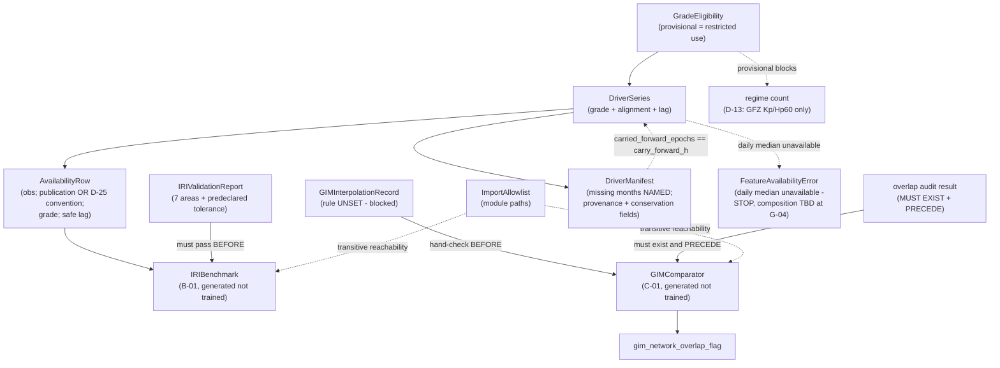

# Domain Entities — `external-products`

> ## ✳ G-09 IS SIGNED — 2026-08-28, **D-31** (read this before any G-09 statement below)
>
> The project decision owner **signed and approved G-09 (Agent preflight)** on 2026-08-28,
> recorded as **D-31** in `evidence/DECISIONS.md` with change record
> `governance/CHANGE_RECORD_2026-08-28_G09_signed.md`. **Every statement below of the form
> "G-09 is not signed" / "G-09 stays unsigned" is superseded as to the gate's status**, and
> is left standing as the accurate record of the constraint that applied when it was
> written.
>
> ⚠ **D-31 records the gate's own TE §18.3 preconditions as UNMET, and that disclosure
> travels with the signature.** `configs/`, and until 2026-08-28 `src/`, did not exist, so
> the mandated automated zero-TBD preflight **could not run**; the ten named critical tests
> **cannot be executed in this environment** (no Python interpreter is installed — a
> zero-byte Windows Store stub, no registry entry, no interpreter on disk); and the evidence
> artifact `aws_ai_dlc_preflight_report` **does not exist**. "No failing critical test" is
> therefore **unproven, not proven** — an absence of executions, not an absence of failures.
> This is the owner **opening the gate by authority**, not a record that its evidentiary
> conditions were satisfied, and no reader may infer the second from the first.
>
> **What the signature changes here:** module creation is authorised, and any defect this
> unit deferred *solely* because G-09 barred editing a file is now correctable.
> **What it does NOT change:** G-05 and G-06 remain `Blocked`; G-P1A, G-P2, G-P3A, G-P3C
> and G-07 are unaffected; **TE §18.2's absolute rule stands** — every scientific value this
> unit routed to G-04/G-05 **stays routed**, and no agent may fill a freeze-gate value by
> convenience; and **§18.3's stop-and-report obligation survives its own gate**, being a
> standing rule on implementation rather than a one-time gate condition.

**Unit** `external-products` (Bolt 5) · **Kind** `library` · **Depends on**
`inventory-and-registry`

> **Re-established a sixth time 2026-08-24**, on a **new stage attempt** (Construction opened
> 2026-08-24T11:46:26Z, resetting every unit's receipt floor). **No content of this unit
> changed.** Both `foundation` passes of that day touch nothing this unit reads, and the
> absence of an `src/external` block in `component-methods.md` was re-verified directly.
> Amendment A was declined, so **no count moved**. **The READY verdict in § Review belongs
> to the previous attempt.**

> **Re-established a fifth time 2026-08-23**, after a redo aimed at a sibling unit's stale
> cross-references. **No content of this unit changed.**

The data shapes this unit owns: the three driver series with their grades and alignment
semantics, the IRI benchmark with its validation report, the GIM comparator with its
interpolation and overlap-audit records, and the import-allowlist declaration that keeps
the first two apart from the model path.

**Nothing here is a scientific value.** These shapes *carry* governed values — D-10.2's
alignment intervals, D-10.3's lags, D-21/22/23's F10.7 selection choices, the 2000 km IRI
ceiling — and record their grade, provenance and availability.

> **Corrected and re-established 2026-08-23**, after two adversarial passes and a redo jump.
> The two Criticals — TA-36's ownership and the amendment count — are fixed here and in the
> sibling artifacts, with every superseded reading preserved in place. **No answer to any
> question changed.**
>
> **A third redo followed**, aimed at a misread of `component-methods.md` § Depth, which
> specifies **cross-package boundary calls only** and names **this stage** as where
> intra-package shapes are specified. **Corrected total: five owed amendments across three
> units**, boundary contracts only.
>
> **A fourth redo** then swept this unit's **question file**, which still asserted "six
> across three" in five live places. **No content of this artifact changed.**

## Sources

- `../../../inception/units-generation/unit-of-work.md` § 6 — the `Owns` list, the module-path allowlist, the 7 requirements, the implementation notes.
- `../../../inception/units-generation/unit-of-work-story-map.md` — Tables 1 and 2 plus § Per-unit coverage summary. **Derived by reading the rows:** 7 requirements, **4** with no acceptance row; **owns** WS-09; on **TA-36** this artifact contradicts itself and § Cross-unit responsibilities is the reconciling statement — see W-2a / § TA-36. **Supports** WS-10, WS-11, TA-08, TA-12.
- `../../../inception/requirements-analysis/requirements.md` — REQ-ENG-9; FR-P1-04-3, -4, -9, -15, -17, -18.
- `../../../inception/application-design/components.md` § `src/external`.
- `../../../inception/application-design/component-methods.md` — **which carries no `src/external` block**.
- `../../../inception/application-design/services.md` § The nine stage scripts.
- `../inventory-and-registry/functional-design/domain-entities.md` — `SourceInventoryEntry`, `Station`, `DriverSeriesInventory`'s upstream.
- `evidence/DECISIONS.md` — **D-5**, **D-10.1**, **D-10.2**, **D-10.3**, **D-11**, **D-13**, **D-21/22/23**, **D-25, D-26** *(added 2026-08-28, Recommendation 46 — D-25 was already cited operatively in § 4 and in the entity map's `AvailabilityRow` node while absent from this register; the same defect `acquisition` fixed on its own finding F2)*.
- Workspace inspection, 2026-08-23: `scripts/audit_ec1_drivers.py` line 184; `evidence/audit_ec1_2026-08-15/kyoto_dst/dst_provisional_202212.html`; the absence of `src/` and `configs/`. **Re-inspected 2026-08-28** (Recommendation 14): `evidence/audit_ec1_2026-08-15/` contains exactly `EC1-AUDIT.md`, `ec1-audit-report.json`, `kyoto_dst/` and `nrcan_f107/` — **no GFZ directory, so Kp/ap3 and Hp60/ap60 have never been retrieved**.
- `functional-design-questions.md` (**Q1 through Q9**), `business-logic-model.md`, `business-rules.md`.

---

## Entity map

Text fallback: grade eligibility gates each driver series, which produces availability rows
and a manifest naming any missing months. The manifest also carries each series' provenance
fields (release status, retrieval date, provider product identity with version suffix, SHA-256)
and the carried-forward-epoch count, which must equal the series' own `carry_forward_h` — the
conservation invariant. Where a daily F10.7 median is unavailable and the composition field is
still `TBD`, availability resolution raises `FeatureAvailabilityError` and stops rather than
guessing. The IRI benchmark cannot be generated until its validation report passes, and consumes
the same availability rows the ML features use. The GIM comparator cannot be generated until the
interpolation hand-check is recorded and a registered overlap-audit result exists with a
timestamp preceding generation — and its interpolation rule is currently unset and blocked. The
import allowlist constrains, by transitive reachability, which modules may reach the benchmark
and comparator modules. A provisional grade blocks the regime count, which D-13 requires from
GFZ Kp/Hp60.

---

## 1. `DriverSeries` — grade, alignment, lag

Four series, frozen by contract: **Kp/ap3** and **Hp60/ap60** from GFZ, **hourly Dst** from
Kyoto WDC, **observed (not 1-AU-adjusted) F10.7** from Canada's Solar Radio Monitoring
Program. **SSN is absent**, confirmed by `grep`.

| Attribute | Meaning |
|---|---|
| `series_id` | Which series |
| `grade` | Release status — real-time / provisional / final. **One recorded grade per series for calendar 2022; never mixed** (D-10.1) |
| `alignment` | How a **present** value maps onto the hourly grid (§ 2) |
| `safe_lag` | The availability lag applied before a forecast origin (D-10.3) |
| `values` | Time-indexed only — **one value per epoch, identical across all three cells** |
| `carry_forward_h` / excluded rows | A missing value carries forward **at most 3 hours** (bound read from `configs/features.yaml`); beyond it the row is **excluded**, recorded machine-readably — R-57a, FR-P1-04-3, TC-09 *(field added 2026-08-26, finding 10)*. **The recorded count is LOAD-BEARING, not decorative**: R-58 limb 3's conservation invariant asserts that the number of epochs carrying a non-observation value **equals** this count, so any value present at an epoch with **no observation and no recorded carry-forward FAILS** *(2026-08-28, Recommendation 38)* |
| `carry_forward_composition` | ⚠ **`TBD` — G-04 FREEZE ITEM.** How the ≤ 3 h bound composes on a **daily** series (F10.7 is the one driver whose native step, 24 h, is coarser than the bound). **D-21** makes the composition binding; **no reading is adopted here.** Carried as a **named field in `configs/features.yaml`**, asserted non-`TBD` by the §18.3 preflight before any component applying the bound is implemented. While it is `TBD`, availability resolution **raises `FeatureAvailabilityError` and stops** rather than guessing — R-57a's Constraint *(field added 2026-08-28, Recommendation 13)* |
| `release_status`, `retrieval_date`, provider product identity **with version suffix**, `sha256` | The **reanalysed-value check's driver-product half** (R-63's Constraint). Version drift is already observed in this dataset (`g.002` vs `g.003`), so an identity without its suffix is not comparable. ⚠ **Verifiability is per series**: F10.7 and Dst are **declared-status-only** — no detection from the bytes — and the two **unretrieved** GFZ series carry the near-real-time cross-assertion specification *(fields added 2026-08-28, Recommendation 14)* |

**Time-indexed only, and the consequence is stated** (FR-P1-04-4, TC-12): a join must never
imply a per-cell measurement, and **a station performance difference must never be
attributed to local forcing the dataset does not contain.**

**Lags, applied here and decided elsewhere** (D-10.3): Kp/ap3 **≥ 3 h**; Hp60/ap60 **≥ 1 h**;
F10.7 at the **previous-day observed** value with a **trailing** 81-day mean ending at the
safe-lagged day.

**F10.7's three frozen selection choices** — D-21 (daily **median**), D-22 (duplicate UT
records take the **mean**, with a QC flag and provider-defined correction semantics taking
precedence), D-23 (the four high-spread days flagged and retained with the median as
representative).

**No backfill from future final or definitive archived values** — NFR-LEAK-01 governs
*timing* only, and a series can satisfy its declared lag while being built from reanalysed
values, invisible to every existing check.

> **⚠ Bounded, not closed — added 2026-08-28 on Recommendation 14.** The four provenance fields
> above are this unit's half of the **reanalysed-value check** (defined at R-63's Constraint; the
> check itself is `acquisition`'s and is being amended in parallel). **For F10.7 and Dst the
> rule's own failure mode is undetectable from the held bytes** — `fluxtable.txt` has seven
> columns and **no correction, revision, version or provenance column** (D-22), its publication
> latency is **not derivable** (D-21), and Kyoto's grade is inferable from the **filename alone**
> with D-10.1's 2022-grade item still unchecked per D-11. The sanctioned evidence is the declared
> status **plus the documented absence plus an explicit unverified-status statement**, in the same
> shape **D-25** uses for publication latency. **Inferring a grade from silence is not evidence**,
> and no artifact may report this as closed. Substantive detection exists only for the two
> **unretrieved** GFZ series, where the near-real-time and definitive products are asserted
> against each other value by value — **specified now because it costs almost nothing before
> retrieval and everything after it.**

## 2. Alignment — how a present value maps onto the grid

| Series | Rule (D-10.2) |
|---|---|
| Kp / ap3 | Repeated **only within its own defined 3-hour interval** |
| Dst | Aligned to **its own hourly averaging interval** — *"not shifted to a neighbouring hour for convenience"* |
| F10.7 | Daily |
| **All** | **No driver is interpolated, at any stage** |

**Distinct from carry-forward, and the requirement says so.** FR-P1-04-3's ≤3 h
carry-forward (then exclude the row) governs a **missing** value; alignment governs a
**present** one. **The two are tested separately**, so neither passes on the other's
evidence.

**TA-36 is this contract's approved negative-path row** — status **`Pending`: the row exists,
and it is not implemented, not executed, not passing.** Its three limbs: Kp repeated outside
its interval fails; Dst shifted to a neighbouring hour fails; **an AST-level scan over a named
token set, plus a fill-conservation invariant, finds no interpolation** *(limb 3 restated
2026-08-28, Recommendation 38; superseded wording: "a grep-level check finds no interpolation
call")*.

> **Limb 3's mechanism, and why a grep was not enough — Recommendation 38.** `.interpolate()`,
> `.ffill()`/`.bfill()`/`.pad()`, `.fillna(…)`, `.reindex(…, method=…)`,
> `.resample().interpolate()`, `np.interp` and the `scipy.interpolate` family are **distinct
> spellings**, and a `getattr`-dispatched, aliased or **vectorised** fill names none of them. The
> scan is therefore **AST-level** (it resolves the call target through the module's import
> bindings and local aliases, and ignores a token inside a string or comment), and the limb that
> actually carries the rule is the **conservation invariant** on `carry_forward_h` in § 1 — a law
> over the **emitted series** rather than over the source text. That invariant is also what
> distinguishes the **sanctioned** ≤ 3 h carry-forward from a prohibited fill **by
> construction**: a filled epoch is permitted precisely because it is **recorded**, prohibited
> precisely because it is not. The full token set, the three controls (including the vectorised
> case) and the primary test's siting are at **R-58**'s Constraint; the primary test is
> `features-and-splits`' `tests/test_feature_leakage_guards.py`.

> **The PRIMARY test is not this unit's.** The story map's § Cross-unit responsibilities
> reconciliation sites TA-36's primary negative-path test at the feature-building enforcement
> boundary, in **`tests/test_feature_leakage_guards.py`**, owned by **`features-and-splits`**.
> This unit holds **data production** and **upstream evidence**, and its own contract test is
> *"documented separately and **not** replacing the primary rejection test."* See
> `business-logic-model.md` § W-2a.

## 3. `GradeEligibility` — new, and the entity that keeps Dst's three restrictions apart

The grade a series carries, and what that grade makes it **eligible for**.

| Grade | Fixture characterisation | Modelling input | Frozen tolerance | G-05 regime count |
|---|---|---|---|---|
| Final | ✅ | per restriction 1 | ✅ | ✅ |
| Provisional | ✅ **permitted** (D-11) | ❌ | ❌ | ❌ **(D-13)** |
| Mixed within a series | ❌ **fails at construction** (D-10.1) | ❌ | ❌ | ❌ |

**Why eligibility is a property of the data rather than a rule about it.** A rule that
depends on three units remembering is the shape D-15 warns about for the restricted root.
Making the consumer read the grade is the only form that survives a consumer nobody has
written yet — and it makes the **permitted** fixture-characterisation use explicitly
distinguishable from the three that are not.

**The live trap.** `evidence/audit_ec1_2026-08-15/kyoto_dst/dst_provisional_202212.html`
exists in the workspace today; **D-11** used provisional Dst to characterise the fixture
window, which is permitted; and **D-13** requires the December regime count to come from
**GFZ Kp/Hp60 at a recorded release grade**, explicitly barring any provisional-Dst-derived
figure.

**Dst is diagnostic/hindcast-only** and never a confirmatory ML feature (TC-11) — enforced
downstream by `features-and-splits`, stated here. `governance-guards` **R-26** separately
names Dst as the driver class excluded from the December-hit definition, a fourth
consequence of the same fact and not restated as a rule here.

## 4. `AvailabilityRow` — the same matrix the benchmark must appear in

Per driver, per epoch: **observation timestamp, publication timestamp OR — where the provider
supplies none — the approved conservative convention (for F10.7: D-25's 00:00 UTC on day D+1,
never same-day) plus the documented absence and an unverified-latency statement**
(`CR-2026-08-22-EV-12`; field corrected 2026-08-26, finding 2)**, release status,
safe lag.**

**FR-P1-04-15 requires the IRI benchmark's OWN drivers to appear as rows in this same
frozen matrix** — the one used for ML features. *A benchmark fed better-timed drivers than
the model gets is not a benchmark*, and this is the limb that makes the comparison's fairness
checkable rather than asserted.

> **The matrix is `features-and-splits`' artifact.** This unit states the obligation and
> **does not own the row**.

## 5. `IRIBenchmark` and `IRIValidationReport`

**`IRIBenchmark`** is **B-01**, represented in the model/config inventory and labelled
**generated, not trained** — never fitted.

**`IRIValidationReport` must pass before generation**, and FR-P1-04-15 enumerates its
content:

| # | Content area |
|---|---|
| 1 | The pinned package/build with its **exact version or commit** |
| 2 | All model switches and the topside option |
| 3 | **The altitude ceiling stated explicitly as 2000 km** |
| 4 | Units and output extraction |
| 5 | The coordinate, time, solar and geomagnetic driver inputs, **with confirmation that no driver is future-centered or unavailable at target time** |
| 6 | **Five to ten samples** spanning sites, day and night, quiet and disturbed, validated against the **official IRI interface** |
| 7 | The tolerance, **predeclared before the comparison runs** |

**Each area is asserted field by field**, so an incomplete report **fails rather than
passing on presence** — the same defect class as a short protected-set list passing a
membership check.

**Area 7 carries a timestamp preceding the comparison**, and generation refuses if the
ordering is violated. *"A passing report exists"* is satisfiable by a report whose tolerance
was chosen **after** the comparison ran, which is the failure the predeclared clause exists
to prevent and which no presence check can see.

**Also recorded:** the **26,000-call workload is timed** and its measured runtime recorded;
the `iri2016` Fortran build **re-establishes from pins on a cold session** (TC-04).

> **FR-P1-04-15 has NO acceptance row.** Designing this is not testing it.

## 6. `GIMComparator`, `GIMInterpolationRecord`, `gim_network_overlap_flag`

**`GIMComparator`** is **C-01**, in the model/config inventory and labelled **generated, not
trained**.

**`GIMInterpolationRecord`** carries the interpolation rule, the hand-checked sample **with
its worked arithmetic**, and the map-to-map statement.

> ## ⚠ THE INTERPOLATION RULE IS UNSET, AND GENERATION REFUSES WHILE IT IS
>
> **Bilinear in space, linear in time, with a longitude-rotation correction** is a §18.2
> **Student-owned forbidden choice** (**Q-15**). TE §18.2: *"No implementer or coding agent
> may fill such a value by convenience."*
>
> Specifying the mechanism while leaving the **value** implicitly fillable is exactly what
> that prohibits. **Comparator generation refuses while the rule is unset** — the zero-TBD
> preflight's shape.

**Ordering, enforced not asserted:** *"One sample interpolation must be hand-checked against
the code"*, and **EV-11 places that hand-calculation BEFORE comparator generation.** The
hand-check's timestamp is asserted to precede generation; **a comparator generated before
the hand-check fails rather than being accepted retrospectively.**

**The map-to-map statement is emitted by the reporting path itself**, because §6.10 requires
it *"wherever the comparison is reported"* — a rule about **every** report, including ones
nobody has written yet. Its text: the Phase 1 GIM comparison *"is explicitly a
map-product-to-map-product comparison … cannot validate receiver-level station VTEC or serve
as an independent target check."*

**`gim_network_overlap_flag`** — the audit **is present and its result disclosed**, **no
independence claim precedes the audit**, and the **flag value appears wherever GIM is
compared** (FR-P1-04-9, TC-08).

> **The obligation is UNCONDITIONAL, and the trigger is the COMPARISON'S EXISTENCE — confirmed
> and strengthened 2026-08-28 on Recommendation 41.** Vision **§6.10**: *"**No independence claim
> may be made before that audit.**"* FR-P1-04-9's criterion is that the overlap audit **exists**.
> This entity's framing was found **correct** and is not reversed; what is added is the ordering
> the phrasing left implicit:
>
> - **Emitting, serializing or reporting ANY GIM comparison with no registered overlap-audit
>   result and its flag value FAILS.** *"Disclose the flag once the audit has run"* is satisfied
>   **vacuously** while no audit exists, which is the gap — a comparison emitted before the audit
>   trips no control at all.
> - **The audit's recorded timestamp must PRECEDE comparator generation**, the same enforceable
>   shape the interpolation hand-check already uses above; a retrospective audit is **not**
>   accepted.
> - **⚠ The generation refusal is a mitigation that EXPIRES.** No comparator can be produced
>   today because the **Q-15** interpolation rule is unset — but that refusal **ends the moment
>   Q-15 is decided**, which is exactly when the ordering risk becomes live. **The residual
>   outlives the mitigation**, so the ordering is enforced rather than assumed.
> - The conditional phrasing in the sibling units was **inherited from `project.md` § Mandated**,
>   not invented there. A wording correction to that memory file is **owed at the §13 learnings
>   ritual** and is **reported, not applied** — no stage edits a memory file directly.

**The comparator is never tuned and then claimed independent** — carried as a
reporting-discipline rule with **no code check**, and named uncheckable rather than given a
check that would not test it. No injected value proves a negation of that kind.

> **FR-P1-04-18 has NO acceptance row**, and its interpolation limb is blocked on Q-15.

## 7. `ImportAllowlist` — module paths, checked transitively

The permitted importers of `iri` and `gim`: **`scripts/04_build_external_products.py`** and
**modules under `src/evaluation/`**. An import from `src/data`, `src/features`, `src/models`,
`src/gnss`, a training script or a notebook violates it **identically**.

**`src/evaluation/` is owned by three units** — `evaluation-and-comparison` (`masks.py`,
`metrics.py`), `statistical-inference` (`bootstrap.py`), `regimes-diagnostics-reporting`
(`regimes.py`, `diagnostics.py`, `plots.py`). The allowlist grants an authorized **path**,
never a whole unit's unrelated code.

**Checked by transitive reachability, not direct imports.** `project.md` § Forbidden states
the constraint as *"directly or transitively"*; a direct-import check does not implement the
rule its own citation states, because a helper importing a shim that imports `gim` satisfies
it and violates the rule.

**The static check is AUTHORITATIVE for this rule**, unlike `governance-guards` R-24's
subordinate scan — a module graph is a property of the **source tree**, where a loaded module
is a property of a **running process**. The asymmetry is stated so it does not read as an
oversight.

**`spaceweather.py` is deliberately outside the restriction:** drivers **are** model inputs,
subject to the availability lags.

## 8. `DriverManifest` — completeness recorded, integrity terminal

| Field | Tier | Behaviour |
|---|---|---|
| `missing_months` | **Completeness shortfall** | **Names which months**, machine-readable, **non-fatal** |
| hash mismatch | **Integrity violation** | **Terminates** the run, naming the file and the violated expectation |
| `release_status`, `retrieval_date`, **provider product identity including version suffix**, `sha256` — **per series** | **Integrity violation** on inconsistency or omission | The **reanalysed-value check's driver-product half** (R-63). A declared status **inconsistent with the recorded product identity** (e.g. `final` against a `dst_provisional_*` filename) **terminates**; an omitted field **terminates**. *(Fields added 2026-08-28, Recommendation 14)* |
| `provenance_verifiability` — **per series** | **Completeness shortfall** | Records, machine-readably, that F10.7 and Dst are **declared-status-only** and why (D-22's seven columns with no provenance column; D-21's non-derivable latency; Kyoto's filename-only grade). A status recorded for a file with **no provenance column** and **no documented-absence/unverified-status statement** is an **integrity violation** and terminates — the absence must be **stated**, never implied by silence. *(Field added 2026-08-28, Recommendation 14)* |
| `carried_forward_epochs` — **per series** | **Integrity violation** on mismatch | R-58 limb 3's **conservation invariant**: equals `DriverSeries.carry_forward_h`'s recorded count. A value present at an epoch with no observation and no recorded carry-forward **terminates**. *(Field added 2026-08-28, Recommendation 38)* |

**The workspace fact this closes:** `scripts/audit_ec1_drivers.py` **line 184 returns `0`
regardless of missing months** (REQ-ENG-9).

**Why not simply return non-zero on missing months.** That collapses the two-tier posture: a
month absent from the provider is a fact to record; a hash that does not match invalidates
everything downstream. Making an ordinary partial retrieval abort the run is how a guard
gets worked around.

**Why the field names the months rather than counting them.** A count says something is
wrong; the list says what to do — and `inventory-and-registry` R-51 already forbids *"an
unattributed number"* in the G-P1A decision this feeds.

> **REQ-ENG-9 has NO acceptance row.** Both injections must be tested, because they assert
> **opposite** outcomes.

## 9. `IntegrityError` subclasses raised here

Deriving from `foundation`'s base — **`IntegrityError`, imported from `src/data/config.py`**,
under R-01's *"any future integrity-related exception"* clause for the unit-local names — each
naming the affected resource and the violated expectation. *(Base named explicitly 2026-08-26,
matching every prior unit; the **declaration site** for the unit-local exceptions is the same
OPEN item recorded at `foundation`: a cross-unit agreement into `config.py`, or the
`src/data/exceptions.py` §12 amendment.)*

| Exception | Raised when |
|---|---|
| `DriverError` *(scope corrected 2026-08-26, finding 3: the two alignment conditions previously claimed here are raised as **`AlignmentError`** — one of the fourteen in the shared base — by the approved `build_features` contract at `component-methods.md`, not by this unit; and "an interpolation call is found" is a **static grep check** per this unit's own R-58/W-5 limb 3, not a runtime raise)* | A series mixes release grades; a grade renders the series ineligible for the requested use; a hash mismatch is detected. *(Three conditions removed from THIS cell 2026-08-26, finding 9 — the 2026-08-26 note beside it had retracted them while the cell 3.5 implements from still listed them: Kp repeated outside its interval and Dst shifted to a neighbouring hour raise the approved **`AlignmentError`** at `build_features`, not here; "an interpolation call is found" is a **static grep check**, not a runtime raise.)* |
| `BenchmarkError` | Generation is attempted without a passing validation report; the report is missing any of its seven content areas; the tolerance timestamp does not precede the comparison |
| `ComparatorError` | Generation is attempted while the interpolation rule is **unset**; the hand-check timestamp does not precede generation; the overlap audit is absent where an independence claim is made |
| `ImportBoundaryError` | A module outside the allowlist can reach `iri` or `gim`, directly or transitively |
| **`FeatureAvailabilityError`** *(added 2026-08-28, Recommendation 13)* | **The next daily F10.7 median is not available at a forecast origin while `configs/features.yaml`'s `carry_forward_composition` field is `TBD`.** The raise names the **origin timestamp**, the **last available median's day**, and the elapsed staleness in **BOTH units** (clock hours and whole daily steps), then **stops**. It does **not** silently carry forward and does **not** silently exclude — TE §18.3: *"must stop and report rather than choose a default."* Also raised on a violation of the composition once the Student's G-04 freeze fills the field |

**Why `FeatureAvailabilityError` is a raise rather than a chosen default.** D-21 makes F10.7's
carry-forward *"compose with, and not override, the ≤ 3 h carry-forward bound"* — and **F10.7 is
the one driver whose native step (24 h) is coarser than the bound**. The two available readings
differ by **20 of 24 scored rows per affected day, in all three cells at once**, so picking one
would be an agent filling a **§18.2** item by convenience. **The freeze is the Student's, at
G-04**; the raise is what runs until then. Both readings are stated at **R-57a**'s Constraint.

**Declaration site — the same OPEN item as this unit's other unit-local exceptions.**
`FeatureAvailabilityError` derives from `foundation` R-01's `IntegrityError` base under that
rule's *"any future integrity-related exception"* clause, and is **not** claimed as one of R-01's
named fifteen (amended 2026-08-28, where the named set is explicitly *"a **named subset** rather
than a completeness claim"*). Where it is declared — a cross-unit agreement into
`src/data/config.py`, or the `src/data/exceptions.py` §12 amendment — is the same unresolved item
already recorded above.

Catching `foundation`'s base is what lets the stage entry contract write the `aborted`
registry row for any of them.

---

## Requirement coverage

Acceptance derived from story-map Table 1; owners from Table 2's `primary` cell. **Where
`unit-of-work.md` § 6 disagrees, the story map governs** — see `business-logic-model.md`
§ W-2.

| Requirement | Entities | Tested by (Table 1) | Row primary owner |
|---|---|---|---|
| **REQ-ENG-9** | `DriverManifest` | ⚠ **NO ROW** | — |
| FR-P1-04-3 | `DriverSeries` (carry-forward, tested separately) | WS-11 | `features-and-splits` |
| **FR-P1-04-4** | `DriverSeries` | ⚠ **NO ROW** | — |
| FR-P1-04-9 | `GIMComparator`, `gim_network_overlap_flag`, `IRIBenchmark` | WS-09, TA-12 | **`external-products`** (WS-09); `models-and-baselines` (TA-12) |
| **FR-P1-04-15** | `IRIValidationReport`, `AvailabilityRow` | ⚠ **NO ROW** | — |
| FR-P1-04-17 | § 2 Alignment | **TA-36** — ⚠ **`Pending`**: row exists, **not implemented, not executed, not passing** | **`features-and-splits`** (primary test); **`external-products`** (data production, upstream evidence) — W-2a |
| **FR-P1-04-18** | `GIMInterpolationRecord` | ⚠ **NO ROW**, and its interpolation limb is **blocked on Q-15** | — |

**7 requirements, 4 without an acceptance row.** **Owns WS-09.** On **TA-36** this unit holds
**data production** and **upstream evidence**; `features-and-splits` holds **enforcement** and
the **primary acceptance test** (`tests/test_feature_leakage_guards.py`) — see
`business-logic-model.md` § W-2a. **Supports** WS-10, WS-11, TA-08, TA-12.

> ## THE TWO UPSTREAM ARTIFACTS DISAGREED — RESOLVED; § 6 WAS SWEPT 2026-08-24
>
> *(Heading and standing corrected 2026-08-26 on adversarial finding 8, Critical: this box still
> asserted the disagreement as live. `unit-of-work.md` § 6 now reads **4** untested and
> `Acceptance rows (2). WS-09, TA-36 (Pending …)`, present since commit `45796f5`. The text below
> is the dated record of the conflict as it stood; **nothing is currently reported to the gate
> from this box**.)*
>
> `unit-of-work.md` § 6 says **5 untested** (its bold list includes FR-P1-04-17) and
> **`Acceptance rows (1). WS-09`**. The story map says **4 untested** and **WS-09 and
> TA-36**.
>
> **The story map governs**: TA-36 was approved **2026-08-22** under Vision §15.2
> (`CR-2026-08-22-LEAKAGE-TA`), and the story map records the sweep — *"untested 40 → 36."*
> § 6 was not swept with it.
>
> **Both stale statements are reported at the gate, not edited**, per
> `CHANGE_RECORD_PROCEDURE.md`. The `Acceptance rows (1)` line **carries no numeral tied to
> the change**, which is exactly the stale-claim shape `project.md` § Way of Working records
> a numeral-keyed sweep as being blind to.
>
> **TA-36 is `Pending` and is never cited as a result.** A row that exists but has never run
> is the shape of the defect that let FR-P1-02-8 look covered behind a withdrawn `TA-29` for
> five revisions, past four governance boards.

## Assumptions & Open Questions

- **[assumption]** Rule IDs continue the single sequence, so `business-rules.md` opens at **R-54**. If per-unit numbering was intended, say so at the gate.
- **[assumption]** The **story map governs** where it and `unit-of-work.md` § 6 disagree. Neither is edited by this stage.
- **[assumption]** The availability matrix in § 4 is **`features-and-splits`' artifact**; the obligation is stated, the row not owned.
- **[assumption]** `audit_ec1_drivers.py` migrates here; target shape designed, migration commit not made.
- **[assumption]** `frontend-components.md` is not produced — `kind: library`.
- **Open — `src/external` has no contract block** for any of its three modules; § 1–§ 8's shapes are **one amendment owed**, not approved.
- **Open — FIVE owed amendments across three units** (`acquisition` 3, `inventory-and-registry` 1, this unit 1), **boundary contracts only**. `business-logic-model.md` § W-1 **proposes** one consolidated change record. **Corrected twice on 2026-08-23**: from "four across four" with `open_d9_input` misattributed; then from "six across three", after `component-methods.md` § Depth was found to specify **cross-package boundary calls only** and to name **this stage** as where intra-package shapes are specified.
- **Open — FR-P1-04-18's interpolation rule is UNSET** (§ 6), a §18.2 Student-owned forbidden choice. Comparator generation refuses while it stands. *(Added 2026-08-28, Recommendation 41: that refusal is a **mitigation that EXPIRES the moment Q-15 is decided** and does not close the overlap-audit ordering, which § 6 now keys to a GIM comparison artifact **existing**.)*
- **Open — `DriverSeries.carry_forward_composition` is `TBD`, a G-04 FREEZE ITEM** (§ 1, R-57a's Constraint; added 2026-08-28, Recommendation 13). D-21 binds F10.7's carry-forward to compose with the ≤ 3 h bound, and no rule stated what a 3-hour bound means on a 24-hour step. Reading **A** (one daily step = one carry-forward step) is **tabled as the proposal**; reading **B** (literal clock hours, excluding beyond hour 03 with the excluded count as a split-manifest field) is the alternative, costing **20 of 24 scored rows per affected day in all three cells**. **Neither is adopted here.** Until the Student freezes it, `FeatureAvailabilityError` stops the run. Owner: **Student**, §18.2 Q-16/Q-17, at **G-04**.
- **Open — the reanalysed-value check is BOUNDED, NOT CLOSED for F10.7 and Dst** (§ 1, § 8; R-63's Constraint; added 2026-08-28, Recommendation 14). Both are **declared-status-only** — no detection from the held bytes. Substantive detection is specified only for the two **unretrieved** GFZ series. **No artifact may report this as closed.** Owner: **Student**, with the provider-documentation limb (**EV-12 / EC1-R-4**) owned outside this project, at **G-04**.
- **Open — `FeatureAvailabilityError`'s DECLARATION SITE** (§ 9), on the same unresolved item as this unit's other unit-local exceptions: a cross-unit agreement into `src/data/config.py`, or the `src/data/exceptions.py` §12 amendment. It derives from `foundation` R-01's base under the *"any future integrity-related exception"* clause and is **not** claimed as one of R-01's named fifteen.
- **Open — four requirements with no acceptance row**: REQ-ENG-9, FR-P1-04-4, FR-P1-04-15, FR-P1-04-18.
- **Open — TA-36 is `Pending`**: approved, never run.
- **Closed 2026-08-26 (finding 8): the § 6 conflict no longer exists — the file was swept 2026-08-24; kept as the dated record.** *(Superseded bullet:)*  — `unit-of-work.md` § 6 carries stale text**, reported not edited.
- **Open — FR-P1-04-18 obligation 4 has no code check**, and is named uncheckable rather than given one that would not test it.
- **G-09 is not signed.** ⚠ **G-09 IS SIGNED as of 2026-08-28 (D-31)** — this prohibition's stated ground no longer holds, and module creation is authorised. **The other grounds stated alongside it, if any, are untouched**, and D-31's disclosure travels with the signature: the §18.3 preflight never ran, the critical tests are unexecuted in this environment, and `aws_ai_dlc_preflight_report` does not exist. **No scientific value becomes fillable** — TE §18.2 and §18.3's stop-and-report rule are unchanged. No entity here authorises creating `src/external/spaceweather.py`, `src/external/iri.py`, `src/external/gim.py` or `scripts/04_build_external_products.py`.
- **None** of the above adopts a reading on a supervisor-owned value, and none decides a scientific constant.

---

> **Re-saved 2026-08-24 under the post-redo receipt floor.** The project decision owner
> authorised a redo jump on `functional-design` at 2026-08-24T14:57:07Z so that three
> standing reviewer findings on `models-and-baselines` could be fixed and re-reviewed;
> a redo resets the receipt floor for **every** unit of the stage. **No content of this unit
> changed** — not a question, answer, amendment, rule, entity, workflow, count or scientific
> value. The only artifacts edited after the redo were `models-and-baselines`'s, whose
> three fixes are confined to its own files. That unit returned **READY** on the second pass of
> the restored budget, which is what the redo was authorised for. The two residuals riding that
> verdict — R-96's `PartitionError` mechanism and R-95's field label — are carried to the stage
> gate rather than applied, per the rule that a suggestion riding a READY verdict is gate input.

---

> **Re-saved 2026-08-26 under the thirteenth-redo receipt, after the terminal-pass remediation.**
> In this file: the upstream-disagreement box re-headed **RESOLVED** (the § 6 conflict no longer
> exists); the `DriverError` **Raised-when cell purged** of the three retracted conditions —
> Kp/Dst misalignment raise the approved **`AlignmentError`**, interpolation is a static grep;
> `DriverSeries` gained the **carry-forward/exclusion field** (R-57a); the availability-row
> field and mermaid node carry the D-25 branch. Figures unchanged (7/4/2).
> **G-09 remains unsigned. ⚠ **G-09 IS SIGNED as of 2026-08-28 (D-31)** — this prohibition's stated ground no longer holds, and module creation is authorised. **The other grounds stated alongside it, if any, are untouched**, and D-31's disclosure travels with the signature: the §18.3 preflight never ran, the critical tests are unexecuted in this environment, and `aws_ai_dlc_preflight_report` does not exist. **No scientific value becomes fillable** — TE §18.2 and §18.3's stop-and-report rule are unchanged.**

---

> **Re-saved unchanged 2026-08-26 under the fourteenth-redo receipt** (the redo finished the
> gate-record sweep in the sibling files; no entity here changed). **G-09 remains unsigned. ⚠ **G-09 IS SIGNED as of 2026-08-28 (D-31)** — this prohibition's stated ground no longer holds, and module creation is authorised. **The other grounds stated alongside it, if any, are untouched**, and D-31's disclosure travels with the signature: the §18.3 preflight never ran, the critical tests are unexecuted in this environment, and `aws_ai_dlc_preflight_report` does not exist. **No scientific value becomes fillable** — TE §18.2 and §18.3's stop-and-report rule are unchanged.**

---

> **Re-saved unchanged 2026-08-26 under the fourteenth-redo re-confirmation receipt** (finding 17's
> mojibake repair touched the question file only; no entity here changed). **G-09 remains unsigned. ⚠ **G-09 IS SIGNED as of 2026-08-28 (D-31)** — this prohibition's stated ground no longer holds, and module creation is authorised. **The other grounds stated alongside it, if any, are untouched**, and D-31's disclosure travels with the signature: the §18.3 preflight never ran, the critical tests are unexecuted in this environment, and `aws_ai_dlc_preflight_report` does not exist. **No scientific value becomes fillable** — TE §18.2 and §18.3's stop-and-report rule are unchanged.**

---

> **Re-saved 2026-08-28 under the post-redo receipt, on the project decision owner's ruling
> against `governance/reviews/GOV-2026-08-28-FD-01.md` (verdict FAIL).** Owner ruling for the
> science items: **mechanism written, value routed to the gate.** **No scientific value is
> decided here.**
>
> **In this file, each change dated at its own site with its Recommendation number:**
>
> | Rec | Change | Where |
> |---|---|---|
> | **13** | § 1 gains **`carry_forward_composition`** as a `TBD` **G-04 freeze field** on `configs/features.yaml`; § 9 gains **`FeatureAvailabilityError`** with its stop-and-report contract, its two-unit staleness message, and its declaration-site open item; the entity map gains the `FeatureAvailabilityError` node and its edge | § 1, § 9, entity map |
> | **14** | § 1 gains the four **provenance fields** (release status, retrieval date, **provider product identity with version suffix**, SHA-256) and a **bounded-not-closed** box stating the **per-series verifiability limits**; § 8 gains those fields plus **`provenance_verifiability`** as manifest fields with their tiers | § 1, § 8 |
> | **38** | § 1's `carry_forward_h` row is made **load-bearing** by the **conservation invariant**; § 2's limb 3 restated as an **AST-level scan over a named token set plus the invariant**, with the sanctioned carry-forward distinguished **by construction**; § 8 gains **`carried_forward_epochs`** | § 1, § 2, § 8 |
> | **41** | § 6's `gim_network_overlap_flag` framing **confirmed and strengthened**: the trigger is a **GIM comparison artifact existing**, the audit timestamp must **precede** generation, and obligation 1's refusal is labelled an **expiring mitigation**. The conditional phrasing was **inherited from `project.md` § Mandated**; the wording correction there is **reported for the §13 learnings ritual, not applied** | § 6, entity map |
> | **46** | **D-25 and D-26 added to § Sources**, dated, in the form `acquisition` used on its own finding F2 | § Sources |
>
> **Counts re-derived programmatically 2026-08-28:** **9** numbered entity sections —
> **unchanged, none added or renumbered**; **7** requirements, **4** with no acceptance row,
> **2** acceptance rows (**WS-09** owned, **TA-36** `Pending`) — all unchanged. New shapes are
> **fields plus one exception row inside existing sections**, deliberately, so no section figure
> moves. **§ 9's exception table goes 4 → 5 rows** (`DriverError`, `BenchmarkError`,
> `ComparatorError`, `ImportBoundaryError`, **`FeatureAvailabilityError`**) — the one figure in
> this file that does move, stated rather than left to be discovered.
>
> **⚠ Reported, NOT edited — outside the five items ruled on.** § 9's `DriverError` cell calls
> `AlignmentError` *"one of the **fourteen** in the shared base"*. `foundation` **R-01 was amended
> 2026-08-28** to name **fifteen** (`PartitionError` promoted), so that numeral is now stale. It is
> **not** corrected here: the enumeration is `foundation`'s, its size is live under a separate
> recommendation in the same report, and a cross-unit count must be derived at its source rather
> than adjusted from a neighbouring file. **An owner ruling is needed.** The new bullet above and
> § 9's own new text both read **fifteen**, which is the post-amendment figure.
>
> **Mermaid re-validated** after the entity-map edit; text fallback updated to match.
>
> **IRI and CODE GIM remain evaluation-time-only comparators; Dst remains diagnostic-only; D-11
> continues to bar provisional Dst from any G-05 regime count. G-09 remains unsigned** — no entity
> here authorises creating `src/external/spaceweather.py`, `src/external/iri.py`,
> `src/external/gim.py` or `scripts/04_build_external_products.py`.
