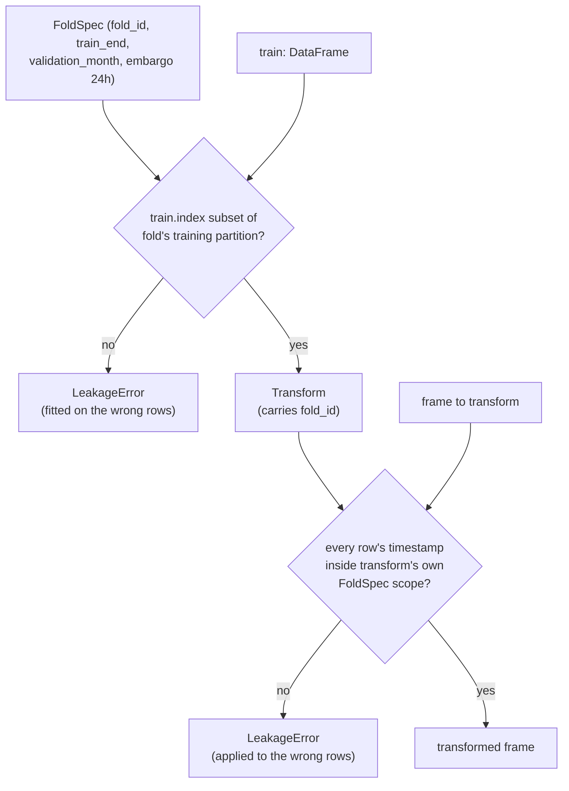

# Business Logic Model — `features-and-splits`

**Unit** `features-and-splits` (Bolt 7) · **Kind** `library` · **Depends on**
`target-standardization`, `external-products`, `governance-guards`

The workflows this unit implements: the availability matrix that asserts actual lag ≥
declared safe lag, feature construction over a **closed** dictionary, **per-fold train-only
transforms**, one shared window definition emitting both representations, the F1–F4 exact
calendar folds with their 24-hour embargo, and the December locked partition's **execution
guard**.

**BLK-04 is an exit condition on this stage.** W-3 authors its contract. **This unit and
four downstream units may not complete or exit stage 3.1 without it**, and **no
implementation may proceed while it stands.** NFR-LEAK-01's evidence remains owed to the
**Supervisor at G-04 and G-05**.

**It decides no scientific value.** The lags are D-10.3's, the window length a frozen
constant, the folds exact calendar boundaries — all fixed elsewhere and applied here.

## Sources

- `../../../inception/units-generation/unit-of-work.md` § 7 — the `Owns` list, the boundary, the 11 requirements, the implementation notes; **BLK-04** with its exit-condition ruling.
- `../../../inception/units-generation/unit-of-work-story-map.md` — Tables 1 and 2, § Per-unit coverage summary, § Cross-unit responsibilities, § Open verification gaps. **Derived by reading the rows:** 11 requirements, **1** with no acceptance row (FR-P1-04-10); **12** rows as primary; **supports** TA-36.
- `../../../inception/requirements-analysis/requirements.md` — FR-P1-04-1, -2, -5, -6, -8, -10, -12, -13, -16; NFR-IRI-01; NFR-LEAK-01; and the 40 → 36 recomputation record.
- `../../../inception/application-design/component-methods.md` — `src/features`' boundary calls and `src/data/splits.py`'s.
- `../../../inception/application-design/services.md` § The nine stage scripts, § Stage entry contract.
- `../target-standardization/functional-design/business-rules.md` — the D-17 target rows consumed here.
- `../external-products/functional-design/business-rules.md` — **R-56** (the transitive import scan), **R-57** (F10.7 future-independence), **R-58** (driver alignment).
- `../governance-guards/functional-design/business-rules.md` — **R-23**, **R-25**, **R-28**.
- `evidence/DECISIONS.md` — **D-10.3**, **D-11**, **D-13**.
- Workspace inspection, 2026-08-23: `tests/` holds three modules, none this unit's; `src/` and `configs/` absent.
- `functional-design-questions.md` (**Q1 through Q9**), `domain-entities.md`, `business-rules.md`.

---

## W-1 — The availability matrix, and the limb the first two checks miss

```
INPUT   snapshot: ConfigSnapshot, drivers: Mapping[str, DataFrame]
OUTPUT  Sequence[AvailabilityRow]
RAISES  LeakageError
```

Each row carries `feature`, `observation_timestamp`, `publication_timestamp`,
`release_status`, `safe_lag_hours`, `actual_lag_hours`.

**`assert_lags_safe` raises** when any row has `actual_lag_hours < safe_lag_hours`; when a
driver's `release_status` indicates a **backfilled final value** where the contemporaneous
grade was required; or when `f107_81_trailing`'s window **does not end at the safe-lagged
day**.

**The lags, applied here and decided in D-10.3:** Kp/ap3 **≥ 3 h**; Hp60/ap60 **≥ 1 h**;
F10.7 at the **previous-day observed** value with a **trailing** 81-day mean. **Dst is
diagnostic/hindcast-only. SSN is absent**, and a `grep` confirms it.

### W-1a — Why the anchor is a third limb, not a restatement

FR-P1-04-2 spells out the hole its own first two checks leave:

> *"a trailing 81-day mean **ending at day t** passes both the not-centered check and the lag
> assertion while including same-day F10.7."*

So three limbs, not two — and the third is the one that catches it:

| Limb | Catches | Misses |
|---|---|---|
| `actual_lag ≥ safe_lag` per row | A feature published later than its declared lag | A mean whose window reaches into the lag |
| Not-centered | A centered window | A trailing window anchored one day too late |
| **Window end date = the safe-lagged day** | **Exactly the case above** | A recorded anchor that the values were not actually computed from |

**Mechanism (Q4 = D), two parts:** the anchor is asserted, **and the mean is recomputed from
that anchor and compared.** A recorded end date is a **claim**; the recomputation is the
**check**.

> **Deliberate overlap with `external-products` R-57, stated rather than left to look like
> duplication.** R-57 asserts a strictly stronger property — perturb any day after the
> safe-lagged day, the mean must not move — which holds at every index rather than at the
> anchor. **The split is by property, and both checks are needed.** R-57's future-independence
> is a **series-level** property of the driver product — perturb a future day, the series must
> not move. The anchor recomputation is a **value-level** property of the mean built here,
> checkable only where it is built, and it catches a case R-57's framing does not spell out:
> a **recorded-but-wrong anchor** whose values were never computed from it. Two different
> checks over one fact, not a hedge.
>
> **Corrected twice, 2026-08-23.** The first issue said *"R-57's rows are `Pending`"*, which
> overstated the dependency: R-57 is a **rule**, and the rows it contributes to are **these
> same two** — `external-products` is the **supporting** unit on WS-11/TA-08, not the owner of
> a separate row. The second said delegation would make acceptance *"depend on a module in
> another unit"*, which **proves too much**: W-7 below **does** delegate the module-graph limb
> of NFR-IRI-01 to `external-products` R-56 while WS-10 and TA-07 stay this unit's rows.
> Applied consistently that reason would forbid the W-7 split this same artifact endorses. The
> by-property reason above survives both cases. **The design decision is unchanged throughout;
> only its justification is.**

## W-2 — Feature construction over a closed dictionary

```
INPUT   target, drivers, registry, matrix, fold, snapshot
OUTPUT  (flattened matrix, sequence tensor) — from ONE window definition
RAISES  LeakageError
```

**`build_features` raises** on: any field **outside the §6.2 dictionary**; a **carried-forward
`vtec_lag_*`** value; an **incomplete `vtec_seq_24`** window not excluded; a **support field
used as an input without a recorded G-04 approval**; a **target-hour quality field**; a **raw
longitude** column; a **driver carried forward beyond 3 h**.

**The input space is closed** (FR-P1-04-12): the feature set is **exactly** the TE §6.2
dictionary — *"no field outside that table, and no derived tensor built from one"*. Window
length is **one frozen value per feature-set ID**, shared across all model families, and the
primary history window is **24 hours — a frozen constant, not a tuned hyperparameter**
(Vision §8.1). `experiment.yaml`'s window length **equals 24 and appears in no grid**.

**Raw longitude never enters as a predictor**; longitude enters **only** through `lst_sin`
and `lst_cos` (FR-P1-04-10).

**An unresolved station registry blocks `station_lat` and excludes `lst_sin`/`lst_cos`** —
`inventory-and-registry` R-45/R-46. This unit **consumes** that block and does not decide
what provenance is sufficient.

## W-3 — BLK-04: the train-only fitting contract

```
INPUT   train: DataFrame, fold: FoldSpec
OUTPUT  Transform  (carrying its fold_id)
RAISES  LeakageError
```

**The register names the required elements**, quoted: *"input and output types, alignment
requirements, ownership of the fitted state, allowed partitions (the named fold's training
partition only) and failure conditions (`LeakageError` when `train`'s index is not a subset
of that partition), so validation and locked-test leakage are prevented by the contract
rather than by review."*

> ## ⚠ THE APPROVED INTERFACE DOES NOT PREVENT WHAT IT CLAIMS TO
>
> `component-methods.md` states that a single `fit_transform(all_data)` is *"unrepresentable
> in this interface, which is how NFR-LEAK-01 is enforced by shape rather than by review."*
>
> **It is not unrepresentable.** `fit_transforms(train, *, fold)` types `train` as an
> **unconstrained DataFrame**, so `fit_transforms(all_data, fold=F1)` **type-checks**. The
> register's own implementation note says the same: the split *"prevents the single-call
> convenience shape but not the underlying full-dataset fit."*
>
> **This is the leak with no downstream symptom.** A transform fitted on all data produces
> *better* validation numbers and raises nothing anywhere. **Four downstream units inherit
> it** — `models-and-baselines`, `evaluation-and-comparison`, `statistical-inference`,
> `regimes-diagnostics-reporting` — because *"every reported number inherits the fit."*

**The contract (Q1 = D), four elements:**



Text fallback: fitting checks that the training frame's index is a subset of the named fold's
training partition and raises otherwise; the fitted transform carries its fold identifier;
applying tests every row's timestamp against the transform's own carried scope — that fold's
training range, embargo and validation month, or Jan–Nov plus December for the refit — and
raises when any row falls outside it, or when the frame is empty.

1. **Allowed partitions** — the named fold's **training partition only**.
2. **Failure condition, fitting** — `LeakageError` when `train`'s index is **not a subset**
   of that partition. This is the register's own fix, and it closes what the type signature
   cannot.
3. **Ownership of the fitted state** — the `Transform` **carries its `FoldSpec`** (for the
   refit, its resolved boundaries), not merely a `fold_id` **string**, from which no calendar
   boundary is recoverable.
4. **Applying failure** — `apply_transforms` raises `LeakageError` when **any row's timestamp
   falls outside the transform's own scope**, and on an **empty or timestamp-less frame**.
   **This is the second half of the same leak**: element 2 stops a transform being *fitted* on
   the wrong rows; nothing in it stops one correctly fitted on F1 being *applied* to F3's
   validation month.

> ## ⚠ ELEMENT 4 — MECHANISM CORRECTED TWICE, 2026-08-23
>
> **First text, superseded:** *"`apply_transforms` **refuses** a transform whose fold does not
> match the frame's partition."* — a **claim, not a check**. The signature carries no fold or
> partition parameter and `frame` carries no partition tag.
>
> **Second text, also superseded:** *"derives each row's partition from its record timestamps
> … a row belonging to any other fold, to the final refit, or to December raises
> `LeakageError`."* — **it derives a label that does not exist, and it blocks two lawful
> paths.** Both were found by adversarial passes, **inside the remedy for the leak with no
> downstream symptom**.
>
> **Why per-row derivation is impossible.** The training ranges **nest**: Jan–Mar ⊂ Jan–Jun ⊂
> Jan–Sep ⊂ Jan–Oct ⊂ Jan–Nov. A **15 February** row lies in **five** of the list's six
> entries, so *"this row's partition"* is **not single-valued**. **The check never needed a
> label** — it needed containment in a **named** scope.
>
> **The mechanism.** `component-methods.md` leaves `Transform` *"referenced as a type and left
> unspecified: … intra-package"* — this stage's to specify, so carrying the `FoldSpec` on it
> costs **no amendment**. `apply_transforms` then tests every row's timestamp against the
> transform's **own** scope:
>
> | Transform fitted on | Rows `apply_transforms` accepts |
> |---|---|
> | Fold *k*'s training partition | Fold *k*'s training range, its **24-h embargo**, and its **validation month** |
> | The final refit (1 Jan – 30 Nov) | 1 Jan – 30 Nov **and December** |
>
> Any row outside raises `LeakageError`; so does an **empty** frame, because a check that
> never fired and a check that passed must not be indistinguishable — the same argument this
> unit makes for **counting** excluded rows rather than merely excluding them.
>
> **December is not excluded here, it is routed.** Applying the **final-refit** transform to
> December **is** the G-06 path. The lock is held by **W-6's execution guard** — December rows
> reach `apply_transforms` only inside a frame materialised by `materialise_locked_partition`
> against a **verified `g05_signature`** — not by this check. The second text duplicated the
> lock in the wrong place and would have made **G-06 unreachable** and the **final refit**
> (FR-P1-04-14) untransformable.
>
> **The fit side of the refit is the same open decision, not a second one.** `fit_transforms`
> is typed `(train, *, fold: FoldSpec)`, and W-5 records that **the final refit is not a
> `FoldSpec`** — so *"the refit's transform"* has no fitting path until that representation is
> settled. **This contract and W-5's open shape question are one decision** and are raised at
> the gate **together**. Stated rather than papered over: element 4 is complete for F1–F4 and
> **conditional on that resolution** for the refit and therefore for G-06.
>
> **`assert_membership_from_timestamps` is cited for what it does**, not as the derivation:
> `(frame) -> None` validates a row against the partition it is **filed under**, raising on a
> month/year disagreement. It **returns nothing and derives nothing**, and the second text was
> wrong to lean on it.
>
> **Which representation.** Transforms apply to the **timestamped frame**; `windows.py` builds
> **both** representations from a frame that has already passed this check. The `NDArray`
> tensor carries no timestamps and is **never transformed directly**, so element 4 sits
> **upstream of both** — including the sequence tensor M-06 consumes.

**Stated once, consumed by name** — a property of the contract, not a fifth element. The
register calls it a *"governed cross-unit contract"*. The four downstream units **cite** it;
they do not restate it. A restated contract in four places drifts — this stage has corrected
four counts that drifted between restatements.

> **BLK-04 remains open, and this design does not discharge it.** The register's ruling:
> the affected units **may enter** 3.1, **none may complete or exit without its approved
> contract**, and **no implementation may proceed** while it stands. **Approving this design
> is not that approval.** The leakage evidence is owed to the **Supervisor at G-04 and
> G-05**, unchanged.

## W-4 — One window definition, two representations

`windows.py` emits **both** the flattened matrix and the sequence tensor for a given
feature-set ID, which is what makes FR-P1-04-8's parity *"structural rather than asserted"*.

**Order, stated because W-3's element 4 depends on it** (added 2026-08-23). Transforms are
applied to the **timestamped frame first**; `windows.py` then builds **both** representations
from a frame that has already passed the element-4 check. The `NDArray` tensor carries **no
record timestamps**, so it can be neither checked nor transformed directly — had the order
been the other way round, the fit/apply leak would have survived untouched on **exactly the
representation M-06 consumes**, which is the *"no downstream symptom"* class this contract
exists to close. **Negative control:** build a tensor from a frame that has not passed element
4, or from one carrying rows outside its transform's scope → **fails**.

**WS-13 is this unit's row**, and its evidence departs from the governing document:

| Source | WS-13's evidence |
|---|---|
| TE §16 | `test_common_masks.py` — owned by **`evaluation-and-comparison`** |
| Story map Table 2 | *"matched-window parity assertion over one `windows.py` definition"* |

The story map records the departure and **declines to resolve it**: *"The substitution is
defensible, parity being a `windows.py` property, but **no reading is adopted here**."*

**This stage builds the parity assertion (Q5 = D) and adopts no reading either.** The
departure goes to the gate.

> **The question is narrower than it looks.** **TA-11's evidence column already names
> `test_common_masks.py`** alongside `test_split_embargo.py`, `test_train_only_transforms.py`
> and the parity assertion — and TA-11 is **this unit's row**. So the mask test is required
> here **whichever way WS-13 resolves**. The open question is which row cites it, not whether
> it runs.

## W-5 — Folds, embargo, and the partition list that was incomplete

> **Count, derived by reading the table in `business-rules.md` R-80: six rows.** FR-P1-04-5's
> criterion says *"enumerates all **five** partitions"*, and both are right — **five
> partitions** (F1–F4 and the final refit) **plus the locked month**, which is a partition of
> the calendar but never a fitting scope. "Fifth entry" below means the **fifth partition**.
> Reconciled 2026-08-23 after all three artifacts headed a six-row table *"five entries"*.

**F1** Jan–Mar/Apr · **F2** Jan–Jun/Jul · **F3** Jan–Sep/Oct · **F4** Jan–Oct/Nov ·
**December locked**. Each carries a **24-hour embargo**; the first 24 h are **excluded and
counted**. **No random or shuffled cross-validation.**

**A fifth partition, previously omitted** (FR-P1-04-5): **`Final refit: 1 Jan – 30 Nov`**, and
November enters it **only after all features, hyperparameters, masks, seeds, thresholds and
analysis rules are frozen**.

**Why the omission mattered, in the requirement's own words:** it *"left Vision §8.1's rule
that each target timestamp belongs to exactly one partition **with no list to check November
against**."*

**Mechanism (Q9 = D), three parts:**

1. The final refit is a **declared partition in the same list**.
2. Its **six freeze preconditions are asserted** — features, hyperparameters, masks, seeds,
   thresholds, analysis rules — with the same timestamp-ordering evidence class used at
   `inventory-and-registry` R-52 and `external-products` R-59/R-60.
3. **Vision §8.1's exactly-one-partition rule is asserted over the list's disjoint reading** —
   each month's **evaluation role**: Apr (F1), Jul (F2), Oct (F3), Nov (F4), December
   (**locked**), and training-only for the rest. It catches both an **overlap** and a **gap**,
   and it is the check the corrected list was added to make possible.

> **⚠ The assertion cannot run over the training ranges, corrected 2026-08-23.** This part
> previously read *"asserted over the complete list — F1–F4, the final refit, December"*. The
> training ranges are an **expanding window** and therefore **nest** — Jan–Mar ⊂ Jan–Jun ⊂
> Jan–Sep ⊂ Jan–Oct ⊂ Jan–Nov — so **every** January–November timestamp belongs to two or more
> of them and the exactly-one assertion would **fail on ordinary 2022 data**, taking R-80's
> own negative control (*"a timestamp belonging to two partitions → fails"*) with it. Found by
> an adversarial pass.
>
> **The reading adopted, and the residual.** Exactly-one holds over **evaluation role**, which
> is disjoint by construction and is what FR-P1-04-5's complaint was actually about —
> November had **no role** to check against until the refit entry was added. **This is a
> reading of a frozen Vision §8.1 rule, not a decision this stage may take**: it is raised at
> the gate. If §8.1 is instead meant literally over the training ranges, the rule is
> **unsatisfiable as written** and that is a defect in the governing document, not in this
> design. **Flagged, not resolved.**

> **Open shape decision, stated rather than assumed: the final refit is not a `FoldSpec`.**
> `FoldSpec` carries `validation_month`; the final refit has none. How it is represented in
> the same partition list is raised at the gate.

**Membership derives from record timestamps** — `assert_membership_from_timestamps` raises on
any row whose month or year disagrees with its partition. That is the defect that filed
locked-month records into `audit_evidence_2022-01/`.

## W-6 — The locked partition's execution guard

`materialise_locked_partition(snapshot, *, g05_signature)` materialises the December
partition **only** when `g05_signature` is present **and verifies**. **Raises**
`LockedTestError` when it is `None` or fails verification — the pre-G-05 execution block
**WS-18** evidences.

> **Two guards, deliberately separate.** A **read** for the required pre-G-05 coverage audit
> does **not** come through here — it comes through `governance-guards`'
> `locked_test.open_restricted`. ADR-03 splits them because *the coverage audit is a required
> read while the metrics run is barred until after G-05*. **`tests/test_locked_test_guard.py`
> is owned here** because it exercises **both** limbs and this unit already depends on
> `governance-guards`; assigning it there would **close a cycle**. `governance-guards`
> supports WS-18 and TA-18.

## W-7 — IRI denial: two properties, two owners

FR-P1-04-1 has two limbs, and they are different kinds of question:

| Limb | Question | Owner |
|---|---|---|
| **Data flow** | Did an `iri_*` value reach the ML feature path? | **This unit** — `tests/test_iri_denial.py`, which **must fail on deliberate injection** |
| **Module graph** | Can a module reach `iri.py` at all? | **`external-products` R-56** — a transitive static reachability scan, declared authoritative for a source-tree property |

`governance-guards` R-23/R-24 already draw this same line, and splitting **by property**
rather than by unit puts each check where it can actually be run.

**The allowlist is not a denylist**, and the requirement is emphatic: TE §12 states it as
*"imported only by `scripts/04_build_external_products.py` and `src/evaluation/`"*, so an
import from `src/data/`, `src/gnss/`, a training script or a notebook violates it **exactly
as** one from `src/features/` or `src/models/` does.

**So this unit asserts the permitted-importer set has exactly those two members** (Q6 = D).
A check that only forbids `src/features` and `src/models` **passes a notebook import** — the
same one-member-exclusion shape `governance-guards` R-19 uses, and what makes "allowlist"
true rather than aspirational.

**IRI and GIM join only at evaluation time**, onto the **already-frozen comparison-wide
mask**.

## W-8 — Two carry-forward rules with opposite behaviour

| Rule | Scope | Behaviour |
|---|---|---|
| FR-P1-04-3 | **External drivers only** | Carry forward **≤ 3 h**, then **exclude the row** |
| FR-P1-04-13 | **`vtec_lag_*` target-derived lags** | **Carry-forward prohibited**; the **window is excluded** instead |

FR-P1-04-13's own words: the ≤3 h allowance *"is scoped to external drivers only and **must
never be read as reaching `vtec_lag_*`**."*

**Mechanism (Q7 = D), three parts:**

1. **The field class is a required argument** to the carry-forward path, and `vtec_lag_*` is
   **rejected at that boundary** — making the misreading unrepresentable rather than merely
   prohibited.
2. **The two classes partition the feature set** — every field is exactly one of
   driver-derived or target-derived. Part 1 stops a target lag entering the driver path; a
   field belonging to **neither** class, or to **both**, escapes both rules without it. The
   classification is already owed to FR-P1-04-12's dictionary closure.
3. **Every excluded window is counted**, not merely excluded. FR-P1-04-13 requires an
   incomplete `vtec_seq_24` *"excluded **and counted**"*, and FR-P1-04-5 says the same of the
   embargo's first 24 h. **A silent exclusion and a counted one are indistinguishable at the
   artifact** — the count is how a reviewer tells a working exclusion from one that never
   fired.

**Also FR-P1-04-13:** `vtec_lag_1h/2h/3h/24h` are **strictly causal at exact lags
`[1,2,3,24]`**; `vtec_seq_24` is a 24-step causal sequence **excluded when incomplete**; the
pooled model carries `station_onehot_ARUC/BSHM/NICO` plus **verified** `station_lat`.

> **Part 1 alone is not enough, and this stage has the evidence.** W-3 shows an interface
> shape claimed to make a leak *"unrepresentable"* that does not. The runtime rejection in
> part 1 is a check, not a type.

## W-9 — Support fields: diagnostic by default

**Four rules** (FR-P1-04-16), three from TE §6.2 and one restated from NFR-LEAK-01:

1. Support fields are **diagnostic by default**.
2. A support field may only be read over **hours ≤ t** — never the target hour or later.
3. **Model use requires explicit G-04 approval, recorded *before* the feature set is
   frozen.**
4. **Target-hour quality fields are permanently forbidden** as features.

**Mechanism (Q8 = D):**

- **Rule 1 is implemented as the default**, not as a rule to remember: a support field is
  **excluded from the feature set unless an approval ID is present**. The failure mode it
  guards is a support field drifting in **by inclusion rather than by decision**, and a
  default-exclude makes that impossible instead of detectable — and it makes rule 3's
  approval **the only entry path**.
- **Rule 3's ordering is asserted**: the approval's timestamp must **precede the feature-set
  freeze**. A presence check passes an approval recorded afterwards, which is what
  *"recorded before"* exists to prevent. Same evidence class as `inventory-and-registry`
  R-52 and `external-products` R-59/R-60.
- **Rules 1, 2 and 4 are separate assertions with separate failures.** TA-35's criterion
  names two of them explicitly. Several obligations behind one check is the FR-P1-02-8
  failure.

## W-10 — What Bolt 7 builds, and what it must not

**Permitted before G-09**: module structure, interfaces, placeholder CLI definitions,
configuration wiring, safe fail-fast behaviour, and this unit's `tests/` scaffolding.

**Barred until G-09 is signed**: implementing any component whose P0 decision is unresolved;
filling any `TBD — freeze gate` field; executing any governed run; generating code for a unit
carrying an open blocker on that scope.

> **`src/features/availability.py`, `build.py`, `transforms.py`, `windows.py`,
> `src/data/splits.py`, `scripts/05_build_features_and_splits.py` and all five test modules
> DO NOT EXIST.**
>
> **BLK-04 additionally bars implementation** — *"no implementation may proceed while this
> blocker stands"* — independently of G-09, and it bars **exit from this stage** for this unit
> and the four downstream units.
>
> **No December execution occurs in this Bolt.** The guard is designed here; it is not run
> against the locked month.

---

## The `unit-of-work.md` sweep (Q2 = D)

**Every one of the twelve unit sections compared against the story map's § Per-unit coverage
summary**, requirements / untested / primary rows:

| § | Unit | `unit-of-work.md` | Story map | |
|---|---|---|---|---|
| 1 | `foundation` | 16 / 2 / 7 | 16 / 2 / 7 | ✅ |
| 2 | `governance-guards` | 10 / 1 / 2 | 10 / 1 / 2 | ✅ |
| 3 | `acquisition` | 15 / 7 / 1 | 15 / 7 / 1 | ✅ |
| 4 | `inventory-and-registry` | 7 / 2 / 3 | 7 / 2 / 3 | ✅ |
| 5 | `target-standardization` | 6 / 1 / 1 | 6 / 1 / 1 | ✅ |
| **6** | **`external-products`** | 7 / **5** / **1** | 7 / **4** / **2** | ❌ |
| **7** | **`features-and-splits`** | 11 / **4** / **9** | 11 / **1** / **12** | ❌ |
| 8 | `models-and-baselines` | 9 / 7 / 5 | 9 / 7 / 5 | ✅ |
| 9 | `evaluation-and-comparison` | 4 / 2 / 1 | 4 / 2 / 1 | ✅ |
| 10 | `statistical-inference` | 1 / 0 / 2 | 1 / 0 / 2 | ✅ |
| 11 | `regimes-diagnostics-reporting` | 11 / 7 / 3 | 11 / 7 / 3 | ✅ |
| 12 | `fixtures-and-reproducibility` | 8 / 2 / 4 | 8 / 2 / 4 | ✅ |

**Ten of twelve agree. It is not a pattern in the file.**

**The staleness is exactly co-extensive with one change record.**
`CR-2026-08-22-LEAKAGE-TA` approved **TA-33, TA-34, TA-35 and TA-36** against
**FR-P1-04-12, -13, -16 and -17**. Those four requirements live in **exactly two units** —
§ 7 (three of them) and § 6 (one) — and the change record updated the story map and
`requirements.md` but **not those two sections**. No other section is affected because no
other section's requirements were touched.

**§ 5's staleness is separate and of a different kind:** its *"**19** modules TE §12's amended
tree enumerates"* is a **module count**, contradicted by BLK-05's own limb table at **21** in
the same file. Its coverage figures are correct. That came from a different amendment chain
(17 → 19 → 20 → 21), and conflating the two would be the over-claim this stage has already
made once.

**Reported at the gate as one item covering §§ 6, 7 and 5's separate count**, for a single
annotate-in-place decision. `CHANGE_RECORD_PROCEDURE.md` reserves the call;
`GOV-2026-08-22-INC-01` Rec 7 is the precedent that it can be granted.

---

## Requirement-to-workflow map

Acceptance derived from story-map Table 1; owners from Table 2's `primary` cell.

| Requirement | Workflow | Tested by (Table 1) | Row primary owner |
|---|---|---|---|
| FR-P1-04-1 | W-7 | WS-10, TA-07 | **`features-and-splits`** (both) |
| FR-P1-04-2 | W-1, W-1a | WS-11, TA-08 | **`features-and-splits`** (both) |
| FR-P1-04-5 | W-5 | WS-12, TA-11 | **`features-and-splits`** (both) |
| FR-P1-04-6 | W-3 | TA-11 | **`features-and-splits`** |
| FR-P1-04-8 | W-4 | WS-13, TA-11 | **`features-and-splits`** (both) |
| **FR-P1-04-10** | W-2 | ⚠ **NO ACCEPTANCE ROW** | — |
| FR-P1-04-12 | W-2 | **TA-33** — ⚠ **`Pending`** | **`features-and-splits`** |
| FR-P1-04-13 | W-8 | **TA-34** — ⚠ **`Pending`** | **`features-and-splits`** |
| FR-P1-04-16 | W-9 | **TA-35** — ⚠ **`Pending`** | **`features-and-splits`** |
| NFR-IRI-01 | W-7 | WS-10, TA-07 | **`features-and-splits`** |
| NFR-LEAK-01 | W-1, W-1a, W-3 | WS-11, TA-08, TA-11 | **`features-and-splits`** |

**11 requirements, 1 without an acceptance row.** This unit **owns 12 rows as primary** —
WS-10, WS-11, WS-12, WS-13, WS-18, TA-07, TA-08, TA-11, TA-18, TA-33, TA-34, TA-35 — and
**supports** TA-36.

> ## FOUR ROWS EXIST AND NONE HAS RUN
>
> **TA-33, TA-34, TA-35** (this unit's) and **TA-36** (supported here) are all **`Pending`**.
> `requirements.md` states it per row: *"the row exists, no test module is implemented, none
> has been executed, and none has passed."*
>
> They cover this unit's **leakage-sensitive controls** — dictionary closure, the target-lag
> contract, the support-field rules — which is where the difference between *a row* and *a
> result* costs most. **No artifact, manifest or report may state or imply that FR-P1-04-12,
> -13 or -16 is covered, satisfied or verified.**

> **§ 7's "five forbidden edges with no row" is superseded, and the replacement is derived
> rather than recounted.** § 7 lists dictionary closure, the `vtec_lag_*` carry-forward
> prohibition, driver-interval repetition, support-field rules and the target-lag contract.
> Since 2026-08-22: TA-33 covers dictionary closure; TA-34 covers both the carry-forward
> prohibition **and** the target-lag contract (they are one requirement); TA-35 covers the
> support-field rules; TA-36 covers driver-interval repetition — and **that row is
> `external-products`'**, not this unit's. **Derived remainder: FR-P1-04-10 alone.**

### FR-P1-04-10 — the one without a row

| Requirement | Evidence that would close it |
|---|---|
| **FR-P1-04-10** | An approved §19 row asserting that **raw longitude never enters as a predictor** and that longitude enters **only** through `lst_sin` and `lst_cos` — plus a passing result. The feature manifest containing no raw-longitude column is the criterion; a manifest check is not a row |

## Assumptions & Open Questions

- **[assumption]** Rule IDs continue the single sequence — `foundation` R-01…R-17, `governance-guards` R-18…R-29, `acquisition` R-30…R-43, `inventory-and-registry` R-44…R-53, `external-products` R-54…R-63, `target-standardization` R-64…R-73 — so `business-rules.md` opens at **R-74**. If per-unit numbering was intended, say so at the gate.
- **[assumption]** The **story map governs** where it and `unit-of-work.md` § 7 disagree. Neither artifact is edited by this stage.
- **[assumption]** `src/features/*` and `src/data/splits.py` shapes beyond the named boundary calls are **intra-package** and this stage's to specify (`component-methods.md` § Depth). **No amendment is owed**; the running total stays **five across three units**.
- **[assumption]** `tests/test_locked_test_guard.py` is **this unit's**, per § 7 — it exercises both limbs and assigning it to `governance-guards` would close a cycle.
- **Open — BLK-04 is an EXIT condition** on this unit and on `models-and-baselines`, `evaluation-and-comparison`, `statistical-inference` and `regimes-diagnostics-reporting`. **Approving this design is not the contract's approval.** NFR-LEAK-01's evidence is owed to the **Supervisor at G-04 and G-05**.
- **Open — TA-33, TA-34, TA-35 and TA-36 are `Pending`** — approved, never run.
- **Open — `unit-of-work.md` §§ 6 and 7 are stale on coverage figures, and § 5 on a module count.** The sweep above shows the other nine sections agree. Reported at the gate for one annotate-in-place decision; **not edited**.
- **Open — WS-13's evidence departs from TE §16** and the story map adopts no reading. This stage adopts none either. `test_common_masks.py` is required here through **TA-11** regardless.
- **Open — the final refit is not a `FoldSpec`** (no validation month). Its representation in the partition list is a shape decision stated at the gate.
- **Open — FR-P1-04-10 has no acceptance row.**
- **Open — an unresolved station registry blocks `station_lat` and excludes `lst_sin`/`lst_cos`.** Consumed from `inventory-and-registry` R-45/R-46; what provenance is sufficient is **not** decided here.
- **G-09 is not signed**, and **BLK-04 independently bars implementation.**
- **None** of the above adopts a reading on a supervisor-owned value, and none decides a scientific constant.

## Review

**Verdict:** NOT-READY
**Reviewer:** aidlc-architecture-reviewer-agent
**Date:** 2026-08-23T07:55:31Z
**Iteration:** 1

### Findings

| # | Severity | Location | Finding | Recommendation |
|---|---|---|---|---|
| 1 | Critical | business-logic-model.md W-3 (element 4); business-rules.md R-74 (element 4); domain-entities.md § 4 | BLK-04's own remedy repeats the flaw it diagnoses in the approved interface. `apply_transforms(frame: DataFrame, *, transform: Transform) -> DataFrame` is stated (and confirmed against `component-methods.md` lines 404-405) to keep its signature "unchanged in shape" — it carries no partition or fold argument. Element 4 states the applying-failure mechanism as "`apply_transforms` refuses a transform whose fold does not match the frame's partition," but nowhere in any of the three artifacts is a mechanism given for how "the frame's partition" is determined from an unconstrained `frame: DataFrame` that carries no partition tag and no fold parameter. This is exactly the shape W-3 itself calls out in the original claim: "a recorded end date is a claim; the recomputation is the check" (W-1a) and "it is not unrepresentable... [it] type-checks" (W-3) — a claim about what a check does, without the check being specified. Left as stated, a frame assembled from rows spanning more than one partition (nothing in `apply_transforms`'s signature prevents this) makes "the frame's partition" ill-defined, and an implementer must invent — not read off the design — how the comparison in element 4 is actually performed. This is the second half of BLK-04's own leak (element 4 is stated as covering exactly the leakage element 2 does not), so an unspecified mechanism here reproduces the "leak with no downstream symptom" this stage exists to close. | State explicitly how `apply_transforms` derives "the frame's partition" — e.g., an assertion that `frame`'s full index is contained within a single partition (via `assert_membership_from_timestamps` against the frozen `PartitionList`) before the `fold_id` comparison is made, with a named failure (which error class, and whether a mixed-partition frame is itself a failure distinct from a fold mismatch). Without this, element 4 is a claim, not yet a check. |
| 2 | Minor | business-logic-model.md W-1a; domain-entities.md § 1; business-rules.md R-75 | The "deliberate overlap with `external-products` R-57" is framed as depending on "a sibling's unrun test" ("R-57's rows are Pending"), but `external-products`' own R-57 acceptance line states R-57 "contributes to WS-11 and TA-08 (both owned by `features-and-splits`)" — confirmed against `external-products/functional-design/business-rules.md` R-57 and the story map (WS-11/TA-08 primary owner `features-and-splits`, supporting `external-products`). There is no separate "R-57's row"; WS-11/TA-08 are this unit's own rows, the same ones cited two sentences later as "this unit's rows." The underlying design decision (recompute here rather than depend on R-57 alone) is sound and independently justified, but the "sibling's unrun test" rhetoric overstates the cross-unit dependency it is arguing against. | Reword to state the actual relationship: R-57 states a stronger property in a sibling unit's design, but the acceptance evidence (WS-11/TA-08) is this unit's own and shared with `external-products` as a supporting unit, not a separate row belonging to that unit. |

### Failed refutation attempts

- **The `unit-of-work.md` twelve-section sweep (Q2 = D)** — re-derived all twelve rows independently from `unit-of-work.md` §§ 1–12 (`Requirements carried (N)`, the bold/no-row count, and counting each `Acceptance rows (N)` list) and cross-checked against the story map's `Per-unit coverage summary` table (independently counting each unit's primary-row list). Every one of the twelve rows in the artifact's sweep table reproduces exactly: foundation 16/2/7, governance-guards 10/1/2, acquisition 15/7/1, inventory-and-registry 7/2/3, target-standardization 6/1/1, external-products 7/5/1 vs. story map 7/4/2 (❌ correctly flagged), features-and-splits 11/4/9 vs. story map 11/1/12 (❌ correctly flagged), models-and-baselines 9/7/5, evaluation-and-comparison 4/2/1, statistical-inference 1/0/2, regimes-diagnostics-reporting 11/7/3, fixtures-and-reproducibility 8/2/4. Could not find a wrong row.
- **§ 5's "19 vs 21" module-count claim** — verified `unit-of-work.md` § 5 (line 238) states "19 modules," and separately verified BLK-05's own limb-status table (line 605-623) states "the tree now enumerates **21** test modules," confirmed by the embedded derivation comment's `wc -l` output of 21 (line 640). The contradiction is real and correctly identified.
- **FR-P1-04-13 "covers both the carry-forward prohibition and the target-lag contract because they are one requirement"** — checked `requirements.md` line 383: FR-P1-04-13's own text is titled "Target-derived lag contract" and states the carry-forward prohibition, the exact-lag causal contract, and the sequence-exclusion rule all under the one ID with one row (TA-34). The derivation holds.
- **W-1a's three-limb F10.7 table and its overlap with `external-products` R-57** — read R-57 in full: its future-independence property is indeed strictly stronger (holds at every index rather than only at the anchor), and TE-13's anchor-recomputation limb genuinely catches a case R-57's "any day after" framing does not spell out as sharply (a recorded-but-wrong anchor). The third limb is a real, non-decorative addition, not overlap dressed up as new work.
- **WS-13 / TA-11 `test_common_masks.py` claim (W-4)** — verified the story map's TA-11 row (line 194) evidence column literally lists `test_split_embargo.py`, `test_train_only_transforms.py`, `test_common_masks.py`, and the parity assertion together, with `features-and-splits` as TA-11's primary owner. The claim that the mask test is required here "whichever way WS-13 resolves" is accurate.
- **R-82's `test_locked_test_guard.py` cycle argument** — checked `governance-guards/functional-design/business-rules.md`, which independently states the identical allocation ("`tests/test_locked_test_guard.py` is not this unit's — ADR-03 splits the guard, and `features-and-splits` owns the test covering both limbs to keep this unit a DAG root"). No conflict between the two units' artifacts.
- **Cross-unit rule citations to the two readable carve-outs** — `external-products` R-56, R-57, R-58 and `governance-guards` R-19, R-23, R-24, R-25, R-28 were all located, read in full, and their cited content (transitive import scan, F10.7 trailing property, driver alignment; the one-member-exclusion shape, the two-limb phase-boundary split, access-log ordering, restricted-root routing) matches what this unit's artifacts attribute to them. Citations to `governance-guards` R-23/R-24 as "drawing the same line" for splitting a check by property are a loose analogy (R-23/24 split phase-boundary enforcement into an import limb and a produced-field limb, not an IRI-specific data-flow/module-graph split) but are not a broken reference — the rule numbers exist and the two-limbs-neither-substitutes pattern is genuinely present in both.
- **R-45/R-46 (`inventory-and-registry`), R-52 (`inventory-and-registry`), R-64…R-73 (`target-standardization`), and the D-17 target-row citations** — these units are not carve-outs for this review and could not be opened. Reported as **unverifiable**, not assumed correct or incorrect.
- **Rule-numbering assumption (R-74 continuing from `target-standardization`'s R-64…R-73)** — cannot be checked without reading `target-standardization`'s business-rules.md, which is out of scope here. This is already self-flagged as an open assumption in all three artifacts and at the gate, so it is not a hidden defect.

### Summary

This unit's evidence discipline is unusually strong: every count in the twelve-section `unit-of-work.md` sweep, the FR-P1-04-13 derivation, the WS-13/TA-11 mask-test claim, and every cross-reference into the two readable sibling units (`external-products`, `governance-guards`) independently re-derives correctly, and the artifact's own adversarial framing (flagging the "unrepresentable" claim as false, exposing the two-halves of the fit/apply leak) is itself sound reasoning applied to the upstream design. The one place it does not carry that same rigor through is exactly the exit-condition contract itself: BLK-04's fourth element — the applying-side check that is supposed to close the second half of the leak — states a comparison ("transform's fold matches the frame's partition") without specifying how a fixed, partition-agnostic `apply_transforms(frame, *, transform)` signature determines what "the frame's partition" is. That gap reproduces, inside this unit's own remedy, the precise failure mode ("stated more strongly than it delivers," a claim standing in for a check) that this design correctly diagnosed in the original `component-methods.md` interface. Because BLK-04 is this stage's exit condition and its leak is explicitly the one with no downstream symptom across four inheriting units, this gap is Critical and blocks READY. A second, Minor finding softens (without invalidating) the "sibling's unrun test" framing around the F10.7 anchor overlap with R-57.

---

## Review — Iteration 2

**Verdict:** NOT-READY
**Reviewer:** aidlc-architecture-reviewer-agent
**Date:** 2026-08-23T08:10:41Z
**Iteration:** 2

### Status of the iteration-1 findings

| Iter-1 # | Severity | Status | Basis |
|---|---|---|---|
| 1 | Critical | **Unresolved — transformed, not closed** | The claim was replaced with a stated mechanism, but the mechanism as written cannot be executed from the approved contract and rejects two legitimate frames. See findings 1, 2 and 3 below. |
| 2 | Minor | **Resolved** | Verified against `external-products/functional-design/business-rules.md` R-57 § Acceptance, which reads verbatim *"Contributes to WS-11 and TA-08 (both owned by `features-and-splits`)."* The corrected framing in all three artifacts matches the source. See finding 6 for a residual in the surviving rationale. |

### Findings

| # | Severity | Location | Finding | Recommendation |
|---|---|---|---|---|
| 1 | Critical | `business-logic-model.md` W-3 correction box, rule 2 (line ~200-202); `business-rules.md` R-74 correction box, rule 2 (line 87-88); `domain-entities.md` § 4 correction box, rule 2 (line 208-209) | **The mechanism rejects the two frames the project's confirmatory path requires.** Rule 2 raises `LeakageError` unconditionally when a row belongs *"to the **final refit**, or to **December**."* (a) **December.** The G-06 locked-test prediction requires the Jan–Nov-fitted transform to be **applied** to December features — that is what a train-only fit is *for*, and `project.md` § Mandated requires the locked-test predictions to be generated after G-05. Under rule 2 no transform may ever be applied to a December row, so the one-shot evaluation is unrepresentable. The design proves it knew how to make such a rule conditional: W-6 gates December materialisation on a verified `g05_signature`; rule 2 carries no equivalent gate. (b) **Final refit.** FR-P1-04-14 requires the selected configuration to be refit on January–November. `fit_transforms(train, *, fold: FoldSpec)` can only be given a `FoldSpec`, and this stage itself records (W-5, § 6, R-80) that **the final refit is not a `FoldSpec`** — so no transform can be fitted for the refit at all, and rule 2 separately bars applying any transform to its rows. The refit therefore has no lawful transform path either side of the fit/apply boundary. | State the permitted apply targets **positively** rather than as an exclusion list: the transform's own fold (training partition plus validation month); the final refit's transform over 1 Jan–30 Nov; and December **only** through a frame materialised by `materialise_locked_partition` against a verified `g05_signature`, with the transform being the final refit's. Name, in the same place, which transform the locked-test prediction uses and how a final-refit transform is fitted given that the refit is not a `FoldSpec` (that open shape question and this contract are the same decision, and must be resolved together rather than one at the gate and one here). |
| 2 | Critical | `business-logic-model.md` W-3 rule 1 and W-5 mechanism part 3 (line ~266); `business-rules.md` R-74 rule 1 and R-80 § Constraint/§ Negative controls (lines 85, 311-314, 325-328); `domain-entities.md` § 4 rule 1 and § 6 (lines 206, 264) | **"Each row's partition" is not single-valued, and the same artifacts assert that it is.** The partition table is F1 Jan–Mar, F2 Jan–Jun, F3 Jan–Sep, F4 Jan–Oct, final refit 1 Jan–30 Nov: the training partitions **nest** (Jan–Mar ⊂ Jan–Jun ⊂ Jan–Sep ⊂ Jan–Oct ⊂ Jan–Nov), so a 15 February timestamp belongs to **five** of the six entries. Element 4 derives *"each row's partition"* as a single label to compare against `transform.fold_id`; no such label exists. The contradiction is internal, not imported: W-5/§ 6/R-80 assert *"Vision §8.1's exactly-one-partition rule … over the complete list — F1–F4, the final refit, December"*, and R-80's own negative control is *"Construct a timestamp belonging to two partitions … → the exactly-one assertion fails."* On the real 2022 data every January–November timestamp is that construction, so the assertion fails on ordinary input while element 4 depends on it succeeding. Both cannot be true. Under the only single-valued reading available (the outermost containing entry), every fold-legitimate row derives as *"final refit"* and finding 1's rule 2 then raises on the ordinary apply path that rule 3 promises passes. | Separate the two notions. (a) Make membership **relative to a named fold** — a per-row role of `train` / `embargo` / `validation` / `outside` **with respect to `transform.fold_id`** — which is single-valued by construction and is what element 4 actually needs. (b) Restate the Vision §8.1 assertion at the level where it holds and say which disjoint list it runs over (the validation months Apr/Jul/Oct/Nov plus December are disjoint; the training ranges are not), so that R-80's negative control distinguishes a real defect from expanding-window nesting. |
| 3 | Major | `business-logic-model.md` W-3 correction box, rule 1 and *"Why derivation rather than a parameter"* (lines 198, 205-208); same passages in `business-rules.md` R-74 (lines 85, 92-95) and `domain-entities.md` § 4 (lines 206, 212-214) | **The cited helper cannot perform the derivation, and `apply_transforms` has no route to the fold boundaries.** `component-methods.md` line 287 approves `def assert_membership_from_timestamps(frame: DataFrame) -> None: ...`, described as raising *"on any row whose month or year disagrees with **its partition**"* — it returns `None`, so it yields no per-row partition for comparison against `transform.fold_id`, and its own wording presupposes a partition the row **already carries** rather than deriving one. Separately, fold date boundaries exist only in `FoldSpec`s produced by `build_folds(snapshot)`; `apply_transforms(frame, *, transform)` receives neither a snapshot nor a `FoldSpec`, and element 3 of this same contract states the `Transform` carries **`fold_id`** — a string — from which no calendar boundary is recoverable. The claim *"no signature changes, so no sixth boundary-contract amendment is owed"* is therefore true of the signatures but currently true **only by omission**: as written the mechanism cannot run inside them. The fix is available and cheap without an amendment — `component-methods.md` line 520 leaves `Transform` *"referenced as a type and left unspecified: … intra-package"*, i.e. this stage's to specify. | State in element 3 that the `Transform` carries its **`FoldSpec`** (or the resolved partition boundaries), not only `fold_id`, and name the derivation step this stage specifies (a per-row role function over those boundaries, per finding 2). Cite `assert_membership_from_timestamps` for what it does — validating a row against the partition it is filed under — rather than as the derivation. Then the "no amendment owed" claim rests on a mechanism that can actually execute. |
| 4 | Major | `business-logic-model.md` W-3 signature block and W-4; `domain-entities.md` § 4 and § 5; `business-rules.md` R-74 and R-81 | **The sequence-tensor representation is outside the check entirely.** `build_features` returns `tuple[DataFrame, NDArray]` (`component-methods.md` § `src/features`), and FR-P1-04-8/W-4 make both representations one window definition — so a scaling transform applies to both. But `apply_transforms` is typed `frame: DataFrame -> DataFrame`, and element 4's derivation needs **record timestamps**, which an `NDArray` does not carry. Nothing in the three artifacts states which representation transforms are applied to, or how the tensor path is checked. As written, the fit/apply leak survives untouched on the representation the LSTM (M-06) actually consumes — the same *"no downstream symptom"* class this whole contract exists to close. | State the order explicitly: transforms are applied to the timestamped frame **before** `windows.py` builds either representation, and the tensor is built only from a frame that has passed element 4 — plus a negative control that a tensor built from an unchecked or wrong-fold frame fails. If instead the tensor is transformed directly, element 4 needs a tensor-side mechanism and that is a boundary change to declare. |
| 5 | Minor | `business-rules.md` R-74 § Negative controls (lines 103-108) | **An empty frame passes vacuously and no control says so.** *"Every row's partition …"* is vacuously satisfied by a zero-row frame, and `assert_membership_from_timestamps` raises nothing on one, so a check that never fired and a check that passed are indistinguishable at the artifact — precisely the argument W-8 part 3 makes for counting excluded windows rather than merely excluding them. | Add a control: an empty or timestamp-less frame reaching `apply_transforms` **fails** (or is counted and reported), so a silently-empty apply cannot be mistaken for a clean one. |
| 6 | Minor | `business-logic-model.md` W-1a correction box; `domain-entities.md` § 1 box; `business-rules.md` R-75 box — and, for the gate only, `functional-design-questions.md` § summary (lines ~505-507) | **The corrected R-57 framing is accurate; the surviving rationale proves too much.** The withdrawal is verified correct against the source. But the replacement reason — *"delegating their evidence to a sibling's check would make this unit's acceptance depend on a module in another unit"* — is contradicted two workflows later by W-7, which **does** delegate the module-graph limb of FR-P1-04-1/NFR-IRI-01 to `external-products` R-56 while WS-10 and TA-07 remain this unit's rows. Applied consistently, the W-1a reason would forbid the W-7 split the same artifact endorses. Separately (not editable in this review, flagged for the gate): the question file's closing summary still carries the superseded framing for both Q4 and Q6 — *"this unit's own acceptance rows may not rest on a sibling's `Pending` test"* — which the correction notes above it withdrew. | Give W-1a the reason W-7 already uses and that survives both cases: the split is **by property** — the anchor recomputation is a value-level property checkable only where the mean is built, while R-57's future-independence is a series-level property of the driver product — so the overlap is two different checks over one fact, not a hedge against a sibling's unrun test. Report the stale question-file summary at the gate with the other annotate-in-place items. |
| 7 | Minor | `domain-entities.md` § 6 heading (line ~240) and error table (line 339); `business-rules.md` R-80 heading (line 291); `business-logic-model.md` W-5 (line 251) | **Count and wording residue.** All three artifacts head the partition list *"five entries"* / *"a fifth entry"* while the table beneath enumerates **six** rows (F1, F2, F3, F4, final refit, December — derived by counting the table, not from prose) and the assertion beneath is said to run over all six. FR-P1-04-5's criterion says *"enumerates all five partitions"*, so the discrepancy is inherited rather than invented, but it is unreconciled and this stage's own rule is to derive counts and print them. Also `domain-entities.md` line 339 still states the applying failure in the **superseded** frame-level wording (*"a transform applied to **a partition** its `fold_id` does not match"*) rather than the per-row derivation the § 4 table now carries. | Either say "six entries, of which FR-P1-04-5 counts five partitions plus the locked month" or state which six-vs-five reading is adopted, and align line 339's error-table wording with the corrected per-row statement. |

### Validation tool results

| Tool | Result | Interpretation |
|---|---|---|
| Stage-declared validation tools | None listed for 3.1 in this dispatch | Verification below is manual re-derivation from the artifacts and the passed contracts. |

### Counts re-derived independently (not carried from the artifacts)

| Claim | Derivation | Result |
|---|---|---|
| *"12 rows as primary"* | Counted the story map § Per-unit coverage summary `features-and-splits` cell: WS-10, WS-11, WS-12, WS-13, WS-18, TA-07, TA-08, TA-11, TA-18, TA-33, TA-34, TA-35 | **12 ✅**, supports TA-36 ✅ |
| *"11 requirements, 1 without an acceptance row"* | Counted the artifact's requirement-to-workflow table rows and the `UNTESTED` cells in `requirements.md` | **11 / 1 (FR-P1-04-10) ✅** |
| Sweep § 7 `11 / 4 / 9` vs story map `11 / 1 / 12` | `unit-of-work.md` § 7: *"Requirements carried (11)"*, four bolded untested IDs (-10, -12, -13, -16), *"Acceptance rows (9)"* | **Both sides reproduce; the ❌ is correctly flagged ✅** |
| Sweep § 6 `7 / 5 / 1` vs story map `7 / 4 / 2` | Story map row `external-products` reads 7 / 4 / WS-09, TA-36 | **Story-map side reproduces; the ❌ is correctly flagged ✅** |
| *"nine rules, R-74…R-82"* | `grep -c "^## R-"` over `business-rules.md` | **9, contiguous R-74…R-82 ✅** |
| *"six freeze preconditions"* | Counted the named artifacts: features, hyperparameters, masks, seeds, thresholds, analysis rules | **6 ✅** |
| *"four downstream units"* | Counted the named units | **4 ✅** |
| *"five entries"* in the partition list | Counted table rows in all three artifacts | **6 rows — see finding 7 ❌** |

### Failed refutation attempts

- **Mermaid node and text fallback (W-3).** Node `B` reads *"every row's partition (derived from timestamps) within transform.fold_id?"* and the fallback reads *"applying derives each row's partition from its record timestamps and raises when any row belongs to a fold other than the transform's own."* They agree with each other and with element 4's table row in all three artifacts. The diagram is syntactically valid `graph TD` with quoted labels. No drift found here — the inconsistencies are in what the mechanism says, not in how the three artifacts say it.
- **Negative-control coverage of the ordinary path.** `business-rules.md` R-74 does now carry the positive control the remediation promised (*"Fit and apply within one fold, spanning its train and validation → passes, and a test asserts it does"*), alongside four failing controls. That specific promise is kept.
- **The `assert_membership_from_timestamps` citation as a quotation.** Verified the quoted phrase *"derives from record timestamps, never from a directory name or filename"* against `component-methods.md` lines 288-291 — quoted accurately. The defect in finding 3 is what the helper can return, not a misquotation.
- **Whether a fold argument really would be a sixth amendment.** `component-methods.md` § Depth makes every signature in it a cross-package boundary, so adding a parameter to `apply_transforms` would indeed amend one. The artifacts' reasoning on that point is sound; what fails is the assumption that the alternative needs nothing (finding 3).
- **Whether `Transform` may be specified here at all.** `component-methods.md` line 520 leaves `Transform` unspecified as intra-package under Q1 = B, so the remedy in finding 3 is available to this stage without an amendment. The artifacts' *"no amendment owed"* assumption is well-founded; it is simply not yet cashed.
- **Cross-unit spot-check.** Only `external-products` R-57 was opened, to verify the iteration-1 Minor's remediation, and only its own § Acceptance line was relied on. No sibling unit was swept.

### Summary

The two remediations are not of equal quality. The R-57 correction is right, verified word-for-word against the sibling rule it withdraws a claim about, and closes iteration 1's Minor. The element-4 remediation replaces a claim with a mechanism — the correct move, and honestly boxed — but the mechanism does not survive being traced through the system. It cannot execute inside the signature it was chosen to preserve (`assert_membership_from_timestamps` returns `None` and validates rather than derives; `apply_transforms` can reach no fold boundary from a `fold_id` string), it rests on a single-valued "row's partition" that the project's nested expanding-window folds and the Jan–Nov final refit make non-existent — a contradiction the artifacts state against themselves in R-80's own negative control — and, read as written, it bars the two applies the confirmatory path most needs: December after G-05, and the final refit. It also leaves the sequence tensor, the representation the LSTM consumes, outside the check altogether. Each of these has a short, local remedy that costs no boundary amendment (carry the `FoldSpec` on the `Transform`; state membership as a per-row role relative to the transform's fold; state the permitted apply targets positively including the G-05-gated December path; fix the order of transform and windowing), and together they would make BLK-04's fourth element genuinely implementable. Until then the exit-condition contract still specifies a check an implementer cannot build, and a developer would have to invent the missing half — which is the bar this verdict is set against.

**Verdict: NOT-READY**
