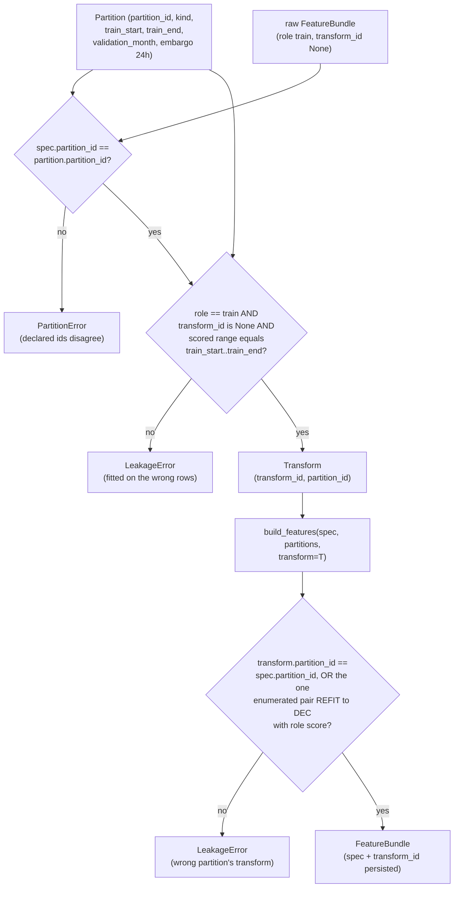

# Business Logic Model — `features-and-splits`

> ## ✳ G-09 IS SIGNED — 2026-08-28, **D-31** (read this before any G-09 statement below)
>
> The project decision owner **signed and approved G-09 (Agent preflight)** on 2026-08-28,
> recorded as **D-31** in `evidence/DECISIONS.md` with change record
> `governance/CHANGE_RECORD_2026-08-28_G09_signed.md`. **Every statement below of the form
> "G-09 is not signed" / "G-09 stays unsigned" is superseded as to the gate's status**, and
> is left standing as the accurate record of the constraint that applied when it was
> written.
>
> ⚠ **D-31 records the gate's own TE §18.3 preconditions as UNMET, and that disclosure
> travels with the signature.** `configs/`, and until 2026-08-28 `src/`, did not exist, so
> the mandated automated zero-TBD preflight **could not run**; the ten named critical tests
> **cannot be executed in this environment** (no Python interpreter is installed — a
> zero-byte Windows Store stub, no registry entry, no interpreter on disk); and the evidence
> artifact `aws_ai_dlc_preflight_report` **does not exist**. "No failing critical test" is
> therefore **unproven, not proven** — an absence of executions, not an absence of failures.
> This is the owner **opening the gate by authority**, not a record that its evidentiary
> conditions were satisfied, and no reader may infer the second from the first.
>
> **What the signature changes here:** module creation is authorised, and any defect this
> unit deferred *solely* because G-09 barred editing a file is now correctable.
> **What it does NOT change:** G-05 and G-06 remain `Blocked`; G-P1A, G-P2, G-P3A, G-P3C
> and G-07 are unaffected; **TE §18.2's absolute rule stands** — every scientific value this
> unit routed to G-04/G-05 **stays routed**, and no agent may fill a freeze-gate value by
> convenience; and **§18.3's stop-and-report obligation survives its own gate**, being a
> standing rule on implementation rather than a one-time gate condition.

**Unit** `features-and-splits` (Bolt 7) · **Kind** `library` · **Depends on**
`target-standardization`, `external-products`, `governance-guards`

> **Regenerated 2026-08-24, on a new stage attempt — and unlike every sibling, this unit's
> content did change.** Construction opened at 2026-08-24T11:46:26Z, resetting the receipt
> floor for every unit; both `foundation` passes of that day
> (`governance/CHANGE_RECORD_2026-08-24_foundation_amendments.md`) were checked against this
> unit and touch nothing it reads. **The substantive change is separate:** this unit's § Review
> stood at **NOT-READY** after five adversarial iterations, with **2 Criticals and 3 Majors**.
> Three of those needed decisions, taken as **FU-4 = D**, **FU-5 = D** and **FU-6 = A**:
>
> - **FU-4** — the pairing control's predicate was unobservable across the `05`→`06` artifact
>   handoff. Now a **provenance stamp** (`fold_id`, `purpose`, `transform_id`) refused at the
>   consumer, with the test declared **manifest-based**. See **W-3** and **W-4a**. **Amendments
>   owed re-derives 7 across 4 → 8 across 5**, declared rather than deferred.
> - **FU-5** — `build_features` has no row-range parameter, so the row set is **derived from
>   `fold` and `purpose`**; `evaluate` may **read** the validation month plus the causal history
>   the 24-hour window requires and may **emit** only the month. See **W-4b**. **1 December
>   stays in the G-06 locked test**, stated where G-06 is described.
> - **FU-6** — **three** calls per fold, not two; the fitting call's outputs are a fitting input
>   only, never emitted. Negative control: an untransformed tensor reaching **M-06 fails**.
>
> Iteration-5 findings **4, 5, 6 and 7** are applied as mechanical corrections (W-2's signature
> block, `domain-entities.md` § 10's two rows, the duplicated *"which representation"* sentence,
> and the one-parameter Assumptions entries). Findings **9, 10 and 11** were left standing on
> 2026-08-24 and **fixed 2026-08-26 under the fourteenth-redo floor, on the owner's "fix all"
> ruling**: the `evaluate` rows now carry the read/emit split where the embargo term bites
> (9); `business-rules.md`'s Sources list received the same R-24-in/R-25-R-28-out correction
> the other two files got on 2026-08-23 (10); and R-76a's id and filing position are kept with
> the reason stated — renumbering would break `models-and-baselines`' live citations under a
> frozen READY receipt (11a; 11b's tree-revision half already carried its gate referral). **BLK-04 is not closed by any of this** — it remains an exit
> condition on this unit and the four downstream units. **The NOT-READY verdict below belongs to
> the previous attempt and predates all of it; a fresh adversarial pass follows.**

> ## ⚠ REBUILT 2026-08-26 ON THE ADR-11 CONTRACT — OWNER RULING
>
> The 2026-08-26 fourteenth-receipt review (preserved in full at the end of this file) found
> that the box above — and every mechanism the 2026-08-24 and 2026-08-26 remediation waves
> built — targeted an interface `component-methods.md` had already retired on **2026-08-23**:
> **ADR-11** removed `apply_transforms` entirely, replaced `FoldSpec`/`build_folds` with
> **`Partition`**/`build_partitions`, replaced the separate matrix/tensor return with a single
> **`FeatureBundle`** carrying `spec` (`partition_id`, `role`, `scored_start`, `scored_end`)
> and `transform_id` as one persisted object, and replaced the purpose-scoped containment
> check with an **identity check** — `LeakageError` when
> `transform.partition_id != spec.partition_id`, with exactly one enumerated exception,
> `REFIT` → `DEC` under `role="score"`, the G-06 apply. On the owner's authorization these
> three artifacts are rebuilt on that contract. **Every dated ⚠ box below this one is
> preserved as history of the retired `apply_transforms` lineage** — where such a box states
> a mechanism, signature, token (`FoldSpec`, `ApplyPurpose`, `purpose`) or count, the ADR-11
> text beside it is the live contract and the box is not. The FU-4/FU-5/FU-6 rulings above
> are mapped onto ADR-11 in dated boxes at W-4a, W-4b and W-4; **one element of FU-5 = D is
> defeated by ADR-11's own owner-approved `lead_in_hours` removal and is raised at the gate
> rather than silently dropped** — see W-4b. § Amendments owed re-derives to **5 across 3
> units** (this unit now owes none); the figure "8 across 5 units" survives in
> `models-and-baselines`' frozen READY artifacts and is raised at the gate as stale, not
> edited there. **BLK-04 remains an open exit condition and G-09 remains unsigned; nothing
> here authorises implementation.**

> ## ⚠ REMEDIATED 2026-08-28 ON GOVERNANCE REPORT `GOV-2026-08-28-FD-01` — OWNER RULINGS
>
> Verdict **FAIL**. Five rulings reach this unit, each applied with a dated note citing its
> Recommendation number. **Workflow ids W-1…W-10 and their subject matter are unchanged.**
>
> - **Recommendation 4** — **the blocker, found independently by two board seats.** BLK-09 was
>   unmet **and de-labelled** here, while **W-3 element 1 affirmatively asserted an
>   unexecutable check was executable**: *"equality is checkable because `fit_transforms` takes
>   the `Partition` itself in scope."* Derived before the fix: `BLK-09` = **0**,
>   `train_start` = **0**, `BLK-08` = **0**, `inverse` = **0** across all four files. Board
>   option 1 applied — `Partition` gains **`train_start: date`** from `configs/data.yaml`, both
>   bounds are read from the `Partition`, a **BLK-09 status paragraph is restored**, and a
>   **strict-subset** negative control is added. Contract: `business-rules.md` **R-83**.
> - **Recommendation 25** — W-5 specifies **`train_end` for all six partitions**, with
>   **`DEC.train_end = 2022-11-30`**; the ADR-11 carve-out is retained for interface clarity
>   rather than necessity; the **30** raising conditions are enumerated.
> - **Recommendation 7, narrowed to `ABL-DIFF` on D-27** — W-3 states explicitly that **the
>   primary path needs no inverse transform**, and BLK-08 half B is authored as
>   `business-rules.md` **R-84**. The `src/evaluation` → `src/features` edge is **owed and
>   unapproved**; D-27 withheld authorisation.
> - **Recommendation 6 / D-28** — the § Assumptions FU-5 item is **closed**; W-4b's dated box
>   stands as the record of how the conflict was raised, and its superseded FU-5 = D quotations
>   are untouched.
> - **Recommendation 8** — `PartitionError` is `foundation` R-01's **fifteenth**; W-3's
>   element 2 is reconciled with the discriminating rule (`domain-entities.md` § 10 carries it).
>
> § Amendments owed re-derives to **7 across 5 units**, arithmetic printed. **BLK-04, BLK-08
> and BLK-09 all remain open exit conditions and G-09 remains unsigned; nothing here authorises
> implementation or the creation of a module.**

The workflows this unit implements: the availability matrix that asserts actual lag ≥
declared safe lag, feature construction over a **closed** dictionary, **per-partition
train-only transforms applied only inside `build_features`**, one shared window definition
emitting both representations inside one `FeatureBundle`, the F1–F4 exact calendar folds with
their 24-hour embargo, and the December locked partition's **execution guard**.

**BLK-04 is an exit condition on this stage.** W-3 authors its contract. **This unit and
four downstream units may not complete or exit stage 3.1 without it**, and **no
implementation may proceed while it stands.** NFR-LEAK-01's evidence remains owed to the
**Supervisor at G-04 and G-05**.

**It decides no scientific value.** The lags are D-10.3's, the window length a frozen
constant, the folds exact calendar boundaries — all fixed elsewhere and applied here.

## Sources

- `../../../inception/units-generation/unit-of-work.md` § 7 — the `Owns` list, the boundary, the 11 requirements, the implementation notes; **BLK-04** with its exit-condition ruling.
- `../../../inception/units-generation/unit-of-work-story-map.md` — Tables 1 and 2, § Per-unit coverage summary, § Cross-unit responsibilities, § Open verification gaps. **Derived by reading the rows:** 11 requirements, **1** with no acceptance row (FR-P1-04-10); **12** rows as primary; **supports** TA-36.
- `../../../inception/requirements-analysis/requirements.md` — FR-P1-04-1, -2, -5, -6, -8, -10, -12, -13, -16; NFR-IRI-01; NFR-LEAK-01; and the 40 → 36 recomputation record.
- `../../../inception/application-design/component-methods.md` — `src/features`' boundary calls **as redesigned 2026-08-23 (ADR-11)**: § The `src/features` leakage boundary — redesigned 2026-08-23 (`FrameSpec`, `Transform`, `FeatureBundle`, `build_features(...) -> FeatureBundle`, `fit_transforms(bundle, *, partition)`, the identity-based leak check with its one enumerated `REFIT`→`DEC` exception, the `lead_in_hours` removal), `src/data/splits.py`'s `Partition`/`build_partitions` with the six-partitions/five-manifest-rows rule, `src/models`' `Prediction` carrying `partition_id`/`transform_id`, and § Depth. *(Sources line rewritten 2026-08-26: the prior line cited this file without naming the redesign, and the artifacts were built against its superseded interface — the fourteenth-receipt review's headline Critical.)*
- `../../../inception/application-design/services.md` § The nine stage scripts (`05`'s Writes: **`FeatureBundle`s**), the ADR-11 boxes (M9 bundle addressing — `<partition_id>__<role>__<transform_id>/`, `untransformed` for `None`; M13 three-constructions cost), § Stage entry contract.
- `../target-standardization/functional-design/business-rules.md` — the D-17 target rows consumed here.
- `../external-products/functional-design/business-rules.md` — **R-56** (the transitive import scan), **R-57** (F10.7 future-independence), **R-58** (driver alignment).
- `../governance-guards/functional-design/business-rules.md` — **R-19** (the exactly-one-member exclusion shape), **R-23** and **R-24** (the two phase-boundary limbs). **Corrected 2026-08-23:** R-19 and R-24 are cited in this artifact’s body and were absent here; **R-25** (access-log ordering) and **R-28** (restricted root) were listed and drawn on nowhere, and are removed.
- `evidence/DECISIONS.md` — **D-10.3**, **D-11**, **D-13**; **D-27** (2026-08-24 — the primary configuration's train-only transform acts on target-**derived inputs**; the target stays **raw TECU**; the inverse obligation is `ABL-DIFF`'s alone; *"no import-boundary change is authorised by this decision"*) and **D-28** (2026-08-28 — the G-06 locked-test scored set is **2–31 December 2022, 30 days**, with the Vision §8.2 / TE §7.1 authority conflict disclosed and carried to G-05). *(Added 2026-08-28 per Recommendations 7 and 6.)*
- `governance/reviews/GOV-2026-08-28-FD-01.md` — the full-board stage-3.1 review, verdict **FAIL**; Recommendations **4** (`CHAIR-03`, `ML-01`), **6** (`CHAIR-01`, `CHAIR-02`, `VAL-04`), **7** (`CHAIR-04`, `ML-02`), **8** (`CHAIR-05`, `ML-05`, `IMPL-02`) and **25** (`ML-06`). *(Added 2026-08-28.)*
- `../evaluation-and-comparison/functional-design/business-rules.md` — **R-103** (the BLK-08 joint contract; half A binding there, half B authored here as R-84) and **R-104**. *(Added 2026-08-28 per Recommendation 7.)*
- `../../../inception/application-design/component-dependency.md` — § Dependency matrix: `src/evaluation` → `src/features` is **`—`**, and `src/features` → `src/models` is **`—`** in both directions. *(Added 2026-08-28; both are load-bearing for R-84's edge and for the exception routing in `domain-entities.md` § 10.)*
- Workspace inspection, 2026-08-23: `tests/` holds three modules, none this unit's; `src/` and `configs/` absent.
- `functional-design-questions.md` (**Q1 through Q9**, and **FU-7**), `domain-entities.md`, `business-rules.md`.

---

## W-1 — The availability matrix, and the limb the first two checks miss

```
INPUT   snapshot: ConfigSnapshot, drivers: Mapping[str, DataFrame]
OUTPUT  Sequence[AvailabilityRow]
RAISES  LeakageError
```

Each row carries `feature`, `observation_timestamp`, `publication_timestamp`,
`release_status`, `safe_lag_hours`, `actual_lag_hours`.

**`assert_lags_safe` raises** when any row has `actual_lag_hours < safe_lag_hours`; when a
driver's `release_status` indicates a **backfilled final value** where the contemporaneous
grade was required; or when `f107_81_trailing`'s window **does not end at the safe-lagged
day**.

**The lags, applied here and decided in D-10.3:** Kp/ap3 **≥ 3 h**; Hp60/ap60 **≥ 1 h**;
F10.7 at the **previous-day observed** value with a **trailing** 81-day mean. **Dst is
diagnostic/hindcast-only. SSN is absent**, and a `grep` confirms it.

### W-1a — Why the anchor is a third limb, not a restatement

FR-P1-04-2 spells out the hole its own first two checks leave:

> *"a trailing 81-day mean **ending at day t** passes both the not-centered check and the lag
> assertion while including same-day F10.7."*

So three limbs, not two — and the third is the one that catches it:

| Limb | Catches | Misses |
|---|---|---|
| `actual_lag ≥ safe_lag` per row | A feature published later than its declared lag | A mean whose window reaches into the lag |
| Not-centered | A centered window | A trailing window anchored one day too late |
| **Window end date = the safe-lagged day** | **Exactly the case above** | A recorded anchor that the values were not actually computed from |

**Mechanism (Q4 = D), two parts:** the anchor is asserted, **and the mean is recomputed from
that anchor and compared.** A recorded end date is a **claim**; the recomputation is the
**check**.

> **Deliberate overlap with `external-products` R-57, stated rather than left to look like
> duplication.** R-57 asserts a strictly stronger property — perturb any day after the
> safe-lagged day, the mean must not move — which holds at every index rather than at the
> anchor. **The split is by property, and both checks are needed.** R-57's future-independence
> is a **series-level** property of the driver product — perturb a future day, the series must
> not move. The anchor recomputation is a **value-level** property of the mean built here,
> checkable only where it is built, and it catches a case R-57's framing does not spell out:
> a **recorded-but-wrong anchor** whose values were never computed from it. Two different
> checks over one fact, not a hedge.
>
> **Corrected twice, 2026-08-23.** The first issue said *"R-57's rows are `Pending`"*, which
> overstated the dependency: R-57 is a **rule**, and the rows it contributes to are **these
> same two** — `external-products` is the **supporting** unit on WS-11/TA-08, not the owner of
> a separate row. The second said delegation would make acceptance *"depend on a module in
> another unit"*, which **proves too much**: W-7 below **does** delegate the module-graph limb
> of NFR-IRI-01 to `external-products` R-56 while WS-10 and TA-07 stay this unit's rows.
> Applied consistently that reason would forbid the W-7 split this same artifact endorses. The
> by-property reason above survives both cases. **The design decision is unchanged throughout;
> only its justification is.**

## W-2 — Feature construction over a closed dictionary

```
INPUT   target, drivers, registry, matrix, spec: FrameSpec,
        partitions: Sequence[Partition], snapshot,
        transform: Transform | None = None
OUTPUT  FeatureBundle — matrix + tensor from ONE window definition, carrying
        spec (partition_id, role, scored_start, scored_end) and transform_id
        as the same persisted object (W-4a)
RAISES  LeakageError, AlignmentError
```

> **Rebuilt 2026-08-26 on ADR-11 (owner ruling) — the signature above is
> `component-methods.md`'s current approved boundary call; the block it replaces targeted the
> retired `apply_transforms` interface** (its 2026-08-24 iteration-5-finding-4 note recorded
> the `transform`+`purpose` amendment, which has since **dissolved into ADR-11** — see
> § Amendments owed). `spec` declares the partition, the **role** (`train` | `score`) and the
> scored range; `build_features` **validates the spec against `partitions`** (a named
> partition; scored range contained in the training range for `train`, in the
> `validation_month` for `score`) and applies `transform` **internally** — no separate apply
> call exists. A `transform` whose `partition_id` differs from `spec.partition_id` raises
> `LeakageError`, with exactly one enumerated exception: `REFIT` → `DEC` under
> `role="score"`, the G-06 apply (W-6). `transform=None` emits the **untransformed** fitting
> bundle (`transform_id` `None`), whose consumption downstream is itself a raise — see W-4.

**`build_features` raises** on: any field **outside the §6.2 dictionary**; a **carried-forward
`vtec_lag_*`** value; an **incomplete `vtec_seq_24`** window not excluded; a **support field
used as an input without a recorded G-04 approval**; a **target-hour quality field**; a **raw
longitude** column; a **driver carried forward beyond 3 h**.

**And two that were missing** (added 2026-08-23 with R-76a): **`AlignmentError`** on a driver
value repeated **outside its own defined interval**, and on one **shifted to a neighbouring
hour**. R-58's **third** limb — no interpolation, at any stage — is a **static check over the
source tree, not a raise**: an interpolated value is indistinguishable at runtime from a
genuine one, and R-58 states a grep *"is the only check that reaches a call site no fixture
exercises."* These are FR-P1-04-17's raises. They belong here because
the story map's § Cross-unit responsibilities gives **this unit** TA-36's **enforcement raise
at `features.build_features`** and its **primary negative-path test**
(`tests/test_feature_leakage_guards.py`) — see R-76a, which corrects the opposite claim these
artifacts previously made.

**The input space is closed** (FR-P1-04-12): the feature set is **exactly** the TE §6.2
dictionary — *"no field outside that table, and no derived tensor built from one"*. Window
length is **one frozen value per feature-set ID**, shared across all model families, and the
primary history window is **24 hours — a frozen constant, not a tuned hyperparameter**
(Vision §8.1). `experiment.yaml`'s window length **equals 24 and appears in no grid**.

**Raw longitude never enters as a predictor**; longitude enters **only** through `lst_sin`
and `lst_cos` (FR-P1-04-10).

**An unresolved station registry blocks `station_lat` and excludes `lst_sin`/`lst_cos`** —
`inventory-and-registry` R-45/R-46. This unit **consumes** that block and does not decide
what provenance is sufficient.

## W-3 — BLK-04: the train-only fitting contract

```
INPUT   bundle: FeatureBundle (role "train", transform_id None), partition: Partition
OUTPUT  Transform — transform_id + partition_id, the identity the leak check compares
RAISES  LeakageError
```

> **Rebuilt 2026-08-26 on ADR-11 (owner ruling).** The signature above is the approved
> `fit_transforms(bundle, *, partition)`; the fence it replaces read
> `fit_transforms(train: DataFrame, fold)` plus an "AMENDED" apply call on the retired
> interface. Everything in this section outside the dated ⚠ boxes is the ADR-11 contract;
> the dated boxes record the retired lineage — the diagnosis that forced the redesign and the
> five review cycles that killed the old mechanism — and are history, not contract.

**The register names the required elements**, quoted: *"input and output types, alignment
requirements, ownership of the fitted state, allowed partitions (the named fold's training
partition only) and failure conditions (`LeakageError` when `train`'s index is not a subset
of that partition), so validation and locked-test leakage are prevented by the contract
rather than by review."*

> **Historical box, preserved (rebuilt 2026-08-26): the interface it diagnoses was retired by
> ADR-11 on 2026-08-23** — `component-methods.md` now preserves the same diagnosis itself,
> under its own *"THE SUPERSEDED INTERFACE, PRESERVED, AND WHY IT COULD NOT WORK"* box.
>
> ## ⚠ THE APPROVED INTERFACE DOES NOT PREVENT WHAT IT CLAIMS TO
>
> `component-methods.md` states that a single `fit_transform(all_data)` is *"unrepresentable
> in this interface, which is how NFR-LEAK-01 is enforced by shape rather than by review."*
>
> **It is not unrepresentable.** `fit_transforms(train, *, fold)` types `train` as an
> **unconstrained DataFrame**, so `fit_transforms(all_data, fold=F1)` **type-checks**. The
> register's own implementation note says the same: the split *"prevents the single-call
> convenience shape but not the underlying full-dataset fit."*
>
> **This is the leak with no downstream symptom.** A transform fitted on all data produces
> *better* validation numbers and raises nothing anywhere. **Four downstream units inherit
> it** — `models-and-baselines`, `evaluation-and-comparison`, `statistical-inference`,
> `regimes-diagnostics-reporting` — because *"every reported number inherits the fit."*

**The contract (Q1 = D, mapped onto ADR-11), four elements:**



Text fallback *(extended 2026-08-28 per Recommendations 4 and 8)*: fitting takes the
untransformed train-role bundle and the Partition itself; it raises **PartitionError** when the
bundle's declared partition id and the passed partition's id disagree — a declared-identity
disagreement, before anything is fitted — and **LeakageError** unless the bundle's role is
train, its transform identity is empty, and its scored range is exactly
**[partition.train_start, partition.train_end]**, both bounds being fields of the Partition
since 2026-08-28 (R-83, BLK-09; before that the equality had no lower bound to compare
against); the returned transform carries the partition's id. Applying happens only inside
build_features, which raises unless the transform's partition id equals the spec's — the
single enumerated exception being the refit transform scoring the December frame under role
score, which is the G-06 apply — and independently validates the spec's scored range against
the range its role permits: containment in the training range for train, containment in the
validation month for score.

1. **Allowed partitions** — a transform is fitted only on the named partition's **training
   range, exactly**. ADR-11 strengthens the register's *"not a subset"* condition to **range
   equality**: a strict subset of the training range is also a wrong fit. The range is
   **`[partition.train_start, partition.train_end]`**, both bounds fields of the `Partition`
   **since 2026-08-28** (`business-rules.md` **R-83**, BLK-09, Recommendation 4).
   **Corrected 2026-08-28.** This paragraph previously read: "equality is checkable because
   `fit_transforms` takes the `Partition` itself in scope" — an **over-claim, and the exact
   Critical two board seats found independently**. Taking the `Partition` in scope was
   necessary and **not sufficient**, because `Partition` carried only `train_end`, so the
   equality had **no lower bound to compare against**. The upstream contract's own closing
   note said so at `component-methods.md:904-906`. The superseded sentence is quoted above
   rather than deleted.
2. **Failure condition, fitting** — `fit_transforms(bundle, *, partition)` raises
   **`PartitionError`** when `bundle.spec.partition_id != partition.partition_id` — a
   **declared-identity disagreement**, raised before anything is fitted, and the same
   condition `models-and-baselines` R-92 raises `PartitionError` on *(reassigned 2026-08-28
   per Recommendation 8; see `domain-entities.md` § 10 for the discriminating rule and the
   amendment this carries)*. It raises **`LeakageError`** when `bundle.spec.role != "train"`;
   when `bundle.transform_id is not None`
   (already transformed); and when
   `[scored_start, scored_end]` is not exactly `[partition.train_start, partition.train_end]`
   — **in either direction, over-wide or strict subset** — the check that
   needs `partition` in scope, which the first ADR-11 draft omitted, the re-entry review
   restored, and **R-83 made executable** by supplying the lower bound. This closes what the
   old type signature could not: `fit_transforms(all_data,
   fold=F1)` is no longer writable, because the input is a bundle `build_features` already
   validated against the partition list.
3. **Ownership of the fitted state** — `Transform` carries `transform_id` and
   `partition_id`; its fitted state is intra-package. The identity is **persisted with the
   data**: `FeatureBundle.transform_id` crosses the `05`→`06` handoff and
   `Prediction.partition_id`/`transform_id` (ADR-11, added 2026-08-23) carry it on to `07`,
   so ownership survives every file-mediated handoff rather than dying at the first consumer.
4. **Applying failure** — **`apply_transforms` is removed** (ADR-11): transforms are applied
   **only inside `build_features`**, so no call site exists that could take an arbitrary
   frame. `build_features` raises `LeakageError` when
   `transform.partition_id != spec.partition_id` — an **identity comparison**, which the
   nested training ranges cannot defeat: F4's transform on a frame whose spec says `F1` fails
   regardless of which months overlap. Exactly **one enumerated pair** is exempt: `REFIT` →
   `DEC` with `spec.role == "score"`, the G-06 one-shot; the same pair with `role="train"`
   **raises**, because fitting on December is the locked-test violation itself.
   `build_features` also validates the spec against `partitions` — `spec.partition_id` must
   name a real partition, and the scored range must be **contained in** the training range
   for `role="train"`, in the `validation_month` for `role="score"` — because without it the
   spec's fields are caller assertions, which is precisely how the superseded interface
   failed. **This is the second half of the same leak**: element 2 stops a transform being
   *fitted* on the wrong rows; element 4 stops one correctly fitted on F4 being *applied* to
   April as F1's evaluation, now by identity rather than by any row rule.

> **Historical box, preserved (rebuilt 2026-08-26 on ADR-11).** Everything inside the box
> below — including its "amendment approved 2026-08-23", its `purpose` tables, its pairing
> control, its residual and its refit-has-no-path finding — mechanised element 4 on the
> retired `apply_transforms` interface and is **history, not contract**. The live mapping of
> what it carried follows immediately after the box.
>
> ## ⚠ ELEMENT 4 — MECHANISM CORRECTED TWICE, 2026-08-23
>
> **First text, superseded:** *"`apply_transforms` **refuses** a transform whose fold does not
> match the frame's partition."* — a **claim, not a check**. The signature carries no fold or
> partition parameter and `frame` carries no partition tag.
>
> **Second text, also superseded:** *"derives each row's partition from its record timestamps
> … a row belonging to any other fold, to the final refit, or to December raises
> `LeakageError`."* — **it derives a label that does not exist, and it blocks two lawful
> paths.** Both were found by adversarial passes, **inside the remedy for the leak with no
> downstream symptom**.
>
> **Why per-row derivation is impossible.** The training ranges **nest**: Jan–Mar ⊂ Jan–Jun ⊂
> Jan–Sep ⊂ Jan–Oct ⊂ Jan–Nov. A **15 February** row lies in **five** of the list's six
> entries, so *"this row's partition"* is **not single-valued**. **The check never needed a
> label** — it needed containment in a **named** scope.
>
> **Third text, also superseded — and this one needed an amendment to fix.** It read: the
> transform accepts *"that fold's training range, its 24-h embargo, and its validation
> month"*, the refit *"1 Jan – 30 Nov and December"*. **Those five sets are strictly nested
> prefixes:**
>
> | Transform | Accepted set under the superseded rule |
> |---|---|
> | F1 | 1 Jan – **30 Apr** |
> | F2 | 1 Jan – **31 Jul** |
> | F3 | 1 Jan – **31 Oct** |
> | F4 | 1 Jan – **30 Nov** |
> | Final refit | 1 Jan – **31 Dec** |
>
> So *"inside the transform's own scope"* collapsed to *"not later than this transform's
> validation month"* — **an upper bound, not a leakage check**. Applying **F4's** transform
> (fitted Jan–Oct) to **April** passed, and **F4's fit saw April**. The single worked example
> the design offered (F1 → October) was the **non-leaking** direction; the leaking direction
> had no control anywhere in the three artifacts. Found by a third adversarial pass.
>
> **Root cause, and why no row-level check could have worked.** Leakage here is a property of
> **what the call is for**, not of where the row sits. April is legitimately inside F4's
> training data; transforming it *as training* is correct, and transforming it *as F1's
> evaluation* is the leak. Neither `apply_transforms` nor `FoldSpec` carried the use, so **no
> containment rule over rows could separate the two**. Two prior remedies failed by trying.
>
> ### The amendment — approved by the owner, 2026-08-23
>
> ```
> apply_transforms(frame: DataFrame, *, transform: Transform,
>                  purpose: ApplyPurpose) -> DataFrame
> ```
>
> `purpose` is **required, with no default** — an implicit default is precisely where the leak
> would re-enter — and each value carries a **different, tight** accepted set:
>
> | `purpose` | Fold *k*'s transform accepts | The refit's transform accepts |
> |---|---|---|
> | `train` | Fold *k*'s **training partition**, embargo rows **excluded and counted** | 1 Jan – 30 Nov |
> | `evaluate` | **Exactly fold *k*'s validation month** as the **emittable** set; the 24-h embargo rows are **readable as causal history only, never emitted** (W-4b) — an embargo row **emitted** under `evaluate` raises `LeakageError` *(row completed 2026-08-26, iteration-5 finding 9)* | **December only**, and only through W-6's guard |
>
> Anything else raises `LeakageError`; so does an **empty or timestamp-less** frame, because a
> check that never fired and a check that passed must not be indistinguishable — the same
> argument this unit makes for **counting** excluded rows rather than merely excluding them.
>
> **The leaking direction now fails:** F4's transform, `purpose=evaluate`, on April → F4's
> validation month is **November** → `LeakageError`. **The lawful directions still pass:**
> F4/`train` on April → April is in F4's training partition → passes; F1/`evaluate` on April →
> passes.
>
> **Cost, stated rather than buried.** This is a **cross-package boundary amendment** —
> the sixth this stage owes, and the first outside the three units that owed the other five.
> **The running total is no longer five across three units**; see § Amendments owed, which
> derives it rather than carrying it.
>
> **What `purpose` does NOT bound, stated exactly.** It bounds **which rows a transform may
> touch under a declared use**. It does **not** bound **what the caller does with the frame it
> gets back**, and no signature can — the return value is an ordinary DataFrame.
>
> **The consequence, named rather than left implicit.** `purpose=train` accepts that fold's
> **whole** training partition, and those partitions nest, so **10 of the 39 accepted
> `train` cells** apply a transform to a month that is **another fold's validation month**:
> F2→Apr; F3→Apr, Jul; F4→Apr, Jul, Oct; refit→Apr, Jul, Oct, Nov. Every one is a **truthful**
> declaration — November genuinely is in the refit's training partition — and every one is
> **correct as training**. The leak is not in the call; it is in **reusing that output as an
> evaluation**, which happens at a different call site.
>
> **The pairing control, which closes it — restated 2026-08-24 on FU-4 = D, because the
> previous formulation could not be built.** The earlier text asserted that the frame being
> scored *"was **obtained from a call** with `transform = T_k` and `purpose=evaluate`"*, and
> then leaned on the nine stage scripts being a closed enumerable set. **The set is closed** —
> counted from `services.md`: `00`, `01`, `02` ×2, `03`, `04`, `05`, `06`, `07` = **9**, with
> `run_walking_skeleton.py` the orchestrator rather than a stage — **but the predicate was
> unobservable.** `services.md` § The nine stage scripts puts the producing call and every
> scoring site in **different processes**: `05_build_features_and_splits.py` **writes** the
> feature matrix, sequence tensor, folds and masks; `06_train_and_predict.py` **reads**
> features and folds; `07_evaluate_and_report.py` **reads** predictions, benchmark and mask.
> So `apply_transforms` is called only in `05`, **no scoring site calls it at all**, and
> nothing in the emitted artifacts recorded the fold or the purpose. A frame that "was
> obtained from a call" is not a fact any scoring site can check when it obtained the frame
> from a file. *(Iteration-5 finding 1.)*
>
> **The mechanism, named rather than left as an outcome.** Three parts, and each is a build
> instruction:
>
> 1. **The stamp.** Every emitted feature artifact carries `fold_id`, `purpose` and
>    `transform_id` — the fitted transform's identity — as **recorded fields**. See **W-4a**
>    and `domain-entities.md` § 5. This is what makes the pairing a property of the artifact
>    rather than of a call that has already returned.
> 2. **The assertion, at the consumer.** `06` and `07` **refuse** a frame whose stamp is not
>    `(fold k, evaluate)` when scoring fold *k*'s validation month. The refusal lives where the
>    scoring happens, not where the transform was applied.
> 3. **The test, with its kind declared.** `tests/test_train_only_transforms.py` is
>    **manifest-based**: it reads the emitted artifacts' stamps and asserts the refusal, with
>    R-74's two controls — a `train`-purpose output reaching an evaluation comparison **fails**,
>    and fold *j*'s transform scoring fold *k*'s validation month **fails**. It is **not**
>    static analysis of the nine scripts, which cannot follow a file-mediated handoff, and
>    **not** a monkeypatch-and-replay, which would verify a replay rather than what a real run
>    emits. Saying which of the three it is was the omission iteration 5 named.
>
> **Residual after that, correctly described.** The gap is **not** *"a caller outside the nine
> enumerated stage scripts"* — that wording survived two iterations and pointed at an exotic
> path when the real one was the **ordinary `05`→`06` handoff inside them**. What remains
> unreachable is **an unstamped or hand-assembled frame**: a frame that never passed through
> `build_features`, and so carries no stamp for `06`/`07` to refuse. That is the boundary of
> what this contract delivers.
>
> **Cost, declared here rather than left to a sweep.** The stamp crosses into `06` and `07`,
> which belong to units whose own design has not run yet, so this is a **boundary change** and
> **§ Amendments owed re-derives from 7 across 4 to 8 across 5**. Declaring it is deliberate:
> BLK-04 is an exit condition on those units too, and `project.md` § Way of Working requires
> the inputs a gating condition depends on to be specified in the stage that records the
> condition.
>
> **December is not excluded here, it is routed.** Applying the **final-refit** transform to
> December **is** the G-06 path. The lock is held by **W-6's execution guard** — December rows
> reach `apply_transforms` only inside a frame materialised by `materialise_locked_partition`
> against a **verified `g05_signature`** — not by this check. The second text duplicated the
> lock in the wrong place and would have made **G-06 unreachable** and the **final refit**
> (FR-P1-04-14) untransformable.
>
> **The refit has no path on EITHER side, and it is one open decision, not three.**
> `fit_transforms` is typed `(train, *, fold: FoldSpec)` **and so is `build_features`** — both
> take a `FoldSpec`, and W-5 records that **the final refit is not one**. So the refit today
> can neither have a transform fitted for it nor have its features built, and December
> inherits both gaps. **Corrected 2026-08-23**: the first statement named only the
> `fit_transforms` side, which understated the scope of what is blocked.
>
> **All of it turns on the same question** — how the refit is represented alongside the four
> folds — and it goes to the gate **once**, with W-5. Element 4 is **complete and executable
> for F1–F4** and **conditional on that resolution** for the refit and therefore for **G-06**.
>
> **`assert_membership_from_timestamps` is cited for what it does**, not as the derivation:
> `(frame) -> None` validates a row against the partition it is **filed under**, raising on a
> month/year disagreement. It **returns nothing and derives nothing**, and the second text was
> wrong to lean on it.
>
> **Which representation.** `build_features` applies the `Transform` to the **assembled
> feature frame before windowing**, so both representations inherit it from **one** definition,
> and the `NDArray` tensor — which carries no timestamps — is **never transformed directly**.
> Element 4 therefore sits upstream of both, including the sequence tensor M-06 consumes.
> *(Reworded 2026-08-24, iteration-5 finding 6. The previous sentence — "transforms apply to
> the timestamped frame; `windows.py` builds both representations from a frame that has already
> passed this check" — was quoted by W-4 and R-81 as **unexecutable**, since no transformed
> frame exists before windowing. Stating it as the contract here and refuting it three sections
> later handed a reader a direct self-contradiction in the artifact whose own rule is that a
> restated contract in four places drifts. `domain-entities.md:237-239` already carried this
> rewrite; this file and `business-rules.md` did not.)*

**The element-4 lineage, mapped onto ADR-11** *(rebuilt 2026-08-26; each item names where the
box above's live content now stands)*:

- **The `purpose` parameter and its per-purpose accepted-set tables → dissolved.** The role a
  frame serves is a **declared field of the spec** (`FrameSpec.role`, `train` | `score`),
  validated by `build_features` against the partition list, and the leakage decision is the
  **identity check** — no accepted-set table over rows exists any more, because ADR-11's own
  finding is that *"the constraint cannot be expressed over rows."* The old table's `train`
  rows survive as the containment validation (a `train` spec's range ⊆ the training range,
  embargo rows excluded and counted); its `evaluate` rows survive as `score`-role containment
  in the `validation_month` — with the December read/emit consequence changed by ADR-11's
  `lead_in_hours` removal, see **W-4b**.
- **The pairing control → native.** `FeatureBundle` persists `spec` and `transform_id` as one
  object with the data; `06`/`07` assert them and raise on `transform_id is None`. See
  **W-4a** (FU-4 = D mapped).
- **The 39-cell consequence → still true, restated.** A `train`-role bundle for partition *k*
  lawfully carries *k*'s whole training range — 3 + 6 + 9 + 10 + 11 = **39** month-cells
  across the five fitting-capable partitions, of which **10** are another partition's
  validation month (F2→Apr; F3→Apr, Jul; F4→Apr, Jul, Oct; REFIT→Apr, Jul, Oct, Nov; derived
  programmatically 2026-08-26). Every one is correct **as training**; reusing such a bundle as
  an evaluation now fails **structurally** — a scoring site asserts `spec.role == "score"`,
  and a `score` spec for another partition fails the identity check.
- **December is routed, not excluded** — unchanged in substance: the G-06 apply is the one
  enumerated `REFIT` → `DEC`/`score` pair, and the lock is held by **W-6's execution guard**
  (`materialise_locked_partition` against a verified `g05_signature`), not by the identity
  rule.
- **"The refit has no path on either side" → resolved.** `Partition` represents the final
  refit (`REFIT`, `kind=refit`, `validation_month=None`) and the locked month (`DEC`,
  `validation_month=2022-12-01`), and both `fit_transforms` and `build_features` take
  `Partition`s — the open shape decision W-5 carried to the gate is **discharged by ADR-11**;
  see W-5's dated box.
- **`assert_membership_from_timestamps` — unchanged**: it validates a row against the
  partition it is filed under and derives nothing; any check needing "which partition" now
  compares **declared identities**, which is exactly what ADR-11's own annotation says.
- **"Which representation" — live statement**: `build_features` applies the `Transform` to
  the assembled feature frame **before windowing**; both representations are built from one
  window definition and travel **in one `FeatureBundle`**, and the `NDArray` tensor — which
  carries no timestamps — is never transformed directly. A transformed matrix beside an
  untransformed tensor is **no longer constructible**, because only `build_features` produces
  both.

**Stated once, consumed by name** — a property of the contract, not a fifth element. The
register calls it a *"governed cross-unit contract"*. The four downstream units **cite** it;
they do not restate it. A restated contract in four places drifts — this stage has corrected
four counts that drifted between restatements.

> ## ⚠ BLK-09 — THE BLOCKER THIS UNIT HAD DE-LABELLED, RESTORED AND ANSWERED 2026-08-28
>
> **The status, quoted rather than paraphrased.** `unit-of-work.md:867` assigns BLK-09 to
> `features-and-splits` **solely**; `:857` records *"Status: **Open.** Exit condition on stage
> 3.1"*; `:333` states *"**No affected unit may complete or exit 3.1 without its approved
> contract**"* (`GOV-2026-08-22-REM-01` REM-02, options 1 + 3 approved — an exit condition,
> not an entry one). The register's own **Why it matters** field names the two raises that
> compare against a value which *"is not a field … reachable only by an **unwritten
> convention** that every training range starts 1 January 2022"*, and rules out the cheap fix:
> *"Deriving it from `train_end` and a hard-coded year is **not** available: that would put a
> scientific constant in source, which TC-03e forbids."*
>
> **What this unit did instead, and why it was worse than leaving it open.** The 2026-08-26
> ADR-11 rebuild **carried the dependent raise forward and dropped the blocker's name** —
> `BLK-09` = 0 and `train_start` = 0 across all four artifacts, derived by two board seats
> independently — while element 1 **affirmatively asserted the check was executable**. A reader
> of `unit-of-work.md` at least finds the registered defect; a 3.5 implementer reading a
> terminal-READY design found only an unexecutable check, and three bad options: hard-code
> `2022-01-01` (TC-03e and `project.md` § Forbidden), derive `train_start` from the earliest row
> present — which **degenerates the equality check into a tautology**, a check that can never
> fire and is indistinguishable from one that passes — or stop.
>
> **Under the tautology path the failure has no downstream symptom**, which is the whole reason
> BLK-04 exists: a transform fitted on a **strict subset** of the declared training range would
> be accepted, stamped with the partition id, pass the apply-side identity check, and produce
> standardization constants differing from the declared fold protocol with nothing anywhere
> raising.
>
> **The answer — board option 1, applied.** `business-rules.md` **R-83** adds
> **`train_start: date`** to `Partition`, sourced from **`configs/data.yaml`** (so TC-03e is
> satisfied), and both `fit_transforms` and `build_features` read **both** bounds from the
> `Partition`. W-5's table carries the six values. **No scientific value is decided**:
> FR-P1-04-5's fold table and D-8's calendar-2022 boundary already fix `train_start` at
> 2022-01-01 for all six partitions; what changes is where the value lives and what reads it.
>
> **Negative control added:** a `train` bundle whose scored range is a **strict subset** of the
> declared training range — F4 (`2022-01-01`…`2022-10-31`) fitted on
> `2022-02-01`…`2022-10-31` → **`LeakageError`**.
>
> **Cross-package shape change, therefore an amendment owed** to `component-methods.md`
> § `src/data/splits.py`, bundled with element 2's `PartitionError` reassignment as one
> consolidated change record. § Amendments owed re-derives to **7 across 5 units**.
>
> **Status: BLK-09 remains an open exit condition on this unit.** R-83 authors the contract;
> **approving this design is not the amendment's approval.** Five sibling units record the
> resolution as owed here (derived: `evaluation-and-comparison`,
> `fixtures-and-reproducibility`, `models-and-baselines`, `regimes-diagnostics-reporting`,
> `statistical-inference`), of which three name the `train_start` field itself.

> ## ⚠ BLK-08 HALF B — AUTHORED HERE 2026-08-28, NARROWED TO `ABL-DIFF` ON D-27
>
> **The premise is frozen, not inferred.** **D-27** (2026-08-24, project decision owner, at the
> delivery-planning gate): *"The **primary configuration's train-only transform does not touch
> the target.** It acts on target-**derived input features**; the target itself remains **raw
> TECU**."* Read from TE §7.2's `ABL-DIFF` row, whose **Primary remains** column reads **"Raw
> TECU"**, and TE §6.2's dictionary, whose only train-only standardization on anything
> target-derived applies to the **inputs**.
>
> **Stated explicitly, as D-27's Consequences require: the primary path needs NO inverse
> transform.** Model output is already in raw TECU, so the paired loss differential, the vector
> time-block bootstrap interval and the practical-relevance threshold are computed on the
> quantity the model emits — *"visibly satisfied rather than silently assumed."* Derived
> 2026-08-28 before this box existed: `D-27` was cited **0** times in this unit (and **0** in
> `evaluation-and-comparison` and `statistical-inference`, both receipted and not edited here).
>
> **Half B, authored as `business-rules.md` R-84 and narrowed to `ABL-DIFF` alone:** each
> fitted `Transform` **persisted retrievably by `transform_id`**;
> **`load_inverse(transform_id) -> Inverse`** exposed from `src/features`, where `Inverse`
> exposes **`inverse(frame)` and nothing else**; `Transform` declaring **`touches_target`**
> machine-readably; and the round-trip control `inverse(apply(x)) == x` within the declared
> fixture tolerance hosted **inside `src/features`**, where `apply` is visible.
>
> **Why not `load_transform` returning `Transform`** — R-103 half A's drafted surface. ADR-11 at
> `component-methods.md:595-600`: *"**`apply_transforms` is removed.** A function that applies a
> fitted transform to an arbitrary frame **is** the hole."* Handing a `Transform` across a
> package boundary reconstitutes exactly that surface one package away from the frozen
> comparison-wide mask and the G-06 path, **invisible to the identity check**, which lives
> inside `build_features` rather than on `Transform`. `Inverse` is apply-less by construction.
>
> **The import edge is OWED AND UNAPPROVED.** `src/evaluation` → `src/features` is **`—`** in
> `component-dependency.md`, and D-27 states *"**No import-boundary change is authorised by
> this decision.** The §12 rule and its allowlist are untouched."* Recorded as an amendment
> owed **and** a gate item, on the `ABL-DIFF` path only. **No module is created.**
>
> **Status:** BLK-08's **mechanism limb closes for the primary path** and **stays open,
> narrowed to `ABL-DIFF`** — D-27's own words. The `load_inverse`/`load_transform` divergence
> from R-103 half A is raised at the gate, not edited. **BLK-08 remains an open exit condition
> on stage 3.1 for both owners.**

> **BLK-04 remains open, and this design does not discharge it.** The register's ruling:
> the affected units **may enter** 3.1, **none may complete or exit without its approved
> contract**, and **no implementation may proceed** while it stands. **Approving this design
> is not that approval.** The leakage evidence is owed to the **Supervisor at G-04 and
> G-05**, unchanged.

## W-4 — One window definition, two representations

`windows.py` emits **both** the flattened matrix and the sequence tensor for a given
feature-set ID, and under ADR-11 the two **travel in one `FeatureBundle`** — which is what
makes FR-P1-04-8's parity *"structural rather than asserted"*: `component-methods.md` states
it directly, *"Both representations come from **one** window definition in `windows.py` and
now travel in one object, so FR-P1-04-8 holds by construction rather than by assertion."*

**Order** *(rebuilt 2026-08-26 on ADR-11; the amendment story below is history)*.

The `NDArray` tensor carries **no record timestamps**, so no row-level check can reach it.
ADR-11 closes this natively: the `Transform` is applied to the assembled feature frame
**inside `build_features`, before windowing**, so both representations inherit the identity
check from one definition — and since `build_features` is the **only** producer of either
representation, *"a transformed matrix beside an untransformed tensor is no longer
constructible."* The `transform` parameter is part of the approved signature; **nothing here
owes an amendment any more** (§ Amendments owed).

> **Historical boxes and superseded amendment, preserved (rebuilt 2026-08-26).** The two dated
> ⚠ notes below and the amendment fence between them record the retired lineage: the
> unexecutable "transform the frame first" order, the `transform`+`purpose` pair R-81 owed as
> an amendment, and the FU-6 = A restatement on the old interface. ADR-11's approved
> signature carries `transform` natively and replaced `purpose` with the spec's `role`, so
> **the amendment dissolved** — nothing below this note is contract.
>
> **⚠ The first statement of this order was unexecutable.** It read *"transforms are applied
> to the timestamped frame first; `windows.py` then builds both representations from a frame
> that has already passed"*. But `build_features(...) -> tuple[DataFrame, NDArray]` **emits
> both representations in one call that takes no `Transform`**, and the transform must be
> fitted on the features **that same call produces**. There is no point in the approved
> sequence where a transformed frame exists before windowing. The remedy named an order the
> interface cannot express — the third time this stage stated a mechanism that could not run.
>
> **Resolution as previously stated — a second boundary amendment, superseded:**
> `build_features` gains `transform: Transform | None = None` and
> `purpose: ApplyPurpose | None = None`, travelling together, supplying one without the other
> raising.
>
> **⚠ `purpose` was missing from the first statement of this amendment** (corrected
> 2026-08-23). It gave `build_features` a `transform` but no `purpose`, so the only path by
> which a transform reaches the sequence tensor either **bypassed element 4** — reinstating the
> hole this workflow exists to close — or had **no determinable accepted set**. Found by an
> adversarial pass.

**Three calls per partition, and the fitting output is consumable by nobody** *(FU-6 = A,
re-derived 2026-08-26 against ADR-11 — the call count is **unchanged**)*. ADR-11's approved
sequence for any partition *k* is itself three `build_features` calls plus one
`fit_transforms`, quoted from `component-methods.md`:

```python
raw   = build_features(..., spec=FrameSpec(k, "train", ...), partitions=P)   # transform_id None
T_k   = fit_transforms(raw, partition=P[k])
train = build_features(..., spec=FrameSpec(k, "train", ...), partitions=P, transform=T_k)
score = build_features(..., spec=FrameSpec(k, "score",  ...), partitions=P, transform=T_k)
```

| # | Call | Rows it scores | What becomes of its output |
|---|---|---|---|
| 1 | `raw` — `transform=None` | partition *k*'s **training range** | **A fitting input only** — the bundle `fit_transforms` is fitted on. Its `transform_id` is `None`, and **consuming it downstream is a contract raise**, not a convention: `fit_predict` and `06`/`07` raise `LeakageError` on any bundle whose `transform_id is None` |
| 2 | `train` — `transform=T_k` | the same training range | Emitted as a `FeatureBundle` — spec `(k, "train")` and `transform_id` `T_k` persisted with the data |
| 3 | `score` — `transform=T_k` | partition *k*'s **validation month** (containment; see W-4b) | Emitted as a `FeatureBundle` — spec `(k, "score")` and `transform_id` `T_k` |

> **⚠ One limb of FU-6 = A is modified by the approved contract, stated rather than blurred
> (2026-08-26).** FU-6 = A said the fitting call's outputs are *"never emitted, never
> persisted, never consumed."* `services.md`'s owner-approved M9 box gives the raw bundle a
> **named address** — `<partition_id>__train__untransformed/` — *"so a fixture or a reviewer
> can see one was produced without opening it"*, and M13 counts all three constructions in the
> cost envelope. So the raw bundle **may persist, visibly**; what survives of FU-6 = A intact
> is the load-bearing half: the fitting output is **never consumed** — enforced by the
> `transform_id is None` raise at every consumer, which is the same M-06 negative control
> approached from the contract side. **Negative control (kept in ADR-11 form):** a bundle
> whose `transform_id is None` — or an identity-less, bundle-less frame — reaching **M-06
> fails.** The artifact inventory and the call count agree: three bundles per partition, the
> `untransformed` one distinguishable **by address and by field**.

**Why this is not the rejected "double call".** The alternative W-4 rejected is a **different**
thing: transforming the *matrix* returned by one call while the *tensor* from that same call
stays untransformed, so one feature-set ID yields two disagreeing representations. Here **each
emitted call emits both representations already transformed and consistent**. The rejection
stands on its own reasoning; it never barred calling the function more than once for different
row sets.

### W-4a — The provenance stamp *(FU-4 = D, mapped onto ADR-11, 2026-08-26)*

> **The hand-rolled stamp DISSOLVES into ADR-11 — the contract already carries it.** FU-4 = D
> ordered three recorded fields (`fold_id`, `purpose`, `transform_id`) added to every emitted
> feature artifact, as an owed boundary amendment. ADR-11 had already made the equivalent
> change at the application-design layer on 2026-08-23: **`FeatureBundle` persists
> `spec.partition_id`, `spec.role`, `spec.scored_start`, `spec.scored_end` and
> `transform_id` as the same object as the data** — *"so the stamp is the same object as the
> data and cannot drift from it the way a side-car manifest can"* — and `Prediction` carries
> `partition_id` and `transform_id` on to `07`, because *"the stamp has to travel the whole
> way, not just to the first consumer."* Nothing remains for this unit to amend; the FU-4
> decision's substance is preserved, its amendment is not owed (§ Amendments owed).

The FU-4 mechanism, restated in ADR-11 terms — three parts, each still a build instruction:

1. **The stamp** — `FeatureBundle`'s identity fields, persisted per `services.md`'s on-disk
   form (`matrix.parquet`, `tensor.npy`, `spec.json` in one bundle directory named
   `<partition_id>__<role>__<transform_id>/`; loading reads all three or raises, and a
   directory name disagreeing with its `spec.json` raises on load).
2. **The assertion, at the consumer** — `06` and `07` assert, before scoring partition *k*,
   that the bundle carries `spec.partition_id == k`, `spec.role == "score"`, and *k*'s own
   `transform_id` — and **raise on any bundle whose `transform_id is None`**. The refusal
   lives where the scoring happens, not where the transform was applied.
3. **The test, with its kind declared** — `tests/test_train_only_transforms.py` stays
   **manifest/bundle-based**: it reads the persisted bundles' identity fields and asserts the
   refusal, with R-74's two controls — a `train`-role bundle reaching an evaluation
   comparison **fails**, and partition *j*'s transform scoring partition *k*'s validation
   month **fails** (now an identity mismatch). It is **not** static analysis of the nine
   scripts, and **not** a monkeypatch-and-replay.

**Residual, restated (FU-4's "unstamped or hand-assembled frame"):** a **bundle-less frame** —
one that never passed through `build_features` and so never travelled as a `FeatureBundle`,
leaving the consumers nothing to assert. That is still the boundary of what this contract
delivers.

**These identity fields are additional to, and do not replace, the project-wide `phase_id`,
`source_id` and `target_definition_id` stamps**, which the mandated rule requires on every
dataset, prediction, mask and comparison.

### W-4b — Which rows are scored *(FU-5 = D, mapped onto ADR-11, 2026-08-26 — one element defeated and raised at the gate)*

Under ADR-11 the row question FU-5 answered is carried by the **spec, not derived from a
`fold`-plus-`purpose` rule**: `FrameSpec.scored_start`/`scored_end` declare the scored range,
and `build_features` **validates** it against the partition list — containment in the training
range for `role="train"`, in the `validation_month` for `role="score"`. The emitted bundle's
rows are the scored range and nothing else, so FU-5's emit-side control survives natively:

| `role` | The spec's scored range must be | The bundle's rows are |
|---|---|---|
| `train` (`transform=None`, the fitting call) | contained in that partition's **training range** | the scored range — `transform_id` `None`, consumable by nobody (W-4) |
| `train` | contained in that partition's **training range** | the scored range, transformed |
| `score` | **contained in** that partition's **`validation_month`** | the scored range, transformed — containment (not equality), so the D-11 fixture windows are representable |

**Control (FU-5's, kept):** a `score` spec whose range exceeds the validation month →
`build_features` **raises**; emitted rows exceeding the month are therefore not constructible.
**Control (kept):** an embargo row inside an emitted `score` bundle → **fails** — the first
24 h of every validation month are **excluded and counted** (FR-P1-04-5), and the count is
emitted, never merely dropped.

> ## ⚠ FU-5 = D's DECEMBER CONSEQUENCE IS DEFEATED BY ADR-11 — CONFLICT RAISED AT THE GATE, 2026-08-26
>
> **The two owner decisions, side by side.** FU-5 = D (2026-08-24, taken on the retired
> interface) ruled that an `evaluate` call may **read** the causal history the frozen 24-hour
> window requires while emitting only the month, and that therefore *"the G-06 locked-test
> prediction covers the full December, 1–31, with no first-day loss."* ADR-11 (2026-08-23,
> the approved contract) had already considered **exactly this mechanism** — `FrameSpec`'s
> `lead_in_hours` field existed *"precisely to make a window cross the November/December
> boundary"*, holding late-November rows *"present but never scored"* — and the owner
> **removed it**, because FR-P1-04-5's acceptance criterion reads verbatim *"No window
> crosses a boundary … the first 24 h are excluded and counted"*, and enlarging the
> locked-test scored set is **supervisor-owned under Vision §8.2 and §8.7 and gate G-05**.
> ADR-11's stated consequence, quoted: *"**1 December is not scored.** The locked test covers
> **30 days, not 31**, and the first 24 h of **every** validation month (Apr, Jul, Oct, Nov)
> are likewise excluded and counted. This is the requirement working as approved, not a
> defect — but a December coverage figure that silently reads as 31 days would be wrong."*
>
> **What this artifact does.** It follows the approved contract: windows reaching before
> `scored_start` are **excluded and counted**, December included — because writing FU-5's
> "no first-day loss" as live text would (a) contradict the named upstream contract, the
> exact Critical this rebuild exists to fix, and (b) adopt a reading on a supervisor-owned
> value, which no artifact of this stage may do. The old "readable causal history" negative
> control (*"the same 24 h readable as history must not raise"*) is **superseded** with the
> mechanism that carried it.
>
> **What this artifact does NOT do.** It does not resolve the conflict. FU-5 = D is an
> explicit owner ruling and is **not silently dropped**: the contradiction between it and
> ADR-11's `lead_in_hours` removal — two owner decisions, the later taken without sight of
> the earlier — **goes to the gate for the owner**, with the note that restoring "no
> first-day loss" requires amending the approved `component-methods.md` and, per ADR-11's own
> text, routes through the supervisor (Vision §8.2/§8.7, G-05), not through this unit.
> **Stated where G-06 is described**, per FU-5 = D's own instruction: under the contract as
> approved, the G-06 locked-test prediction covers **30 December days, 2–31, with the
> first-day exclusion counted and disclosed** wherever December coverage is reported.

> ## ⚠ THE CONFLICT THE BOX ABOVE RAISED IS CLOSED BY `D-28` — RECOMMENDATION 6, 2026-08-28
>
> **The box above stays as the record of how the conflict was raised, and every FU-5 = D
> quotation in it stays as the dated history it already is.** What follows is the resolution,
> not a rewrite of it.
>
> **D-28** (2026-08-28; project decision owner under the recorded student/supervisor authority
> equivalence, at this stage's governance gate, on `GOV-2026-08-28-FD-01` Recommendation 6,
> board option 2 with the Chair's added condition): the G-06 locked-test scored set is
> **2–31 December 2022 inclusive, 30 days**. The first 24 hours of the locked month are
> **excluded and counted**, exactly as for every validation month, because no window may cross
> a partition boundary. **A 1 December row reaching any metric entry point raises.**
>
> **What D-28 adds is the record, not the number.** The reduction was already decided at this
> stage on 2026-08-26 as **FU-7 = A**, and already propagates as live design fact through eight
> units. What was missing was a D-number, a change record and a split-manifest entry — the three
> things Recommendation 6 found absent.
>
> **The authority conflict is disclosed, not resolved.** Vision:751 and TE:400 are byte-identical
> — `| Locked test | — | — | December 2022 only |` — and assign the locked-test row **`—`** in
> the Embargo column, the boundary protection there being the **frozen manifest** on the Final
> refit row. `requirements.md` FR-P1-04-5, a **level-4** artifact, states the 24-hour embargo and
> cites those very tables; its own acceptance criterion enumerates *"all five partitions"*, which
> excludes December from the five. D-28 records that **a level-4 paraphrase is the sole textual
> basis for the 30-day reading** and **carries the conflict to G-05** rather than deciding it.
> This artifact adopts no reading on it.
>
> **Two obligations D-28 records that this unit does not own**, named so they are not lost: a
> **revised split manifest** is owed at G-05 (Vision §8.2 requires one for any date
> adjustment, and none exists because no manifest exists yet), and the 30-day scored window must
> be **disclosed on every claim surface** (Recommendation 16, open elsewhere — `REQ-CLAIM-01`
> still reads *"tested on December 2022 only"*).
>
> **D-28's own stated limitation, carried rather than summarised away:** it is an owner
> ratification under the recorded equivalence; **no supervisor signature artifact exists and none
> is claimed**, Vision §15.1 places "test dates" under *"Supervisor: Approval required"*, and both
> board seats' readings of the equivalence's scope are on the record.

The other rejected alternatives stand unchanged: **re-windowing** a transformed frame would
build a second window definition and break the one-definition property this workflow rests
on; **tensor-side transformation** needs timestamps the `NDArray` does not carry.

*(The "seventh amendment" this section previously declared dissolved into ADR-11 —
`build_features`' approved signature carries `transform` and the role-bearing spec natively.
See § Amendments owed.)*

**Negative controls:** a spec whose scored range falls outside what its `role` permits →
`build_features` **raises**. Emit a transformed matrix beside an untransformed tensor for one
feature-set ID → **not constructible** under ADR-11 (one producer emits both), and the parity
assertion **fails** if a hand-assembled pair is presented.

**WS-13 is this unit's row**, and its evidence departs from the governing document:

| Source | WS-13's evidence |
|---|---|
| TE §16 | `test_common_masks.py` — owned by **`evaluation-and-comparison`** |
| Story map Table 2 | *"matched-window parity assertion over one `windows.py` definition"* |

The story map records the departure and **declines to resolve it**: *"The substitution is
defensible, parity being a `windows.py` property, but **no reading is adopted here**."*

**This stage builds the parity assertion (Q5 = D) and adopts no reading either.** The
departure goes to the gate.

> **The question is narrower than it looks.** **TA-11's evidence column already names
> `test_common_masks.py`** alongside `test_split_embargo.py`, `test_train_only_transforms.py`
> and the parity assertion — and TA-11 is **this unit's row**. So the mask test is required
> here **whichever way WS-13 resolves**. The open question is which row cites it, not whether
> it runs.

## W-5 — Folds, embargo, and the partition list that was incomplete

> **Count, derived by reading the table in `business-rules.md` R-80: six rows.** FR-P1-04-5's
> criterion says *"enumerates all **five** partitions"*, and both are right — **five
> partitions** (F1–F4 and the final refit) **plus the locked month**, which is a partition of
> the calendar but never a fitting scope. "Fifth entry" below means the **fifth partition**.
> Reconciled 2026-08-23 after all three artifacts headed a six-row table *"five entries"*.

**F1** Jan–Mar/Apr · **F2** Jan–Jun/Jul · **F3** Jan–Sep/Oct · **F4** Jan–Oct/Nov ·
**December locked**. Each carries a **24-hour embargo**; the first 24 h are **excluded and
counted**. **No random or shuffled cross-validation.**

**Both bounds of every training range, specified** *(added 2026-08-28 per Recommendations 4 and
25; the full table with `kind` and `validation_month` is `business-rules.md` R-80's, and no fold
boundary moves)*:

| Partition | `train_start` | `train_end` |
|---|---|---|
| **F1** | `2022-01-01` | `2022-03-31` |
| **F2** | `2022-01-01` | `2022-06-30` |
| **F3** | `2022-01-01` | `2022-09-30` |
| **F4** | `2022-01-01` | `2022-10-31` |
| **`REFIT`** | `2022-01-01` | `2022-11-30` |
| **`DEC`** | `2022-01-01` | **`2022-11-30`** |

Both columns are read from **`configs/data.yaml`** by `build_partitions(snapshot)`, so TC-03e
is satisfied and no scientific constant sits in source. F1–F4's and `REFIT`'s values are
**restatements** of FR-P1-04-5's frozen fold table; **`DEC.train_end = 2022-11-30`** is the one
genuine specification, made on Recommendation 25's board option 1 so that **a December fit is
unrepresentable by the field itself** — a second structural bar on the lock, independent of
W-6's signature guard. It changes no fold boundary, no test date and no scored range: D-28's
2–31 December scored set governs `scored_start`/`scored_end`, a different field pair, and `DEC`
is never a fitting scope. The ADR-11 carve-out is **retained for interface clarity rather than
necessity**, and the residual — a Jan–Nov `DEC`-stamped `train` bundle is shape-representable
though no call builds one — is carried to the gate, not closed here (that would be board option
3, which was not ruled). See R-80's dated box.

**A fifth partition, previously omitted** (FR-P1-04-5): **`Final refit: 1 Jan – 30 Nov`**, and
November enters it **only after all features, hyperparameters, masks, seeds, thresholds and
analysis rules are frozen**.

**Why the omission mattered, in the requirement's own words:** it *"left Vision §8.1's rule
that each target timestamp belongs to exactly one partition **with no list to check November
against**."*

**Mechanism (Q9 = D), three parts:**

1. The final refit is a **declared partition in the same list**.
2. Its **six freeze preconditions are asserted** — features, hyperparameters, masks, seeds,
   thresholds, analysis rules — with the same timestamp-ordering evidence class used at
   `inventory-and-registry` R-52 and `external-products` R-59/R-60.
3. **Vision §8.1's exactly-one-partition rule is asserted over the list's disjoint reading** —
   each month's **evaluation role**: Apr (F1), Jul (F2), Oct (F3), Nov (F4), December
   (**locked**), and training-only for the rest. It catches both an **overlap** and a **gap**,
   and it is the check the corrected list was added to make possible.

> **⚠ The assertion cannot run over the training ranges, corrected 2026-08-23.** This part
> previously read *"asserted over the complete list — F1–F4, the final refit, December"*. The
> training ranges are an **expanding window** and therefore **nest** — Jan–Mar ⊂ Jan–Jun ⊂
> Jan–Sep ⊂ Jan–Oct ⊂ Jan–Nov — so **every** January–November timestamp belongs to two or more
> of them and the exactly-one assertion would **fail on ordinary 2022 data**, taking R-80's
> own negative control (*"a timestamp belonging to two partitions → fails"*) with it. Found by
> an adversarial pass.
>
> **The reading adopted, and the residual.** Exactly-one holds over **evaluation role**, which
> is disjoint by construction and is what FR-P1-04-5's complaint was actually about —
> November had **no role** to check against until the refit entry was added. **This is a
> reading of a frozen Vision §8.1 rule, not a decision this stage may take**: it is raised at
> the gate. If §8.1 is instead meant literally over the training ranges, the rule is
> **unsatisfiable as written** and that is a defect in the governing document, not in this
> design. **Flagged, not resolved.**

> ## ⚠ THE OPEN SHAPE DECISION IS DISCHARGED BY ADR-11 — NOTED 2026-08-26
>
> **Superseded open item, preserved:** *"the final refit is not a `FoldSpec`. `FoldSpec`
> carries `validation_month`; the final refit has none. How it is represented in the same
> partition list is raised at the gate — together with W-3's element 4, since `fit_transforms`
> takes a `FoldSpec` and the refit's transform has no fitting path until this is settled. One
> decision, not two, and G-06 depends on it."*
>
> **Resolved upstream, 2026-08-23:** `component-methods.md` replaced `FoldSpec`/`build_folds`
> with **`Partition`** (`partition_id`, `kind: fold | refit | locked`, `train_end`,
> `validation_month: date | None`, `embargo_hours=24`) precisely because *"`validation_month:
> int` is required, and the final refit … has none — so the refit was representable nowhere
> … December inherited the same gap, and G-06 depends on the refit."* `build_partitions`
> returns all **six** (`F1`–`F4`, `REFIT`, `DEC`); `None` means **the final refit alone**, and
> `DEC` carries **2022-12-01**. Both `fit_transforms` and `build_features` take `Partition`s,
> so the refit has a fitting path and a feature path, and the G-06 apply is the enumerated
> `REFIT` → `DEC`/`score` pair (W-3, W-6). **This gate item is closed; what remains open at
> the gate for this topic is nothing** — BLK-04 itself remains open on its own terms.
>
> **The two counts, carried from ADR-11's own M5 amendment so they are never confused
> again:** `build_partitions` returns **6**; the **split manifest FR-P1-04-5 gates on
> enumerates 5** (`F1`–`F4`, `REFIT`, each with training range, validation month and excluded
> count); the locked partition record (`DEC`, its evaluated month, its access-gate state) is
> recorded **separately**, because it is access-gated and the manifest is not. A split
> manifest carrying six rows **fails** FR-P1-04-5, and so does one carrying four.

**Membership derives from record timestamps** — `assert_membership_from_timestamps` raises on
any row whose month or year disagrees with its partition. That is the defect that filed
locked-month records into `audit_evidence_2022-01/`. It **validates and derives nothing** —
the training ranges nest, so no per-row label exists; any check needing "which partition"
compares declared identities (`FrameSpec.partition_id` against `Transform.partition_id`), per
ADR-11's own annotation.

## W-6 — The locked partition's execution guard

`materialise_locked_partition(snapshot, *, g05_signature)` materialises the December
partition **only** when `g05_signature` is present **and verifies**. **Raises**
`LockedTestError` when it is `None` or fails verification — the pre-G-05 execution block
**WS-18** evidences.

> **Two guards, deliberately separate.** A **read** for the required pre-G-05 coverage audit
> does **not** come through here — it comes through `governance-guards`'
> `locked_test.open_restricted`. ADR-03 splits them because *the coverage audit is a required
> read while the metrics run is barred until after G-05*. **`tests/test_locked_test_guard.py`
> is owned here** because it exercises **both** limbs and this unit already depends on
> `governance-guards`; assigning it there would **close a cycle**. `governance-guards`
> supports WS-18 and TA-18.

## W-7 — IRI denial: two properties, two owners

FR-P1-04-1 has two limbs, and they are different kinds of question:

| Limb | Question | Owner |
|---|---|---|
| **Data flow** | Did an `iri_*` value reach the ML feature path? | **This unit** — `tests/test_iri_denial.py`, which **must fail on deliberate injection** |
| **Module graph** | Can a module reach `iri.py` at all? | **`external-products` R-56** — a transitive static reachability scan, declared authoritative for a source-tree property |

`governance-guards` R-23/R-24 already draw this same line, and splitting **by property**
rather than by unit puts each check where it can actually be run.

**The allowlist is not a denylist**, and the requirement is emphatic: TE §12 states it as
*"imported only by `scripts/04_build_external_products.py` and `src/evaluation/`"*, so an
import from `src/data/`, `src/gnss/`, a training script or a notebook violates it **exactly
as** one from `src/features/` or `src/models/` does.

**So this unit asserts the permitted-importer set has exactly those two members** (Q6 = D).
A check that only forbids `src/features` and `src/models` **passes a notebook import** — the
same one-member-exclusion shape `governance-guards` R-19 uses, and what makes "allowlist"
true rather than aspirational.

**IRI and GIM join only at evaluation time**, onto the **already-frozen comparison-wide
mask**.

## W-8 — Two carry-forward rules with opposite behaviour

| Rule | Scope | Behaviour |
|---|---|---|
| FR-P1-04-3 | **External drivers only** | Carry forward **≤ 3 h**, then **exclude the row** |
| FR-P1-04-13 | **`vtec_lag_*` target-derived lags** | **Carry-forward prohibited**; the **window is excluded** instead |

FR-P1-04-13's own words: the ≤3 h allowance *"is scoped to external drivers only and **must
never be read as reaching `vtec_lag_*`**."*

**Mechanism (Q7 = D), three parts:**

1. **The field class is a required argument** to the carry-forward path, and `vtec_lag_*` is
   **rejected at that boundary** — making the misreading unrepresentable rather than merely
   prohibited.
2. **The two classes partition the feature set** — every field is exactly one of
   driver-derived or target-derived. Part 1 stops a target lag entering the driver path; a
   field belonging to **neither** class, or to **both**, escapes both rules without it. The
   classification is already owed to FR-P1-04-12's dictionary closure.
3. **Every excluded window is counted**, not merely excluded. FR-P1-04-13 requires an
   incomplete `vtec_seq_24` *"excluded **and counted**"*, and FR-P1-04-5 says the same of the
   embargo's first 24 h. **A silent exclusion and a counted one are indistinguishable at the
   artifact** — the count is how a reviewer tells a working exclusion from one that never
   fired.

**Also FR-P1-04-13:** `vtec_lag_1h/2h/3h/24h` are **strictly causal at exact lags
`[1,2,3,24]`**; `vtec_seq_24` is a 24-step causal sequence **excluded when incomplete**; the
pooled model carries `station_onehot_ARUC/BSHM/NICO` plus **verified** `station_lat`.

> **Part 1 alone is not enough, and this stage has the evidence.** W-3 shows an interface
> shape claimed to make a leak *"unrepresentable"* that does not. The runtime rejection in
> part 1 is a check, not a type.

## W-9 — Support fields: diagnostic by default

**Four rules** (FR-P1-04-16), three from TE §6.2 and one restated from NFR-LEAK-01:

1. Support fields are **diagnostic by default**.
2. A support field may only be read over **hours ≤ t** — never the target hour or later.
3. **Model use requires explicit G-04 approval, recorded *before* the feature set is
   frozen.**
4. **Target-hour quality fields are permanently forbidden** as features.

**Mechanism (Q8 = D):**

- **Rule 1 is implemented as the default**, not as a rule to remember: a support field is
  **excluded from the feature set unless an approval ID is present**. The failure mode it
  guards is a support field drifting in **by inclusion rather than by decision**, and a
  default-exclude makes that impossible instead of detectable — and it makes rule 3's
  approval **the only entry path**.
- **Rule 3's ordering is asserted**: the approval's timestamp must **precede the feature-set
  freeze**. A presence check passes an approval recorded afterwards, which is what
  *"recorded before"* exists to prevent. Same evidence class as `inventory-and-registry`
  R-52 and `external-products` R-59/R-60.
- **Rules 1, 2 and 4 are separate assertions with separate failures.** TA-35's criterion
  names two of them explicitly. Several obligations behind one check is the FR-P1-02-8
  failure.

## W-10 — What Bolt 7 builds, and what it must not

**Permitted before G-09**: module structure, interfaces, placeholder CLI definitions,
configuration wiring, safe fail-fast behaviour, and this unit's `tests/` scaffolding.

**Barred until G-09 is signed**: implementing any component whose P0 decision is unresolved;
filling any `TBD — freeze gate` field; executing any governed run; generating code for a unit
carrying an open blocker on that scope.

> **`src/features/availability.py`, `build.py`, `transforms.py`, `windows.py`,
> `src/data/splits.py`, `scripts/05_build_features_and_splits.py` and all **six** test modules
> DO NOT EXIST.**
>
> **Six, derived: 5 + 1** (corrected 2026-08-23). `unit-of-work.md` § 7's `Owns` names five —
> `test_feature_availability.py`, `test_iri_denial.py`, `test_split_embargo.py`,
> `test_train_only_transforms.py`, `test_locked_test_guard.py` — and **omits
> `tests/test_feature_leakage_guards.py`**, which the story map's § Cross-unit
> responsibilities assigns here (R-76a) and which `external-products` R-54a records that unit
> will **not** build. § 7 predates `CR-2026-08-22-LEAKAGE-TA`. **This is the fourth stale item
> in `unit-of-work.md` § 7 going to the gate**, after §§ 5, 6 and 7's own counts.
>
> Had the count stayed at five, R-76a would have fixed TA-36's ownership on paper while the
> artifact that tells an implementer **what to build** still omitted the module — *"TA-36's
> primary test is built by nobody"* surviving the remedy in a different place.
>
> **BLK-04 additionally bars implementation** — *"no implementation may proceed while this
> blocker stands"* — independently of G-09, and it bars **exit from this stage** for this unit
> and the four downstream units.
>
> **No December execution occurs in this Bolt.** The guard is designed here; it is not run
> against the locked month.

---

## The `unit-of-work.md` sweep (Q2 = D)

**Every one of the twelve unit sections compared against the story map's § Per-unit coverage
summary**, requirements / untested / primary rows:

| § | Unit | `unit-of-work.md` | Story map | |
|---|---|---|---|---|
| 1 | `foundation` | 16 / 2 / 7 | 16 / 2 / 7 | ✅ |
| 2 | `governance-guards` | 10 / 1 / 2 | 10 / 1 / 2 | ✅ |
| 3 | `acquisition` | 15 / 7 / 1 | 15 / 7 / 1 | ✅ |
| 4 | `inventory-and-registry` | 7 / 2 / 3 | 7 / 2 / 3 | ✅ |
| 5 | `target-standardization` | 6 / 1 / 1 | 6 / 1 / 1 | ✅ |
| **6** | **`external-products`** | 7 / **5** / **1** | 7 / **4** / **2** | ❌ |
| **7** | **`features-and-splits`** | 11 / **4** / **9** | 11 / **1** / **12** | ❌ |
| 8 | `models-and-baselines` | 9 / 7 / 5 | 9 / 7 / 5 | ✅ |
| 9 | `evaluation-and-comparison` | 4 / 2 / 1 | 4 / 2 / 1 | ✅ |
| 10 | `statistical-inference` | 1 / 0 / 2 | 1 / 0 / 2 | ✅ |
| 11 | `regimes-diagnostics-reporting` | 11 / 7 / 3 | 11 / 7 / 3 | ✅ |
| 12 | `fixtures-and-reproducibility` | 8 / 2 / 4 | 8 / 2 / 4 | ✅ |

**Ten of twelve agree. It is not a pattern in the file.**

**The staleness is exactly co-extensive with one change record.**
`CR-2026-08-22-LEAKAGE-TA` approved **TA-33, TA-34, TA-35 and TA-36** against
**FR-P1-04-12, -13, -16 and -17**. Those four requirements live in **exactly two units** —
§ 7 (three of them) and § 6 (one) — and the change record updated the story map and
`requirements.md` but **not those two sections**. No other section is affected because no
other section's requirements were touched.

**§ 5's staleness is separate and of a different kind:** its *"**19** modules TE §12's amended
tree enumerates"* is a **module count**, contradicted by BLK-05's own limb table at **21** in
the same file. Its coverage figures are correct. That came from a different amendment chain
(17 → 19 → 20 → 21), and conflating the two would be the over-claim this stage has already
made once.

**Reported at the gate as one item covering §§ 6, 7 and 5's separate count**, for a single
annotate-in-place decision. `CHANGE_RECORD_PROCEDURE.md` reserves the call;
`GOV-2026-08-22-INC-01` Rec 7 is the precedent that it can be granted.

---

## Requirement-to-workflow map

Acceptance derived from story-map Table 1; owners from Table 2's `primary` cell.

| Requirement | Workflow | Tested by (Table 1) | Row primary owner |
|---|---|---|---|
| FR-P1-04-1 | W-7 | WS-10, TA-07 | **`features-and-splits`** (both) |
| FR-P1-04-2 | W-1, W-1a | WS-11, TA-08 | **`features-and-splits`** (both) |
| FR-P1-04-5 | W-5 | WS-12, TA-11 | **`features-and-splits`** (both) |
| FR-P1-04-6 | W-3 | TA-11 | **`features-and-splits`** |
| FR-P1-04-8 | W-4 | WS-13, TA-11 | **`features-and-splits`** (both) |
| **FR-P1-04-10** | W-2 | ⚠ **NO ACCEPTANCE ROW** | — |
| FR-P1-04-12 | W-2 | **TA-33** — ⚠ **`Pending`** | **`features-and-splits`** |
| FR-P1-04-13 | W-8 | **TA-34** — ⚠ **`Pending`** | **`features-and-splits`** |
| FR-P1-04-16 | W-9 | **TA-35** — ⚠ **`Pending`** | **`features-and-splits`** |
| NFR-IRI-01 | W-7 | WS-10, TA-07 | **`features-and-splits`** |
| NFR-LEAK-01 | W-1, W-1a, W-3 | WS-11, TA-08, TA-11 | **`features-and-splits`** |

**11 requirements, 1 without an acceptance row.** This unit **owns 12 rows as primary** —
WS-10, WS-11, WS-12, WS-13, WS-18, TA-07, TA-08, TA-11, TA-18, TA-33, TA-34, TA-35 — and
**supports** TA-36.

> ## FOUR ROWS EXIST AND NONE HAS RUN
>
> **TA-33, TA-34, TA-35** (this unit's) and **TA-36** — story-map primary `external-products`,
> but its **enforcement raise and primary negative-path test are this unit's** (R-76a) — are
> all **`Pending`**. **Corrected 2026-08-23** from "(supported here)".
> `requirements.md` states it per row: *"the row exists, no test module is implemented, none
> has been executed, and none has passed."*
>
> They cover this unit's **leakage-sensitive controls** — dictionary closure, the target-lag
> contract, the support-field rules — which is where the difference between *a row* and *a
> result* costs most. **No artifact, manifest or report may state or imply that FR-P1-04-12,
> -13 or -16 is covered, satisfied or verified.**

> **§ 7's "five forbidden edges with no row" is superseded, and the replacement is derived
> rather than recounted.** § 7 lists dictionary closure, the `vtec_lag_*` carry-forward
> prohibition, driver-interval repetition, support-field rules and the target-lag contract.
> Since 2026-08-22: TA-33 covers dictionary closure; TA-34 covers both the carry-forward
> prohibition **and** the target-lag contract (they are one requirement); TA-35 covers the
> support-field rules; TA-36 covers driver-interval repetition — story-map **primary
> `external-products`**, but its **enforcement raise and primary negative-path test are this
> unit's** (R-76a). **Corrected 2026-08-23** from *"that row is `external-products`', not this
> unit's"*, which the first TA-36 sweep missed because it states the superseded claim in
> different words — the sweep blindness `project.md` § Way of Working already records.
> **Derived remainder: FR-P1-04-10 alone.**

### FR-P1-04-10 — the one without a row

| Requirement | Evidence that would close it |
|---|---|
| **FR-P1-04-10** | An approved §19 row asserting that **raw longitude never enters as a predictor** and that longitude enters **only** through `lst_sin` and `lst_cos` — plus a passing result. The feature manifest containing no raw-longitude column is the criterion; a manifest check is not a row |

## ⚠ STAGE 3.1 SUSPENDED FOR THIS UNIT — BACKWARD JUMP TO APPLICATION-DESIGN (2.6)

**Owner decision, 2026-08-23.** After **five** adversarial review cycles, every one returning
`NOT-READY` on BLK-04's element 4, the owner directed a **backward jump to stage 2.6** to
redesign the `src/features` boundary calls rather than continue amending them from here.

**The finding that decided it.** The failures were not wording. Each cycle produced a remedy
that was better than the last and still wrong, because the approved interface **was not
designed for per-purpose windowed transforms**:

| Cycle | What element 4 said | Why it failed |
|---|---|---|
| 1 | `apply_transforms` *"refuses a transform whose fold does not match the frame's partition"* | A claim, not a check — no fold or partition parameter in the signature |
| 2 | Derive each row's partition from its timestamps | The training ranges **nest**; no single-valued label exists. Also blocked **G-06** and the refit |
| 3 | Containment in the transform's own named scope | The scopes are **strictly nested prefixes** — F4's transform on April passed, and F4's fit saw April |
| 4 | A required `purpose` (`train` \| `evaluate`) | Closes `evaluate` (verified over the full 5 × 12 space), but `train` still admits **10 nested cells**, and the promised pairing control **was not written** |
| 5 | `purpose` + a pairing control over the nine stage scripts | The control is **unimplementable**: `05` writes features to disk, `06`/`07` read them, so **no evaluation site calls `apply_transforms` at all** |

**The two structural blockers 2.6 must resolve** — both verified against
`component-methods.md` and `services.md` directly, not inferred:

1. **No provenance across the 05→06 handoff.** `services.md` § The nine stage scripts:
   `05_build_features_and_splits.py` **writes** the feature matrix and sequence tensor;
   `06_train_and_predict.py` and `07_evaluate_and_report.py` **read** them. Nothing stamps the
   emitted artifacts with **fold** or **purpose**, so no check at any call site can tell which
   fold's transform produced the frame it is scoring. Any pairing rule needs that stamp to
   exist in the artifact contract.
2. **`build_features` has no row selector, and the window fights the accepted set.**
   `component-methods.md:385-393` takes `target, drivers, registry, matrix, fold, snapshot` —
   **no period**. So "one `train` call and one `evaluate` call" is inexpressible. And because
   `vtec_seq_24` / `vtec_lag_24h` need **24 h of history preceding** the validation month, an
   `evaluate` set of *exactly* that month forces either a `LeakageError` on every evaluation or
   **silently dropping the first ~24 h of each validation month — 1 December included**.

**What is carried forward as settled**, so 2.6 does not re-derive it: the leak is real and
element 2 does not close it; `evaluate`-direction containment works; leakage is a property of
the **call's use**, not the row's membership; the five accepted sets nest; the final refit is
not a `FoldSpec` and today has no path on **either** side; and `Transform`'s internals are
intra-package and free to carry whatever the redesign needs.

**Status of everything below this box.** It records the best mechanism reachable **without**
reopening 2.6, together with the five review reports that show why that is not enough. It is
**not an approved contract**, and **BLK-04 remains an open exit condition** on this unit and on
`models-and-baselines`, `evaluation-and-comparison`, `statistical-inference` and
`regimes-diagnostics-reporting`.

**Known-stale in the text below**, listed rather than silently left: three Iteration-4 findings
(8, 9, 10) unactioned; Iteration-4 finding 7 fixed in one file of three; W-2's `build_features`
signature block never updated for either amendment; and `domain-entities.md` § 10's
`LeakageError` and `PartitionError` rows still carrying superseded wording. These are **not**
repaired here, because the redesign changes what they should say.

> **Closing note, 2026-08-26.** 2.6 **was** reopened and **did** resolve both structural
> blockers on 2026-08-23 — `FeatureBundle` carries provenance across the `05`→`06` handoff,
> and `FrameSpec`'s scored range with `build_features`' validation is the row selector. The
> 2026-08-24 and 2026-08-26 waves over this unit failed to check back against the resolved
> contract (the fourteenth-receipt review's headline Critical); this rebuild is that
> reconciliation. The box above stays as the record of why the jump was taken.

## Amendments owed

**Re-derived from scratch, 2026-08-28, after Recommendations 4 and 7.** Every prior count in
this stage that was carried from adjacent prose was wrong; this one is built from its sources
and the arithmetic is printed before it is asserted: **5 + 1 + 1 = 7, across 5 units**. *(The
2026-08-26 re-derivation, `5 + 0 = 5 across 3 units`, was right on the day it was written and
is superseded because this unit owes one amendment again.)*

| Source | Owed | Basis |
|---|---|---|
| `external-products` **R-55** | **5**, across **3** units | Derived there (`acquisition` 3, `inventory-and-registry` 1, `external-products` 1), boundary contracts only, after two corrections of its own. **Not restated here** — a restated count drifts, which is the failure this row exists to avoid. None of its five rows touches the `src/features`/`src/data/splits.py` surface ADR-11 redesigned. |
| `evaluation-and-comparison` **R-103** | **1**, **1** unit | Derived there as *"the BLK-08 resolution package (R-103), one consolidated amendment"* and **not recounted here**: the `component-dependency.md` edge row, `component-methods.md`'s resolver surface, `Transform`'s target-touching declaration, and `Prediction`'s inversion-lineage field. **R-84 changes that amendment's *content*, not its count** — `load_transform(...) -> Transform` narrows to `load_inverse(...) -> Inverse`, and the round trip relocates into `src/features`. Counting a second amendment here would **double-count** the co-owner surfaces R-103 already carries as *"pending adoption"*. |
| **This unit** | **1** | **The BLK-09 resolution package (R-83), one consolidated change record**: `train_start: date` on `src/data/splits.py`'s `Partition`, **and** W-3 element 2's `PartitionError` reassignment for the id limb, which `component-methods.md:642-648` currently types `LeakageError`. Same granularity as R-55's one amendment for three `src/external` boundary blocks and R-103's one for four surfaces. |
| | **7 across 5 units** | 5 + 1 + 1 |

**The five units, named so the count can be checked rather than trusted:** `acquisition`,
`inventory-and-registry`, `external-products` (R-55's three), `evaluation-and-comparison`
(R-103), `features-and-splits` (R-83).

**What owes nothing, stated so a later sweep does not add it back.** W-5's and R-80's six
`train_start`/`train_end` **values** are `configs/data.yaml` content, not a boundary shape: the
field pair is the amendment (R-83), the values that fill it are configuration — the same
reasoning `evaluation-and-comparison` applies to its Q5 (*"configuration content, not a
boundary contract"*).

> **⚠ The 5-unit coincidence is NOT agreement.** The stale figure in `models-and-baselines`'
> frozen artifacts is *"**8** across **5** units"*; this re-derivation is *"**7** across **5**
> units"*. Same unit count, different total, and **different sets**. A sweep comparing totals
> would call it a disagreement; a sweep comparing unit counts would call it agreement; only the
> named set-difference settles it (`project.md` § Way of Working, c21). Checked deliberately,
> because this stage has now recorded that failure mode twice.

> **The superseded totals, preserved in order.** *"Nothing here owes an amendment; the running
> total stays five across three units"* (true of the first two element-4 remedies, which
> avoided a signature change and did not work) → *"7 across 4"* (the `purpose` and
> `transform`+`purpose` amendments) → *"8 across 5"* (FU-4 = D's stamp). All three unit-local
> amendments mechanised the retired interface; ADR-11 absorbed their substance, so the total
> returns to R-55's basis. **The old total was not wrong when written — it was written against
> a contract that had already changed**, which is a different failure (the sweep that never
> re-read its source) and is recorded in the fourteenth-receipt review below.

> **Raised at the gate, not edited (frozen READY artifacts):** `models-and-baselines`'
> `business-rules.md` (Assumptions) and `domain-entities.md` (Assumptions) both state *"the
> total stays **8 across 5 units**"*. That figure is **stale** — the
> correct total is **7 across 5 units** *(updated 2026-08-28; it read "5 across 3 units" from
> 2026-08-26 until R-83 was added)* — but those artifacts are terminal-READY under a
> frozen receipt and this stage does not edit them. `evaluation-and-comparison`'s own
> § Amendments owed derives *"6 across 4 units"*, correct there on 2026-08-26 and now **7 across
> 5** by the same arithmetic once R-83 is counted; that unit is receipted too, so the
> reconciliation is a gate item rather than an edit. Their citations of **R-80** (the closed
> six-row partition list) and **R-76a's third limb** remain valid: both rules keep their ids,
> subject matter and limb structure in this rebuild. This unit's own
> `functional-design-questions.md` history also carries "8 across 5" in its FU-4 record and
> receipt notes; it is a question-file history this stage does not edit.

**What § Depth's intra-package carve-out still covers, and what therefore owes nothing:**
`Transform`'s fitted state, `windows.py`'s internals, the excluded-row counters, and every
other `src/features/*` and `src/data/splits.py` shape beyond the named boundary calls — all
*"referenced as a type and left unspecified: … intra-package"*, this stage's to specify.

## Assumptions & Open Questions

- **[assumption]** Rule IDs continue the single sequence — `foundation` R-01…R-17, `governance-guards` R-18…R-29, `acquisition` R-30…R-43, `inventory-and-registry` R-44…R-53, `external-products` R-54…R-63, `target-standardization` R-64…R-73 — so `business-rules.md` opens at **R-74**. If per-unit numbering was intended, say so at the gate.
- **[assumption]** The **story map governs** where it and `unit-of-work.md` § 7 disagree. Neither artifact is edited by this stage.
- **[assumption]** `src/features/*` and `src/data/splits.py` shapes beyond the named boundary calls are **intra-package** and this stage's to specify (`component-methods.md` § Depth) — **still true, but this unit owes one boundary amendment again**: `train_start` is a field of `Partition`, a **named boundary shape**, so § Depth's carve-out does not reach it. Running total **7 across 5 units** (`acquisition`, `inventory-and-registry`, `external-products`, `evaluation-and-comparison`, `features-and-splits`), re-derived in § Amendments owed with the arithmetic printed. *(Rewritten 2026-08-28 per Recommendation 4. The three that dissolved into ADR-11 — W-3's `purpose`, W-4's `transform`+`purpose` pair, W-4a's stamp — stay dissolved; R-83's is new. This entry read "5 across 3 units" from 2026-08-26 and "8 across 5 units" before that; every superseded total is preserved in § Amendments owed's box, which also records why the 5-unit coincidence with the stale "8 across 5" is not agreement.)*
- **[assumption]** **`PartitionError` is declared where `src/features` and `src/data` can import it** — read as `src/data/config.py`, not `src/models/`. Recommendation 8's ruling states `src/models/`, but `component-dependency.md` marks **`src/features` → `src/models`** and **`src/data` → `src/models`** as **`—`**, and every `PartitionError` raise in this unit lives in `src/data/splits.py` or `src/features/*`, so on the matrix as approved this unit could not import it. ~~**Owner ruling needed at the gate**~~; see `domain-entities.md` § 10s dated box. ⚠ **RULED 2026-08-28: `src/data/config.py`.** The project decision owner amended the Rec 8 rulings wording at the `functional-design` gate, on exactly the ground this assumption raises — on the approved dependency matrix (`src/features` → `src/models` and `src/data` → `src/models` both `—`) this unit could not have raised the exception at all. Declaring it beside `IntegrityError` in `src/data/config.py` needs **no matrix amendment**, and this artifact was already written on that reading, so **no text here changes substantively**. `models-and-baselines` stays the semantic owner (R-92s discriminating rule unchanged); it is no longer the declaration site. **The assumption is now a recorded ruling, not an open item.** *(`foundation` R-01 on disk still reads "all fourteen" and names no `PartitionError`, so the amended fifteen-exception enumeration is cited as ruled, not as written.) ⚠ **SWEPT 2026-08-28 on the resume pass — this disk-state claim is SUPERSEDED.** `foundation` R-01 **has been amended** and now reads **fifteen**, with `PartitionError` promoted into the enumeration, the count restated as **derived and printed** rather than carried in prose, and `InverseTransformError` **explicitly disposed** — not a sixteenth, riding R-01's *"any future integrity-related exception"* clause, on the stated ground that the two units raising it agree on its condition and meaning, so nothing needs reconciling. Verified at `foundation/functional-design/business-rules.md` R-01 (the amendment row, the superseded-wording box, and the `InverseTransformError` box). **The dependency this sentence recorded is discharged; any open item stated alongside it is NOT** — see the sentence it accompanies.*
- **[assumption]** `tests/test_locked_test_guard.py` is **this unit's**, per § 7 — it exercises both limbs and assigning it to `governance-guards` would close a cycle.
- **Open — BLK-04 is an EXIT condition** on this unit and on `models-and-baselines`, `evaluation-and-comparison`, `statistical-inference` and `regimes-diagnostics-reporting`. **Approving this design is not the contract's approval.** NFR-LEAK-01's evidence is owed to the **Supervisor at G-04 and G-05**.
- **Open — TA-33, TA-34, TA-35 and TA-36 are `Pending`** — approved, never run.
- **Open — `unit-of-work.md` §§ 6 and 7 are stale on coverage figures, and § 5 on a module count.** The sweep above shows the other nine sections agree. Reported at the gate for one annotate-in-place decision; **not edited**.
- **Open — WS-13's evidence departs from TE §16** and the story map adopts no reading. This stage adopts none either. `test_common_masks.py` is required here through **TA-11** regardless.
- **CLOSED 2026-08-28 by D-28 — the FU-5/ADR-11 December conflict.** Formerly *"Open — FU-5 = D's December consequence conflicts with ADR-11's `lead_in_hours` removal (two owner decisions; see W-4b's dated box)"*. **D-28** (2026-08-28, project decision owner under the recorded authority equivalence, on Recommendation 6) freezes the G-06 scored set as **2–31 December 2022 inclusive, 30 days**, first 24 h **excluded and counted**, and **discloses rather than resolves** the Vision §8.2 / TE §7.1 `—`-cell conflict, carrying it to **G-05**. W-4b's dated boxes stand as the record of how the conflict was raised, and their superseded FU-5 = D quotations are untouched. Two obligations D-28 records that this unit does not own: a **revised split manifest** at G-05, and the 30-day disclosure on every claim surface (Recommendation 16, open elsewhere). D-28's own limitation is carried: **no supervisor signature artifact exists and none is claimed.**
- **Open — BLK-09 is an EXIT condition on THIS unit, solely** (`unit-of-work.md:867`, `:857`, `:333`). **`business-rules.md` R-83 is the contract**, authored 2026-08-28 per Recommendation 4. **Approving this design is not the amendment's approval.** Recorded here because the ADR-11 rebuild had **de-labelled** it while asserting the dependent check was executable — see W-3's dated BLK-09 box.
- **Open — BLK-08 is an EXIT condition on this unit and `evaluation-and-comparison`, for both owners** (`unit-of-work.md:842`). **R-84 is this unit's half B**, narrowed to `ABL-DIFF` on **D-27**; the premise limb closes for the primary path, the mechanism limb stays open. The `src/evaluation` → `src/features` edge is **owed and unapproved** (D-27 withheld authorisation), and the `load_inverse`/`load_transform` divergence from R-103 half A goes to the gate.
- **Open — a Jan–Nov `DEC`-stamped `train` bundle is shape-representable and built by no call**, the residual of Recommendation 25's option 1 (W-5, R-80's dated box). Closing it structurally is board option 3, which was not ruled.
- **Discharged 2026-08-26 — the final-refit representation.** The former open item *"the final refit is not a `FoldSpec`"* is resolved by ADR-11's `Partition` (`REFIT`, `validation_month=None`; `DEC`, 2022-12-01); see W-5's dated box. Kept in this list so the gate sees the item closed rather than vanished.
- **Open — FR-P1-04-10 has no acceptance row.**
- **Open — an unresolved station registry blocks `station_lat` and excludes `lst_sin`/`lst_cos`.** Consumed from `inventory-and-registry` R-45/R-46; what provenance is sufficient is **not** decided here.
- **G-09 is not signed** ⚠ **G-09 IS SIGNED as of 2026-08-28 (D-31)** — this prohibition's stated ground no longer holds, and module creation is authorised. **The other grounds stated alongside it, if any, are untouched**, and D-31's disclosure travels with the signature: the §18.3 preflight never ran, the critical tests are unexecuted in this environment, and `aws_ai_dlc_preflight_report` does not exist. **No scientific value becomes fillable** — TE §18.2 and §18.3's stop-and-report rule are unchanged., and **BLK-04 independently bars implementation.**
- **None** of the above adopts a reading on a supervisor-owned value, and none decides a scientific constant.

## Review

**Verdict:** NOT-READY
**Reviewer:** aidlc-architecture-reviewer-agent
**Date:** 2026-08-23T07:55:31Z
**Iteration:** 1

### Findings

| # | Severity | Location | Finding | Recommendation |
|---|---|---|---|---|
| 1 | Critical | business-logic-model.md W-3 (element 4); business-rules.md R-74 (element 4); domain-entities.md § 4 | BLK-04's own remedy repeats the flaw it diagnoses in the approved interface. `apply_transforms(frame: DataFrame, *, transform: Transform) -> DataFrame` is stated (and confirmed against `component-methods.md` lines 404-405) to keep its signature "unchanged in shape" — it carries no partition or fold argument. Element 4 states the applying-failure mechanism as "`apply_transforms` refuses a transform whose fold does not match the frame's partition," but nowhere in any of the three artifacts is a mechanism given for how "the frame's partition" is determined from an unconstrained `frame: DataFrame` that carries no partition tag and no fold parameter. This is exactly the shape W-3 itself calls out in the original claim: "a recorded end date is a claim; the recomputation is the check" (W-1a) and "it is not unrepresentable... [it] type-checks" (W-3) — a claim about what a check does, without the check being specified. Left as stated, a frame assembled from rows spanning more than one partition (nothing in `apply_transforms`'s signature prevents this) makes "the frame's partition" ill-defined, and an implementer must invent — not read off the design — how the comparison in element 4 is actually performed. This is the second half of BLK-04's own leak (element 4 is stated as covering exactly the leakage element 2 does not), so an unspecified mechanism here reproduces the "leak with no downstream symptom" this stage exists to close. | State explicitly how `apply_transforms` derives "the frame's partition" — e.g., an assertion that `frame`'s full index is contained within a single partition (via `assert_membership_from_timestamps` against the frozen `PartitionList`) before the `fold_id` comparison is made, with a named failure (which error class, and whether a mixed-partition frame is itself a failure distinct from a fold mismatch). Without this, element 4 is a claim, not yet a check. |
| 2 | Minor | business-logic-model.md W-1a; domain-entities.md § 1; business-rules.md R-75 | The "deliberate overlap with `external-products` R-57" is framed as depending on "a sibling's unrun test" ("R-57's rows are Pending"), but `external-products`' own R-57 acceptance line states R-57 "contributes to WS-11 and TA-08 (both owned by `features-and-splits`)" — confirmed against `external-products/functional-design/business-rules.md` R-57 and the story map (WS-11/TA-08 primary owner `features-and-splits`, supporting `external-products`). There is no separate "R-57's row"; WS-11/TA-08 are this unit's own rows, the same ones cited two sentences later as "this unit's rows." The underlying design decision (recompute here rather than depend on R-57 alone) is sound and independently justified, but the "sibling's unrun test" rhetoric overstates the cross-unit dependency it is arguing against. | Reword to state the actual relationship: R-57 states a stronger property in a sibling unit's design, but the acceptance evidence (WS-11/TA-08) is this unit's own and shared with `external-products` as a supporting unit, not a separate row belonging to that unit. |

### Failed refutation attempts

- **The `unit-of-work.md` twelve-section sweep (Q2 = D)** — re-derived all twelve rows independently from `unit-of-work.md` §§ 1–12 (`Requirements carried (N)`, the bold/no-row count, and counting each `Acceptance rows (N)` list) and cross-checked against the story map's `Per-unit coverage summary` table (independently counting each unit's primary-row list). Every one of the twelve rows in the artifact's sweep table reproduces exactly: foundation 16/2/7, governance-guards 10/1/2, acquisition 15/7/1, inventory-and-registry 7/2/3, target-standardization 6/1/1, external-products 7/5/1 vs. story map 7/4/2 (❌ correctly flagged), features-and-splits 11/4/9 vs. story map 11/1/12 (❌ correctly flagged), models-and-baselines 9/7/5, evaluation-and-comparison 4/2/1, statistical-inference 1/0/2, regimes-diagnostics-reporting 11/7/3, fixtures-and-reproducibility 8/2/4. Could not find a wrong row.
- **§ 5's "19 vs 21" module-count claim** — verified `unit-of-work.md` § 5 (line 238) states "19 modules," and separately verified BLK-05's own limb-status table (line 605-623) states "the tree now enumerates **21** test modules," confirmed by the embedded derivation comment's `wc -l` output of 21 (line 640). The contradiction is real and correctly identified.
- **FR-P1-04-13 "covers both the carry-forward prohibition and the target-lag contract because they are one requirement"** — checked `requirements.md` line 383: FR-P1-04-13's own text is titled "Target-derived lag contract" and states the carry-forward prohibition, the exact-lag causal contract, and the sequence-exclusion rule all under the one ID with one row (TA-34). The derivation holds.
- **W-1a's three-limb F10.7 table and its overlap with `external-products` R-57** — read R-57 in full: its future-independence property is indeed strictly stronger (holds at every index rather than only at the anchor), and TE-13's anchor-recomputation limb genuinely catches a case R-57's "any day after" framing does not spell out as sharply (a recorded-but-wrong anchor). The third limb is a real, non-decorative addition, not overlap dressed up as new work.
- **WS-13 / TA-11 `test_common_masks.py` claim (W-4)** — verified the story map's TA-11 row (line 194) evidence column literally lists `test_split_embargo.py`, `test_train_only_transforms.py`, `test_common_masks.py`, and the parity assertion together, with `features-and-splits` as TA-11's primary owner. The claim that the mask test is required here "whichever way WS-13 resolves" is accurate.
- **R-82's `test_locked_test_guard.py` cycle argument** — checked `governance-guards/functional-design/business-rules.md`, which independently states the identical allocation ("`tests/test_locked_test_guard.py` is not this unit's — ADR-03 splits the guard, and `features-and-splits` owns the test covering both limbs to keep this unit a DAG root"). No conflict between the two units' artifacts.
- **Cross-unit rule citations to the two readable carve-outs** — `external-products` R-56, R-57, R-58 and `governance-guards` R-19, R-23, R-24, R-25, R-28 were all located, read in full, and their cited content (transitive import scan, F10.7 trailing property, driver alignment; the one-member-exclusion shape, the two-limb phase-boundary split, access-log ordering, restricted-root routing) matches what this unit's artifacts attribute to them. Citations to `governance-guards` R-23/R-24 as "drawing the same line" for splitting a check by property are a loose analogy (R-23/24 split phase-boundary enforcement into an import limb and a produced-field limb, not an IRI-specific data-flow/module-graph split) but are not a broken reference — the rule numbers exist and the two-limbs-neither-substitutes pattern is genuinely present in both.
- **R-45/R-46 (`inventory-and-registry`), R-52 (`inventory-and-registry`), R-64…R-73 (`target-standardization`), and the D-17 target-row citations** — these units are not carve-outs for this review and could not be opened. Reported as **unverifiable**, not assumed correct or incorrect.
- **Rule-numbering assumption (R-74 continuing from `target-standardization`'s R-64…R-73)** — cannot be checked without reading `target-standardization`'s business-rules.md, which is out of scope here. This is already self-flagged as an open assumption in all three artifacts and at the gate, so it is not a hidden defect.

### Summary

This unit's evidence discipline is unusually strong: every count in the twelve-section `unit-of-work.md` sweep, the FR-P1-04-13 derivation, the WS-13/TA-11 mask-test claim, and every cross-reference into the two readable sibling units (`external-products`, `governance-guards`) independently re-derives correctly, and the artifact's own adversarial framing (flagging the "unrepresentable" claim as false, exposing the two-halves of the fit/apply leak) is itself sound reasoning applied to the upstream design. The one place it does not carry that same rigor through is exactly the exit-condition contract itself: BLK-04's fourth element — the applying-side check that is supposed to close the second half of the leak — states a comparison ("transform's fold matches the frame's partition") without specifying how a fixed, partition-agnostic `apply_transforms(frame, *, transform)` signature determines what "the frame's partition" is. That gap reproduces, inside this unit's own remedy, the precise failure mode ("stated more strongly than it delivers," a claim standing in for a check) that this design correctly diagnosed in the original `component-methods.md` interface. Because BLK-04 is this stage's exit condition and its leak is explicitly the one with no downstream symptom across four inheriting units, this gap is Critical and blocks READY. A second, Minor finding softens (without invalidating) the "sibling's unrun test" framing around the F10.7 anchor overlap with R-57.

---

## Review — Iteration 2

**Verdict:** NOT-READY
**Reviewer:** aidlc-architecture-reviewer-agent
**Date:** 2026-08-23T08:10:41Z
**Iteration:** 2

### Status of the iteration-1 findings

| Iter-1 # | Severity | Status | Basis |
|---|---|---|---|
| 1 | Critical | **Unresolved — transformed, not closed** | The claim was replaced with a stated mechanism, but the mechanism as written cannot be executed from the approved contract and rejects two legitimate frames. See findings 1, 2 and 3 below. |
| 2 | Minor | **Resolved** | Verified against `external-products/functional-design/business-rules.md` R-57 § Acceptance, which reads verbatim *"Contributes to WS-11 and TA-08 (both owned by `features-and-splits`)."* The corrected framing in all three artifacts matches the source. See finding 6 for a residual in the surviving rationale. |

### Findings

| # | Severity | Location | Finding | Recommendation |
|---|---|---|---|---|
| 1 | Critical | `business-logic-model.md` W-3 correction box, rule 2 (line ~200-202); `business-rules.md` R-74 correction box, rule 2 (line 87-88); `domain-entities.md` § 4 correction box, rule 2 (line 208-209) | **The mechanism rejects the two frames the project's confirmatory path requires.** Rule 2 raises `LeakageError` unconditionally when a row belongs *"to the **final refit**, or to **December**."* (a) **December.** The G-06 locked-test prediction requires the Jan–Nov-fitted transform to be **applied** to December features — that is what a train-only fit is *for*, and `project.md` § Mandated requires the locked-test predictions to be generated after G-05. Under rule 2 no transform may ever be applied to a December row, so the one-shot evaluation is unrepresentable. The design proves it knew how to make such a rule conditional: W-6 gates December materialisation on a verified `g05_signature`; rule 2 carries no equivalent gate. (b) **Final refit.** FR-P1-04-14 requires the selected configuration to be refit on January–November. `fit_transforms(train, *, fold: FoldSpec)` can only be given a `FoldSpec`, and this stage itself records (W-5, § 6, R-80) that **the final refit is not a `FoldSpec`** — so no transform can be fitted for the refit at all, and rule 2 separately bars applying any transform to its rows. The refit therefore has no lawful transform path either side of the fit/apply boundary. | State the permitted apply targets **positively** rather than as an exclusion list: the transform's own fold (training partition plus validation month); the final refit's transform over 1 Jan–30 Nov; and December **only** through a frame materialised by `materialise_locked_partition` against a verified `g05_signature`, with the transform being the final refit's. Name, in the same place, which transform the locked-test prediction uses and how a final-refit transform is fitted given that the refit is not a `FoldSpec` (that open shape question and this contract are the same decision, and must be resolved together rather than one at the gate and one here). |
| 2 | Critical | `business-logic-model.md` W-3 rule 1 and W-5 mechanism part 3 (line ~266); `business-rules.md` R-74 rule 1 and R-80 § Constraint/§ Negative controls (lines 85, 311-314, 325-328); `domain-entities.md` § 4 rule 1 and § 6 (lines 206, 264) | **"Each row's partition" is not single-valued, and the same artifacts assert that it is.** The partition table is F1 Jan–Mar, F2 Jan–Jun, F3 Jan–Sep, F4 Jan–Oct, final refit 1 Jan–30 Nov: the training partitions **nest** (Jan–Mar ⊂ Jan–Jun ⊂ Jan–Sep ⊂ Jan–Oct ⊂ Jan–Nov), so a 15 February timestamp belongs to **five** of the six entries. Element 4 derives *"each row's partition"* as a single label to compare against `transform.fold_id`; no such label exists. The contradiction is internal, not imported: W-5/§ 6/R-80 assert *"Vision §8.1's exactly-one-partition rule … over the complete list — F1–F4, the final refit, December"*, and R-80's own negative control is *"Construct a timestamp belonging to two partitions … → the exactly-one assertion fails."* On the real 2022 data every January–November timestamp is that construction, so the assertion fails on ordinary input while element 4 depends on it succeeding. Both cannot be true. Under the only single-valued reading available (the outermost containing entry), every fold-legitimate row derives as *"final refit"* and finding 1's rule 2 then raises on the ordinary apply path that rule 3 promises passes. | Separate the two notions. (a) Make membership **relative to a named fold** — a per-row role of `train` / `embargo` / `validation` / `outside` **with respect to `transform.fold_id`** — which is single-valued by construction and is what element 4 actually needs. (b) Restate the Vision §8.1 assertion at the level where it holds and say which disjoint list it runs over (the validation months Apr/Jul/Oct/Nov plus December are disjoint; the training ranges are not), so that R-80's negative control distinguishes a real defect from expanding-window nesting. |
| 3 | Major | `business-logic-model.md` W-3 correction box, rule 1 and *"Why derivation rather than a parameter"* (lines 198, 205-208); same passages in `business-rules.md` R-74 (lines 85, 92-95) and `domain-entities.md` § 4 (lines 206, 212-214) | **The cited helper cannot perform the derivation, and `apply_transforms` has no route to the fold boundaries.** `component-methods.md` line 287 approves `def assert_membership_from_timestamps(frame: DataFrame) -> None: ...`, described as raising *"on any row whose month or year disagrees with **its partition**"* — it returns `None`, so it yields no per-row partition for comparison against `transform.fold_id`, and its own wording presupposes a partition the row **already carries** rather than deriving one. Separately, fold date boundaries exist only in `FoldSpec`s produced by `build_folds(snapshot)`; `apply_transforms(frame, *, transform)` receives neither a snapshot nor a `FoldSpec`, and element 3 of this same contract states the `Transform` carries **`fold_id`** — a string — from which no calendar boundary is recoverable. The claim *"no signature changes, so no sixth boundary-contract amendment is owed"* is therefore true of the signatures but currently true **only by omission**: as written the mechanism cannot run inside them. The fix is available and cheap without an amendment — `component-methods.md` line 520 leaves `Transform` *"referenced as a type and left unspecified: … intra-package"*, i.e. this stage's to specify. | State in element 3 that the `Transform` carries its **`FoldSpec`** (or the resolved partition boundaries), not only `fold_id`, and name the derivation step this stage specifies (a per-row role function over those boundaries, per finding 2). Cite `assert_membership_from_timestamps` for what it does — validating a row against the partition it is filed under — rather than as the derivation. Then the "no amendment owed" claim rests on a mechanism that can actually execute. |
| 4 | Major | `business-logic-model.md` W-3 signature block and W-4; `domain-entities.md` § 4 and § 5; `business-rules.md` R-74 and R-81 | **The sequence-tensor representation is outside the check entirely.** `build_features` returns `tuple[DataFrame, NDArray]` (`component-methods.md` § `src/features`), and FR-P1-04-8/W-4 make both representations one window definition — so a scaling transform applies to both. But `apply_transforms` is typed `frame: DataFrame -> DataFrame`, and element 4's derivation needs **record timestamps**, which an `NDArray` does not carry. Nothing in the three artifacts states which representation transforms are applied to, or how the tensor path is checked. As written, the fit/apply leak survives untouched on the representation the LSTM (M-06) actually consumes — the same *"no downstream symptom"* class this whole contract exists to close. | State the order explicitly: transforms are applied to the timestamped frame **before** `windows.py` builds either representation, and the tensor is built only from a frame that has passed element 4 — plus a negative control that a tensor built from an unchecked or wrong-fold frame fails. If instead the tensor is transformed directly, element 4 needs a tensor-side mechanism and that is a boundary change to declare. |
| 5 | Minor | `business-rules.md` R-74 § Negative controls (lines 103-108) | **An empty frame passes vacuously and no control says so.** *"Every row's partition …"* is vacuously satisfied by a zero-row frame, and `assert_membership_from_timestamps` raises nothing on one, so a check that never fired and a check that passed are indistinguishable at the artifact — precisely the argument W-8 part 3 makes for counting excluded windows rather than merely excluding them. | Add a control: an empty or timestamp-less frame reaching `apply_transforms` **fails** (or is counted and reported), so a silently-empty apply cannot be mistaken for a clean one. |
| 6 | Minor | `business-logic-model.md` W-1a correction box; `domain-entities.md` § 1 box; `business-rules.md` R-75 box — and, for the gate only, `functional-design-questions.md` § summary (lines ~505-507) | **The corrected R-57 framing is accurate; the surviving rationale proves too much.** The withdrawal is verified correct against the source. But the replacement reason — *"delegating their evidence to a sibling's check would make this unit's acceptance depend on a module in another unit"* — is contradicted two workflows later by W-7, which **does** delegate the module-graph limb of FR-P1-04-1/NFR-IRI-01 to `external-products` R-56 while WS-10 and TA-07 remain this unit's rows. Applied consistently, the W-1a reason would forbid the W-7 split the same artifact endorses. Separately (not editable in this review, flagged for the gate): the question file's closing summary still carries the superseded framing for both Q4 and Q6 — *"this unit's own acceptance rows may not rest on a sibling's `Pending` test"* — which the correction notes above it withdrew. | Give W-1a the reason W-7 already uses and that survives both cases: the split is **by property** — the anchor recomputation is a value-level property checkable only where the mean is built, while R-57's future-independence is a series-level property of the driver product — so the overlap is two different checks over one fact, not a hedge against a sibling's unrun test. Report the stale question-file summary at the gate with the other annotate-in-place items. |
| 7 | Minor | `domain-entities.md` § 6 heading (line ~240) and error table (line 339); `business-rules.md` R-80 heading (line 291); `business-logic-model.md` W-5 (line 251) | **Count and wording residue.** All three artifacts head the partition list *"five entries"* / *"a fifth entry"* while the table beneath enumerates **six** rows (F1, F2, F3, F4, final refit, December — derived by counting the table, not from prose) and the assertion beneath is said to run over all six. FR-P1-04-5's criterion says *"enumerates all five partitions"*, so the discrepancy is inherited rather than invented, but it is unreconciled and this stage's own rule is to derive counts and print them. Also `domain-entities.md` line 339 still states the applying failure in the **superseded** frame-level wording (*"a transform applied to **a partition** its `fold_id` does not match"*) rather than the per-row derivation the § 4 table now carries. | Either say "six entries, of which FR-P1-04-5 counts five partitions plus the locked month" or state which six-vs-five reading is adopted, and align line 339's error-table wording with the corrected per-row statement. |

### Validation tool results

| Tool | Result | Interpretation |
|---|---|---|
| Stage-declared validation tools | None listed for 3.1 in this dispatch | Verification below is manual re-derivation from the artifacts and the passed contracts. |

### Counts re-derived independently (not carried from the artifacts)

| Claim | Derivation | Result |
|---|---|---|
| *"12 rows as primary"* | Counted the story map § Per-unit coverage summary `features-and-splits` cell: WS-10, WS-11, WS-12, WS-13, WS-18, TA-07, TA-08, TA-11, TA-18, TA-33, TA-34, TA-35 | **12 ✅**, supports TA-36 ✅ |
| *"11 requirements, 1 without an acceptance row"* | Counted the artifact's requirement-to-workflow table rows and the `UNTESTED` cells in `requirements.md` | **11 / 1 (FR-P1-04-10) ✅** |
| Sweep § 7 `11 / 4 / 9` vs story map `11 / 1 / 12` | `unit-of-work.md` § 7: *"Requirements carried (11)"*, four bolded untested IDs (-10, -12, -13, -16), *"Acceptance rows (9)"* | **Both sides reproduce; the ❌ is correctly flagged ✅** |
| Sweep § 6 `7 / 5 / 1` vs story map `7 / 4 / 2` | Story map row `external-products` reads 7 / 4 / WS-09, TA-36 | **Story-map side reproduces; the ❌ is correctly flagged ✅** |
| *"nine rules, R-74…R-82"* | `grep -c "^## R-"` over `business-rules.md` | **9, contiguous R-74…R-82 ✅** |
| *"six freeze preconditions"* | Counted the named artifacts: features, hyperparameters, masks, seeds, thresholds, analysis rules | **6 ✅** |
| *"four downstream units"* | Counted the named units | **4 ✅** |
| *"five entries"* in the partition list | Counted table rows in all three artifacts | **6 rows — see finding 7 ❌** |

### Failed refutation attempts

- **Mermaid node and text fallback (W-3).** Node `B` reads *"every row's partition (derived from timestamps) within transform.fold_id?"* and the fallback reads *"applying derives each row's partition from its record timestamps and raises when any row belongs to a fold other than the transform's own."* They agree with each other and with element 4's table row in all three artifacts. The diagram is syntactically valid `graph TD` with quoted labels. No drift found here — the inconsistencies are in what the mechanism says, not in how the three artifacts say it.
- **Negative-control coverage of the ordinary path.** `business-rules.md` R-74 does now carry the positive control the remediation promised (*"Fit and apply within one fold, spanning its train and validation → passes, and a test asserts it does"*), alongside four failing controls. That specific promise is kept.
- **The `assert_membership_from_timestamps` citation as a quotation.** Verified the quoted phrase *"derives from record timestamps, never from a directory name or filename"* against `component-methods.md` lines 288-291 — quoted accurately. The defect in finding 3 is what the helper can return, not a misquotation.
- **Whether a fold argument really would be a sixth amendment.** `component-methods.md` § Depth makes every signature in it a cross-package boundary, so adding a parameter to `apply_transforms` would indeed amend one. The artifacts' reasoning on that point is sound; what fails is the assumption that the alternative needs nothing (finding 3).
- **Whether `Transform` may be specified here at all.** `component-methods.md` line 520 leaves `Transform` unspecified as intra-package under Q1 = B, so the remedy in finding 3 is available to this stage without an amendment. The artifacts' *"no amendment owed"* assumption is well-founded; it is simply not yet cashed.
- **Cross-unit spot-check.** Only `external-products` R-57 was opened, to verify the iteration-1 Minor's remediation, and only its own § Acceptance line was relied on. No sibling unit was swept.

### Summary

The two remediations are not of equal quality. The R-57 correction is right, verified word-for-word against the sibling rule it withdraws a claim about, and closes iteration 1's Minor. The element-4 remediation replaces a claim with a mechanism — the correct move, and honestly boxed — but the mechanism does not survive being traced through the system. It cannot execute inside the signature it was chosen to preserve (`assert_membership_from_timestamps` returns `None` and validates rather than derives; `apply_transforms` can reach no fold boundary from a `fold_id` string), it rests on a single-valued "row's partition" that the project's nested expanding-window folds and the Jan–Nov final refit make non-existent — a contradiction the artifacts state against themselves in R-80's own negative control — and, read as written, it bars the two applies the confirmatory path most needs: December after G-05, and the final refit. It also leaves the sequence tensor, the representation the LSTM consumes, outside the check altogether. Each of these has a short, local remedy that costs no boundary amendment (carry the `FoldSpec` on the `Transform`; state membership as a per-row role relative to the transform's fold; state the permitted apply targets positively including the G-05-gated December path; fix the order of transform and windowing), and together they would make BLK-04's fourth element genuinely implementable. Until then the exit-condition contract still specifies a check an implementer cannot build, and a developer would have to invent the missing half — which is the bar this verdict is set against.

**Verdict: NOT-READY**

---

## Review — Iteration 3 (post-redo pass)

**Verdict:** NOT-READY
**Reviewer:** aidlc-architecture-reviewer-agent
**Date:** 2026-08-23T08:29:25Z
**Iteration:** 3 — first pass of a fresh cycle after the redo jump. Iterations 1 and 2 above
are preserved in place.

### Status of the iteration-2 findings

| Iter-2 # | Severity | Status | Basis |
|---|---|---|---|
| 1 | Critical | **Resolved as stated** | The exclusion list is gone. The positive list admits the refit over 1 Jan – 30 Nov and December through `materialise_locked_partition`, and R-74's *"controls that must not fire"* now assert that the refit→December apply **passes**. G-06 and FR-P1-04-14 are no longer barred by this rule. The fit-side gap is not invented away and is bound to R-80's open shape question as one decision. **But the replacement list has a different hole — see finding 1.** |
| 2 | Critical | **Resolved** | Per-row derivation is abandoned for containment in a named scope; the exactly-one assertion is restated over evaluation role (Apr/Jul/Oct/Nov/December + training-only), which is disjoint over all twelve 2022 months with no gap and no overlap. R-80's negative controls now separate a real defect (a month with two roles or none) from expanding-window nesting (15 Feb in five training ranges → **passes**). Re-derived independently; the reading is coherent. |
| 3 | Major | **Resolved in the element tables, contradicted elsewhere** | `component-methods.md:520` was re-read: `Transform` is *"referenced as a type and left unspecified … intra-package"*, so carrying the `FoldSpec` costs no amendment — the claim holds. `FoldSpec` (lines 263-267) carries `fold_id`, `train_end`, `validation_month`, `embargo_hours`, so a fold's boundaries **are** recoverable from it. `assert_membership_from_timestamps` is now cited only for what it does. **But six statements in the two diagrams and their fallbacks still say `fold_id` — see finding 4.** |
| 4 | Major | **Stated, not executable** | The ordering is asserted in W-4, R-81 and § 5 with a negative control, but it cannot be run against the approved `build_features` signature — see finding 3. |
| 5 | Minor | **Resolved** | R-74's negative controls now include *"Reach `apply_transforms` with an empty or timestamp-less frame → `LeakageError`"*, and element 4's text carries it in all three artifacts. |
| 6 | Minor | **Resolved** | The by-property rationale (series-level vs value-level) now appears in W-1a, R-75 and § 1, and each records that the withdrawn reason would equally forbid the W-7 / R-79 / § 9 delegation the same artifact endorses. |
| 7 | Minor | **Resolved** | All three headings now read *"five partitions plus the locked month"* with the six-row count derived in place, and `domain-entities.md`'s error-table row (now line 373) reads *"any row's timestamp outside the transform's own carried scope, or an empty frame"* — aligned with element 4. |

### Findings

| # | Severity | Location | Finding | Recommendation |
|---|---|---|---|---|
| 1 | Critical | `business-logic-model.md` W-3 element 4 (line 187-191) and its correction-box table (lines 213-216); `business-rules.md` R-74 element-4 row (line 47), correction-box table (lines 93-96) and § Negative controls (lines 126-137); `domain-entities.md` § 4 element-4 row (line 186) and box (lines 212-215) | **The positive apply-target list is a pure upper bound, and it admits the leaky direction while rejecting only the harmless one.** Resolve each accepted set from the artifacts' own R-80 table: F1 = Jan 1–Mar 31 ∪ 24 h embargo ∪ April = **Jan 1–Apr 30**; F2 = **Jan 1–Jul 31**; F3 = **Jan 1–Oct 31**; F4 = **Jan 1–Nov 30**; final refit = **Jan 1–Dec 31**. These are contiguous prefixes and they **strictly nest** — the same nesting the artifacts correctly invoke to kill per-row derivation. So *"every row's timestamp inside the transform's own scope"* reduces to *"row ≤ end of that transform's validation month"*: nothing is ever rejected at the early end. Consequence (a) — **a leak passes**: apply **F4's** transform (fitted Jan–Oct) to **F1's validation month, April**. April ≤ 30 Nov, so element 4 passes; F4's fit **saw April**, so the fitted statistics are contaminated by the very rows being scored. Applying the **final-refit** transform (fitted on all of Jan–Nov) to every fold's validation month passes on the same reasoning — which is functionally the *"fit on all data"* leak this whole contract exists to prevent, re-entering through the apply side. Consequence (b) — **only the harmless direction is caught**: R-74's own control, *"fit on F1's training partition and apply to F3's validation month (October) → `LeakageError`"*, is the case where the transform **never saw** October — a mis-specification, not leakage. The single example the design reasons from is the one direction that does not leak, which is why containment looks sufficient. Root cause: **leakage is a property of the call's use, not of the row's membership.** A February row is a lawful *training* row under F4's transform and would be a leaked *validation* row under F1's; `apply_transforms(frame, *, transform)` carries neither the use nor anything from which it is derivable, and the `FoldSpec` on the `Transform` does not supply it. Element 4 therefore still cannot close the second half of the leak it was written for — the third formulation of this remedy reproduces the defect class in a third form, and no negative control in any of the three artifacts exercises the leaky direction. | Make the accepted set depend on the transform's fold **identity**, not only on an interval. Concretely: reject a row falling in `validation_month(Fj)` when `transform.fold_id != Fj`, **unless** the call is declared a training-side apply — which means the contract must carry the use. State which of the two it adopts: (a) a second entry point (e.g. an evaluation-side apply) or a required `role` argument, and then declare the resulting boundary amendment — the *"no amendment owed; the total stays five across three units"* claim in all three artifacts is implicated and must be re-derived; or (b) an intra-package rule that a fold's evaluation frame is only ever produced together with that fold's transform, with the pairing asserted where the frame is built rather than at `apply_transforms`. Either way, add the missing negative controls: **F4's transform applied to April → fails**, and **the final-refit transform applied to any fold's validation month → fails**. |
| 2 | Critical | `business-logic-model.md` lines 528-529 (*"supports TA-36"*), 547-548; `business-rules.md` line 460 (*"supported here, owned there"*), lines 477-481; `domain-entities.md` lines 401-402, 412-416; and, by omission, W-2's raise list, R-76, `domain-entities.md` § 10, and W-10's *"all five test modules"* | **TA-36's ownership is stated in a way an already-drafted sibling design forbids, and the two things this unit actually owns are absent from the design.** All three artifacts assert that TA-36 *"is `external-products`' row, not this unit's"* and that this unit merely *"supports"* it. `external-products/functional-design/business-rules.md` **R-54a** — opened as the single permitted spot-check, its own rule text only — states the opposite and gives the reconciliation: the story map's § Cross-unit responsibilities is *"the reconciling one"*, and of four distinguished ownerships this unit holds **enforcement** (*"the raise at `features.build_features`"*) **and the primary acceptance test** (*"TA-36, in `tests/test_feature_leakage_guards.py`"*), while `external-products` holds data production and upstream evidence. R-54a records that it reached this by correcting exactly the error made here — *"reading one table and stopping"* at § Per-unit coverage summary and Table 2 — and carries the negative control *"any artifact of this unit stating that it owns, builds or satisfies TA-36's primary test fails review."* This unit's own stated assumption is that **the story map governs**, and § Cross-unit responsibilities is the story map's reconciling section, so the finding is grounded in this unit's own choice of authority. Two concrete gaps follow. **(i)** The enforcement raise for FR-P1-04-17 (`requirements.md:388`: a Kp value repeated outside its own 3-hour interval; a Dst value shifted to a neighbouring hour; no interpolation call on any driver series) sits at `features.build_features` — this unit's call site — and appears in **no** raise list: not W-2's seven-item list, not R-76, not `domain-entities.md` § 10's `LeakageError` row. **(ii)** `tests/test_feature_leakage_guards.py` is named in **none** of the three artifacts; W-10's *"all five test modules"* reproduces § 7's `Owns` list, which predates the reconciliation. Blast radius: `external-products` R-58 is scoped as *upstream contract evidence* explicitly **because** the primary rejection test is built here — so under the two designs as drafted, **TA-36's primary test is built by nobody**. | State the four-way reconciliation as `external-products` R-54a does, and change *"supported here, owned there"* to record that this unit owns TA-36's **enforcement raise and primary acceptance test** while `external-products` owns the row's data-production and upstream-evidence limbs. Add the driver-interval-repetition and Dst-shift raises to W-2 / R-76 / § 10's `LeakageError` row with their two negative controls, add `tests/test_feature_leakage_guards.py` to W-10 and re-derive its module count, and record at the gate that § 7's `Owns` list is stale on this point alongside the §§ 5/6/7 items already going there. If this stage instead intends to reallocate, the reconciliation's own clause requires **verified evidence and an update to both artifacts** — neither is present. |
| 3 | Major | `business-logic-model.md` W-4 (lines 268-274); `business-rules.md` R-81 § Constraint (lines 399-406); `domain-entities.md` § 5 (lines 243-246) | **The ordering that closes the tensor hole cannot be executed against the approved boundary.** The remedy states that transforms apply to the timestamped frame *"first"* and that `windows.py` *"then"* builds **both** representations from a frame that has already passed element 4. But `component-methods.md:385-393` approves `build_features(target, *, drivers, registry, matrix, fold, snapshot) -> tuple[DataFrame, NDArray]` — a **single call** that emits both representations, takes **no** `Transform`, and is the only approved producer of either. The transform cannot precede it: `fit_transforms(train, *, fold)` must be fitted on a training frame of **features**, which only `build_features` produces. So the executable sequence is `build_features` → `fit_transforms` → `apply_transforms`, in which the `NDArray` is already built and, by these artifacts' own words, *"never transformed directly"* — leaving the LSTM (M-06) consuming an untransformed tensor while the flattened matrix is transformed, i.e. the two representations no longer carry the same values and R-81's own parity constraint fails. Honouring the stated order requires either a `transform` parameter on `build_features` (a boundary amendment, undeclared, and again implicating the *"five across three units"* total), calling `build_features` twice, or re-windowing inside this unit — which would break FR-P1-04-8's *"one window definition"* property that R-81 rests on. R-81's negative control (*"build a tensor from a frame that has not passed element 4 → fails"*) has no call site to attach to. | Name the call sequence explicitly against the approved signatures, and say which of the three routes is taken. If `build_features` must receive the fitted transform, declare that amendment and count it. If the transform is instead applied inside `build_features` between feature assembly and windowing, say so — that is an intra-package placement this stage may specify — and re-site R-81's negative control there rather than at a `windows.py` boundary the stage script never calls directly. |
| 4 | Major | `business-logic-model.md` line 125 (signature block), line 158 (mermaid node `TR`), line 174 (text fallback); `domain-entities.md` line 41 (mermaid node `TF`), line 50 (mermaid edge), lines 52 and 60 (mermaid edge + text fallback) | **Both diagrams and both text fallbacks still carry superseded formulations — including the two that were corrected in this pass.** Six places, derived by grep, not by reading around: (a) **element 3's correction has not reached the diagrams.** `business-rules.md:46` and `domain-entities.md:185` state *"`Transform` **carries its `FoldSpec`** — the resolved boundaries, not a bare `fold_id` string"*, while `business-logic-model.md:125` still declares `OUTPUT Transform (carrying its fold_id)`, its mermaid node 158 still reads `Transform (carries fold_id)`, its fallback at 174 still reads *"the fitted transform carries its fold identifier"*, and `domain-entities.md`'s entity-map node 41 reads `Transform (carries fold_id)`. A reader taking the signature block or either diagram as the contract gets exactly the state iteration-2 finding 3 rejected. (b) `domain-entities.md:50`, `TF -->|"fold_id must match"| WD`, and its fallback at 57-62 (*"transforms whose identifier must match the frame they are applied to"*) restate the **first** superseded text — *"refuses a transform whose fold does not match the frame's partition"* — which the box at 194-198 records as a claim, not a check. (c) `domain-entities.md:52`, `PL -->|"exactly one partition per timestamp"| WD`, and its fallback (*"every target timestamp belongs to exactly one of them"*) restate the exactly-one-over-the-complete-list reading that § 6's own box at 287-294 says would *"fail on ordinary 2022 data"*. The diagrams are syntactically valid; the defect is that they are the corrected artifacts' uncorrected half, and `business-logic-model.md` W-3 itself argues that *"a restated contract in four places drifts."* | Update `business-logic-model.md` line 125 to `Transform (carrying its FoldSpec)`, node `TR` to `Transform (carries its FoldSpec)`, and the fallback at 174 to say the transform carries its `FoldSpec`. In `domain-entities.md`: node `TF` to `Transform (carries its FoldSpec)`; relabel edge 50 to the containment check actually adopted (e.g. `"every row inside the transform's own scope"`); relabel edge 52 to `"exactly one evaluation role per month"`; and rewrite the two corresponding clauses of the text fallback to match. |
| 5 | Minor | `business-rules.md` R-74 element table rows 3-4 (lines 46-47); `domain-entities.md` § 4 element table rows 3-4 (lines 185-186) | **The conditionality is honest in the prose and absent from the table downstream units cite.** W-3, R-74 and § 4 each declare element 4 *"complete for F1–F4 and **conditional on that resolution** for the refit and therefore for G-06"* — but only inside the correction box. The four-element tables state the refit behaviour flatly (*"for the refit, Jan–Nov **and December**"*) and element 3 flatly (*"carries its `FoldSpec`"*, which the refit by definition has not got). Since the artifacts' own consumption model is *"stated once, consumed by name — the four downstream units **cite** it; they do not restate it"*, the table is what travels, and it travels unconditioned. | Mark the two refit-dependent cells in both element tables — e.g. append *"(refit row conditional on R-80's open shape decision)"* — so a downstream unit citing R-74 by name inherits the conditionality with it. |
| 6 | Minor | `business-rules.md` R-74 element-4 row and correction-box table; same text in W-3 and § 4 | **The embargo term in the accepted-set list is decorative, and no control catches an undropped embargo row.** Because each fold's accepted set resolves to a contiguous prefix ending at the close of its validation month (finding 1), the 24-h embargo lies **inside** that interval and naming it separately adds nothing the check can act on. R-80 requires the first 24 h to be *"excluded and counted"*; a frame that failed to drop them passes element 4 silently — the same *"a check that never fired and a check that passed must not be indistinguishable"* argument the empty-frame control was added for. | Either drop the embargo term from the accepted-set phrasing (it is implied), or make it load-bearing by stating that an embargo row **reaching** `apply_transforms` fails, with a negative control. |
| 7 | Minor | `business-logic-model.md` Sources line 29; `business-rules.md` Sources line 31; `domain-entities.md` Sources line 25 | **Source-list hygiene, derived by grep across all three files.** `governance-guards` **R-24** is cited in the body of all three artifacts (`business-logic-model.md:372`, `business-rules.md:303`, `domain-entities.md:354`) and appears in **none** of the three Sources lists. **R-19** is cited in the body of all three (382 / 313 / 364) but appears only in `business-rules.md`'s Sources. Conversely **R-25** and **R-28** are listed in all three Sources lists and are referenced **nowhere** in any body. Neither direction is a broken reference — all four rules exist in `governance-guards/functional-design/business-rules.md` (verified: R-19 *"bounded to exactly one member"*, R-23/R-24 the two phase-boundary limbs, R-25 access-log ordering, R-28 the restricted root) — but the claim-sources sensor's premise is that the Sources list is the set actually drawn on. | Add R-19 and R-24 to the Sources lists that cite them; drop R-25 and R-28, or cite them where they are relied on. |

### Validation tool results

| Tool | Result | Interpretation |
|---|---|---|
| Stage-declared validation tools | None listed for 3.1 in this dispatch | All verification below is manual re-derivation from the artifacts, the passed contracts, and one permitted sibling spot-check. |

### Counts and citations re-derived independently

Every figure below was derived from the artifact or contract named, not carried from prose,
from a prior review, or from an earlier revision.

| Claim | Derivation | Result |
|---|---|---|
| *"nine rules, R-74…R-82"* | `grep -n "^## R-"` over `business-rules.md` | **9, contiguous R-74…R-82 ✅** |
| *"six rows … five partitions plus the locked month"* | Counted the R-80 / § 6 table rows; checked all three headings and `business-logic-model.md` W-5's count box | **6 rows, 5 partitions + locked ✅ — iteration-2 finding 7 closed** |
| *"12 rows as primary; supports TA-36"* | Story map § Per-unit coverage summary line 234, counted cell by cell: WS-10, WS-11, WS-12, WS-13, WS-18, TA-07, TA-08, TA-11, TA-18, TA-33, TA-34, TA-35 | **12 ✅**, supports TA-36 ✅ (but see finding 2 on what "supports" means here) |
| *"11 requirements, 1 without an acceptance row"* | Counted the requirement-to-workflow tables in `business-logic-model.md` and `domain-entities.md`; cross-checked story map lines 77-129 and § Open verification gaps line 264 | **11 / 1 (FR-P1-04-10) ✅**, and the two artifacts' ID sets are identical by set difference |
| *"six freeze preconditions"* | Counted the named artifacts in R-80 and § 6, and against `requirements.md:374` | **6 ✅** |
| *"four downstream units"* | Counted the named units against `unit-of-work.md` § 7 BLK-04 | **4 ✅** |
| Sweep table, *"ten of twelve agree"* | Counted the ✅ rows of the twelve-row sweep table | **10 ✅**, and §§ 6/7 are the two flagged ❌ ✅ |
| *"all five test modules"* | `unit-of-work.md` § 7 `Owns`: `test_feature_availability.py`, `test_iri_denial.py`, `test_split_embargo.py`, `test_train_only_transforms.py`, `test_locked_test_guard.py` | **5 ✅ against § 7 — but § 7 omits `tests/test_feature_leakage_guards.py`, which the story map's reconciling section assigns here. See finding 2** |
| Evaluation-role list is disjoint and total | Enumerated all twelve 2022 months against the adopted reading: Apr(F1), Jul(F2), Oct(F3), Nov(F4), Dec(locked), Jan/Feb/Mar/May/Jun/Aug/Sep training-only | **12 months, no gap, no overlap ✅** |
| Fold accepted sets nest | Resolved each from the R-80 table: F1 Jan 1–Apr 30 ⊂ F2 Jan 1–Jul 31 ⊂ F3 Jan 1–Oct 31 ⊂ F4 Jan 1–Nov 30 ⊂ refit Jan 1–Dec 31 | **Strictly nested prefixes — the basis of finding 1 ❌** |
| *"the total stays five across three units"* | Not independently derivable from the artifacts or the passed contracts under review | **Unverified** — and findings 1 and 3 may each add one |

### Failed refutation attempts

- **The Vision §8.1 evaluation-role reading (iteration-2 finding 2's remedy).** Tried to break it three ways: enumerating all twelve months for a gap or an overlap (none); checking whether a month-level assertion is weaker than the timestamp-level rule FR-P1-04-5 states (it is not, the folds being exact calendar months); and checking whether R-80's corrected controls still distinguish a defect from nesting (*"one month with two evaluation roles, or a 2022 month with none → fails"* against *"a 15 February timestamp in five training ranges → **passes**"* — they do). The residual is honestly framed: adopting a reading of a frozen Vision rule is flagged as not this stage's call and raised at the gate, with the alternative (§8.1 literal over the training ranges) named as unsatisfiable. **This remediation holds.**
- **`Transform` carries its `FoldSpec` — whether the claim survives `component-methods.md`.** Re-read line 520 (`Transform … referenced as a type and left unspecified: … intra-package under Q1 = B`) — so specifying it here genuinely costs no amendment. Re-read lines 263-267: `FoldSpec` carries `fold_id`, `train_end`, `validation_month`, `embargo_hours`, so a fold's calendar boundaries **are** recoverable from it, closing iteration-2 finding 3's *"no route to the boundaries"*. And `fold_id` is commented `"F1".."F4"`, which independently confirms this stage's *"the final refit is not a `FoldSpec`"* rather than leaving it as an assertion. The refit's fit-side gap is bound to R-80's open shape question as **one** decision in all three artifacts, consistently. Could not break the claim; finding 4 is that the diagrams have not caught up with it, not that it is wrong.
- **The December / final-refit remedy (iteration-2 finding 1).** Traced the G-06 path end to end: `materialise_locked_partition(snapshot, *, g05_signature)` verified against `component-methods.md:270-283`, R-82/W-6/§ 7 all route December through it, and R-74's *"controls that must not fire"* now assert the refit→December apply **passes**. The lock is held in one place and duplicated in none. `requirements.md:385` confirms FR-P1-04-14's refit exists and is what the second superseded text would have made untransformable. **Resolved.**
- **`external-products` R-59/R-60 as the cited timestamp-ordering evidence class.** Read the two rules' own text: R-59 requires *"the tolerance carries a timestamp preceding the comparison; generation refuses if the ordering is violated"* and R-60 requires the hand-check *"timestamp must precede generation … a comparator generated before the hand-check FAILS rather than being accepted retrospectively."* The analogy R-78 and § 6 draw is accurate, not decorative.
- **`governance-guards` R-19 / R-23 / R-24 as cited.** Verified by heading only: R-19 *"the exclusion is bounded to exactly one member"* ✅ matches the *"exactly-one-member-exclusion shape"* attribution; R-23 *"Both phase-boundary limbs run, and neither substitutes for the other"* and R-24 *"Run time is authoritative; the static scan is subordinate, and both run"* ✅ support the two-limbs-split-by-property analogy in W-7/R-79/§ 9.
- **The R-57 by-property rationale (iteration-2 finding 6).** Present and identical in substance in W-1a, R-75 and § 1 — series-level property of the driver product versus value-level property of the mean built here — and each records that the withdrawn reason would equally forbid the W-7/R-79/§ 9 delegation the same artifact endorses, which is the test the old reason failed. **Resolved.** The question file's stale closing summary is out of this review's edit scope and remains a gate item.
- **Whether any other artifact still carries a superseded element-4 formulation.** Grepped all three files for `fold_id`, *"fold identifier"*, *"exactly one partition per timestamp"* and *"exactly one of them"*. Six hits, all in the two mermaid blocks, their fallbacks, and the `business-logic-model.md` signature line — that is finding 4, and the prose bodies are otherwise clean. `business-logic-model.md`'s W-3 mermaid node `B` and its element-4 fallback sentence **are** correctly updated, so the drift is partial rather than total.
- **Cross-unit reads.** Only `external-products/functional-design/business-rules.md` was opened, and only R-54a plus the ordering lines of R-59/R-60, to test the TA-36 ownership claim this unit's design makes about that unit — the spot-check the read-scope permits. `governance-guards` was touched for rule **headings** only. No sibling unit was swept, and no other unit's `construction/` content was read.

### Summary

Five of the seven iteration-2 findings are genuinely closed, and two of the closures are
good work rather than word-changes: the evaluation-role restatement of Vision §8.1 survives
being attacked from three directions, and the `Transform`-carries-its-`FoldSpec` remedy is
now verifiably available at no amendment cost, with the refit's fit-side gap bound honestly
to R-80's open shape question instead of being invented away. What does not survive is the
same element that has now failed three times, and it fails in a new way. Replacing the
exclusion list with a positive list removed the two lawful paths it was blocking, but the
positive list resolves to five strictly nested calendar prefixes, so *"inside the transform's
own scope"* collapses into *"not later than this transform's validation month"* — a check
with no lower bound. That admits the direction that actually leaks (F4's or the final
refit's transform applied to an earlier fold's validation month, where the fit **saw** those
rows) and rejects only the direction that does not (an early transform applied to later
rows, where it saw nothing). The design's single worked example, F1→October, is that second
case, which is why the remedy reads as sufficient; no negative control anywhere in the three
artifacts exercises the first. The underlying reason is architectural rather than editorial:
leakage is a property of what a call is **for**, and neither `apply_transforms` nor the
`FoldSpec` on the `Transform` carries the use — so no containment predicate over rows can
close this, and the fix has to name a use or a pairing and then declare whatever amendment
that costs. Alongside it, two further gaps block: the ordering that was added to pull the
sequence tensor inside the check cannot be executed against the approved `build_features`,
which emits both representations in one untransformed call; and this unit's TA-36 ownership
statement contradicts `external-products` R-54a and the story map's own reconciling section,
leaving an enforcement raise and a named test module that this unit owns absent from the
design and, across the two units as drafted, built by nobody. Two Criticals and two Majors
stand, so BLK-04's contract is still not one a developer could implement without inventing
the missing half.

**Verdict: NOT-READY**

---

## Review — Iteration 4

**Verdict:** NOT-READY
**Reviewer:** aidlc-architecture-reviewer-agent
**Date:** 2026-08-23T08:53:41Z
**Iteration:** 4 — second pass of the post-redo cycle. Iterations 1–3 are preserved in place.

### Status of the iteration-3 findings

| Iter-3 # | Severity | Status | Basis |
|---|---|---|---|
| 1 | Critical | **Half closed, half untouched — and the untouched half is now mis-stated** | `purpose` genuinely closes the **evaluate** direction: enumerated over all 5 transforms × 12 months, `evaluate` admits exactly one month per transform, and in every one of those five cells the transform's fit never saw the month. The **train** direction is unchanged — fold *k*'s training partition is the same nested prefix — and the residual's stated mitigation does not exist. See finding 1. |
| 2 | Critical | **Resolved on ownership, incomplete on consequence** | R-76a states the four-way split exactly as `external-products` R-54a does (verified against R-54a directly), adds the `AlignmentError` raises to W-2 / R-76a / § 10, and names `tests/test_feature_leakage_guards.py`. The no-reallocation clause is honoured: R-76a **adopts** the default rather than reallocating, so `external-products` correctly goes unedited. **But two flat "that row is `external-products`'" statements survive and the module never reaches W-10 — see finding 5.** |
| 3 | Major | **Named, not made executable** | `build_features` gains `transform`, but not the `purpose` that element 4 now requires, and the resolution is the double call W-4 rejects. See findings 2 and 3. |
| 4 | Major | **Resolved** | Verified by grep: `business-logic-model.md:133` reads `Transform (carrying its FoldSpec)`, node `TR` reads `carries its FoldSpec`, the W-3 fallback matches; `domain-entities.md` node `TF` reads `carries its FoldSpec`, edge 50 reads `"purpose-scoped apply"`, edge 52 reads `"exactly one evaluation role per month"`, and the § Entity-map fallback matches all three. No `fold_id`-only or exactly-one-partition-per-timestamp formulation survives in either diagram or either fallback. |
| 5 | Minor | **Resolved** | All three element tables carry the *"Read this table with its condition"* box immediately beneath them, so a downstream unit citing the contract by name inherits the F1–F4-complete / refit-conditional split. **But the conditionality named is narrower than the gap — see finding 4.** |
| 6 | Minor | **Unresolved** | The embargo term moved onto the `train` row, where embargo rows do not sit; the `evaluate` row, where they do, is silent. See finding 9. |
| 7 | Minor | **Resolved in two files of three** | `business-logic-model.md` and `domain-entities.md` Sources now add R-19/R-24 and drop R-25/R-28, each recording the correction. `business-rules.md:31` was not touched. See finding 10. |

### Findings

| # | Severity | Location | Finding | Recommendation |
|---|---|---|---|---|
| 1 | Critical | `business-logic-model.md` W-3 amendment box, accepted-set table (lines 258-262) and *"What it does not catch"* (lines 277-282); `business-rules.md` R-74 accepted-set table (lines 118-121), *"What it does not catch"* (lines 128-131) and § Negative controls (lines 160-181); `domain-entities.md` § 4 box (lines 224-227) | **`purpose` closes one direction of the leak, leaves ten leaking cells open on the other, describes them wrongly, and points at a control that does not exist.** Enumerated rather than sampled — 5 transforms × 2 purposes × 12 months = 120 cells, resolved from R-80's table. **`evaluate`: 5 accepted cells** (F1→Apr, F2→Jul, F3→Oct, F4→Nov, refit→Dec), and in each the transform's fit never saw the accepted month. **Nothing leaks here — the amendment works, and the direction the third formulation admitted (F4/`evaluate` on April) now fails.** **`train`: 39 accepted cells** (F1 Jan–Mar = 3, F2 Jan–Jun = 6, F3 Jan–Sep = 9, F4 Jan–Oct = 10, refit Jan–Nov = 11), because fold *k*'s training partition is **the same strictly nested prefix** the artifacts correctly invoke against per-row derivation. **Ten of those 39 are a transform being applied to a month its own fit consumed and that is another partition's evaluation month:** F2/`train`→Apr; F3/`train`→Apr, Jul; F4/`train`→Apr, Jul, Oct; refit/`train`→Apr, Jul, Oct, Nov. **The residual is described as something it is not.** All three artifacts say the violation now *"requires a deliberate mis-declaration at the call site"* / *"a caller declaring `purpose=train` while actually scoring"*. Counter-example, no mis-declaration anywhere: `apply_transforms(nov_frame, transform=T_refit, purpose=train)` is **truthful** — November genuinely is in the refit's training partition — and the resulting frame scored as F4's validation is precisely the *"fitted on all data"* leak this contract exists to prevent. The declaration is honest; the leak is in the **reuse of the output**, which no containment predicate and no `purpose` value can see. **And the stated mitigation is a forward reference to nothing.** `business-logic-model.md:281-282` reads *"Every call site is enumerable and each is covered by the pairing control below."* Grepped `pairing` across all three artifacts: **one hit, that sentence.** No pairing control is stated anywhere; `business-rules.md` R-74's parallel sentence carries no such claim, so the two artifacts also disagree about whether the residual is mitigated. Finally, **no negative control anywhere exercises a `train`-purpose cell** — every leaking-direction control in R-74 is `purpose=evaluate`, so the ten open cells are untested as well as unclosed. | Do not narrow the `train` accepted set — April genuinely is F4 training data, and excluding it would re-break the lawful path the second remedy broke. Instead **state the pairing control the text already promises**: a fold's evaluation frame is produced only together with that fold's own transform, asserted **where the frame is built** (`build_features`, which does receive `fold`), not at `apply_transforms`; that is an intra-package placement this stage may specify, and it is the only place the *use* is known. Then (a) replace *"deliberate mis-declaration"* with the accurate residual — a truthful `purpose=train` apply whose **output is reused for scoring** — in all three artifacts, and (b) add negative controls over the ten cells, at minimum: refit/`train` on November, then that frame scored as F4's validation → **fails at the pairing assertion**; F4/`train` on April reused as F1's validation → **fails**. |
| 2 | Critical | `business-logic-model.md` W-4 resolution (lines 268-278) and W-2 signature block (lines 97-100); `business-rules.md` R-81 § Resolution (lines 502-508) and § Negative controls; `domain-entities.md` § 5 (lines 255-262) | **The seventh amendment routes every transform application through a call that cannot satisfy the sixth.** `component-methods.md:385-393` approves `build_features(target, *, drivers, registry, matrix, fold: FoldSpec, snapshot) -> tuple[DataFrame, NDArray]`; the amendment adds `transform: Transform \| None = None` **and nothing else**. But element 4 is now a property of `apply_transforms(frame, *, transform, purpose)`, and `purpose` is **required with no default** — by design, *"an implicit default is precisely where the leak would re-enter"*. `build_features` receives no `purpose`, so exactly two readings exist and the artifacts state neither: **(i)** it calls `apply_transforms` internally — it cannot, having no `purpose` to pass, and supplying one by default is the thing element 4 forbids; or **(ii)** it applies the `Transform` without going through `apply_transforms` — in which case **element 4 never runs on the only path by which any transform reaches the sequence tensor**, reinstating in full the *"survives untouched on exactly the representation M-06 consumes"* hole W-4 exists to close. Worse, **no single `purpose` can serve the call**: the frame `build_features` produces for fold *k* spans that fold's training rows **and** its validation month (both are needed downstream), `train` rejects the validation month and `evaluate` rejects everything else, so one internal application cannot succeed for the frame the function returns. R-81's negative control — *"build a tensor from a frame carrying rows outside its transform's permitted set → fails"* — has **no site to attach to**, because *"permitted set"* is a function of a `purpose` the call does not carry. This is the fourth consecutive formulation of the element-4 remedy that names a mechanism the approved interface cannot run. | State the call sequence against the approved signatures and say where the transform is applied and under which `purpose`. The workable shape given what `build_features` already receives: it holds `fold`, so it can split its own frame into the fold's training rows and its validation month and make **two** internal `apply_transforms` calls, one per `purpose` — say so explicitly, and re-site R-81's negative control there. If instead `build_features` is to take a `purpose` (or a purpose-carrying pair), declare that as part of the same amendment and **re-derive § Amendments owed**, which currently counts the `transform` parameter alone. |
| 3 | Major | `business-logic-model.md` W-4 § rejected alternatives (lines 275-278); `business-rules.md` R-81 § Resolution (lines 502-508) | **The adopted resolution is the alternative it rejects, and the rejection's own reason applies to it.** W-4 rejects *"a **double call** [which] leaves the tensor from the first call live and untransformed, which is the defect."* But the resolution **requires two calls**: `build_features(..., transform=None)` to produce the features `fit_transforms` is fitted on, then `build_features(..., transform=T)` to produce the transformed pair. The first call's `NDArray` **is** live and untransformed, and nothing in any of the three artifacts requires it discarded, forbids its consumption, or provides a control that catches a downstream unit holding it. The rejection is therefore either wrong about the alternative or wrong about the resolution; as drafted, a reader is told the defect is avoided by a mechanism that reproduces it. | Say what distinguishes the two: the fitting call's outputs are a fitting input only and are never emitted, consumed or persisted, with a negative control (a tensor produced under `transform=None` reaching M-06 → fails). Then rewrite the rejected-alternatives note so it rejects *consuming both calls' outputs* rather than *calling twice*, which the resolution does. |
| 4 | Major | `business-logic-model.md` W-3 *"The fit side of the refit"* (lines 288-295) and W-5 open-shape box; `business-rules.md` R-74 same passage and R-80 open-shape box; `domain-entities.md` § 4 and § 6 | **The refit's recorded conditionality names one of its two missing paths.** All three artifacts bind element 4's refit row to R-80's open question on the ground that *"`fit_transforms` is typed `(train, *, fold: FoldSpec)`, and the final refit is not a `FoldSpec`"* — correct, and `component-methods.md:263-267` confirms `FoldSpec.fold_id` is commented `"F1".."F4"`. **But `build_features` is typed with the same required `fold: FoldSpec`** (`component-methods.md:385-393`), and it is the only approved producer of features. So the refit has **no feature-construction path either**, and neither has December: `materialise_locked_partition` yields the locked partition, but the December feature frame the G-06 prediction is computed from must still come from `build_features`, which has no fold to be given. The artifacts state the fit-side gap and are silent on the build-side one, so the conditionality a downstream unit inherits understates what is unresolved — and G-06 depends on both. | Widen the recorded condition in all three artifacts: the refit and the December locked partition lack **both** a `fit_transforms` path and a `build_features` path, because each requires a `FoldSpec` and the refit is not one. Raise it at the gate as the same single shape decision, not a second one. |
| 5 | Major | `business-logic-model.md` line 635 and W-10 line 542; `domain-entities.md` line 434; (gate-only) `functional-design-questions.md` lines 10 and 42 | **The TA-36 correction missed two statements of the superseded claim and never reached the build list.** Derived by grep, not by reading around the edits. **(a)** `business-logic-model.md:635` still reads *"TA-36 covers driver-interval repetition — and **that row is `external-products`'**, not this unit's"*, and `domain-entities.md:434` still reads *"TA-36 covers driver-interval repetition and is **`external-products`'** row."* Both sit in the *"five forbidden edges"* box; the identical passage in `business-rules.md:585` **was** corrected to the reconciled wording. This is precisely the sweep blindness `project.md` records — the sweep caught the sentences carrying the old claim's key phrase and missed the two that state it in different words. **(b)** W-10's build list still reads *"and all five test modules DO NOT EXIST"*, enumerating `unit-of-work.md` § 7's `Owns` (`test_feature_availability.py`, `test_iri_denial.py`, `test_split_embargo.py`, `test_train_only_transforms.py`, `test_locked_test_guard.py`). **`tests/test_feature_leakage_guards.py` — which R-76a establishes as this unit's, and which R-54a records `external-products` will not build — appears in no statement of what Bolt 7 builds.** Derived count: 5 + 1 = **six** modules. Blast radius: R-76a fixes the ownership on paper while the artifact that tells an implementer what to build still omits the module, so *"TA-36's primary test is built by nobody"* survives the remedy in a different place. | Correct both surviving statements to the reconciled wording R-76a and `business-rules.md:585` already use. Add `tests/test_feature_leakage_guards.py` to W-10 and restate the count as six, recording § 7's `Owns` list as stale on this point alongside the §§ 5/6/7 items already going to the gate. Report the question file's two "five" statements at the gate with them. |
| 6 | Major | `business-rules.md` R-76a § Constraint (lines 255-262) and § Negative controls (lines 273-278); `business-logic-model.md` W-2 (lines 108-114); `domain-entities.md` § 10 `AlignmentError` row (line 390) | **The third `AlignmentError` limb has no trigger a consumer can detect.** R-76a states `build_features` raises on *"any interpolated driver value, at any stage"*. Limbs 1 and 2 are checkable at the consumer — a Kp value outside its 3-hour interval and a Dst value off its hourly averaging interval are both detectable against interval semantics. **Limb 3 is not**: an interpolated value is numerically indistinguishable from a measured one at the point of consumption, and `external-products` R-58 says so in its own words — *"a grep is the only check that reaches a call site no fixture exercises"*, which is why limb 3 is stated there as a **grep-level** check rather than a runtime rejection. R-76a keeps the grep as a negative control **and** asserts a runtime raise, naming no field it would read. R-54a assigns *"driver manifests recording per-series interval semantics and release grade"* to `external-products`, so a provenance flag is the obvious candidate — but no such field is named in R-76a, in `domain-entities.md`'s driver-facing shapes, or in the `AlignmentError` row. As drafted, an implementer cannot build the third raise. | Either name the manifest field the raise reads (and record it as a consumed input from `external-products`' upstream-evidence limb, which is where R-54a puts it), or state limb 3 as R-58 does — a static grep-level check, not a `build_features` raise — and say so in all three artifacts so the `AlignmentError` row does not promise a runtime rejection that has no signal. |
| 7 | Minor | `business-logic-model.md` W-3 *"Which representation"* (lines 313-317); `business-rules.md` R-74 same paragraph (lines 187-191); `domain-entities.md` § 4 same paragraph (lines 236-239) | **Element 4's closing paragraph still states the ordering the seventh amendment was created to replace.** All three read *"Transforms apply to the timestamped frame; `windows.py` builds both representations from a frame that has already passed this check"* — verbatim the formulation W-4 / R-81 / § 5 declare **unexecutable** three sections later (*"no transformed frame exists before windowing"*). Under the amendment the application happens **inside `build_features`**, not by a caller against a timestamped frame ahead of `windows.py`. The contract's own text and its remedy therefore describe two different call orders. | Rewrite the paragraph in all three artifacts to the order the amendment actually creates: `build_features` applies the `Transform` to the assembled feature frame before windowing, so both representations inherit it from one window definition, and the `NDArray` is never transformed directly. |
| 8 | Minor | `domain-entities.md` § 10 error table, `LeakageError` row and `PartitionError` row (lines 388-392) | **The error table carries two superseded readings.** `LeakageError` still reads *"any row's timestamp outside **the transform's own carried scope**"* — the **third** formulation, the pure-containment one the amendment replaced; the purpose-scoped set that element 4 now defines is nowhere in the row. `PartitionError` still reads *"a target timestamp belongs to zero or to **more than one partition**"* — the literal-over-partitions reading § 6's own box says would *"fail on ordinary 2022 data"*, since every Jan–Nov timestamp lies in two or more nested training ranges. The table is where an implementer looks for raise conditions. | Restate the `LeakageError` row as *"a frame leaving the set the declared `purpose` permits for that transform's fold, or an empty frame"*, and the `PartitionError` row over **evaluation role** (a 2022 month with two roles or none), matching § 6. |
| 9 | Minor | `business-rules.md` R-74 accepted-set table (line 120); same table in W-3 and § 4 | **The embargo term moved to the row where embargo rows cannot appear.** `train` accepts *"fold *k*'s training partition, embargo rows excluded and counted"* — but the embargo is the 24 h that separates the training partition from the validation month, so those rows are outside the training partition already and the qualifier adds nothing a check can act on. The `evaluate` row — *"exactly fold *k*'s validation month"* — is where an embargo row would sit if it were not dropped, and it is silent. Iteration-3 finding 6 stands, relocated. | Put the term where it bites: an embargo row reaching `apply_transforms` under `evaluate` **fails**, with a negative control, so a frame that failed to drop the first 24 h cannot pass silently — the same argument that earned the empty-frame control. |
| 10 | Minor | `business-rules.md` Sources line 31 | **One of the three Sources lists was not corrected.** It still reads *"R-19 …, R-23, R-25, R-28"*: **R-24** is cited in this file's body (line 395, *"`governance-guards` R-23/R-24 draw the same line"*) and is absent from Sources, while **R-25** and **R-28** are listed and referenced nowhere in the file. `business-logic-model.md:29` and `domain-entities.md:25` both carry the corrected list with a note recording the change; `business-rules.md` was left behind. | Apply the same correction to `business-rules.md`'s Sources list. |
| 11 | Minor | `business-rules.md` R-76a heading and placement (line 234); R-76a § Constraint (lines 263-266) | **Two small hygiene items on the new rule.** (a) `R-76a` is filed **before** `R-76` and suffixes a rule it has nothing to do with — R-76 is dictionary closure, R-76a is FR-P1-04-17 driver alignment. The precedent it copies, `external-products` R-54a, suffixes R-54 because both concern that unit's coverage figures. Under this unit's own stated assumption that rule IDs continue one sequence, an out-of-order non-sequential ID is a small cost to a downstream unit citing by name. (b) R-76a says the module *"was absent from § 12's **seventeen**-module list"* — but this stage's own sweep records that `unit-of-work.md` § 5 puts the amended tree at **19** and BLK-05's limb table at **21**. Testing absence against the 17-row revision, which the same artifacts record as superseded three times over, is the weaker of the two available checks. | Renumber to `R-83` (or state why the suffix is kept), and test the module's absence against the tree revision currently in force, naming which revision that is — or say that the current revision is not readable from here and carry the question to the gate with the § 5 count item. |

### Validation tool results

| Tool | Result | Interpretation |
|---|---|---|
| Stage-declared validation tools | None listed for 3.1 in this dispatch | All verification is manual re-derivation from the artifacts, the passed contracts, and the two permitted spot-checks. |

### Counts and enumerations re-derived independently

Every figure was derived from the artifact or contract named and printed before being
asserted; none is carried from prose, from a prior review, or from the dispatch brief.

| Claim | Derivation | Result |
|---|---|---|
| *"7 across 4 units"* | `external-products` R-55's own table, read directly: `acquisition` **3**, `inventory-and-registry` **1**, `external-products` **1** = **5 across 3**, and `features-and-splits` is **not** among those three. + R-74's `purpose` (1) + R-81's `transform` (1) | **7 across 4 ✅ — correct, and R-55's five is cited accurately rather than restated** |
| Is either of this unit's amendments really two? | R-74: one required parameter on one boundary call. R-81: one optional parameter on one boundary call | **1 each as counted ✅** — but finding 2 may add a `purpose` to `build_features`, and R-55's basis counts **items**, not functions (`acquisition`'s 3 sit on 2 functions), so the total is re-derivable if finding 2 is fixed that way |
| Fold × purpose × month space | 5 transforms × 2 purposes × 12 months = **120 cells**. `evaluate`-accepted: **5** (one per transform), **0** leaking. `train`-accepted: 3+6+9+10+11 = **39**, of which **10** apply a transform to a month its own fit consumed **and** that is another partition's evaluation month | **10 open leaking cells, 0 negative controls over them — finding 1 ❌** |
| Rules in `business-rules.md` | `grep -c "^## R-"` → 10; headings R-74, R-75, **R-76a**, R-76, R-77, R-78, R-79, R-80, R-81, R-82 | **10 ✅**, no surviving *"nine rules"* claim anywhere (grepped) — but see finding 11 on ordering |
| Test modules this unit builds | § 7 `Owns` = 5, + `tests/test_feature_leakage_guards.py` (R-76a) = **6** | **6 — W-10 still says five ❌ (finding 5)** |
| `governance-guards` citations vs Sources | Grepped R-19/R-23/R-24/R-25/R-28 across all three files: R-24 cited at BLM:458, BR:395, DE:370; R-19 at BLM:468, BR:405, DE:380; R-25 and R-28 cited **nowhere** | **Two of three Sources lists corrected ❌ (finding 10)** |
| *"12 rows as primary; supports TA-36"*, *"11 requirements, 1 unrowed"*, *"six freeze preconditions"*, *"four downstream units"*, *"six rows, five partitions plus the locked month"*, sweep *"ten of twelve agree"* | Re-counted from the artifacts' own tables; unchanged since iteration 3's independent derivation | **All ✅** |

### Failed refutation attempts

- **R-76a against `external-products` R-54a and R-58 — the spot-check the read-scope permits.** Opened `external-products/functional-design/business-rules.md` (a listed dispatch exemption) and read R-54a, R-55 and R-58 only. R-54a's four-way table and R-76a's are **identical in substance and in wording**: data production and upstream evidence to `external-products`, enforcement at `features.build_features` and TA-36's primary test in `tests/test_feature_leakage_guards.py` to this unit. R-58's three limbs are exactly the three raises R-76a adds. The **no-reallocation clause permits what R-76a does**, and this needed testing rather than assuming: the clause bars an *unevidenced reallocation*, and R-76a **adopts the default** rather than reallocating, so leaving `external-products` unedited is the correct action and not an omission. R-54a's negative control (*"any artifact of this unit stating that it owns … TA-36's primary test fails review"*) binds `external-products`' artifacts, not this unit's, so R-76a does not trip it. **The remedy is right; only its propagation is incomplete (finding 5).**
- **The `evaluate` half of the `purpose` mechanism.** Attacked it by enumeration rather than example: for each of the five transforms, `evaluate` admits exactly one month, and that month is disjoint from the transform's fit in every case (F1 fitted Jan–Mar vs April; F2 Jan–Jun vs July; F3 Jan–Sep vs October; F4 Jan–Oct vs November; refit Jan–Nov vs December). Tried to find a sixth transform, a shared validation month, and a fold whose training range reaches its own validation month — none exists. **The direction that defeated the third formulation is genuinely closed, and R-74's new control for it (F4/`evaluate` on April → `LeakageError`) is correct.**
- **Whether `ApplyPurpose` needs its own contract.** The artifacts place it in `component-methods.md` § Depth's intra-package carve-out. Tested against R-55's own precedent, which counts `Station`'s provenance field as **real** because it modifies an existing boundary dataclass: an enum appearing in a boundary signature is arguably the same case. Could not settle it from the passed contracts — § Depth's text (*"Full signatures with types for cross-package boundary calls"*) supports either reading. **Reported as unsettled rather than as a finding**; it changes the amendment's contents, not the count of 7.
- **Both diagrams and both fallbacks.** Grepped `fold_id`, *"fold identifier"*, *"exactly one partition per timestamp"*, *"exactly one of them"* across all three files. Zero hits in any mermaid block or fallback; iteration-3 finding 4's six places are all corrected, including the `business-logic-model.md` signature block. **Resolved, verified by grep rather than by reading around the edits.**
- **The Vision §8.1 evaluation-role reading and the `Transform`-carries-`FoldSpec` remedy.** Re-verified against `component-methods.md:263-267` and `:520`; unchanged from iteration 3 and still sound. `FoldSpec.fold_id` commented `"F1".."F4"` independently confirms *"the final refit is not a `FoldSpec`"* — which is what led to finding 4, since the same type is required by `build_features`.
- **Cross-unit reads.** Only `external-products/functional-design/business-rules.md` and the listed inception contracts (`component-methods.md`) were opened, both dispatch exemptions. No sibling unit was swept; no other `construction/<unit>/` content was read.

### Summary

The two owner-approved amendments are real work and one of them plainly succeeds: `purpose`
closes the `evaluate` direction outright, and the leak that defeated three prior formulations
— F4's transform scoring April — now raises. The count that carries them is right too: R-55's
five across three units is cited rather than restated, `features-and-splits` is genuinely not
among those three, and **7 across 4 units** re-derives exactly. The TA-36 reconciliation
matches `external-products` R-54a word for word and correctly adopts the default instead of
reallocating. What blocks is that the same two amendments each leave a half undone, and both
halves sit on the path the contract exists to protect. On the sixth amendment, the `train`
purpose still accepts the whole nested training prefix, so ten cells remain in which a
transform is applied to a month its own fit consumed; the artifacts describe those as
requiring a *"deliberate mis-declaration"*, which a single truthful call
(`purpose=train`, the refit's transform, November) refutes, and they point the reader at a
*"pairing control below"* that exists in no artifact — the residual is broader than stated and
its only stated mitigation is a forward reference to nothing. On the seventh, `build_features`
gains the `Transform` but not the `purpose` that element 4 now demands, so the sole path by
which any transform reaches the sequence tensor either bypasses the check entirely or has no
determinable accepted set — and no single `purpose` can serve a call whose frame spans a
fold's training rows and its validation month. Alongside those, the refit and December turn
out to lack a `build_features` path as well as a `fit_transforms` one (the same `FoldSpec`
requirement, recorded for only one of the two), the TA-36 fix never reached W-10's build list
or two surviving statements of the superseded claim, and the third `AlignmentError` limb asks
for a runtime raise on a signal `external-products` R-58 says only a grep can see. Two
Criticals and four Majors stand; a developer implementing BLK-04's contract from these three
artifacts would still have to invent where the transform is applied and under what use.

**Verdict: NOT-READY**

---

## Review — Iteration 5

**Verdict:** NOT-READY
**Reviewer:** aidlc-architecture-reviewer-agent
**Date:** 2026-08-23T09:10:21Z
**Iteration:** 5 — third pass of the post-redo cycle. Iterations 1–4 are preserved in place.

### Status of the iteration-4 findings

| Iter-4 # | Severity | Status | Basis |
|---|---|---|---|
| 1 | Critical | **Half closed; the promised control now exists as text and cannot be implemented** | The 10-cell description is corrected — the residual is no longer called a *"deliberate mis-declaration"*, and the truthful-call counter-example is stated in the artifact's own words. The `train`-purpose negative controls exist in both directions (`business-rules.md:190-196`). **But the pairing control the residual rests on is defeated by `services.md`'s own pipeline shape — see finding 1.** |
| 2 | Critical | **Resolved** | `build_features` gains `purpose` alongside `transform` in W-4, R-81 and § 5, they travel together, supplying one without the other raises, and element 4 runs inside `build_features` before windowing. The two readings iteration 4 named are closed. **A different execution gap opens in the same place — finding 2 — and W-2's own signature block did not follow the amendment (finding 4).** |
| 3 | Major | **Reconciled as a contradiction; the hazard behind it is untouched** | W-4 (lines 289-297) and R-81 (551-557) now distinguish the rejected alternative (one call's matrix transformed, its tensor not) from two calls over disjoint months. **The recommendation's substantive half — that the fitting call's outputs are never emitted or consumed, with a control — was not written. See finding 3.** |
| 4 | Major | **Resolved** | The condition on both element tables now covers the refit's **and** December's missing paths on **both** sides: `business-rules.md:153-159` and W-3's *"The refit has no path on EITHER side"* state that `fit_transforms` **and** `build_features` each require a `FoldSpec`, bound to R-80's open question as one decision. Verified against `component-methods.md:255-265, 380-393`: both signatures do require `FoldSpec`, and `fold_id` is commented `"F1".."F4"`. |
| 5 | Major | **Resolved** | Both surviving flat statements are corrected (`business-logic-model.md:635`, `domain-entities.md:436-443`), and W-10 now reads **six** with the 5 + 1 derivation and names `tests/test_feature_leakage_guards.py`. Re-derived: § 7's `Owns` = 5, + the module R-76a establishes = **6**; the questions file reads six at lines 10 and 51. |
| 6 | Major | **Resolved** | Limb 3 is a static source check in all three artifacts — R-76a (292-300), W-2 (110-114), and `domain-entities.md:394`, whose `AlignmentError` row states in terms that limb 3 *"appears in no row here for that reason"*. R-58's own reasoning is quoted rather than paraphrased. Grepped `interpolat` across all three files: no surviving runtime-raise formulation. |
| 7 | Minor | **Resolved in one file of three** | `domain-entities.md:237-239` was reworded; `business-logic-model.md:327-330` and `business-rules.md:165-168` still carry the sentence verbatim. See finding 6. |
| 8 | Minor | **Unresolved, in both halves** | `domain-entities.md:393` and `:396` are unchanged. See finding 5 — the severity is raised because the rows are now the only place in the artifact set that still states two readings the artifacts elsewhere reject. |
| 9 | Minor | **Unresolved** | `business-rules.md:120` still carries the embargo term on the `train` row; the `evaluate` row is still silent. Not re-raised as blocking. |
| 10 | Minor | **Unresolved** | `business-rules.md:31` still reads *"R-19 …, R-23, R-25, R-28"*; R-24 is cited in that file's body at line 433 and absent from Sources, R-25/R-28 are cited nowhere. The other two files carry the corrected list. Not re-raised as blocking. |
| 11 | Minor | **Partly resolved** | `R-76a` is still filed before `R-76` with no stated reason; the *"seventeen-module list"* test survives at `business-rules.md:304` but now carries the gate referral the recommendation offered as the alternative. Not re-raised as blocking. |

### Findings

| # | Severity | Location | Finding | Recommendation |
|---|---|---|---|---|
| 1 | Critical | `business-logic-model.md` W-3 pairing control (lines 292-302); `business-rules.md` R-74 pairing control (137-144) and the `train`-cell controls (190-196) | **The pairing control reasons about a frame that never travels between two calls, because the approved pipeline hands it over through an artifact.** The control reads: *"the frame being scored for fold k's validation month was **obtained from a call** with `transform = T_k` and `purpose=evaluate`."* `services.md` § The nine stage scripts fixes where those events happen and they are **not in the same process**: `05_build_features_and_splits.py` **Writes** *"feature matrix, sequence tensor, folds, masks"*; `06_train_and_predict.py` **Reads** *"features, folds"*; `07_evaluate_and_report.py` **Reads** *"predictions, benchmark, mask"*. The same section states the handoff rule — *"each stage reads only artifacts a [prior] stage wrote … so a stage cannot silently consume a stale artifact."* So `apply_transforms` is called only in **05**, and **no evaluation call site in the nine scripts calls it at all**: 06 and 07 obtain their frames from files. Three consequences. **(a) The predicate is unobservable.** At the scoring site there is nothing to test — no artifact in this design stamps the emitted feature matrix or tensor with the `(fold, purpose)` pair or the transform's identity. `domain-entities.md` § 5 and § 10 give the emitted representations no such field, and the project-level stamping mandate covers `phase_id`, `source_id` and `target_definition_id` only. **(b) No mechanism is named.** Whether `tests/test_train_only_transforms.py` performs static analysis of the nine scripts, monkeypatches `apply_transforms` and replays them, or reads a manifest field are three different builds with three different prerequisites, and the artifacts pick none — the same *"a claim, not a check"* shape W-1a names (*"a recorded end date is a claim; the recomputation is the check"*) and the fifth consecutive element-4 remedy stated as an outcome rather than a mechanism. **(c) The residual is mis-described for the second consecutive iteration.** It names only *"a caller … not one of the nine enumerated stage scripts"*; the actual gap is **inside** them, at the 05→06 boundary, which is the ordinary path and not an exotic one. Since the artifacts state that this control is what *"closes"* the 10-cell hole — and that hole is the surviving half of BLK-04's leak, inherited by four downstream units — the exit-condition contract still has no executable closure. Verified, not assumed: the nine scripts **are** a closed enumerable set (counted from `services.md`: `00`, `01`, `02` ×2, `03`, `04`, `05`, `06`, `07` = 9, plus the non-stage orchestrator), so that half of the claim holds; it is the provenance predicate that does not. | Put the pairing where the design can observe it: give the feature artifacts a recorded provenance stamp — `fold_id`, `purpose`, and the fitted transform's identity — as fields this stage owns (`domain-entities.md` § 5 and the emitted-artifact shape), then state the assertion at the **consumer**: `06`/`07` refuse a frame whose stamp is not `(fold k, evaluate)` when scoring fold *k*'s validation month, and `tests/test_train_only_transforms.py` asserts that refusal with the two controls R-74 already promises. Say explicitly which of static, runtime or manifest-based the test is. Then restate the residual as what it is — an unstamped or hand-assembled frame — rather than as a caller outside the nine scripts. If instead the stamp is judged a boundary change, declare it and re-derive § Amendments owed. |
| 2 | Critical | `business-logic-model.md` W-4 (lines 268-289) and W-2 signature block (97-101); `business-rules.md` R-81 § Resolution (540-557); `domain-entities.md` § 5 (255-266) | **The two-call pattern has no way to select the rows each call is allowed to touch, and for `evaluate` the accepted set contradicts the window the same call must build.** `component-methods.md:380-393` approves `build_features(target, *, drivers, registry, matrix, fold, snapshot)`: **no period, month or row-range parameter**, and `fold` is the same value in both calls. The resolution nonetheless requires *"a `train` call over its training partition and an `evaluate` call over its validation month"*, covering **disjoint months** — a restriction nothing in the call can express. The only route left is that the **caller slices `target`/`drivers` per call**, which no artifact states, and it collides with this unit's own feature contract. `vtec_seq_24` is a **24-step causal sequence** and `vtec_lag_24h` an exact 24-hour lag, so building the first window of a validation month requires the preceding day's rows. Element 4 is now run *"inside `build_features`, **before** windowing"* — i.e. against the assembled pre-window frame — and `evaluate` accepts **exactly fold *k*'s validation month**. So the two available implementations both fail: assemble the natural leading history buffer and **every `evaluate` call raises `LeakageError`** on rows that are lawful inputs at the forecast origin; or slice to exactly the month and the first ~24 hours of **every** validation month produce incomplete `vtec_seq_24` windows that W-2 requires excluded — **including 1 December**, so the G-06 locked-test prediction silently loses its first day, a scientific consequence stated nowhere and not covered by the embargo (the § 6 table gives December no embargo row). The design also never says **which** frame element 4 tests: the assembled pre-window frame, or the emitted feature rows. The two readings differ on exactly this case. | State the row-selection mechanism against the approved signature — whether the caller slices the inputs, or `build_features` derives the call's row set from `fold` and `purpose` — and say **which frame element 4 tests**. Then resolve the history case explicitly: either the accepted set for `evaluate` is *"fold k's validation month plus the causal history the frozen 24-hour window requires, which may not be emitted as rows"*, or the first 24 hours of each validation month are excluded and **counted**, with the December consequence stated where G-06 is described. Add a control for whichever is adopted. |
| 3 | Major | `business-logic-model.md` W-4 (lines 268-274, 289-297); `business-rules.md` R-81 (540-557) | **There are three calls per fold, not two, and the uncounted one emits a live untransformed tensor that nothing forbids consuming.** The resolution's own sequence is: `build_features(transform=None, purpose=None)` to produce the features `fit_transforms` is fitted on; then a `train` call; then an `evaluate` call. The artifacts describe only *"two calls … over disjoint months"* — but the fitting call covers the **same** months as the `train` call and is therefore neither of the two described, and it emits **both** representations untransformed. Iteration-4 finding 3's contradiction is reconciled; its hazard is not: no passage requires the fitting call's outputs to be used as a fitting input only, forbids their emission or persistence, or carries the control that an untransformed tensor reaching M-06 fails. This compounds finding 1 — with `05` writing its outputs to artifacts, three (matrix, tensor) pairs per partition reach disk and nothing distinguishes them. | Say that the fitting call's outputs are a fitting input only and are never emitted, persisted or consumed, with the negative control (a tensor produced under `transform=None` reaching M-06 → fails), and restate the call sequence as three calls per fold so the count and the artifact inventory agree. |
| 4 | Major | `business-logic-model.md` W-2 signature block (lines 97-101) | **The primary statement of `build_features` did not follow either amendment it now carries.** The block still reads `INPUT target, drivers, registry, matrix, fold, snapshot` — no `transform`, no `purpose` — so an implementer reading W-2, which is where this unit specifies the call, gets the **pre-amendment** interface while W-4 three sections later amends it. Its `RAISES LeakageError` line likewise omits **`AlignmentError`**, which W-2's own prose eleven lines below adds as FR-P1-04-17's raise and which `domain-entities.md` § 10 carries as its own row. This is the same signature-block-versus-prose drift iteration-3 finding 4 raised for `Transform`/`FoldSpec`, in the block the seventh amendment touches. | Update the block to `INPUT target, drivers, registry, matrix, fold, snapshot, transform, purpose` (with the pairing requirement noted) and `RAISES LeakageError, AlignmentError`. |
| 5 | Major | `domain-entities.md` § 10 error table, `LeakageError` row (line 393) and `PartitionError` row (line 396) | **The raise table is now the only place in the artifact set that still states two readings the artifacts elsewhere reject — iteration-4 finding 8 is unactioned in both halves.** `LeakageError` still ends *"any row's timestamp outside **the transform's own carried scope**, or an empty frame reaching `apply_transforms`"* — the **third**, pure-containment formulation, which W-3, R-74 and § 4's own boxes each demonstrate is an upper bound that admits the leaking direction; the purpose-scoped set element 4 now defines appears nowhere in the row. `PartitionError` still reads *"a target timestamp belongs to zero or to **more than one partition**"* — the literal reading § 6's own box at lines 307-314 says would *"fail on ordinary 2022 data"*, since every Jan–Nov timestamp lies in two or more nested training ranges; as written the row specifies a raise that fires on an ordinary 15 February row, contradicting R-80's *"control that must not fire"* in the sibling artifact. § 10 is where an implementer reads raise conditions, so these are the two rows most likely to be built from. | Restate `LeakageError` as *"a frame leaving the set the declared `purpose` permits for that transform's fold, or an empty or timestamp-less frame"*, and `PartitionError` over **evaluation role** (a 2022 month with two roles or none), matching § 6 and R-80. |
| 6 | Minor | `business-logic-model.md` W-3 *"Which representation"* (lines 327-330); `business-rules.md` R-74 (165-168) | **The same sentence is stated as the contract in one section and quoted as unexecutable in the next.** Both files still read *"Transforms apply to the **timestamped frame**; `windows.py` builds **both** representations from a frame that has already passed this check"* — the formulation W-4 (line 262) and R-81 (535-538) each quote and declare unexecutable (*"no transformed frame exists before windowing"*). Under the amendment the statement is arguably true again of the order **inside** `build_features`, so this is a readability rather than a mechanism defect — but a reader who takes the W-3 paragraph as the contract and the W-4 box as its refutation is given a direct self-contradiction, in the artifact whose own rule is that *"a restated contract in four places drifts."* `domain-entities.md:237-239` was reworded; these two were not. | Apply the same rewrite as `domain-entities.md`: `build_features` applies the `Transform` to the assembled feature frame before windowing, so both representations inherit it from one definition, and the `NDArray` is never transformed directly. |
| 7 | Minor | `business-rules.md:664`; `domain-entities.md:449`; (gate-only) `functional-design-questions.md:488` | **Three Assumptions entries state the seventh amendment as one parameter when it is two.** Each reads *"`apply_transforms` gains `purpose`, `build_features` gains `transform`"* — omitting the `purpose` parameter that W-4/R-81/§ 5 add to `build_features` and that the *"⚠ `purpose` was missing from the first statement"* box exists to record. Both § Amendments owed tables (`business-logic-model.md:715`, `business-rules.md:649`) state both parameters correctly, so the total is unaffected; but the assumptions list is what a gate reader and a change-record author take the amendment from, and this is the same half that had to be added back once already. | Say *"`build_features` gains `transform` **and** `purpose`, which travel together"* in all three places. |

### Validation tool results

| Tool | Result | Interpretation |
|---|---|---|
| Stage-declared validation tools | None listed for 3.1 in this dispatch | All verification is manual re-derivation from the artifacts, the passed inception contracts, and the dispatch's listed exemptions. |

### Counts and enumerations re-derived independently

Every figure was derived from the artifact or contract named and printed before being
asserted; none is carried from the dispatch brief, from prose, or from a prior review.

| Claim | Derivation | Result |
|---|---|---|
| The nine stage scripts are a closed enumerable set | Counted `services.md`'s table: `00_acquire_prepared_vtec`, `01_inventory_and_registry`, `02_standardize_prepared_target`, `02_build_vtec_target`, `03_verify_processing`, `04_build_external_products`, `05_build_features_and_splits`, `06_train_and_predict`, `07_evaluate_and_report` = **9**; `run_walking_skeleton.py` is the orchestrator, not a stage | **9 ✅ — the claim's first half holds; its provenance half does not (finding 1)** |
| Do the 10 nested `train` cells enumerate correctly? | Resolved each training partition from the R-80 table and intersected with the four validation months: F1 (Jan–Mar) ∩ {Apr,Jul,Oct,Nov} = 0; F2 (Jan–Jun) = {Apr} = 1; F3 (Jan–Sep) = {Apr,Jul} = 2; F4 (Jan–Oct) = {Apr,Jul,Oct} = 3; refit (Jan–Nov) = {Apr,Jul,Oct,Nov} = 4 | **0+1+2+3+4 = 10 ✅, and the artifact's cell list matches month for month** |
| *"39 accepted `train` cells"* | 3 + 6 + 9 + 10 + 11 | **39 ✅** |
| `evaluate` cells | One per transform: F1→Apr, F2→Jul, F3→Oct, F4→Nov, refit→Dec; each disjoint from that transform's own fit | **5 accepted, 0 leaking ✅ (confirmed, not re-litigated)** |
| *"7 across 4 units"* after `build_features` gained a second parameter | Read `external-products` R-55's table directly: `acquisition` **3** (of which one row bundles a dataclass field **and** a function), `inventory-and-registry` **1**, `external-products` **1** (one row covering **three** modules' whole blocks) = **5 across 3**, this unit absent. R-55's counting unit is therefore a **bundled contract change**, not a parameter — so counting two co-travelling parameters on one function as **1** is consistent with the basis it is summed against. + R-74's `purpose` (1) + R-81's pair (1) | **7 across 4 ✅, and consistent in basis, not only in arithmetic** |
| Test modules this unit builds | § 7 `Owns` = 5, + `tests/test_feature_leakage_guards.py` (R-76a) = **6**; grepped every statement: W-10 line 588 *"six"*, questions file lines 10 and 51 *"six"*, R-76a names the module, `domain-entities.md` § 10 and its TA-36 box name it | **6, consistent everywhere ✅ — iteration-4 finding 5 closed** |
| Limb 3 consistency | Grepped `interpolat` across all three files: `business-logic-model.md:110-112` static, `business-rules.md:292-300` static with R-58 quoted, `business-rules.md:313-315` control is the static check, `domain-entities.md:394` states the raise table carries no row **and says why** | **Consistent in all three, including the row that no longer carries it ✅ — iteration-4 finding 6 closed** |
| Withdrawn spanning-frame control | `business-rules.md:205-210` withdraws it in place; grepped `spanning`/`spans` across all three files — no surviving passage treats a single train+validation call as lawful; the *"must not fire"* controls are all single-purpose | **Consistent ✅ — but the replacement pattern is three calls, not two (finding 3)** |
| `governance-guards` Sources hygiene | Grepped R-19/R-23/R-24/R-25/R-28 across all three files: R-24 cited at `business-rules.md:433`, absent from that file's Sources; R-25/R-28 listed there and cited nowhere | **One of three lists still uncorrected — iteration-4 finding 10, not re-raised** |

### Failed refutation attempts

- **Whether the `evaluate` direction can still be broken.** Not re-litigated per the dispatch, but spot-tested for a regression: R-74's leaking-direction controls (F4/`evaluate` on April, F2/`evaluate` on April, *"any fold k's transform evaluated on any month that is not exactly fold k's validation month"*) are intact, and the `train`-purpose controls added this session cover both directions of the reuse case in words (`business-rules.md:190-196`). **No regression; the controls are written, and finding 1 is that the one they delegate to cannot be built as described, not that they were dropped.**
- **Whether the 10-cell residual is now described accurately.** Attacked the new wording directly. The artifacts now state the counter-example iteration 4 used against them — *"`purpose=train` … November genuinely is in the refit's training partition … the leak is in reusing that output as an evaluation"* — in their own voice, and the *"deliberate mis-declaration"* framing is gone from all three files (grepped). **This half of iteration-4 finding 1 is genuinely closed and was not merely reworded.**
- **Whether the refit/December condition is now complete.** Re-read `component-methods.md:255-265` and `:380-393`: `FoldSpec.fold_id` is commented `"F1".."F4"`, and **both** `fit_transforms` and `build_features` require a `FoldSpec`. The artifacts now say exactly that, bind it to R-80 as **one** decision, and note December inherits both gaps. Tried to find a third path the same `FoldSpec` requirement blocks — `apply_transforms` takes no `FoldSpec` and `materialise_locked_partition` takes a snapshot, so there is no third. **Iteration-4 finding 4 is fully closed.**
- **Whether R-76a's no-reallocation posture still holds after this session's edits.** R-76a still **adopts** `external-products` R-54a's default rather than reallocating, and `external-products` is unedited — which is the action the clause requires. The four-way table is unchanged and still matches R-54a. **Holds.**
- **Whether the `AlignmentError` limb-3 correction created a coverage gap.** R-58's warning is that *"building limbs 1 and 2 alone leaves the row partially satisfied while looking complete."* R-76a quotes it and keeps limb 3 as a static check **in the same test module**, so TA-36's primary test still carries all three limbs. **The correction closes iteration-4 finding 6 without opening the gap R-58 warns about.**
- **Cross-unit reads.** Only `external-products/functional-design/business-rules.md` (R-55's table and R-54a) and the listed inception contracts (`component-methods.md`, `services.md`) were opened — all dispatch exemptions. No sibling unit was swept; no other `construction/<unit>/` content was read. An attempt to grep across `construction/` was refused by the read-scope hook and not retried.

### Summary

Six of the eleven iteration-4 findings are genuinely closed, and three of those are substantive
rather than editorial: the refit/December condition now names both missing paths and binds them
to one open decision; limb 3 is stated as the static check `external-products` R-58 says it must
be, with R-58's own reasoning quoted; and TA-36's ownership fix finally reaches the build list,
which re-derives to six modules and is consistent in every place it appears. The 10-cell residual
is now described accurately, in the artifacts' own voice, with the truthful-call counter-example
that defeated the previous wording — and the `train`-purpose negative controls that were missing
are written. What blocks is that the two mechanisms those corrections lean on both fail when
traced against the passed contracts rather than read on their own terms. The pairing control —
the sole stated closure of the 10-cell hole, and therefore of the surviving half of BLK-04's leak
— asserts that a scored frame *"was obtained from a call"*, but `services.md` puts the producing
call in `05` and every scoring site in `06`/`07`, which read features from artifacts; nothing in
this design stamps those artifacts with the fold or the purpose, no observation mechanism is
named, and the residual once again describes a caller outside the nine scripts when the gap is
the ordinary 05→06 handoff inside them. The seventh amendment, meanwhile, gives `build_features`
the `purpose` it needed but no way to bound the rows a call may touch, so the two-call pattern
cannot be expressed against the approved signature — and for `evaluate`, whose accepted set is
exactly the validation month, the 24-step causal window the same call must build requires rows
from the month before, leaving an implementer to choose between a `LeakageError` on every
evaluation and the silent loss of the first day of every validation month, December included.
Alongside those, the call sequence is three calls rather than the two described and the uncounted
one emits an untransformed tensor nothing forbids consuming; W-2's signature block never followed
either amendment; and `domain-entities.md` § 10 still states the two superseded readings in the
one table an implementer reads for raise conditions. Two Criticals and three Majors stand, so
BLK-04's contract remains one whose closing half a developer would have to invent.

**Verdict: NOT-READY**

---

> **Re-saved 2026-08-24 under the post-redo receipt floor.** The project decision owner
> authorised a redo jump on `functional-design` at 2026-08-24T14:57:07Z so that three
> standing reviewer findings on `models-and-baselines` could be fixed and re-reviewed;
> a redo resets the receipt floor for **every** unit of the stage. **No content of this unit
> changed** — not a question, answer, amendment, rule, entity, workflow, count or scientific
> value. The only artifacts edited after the redo were `models-and-baselines`'s, whose
> three fixes are confined to its own files. That unit returned **READY** on the second pass of
> the restored budget, which is what the redo was authorised for. The two residuals riding that
> verdict — R-96's `PartitionError` mechanism and R-95's field label — are carried to the stage
> gate rather than applied, per the rule that a suggestion riding a READY verdict is gate input.
> **This unit is named in one of them**: R-96's ownership analysis rests on `features-and-splits`
> R-80 owning the closed six-row partition list, which the reviewer verified directly and upheld.

---

> **Re-saved 2026-08-26 under the fourteenth-redo re-confirmation receipt, after completing the
> iteration-5 remediation.** In this file: the accepted-set table's `evaluate` row completed with
> the read/emit split (finding 9); element 4's applying-failure clause aligned with W-4b; the
> header's "findings 9, 10 and 11 stand" claim updated to record their 2026-08-26 fixes. The
> 2026-08-24 remediation (FU-4/5/6: stamp, W-4a/W-4b, three-call sequence, W-2 block, amendment
> total 8 across 5) is unchanged. The adversarial review under this floor follows this save.
> **BLK-04 remains an open exit condition. G-09 remains unsigned. ⚠ **G-09 IS SIGNED as of 2026-08-28 (D-31)** — this prohibition's stated ground no longer holds, and module creation is authorised. **The other grounds stated alongside it, if any, are untouched**, and D-31's disclosure travels with the signature: the §18.3 preflight never ran, the critical tests are unexecuted in this environment, and `aws_ai_dlc_preflight_report` does not exist. **No scientific value becomes fillable** — TE §18.2 and §18.3's stop-and-report rule are unchanged.**

---

## Review — 2026-08-26 fourteenth-receipt pass (iteration-5 remediation verification)

**Verdict:** NOT-READY
**Reviewer:** aidlc-architecture-reviewer-agent
**Date:** 2026-08-26T19:02:17Z
**Iteration:** 1 (full verification pass under the fourteenth-redo re-confirmation receipt; prior iterations 1–5 above predate this pass and are preserved in place)

### Headline finding — the remediation is built on a superseded upstream contract

**Critical.** `component-methods.md` — one of this unit's two named boundary-call sources
(cited in all four artifacts' Sources lists) — was **redesigned on 2026-08-23** under its own
`## The src/features leakage boundary — redesigned 2026-08-23` heading, explicitly because of
*"a backward jump from stage 3.1 after five review [cycles]"* — the same backward jump this
file's own `## ⚠ STAGE 3.1 SUSPENDED FOR THIS UNIT` box (still present, unedited, above)
describes as directed by the owner on 2026-08-23. That redesign, verified by direct read of the
current `component-methods.md`:

- **Removes `apply_transforms` entirely.** Quoted: *"A function that applies a fitted
  transform to an arbitrary frame **is** the hole — five cycles of trying to constrain its
  argument established that the constraint cannot be expressed over rows. Transforms are now
  applied **only** inside `build_features`."*
- **Replaces the separate matrix/tensor return with a single `FeatureBundle`** carrying
  `partition_id`, `role`, `scored_start`, `scored_end`, `transform_id` as one persisted,
  reloaded unit — *"so the stamp is the same object as the data and cannot drift from it."*
- **Replaces the `purpose`-scoped containment check with an identity check**:
  `build_features` raises `LeakageError` when `transform.partition_id != spec.partition_id` —
  *"the nesting that defeated every date-range rule is irrelevant to an id comparison."*
- Is corroborated by `services.md`, this unit's other named boundary source, which independently
  states (`M13`, added 2026-08-23): *"ADR-11 removed `apply_transforms`, which means a
  transform is applied **only** inside `build_features`"*, and lists
  `05_build_features_and_splits.py`'s output as **`FeatureBundle`s (matrix + tensor +
  `FrameSpec` + `transform_id`)** — not the separate matrix/tensor pair W-2/W-4/W-4a describe.

**None of this reached the four artifacts under review.** A direct search of all four files for
the strings that mark the new interface returns zero hits: `ADR-11` — 0 occurrences in all four
files; `FeatureBundle` — 0 in all four files. Meanwhile the interface the redesign removed is
cited pervasively: `apply_transforms` — 40 times in this file, 12 in `business-rules.md`, 7 in
`domain-entities.md`, 12 in `functional-design-questions.md`; `ApplyPurpose` — 7 / 5 / 4 / 1.
`domain-entities.md`'s W-4b even cites a now-dead line range — *"`component-methods.md:380-393`
approves `build_features(target, *, drivers, registry, matrix, fold, snapshot)`"* — but lines
380-393 of the current `component-methods.md` contain the split-manifest row-count table
(`build_partitions`'s return value vs. the manifest vs. the locked-partition record), not a
`build_features` signature at all; the actual current signature is
`build_features(target, *, drivers, ...) -> FeatureBundle`, located elsewhere in the file, with
`apply_transforms` struck out under a box headed *"THE SUPERSEDED INTERFACE, PRESERVED, AND WHY
IT COULD NOT WORK"* — the exact interface this unit's W-2 quotes as *"the approved interface."*

**Why this invalidates the whole iteration-5 remediation, not one citation.** FU-4's provenance
stamp (W-4a), FU-5's read/emit split (W-4b), FU-6's three-call sequence, R-74's element 4, and
R-81's window-definition amendment are all mechanisms built to close gaps in the **old**
`apply_transforms`/`build_features(..., transform, purpose)` interface. The redesigned
`component-methods.md` already closes the identical gap — a leak with no downstream symptom,
traced across the `05`→`06`/`07` file handoff — by a different and already-approved route:
`FeatureBundle` carries its own stamp as one persisted object, and the leak check is an identity
comparison rather than a purpose-scoped row-range check. The redesign's own text states plainly
why the old shape could never be patched into safety: *"five cycles of trying to constrain its
argument established that the constraint cannot be expressed over rows."* Continuing to patch
`apply_transforms` — as both the 2026-08-24 and 2026-08-26 remediation waves did — patches a
function this unit's own named upstream contract has deleted.

**This is not a defect the redesign introduced silently.** This file's own suspended-stage box,
written the same day as the redesign, already flagged that *"2.6 must resolve"* the two
structural blockers (no provenance across the `05`→`06` handoff; `build_features` has no row
selector) and stated plainly that everything below that box is *"not an approved contract"* and
records only *"the best mechanism reachable without reopening 2.6."* 2.6 **was** reopened and
**did** resolve both blockers on 2026-08-23 (`component-methods.md`) and again on 2026-08-23/25
(`services.md`, ADR-11). What failed is that the "regenerated" 2026-08-24 pass and the "fixed"
2026-08-26 pass over this unit never checked back against the resolved contracts before
mechanising FU-4/5/6 on top of the interface 2.6 had already retired.

### Disposition of iteration-5 findings 1–11 (fixes verified at their stated location; the superseded-contract caveat above applies to every mechanism cited)

| # | Severity (orig.) | Claimed fix | Verified at location? |
|---|---|---|---|
| 1 | Critical | Provenance stamp (`fold_id`, `purpose`, `transform_id`), consumer refusal at `06`/`07`, manifest-based test | Present as claimed (W-4a; `domain-entities.md` § 5; R-74's pairing-control box) — but stamps a frame/tensor pair the redesigned `component-methods.md`/`services.md` no longer emit in that shape (headline finding) |
| 2 | Critical | Row set derived from `fold`+`purpose`; read/emit split; element 4 tests the pre-window frame | Present as claimed (W-4b; `domain-entities.md` § 5) — derived from a `build_features` signature superseded 2026-08-23, and the cited line range (`component-methods.md:380-393`) no longer contains that signature |
| 3 | Major | Three calls per fold; fitting outputs never emitted; M-06 negative control | Present as claimed (W-4, R-81, `domain-entities.md` § 5 three-call table) — built on the same superseded call shape |
| 4 | Minor | W-2 signature block updated (adds `transform`, `purpose`, `AlignmentError`) | Confirmed present at this file's W-2 block |
| 5 | Minor | `domain-entities.md` § 10's `LeakageError`/`PartitionError` rows restated | Confirmed present with the dated correction note at § 10 |
| 6 | Minor | Duplicated "which representation" sentence rewritten | **NOT verified — regression found.** This file's W-3 (~line 404-414) and `business-rules.md`'s R-74 (~line 200-206) both carry the corrected, executable text with a dated note. `domain-entities.md` § 4's own "Which representation" paragraph (lines 250-253) still reads the **superseded, unexecutable** version verbatim — *"Transforms apply to the timestamped frame; both representations are built from a frame that has already passed... never transformed directly"* — with no correction marker, directly contradicting § 5's correct account two sections later in the same file. This file's own note on finding 6 (in the W-3 box) asserts *"`domain-entities.md`:237-239 already carried this rewrite"* — but lines 237-239 of the current `domain-entities.md` are part of the element-4 amendment table's `evaluate` row, not the "Which representation" paragraph; the claim misidentifies its own evidence |
| 7 | Minor | One-parameter Assumptions entries corrected to name both `transform` and `purpose` | Confirmed present in all three files' Assumptions sections |
| 9 | Major | `evaluate` accepted-set rows carry the read/emit split; alignment sweep of remaining flat-reading sentences | Confirmed: R-74's table (`business-rules.md`), the element-4 table (`domain-entities.md` § 4), and W-3's element 4 (this file) all carry the split with dated notes; no live "exactly its validation month" sentence found outside preserved/superseded quote boxes |
| 10 | Minor | `business-rules.md` Sources list corrected: R-24 cited, R-25/R-28 removed | Confirmed at `business-rules.md`'s Sources list; R-24 verified as a citable rule in `external-products/business-rules.md`; R-25/R-28 not drawn on in this file's body |
| 11a | Minor | R-76a id/position kept, reason stated (renumbering would break live citations) | Confirmed: `models-and-baselines`' `business-rules.md` and `domain-entities.md` both cite *"R-76a's third limb"* verbatim, corroborating the stated reason |
| 11b | — | Tree-revision half already carries its gate referral | Not independently re-litigated; consistent with the prior record |

### Other findings

- **Critical (new).** Headline finding above: the artifact set's core mechanism (W-2/W-3/W-4/W-4a/W-4b,
  R-74, R-81, `domain-entities.md` §§ 4–5) targets a `component-methods.md`/`services.md`
  interface (`apply_transforms`, split matrix/tensor `build_features` return) replaced by a
  `FeatureBundle`/identity-check design on 2026-08-23 — before either the 2026-08-24 or the
  2026-08-26 remediation wave ran. No artifact under review references `ADR-11` or `FeatureBundle`.
- **Major.** Direct consequence of the above: `domain-entities.md` § 4's own "Which
  representation" paragraph (finding 6) still states the mechanism iteration 5 itself found
  unexecutable, so even read purely as a description of the old interface, the file
  self-contradicts between § 4 and § 5.

### Counts re-derived (not carried)

- Workflows: W-1 … W-10 (ten top-level sections; W-1a, W-4a, W-4b are subsections) — **10**, matches the claim.
- Test modules named in `functional-design-questions.md`: `test_feature_availability.py`,
  `test_iri_denial.py`, `test_split_embargo.py`, `test_train_only_transforms.py`,
  `test_locked_test_guard.py`, `test_feature_leakage_guards.py` — **6**, matches the claim.
- Rule ids: R-74, R-75, R-76, R-76a, R-77, R-78, R-79, R-80, R-81, R-82 — 10 ids total,
  consistent with "R-74…R-82 plus R-76a."
- `train`-purpose accepted cells: F1=3 + F2=6 + F3=9 + F4=10 + refit=11 = **39**; cells reused as
  another fold's validation month: F2→Apr(1) + F3→Apr,Jul(2) + F4→Apr,Jul,Oct(3) +
  refit→Apr,Jul,Oct,Nov(4) = **10**. Both match "39" and "10 of the 39."
- Amendments owed: 5 (R-55, `external-products`) + 1 (R-74 `purpose`) + 1 (R-81 `transform`+`purpose`)
  + 1 (W-4a stamp) = **8**, across 5 units. Arithmetic checks out internally — but every one of
  these three unit-local amendments amends the superseded interface; the redesigned
  `component-methods.md`/`services.md` already made the `apply_transforms`→`build_features`
  folding and the stamp change unilaterally at the application-design layer, without needing
  this unit's three "owed" amendments in their described form.
- Mojibake / control-character scan: 0 `Ã`/`Â` runs, 0 C1 control characters (U+0080–U+009F)
  across all four files.

### Why this is NOT-READY

One Critical (headline) plus a Major that is a direct symptom of it (`domain-entities.md` § 4's
regression on finding 6). Per the stage's severity rule (any Critical, or more than two Majors,
blocks READY), this is NOT-READY regardless of how faithfully findings 1–11 were individually
applied against the artifacts' own prior text. BLK-04 remains an open exit condition and G-09
remains unsigned; nothing here authorises implementation. The path forward is not a sixth
iteration patching `apply_transforms` — it is reconciling W-2 through W-5 (and their
`business-rules.md`/`domain-entities.md` counterparts) against `component-methods.md` and
`services.md` as they have stood since 2026-08-23: `FeatureBundle`, `Partition`, `FrameSpec`,
the identity-based leak check, and `apply_transforms`'s removal.

---

> **Re-saved 2026-08-26 under the post-rebuild re-confirmation receipt.** FU-7 = A is recorded:
> the G-06 locked test scores 2–31 December (30 days) per ADR-11's `lead_in_hours` removal and
> FR-P1-04-5; FU-5 = D's "no first-day loss" clause is superseded as dated history, ruled by the
> project owner 2026-08-26 under the recorded student/supervisor authority equivalence. The
> iteration-2 adversarial review of the rebuild follows this save. **BLK-04 remains an open
> exit condition. G-09 remains unsigned. ⚠ **G-09 IS SIGNED as of 2026-08-28 (D-31)** — this prohibition's stated ground no longer holds, and module creation is authorised. **The other grounds stated alongside it, if any, are untouched**, and D-31's disclosure travels with the signature: the §18.3 preflight never ran, the critical tests are unexecuted in this environment, and `aws_ai_dlc_preflight_report` does not exist. **No scientific value becomes fillable** — TE §18.2 and §18.3's stop-and-report rule are unchanged.**

---

## Review — 2026-08-26 fourteenth-receipt pass, iteration 2 (ADR-11 rebuild verification)

**Verdict:** READY
**Reviewer:** aidlc-architecture-reviewer-agent
**Date:** 2026-08-26T19:49:35Z
**Iteration:** 2

### Status of iteration-1's findings

| Iter-1 # | Severity | Status | Basis |
|---|---|---|---|
| Critical (headline) | Critical | **Resolved** | The three artifacts are rebuilt on ADR-11. Every live signature and mechanism was line-verified against `component-methods.md`'s current text (not trusted): `FeatureBundle` (`matrix`, `tensor`, `spec`, `transform_id`, lines 554-559), `build_features(target, *, drivers, registry, matrix, spec, partitions, snapshot, transform=None) -> FeatureBundle` (lines 562-572), `fit_transforms(bundle, *, partition) -> Transform` (lines 575-579), the identity check `transform.partition_id != spec.partition_id` with the one enumerated exception `REFIT`→`DEC` under `role="score"` (lines 602-635), `Partition`/`build_partitions` returning six with the split manifest gating on five (lines 331-393), and the `lead_in_hours` removal with its stated "30 days, not 31" consequence (lines 674-694). Every one of these matches the unit's artifacts verbatim (`FeatureBundle` at `domain-entities.md` § 4/§ 5; the identity check at W-3 and R-74 element 4; six-partitions/five-manifest-rows at W-5/R-80/§ 6). `apply_transforms`, `FoldSpec`, `ApplyPurpose` and `build_folds` were swept across all four artifacts (67, 21, 13 and 24 raw hits respectively) and every hit resolves to a dated ⚠ historical box, a preserved `## Review` section from iterations 1–5, or `functional-design-questions.md`'s Q&A history (which the dispatch and this unit's own practice treat as an unedited record, correctly annotated by the two post-rebuild re-confirmation entries at its tail) — none is live contract text. |
| Minor (R-57 framing) | Minor | **Still resolved, unaffected by the rebuild** | The by-property rationale (R-57 series-level vs. the anchor recomputation value-level) survives untouched in W-1a/R-75/§ 1 and is consistent with W-7's module-graph delegation. |

*(Iterations 2–5's Criticals/Majors on the retired-interface mechanism are moot — that mechanism no longer exists in the artifact; see the preserved iteration reports below for their own history. Iteration-5's finding 6 regression, found unresolved by the fourteenth-receipt pass (iteration 1 of this dispatch), is verified fixed below.)*

### Findings

| # | Severity | Location | Finding | Recommendation |
|---|---|---|---|---|
| 1 | Minor | `business-logic-model.md` § Amendments owed; `business-rules.md` § Amendments owed | **The "R-80" citation claim overstates what was verified.** Both files state *"Their citations of R-80 (the closed six-row partition list) and R-76a's third limb remain valid"*, phrased as though `models-and-baselines` cites both by literal id. Grepped `models-and-baselines/functional-design/business-rules.md` and `domain-entities.md` directly (the two exempted files): `R-76a's third limb` is cited verbatim (`business-rules.md:272`), confirming that half. `R-80` is **not** cited by that literal string in either live artifact — R-96 references `features-and-splits`' `PartitionList` ("five partitions plus the locked month") by name and subject matter, not by rule id; the literal `R-80` string appears only inside that sibling's own preserved reviewer-report text (`business-logic-model.md`), not in its rule or entity prose. The underlying reliance (R-96's ownership claim on the closed six-row partition list) is real and independently correct — this is an imprecise description of the citation form, not a false claim about the dependency. | Reword to "the subject matter R-80 states (the closed six-row `PartitionList`) is relied on by `models-and-baselines`' R-96, and R-76a's third limb is cited by that literal id" — or verify the literal string before asserting it in future re-derivations, consistent with this project's own count-derivation rule. |

### Verification performed

- **Contract fidelity (point 1).** Line-verified five live citations against `component-methods.md` directly, as tabulated in the iteration-1 status row above. All five match; no live citation points at wrong or stale content.
- **Retired-identifier sweep (point 2).** Grepped `apply_transforms|FoldSpec|ApplyPurpose|build_folds` across all four artifacts (67/21/13/24 hits). Read every hit's surrounding context in `business-logic-model.md`, `business-rules.md` and `domain-entities.md` in full (all three files read end-to-end for their live sections; the iteration 3–5 preserved-review midsection of `business-logic-model.md`, lines ~1276–1649, was spot-checked rather than read in full, since it is explicitly labelled preserved review history predating the rebuild and is exempt under the dispatch's own classification). Every hit is inside a `⚠`-marked historical/superseded box, a preserved `## Review` section, or `functional-design-questions.md`'s dated Q&A record. No live contract sentence uses a retired identifier.
- **FU mappings (point 3).** FU-4 mapped at W-4a/R-74's element-4-lineage bullet ("pairing control → native"); FU-5 mapped at W-4b/R-81, with the one defeated element raised in a dedicated dated box at W-4b, R-74, § 5 and the FU-7 question in `functional-design-questions.md`; FU-6 mapped at W-4/R-81 ("call count unchanged... never persisted superseded by M9"); FU-7 recorded correctly at `functional-design-questions.md` Question FU-7 (Answer A, 30-day/2–31 December reading) and consistently reflected in all three design artifacts' live text (verified by grep: no live sentence anywhere states "no first-day loss" or "full December" outside a quoted/dated box — checked directly, not assumed).
- **§ Amendments owed (point 4).** Re-derived independently: R-55's 5 across 3 units (`acquisition` 3 + `inventory-and-registry` 1 + `external-products` 1 = 5) plus this unit's 0 = **5 across 3 units**, matching the artifact's printed arithmetic. Read `models-and-baselines/functional-design/business-rules.md` and `domain-entities.md` directly (the two exempted files): both state "the total stays 8 across 5 units" verbatim in their Assumptions, confirming the stale-figure raise is accurate and those artifacts were not edited by this stage. See finding 1 for the one imprecision in how the R-80 half of that citation is described.
- **domain-entities.md § 4 (point 5).** The "Which representation" paragraph (lines 294-305) now quotes the superseded sentence explicitly and states the ADR-11 order — `build_features` applies `Transform` to the assembled frame before windowing, one producer for both representations — matching § 5's account word-for-word in substance. Iteration-1's regression (the two sections contradicting each other) is fixed; no residual contradiction found.
- **Counts (point 6).** All re-derived, not carried: rule ids R-74…R-82 + R-76a = **10**, grepped directly (`## R-` headers in `business-rules.md`). Workflow sections W-1…W-10 = **10**, grepped directly. `train`-purpose accepted cells 3+6+9+10+11 = **39**; cross-partition-validation-month cells 1+2+3+4 = **10** — both arithmetic re-checked and correct. Six partitions / five manifest rows verified directly against `component-methods.md`'s M5 box (lines 355-393), which states the same 6-vs-5 split in the same terms the unit's artifacts use. Mojibake/control-character scan re-run independently (codepoint-level, not byte-level, to avoid the false positive a naive UTF-8 byte grep produces): 0 real `Ã`/`Â` occurrences and 0 C1 controls across all four files — the two raw hits in `business-logic-model.md` are the preserved iteration-1 review text quoting the scan result as a literal string, not mojibake.
- **Internal consistency (point 7).** No live sentence found contradicting the 30-day/2–31 December reading (grepped and read every hit). Negative controls present for the hard rules touched by this rebuild: fitting-scope equality, applying-identity mismatch (enumerated by all mismatched partition-id pairs), the one permitted exception with its `role="train"` counter-control, `transform_id is None` consumption, empty-frame, and the WS-13/TA-11 mask-test requirement regardless of the open reading.
- **Requirements coverage (point 8).** All 11 requirements from the Requirement-to-workflow map (`business-logic-model.md`) and Requirement coverage table (`domain-entities.md`) land on a workflow, rule and/or entity; the one requirement without an acceptance row (FR-P1-04-10) is correctly flagged as such rather than silently dropped, consistent across all three artifacts.

### Summary

The fourteenth-receipt pass's headline Critical (targeting the retired `apply_transforms` interface) is resolved: every live signature, the identity check, the one enumerated exception, and the six-partitions/five-manifest-rows split were independently line-verified against `component-methods.md`'s current ADR-11 text and match. The retired-identifier sweep found no live contract sentence using `apply_transforms`, `FoldSpec`, `ApplyPurpose` or `build_folds` — every occurrence is inside a dated historical box or a preserved review/Q&A record. The iteration-5 finding-6 regression in `domain-entities.md` § 4 is fixed and no longer contradicts § 5. FU-4/5/6/7 are each mapped or superseded in a dated box rather than silently dropped, and FU-7's 30-day December reading is applied consistently everywhere it is stated live. § Amendments owed re-derives correctly to 5 across 3 units, and the stale "8 across 5" in `models-and-baselines`' frozen artifacts is correctly raised at the gate rather than edited there — verified directly against those two exempted files. The one finding surviving this pass (a Minor: the "R-80" half of a citation claim is loosely worded, though the underlying reliance is real and independently correct) does not block READY under this stage's severity rule (zero Critical, ≤2 Major). BLK-04 remains an open exit condition and G-09 remains unsigned; approving this design is not the contract's approval, and nothing here authorises implementation.

**Verdict: READY**

---

> **Remediated 2026-08-28 under the post-redo receipt floor, on governance report
> `GOV-2026-08-28-FD-01` (verdict FAIL) and the project decision owner's rulings.** This box is
> appended **after** the preserved review record; **no byte of any `## Review` section above was
> changed**, and every dated ⚠ box is preserved as history.
>
> In this file: the header remediation box added; Sources extended with D-27, D-28, the
> governance report, R-103/R-104 and `component-dependency.md`; **W-3**'s mermaid node given
> `train_start` and a separate `PartitionError` branch, its text fallback extended, element 1
> **corrected in place with the superseded over-claim quoted** and element 2 split between
> `PartitionError` and `LeakageError`; **two new dated boxes at W-3** — BLK-09 restored and
> answered (Recommendation 4) and BLK-08 half B authored narrowed to `ABL-DIFF` on D-27
> (Recommendation 7); a new dated box at **W-4b** closing the FU-5/ADR-11 December conflict by
> **D-28** (Recommendation 6) while leaving the raising boxes and their FU-5 = D quotations
> untouched; **W-5** given the six `train_start`/`train_end` values with the
> `DEC.train_end = 2022-11-30` rationale and its residual (Recommendation 25); § Amendments owed
> re-derived to **7 across 5 units** with the arithmetic printed and the 5-unit coincidence
> distinguished from agreement; § Assumptions extended with BLK-09, BLK-08, the
> `PartitionError` declaration-site item and the `DEC`-train residual, and its FU-5 item marked
> **closed by D-28**.
>
> **Counts derived programmatically before being asserted, not carried:** `BLK-09` 0 → present;
> `train_start` 0 → present; `BLK-08` 0 → present; `inverse` 0 → present; `D-27` 0 → cited;
> six `train_end` values specified where none existed; **30** raising conditions
> (36 ordered pairs − 6 identical = 30 mismatched, − 1 exempt = 29, + `REFIT`→`DEC`/`train`
> = 30); the **39** lawful `train` month-cells and the **10** that are another partition's
> validation month re-derived **unchanged**; rule headings 10 → **12** (R-83, R-84 added into the
> observed R-83…R-89 gap); workflow ids and entity sections **unchanged at 13 and 10**.
>
> **Two derivations that refine what the remediation brief carried**, recorded because a figure
> asserted from adjacent prose is this stage's most-repeated defect. (1) *"Five sibling units
> record the resolution as owed here"* is **correct** on the BLK-09-ownership reading —
> `evaluation-and-comparison`, `fixtures-and-reproducibility`, `models-and-baselines`,
> `regimes-diagnostics-reporting`, `statistical-inference` — while **six** sibling units mention
> `BLK-09` at all (add `foundation`) and only **three** name the `train_start` field itself
> (`evaluation-and-comparison`, `regimes-diagnostics-reporting`, `statistical-inference`).
> (2) *"`train_end` appears 6 times across all twelve units"* is exact, and **all six
> occurrences were inside this unit** (4 / 1 / 1), which is why the specification was owed
> here and nowhere else.
>
> **Workflow ids W-1…W-10 and rule ids R-74…R-82 plus R-76a are unchanged in id, subject matter
> and limb structure** — `models-and-baselines`' citations of **R-80** and **R-76a's third
> limb** remain valid. **BLK-04 remains an open exit condition; BLK-08 and BLK-09 remain open
> exit conditions; G-09 remains unsigned. ⚠ **G-09 IS SIGNED as of 2026-08-28 (D-31)** — this prohibition's stated ground no longer holds, and module creation is authorised. **The other grounds stated alongside it, if any, are untouched**, and D-31's disclosure travels with the signature: the §18.3 preflight never ran, the critical tests are unexecuted in this environment, and `aws_ai_dlc_preflight_report` does not exist. **No scientific value becomes fillable** — TE §18.2 and §18.3's stop-and-report rule are unchanged. Nothing here closes BLK-04, authorises implementation,
> or authorises creating a module.**
