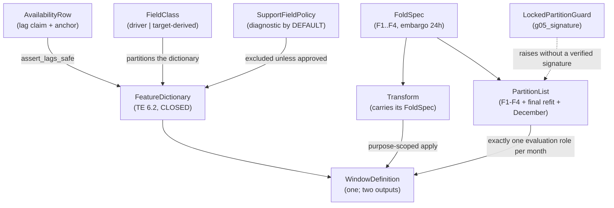

# Domain Entities — `features-and-splits`

**Unit** `features-and-splits` (Bolt 7) · **Kind** `library` · **Depends on**
`target-standardization`, `external-products`, `governance-guards`

> **Regenerated 2026-08-24, on a new stage attempt — and this unit's shapes did change.**
> Construction opened at 2026-08-24T11:46:26Z; both `foundation` passes of that day touch nothing
> this unit reads. The substantive change is this unit's own **NOT-READY** verdict after five
> adversarial iterations. **§ 5 gains the emitted artifact's recorded provenance fields** —
> `fold_id`, `purpose`, `transform_id` — refused at `06`/`07` (**FU-4 = D**), plus the
> **read-versus-emit** distinction that lets an `evaluate` call read the causal history the
> 24-hour window requires while emitting only the validation month (**FU-5 = D**), which keeps
> **1 December** in the G-06 locked test. **§ 10's `LeakageError` and `PartitionError` rows are
> both restated** (iteration-5 finding 5): the pure-containment formulation was an upper bound
> admitting the leaking direction, and the *"more than one partition"* reading fired on an
> ordinary 15 February row. Amendments owed re-derives to **8 across 5 units**. **BLK-04 is not
> closed**, and the verdict below predates all of it.

The data shapes this unit owns: the availability row that carries a feature's lag claim, the
closed feature dictionary, the **fold-owned transform** that BLK-04's contract turns from a
convention into a check, one window definition emitting two representations, the partition
list including the previously-omitted final refit, and the locked partition's execution
guard.

**Nothing here is a scientific value.** These shapes *carry* governed values — D-10.3's
lags, the frozen 24-hour window, the exact calendar folds — and record what may enter the ML
input space and what may not.

## Sources

- `../../../inception/units-generation/unit-of-work.md` § 7 — the `Owns` list, the boundary, the 11 requirements; **BLK-04** with its exit-condition ruling.
- `../../../inception/units-generation/unit-of-work-story-map.md` — Tables 1 and 2, § Per-unit coverage summary, § Cross-unit responsibilities, § Open verification gaps. **Derived by reading the rows:** 11 requirements, **1** unrowed; **12** rows as primary; **supports** TA-36.
- `../../../inception/requirements-analysis/requirements.md` — FR-P1-04-1, -2, -5, -6, -8, -10, -12, -13, -16; NFR-IRI-01; NFR-LEAK-01.
- `../../../inception/application-design/component-methods.md` — `src/features`' and `src/data/splits.py`'s boundary calls; § Depth.
- `../../../inception/application-design/services.md` § The nine stage scripts, § Stage entry contract.
- `../target-standardization/functional-design/domain-entities.md` — the D-17 `TargetRow` consumed here.
- `../external-products/functional-design/business-rules.md` — **R-56**, **R-57**, **R-58**.
- `../governance-guards/functional-design/business-rules.md` — **R-19** (the exactly-one-member exclusion shape), **R-23** and **R-24** (the two phase-boundary limbs). **Corrected 2026-08-23:** R-19 and R-24 are cited in this artifact’s body and were absent here; **R-25** (access-log ordering) and **R-28** (restricted root) were listed and drawn on nowhere, and are removed.
- `evidence/DECISIONS.md` — **D-10.3**, **D-11**, **D-13**.
- Workspace inspection, 2026-08-23: `tests/` holds three modules, none this unit's; `src/` and `configs/` absent.
- `functional-design-questions.md` (**Q1 through Q9**), `business-logic-model.md`, `business-rules.md`.

---

## Entity map



Text fallback: availability rows gate the feature dictionary through the lag assertion; the
dictionary is closed and partitioned by field class; folds produce fold-owned transforms that
are applied only under a declared purpose, which fixes the set of rows that transform may
touch; the partition list carries F1–F4, the final refit and December, and every 2022 month
carries exactly one evaluation role; support fields are excluded from the dictionary unless
approved; and the locked partition raises without a verified G-05 signature.

---

## 1. `AvailabilityRow` — a lag claim, and the anchor that makes it checkable

Approved fields: `feature`, `observation_timestamp`, `publication_timestamp`,
`release_status` (`real-time` | `provisional` | `final`), `safe_lag_hours`,
`actual_lag_hours`.

**`assert_lags_safe` raises** when `actual_lag_hours < safe_lag_hours`; when a driver's
`release_status` indicates a **backfilled final value** where the contemporaneous grade was
required; or when **`f107_81_trailing`'s window does not end at the safe-lagged day**.

**The lags** (D-10.3): Kp/ap3 **≥ 3 h**; Hp60/ap60 **≥ 1 h**; F10.7 at the **previous-day
observed** value with a **trailing** 81-day mean. **Dst is diagnostic/hindcast-only. SSN is
absent.**

> ## THE ANCHOR IS A THIRD LIMB, NOT A RESTATEMENT
>
> FR-P1-04-2 names the hole its own first two checks leave: *"a trailing 81-day mean **ending
> at day t** passes both the not-centered check and the lag assertion while including same-day
> F10.7."*
>
> | Limb | What it misses |
> |---|---|
> | `actual_lag ≥ safe_lag` | A mean whose window reaches into the lag |
> | Not-centered | A trailing window anchored one day too late |
> | **End date = the safe-lagged day** | A recorded anchor the values were not computed from |
>
> **So the mean is recomputed from the anchor and compared** — a recorded end date is a
> **claim**; the recomputation is the **check**.
>
> **Deliberate overlap with `external-products` R-57.** That property is strictly stronger,
> holding at every index. **This unit still checks here** because **WS-11 and TA-08 are this
> unit's rows** — and, the reason that survives, **the split is by property**: R-57's is a
> **series-level** property of the driver product, the anchor recomputation a **value-level**
> property of the mean built here. **Corrected twice, 2026-08-23** — from *"R-57's are
> `Pending`"* (R-57 is a rule; the rows it contributes to are these same two), then from
> *"depend on a module in another unit"*, which would equally forbid § 9's accepted delegation
> of the module-graph limb to `external-products` R-56.

## 2. `FeatureDictionary` — closed, and the window inside it is a constant

**Exactly the TE §6.2 dictionary.** FR-P1-04-12: *"no field outside that table, and no derived
tensor built from one, enters training or inference."*

**Window length is one frozen value per feature-set ID**, shared across all model families,
and the primary history window is **24 hours — a frozen constant, not a tuned
hyperparameter** (Vision §8.1). `experiment.yaml`'s window length **equals 24 and appears in
no grid**.

**Raw longitude is never a predictor.** Longitude enters **only** through `lst_sin` and
`lst_cos` (FR-P1-04-10).

**An unresolved station registry blocks `station_lat` and excludes `lst_sin`/`lst_cos`** —
consumed from `inventory-and-registry` R-45/R-46. **What provenance is sufficient is not
decided here.**

## 3. `FieldClass` — the partition that keeps two opposite rules apart

Every dictionary field is **exactly one** of **driver-derived** or **target-derived**.

| Rule | Scope | Behaviour |
|---|---|---|
| FR-P1-04-3 | **External drivers only** | Carry forward **≤ 3 h**, then **exclude the row** |
| FR-P1-04-13 | **`vtec_lag_*`** | **Carry-forward prohibited**; the **window is excluded** |

FR-P1-04-13: the ≤3 h allowance *"is scoped to external drivers only and **must never be read
as reaching `vtec_lag_*`**."*

**The class is a required argument** to the carry-forward path, and `vtec_lag_*` is
**rejected at that boundary** — the misreading made unrepresentable rather than merely
prohibited.

**And the two classes are asserted to partition the dictionary.** The class argument stops a
target lag entering the driver path; a field belonging to **neither** class, or to **both**,
escapes both rules without the partition assertion. The classification is owed to § 2's
closure anyway.

> **Unrepresentable-by-shape is not enough, and this unit has the proof.** § 4's approved
> interface was claimed to make a leak *"unrepresentable"* and does not. The rejection here
> is a **runtime check**, not a type.

**Target-derived detail** (FR-P1-04-13): `vtec_lag_1h/2h/3h/24h` are **strictly causal at
exact lags `[1,2,3,24]`**; `vtec_seq_24` is a 24-step causal sequence **excluded when
incomplete**; the pooled model carries `station_onehot_ARUC/BSHM/NICO` plus **verified**
`station_lat`.

**Every excluded window is counted**, not merely excluded — FR-P1-04-13 and FR-P1-04-5 both
say *"excluded **and counted**"*. A silent exclusion and a counted one are indistinguishable
at the artifact; the count is how a reviewer tells a working exclusion from one that never
fired.

## 4. `Transform` — fold-owned, because BLK-04's gap has two halves

**Approved signatures**, unchanged in shape:

```
fit_transforms(train: DataFrame, *, fold: FoldSpec) -> Transform
apply_transforms(frame: DataFrame, *, transform: Transform) -> DataFrame
```

> ## ⚠ THE APPROVED INTERFACE DOES NOT PREVENT WHAT IT CLAIMS TO
>
> `component-methods.md`: *"A single `fit_transform(all_data)` is unrepresentable in this
> interface, which is how NFR-LEAK-01 is enforced by shape rather than by review."*
>
> **It is not unrepresentable.** `train` is an **unconstrained DataFrame**, so
> `fit_transforms(all_data, fold=F1)` **type-checks**. BLK-04's own implementation note says
> the same: the split *"prevents the single-call convenience shape but not the underlying
> full-dataset fit."*
>
> **This leak has no downstream symptom.** A transform fitted on all data produces *better*
> validation numbers and raises nothing. **Four downstream units inherit it**, because *"every
> reported number inherits the fit."*

**What this stage adds (Q1 = D):**

| Element | Mechanism |
|---|---|
| **Allowed partitions** | The named fold's **training partition only** |
| **Fitting failure** | `LeakageError` when `train`'s index is **not a subset** of that partition |
| **Ownership of fitted state** | `Transform` **carries its `FoldSpec`** — resolved boundaries, not a bare `fold_id` string |
| **Applying failure** | `apply_transforms` takes a **required `purpose`** (`train` \| `evaluate`, no default) and raises `LeakageError` when the frame leaves the set that `purpose` permits **for that transform's own fold** — its training partition for `train`, **exactly its validation month** for `evaluate` — or when the frame is **empty** |

> **⚠ Read this table with its condition.** These four elements are **complete and executable
> for F1–F4**; for the **final refit** they are **conditional** on § 6's open shape question
> (`fit_transforms` takes a `FoldSpec`; the refit is not one). **G-06 depends on it.** The four
> downstream units that cite this contract by name inherit the condition too.

**Why the fourth element is not optional.** The second stops a transform being **fitted** on
the wrong rows. Nothing in it stops one correctly fitted on F1 being **applied** to F3's
validation month — **the same leakage arriving by a different route**. The register names
*"ownership of the fitted state"* as a required element, and this is what that means
operationally.

> ## ⚠ ELEMENT 4 — MECHANISM CORRECTED TWICE, 2026-08-23
>
> **First text, superseded:** *"`apply_transforms` **refuses** a transform whose fold does not
> match the frame's partition."* — a **claim, not a check**: the signature carries no fold or
> partition parameter and `frame` carries no partition tag.
>
> **Second text, also superseded:** *"derives each row's partition from its record
> timestamps…"* — **it derives a label that does not exist, and it blocks two lawful paths.**
> Both found by adversarial passes, **inside the remedy for the leak with no downstream
> symptom**.
>
> **Why per-row derivation is impossible.** The training ranges **nest**: Jan–Mar ⊂ Jan–Jun ⊂
> Jan–Sep ⊂ Jan–Oct ⊂ Jan–Nov. A **15 February** row lies in **five** of the § 6 list's six
> entries, so *"this row's partition"* is **not single-valued**. The check never needed a
> label — it needed containment in a **named** scope.
>
> **Third text, also superseded — and this one cost an amendment.** It accepted, per fold,
> *"that fold's training range, 24-h embargo and validation month"*. Those sets are **strictly
> nested prefixes** (F1 to 30 Apr ⊂ F2 to 31 Jul ⊂ F3 to 31 Oct ⊂ F4 to 30 Nov ⊂ refit to 31
> Dec), so the rule was an **upper bound, not a leakage check**: **F4's** transform applied to
> **April** passed, and F4's fit saw April. Leakage here is a property of **what the call is
> for**, which no row-level rule can see.
>
> **The amendment, approved by the owner 2026-08-23.**
> `apply_transforms(frame, *, transform, purpose: ApplyPurpose)` — `purpose` **required, no
> default**. `train` accepts that fold's **training partition** (embargo excluded and
> counted); `evaluate` accepts **exactly its validation month** — December for the refit,
> through § 7's guard. `Transform` carrying its `FoldSpec` is free (unspecified, intra-package);
> **`purpose` is a cross-package boundary amendment, the sixth this stage owes.**
>
> **December is routed, not excluded** — applying the refit transform to December **is** the
> G-06 path, held by § 7's `LockedPartitionGuard` against a verified `g05_signature`. **The refit's
> fit side is the same open decision** as § 6's *"the final refit is not a `FoldSpec`"*, and
> both go to the gate together.
>
> **`assert_membership_from_timestamps` is cited for what it does** — `(frame) -> None`,
> validating a row against the partition it is **filed under**. It derives nothing.
>
> **Which representation.** Transforms apply to the **timestamped frame**; both
> representations are built from a frame that has already passed. The `NDArray` tensor carries
> no timestamps and is never transformed directly.

**Stated once, consumed by name.** BLK-04 calls it a *"governed cross-unit contract"*. The
four downstream units **cite** it; they do not restate it. A restated contract in four places
drifts — this stage has corrected four counts that drifted between restatements.

> **BLK-04 remains open. Approving this design is not the contract's approval.** *"No
> affected unit may complete or exit 3.1 without its approved contract"*, and *"no
> implementation may proceed"* while it stands. NFR-LEAK-01's evidence is owed to the
> **Supervisor at G-04 and G-05**.

## 5. `WindowDefinition` — one definition, two representations

`windows.py` emits **both** the flattened matrix and the sequence tensor for a feature-set
ID, which is what makes FR-P1-04-8's parity *"structural rather than asserted"*.

**Ordering against § 4, and the amendment it costs** (added 2026-08-23, corrected the same
day). The `NDArray` carries no record timestamps, so § 4's element 4 cannot reach it, and the
fit/apply leak would survive on the representation M-06 consumes. The first remedy —
*"both representations are built from a frame that has already passed"* — was **unexecutable**:
`build_features` emits both in **one call taking no `Transform`**, and the transform is fitted
on the features that call produces. **Resolution:** `build_features` gains
`transform: Transform | None = None` **and** `purpose: ApplyPurpose | None = None` — they
travel together, supplying one without the other raises — applied to the feature frame
**before** windowing so both representations inherit it from one definition. **`purpose` was
missing from the first statement of this** (corrected 2026-08-23): without it the tensor path
either bypassed § 4's element 4 or had no determinable accepted set. **The seventh owed
amendment**, one function.

**The emitted artifact's recorded provenance fields** *(added 2026-08-24, FU-4 = D;
iteration-5 finding 1)*. Every **emitted** `WindowDefinition` output — both the flattened
matrix and the sequence tensor — carries three recorded fields:

| Field | Type | Meaning |
|---|---|---|
| `fold_id` | `str` | The fold whose transform was applied — `"F1"`…`"F4"`, or the final refit's identifier once R-80's shape question resolves |
| `purpose` | `ApplyPurpose` | `train` or `evaluate`. Never `None` on an emitted artifact: a `purpose=None` call is the **fitting call**, and its outputs are a fitting input only, never emitted |
| `transform_id` | `str` | The fitted `Transform`'s identity, so the pairing names *which* transform, not only which fold |

**Why they exist as fields rather than as a call-site invariant.** `services.md` § The nine
stage scripts puts `apply_transforms` in `05_build_features_and_splits.py` and every scoring
site in `06_train_and_predict.py` / `07_evaluate_and_report.py`, which read their frames from
**artifacts**. A predicate about the call that produced a frame is unobservable at a consumer
that obtained it from a file, so the pairing becomes a property of the artifact. `06` and `07`
**refuse** a frame whose stamp is not `(fold k, evaluate)` when scoring fold *k*'s validation
month, and `tests/test_train_only_transforms.py` — declared **manifest-based** — asserts that
refusal. An **unstamped** frame reaching either consumer **fails**; that unstamped or
hand-assembled frame is the honest residual.

**These are additional to the project-wide `phase_id`, `source_id` and `target_definition_id`
stamps**, which the mandated rule requires on every dataset, prediction, mask and comparison,
and they do not replace them. **The eighth owed amendment**, reaching a fifth unit — the two
consuming scripts, whose own design has not run.

**Rows emitted versus rows read** *(FU-5 = D)*. A `purpose="evaluate"` call may **read** fold
*k*'s validation month **plus the causal history the frozen 24-hour window requires** — the
preceding day's rows, which are lawful inputs at the forecast origin — and may **emit only**
rows inside the validation month. Element 4 tests the **assembled pre-window frame**. Control:
emitted rows exceeding the validation month → **fails**. This is what keeps the **G-06**
locked-test prediction covering the **full** December with no first-day loss.

> **WS-13's evidence departs from TE §16, and no reading is adopted.** TE §16 names
> `test_common_masks.py`, owned by **`evaluation-and-comparison`**; the story map substitutes
> *"matched-window parity assertion over one `windows.py` definition"* and records that *"no
> reading is adopted here."* **This stage adopts none either** and carries the departure to
> the gate.
>
> **The question is narrower than it looks:** **TA-11's evidence column already names
> `test_common_masks.py`**, and TA-11 is **this unit's row** — so the mask test runs here
> whichever way WS-13 resolves. What is open is which row cites it.

## 6. `PartitionList` — five partitions plus the locked month, and the fifth partition was missing

| Partition | Range |
|---|---|
| **F1** | Jan–Mar, validation Apr |
| **F2** | Jan–Jun, validation Jul |
| **F3** | Jan–Sep, validation Oct |
| **F4** | Jan–Oct, validation Nov |
| **Final refit** | **1 Jan – 30 Nov** |
| **December** | **Locked** |

Each fold carries a **24-hour embargo**; the first 24 h are **excluded and counted**. **No
random or shuffled cross-validation.**

**November enters the final refit only after all features, hyperparameters, masks, seeds,
thresholds and analysis rules are frozen** — **six** named artifacts, and the entry's
substance is that precondition rather than the date range. **Each is asserted with a
timestamp preceding the refit**, the same evidence class used at `inventory-and-registry`
R-52 and `external-products` R-59/R-60.

**Why the fifth partition matters**, in FR-P1-04-5's own words: its omission *"left Vision
§8.1's rule that **each target timestamp belongs to exactly one partition** with no list to
check November against."*

**The rule is asserted over the list's disjoint reading** — each month's **evaluation role**:
Apr (F1), Jul (F2), Oct (F3), Nov (F4), December (**locked**), training-only for the rest. It
catches both an **overlap** and a **gap**, and it is the check the corrected list was added to
make possible.

> **⚠ It cannot run over the training ranges, corrected 2026-08-23.** This read *"asserted over
> the complete list — F1–F4, the final refit, December"*. Those ranges are an **expanding
> window** and **nest** (Jan–Mar ⊂ Jan–Jun ⊂ Jan–Sep ⊂ Jan–Oct ⊂ Jan–Nov), so a **15 February**
> row belongs to **five** of the six entries and the assertion would **fail on ordinary 2022
> data**. **Reading a frozen Vision §8.1 rule is not this stage's call** — the evaluation-role
> reading is adopted so the check can run, and **raised at the gate**. If §8.1 is meant
> literally over the training ranges it is unsatisfiable as written, which is a defect in the
> governing document rather than in this design.

**Count, derived by reading the table above: six rows** — **five partitions** (F1–F4, the
final refit) plus the **locked month**, which is a partition of the calendar but never a
fitting scope. FR-P1-04-5's *"all five partitions"* and the six-row table are both right.

> **Open shape decision, stated not assumed: the final refit is not a `FoldSpec`.**
> `FoldSpec` carries `validation_month`; the final refit has none. How it is represented
> alongside the four folds is raised at the gate — **together with § 4's element 4**, since
> `fit_transforms` takes a `FoldSpec` and the refit's transform has no fitting path until this
> is settled. **One decision, not two.**

**Membership derives from record timestamps.** `assert_membership_from_timestamps` raises on
any row whose month or year disagrees with its partition — the defect that filed locked-month
records into `audit_evidence_2022-01/`.

## 7. `LockedPartitionGuard` — the execution limb, and why it is separate

`materialise_locked_partition(snapshot, *, g05_signature)` materialises December **only** when
the signature is **present and verifies**. **Raises `LockedTestError`** otherwise — the
pre-G-05 execution block **WS-18** evidences.

> **Two guards, deliberately separate (ADR-03).** A **read** for the required pre-G-05
> coverage audit does **not** come through here; it comes through `governance-guards`'
> `locked_test.open_restricted`. The coverage audit is a **required read**; the metrics run is
> **barred until after G-05**.
>
> **`tests/test_locked_test_guard.py` is owned here** because it exercises **both** limbs and
> this unit already depends on `governance-guards`; assigning it there would **close a
> cycle**. `governance-guards` supports WS-18 and TA-18.

## 8. `SupportFieldPolicy` — diagnostic by default, and the default is the mechanism

**Four rules** (FR-P1-04-16):

| # | Rule | How it is enforced |
|---|---|---|
| 1 | **Diagnostic by default** | **Implemented as the default**: excluded from the feature set **unless an approval ID is present** |
| 2 | Readable over **hours ≤ t** only | Asserted; a read at or beyond hour *t* **fails** |
| 3 | Model use requires **G-04 approval recorded before the feature-set freeze** | The approval's **timestamp must precede the freeze** |
| 4 | **Target-hour quality fields permanently forbidden** as features | Asserted separately |

**Why rule 1 is a default rather than a rule.** The failure mode is a support field drifting
into the feature set **by inclusion rather than by decision**. A default-exclude makes that
**impossible** instead of detectable — and it makes rule 3's approval **the only entry
path**.

**Why rule 3's ordering is asserted.** A presence check passes an approval recorded
**afterwards**, which is exactly what *"recorded before"* exists to prevent.

**Four rules, four separate failures.** TA-35's criterion names two explicitly. Several
obligations behind one check is the FR-P1-02-8 failure.

## 9. `ImportAllowlist` consumption — two properties, two owners

| Limb | Question | Owner |
|---|---|---|
| **Data flow** | Did an `iri_*` value reach the ML feature path? | **This unit** — `test_iri_denial.py`, which **must fail on deliberate injection** |
| **Module graph** | Can a module reach `iri.py` at all? | **`external-products` R-56** — transitive static reachability |

`governance-guards` R-23/R-24 draw the same line. Splitting **by property** puts each check
where it can be run.

**The allowlist is not a denylist.** TE §12: *"imported only by
`scripts/04_build_external_products.py` and `src/evaluation/`"* — so an import from
`src/data/`, `src/gnss/`, a training script or a notebook violates it **exactly as** one from
`src/features/` or `src/models/` does.

**So the permitted-importer set is asserted to have exactly those two members.** A check that
only forbids `src/features` and `src/models` **passes a notebook import** — the same
one-member-exclusion shape `governance-guards` R-19 uses.

**IRI and GIM join only at evaluation time**, onto the **already-frozen comparison-wide
mask**.

## 10. `IntegrityError` subclasses raised here

| Exception | Raised when |
|---|---|
| `LeakageError` | `actual_lag < safe_lag`; a backfilled final value where the contemporaneous grade was required; `f107_81_trailing`'s window not ending at the safe-lagged day, or its recomputed mean disagreeing; a field outside the §6.2 dictionary; a carried-forward `vtec_lag_*`; an incomplete `vtec_seq_24` not excluded; a support field used without a recorded G-04 approval, or read at/beyond hour *t*; a target-hour quality field; a raw-longitude column; a driver carried forward beyond 3 h; **`train`'s index not a subset of the fold's training partition**; **a frame leaving the set the declared `purpose` permits for that transform's fold**, or an **empty or timestamp-less** frame reaching `apply_transforms`; **emitted rows exceeding the validation month under `purpose="evaluate"`** *(the readable set includes the causal history the 24-hour window needs; the emittable set does not — § 5)* |
| `AlignmentError` | A driver value **repeated outside its own defined interval** (Kp/ap3 beyond its 3-hour interval); one **shifted to a neighbouring hour** (Dst off its own hourly averaging interval). **Added 2026-08-23** — FR-P1-04-17's raises, which this table omitted while the artifacts wrongly assigned TA-36 to `external-products`. R-58's **third** limb (no interpolation) is a **static source check, not a raise**, and appears in no row here for that reason; see `business-rules.md` R-76a |
| `LockedTestError` | `g05_signature` is absent or fails verification |
| `PartitionError` | A 2022 month carrying **two evaluation roles or none**; a row's month or year disagrees with its partition; a freeze precondition's timestamp does not precede the final refit |
| | *(Both rows corrected 2026-08-24, iteration-5 finding 5.* `LeakageError` **previously read** *"any row's timestamp outside the transform's own carried scope"* — the **pure-containment** formulation § 4's own boxes show is an upper bound admitting the leaking direction, and which left the purpose-scoped set element 4 defines out of the row entirely. `PartitionError` **previously read** *"belongs to zero or to more than one **partition**"* — the reading § 6's own box says would *"fail on ordinary 2022 data"*, since every Jan–Nov timestamp lies in two or more nested training ranges, so as written it fired on an ordinary 15 February row and contradicted R-80's *"control that must not fire"*. **This section is where an implementer reads raise conditions**, which is why both were the rows most likely to be built from.*) |
| `ImportBoundaryError` | Raised **through** `external-products` R-56's scan; and here when the permitted-importer set does not have exactly its two members |

Catching `foundation`'s base is what lets the stage entry contract write the `aborted`
registry row for any of them.

---

## Requirement coverage

Acceptance derived from story-map Table 1; owners from Table 2's `primary` cell.

| Requirement | Entities | Tested by (Table 1) | Row primary owner |
|---|---|---|---|
| FR-P1-04-1 | § 9 | WS-10, TA-07 | **`features-and-splits`** |
| FR-P1-04-2 | § 1 | WS-11, TA-08 | **`features-and-splits`** |
| FR-P1-04-5 | § 6 | WS-12, TA-11 | **`features-and-splits`** |
| FR-P1-04-6 | § 4 | TA-11 | **`features-and-splits`** |
| FR-P1-04-8 | § 5 | WS-13, TA-11 | **`features-and-splits`** |
| **FR-P1-04-10** | § 2 | ⚠ **NO ROW** | — |
| FR-P1-04-12 | § 2 | **TA-33** — ⚠ **`Pending`** | **`features-and-splits`** |
| FR-P1-04-13 | § 3 | **TA-34** — ⚠ **`Pending`** | **`features-and-splits`** |
| FR-P1-04-16 | § 8 | **TA-35** — ⚠ **`Pending`** | **`features-and-splits`** |
| NFR-IRI-01 | § 9 | WS-10, TA-07 | **`features-and-splits`** |
| NFR-LEAK-01 | § 1, § 4 | WS-11, TA-08, TA-11 | **`features-and-splits`** |

**11 requirements, 1 without an acceptance row.** **Owns 12 rows as primary**; **supports**
TA-36.

> ## FOUR ROWS EXIST AND NONE HAS RUN
>
> **TA-33, TA-34, TA-35** (owned) and **TA-36** (story-map primary `external-products`, but its
> **enforcement raise and primary test are this unit's** — § 10's `AlignmentError` row and
> `business-rules.md` R-76a) are all **`Pending`** — *"the row exists, no test module is
> implemented, none has been executed, and none has passed."* **Corrected 2026-08-23** from
> "(supported)", which understated what this unit builds.
>
> They cover this unit's **leakage-sensitive controls**. **No artifact, manifest or report may
> state or imply that FR-P1-04-12, -13 or -16 is covered, satisfied or verified.**

> **§ 7's "five forbidden edges with no row" is superseded.** Derived: TA-33 covers dictionary
> closure; TA-34 covers **both** the `vtec_lag_*` carry-forward prohibition **and** the
> target-lag contract, which are one requirement; TA-35 covers the support-field rules; TA-36
> covers driver-interval repetition — story-map **primary `external-products`**, but its
> **enforcement raise and primary negative-path test are this unit's** (`business-rules.md`
> R-76a). **Corrected 2026-08-23** from *"is `external-products`' row"*, missed by the first
> TA-36 sweep because it states the superseded claim in different words. **Remainder:
> FR-P1-04-10 alone.**

## Assumptions & Open Questions

- **[assumption]** Rule IDs continue the single sequence, so `business-rules.md` opens at **R-74**. If per-unit numbering was intended, say so at the gate.
- **[assumption]** The **story map governs** where it and `unit-of-work.md` § 7 disagree. See `business-logic-model.md` § The `unit-of-work.md` sweep — **ten of twelve sections agree**, and the two that do not are exactly the two `CR-2026-08-22-LEAKAGE-TA` touched.
- **[assumption]** `src/features/*` and `src/data/splits.py` shapes beyond the named boundary calls are **intra-package** and this stage's to specify — **still true, and still owes nothing** (`Transform`'s internals and `ApplyPurpose`'s definition included). But **three boundary changes are owed** — `apply_transforms` gains a required `purpose`; `build_features` gains `transform` **and** `purpose`, which travel together; and every emitted feature artifact gains the `fold_id`/`purpose`/`transform_id` stamp refused at `06`/`07` — so the running total is **8 across 5 units**, derived in `business-logic-model.md` § Amendments owed. **Corrected 2026-08-23** from *"no amendment owed; the total stays five across three units"*, and **again 2026-08-24**: the entry named one parameter on `build_features` where the amendment adds **two**, and FU-4 = D then added the stamp.
- **[assumption]** `tests/test_locked_test_guard.py` is this unit's, per § 7.
- **Open — BLK-04 is an EXIT condition** on this unit and four downstream units. **Approving this design is not the contract's approval.**
- **Open — TA-33/34/35/36 all `Pending`.**
- **Open — `unit-of-work.md` §§ 6 and 7 stale on coverage figures; § 5 on a module count.** Reported at the gate for one annotate-in-place decision, **not edited**.
- **Open — WS-13's departure from TE §16**, no reading adopted.
- **Open — the final refit is not a `FoldSpec`** (§ 6). Representation stated at the gate.
- **Open — FR-P1-04-10 has no acceptance row.**
- **Open — an unresolved station registry blocks `station_lat` and `lst_sin`/`lst_cos`.** Consumed, not decided here.
- **G-09 is not signed**, and **BLK-04 independently bars implementation.**
- **None** of the above adopts a reading on a supervisor-owned value, and none decides a scientific constant.

---

> **Re-saved 2026-08-24 under the post-redo receipt floor.** The project decision owner
> authorised a redo jump on `functional-design` at 2026-08-24T14:57:07Z so that three
> standing reviewer findings on `models-and-baselines` could be fixed and re-reviewed;
> a redo resets the receipt floor for **every** unit of the stage. **No content of this unit
> changed** — not a question, answer, amendment, rule, entity, workflow, count or scientific
> value. The only artifacts edited after the redo were `models-and-baselines`'s, whose
> three fixes are confined to its own files. That unit returned **READY** on the second pass of
> the restored budget, which is what the redo was authorised for. The two residuals riding that
> verdict — R-96's `PartitionError` mechanism and R-95's field label — are carried to the stage
> gate rather than applied. One of them turns on **this unit's** `PartitionList` being a closed
> six-row set, which the reviewer verified directly and upheld.
