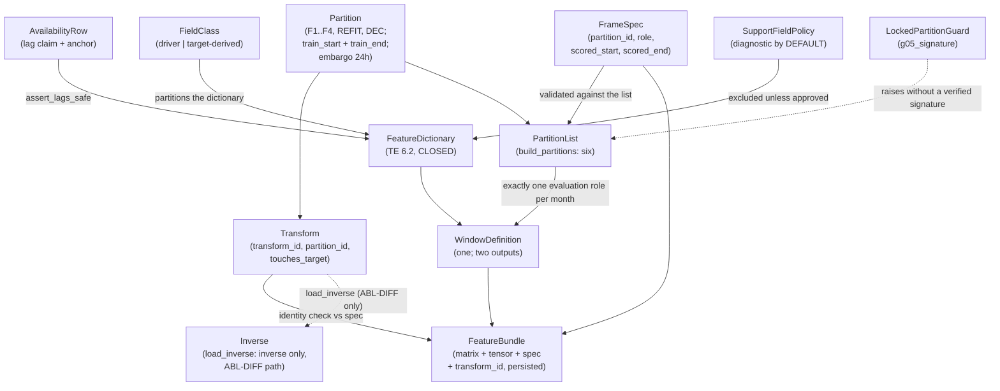

# Domain Entities — `features-and-splits`

**Unit** `features-and-splits` (Bolt 7) · **Kind** `library` · **Depends on**
`target-standardization`, `external-products`, `governance-guards`

> **Regenerated 2026-08-24, on a new stage attempt — and this unit's shapes did change.**
> Construction opened at 2026-08-24T11:46:26Z; both `foundation` passes of that day touch nothing
> this unit reads. The substantive change is this unit's own **NOT-READY** verdict after five
> adversarial iterations. **§ 5 gains the emitted artifact's recorded provenance fields** —
> `fold_id`, `purpose`, `transform_id` — refused at `06`/`07` (**FU-4 = D**), plus the
> **read-versus-emit** distinction that lets an `evaluate` call read the causal history the
> 24-hour window requires while emitting only the validation month (**FU-5 = D**), which keeps
> **1 December** in the G-06 locked test. **§ 10's `LeakageError` and `PartitionError` rows are
> both restated** (iteration-5 finding 5): the pure-containment formulation was an upper bound
> admitting the leaking direction, and the *"more than one partition"* reading fired on an
> ordinary 15 February row. Amendments owed re-derives to **8 across 5 units**. **BLK-04 is not
> closed**, and the verdict below predates all of it.

> ## ⚠ REBUILT 2026-08-26 ON THE ADR-11 CONTRACT — OWNER RULING
>
> The fourteenth-receipt review (preserved at the end of `business-logic-model.md`) found this
> file's shapes targeting an interface `component-methods.md` retired on **2026-08-23**:
> **ADR-11** removed `apply_transforms`, replaced `FoldSpec`/`build_folds` with
> **`Partition`**/`build_partitions`, returned a single **`FeatureBundle`** (matrix + tensor +
> `spec` + `transform_id`, one persisted object), and made the leak check an **identity
> comparison** with one enumerated exception (`REFIT` → `DEC` under `role="score"`, the G-06
> apply). On the owner's authorization the entity sections are rebuilt on that contract —
> **section numbering and subject matter unchanged** (the coverage table and
> `models-and-baselines`' citations rely on them). **Every dated ⚠ box below is preserved as
> history of the retired lineage, not as contract.** § 4's *"Which representation"* paragraph —
> iteration-5 finding 6's regression site — now carries the ADR-11 order with the superseded
> sentence quoted. Amendments owed re-derives to **5 across 3 units** (this unit owes none);
> see `business-rules.md` § Amendments owed for the gate-raise on `models-and-baselines`'
> frozen "8 across 5". **BLK-04 remains an open exit condition; G-09 remains unsigned.**

> ## ⚠ REMEDIATED 2026-08-28 ON GOVERNANCE REPORT `GOV-2026-08-28-FD-01` — OWNER RULINGS
>
> Verdict **FAIL**. Five rulings reach this unit, each applied with a dated note citing its
> Recommendation number, and **section numbering and subject matter are unchanged** (the
> coverage table and `models-and-baselines`' citations rely on them).
>
> - **Recommendation 4** (Critical, two seats independently) — **`Partition` gains
>   `train_start: date`**, sourced from `configs/data.yaml`; § 4 reads **both** bounds from the
>   `Partition`; § 6's table carries both; **BLK-09's status paragraph is restored** after
>   having been de-labelled (derived before the fix: `BLK-09` = 0, `train_start` = 0,
>   `BLK-08` = 0, `inverse` = 0 across all four files). The contract is `business-rules.md`
>   **R-83**.
> - **Recommendation 25** (High) — § 6's table specifies **`train_end` for all six
>   partitions**, with **`DEC.train_end = 2022-11-30`**; the ADR-11 carve-out is retained for
>   interface clarity rather than necessity; § 10 enumerates the **30** raising conditions.
> - **Recommendation 7, narrowed to `ABL-DIFF` on D-27** (High) — § 4 states explicitly that
>   **the primary path needs no inverse transform**, and BLK-08 half B is authored as
>   `business-rules.md` **R-84** (`load_inverse` / `Inverse`, not `load_transform` /
>   `Transform`).
> - **Recommendation 6 / D-28** (Critical) — the FU-5 December item is **closed**; superseded
>   FU-5 = D wording stays as the dated history it already is.
> - **Recommendation 8** (High) — **§ 10 is reconciled with the discriminating rule**:
>   `PartitionError` for a **declared-identity disagreement**, `LeakageError` where the
>   disagreement implies **information flow**. `PartitionError` is `foundation` R-01's
>   **fifteenth**.
>
> **BLK-04, BLK-08 and BLK-09 all remain open exit conditions, and G-09 remains unsigned.
> Nothing here authorises implementation or the creation of a module.**

The data shapes this unit owns: the availability row that carries a feature's lag claim, the
closed feature dictionary, the **partition-owned transform** that BLK-04's contract turns from
a convention into a check, one window definition emitting two representations inside one
`FeatureBundle`, the partition list including the previously-omitted final refit, and the
locked partition's execution guard.

**Nothing here is a scientific value.** These shapes *carry* governed values — D-10.3's
lags, the frozen 24-hour window, the exact calendar folds — and record what may enter the ML
input space and what may not.

## Sources

- `../../../inception/units-generation/unit-of-work.md` § 7 — the `Owns` list, the boundary, the 11 requirements; **BLK-04** with its exit-condition ruling.
- `../../../inception/units-generation/unit-of-work-story-map.md` — Tables 1 and 2, § Per-unit coverage summary, § Cross-unit responsibilities, § Open verification gaps. **Derived by reading the rows:** 11 requirements, **1** unrowed; **12** rows as primary; **supports** TA-36.
- `../../../inception/requirements-analysis/requirements.md` — FR-P1-04-1, -2, -5, -6, -8, -10, -12, -13, -16; NFR-IRI-01; NFR-LEAK-01.
- `../../../inception/application-design/component-methods.md` — `src/features`' boundary calls **as redesigned 2026-08-23 (ADR-11)**: `FrameSpec`, `Transform`, `FeatureBundle`, `build_features(...) -> FeatureBundle`, `fit_transforms(bundle, *, partition)`, the identity-based leak check with its one enumerated `REFIT`→`DEC` exception, the `lead_in_hours` removal; `src/data/splits.py`'s `Partition`/`build_partitions`; § Depth. *(Sources line rewritten 2026-08-26 — the prior line cited this file without naming the redesign.)*
- `../../../inception/application-design/services.md` § The nine stage scripts (`05` writes **`FeatureBundle`s**; M9 bundle addressing; M13 three-constructions cost), § Stage entry contract.
- `../target-standardization/functional-design/domain-entities.md` — the D-17 `TargetRow` consumed here.
- `../external-products/functional-design/business-rules.md` — **R-56**, **R-57**, **R-58**.
- `../governance-guards/functional-design/business-rules.md` — **R-19** (the exactly-one-member exclusion shape), **R-23** and **R-24** (the two phase-boundary limbs). **Corrected 2026-08-23:** R-19 and R-24 are cited in this artifact’s body and were absent here; **R-25** (access-log ordering) and **R-28** (restricted root) were listed and drawn on nowhere, and are removed.
- `evidence/DECISIONS.md` — **D-10.3**, **D-11**, **D-13**; **D-27** (the primary target is not transformed) and **D-28** (the G-06 scored set is 2–31 December 2022, 30 days). *(Added 2026-08-28 per Recommendations 7 and 6.)*
- `governance/reviews/GOV-2026-08-28-FD-01.md` — the full-board stage-3.1 review, verdict **FAIL**; Recommendations **4**, **6**, **7**, **8** and **25**. *(Added 2026-08-28.)*
- `../evaluation-and-comparison/functional-design/business-rules.md` — **R-103** (the BLK-08 joint contract) and **R-104**. *(Added 2026-08-28 per Recommendation 7.)*
- `../../../inception/application-design/component-dependency.md` — § Dependency matrix: `src/evaluation` → `src/features` is **`—`**, and `src/features` → `src/models` is **`—`** in both directions. *(Added 2026-08-28; both facts are load-bearing for § 10's exception routing and for R-84's edge.)*
- Workspace inspection, 2026-08-23: `tests/` holds three modules, none this unit's; `src/` and `configs/` absent.
- `functional-design-questions.md` (**Q1 through Q9**, and **FU-7**), `business-logic-model.md`, `business-rules.md`.

---

## Entity map



Text fallback *(rebuilt 2026-08-26 on ADR-11; extended 2026-08-28 per Recommendations 4 and
7)*: availability rows gate the feature dictionary
through the lag assertion; the dictionary is closed and partitioned by field class; partitions
carry **both bounds of their training range** (`train_start` and `train_end`, from
`configs/data.yaml`) and produce partition-owned transforms carrying their identity **and a
machine-readable target-touching declaration**; a frame spec declares the
partition, the role and the scored range and is validated against the partition list; the one
window definition emits both representations into a feature bundle that persists the spec and
the transform identity with the data, and the bundle is constructible only when the
transform's partition id equals the spec's — the single enumerated exception being the refit
transform scoring December, the G-06 apply; the partition list carries F1–F4, the final refit
and December, and every 2022 month has exactly one evaluation role; support fields are
excluded from the dictionary unless approved; the locked partition raises without a
verified G-05 signature; and a fitted transform is reachable for inversion **only** as an
apply-less `Inverse` obtained through `load_inverse`, on the `ABL-DIFF` path alone — the
primary path is natively in TECU and needs no inverse (D-27).

---

## 1. `AvailabilityRow` — a lag claim, and the anchor that makes it checkable

Approved fields: `feature`, `observation_timestamp`, `publication_timestamp`,
`release_status` (`real-time` | `provisional` | `final`), `safe_lag_hours`,
`actual_lag_hours`.

**`assert_lags_safe` raises** when `actual_lag_hours < safe_lag_hours`; when a driver's
`release_status` indicates a **backfilled final value** where the contemporaneous grade was
required; or when **`f107_81_trailing`'s window does not end at the safe-lagged day**.

**The lags** (D-10.3): Kp/ap3 **≥ 3 h**; Hp60/ap60 **≥ 1 h**; F10.7 at the **previous-day
observed** value with a **trailing** 81-day mean. **Dst is diagnostic/hindcast-only. SSN is
absent.**

> ## THE ANCHOR IS A THIRD LIMB, NOT A RESTATEMENT
>
> FR-P1-04-2 names the hole its own first two checks leave: *"a trailing 81-day mean **ending
> at day t** passes both the not-centered check and the lag assertion while including same-day
> F10.7."*
>
> | Limb | What it misses |
> |---|---|
> | `actual_lag ≥ safe_lag` | A mean whose window reaches into the lag |
> | Not-centered | A trailing window anchored one day too late |
> | **End date = the safe-lagged day** | A recorded anchor the values were not computed from |
>
> **So the mean is recomputed from the anchor and compared** — a recorded end date is a
> **claim**; the recomputation is the **check**.
>
> **Deliberate overlap with `external-products` R-57.** That property is strictly stronger,
> holding at every index. **This unit still checks here** because **WS-11 and TA-08 are this
> unit's rows** — and, the reason that survives, **the split is by property**: R-57's is a
> **series-level** property of the driver product, the anchor recomputation a **value-level**
> property of the mean built here. **Corrected twice, 2026-08-23** — from *"R-57's are
> `Pending`"* (R-57 is a rule; the rows it contributes to are these same two), then from
> *"depend on a module in another unit"*, which would equally forbid § 9's accepted delegation
> of the module-graph limb to `external-products` R-56.

## 2. `FeatureDictionary` — closed, and the window inside it is a constant

**Exactly the TE §6.2 dictionary.** FR-P1-04-12: *"no field outside that table, and no derived
tensor built from one, enters training or inference."*

**Window length is one frozen value per feature-set ID**, shared across all model families,
and the primary history window is **24 hours — a frozen constant, not a tuned
hyperparameter** (Vision §8.1). `experiment.yaml`'s window length **equals 24 and appears in
no grid**.

**Raw longitude is never a predictor.** Longitude enters **only** through `lst_sin` and
`lst_cos` (FR-P1-04-10).

**An unresolved station registry blocks `station_lat` and excludes `lst_sin`/`lst_cos`** —
consumed from `inventory-and-registry` R-45/R-46. **What provenance is sufficient is not
decided here.**

## 3. `FieldClass` — the partition that keeps two opposite rules apart

Every dictionary field is **exactly one** of **driver-derived** or **target-derived**.

| Rule | Scope | Behaviour |
|---|---|---|
| FR-P1-04-3 | **External drivers only** | Carry forward **≤ 3 h**, then **exclude the row** |
| FR-P1-04-13 | **`vtec_lag_*`** | **Carry-forward prohibited**; the **window is excluded** |

FR-P1-04-13: the ≤3 h allowance *"is scoped to external drivers only and **must never be read
as reaching `vtec_lag_*`**."*

**The class is a required argument** to the carry-forward path, and `vtec_lag_*` is
**rejected at that boundary** — the misreading made unrepresentable rather than merely
prohibited.

**And the two classes are asserted to partition the dictionary.** The class argument stops a
target lag entering the driver path; a field belonging to **neither** class, or to **both**,
escapes both rules without the partition assertion. The classification is owed to § 2's
closure anyway.

> **Unrepresentable-by-shape is not enough, and this unit has the proof.** § 4's approved
> interface was claimed to make a leak *"unrepresentable"* and does not. The rejection here
> is a **runtime check**, not a type.

**Target-derived detail** (FR-P1-04-13): `vtec_lag_1h/2h/3h/24h` are **strictly causal at
exact lags `[1,2,3,24]`**; `vtec_seq_24` is a 24-step causal sequence **excluded when
incomplete**; the pooled model carries `station_onehot_ARUC/BSHM/NICO` plus **verified**
`station_lat`.

**Every excluded window is counted**, not merely excluded — FR-P1-04-13 and FR-P1-04-5 both
say *"excluded **and counted**"*. A silent exclusion and a counted one are indistinguishable
at the artifact; the count is how a reviewer tells a working exclusion from one that never
fired.

## 4. `Transform` — partition-owned, because BLK-04's gap has two halves

**Approved shapes (ADR-11, 2026-08-23; rebuilt into this file 2026-08-26)** — the superseded
signatures this section previously opened with (`fit_transforms(train: DataFrame, *, fold)`,
`apply_transforms(frame, *, transform)`) are preserved in the historical boxes below:

```
@dataclass(frozen=True) Transform:      transform_id: str; partition_id: str
                                        touches_target: bool     # ADDED 2026-08-28 (R-84)
                                        # fitted state intra-package
fit_transforms(bundle: FeatureBundle, *, partition: Partition) -> Transform
# apply_transforms is REMOVED — transforms are applied ONLY inside build_features
load_inverse(transform_id: str) -> Inverse            # ADDED 2026-08-28 (R-84)
@dataclass(frozen=True) Inverse:        inverse(frame: DataFrame) -> DataFrame
                                        # EXACTLY one public method — no apply
```

**The three lines marked `ADDED 2026-08-28` are NOT yet approved.** `touches_target`,
`load_inverse` and `Inverse` are R-84's half of the BLK-08 joint contract, and `Partition`'s
`train_start` (§ 6) is R-83's — all four are **amendments owed** to `component-methods.md`,
not approved shapes. They are written into this block so a 3.5 implementer reads one shape
rather than three, and each carries its date and rule id so the unapproved part is legible.
**BLK-08 and BLK-09 remain open exit conditions until the amendments are approved.**

> **Historical box, preserved (rebuilt 2026-08-26): the interface it diagnoses was retired by
> ADR-11**, which preserves the same diagnosis upstream under its own superseded-interface box.
>
> ## ⚠ THE APPROVED INTERFACE DOES NOT PREVENT WHAT IT CLAIMS TO
>
> `component-methods.md`: *"A single `fit_transform(all_data)` is unrepresentable in this
> interface, which is how NFR-LEAK-01 is enforced by shape rather than by review."*
>
> **It is not unrepresentable.** `train` is an **unconstrained DataFrame**, so
> `fit_transforms(all_data, fold=F1)` **type-checks**. BLK-04's own implementation note says
> the same: the split *"prevents the single-call convenience shape but not the underlying
> full-dataset fit."*
>
> **This leak has no downstream symptom.** A transform fitted on all data produces *better*
> validation numbers and raises nothing. **Four downstream units inherit it**, because *"every
> reported number inherits the fit."*

**What the contract now checks (Q1 = D, mapped onto ADR-11):**

| Element | Mechanism |
|---|---|
| **Allowed partitions** | The named partition's **training range, exactly** — ADR-11 strengthens *"not a subset"* to **range equality**. The range is **`[partition.train_start, partition.train_end]`**, both bounds fields of the `Partition` **since 2026-08-28** (`business-rules.md` **R-83**, BLK-09, Recommendation 4). Taking the `Partition` in scope was necessary and **not sufficient**: until `train_start` existed the comparison had **no lower bound** |
| **Fitting failure** | `fit_transforms` raises **`LeakageError`** when `bundle.spec.role != "train"`; when `bundle.transform_id is not None`; or when the bundle's scored range is not exactly `[partition.train_start, partition.train_end]` — **either direction**, over-wide or strict subset. It raises **`PartitionError`** when `bundle.spec.partition_id != partition.partition_id`, a **declared-identity disagreement** *(reassigned 2026-08-28 per Recommendation 8; see § 10)* |
| **Ownership of fitted state** | `Transform` carries **`transform_id` and `partition_id`** — persisted with the data (`FeatureBundle.transform_id`, `Prediction.partition_id`/`transform_id`), so ownership survives the file handoffs |
| **Applying failure** | **`apply_transforms` is removed**: transforms apply **only inside `build_features`**, which raises `LeakageError` on `transform.partition_id != spec.partition_id` — identity, immune to the nested ranges — with exactly one enumerated exception, `REFIT` → `DEC` under `spec.role == "score"` (the G-06 apply; the same pair under `role="train"` raises), and independently validates the spec's scored range against what its role permits (§ 5) |

> **⚠ The condition this table carried is discharged (noted 2026-08-26).** It read: complete
> for F1–F4, **conditional** for the final refit on § 6's open shape question. ADR-11's
> `Partition` represents the refit (`REFIT`, `validation_month=None`) and `DEC` (2022-12-01),
> and both `fit_transforms` and `build_features` take `Partition`s — the elements are complete
> and executable for **all six partitions**, and the four downstream units that cite this
> contract by name inherit no condition. See § 6's dated box.

**Why the fourth element is not optional.** The second stops a transform being **fitted** on
the wrong rows. Nothing in it stops one correctly fitted on F1 being **applied** to F3's
validation month — **the same leakage arriving by a different route**. The register names
*"ownership of the fitted state"* as a required element, and this is what that means
operationally.

> **Historical box, preserved (rebuilt 2026-08-26 on ADR-11).** Everything inside the box
> below mechanised element 4 on the retired `apply_transforms` interface and is **history,
> not contract** — the live mechanism is the identity check in the table above. Its final
> *"Which representation"* paragraph is the one exception: iteration-5 finding 6 found it
> still carrying the superseded, unexecutable text, and it is corrected in place below with
> the superseded sentence quoted.
>
> ## ⚠ ELEMENT 4 — MECHANISM CORRECTED TWICE, 2026-08-23
>
> **First text, superseded:** *"`apply_transforms` **refuses** a transform whose fold does not
> match the frame's partition."* — a **claim, not a check**: the signature carries no fold or
> partition parameter and `frame` carries no partition tag.
>
> **Second text, also superseded:** *"derives each row's partition from its record
> timestamps…"* — **it derives a label that does not exist, and it blocks two lawful paths.**
> Both found by adversarial passes, **inside the remedy for the leak with no downstream
> symptom**.
>
> **Why per-row derivation is impossible.** The training ranges **nest**: Jan–Mar ⊂ Jan–Jun ⊂
> Jan–Sep ⊂ Jan–Oct ⊂ Jan–Nov. A **15 February** row lies in **five** of the § 6 list's six
> entries, so *"this row's partition"* is **not single-valued**. The check never needed a
> label — it needed containment in a **named** scope.
>
> **Third text, also superseded — and this one cost an amendment.** It accepted, per fold,
> *"that fold's training range, 24-h embargo and validation month"*. Those sets are **strictly
> nested prefixes** (F1 to 30 Apr ⊂ F2 to 31 Jul ⊂ F3 to 31 Oct ⊂ F4 to 30 Nov ⊂ refit to 31
> Dec), so the rule was an **upper bound, not a leakage check**: **F4's** transform applied to
> **April** passed, and F4's fit saw April. Leakage here is a property of **what the call is
> for**, which no row-level rule can see.
>
> **The amendment, approved by the owner 2026-08-23.**
> `apply_transforms(frame, *, transform, purpose: ApplyPurpose)` — `purpose` **required, no
> default**. `train` accepts that fold's **training partition** (embargo excluded and
> counted); `evaluate` accepts its validation month **as the emittable set, plus the readable
> causal history W-4b permits and forbids emitting** *(aligned 2026-08-26)* — December for the
> refit, through § 7's guard. `Transform` carrying its `FoldSpec` is free (unspecified, intra-package);
> **`purpose` is a cross-package boundary amendment, the sixth this stage owes.**
>
> **December is routed, not excluded** — applying the refit transform to December **is** the
> G-06 path, held by § 7's `LockedPartitionGuard` against a verified `g05_signature`. **The refit's
> fit side is the same open decision** as § 6's *"the final refit is not a `FoldSpec`"*, and
> both go to the gate together.
>
> **`assert_membership_from_timestamps` is cited for what it does** — `(frame) -> None`,
> validating a row against the partition it is **filed under**. It derives nothing.
>
> **Which representation** *(corrected 2026-08-26 — iteration-5 finding 6, whose fix the
> fourteenth-receipt review found had never reached this paragraph; the superseded sentence,
> preserved: "Transforms apply to the timestamped frame; both representations are built from a
> frame that has already passed… never transformed directly" — unexecutable, since no
> transformed frame exists before windowing)*. The ADR-11 order: `build_features` applies the
> `Transform` to the **assembled feature frame before windowing**; both representations are
> built from **one** window definition and travel **in one `FeatureBundle`**, and the
> `NDArray` tensor — which carries no timestamps — is **never transformed directly**. Nothing
> transforms the tensor, and no transformed-then-windowed frame exists outside
> `build_features`; a transformed matrix beside an untransformed tensor is not constructible,
> because `build_features` is the only producer of either representation. This matches § 5's
> account, which this paragraph previously contradicted two sections apart in the same file.

**Stated once, consumed by name.** BLK-04 calls it a *"governed cross-unit contract"*. The
four downstream units **cite** it; they do not restate it. A restated contract in four places
drifts — this stage has corrected four counts that drifted between restatements.

> ## ⚠ BLK-09 — RESTORED AND ANSWERED, 2026-08-28 (RECOMMENDATION 4, BOARD OPTION 1)
>
> **The blocker was not merely unresolved here; it had been de-labelled.** Derived across all
> four of this unit's artifacts on 2026-08-28, by two board seats independently and re-derived
> before this fix: `BLK-09` = **0**, `train_start` = **0**. `unit-of-work.md:867` assigns
> BLK-09 to `features-and-splits` **solely**; `:857` records *"Status: **Open.** Exit condition
> on stage 3.1"*; `:333` states *"**No affected unit may complete or exit 3.1 without its
> approved contract**"* (`GOV-2026-08-22-REM-01` REM-02, options 1 + 3 approved — an exit
> condition, not an entry one). **Five sibling units** record the resolution as owed here —
> `evaluation-and-comparison`, `fixtures-and-reproducibility`, `models-and-baselines`,
> `regimes-diagnostics-reporting`, `statistical-inference` — of which **three** name the
> `train_start` field itself (derived 2026-08-28).
>
> **What the ADR-11 rebuild carried forward, and what it dropped.** It carried the dependent
> raise — § 4's element table and § 10's row both compare against *"the partition's **training
> range**"* — and dropped the blocker's name, while **affirmatively asserting the check is
> executable** (`business-logic-model.md`'s element 1: the equality *"is checkable because
> `fit_transforms` takes the `Partition` itself in scope"*). The upstream contract's own
> closing note had already flagged the gap, quoted from `component-methods.md:904-906`:
> *"`Partition` carries no `train_start`, so the training-range comparisons in `fit_transforms`
> and `build_features` rest on an unwritten January-1 convention (Major)."* **With only
> `train_end` in scope, `[scored_start, scored_end] == training range` had no lower bound to
> compare against.**
>
> **The contract, in one place and consumed by name:** `business-rules.md` **R-83**.
> `Partition` carries **`train_start: date`** alongside `train_end`; both are read from
> **`configs/data.yaml`** by `build_partitions(snapshot)`, so **TC-03e is satisfied**; and
> `fit_transforms` reads **both** bounds from the `Partition`. A hard-coded `2022-01-01` is
> **barred** (`project.md` § Forbidden), and **deriving `train_start` from the earliest row
> present is barred** because it degenerates the equality check into a **tautology** — a check
> that can never fire, indistinguishable from one that passes, which is this unit's own stated
> anti-pattern (§ 10's empty-frame rule: a check that never fired must not pass for one that
> did).
>
> **No scientific value is decided.** FR-P1-04-5's fold table and D-8's calendar-2022 boundary
> already fix `train_start` at **2022-01-01** for all six partitions (§ 6's table). What
> changes is where the value lives and what reads it.
>
> **Negative control added:** a `train` bundle whose scored range is a **strict subset** of the
> declared training range — F4 (`2022-01-01`…`2022-10-31`) fitted on
> `2022-02-01`…`2022-10-31` → **`LeakageError`**. Under the tautology path this fit would have
> been accepted, stamped with the partition id, passed the apply-side identity check, and
> produced standardization constants differing from the declared fold protocol **with no
> downstream symptom** — the failure mode BLK-04 exists for, arriving through BLK-09.
>
> **Cross-package shape change, therefore an amendment owed.** `Partition` is a named boundary
> shape in `src/data/splits.py`, consumed by `src/features` and `src/models`, so § Depth's
> intra-package carve-out does not reach it. Bundled with element 2's `PartitionError`
> reassignment as **one** consolidated change record; § Amendments owed re-derives to
> **7 across 5 units**, arithmetic printed.
>
> **Status: BLK-09 remains an open exit condition.** R-83 authors the contract; **approving
> this design is not the amendment's approval.**

> ## ⚠ BLK-08 HALF B — AUTHORED HERE, NARROWED TO `ABL-DIFF`, 2026-08-28 (RECOMMENDATION 7)
>
> **Derived before this box existed:** `BLK-08` = **0**, `inverse` = **0**, `TECU` = **0**,
> `ABL-DIFF` = **0**, `D-27` = **0** across all four of this unit's artifacts — the co-owner's
> half of the joint contract existed nowhere, exactly as `evaluation-and-comparison` R-103's
> own dated box records. `unit-of-work.md:842` makes BLK-08 an exit condition *"for both
> owning units … none may exit without the contract"*; `:416` names this unit co-owner *"where
> `Transform` and its fitted state live"*.
>
> **The premise is frozen, not inferred — D-27 (2026-08-24).** *"The **primary configuration's
> train-only transform does not touch the target.** It acts on target-**derived input
> features**; the target itself remains **raw TECU**."* **So, stated explicitly as D-27's
> Consequences require: the primary path needs NO inverse transform.** Model output is already
> in raw TECU, so the paired loss differential, the bootstrap interval and the
> practical-relevance threshold are computed on the quantity the model emits — *"visibly
> satisfied rather than silently assumed."*
>
> **Half B's shapes**, authored as `business-rules.md` **R-84**: each fitted `Transform` is
> **persisted retrievably by `transform_id`**; `src/features` exposes
> **`load_inverse(transform_id) -> Inverse`** where `Inverse` exposes **`inverse(frame)` and
> nothing else**; `Transform` declares **`touches_target: bool`** machine-readably; and the
> round-trip control `inverse(apply(x)) == x` within the declared fixture tolerance is hosted
> **inside `src/features`**, where `apply` is visible.
>
> **Why not `load_transform` returning `Transform`.** ADR-11 at
> `component-methods.md:595-600`: *"**`apply_transforms` is removed.** A function that applies
> a fitted transform to an arbitrary frame **is** the hole."* A `Transform` handed across a
> package boundary carries `apply`, reconstituting that surface one package away from the
> frozen mask and the G-06 path, **invisible to the identity check** — which lives inside
> `build_features`, not on `Transform`. `Inverse` is apply-less by construction, so the leak
> stays **structurally unrepresentable** rather than prohibited by review.
>
> **The import edge is OWED AND UNAPPROVED.** `src/evaluation` → `src/features` is **`—`** in
> `component-dependency.md`, and D-27 states *"**No import-boundary change is authorised by
> this decision.** The §12 rule and its allowlist are untouched."* Recorded as an amendment
> owed **and** a gate item, on the `ABL-DIFF` path only. **No module is created.**
>
> **Status:** BLK-08's **mechanism limb closes for the primary path** (no inverse, no edge
> needed there) and **stays open, narrowed to `ABL-DIFF`** — D-27's own words. The divergence
> from R-103 half A's `load_transform` is raised at the gate, not edited: that unit is
> terminal-READY under a frozen receipt. **BLK-08 remains an open exit condition for both
> owners.**

> **BLK-04 remains open. Approving this design is not the contract's approval.** *"No
> affected unit may complete or exit 3.1 without its approved contract"*, and *"no
> implementation may proceed"* while it stands. NFR-LEAK-01's evidence is owed to the
> **Supervisor at G-04 and G-05**.

## 5. `WindowDefinition` — one definition, two representations, one bundle

`windows.py` emits **both** the flattened matrix and the sequence tensor for a feature-set
ID, and under ADR-11 the two travel **in one `FeatureBundle`** — which is what makes
FR-P1-04-8's parity *"structural rather than asserted"*: both come from one window definition
and are persisted as one object.

**Ordering against § 4** *(rebuilt 2026-08-26; the amendment this paragraph previously
declared — `transform`+`purpose` on `build_features`, the "seventh owed" — **dissolved into
ADR-11**, whose approved signature applies the `Transform` inside `build_features`, before
windowing, so both representations inherit § 4's identity check from one definition)*. The
`NDArray` carries no record timestamps, so no row-level check can reach it; the identity
check does not need to — it compares declared ids, and it runs before either representation
is built.

**The emitted artifact's identity fields** *(FU-4 = D, mapped 2026-08-26 — the hand-rolled
three-field stamp this table previously specified dissolved into ADR-11, which already
carries its substance natively)*. Every emitted bundle carries:

| Field | Type | Meaning |
|---|---|---|
| `spec.partition_id` | `str` | The partition the bundle was built for — `"F1"`…`"F4"`, `"REFIT"`, `"DEC"` (§ 6's closed value space) |
| `spec.role` | `"train" \| "score"` | The declared use. The fitting call is a `train`-role bundle with `transform_id` `None` — never consumable downstream |
| `spec.scored_start`, `spec.scored_end` | `datetime` | Exactly what is scored; validated by `build_features` against what the role permits |
| `transform_id` | `str \| None` | The fitted `Transform`'s identity — `None` means **untransformed**, and any consumer raises on it |

**Why they are fields of the artifact rather than a call-site invariant.** `services.md` § The
nine stage scripts has `05_build_features_and_splits.py` **write** the bundles and
`06_train_and_predict.py` / `07_evaluate_and_report.py` **read** them: a predicate about the
call that produced a frame is unobservable at a consumer that obtained it from a file, so the
pairing is a property of the artifact — *"the stamp is the same object as the data and cannot
drift from it."* On disk a bundle is one directory, `<partition_id>__<role>__<transform_id>/`
(literal `untransformed` for `None`), holding `matrix.parquet`, `tensor.npy` and `spec.json`;
loading reads all three or raises, and a directory name disagreeing with its `spec.json`
raises on load (M9). `06` and `07` **assert** that a bundle scored for partition *k* carries
`spec.partition_id == k`, `spec.role == "score"` and *k*'s own `transform_id`, and **raise on
`transform_id is None`**; `tests/test_train_only_transforms.py` — **manifest/bundle-based** —
asserts that refusal. A **bundle-less** frame that never passed through `build_features` is
the honest residual. The stamp travels the whole way: `Prediction` carries `partition_id` and
`transform_id` on to `07`.

**These are additional to the project-wide `phase_id`, `source_id` and `target_definition_id`
stamps**, which the mandated rule requires on every dataset, prediction, mask and comparison,
and they do not replace them. *(The "eighth owed amendment" this paragraph previously
declared is not owed: ADR-11 added the `Prediction` fields itself on 2026-08-23 — see
`business-rules.md` § Amendments owed.)*

**Rows scored** *(FU-5 = D, mapped 2026-08-26 — one element defeated and raised at the gate)*.
A `score`-role spec's range must be **contained in** the partition's validation month
(containment, not equality, so the D-11 fixture windows are representable), and the bundle's
rows are exactly the scored range. Control: a `score` spec exceeding the month →
`build_features` **raises**. Windows that would reach before `scored_start` are **excluded
and counted** (FR-P1-04-5; ADR-11's owner-approved `lead_in_hours` removal) — so, contrary to
the FU-5 = D consequence this paragraph previously stated (*"the G-06 locked-test prediction
covers the full December with no first-day loss"*), **the locked test scores 30 December
days, 2–31, with the first-day exclusion counted and disclosed**. **Ratified as `D-28`
(2026-08-28)** *(recorded here per Recommendation 6; the conflict this paragraph previously
raised at the gate is now closed)*: the scored set is **2–31 December 2022 inclusive, 30
days**, first 24 h excluded and counted, decided by the project decision owner under the
recorded authority equivalence, **with the Vision §8.2 / TE §7.1 `—`-cell authority conflict
disclosed and carried to G-05 rather than resolved**. A 1 December row reaching any metric
entry point raises. See `business-logic-model.md` W-4b's dated box for how it was raised, and
D-28 for the record itself.

> **WS-13's evidence departs from TE §16, and no reading is adopted.** TE §16 names
> `test_common_masks.py`, owned by **`evaluation-and-comparison`**; the story map substitutes
> *"matched-window parity assertion over one `windows.py` definition"* and records that *"no
> reading is adopted here."* **This stage adopts none either** and carries the departure to
> the gate.
>
> **The question is narrower than it looks:** **TA-11's evidence column already names
> `test_common_masks.py`**, and TA-11 is **this unit's row** — so the mask test runs here
> whichever way WS-13 resolves. What is open is which row cites it.

## 6. `PartitionList` — five partitions plus the locked month, and the fifth partition was missing

*(Columns `kind`, `train_start`, `train_end` and `validation_month` added 2026-08-28 per
Recommendations 4 and 25; the `Partition` and `Range` columns are unchanged, and **no fold
boundary moves**. The table remains a **closed six-value space**, which is what
`models-and-baselines` relies on it for.)*

| Partition | `kind` | Range | `train_start` | `train_end` | `validation_month` |
|---|---|---|---|---|---|
| **F1** | `fold` | Jan–Mar, validation Apr | `2022-01-01` | `2022-03-31` | `2022-04-01` |
| **F2** | `fold` | Jan–Jun, validation Jul | `2022-01-01` | `2022-06-30` | `2022-07-01` |
| **F3** | `fold` | Jan–Sep, validation Oct | `2022-01-01` | `2022-09-30` | `2022-10-01` |
| **F4** | `fold` | Jan–Oct, validation Nov | `2022-01-01` | `2022-10-31` | `2022-11-01` |
| **Final refit** (`REFIT`) | `refit` | **1 Jan – 30 Nov** | `2022-01-01` | `2022-11-30` | `None` |
| **December** (`DEC`) | `locked` | **Locked** | `2022-01-01` | **`2022-11-30`** | `2022-12-01` |

Each fold carries a **24-hour embargo**; the first 24 h are **excluded and counted**. **No
random or shuffled cross-validation.**

> ## ⚠ WHY `DEC.train_end` IS 2022-11-30 — RECOMMENDATION 25, BOARD OPTION 1, 2026-08-28
>
> **What was wrong.** Derived across all twelve units: `train_end` appeared **6** times, every
> one a restatement of the `Partition` field list, and **no value was specified for any
> partition**. All six occurrences were inside this unit (4 / 1 / 1), which is why the
> specification is owed here.
>
> **Why it mattered.** ADR-11's one enumerated carve-out (`REFIT` → `DEC` under
> `role="score"`) is justified at `component-methods.md:609-613` by the claim that the only
> alternative a pure identity permits is *"a `DEC`-stamped transform, i.e. **fitting on
> December**, which is the thing the lock exists to prevent."* **That holds only if
> `DEC.train_end` falls inside December.** ADR-11 states its own cost at `:628-635`: the
> invariant becomes *"ids must match, **or** be the one enumerated pair"* — *"strictly weaker,
> and a weaker invariant needs its own evidence."* With the field unspecified, the necessity of
> the one weakening was unverifiable in either direction.
>
> **What is specified, and what is not.** F1–F4's and `REFIT`'s bounds are **restatements of
> FR-P1-04-5's frozen fold table** and D-8's calendar-2022 boundary — no value is chosen.
> **`DEC.train_end = 2022-11-30`** is the one genuine specification, on the owner's
> Recommendation 25 ruling. It changes **no fold boundary, no test date and no scored range**:
> D-28's 2–31 December scored set governs `scored_start`/`scored_end`, a different field pair,
> and `DEC` is **never a fitting scope**.
>
> **What it buys.** A December fit is **unrepresentable by the field itself** — a second
> structural bar on the lock, independent of § 7's `materialise_locked_partition` signature
> guard and of `governance-guards`' logged `open_restricted` read. The carve-out is **retained
> for interface clarity rather than necessity**: the G-06 apply stays the one legible
> enumerated pair at the gate.
>
> **The wart and the residual, stated rather than hidden.** `train_end` now means something
> different for `DEC` (a boundary it never fits up to) than for the folds. And because both
> bounds are specified, a Jan–Nov `DEC`-stamped `train` bundle becomes **shape-representable**
> although **no call in R-81's three-call sequence and no stage script builds one**. Closing
> that structurally would need a `kind == "locked"` bar on `role == "train"` — board option 3,
> **not the option ruled** and **not adopted here**. Carried to the gate as a residual.
>
> **The counts this does NOT change, re-derived programmatically 2026-08-28 rather than
> carried:** the fitting-capable set stays **five** (`F1`–`F4`, `REFIT`), so
> 3 + 6 + 9 + 10 + 11 = **39** lawful `train` month-cells, **10** of them another partition's
> validation month (F2→Apr; F3→Apr, Jul; F4→Apr, Jul, Oct; REFIT→Apr, Jul, Oct, Nov).
> `build_partitions` still returns **6**; the split manifest still enumerates **5**.

**November enters the final refit only after all features, hyperparameters, masks, seeds,
thresholds and analysis rules are frozen** — **six** named artifacts, and the entry's
substance is that precondition rather than the date range. **Each is asserted with a
timestamp preceding the refit**, the same evidence class used at `inventory-and-registry`
R-52 and `external-products` R-59/R-60.

**Why the fifth partition matters**, in FR-P1-04-5's own words: its omission *"left Vision
§8.1's rule that **each target timestamp belongs to exactly one partition** with no list to
check November against."*

**The rule is asserted over the list's disjoint reading** — each month's **evaluation role**:
Apr (F1), Jul (F2), Oct (F3), Nov (F4), December (**locked**), training-only for the rest. It
catches both an **overlap** and a **gap**, and it is the check the corrected list was added to
make possible.

> **⚠ It cannot run over the training ranges, corrected 2026-08-23.** This read *"asserted over
> the complete list — F1–F4, the final refit, December"*. Those ranges are an **expanding
> window** and **nest** (Jan–Mar ⊂ Jan–Jun ⊂ Jan–Sep ⊂ Jan–Oct ⊂ Jan–Nov), so a **15 February**
> row belongs to **five** of the six entries and the assertion would **fail on ordinary 2022
> data**. **Reading a frozen Vision §8.1 rule is not this stage's call** — the evaluation-role
> reading is adopted so the check can run, and **raised at the gate**. If §8.1 is meant
> literally over the training ranges it is unsatisfiable as written, which is a defect in the
> governing document rather than in this design.

**Count, derived by reading the table above: six rows** — **five partitions** (F1–F4, the
final refit) plus the **locked month**, which is a partition of the calendar but never a
fitting scope. FR-P1-04-5's *"all five partitions"* and the six-row table are both right.

> ## ⚠ THE OPEN SHAPE DECISION IS DISCHARGED BY ADR-11 — NOTED 2026-08-26
>
> **Superseded open item, preserved:** *"the final refit is not a `FoldSpec`. `FoldSpec`
> carries `validation_month`; the final refit has none. How it is represented alongside the
> four folds is raised at the gate — together with § 4's element 4, since `fit_transforms`
> takes a `FoldSpec` and the refit's transform has no fitting path until this is settled. One
> decision, not two."*
>
> **Resolved upstream, 2026-08-23:** ADR-11's **`Partition`** (`partition_id`,
> `kind: fold | refit | locked`, `train_end`, `validation_month: date | None`,
> `embargo_hours=24`) represents all six rows of this table — `None` means **the final refit
> alone**, `DEC` carries **2022-12-01** — and `build_partitions(snapshot)` returns exactly
> them, which keeps this list a **closed six-value space** (what `models-and-baselines` relies
> on). The refit's fitting path exists (`fit_transforms` takes `Partition`), and the G-06
> apply is the enumerated `REFIT` → `DEC`/`score` pair (§ 4).
>
> **The two counts, from ADR-11's M5 amendment:** `build_partitions` returns **6**; the
> **split manifest FR-P1-04-5 gates on enumerates 5** (`F1`–`F4`, `REFIT`); the locked
> partition record (`DEC`) is recorded **separately**, because it is access-gated and the
> manifest is not. A six-row manifest **fails** FR-P1-04-5, and so does a four-row one.

**Membership derives from record timestamps.** `assert_membership_from_timestamps` raises on
any row whose month or year disagrees with its partition — the defect that filed locked-month
records into `audit_evidence_2022-01/`.

## 7. `LockedPartitionGuard` — the execution limb, and why it is separate

`materialise_locked_partition(snapshot, *, g05_signature)` materialises December **only** when
the signature is **present and verifies**. **Raises `LockedTestError`** otherwise — the
pre-G-05 execution block **WS-18** evidences.

> **Two guards, deliberately separate (ADR-03).** A **read** for the required pre-G-05
> coverage audit does **not** come through here; it comes through `governance-guards`'
> `locked_test.open_restricted`. The coverage audit is a **required read**; the metrics run is
> **barred until after G-05**.
>
> **`tests/test_locked_test_guard.py` is owned here** because it exercises **both** limbs and
> this unit already depends on `governance-guards`; assigning it there would **close a
> cycle**. `governance-guards` supports WS-18 and TA-18.

## 8. `SupportFieldPolicy` — diagnostic by default, and the default is the mechanism

**Four rules** (FR-P1-04-16):

| # | Rule | How it is enforced |
|---|---|---|
| 1 | **Diagnostic by default** | **Implemented as the default**: excluded from the feature set **unless an approval ID is present** |
| 2 | Readable over **hours ≤ t** only | Asserted; a read at or beyond hour *t* **fails** |
| 3 | Model use requires **G-04 approval recorded before the feature-set freeze** | The approval's **timestamp must precede the freeze** |
| 4 | **Target-hour quality fields permanently forbidden** as features | Asserted separately |

**Why rule 1 is a default rather than a rule.** The failure mode is a support field drifting
into the feature set **by inclusion rather than by decision**. A default-exclude makes that
**impossible** instead of detectable — and it makes rule 3's approval **the only entry
path**.

**Why rule 3's ordering is asserted.** A presence check passes an approval recorded
**afterwards**, which is exactly what *"recorded before"* exists to prevent.

**Four rules, four separate failures.** TA-35's criterion names two explicitly. Several
obligations behind one check is the FR-P1-02-8 failure.

## 9. `ImportAllowlist` consumption — two properties, two owners

| Limb | Question | Owner |
|---|---|---|
| **Data flow** | Did an `iri_*` value reach the ML feature path? | **This unit** — `test_iri_denial.py`, which **must fail on deliberate injection** |
| **Module graph** | Can a module reach `iri.py` at all? | **`external-products` R-56** — transitive static reachability |

`governance-guards` R-23/R-24 draw the same line. Splitting **by property** puts each check
where it can be run.

**The allowlist is not a denylist.** TE §12: *"imported only by
`scripts/04_build_external_products.py` and `src/evaluation/`"* — so an import from
`src/data/`, `src/gnss/`, a training script or a notebook violates it **exactly as** one from
`src/features/` or `src/models/` does.

**So the permitted-importer set is asserted to have exactly those two members.** A check that
only forbids `src/features` and `src/models` **passes a notebook import** — the same
one-member-exclusion shape `governance-guards` R-19 uses.

**IRI and GIM join only at evaluation time**, onto the **already-frozen comparison-wide
mask**.

## 10. `IntegrityError` subclasses raised here

> ## ⚠ THE DISCRIMINATING RULE — RECOMMENDATION 8, 2026-08-28
>
> **`PartitionError` is `foundation` R-01's fifteenth project-defined exception**, promoted
> from unit-local by the project decision owner's ruling on `GOV-2026-08-28-FD-01`
> Recommendation 8 (board option 1, three seats preferring it). The rows below are reconciled
> with the ruling's discriminating rule:
>
> | Exception | Raised for |
> |---|---|
> | **`PartitionError`** | A **declared-identity disagreement** — two declared ids that must name the same partition and do not, or a declared id naming no partition at all. No fitted state is involved |
> | **`LeakageError`** | A disagreement that **implies information flow** — a fitted transform's state reaching rows the fold protocol does not sanction, or a fit taken over rows the declared range does not cover |
>
> **Why the `build_features` identity check stays `LeakageError`, applied rather than
> omitted.** `transform.partition_id != spec.partition_id` is the condition where the
> **fitted state is the carrier**: partition *j*'s transform applied to partition *k*'s frame
> moves *j*'s training statistics onto *k*'s rows, and the training ranges nest, so for most
> ordered pairs *k*'s validation month sits inside *j*'s training range. It is information
> flow, not a bare identity mismatch — and the **approved contract fixes the type**:
> `component-methods.md`'s carve-out box states the negative control as *"for every ordered
> pair of partition ids that is **not** this row, a mismatched apply → `LeakageError`"* and
> *"`REFIT` → `DEC` with `role="train"` → `LeakageError`."* Reassigning it would be an
> unrecorded amendment to a contract this stage may not change by assertion.
>
> **Why `fit_transforms`' id limb moves.** At that point **nothing is fitted yet** — the raise
> happens before the fit — and the information-flow aspect is caught **independently** by the
> range-equality limb. What is left is exactly two declared ids disagreeing, which is the same
> logical condition `models-and-baselines` **R-92** raises `PartitionError` on
> (*"`partition_id` disagreement … raises `PartitionError`"*). Leaving it `LeakageError` here
> reproduced precisely the defect Recommendation 8 names: *"a test asserting
> `pytest.raises(PartitionError)` passes at `06` and fails at `07`."* The limb is
> non-degenerate — a bundle stamped `F1` whose range is exactly F2's training range, passed
> with `partition=F2`, fails the id limb and **passes** the range limb.
> **This reassignment is an amendment owed** (`component-methods.md:642-648` types it
> `LeakageError`), bundled into R-83's one consolidated change record.
>
> **Why `build_features`' "spec names no partition" moves.** The approved contract states the
> condition and **leaves the type open** (*"raises when `spec.partition_id` names none of
> them"*), so routing it to `PartitionError` is **not** an amendment. It matches R-92's *"a
> partition outside that enumeration raises `PartitionError`."*
>
> **Where the exception is declared — open, and it matters.** The ruling states
> `PartitionError` is declared in **`src/models/`**, but `component-dependency.md` marks
> **`src/features` → `src/models`** and **`src/data` → `src/models`** as **`—`**, and every
> raise below lives in `src/data/splits.py` or `src/features/*`. **On the matrix as approved
> this unit could not import it.** Written here on the reading that it is declared in
> **`src/data/config.py`** beside `IntegrityError` and `foundation`'s six — the site R-01
> already uses and every unit already imports. **Owner ruling needed at the gate.**
> *(`foundation` R-01 on disk still reads "all fourteen" and names no `PartitionError`; the ⚠ **SWEPT 2026-08-28 on the resume pass — this disk-state claim is SUPERSEDED.** `foundation` R-01 **has been amended** and now reads **fifteen**, with `PartitionError` promoted into the enumeration, the count restated as **derived and printed** rather than carried in prose, and `InverseTransformError` **explicitly disposed** — not a sixteenth, riding R-01's *"any future integrity-related exception"* clause, on the stated ground that the two units raising it agree on its condition and meaning, so nothing needs reconciling. Verified at `foundation/functional-design/business-rules.md` R-01 (the amendment row, the superseded-wording box, and the `InverseTransformError` box). **The dependency this sentence recorded is discharged; any open item stated alongside it is NOT** — see the sentence it accompanies.
> amended enumeration is cited as ruled, not as written.)*

| Exception | Raised when |
|---|---|
| `LeakageError` | `actual_lag < safe_lag`; a backfilled final value where the contemporaneous grade was required; `f107_81_trailing`'s window not ending at the safe-lagged day, or its recomputed mean disagreeing; a field outside the §6.2 dictionary; a carried-forward `vtec_lag_*`; an incomplete `vtec_seq_24` not excluded; a support field used without a recorded G-04 approval, or read at/beyond hour *t*; a target-hour quality field; a raw-longitude column; a driver carried forward beyond 3 h; **in `fit_transforms`** — a bundle whose `spec.role != "train"`, whose `transform_id is not None`, or whose scored range is not exactly `[partition.train_start, partition.train_end]` **in either direction, over-wide or strict subset** *(both bounds are fields since 2026-08-28, R-83/BLK-09; the id limb moved to `PartitionError`, Recommendation 8)*; **in `build_features`** — `transform.partition_id != spec.partition_id`, **30 raising conditions derived rather than asserted**: six ids give 36 ordered pairs, 30 mismatched (36 − 6 identical), 1 exempt (`REFIT` → `DEC` under `role="score"`), so **29** mismatched pairs raise, **plus** `REFIT` → `DEC` under `role="train"` = **30**, asserted by enumeration over the six ids so a second exception cannot be added without a test failing; a scored range outside what the role permits (training-range containment for `train`, `validation_month` containment for `score`); or an **empty assembled frame** (intra-package rule, § Depth); **at every consumer** (`fit_predict`, `06`, `07`) — a bundle whose **`transform_id is None`** *(row rebuilt 2026-08-26 on ADR-11 — the prior row's `purpose`-set and `apply_transforms` clauses targeted the retired interface; amended 2026-08-28 per Recommendations 4, 8 and 25)* |
| `AlignmentError` | A driver value **repeated outside its own defined interval** (Kp/ap3 beyond its 3-hour interval); one **shifted to a neighbouring hour** (Dst off its own hourly averaging interval). **Added 2026-08-23** — FR-P1-04-17's raises, which this table omitted while the artifacts wrongly assigned TA-36 to `external-products`. R-58's **third** limb (no interpolation) is a **static source check, not a raise**, and appears in no row here for that reason; see `business-rules.md` R-76a |
| `LockedTestError` | `g05_signature` is absent or fails verification |
| `PartitionError` | A 2022 month carrying **two evaluation roles or none**; a row's month or year disagrees with its partition (`assert_membership_from_timestamps`); a freeze precondition's timestamp does not precede the final refit; **in `fit_transforms`** — `bundle.spec.partition_id != partition.partition_id` *(moved here 2026-08-28 from `LeakageError`, Recommendation 8: nothing is fitted at that point, so the condition is a bare declared-identity disagreement, and it is the same condition `models-and-baselines` R-92 raises `PartitionError` on — **an amendment owed**, since `component-methods.md:642-648` types it `LeakageError`)*; **in `build_features`** — a spec whose `partition_id` **names no partition in the list** *(moved here 2026-08-28; the approved contract states this condition and leaves its type open, so this is **not** an amendment, and it matches R-92's "a partition outside that enumeration raises `PartitionError`")* |
| | *(**Added 2026-08-28, Recommendation 8.** The freeze-precondition ordering limb is kept in this row on the reading that it is a property of the **partition's own admissibility** — a disagreement between the declared refit and the freeze record, with no fitted state involved — rather than information flow. Stated so the reading is checkable rather than inferred from the row's membership. **`PartitionError` occurred 15 times in this unit before the reconciliation** (business-logic-model 9, business-rules 1, domain-entities 4, functional-design-questions 1), derived programmatically; the question file is a receipted history this stage does not edit.)* |
| | *(Both rows corrected 2026-08-24, iteration-5 finding 5.* `LeakageError` **previously read** *"any row's timestamp outside the transform's own carried scope"* — the **pure-containment** formulation § 4's own boxes show is an upper bound admitting the leaking direction, and which left the purpose-scoped set element 4 defines out of the row entirely. `PartitionError` **previously read** *"belongs to zero or to more than one **partition**"* — the reading § 6's own box says would *"fail on ordinary 2022 data"*, since every Jan–Nov timestamp lies in two or more nested training ranges, so as written it fired on an ordinary 15 February row and contradicted R-80's *"control that must not fire"*. **This section is where an implementer reads raise conditions**, which is why both were the rows most likely to be built from.*) |
| `ImportBoundaryError` | Raised **through** `external-products` R-56's scan; and here when the permitted-importer set does not have exactly its two members |

Catching `foundation`'s base is what lets the stage entry contract write the `aborted`
registry row for any of them.

---

## Requirement coverage

Acceptance derived from story-map Table 1; owners from Table 2's `primary` cell.

| Requirement | Entities | Tested by (Table 1) | Row primary owner |
|---|---|---|---|
| FR-P1-04-1 | § 9 | WS-10, TA-07 | **`features-and-splits`** |
| FR-P1-04-2 | § 1 | WS-11, TA-08 | **`features-and-splits`** |
| FR-P1-04-5 | § 6 | WS-12, TA-11 | **`features-and-splits`** |
| FR-P1-04-6 | § 4 | TA-11 | **`features-and-splits`** |
| FR-P1-04-8 | § 5 | WS-13, TA-11 | **`features-and-splits`** |
| **FR-P1-04-10** | § 2 | ⚠ **NO ROW** | — |
| FR-P1-04-12 | § 2 | **TA-33** — ⚠ **`Pending`** | **`features-and-splits`** |
| FR-P1-04-13 | § 3 | **TA-34** — ⚠ **`Pending`** | **`features-and-splits`** |
| FR-P1-04-16 | § 8 | **TA-35** — ⚠ **`Pending`** | **`features-and-splits`** |
| NFR-IRI-01 | § 9 | WS-10, TA-07 | **`features-and-splits`** |
| NFR-LEAK-01 | § 1, § 4 | WS-11, TA-08, TA-11 | **`features-and-splits`** |

**11 requirements, 1 without an acceptance row.** **Owns 12 rows as primary**; **supports**
TA-36.

> ## FOUR ROWS EXIST AND NONE HAS RUN
>
> **TA-33, TA-34, TA-35** (owned) and **TA-36** (story-map primary `external-products`, but its
> **enforcement raise and primary test are this unit's** — § 10's `AlignmentError` row and
> `business-rules.md` R-76a) are all **`Pending`** — *"the row exists, no test module is
> implemented, none has been executed, and none has passed."* **Corrected 2026-08-23** from
> "(supported)", which understated what this unit builds.
>
> They cover this unit's **leakage-sensitive controls**. **No artifact, manifest or report may
> state or imply that FR-P1-04-12, -13 or -16 is covered, satisfied or verified.**

> **§ 7's "five forbidden edges with no row" is superseded.** Derived: TA-33 covers dictionary
> closure; TA-34 covers **both** the `vtec_lag_*` carry-forward prohibition **and** the
> target-lag contract, which are one requirement; TA-35 covers the support-field rules; TA-36
> covers driver-interval repetition — story-map **primary `external-products`**, but its
> **enforcement raise and primary negative-path test are this unit's** (`business-rules.md`
> R-76a). **Corrected 2026-08-23** from *"is `external-products`' row"*, missed by the first
> TA-36 sweep because it states the superseded claim in different words. **Remainder:
> FR-P1-04-10 alone.**

## Assumptions & Open Questions

- **[assumption]** Rule IDs continue the single sequence, so `business-rules.md` opens at **R-74**. If per-unit numbering was intended, say so at the gate. *(Extended 2026-08-28: it now closes at **R-84**, R-83 and R-84 taking the head of the observed R-83…R-89 gap. Derived — nothing occupies it. No existing id moves, so `models-and-baselines`' **R-80** and **R-76a's third limb** citations are untouched.)*
- **[assumption]** **`PartitionError` is declared where `src/features` and `src/data` can import it** — read as `src/data/config.py`, not `src/models/`. See § 10's dated box: on the approved dependency matrix a `src/models/` declaration is unreachable from every module that raises it here. **Owner ruling needed at the gate.**
- **[assumption]** The **story map governs** where it and `unit-of-work.md` § 7 disagree. See `business-logic-model.md` § The `unit-of-work.md` sweep — **ten of twelve sections agree**, and the two that do not are exactly the two `CR-2026-08-22-LEAKAGE-TA` touched.
- **[assumption]** `src/features/*` and `src/data/splits.py` shapes beyond the named boundary calls are **intra-package** and this stage's to specify (`Transform`'s fitted state included) — **still true, but this unit now owes one boundary amendment again**: `train_start` is a field of `Partition`, a **named boundary shape**, so § Depth's carve-out does not reach it. Running total **7 across 5 units** (`acquisition`, `inventory-and-registry`, `external-products`, `evaluation-and-comparison`, `features-and-splits`), re-derived with the arithmetic printed in `business-rules.md` § Amendments owed. *(Rewritten 2026-08-28 per Recommendation 4. The three amendments that dissolved into ADR-11 stay dissolved; R-83's is new. This entry read "5 across 3 units" from 2026-08-26 and "8 across 5 units" before that; every superseded total is preserved in that section's box, which also records why the 5-unit coincidence with the stale "8 across 5" is **not** agreement.)*
- **[assumption]** `tests/test_locked_test_guard.py` is this unit's, per § 7.
- **Open — BLK-04 is an EXIT condition** on this unit and four downstream units. **Approving this design is not the contract's approval.**
- **Open — BLK-09 is an EXIT condition on THIS unit, solely** (`unit-of-work.md:867`, `:857`, `:333`). **`business-rules.md` R-83 is the contract**, authored 2026-08-28 per Recommendation 4: `train_start: date` on `Partition` from `configs/data.yaml`, both bounds read from the `Partition`, strict-subset negative control. **Approving this design is not the amendment's approval.** Recorded here because the earlier artifacts had **de-labelled** it — `BLK-09` = 0 across all four files before this remediation. See § 4's dated box.
- **Open — BLK-08 is an EXIT condition on this unit and `evaluation-and-comparison`, for both owners** (`unit-of-work.md:842`). **R-84 is this unit's half B**, narrowed to `ABL-DIFF` on **D-27**; the premise limb closes for the primary path (no inverse, no edge needed there) and the mechanism limb stays open, narrowed. Two items ride it to the gate: the `src/evaluation` → `src/features` edge, **owed and unapproved** (D-27: *"no import-boundary change is authorised by this decision"*), and the `load_inverse`/`load_transform` divergence from R-103 half A, which this stage cannot resolve because that unit is receipted. See § 4's dated box.
- **Open — `PartitionError`'s declaration site** (§ 10's dated box). On the approved dependency matrix a `src/models/` declaration is unreachable from every module that raises it here.
- **Open — a Jan–Nov `DEC`-stamped `train` bundle is shape-representable and built by no call**, the residual of Recommendation 25 option 1 (§ 6's dated box). Closing it structurally is board option 3, which was not ruled.
- **Open — TA-33/34/35/36 all `Pending`.**
- **Open — `unit-of-work.md` §§ 6 and 7 stale on coverage figures; § 5 on a module count.** Reported at the gate for one annotate-in-place decision, **not edited**.
- **Open — WS-13's departure from TE §16**, no reading adopted.
- **CLOSED 2026-08-28 by D-28 — the FU-5/ADR-11 December conflict.** Formerly *"Open — FU-5 = D's December consequence conflicts with ADR-11's `lead_in_hours` removal (§ 5; two owner decisions)"*. **D-28** freezes the G-06 scored set as **2–31 December 2022, 30 days**, first 24 h excluded and counted, ratified 2026-08-28 under the recorded authority equivalence on Recommendation 6, **with the Vision §8.2 / TE §7.1 `—`-cell conflict disclosed and carried to G-05**. The superseded FU-5 = D wording remains as the dated history it already is. Two obligations D-28 records that this unit does not own: a **revised split manifest** at G-05 (Vision §8.2), and the 30-day disclosure on every claim surface.
- **Discharged 2026-08-26 — the final-refit representation** (§ 6's dated box): ADR-11's `Partition` resolves the former *"final refit is not a `FoldSpec`"* open item. Kept here so the gate sees the item closed rather than vanished.
- **Open — FR-P1-04-10 has no acceptance row.**
- **Open — an unresolved station registry blocks `station_lat` and `lst_sin`/`lst_cos`.** Consumed, not decided here.
- **G-09 is not signed**, and **BLK-04 independently bars implementation.**
- **None** of the above adopts a reading on a supervisor-owned value, and none decides a scientific constant.

---

> **Re-saved 2026-08-24 under the post-redo receipt floor.** The project decision owner
> authorised a redo jump on `functional-design` at 2026-08-24T14:57:07Z so that three
> standing reviewer findings on `models-and-baselines` could be fixed and re-reviewed;
> a redo resets the receipt floor for **every** unit of the stage. **No content of this unit
> changed** — not a question, answer, amendment, rule, entity, workflow, count or scientific
> value. The only artifacts edited after the redo were `models-and-baselines`'s, whose
> three fixes are confined to its own files. That unit returned **READY** on the second pass of
> the restored budget, which is what the redo was authorised for. The two residuals riding that
> verdict — R-96's `PartitionError` mechanism and R-95's field label — are carried to the stage
> gate rather than applied. One of them turns on **this unit's** `PartitionList` being a closed
> six-row set, which the reviewer verified directly and upheld.

---

> **Re-saved 2026-08-26 under the fourteenth-redo re-confirmation receipt, after completing the
> iteration-5 remediation.** In this file: the element-4 applying-failure row and § 6's amendment
> box aligned with W-4b's read/emit split — no live sentence states `evaluate`'s set flat as
> "exactly its validation month" any more. No entity shape changed.
> **BLK-04 remains an open exit condition. G-09 remains unsigned.**

---

> **Rebuilt 2026-08-26 on the ADR-11 contract (owner ruling), after the fourteenth-receipt
> adversarial pass returned NOT-READY.** In this file: the entity map and § 4's shapes
> restated on `Partition`/`FrameSpec`/`FeatureBundle` with the identity-based leak check;
> § 4's *"Which representation"* paragraph — iteration-5 finding 6's regression site —
> corrected in place with the superseded sentence quoted; § 5's stamp table replaced by the
> bundle's native identity fields and its FU-5 December statement corrected to the approved
> contract's 30-day consequence, with the owner-decision conflict raised at the gate; § 6's
> refit-shape open item discharged by `Partition` with the six-partitions/five-manifest-rows
> rule added; § 10's `LeakageError` row rebuilt on the ADR-11 raises. Section numbering and
> subject matter unchanged; every prior dated box preserved as history. **BLK-04 remains an
> open exit condition. G-09 remains unsigned.**

---

> **Re-saved 2026-08-26 under the post-rebuild re-confirmation receipt. The December conflict is
> now RESOLVED by FU-7 = A**: the G-06 locked test scores 2–31 December (30 days) per ADR-11 and
> FR-P1-04-5; FU-5 = D's December clause is superseded as dated history (owner ruling 2026-08-26,
> recorded under the authority equivalence). **BLK-04 remains an open exit condition. G-09
> remains unsigned.**

---

> **Remediated 2026-08-28 under the post-redo receipt floor, on governance report
> `GOV-2026-08-28-FD-01` (verdict FAIL) and the project decision owner's rulings.** In this
> file: the header remediation box added; Sources extended with D-27, D-28, the governance
> report, R-103/R-104 and `component-dependency.md`; § 4's shape block given `touches_target`,
> `load_inverse` and `Inverse`; § 4's element table rewritten on both `Partition` bounds with
> the fitting-failure row split between `LeakageError` and `PartitionError`; **two new dated
> boxes in § 4** — BLK-09 restored and answered (Recommendation 4) and BLK-08 half B authored
> narrowed to `ABL-DIFF` on D-27 (Recommendation 7); § 5's December statement now cites **D-28**
> (Recommendation 6); § 6's table given `kind`, `train_start`, `train_end` and
> `validation_month` columns plus a dated Recommendation-25 box; § 10 given the
> discriminating-rule box, the 30-condition derivation, the reconciled `LeakageError` and
> `PartitionError` rows and the declaration-site question; Assumptions extended with BLK-09,
> BLK-08, the declaration-site item, the `DEC`-train residual and the re-derived **7 across 5
> units**, with the FU-5 item marked closed by D-28. **Section numbering and subject matter are
> unchanged; every prior dated box is preserved as history.** **BLK-04, BLK-08 and BLK-09 all
> remain open exit conditions and G-09 remains unsigned; nothing here authorises implementation
> or the creation of a module.**
