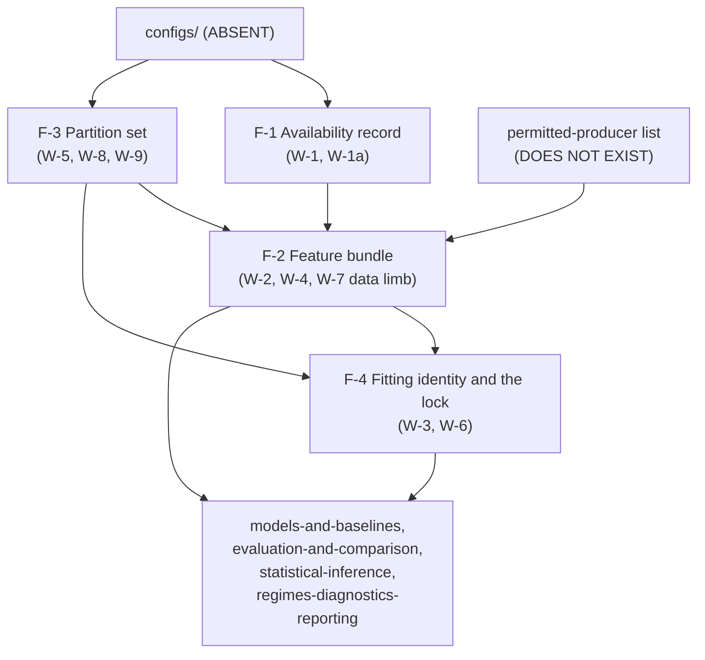

# Logical Components — `features-and-splits`

**Unit** `features-and-splits` (Bolt 7) · **Kind** `library` · **Stage** `nfr-design`

> ## ⚠ FOUR COMPONENTS, NONE OF THEM BUILT
>
> Every component below is a **logical** boundary over modules that **do not exist**:
> `src/features/availability.py`, `build.py`, `transforms.py`, `windows.py`,
> `src/data/splits.py` and `scripts/05_build_features_and_splits.py` are all absent, and
> `src/features/` holds `__init__.py` only. **Five of this unit's six test modules are
> absent**; the sixth exists and covers another unit's limb (`security-design.md`
> § SD-F-00).
>
> **`configs/` does not exist** and **no Python interpreter is reachable**, so no component's
> checks can run. **BLK-04, BLK-08 and BLK-09 are open exit conditions**, and **no
> implementation is authorised** while BLK-04 stands.
>
> This is a `library` unit: **no service boundary, no deployable process, no request path, no
> scaling axis**. "Blast radius" below means *which artifacts a defect corrupts and how far
> downstream it travels*, not which process restarts.

## Sources

- `../nfr-requirements/security-requirements.md` — **SEC-F-01**…**SEC-F-04**, and its § Scope note's assessment of all five NFR categories.
- `../nfr-requirements/tech-stack-decisions.md` — **TS-F-01**…**TS-F-05**: the artifact format, the `scikit-learn` leak surface, one window definition, computed splits, the platform posture.
- **`performance-requirements`, `scalability-requirements` and `reliability-requirements`** are **absent by scope design** — `produces_kinds` maps all three to `[service]` / `[service, ui]` and this unit is `library`. Their subject matter is carried in `security-design.md` § Scope note.
- `../functional-design/business-logic-model.md` — **W-1**…**W-10**, the workflows these components partition.
- `../functional-design/business-rules.md` — **R-74**…**R-84**.
- `./security-design.md` — **SD-F-00**…**SD-F-07**, and the **16**-row coverage table this file's own table mirrors.
- `../../../inception/application-design/component-methods.md` — **ADR-11**'s boundary calls, `FeatureBundle`'s persisted identity, and § Depth's intra-package carve-out.
- `../../../inception/application-design/services.md` — the bundle's on-disk address and the `05`→`06`/`07` write/read split.
- `../../../inception/application-design/component-dependency.md` — `src/evaluation` → `src/features` and `src/features` → `src/models` both **`—`**.
- `../../../inception/units-generation/unit-of-work.md` § 7 — `Owns`, the **11** requirements, **BLK-04**.
- `nfr-design-questions.md` — **Q5 = A**, and the receipted Consolidated Summary Confirmation.

---

## The boundary criterion (Q5 = A)

**The boundary is drawn on the object whose integrity each component guarantees.**

> **This unit both builds artifacts and guards them, and its four persisted objects fail in
> four unrelated ways.** A wrong availability record admits a future value. A wrong bundle
> admits a value with a false history. A wrong partition set moves a fold boundary. A wrong
> fitting identity produces a number that is better than the truth.

**Why this axis and not one of the six the siblings used.** `foundation` drew on
**write-integrity**, `governance-guards` on **enforcement timing**, `acquisition` on **egress
direction**, `inventory-and-registry` on **how a failure reaches a human**, `external-products`
on **what the component keeps out**, `target-standardization` on **what each component makes
true about the target**. None of the six fits here:

| Rejected axis | Why not here |
|---|---|
| **What it keeps out** (`external-products`) | Nearly everything in this unit keeps something out, so the axis does not discriminate — it would put W-1, W-2, W-3, W-5, W-7, W-8 and W-9 in one box. |
| **How a failure reaches a human** (`inventory-and-registry`) | This is a real and important distinction here (§ Failure domains) but it yields **two** boxes, which is a distinction rather than a decomposition. It is adopted **inside** this decomposition rather than as it. |
| **Leakage channel** | One box per channel gives **seven** components for one `library` unit, several sharing a single module (`build.py`), so the boundaries would correspond to nothing an implementer can isolate or test independently. |
| **Workflow grouping** (W-1/W-2 \| W-3/W-4 \| …) | Traceable, but it pairs W-5's folds with W-6's lock on adjacency alone and splits W-2's dictionary closure from W-7's IRI denial, which are two limbs of one channel. |

**What the chosen axis buys.** Four components, four **persisted artifacts**, four distinct
schemas, four independently loadable test surfaces — which is what `infrastructure-design` and
`code-generation` consume next.

<!-- Text fallback: four components. configs/ (absent) feeds F-1 Availability record and F-3 Partition set. The permitted-producer list (non-existent) feeds F-2 Feature bundle. F-1 and F-3 both feed F-2. F-3 and F-2 both feed F-4 Fitting identity and the lock. F-2 and F-4 both feed the four downstream units: models-and-baselines, evaluation-and-comparison, statistical-inference, regimes-diagnostics-reporting. -->

---

## Component inventory

Four components. **Every one is unbuilt**, and each row's "Module" names where it would live,
not where it is.

### F-1 — Availability record (guarantees: no predictor precedes its own availability)

- **Object at stake**: the availability matrix — one `AvailabilityRow` per feature carrying
  `feature`, `observation_timestamp`, `publication_timestamp`, `release_status`,
  `safe_lag_hours`, `actual_lag_hours`.
- **Module (absent)**: `src/features/availability.py` · **Test (absent)**:
  `tests/test_feature_availability.py`
- **Guarantees**: `actual_lag_hours >= safe_lag_hours` for every primary feature; no driver
  **backfilled from a future final value** where the contemporaneous grade was required; and
  `f107_81_trailing`'s window **ends at the safe-lagged day** — the **third limb**, asserted
  **and** recomputed from that anchor, because a recorded end date is a claim and the
  recomputation is the check. Dst **diagnostic/hindcast-only**; **SSN absent**.
- **Raises**: `LeakageError`.
- **Boundary it does not cross**: the **series-level** future-independence property is
  `external-products` **R-57**'s. This component owns the **value-level** anchor property,
  checkable only where the mean is built. Two checks over one fact, split by property.
- **Depends on**: `configs/data.yaml` and `features.yaml` — **absent**.

### F-2 — Feature bundle (guarantees: nothing enters the ML input space by name alone)

- **Object at stake**: the `FeatureBundle` — `matrix.parquet`, `tensor.npy`, `spec.json` in one
  directory addressed `<partition_id>__<role>__<transform_id>/`, loaded **all three or raise**.
- **Modules (absent)**: `src/features/build.py`, `src/features/windows.py` · **Tests owned
  here (absent)**: `tests/test_feature_leakage_guards.py`, `tests/test_iri_denial.py` ·
  **Required against this component but owned elsewhere (absent)**:
  `tests/test_common_masks.py` — **`evaluation-and-comparison`'s module**, required here
  through **TA-11** regardless, and **not one of this unit's six**
  *(relabelled 2026-09-04 on adversarial finding 2, Major: it sat under a flat "Tests
  (absent)" heading beside two owned modules, which made the distinct test names printed
  across F-1…F-4 total **7** and contradicted this file's own "6 test modules owned".
  `security-design.md` § SD-F-06 already had it right — "required here through TA-11
  regardless" — so the defect was this file's listing, not the design.)*
- **Guarantees**: the input space is **closed by name** — exactly the TE §6.2 dictionary — **and
  closed by provenance**, each column stamped with its dictionary row and producing artifact in
  `spec.json`, resolved against a **(row, producer)**-keyed permitted-producer list. **Raw
  longitude never enters**; longitude only through `lst_sin`/`lst_cos`. The window length is a
  frozen **24**, absent from every grid. **One window definition, two representations**, both
  emitted transformed and consistent, with shape-and-ordering then **value-level** parity
  asserted. The three identity stamps — `phase_id`, `source_id`, `target_definition_id` — ride
  the same schema, on the matrix **and on every mask**.
- **Raises**: `LeakageError` (field outside the dictionary; carried-forward `vtec_lag_*`;
  incomplete `vtec_seq_24` not excluded; unapproved support field; target-hour quality field;
  raw longitude; driver carried beyond 3 h; **the permitted-producer list unset**),
  `AlignmentError` (a driver value repeated outside its interval, or shifted to a neighbouring
  hour).
- **Fails closed, and that is new at this stage**: with the producer list unset it produces
  **nothing**, rather than producing a matrix whose provenance cannot be checked.
- **Depends on**: F-1's record, F-3's partition list, and the **permitted-producer list — which
  does not exist and is assigned to nobody**.

### F-3 — Partition set (guarantees: every fold boundary is the frozen calendar boundary)

- **Object at stake**: the six `Partition` objects and the **five-row** split manifest; the
  locked partition's record kept **separately** because it is access-gated.
- **Module (absent)**: `src/data/splits.py` · **Test (absent)**:
  `tests/test_split_embargo.py`
- **Guarantees**: exact fixed calendar boundaries (F1 Jan–Mar/Apr, F2 Jan–Jun/Jul, F3
  Jan–Sep/Oct, F4 Jan–Oct/Nov, `REFIT` Jan–Nov, **December locked**); a **24-hour embargo**
  whose first 24 h are **excluded and counted**; **no random or shuffled cross-validation** and
  no `scikit-learn` splitter; **both bounds** of every training range read from the `Partition`
  (R-83); membership derived from **record timestamps**, never a directory or file name; the
  two **opposite** carry-forward rules kept apart by a required field-class argument over a
  partitioned feature set; support fields **excluded by default** unless a G-04 approval whose
  timestamp **precedes** the freeze is present; **one** comparison-wide intersection mask,
  computed once per comparison set and **stored**.
- **Raises**: `PartitionError`, `LeakageError`.
- **Counts kept apart**: `build_partitions` returns **6**; the manifest FR-P1-04-5 gates on
  enumerates **5**; a manifest with six rows **fails**, and so does one with four.
- **Depends on**: `configs/data.yaml`'s `train_start`/`train_end` values — **absent**.

### F-4 — Fitting identity and the lock (guarantees: no number is better than the truth)

- **Object at stake**: the `Transform` — `transform_id` + `partition_id`, the identity every
  consumer compares — and the December partition's execution guard.
- **Modules (absent)**: `src/features/transforms.py`, and
  `materialise_locked_partition` · **Tests**: `tests/test_train_only_transforms.py`
  (**absent**), `tests/test_locked_test_guard.py` (**exists, limb 1 unwritten**)
- **Guarantees**: a transform is fitted on **one partition's training range exactly** — not a
  subset, not a superset; `build_features` raises when
  `transform.partition_id != spec.partition_id`, with **exactly one** enumerated exception,
  `REFIT` → `DEC` under `role="score"`; every consumer raises on a bundle whose
  `transform_id is None`; the December partition materialises **only** against a **verified**
  `g05_signature`.
- **Raises**: `LeakageError`, `PartitionError`, `LockedTestError`.
- **Negative controls** (the violation caught, not the happy path passing): a full-dataset fit
  **raises**; a `train`-role bundle in an evaluation comparison **fails**; partition *j*'s
  transform on partition *k*'s validation month **fails**; an untransformed bundle at **M-06
  fails**; a **strict-subset** training range **fails**; December execution before a verified
  signature **fails**.
- **The two guards are separate by design**: the pre-G-05 **read** for the required coverage
  audit goes through `governance-guards`' `open_restricted`, never through here (ADR-03).
- **Blocked**: **BLK-04** is an exit condition on this component's contract, and **BLK-09** on
  F-3's `train_start` field.

---

## Failure domains and blast radius

**The visibility distinction, adopted inside this decomposition rather than as its axis.**
Q5's option B would have drawn the boundary here; it is carried instead as the organising fact
of this section, because it is one distinction across four components rather than a
decomposition into two.

| Component | Characteristic failure | How it announces itself | Blast radius |
|---|---|---|---|
| **F-1** | A predictor available later than its declared lag, or a mean anchored a day late | **Raises** `LeakageError` at build | Contained: no bundle is emitted. But a **recorded-but-wrong anchor** whose values were never computed from it is caught **only** by the recomputation limb — remove it and this failure joins F-4's silent class. |
| **F-2** | A field outside the dictionary, a raw-longitude column, a driver shifted an hour | **Raises** `LeakageError` / `AlignmentError` at build | Contained by the raise. The **exception** is a **forged or mislabelled provenance stamp**, which passes and travels the whole way to a reported number. |
| **F-3** | A moved fold boundary, an uncounted exclusion, a support field admitted without approval | **Mostly raises**; an **uncounted** exclusion is *"indistinguishable at the artifact"* from an exclusion that never fired | Every fold's training set, therefore every model and every metric. A wrong mask reaches `evaluation-and-comparison` and every comparison built on it. |
| **F-4** | **A transform fitted on the full dataset** | **Nothing.** *"A transform fitted on all data produces better validation numbers and raises nothing anywhere."* | **The widest in this unit and the only silent one.** Four downstream units — `models-and-baselines`, `evaluation-and-comparison`, `statistical-inference`, `regimes-diagnostics-reporting` — because *"every reported number inherits the fit."* |

> **The one failure with no symptom is the one with the widest radius**, and it is why BLK-04
> is an **exit** condition on five units rather than a note. Three of the four components fail
> loudly; the fourth fails **favourably**, which is worse than failing invisibly — a
> validation number that improves reads as progress. That asymmetry is the reason F-4's
> guarantees are **identity comparisons and negative controls** rather than a shape claim: this
> unit has five review cycles of recorded evidence that a shape claimed to make the leak
> *"unrepresentable"* did not.

**A second, smaller asymmetry worth naming.** F-2's raises are loud, but its **provenance**
limb is the one control in this unit that guards against a value with a **legitimate name and
an illegitimate history** — and a **forged** stamp passes it. So F-2 has a loud
characteristic failure and a silent residual one, which is why § SD-F-01 states the residual in
the rule body rather than only in Assumptions.

---

## Shared resources

| Resource | Shared with | Contention or coupling |
|---|---|---|
| `configs/data.yaml`, `features.yaml`, `experiment.yaml`, `seeds.yaml` | Every unit | Read-only, snapshotted and hashed per run. **All four absent.** Every scientific constant lives here, none in source. |
| `src/data/config.py`'s exception hierarchy | Every unit | This unit raises 4 of its 17 names; **0** owed (`security-design.md` Derivation 2). `PartitionError` is declared here by the 2026-08-28 owner ruling, with `models-and-baselines` remaining its **semantic** owner. |
| `tests/test_locked_test_guard.py` | **`governance-guards`** | **Two units in one module** after Q3 = C — this unit's execution limb and `governance-guards`' read limb, with the split stated in the module's own docstring. The alternative (a second module) needs an owner-approved change to §12's mandated tree. |
| The **permitted-producer list** | Nobody yet | **Does not exist**, assigned to no unit, and **blocking** F-2 under Q1 = A. |
| The fixture manifest's floating-point tolerance | The fixture suite | **Unset**; measured and frozen, never invented (TE §15.1/§15.2). F-2's parity check is unrunnable until then. |
| The comparison-wide mask | `evaluation-and-comparison` and every baseline comparison | Produced **here**, once per comparison set, and **stored**. A recomputed mask is a mask that can differ. |
| The station registry | `inventory-and-registry` | Its sufficient-provenance question is **undecided**, which **blocks `station_lat`** and **excludes `lst_sin`/`lst_cos`** from F-2's feature set. |
| `src/external/iri.py`, `gim.py` | `external-products`, `src/evaluation/` | **Not importable from `src/features/`**, directly or transitively. The module-graph check is `external-products` R-56's; F-2 owns the data-flow limb. |

**No shared runtime resource exists** — no connection pool, no cache tier, no queue, no
load balancer, no failover path. Two platforms (Kaggle, local), **CPU a complete execution
path**, and artifacts move between platforms with a SHA-256 manifest.

---

## Requirement coverage

| Requirement | Component | Acceptance row | Status |
|---|---|---|---|
| FR-P1-04-1 | **F-2** | WS-10, TA-07 | `Pending` — data-flow limb only |
| **FR-P1-04-2** | **F-1** | WS-11, TA-08 | `Pending` — **added at this stage** |
| **FR-P1-04-5** | **F-3** | WS-12, TA-11 | `Pending` — **added at this stage** |
| FR-P1-04-6 | **F-4** | TA-11 | `Pending` |
| FR-P1-04-7 | **F-3** | WS-16, TA-11 | `Pending` |
| **FR-P1-04-8** | **F-2** | WS-13, TA-11 | `Pending` — **added at this stage**; evidence question open |
| **FR-P1-04-10** | **F-2** | ⚠ **NO ACCEPTANCE ROW** — proposed at 3.2, not approved | untested |
| FR-P1-04-12 | **F-2** | **TA-33** | ⚠ `Pending` — nothing implemented |
| FR-P1-04-13 | **F-3** | **TA-34** | ⚠ `Pending` |
| FR-P1-04-16 | **F-3** | **TA-35** | ⚠ `Pending` |
| FR-P1-04-17 | **F-2** | **TA-36** | ⚠ `Pending` — enforcement raise this unit's |
| NFR-LEAK-01 | **F-4** | TA-11 | `Pending` — **BLK-04 open** |
| NFR-IRI-01 | **F-2** | WS-10, TA-07 | `Pending` — never describable as fully enforced |
| NFR-FAIR-01 | **F-3** | WS-16, TC-16 | `Pending` |
| NFR-TDEF-01 | **F-2** | **TA-15** | `Pending` — row owned by `target-standardization` |
| FR-P1-03-3 | **F-2** | **TA-15** | `Pending` — row owned by `target-standardization` |

**Derived and printed.** **4** components (F-1…F-4). **16** coverage rows, counted from the
table above and **set-differenced against `security-design.md`'s 16** — identical ID sets, so
the two tables agree by their **lists**, not by their totals (`project.md` § Way of Working,
`c21`). Per-component distribution, counted: **F-1: 1**, **F-2: 8**, **F-3: 5**, **F-4: 2** —
sums to **16**. **1** requirement with **no acceptance row** (FR-P1-04-10). **0** rows claimed
satisfied. **2** artifacts owed and non-existent (the permitted-producer list; the fixture
tolerance).

**The test modules, derived by counting the distinct names printed across F-1…F-4: 7.**
*(Corrected 2026-09-04 on adversarial finding 2, Major — the count below was asserted without
this derivation, and the 7-vs-6 gap is what the finding caught.)* They decompose as **6 owned
here** — `test_feature_availability.py` (F-1), `test_feature_leakage_guards.py` and
`test_iri_denial.py` (F-2), `test_split_embargo.py` (F-3), `test_train_only_transforms.py` and
`test_locked_test_guard.py` (F-4) — plus **1 required here but owned by
`evaluation-and-comparison`**, `test_common_masks.py` (F-2). Of the **6 owned**: **5 absent**,
and **1 present covering another unit's limb** (`test_locked_test_guard.py`, § SD-F-00). **7 =
6 + 1** and **6 = 5 + 1**, both printed rather than carried.

**F-2 carries half the requirements and F-1 carries one.** That is stated rather than
smoothed: the axis is the object at stake, and the bundle is the object most of this unit's
rules constrain. A more even split would only be reachable by decomposing F-2 along leakage
channels, which is Q5's rejected option C and would put several components inside one module.

## Assumptions & Open Questions

- **[Q5]** The decomposition is by **object whose integrity is at stake**, and the loud/silent distinction is carried in § Failure domains rather than as the boundary. If a later stage wants the visibility axis as the boundary itself, that is Q5's option B and it yields two components, not four.
- **[assumption]** `src/features/*` and `src/data/splits.py` shapes **beyond the named boundary calls** are intra-package and this stage's to specify (`component-methods.md` § Depth). **This unit owes one boundary amendment** — `train_start` on `Partition` (**R-83**), a named boundary shape § Depth's carve-out does not reach.
- **Open — the § Amendments owed total is "7 across 5 units"** and two receipted sibling artifacts still carry **"8 across 5"**. Same unit count, **different total and different sets**; only the named set-difference settles it. Those artifacts are terminal-READY under frozen receipts and are **not edited** — a gate item.
- **Open — F-2 produces nothing until the permitted-producer list exists** (Q1 = A). The list is assigned to no unit, and whether it is governed config or a code constant is an undecided **TC-03e** question. *(Noted 2026-09-04 on adversarial finding 1, Major: the accessor by which F-2 reads the list is itself an **owed, change-control-gated interface amendment** — the approved frozen `ConfigSnapshot` carries no `permitted_producers` field; see `security-design.md` § SD-F-01's dated correction.)*
- **Open — `tests/test_locked_test_guard.py` carries two units' cases** after Q3 = C, and **limb 1 is unwritten**. A second module is the cleaner design and needs an owner-approved change record to §12's mandated tree.
- **Open — F-2's parity check has no tolerance**; it belongs to the fixture manifest, measured and frozen.
- **Open — BLK-04 (five units), BLK-08 (two units, both owners) and BLK-09 (this unit alone)** are exit conditions. **Approving this decomposition approves none of their contracts.**
- **Open — the station registry blocks `station_lat` and excludes `lst_sin`/`lst_cos`** from F-2.
- **Open — a Jan–Nov `DEC`-stamped `train` bundle is shape-representable and built by no call** (F-3's residual).
- **Open, unchanged — the signed "nine-site sweep" figure** in this unit's `functional-design-questions.md` is unsupported (derived: **3**); the record stays unedited and one owner ruling is owed.
- **Carried — D-31's disclosure travels with the G-09 signature**: the §18.3 preflight never ran, the critical tests are unexecuted here, `aws_ai_dlc_preflight_report` does not exist. **BLK-04 independently bars implementation.**
- **None** of the above decides a scientific value, fills a `TBD — freeze gate` field, approves an acceptance row, closes a blocker, or claims a gate or test as discharged.

---

## Receipt-floor note — 2026-09-04

**This file carries the fix a redo jump was taken for.** The prior adversarial pass's Major:
`test_common_masks.py` was listed among this unit's own test modules when it is
`evaluation-and-comparison`'s, making the distinct names printed across F-1…F-4 total **7**
against this file's own "6 test modules owned". F-2's listing now separates *owned here* from
*required here but owned elsewhere*, and the bare count is replaced by a printed derivation:
**7 distinct = 6 owned + 1 owned elsewhere**, and **6 owned = 5 absent + 1 present**.

**Two jumps were needed, and the second was my error, not the mechanism's.** The first
recovery fixed the artifacts, re-reviewed, and *then* re-collected the human confirmations —
leaving every artifact write older than its confirmation, which wedged the engine against its
own write-freeze. The steps were re-run in the order that terminates: **confirm → write →
review.** No design content changed across either recovery.
