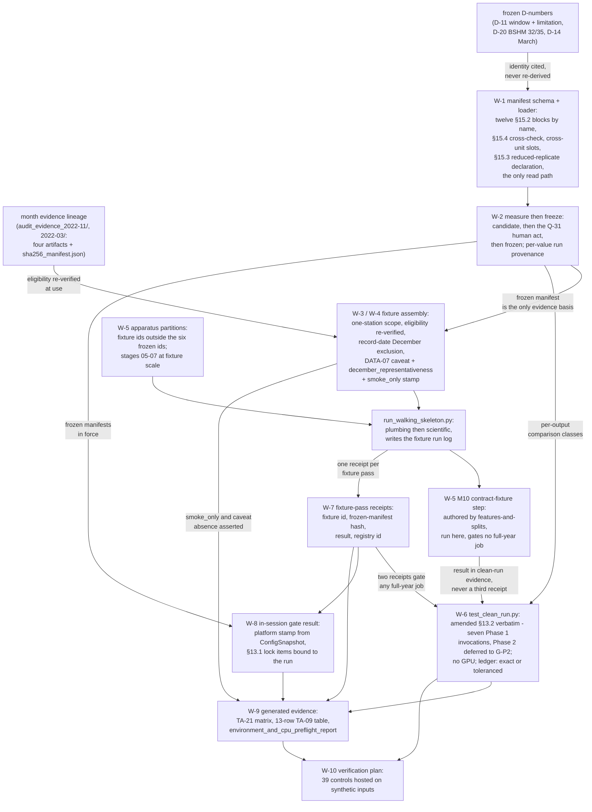

# Business Logic Model — `fixtures-and-reproducibility`

**Unit** `fixtures-and-reproducibility` · **Kind** `library` · **Complexity** M ·
**Deployment** standalone · **Depends on** `acquisition`, `inventory-and-registry`,
`target-standardization`, `external-products`, `features-and-splits`,
`models-and-baselines`, `evaluation-and-comparison`, `statistical-inference`,
`regimes-diagnostics-reporting`

The workflows this unit implements: everything between "the pipeline ran" and "the pipeline
reproduces". The **fixture manifest as an executable contract** — one schema enumerating
every TE §15.2 content area by name, one validating loader asserted the only read path, and
the §15.4 hash-listing cross-checked; the **measure-then-freeze workflow** whose two
manifest states put the Q-31 human act between measurement and expectation; the **plumbing
fixture's lineage** — identity cited from D-11 and D-20, one-station execution enforced,
eligibility re-verified at use, and the DATA-07 caveat carried as machine-readable freight;
the **smoke quarantine and the December record-date exclusion** that turn this unit's two
untested requirements into falsifiers; the **fixture-local apparatus partitions** that give
stages 05–07 a scientific-fixture path without touching a frozen partition id, and the
**M10 contract-fixture step** the owner's Q12 = C ruling placed in this sequence; the
**clean run** executing the amended §13.2 sequence verbatim on CPU against a
manifest-declared **comparison ledger**; the **ordering gate** made survivable across
sessions and platforms by two hash-bound fixture-pass receipts; the **Kaggle in-session
gate** as a producing path stamped by the platform that resolved it; and the **three
generated evidence artifacts** G-07 and the TA rows actually read.

**Unit 12 of 12 — the last, and the terminal node of the DAG.** It owns **no `src/` module
and no stage script other than the orchestrator**: its boundary invokes every stage script
and implements no domain logic of its own. Seven of its nine dependency edges rest on a
stage script the clean-run sequence invokes directly; the two on `statistical-inference`
and `regimes-diagnostics-reporting` rest on the artifacts the clean-run comparison and
TA-21's traceability matrix consume — both units being `embedded` and running inside
`07_evaluate_and_report.py`, which `evaluation-and-comparison` owns.

**It decides no scientific value.** The plumbing window (D-11), its station (D-20), the
scientific month (D-14), the seeds (`seeds.yaml`), the partition list (R-80) and the grids
are already frozen and are **cited, never re-derived**; every count, tolerance and runtime
is **measured from the fixtures and frozen** under §15.1 by the **Q-31** authority, and
**nothing in these three artifacts states a measured number**. Everything underdetermined —
the loader's home (W-1), the **Phase 1 segment's clean-run data scope** (W-6 — membership
itself is settled; see the correction there), the full-year check's call site and the
exception choice (W-7), the fixture-partition reading and the M10 placement (W-5), the
candidate acceptance rows (W-4), the §15.2 twelve-versus-thirteen correction and the
`not_applicable` reading (W-1), and the **classification of §15.3's reduced replicate
count** (W-1 limb 5) — is **expressly routed to the gate**.

> **Remediation of `GOV-2026-08-28-FD-01` (verdict FAIL), applied 2026-08-28.** Seven items
> from the project decision owner's ruling, each carrying a dated note at its site: **Rec 5**
> (BLOCKER) — W-6 now executes §13.2's **seven Phase 1 stage-script invocations** and defers
> the Phase 2 segment to **G-P2**, new control **(39)**; **Rec 24** — W-1 limb **5** declares
> §15.3's mandatory reduced-replicate fixture bootstrap as test apparatus with its scored
> range and 24 h / 48 h block counts, control **(37)**; **Rec 36** — **D-14's second clause**
> enumerated at every site and given the `december_representativeness` field on **both**
> fixtures (W-3 limb 5), control **(38)**; **Rec 30** — the four post-answer `thirteen` sites
> in `functional-design-questions.md` marked; **Rec 9** — this unit's
> `environment_and_cpu_preflight_report` (**G-07**) distinguished from
> `aws_ai_dlc_preflight_report` (**G-09**, **`foundation`'s**, discharged by **FR-WS-7**),
> supporting-row figure re-derived as **5**; **Rec 42** — `dataset_version`'s **unruled**
> encoding recorded as blocking the release path, with the `test_release_hashes.py` naming
> hazard stated (**no encoding invented**); **Rec 47** — the in-session gate records **its own
> measured total runtime** (W-8). **Ratified as D-28**: the G-06 locked-test scored set is
> **2–31 December 2022 (30 days)**, owner-approved under the recorded authority equivalence,
> the Vision §8.2 / TE §7.1 embargo conflict **recorded, not resolved**, **no supervisor
> signature claimed**. Controls **36 → 39**, must-not-fire **10 → 11**; workflows, rules and
> entities unchanged at **10 / 10 / 7**; amendments owed unchanged at **7 across 5**. **No
> measured value is stated, inferred or substituted** (§15.1).

**One owned blocker, four inherited exit conditions.** **BLK-02** (owned) is open **on
implementation only**: reading settled by the D-11 clarification of 2026-08-22, station
frozen the same day as **BSHM 32/35 (D-20)**, and what remains is exactly what no design
can close — the manifests do not exist, neither fixture has ever run, and **no measured
value is invented, inferred or substituted**. **BLK-03 ↓, BLK-04 ↓, BLK-08 ↓, BLK-09 ↓**
are inherited from five upstream units; **BLK-08 ↓ bounds the units of every tolerance this
unit compares**, and W-6's ledger makes that dependence a **checked refusal** rather than a
silent inheritance. All five are **exit conditions on stage 3.1, not entry conditions**
(`GOV-2026-08-22-REM-01` Rec 2, extended 2026-08-23): this unit may enter, **may not
complete or exit** 3.1 while any stands, and **no implementation may proceed**. **G-09 is
not signed** — every workflow below is design, and no module, manifest, receipt, emitter or
fixture directory is created.

## Sources

- `../../../inception/units-generation/unit-of-work.md` § 12 — the `Owns` list (**five bullets, derived by counting**: `scripts/run_walking_skeleton.py`; `tests/fixtures/plumbing_7day/fixture_manifest.yaml` and `tests/fixtures/scientific_1month/fixture_manifest.yaml`; `tests/test_clean_run.py`; the traceability matrix and the `environment_and_cpu_preflight_report`; **execution** of the M10 contract fixture), the responsibility (manifests carrying identity, input hashes, expected schema, row-count ranges, support and missingness limits, timestamp tolerances, required outputs, measured CPU runtime range and permitted floating-point tolerances; the orchestrator enforcing both-in-order; §13.2's clean-run contract reproduced on CPU), the boundary (invokes every stage script, no domain logic; seven script-owning edges, two artifact-only edges), the 8 requirements (2 bolded untested), acceptance rows **WS-20, TA-09, TA-17, TA-21**, the **⚠ M10 is NOT a third mandated fixture** box (owner ruling **Q12 = C**; §9.2 unchanged and unextended; no full-year job gates on it; the split adds no dependency edge), the implementation notes, and § Blocker register **BLK-02** with its six-row limb table and the **ARUC dormancy rule** (dormant, **NOT** resolved, revives in full if ARUC is ever proposed); **BLK-01 CLOSED 2026-08-22**.
- `../../../inception/units-generation/unit-of-work-story-map.md` — Table 1's eight rows (FR-WS-2, FR-WS-3 **NO CURRENT ACCEPTANCE ROW**); Table 2's WS-20 row (evidence: `tests/test_clean_run.py`, clean-run log, both fixture manifests), TA-09 row (**bounded**; evidence: fixture acceptance table with per-row evidence links), TA-17 row (the full ordered contract on CPU within declared runtime, storage and numerical tolerances; evidence: `test_clean_run.py`, clean-run log, matched artifacts), TA-21 row (the matrix connecting each implemented requirement to a decision, test/experiment and evidence artifact); supporting TA-03, TA-04, TA-23, TA-26, TA-27 (**5**, re-derived 2026-08-28 from line 239's per-unit coverage row); § Per-unit coverage summary; § Cross-unit responsibilities (NFR-PHASE-01/TA-27 with `governance-guards` primary; REQ-ENG-5 spread across four units); **REQ-ENG-4 is `foundation`'s requirement whose acceptance row is TA-09 — this unit's primary row**; and, on the identical discharge pattern, **line 127's `| FR-WS-7 | foundation | TA-23 |` with line 206's TA-23 row (primary `foundation`, evidence `aws_ai_dlc_preflight_report`) — `foundation`'s requirement, `foundation`'s artifact, this unit's *supporting* row only** (W-9's two-report box).
- `../../../inception/requirements-analysis/requirements.md` — FR-WS-1 through FR-WS-6, NFR-REP-01, REQ-NFR-A3 (the eight this unit carries); **REQ-ENG-4** (the manifest-content obligation, the §15.4 hash-listing, §13.7's no-silent-update, D-11's ARUC pre-freeze obligation), REQ-ENG-10 (the §13.1 eight-item lock, `UNTESTED`); § Known defects rows **8** (TA-09's Phase 1 bound and the 13 + 7 = 20 derivation), **9** (WS-01 as the named exception) and **12** (the station-count history, amended in place 2026-08-22).
- `../../../inception/application-design/services.md` — `run_walking_skeleton.py`'s row (orchestrator, phases 1 and 2, reads `--fixture`, writes the fixture run log); § The nine stage scripts (each `--config configs/`, phase-aware stages `--phase 1|2`, orchestration only); § Stage entry contract (`foundation`'s **six** ordered steps, identical in all nine scripts — an **approved surface**; failure in steps 1–5 exits non-zero naming file and expectation and writes an `aborted` row); § Ordering contract (`run_walking_skeleton.py` **enforces**; releases **identified by release ID and verified by hash**, never by path convention); the `02` ordinal reading — **an ordinal fact about naming, never a licence to execute both `02` scripts in one sequence; W-6 as corrected 2026-08-28 executes §13.2's seven Phase 1 invocations and defers the Phase 2 segment to G-P2**; § Execution platforms (**Kaggle carries no git working tree**; `resolve_platform_roots` writes resolved roots into the lock; every artifact crossing platforms carries a SHA-256 manifest); the **M9** bundle-directory naming rule and the **M13** envelope note. The § Ordering contract's "precondition currently unmet" paragraph is **superseded on the station limb** by D-20 — cited as history, not current fact.
- `../../../inception/application-design/component-methods.md` — § Depth (**Q1 = B**; **this unit has no approved cross-package signature of its own**); `ConfigSnapshot` and `load_configs`/`assert_no_tbd`/`assert_declared_sources_exist`/`resolve_platform_roots`; the ADR-11 `FeatureBundle` architecture, the **containment-not-equality** correction, and the `lead_in_hours` removal (the locked test scores 30 days, not 31).
- `../foundation/functional-design/` — **READY**: R-01 (the **fourteen**-exception `IntegrityError` hierarchy, base in `src/data/config.py`, the constructor requiring file-or-resource **and** violated expectation, and the negative control proving an unenumerated subclass is still caught), R-05 (determinism first; the re-exec sentinel read once and unset; module-scope framework imports prohibited transitively), R-09/R-10, R-15, R-16, R-17, § Stage entry contract.
- `../features-and-splits/functional-design/` — **READY**: R-74 (four elements; **range equality** for a `train` fit; identity by enumeration over the six partition ids; the single enumerated `REFIT` → `DEC` `score` exception; `transform_id is None` raises) with its **controls that must not fire** (the D-11 seven-day `score` containment **passes**), R-80 (the partition list and the evaluation-role reading), R-82 (the locked partition materialises only against a verified `g05_signature`); **FU-7 = A**; BLK-04/BLK-09's home; the two modules W-5's M10 step invokes (`test_train_only_transforms.py`, `test_split_embargo.py`).
- `../statistical-inference/functional-design/` — **READY**: R-120 clause 4 (**the widening guard's doubled CPU cost measured at fixture time and frozen into the fixture manifest per §15.2**) and clause 3 (the comparator's numbers never serialized as a reported interval), R-121's control (22) (**the recovery tolerance lives in the fixture manifest, not in the rule**), R-122 (fixture parameters as **declared constants of the test apparatus**; scientific values from config even under test; the `tests/fixtures/<fixture_id>/fixture_manifest.yaml` convention).
- `../evaluation-and-comparison/functional-design/` — **READY**: R-103 (the **BLK-08 joint** contract), R-104 (inverse-before-metric at the boundary), R-106/R-107, R-108, R-109 (hash-receipt before metrics; exactly 2–31 December), **R-110** (the **emit-from-the-producing-path** pattern W-3 and W-4 adopt), R-111, R-112.
- `../regimes-diagnostics-reporting/functional-design/` — **READY**: R-123…R-132; R-125's units assertion (BLK-08 ↓ made checked at the reporting surface — the precedent W-6 applies at the tolerance surface); R-127/R-129's inventory-completeness pattern (W-1's §15.4 completeness assertion and W-9's bounded table follow it); the fixture-constants-as-test-apparatus reading restated there; its § Assumptions carrying the **"fourteen"** figure a fifteenth exception would oblige sweeping.
- `../governance-guards/functional-design/` — **READY**: R-23/R-24 (both phase-boundary limbs run; run time authoritative, static scan subordinate, **both** run), R-25/R-26 (the access log appends durably **before** any December read; what counts as a December hit), R-27/R-28 — the clean-run sequence must be executable **without a single December hit**.
- `../acquisition/functional-design/` and `../inventory-and-registry/functional-design/` — **READY**: **R-31** (membership from record timestamps, never a name — FR-WS-3's mechanism, whose control `tests/test_acquisition_window.py` already exists and is green), R-36, R-42, R-44…R-53 (the registry, schema-validation and hash tooling TA-04 says must operate on both fixtures), R-50.
- `evidence/DECISIONS.md` — **D-11** and its **2026-08-22 clarification**, **D-20**, **D-14**, plus D-15, D-17, D-18, D-19 (the contract and support values the expected-schema block asserts, and the traversal-order lesson NFR-REP-01 cites).
- `PreFlight/Technical_Environment_and_Research_Implementation(1)(2).md` — §9.1, §9.2, §9.3, §13.1, **§13.2 as amended**, §13.3, §13.4, §13.5, **§13.7**, **§15.1**, **§15.2**, **§15.3**, **§15.4**, §16 and §16.1, **§18.3**, §19.
- `aidlc/spaces/default/memory/team.md` § Walking Skeleton (the **derived-artifact** eligibility criterion; the **DATA-07 interim caveat**; completeness **measured, not tested against a threshold**) and § Testing Posture (§13.2 as the reproducibility test's definition; **G-07 (Blocked, Supervisor)** the accepting gate; the negative-control methodology; the two-tier error posture); `aidlc/spaces/default/memory/project.md` § Mandated/Forbidden.
- Workspace inspection, **2026-08-28**: `tests/` holds exactly `test_acquisition_window.py`, `test_phase_boundary.py`, `test_release_hashes.py` — **none this unit's**; **no `tests/fixtures/` directory**; `src/`, `configs/`, `pyproject.toml` absent; `scripts/` holds only the two pre-scaffold audit scripts; `evidence/audit_evidence_2022-11/` and `evidence/audit_evidence_2022-03/` present, each `sha256_manifest.json` hashing exactly **four** derived files.
- Absent by scope design: `stories` (2.4 `SKIP`), `mockups` (1.6 and 2.5 `SKIP`). `kind: library`.
- `functional-design-questions.md` (**Q1 through Q9, all answered `C`**; Consolidated Summary Confirmation receipted `Looks correct`), `business-rules.md`, `domain-entities.md`.

---

The fixture and clean-run shape, end to end:



Text fallback: the frozen D-numbers supply the fixture identities, cited into the manifest
schema (W-1) whose validating loader enumerates every §15.2 content area by name,
cross-checks §15.4's hash-listing, carries the named cross-unit slots and declares §15.3's
reduced-replicate fixture bootstrap with its scored range and block counts; the
measure-then-freeze workflow (W-2) turns a measuring run's `candidate` manifest into a
`frozen` one only through the Q-31 human act, with every measured field carrying its
measuring run's registry id; fixture assembly (W-3, W-4) verifies the month's four declared
artifacts against its `sha256_manifest.json`, enforces one-station scope for the plumbing
fixture, excludes December on record dates, and stamps the `smoke_only` class and the
DATA-07 caveat and the `december_representativeness` prohibition onto everything the
fixtures produce; the apparatus partitions
(W-5) let stages 05–07 run at scientific-fixture scale without touching any of the six
frozen partition ids, and the M10 contract fixture executes as its own named clean-run
step; `run_walking_skeleton.py` runs plumbing then scientific and writes one hash-bound
fixture-pass receipt per pass (W-7), which the exported check consumes to gate any
full-year job; `tests/test_clean_run.py` (W-6) executes the amended §13.2 sequence verbatim
— its **seven Phase 1 stage-script invocations**, with the Phase 2 segment deferred to
**G-P2** — with no GPU visible, and compares every required output through the
manifest-declared comparison ledger; the in-session gate result (W-8) proves the critical set
and both fixtures ran on the platform the governed run runs on, bound to that run's own
§13.1 lock and recording its own measured total runtime; the three evidence artifacts (W-9)
are generated from those receipts, results and locks with refusal semantics; and the
verification plan (W-10) hosts all thirty-nine negative controls on synthetic inputs.

## W-1 — The manifest schema and the one validating loader

```
INPUT   tests/fixtures/<fixture_id>/fixture_manifest.yaml
OUTPUT  one validated manifest object, consumed by run_walking_skeleton.py,
        tests/test_clean_run.py, and the sibling modules R-122 points at the
        same convention
RAISES  IntegrityError (base; no fifteenth exception minted by default — W-7)
```

REQ-ENG-4 fixes the content and R-122 fixes the convention; what was unstated was the
schema's shape, the loader's home and what validation rejects (Q1 = C):

1. **Every TE §15.2 content area is a required block, enumerated by name** — Identity,
   Inputs, Processing, Expected schema, Units, Row-count ranges, Support/missingness,
   Timestamp tolerances, Independent reference checks, Required outputs, Runtime,
   Numerical variation. Naming rather than counting is deliberate: the block set stays
   correct whichever numeral a downstream register carries.

   > **⚠ The count "thirteen" does not survive derivation — raised, not resolved.**
   > Derived 2026-08-28 by extracting `^| ` rows from §15.2's table: **13 rows, one of
   > them the `| Area | Required manifest content |` header → 12 content areas.**
   > `requirements.md` REQ-ENG-4 asserts *"all thirteen"* and then **enumerates nine**;
   > the three §15.2 areas its sentence omits are **Processing**, **Units** and
   > **Independent reference checks**, and 9 + 3 = 12 — the table's own figure. Three
   > representations disagree (13 claimed, 9 enumerated, 12 derived), and the 13 is the
   > row count *including the header*. This design binds to the named twelve; the
   > correction is a `requirements.md` change and the receipted summary's numeral is not
   > this stage's either. **Reported at the gate.**

2. **Three of the twelve name Phase 2 quantities Phase 1 is barred from producing** —
   Inputs (RINEX/CRX, DCB), Processing (`gnss-tec` version, calibration commit),
   Independent reference checks (STEC/VTEC intermediates, the hand-worked DCB pass).
   Requiring them **non-empty** on a Phase 1 manifest would demand exactly the
   raw-processing evidence §7.0 bars and NFR-PHASE-01 forbids — the §16 "all 20"
   contradiction appearing in a second place. **Reading proposed, not applied:** the block
   is required **present**, with each Phase 2-only quantity recorded **`not_applicable`
   with its reason** — the FR-P1-03-5 precedent, *"recorded not-applicable rather than
   emitted empty"*. A missing **block** still fails; `not_applicable` on a
   Phase-1-applicable quantity fails.
3. **The §15.4 cross-check.** The Required-outputs block cross-references
   `artifact_manifest.json` and the loader asserts the hash-listing agrees with the files
   on disk. Derived 2026-08-28 by enumerating §15.4's tree: **22 entries → 20
   hash-listable outputs** (excluding the `plots/` directory line and
   `artifact_manifest.json`, which cannot list its own hash), of which
   `target_uncertainty_budget.json` is fixture-2-only → **20 for `scientific_1month`, 19
   for `plumbing_7day`**. Completeness is asserted against that enumeration, following
   R-129's inventory-completeness pattern.
4. **The named cross-unit slots.** `statistical-inference` **R-120 clause 4** freezes the
   widening guard's **measured** doubled-CPU runtime into this manifest's Runtime block,
   and **R-121** places the planted-correlation recovery tolerance in its
   Numerical-variation block. Two READY siblings therefore already consume this schema as
   a contract surface, and R-122's general convention means it is consumed beyond this
   unit's two directories.
5. **The §15.3 reduced-replicate fixture bootstrap is declared here, as test apparatus**
   *(added 2026-08-28 per `GOV-2026-08-28-FD-01` Recommendation 24, board option 2)*. §15.3
   **requires** it — *"Fixture 2 must run the complete ladder across all three stations with
   pooled comparison-wide masks, the full benchmark join at evaluation time, and **one
   bootstrap execution at reduced replicate count for timing**"* — and derived 2026-08-28 it
   is designed nowhere: `reduced-replicate` / `reduced replicate` appears **once** across all
   twelve units, inside `business-rules.md`'s own § Sources citation of §15.3, and **zero**
   times in `statistical-inference`, which owns `vector_block_bootstrap`. Three fields land
   in `tests/fixtures/scientific_1month/fixture_manifest.yaml` on **R-122's** authority that
   fixture parameters are apparatus constants **explicitly not scientific values** — the same
   authority **W-5/R-137** used for the fixture partition ids, and §15.2's Runtime block
   already requires the fixture's runtime figures here: `fixture_bootstrap.replicates` (the
   reduced count, timing only, never reported), `fixture_bootstrap.scored_range`, and
   `fixture_bootstrap.block_counts` at **24 h** and **48 h**.

   Declaring it as apparatus rather than a second `experiment.yaml` value avoids a real
   collision: `statistical-inference` **R-118** declares `replicates` in `experiment.yaml`
   passed explicitly at every call, and its control (17) **fails a confirmatory interval
   whose recorded `replicates` differs from the config-declared value**. Declaring the scored
   range makes **R-115** limb 1's divisibility raise checkable rather than latent — derived
   arithmetic on the ranges in play, all calendar facts: the raw March window is **744 h**
   (15.5 blocks at 48 h), the April and November validation months after the 24-h exclusion
   are **696 h** each (14.5), and the raw seven-day plumbing window is **168 h** (3.5), so
   the 48-hour sensitivity is **indivisible on every one of them**. **No number is stated
   here**: the count and range are declared apparatus values frozen by the Q-31 act (W-2),
   and §15.1 bars inventing them. If the owner rules a replicate count is **protocol**
   wherever it appears, board option 1 applies instead — a predeclared `experiment.yaml`
   named run on R-118's own pattern — and this limb moves there unchanged. **Routed to the
   gate as a classification question.** Noted: `statistical-inference` is being amended in
   parallel so R-120's widening comparator uses the *same* replicate count as its primary
   call rather than the literal **10,000**; this unit neither makes that amendment nor
   depends on having made it.
6. **The loader validates on read and is the only read path.** A manifest missing a
   required area is rejected **naming the file and the missing expectation** (the two-tier
   posture; R-01's constructor contract), and a second YAML parse of a fixture manifest
   anywhere in this unit's scope fails an only-copy check. Two parsers of one contract
   drift independently — the list-versus-rule failure R-01's own rationale names.

**The loader's home is routed to the gate**, because §12 names no module for it and this
stage may not amend §12 by assertion. Candidates, with consequences: a **function set in
`foundation`'s `src/data/`** as a cross-unit contract (mirroring how the eight
non-`foundation` exceptions import the base) mints a new `component-methods.md` boundary
surface and takes the amendment ledger — **7 across 5 today**, derived in `business-rules.md`
§ Amendments owed as 5 + 0 + 1 + 1 + 0 + 0 — **to 8 across 6 at that ruling**, scopes the
only-copy check project-wide, and puts test-apparatus loading into a production package; a
**test-apparatus helper under `tests/fixtures/`** adds **no** amendment but makes a
`scripts/` module import from the test tree, which §12 does not forbid and no other script
does. R-15 does not reach the question: a fixture manifest is not `configs/`.

**Rules.** R-133. **Controls (1)–(4)** plus **(37)** — a `scientific_1month` manifest
missing any of limb 5's three `fixture_bootstrap` fields, or declaring an indivisible scored
range, **fails validation** (added 2026-08-28 per Recommendation 24) — plus the
`not_applicable` must-not-fire control.

## W-2 — Measure then freeze: two states, identity by citation, and the act in between

```
INPUT   a measuring fixture run's outputs; the frozen D-number records
OUTPUT  status: candidate -> (recorded human act under Q-31) -> status: frozen,
        with the frozen manifest's own hash in the evidence record
RAISES  IntegrityError on a post-freeze mismatch or a provenance-less measured field
```

§15.1 and §13.2 both say *"measured from the fixtures and frozen; they are not invented
here"*, and BLK-02 says it operationally. Option A — the first successful run writes the
manifest — inverts that: it makes an anomalous first run **self-ratifying**, the exact
failure §13.7's no-silent-update rule exists to prevent, moved one step earlier. So the
workflow has two states with the human act between them (Q2 = C):

1. **A measuring run emits `status: candidate`.** Its **identity fields are cited from the
   D-numbers, never re-derived** — D-11's window and mandatory limitation, D-20's station,
   and **D-14's month with its Mandatory limitation in both clauses**: (i) the equinox-month
   clause (*"does not reproduce December's winter-solstice regime or its activity
   distribution"*) **and** (ii) the operative prohibition, *"It is **not** representative of
   the locked test month, and **no fixture result may be read as evidence about December
   behaviour**"* — and each **measured** field (row-count ranges, support and missingness
   limits, timestamp tolerances, runtime ranges, floating-point tolerances) carries the
   **measuring run's registry id**. A measured field without a run id is
   **unrepresentable**, which is what leaves an invented value nowhere to hide.

   > **⚠ Clause (ii) is enumerated, not labelled** *(added 2026-08-28 per
   > `GOV-2026-08-28-FD-01` Recommendation 36, board option 2)*. Derived across all 48 stage
   > artifacts: `evidence about December behaviour` returned **0 hits** — the operative half
   > of D-14's limitation existed nowhere, while D-11's clauses were enumerated in full at
   > four sites and D-14's were carried only as the label *"equinox limitation"*. It is
   > load-bearing: **W-4's `smoke_only` quarantine is correctly scoped to `plumbing_7day`
   > alone**, so `scientific_1month`'s outputs legitimately *can* serve WS-12/WS-13/WS-16/WS-17
   > evidence, which makes clause (ii) the **only** barrier between a March number and a
   > December reading. W-3 therefore also gives it machine-readable freight, on this unit's
   > own argument for the `data07_caveat`: *a caveat living in prose outside the artifact is
   > exactly the kind that fails to appear there.*
2. **Freezing is a separate recorded human act under Q-31** that sets `status: frozen` and
   records the manifest's **own hash** in the evidence record. **Nothing here performs
   it** — TE §18.2 assigns fixture station, dates and acceptance tolerances to the
   Student, and the act is the project owner's.
3. **After freeze every mismatch raises** naming file and violated expectation, and
   **never updates the expectation**. Re-measurement runs through a **new candidate and a
   new freeze act**; the superseded manifest is **preserved, not overwritten** (the
   `foundation` R-13 posture and §13.3's new-version rule applied to test apparatus).
4. **The evidence bound makes the freeze load-bearing rather than ceremonial.** A run
   against a `candidate` manifest **cannot produce WS-20/TA-09/TA-17 evidence** — the
   emitters refuse — and a receipt written from a `candidate` manifest is refused at write
   time (W-7).
5. **D-11's completeness figures enter as recorded eligibility evidence, not expected
   assertion values.** D-11 reports three cells (ARUC 163/168, BSHM 168/168, NICO 155/168,
   7/7 day presence); the plumbing fixture **executes on one** (§15.1, D-20), so its
   expected counts are measured from its **BSHM-only** run. Keeping the two apart is what
   stops a three-cell eligibility record being read as a three-cell execution expectation
   — the confusion § Known defects row 12 took two governance rounds to untangle.

**Where a required value is unfrozen, the design stops and reports** (§18.3), and never
fills a `TBD — freeze gate` value by convenience (`project.md` § Forbidden).

**Rules.** R-134. **Controls (5)–(8)**, plus the provenance-carrying-candidate must-not-fire
control.

## W-3 — Plumbing-fixture lineage: one station enforced, eligibility re-verified, DATA-07 and the December-representativeness prohibition as freight

```
INPUT   evidence/audit_evidence_2022-11/ — four declared derived artifacts and
        sha256_manifest.json; the D-11 and D-20 records
OUTPUT  an assembled one-station plumbing input; the fixture run log carrying the
        DATA-07 caveat field and december_representativeness (both fixtures)
RAISES  IntegrityError on a foreign-station record, a station/citation disagreement,
        a hash disagreement, or a coverage figure missing either caveat field
```

The D-11 clarification settled the reading — the `Stations:` line is **eligibility
evidence**; §15.1's **one-station execution scope is retained** — and D-20 froze the
station on the only complete observed coverage of the window (168/168 hourly bins, 1,810
records). Option A would leave identity, eligibility and scope sharing a sentence, which is
row 12's entire history. So (Q3 = C):

1. **Identity by citation.** The manifest cites **D-11** (window 2022-11-01…07 inclusive)
   and **D-20** (station **BSHM 32/35**) by D-number and carries **verbatim** D-11's
   **mandatory not-representative-of-December limitation** and the **provisional-Dst
   restriction** (selection characterisation only — never a modelling input, a frozen
   tolerance, or a G-05 regime count). **ARUC's one-bin shortfall is recorded `dormant`,
   not `discharged`** — the register's own word — with its reactivation condition
   attached, so dormancy cannot be misread as closure.
2. **Scope by enforcement.** Assembly **fails** on a record from any station other than
   the frozen D-20 selection. One-station scope becomes a raise rather than a reading.
3. **Eligibility re-verified at use.** The Inputs block verifies the month's **four
   declared derived artifacts** against its `sha256_manifest.json` — the same
   **derived-artifact verification** that made the month eligible (`team.md`, corrected
   after `CHAIR-02`; the four-file shape confirmed by workspace inspection) — **before the
   fixture runs**, not assumed from the selection record.
4. **The DATA-07 caveat is a machine-readable manifest field** propagated onto the fixture
   run log and every artifact carrying the fixture's coverage figures, until the
   `raw_isprint_cache/` re-acquisition discharges it. This is R-110's
   emit-from-the-producing-path pattern applied to a caveat, and it is the only design
   under which *"must state it wherever relied on"* is **checkable rather than
   remembered**.
5. **`december_representativeness: not_representative` is a second machine-readable field,
   on `FixtureArtifactStamp`, for *both* fixtures** *(added 2026-08-28 per
   `GOV-2026-08-28-FD-01` Recommendation 36, board option 2)*. It carries the **operative
   second clause** of the governing limitation — D-11's for `plumbing_7day`, D-14's for
   `scientific_1month` — and is **asserted present wherever a fixture-derived figure is
   reported**, exactly as `data07_caveat` is, on the identical justification. **Both
   fixtures, and the scientific one especially**: W-4's `smoke_only` quarantine covers only
   `plumbing_7day`, so without this field the fixture whose numbers *may* be cited would
   carry the **weaker** caveat of the two. The field **flags rather than adjudicates** — it
   cannot tell a legitimate methodological citation from an illegitimate December inference,
   and does not claim to; what it does is make the prohibition travel with the number.

**The provenance is unverifiable in principle, not merely unverified**: no provider byte
stream exists anywhere in the workspace for the pre-TC-06 evidence these fixtures read.
The caveat records that; nothing here repairs it, and no fixture result may be read as
though it did.

**Rules.** R-135. **Controls (9)–(12)** plus **(38)** — a fixture-derived figure reported
without `december_representativeness`, from either fixture, **fails**, and a
`scientific_1month` artifact cited as December evidence is caught (added 2026-08-28 per
Recommendation 36) — plus the verified-assembly must-not-fire control, which now requires
**both** caveat fields present.

## W-4 — The smoke quarantine and the record-date December exclusion

```
INPUT   every artifact the plumbing fixture produces; every fixture input record
OUTPUT  evidence_class: smoke_only stamped by the producing path; an assembly
        assertion result over record observation dates
RAISES  IntegrityError on a smoke_only artifact reaching an evidence surface, or a
        December-dated record reaching a fixture input
```

This unit's **two untested requirements** become designed falsifiers rather than documented
prohibitions (Q4 = C). Option A leaves FR-WS-2's failure mode — a smoke-test number quietly
cited as evidence — exactly the kind that looks harmless in review and fatal at a gate.

**FR-WS-2.** Every plumbing-fixture artifact is stamped **`evidence_class: smoke_only` by
the producing path** (R-110: the stamp travels *with* the artifact, so a hand-off cannot
drop it), and **every evidence-bearing surface asserts the absence of `smoke_only`
inputs** — results artifacts, the TA-09 acceptance table, releases, the traceability
matrix. A plumbing-derived figure entering evidence fails **structurally**. This is not
hypothetical: **§15.3 requires fixture 1 to run M-01…M-05 and a minimal M-06 that saves
and restores its best checkpoint**, so a seven-day LSTM number really is produced, and
§15.1's binding limitation is that it *"may not be cited, plotted as a result, or
interpreted as skill"*.

**FR-WS-3.** Assembly asserts every input record's **observation date** against the window
bounds and the December exclusion, **on record timestamps**, by **consuming `acquisition`
R-31's membership rule and `tests/test_acquisition_window.py`'s existing predicate rather
than duplicating either**. No third copy of the rule is created;
`test_acquisition_window.py` is one of the three modules that exist today, is green, and
already carries the case that produced the original defect.

**The acceptance-row gap is addressed through both legitimate channels at once.** The
falsifiers above cover the requirements now; **two candidate Vision §15.2 acceptance rows
are proposed at the gate and not applied** — a §15.2 amendment is the owner's, and
`requirements.md` § Known defects already models the shape — each naming the
machine-readable check result its evidence column would point at. The 2-of-8 figure is
**never silently narrowed**.

**Rules.** R-136. **Controls (13)–(14)**, plus the mislabelled-directory must-not-fire
control — a November-dated record in a directory whose name says December is **admitted**,
which is the converse that makes the rule a record-date rule.

## W-5 — Fixture partitions at scientific scale, and the M10 contract-fixture step

```
INPUT   the D-14 March window; the six frozen partition ids (R-80); the two
        features-and-splits-authored contract modules
OUTPUT  a declared fixture partition set in the scientific manifest; stages 05-07
        run at fixture scale; the M10 step's result in the clean-run evidence
RAISES  IntegrityError on a frozen partition id in a fixture artifact, on a fixture
        id offered to the ADR-11 identity check, or on the M10 step's absence
```

**The collision the READY siblings leave at this unit's door.** The plumbing window is
representable — R-74's controls-that-must-**not**-fire list a `score` spec covering seven
days inside November as one that **passes** (containment in F4's validation month). But the
scientific fixture is **March 2022** (D-14), March is inside **no** validation month (Apr,
Jul, Oct, Nov, Dec), and a `train`-role fit must equal the partition's training range
**exactly** (R-74 element 1, ADR-11's strengthening of the register's "not a subset"). So
under R-80's frozen list a March-only frame can lawfully **neither fit nor score**.

Option A — run stages 00–04 only — resolves it by **evidence starvation**: WS-12 (splits and
embargo), WS-13 (window parity), WS-16 (masks) and WS-17 (bootstrap) would have no
scientific-fixture path, and WS-20's *"reproduces both fixtures"* would silently mean less
than §9.2 intends. The ordering gate would then pass something weaker than what it guards.

**The way out has an in-project precedent on exactly this shape** (Q5 = C): R-122 declares
fixture parameters **constants of the test apparatus, explicitly not scientific values**,
and the M10 contract fixture already uses **synthetic partition dates** on that authority.

1. The `scientific_1month` manifest **declares a fixture partition set** over the March
   window, with ids **distinct from the six frozen ids**, stamped on every artifact they
   produce.
2. **Stages 05–07 run against them at fixture scale**, which is what gives the
   WS-12/WS-13/WS-16/WS-17 rows a scientific-fixture path at all.
3. **The quarantine holds both ways**: no fixture artifact may carry a frozen confirmatory
   partition id, and no fixture partition id may enter the six-id space — so ADR-11's
   identity enumeration stays intact and **no seventh enumerated exception is minted**.
4. **Because WS-12/WS-13 fixture-evidence semantics turn on this reading, it is routed to
   the gate as a proposal, not adopted silently** (R-81 already records WS-13's evidence
   question as open in its own lane).

**The M10 contract fixture executes as its own named clean-run step** — after the plumbing
fixture, invoking `features-and-splits`' `test_train_only_transforms.py` and
`test_split_embargo.py`. Its **placement is recorded in §13.2 terms as a proposal**: the
sequence's text is the authority, and adding a step is not this stage's to apply. §9.2's
boundary is asserted with it — the M10 step **gates no full-year job**, the **two**-fixture
ordering contract is unchanged and unextended, and the M10 result is recorded **in the
clean-run evidence, never as a third receipt**. **Running it here is what puts it inside
TA-17's and WS-20's reach**, which was the entire point of the owner's Q12 = C split
against a recommendation of A.

**Rules.** R-137. **Controls (15)–(17)**, plus two must-not-fire controls (the inherited
November `score` containment; the M10 result not counting as a third fixture).

## W-6 — `test_clean_run.py`: the amended §13.2 sequence verbatim, and the comparison ledger

```
INPUT   a fresh environment with no GPU visible; the two frozen fixture manifests
        and their per-output comparison classes
OUTPUT  the clean-run log and a machine-readable matched-artifact report — WS-20's
        and TA-17's evidence
RAISES  IntegrityError on an exact-class mismatch, an out-of-order sequence, a
        GPU-dependent completion, a test-body tolerance, or an out-of-range runtime
```

Option A — shell the commands and assert exit codes — gives *"succeeds"* without
*"reproduces"*: no artifact comparison, no tolerance discipline, no §13.7 classes, which
fails WS-20's actual wording while appearing green. So (Q6 = C):

**Execution** *(segment membership corrected 2026-08-28 per `GOV-2026-08-28-FD-01`
Recommendation 5, board option 1)*. The test executes the **amended** §13.2 sequence
**verbatim**: `PYTHONHASHSEED=0` set **once before the first command** (BLK-01's closure
under `CR-2026-08-22-TE-AMEND`, so WS-20 and TA-17 test the amended sequence), then
`run_walking_skeleton.py --config configs/ --fixture plumbing_7day`, then
`--fixture scientific_1month`, then **§13.2's seven Phase 1 stage-script invocations, in its
order and exactly as it writes them** — `00_acquire_prepared_vtec.py --config configs/`;
`01_inventory_and_registry.py --config configs/ --phase 1`;
`02_standardize_prepared_target.py --config configs/`;
`04_build_external_products.py --config configs/ --phase 1`;
`05_build_features_and_splits.py --config configs/ --phase 1`;
`06_train_and_predict.py --config configs/ --phase 1`;
`07_evaluate_and_report.py --config configs/ --phase 1` — **while §13.2's Phase 2 segment,
which its own fence gates `# Phase 2, only after G-P2`, is deferred to G-P2 and is not
executed by this test** (the form W-9 already uses for TA-27's second limb).

> **⚠ Why the superseded "nine phase-aware stage scripts, one `02` per phase" reading had
> to go.** Derived 2026-08-28 by parsing §13.2's fence (TE:765–789): the **Phase 1 segment
> is 9 `python` invocations = 2 × `run_walking_skeleton.py` + 7 stage scripts**; the Phase 2
> segment is **7**; and exactly **two** distinct scripts appear only below
> `# Phase 2, only after G-P2` — **`02_build_vtec_target.py`** and
> **`03_verify_processing.py`** (TE:795: *"`03_verify_processing.py` appears in the Phase 2
> sequence only"*). The **nine distinct** scripts spanning both segments are what TE:795's
> clarification says §12's *"nine phase-aware stages"* counts — **a repository inventory,
> not a sequence to execute**. Both readings of it as a sequence are defective: run the nine
> in Phase 1 and the test executes `02_build_vtec_target.py`, which `governance-guards`
> classifies *"Phase 2 by definition"* and which produces the DCB/STEC/mapping/satellite/arc
> fields §7.0 bars — **the already-green `tests/test_phase_boundary.py` would fail**; run the
> whole fence and the test executes the Phase 2 segment **pre-G-P2**, forbidden in the same
> fence. §13.2's Phase 1 enumeration is therefore what runs, and new control **(39)** tests
> membership — control (18) tests **order**, which is why it never caught this.

**CPU is asserted the complete execution path** (TC-01; *"CPU is a complete execution path,
not an emergency mode"*): the run happens with **no GPU visible**, and a run that completes
only when a GPU is present **fails**.

**The sequence must be executable without a single December hit.** Both fixtures are
December-free by construction (seven November days; March), so `governance-guards`
R-25/R-26 record no access and `features-and-splits` R-82 leaves the locked partition
unmaterialised absent a verified `g05_signature`. A clean run that logs a December access
is a defect in this unit's sequencing, not a governance event.

**The comparison ledger.** Every required output carries its **comparison class in the
manifest**, declared per output at **freeze** time (W-2), never in a test body:

| Class | Applies to | Comparison |
|---|---|---|
| `exact` | §13.7's five classes — hashes, schemas, partition membership, IDs, deterministic CPU transformations | **equality, not tolerance**; a mismatch raises naming file and expectation and **never updates the expectation** |
| `toleranced` | floating-point predictions and metrics | within the manifest's declared floating-point tolerance for that field, with **units declared** |
| runtime / storage | the whole run and its outputs | inside the manifest's **measured** ranges — where R-120 clause 4's measured widening-guard cost lands, in the range it was measured into (TA-17's declared runtime and storage tolerances) |

The exactness is not decorative: the D-18 re-merge hashed differently from an artifact
holding the identical record set because output order followed directory traversal, and only
a sort on the dedup key made two consecutive runs agree byte for byte (`DATA-17`).

**BLK-08 ↓ is checked here rather than inherited silently.** A tolerance stated in TECU
cannot be checked against output no design path returns to TECU. Until
`evaluation-and-comparison`'s **R-103** joint contract is adopted by **both** halves, a
`toleranced` entry declaring TECU units for an output whose producing path declares no
inverse route is **not freezable and the ledger refuses it** — R-125's precedent applied at
the tolerance surface.

**The Phase 1 segment's data scope is routed to the gate — and only the data scope.**
Membership is settled above by §13.2 and §7.0; what §13.2 does not state is what data those
seven invocations run over inside the clean-run contract. TA-17's runtime tolerance is only
measurable at whatever scope is fixed, and §15.1 bars inventing it. The candidates, with
consequences and **no choice made**:
**fixture scale** via W-5's apparatus partitions (the clean run then contains **no
full-year job**, so `test_clean_run.py` never exercises W-7's two-receipt check and control
(26) must be asserted on a synthetic tree — as this design already does; shortest runtime,
and a tolerance frozen there says nothing about confirmatory runtime); **a declared reduced
window** (a third scope to declare, freeze and cite, with its own §15.2 identity); **full
year** (lawful before G-05 — R-82 leaves December unmaterialised, so a pre-G-05 full-year
Phase 1 run is January–November by construction — but the longest candidate, and its
measured runtime range **changes again after G-06 adds December**, so the tolerance would
need a second freeze act). A wrong assumption here freezes a runtime tolerance measured at
the wrong scale, unfixable after freeze without a new act. **The gate must rule this item
before any runtime tolerance is frozen**, not alongside it (`GOV-2026-08-28-FD-01`
Recommendations 5 and 47).

**The §15.3 fixture-2 bootstrap runs inside this sequence.** §15.3 requires *"one bootstrap
execution at reduced replicate count for timing"* on the scientific fixture; W-1 limb 5
declares that count, its scored range and its 24 h / 48 h block counts in the fixture
manifest, and this run is where it executes — asserted to complete **without raising**,
neither on `statistical-inference` R-115's divisibility limb nor on R-120's widening guard.

**Rules.** R-138, R-139. **Controls (18)–(25)** plus **(39)** — a Phase-2-only invocation
raises `PhaseBoundaryError` (added 2026-08-28 per Recommendation 5) — and **two** must-not-fire
controls: in-order CPU completion over the seven Phase 1 invocations, and the
reduced-replicate fixture bootstrap executing without raising (added per Recommendation 24);
R-139 contributes the within-tolerance platform variation must-not-fire.

## W-7 — The ordering contract as an executable gate: receipts and the exported check

```
INPUT   each fixture pass; the frozen manifests' hashes
OUTPUT  one machine-readable fixture-pass receipt per fixture — fixture id,
        frozen-manifest hash, result, registry id
RAISES  IntegrityError on a missing, stale or candidate-derived receipt
```

§9.2's rule is hard and pipeline-enforced, and `services.md` states that
`run_walking_skeleton.py` **enforces** the ordering rather than merely documenting it. But
enforcement inside the orchestrator's own process reaches only runs **it** starts: nothing
yet stops a direct full-year stage-script invocation, and a Kaggle session has **no memory
of a local run**. Option A leaves the hard rule holding exactly as long as everyone uses the
orchestrator — a convention, not a gate. So (Q7 = C):

1. **A fixture-pass receipt per pass**, following the release pattern `services.md`
   § Ordering contract already fixes — *identified by release ID and verified by hash*,
   never by path convention: **fixture id, the frozen manifest's hash, the result, the
   run's registry id**. "Passed" becomes an artifact with provenance instead of a process
   memory that dies with the session.
2. **One exported check function** consumes both receipts, verifies each against the
   **frozen** manifest hashes, and asserts **plumbing before scientific**. A re-frozen
   manifest **invalidates old receipts by construction** — the behaviour the hash binding
   buys for free.
3. **Its call site in full-year jobs is routed to the gate**, proposed and not applied:
   a **seventh stage-entry step** (`foundation`'s **approved** six-step surface, so a
   formal `services.md` amendment this stage may not make) or an **in-script assertion the
   nine scripts adopt by contract**. Neither is a `component-methods.md` boundary
   contract, so neither enters the amendment ledger; the `services.md` amendment is
   **noted, not counted**.
4. **Exception placement.** Violations raise the **base `IntegrityError`** naming file and
   violated expectation — **no fifteenth exception minted by default**, because base reuse
   changes **no** READY text and R-01's negative control already proves an unenumerated
   subclass is caught. The **`FixtureError`** alternative, which R-01's *"any future
   integrity-related exception"* admits, is **named at the gate with its cost stated**:
   R-01's **"fourteen"** is a representation carried in `foundation`'s READY text **and**
   in `regimes-diagnostics-reporting`'s § Assumptions, so minting a fifteenth obliges the
   cross-representation sweep `project.md`'s corrections mandate.
5. **The receipt set stays exactly two.** The M10 step's result is recorded in the
   clean-run evidence — §9.2's "both" is not extended by the Q12 = C ruling, and the
   register says so in terms.

**The four bypass routes each get a raise**: skip plumbing, skip both, present a stale
receipt, present a receipt from an unfrozen manifest.

**Rules.** R-140. **Controls (26)–(29)**, plus the two-receipt-pass must-not-fire control.

## W-8 — The Kaggle in-session gate as a producing path

```
INPUT   a Kaggle session before any governed run; ConfigSnapshot.platform;
        the §13.1 environment lock in force
OUTPUT  a machine-readable in-session gate result referenced by the governed run's
        registry evidence record
RAISES  IntegrityError before domain work when the result is absent, local-stamped,
        hash-mismatched, or pre-freeze
```

TC-03g (`binding: hard`) and §9.1/§9.2: the **critical test set and both fixtures** run
**inside the Kaggle session** before any governed run there — because a Kaggle session
carries **no git working tree**, no commit hook fires, and a local suite run proves nothing
about the environment the governed run executes in. REQ-NFR-A3 names the gap NFR-REP-01
leaves: NFR-REP-01 governs *a* clean environment, not *the* platform. Option A — a
documented procedure whose evidence is whatever was pasted — reduces TA-03's and TA-26's
evidence columns to trust in transcription.

So the gate is a **producing path** (Q8 = C). Before any governed Kaggle run, the critical
set and both fixtures execute in-session and emit a gate result carrying:

- the **resolved platform**, from `ConfigSnapshot.platform` — resolved by `foundation`'s
  `resolve_platform_roots` detection, **never asserted by the caller**;
- the **§13.1 environment-lock items in force** — code commit, the four configuration
  snapshot hashes, the `requirements.txt` hash and per-run `pip freeze`, versions, input
  dataset and manifest versions, platform, known nondeterministic operations;
- timestamps, and the **per-test and per-fixture results**;
- **its own measured total runtime** — the wall-clock sum of the critical set plus both
  fixtures as executed in that session — **recorded into the
  `environment_and_cpu_preflight_report` at G-07** (W-9) *(added 2026-08-28 per
  `GOV-2026-08-28-FD-01` Recommendation 47)*.

**A recorded total, and deliberately no ceiling.** Verified rather than assumed: **no session
or wall-clock limit exists in any authority.** The only quota is the ~30 Kaggle **GPU** hours
per week at Vision §4.4, *"available but not required"*, which does not bind the CPU path
this workflow governs, and no unit references a session limit. **No resource infeasibility
was found and none is asserted.** What the field buys is visibility at the gate that would
care: this rule stacks the critical set **and both fixtures** ahead of the governed work in
one session, so a full-year governed run can carry fixture 2's complete ladder in front of
the confirmatory work — and while the per-fixture timestamps already make the total
*derivable*, it was recorded nowhere a reviewer reads. One field closes that; **no ceiling is
invented to compare it against.**

The governed run's registry evidence record **references** that artifact, and a governed
Kaggle run whose record **lacks** one — or carries one stamped `local` — **fails before
domain work**. Platform parity becomes a stamp comparison the run itself performs, and the
evidence TA-03 and TA-26 need is emitted by the same act that satisfies the rule.

**The staleness bound closes the third substance violation.** BENCH-01's three ways to
satisfy the rule in letter and violate it in substance — wrong platform, wrong code, wrong
manifests — each raise: a `local` stamp fails on the stamp; a gate result whose code commit
or config-snapshot hashes disagree with the governed run's **own** lock fails; and a gate
result predating the frozen manifests in force fails the same way a stale receipt does.
*"Ran the gate once in August"* becomes a failure rather than a loophole.

**Rules.** R-141. **Controls (30)–(32)**, plus the matching-`kaggle`-result must-not-fire
control.

## W-9 — The three evidence artifacts as generated paths that refuse

```
INPUT   the fixture-pass receipts; the clean-run results and matched-artifact
        report; foundation's §13.1 environment lock; requirement ids joined to
        their D-numbers, test modules and evidence artifact ids
OUTPUT  the TA-21 traceability matrix; the TA-09 acceptance table bounded to 13
        rows; the environment_and_cpu_preflight_report
RAISES  IntegrityError on an absent-module citation, a PASS without evidence, a
        WS-02..WS-08 row, or a caveat-less coverage figure
```

The acceptance vocabulary is explicit: evidence is machine-readable or reviewable and
**visual inspection alone is insufficient**. Option A — three hand-maintained markdown
documents — carries every count and link rather than deriving it, the failure mode
`project.md`'s count-derivation and representation-sweep corrections document five times
over, and makes TA-21's *"connects each implemented requirement"* unverifiable the day it is
written. So all three are **derivations with refusal semantics** (Q9 = C):

1. **The traceability matrix (TA-21)** is **generated** from machine-readable sources —
   requirement ids joined to their D-numbers, their test modules and their evidence
   artifact ids — with **completeness asserted against the implemented-requirement list**.
   A row missing any of its **three** mandatory links **fails** rather than rendering
   blank.
2. **The TA-09 acceptance table** is emitted from the fixture-pass receipts and the
   per-row evidence artifacts, **bounded to the 13-row FR-WS-4 set by construction** —
   **WS-01 plus WS-09…WS-20**, derived 2026-08-28 by enumerating the set (13 rows;
   WS-02…WS-08 deferred, 7; 13 + 7 = 20, agreeing with §16's twenty). The
   **WS-02–WS-08 deferral to G-P3A is stated on the table itself** and enforced by the
   emitting path — the deferral that took a countersignature (2026-08-16) and a named
   exception (WS-01, 2026-08-21) to settle is a raise, not a footnote.
3. **The `environment_and_cpu_preflight_report`** is assembled from `foundation`'s §13.1
   lock plus the clean-run results — and, since 2026-08-28, **the in-session gate's own
   measured total runtime** (W-8; Recommendation 47) — its field set fixed so **G-07's
   evidence column is a parse, not a screenshot**.

> **⚠ Two preflight reports, two gates — stated rather than blurred** *(added 2026-08-28 per
> `GOV-2026-08-28-FD-01` Recommendation 9, board option 1)*.
>
> | Artifact | Gate it evidences | Built by |
> |---|---|---|
> | **`environment_and_cpu_preflight_report`** | **G-07 Reproducibility** (Vision:1121; defined at TE:530 — install from pins on both Kaggle and local, a completed skeleton run, measured CPU runtime, RAM and storage, no GPU-only dependency) | **this unit**, limb 3 |
> | **`aws_ai_dlc_preflight_report`** | **G-09 Agent preflight** (Vision:1123); also **TA-23's** evidence column (TE:1119) and §18.3's named artifact (TE:1083) | **`foundation`** — **not this unit**; it is named nowhere in these three design artifacts because this unit does not build it |
>
> **TA-23's discharging requirement is `foundation`'s too**: **FR-WS-7**, criterion
> *"`aws_ai_dlc_preflight_report` shows all four preconditions met"*, owned by `foundation`
> per `unit-of-work-story-map.md:127`. This is the **same discharge pattern** the design
> already flags for REQ-ENG-4/TA-09, and flagging one while leaving the other silent was the
> defect. `foundation` is being amended in parallel to own it. **Supporting-row figure
> re-derived 2026-08-28 from `unit-of-work-story-map.md:239`** —
> `TA-03, TA-04, TA-23, TA-26, TA-27` — **= 5, and it stays 5**, because line 206 lists this
> unit as TA-23's supporting party; the *claim* is corrected, not the count. This unit's
> contribution to TA-23 is the clean-run and gate-test results §18.3's criterion consumes,
> never the report.

> **⚠ Limb 1's module-presence link checks presence, not coverage — and one module makes the
> gap concrete** *(recorded 2026-08-28 per `GOV-2026-08-28-FD-01` Recommendation 42, as a
> limitation of this unit's check rather than a claim about another unit's design)*.
> `tests/test_release_hashes.py` **exists** (267 lines) and its **name matches the mandated
> §12 module**, so a matrix row citing it passes — but derived 2026-08-28,
> `grep -c "dataset_version|mask_id|feature_set_id|row_count|exclusion"` over it returns
> **0** and `grep -c "overwrite|write_release"` returns **0**: **none of §13.3's required
> manifest fields is covered and the overwrite refusal is not exercised**, so **TA-15 must
> not be read as covered** on the strength of a matching filename. Widening the check into a
> per-module coverage assertion is **not proposed here** — the §13.3 field contract is
> `foundation`'s — so this is a **gate disclosure**. Related and also open: **`dataset_version`'s
> encoding is unruled, and the release path is blocked on it** — `foundation` R-12 records
> idempotence **PROVIDED** and injectivity **NOT YET ESTABLISHED**, so `write_release` cannot
> be implemented until the encoding is a **D-number decision**. The board recommended a
> fixed-length prefix plus a recorded collision bound and a verify-on-write uniqueness check
> (which would also discharge the `verify_release` amendment R-12 lists as open); the
> alternative is the full 64-hex `content_hash`. **No encoding is invented here.**

**The DATA-07 caveat arrives at its last stop**: report and matrix each carry the caveat
field wherever a fixture coverage figure appears (W-3's freight), and — since 2026-08-28 —
the **`december_representativeness`** field alongside it (W-3 limb 5).

**TA-27 is recorded first-limb-only.** This unit is **supporting evidence for the first
limb** — Phase 1 cannot import raw GNSS modules, `governance-guards` primary via R-23/R-24 —
and the **transition-manifest hash-diff limb is recorded as deferred to G-P2/G-P3C**, never
claimed inside Phase 1. Claiming it here would assert a Phase 2 result from a Phase 1
artifact.

**Rules.** R-142. **Controls (33)–(36)**, plus the complete-13-row must-not-fire control.

## W-10 — `tests/test_clean_run.py` and the verification plan

Scope per Q6 = C and the summary's test-scope statement (**specified, not created — G-09 is
not signed; no `tests/fixtures/` directory exists and neither fixture has ever run**): this
unit's test surface is **`tests/test_clean_run.py`** — one of §12's mandated modules, not an
addition — plus the two fixture trees `tests/fixtures/plumbing_7day/` and
`tests/fixtures/scientific_1month/` with their `fixture_manifest.yaml`s per §15.2. It hosts
every named negative control from W-1…W-9, on synthetic inputs and the existing November and
March evidence — **no full-year data is needed for any of them**:

| Property | Controls hosted | Source |
|---|---|---|
| Per-area block enumeration; §15.4 hash cross-check; class-less output; only-copy loader; **`fixture_bootstrap` fields absent or scored range indivisible** | W-1 / R-133 (1)–(4), **(37)** | REQ-ENG-4, §15.2, §15.4, R-122, **§15.3** |
| Candidate evidence refusal; self-hash on post-freeze edit; identity/citation disagreement; provenance-less measured field | W-2 / R-134 (5)–(8) | §15.1, §13.7, D-11/D-14/D-20, Q-31 |
| Planted ARUC/NICO record; non-BSHM manifest; caveat-less coverage figure; input-hash disagreement; **missing `december_representativeness`, either fixture** | W-3 / R-135 (9)–(12), **(38)** | D-11 clarification, D-20, DATA-07, `team.md`, **D-14 clause (ii)** |
| `smoke_only` planted into evidence; December record with a mislabelled folder | W-4 / R-136 (13)–(14) | TC-03f, §15.1, R-31, TEC-09 |
| Frozen partition id in a fixture artifact; fixture id at the ADR-11 identity check; M10 step absent | W-5 / R-137 (15)–(17) | R-74, R-80, R-122, Q12 = C |
| Out-of-order sequence; GPU-dependent completion; `PYTHONHASHSEED` unset or late; **Phase-2-only invocation raises `PhaseBoundaryError`** | W-6 / R-138 (18)–(20), **(39)** | §13.2 as amended, TC-01, ADR-10, **§7.0 / NFR-PHASE-01** |
| Single-bit plant in an `exact` artifact; test-body tolerance; silent expectation update; out-of-range runtime/storage; TECU tolerance with no inverse route | W-6 / R-139 (21)–(25) | §13.7, NFR-REP-01, TA-17, BLK-08 ↓ |
| Scientific without plumbing receipt; full-year without both; stale receipt; candidate-derived receipt | W-7 / R-140 (26)–(29) | §9.2, `services.md` § Ordering contract |
| `local`-stamped result; lock-hash disagreement; pre-freeze gate result | W-8 / R-141 (30)–(32) | TC-03g, §9.1, §13.1, BENCH-01 |
| Absent-module matrix citation; `PASS` without evidence; WS-02…WS-08 row; report figure missing either caveat field | W-9 / R-142 (33)–(36) | TA-21, TA-09 bound, FR-WS-4, DATA-07, **D-14 clause (ii)** |

**Thirty-nine controls, re-derived 2026-08-28 after the `GOV-2026-08-28-FD-01` remediation
and printed in `business-rules.md` § Negative-control count**
(5+4+5+2+3+4+5+4+3+4 = 39; the prior figure was 36 = 4+4+4+2+3+3+5+4+3+4, and 36 + 3 = 39),
plus **eleven** must-not-fire controls listed separately there (previously ten; the R-138
slot went 1 → 2 with the reduced-replicate fixture bootstrap). The three added are **(37)**
Recommendation 24, **(38)** Recommendation 36, **(39)** Recommendation 5.

The module emits **machine-readable evidence** named as what WS-20, TA-09, TA-17 and TA-21's
evidence columns point at, and as what the **candidate** §15.2 rows for FR-WS-2 and FR-WS-3
**would** point at — proposed at the gate, never applied here. **Fixture assertion data
lives in `tests/fixtures/<fixture_id>/fixture_manifest.yaml`** (§15.2), never hardcoded in
test bodies; synthetic receipt trees, planted records, mislabelled directories and
single-bit artifact plants are **declared constants of the test apparatus** (R-122), not
scientific values, while the scientific values arrive **from config and from the frozen
manifests even under test** (TC-03e).

---

## Requirement coverage

| Requirement | Workflows | Acceptance |
|---|---|---|
| FR-WS-1 | W-7 (the two receipts and the exported order check), W-2 (identity cited from D-11/D-14) | WS-20, TA-09 (primary) |
| FR-WS-2 | W-4 (the `smoke_only` stamp plus absence assertions), W-9 (the surfaces that assert it) | ⚠ **no row** — covered by R-136 control (13) meanwhile; candidate §15.2 row proposed at the gate |
| FR-WS-3 | W-4 (record-date assembly assertion, consuming R-31 and `test_acquisition_window.py`) | ⚠ **no row** — covered by R-136 control (14) meanwhile; candidate §15.2 row proposed at the gate |
| FR-WS-4 | W-9 (the TA-09 table bounded to 13 rows by construction, the deferral a raise) | WS-01, WS-09…WS-20 (13 rows) |
| FR-WS-5 | W-6 (the amended §13.2 sequence on CPU; the comparison ledger) | WS-20, TA-17 (primary) |
| FR-WS-6 | W-8 (the in-session gate as a producing path) | TA-03, TA-26 (supporting) |
| NFR-REP-01 | W-6 (§13.7's exact classes; the no-silent-update raise) | WS-20, TA-17 (primary) |
| REQ-NFR-A3 | W-8 (the platform stamp and the staleness bound) | TA-03 (supporting) |

**8 requirements, 2 untested — derived 2026-08-28 by filtering the story map's Table 1 on
this unit and set-differencing the untested list, the per-unit coverage summary row
agreeing**: 6 with rows (FR-WS-1, FR-WS-4, FR-WS-5, FR-WS-6, NFR-REP-01, REQ-NFR-A3) + 2
without (**FR-WS-2, FR-WS-3**) = 8. Every untested requirement lands in a designed
falsifier above; the acceptance-row gap is addressed only through **Vision §15.2 proposals
at the gate** — **nothing minted here**.

**Two requirements not carried here but discharging onto this unit's rows**, named so
neither is mistaken for a ninth *(the second added 2026-08-28 per `GOV-2026-08-28-FD-01`
Recommendation 9 — the design flagged one instance of this pattern in every artifact and
left the identical second one silent)*: **REQ-ENG-4** is `foundation`'s, and its acceptance
row is **TA-09 — this unit's primary row**, so W-1's schema is the mechanism by which
another unit's requirement passes its check; and **FR-WS-7** is `foundation`'s
(`unit-of-work-story-map.md:127`), its acceptance row **TA-23 — this unit's *supporting*
row**, its criterion *"`aws_ai_dlc_preflight_report` shows all four preconditions met"* —
and **that artifact is `foundation`'s, evidencing G-09**, not this unit's
`environment_and_cpu_preflight_report`, which evidences **G-07**. **Supporting-row figure
re-derived 2026-08-28 from line 239: 5** (TA-03, TA-04, TA-23, TA-26, TA-27), **unchanged**,
because line 206 lists this unit as TA-23's supporting party — the *claim* is corrected, not
the count.

## Assumptions & Open Questions

- **[assumption]** The workflow count is **10** (W-1…W-10), derived by numbering this file's own sections. The rule count is **10** (R-133…R-142) and the entity count **7** — each derived in its own file, and the negative-control count **39** with **11** must-not-fire controls, re-derived in `business-rules.md` § Negative-control count on 2026-08-28 after the `GOV-2026-08-28-FD-01` remediation (5+4+5+2+3+4+5+4+3+4 = 39; previously 36, and 36 + 3 = 39; must-not-fire 1+1+1+1+2+2+1+1+1 = 11, previously 10). **The remediation added no workflow, no rule and no entity** — all seven applied items land inside existing sections.
- **[assumption]** Depth **Q1 = B**: this unit has **no approved cross-package boundary signature of its own** — `run_walking_skeleton.py` is a script row in `services.md` and the manifests are data — so the schema, loader, ledger, receipts, gate result, apparatus partitions and three emitters are intra-unit or test-apparatus shapes this stage specifies, **names indicative**, finalized in `domain-entities.md`.
- **[assumption]** The frozen identities are **cited, never re-derived**: **D-11** (window 2022-11-01…07 inclusive, its mandatory not-representative-of-December limitation, its provisional-Dst selection-only restriction), **D-20** (**BSHM 32/35**), **D-14** (**March 2022, all three cells**, with its **Mandatory limitation in both clauses** — (i) the equinox-month clause, *"does not reproduce December's winter-solstice regime or its activity distribution"*, and (ii) the operative prohibition, *"It is **not** representative of the locked test month, and **no fixture result may be read as evidence about December behaviour**"*; clause (ii) enumerated at every site from 2026-08-28 per Recommendation 36, having previously appeared **0 times across all 48 stage artifacts**). Any record stating the scientific window *"remains open under Q-31"* is **stale on disk** — corrected 2026-08-22 under `UG-08`, frozen by `CR-2026-08-21-FREEZES`.
- **[assumption]** **No fifteenth exception is minted by default**; violations raise the base `IntegrityError` naming file and violated expectation, catchable exactly as R-01's negative control proves. `FixtureError` is a named gate item with its cross-representation sweep cost stated (W-7).
- **[assumption]** This unit **owns no `src/` module and no stage script other than the orchestrator**, and **re-implements no hashing** — the single hashing home is `src/data/release.py`, and TA-04's fixture obligations run on `inventory-and-registry`'s and `foundation`'s tooling invoked over this unit's fixtures.
- **[assumption]** The two fixtures are **December-free by construction**, so the clean-run sequence is executable without a single December hit and `governance-guards` R-25/R-26 record no access; `features-and-splits` R-82 keeps the locked partition unmaterialised absent a verified `g05_signature`.
- **Conflict raised, not resolved — §15.2's content-area count.** Derived: **12** content areas (13 table rows including the `Area` header); REQ-ENG-4 asserts **thirteen** and enumerates **nine** (the three omitted being **Processing**, **Units**, **Independent reference checks**; 9 + 3 = 12). This design binds to the **named twelve**. Correcting REQ-ENG-4 is a `requirements.md` change, and the receipted summary's numeral is not this stage's either — **reported at the gate, not applied**.
- **Conflict raised, not resolved — three §15.2 areas name Phase 2 quantities §7.0 bars Phase 1 from producing.** Requiring them non-empty on a Phase 1 manifest recreates the §16 "all 20" contradiction. **Reading proposed** — block present, Phase 2-only quantities recorded `not_applicable` with reason, on the FR-P1-03-5 precedent — **not applied**.
- **Open — routed to the gate**: the **manifest loader's home** (W-1, with the +1-to-8-across-6 amendment consequence of one candidate stated); the **§15.2 count correction and the `not_applicable` reading** (W-1); the **classification of §15.3's reduced replicate count** (W-1 limb 5 — apparatus constant under R-122, or a predeclared `experiment.yaml` named run on R-118's pattern if the owner rules a replicate count is protocol wherever it appears); the **candidate acceptance rows** for FR-WS-2 and FR-WS-3 (W-4 — Vision §15.2, owner/supervisor); the **fixture-partition reading and its effect on WS-12/WS-13 evidence semantics**, and the **M10 step's §13.2 placement** (W-5); the **Phase 1 segment's clean-run data scope** (W-6 — **to be ruled *before* any runtime tolerance is frozen**, since TA-17's tolerance is only measurable at whatever scope is fixed; segment **membership** is no longer open, being settled by §13.2 and §7.0 and corrected 2026-08-28 per Recommendation 5); the **full-year check's call site** and the **exception choice** (W-7); **`dataset_version`'s encoding** — **unruled by the owner, and the release path is blocked on it**: `foundation` R-12 records idempotence **PROVIDED** and injectivity **NOT YET ESTABLISHED**, so `write_release` cannot be implemented until the encoding is a **D-number decision**; the board recommended a fixed-length prefix with a recorded collision bound and a verify-on-write uniqueness check (which would also discharge the `verify_release` amendment R-12 lists as open), the alternative being the full 64-hex `content_hash` — **no encoding is invented here** (Recommendation 42), and separately **TA-15 must not be read as covered** because `tests/test_release_hashes.py` matches the mandated module's name while covering **none** of §13.3's manifest fields and not exercising the overwrite refusal (both derived 2026-08-28; see W-9); **`aws_ai_dlc_preflight_report` and FR-WS-7**, which are **`foundation`'s** and evidence **G-09**, distinct from this unit's `environment_and_cpu_preflight_report` evidencing **G-07** (W-9's box; Recommendation 9); and **`statistical-inference`'s R-120 comparator amendment** (that the widening comparator use the same replicate count as its primary call rather than the literal 10,000 — being amended there in parallel; this unit neither makes it nor depends on it).
- **Open — BLK-02 is not closed by this design.** The manifests' design is specified here; **the manifests do not exist, neither fixture has ever run, and no measured value exists or is claimed.** BLK-02 closes only when the authoritative manifests exist, are hash-verifiable, and the fixtures have actually run under the frozen identities — acts gated by **G-09**, stage 3.5 and the **Q-31** freeze authority. **ARUC's one-bin shortfall stays dormant, not discharged**, with its reactivation condition intact.
- **Open — the four inherited blockers are EXIT conditions on this stage.** **BLK-03 ↓, BLK-04 ↓, BLK-08 ↓, BLK-09 ↓** remain open; nothing here closes any of them; this unit may not complete or exit 3.1 while any stands, and no implementation may proceed. **BLK-08 ↓ bounds the units of every tolerance compared here** — W-6's ledger refusal makes that checked rather than silent.
- **Open — the two manifest freeze acts are the project owner's under Q-31** (TE §18.2 assigns fixture station, dates and acceptance tolerances to the Student), and **nothing in this design performs them**. **G-07 Reproducibility (Blocked, Supervisor)** is the gate that actually accepts WS-20/TA-17's evidence, due before thesis submission; **G-09 Agent preflight (Open, Supervisor)** is **not signed** and is the gate before which no affected component may be coded — its evidence artifact is `aws_ai_dlc_preflight_report`, **`foundation`'s, not this unit's**; **G-05** and **G-06** are the freeze events the receipts and evidence records reference — **D-28** (2026-08-28) records the G-06 locked-test scored set as **2–31 December 2022 (30 days)**, approved by the project owner under the recorded authority equivalence, with the Vision §8.2 / TE §7.1 embargo-column conflict **recorded, not resolved**, a revised split manifest owed at G-05, and **no supervisor signature existing or claimed**; **G-P3A** accepts WS-02–WS-08 and **G-P2/G-P3C** TA-27's second limb; the **`raw_isprint_cache/` re-acquisition** (FU-1 = B) alone discharges the DATA-07 caveat.
- **G-09 is not signed.** No workflow here authorises creating `scripts/run_walking_skeleton.py`, either `fixture_manifest.yaml`, `tests/test_clean_run.py`, any receipt or evidence emitter, or a `tests/fixtures/` directory. **TE §18.3's stop-and-report rule binds every affected component while any P0 decision is unresolved**, and where a required value is unfrozen this design stops and reports rather than choosing a default.
- **None** of the above decides a scientific value, and **nothing in these three artifacts states a measured number**.

## Review — 2026-08-28 first adversarial pass

**Reviewer:** aidlc-architecture-reviewer-agent
**Date:** 2026-08-27T20:30:46Z (workspace inspection and re-derivations dated 2026-08-28 in-text; the review pass itself ran under the harness clock above)
**Iteration:** 1 of 2

### Verification performed

Independently re-derived, against the exempted upstream sources, every count and
conflict this unit flags as raised-not-resolved, plus the unit's own load-bearing
figures:

1. **§15.2 area count.** Read TE §15.2's table directly: 12 content-area rows plus
   the `| Area | Required manifest content |` header = 13 table lines. **Confirmed
   12, not 13.** `requirements.md` REQ-ENG-4's own enumeration ("identity, input
   hashes, expected schema, row-count ranges, support and missingness limits,
   timestamp tolerances, required outputs, expected CPU runtime range, permitted
   floating-point tolerances") is exactly 9 items, and the 3 area names it omits
   (Processing, Units, Independent reference checks) are exactly the ones W-1/R-133
   name. **The design's derivation is correct and its binding to the named twelve is
   sound.** This is a real, correctly-scoped conflict against `requirements.md`, not
   a defect in this unit's own work, and it is reported rather than silently
   resolved as `project.md`'s check-before-gate rule requires.
2. **The Phase-2-quantity reading.** Confirmed against TE §7.0 and §16.1 (Phase 1
   hard prohibition; the WS-01–WS-08/WS-09–WS-20 split) that requiring the three
   Phase-2-only areas non-empty would reproduce the same shape of contradiction
   §16.1 already resolved for the WS rows. Confirmed `FR-P1-03-5`'s text verbatim in
   `requirements.md`: *"the package, DCB, arc, elevation, slip and mapping classes
   are Phase 2 and are recorded not-applicable rather than emitted empty"* and
   *"`valid_satellite_count`'s provisional minimum of 4 remains **not applicable** in
   Phase 1 rather than open."* The precedent is real and the reading (block present,
   quantity `not_applicable` with reason) is a faithful application of it, correctly
   left as a gate proposal rather than silently applied.
3. **§15.4 ledger domain.** Re-counted TE §15.4's tree by hand: 22 non-root lines
   (14 flat outputs + `plots/` + 4 plot categories + `test_report.*` +
   `clean_run_log.*` + `artifact_manifest.json`), minus the `plots/` directory line
   and `artifact_manifest.json` itself (which cannot list its own hash) = **20
   hash-listable outputs, confirmed**; `target_uncertainty_budget.json` is marked
   "fixture 2 only" in the source tree, giving **20 for `scientific_1month`, 19 for
   `plumbing_7day`, confirmed**.
4. **The nine-script clean-run scope gate item.** Read `services.md` §§ Stage entry
   contract and Ordering contract directly: the six approved steps contain no
   full-year receipt check, and the ordering-contract diagram states the hard
   sequence without specifying what data the nine post-fixture scripts run over —
   confirming the gap is real and not invented. FU-7 = A (2–31 December, 30 days) is
   independently attested in three sibling `business-rules.md` files
   (`features-and-splits`, `statistical-inference`, `evaluation-and-comparison`),
   supporting R-82's "December unmaterialised pre-G-05" premise the fixture-scale
   candidate's consequence rests on. Control (26) on a synthetic tree is consistent
   with R-138's stated scope-undecided position — a real full-year tree cannot exist
   under any candidate until the gate rules. All three named consequences hold.
5. **BLK-08 ↓ at R-139 control (25).** Confirmed in
   `evaluation-and-comparison/functional-design/business-rules.md`: *"its four
   artifacts carry no `inverse` and no `BLK-08` — the co-owner's half of R-103
   exists nowhere in its finalized design."* BLK-08 is genuinely still open, and
   R-139's TECU-without-inverse-route refusal is a correctly-scoped checked
   refusal rather than an invented one.

**Additional counts re-derived independently** (not merely re-stated): rule-id
maximum across all 11 sibling `business-rules.md` files, by extracting every
`^## R-` heading — summed 128 headings across the eleven files (14+10+12+10+17+
12+10+13+10+10+10), numeric maximum **R-132**, confirming this unit's R-133
opening. R-01's "fourteen"-exception hierarchy confirmed verbatim in
`foundation/functional-design/business-rules.md`. D-11 (window, ARUC 163/168 /
BSHM 168/168 / NICO 155/168, 7/7 day presence, mandatory limitation,
provisional-Dst restriction), D-20 (BSHM 32/35 on 168/168), and D-14 (March 2022,
all three cells, equinox limitation) all confirmed verbatim in
`evidence/DECISIONS.md`. Negative-control arithmetic re-summed from the rule text
itself: 4+4+4+2+3+3+5+4+3+4 = 36, and 1+1+1+1+2+1+1+1+1 = 10 must-not-fire
controls — both match. Mojibake check (Bun script, `Ã.|â€.|Â.` over all four
artifacts): clean. Entity count re-counted by numbering `domain-entities.md`'s
own sections: 7, confirmed.

### Findings

| # | Severity | Location | Finding | Recommendation |
|---|---|---|---|---|
| 1 | Major | `business-logic-model.md` W-9 / `business-rules.md` R-142 / `domain-entities.md` § 6 (and every Sources/summary listing of "TA-03, TA-04, TA-23, TA-26, TA-27" as this unit's supporting rows) | **TA-23 is claimed throughout as a supporting acceptance row this unit contributes to, but the unit never designs the artifact TA-23 actually requires, and never names the requirement that discharges onto it.** TE §18.3 and §19's TA-23 row both name the evidence artifact as `aws_ai_dlc_preflight_report` (confirmed verbatim: "The evidence artifact is `aws_ai_dlc_preflight_report`", §18.3; TA-23's Evidence column, §19). `requirements.md` FR-WS-7 — the requirement whose pass/fail criterion is *"`aws_ai_dlc_preflight_report` shows all four preconditions met"* — is the requirement that actually discharges onto TA-23, and the story map (`unit-of-work-story-map.md` line 127) confirms `FR-WS-7 | foundation | TA-23`, with this unit listed only as TA-23's supporting party. This unit's design instead builds a differently-named artifact, `environment_and_cpu_preflight_report`, which W-9/`EnvironmentAndCpuPreflightReport` describes as satisfying **G-07's and TA-03's** evidence (a claim traceable to `team.md`'s "evidence `environment_and_cpu_preflight_report`" line, itself about G-07, not TA-23) — and TE's own TA-03 evidence column ("Lock file, install log, environment hash") doesn't name it either, though that pairing is at least a defensible aggregation. Nowhere in the three artifacts is `aws_ai_dlc_preflight_report` named, and nowhere is FR-WS-7 named as the requirement this unit's TA-23 row discharges — unlike REQ-ENG-4, which gets an explicit "named so it is not mistaken for a ninth" callout in every artifact's Requirement-coverage section for exactly the same discharge pattern onto TA-09. The asymmetry is the tell: the design explicitly claims to have named every requirement that discharges onto one of this unit's rows, and FR-WS-7/TA-23 is a second instance of the same pattern that is not named. A developer at stage 3.5 building from this design would not know whether `aws_ai_dlc_preflight_report` is a second report this unit must emit, an alias for `environment_and_cpu_preflight_report` under two names, or `foundation`'s artifact this unit merely feeds inputs into — and nothing here says which. | Either (a) state explicitly that `aws_ai_dlc_preflight_report` and `environment_and_cpu_preflight_report` are the same artifact under two names carried by different source documents (and reconcile the naming), or (b) if they are genuinely distinct, add `aws_ai_dlc_preflight_report` to W-9's generated-artifact family with its own refusal semantics, and add the same "FR-WS-7 is `foundation`'s requirement whose acceptance row is TA-23 — this unit's supporting row" callout the design already gives REQ-ENG-4/TA-09. Either fix is small; leaving it unstated is not, since it is exactly the kind of ambiguity `project.md`'s "implement without asking the architect" bar exists to catch. |
| 2 | Minor | `business-logic-model.md` § Sources / `business-rules.md` § Sources | The `unit-of-work-story-map.md` per-unit coverage summary row this unit cites (`8 / 2 / WS-20, TA-09, TA-17, TA-21 / TA-03, TA-04, TA-23, TA-26, TA-27`) is quoted correctly and the 4-primary/5-supporting split is internally consistent everywhere it appears — but because TA-23's evidence artifact is unresolved (finding 1), the "5 supporting" figure currently has one member whose contribution this design cannot yet implement. This is not a counting error; it resolves automatically once finding 1 is addressed. | No independent action — fix finding 1 and this note is moot. |

### Failed refutation attempts

Each of the following was actively checked against the exempted upstream sources
and found to hold, not merely asserted:

- **Attempted to break the R-133 opening** by checking whether the R-83…R-89 gap
  might mean the true count differs from 128 — confirmed the gap sits entirely
  between `features-and-splits` (closes R-82) and `models-and-baselines` (opens
  R-90), outside every file's own heading range, so it does not change the
  extracted-heading total or the numeric maximum.
- **Attempted to find a fixture-scale clean-run scope contradiction** between
  W-5/R-137 ("stages 05–07 run against them at fixture scale") and W-6/R-138/R-139
  ("the nine-script segment's data scope is routed to the gate, not chosen") — this
  is not a contradiction: W-5 fixes *what partitions exist* if stages 05–07 run at
  fixture scale, while W-6 leaves open *whether* the nine-script clean-run segment
  runs at fixture scale, reduced-window, or full-year scale; W-5's declaration is
  conditional on whichever scope the gate picks, and the text says so ("Fixture
  scale, via R-137's apparatus partitions" is named as only one of three routed
  candidates in R-138's table).
- **Attempted to show FR-WS-2/FR-WS-3's "no acceptance row" claim is stale** given
  extensive §15.2/§16 amendment activity elsewhere in this project's history (TA-33
  through TA-36 added 2026-08-22, for example) — checked `requirements.md`'s FR-WS-2
  and FR-WS-3 rows directly: both still read `UNTESTED` with no WS/TA test column
  entry, confirming the claim is current, not stale.
- **Attempted to show the loader-home amendment arithmetic (7 across 5, conditional
  +1 to 8 across 6) double-counts or omits a unit** — traced the five-term sum
  (`external-products` 5, `features-and-splits` 0, `evaluation-and-comparison` 1,
  `statistical-inference` 1, `regimes-diagnostics-reporting` 0, this unit 0)
  against each source's own § Amendments owed section as cited; the arithmetic and
  the conditional both hold.

### Summary

Verified every re-derivation and every raised-not-resolved conflict independently
against the exempted upstream sources, including three (the §15.2 count, the
§15.4 ledger, the rule-id maximum) that required hand re-extraction from TE
source text or sibling headings rather than trusting the design's own arithmetic.
All five held. The one real defect found is a genuine implementability gap, not a
false or invented claim: TA-23 is claimed as a supporting acceptance row in every
one of this unit's three artifacts, but the artifact TE and the requirement
(FR-WS-7) actually require for TA-23 — `aws_ai_dlc_preflight_report` — is never
designed or even named here, and the requirement that discharges onto it is never
called out the way REQ-ENG-4/TA-09 explicitly is. Everything else — frozen-identity
citation discipline, the exception hierarchy, the §13.2 sequence and
`PYTHONHASHSEED=0` amendment, the ordering-contract gap the receipts are built to
close, the BLK-08 dependency at the tolerance surface, and the five raised-not-
resolved conflicts named in the dispatch brief — checks out against the governing
documents rather than merely against the design's own prose. One Major finding,
below the two-Major threshold that would force NOT-READY on its own, and no
Critical findings.

**READY**
