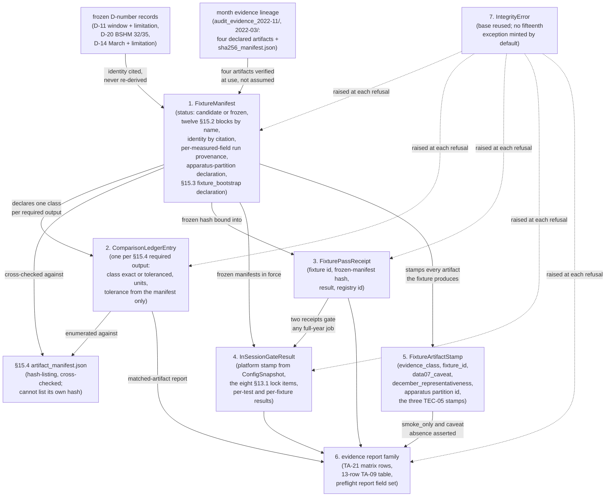

# Domain Entities — `fixtures-and-reproducibility`

> ## ✳ G-09 IS SIGNED — 2026-08-28, **D-31** (read this before any G-09 statement below)
>
> The project decision owner **signed and approved G-09 (Agent preflight)** on 2026-08-28,
> recorded as **D-31** in `evidence/DECISIONS.md` with change record
> `governance/CHANGE_RECORD_2026-08-28_G09_signed.md`. **Every statement below of the form
> "G-09 is not signed" / "G-09 stays unsigned" is superseded as to the gate's status**, and
> is left standing as the accurate record of the constraint that applied when it was
> written.
>
> ⚠ **D-31 records the gate's own TE §18.3 preconditions as UNMET, and that disclosure
> travels with the signature.** `configs/`, and until 2026-08-28 `src/`, did not exist, so
> the mandated automated zero-TBD preflight **could not run**; the ten named critical tests
> **cannot be executed in this environment** (no Python interpreter is installed — a
> zero-byte Windows Store stub, no registry entry, no interpreter on disk); and the evidence
> artifact `aws_ai_dlc_preflight_report` **does not exist**. "No failing critical test" is
> therefore **unproven, not proven** — an absence of executions, not an absence of failures.
> This is the owner **opening the gate by authority**, not a record that its evidentiary
> conditions were satisfied, and no reader may infer the second from the first.
>
> **What the signature changes here:** module creation is authorised, and any defect this
> unit deferred *solely* because G-09 barred editing a file is now correctable.
> **What it does NOT change:** G-05 and G-06 remain `Blocked`; G-P1A, G-P2, G-P3A, G-P3C
> and G-07 are unaffected; **TE §18.2's absolute rule stands** — every scientific value this
> unit routed to G-04/G-05 **stays routed**, and no agent may fill a freeze-gate value by
> convenience; and **§18.3's stop-and-report obligation survives its own gate**, being a
> standing rule on implementation rather than a one-time gate condition.

**Unit** `fixtures-and-reproducibility` · **Kind** `library` · **Complexity** M ·
**Deployment** standalone · **Depends on** `acquisition`, `inventory-and-registry`,
`target-standardization`, `external-products`, `features-and-splits`,
`models-and-baselines`, `evaluation-and-comparison`, `statistical-inference`,
`regimes-diagnostics-reporting`

The intra-unit and test-apparatus shapes § Depth (**Q1 = B**) assigns to this stage: the
**two-state fixture manifest**, the **comparison-ledger entry**, the **fixture-pass
receipt**, the **in-session gate result**, the **fixture artifact stamp** that carries the
`smoke_only` class, the DATA-07 caveat and the **December-representativeness prohibition** as
freight, the **three generated evidence report
artifacts**, and **exception placement** under the fourteen-exception hierarchy. This unit
has **no approved cross-package boundary signature of its own** — `run_walking_skeleton.py`
is a script row in `services.md` and the manifests are data — so every shape below is
intra-unit or test apparatus, **field names are indicative**, and the **obligations** each
shape carries are the contract.

> **Remediation of `GOV-2026-08-28-FD-01` (verdict FAIL), applied 2026-08-28.** Seven items
> from the project decision owner's ruling, each carrying a dated note at its site, of which
> five touch these shapes: **Rec 24** — § 1 declares §15.3's mandatory reduced-replicate
> `fixture_bootstrap` (count, scored range, 24 h / 48 h block counts) as **test apparatus**
> under R-122's authority; **Rec 36** — **D-14's second clause** enumerated in § 1's
> limitations block and carried as § 5's new **`december_representativeness`** field on
> **both** fixtures; **Rec 9** — § 6 distinguishes this unit's
> `environment_and_cpu_preflight_report` (**G-07**) from `aws_ai_dlc_preflight_report`
> (**G-09**, **`foundation`'s**, discharged by **FR-WS-7**), supporting-row figure re-derived
> as **5**; **Rec 42** — § 6 records that `test_or_experiment_ref` checks **presence, not
> coverage**, that **TA-15 must not be read as covered**, and that `dataset_version`'s
> **unruled** encoding blocks the release path (**no encoding invented**); **Rec 47** — § 4
> records the in-session gate's **own measured total runtime**, carried into § 6's report.
> **Rec 5** (BLOCKER) and **Rec 30** land in `business-rules.md` / `business-logic-model.md`
> and `functional-design-questions.md` respectively. **D-28** ratifies the G-06 locked-test
> scored set as **2–31 December 2022 (30 days)** — owner-approved under the recorded authority
> equivalence, the Vision §8.2 / TE §7.1 embargo conflict **recorded, not resolved**, **no
> supervisor signature claimed**. **Entity count unchanged at 7**; controls **36 → 39**,
> must-not-fire **10 → 11** (derived in `business-rules.md`). **No measured value is stated,
> inferred or substituted** (§15.1).

**No scientific value is fixed here and no measured number is stated.** The window (D-11),
station (D-20), month (D-14), seeds, folds and grids are frozen elsewhere and **cited, never
re-derived**; every count, tolerance and runtime is **measured under §15.1 and frozen by the
Q-31 authority**, and none exists yet. **G-09 is not signed and no module, manifest,
receipt, emitter or fixture directory is created.** **BLK-02** (owned) is open on
implementation only; **BLK-03 ↓, BLK-04 ↓, BLK-08 ↓, BLK-09 ↓** remain open exit conditions
on this stage — **BLK-08 ↓ reaches § 2 directly**, made a checked refusal by the units
obligation there rather than an inheritance carried in silence.

## Sources

- `../../../inception/application-design/component-methods.md` — § Depth (**Q1 = B**: intra-package shapes this stage's to specify, names indicative; every signature there is a cross-package boundary and **this unit has none**); `ConfigSnapshot` (`platform: "kaggle" | "local"`, `resolved_roots`, `snapshot_dir`, `hashes` for all four configs) and `resolve_platform_roots` — § 4's platform stamp is read from that resolution, never asserted by a caller; § Assumptions (the fourteen exceptions declared where raised until 3.1 places them; no signature encodes a scientific constant); the ADR-11 `FeatureBundle`/`FrameSpec`/`Partition` shapes and the **containment-not-equality** correction § 1's apparatus-partition block is quarantined from.
- `../../../inception/application-design/services.md` — `run_walking_skeleton.py`'s row (the writer of § 3's receipts and the fixture run log); § Ordering contract (**identified by release ID and verified by hash**, never by path convention — the pattern § 3 follows); § Stage entry contract (the approved six steps § 3's routed call site would amend); § Execution platforms (Kaggle carries no git working tree; the resolved roots written into the lock § 4 carries); the **M9** bundle-directory naming rule.
- `../../../inception/units-generation/unit-of-work.md` § 12 — the `Owns` list (the two `fixture_manifest.yaml`s, the traceability matrix and the `environment_and_cpu_preflight_report` among the five bullets — § 1 and § 6 are their specifications), the boundary, **BLK-02**'s limb table and the **ARUC dormancy rule** § 1 records as `dormant`, and the four inherited blockers.
- `../../../inception/units-generation/unit-of-work-story-map.md` — the eight requirement rows; the WS-20/TA-09/TA-17/TA-21 evidence columns § 6's three artifacts must satisfy; the supporting TA-03/TA-04/TA-23/TA-26/TA-27 rows (**5**, re-derived 2026-08-28 from line 239); **line 127's `| FR-WS-7 | foundation | TA-23 |` and line 206's TA-23 row (primary `foundation`, evidence `aws_ai_dlc_preflight_report`) — `foundation`'s requirement and `foundation`'s artifact, this unit's *supporting* row only** (§ 6's two-report box).
- `../../../inception/requirements-analysis/requirements.md` — **REQ-ENG-4** (the manifest-content obligation and §15.4's hash-listing — § 1's blocks and § 2's ledger), REQ-ENG-10 (the §13.1 eight-item lock § 4 carries), NFR-REP-01 (§13.7's exact-equality classes — § 2's `exact` class), FR-WS-1…6, REQ-NFR-A3.
- `../foundation/functional-design/business-rules.md` — **R-01**: the **fourteen**-exception `IntegrityError` hierarchy, base declared in `src/data/config.py`, **six** raised by `foundation` and **eight** by other units; **no fixture-specific exception is among the fourteen**; the constructor requiring the affected file or resource **and** the violated expectation; and the negative control proving an **unenumerated** subclass is still caught — the basis for § 7's default. R-05 (the re-exec sentinel), R-09/R-10 (the `aborted` row; report honestly even when reporting fails), R-13 (a release directory is never overwritten — § 1's superseded-manifest preservation), R-15, R-17.
- `../features-and-splits/functional-design/` — R-74's identity-by-enumeration over the six partition ids and its **must-not-fire** controls (the D-11 seven-day `score` containment passes), R-80's partition list (**F1…F4, `REFIT`, `DEC`** — the six ids § 1's apparatus block must stay outside), R-82; **FU-7 = A**.
- `../statistical-inference/functional-design/business-rules.md` — **R-120 clause 4** (the measured widening-guard runtime frozen into this manifest — § 1's Runtime slot) and clause 3's comparator quarantine; **R-121** (the recovery tolerance living in this manifest — § 1's Numerical-variation slot); **R-122** (fixture parameters as declared constants of the test apparatus; the `tests/fixtures/<fixture_id>/fixture_manifest.yaml` convention consumed beyond this unit).
- `../evaluation-and-comparison/functional-design/` — **R-103** (the BLK-08 joint contract § 2's units refusal depends on), R-104, **R-110** (the emit-from-the-producing-path pattern § 5's stamp adopts), R-109; `domain-entities.md`'s exception-placement table § 7 extends.
- `../regimes-diagnostics-reporting/functional-design/` — R-125's units assertion (the checked-not-silent precedent § 2 applies), R-127/R-129's inventory completeness (the pattern § 1's Required-outputs completeness and § 6's bounded table follow), and its § Assumptions carrying the **"fourteen"** figure § 7's gate item would oblige sweeping.
- `../governance-guards/functional-design/business-rules.md` — R-23/R-24 (both phase-boundary limbs; § 6's TA-27 first-limb-only record), R-25/R-26 (the access log before any December read — no fixture triggers it).
- `../acquisition/functional-design/business-rules.md` — **R-31** (membership from record timestamps, never a name — § 5's record-date obligation), R-36, R-42.
- `evidence/DECISIONS.md` — **D-11** and its 2026-08-22 clarification (window; `Stations:` as eligibility evidence; one-station execution retained; the mandatory limitation; the provisional-Dst restriction; ARUC's shortfall), **D-20** (**BSHM 32/35**), **D-14** (**March 2022, all three cells**; its **Mandatory limitation in both clauses** — (i) the equinox-month clause and (ii) *"It is **not** representative of the locked test month, and **no fixture result may be read as evidence about December behaviour**"*), D-17/D-19 (the contract and support values § 1's expected-schema block asserts), D-18 (the traversal-order lesson § 2's `exact` class answers), **D-28** (the G-06 locked-test scored set = **2–31 December 2022, 30 days**, owner-approved 2026-08-28 under the recorded authority equivalence, with the Vision §8.2 / TE §7.1 embargo-column conflict recorded not resolved and **no supervisor signature claimed**).
- `PreFlight/Technical_Environment_and_Research_Implementation(1)(2).md` — **§15.2** (the manifest table — § 1's blocks), **§15.4** (the required-output tree and *"Every output is hash-listed in `artifact_manifest.json`"* — § 2's ledger domain), §15.1 (two windows; **"One station"**; the binding limitation § 5's stamp enforces), §15.3 (fixture 1 runs M-01…M-05 and a minimal M-06 — why a smoke LSTM number exists at all), §13.1 (the eight lock items — § 4), §13.2 as amended, §13.7 (§ 2's classes), §16/§16.1 (§ 6's bound), §18.3, §19.
- `aidlc/spaces/default/memory/team.md` § Walking Skeleton (the derived-artifact eligibility criterion § 1's Inputs block re-verifies; the **DATA-07 interim caveat** § 5 carries; completeness **measured, not tested**) and § Testing Posture (**G-07 (Blocked, Supervisor)** the gate § 6's report serves; the two-tier error posture); `project.md` § Mandated (TEC-05's three stamps; TC-03e; TC-03f; TC-01; the Kaggle in-session rule; the `TBD — freeze gate` bar).
- Workspace inspection, **2026-08-28**: `tests/` holds three modules, none this unit's; **no `tests/fixtures/` directory**; `src/`, `configs/`, `pyproject.toml` absent; `evidence/audit_evidence_2022-11/` and `evidence/audit_evidence_2022-03/` present, each `sha256_manifest.json` hashing exactly **four** derived files.
- `functional-design-questions.md` (**Q1 through Q9**, all answered **C**; summary receipted), `business-rules.md`, `business-logic-model.md`.

## Entity map

Text fallback: the frozen D-number records supply the fixture manifest's identity fields by
**citation**, and the month's evidence lineage — four declared derived artifacts plus
`sha256_manifest.json` — is **re-verified at use** rather than assumed from the selection
record; the manifest declares one comparison-ledger entry per §15.4 required output and is
cross-checked against `artifact_manifest.json`, which the ledger is also enumerated against;
the frozen manifest's own hash is bound into each fixture-pass receipt and into the
in-session gate result, and the two receipts gate any full-year job; every artifact a fixture
produces carries a fixture artifact stamp whose `evidence_class`, DATA-07 caveat and
`december_representativeness` prohibition travel
with it; the three evidence report artifacts are generated from the receipts, the ledger's
matched-artifact report and the gate result, and assert the absence of `smoke_only` inputs;
and every refusal raises an `IntegrityError` — the **base**, reused, with **no fifteenth
subclass minted by default**.

---

## 1. `FixtureManifest` — the two-state contract, and the only thing that may state an expectation

`tests/fixtures/plumbing_7day/fixture_manifest.yaml` and
`tests/fixtures/scientific_1month/fixture_manifest.yaml` (`unit-of-work.md` § 12's `Owns`),
read **only** through the single validating loader (R-133). **Neither exists**; neither
fixture has ever run.

**State.** `status: candidate | frozen` — the two-state workflow R-134 fixes, with the
**Q-31 human act** between them. `status: frozen` additionally carries the manifest's own
hash as recorded in the evidence record; a superseded manifest is **preserved, never
overwritten** (`foundation` R-13's posture, §13.3's new-version rule).

**The twelve TE §15.2 content areas as required blocks, named not counted** — Identity,
Inputs, Processing, Expected schema, Units, Row-count ranges, Support/missingness, Timestamp
tolerances, Independent reference checks, Required outputs, Runtime, Numerical variation.
A missing **block** fails validation, asserted **per area by enumeration**.

> **⚠ Twelve, derived — a conflict raised, not resolved.** §15.2's table has **13 rows
> including its `Area` header → 12 content areas** (derived 2026-08-28). `requirements.md`
> REQ-ENG-4 asserts *"all thirteen"* and enumerates **nine**, omitting **Processing**,
> **Units** and **Independent reference checks** (9 + 3 = 12). Naming the blocks rather
> than counting them keeps this shape correct whichever numeral a register carries; the
> correction itself is a `requirements.md` change **reported at the gate**.

> **⚠ Three blocks name Phase 2 quantities §7.0 bars Phase 1 from producing** — Inputs,
> Processing, Independent reference checks. **Proposed reading, not applied:** the block is
> **present**, each Phase 2-only quantity recorded **`not_applicable` with its reason**
> (the FR-P1-03-5 precedent). `not_applicable` on a Phase-1-applicable quantity **fails**.

**Identity is cited, never re-derived.** Indicative fields: `fixture_id`;
`window_citation` (**D-11** for `plumbing_7day` — 2022-11-01…07 inclusive; **D-14** for
`scientific_1month` — March 2022, all three cells); `station_citation` (**D-20** — BSHM
32/35, `plumbing_7day` only, §15.1's "One station"); `selection_rule`; `creator`;
`approval_status`. A manifest whose identity fields **disagree with the cited D-number
record fails**.

**The limitations block carries the frozen text verbatim**: D-11's **mandatory
not-representative-of-December limitation** and its **provisional-Dst restriction**
(selection characterisation only — never a modelling input, a frozen tolerance, or a G-05
regime count); and **D-14's Mandatory limitation in both clauses** — (i) *"March 2022 is an
equinox month and does not reproduce December's winter-solstice regime or its activity
distribution"* **and** (ii) *"It is **not** representative of the locked test month, and **no
fixture result may be read as evidence about December behaviour**"*. Machine-readable
freight, not prose elsewhere.

> **⚠ D-14's second clause is enumerated, not carried as a label** *(added 2026-08-28 per
> `GOV-2026-08-28-FD-01` Recommendation 36, board option 2)*. The *"verbatim"* requirement
> above formally covered D-14's whole limitation, but every enumeration in this artifact set
> named only clause (i); derived across all 48 stage artifacts, the string `evidence about
> December behaviour` returned **0 hits**, so the operative prohibition existed nowhere while
> D-11's clauses were enumerated in full at four sites. A partial label was on course to
> become a partial manifest, since the **Q-31 freeze act that transcribes the limitation is
> the same act that would have caught the omission**. It is load-bearing because § 5's
> `smoke_only` quarantine is **correctly** scoped to `plumbing_7day` alone — so
> `scientific_1month`'s outputs legitimately may serve WS-12/WS-13/WS-16/WS-17 evidence, and
> clause (ii) is the **only** barrier between a March number and a December reading. § 5
> therefore also carries it as a machine-readable field.

**The eligibility-evidence block is distinct from the expected-assertion blocks.** D-11's
three-cell measured completeness and D-14's three-cell coverage figures enter as **recorded
eligibility evidence**; the plumbing fixture's own expected counts are measured from its
**BSHM-only** run (§15.1, D-20). **`aruc_shortfall_status: dormant`** with its reactivation
condition — the register's word, and **not** `discharged`.

**Every measured field carries its measuring run's registry id.** Row-count ranges,
support/missingness limits, timestamp tolerances, runtime ranges and floating-point
tolerances each carry provenance; **a measured field without a run id is unrepresentable**,
which is what leaves an invented value nowhere to hide. **No measured value is stated
anywhere in these artifacts.**

**Named cross-unit slots** the READY siblings already rely on: `statistical-inference`
**R-120 clause 4**'s measured widening-guard runtime (Runtime block) and **R-121**'s
planted-correlation recovery tolerance (Numerical-variation block). R-122's convention means
this schema is consumed **beyond** this unit's two directories.

**The §15.3 reduced-replicate `fixture_bootstrap` declaration** (`scientific_1month` only)
*(added 2026-08-28 per `GOV-2026-08-28-FD-01` Recommendation 24, board option 2)*. §15.3
**requires** *"one bootstrap execution at reduced replicate count for timing"* on fixture 2,
and derived 2026-08-28 no unit designed it — `reduced-replicate` / `reduced replicate`
appears **once** across all twelve units (a § Sources citation in this unit's
`business-rules.md`) and **zero** times in `statistical-inference`, which owns
`vector_block_bootstrap`. Three indicative fields, declared **constants of the test
apparatus, explicitly not scientific values**, on **R-122's** authority — the same authority
§ 1's apparatus partitions use, and §15.2's Runtime block already requires the fixture's
runtime figures here:

| Field | Declares | Why here rather than `experiment.yaml` |
|---|---|---|
| `fixture_bootstrap.replicates` | the reduced count, **timing only, never reported** | `statistical-inference` **R-118** declares `replicates` in `experiment.yaml` passed explicitly at every call, and its control (17) **fails a confirmatory interval whose recorded `replicates` differs from the config-declared value** — a second config value would collide with that control or make a timing smoke-test read as a scientific run in the registry |
| `fixture_bootstrap.scored_range` | the scored range in hours, from the apparatus-partition declaration above | makes **R-115** limb 1's divisibility raise **checkable at freeze** rather than latent; R-115's *"never fires"* is derived over `DEC` only |
| `fixture_bootstrap.block_counts` | whole blocks at **24 h** and **48 h** over that range | the same limb: an indivisible range **raises `BootstrapError`** rather than truncating or padding |

Derived arithmetic on the ranges in play, all **calendar facts rather than measured values**:
the raw March window is **744 h** (31 whole 24-h blocks, **15.5** at 48 h); the April and
November validation months after the 24-h exclusion are **696 h** each (29, **14.5**); the
raw seven-day plumbing window is **168 h** (7, **3.5**) — so the 48-hour sensitivity is
**indivisible on every one of them**, and a fixture bootstrap pointed at a raw window would
raise. **No value is stated here**: the count and the range are declared apparatus values
frozen by the Q-31 act, and §15.1 bars inventing them. If the owner rules a replicate count
is **protocol** wherever it appears, board option 1 applies instead — a predeclared
`experiment.yaml` named run on R-118's own pattern — and this block moves there unchanged;
**routed to the gate as a classification question.** Noted: `statistical-inference` is being
amended in parallel so **R-120's widening comparator uses the same replicate count as its
primary call** rather than the literal **10,000**; this unit neither makes that amendment nor
depends on having made it.

**The apparatus-partition declaration** (`scientific_1month`): fixture partition ids over
the March window, **declared constants of the test apparatus** on R-122's precedent,
**distinct from the six frozen ids** (F1, F2, F3, F4, `REFIT`, `DEC` — R-80). A fixture id
offered to the ADR-11 identity check **raises** like any mismatched pair; **no seventh
enumerated exception is minted**. Routed to the gate as a proposal because WS-12/WS-13
evidence semantics turn on it.

**The §15.4 cross-reference.** `artifact_manifest_ref` plus the Required-outputs block,
asserted **complete** against §15.4's enumeration — derived 2026-08-28: **22 tree entries →
20 hash-listable outputs** (excluding the `plots/` directory and `artifact_manifest.json`
itself), of which `target_uncertainty_budget.json` is fixture-2-only → **20 for
`scientific_1month`, 19 for `plumbing_7day`**.

**Refusals.** A missing block; an absent or disagreeing §15.4 hash-listing; a required
output with no declared comparison class; identity disagreeing with its citation; a
provenance-less measured field; a post-freeze edit failing the self-hash; a non-BSHM station
in `plumbing_7day`; an input artifact whose hash disagrees with the month's
`sha256_manifest.json`; **a `scientific_1month` manifest missing any of the three
`fixture_bootstrap` fields, or declaring a `scored_range` not evenly divisible by either
declared block length**. Every one names the file and the violated expectation.

## 2. `ComparisonLedgerEntry` — one class per required output, and the only home of a tolerance

One entry per §15.4 required output, declared **inside the manifest** at freeze time and
consumed by `tests/test_clean_run.py` (R-139). Indicative fields: `output_path`;
`comparison_class` (`exact | toleranced`); `units`; `fp_tolerance` (present only when
`toleranced`); `runtime_range` and `storage_range` for the run-level entries;
`tolerance_provenance` (the measuring run's registry id).

- **`exact` covers §13.7's five classes** — hashes, schemas, partition membership, IDs and
  deterministic CPU transformations — compared for **equality, not tolerance**. A mismatch
  **raises** naming file and expectation and **never updates the expectation**. The D-18
  re-merge is why: an identical record set hashed differently because output order followed
  directory traversal, and only a sort on the dedup key made two runs agree byte for byte
  (`DATA-17`).
- **`toleranced` covers floating-point predictions and metrics**, against the manifest's
  declared tolerance for that field. **No tolerance, class or expectation may live in a test
  body** — TC-03e's shape applied to test apparatus, and R-122's convention read as this
  unit's own obligation.
- **Runtime and storage** are asserted inside the manifest's **measured** ranges (TA-17's
  declared runtime and storage tolerances) — the slot R-120 clause 4's measured
  widening-guard cost lands in.
- **BLK-08 ↓ is a checked refusal, not an inheritance.** A `toleranced` entry declaring
  **TECU** units for an output whose producing path declares **no inverse route** is **not
  freezable and is refused** — R-125's precedent (make the dependence checked at the surface
  the register names) applied at the tolerance surface. Until
  `evaluation-and-comparison`'s **R-103** joint contract is adopted by **both** halves, no
  TECU-stated clean-run tolerance is checkable, and this shape says so out loud.
- **Refusal:** an output with no entry; an entry with no `units`; a tolerance whose
  provenance is absent.

## 3. `FixturePassReceipt` — "passed" as an artifact with provenance

Written by `run_walking_skeleton.py` on each fixture pass (R-140), following
`services.md` § Ordering contract's release pattern — **identified by release ID and
verified by hash, never by path convention**. Indicative fields: `fixture_id`;
`frozen_manifest_hash`; `result`; `registry_run_id`; `completed_at_utc`; `platform`.

- **Exactly two receipts exist**, one per mandated fixture. The **M10 contract fixture's
  result is recorded in the clean-run evidence, never as a third receipt** — §9.2's "both"
  is not extended by the owner's Q12 = C ruling.
- **One exported check function** consumes both, verifies each against the **frozen**
  manifest hash, and asserts **plumbing before scientific** and **both before any full-year
  job**. A **re-frozen manifest invalidates old receipts by construction**.
- **Survives sessions and platforms**, which is the point: a Kaggle session has no memory of
  a local run, so a receipt is what carries "passed" across the boundary the ordering rule
  has to hold over.
- **Refusals:** a scientific run with no plumbing receipt; a full-year invocation missing
  either; a receipt whose manifest hash disagrees with the frozen manifest; a receipt
  written from a `candidate` manifest, **refused at write time**.
- **The check's call site is routed to the gate** — a **seventh stage-entry step**
  (`foundation`'s approved six-step surface, a formal `services.md` amendment this stage may
  not make) or an **in-script assertion the nine scripts adopt by contract** — **proposed,
  not applied**. Neither is a `component-methods.md` boundary contract, so neither enters
  the amendment ledger.

## 4. `InSessionGateResult` — the gate proved where the governed run runs

Emitted in-session before any governed Kaggle run (R-141); referenced by that run's registry
evidence record. Indicative fields: `platform` (**read from `ConfigSnapshot.platform`** —
resolved by `foundation`'s `resolve_platform_roots`, **never asserted by the caller**);
`environment_lock` carrying the **eight §13.1 items** (the `requirements.txt` hash and the
per-run `pip freeze`; Python, OS, CPU and key library versions; the **code commit**; the
four configuration snapshot hashes; input dataset and manifest versions; **platform**; known
nondeterministic operations); `frozen_manifest_hashes` (both, in force at emission);
`started_at_utc`/`completed_at_utc`; `critical_test_results` (per test);
`fixture_results` (per fixture); **`measured_total_runtime`** — the wall-clock total of the
critical set plus both fixtures as executed in that session, **recorded into § 6's
`EnvironmentAndCpuPreflightReport` at G-07** *(added 2026-08-28 per `GOV-2026-08-28-FD-01`
Recommendation 47)*.

- **`measured_total_runtime` records a total against no ceiling, deliberately.** Verified
  rather than assumed: **no session or wall-clock limit exists in any authority.** The only
  quota is the ~30 Kaggle **GPU** hours per week at Vision §4.4, *"available but not
  required"*, which does not bind the CPU path this shape governs, and no unit references a
  session limit. **No resource infeasibility was found and none is asserted.** The field
  exists because this shape stacks the critical set **and both fixtures** ahead of the
  governed work in one session, so a full-year governed run can carry fixture 2's complete
  ladder in front of the confirmatory work — and while `fixture_results` and the two
  timestamps already make the total *derivable*, it was recorded nowhere a reviewer reads.
  **No ceiling is invented to compare it against**, and the field is a record, not a
  refusal.

- **The rule it makes checkable** (TC-03g, `binding: hard`; §9.1/§9.2): the **critical test
  set and both fixtures** run **inside the Kaggle session** before any governed run there,
  because a Kaggle session carries **no git working tree**, no commit hook fires, and a
  local suite run proves nothing about the environment the governed run executes in.
  REQ-NFR-A3's gap — NFR-REP-01 governs *a* clean environment, not *the* platform — is
  closed by the platform stamp.
- **Refusals, each one of BENCH-01's three substance violations:** a `local`-stamped result
  offered as in-session evidence (**wrong platform**); a result whose code commit or
  config-snapshot hashes disagree with the governed run's own §13.1 lock (**wrong code**);
  a result predating the frozen manifests in force (**wrong manifests**). A governed Kaggle
  run whose evidence record lacks a gate result **fails before domain work**.
- **It is also TA-03's and TA-26's evidence** — install and restore results from both
  platforms — emitted by the same act that satisfies the rule, so the evidence column is a
  parse rather than a transcription.

## 5. `FixtureArtifactStamp` — the freight that cannot be forgotten

Applied **by the producing path** to every artifact a fixture run emits (R-135, R-136;
R-110's emit-from-the-producing-path pattern, adopted so the caveat and the class travel
*with* the artifact rather than beside it). Indicative fields: `evidence_class`
(`smoke_only` for every `plumbing_7day` artifact); `fixture_id`; `data07_caveat` (the
provenance caveat, machine-readable, until the `raw_isprint_cache/` re-acquisition discharges
it); **`december_representativeness`** (value `not_representative`, on **both** fixtures —
added 2026-08-28, see below); `apparatus_partition_id` (`scientific_1month`, from § 1's
declaration); and the three TEC-05 stamps
`phase_id`/`source_id`/`target_definition_id`.

- **`smoke_only` is why FR-WS-2 is a mechanism rather than a memory.** §15.3 **requires**
  fixture 1 to run M-01…M-05 and a minimal M-06 that saves and restores its best
  checkpoint, so a seven-day LSTM number really is produced, and §15.1's binding limitation
  is that it *"may not be cited, plotted as a result, or interpreted as skill"*. **Every
  evidence-bearing surface asserts the absence of `smoke_only` inputs** — results
  artifacts, the § 6 acceptance table and matrix, releases — so a plumbing-derived figure
  entering evidence fails **structurally**.
- **`data07_caveat` propagates onto the fixture run log and every artifact carrying the
  fixture's coverage figures**, which is the only shape under which `team.md`'s *"must state
  it wherever relied on"* is checkable. The provenance it records is **unverifiable in
  principle, not merely unverified**: no provider byte stream for the pre-TC-06 evidence
  exists anywhere in the workspace.
- **`december_representativeness: not_representative` carries the operative second clause of
  the governing limitation for *both* fixtures** — D-11's for `plumbing_7day`, D-14's for
  `scientific_1month` — and is **asserted present wherever a fixture-derived figure is
  reported** *(added 2026-08-28 per `GOV-2026-08-28-FD-01` Recommendation 36, board option
  2)*. Its justification is the one this shape already makes for `data07_caveat` and which
  applies verbatim: **a caveat living in prose outside the artifact is exactly the kind that
  fails to appear there.** It goes on **both** fixtures, and the scientific one needs it
  more: `evidence_class: smoke_only` is **correctly** scoped to `plumbing_7day` alone, so
  without this field the fixture whose numbers *may* be cited would carry the **weaker** of
  the two caveats. The field **flags rather than adjudicates** — it cannot distinguish a
  legitimate methodological citation from an illegitimate December inference and does not
  claim to; what it does is make the prohibition travel with the number instead of living in
  a decision record the citing surface never reads.
- **The record-date obligation is asserted at assembly, not on this stamp**: every input
  record's **observation date** is checked against the window bounds and the December
  exclusion **on record timestamps**, by **consuming `acquisition` R-31 and
  `tests/test_acquisition_window.py`'s existing predicate** — no third copy of the rule.
- **`apparatus_partition_id` is quarantined both ways**: no fixture artifact may carry a
  frozen confirmatory partition id, and no fixture id may enter the six-id space.
- **Refusals:** a `smoke_only` artifact reaching an evidence surface; a coverage figure
  emitted without the `data07_caveat` field; **a fixture-derived figure reported without
  `december_representativeness`, from either fixture — and a `scientific_1month` artifact
  cited as December evidence, caught by that field's presence at the citing surface**; a
  fixture artifact carrying a frozen partition id; a December-dated record at assembly
  (caught by record date even when the folder name says otherwise).

## 6. The evidence report family — three generated artifacts with refusal semantics

`unit-of-work.md` § 12's `Owns` names the traceability matrix and the
`environment_and_cpu_preflight_report`; the TA-09 acceptance table is TA-09's own evidence
column. All three are **derivations, never hand-maintained documents** (R-142), because the
acceptance vocabulary is explicit that evidence is machine-readable or reviewable and
**visual inspection alone is insufficient**.

**`TraceabilityMatrixRow` (TA-21).** Indicative fields: `requirement_id`;
`decision_ref` (its D-number); `test_or_experiment_ref` (the test module or registered run);
`evidence_artifact_id`; `data07_caveat` **and `december_representativeness`** where a
fixture-derived figure is relied on.
**All three links are mandatory** — a row missing any of them **fails** rather than
rendering blank — and the matrix's **completeness is asserted against the
implemented-requirement list**. A row citing a **test module absent from the workspace
fails**, which today has live subjects: **18 of REQ-ENG-4's 21 modules are unwritten**, and
`tests/` holds only `test_acquisition_window.py`, `test_phase_boundary.py` and
`test_release_hashes.py`.

> **⚠ `test_or_experiment_ref` checks a module's *presence*, not its *coverage* — and one
> existing module makes that gap concrete** *(recorded 2026-08-28 per
> `GOV-2026-08-28-FD-01` Recommendation 42, as a limitation of this shape's own check rather
> than a claim about another unit's design)*. `tests/test_release_hashes.py` **exists** (267
> lines) and its **name matches the mandated §12 module**, so a row citing it passes the
> absence check — but derived 2026-08-28,
> `grep -c "dataset_version|mask_id|feature_set_id|row_count|exclusion"` over it returns
> **0** and `grep -c "overwrite|write_release"` returns **0**: **none of §13.3's required
> manifest fields is covered and R-13's overwrite refusal is not exercised**, so **TA-15 must
> not be read as covered** on the strength of a matching filename. Widening the field into a
> per-module coverage assertion is **not proposed here** — the §13.3 field contract is
> `foundation`'s (its R-11/R-12/R-13) and asserting another unit's coverage from this matrix
> would be a trespass — so this is a **gate disclosure**. Related and open: **`dataset_version`'s
> encoding is unruled and the release path is blocked on it** — `foundation` R-12 records
> idempotence **PROVIDED** and injectivity **NOT YET ESTABLISHED**, so `write_release` cannot
> be implemented until the encoding is a **D-number decision**. ⚠ **SUPERSEDED 2026-08-28 by D-29** (`GOV-2026-08-28-FD-01` Rec 42, board option 2, owner-approved): the encoding is **the first 12 hex of `content_hash`**, and **injectivity is established by verify-on-write** — `write_release` refuses a prefix already naming a different `content_hash`, raising `ReleaseError`. The `verify_release` amendment is discharged in substance with **no signature change claimed**, and **no release ledger is introduced**. `write_release` is now implementable. ⚠ **TA-15 remains NOT covered** and D-29 does not cover it. The board recommended a
> **fixed-length prefix plus a recorded collision bound and a verify-on-write uniqueness
> check** (which would also discharge the `verify_release` amendment R-12 lists as open); the
> alternative is the **full 64-hex `content_hash`**. **No encoding is invented here.**

**`FixtureAcceptanceTableRow` (TA-09's evidence).** Indicative fields: `ws_row_id`;
`status` (`PASS | FAIL`); `evidence_link`; `producing_script_or_test`; `receipt_ref`. The
table is **bounded to the 13-row FR-WS-4 set by construction** — **WS-01 plus WS-09…WS-20**
(derived 2026-08-28: 13 rows, WS-02…WS-08 deferred as 7, 13 + 7 = 20, agreeing with §16's
twenty) — and the **WS-02–WS-08 deferral to G-P3A is stated on the table itself**.
**Refusals:** a `PASS` with no evidence link; **any WS-02…WS-08 row present at all** — the
deferral that took a supervisor countersignature (2026-08-16) and a named WS-01 exception
(2026-08-21) to settle is enforced by the emitting path as a **raise, not a footnote**.

**`EnvironmentAndCpuPreflightReport` (G-07's named evidence; TA-03's).** A **fixed field
set** assembled from `foundation`'s §13.1 environment lock plus the clean-run results — the
eight lock items, the platform, the CPU-only completion record, the runtime and storage
figures against their measured ranges, the matched-artifact comparison result, the two
receipt references, **§ 4's `measured_total_runtime` for the in-session gate** (added
2026-08-28 per Recommendation 47), and the `data07_caveat` **plus
`december_representativeness`** wherever a fixture coverage figure appears — so **G-07's
evidence column is a parse, not a screenshot**.

> **⚠ This is not TA-23's artifact, and TA-23 is not this unit's to discharge** *(added
> 2026-08-28 per `GOV-2026-08-28-FD-01` Recommendation 9, board option 1)*. Two distinct
> reports serve two distinct gates, and the design set had treated them as one:
>
> | Artifact | Gate | Owner |
> |---|---|---|
> | **`environment_and_cpu_preflight_report`** | **G-07 Reproducibility** (Vision:1121; content defined at TE:530) | **this unit** — the shape above |
> | **`aws_ai_dlc_preflight_report`** | **G-09 Agent preflight** (Vision:1123); also TA-23's evidence column (TE:1119) and §18.3's named artifact (TE:1083) | **`foundation`** — **not this unit**, and named nowhere in these three design artifacts because this unit does not build it |
>
> **TA-23's discharging requirement is `foundation`'s as well**: **FR-WS-7**, criterion
> *"`aws_ai_dlc_preflight_report` shows all four preconditions met"*, owned by `foundation`
> per `unit-of-work-story-map.md:127`. This is the **same discharge pattern** the design
> already flags for REQ-ENG-4/TA-09, and flagging one while leaving the other silent is what
> the finding caught. `foundation` is being amended in parallel to own it with the artifact in
> its family. **Supporting-row figure re-derived 2026-08-28** from
> `unit-of-work-story-map.md:239` — `TA-03, TA-04, TA-23, TA-26, TA-27` — **= 5, and it stays
> 5**, since line 206 lists this unit as TA-23's supporting party: the *claim* is corrected,
> not the count. This unit's contribution to TA-23 is the clean-run and gate-test results
> §18.3's decision criterion consumes, **never the report**.

**TA-27 is recorded first-limb-only.** The matrix records this unit as **supporting evidence
for the first limb** — Phase 1 cannot import raw GNSS modules (`governance-guards` primary,
R-23/R-24) — and the **transition-manifest hash-diff limb as deferred to G-P2/G-P3C**, never
claimed inside Phase 1. Claiming the second limb here would assert a Phase 2 result from a
Phase 1 artifact.

**All three refuse a `candidate` manifest** (R-134's evidence bound): WS-20, TA-09 and
TA-17 evidence cannot be produced against an unfrozen expectation.

## 7. Exception placement — no fifteenth exception minted by default

`foundation` R-01: **all fourteen** project exceptions derive from `IntegrityError` (base
declared in `src/data/config.py`), six raised by `foundation` and eight by other units, and
each raising unit's 3.1 declares its own. **No fixture-specific exception is among the
fourteen**, so this unit has none to declare — and the default is deliberate:

| Exception | Of the fourteen? | Declared | Raised here on |
|---|---|---|---|
| **`IntegrityError`** (base, reused) | it **is** the base | by `foundation` (`src/data/config.py`); imported | every refusal in § 1–§ 6: a missing §15.2 block, an absent or disagreeing §15.4 hash-listing, a class-less required output, an identity/citation disagreement, a provenance-less measured field, a post-freeze self-hash failure, a foreign-station or December-dated record at assembly, a caveat-less coverage figure, a frozen partition id in a fixture artifact, an `exact`-class mismatch, a test-body tolerance, an out-of-range runtime or storage figure, a TECU tolerance with no inverse route, a missing or stale or candidate-derived receipt, an out-of-order sequence, a GPU-dependent completion, a `local`-stamped or hash-mismatched or pre-freeze gate result, an absent-module matrix citation, a `PASS` without evidence, a WS-02…WS-08 row |
| `LeakageError` | yes | by `features-and-splits`; **not raised here** | consumed precondition only — a fixture partition id offered to the ADR-11 identity check raises **there**, and no seventh enumerated exception is minted |
| `LockedTestError` | yes | by `governance-guards`; **not raised here** | consumed precondition only — both fixtures are December-free by construction, so no clean-run path constructs a December read |
| **`FixtureError`** | **no — a fifteenth, named at the gate** | would be declared here as an `IntegrityError` subclass | the ordering, manifest and receipt violations above, **if the gate chooses it** |

**Why base reuse is the default.** It changes **no** READY text, and R-01's own negative
control already proves that a subclass **not named in any catch list** is still caught by the
stage-entry contract — so nothing is lost in catchability. R-01 explicitly admits *"any
future integrity-related exception"*, so `FixtureError` is available; what it costs is
stated rather than discovered: R-01's **"fourteen"** is a **representation** carried in
`foundation`'s READY text **and** in `regimes-diagnostics-reporting`'s § Assumptions, so
minting a fifteenth obliges the **cross-representation sweep** `project.md`'s corrections
mandate — correcting the register entry alone would leave two other representations
asserting the superseded figure to exactly the readers they were written for.

**Every raise carries the affected file or resource and the violated expectation** — R-01's
constructor contract, and the team's two-tier posture. The stage-entry catch (`foundation`
R-10) writes the `aborted` registry row for every one of them without a hand-maintained
list; where reporting itself fails, R-10's report-honestly constraint applies unchanged.
**Completeness shortfalls never raise**: they are recorded as machine-readable fields on the
manifest and the run log, with the artifact marked derived and/or partial.

---

## Requirement coverage

| Requirement | Entities | Acceptance |
|---|---|---|
| FR-WS-1 | § 3 (the two receipts and the exported check), § 1 (identity cited from D-11/D-14) | WS-20, TA-09 (primary) |
| FR-WS-2 | § 5 (`evidence_class: smoke_only` as travelling freight), § 6 (the surfaces asserting its absence) | ⚠ **no row** — candidate §15.2 row proposed at the gate, never applied |
| FR-WS-3 | § 5 (the record-date assembly obligation, consuming R-31 and `test_acquisition_window.py`) | ⚠ **no row** — candidate §15.2 row proposed at the gate, never applied |
| FR-WS-4 | § 6 (`FixtureAcceptanceTableRow`, bounded to 13 rows by construction) | WS-01, WS-09…WS-20 (13 rows) |
| FR-WS-5 | § 2 (the comparison ledger), § 1 (the measured runtime and tolerance blocks) | WS-20, TA-17 (primary) |
| FR-WS-6 | § 4 (`InSessionGateResult`) | TA-03, TA-26 (supporting) |
| NFR-REP-01 | § 2 (the `exact` class and the no-silent-update refusal) | WS-20, TA-17 (primary) |
| REQ-NFR-A3 | § 4 (the platform stamp read from `ConfigSnapshot`, and the staleness bound) | TA-03 (supporting) |

**8 requirements, 2 untested — derived from the story map's rows, the per-unit coverage
summary agreeing.** The two without acceptance rows, by ID: **FR-WS-2, FR-WS-3**; each
lands in a designed falsifier, and **every §15.2 acceptance-row proposal is a gate item**.
**7 entities**, derived by counting this file's numbered sections.

**Two requirements are named but not counted**, both `foundation`'s, discharging onto rows of
this unit *(the second added 2026-08-28 per `GOV-2026-08-28-FD-01` Recommendation 9 — the
design flagged one instance of this pattern and left the identical second one silent)*:
**REQ-ENG-4**, whose acceptance row is **TA-09 — this unit's primary row**, so § 1 is the
shape through which another unit's requirement passes its check; and **FR-WS-7**
(`unit-of-work-story-map.md:127`), whose acceptance row is **TA-23 — this unit's *supporting*
row** and whose criterion names **`aws_ai_dlc_preflight_report`**, **`foundation`'s artifact
evidencing G-09** — not § 6's `environment_and_cpu_preflight_report`, which evidences
**G-07**. **Supporting-row figure re-derived 2026-08-28 from line 239: 5** (TA-03, TA-04,
TA-23, TA-26, TA-27), **unchanged** — line 206 lists this unit as TA-23's supporting party,
so the *claim* is corrected, not the count.

## Assumptions & Open Questions

- **[assumption]** Every field name above is **indicative** (§ Depth Q1 = B); the obligations are the contract. **No shape here amends `component-methods.md`**: this unit has **no approved cross-package boundary signature of its own**, `ConfigSnapshot` is consumed exactly as approved, and § 1's apparatus-partition ids are declared **test-apparatus constants** under R-122's precedent rather than a new partition contract.
- **[assumption]** The consumed shapes — `ConfigSnapshot`, `Partition`/`FrameSpec`/`FeatureBundle`, `Prediction`, the metrics and bootstrap artifacts, the release and hash manifests, the experiment-registry row — are owned by their producing units (`foundation`, `features-and-splits`, `models-and-baselines`, `evaluation-and-comparison`, `statistical-inference`, `inventory-and-registry`); this file specifies only what this unit asserts about them at its own surfaces. **This unit re-implements no hashing** — the single home is `src/data/release.py`.
- **[assumption]** **No fifteenth exception is minted by default** (§ 7); `FixtureError` is a named gate item with the cross-representation sweep cost stated. `LeakageError` and `LockedTestError` are consumed preconditions, **not redeclared and not raised here**.
- **[assumption]** The frozen identities are **cited, never re-derived**: **D-11** (window, mandatory limitation, provisional-Dst restriction), **D-20** (**BSHM 32/35**), **D-14** (**March 2022, all three cells**, with its **Mandatory limitation in both clauses** — (i) the equinox-month clause and (ii) *"It is **not** representative of the locked test month, and **no fixture result may be read as evidence about December behaviour**"*; clause (ii) enumerated at every site from 2026-08-28 per `GOV-2026-08-28-FD-01` Recommendation 36, having previously appeared **0 times across all 48 stage artifacts**, and carried as § 5's `december_representativeness` field on **both** fixtures). Any record stating the scientific window *"remains open under Q-31"* is **stale on disk** (corrected 2026-08-22 under `UG-08`).
- **Conflict raised, not resolved — §15.2's content-area count.** § 1 binds to the **named twelve** (13 table rows minus the header); REQ-ENG-4 asserts **thirteen** and enumerates **nine**, omitting Processing, Units and Independent reference checks (9 + 3 = 12). **Reported at the gate**; correcting REQ-ENG-4 is a `requirements.md` change and the receipted summary's numeral is not this stage's either.
- **Conflict raised, not resolved — three §15.2 blocks name Phase 2 quantities §7.0 bars Phase 1 from producing.** § 1's **proposed reading** (block present; Phase 2-only quantities recorded `not_applicable` with reason, on the FR-P1-03-5 precedent) is **not applied**.
- **Verification obligations owned here:** § 1's per-area, §15.4-cross-check, identity-citation, provenance and self-hash refusals plus the one-station and eligibility raises; § 2's exact/toleranced classes, the no-silent-update raise, the only-copy tolerance check and the **TECU-without-inverse-route refusal that makes BLK-08 ↓ checked**; § 3's four bypass raises and the write-time candidate refusal; § 4's platform-stamp, lock-hash and staleness refusals; § 5's `smoke_only` absence assertions, caveat propagation, record-date assertion and partition quarantine; § 6's three-link completeness, `PASS`-without-evidence, WS-02…WS-08 and caveat refusals; § 7's constructor-contract compliance on every raise; **§ 1's three `fixture_bootstrap` refusals and its indivisible-scored-range refusal**; **§ 5's `december_representativeness` presence assertion on both fixtures**. Enumerated as controls **(1)–(39)** in `business-rules.md` § Negative-control count — re-derived there 2026-08-28 as 5+4+5+2+3+4+5+4+3+4 = **39** after the `GOV-2026-08-28-FD-01` remediation added **(37)** (Rec 24), **(38)** (Rec 36) and **(39)** (Rec 5) to the prior **36** — with **11** must-not-fire controls listed separately (previously 10).
- **Governance dependencies owned outside this unit:** **the two manifest freeze acts** (the project owner's under **Q-31**; TE §18.2 assigns fixture station, dates and acceptance tolerances to the Student — **nothing here performs them**); **BLK-03/BLK-04/BLK-08/BLK-09**'s contract approvals at their owning units' 3.1 gates — until **BLK-08**'s R-103 joint contract is adopted by both halves, § 2's TECU refusal is what stands between an unfreezable tolerance and a silent one; **the loader's home** (a `foundation` `src/data/` cross-unit contract, which would take the amendment ledger — **7 across 5 today**, derived in `business-rules.md` § Amendments owed as 5 + 0 + 1 + 1 + 0 + 0 — to **8 across 6 at that ruling**, or a `tests/fixtures/` helper, which adds none); **the full-year check's call site** (§ 3 — `services.md`'s approved stage entry contract); **the Phase 1 segment's clean-run data scope** (the runtime-tolerance freeze depends on it, so **it must be ruled before any tolerance is frozen**; segment **membership** is settled, corrected 2026-08-28 per Recommendation 5); **the classification of §15.3's reduced replicate count** (§ 1 — apparatus constant under R-122, or a predeclared `experiment.yaml` named run on R-118's pattern if the owner rules a replicate count is protocol wherever it appears); **the apparatus-partition reading and the M10 §13.2 placement** (§ 1, § 5); **the FR-WS-2/FR-WS-3 candidate rows** (Vision §15.2, owner/supervisor); **`dataset_version`'s encoding** — **unruled, and the release path is blocked on it**: `foundation` R-12 records idempotence **PROVIDED** and injectivity **NOT YET ESTABLISHED**, so `write_release` cannot be implemented until the encoding is a **D-number decision** ⚠ **SUPERSEDED 2026-08-28 by D-29** (`GOV-2026-08-28-FD-01` Rec 42, board option 2, owner-approved): the **encoding** is specified — the first **12 hex** of `content_hash` — and **injectivity is established by verify-on-write**, `write_release` refusing a prefix that already names a different `content_hash`. The **`verify_release` amendment** is discharged in substance (the read-back hole closes on the write path) with **no change to that functions signature claimed**. **No release ledger is introduced.** Release immutability never depended on any of this. ⚠ **TA-15 remains NOT covered** — `tests/test_release_hashes.py` still exercises none of §13.3s manifest fields and not R-13s overwrite refusal.; the board recommended a fixed-length prefix with a recorded collision bound and a verify-on-write uniqueness check (which would also discharge the `verify_release` amendment R-12 lists as open), the alternative being the full 64-hex `content_hash` — **no encoding is invented here**, and separately **TA-15 must not be read as covered**, because `tests/test_release_hashes.py` matches the mandated module's name while covering **none** of §13.3's manifest fields and not exercising the overwrite refusal (both derived 2026-08-28; see § 6); **`statistical-inference`'s R-120 comparator amendment** (that the widening comparator use the same replicate count as its primary call rather than the literal 10,000 — amended there in parallel; this unit neither makes it nor depends on it); **`aws_ai_dlc_preflight_report` and FR-WS-7** — **`foundation`'s**, evidencing **G-09**, distinct from § 6's `environment_and_cpu_preflight_report` which evidences **G-07**; **the `raw_isprint_cache/` re-acquisition** that alone discharges § 5's DATA-07 caveat (FU-1 = B); **G-07 Reproducibility (Blocked, Supervisor)** — the gate that accepts § 6's report; **G-09 Agent preflight (Open, Supervisor)** — **not signed**, and the gate before which no affected component may be coded; **G-05/G-06** as the freeze events § 3 and § 4 reference, with **D-28** recording G-06's scored set as 2–31 December 2022 (30 days) under the owner's 2026-08-28 approval, its Vision §8.2 / TE §7.1 embargo conflict recorded not resolved, a revised split manifest owed at G-05, and **no supervisor signature claimed**; **G-P3A** for WS-02–WS-08 and **G-P2/G-P3C** for TA-27's second limb.
- **Open — BLK-02 is not closed by these shapes.** § 1 specifies the manifests' design; **the manifests do not exist, neither fixture has ever run, and no measured value exists or is claimed.** ARUC's one-bin shortfall is recorded **`dormant`, not `discharged`**, with its reactivation condition intact.
- **Open — BLK-03 ↓, BLK-04 ↓, BLK-08 ↓, BLK-09 ↓ are exit conditions on this stage.** Nothing in this file closes any of them; **no implementation may proceed while any stands**.
- **G-09 is not signed.** ⚠ **G-09 IS SIGNED as of 2026-08-28 (D-31)** — this prohibition's stated ground no longer holds, and module creation is authorised. **The other grounds stated alongside it, if any, are untouched**, and D-31's disclosure travels with the signature: the §18.3 preflight never ran, the critical tests are unexecuted in this environment, and `aws_ai_dlc_preflight_report` does not exist. **No scientific value becomes fillable** — TE §18.2 and §18.3's stop-and-report rule are unchanged. These shapes are design only: no module, manifest, receipt, gate result, evidence emitter, test module or `tests/fixtures/` directory is created. **TE §18.3's stop-and-report rule binds** while any P0 decision is unresolved.
- **None** of the above decides a scientific value, and **no measured number appears in any of these three artifacts**; the enumerations encoded here — §15.2's twelve areas, §15.4's twenty/nineteen outputs, §13.7's five exact classes, §13.1's eight lock items, FR-WS-4's thirteen WS rows, R-80's six partition ids, **§13.2's seven Phase 1 stage-script invocations against its Phase 2 segment's two exclusive scripts, and the nine *distinct* scripts §12 counts across both** — are frozen upstream and merely carried.

---

> **Re-confirmation receipt, 2026-08-29 — `fixtures-and-reproducibility`.** The 2026-08-27T21:49:36Z REDO jump reset every unit's
> receipt floor, and this unit's content had already changed after that floor under the 2026-08-28
> post-execution pass (D-29 through D-32; **G-09 signed under D-31 with its TE §18.3 preconditions
> disclosed unmet**). The owner re-confirmed that post-execution content via the Consolidated
> Summary Confirmation at the foot of `functional-design-questions.md`, receipted `2026-08-29`.
> **No line above this marker was touched by this pass**, no count was re-derived, and nothing here
> discharges TA-15, WS-18 or TA-18, creates `aws_ai_dlc_preflight_report`, or alters the fact that
> stage 3.1 remains **FAIL** with no board having passed it.
