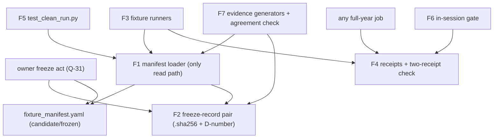

# Logical Components — `fixtures-and-reproducibility`

**Unit** `fixtures-and-reproducibility` (Bolt 12) · **Kind** `library` · **Stage** `nfr-design`

> ## ⚠ NOTHING HERE IS CLAIMED SATISFIED
>
> Component inventory for apparatus that **does not exist** — neither fixture has run, no
> measured value exists, no interpreter, no `configs/`, TensorFlow pin `TBD — freeze gate`.
> The two freeze acts are the owner's under Q-31. Every component below is design for 3.5.

## Sources

- `nfr-design-questions.md` — **Q1 = C**, **Q2 = A**, receipted.
- `security-design.md` (this stage) — SD-X-01…SD-X-03.
- `../nfr-requirements/security-requirements.md` and `../nfr-requirements/tech-stack-decisions.md` — SEC-X-01…SEC-X-04, TS-X-01…TS-X-05; the `library`-kind Scope note standing in for the absent `performance-requirements.md`, `scalability-requirements.md` and `reliability-requirements.md` (not produced for this unit by design).
- `../functional-design/business-logic-model.md` — W-1…W-10, mapped onto components.
- `evidence/DECISIONS.md` — D-11, D-14, D-18.

---

## Component inventory

Test apparatus and evidence surfaces; this unit owns no stage script. Names proposed to 3.5.

| # | Component (proposed) | Owns | Workflows | Raises |
|---|---|---|---|---|
| F1 | manifest loader | the one schema, the one read path; sibling-hash check (Q1 = C step 1); refuses invalid, mismatched or hash-broken manifests | W-1, W-2 | integrity raise naming file + expectation |
| F2 | freeze-record pair | `fixture_manifest.sha256` sibling (mechanical) + D-number hash record (governance); written only by the owner's freeze act | W-2 | — (written by the owner, checked by F1/F7) |
| F3 | fixture runners | plumbing (D-11, one-station enforced, `smoke_only` stamped) and scientific (D-14) runs; record-date December exclusion | W-3, W-4, W-5 | raise on scope/date violation |
| F4 | fixture-pass receipts | per-fixture receipt carrying its §13.1 lock items and the cited prior receipt (Q2 = A); the exported two-receipt check | W-7 | full-year job without two lock-matching receipts fails |
| F5 | `tests/test_clean_run.py` | the amended §13.2 sequence verbatim, CPU with no GPU visible; comparison ledger (exact/toleranced per manifest) | W-6 | mismatch raises, never updates expectation |
| F6 | in-session gate | platform-resolved, lock-bound gate result; governed Kaggle run without it (or stamped `local`) fails before domain work | W-8 | fail before domain work |
| F7 | evidence generators | the matrix, the 13-row bounded acceptance table, `environment_and_cpu_preflight_report`; the sibling/D-number **agreement check** (Q1 = C step 3) | W-9, W-10 | generated paths refuse; disagreement raises naming both sites |

## Component boundaries and isolation

Text fallback: the owner's freeze act writes the manifest's frozen state and both halves of
the freeze-record pair; every manifest read goes through the loader, which checks the
sibling hash; fixture runners and the clean run read only via the loader; runners emit
lock-bound receipts; any full-year job passes the two-receipt check; the in-session gate
consumes the same lock items; evidence generators read via the loader and run the
sibling/D-number agreement check.

- **F1 is the intended single failure domain for manifest integrity** — with the standing,
  body-stated limit that nothing enforces the chokepoint today (`yaml.safe_load` bypasses
  it; R-132's convention unwritten). The limit is the design's most important sentence and
  is carried on every surface that relies on F1.
- **F2 is write-once per freeze**: only the owner's act writes it; no code path in this unit
  mutates it. The agreement check (F7) is read-only.
- **One staleness rule** (Q2 = A): F4's receipts and F6's gate share the §13.1 lock-identity
  discriminator — one definition, two consumers, no drift surface.
- **Quarantined id space** (R-137): fixture partition ids cannot collide with scientific
  partition ids; `smoke_only` stamps travel with plumbing outputs and evidence surfaces
  assert their absence.
- **Import boundary (TA-07)**: nothing here imports `src/external/iri.py` or `src/external/gim.py`.

## Failure domains and blast radius

| Failure | Domain | Blast radius | Containment |
|---|---|---|---|
| Manifest edited to match a bad run | F1/F2 | refused at load | sibling-hash mismatch; agreement check catches a sibling edited without a D-number |
| Reader bypasses the loader | unbounded | schema + hash + freeze all bypassed | **not contained today** — R-132's convention unwritten; stated, never claimed closed |
| Receipt lost or environment changed | F4 | full-year job blocked, fixtures re-run | fail-closed by lock-binding; cost, never a wrong result |
| Non-deterministic write order | F5's ledger | exact-class hash unstable (D-18's real failure) | TS-X-02's declared ordering keys; mismatch raises, expectation never updated |
| Governed Kaggle run without in-session evidence | F6 | run refused before domain work | TC-03g `binding: hard` |
| Freeze act skips the D-number write | F7 | agreement check fails | by design — the two-step is the owner's deliberate act |

Unit posture: **fail-closed everywhere a mechanism exists, and the one hole (loader bypass)
is named in the body of every artifact that rests on it** rather than absorbed.

## Shared resources

| Resource | Owner | This unit's access |
|---|---|---|
| `fixture_manifest.yaml` + freeze-record pair | **this unit (schema/loader), owner (freeze act)** | loader-only reads; freeze writes are the owner's |
| §13.1 environment-lock items | `foundation` (capture), consumed here | recorded into receipts (F4) and gate results (F6) |
| Fixture-pass receipts | **this unit (F4)** | consumers: any full-year job, the in-session gate, G-07 evidence |
| `evidence/DECISIONS.md` freeze entries | owner | read-only, by F7's agreement check (test apparatus, not the loader) |
| The nine stage scripts | other units | driven as scripts by F5 with `--config configs/` |

## Cross-cutting notes for 3.5

- Owed: the sibling-file naming and the D-number extraction mechanism for F7's agreement
  check (fallback already stated in `security-design.md` if prose parsing proves unreliable);
  the receipt recording surface — **prefer `foundation`'s append-safe registry rows over free
  files, so receipts inherit tamper-evidence** (SD-X-02's stated limit, governance
  Recommendation 7) — and where receipts live on each platform; F1's module home.
- Standing stop-and-report triggers: TensorFlow pin `TBD`; `configs/` absent;
  `resolve_platform_roots` non-existent (F6 unrunnable); the freeze acts owner-gated.
- No new dependency: `pyyaml`, `hashlib`, `pandas`, `pyarrow`, `pytest` only (TS-X-01/02).

## Assumptions & Open Questions

- **[Q2]** Receipt reuse across platforms is bounded by the lock: a local receipt never
  satisfies a Kaggle governed run, because TC-03g's in-session obligation and the platform
  lock item both refuse it — stated so nobody reads lock-bound reuse as cross-platform reuse.
- **[assumption]** The §13.1 item set is complete enough for both consumers (receipts, gate).
  Inherited limit, owed to G-07's evidence review.
- **Carried — the loader chokepoint unenforced; the freeze acts the owner's; neither fixture
  has run; BLK-08 ↓ checked not inherited.**
- **None** of the above decides a scientific value, fills a `TBD — freeze gate` field, or
  claims a gate, acceptance row or test as discharged.
