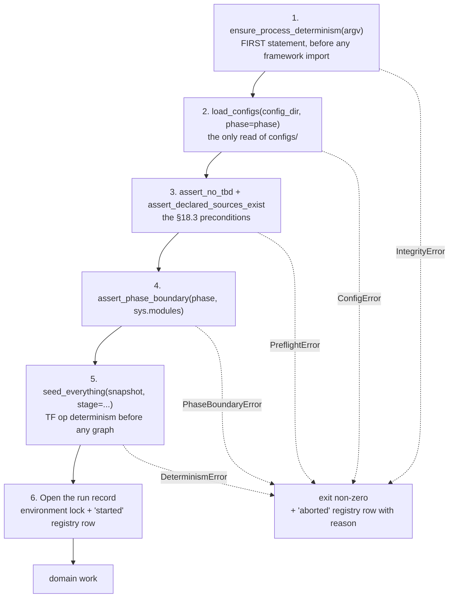
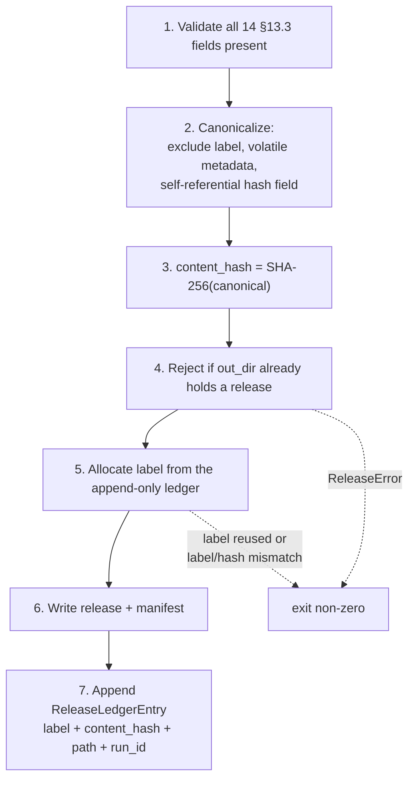

# Business Logic Model — `foundation`

**Unit** `foundation` (Bolt 1) · **Kind** `library` · **Depends on** — (dependency root)

> **Addendum re-confirmed 2026-08-24.** Site **9** of
> `governance/CHANGE_RECORD_2026-08-24_foundation_amendments.md` § Addendum lands in this
> file: a dated annotation box at the head of § Review, naming three statements the
> amendment sweep left asserting a superseded status. **The READY verdict is untouched, no
> finding is withdrawn, and no reviewer sentence is rewritten.** No rule, entity, workflow
> or contract changed; **no count moved**; no scientific value was touched.

> **Re-established five times on 2026-08-23** — the fifth after a redo aimed at four stale
> cross-references in `target-standardization`'s question file. **No content of this unit
> changed on that occasion either.**

> **Re-established four times on 2026-08-23**, after four stage-wide redo jumps aimed
> respectively at a correction in `acquisition`, corrections in `external-products`, a
> misread depth policy in `component-methods.md`, and a sweep of two question files that had
> fallen stale against their own corrected artifacts. Each reset the receipt floor for
> **every** unit of this stage. **No content of this unit changed on any of the four
> occasions** — the summary was re-confirmed and the artifact re-saved so the receipts match
> the current attempt.

The workflows, algorithms and processing sequences this unit implements. A **Bolt**
is one build pass over one piece of the work, ending in something that runs;
`foundation` is Bolt 1 and the dependency root, so every workflow below runs before
any domain work in every later Bolt.

**No workflow here computes a scientific quantity.** This unit loads, hashes,
seeds, records and releases. The values it moves are governed by D-number; the
mechanisms that move them are what this document fixes.

## Sources

- `../../../inception/units-generation/unit-of-work.md` § 1 `foundation` — responsibility, `Owns`, boundary, the 16 requirements carried, the 7 acceptance rows, and the `ensure_process_determinism`-first constraint.
- `../../../inception/units-generation/unit-of-work-story-map.md` — the requirement-to-acceptance mapping; 2 of 16 carry no §16/§19 row.
- `../../../inception/requirements-analysis/requirements.md` — REQ-ENG-1, -2, -3, -4, -6, -7, -8, -10, -11; FR-P1-01-10; FR-P1-04-11; FR-P1-05-13; FR-WS-7; NFR-AUD-01; NFR-SEC-01; NFR-DET-01.
- `../../../inception/application-design/component-methods.md` — the approved signatures and raise-contracts for `src/data/config.py` and `src/data/release.py`.
- `../../../inception/application-design/components.md` and `component-dependency.md` — layering, import boundaries, § Shared resources.
- `../../../inception/application-design/services.md` — § Stage entry contract (six ordered steps), § Ordering contract, § Run record and registry.
- `../../../inception/delivery-planning/bolt-plan.md` — Bolt 1's Definition of Done and § Gate 0's permitted/barred boundary before G-09.
- `../../../inception/practices-discovery/team-practices.md` — § Code Style, § Testing Posture.
- `functional-design-questions.md`, `domain-entities.md`, `business-rules.md`.

---

## W-1 — The stage entry contract

The six-step sequence every stage script's `main()` performs before any domain
work. Identical in all nine scripts, which is why `config.py` exists as a module
rather than as nine copies.



Text fallback: steps 1 → 2 → 3 → 4 → 5 → 6 run in strict order, then domain work.
Any of steps 1–5 raising an `IntegrityError` subclass exits non-zero and writes an
`aborted` registry row carrying the reason.

**Ordering constraints that are not stylistic:**

- **Step 1 is first, before any framework import.** A re-exec after TensorFlow
  loads is pointless (FU-1 = D at stage 2.6).
- **Step 5 precedes any graph construction.** Enabling TensorFlow op determinism
  afterwards is not equivalent, and `seed_everything` raises `DeterminismError` if
  TensorFlow is already initialised.
- **Step 6 precedes domain work**, so an aborted run is already visible.

**Step 4 is skipped only by `02_build_vtec_target.py`**, which is Phase 2 by
definition and asserts `phase == 2` instead.

**Failure behaviour (R-10).** On a steps 1–5 raise the script exits non-zero with a
message naming the file and the violated expectation, and writes an `aborted`
registry row. **If that registry write itself fails**, the original exception is
preserved, both failures reach stderr, and the process exits non-zero **without
claiming an aborted record was written.** It never proceeds with a warning.

## W-2 — `load_configs` — read, snapshot, hash, resolve

```
INPUT   config_dir: Path, phase: int
OUTPUT  ConfigSnapshot (frozen)
RAISES  ConfigError — a file missing, unparseable, or phase not in {1, 2}
        PlatformError — platform not identifiable as exactly one of two
```

1. **Validate `phase`** ∈ {1, 2}. Raise `ConfigError` otherwise.
2. **Parse all four** governed configs — `data.yaml`, `features.yaml`,
   `experiment.yaml`, `seeds.yaml` — with a strict YAML load that **rejects
   duplicate keys** (`_parse_yaml`). A duplicate key silently dropping a governed
   value is an integrity failure, not a parse convenience.
3. **Copy verbatim** into the run's snapshot directory (`_write_snapshot`). Verbatim
   because the snapshot is the evidence of what the run actually read; a
   re-serialised copy proves the parser's behaviour, not the file's content.
4. **Hash each of the four** (SHA-256), populating `hashes`.
5. **Resolve platform roots** from the environment; populate `resolved_roots` and
   `platform`.
6. **Freeze and return.**

**Invariant (R-16).** No machine path enters the four configs, so relocating the
workspace never changes a governed hash. Machine paths live only in
`resolved_roots`.

**Boundary.** This is the only read of `configs/` anywhere in the pipeline.
Downstream units receive resolved values, never a path into `configs/`.

## W-3 — Preflight — `assert_no_tbd` and `assert_declared_sources_exist`

```
INPUT   snapshot: ConfigSnapshot, required: Sequence[str]
OUTPUT  None
RAISES  PreflightError naming EVERY offending field
```

**`required` is supplied from the `(stage, phase)`-keyed map** (R-03), never from a
per-script literal.

1. **Look up** `required_fields` for `(stage_slug, phase)`.
2. **Flatten** the nested config structures for scanning (`_flatten_for_tbd_scan`).
3. **Two rejections, both fatal** (R-02):
   - a required field **absent** from the configuration;
   - a required field whose value is the **`TBD — freeze gate`** sentinel.
4. **Collect all offenders, then raise once**, naming every one. A first-failure
   raise makes a human fix fields one run at a time.
5. **`assert_declared_sources_exist`** — every declared source and hash resolves.
   A declared hash that does not resolve is a **failure, never a warning**
   (the §18.3 clause restored by `DATA-13`).

**Phase asymmetry is the point.** Under `--phase 1`, Phase-2-only fields are
legitimately `TBD` and are **not** in the Phase-1 required set, so Phase 1 passes
without anyone filling a sentinel — which `project.md` § Forbidden prohibits. Under
`--phase 2` those same fields **are** required.

**Completeness of the map is asserted separately** (R-03): a test walks the parsed
configuration and fails when a governed required field appears in no map entry. The
map is a list; the test is what makes it a rule.

## W-4 — `seed_everything` and the determinism probe

```
INPUT   snapshot: ConfigSnapshot, stage: str
OUTPUT  DeterminismRecord
RAISES  DeterminismError — TensorFlow already initialised
```

1. **Guard.** If TensorFlow is already initialised, raise `DeterminismError`.
   Enabling op determinism afterwards is not equivalent.
2. **Apply seeds** from `seeds.yaml` to Python, NumPy and TensorFlow →
   `seeds_applied`.
3. **Enable TensorFlow op determinism** *before any graph construction* →
   `tf_op_determinism`.
4. **Capture** `pythonhashseed` from the environment, `reexec_performed` from
   step 1 of W-1, and `framework_versions`.
5. **Probe** for nondeterministic operations (Q3 = C) → `nondeterministic_ops`,
   recording **which operation classes were examined**.
6. **Cross-check** the observed set against any expected set declared in
   configuration; **record mismatches** rather than reconciling them.
7. **Classify the measurement**: `complete`, `partial` where the framework cannot
   give a full assessment, or `not-yet-measured` where the relevant operations have
   not executed.
8. **Freeze and return.**

**Excluded by design.** `seed_everything` does **not** touch the bootstrap seed —
that carve-out is `src/evaluation/bootstrap.py` by ADR-05, a design decision rather
than an oversight.

> ## ✅ STEPS 5–7 ARE NOW FULLY RECORDABLE — AMENDMENT B APPROVED 2026-08-24
>
> **Superseded status, preserved:** this box read *"STEPS 5–7 CANNOT BE FULLY
> RECORDED UNDER THE APPROVED CONTRACT"* — `probe_scope`, `measurement_status` and
> `declared_vs_observed_mismatches` did not exist in `DeterminismRecord`, which
> carried **six** fields, and until the amendment was approved **no output of this
> unit could state or imply that determinism had been measured**. Silence was then
> the correct output.
>
> **Amendment B is APPROVED** (project decision owner, 2026-08-24;
> `CR-2026-08-24-FOUNDATION-AMENDMENTS`). `component-methods.md` now defines **nine**
> fields — derived, not carried:
> `awk '/class DeterminismRecord/,/^$/' component-methods.md | grep -cE "^ +[a-z_]+: "` → `9`.
>
> **The prohibition is lifted.** Steps 5–7 write to `probe_scope`,
> `declared_vs_observed_mismatches` and `measurement_status` respectively, so the
> scope and status of the measurement are now recorded rather than implied.
>
> **What is unchanged: R-06.** An empty `nondeterministic_ops` is still **never proof
> of determinism**. What the amendment buys is that an empty result is no longer
> *ambiguous* — `probe_scope` says what was examined and `measurement_status`
> distinguishes `complete` from `partial` and `not-yet-measured`. That distinction,
> not the empty list, is what Q3 = C was chosen to secure.

## W-5 — Opening the run record

Step 6 of W-1. Writes the environment lock and the `started` registry row **before**
domain work.

**Eight fields, seven §13.1 bullets** — derived, with the provenance stated so
neither count stands alone:

```
awk 'NR>=749 && NR<=760 && /^- /' <TE> | wc -l   ->  7
```

Bullet 1 names two distinct captures, so the row carries eight fields. REQ-ENG-10's
criterion says *"A registry row exists carrying all eight fields"* — the field
reading is operative.

| # | Field | Source |
|---|---|---|
| 1 | `requirements_hash` | the pinned `requirements.txt` |
| 2 | `pip_freeze` | per-run capture |
| 3 | `runtime_versions` | `DeterminismRecord.framework_versions` + platform probe |
| 4 | `code_commit` | git HEAD |
| 5 | `config_hashes` | `ConfigSnapshot.hashes` — all four |
| 6 | `input_versions` | release manifests consumed |
| 7 | `platform` | `ConfigSnapshot.platform` |
| 8 | `nondeterministic_ops` | `DeterminismRecord` |

**Every field populated, not `unavailable`.** A run capturing none of them **fails
the check rather than completing silently** — REQ-ENG-10, which binds from the next
run forward because the thirteen prior runs are recorded as violating it and the
§13.1 list *"was not captured at the time and cannot be reconstructed"*.

> **REQ-ENG-10 has no acceptance row.** TA-03 was checked against all seven bullets
> and covers **none fully** — two partially, and both partials are install-time
> rather than per-run, which is the entire substance of the requirement.
> `requirements.md` records the same conclusion in REQ-ENG-10's own test column.
>
> **Amendment A was raised and DECLINED, 2026-08-24** *(superseded status: "Amendment A
> pending")*. The project decision owner rejected adding §19 rows for REQ-ENG-7 and
> REQ-ENG-10, on the evidence that **no project rule requires universal §19 coverage**,
> that the approved position dispositions uncovered requirements as *"Open by design"*,
> and that this unit already designs both as enforceable obligations without them.
> `CR-2026-08-24-FOUNDATION-AMENDMENTS`, Amendment A.
>
> **This resolves Q7=X rather than contradicting it.** Q7=X directed that a §15.2
> change request be *raised*; it was, and the owner declined it. Raising a request
> never obliged its approval.
>
> **REQ-ENG-10 therefore remains untested by design, permanently rather than
> provisionally**, and travels in the ordinary set handed to NFR requirements. **No
> acceptance coverage is claimed** — that statement is now settled, not awaiting an
> amendment.

## W-6 — Registry append

```
INPUT   run_id, status, reason (required when aborted|failed), payload
OUTPUT  one appended JSONL line
RAISES  RegistryError — unknown status, or empty reason on aborted|failed
```

1. **Validate the status** against the closed enum `started` | `completed` |
   `aborted` | `failed` (R-07). Needs no read of prior rows, so it costs nothing
   against the append-only guarantee.
2. **Require a non-empty `reason`** for `aborted` and `failed`.
3. **Append.** Never read the run history (R-08), never rewrite, never delete.

**Transitions are not checked here.** The graph — `started → completed|aborted|failed`,
with duplicate `started`, repeated terminals, transitions out of terminals and
malformed rows all rejected — is enforced by a **separate integrity test** (R-08).
A log whose write path depends on reading is no longer a pure append, and that
purity is the only reason append-only is trustworthy.

**Integrity test timing.** Before TA-10 / G-09 acceptance, and before registry
contents are relied on as audit evidence.

**Derived CSV.** `experiment_registry.csv` is regenerated by folding the JSONL,
hashed, and marked derived. A stale CSV is a **completeness shortfall recorded in
the run manifest**, not a fatal error — the non-fatal tier.

## W-7 — `write_release` and label allocation

```
INPUT   manifest, files, out_dir
OUTPUT  Path to the written release
RAISES  ReleaseError — a §13.3 field absent, or out_dir already holds a release
```



Text fallback: validate the fourteen fields, canonicalize excluding the label and
volatile metadata, hash to get the authoritative identity, reject a directory that
already holds a release, allocate a label from the ledger, write, then append the
ledger entry. A reused label or a label/hash mismatch raises.

**Which identifier is authoritative (R-11).** The **content hash**. The label is
derived, for citation at a human-reviewed gate, and **explicitly not
authoritative** — every integrity guarantee here is hash-based, so putting the
label in charge would elevate the weaker identifier.

**Never overwritten (R-13).** A directory already holding a release is rejected, and
repeated writes are **not** silently treated as successful.

**Label allocation (R-12).** From a durable append-only ledger at
`artifacts/registry/release_history.jsonl`, **separate** from the experiment
registry. Never from a directory scan and never from a derived index — delete a
release directory and a rebuilt index forgets the label, so the next allocation
reuses it.

**`source_files`' six items** are validated against `inventory.py` rather than
restated as a bare hash.

> **✅ Amendment C APPROVED 2026-08-24.** *Superseded status, preserved: "Amendment C
> pending. The ledger is in no approved `Owns` list. Both approved artifacts
> (`services.md`, `unit-of-work.md`) are unedited."* Both have since been annotated in
> place on the owner's approval (`CR-2026-08-24-FOUNDATION-AMENDMENTS`): the ledger is
> now in `unit-of-work.md` § 1 `foundation` → `Owns` and in `services.md` § Run record
> and registry, which reads **three artifacts, one authoritative**.
>
> **Its authority is Q6=D and FU-2=D**, not an engineering preference. Q6=D requires a
> *monotonic, human-readable* label alongside the authoritative hash — choosing that
> over option C's *"version derived from the manifest hash"* — and FU-2=D names the
> durable append-only ledger, its ownership and its append behaviour. Monotonicity
> requires durable state, which is precisely why a directory scan cannot serve.
>
> **No TE §12 amendment was needed** — `artifacts/registry/` is already enumerated and
> the §12 tree carries zero file-level entries inside `artifacts/`. **R-11 is
> unchanged**: the content hash remains authoritative and the label remains a citation
> device.

## W-8 — `resolve_platform_roots` and the credential precondition

```
INPUT   env: Mapping[str, str]
OUTPUT  (platform_label, resolved_roots)
RAISES  PlatformError — platform not exactly one of the two authorised
```

1. **Identify the platform** as exactly one of **`kaggle`** or **`local`**
   (TC-03c). No third platform is authorised. Raise `PlatformError` otherwise.
2. **Resolve roots** from the environment.
3. **Return the label and roots. No credential value is read, returned, logged,
   serialized, interpolated or persisted** — not here, not in any foundation-layer
   diagnostic (R-14).

**The credential presence check is a separate, stage-specific precondition** — not
part of this workflow. Only stages that **actually require authenticated provider
access** apply it; it is not required for unrelated stages, public providers, or
`foundation` initialization itself.

**What the presence check proves, and what it does not.** It checks that required
environment-variable **names** are present and fails early naming any that are
missing. It **does not** prove a value is non-empty, valid, or authorized — the
provider client performs value validation **without exposing the secret**. Stated
because a presence check mistaken for a validity check reports a readiness that
does not exist.

**Precondition, not a claim.** The `.gitignore` credential deny-list **must exist
before the first relevant commit**, and NFR-SEC-01 / TA-22 compliance is **not
claimed until the required checks have passed**. `evidence.md` records NFR-SEC-01 as
not satisfied in this workspace today.

## W-9 — What Bolt 1 builds, and what it must not

**Permitted before G-09** (`bolt-plan.md` § Gate 0 boundary):

- the §12 directory tree, `pyproject.toml`, `requirements.txt`, `README.md`, the
  `ruff` configuration;
- the four governed config **files**, every unresolved scientific field carrying a
  visible `TBD — freeze gate` sentinel — **writing a sentinel is not choosing a
  value**;
- transcribing into a config only values already frozen under an approved D-number,
  citing that D-number;
- the `tests/` tree, its conftest and shared fixtures;
- git on `main` with the credential deny-list;
- the pinned environment installed on both platforms, with install logs.

**Barred until G-09 is signed for the affected component:**

- implementing any component whose P0 decision is unresolved;
- filling any `TBD — freeze gate` field;
- executing any governed run, on either platform;
- generating code for a unit carrying an open blocker on that scope.

**Stub stage scripts are scaffolding only when they contain none of:** scientific
implementation, governed execution, full-year processing, data-acquisition logic,
feature-generation logic, model-training logic, or unauthorized December access.
Permitted scaffolding may include module structure, interfaces, placeholder CLI
definitions, configuration wiring, and safe fail-fast behaviour. **One unit per
Bolt is preserved** — a stub that starts carrying a downstream unit's logic has
stopped being a stub.

> **`src/data/config.py`, `src/data/release.py` and `tests/test_determinism.py` do
> not exist.** BLK-01 closed 2026-08-22 under `CR-2026-08-22-TE-AMEND` granting
> **authority only**. Authority to name a module is not authority to write one;
> creation stays gated by G-09, TE §18.3's stop-and-report rule, and stage 3.5.

## W-10 — Fixture-scale only, and the in-Kaggle obligation

**Every demonstration and preliminary execution stays fixture-scale until both
walking-skeleton fixtures have actually passed** — not "assumed to pass", not "will
pass": passed. Bolt 1 owns no fixture run; `run_walking_skeleton.py` is Bolt 12's.

**The in-Kaggle rule is conditional on the execution session, not on a Bolt
number:** any Bolt performing a governed run inside a Kaggle session must first
provide evidence that the required critical tests and the applicable fixtures
passed **inside that same session**. Bolt 1 performs no governed run, so the
obligation does not bind it — but it is stated here because the rule is a condition,
not a list.

**December 2022 is protected throughout.** No `foundation` code path constructs a
path into `evidence/locked_test_restricted/` (R-15); only
`src/data/locked_test.py`, owned by `governance-guards`, may reach it.

---

## Requirement-to-workflow map

**The acceptance column is derived from `unit-of-work-story-map.md` Table 1, not
reasoned from acceptance-row text** — see the correction note below for why that
distinction cost a review iteration. The row that tests a requirement may be
**owned by a different unit**; `domain-entities.md` § Requirement coverage carries
the owner column and the separate seven-row ownership set.

| Requirement | Workflow | Tested by (story-map Table 1) |
|---|---|---|
| REQ-ENG-1 | W-9 | TA-01 |
| REQ-ENG-2 | W-3, W-9 | TA-02 |
| REQ-ENG-3 | W-2 | **TA-03, TA-26** |
| REQ-ENG-4 | W-9 | **TA-09** — *bounded, see story-map § Known defects row 8* |
| REQ-ENG-6 | W-8 | **TA-22** |
| **REQ-ENG-7** | W-6, W-7 | ⚠ **NO ACCEPTANCE ROW, AND NONE WILL BE ADDED** — Amendment A **declined 2026-08-24**; untested by design |
| REQ-ENG-8 | W-2, W-3 | **TA-16** |
| **REQ-ENG-10** | W-5 | ⚠ **NO ACCEPTANCE ROW, AND NONE WILL BE ADDED** — TA-03 verified not to cover it; Amendment A **declined 2026-08-24**; untested by design |
| REQ-ENG-11 | W-5 | **TA-17, TA-26** |
| FR-P1-01-10 | W-8 | TA-22 |
| FR-P1-04-11 | W-2, W-3 | **TA-15** |
| FR-P1-05-13 | W-4 | **TA-10** |
| FR-WS-7 | W-7 | **TA-23** |
| NFR-AUD-01 | W-6 | **TA-10, TA-21** |
| NFR-SEC-01 | W-8 | TA-22 |
| NFR-DET-01 | W-4 | **WS-17, TA-13** |

**16 requirements, 2 without an acceptance row** — REQ-ENG-7 and REQ-ENG-10,
matching the story map's designation.

> **CORRECTION, 2026-08-22 — the first issue of this table was wrong in 10 of 14
> cited rows, and an adversarial review caught it.** Correct on first issue:
> REQ-ENG-1, REQ-ENG-2, FR-P1-01-10, NFR-SEC-01. Wrong row: REQ-ENG-3, -4, -6, -8,
> FR-P1-04-11, FR-P1-05-13, FR-WS-7, NFR-DET-01. Dropped a row from a multi-row
> source: REQ-ENG-11, NFR-AUD-01.
>
> **Cause, worth recording because it is a repeat.** The mapping was **reasoned from
> what each acceptance row's text sounded like it ought to test**, instead of being
> **derived from the story map that already states it**. `project.md` § Way of
> Working requires deriving a fact and printing it before asserting it; this table
> asserted fourteen facts without deriving one. `domain-entities.md` carried the
> identical wrong table, so cross-checking the two artifacts against each other
> could never have caught it — only checking both against the source could.
>
> **Superseded citations, preserved:** REQ-ENG-3 → `TA-02`; REQ-ENG-4 → `TA-01`;
> REQ-ENG-6 → `TA-03`; REQ-ENG-8 → `TA-02`; REQ-ENG-11 → `TA-17` alone;
> FR-P1-04-11 → `TA-02`; FR-P1-05-13 → `TA-26`; FR-WS-7 → `TA-15`; NFR-AUD-01 →
> `TA-10` alone; NFR-DET-01 → `TA-13, TA-26`.
>
> **What did NOT change.** No workflow, rule, entity, invariant or amendment status
> is affected. The error was confined to which acceptance row is cited against each
> requirement; the two requirements with **no** row (REQ-ENG-7, REQ-ENG-10) were
> correctly identified on first issue, and the TA-03 verification that establishes
> REQ-ENG-10's gap was independently confirmed by the reviewer.

## Assumptions & Open Questions

- **[assumption]** Bolt 1 reads REQ-ENG-1 as requiring the §12 tree to **exist** item for item, with module *content* belonging to the Bolt that owns each module. TA-01's evidence column is "Repository tree and code commit", which supports it; no artifact states the split explicitly, and a reader could take REQ-ENG-1 as requiring nine working stage scripts in Bolt 1.
- **[assumption]** `src/data/registry.py` / `Station` and `src/data/locked_test.py` are **not** this unit's, notwithstanding their proximity in `component-methods.md`. See `domain-entities.md` § Assumptions.
- **[assumption]** `frontend-components.md` is not produced — `kind: library`, and the stage maps that artifact to `[ui]` only.
- **Closed — Amendment A** (Vision §15.2): §19 rows for REQ-ENG-7 and REQ-ENG-10. **Raised and DECLINED 2026-08-24** by the project decision owner. No rule requires universal §19 coverage; the approved position dispositions uncovered requirements as *"Open by design"*. Both requirements stay untested **by design**, and the negative-path test specifications in `business-rules.md` keep their *"Test specification only — not an approved acceptance row"* label **permanently**. *(Superseded status: "**Not approved.**", pending.)*
- **Closed — Amendment B** (approved 2.6 artifact): three `DeterminismRecord` fields. **APPROVED 2026-08-24.** `component-methods.md` now defines nine fields; W-4 steps 5–7 are fully recordable and the prohibition on stating that determinism was measured is lifted. R-06 unchanged. *(Superseded status: "**Not approved.** W-4 steps 5–7 cannot be fully recorded until it is.")*
- **Closed — Amendment C** (approved 2.6 and 2.7 artifacts): the release ledger. **APPROVED 2026-08-24**, on the authority of **Q6=D** and **FU-2=D** rather than as an engineering preference. `services.md` and `unit-of-work.md` are annotated in place. R-11 unchanged — the content hash stays authoritative. *(Superseded status: "**Not approved.**")*
- **Open** — the concrete `RequiredFieldsMap` and `CredentialNameMap` contents await the four configs existing. This stage fixes the mechanism.
- **G-09 is not signed.** No workflow here authorises creating a module.
- **None** of the above adopts a reading on a supervisor-owned value, and none decides a scientific constant.

## Review history

This is the **primary** artifact, so the `## Review` section below carries the
reviewer's verdict for the whole unit.

| Pass | Verdict | Effect on this file |
|---|---|---|
| Iteration 1 (adversarial) | **NOT-READY** | § Requirement-to-workflow map wrong in **8 of 14** cited rows, incomplete in **2** more — reasoned from acceptance-row text rather than derived from story-map Table 1 |
| Correction 1 | — | Table re-derived from Table 1; every superseded citation preserved |
| Iteration 2 (adversarial) | **NOT-READY** | Confirmed **this file's** table now matches source. Its two new findings were against `domain-entities.md`'s newly added `Row owner` column and an underived count |
| Correction 2 | — | No change to this file beyond this note; the defects were in `domain-entities.md` |
| Redo jump, 2026-08-22 | — | Budget exhausted at 2 of 2 with correction 2 unreviewed. The project decision owner directed a re-review of `foundation` before any further unit; the jump reset the iteration budget and the receipt floor |
| Iteration 1 of the fresh budget | *pending* | The `## Review` section below is from **iteration 2** and will be replaced by the fresh pass |

**Refutations that failed to land across both passes**, recorded because a failed
refutation is evidence too: Q7 = X's dual B/C limbs are both honoured; Q8's
credential precondition is correctly kept **out** of `resolve_platform_roots`; no
output claims determinism has been measured; all five re-derived counts matched
(`DeterminismRecord` fields = 6, TE §13.1 bullets = 7, requirements = 16,
owned acceptance rows = 7, `artifacts/` file-level tree entries = 0); the TA-03
coverage verification is accurate; and boundary compliance on `registry.py`,
`locked_test.py`, `TBD` fields and scientific constants is clean.

**Nothing in W-1 through W-10 was found defective in either pass.** Both critical
findings were confined to traceability commentary.

## Review

**Verdict:** READY
**Reviewer:** aidlc-architecture-reviewer-agent
**Date:** 2026-08-22T14:56:57Z
**Iteration:** 2 of the fresh 2-iteration budget (final)

> ### ⚠ Annotation, 2026-08-24 — three statements below are superseded
>
> **Authority:** project decision owner, approving an **annotate-in-place** exception on
> 2026-08-24 after the stale text was raised at `governance-guards`'s sixth summary
> confirmation. Recorded under the same Rec 7 precedent that governs the amendment pass in
> `governance/CHANGE_RECORD_2026-08-24_foundation_amendments.md`.
>
> **What changed after this verdict was written.** Amendments **B** and **C** were
> **APPROVED and executed on 2026-08-24**; Amendment **A** was **DECLINED**. This verdict
> is dated 2026-08-22, when all three were still pending, so it describes the state the
> reviewer actually saw. **The verdict itself — READY — is not disturbed, no finding is
> withdrawn, and no reviewer sentence is rewritten.** Three statements are annotated as
> superseded, and the original wording is preserved verbatim in place:
>
> | Where | What it says | Current state |
> |---|---|---|
> | § Regression checks, *"Amendments A/B/C nowhere treated as approved"* | every occurrence carries PENDING / NOT approved | **Superseded.** B and C are approved and executed; A is **declined permanently**. The regression check was correct on 2026-08-22 and is not a live invariant |
> | § Regression checks, *"No determinism claimed as measured"* | no output may claim measured determinism **while Amendment B is pending** | **Superseded.** B's approval **lifted** the blanket prohibition and replaced it with a narrower rule: a measured claim requires `probe_scope` recorded and `measurement_status` = `complete`. **R-06 is unchanged** |
> | § Implementability | *"`DeterminismRecord`'s three pending fields and the release ledger await Amendments B and C (correctly marked not-approved, with the approved six-field contract stated as the current binding shape)"* | **Superseded.** `DeterminismRecord` now defines **nine** fields; the release ledger is named in `services.md` and `unit-of-work.md` § 1 `Owns`. The *"six-field"* phrase is a preserved historical quotation, not a live contract statement |
>
> **Unaffected, because Amendment A was declined:** the same § Implementability sentence's
> clause that *"REQ-ENG-7/REQ-ENG-10's acceptance rows await Amendment A"* now reads as
> **untested by design, permanently** rather than awaiting anything — the requirements
> themselves are unchanged, and **no count moved**.

### Prior findings — disposition, all four occurrences

All four recorded occurrences of the primary-vs-supporting/tested-by confusion class were independently re-verified from source, not taken on the artifacts' own narration, per `cid:practices-discovery:c-board-1` and `cid:application-design:application-design:count-derivation`.

- **Occurrence 1 (pass 1, exhausted budget) — wrong/incomplete acceptance-row citations in `business-logic-model.md` § Requirement-to-workflow map and `domain-entities.md` § Requirement coverage, 8 of 14 cited rows wrong, 2 incomplete — CONFIRMED RESOLVED.** Independently re-derived the full 16-row mapping straight from `unit-of-work-story-map.md` Table 1:
  ```
  for id in REQ-ENG-1 REQ-ENG-2 REQ-ENG-3 REQ-ENG-4 REQ-ENG-6 REQ-ENG-7 REQ-ENG-8 REQ-ENG-10 REQ-ENG-11 FR-P1-01-10 FR-P1-04-11 FR-P1-05-13 FR-WS-7 NFR-AUD-01 NFR-SEC-01 NFR-DET-01; do
    echo -n "$id => "; grep -E "^\| \*{0,2}$id\b" unit-of-work-story-map.md | head -1 | awk -F'|' '{print $4}'
  done
  ```
  Output: `REQ-ENG-1=>TA-01  REQ-ENG-2=>TA-02  REQ-ENG-3=>TA-03,TA-26  REQ-ENG-4=>TA-09(bounded)  REQ-ENG-6=>TA-22  REQ-ENG-7=>NO ROW  REQ-ENG-8=>TA-16  REQ-ENG-10=>NO ROW  REQ-ENG-11=>TA-17,TA-26  FR-P1-01-10=>TA-22  FR-P1-04-11=>TA-15  FR-P1-05-13=>TA-10  FR-WS-7=>TA-23  NFR-AUD-01=>TA-10,TA-21  NFR-SEC-01=>TA-22  NFR-DET-01=>WS-17,TA-13`. This matches, cell for cell, the current tables in both `domain-entities.md` (lines 405–420) and `business-logic-model.md` (lines 388–403), and the six checked `business-rules.md` **Acceptance.** lines (R-05, R-06, R-07, R-08, R-09, R-16). Sound.
- **Occurrence 2 (pass 2, exhausted budget) — the `Row owner` column itself wrong in 3 of 4 multi-row entries, plus underived "13 referenced rows" (true 14) — CONFIRMED RESOLVED.** Re-derived Table 2's `primary`/`supporting` cells directly and diffed against the current `Row owner` column: `awk -F'|' 'NR>=145 && NR<=223 {r=$2; gsub(/[` *]/,"",r); print r": primary="$4" supporting="$5}' unit-of-work-story-map.md` confirms REQ-ENG-3 (TA-03→`foundation`, TA-26→`models-and-baselines`), REQ-ENG-11 (TA-17→`fixtures-and-reproducibility`, TA-26→`models-and-baselines`), NFR-AUD-01 (TA-10→`foundation`, TA-21→`fixtures-and-reproducibility`), NFR-DET-01 (WS-17→`statistical-inference`, TA-13→`models-and-baselines`) all match the current table exactly. Independently re-ran the union-count derivation: result `14` (verified below). Sound.
- **Occurrence 3 (fresh pass, iteration 1) — "supporting on three of these rows: TA-13, TA-23 and TA-26" (TA-23 wrongly included; TA-23's Table 2 `primary` is `foundation` itself) — CONFIRMED RESOLVED in the primary location.** `domain-entities.md` § Requirement coverage now reads "exactly two rows — TA-13 and TA-26" (line 422) with the superseded text preserved verbatim (lines 440–441) and correctly labelled as what was actually wrong.
- **Occurrence 4 (self-sweep) — the identical wrong figure ("3 more") recurring in a second location in the same file, missed by the fix for occurrence 3 — CONFIRMED RESOLVED.** The second location (§ Requirement coverage's closing correction note, lines 477–479) now reads "a **supporting** unit on **2** rows — TA-13 and TA-26," with the stale "3 more" preserved as a superseded quote (lines 483–488) and its own reasoning error stated (TA-23 is one of the 7 *owned* rows, so it could not be "more" under any reading).

### Independent re-derivation of the three relations (not trusted from the artifacts' commands — reproduced from scratch, and cross-checked against a fourth source)

```
awk -F'|' 'NR>=145 && NR<=223 {p=$4; gsub(/[` *]/,"",p); if(p=="foundation"){r=$2; gsub(/[` *]/,"",r); print r}}' unit-of-work-story-map.md
  -> TA-01 TA-02 TA-03 TA-10 TA-15 TA-22 TA-23        (7 — "owns"/primary)

awk -F'|' 'NR>=145 && NR<=223 {if($5 ~ /foundation/){r=$2; gsub(/[` *]/,"",r); print r}}' unit-of-work-story-map.md
  -> TA-13 TA-26                                       (2 — "supports")

for id in <foundation's 16 requirement IDs>; do grep -E "^\| \*{0,2}$id\b" unit-of-work-story-map.md | head -1 | awk -F'|' '{print $4}'; done \
  | grep -oE "(WS|TA)-[0-9]{2}" | sort -u | wc -l
  -> 14                                                 ("tested by")
```

**Fourth, independent source — `unit-of-work-story-map.md` § Per-unit coverage summary**, a table this pass had not previously consulted, gives the same three figures for `foundation` in one row without going through Table 1/2 at all:
```
| `foundation` | 16 | 2 | TA-01, TA-02, TA-03, TA-10, TA-15, TA-22, TA-23 | TA-13, TA-26 |
```
— 16 requirements, 2 untested, primary = the same 7 rows, supporting = `TA-13, TA-26`. This is a cross-check by a wholly different derivation path (an author-maintained summary row rather than a per-row scan), and it agrees exactly with the freshly re-run `awk`/`for` commands above and with the current text of all three artifacts. All three relations (owns=7, tested-by=14, supports=2) are now confirmed **four ways**: the artifacts' own printed commands, this review's independent re-run of those commands, this review's from-scratch derivation, and this fourth, structurally unrelated source.

### Sweep for a fifth occurrence — none found

Every sentence in all three artifacts stating a count or set membership about acceptance rows, ownership, or support was enumerated and checked, including inside `## Review history` tables, correction notes, and preserved-superseded quotes:

- `domain-entities.md`: the entity-map/lifecycle prose (rows-as-shape references, not counts), the "Exactly seven" line (388, confirmed 7 above), the current owner table (405–420, confirmed above), the "exactly two rows" line (422, confirmed above) and its command (427–436, reproduces `TA-13 TA-26`), the third-correction note (438–453, accurately reproduces the superseded "three… TA-13, TA-23 and TA-26" text and correctly identifies TA-23 as one of the 7 owned rows), the "16 requirements, 2 without" line (455, confirmed), the first-correction note (458–479, "8 cited wrong row" list = 8 items, "2 dropped" list = 2 items, 4 correct = 14 total, all individually verified against Table 1 above; "owns 7 / tested by 14 distinct / supporting 2" all confirmed), the fourth-occurrence note (483–489, accurately describes the "3 more" defect and its second location), the derivation-history note (490–498, reproduces `14`), the second-correction note (500–528, all four superseded owner attributions verified wrong-as-stated against Table 2 and all four current values verified correct), and the review-history table (542–559, an accurate narrative of the four passes cross-checked against this session's own findings above).
- `business-logic-model.md`: the "8 cited the wrong row… 2 dropped" correction note (408–431, matches the same 8-item/2-item breakdown verified above), the requirement-to-workflow table (386–403, confirmed identical to Table 1 above), the review-history table (450–457, an accurate narrative), and the now-superseded `## Review` section this pass replaces.
- `business-rules.md`: "2 of 16 requirements carry no row" (18, 431, confirmed REQ-ENG-7/REQ-ENG-10 via the same derivation), the per-rule **Acceptance.** lines with superseded citations (R-05 line 159, R-06 line 195, R-07 line 217, R-08 line 243, R-09 line 261, R-16 line 420 — all six reproduce the current, correct Table 1 values with accurate superseded quotes), and the review-history table (474–479, accurate).

No fifth occurrence of the confusion class, and no other underived or misstated count, exists in any of the three artifacts.

### Every printed command re-run, with results

| Command (abbreviated) | Claimed | Reproduced |
|---|---|---|
| `awk '/class DeterminismRecord/,/^$/' component-methods.md \| grep -cE "^ +[a-z_]+: "` | 6 | **6** |
| `awk 'NR>=749 && NR<=760 && /^- /' <TE> \| wc -l` | 7 | **7** |
| `sed -n '709,721p' <TE> \| grep -cE '\.(jsonl\|json\|csv)'` | 0 | **0** |
| Table 2 primary rollup for `foundation` (NR 145–223) | `TA-01 TA-02 TA-03 TA-10 TA-15 TA-22 TA-23` (7) | **identical** |
| Table 2 supporting rollup for `foundation` (NR 145–223) | `TA-13 TA-26` (2) | **identical** |
| Table 1 union over the 16 requirement IDs, distinct WS/TA count | 14 | **14** |
| Table 1 per-requirement citations (all 16, listed above) | as tabulated in all three artifacts | **identical, all 16** |

Every command in every artifact reproduces its stated output exactly. None found stale.

### Regression checks

- **Q7 = X's dual limbs (B + C combined)** — `functional-design-questions.md` Question 7's filled answer explicitly combines B (negative-path test specifications, clearly labelled "not an approved acceptance row") and C (a Vision §15.2 change request for REQ-ENG-7 and REQ-ENG-10). Both limbs are present: `business-rules.md` § "Rules with no acceptance row" gives the B-form specifications for both requirements and states Amendment A is the pending C-form request. No regression.
- **Q8 = D's credential precondition kept out of `resolve_platform_roots`** — `business-logic-model.md` W-8 and `business-rules.md` R-14 both state the presence check is a separate, stage-specific precondition, never folded into `resolve_platform_roots` itself; grep confirms `resolve_platform_roots` is mentioned only in that boundary-statement context in all three files, never as the site of the check. No regression.
- **Amendments A/B/C nowhere treated as approved** — every occurrence of "Amendment A/B/C" across all three files (checked with a negative grep for anything other than "pending"/"not approved") carries PENDING/NOT approved status. No regression.
- **No determinism claimed as measured** — `business-logic-model.md` W-4's warning block and `business-rules.md` R-06's warning block both state explicitly that no output may claim determinism has been measured for any operation class while Amendment B is pending; no other passage in any of the three files makes such a claim. No regression.
- **`locked_test_restricted/` single-path carve-out** — R-15 states the carve-out "unqualified"; only `src/data/locked_test.py` may construct a path into it, and `foundation`'s own negative control (a static check that no `foundation` module constructs such a path) is unchanged. No regression.
- **W-1 through W-10, R-01 through R-17 unbroken** — confirmed present and sequential by heading scan of both files: `## W-1` through `## W-10` all present in `business-logic-model.md`; `## R-01` through `## R-17` all present in `business-rules.md`. No gaps, no renumbering artifacts.

### Implementability

Stage 3.5 could build `foundation` from these three documents without inventing a decision. The nine domain-entity shapes, the ten numbered workflows (W-1–W-10), and the seventeen rules (R-01–R-17) are mutually consistent, each carries a source citation and (where one exists) an acceptance row, and every genuine gap is explicitly deferred rather than silently filled: `RequiredFieldsMap`/`CredentialNameMap` contents await the four configs' field names (correctly deferred to Bolt 1, not invented here); `DeterminismRecord`'s three pending fields and the release ledger await Amendments B and C (correctly marked not-approved, with the approved six-field contract stated as the current binding shape); REQ-ENG-7/REQ-ENG-10's acceptance rows await Amendment A (correctly specified as test-only, not claimed as coverage). Nothing here asks an implementer to guess a scientific value, a governed hash, or a supervisor-owned reading.

### Summary

All four recorded occurrences of the primary-vs-supporting/tested-by confusion are genuinely resolved, re-verified independently against `unit-of-work-story-map.md` Table 1, Table 2, and (newly, this pass) the structurally independent § Per-unit coverage summary row — a fourth cross-check that agrees exactly. Every command printed across all three artifacts reproduces its claimed output. A full sweep for a fifth occurrence, covering every count and set-membership sentence in all three files including review-history tables and superseded quotes, found none. Q7/Q8's regression items, the amendment-pending discipline, the no-determinism-measured claim, the locked-test carve-out, and the full W-1–W-10/R-01–R-17 sequences all hold. The three documents are implementable as specified, with every genuine gap correctly deferred to a named pending amendment or a Bolt 1 work product rather than silently filled. READY.

---

## Finalized 2026-08-24 — the three amendments are settled

Recorded under `governance/CHANGE_RECORD_2026-08-24_foundation_amendments.md`, after
an independent challenge of each amendment against the approved artifacts. **The
"amendment-pending discipline" the review above verified is now discharged**: no
amendment is pending, so nothing in these documents defers to one.

- **Amendment A — DECLINED.** No project rule requires universal §19 coverage, and the approved position dispositions uncovered requirements as *"Open by design"*. W-5 records **REQ-ENG-10 as permanently uncovered**, and W-6/W-7 likewise for REQ-ENG-7. No count moved: untested stays 36, this unit's stays 2 of 16, its acceptance rows stay 7, TE §19 stays at 36 rows.
- **Amendment B — APPROVED.** `DeterminismRecord` carries **nine** fields, so **W-4 steps 5–7 are fully recordable** and the prohibition on stating that determinism was measured is lifted — replaced by the narrower rule that a measured claim requires `probe_scope` recorded and `measurement_status` = `complete`. **R-06 is unchanged.**
- **Amendment C — APPROVED**, on the authority of **Q6=D** and **FU-2=D** rather than as an engineering preference. **W-7's label-allocation step stands**, and the ledger is now named in `unit-of-work.md` § 1 `Owns` and `services.md`. A draft of the change record proposed rejecting it and deriving the label from the content hash; that is Q6 option C, which the owner had read and declined, and it cannot yield the *monotonic* label Q6=D requires. **R-11 is unchanged** — the content hash remains authoritative.

**G-09 remains unsigned.** Nothing in this document authorises creating a module, and
no scientific value is decided here.
