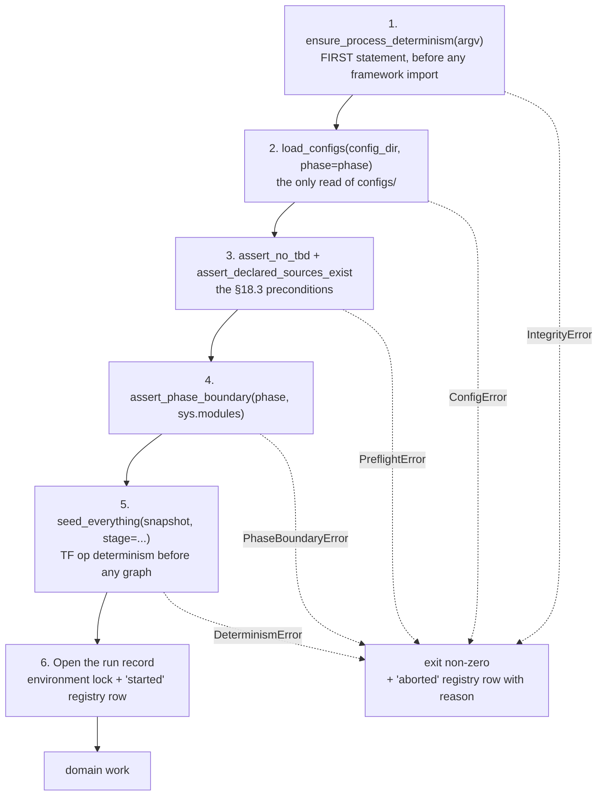
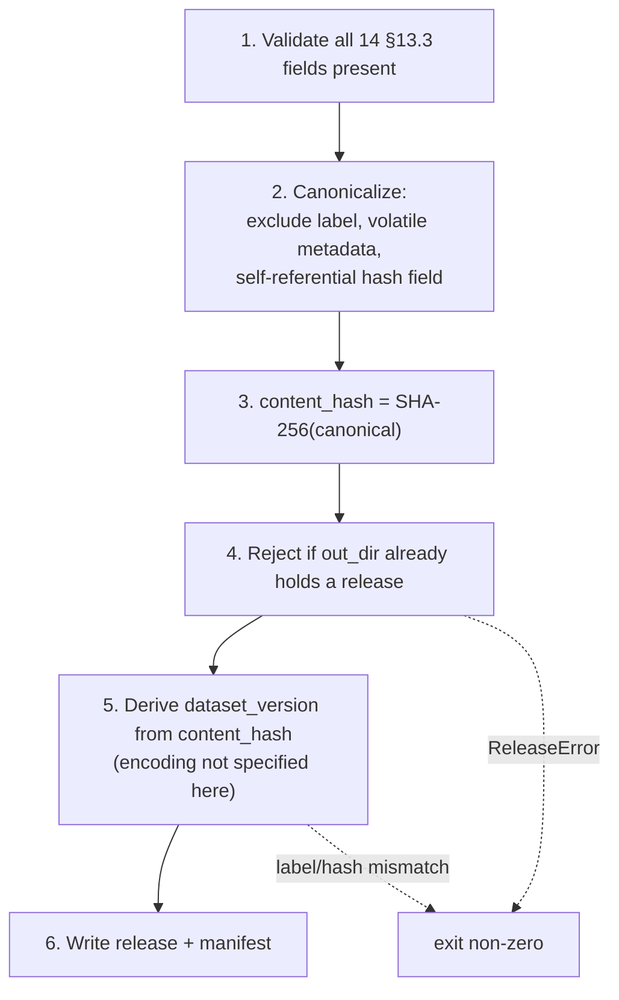

# Business Logic Model — `foundation`

**Unit** `foundation` (Bolt 1) · **Kind** `library` · **Depends on** — (dependency root)

> **Addendum re-confirmed 2026-08-24.** Site **9** of
> `governance/CHANGE_RECORD_2026-08-24_foundation_amendments.md` § Addendum lands in this
> file: a dated annotation box at the head of § Review, naming three statements the
> amendment sweep left asserting a superseded status. **The READY verdict is untouched, no
> finding is withdrawn, and no reviewer sentence is rewritten.** No rule, entity, workflow
> or contract changed; **no count moved**; no scientific value was touched.

> **Re-established five times on 2026-08-23** — the fifth after a redo aimed at four stale
> cross-references in `target-standardization`'s question file. **No content of this unit
> changed on that occasion either.**

> **Re-established four times on 2026-08-23**, after four stage-wide redo jumps aimed
> respectively at a correction in `acquisition`, corrections in `external-products`, a
> misread depth policy in `component-methods.md`, and a sweep of two question files that had
> fallen stale against their own corrected artifacts. Each reset the receipt floor for
> **every** unit of this stage. **No content of this unit changed on any of the four
> occasions** — the summary was re-confirmed and the artifact re-saved so the receipts match
> the current attempt.

The workflows, algorithms and processing sequences this unit implements. A **Bolt**
is one build pass over one piece of the work, ending in something that runs;
`foundation` is Bolt 1 and the dependency root, so every workflow below runs before
any domain work in every later Bolt.

**No workflow here computes a scientific quantity.** This unit loads, hashes,
seeds, records and releases. The values it moves are governed by D-number; the
mechanisms that move them are what this document fixes.

## Sources

- `../../../inception/units-generation/unit-of-work.md` § 1 `foundation` — responsibility, `Owns`, boundary, the 16 requirements carried, the 7 acceptance rows, and the `ensure_process_determinism`-first constraint.
- `../../../inception/units-generation/unit-of-work-story-map.md` — the requirement-to-acceptance mapping; 2 of 16 carry no §16/§19 row.
- `../../../inception/requirements-analysis/requirements.md` — REQ-ENG-1, -2, -3, -4, -6, -7, -8, -10, -11; FR-P1-01-10; FR-P1-04-11; FR-P1-05-13; FR-WS-7; NFR-AUD-01; NFR-SEC-01; NFR-DET-01.
- `../../../inception/application-design/component-methods.md` — the approved signatures and raise-contracts for `src/data/config.py` and `src/data/release.py`.
- `../../../inception/application-design/components.md` and `component-dependency.md` — layering, import boundaries, § Shared resources.
- `../../../inception/application-design/services.md` — § Stage entry contract (six ordered steps), § Ordering contract, § Run record and registry.
- `../../../inception/delivery-planning/bolt-plan.md` — Bolt 1's Definition of Done and § Gate 0's permitted/barred boundary before G-09.
- `../../../inception/practices-discovery/team-practices.md` — § Code Style, § Testing Posture.
- `functional-design-questions.md`, `domain-entities.md`, `business-rules.md`.

---

## W-1 — The stage entry contract

The six-step sequence every stage script's `main()` performs before any domain
work. Identical in all nine scripts, which is why `config.py` exists as a module
rather than as nine copies.



Text fallback: steps 1 → 2 → 3 → 4 → 5 → 6 run in strict order, then domain work.
Any of steps 1–5 raising an `IntegrityError` subclass exits non-zero and writes an
`aborted` registry row carrying the reason.

**Ordering constraints that are not stylistic:**

- **Step 1 is first, before any framework import.** A re-exec after TensorFlow
  loads is pointless (FU-1 = D at stage 2.6).
- **Step 5 precedes any graph construction.** Enabling TensorFlow op determinism
  afterwards is not equivalent, and `seed_everything` raises `DeterminismError` if
  TensorFlow is already initialised.
- **Step 6 precedes domain work**, so an aborted run is already visible.

**Step 4 is skipped only by `02_build_vtec_target.py`**, which is Phase 2 by
definition and asserts `phase == 2` instead.

> **Step 4 is a sequencing reference, not an import by this unit** *(added 2026-08-25 on
> adversarial reviewer finding m-4, at the owner's direction)*. `assert_phase_boundary` lives in
> `src/data/phase_contract.py`, which **`governance-guards` owns** (`unit-of-work.md` § 2;
> `unit-of-work.md` also records `Q5=A`, *"no separate phase-transition unit —
> `phase_contract.py` lives in `governance-guards`"*). This unit is declared to *"import
> nothing from any other unit — this is the DAG's first root"*, and the two statements are
> consistent because **W-1 is the stage script's entry contract, not a `foundation` module**:
> `component-methods.md` states `assert_phase_boundary` is *"Called at entry by every
> phase-aware stage script"*, and W-1 is described here as *"identical in all nine scripts"*.
> The **caller is the script**, which may import from both units; `src/data/config.py` does not
> import `phase_contract.py`.
>
> **Independent confirmation from the DAG.** `unit-of-work-dependency.md` declares
> `foundation depends_on: []` and `governance-guards depends_on: [foundation]`. A real import
> here would make the unit graph **cyclic**, and `units-generation` validated it as acyclic —
> so a genuine import would have failed upstream validation rather than merely reading oddly.
>
> Only the distinction was undocumented; **no design changes and no upstream decision is
> required.**

**Failure behaviour (R-10).** On a steps 1–5 raise the script exits non-zero with a
message naming the file and the violated expectation, and writes an `aborted`
registry row. **If that registry write itself fails**, the original exception is
preserved, both failures reach stderr, and the process exits non-zero **without
claiming an aborted record was written.** It never proceeds with a warning.

## W-2 — `load_configs` — read, snapshot, hash, resolve

```
INPUT   config_dir: Path, phase: int
OUTPUT  ConfigSnapshot (frozen)
RAISES  ConfigError — a file missing, unparseable, or phase not in {1, 2}
        PlatformError — platform not identifiable as exactly one of two
```

1. **Validate `phase`** ∈ {1, 2}. Raise `ConfigError` otherwise.
2. **Parse all four** governed configs — `data.yaml`, `features.yaml`,
   `experiment.yaml`, `seeds.yaml` — with a strict YAML load that **rejects
   duplicate keys** (`_parse_yaml`). A duplicate key silently dropping a governed
   value is an integrity failure, not a parse convenience.
3. **Copy verbatim** into the run's snapshot directory (`_write_snapshot`). Verbatim
   because the snapshot is the evidence of what the run actually read; a
   re-serialised copy proves the parser's behaviour, not the file's content.
4. **Hash each of the four** (SHA-256), populating `hashes`.
5. **Resolve platform roots** from the environment; populate `resolved_roots` and
   `platform`.
6. **Freeze and return.**

**Invariant (R-16).** No machine path enters the four configs, so relocating the
workspace never changes a governed hash. Machine paths live only in
`resolved_roots`.

**Boundary.** This is the only read of `configs/` anywhere in the pipeline.
Downstream units receive resolved values, never a path into `configs/`.

## W-3 — Preflight — `assert_no_tbd` and `assert_declared_sources_exist`

```
INPUT   snapshot: ConfigSnapshot, required: Sequence[str]
OUTPUT  None
RAISES  PreflightError naming EVERY offending field
```

**`required` is supplied from the `(stage, phase)`-keyed map** (R-03), never from a
per-script literal.

1. **Look up** `required_fields` for `(stage_slug, phase)`.
2. **Flatten** the nested config structures for scanning (`_flatten_for_tbd_scan`).
3. **Two rejections, both fatal** (R-02):
   - a required field **absent** from the configuration;
   - a required field whose value is the **`TBD — freeze gate`** sentinel.
4. **Collect all offenders, then raise once**, naming every one. A first-failure
   raise makes a human fix fields one run at a time.
5. **`assert_declared_sources_exist`** — every declared source and hash resolves.
   A declared hash that does not resolve is a **failure, never a warning**
   (the §18.3 clause restored by `DATA-13`).

**Phase asymmetry is the point.** Under `--phase 1`, Phase-2-only fields are
legitimately `TBD` and are **not** in the Phase-1 required set, so Phase 1 passes
without anyone filling a sentinel — which `project.md` § Forbidden prohibits. Under
`--phase 2` those same fields **are** required.

**Completeness of the map is asserted separately** (R-03): a test walks the parsed
configuration and fails when a governed required field appears in no map entry. The
map is a list; the test is what makes it a rule.

## W-4 — `seed_everything` and the determinism probe

```
INPUT   snapshot: ConfigSnapshot, stage: str
OUTPUT  DeterminismRecord
RAISES  DeterminismError — TensorFlow already initialised
```

1. **Guard.** If TensorFlow is already initialised, raise `DeterminismError`.
   Enabling op determinism afterwards is not equivalent.
2. **Apply seeds** from `seeds.yaml` to Python, NumPy and TensorFlow →
   `seeds_applied`.
3. **Enable TensorFlow op determinism** *before any graph construction* →
   `tf_op_determinism`.
4. **Capture** `pythonhashseed` from the environment, `reexec_performed` **from the re-exec
   marker described below**, and `framework_versions`.

> **The `reexec_performed` carrier** *(added 2026-08-25 on adversarial reviewer finding m-3,
> decided by the project decision owner).* `ensure_process_determinism(argv)` returns `None`
> (`component-methods.md`), so nothing crosses the `exec` boundary in its return value, and a
> child process cannot otherwise tell a re-exec from an externally exported `PYTHONHASHSEED` —
> the environment looks identical in both cases. Without a carrier, W-4 step 4 has nothing to
> read and **R-05's negative control cannot discriminate**, so stage 3.5 would have had to
> invent a mechanism.
>
> **The carrier is a sentinel environment variable**, set by the parent immediately before
> `os.execv` and read once by the child. **Exactly one bit of information crosses**: *this
> process is a re-exec child*. `reexec_performed` is `True` when the sentinel is present and
> `False` when it is absent. **The variable's name is not fixed here** — it is an
> implementation identifier carrying no scientific content, no governed value and no config
> field, so it is not a §12/TC-03e constant and belongs in `src/data/config.py` beside the
> function that sets it.
>
> **Why this option.** The alternative that reads more cleanly — changing
> `ensure_process_determinism` to return `bool` — would amend an **approved stage-2.6
> contract** in `component-methods.md`, which needs an amendment rather than a design note. A
> marker file would add filesystem state to a function whose whole purpose is to run before
> anything else. The sentinel is the smallest change that preserves every approved semantic:
> the signature, the first-statement-of-`main()` rule, and the return-immediately path.
>
> **What this is and is not.** It is an engineering decision inside this stage's remit, made
> explicitly rather than assumed, and put to the owner before it was applied. It decides **no**
> scientific value and **no** governed constant, and **G-09 remains unsigned** — nothing here
> authorises writing the module.
5. **Probe** for nondeterministic operations (Q3 = C) → `nondeterministic_ops`,
   recording **which operation classes were examined**.
6. **Cross-check** the observed set against any expected set declared in
   configuration; **record mismatches** rather than reconciling them.
7. **Classify the measurement**: `complete`, `partial` where the framework cannot
   give a full assessment, or `not-yet-measured` where the relevant operations have
   not executed.
8. **Freeze and return.**

**Excluded by design.** `seed_everything` does **not** touch the bootstrap seed —
that carve-out is `src/evaluation/bootstrap.py` by ADR-05, a design decision rather
than an oversight.

> ## ✅ STEPS 5–7 ARE NOW FULLY RECORDABLE — AMENDMENT B APPROVED 2026-08-24
>
> **Superseded status, preserved:** this box read *"STEPS 5–7 CANNOT BE FULLY
> RECORDED UNDER THE APPROVED CONTRACT"* — `probe_scope`, `measurement_status` and
> `declared_vs_observed_mismatches` did not exist in `DeterminismRecord`, which
> carried **six** fields, and until the amendment was approved **no output of this
> unit could state or imply that determinism had been measured**. Silence was then
> the correct output.
>
> **Amendment B is APPROVED** (project decision owner, 2026-08-24;
> `CR-2026-08-24-FOUNDATION-AMENDMENTS`). `component-methods.md` now defines **nine**
> fields — derived, not carried:
> `awk '/class DeterminismRecord/,/^$/' component-methods.md | grep -cE "^ +[a-z_]+: "` → `9`.
>
> **The prohibition is lifted.** Steps 5–7 write to `probe_scope`,
> `declared_vs_observed_mismatches` and `measurement_status` respectively, so the
> scope and status of the measurement are now recorded rather than implied.
>
> **What is unchanged: R-06.** An empty `nondeterministic_ops` is still **never proof
> of determinism**. What the amendment buys is that an empty result is no longer
> *ambiguous* — `probe_scope` says what was examined and `measurement_status`
> distinguishes `complete` from `partial` and `not-yet-measured`. That distinction,
> not the empty list, is what Q3 = C was chosen to secure.

## W-5 — Opening the run record

Step 6 of W-1. Writes the environment lock and the `started` registry row **before**
domain work.

**Eight fields, seven §13.1 bullets** — derived, with the provenance stated so
neither count stands alone:

```
awk 'NR>=749 && NR<=760 && /^- /' <TE> | wc -l   ->  7
```

Bullet 1 names two distinct captures, so the row carries eight fields. REQ-ENG-10's
criterion says *"A registry row exists carrying all eight fields"* — the field
reading is operative.

| # | Field | Source |
|---|---|---|
| 1 | `requirements_hash` | the pinned `requirements.txt` |
| 2 | `pip_freeze` | per-run capture |
| 3 | `runtime_versions` | `DeterminismRecord.framework_versions` + platform probe |
| 4 | `code_commit` | git HEAD |
| 5 | `config_hashes` | `ConfigSnapshot.hashes` — all four |
| 6 | `input_versions` | release manifests consumed |
| 7 | `platform` | `ConfigSnapshot.platform` |
| 8 | `nondeterministic_ops` | `DeterminismRecord` |

**Every field populated, not `unavailable`.** A run capturing none of them **fails
the check rather than completing silently** — REQ-ENG-10, which binds from the next
run forward because the thirteen prior runs are recorded as violating it and the
§13.1 list *"was not captured at the time and cannot be reconstructed"*.

> **REQ-ENG-10 has no acceptance row.** TA-03 was checked against all seven bullets
> and covers **none fully** — two partially, and both partials are install-time
> rather than per-run, which is the entire substance of the requirement.
> `requirements.md` records the same conclusion in REQ-ENG-10's own test column.
>
> **Amendment A was raised and DECLINED, 2026-08-24** *(superseded status: "Amendment A
> pending")*. The project decision owner rejected adding §19 rows for REQ-ENG-7 and
> REQ-ENG-10, on the evidence that **no project rule requires universal §19 coverage**,
> that the approved position dispositions uncovered requirements as *"Open by design"*,
> and that this unit already designs both as enforceable obligations without them.
> `CR-2026-08-24-FOUNDATION-AMENDMENTS`, Amendment A.
>
> **This resolves Q7=X rather than contradicting it.** Q7=X directed that a §15.2
> change request be *raised*; it was, and the owner declined it. Raising a request
> never obliged its approval.
>
> **REQ-ENG-10 therefore remains untested by design, permanently rather than
> provisionally**, and travels in the ordinary set handed to NFR requirements. **No
> acceptance coverage is claimed** — that statement is now settled, not awaiting an
> amendment.

## W-6 — Registry append

```
INPUT   run_id, status, reason (required when aborted|failed), payload
OUTPUT  one appended JSONL line
RAISES  RegistryError — unknown status, or empty reason on aborted|failed
```

1. **Validate the status** against the closed enum `started` | `completed` |
   `aborted` | `failed` (R-07). Needs no read of prior rows, so it costs nothing
   against the append-only guarantee.
2. **Require a non-empty `reason`** for `aborted` and `failed`.
3. **Append.** Never read the run history (R-08), never rewrite, never delete.

**Transitions are not checked here.** The graph — `started → completed|aborted|failed`,
with duplicate `started`, repeated terminals, transitions out of terminals and
malformed rows all rejected — is enforced by a **separate integrity test** (R-08).
A log whose write path depends on reading is no longer a pure append, and that
purity is the only reason append-only is trustworthy.

**Integrity test timing.** Before TA-10 / G-09 acceptance, and before registry
contents are relied on as audit evidence.

**Derived CSV.** `experiment_registry.csv` is regenerated by folding the JSONL,
hashed, and marked derived. A stale CSV is a **completeness shortfall recorded in
the run manifest**, not a fatal error — the non-fatal tier.

## W-7 — `write_release` and label derivation

*(Heading amended 2026-08-25: "label allocation" → "label derivation". Amendment C declined as
drafted; there is no ledger to allocate from. W-7 remains one of the ten workflows W-1…W-10.)*

```
INPUT   manifest, files, out_dir
OUTPUT  Path to the written release
RAISES  ReleaseError — a §13.3 field absent, or out_dir already holds a release
```



Text fallback: validate the fourteen fields, canonicalize excluding the label and
volatile metadata, hash to get the authoritative identity, reject a directory that
already holds a release, derive `dataset_version` from that content hash, then write the
release and its manifest. A label that does not match its content hash raises.

> *(W-7 amended 2026-08-25: **step 7 is removed** and step 5 is changed from ledger allocation
> to derivation from `content_hash`. **Amendment C was DECLINED AS DRAFTED** by the project
> decision owner on 2026-08-25, reversing its 2026-08-24 approval — no release ledger, no
> `ReleaseLedgerEntry`, no `artifacts/registry/release_history.jsonl`, and **no exact
> hash-to-label encoding is invented here**, because no approved artifact specifies one.
> **Superseded steps, preserved:** *"5. Allocate label from the append-only ledger"*, *"7.
> Append ReleaseLedgerEntry — label + content_hash + path + run_id"*, and the fallback clause
> *"allocate a label from the ledger, write, then append the ledger entry. A reused label or a
> label/hash mismatch raises."*
>
> **W-7 remains one of the ten workflows W-1…W-10** — it lost a step, not its existence, so the
> workflow count is unchanged. **What this reversal actually costs is label ordering, and only
> that.** The never-reuse guarantee survives by a different route: the derivation is a pure
> function of `content_hash`, so identical content yields an identical label by construction and
> the delete-and-rebuild failure that motivated the ledger cannot arise — there is nothing that
> allocates and nothing that could forget. Ordering, by contrast, is information about sequence,
> which a function of content alone does not carry, and no implementation choice reaches it.
> **So the requirement was changed rather than left unmet: Q6 was re-presented and re-answered
> as D′ on 2026-08-25, dropping "monotonic"** — the owner's explicit decision, with the original
> Q6=D answer preserved verbatim beside it. **W-7 is fully compliant with Q6=D′**, and the
> consequence to disclose is a capability rather than a gap: a reviewer comparing two release
> labels at a gate must read sequence from the run record or the experiment registry, both of
> which carry timestamps and `run_id`. **FU-2 is moot** — it existed only to locate the ledger.)*

**Which identifier is authoritative (R-11).** The **content hash**. The label is
derived, for citation at a human-reviewed gate, and **explicitly not
authoritative** — every integrity guarantee here is hash-based, so putting the
label in charge would elevate the weaker identifier.

**Never overwritten (R-13).** A directory already holding a release is rejected, and
repeated writes are **not** silently treated as successful.

**Label derivation (R-12, amended 2026-08-25).** `dataset_version` is **derived from the
release's `content_hash`**. **No exact hash-to-label encoding is specified here**, because no
approved artifact specifies one and this stage must not invent it — stage 3.5 must not choose
one either, and must stop and report instead. There is **no ledger and no allocation step**.

> *(**Superseded mechanism, preserved:** *"**Label allocation (R-12).** From a durable
> append-only ledger at `artifacts/registry/release_history.jsonl`, **separate** from the
> experiment registry. Never from a directory scan and never from a derived index — delete a
> release directory and a rebuilt index forgets the label, so the next allocation reuses it."*
> **Amendment C declined as drafted, 2026-08-25.** The superseded text rejects a *derived
> index*, and its stated failure — a rebuilt index forgetting a label so the next allocation
> reuses it — is a property of **allocation from state**. It does not transfer to a pure
> derivation, which allocates nothing and consults nothing: there is no index to forget, and
> reproducing the same label from the same content is the correct outcome rather than a
> collision. So of the two Q6=D obligations, **never-reused is satisfied by determinism** (a
> label bound to two genuinely different contents reduces to a SHA-256 collision), while
> **monotonicity cannot be satisfied by any mechanism available here** — ordering is information
> about sequence, which a function of content alone does not carry. **That requirement was
> therefore changed rather than left unmet: Q6 was re-presented and re-answered as D′ on
> 2026-08-25, dropping "monotonic"**, the owner's explicit decision with the original Q6=D
> answer preserved verbatim beside it. **FU-2 is moot** — it existed only to locate the ledger
> Q6=D required. This rule is fully compliant with Q6=D′; what is disclosed is a capability, not
> a gap: release labels can no longer be ordered, so sequence is read from the run record or the
> experiment registry. R-12 states the three replacement negative controls — correspondence,
> derivation determinism, and injectivity against a degenerate encoding.)*

**`source_files`' six items** are validated against `inventory.py` rather than
restated as a bare hash.

> **⛔ Amendment C DECLINED AS DRAFTED 2026-08-25**, reversing the approval recorded in the
> box below. No release ledger; `dataset_version` derives from `content_hash`. The box below is
> preserved as the dated record of the 2026-08-24 approval and is **not** the current state —
> including its *"three artifacts, one authoritative"* reading of `services.md`, which is now
> wrong at two. **That upstream correction has since been made** (2026-08-25, on the owner's explicit authorisation after this stage had first reported it rather than made it): `services.md` now reads "Two artifacts, one authoritative" with the ledger row removed, and `unit-of-work.md` § 1 `Owns` no longer names the ledger, both superseded wordings preserved. **The Q6=D
> monotonicity and label-reuse guarantees it cites are the two things the reversal gives up**,
> and both are carried to the stage gate.
>
> **✅ Amendment C APPROVED 2026-08-24** *(superseded 2026-08-25)*. *Superseded status, preserved: "Amendment C
> pending. The ledger is in no approved `Owns` list. Both approved artifacts
> (`services.md`, `unit-of-work.md`) are unedited."* Both have since been annotated in
> place on the owner's approval (`CR-2026-08-24-FOUNDATION-AMENDMENTS`): the ledger is
> now in `unit-of-work.md` § 1 `foundation` → `Owns` and in `services.md` § Run record
> and registry, which reads **three artifacts, one authoritative**.
>
> **Its authority is Q6=D and FU-2=D**, not an engineering preference. Q6=D requires a
> *monotonic, human-readable* label alongside the authoritative hash — choosing that
> over option C's *"version derived from the manifest hash"* — and FU-2=D names the
> durable append-only ledger, its ownership and its append behaviour. Monotonicity
> requires durable state, which is precisely why a directory scan cannot serve.
>
> **No TE §12 amendment was needed** — `artifacts/registry/` is already enumerated and
> the §12 tree carries zero file-level entries inside `artifacts/`. **R-11 is
> unchanged**: the content hash remains authoritative and the label remains a citation
> device.

## W-8 — `resolve_platform_roots` and the credential precondition

```
INPUT   env: Mapping[str, str]
OUTPUT  (platform_label, resolved_roots)
RAISES  PlatformError — platform not exactly one of the two authorised
```

1. **Identify the platform** as exactly one of **`kaggle`** or **`local`**
   (TC-03c). No third platform is authorised. Raise `PlatformError` otherwise.
2. **Resolve roots** from the environment.
3. **Return the label and roots. No credential value is read, returned, logged,
   serialized, interpolated or persisted** — not here, not in any foundation-layer
   diagnostic (R-14).

**The credential presence check is a separate, stage-specific precondition** — not
part of this workflow. Only stages that **actually require authenticated provider
access** apply it; it is not required for unrelated stages, public providers, or
`foundation` initialization itself.

**What the presence check proves, and what it does not.** It checks that required
environment-variable **names** are present and fails early naming any that are
missing. It **does not** prove a value is non-empty, valid, or authorized — the
provider client performs value validation **without exposing the secret**. Stated
because a presence check mistaken for a validity check reports a readiness that
does not exist.

**Precondition, not a claim.** The `.gitignore` credential deny-list **must exist
before the first relevant commit**, and NFR-SEC-01 / TA-22 compliance is **not
claimed until the required checks have passed**. `evidence.md` records NFR-SEC-01 as
not satisfied in this workspace today.

## W-9 — What Bolt 1 builds, and what it must not

**Permitted before G-09** (`bolt-plan.md` § Gate 0 boundary):

- the §12 directory tree, `pyproject.toml`, `requirements.txt`, `README.md`, the
  `ruff` configuration;
- the four governed config **files**, every unresolved scientific field carrying a
  visible `TBD — freeze gate` sentinel — **writing a sentinel is not choosing a
  value**;
- transcribing into a config only values already frozen under an approved D-number,
  citing that D-number;
- the `tests/` tree, its conftest and shared fixtures;
- git on `main` with the credential deny-list;
- the pinned environment installed on both platforms, with install logs.

**Barred until G-09 is signed for the affected component:**

- implementing any component whose P0 decision is unresolved;
- filling any `TBD — freeze gate` field;
- executing any governed run, on either platform;
- generating code for a unit carrying an open blocker on that scope.

**Stub stage scripts are scaffolding only when they contain none of:** scientific
implementation, governed execution, full-year processing, data-acquisition logic,
feature-generation logic, model-training logic, or unauthorized December access.
Permitted scaffolding may include module structure, interfaces, placeholder CLI
definitions, configuration wiring, and safe fail-fast behaviour. **One unit per
Bolt is preserved** — a stub that starts carrying a downstream unit's logic has
stopped being a stub.

> **`src/data/config.py`, `src/data/release.py` and `tests/test_determinism.py` do
> not exist.** BLK-01 closed 2026-08-22 under `CR-2026-08-22-TE-AMEND` granting
> **authority only**. Authority to name a module is not authority to write one;
> creation stays gated by G-09, TE §18.3's stop-and-report rule, and stage 3.5.

## W-10 — Fixture-scale only, and the in-Kaggle obligation

**Every demonstration and preliminary execution stays fixture-scale until both
walking-skeleton fixtures have actually passed** — not "assumed to pass", not "will
pass": passed. Bolt 1 owns no fixture run; `run_walking_skeleton.py` is Bolt 12's.

**The in-Kaggle rule is conditional on the execution session, not on a Bolt
number:** any Bolt performing a governed run inside a Kaggle session must first
provide evidence that the required critical tests and the applicable fixtures
passed **inside that same session**. Bolt 1 performs no governed run, so the
obligation does not bind it — but it is stated here because the rule is a condition,
not a list.

**December 2022 is protected throughout.** No `foundation` code path constructs a
path into `evidence/locked_test_restricted/` (R-15); only
`src/data/locked_test.py`, owned by `governance-guards`, may reach it.

---

## Requirement-to-workflow map

**The acceptance column is derived from `unit-of-work-story-map.md` Table 1, not
reasoned from acceptance-row text** — see the correction note below for why that
distinction cost a review iteration. The row that tests a requirement may be
**owned by a different unit**; `domain-entities.md` § Requirement coverage carries
the owner column and the separate seven-row ownership set.

| Requirement | Workflow | Tested by (story-map Table 1) |
|---|---|---|
| REQ-ENG-1 | W-9 | TA-01 |
| REQ-ENG-2 | W-3, W-9 | TA-02 |
| REQ-ENG-3 | W-2 | **TA-03, TA-26** |
| REQ-ENG-4 | W-9 | **TA-09** — *bounded, see story-map § Known defects row 8* |
| REQ-ENG-6 | W-8 | **TA-22** |
| **REQ-ENG-7** | W-6, W-7 | ⚠ **NO ACCEPTANCE ROW, AND NONE WILL BE ADDED** — Amendment A **declined 2026-08-24**; untested by design |
| REQ-ENG-8 | W-2, W-3 | **TA-16** |
| **REQ-ENG-10** | W-5 | ⚠ **NO ACCEPTANCE ROW, AND NONE WILL BE ADDED** — TA-03 verified not to cover it; Amendment A **declined 2026-08-24**; untested by design |
| REQ-ENG-11 | W-5 | **TA-17, TA-26** |
| FR-P1-01-10 | W-8 | TA-22 |
| FR-P1-04-11 | W-2, W-3 | **TA-15** |
| FR-P1-05-13 | W-4 | **TA-10** |
| FR-WS-7 | W-7 | **TA-23** |
| NFR-AUD-01 | W-6 | **TA-10, TA-21** |
| NFR-SEC-01 | W-8 | TA-22 |
| NFR-DET-01 | W-4 | **WS-17, TA-13** |

**16 requirements, 2 without an acceptance row** — REQ-ENG-7 and REQ-ENG-10,
matching the story map's designation.

> **CORRECTION, 2026-08-22 — the first issue of this table was wrong in 10 of 14
> cited rows, and an adversarial review caught it.** Correct on first issue:
> REQ-ENG-1, REQ-ENG-2, FR-P1-01-10, NFR-SEC-01. Wrong row: REQ-ENG-3, -4, -6, -8,
> FR-P1-04-11, FR-P1-05-13, FR-WS-7, NFR-DET-01. Dropped a row from a multi-row
> source: REQ-ENG-11, NFR-AUD-01.
>
> **Cause, worth recording because it is a repeat.** The mapping was **reasoned from
> what each acceptance row's text sounded like it ought to test**, instead of being
> **derived from the story map that already states it**. `project.md` § Way of
> Working requires deriving a fact and printing it before asserting it; this table
> asserted fourteen facts without deriving one. `domain-entities.md` carried the
> identical wrong table, so cross-checking the two artifacts against each other
> could never have caught it — only checking both against the source could.
>
> **Superseded citations, preserved:** REQ-ENG-3 → `TA-02`; REQ-ENG-4 → `TA-01`;
> REQ-ENG-6 → `TA-03`; REQ-ENG-8 → `TA-02`; REQ-ENG-11 → `TA-17` alone;
> FR-P1-04-11 → `TA-02`; FR-P1-05-13 → `TA-26`; FR-WS-7 → `TA-15`; NFR-AUD-01 →
> `TA-10` alone; NFR-DET-01 → `TA-13, TA-26`.
>
> **What did NOT change.** No workflow, rule, entity, invariant or amendment status
> is affected. The error was confined to which acceptance row is cited against each
> requirement; the two requirements with **no** row (REQ-ENG-7, REQ-ENG-10) were
> correctly identified on first issue, and the TA-03 verification that establishes
> REQ-ENG-10's gap was independently confirmed by the reviewer.

## Assumptions & Open Questions

- **[assumption]** Bolt 1 reads REQ-ENG-1 as requiring the §12 tree to **exist** item for item, with module *content* belonging to the Bolt that owns each module. TA-01's evidence column is "Repository tree and code commit", which supports it; no artifact states the split explicitly, and a reader could take REQ-ENG-1 as requiring nine working stage scripts in Bolt 1.
- **[assumption]** `src/data/registry.py` / `Station` and `src/data/locked_test.py` are **not** this unit's, notwithstanding their proximity in `component-methods.md`. See `domain-entities.md` § Assumptions.
- **[assumption]** `frontend-components.md` is not produced — `kind: library`, and the stage maps that artifact to `[ui]` only.
- **Closed — Amendment A** (Vision §15.2): §19 rows for REQ-ENG-7 and REQ-ENG-10. **Raised and DECLINED 2026-08-24** by the project decision owner. No rule requires universal §19 coverage; the approved position dispositions uncovered requirements as *"Open by design"*. Both requirements stay untested **by design**, and the negative-path test specifications in `business-rules.md` keep their *"Test specification only — not an approved acceptance row"* label **permanently**. *(Superseded status: "**Not approved.**", pending.)*
- **Closed — Amendment B** (approved 2.6 artifact): three `DeterminismRecord` fields. **APPROVED 2026-08-24.** `component-methods.md` now defines nine fields; W-4 steps 5–7 are fully recordable and the prohibition on stating that determinism was measured is lifted. R-06 unchanged. *(Superseded status: "**Not approved.** W-4 steps 5–7 cannot be fully recorded until it is.")*
- **Open — Amendment C, DECLINED AS DRAFTED 2026-08-25**, reversing its 2026-08-24 approval. No release ledger; `ReleaseLedgerEntry` withdrawn; `dataset_version` derived from `content_hash` with no encoding specified here. **R-11 unchanged** — the content hash stays authoritative. **R-12 amended, not deleted.** *(Superseded statuses, both preserved: "**Closed — Amendment C** … **APPROVED 2026-08-24**, on the authority of **Q6=D** and **FU-2=D** rather than as an engineering preference. `services.md` and `unit-of-work.md` are annotated in place." and, before that, "**Not approved.**")* **All three consequences of the reversal are now closed, and none by this stage's own choice.** (a) **CLOSED — monotonicity, by re-answering the question.** Ordering is information about *sequence*, which a function of content alone cannot carry, so no test or implementation choice reaches it. **Q6 was re-presented and re-answered as D′ on 2026-08-25**, dropping "monotonic" — the owner's explicit decision, the original Q6=D answer preserved verbatim beside it, and **FU-2 is moot** since it existed only to locate the ledger. The design is fully compliant with Q6=D′; what is disclosed is a capability rather than a gap — release labels cannot be ordered, so sequence is read from the run record or the experiment registry. (b) **RESOLVED — the never-reused guarantee survives.** The superseded R-12 text objects to *allocation from an index*, and that objection does not transfer to a pure derivation, which allocates nothing and consults nothing; identical content yields an identical label by construction, and a label bound to two genuinely different contents reduces to a SHA-256 collision. FU-2=D's integrity obligation is likewise discharged by R-12's three replacement negative controls. (c) **RESOLVED — the upstream contradiction is corrected.** `unit-of-work.md` § 1 `Owns` and `services.md` were first **reported** rather than edited, because this stage's scope control forbade editing an approved Inception artifact; the owner authorised the edits explicitly on 2026-08-25 and both were corrected the same day, superseded wordings preserved, with a search across `construction/` confirming no other unit referenced the ledger.
- **Open** — the concrete `RequiredFieldsMap` and `CredentialNameMap` contents await the four configs existing. This stage fixes the mechanism.
- **G-09 is not signed.** No workflow here authorises creating a module.
- **None** of the above adopts a reading on a supervisor-owned value, and none decides a scientific constant.

## Review history

> **Annotation added 2026-08-25 — two stale statements in this section and the next, corrected
> in place.** Raised as residual findings by the adversarial reviewer's 2026-08-25 iteration-1
> pass and resolved on the project decision owner's instruction to resolve all defects. The
> annotate-in-place form follows the `GOV-2026-08-22-INC-01` Rec 7 precedent used for sites 9–11
> on 2026-08-24: **no reviewer sentence is rewritten and no verdict or finding is withdrawn** —
> the reviewer's text stands as the dated record of what that reviewer saw, and the current
> state is stated alongside it.
>
> | # | Stale statement | Current state |
> |---|---|---|
> | R-1 | The table row **"Iteration 1 of the fresh budget — *pending* — The `## Review` section below is from iteration 2 and will be replaced by the fresh pass"** | **Both halves are now wrong.** That pass **completed** on 2026-08-24 (READY, iteration 2 of the restored budget), so it is not pending; and the § Review section below was **not** replaced — the 2026-08-24 and 2026-08-25 passes were **appended** as their own dated sections instead, which is the convention this unit has followed throughout. Two further passes have since run: 2026-08-24 (READY) and 2026-08-25 iteration 1 (**NOT-READY**, seven findings, all remediated) |
> | R-2 | The § Refutations line **"all five re-derived counts matched (`DeterminismRecord` fields = 6, …)"** | **`DeterminismRecord` carries nine fields**, not six, since **Amendment B** was approved on 2026-08-24. The figure was correct when that reviewer derived it. The refutation itself still stands — the count *did* match the contract as it then was |
>
> Neither correction moves a project count: 16 requirements, 2 untested, 7 acceptance rows, §19
> at 36 rows, 17 rules.

This is the **primary** artifact, so the `## Review` section below carries the
reviewer's verdict for the whole unit.

| Pass | Verdict | Effect on this file |
|---|---|---|
| Iteration 1 (adversarial) | **NOT-READY** | § Requirement-to-workflow map wrong in **8 of 14** cited rows, incomplete in **2** more — reasoned from acceptance-row text rather than derived from story-map Table 1 |
| Correction 1 | — | Table re-derived from Table 1; every superseded citation preserved |
| Iteration 2 (adversarial) | **NOT-READY** | Confirmed **this file's** table now matches source. Its two new findings were against `domain-entities.md`'s newly added `Row owner` column and an underived count |
| Correction 2 | — | No change to this file beyond this note; the defects were in `domain-entities.md` |
| Redo jump, 2026-08-22 | — | Budget exhausted at 2 of 2 with correction 2 unreviewed. The project decision owner directed a re-review of `foundation` before any further unit; the jump reset the iteration budget and the receipt floor |
| Iteration 1 of the fresh budget | *pending* | The `## Review` section below is from **iteration 2** and will be replaced by the fresh pass |

**Refutations that failed to land across both passes**, recorded because a failed
refutation is evidence too: Q7 = X's dual B/C limbs are both honoured; Q8's
credential precondition is correctly kept **out** of `resolve_platform_roots`; no
output claims determinism has been measured; all five re-derived counts matched
(`DeterminismRecord` fields = 6, TE §13.1 bullets = 7, requirements = 16,
owned acceptance rows = 7, `artifacts/` file-level tree entries = 0); the TA-03
coverage verification is accurate; and boundary compliance on `registry.py`,
`locked_test.py`, `TBD` fields and scientific constants is clean.

**Nothing in W-1 through W-10 was found defective in either pass.** Both critical
findings were confined to traceability commentary.

## Review

**Verdict:** READY
**Reviewer:** aidlc-architecture-reviewer-agent
**Date:** 2026-08-22T14:56:57Z
**Iteration:** 2 of the fresh 2-iteration budget (final)

> ### ⚠ Annotation, 2026-08-24 — three statements below are superseded
>
> **Authority:** project decision owner, approving an **annotate-in-place** exception on
> 2026-08-24 after the stale text was raised at `governance-guards`'s sixth summary
> confirmation. Recorded under the same Rec 7 precedent that governs the amendment pass in
> `governance/CHANGE_RECORD_2026-08-24_foundation_amendments.md`.
>
> **What changed after this verdict was written.** Amendments **B** and **C** were
> **APPROVED and executed on 2026-08-24**; Amendment **A** was **DECLINED**. This verdict
> is dated 2026-08-22, when all three were still pending, so it describes the state the
> reviewer actually saw. **The verdict itself — READY — is not disturbed, no finding is
> withdrawn, and no reviewer sentence is rewritten.** Three statements are annotated as
> superseded, and the original wording is preserved verbatim in place:
>
> | Where | What it says | Current state |
> |---|---|---|
> | § Regression checks, *"Amendments A/B/C nowhere treated as approved"* | every occurrence carries PENDING / NOT approved | **Superseded.** B and C are approved and executed; A is **declined permanently**. The regression check was correct on 2026-08-22 and is not a live invariant |
> | § Regression checks, *"No determinism claimed as measured"* | no output may claim measured determinism **while Amendment B is pending** | **Superseded.** B's approval **lifted** the blanket prohibition and replaced it with a narrower rule: a measured claim requires `probe_scope` recorded and `measurement_status` = `complete`. **R-06 is unchanged** |
> | § Implementability | *"`DeterminismRecord`'s three pending fields and the release ledger await Amendments B and C (correctly marked not-approved, with the approved six-field contract stated as the current binding shape)"* | **Superseded.** `DeterminismRecord` now defines **nine** fields; the release ledger is named in `services.md` and `unit-of-work.md` § 1 `Owns`. The *"six-field"* phrase is a preserved historical quotation, not a live contract statement |
>
> **Unaffected, because Amendment A was declined:** the same § Implementability sentence's
> clause that *"REQ-ENG-7/REQ-ENG-10's acceptance rows await Amendment A"* now reads as
> **untested by design, permanently** rather than awaiting anything — the requirements
> themselves are unchanged, and **no count moved**.

### Prior findings — disposition, all four occurrences

All four recorded occurrences of the primary-vs-supporting/tested-by confusion class were independently re-verified from source, not taken on the artifacts' own narration, per `cid:practices-discovery:c-board-1` and `cid:application-design:application-design:count-derivation`.

- **Occurrence 1 (pass 1, exhausted budget) — wrong/incomplete acceptance-row citations in `business-logic-model.md` § Requirement-to-workflow map and `domain-entities.md` § Requirement coverage, 8 of 14 cited rows wrong, 2 incomplete — CONFIRMED RESOLVED.** Independently re-derived the full 16-row mapping straight from `unit-of-work-story-map.md` Table 1:
  ```
  for id in REQ-ENG-1 REQ-ENG-2 REQ-ENG-3 REQ-ENG-4 REQ-ENG-6 REQ-ENG-7 REQ-ENG-8 REQ-ENG-10 REQ-ENG-11 FR-P1-01-10 FR-P1-04-11 FR-P1-05-13 FR-WS-7 NFR-AUD-01 NFR-SEC-01 NFR-DET-01; do
    echo -n "$id => "; grep -E "^\| \*{0,2}$id\b" unit-of-work-story-map.md | head -1 | awk -F'|' '{print $4}'
  done
  ```
  Output: `REQ-ENG-1=>TA-01  REQ-ENG-2=>TA-02  REQ-ENG-3=>TA-03,TA-26  REQ-ENG-4=>TA-09(bounded)  REQ-ENG-6=>TA-22  REQ-ENG-7=>NO ROW  REQ-ENG-8=>TA-16  REQ-ENG-10=>NO ROW  REQ-ENG-11=>TA-17,TA-26  FR-P1-01-10=>TA-22  FR-P1-04-11=>TA-15  FR-P1-05-13=>TA-10  FR-WS-7=>TA-23  NFR-AUD-01=>TA-10,TA-21  NFR-SEC-01=>TA-22  NFR-DET-01=>WS-17,TA-13`. This matches, cell for cell, the current tables in both `domain-entities.md` (lines 405–420) and `business-logic-model.md` (lines 388–403), and the six checked `business-rules.md` **Acceptance.** lines (R-05, R-06, R-07, R-08, R-09, R-16). Sound.
- **Occurrence 2 (pass 2, exhausted budget) — the `Row owner` column itself wrong in 3 of 4 multi-row entries, plus underived "13 referenced rows" (true 14) — CONFIRMED RESOLVED.** Re-derived Table 2's `primary`/`supporting` cells directly and diffed against the current `Row owner` column: `awk -F'|' 'NR>=145 && NR<=223 {r=$2; gsub(/[` *]/,"",r); print r": primary="$4" supporting="$5}' unit-of-work-story-map.md` confirms REQ-ENG-3 (TA-03→`foundation`, TA-26→`models-and-baselines`), REQ-ENG-11 (TA-17→`fixtures-and-reproducibility`, TA-26→`models-and-baselines`), NFR-AUD-01 (TA-10→`foundation`, TA-21→`fixtures-and-reproducibility`), NFR-DET-01 (WS-17→`statistical-inference`, TA-13→`models-and-baselines`) all match the current table exactly. Independently re-ran the union-count derivation: result `14` (verified below). Sound.
- **Occurrence 3 (fresh pass, iteration 1) — "supporting on three of these rows: TA-13, TA-23 and TA-26" (TA-23 wrongly included; TA-23's Table 2 `primary` is `foundation` itself) — CONFIRMED RESOLVED in the primary location.** `domain-entities.md` § Requirement coverage now reads "exactly two rows — TA-13 and TA-26" (line 422) with the superseded text preserved verbatim (lines 440–441) and correctly labelled as what was actually wrong.
- **Occurrence 4 (self-sweep) — the identical wrong figure ("3 more") recurring in a second location in the same file, missed by the fix for occurrence 3 — CONFIRMED RESOLVED.** The second location (§ Requirement coverage's closing correction note, lines 477–479) now reads "a **supporting** unit on **2** rows — TA-13 and TA-26," with the stale "3 more" preserved as a superseded quote (lines 483–488) and its own reasoning error stated (TA-23 is one of the 7 *owned* rows, so it could not be "more" under any reading).

### Independent re-derivation of the three relations (not trusted from the artifacts' commands — reproduced from scratch, and cross-checked against a fourth source)

```
awk -F'|' 'NR>=145 && NR<=223 {p=$4; gsub(/[` *]/,"",p); if(p=="foundation"){r=$2; gsub(/[` *]/,"",r); print r}}' unit-of-work-story-map.md
  -> TA-01 TA-02 TA-03 TA-10 TA-15 TA-22 TA-23        (7 — "owns"/primary)

awk -F'|' 'NR>=145 && NR<=223 {if($5 ~ /foundation/){r=$2; gsub(/[` *]/,"",r); print r}}' unit-of-work-story-map.md
  -> TA-13 TA-26                                       (2 — "supports")

for id in <foundation's 16 requirement IDs>; do grep -E "^\| \*{0,2}$id\b" unit-of-work-story-map.md | head -1 | awk -F'|' '{print $4}'; done \
  | grep -oE "(WS|TA)-[0-9]{2}" | sort -u | wc -l
  -> 14                                                 ("tested by")
```

**Fourth, independent source — `unit-of-work-story-map.md` § Per-unit coverage summary**, a table this pass had not previously consulted, gives the same three figures for `foundation` in one row without going through Table 1/2 at all:
```
| `foundation` | 16 | 2 | TA-01, TA-02, TA-03, TA-10, TA-15, TA-22, TA-23 | TA-13, TA-26 |
```
— 16 requirements, 2 untested, primary = the same 7 rows, supporting = `TA-13, TA-26`. This is a cross-check by a wholly different derivation path (an author-maintained summary row rather than a per-row scan), and it agrees exactly with the freshly re-run `awk`/`for` commands above and with the current text of all three artifacts. All three relations (owns=7, tested-by=14, supports=2) are now confirmed **four ways**: the artifacts' own printed commands, this review's independent re-run of those commands, this review's from-scratch derivation, and this fourth, structurally unrelated source.

### Sweep for a fifth occurrence — none found

Every sentence in all three artifacts stating a count or set membership about acceptance rows, ownership, or support was enumerated and checked, including inside `## Review history` tables, correction notes, and preserved-superseded quotes:

- `domain-entities.md`: the entity-map/lifecycle prose (rows-as-shape references, not counts), the "Exactly seven" line (388, confirmed 7 above), the current owner table (405–420, confirmed above), the "exactly two rows" line (422, confirmed above) and its command (427–436, reproduces `TA-13 TA-26`), the third-correction note (438–453, accurately reproduces the superseded "three… TA-13, TA-23 and TA-26" text and correctly identifies TA-23 as one of the 7 owned rows), the "16 requirements, 2 without" line (455, confirmed), the first-correction note (458–479, "8 cited wrong row" list = 8 items, "2 dropped" list = 2 items, 4 correct = 14 total, all individually verified against Table 1 above; "owns 7 / tested by 14 distinct / supporting 2" all confirmed), the fourth-occurrence note (483–489, accurately describes the "3 more" defect and its second location), the derivation-history note (490–498, reproduces `14`), the second-correction note (500–528, all four superseded owner attributions verified wrong-as-stated against Table 2 and all four current values verified correct), and the review-history table (542–559, an accurate narrative of the four passes cross-checked against this session's own findings above).
- `business-logic-model.md`: the "8 cited the wrong row… 2 dropped" correction note (408–431, matches the same 8-item/2-item breakdown verified above), the requirement-to-workflow table (386–403, confirmed identical to Table 1 above), the review-history table (450–457, an accurate narrative), and the now-superseded `## Review` section this pass replaces.
- `business-rules.md`: "2 of 16 requirements carry no row" (18, 431, confirmed REQ-ENG-7/REQ-ENG-10 via the same derivation), the per-rule **Acceptance.** lines with superseded citations (R-05 line 159, R-06 line 195, R-07 line 217, R-08 line 243, R-09 line 261, R-16 line 420 — all six reproduce the current, correct Table 1 values with accurate superseded quotes), and the review-history table (474–479, accurate).

No fifth occurrence of the confusion class, and no other underived or misstated count, exists in any of the three artifacts.

### Every printed command re-run, with results

| Command (abbreviated) | Claimed | Reproduced |
|---|---|---|
| `awk '/class DeterminismRecord/,/^$/' component-methods.md \| grep -cE "^ +[a-z_]+: "` | 6 | **6** |
| `awk 'NR>=749 && NR<=760 && /^- /' <TE> \| wc -l` | 7 | **7** |
| `sed -n '709,721p' <TE> \| grep -cE '\.(jsonl\|json\|csv)'` | 0 | **0** |
| Table 2 primary rollup for `foundation` (NR 145–223) | `TA-01 TA-02 TA-03 TA-10 TA-15 TA-22 TA-23` (7) | **identical** |
| Table 2 supporting rollup for `foundation` (NR 145–223) | `TA-13 TA-26` (2) | **identical** |
| Table 1 union over the 16 requirement IDs, distinct WS/TA count | 14 | **14** |
| Table 1 per-requirement citations (all 16, listed above) | as tabulated in all three artifacts | **identical, all 16** |

Every command in every artifact reproduces its stated output exactly. None found stale.

### Regression checks

- **Q7 = X's dual limbs (B + C combined)** — `functional-design-questions.md` Question 7's filled answer explicitly combines B (negative-path test specifications, clearly labelled "not an approved acceptance row") and C (a Vision §15.2 change request for REQ-ENG-7 and REQ-ENG-10). Both limbs are present: `business-rules.md` § "Rules with no acceptance row" gives the B-form specifications for both requirements and states Amendment A is the pending C-form request. No regression.
- **Q8 = D's credential precondition kept out of `resolve_platform_roots`** — `business-logic-model.md` W-8 and `business-rules.md` R-14 both state the presence check is a separate, stage-specific precondition, never folded into `resolve_platform_roots` itself; grep confirms `resolve_platform_roots` is mentioned only in that boundary-statement context in all three files, never as the site of the check. No regression.
- **Amendments A/B/C nowhere treated as approved** — every occurrence of "Amendment A/B/C" across all three files (checked with a negative grep for anything other than "pending"/"not approved") carries PENDING/NOT approved status. No regression.
- **No determinism claimed as measured** — `business-logic-model.md` W-4's warning block and `business-rules.md` R-06's warning block both state explicitly that no output may claim determinism has been measured for any operation class while Amendment B is pending; no other passage in any of the three files makes such a claim. No regression.
- **`locked_test_restricted/` single-path carve-out** — R-15 states the carve-out "unqualified"; only `src/data/locked_test.py` may construct a path into it, and `foundation`'s own negative control (a static check that no `foundation` module constructs such a path) is unchanged. No regression.
- **W-1 through W-10, R-01 through R-17 unbroken** — confirmed present and sequential by heading scan of both files: `## W-1` through `## W-10` all present in `business-logic-model.md`; `## R-01` through `## R-17` all present in `business-rules.md`. No gaps, no renumbering artifacts.

### Implementability

Stage 3.5 could build `foundation` from these three documents without inventing a decision. The nine domain-entity shapes, the ten numbered workflows (W-1–W-10), and the seventeen rules (R-01–R-17) are mutually consistent, each carries a source citation and (where one exists) an acceptance row, and every genuine gap is explicitly deferred rather than silently filled: `RequiredFieldsMap`/`CredentialNameMap` contents await the four configs' field names (correctly deferred to Bolt 1, not invented here); `DeterminismRecord`'s three pending fields and the release ledger await Amendments B and C (correctly marked not-approved, with the approved six-field contract stated as the current binding shape); REQ-ENG-7/REQ-ENG-10's acceptance rows await Amendment A (correctly specified as test-only, not claimed as coverage). Nothing here asks an implementer to guess a scientific value, a governed hash, or a supervisor-owned reading.

### Summary

All four recorded occurrences of the primary-vs-supporting/tested-by confusion are genuinely resolved, re-verified independently against `unit-of-work-story-map.md` Table 1, Table 2, and (newly, this pass) the structurally independent § Per-unit coverage summary row — a fourth cross-check that agrees exactly. Every command printed across all three artifacts reproduces its claimed output. A full sweep for a fifth occurrence, covering every count and set-membership sentence in all three files including review-history tables and superseded quotes, found none. Q7/Q8's regression items, the amendment-pending discipline, the no-determinism-measured claim, the locked-test carve-out, and the full W-1–W-10/R-01–R-17 sequences all hold. The three documents are implementable as specified, with every genuine gap correctly deferred to a named pending amendment or a Bolt 1 work product rather than silently filled. READY.

---

## Finalized 2026-08-24 — the three amendments are settled

Recorded under `governance/CHANGE_RECORD_2026-08-24_foundation_amendments.md`, after
an independent challenge of each amendment against the approved artifacts. **The
"amendment-pending discipline" the review above verified is now discharged**: no
amendment is pending, so nothing in these documents defers to one.

- **Amendment A — DECLINED.** No project rule requires universal §19 coverage, and the approved position dispositions uncovered requirements as *"Open by design"*. W-5 records **REQ-ENG-10 as permanently uncovered**, and W-6/W-7 likewise for REQ-ENG-7. No count moved: untested stays 36, this unit's stays 2 of 16, its acceptance rows stay 7, TE §19 stays at 36 rows.
- **Amendment B — APPROVED.** `DeterminismRecord` carries **nine** fields, so **W-4 steps 5–7 are fully recordable** and the prohibition on stating that determinism was measured is lifted — replaced by the narrower rule that a measured claim requires `probe_scope` recorded and `measurement_status` = `complete`. **R-06 is unchanged.**
- **Amendment C — DECLINED AS DRAFTED 2026-08-25**, reversing the 2026-08-24 approval this section was written to record. **W-7's label-allocation step is removed** and its step 7 with it; `dataset_version` derives from `content_hash`, with no encoding specified here. `ReleaseLedgerEntry` is withdrawn, taking the entity count nine → eight. **R-11 is unchanged** — the content hash remains authoritative. **R-12 is amended rather than deleted**, and states the resulting gap. *(Superseded status, preserved: "**Amendment C — APPROVED**, on the authority of **Q6=D** and **FU-2=D** rather than as an engineering preference. **W-7's label-allocation step stands**, and the ledger is now named in `unit-of-work.md` § 1 `Owns` and `services.md`. A draft of the change record proposed rejecting it and deriving the label from the content hash; that is Q6 option C, which the owner had read and declined, and it cannot yield the *monotonic* label Q6=D requires.")*

  **This section's title no longer holds for C, and that is stated rather than hidden.** The mechanism the 2026-08-24 text identifies as unable to satisfy Q6=D — deriving the label from the content hash, Q6 option C — is the mechanism the 2026-08-25 ruling mandates. The owner gave that ruling after the conflict, including their own Q6=D and FU-2=D answers and this very paragraph's reasoning, was put to them in full; it is a deliberate override, not an oversight. **What it gives up:** the label is no longer monotonic and reuse is no longer detectable across a deleted and rebuilt release directory. **What is unresolved and carried to the stage gate:** whether Q6=D should be re-answered, and the upstream correction now owed by `unit-of-work.md` § 1 `Owns` and `services.md`, neither of which is edited here.

**G-09 remains unsigned.** Nothing in this document authorises creating a module, and
no scientific value is decided here.

---

> **Re-saved 2026-08-24 under the post-redo receipt floor.** The project decision owner
> authorised a redo jump on `functional-design` at 2026-08-24T14:57:07Z so that three
> standing reviewer findings on `models-and-baselines` could be fixed and re-reviewed;
> a redo resets the receipt floor for **every** unit of the stage. **No content of this unit
> changed** — not a question, answer, amendment, rule, entity, workflow, count or scientific
> value. The only artifacts edited after the redo were `models-and-baselines`'s, whose
> three fixes are confined to its own files. That unit returned **READY** on the second pass of
> the restored budget, which is what the redo was authorised for. The two residuals riding that
> verdict — R-96's `PartitionError` mechanism and R-95's field label — are carried to the stage
> gate rather than applied, per the rule that a suggestion riding a READY verdict is gate input.

---

> **Re-saved 2026-08-25 under the sixth post-redo receipt floor.** The stage wedged on
> `models-and-baselines`: its artifacts were written and the adversarial reviewer returned
> READY on iteration 2 of 2 (2026-08-24T15:16:47Z) *before* its summary confirmation was
> recorded (15:32:45Z). The engine requires a produces-artifact write after the confirmation
> receipt, the write-freeze hook refused the re-save because a fresh READY receipt covered the
> unit, and the 2-iteration adversarial budget was spent — a deadlock whose only sanctioned
> exit is a redo jump. The project decision owner authorised one at **2026-08-25T06:30:05Z**,
> which reset the receipt floor for every unit of the stage.
>
> **No content of this unit changed.** The owner directed **evidence-driven revision** for this
> recovery — keep the adversarially-verified text as the baseline and edit only where a real
> defect is found — rather than a blanket re-derive, on the finding that all eight built units
> already carry a READY `## Review` section and that a blanket rewrite would discard verified
> corrections. Two checks were run before the receipt was sought.
>
> **First, upstream provenance, enumerated per file** *(corrected 2026-08-25 on reviewer
> finding m-5; **superseded wording, preserved:** "every consumed upstream file
> (`component-methods.md`, `services.md`, `unit-of-work.md`) was last modified at 12:26 UTC,
> three hours before this unit's 15:27 UTC artifacts and committed unchanged at `9c7afd9`" —
> which named three of the six consumed artifacts and generalised one commit across all of
> them)*:
>
> | Consumed artifact | Last modified | Commit |
> |---|---|---|
> | `unit-of-work.md` | 2026-08-24 12:26 UTC | `9c7afd9` |
> | `component-methods.md` | 2026-08-24 12:26 UTC | `9c7afd9` |
> | `services.md` | 2026-08-24 12:26 UTC | `9c7afd9` |
> | `unit-of-work-story-map.md` | 2026-08-23 20:40 UTC | `45796f5` |
> | `components.md` | 2026-08-23 19:05 UTC | `45796f5` |
> | `requirements.md` | 2026-08-22 12:37 UTC | `89674b6` |
>
> **The no-drift conclusion is unchanged**: all six predate this unit's 15:27 UTC artifacts.
>
> **Second**, this unit's three figures were re-derived programmatically from the current
> `unit-of-work.md` § 1 — **16** requirements from the ID list, **2** untested (REQ-ENG-7,
> REQ-ENG-10, the bolded pair), **7** acceptance rows (TA-01, TA-02, TA-03, TA-10, TA-15,
> TA-22, TA-23) — each agreeing with what this document asserts. Derivation was used rather
> than reading the adjacent prose because a count carried from prose is this project's recorded
> repeat defect (`project.md` § Way of Working).
>
> **That guard nonetheless failed once, in the sibling artifact.** The 2026-08-25 re-save
> annotation in `business-rules.md` closed by carrying a fourth figure — *"the thirteen
> rules"* — from an earlier section's prose. The derived count is **17** (R-01–R-17), which
> § Implementability of this document already stated correctly. Recorded as reviewer finding
> M-1 (Major) and corrected in place; the rule set did not change and no requirement,
> acceptance or §19 total moved.
>
> The two residuals named in the box above remain gate input, not edits.

---

## Review — 2026-08-25 post-redo pass, iteration 1

**Reviewer:** aidlc-architecture-reviewer-agent
**Date:** 2026-08-25
**Class:** adversarial · **Iteration:** 1 of the fresh 2-iteration budget (redo of 2026-08-25T06:30:05Z)
**Scope:** `business-logic-model.md`, `business-rules.md`, `domain-entities.md`, the answered
`functional-design-questions.md`, and the six passed `consumes` contracts. No other unit's
`construction/` content was read; the Technical Environment document is outside this pass's
read scope, which bounds two checks named below.

**Verdict: NOT-READY**

Six of the ten claims this pass was asked to attack reproduce exactly. Four do not, and one
of the four sits in the only text added since the last READY verdict. The design itself —
W-1…W-10, R-01…R-17, the nine entities, the whole traceability layer — survived every
refutation attempt; the defects are all in status and count assertions, which is this
project's recorded repeat failure mode.

### Major

**M-1 · `business-rules.md` line 586 — "thirteen business rules" is wrong; the file carries seventeen.**
The 2026-08-25 re-save annotation closes: *"The thirteen rules, their IDs and their acceptance
citations are unchanged."* Derived from the artifact rather than from the adjacent prose:

```
grep -cE "^## R-[0-9]+" business-rules.md            ->  17
grep -oE "^## R-[0-9]+" business-rules.md            ->  R-01 R-02 R-03 R-04 R-05 R-06 R-07 R-08
                                                         R-09 R-10 R-11 R-12 R-13 R-14 R-15 R-16 R-17
```

It should read **seventeen**. Three aggravating facts: (a) `business-logic-model.md` line 630
independently states *"the seventeen rules (R-01–R-17)"*, so the two artifacts under review
contradict each other on the size of one of them; (b) the same wrong figure is in the answered
Q&A at lines 759, 825 and **955** — line 955 is inside the 2026-08-25 summary the human
confirmed `Looks correct`, so the confirmation gate was served a misstatement of the artifact
it was confirming; (c) the number **13** has a legitimate home in this unit — `requirements.md`
line 271's *"the thirteen existing runs are recorded as violating it"*, faithfully carried at
`business-logic-model.md` line 236 and `domain-entities.md` line 266 — so this reads as that
figure migrating into a rule count. Line 955 states the figure immediately beneath a table
that correctly derives 16 / 2 / 7, which is verbatim the pattern
`domain-entities.md` line 611 already recorded against this unit: *"the table cells were
derived, and then a sentence summarising them was written from memory."*

**M-2 · `business-rules.md` line 515 — Amendment status asserted as PENDING for all three.**
§ Assumptions & Open Questions reads *"**Open — Amendments A, B and C.** All three **PENDING
and NOT approved.** Enumerated at this stage's approval gate."* All three were resolved on
2026-08-24, and I confirmed the execution in the contracts rather than in the artifacts'
narration of them:

```
unit-of-work.md § 1 `foundation` -> `Owns` contains `artifacts/registry/release_history.jsonl`   (Amendment C)
services.md line 273            -> "Three artifacts, one authoritative"                          (Amendment C)
awk '/class DeterminismRecord/,/^$/' component-methods.md | grep -cE "^ +[a-z_]+: "  ->  9        (Amendment B)
```

Both sibling artifacts swept this exact bullet — `business-logic-model.md` lines 495–497 and
`domain-entities.md` lines 586–588 all read *"Closed — Amendment …"* with the superseded status
preserved parenthetically. `business-rules.md`'s § Assumptions was not swept. It should read
`Closed` for all three, in the siblings' form: A **declined permanently**, B and C **approved
and executed**.

**M-3 · `business-rules.md` lines 5–11 — the addendum box asserts this file is clean, and it is not.**
*"**None of them is in this file** — its acceptance-status table and its "This label is now
permanent, 2026-08-24" box already read correctly, which is what made the three missed sites
visible by comparison."* M-2, M-4, m-1 and m-2 are four sites in this file still asserting a
superseded amendment status. The claim is not merely wrong; it is the reason the file was
never swept — a self-certification of cleanliness standing where the sweep should have been.
It should state which sites in this file were checked and what was found, or be withdrawn.

**M-4 · `business-rules.md` lines 224–225 — R-06's acceptance line gives a superseded reason.**
*"No row accepts the scope or status fields, because they are **not yet in the contract**."*
The three fields are in the contract — nine fields, derived above — as the box thirty lines
earlier in the same rule states outright. The **conclusion** survives (no §16/§19 row accepts
`probe_scope` or `measurement_status`, and after Amendment A's decline none will), but the
**reason** is refuted by the amendment the same rule announces. This finding carries no
numeral, which is precisely the blind spot `project.md` § Way of Working records: a sweep
keyed to a superseded figure cannot see a stale status clause that never held one.

### Minor

**m-1 · `business-rules.md` lines 507–509 — a condition that can never be met.**
*"Per Q7, design and implementation planning proceed while Amendment A is pending. **Formal
acceptance coverage and gate satisfaction are not claimed** until the amendment is approved
and the tests have executed successfully."* Amendment A was **declined permanently**, so
"until the amendment is approved" is unsatisfiable. It contradicts the box immediately above
it (lines 489–497, *"This label is now permanent, 2026-08-24"*), the table at lines 481–482,
and line 541. The substance to keep is the second clause; the trigger must change from
*pending approval* to *declined, so coverage is never claimed*.

**m-2 · `business-rules.md` line 192 — box heading contradicts its own first line.**
Heading: *"## ⚠ THIS RULE IS NOT FULLY ENFORCEABLE UNDER THE APPROVED CONTRACT"*. First line
of the body: *"✅ Amendment B APPROVED 2026-08-24"*. Both siblings rewrote the equivalent
heading and demoted the old one to a preserved quotation (`business-logic-model.md` line 183,
`domain-entities.md` line 190); this is the third representation of the same fact and it was
not swept. A reader scanning headings — which is how a box heading is read — takes away the
superseded status.

**m-3 · `reexec_performed` has no channel across the exec boundary.**
`component-methods.md` line 116 declares `ensure_process_determinism(argv: Sequence[str]) -> None`
and it **re-execs the interpreter**. In the child process, `PYTHONHASHSEED` being set is
indistinguishable between *"my parent re-exec'd me"* (→ `True`) and *"the operator exported
it"* (→ `False`). W-4 step 4 says to *"Capture … `reexec_performed` from step 1 of W-1"*, and
R-05's negative control requires *"Invoke a stage script with `PYTHONHASHSEED` unset and
assert `reexec_performed` is `True`"* — a test that only discriminates if the two cases are
distinguishable. No artifact names the carrier (a marker environment variable, an argv
sentinel), and W-1's diagram shows no value flowing S1 → S5. Stage 3.5 must invent it, which
this stage's own standard forbids: *"This stage fixes the mechanism."* One sentence in W-4 or
R-05 closes it; the gap is small but it is a real decision left to the implementer, and the
prior pass's § Implementability claim of *"without inventing a decision"* does not hold on
this point.

**m-4 · W-1 step 4 reaches into another unit's module, undisclosed.**
`assert_phase_boundary` is defined in `src/data/phase_contract.py` (`component-methods.md`
line 181), which `unit-of-work.md` line 153 places in **`governance-guards`** — it is absent
from `foundation`'s `Owns`. The artifacts disclaim `registry.py` / `Station` and
`locked_test.py` explicitly in `domain-entities.md` § Assumptions, but give `phase_contract.py`
no such note, while `unit-of-work.md` § 1 declares that `foundation` *"Imports nothing from
any other unit — this is the DAG's first root."* W-1 is correct as a **contract** (it matches
`services.md` § Stage entry contract step for step, including the `02_build_vtec_target.py`
exemption), but it is presented under a heading that says these are the workflows *"this unit
implements"*. State that each stage script's `main()` orchestrates the six steps — not
`config.py` — or 3.5 may implement step 4 inside `foundation` and invert the dependency root.

**m-5 · "Every consumed upstream file" is false as a universal (three of six).**
`business-rules.md` lines 580–582 and `domain-entities.md`'s tail assert *"Every consumed
upstream file was last modified at 12:26 UTC … and committed unchanged at `9c7afd9`."* Derived
across all six passed contracts:

| Consumed contract | mtime (UTC) | last commit |
|---|---|---|
| `component-methods.md` | 2026-08-24 12:26 | `9c7afd9` |
| `services.md` | 2026-08-24 12:26 | `9c7afd9` |
| `unit-of-work.md` | 2026-08-24 12:26 | `9c7afd9` |
| `unit-of-work-story-map.md` | 2026-08-23 20:40 | `45796f5` |
| `components.md` | 2026-08-23 19:05 | `45796f5` |
| `requirements.md` | 2026-08-22 12:37 | `89674b6` |

The **substantive conclusion is unharmed and in fact stronger** — every one of the six is
older than this unit's content, so nothing upstream moved after the artifacts were written.
The defect is that a check reported as a derivation did not enumerate its own scope.
`business-logic-model.md` line 683 states the same figure but parenthetically names the three
files it actually measured, so it overclaims only in the words *"every consumed upstream
file"*; the other two artifacts name none and are simply wrong as written.

### Residual

- **`business-logic-model.md` line 514** — § Review history's last row reads
  *"| Iteration 1 of the fresh budget | pending | The `## Review` section below is from
  **iteration 2** and will be replaced by the fresh pass |"*. The `## Review` section below it
  is stamped *"Iteration: 2 of the fresh 2-iteration budget (final)"* and READY, and
  `domain-entities.md` lines 600–609 record fresh-budget iteration 1 as **NOT-READY** followed
  by corrections 3 and 4. The row marks a completed pass as pending and predicts a replacement
  that did not occur — six redo jumps later, this pass appends rather than replaces. Same class
  at `business-rules.md` line 528.
- **`business-logic-model.md` line 520** — *"all five re-derived counts matched
  (`DeterminismRecord` fields = 6 …)"* carries no superseded marker, while the contract is now
  nine. Historical in intent, and the 2026-08-24 annotation table covers the same numeral
  where it appears inside `## Review`; this occurrence is in author-owned § Review history text
  and was not annotated.
- **Neither `business-logic-model.md` nor `business-rules.md` lists the Technical Environment
  document in § Sources**, while citing TE sections 13 and 10 times respectively. The printed
  derivation `awk 'NR>=749 && NR<=760 && /^- /' <TE> | wc -l` → `7` uses an unresolved `<TE>`
  placeholder over hard-coded line numbers, so a later reader cannot re-run it. **I could not
  verify the seven-bullet figure** — the TE document is outside this pass's read scope. What I
  can confirm is that the eight-**field** reading is upstream-supported: `requirements.md`
  line 271 and `services.md` step 6 both say *"§13.1's eight items"*, and REQ-ENG-10's criterion
  is quoted verbatim and correctly as *"A registry row exists carrying all eight fields"*.
- **Upstream, outside this unit's edit scope:** `requirements.md` line 271's test column still
  reads *"`UNTESTED` — no WS/TA row covers the §13.1 capture list; candidate new TA row via
  Vision §15.2"*. Amendment A's decline retired that candidate. The artifacts' claim that
  *"`requirements.md` records the same conclusion"* is true of the `UNTESTED` finding, so this
  is not a defect in the artifacts under review — noted so the decline's sweep is not assumed
  complete.

### What reproduced exactly — the refutations that failed

Every figure below was derived here from the cited source before being compared, never read
from adjacent prose.

| Claim under attack | Derivation | Result |
|---|---|---|
| 16 requirements carried | `unit-of-work.md` § 1 ID list enumerated: 9 `REQ-ENG-*` + 4 `FR-*` + 3 `NFR-*` | **16** — agrees |
| 2 untested, REQ-ENG-7 / REQ-ENG-10 | the bolded pair in the same list; story-map § Requirements with no acceptance row → `` `foundation` (2): REQ-ENG-7, REQ-ENG-10 `` | **2** — agrees, two independent paths |
| 7 acceptance rows | Table 2 `primary == foundation` over NR 145–223 → TA-01 TA-02 TA-03 TA-10 TA-15 TA-22 TA-23 | **7** — agrees |
| `DeterminismRecord` nine fields | `awk '/class DeterminismRecord/,/^$/' component-methods.md \| grep -cE "^ +[a-z_]+: "` | **9** — agrees |
| `services.md` three artifacts, one authoritative | `services.md` line 273 | **agrees** verbatim |
| nine entities | `grep -cE "^## [0-9]+\. " domain-entities.md` → 9 (`ConfigSnapshot` … `IntegrityError`) | **9** — agrees |
| ten workflows W-1…W-10 | `grep -oE "^## W-[0-9]+" business-logic-model.md` | **10**, no gaps — agrees |
| thirteen business rules | `grep -cE "^## R-[0-9]+" business-rules.md` | **17** — **refuted (M-1)** |
| A declined, B and C approved and executed | ledger present in `unit-of-work.md` `Owns`; `services.md` "Three artifacts"; 9-field dataclass | **executed** — but four sites still say otherwise (M-2, M-4, m-1, m-2) |
| supporting on exactly two rows | Table 2 `supporting ~ foundation` → TA-13 TA-26 | **2** — agrees |
| 14 distinct rows test the 16 requirements | union over Table 1 col 4 → TA-01 02 03 09 10 13 15 16 17 21 22 23 26, WS-17 | **14** — agrees |

**The whole traceability layer re-derived from source, cell by cell.** Table 1 `tested by` for
all sixteen requirement IDs reproduces the tables in `business-logic-model.md`
§ Requirement-to-workflow map and `domain-entities.md` § Requirement coverage **identically**,
including the two `NO CURRENT ACCEPTANCE ROW` cells and REQ-ENG-4's *bounded* qualifier. Table 2
`primary` for all fourteen referenced rows reproduces `domain-entities.md`'s `Row owner` column
**identically**, including the four multi-row entries that were wrong twice before
(REQ-ENG-3 → TA-03 `foundation` / TA-26 `models-and-baselines`; REQ-ENG-11 → TA-17
`fixtures-and-reproducibility` / TA-26 `models-and-baselines`; NFR-AUD-01 → TA-10 `foundation`
/ TA-21 `fixtures-and-reproducibility`; NFR-DET-01 → WS-17 `statistical-inference` / TA-13
`models-and-baselines`). REQ-ENG-8 → TA-16 → `regimes-diagnostics-reporting` and REQ-ENG-4 →
TA-09 → `fixtures-and-reproducibility` also check out. **No fifth occurrence of the
primary-versus-supporting confusion class exists.**

**Q&A fidelity — every answer checked against the filled `[Answer]:` line.** Q1=B, Q2=B, Q3=C,
Q4=D, Q5=B, Q6=D, Q7=X (B+C), Q8=D, FU-1=C, FU-2=D, FU-3=A. Every rule and workflow attribution
matches. Q7=X's dual limbs both stand: the B-form specifications are present and labelled, and
the C-form request was raised and declined — which resolves the limb rather than contradicting
it. Q8=D's credential precondition is correctly kept **out** of `resolve_platform_roots` in
W-8, R-14 and `domain-entities.md` § 3, matching `component-methods.md`'s *"No credential is
returned or logged."* The stage-2.6 question numbers the artifacts cite (`FU-1 = D at stage
2.6`, `Q6 = X`, `Q7 = C`) are qualified where they could collide with this stage's own.

**Contracts and signatures.** W-2/W-3/W-4/W-7/W-8's `INPUT`/`OUTPUT`/`RAISES` blocks match
`component-methods.md` exactly, function by function — `load_configs(config_dir, *, phase)`,
`assert_no_tbd(snapshot, *, required)`, `assert_declared_sources_exist(snapshot)`,
`resolve_platform_roots(env) -> tuple[str, Mapping[str, Path]]`,
`seed_everything(snapshot, *, stage)`, `write_release(manifest, *, files, out_dir)` — with
`ConfigError` / `PreflightError` / `PlatformError` / `DeterminismError` / `ReleaseError` on the
same conditions. W-7's *"all 14 §13.3 fields"* and *"`source_files`' six items … validated
against `inventory.py`"* are verbatim upstream. W-1 matches `services.md` § Stage entry
contract step for step, including the failure behaviour of steps 1–5 and the
`02_build_vtec_target.py` exemption.

**Hard project rules.** **G-09** is honoured: W-9's box states the three modules do not exist
and that BLK-01's closure granted *"authority only"*, and no workflow or rule authorises
creation — every artifact repeats it in its closing line. The **Phase 1 prohibition** is
honoured: step 4 asserts the boundary, R-03's `(stage, phase)` key exists precisely so Phase 1
never has to fill a Phase-2 sentinel — which `project.md` § Forbidden prohibits — and no
`foundation` path touches `src/gnss`. The **IRI import boundary** is not implicated and not
breached: `foundation` owns `config.py`, `release.py`, the registry writer, the ledger and
`tests/`; nothing imports `src/external/iri.py` or `gim.py`, and `components.md`'s allowlist
(`scripts/04_build_external_products.py`, `src/evaluation/`) is untouched. **R-15's
locked-test carve-out** holds: no `foundation` path constructs a path into
`evidence/locked_test_restricted/`, with a static negative control specified. No scientific
constant is decided anywhere in the three artifacts, and no `TBD — freeze gate` field is
filled.

### Implementability

Setting the status defects aside, stage 3.5 could build `foundation` from these three
documents with **one** invented decision — the `reexec_performed` carrier (m-3) — and one
attribution to confirm (m-4). The seventeen rules, ten workflows and nine entities are
mutually consistent; the two-tier posture is structural rather than remembered (a shortfall is
not in the exception hierarchy at all); R-10's report-honestly-when-reporting-fails clause and
R-08's read-free append are both genuine design decisions with stated reasoning rather than
restatements of a requirement; and the two real gaps that remain open — the concrete
`RequiredFieldsMap` and `CredentialNameMap` contents — are correctly deferred to Bolt 1 rather
than invented.

### Why NOT-READY rather than READY with residuals

M-1 is a count claim in a `produces[]` artifact that is wrong by four, and it is inside the
**only text added since the last READY verdict** — the change this pass exists to review. M-2
and M-4 are live status assertions contradicted by the contracts and by their own file. M-3
is a false clean-bill that explains why M-2, M-4, m-1 and m-2 all survived a sweep that was
reported as complete. Each is machine-checkable, each is in the class
`project.md` § Way of Working names as this project's repeat defect, and none is a style
preference. The design is sound; its status and count layer is not, and that layer is what a
human reads at the gate.

---

## Remediation of the 2026-08-25 iteration-1 findings

*(Written after the human's consolidated-summary confirmation for this unit under the sixth
post-redo receipt floor. Appended rather than folded into the § Review above, which stands as
the dated record of what that reviewer saw.)*

**All seven findings are remediated**, each verified at its named location before being touched,
and every superseded wording preserved in place:

| Finding | Sev | Where | Resolution |
|---|---|---|---|
| **M-1** | Major | `business-rules.md`, and three sites in the Q&A file | *"thirteen rules"* → **seventeen, R-01–R-17**, derived (`grep -cE "^## R-[0-9]+" business-rules.md` → 17), agreeing with § Implementability. **The rules live in `business-rules.md`; this file carries zero `## R-` headings** |
| **m-5** | Minor | all three artifacts + the Q&A file | The generalised *"committed unchanged at `9c7afd9`"* replaced by a per-file provenance table covering all six consumed artifacts. No-drift conclusion unchanged |
| **M-2** | Major | `business-rules.md` § Assumptions | All-three-pending bullet replaced with the settled statuses |
| **M-3** | Major | `business-rules.md` header box | The false *"none of them is in this file"* clean-bill corrected, and the four sites it caused to be missed named |
| **M-4** | Major | `business-rules.md` R-06 § Acceptance | Refuted reason replaced; **conclusion preserved and re-evidenced** — the two field names appear in no acceptance table anywhere in this workspace |
| **m-1** | Minor | `business-rules.md` | Unsatisfiable *"until the amendment is approved"* → permanent-by-design; Amendment A not reopened |
| **m-2** | Minor | `business-rules.md` R-06 heading | Heading brought into agreement with its own body, on the body's evidence rather than fitted to it |

**Both design findings were investigated and then ruled by the project decision owner, not
assumed.** **m-3:** a carrier is genuinely required — `ensure_process_determinism(argv)` returns
`None`, so nothing crosses the `exec` boundary and the child cannot distinguish a re-exec from
an externally exported `PYTHONHASHSEED`; R-05's negative control could not discriminate without
one. A **sentinel environment variable** carries the single bit, named in W-4 above and as a new
R-05 constraint; the variable's name is deliberately unfixed as a non-TC-03e implementation
identifier, and the approved stage-2.6 `-> None` signature is untouched. **m-4:** a **sequencing
reference, not an import** — evidenced in W-1 above, and confirmed independently by the unit DAG,
where a real import would make a graph `units-generation` validated as acyclic cyclic.

**Amendment C was declined as drafted, and Q6 re-answered as D′.** The reversal removed the
release ledger, `ReleaseLedgerEntry` (entity count nine → eight) and W-7's allocation step.
Monotonicity could not be met by any mechanism available here, so the **requirement** was changed
rather than left unmet: Q6 was re-presented and re-answered as **D′**, dropping *"monotonic"*,
with the original Q6 = D answer preserved verbatim; FU-2 is moot, having existed only to locate
the ledger. **Never-reuse survives by determinism** and **FU-2's integrity obligation is
discharged** by R-12's three negative controls, so no obligation of either question is left
uncovered. The one disclosed cost is a capability: release labels cannot be ordered, so sequence
is read from the run record or the experiment registry.

**The two upstream artifacts were corrected on the owner's explicit authorisation**, after this
stage first reported rather than edited them: `unit-of-work.md` § 1 `foundation` → `Owns` no
longer names the ledger, and `services.md` reads *"Two artifacts, one authoritative"*. A search
across `construction/` confirmed no other unit referenced it.

**Counts, derived after every edit rather than carried across them:** 16 requirements · 2
untested · 7 acceptance rows · §19 at 36 rows, no TA-37/TA-38 added · 17 rules · 10 workflows
(W-7 lost a step, not its existence) · **8 live entities**, the only figure that moved.
**G-09 remains unsigned**, and no scientific value was decided.
