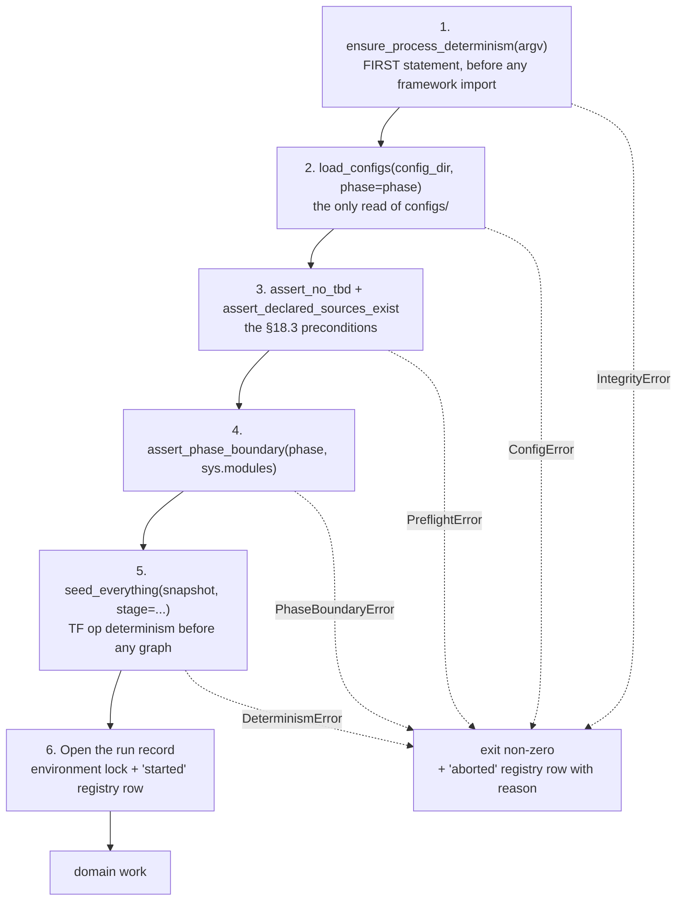
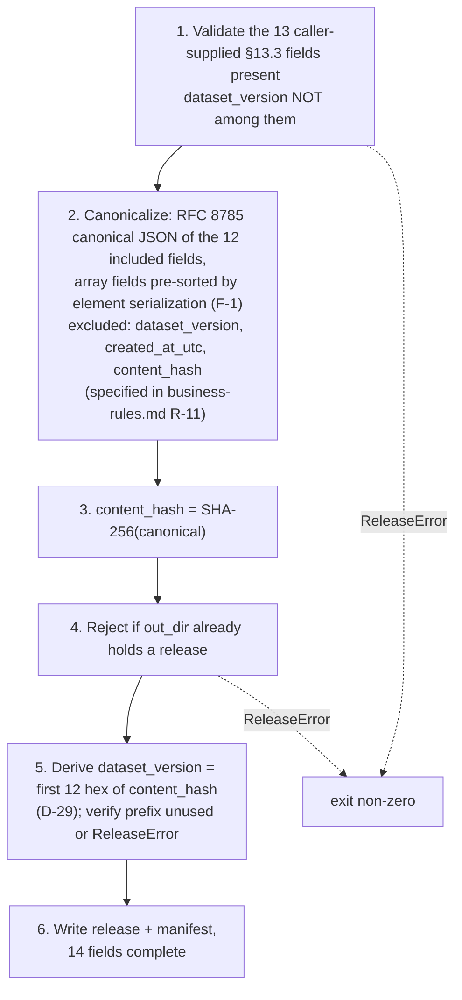

# Business Logic Model — `foundation`

> ## ✳ G-09 IS SIGNED — 2026-08-28, **D-31** (read this before any G-09 statement below)
>
> The project decision owner **signed and approved G-09 (Agent preflight)** on 2026-08-28,
> recorded as **D-31** in `evidence/DECISIONS.md` with change record
> `governance/CHANGE_RECORD_2026-08-28_G09_signed.md`. **Every statement below of the form
> "G-09 is not signed" / "G-09 stays unsigned" is superseded as to the gate's status**, and
> is left standing as the accurate record of the constraint that applied when it was
> written.
>
> ⚠ **D-31 records the gate's own TE §18.3 preconditions as UNMET, and that disclosure
> travels with the signature.** `configs/`, and until 2026-08-28 `src/`, did not exist, so
> the mandated automated zero-TBD preflight **could not run**; the ten named critical tests
> **cannot be executed in this environment** (no Python interpreter is installed — a
> zero-byte Windows Store stub, no registry entry, no interpreter on disk); and the evidence
> artifact `aws_ai_dlc_preflight_report` **does not exist**. "No failing critical test" is
> therefore **unproven, not proven** — an absence of executions, not an absence of failures.
> This is the owner **opening the gate by authority**, not a record that its evidentiary
> conditions were satisfied, and no reader may infer the second from the first.
>
> **What the signature changes here:** module creation is authorised, and any defect this
> unit deferred *solely* because G-09 barred editing a file is now correctable.
> **What it does NOT change:** G-05 and G-06 remain `Blocked`; G-P1A, G-P2, G-P3A, G-P3C
> and G-07 are unaffected; **TE §18.2's absolute rule stands** — every scientific value this
> unit routed to G-04/G-05 **stays routed**, and no agent may fill a freeze-gate value by
> convenience; and **§18.3's stop-and-report obligation survives its own gate**, being a
> standing rule on implementation rather than a one-time gate condition.

**Unit** `foundation` (Bolt 1) · **Kind** `library` · **Depends on** — (dependency root)

> ## ⛔ D-29 RULES THE `dataset_version` ENCODING — 2026-08-28 (read this before any encoding statement below)
>
> *(Banner added 2026-08-30, after two adversarial iterations found the D-29 correction had landed
> in `§ Assumptions` while the rule's own Rule statement, the entity field tables and the design
> body kept asserting the superseded state. Modelled on the G-09 banner above. Superseded text is
> left standing everywhere, never deleted.)*
>
> **D-29 (2026-08-28) fixes the encoding**: `dataset_version` is the **first 12 hex characters of
> `content_hash`**, with a **verify-on-write** uniqueness check. **Every statement below of the
> form "the encoding is unspecified / not specified here / still unruled / no approved artifact
> specifies one", and every instruction that stage 3.5 must stop and report ON THE ENCODING, is
> superseded as to the encoding's status** and is left standing as the accurate record of the
> constraint that applied when it was written.
>
> **What D-29 settles:** the encoding, and with it **injectivity in substance** — the
> verify-on-write check is what establishes it — so the **never-reuse** obligation Q6=D′ retains is
> **no longer open on the encoding**, and `verify_release` is discharged in substance. Statements
> below that never-reuse is *"contingent on an encoding that does not yet exist"* are superseded.
>
> ⚠ **What D-29 does NOT settle, and what remains a §18.3 stop-and-report point for stage 3.5:**
> **where the existing release population that verify-on-write must read back actually lives, and
> how it is enumerated.** The release-history ledger that would have answered this was **declined
> as drafted at Amendment C** and `ReleaseLedgerEntry` withdrawn with it, so the mechanism is
> **specified but not yet implementable**. Three candidate surfaces are named at § Assumptions — a
> release-root directory scan, the experiment registry's release columns, or a narrower
> re-proposal of the declined ledger — and **none is chosen here**. Owner decision; per TE §18.3
> stage 3.5 must **stop and report** rather than pick one.
>
> **Nothing else changes.** No scientific value becomes fillable, **TA-15 is NOT discharged**, and
> TE §18.2's absolute rule stands.

> ## ✳ AMENDED 2026-08-28 — GOVERNANCE REMEDIATION, `GOV-2026-08-28-FD-01` (verdict FAIL)
>
> Applied on the project decision owner's ruling on
> `governance/reviews/GOV-2026-08-28-FD-01.md` (49 findings; Critical 6, High 25, Medium 13, Low 5).
> **No dated box, superseded record or `## Review` section was deleted or rewritten** — every prior
> reviewer verdict, finding and remediation section stands byte for byte, and this unit's
> annotate-in-place convention (the `GOV-2026-08-22-INC-01` Rec 7 precedent) is unchanged. What
> changed in this file:
>
> | Rec | Change | Where |
> |---|---|---|
> | **10**, **1**/**3**, **12** | **W-6 extended from 3 steps to 8** — the twenty-column §13.4 schema assertion, the refusal of a `prediction_hash` from the metric-computing process, the Phase 1 `prior_period_exposure` refusal, the derived `exploratory` field, the single-write append and the durability confirmation. The `AccessRecord` reconciliation stated. **Superseded 3-step contract preserved verbatim in place** | W-6 |
> | **39** | W-6's write mechanism and the **trailing-versus-interior malformed-record distinction**; the disclosed Kaggle durability limit | W-6; § Assumptions |
> | **9** | **W-3 named as the §18.3 preflight gate**, with FR-WS-7 as its requirement, TA-23 as its row, `aws_ai_dlc_preflight_report` as its evidence artifact and **G-09** as its gate — plus the anti-self-certification rule for a limb with no collected evidence | W-3 |
> | **49** | Dated clause: the `.gitignore` deny-list precondition **satisfied** 2026-08-28 over 1158 tracked files; **NFR-SEC-01 and TA-22 stay unclaimed** pending TA-22's history/config/log/artifact scan | W-8 |
> | **34** | NFR-DET-01's WS-17 marked **supporting** | § Requirement-to-workflow map |
> | **8**, **42** | The exception-hierarchy obligations and the still-unruled `dataset_version` encoding recorded as open items | § Assumptions |
> | *(unnamed by the board)* | **Two workflow-mapping corrections found while applying the above** — FR-P1-05-13 `W-4` → **`W-6`**, FR-WS-7 `W-7` → **`W-3`**, with their matching entity cells corrected in `domain-entities.md` | § Requirement-to-workflow map, note W-1/W-2 |
>
> **Counts after these edits, derived and printed** — `10` workflows (W-1…W-10, unchanged), `0` `## R-`
> headings in this file, `20` rules in `business-rules.md` (**moved 17 → 20**: R-18, R-19, R-20 added),
> `8` live entities of 9 sections. **16** requirements, **2** untested by design, **7** acceptance rows
> owned, **2** supporting, §19 held at **36**. **G-09 remains unsigned**; nothing here authorises
> creating a module, and no scientific value or governed constant is decided.
>
> **One item in the remediation brief did not match the disk, and is corrected rather than adapted
> around.** Recommendation 39's *"your verification table at `business-logic-model.md:1748`"* is not
> this unit's own live table: it sits inside `## Review — 2026-08-25 post-redo pass, restored budget
> iteration 1` → `### What reproduced exactly`, and is a **reviewer's** dated spot-check of TE section
> citations. Preserved `## Review` sections are not editable and rewriting a reviewer's sentence would
> break the convention above, so the citation correction is stated in live rule text instead —
> `business-rules.md` R-08's Acceptance line and the boxed correction after R-20. §13.4's atomicity
> clause is carried by **R-08**; R-07 and R-09 carry its *status-and-reason* and *no-silent-rerun*
> clauses, which is what that reviewer was checking and got right.

> **Addendum re-confirmed 2026-08-24.** Site **9** of
> `governance/CHANGE_RECORD_2026-08-24_foundation_amendments.md` § Addendum lands in this
> file: a dated annotation box at the head of § Review, naming three statements the
> amendment sweep left asserting a superseded status. **The READY verdict is untouched, no
> finding is withdrawn, and no reviewer sentence is rewritten.** No rule, entity, workflow
> or contract changed; **no count moved**; no scientific value was touched.

> **Re-established five times on 2026-08-23** — the fifth after a redo aimed at four stale
> cross-references in `target-standardization`'s question file. **No content of this unit
> changed on that occasion either.**

> **Re-established four times on 2026-08-23**, after four stage-wide redo jumps aimed
> respectively at a correction in `acquisition`, corrections in `external-products`, a
> misread depth policy in `component-methods.md`, and a sweep of two question files that had
> fallen stale against their own corrected artifacts. Each reset the receipt floor for
> **every** unit of this stage. **No content of this unit changed on any of the four
> occasions** — the summary was re-confirmed and the artifact re-saved so the receipts match
> the current attempt.

The workflows, algorithms and processing sequences this unit implements. A **Bolt**
is one build pass over one piece of the work, ending in something that runs;
`foundation` is Bolt 1 and the dependency root, so every workflow below runs before
any domain work in every later Bolt.

**No workflow here computes a scientific quantity.** This unit loads, hashes,
seeds, records and releases. The values it moves are governed by D-number; the
mechanisms that move them are what this document fixes.

## Sources

- `../../../inception/units-generation/unit-of-work.md` § 1 `foundation` — responsibility, `Owns`, boundary, the 16 requirements carried, the 7 acceptance rows, and the `ensure_process_determinism`-first constraint.
- `../../../inception/units-generation/unit-of-work-story-map.md` — the requirement-to-acceptance mapping; 2 of 16 carry no §16/§19 row.
- `../../../inception/requirements-analysis/requirements.md` — REQ-ENG-1, -2, -3, -4, -6, -7, -8, -10, -11; FR-P1-01-10; FR-P1-04-11; FR-P1-05-13; FR-WS-7; NFR-AUD-01; NFR-SEC-01; NFR-DET-01.
- `../../../inception/application-design/component-methods.md` — the approved signatures and raise-contracts for `src/data/config.py` and `src/data/release.py`.
- `../../../inception/application-design/components.md` and `component-dependency.md` — layering, import boundaries, § Shared resources.
- `../../../inception/application-design/services.md` — § Stage entry contract (six ordered steps), § Ordering contract, § Run record and registry.
- `../../../inception/delivery-planning/bolt-plan.md` — Bolt 1's Definition of Done and § Gate 0's permitted/barred boundary before G-09.
- `../../../inception/practices-discovery/team-practices.md` — § Code Style, § Testing Posture.
- `../../../../../../../../PreFlight/Technical_Environment_and_Research_Implementation(1)(2).md` — **the Technical Environment document**, cited throughout this artifact (§7.0's Phase 1 prohibition, §9.1–9.2 platforms and fixtures, §12's repository tree, §13.1's environment lock, §13.3's release manifest, §13.4's registry, §18.2–18.3's forbidden choices and preflight gate, §19's approval checklist). *(Added 2026-08-25. Two adversarial passes had recorded as a residual that this document was cited but unlisted, and that its derivations used an unresolved `<TE>` placeholder. **The placeholder was resolvable all along** — the document is at `PreFlight/`, 1158 lines. All three previously unverifiable figures are now derived against it and all three agree: `awk 'NR>=749 && NR<=760 && /^- /' <TE> | wc -l` → **7** §13.1 bullets; `sed -n '709,721p' <TE> | grep -cE '\.(jsonl|json|csv)'` → **0** file-level entries under `artifacts/`; and `grep -oE "TA-[0-9]+" <TE> | sort -u | wc -l` → **36**, TA-01…TA-36, which confirms the "§19 at 36 rows" figure this unit had been carrying rather than deriving through both passes.)*
- `functional-design-questions.md`, `domain-entities.md`, `business-rules.md`.
- `../../../../../../../../governance/reviews/GOV-2026-08-28-FD-01.md` — **the governance report this unit was remediated against on 2026-08-28** (verdict **FAIL**; 49 findings). Recommendations reaching this file: **1**, **3**, **8**, **9**, **10**, **12**, **34**, **39**, **42**, **49**. *(Added 2026-08-28 with the remediation, per the standing practice that an operatively cited document appears in § Sources.)*
- `../../../../../../../../PreFlight/vision_document(3)(2)(2).md` — **the Vision document**, § 13.1's gate table, read 2026-08-28 for **G-09 Agent preflight** (evidence `aws_ai_dlc_preflight_report`, owner Supervisor, status **Open**, due *"Before any affected component is coded"*) as distinct from **G-07 Reproducibility** (evidence `environment_and_cpu_preflight_report`), and **§8.3** for the exploratory label. *(Added 2026-08-28: Recommendations 9 and 12 both turn on distinctions only this document fixes, and it was cited in no § Sources entry of this unit.)*
- `../../governance-guards/functional-design/` — **`AccessRecord`**'s approved field set and **R-25**'s durable-append pattern (*"writes the `AccessRecord` **and flushes it**"*; *"a **durability failure** must **prevent the read**"*; the control asserting the row is *"**durable on disk**"*), the comparator W-6 step 8 and R-19's join are specified against; and the five recorded pre-guard retrospective access rows. *(Added 2026-08-28. **Two levels up** — a sibling unit sits at `construction/<unit>/functional-design/`, so a one-level path resolves inside this unit's own directory; verified with `test -f`.)*
- `../../models-and-baselines/functional-design/` — § 12's `IntegrityError` subclasses and R-92's `PartitionError` raise condition (the authority for R-01's fifteenth entry), that unit's `Owns` list placing `src/models/`, and the `PredictionHashReceipt`/`scripts/06_train_and_predict.py` half of Recommendation 1. *(Added 2026-08-28.)*
- `../../regimes-diagnostics-reporting/functional-design/business-rules.md` — **R-128**, the **reader** of the `exploratory` label, which asserts its presence on every reported post-access run, fails a run reported without it, and routes the **writer** here. *(Added 2026-08-28 with Recommendation 12: R-20 exists because this rule named this unit as the writer and nothing here wrote it.)*
- `../../statistical-inference/functional-design/business-rules.md` — **R-117**, which claims **WS-17 (primary)** and reciprocally returns TA-13/TA-26, and whose `BootstrapResult` records the replicate hash TE §16 line 969 names as WS-17's evidence. *(Added 2026-08-28 with Recommendation 34.)*

---

## W-1 — The stage entry contract

The six-step sequence every stage script's `main()` performs before any domain
work. Identical in all nine scripts, which is why `config.py` exists as a module
rather than as nine copies.



Text fallback: steps 1 → 2 → 3 → 4 → 5 → 6 run in strict order, then domain work.
Any of steps 1–5 raising an `IntegrityError` subclass exits non-zero and writes an
`aborted` registry row carrying the reason.

**Ordering constraints that are not stylistic:**

- **Step 1 is first, before any framework import.** A re-exec after TensorFlow
  loads is pointless (FU-1 = D at stage 2.6).
- **Step 5 precedes any graph construction.** Enabling TensorFlow op determinism
  afterwards is not equivalent, and `seed_everything` raises `DeterminismError` if
  TensorFlow is already initialised.
- **Step 6 precedes domain work**, so an aborted run is already visible.

**Step 4 is skipped only by `02_build_vtec_target.py`**, which is Phase 2 by
definition and asserts `phase == 2` instead.

> **Step 4 is a sequencing reference, not an import by this unit** *(added 2026-08-25 on
> adversarial reviewer finding m-4, at the owner's direction)*. `assert_phase_boundary` lives in
> `src/data/phase_contract.py`, which **`governance-guards` owns** (`unit-of-work.md` § 2;
> `unit-of-work.md` also records `Q5=A`, *"no separate phase-transition unit —
> `phase_contract.py` lives in `governance-guards`"*). This unit is declared to *"import
> nothing from any other unit — this is the DAG's first root"*, and the two statements are
> consistent because **W-1 is the stage script's entry contract, not a `foundation` module**:
> `component-methods.md` states `assert_phase_boundary` is *"Called at entry by every
> phase-aware stage script"*, and W-1 is described here as *"identical in all nine scripts"*.
> The **caller is the script**, which may import from both units; `src/data/config.py` does not
> import `phase_contract.py`.
>
> **Independent confirmation from the DAG.** `unit-of-work-dependency.md` declares
> `foundation depends_on: []` and `governance-guards depends_on: [foundation]`. A real import
> here would make the unit graph **cyclic**, and `units-generation` validated it as acyclic —
> so a genuine import would have failed upstream validation rather than merely reading oddly.
>
> Only the distinction was undocumented; **no design changes and no upstream decision is
> required.**

**Failure behaviour (R-10).** On a steps 1–5 raise the script exits non-zero with a
message naming the file and the violated expectation, and writes an `aborted`
registry row. **If that registry write itself fails**, the original exception is
preserved, both failures reach stderr, and the process exits non-zero **without
claiming an aborted record was written.** It never proceeds with a warning.

## W-2 — `load_configs` — read, snapshot, hash, resolve

```
INPUT   config_dir: Path, phase: int
OUTPUT  ConfigSnapshot (frozen)
RAISES  ConfigError — a file missing, unparseable, or phase not in {1, 2}
        PlatformError — platform not identifiable as exactly one of two
```

1. **Validate `phase`** ∈ {1, 2}. Raise `ConfigError` otherwise.
2. **Parse all four** governed configs — `data.yaml`, `features.yaml`,
   `experiment.yaml`, `seeds.yaml` — with a strict YAML load that **rejects
   duplicate keys** (`_parse_yaml`). A duplicate key silently dropping a governed
   value is an integrity failure, not a parse convenience.
3. **Copy verbatim** into the run's snapshot directory (`_write_snapshot`). Verbatim
   because the snapshot is the evidence of what the run actually read; a
   re-serialised copy proves the parser's behaviour, not the file's content.
4. **Hash each of the four** (SHA-256), populating `hashes`.
5. **Resolve platform roots** from the environment; populate `resolved_roots` and
   `platform`.
6. **Freeze and return.**

**Invariant (R-16).** No machine path enters the four configs, so relocating the
workspace never changes a governed hash. Machine paths live only in
`resolved_roots`.

**Boundary.** This is the only read of `configs/` anywhere in the pipeline.
Downstream units receive resolved values, never a path into `configs/`.

## W-3 — Preflight — `assert_no_tbd` and `assert_declared_sources_exist`

```
INPUT   snapshot: ConfigSnapshot, required: Sequence[str]
OUTPUT  None
RAISES  PreflightError naming EVERY offending field
```

**`required` is supplied from the `(stage, phase)`-keyed map** (R-03), never from a
per-script literal.

1. **Look up** `required_fields` for `(stage_slug, phase)`.
2. **Flatten** the nested config structures for scanning (`_flatten_for_tbd_scan`).
3. **Two rejections, both fatal** (R-02):
   - a required field **absent** from the configuration;
   - a required field whose value is the **`TBD — freeze gate`** sentinel.
4. **Collect all offenders, then raise once**, naming every one. A first-failure
   raise makes a human fix fields one run at a time.
5. **`assert_declared_sources_exist`** — every declared source and hash resolves.
   A declared hash that does not resolve is a **failure, never a warning**
   (the §18.3 clause restored by `DATA-13`).

**Phase asymmetry is the point.** Under `--phase 1`, Phase-2-only fields are
legitimately `TBD` and are **not** in the Phase-1 required set, so Phase 1 passes
without anyone filling a sentinel — which `project.md` § Forbidden prohibits. Under
`--phase 2` those same fields **are** required.

**Completeness of the map is asserted separately** (R-03): a test walks the parsed
configuration and fails when a governed required field appears in no map entry. The
map is a list; the test is what makes it a rule.

> ## ✳ W-3 IS THE §18.3 PREFLIGHT GATE, AND ITS EVIDENCE ARTIFACT IS `aws_ai_dlc_preflight_report`
>
> *(Added 2026-08-28 on the owner's ruling on `governance/reviews/GOV-2026-08-28-FD-01.md`
> **Recommendation 9**, option 1. `business-rules.md` **R-02** carries the full record, the four
> authority citations and the negative control; this is the workflow-side statement of what W-3 emits.)*
>
> **FR-WS-7 is `foundation`'s own requirement, its acceptance row is TA-23 — this unit's PRIMARY row —
> and its evidence artifact is `aws_ai_dlc_preflight_report`, whose gate is G-09.** Derived:
> `unit-of-work-story-map.md:127` → `| FR-WS-7 | foundation | TA-23 |`; TE:1083 (§18.3) and TE:1119
> (§19, TA-23's Evidence column) both name `aws_ai_dlc_preflight_report`; Vision § 13.1's gate table
> gives **G-09 Agent preflight** that artifact, owner **Supervisor**, due *"Before any affected
> component is coded"*, status **Open**.
>
> **It is a DIFFERENT artifact from `environment_and_cpu_preflight_report`**, which Vision gives to
> **G-07 Reproducibility** and TE:530 defines as install-from-pins on both platforms plus a completed
> skeleton run and measured CPU runtime, RAM and storage. The two are **not aliases** and this design
> does not merge them. `fixtures-and-reproducibility` builds the G-07 artifact; **its own TA-23
> supporting claim is that unit's to reconcile, and nothing here reaches into its artifacts.**
>
> **What W-3 contributes, and what it only aggregates.** Two of the gate's four preconditions are
> W-3's own: **zero `TBD`** (steps 1–4, R-02/R-03) and **every declared source and hash resolves**
> (step 5, whose failure is a raise and never a warning). The other two are **not this unit's to
> produce** — the **ten named critical tests** are spread across units, and the **supervisor sign-off**
> is a supervisor act. `foundation` **collects** those; it does not assert them.
>
> **⛔ The report must not become self-certifying.** A limb with no collected evidence renders
> **absent**, never **passed**, and the report **refuses a green overall verdict while any limb is
> absent**. Stated because the cheapest wrong implementation treats an uncollected limb as satisfied,
> which is how a gate control becomes a formality that passes its own test. The negative control — the
> four withheld-limb cases plus the never-collected case — is in R-02.
>
> **G-09 is Open and unsigned.** Designing this report's contents fills no `TBD`, creates no module,
> and does not satisfy the gate it evidences.

## W-4 — `seed_everything` and the determinism probe

```
INPUT   snapshot: ConfigSnapshot, stage: str
OUTPUT  DeterminismRecord
RAISES  DeterminismError — TensorFlow already initialised
```

1. **Guard.** If TensorFlow is already initialised — **observed as `"tensorflow" in sys.modules`, evaluated BEFORE `seed_everything` performs its own deferred import** *(definition mirrored here 2026-08-25 on confirming-pass finding F-3: it lived only in R-05 in the sibling artifact, leaving the undefined phrase in the workflow 3.5 implements from)* — raise `DeterminismError`.
   Enabling op determinism afterwards is not equivalent.
2. **Apply seeds** from `seeds.yaml` to Python, NumPy and TensorFlow →
   `seeds_applied`.
3. **Enable TensorFlow op determinism** *before any graph construction* →
   `tf_op_determinism`.
4. **Capture** `pythonhashseed` from the environment, `reexec_performed` **from the re-exec
   marker described below**, and `framework_versions`.

> **The `reexec_performed` carrier** *(added 2026-08-25 on adversarial reviewer finding m-3,
> decided by the project decision owner).* `ensure_process_determinism(argv)` returns `None`
> (`component-methods.md`), so nothing crosses the `exec` boundary in its return value, and a
> child process cannot otherwise tell a re-exec from an externally exported `PYTHONHASHSEED` —
> the environment looks identical in both cases. Without a carrier, W-4 step 4 has nothing to
> read and **R-05's negative control cannot discriminate**, so stage 3.5 would have had to
> invent a mechanism.
>
> **The carrier is a sentinel environment variable**, set by the parent immediately before
> `os.execv`, then **read once by the child and immediately removed from its environment**.
> **Exactly one bit of information crosses**: *this process is a re-exec child*.
> `reexec_performed` is `True` when the sentinel is present and `False` when it is absent.
>
> **The pop is load-bearing, not hygiene** *(added 2026-08-25 on reviewer finding m-3, second
> pass)*. Environment variables are inherited by descendants, and after a re-exec
> `PYTHONHASHSEED` is already set — so a subprocess launched from a re-execed stage script does
> **not** re-exec and yet would still see the sentinel, recording `reexec_performed = True` for
> a process that never re-execed, making R-05s negative control pass for the wrong reason.
> Without the pop the bit that crosses is *some ancestor was a re-exec child*, which is not the
> claim above. **The variable's name is not fixed here** — it is an
> implementation identifier carrying no scientific content, no governed value and no config
> field, so it is not a §12/TC-03e constant and belongs in `src/data/config.py` beside the
> function that sets it.
>
> **Where the bit lives in-process** *(added 2026-08-25 on adversarial finding m-1 of the restored
> budget — the only implementability gap no open item covered)*. The sentinel carries the bit across
> the `exec` boundary; **module-level state inside `src/data/config.py` carries it from the pop to
> the record.** `ensure_process_determinism` sets that state at W-1 step 1 when it pops the
> sentinel; the `DeterminismRecord` construction reads it at step 4 below. Nothing else was
> available: this function returns `None`, `seed_everything(snapshot, *, stage)` takes no such
> argument, and `ConfigSnapshot`'s eight approved fields carry no re-exec bit — and `ConfigSnapshot`
> is built at W-1 **step 2**, after the pop at step 1, so it could not receive the bit without
> reordering an approved contract. Setter and reader both live in `src/data/config.py`, which this
> unit owns, so the hand-off is **intra-module**: no cross-module coupling, no new parameter, and no
> approved stage-2.6 signature altered. An engineering decision with no scientific content, no
> governed value and no config field — recorded here rather than left for 3.5 to invent.
>
> **Why this option.** The alternative that reads more cleanly — changing
> `ensure_process_determinism` to return `bool` — would amend an **approved stage-2.6
> contract** in `component-methods.md`, which needs an amendment rather than a design note. A
> marker file would add filesystem state to a function whose whole purpose is to run before
> anything else. The sentinel is the smallest change that preserves every approved semantic:
> the signature, the first-statement-of-`main()` rule, and the return-immediately path.
>
> **What this is and is not.** It is an engineering decision inside this stage's remit, made
> explicitly rather than assumed, and put to the owner before it was applied. It decides **no**
> scientific value and **no** governed constant, and **G-09 remains unsigned** — nothing here
> authorises writing the module.
5. **Probe** for nondeterministic operations (Q3 = C) → `nondeterministic_ops`,
   recording **which operation classes were examined**.
6. **Cross-check** the observed set against any expected set declared in
   configuration; **record mismatches** rather than reconciling them.
7. **Classify the measurement**: `complete`, `partial` where the framework cannot
   give a full assessment, or `not-yet-measured` where the relevant operations have
   not executed.
8. **Freeze and return.**

**Excluded by design.** `seed_everything` does **not** touch the bootstrap seed —
that carve-out is `src/evaluation/bootstrap.py` by ADR-05, a design decision rather
than an oversight.

> ## ✅ STEPS 5–7 ARE NOW FULLY RECORDABLE — AMENDMENT B APPROVED 2026-08-24
>
> **Superseded status, preserved:** this box read *"STEPS 5–7 CANNOT BE FULLY
> RECORDED UNDER THE APPROVED CONTRACT"* — `probe_scope`, `measurement_status` and
> `declared_vs_observed_mismatches` did not exist in `DeterminismRecord`, which
> carried **six** fields, and until the amendment was approved **no output of this
> unit could state or imply that determinism had been measured**. Silence was then
> the correct output.
>
> **Amendment B is APPROVED** (project decision owner, 2026-08-24;
> `CR-2026-08-24-FOUNDATION-AMENDMENTS`). `component-methods.md` now defines **nine**
> fields — derived, not carried:
> `awk '/class DeterminismRecord/,/^$/' component-methods.md | grep -cE "^ +[a-z_]+: "` → `9`.
>
> **The prohibition is lifted.** Steps 5–7 write to `probe_scope`,
> `declared_vs_observed_mismatches` and `measurement_status` respectively, so the
> scope and status of the measurement are now recorded rather than implied.
>
> **What is unchanged: R-06.** An empty `nondeterministic_ops` is still **never proof
> of determinism**. What the amendment buys is that an empty result is no longer
> *ambiguous* — `probe_scope` says what was examined and `measurement_status`
> distinguishes `complete` from `partial` and `not-yet-measured`. That distinction,
> not the empty list, is what Q3 = C was chosen to secure.

## W-5 — Opening the run record

Step 6 of W-1. Writes the environment lock and the `started` registry row **before**
domain work.

**Eight fields, seven §13.1 bullets** — derived, with the provenance stated so
neither count stands alone:

```
awk 'NR>=749 && NR<=760 && /^- /' <TE> | wc -l   ->  7
```

Bullet 1 names two distinct captures, so the row carries eight fields. REQ-ENG-10's
criterion says *"A registry row exists carrying all eight fields"* — the field
reading is operative.

| # | Field | Source |
|---|---|---|
| 1 | `requirements_hash` | the pinned `requirements.txt` |
| 2 | `pip_freeze` | per-run capture |
| 3 | `runtime_versions` | `DeterminismRecord.framework_versions` + platform probe |
| 4 | `code_commit` | git HEAD |
| 5 | `config_hashes` | `ConfigSnapshot.hashes` — all four |
| 6 | `input_versions` | release manifests consumed |
| 7 | `platform` | `ConfigSnapshot.platform` |
| 8 | `nondeterministic_ops` | `DeterminismRecord` |

**Every field populated, not `unavailable`.** A run capturing none of them **fails
the check rather than completing silently** — REQ-ENG-10, which binds from the next
run forward because the thirteen prior runs are recorded as violating it and the
§13.1 list *"was not captured at the time and cannot be reconstructed"*.

> **REQ-ENG-10 has no acceptance row.** TA-03 was checked against all seven bullets
> and covers **none fully** — two partially, and both partials are install-time
> rather than per-run, which is the entire substance of the requirement.
> `requirements.md` records the same conclusion in REQ-ENG-10's own test column.
>
> **Amendment A was raised and DECLINED, 2026-08-24** *(superseded status: "Amendment A
> pending")*. The project decision owner rejected adding §19 rows for REQ-ENG-7 and
> REQ-ENG-10, on the evidence that **no project rule requires universal §19 coverage**,
> that the approved position dispositions uncovered requirements as *"Open by design"*,
> and that this unit already designs both as enforceable obligations without them.
> `CR-2026-08-24-FOUNDATION-AMENDMENTS`, Amendment A.
>
> **This resolves Q7=X rather than contradicting it.** Q7=X directed that a §15.2
> change request be *raised*; it was, and the owner declined it. Raising a request
> never obliged its approval.
>
> **REQ-ENG-10 therefore remains untested by design, permanently rather than
> provisionally**, and travels in the ordinary set handed to NFR requirements. **No
> acceptance coverage is claimed** — that statement is now settled, not awaiting an
> amendment.

## W-6 — Registry append

*(Steps 4–8, the twenty-column schema, the write mechanism and the reconciliation were **added
2026-08-28** on the owner's ruling on `GOV-2026-08-28-FD-01` Recommendations **10**, **1**/**3**,
**12** and **39**. **Superseded contract, preserved verbatim:**)*

> ```
> INPUT   run_id, status, reason (required when aborted|failed), payload
> OUTPUT  one appended JSONL line
> RAISES  RegistryError — unknown status, or empty reason on aborted|failed
> ```
>
> 1. **Validate the status** against the closed enum `started` | `completed` |
>    `aborted` | `failed` (R-07). Needs no read of prior rows, so it costs nothing
>    against the append-only guarantee.
> 2. **Require a non-empty `reason`** for `aborted` and `failed`.
> 3. **Append.** Never read the run history (R-08), never rewrite, never delete.
>
> *(Its three steps are preserved in place as steps 1–3 below; nothing was removed.)*

```
INPUT   run_id, status, reason (required when aborted|failed), payload
OUTPUT  one appended JSONL record — TE §13.4's twenty columns plus three named extensions
RAISES  RegistryError — unknown status; empty reason on aborted|failed;
                        a missing or unpopulated §13.4 column;
                        prediction_hash presented by the metric-computing process;
                        prior_period_exposure = true on a Phase 1 row;
                        exploratory passed by a caller;
                        a durability failure on the append
```

1. **Validate the status** against the closed enum `started` | `completed` |
   `aborted` | `failed` (R-07). Needs no read of prior rows, so it costs nothing
   against the append-only guarantee.
2. **Require a non-empty `reason`** for `aborted` and `failed`.
3. **Assert the schema** — **all twenty §13.4 columns present**, and `code_commit` and
   `environment_lock_hash` **populated**, not merely present (R-18; FR-P1-05-13's criterion). Like
   the enum, this is a **write-time** check that needs **no read**, so R-08's purity is untouched.
4. **Refuse a `prediction_hash` presented by the process that computes a metric over that
   prediction** (R-18). `06` writes the receipt; `07` and the bootstrap **may not**. Writer and
   reader stay in different processes, which is the only thing that makes *"the receipt precedes the
   metric"* mean anything.
5. **Refuse `prior_period_exposure = true` on a Phase 1 row** (R-18). Phase 1 *is* the first December
   exposure; `true` belongs to the Phase 2 replication (TE §7.0B).
6. **Derive `exploratory`** — never accept it from a caller (R-20). `true` when `started_at_utc`
   postdates the earliest `AccessRecord` under `RESTRICTED_ROOT`; `false` otherwise; **`false` with
   the carve-out recorded** for the G-06 confirmatory run, identified by its own `AccessRecord`
   carrying `purpose = locked_evaluation`. A caller passing the field is **rejected**.
7. **Append** — **one single write of one newline-terminated record, under append mode** (R-08).
   Never read the run history, never rewrite, never delete.
8. **Confirm durability** before returning, on `governance-guards` R-25's accepted pattern. A
   durability failure raises `RegistryError` naming the file and the violated expectation — **never a
   warning beside a write reported as successful** (R-10's obligation reaching the durability layer).

**Why step 6 is a derivation and not a parameter.** A caller argument spreads a governed fact across
nine stage scripts, each of them a chance to pass `false`. Derived, one place computes it and no
caller can suppress it. `regimes-diagnostics-reporting` R-128 **reads** the label and fails a
post-access run reported without it; before 2026-08-28 nothing **wrote** it, and R-128 explicitly
routed the writer here.

**Transitions are not checked here.** The graph — `started → completed|aborted|failed`,
with duplicate `started`, repeated terminals, transitions out of terminals and
malformed rows all rejected — is enforced by a **separate integrity test** (R-08).
A log whose write path depends on reading is no longer a pure append, and that
purity is the only reason append-only is trustworthy.

**A trailing malformed record is a torn write, not corruption** (R-08, added 2026-08-28). The
integrity test **distinguishes position**: an unterminated or truncated **final** line is reported as
a torn write **with the `run_id` it belongs to** — recovered from the legible prefix, `run_id` being
column 1 for exactly this reason — and the run **stays visible**; any **interior** malformed line, or
a newline-terminated trailing line that is still unparseable, is **rejected**. Without the
distinction a torn `aborted` row would **fail** the integrity test rather than preserve that run's
visibility, and an `aborted` row is written *while the process is dying*, which is precisely when a
non-atomic append tears.

**The `AccessRecord` reconciliation runs with the integrity test, never on the write path** (R-19,
added 2026-08-28). `RegistryEvent` and `AccessRecord` **join on `run_id`**, with orphan detection in
**both** directions — a restricted access with no registry row, and a row claiming
`locked_test_accessed = true` with no logged access. The five known pre-guard retrospective access
rows are **reported as expected orphans with their reason and never back-filled**. Putting the
reconciliation on the write path would make the registry write depend on reading the access log and
destroy R-08's purity, which **Q4 = D** exists to protect.

**Integrity test timing.** Before TA-10 / G-09 acceptance, and before registry
contents are relied on as audit evidence.

**Disclosed limit.** Durability semantics differ between the two governed platforms and **Kaggle's are
characterised nowhere in this design**, so step 8 needs its own measured evidence before rows written
inside a Kaggle session are relied on at a freeze gate. A measurement obligation on Bolt 1's in-Kaggle
work, not an implementation choice — recorded in § Assumptions.

**Derived CSV.** `experiment_registry.csv` is regenerated by folding the JSONL,
hashed, and marked derived. A stale CSV is a **completeness shortfall recorded in
the run manifest**, not a fatal error — the non-fatal tier.

## W-7 — `write_release` and label derivation

*(Heading amended 2026-08-25: "label allocation" → "label derivation". Amendment C declined as
drafted; there is no ledger to allocate from. W-7 remains one of the ten workflows W-1…W-10.)*

```
INPUT   manifest (13 caller-supplied §13.3 fields), files, out_dir
OUTPUT  Path to the written release, carrying all 14 §13.3 fields
RAISES  ReleaseError — a caller-supplied §13.3 field absent;
                       out_dir already holds a release;
                       manifest supplies dataset_version (write_release derives it)
```

> **This narrows an approved stage-2.6 raise-contract, and that needs an amendment rather than
> an assertion** *(adversarial finding m-2, restored budget, 2026-08-25)*. `component-methods.md`
> states `write_release` *"Raises `ReleaseError` when a field is absent"* over **all fourteen**
> §13.3 fields. Deriving `dataset_version` inside `write_release` changes the **input**
> precondition to thirteen while leaving the **output** obligation at fourteen — the release
> still carries all fourteen fields, so what the function *writes* is unchanged. But the caller
> contract does change, and this stage demanded an amendment for exactly this class of change
> when it declined to alter `ensure_process_determinism`'s `-> None` signature. Applying a
> different standard here would be inconsistent, so **this is recorded as an amendment need for
> the owner's decision, listed in § Assumptions, not as a settled contract.** The alternative —
> the caller supplies `dataset_version` and step 5 merely *verifies* it — is not available under
> Q6=D′, which makes the field a derivation rather than an input.



Text fallback: validate the **thirteen caller-supplied** §13.3 fields, canonicalize excluding
the label and volatile metadata, hash to get the authoritative identity, reject a directory that
already holds a release, derive `dataset_version` from that content hash, then write the release
and its manifest with all **fourteen** fields complete.

> **Who supplies `dataset_version` — settled here rather than left to 3.5** *(added 2026-08-25 on
> adversarial reviewer finding m-2)*. Step 1 previously validated *"all 14 §13.3 fields
> **present**"* while step 5 **derived** one of those fourteen. The two readings were mutually
> exclusive — either the caller supplies `dataset_version`, in which case step 5 verifies rather
> than derives, or step 5 produces it, in which case step 1 cannot demand it — and nothing said
> which held, leaving `write_release`'s interface undecided. **Resolved: the caller supplies
> thirteen and `write_release` produces `dataset_version`.** It cannot be otherwise, because the
> field is a function of a `content_hash` that does not exist until step 3, and R-11 makes the
> hash the authoritative identity. Step 1 therefore rejects a call that **omits** any of the
> thirteen *and* a call that **supplies** `dataset_version`, since a caller-supplied value could
> only disagree with the derivation or duplicate it.
>
> **Two error edges were removed as unreachable on the write path**, rather than left as
> untestable claims: `E -.->|"label/hash mismatch"| X` and the fallback sentence *"A label that
> does not match its content hash raises."* A pure function cannot emit a label that mismatches
> its own input. The genuine home for that check is **R-12's correspondence control**, which
> validates a **presented** manifest — the case that actually arises on read-back or after a
> hand edit. The same correction applies to R-11's negative control; see `business-rules.md`.

> *(W-7 amended 2026-08-25: **step 7 is removed** and step 5 is changed from ledger allocation
> to derivation from `content_hash`. **Amendment C was DECLINED AS DRAFTED** by the project
> decision owner on 2026-08-25, reversing its 2026-08-24 approval — no release ledger, no
> `ReleaseLedgerEntry`, no `artifacts/registry/release_history.jsonl`, and **no exact
> hash-to-label encoding is invented here**, because no approved artifact specifies one.
> **Superseded steps, preserved:** *"5. Allocate label from the append-only ledger"*, *"7.
> Append ReleaseLedgerEntry — label + content_hash + path + run_id"*, and the fallback clause
> *"allocate a label from the ledger, write, then append the ledger entry. A reused label or a
> label/hash mismatch raises."*
>
> **W-7 remains one of the ten workflows W-1…W-10** — it lost a step, not its existence, so the
> workflow count is unchanged.
>
> **What the reversal costs — corrected 2026-08-25 on adversarial finding M-1 of the restored
> budget.** *(Superseded wording, preserved: "**What this reversal actually costs is label
> ordering, and only that.** The never-reuse guarantee survives by a different route: the
> derivation is a pure function of `content_hash`, so identical content yields an identical label
> by construction and the delete-and-rebuild failure that motivated the ledger cannot arise …
> **W-7 is fully compliant with Q6=D′**".)* That claim was **withdrawn as unsound** thirty-five
> lines below in this same section and this roll-up was not swept with it — the fourth
> consecutive pass in which a correction reached the site that stated a thing and missed the
> paragraph that summarised it.
>
> **What the derivation actually provides: idempotence.** Identical content yields an identical
> label, and the delete-and-rebuild failure that motivated the ledger cannot arise, because
> nothing allocates and nothing can forget.
>
> **What it does NOT provide: never-reuse.** That requires **injectivity** — different content,
> different label — which is idempotence's converse. It holds only for an encoding faithful to
> all 256 bits, and Q6=D′ keeps the label human-readable and citable, so it is necessarily lossy.
> ⛔ **SUPERSEDED 2026-08-29/30 by D-29 — see the "Label derivation (R-12 … ⛔ further amended by
> D-29)" paragraph ~20 lines below, and the D-29 banner at the head of this file.** *(Marker added
> 2026-08-30 on adversarial finding 2, Critical: this passage sat **above** the corrected R-12
> paragraph in the same file, so a reader of the W-7 narrative met the stale claim first with no
> forward pointer — the "heading updated, body not" pattern this file's own Review history already
> names five times.)* **The encoding IS specified**: D-29 fixes it as the first 12 hex of
> `content_hash` with a verify-on-write check, which establishes **injectivity in substance**, so
> never-reuse is **no longer open on the encoding** and **W-7 may be described as compliant with
> Q6=D′ on that point**. What stage 3.5 must still stop and report on is **where the release
> population verify-on-write reads back lives**. Superseded text preserved:
> ~~The encoding is unspecified and stage 3.5 is forbidden to choose one, so **never-reuse is an
> open obligation**, listed in § Assumptions, and **W-7 must not be described as compliant with
> Q6=D′ on that point**.~~
>
> **Ordering** is a separate and genuine loss: information about sequence, which a function of
> content alone does not carry and no implementation choice reaches. The requirement was changed
> rather than left unmet — **Q6 was re-presented and re-answered as D′ on 2026-08-25, dropping
> "monotonic"**, the owner's explicit decision, the original Q6=D answer preserved verbatim
> beside it. A reviewer comparing two release labels at a gate reads sequence from the run record
> or the experiment registry, both of which carry timestamps and `run_id`. **FU-2 is moot** — it
> existed only to locate the ledger.)*

**Which identifier is authoritative (R-11).** The **content hash**. The label is
derived, for citation at a human-reviewed gate, and **explicitly not
authoritative** — every integrity guarantee here is hash-based, so putting the
label in charge would elevate the weaker identifier.

**Never overwritten (R-13).** A directory already holding a release is rejected, and
repeated writes are **not** silently treated as successful.

**Label derivation (R-12, amended 2026-08-25; ⛔ further amended by D-29, 2026-08-28).**
`dataset_version` is **derived from the release's `content_hash`** — specifically, **the first 12
hex characters of it, with a verify-on-write uniqueness check** (**D-29**). That check is what
establishes **injectivity in substance**, so never-reuse is no longer open on the encoding and
`verify_release` is discharged in substance. There is **no ledger and no allocation step**.
⚠ **The §18.3 stop-and-report obligation MOVED rather than lapsed**: stage 3.5 must stop and
report on **where the existing release population that verify-on-write reads back lives** — the
ledger that would have answered was declined at Amendment C, so the mechanism is specified but
not yet implementable; three candidate surfaces are named at § Assumptions and none is chosen.
*(Corrected 2026-08-30 on adversarial finding 1; superseded text preserved: ~~"**No exact
hash-to-label encoding is specified here**, because no approved artifact specifies one and this
stage must not invent it — stage 3.5 must not choose one either, and must stop and report
instead."~~ See the D-29 banner at the head of this file.)*

> *(**Superseded mechanism, preserved:** *"**Label allocation (R-12).** From a durable
> append-only ledger at `artifacts/registry/release_history.jsonl`, **separate** from the
> experiment registry. Never from a directory scan and never from a derived index — delete a
> release directory and a rebuilt index forgets the label, so the next allocation reuses it."*
> **Amendment C declined as drafted, 2026-08-25.** The superseded text rejects a *derived
> index*, and its stated failure — a rebuilt index forgetting a label so the next allocation
> reuses it — is a property of **allocation from state**. It does not transfer to a pure
> derivation, which allocates nothing and consults nothing: there is no index to forget, and
> reproducing the same label from the same content is the correct outcome rather than a
> collision. **But that disposes of the delete-and-rebuild failure only — it does not establish
> never-reuse** *(corrected 2026-08-25 on reviewer finding M-3, which was Major; superseded
> claim preserved: "of the two Q6=D obligations, **never-reused is satisfied by determinism** (a
> label bound to two genuinely different contents reduces to a SHA-256 collision)")*. Purity
> gives **idempotence** — same input, same output; never-reuse is its converse, **injectivity**,
> and the collision reduction needs an encoding faithful to all 256 bits, which a human-readable
> citable label cannot be. Never-reuse is therefore **contingent on an encoding that does not yet
> exist**, recorded as an open item rather than as a guarantee. Meanwhile
> **monotonicity cannot be satisfied by any mechanism available here** — ordering is information
> about sequence, which a function of content alone does not carry. **That requirement was
> therefore changed rather than left unmet: Q6 was re-presented and re-answered as D′ on
> 2026-08-25, dropping "monotonic"**, the owner's explicit decision with the original Q6=D
> answer preserved verbatim beside it. **FU-2 is moot** — it existed only to locate the ledger
> Q6=D required. This rule is compliant with Q6=D′ **on monotonicity, which D′ dropped — but NOT on never-reuse, which D′ retains and this design does not establish** *(narrowed 2026-08-25 on adversarial finding M-1/M-3 of the restored budget; the unqualified claim "fully compliant with Q6=D′" appeared at five sites and was false at all five)*. What is disclosed on the ordering side is a
> capability rather than a gap: release labels can no longer be ordered, so sequence is read from
> the run record or the experiment registry. R-12 states the three replacement negative controls —
> correspondence, derivation determinism, and **non-degeneracy** *(named "injectivity against a
> degenerate encoding" until 2026-08-25; it detects a constant encoding and passes a truncating
> one, so it must not be named for injectivity — finding m-1)*.)*

**`source_files`' six items** are validated against `inventory.py` rather than
restated as a bare hash.

> **⛔ Amendment C DECLINED AS DRAFTED 2026-08-25**, reversing the approval recorded in the
> box below. No release ledger; `dataset_version` derives from `content_hash`. The box below is
> preserved as the dated record of the 2026-08-24 approval and is **not** the current state —
> including its *"three artifacts, one authoritative"* reading of `services.md`, which is now
> wrong at two. **That upstream correction has since been made** (2026-08-25, on the owner's explicit authorisation after this stage had first reported it rather than made it): `services.md` now reads "Two artifacts, one authoritative" with the ledger row removed, and `unit-of-work.md` § 1 `Owns` no longer names the ledger, both superseded wordings preserved. **Of the two Q6=D guarantees it cites, monotonicity was dropped by the
> Q6=D′ re-answer, and never-reuse is now an open obligation on the label encoding** — see R-12
> and § Assumptions. ⛔ **That second clause is SUPERSEDED 2026-08-30 by D-29 — never-reuse is
> NOT an open obligation on the encoding.** *(Marker added on the final adversarial finding of
> this cycle, Critical: this box's own live explanatory prose still asserted the pre-D-29 state
> in the present tense, twenty-five lines below the corrected R-12 paragraph and at the end of
> the very pointer — "see R-12 and § Assumptions" — that sends a reader to text saying the
> opposite. Unlike the preserved-record box two paragraphs below, this sentence is not a labelled
> historical quotation.)* **D-29 fixes the encoding** as the first 12 hex of `content_hash` with a
> **verify-on-write** uniqueness check, which establishes **injectivity in substance**, so
> never-reuse holds on the encoding and `verify_release` is discharged in substance. **Monotonicity
> stays dropped** — that half of the sentence is untouched and correct. ⚠ **What IS open, and is
> the surviving §18.3 stop-and-report point:** where the existing release population that
> verify-on-write reads back lives, the ledger that would have answered having been declined at
> Amendment C. *(Corrected 2026-08-25 on reviewer finding M-2: this previously read "the
> two things the reversal gives up, and both are carried to the stage gate", contradicting this
> file s own § Assumptions and the Q6 re-answer.)*
>
> **✅ Amendment C APPROVED 2026-08-24** *(superseded 2026-08-25)*. *Superseded status, preserved: "Amendment C
> pending. The ledger is in no approved `Owns` list. Both approved artifacts
> (`services.md`, `unit-of-work.md`) are unedited."* Both have since been annotated in
> place on the owner's approval (`CR-2026-08-24-FOUNDATION-AMENDMENTS`): the ledger is
> now in `unit-of-work.md` § 1 `foundation` → `Owns` and in `services.md` § Run record
> and registry, which reads **three artifacts, one authoritative**.
>
> **Its authority is Q6=D and FU-2=D**, not an engineering preference. Q6=D requires a
> *monotonic, human-readable* label alongside the authoritative hash — choosing that
> over option C's *"version derived from the manifest hash"* — and FU-2=D names the
> durable append-only ledger, its ownership and its append behaviour. Monotonicity
> requires durable state, which is precisely why a directory scan cannot serve.
>
> **No TE §12 amendment was needed** — `artifacts/registry/` is already enumerated and
> the §12 tree carries zero file-level entries inside `artifacts/`. **R-11 is
> unchanged**: the content hash remains authoritative and the label remains a citation
> device.

## W-8 — `resolve_platform_roots` and the credential precondition

```
INPUT   env: Mapping[str, str]
OUTPUT  (platform_label, resolved_roots)
RAISES  PlatformError — platform not exactly one of the two authorised
```

1. **Identify the platform** as exactly one of **`kaggle`** or **`local`**
   (TC-03c). No third platform is authorised. Raise `PlatformError` otherwise.
2. **Resolve roots** from the environment.
3. **Return the label and roots. No credential value is read, returned, logged,
   serialized, interpolated or persisted** — not here, not in any foundation-layer
   diagnostic (R-14).

**The credential presence check is a separate, stage-specific precondition** — not
part of this workflow. Only stages that **actually require authenticated provider
access** apply it; it is not required for unrelated stages, public providers, or
`foundation` initialization itself.

**What the presence check proves, and what it does not.** It checks that required
environment-variable **names** are present and fails early naming any that are
missing. It **does not** prove a value is non-empty, valid, or authorized — the
provider client performs value validation **without exposing the secret**. Stated
because a presence check mistaken for a validity check reports a readiness that
does not exist.

**Precondition, not a claim.** The `.gitignore` credential deny-list **must exist
before the first relevant commit**, and NFR-SEC-01 / TA-22 compliance is **not
claimed until the required checks have passed**. `evidence.md` records NFR-SEC-01 as
not satisfied in this workspace today.

> ## ✳ DATED CLAUSE, 2026-08-28 — THE PRECONDITION IS SATISFIED; THE REQUIREMENT REMAINS UNCLAIMED
>
> *(Added on the owner's ruling on `governance/reviews/GOV-2026-08-28-FD-01.md` **Recommendation 49**,
> option 1. **The precondition framing above is preserved unchanged and deliberately not weakened**,
> and **NFR-SEC-01 and TA-22 stay unclaimed** — the board asked for the conservative half to stand and
> *"explicitly does not conclude NFR-SEC-01 is satisfied"*. What was dated is the status sentence.
> `business-rules.md` **R-14** carries the full derivation; this is the workflow-side mirror.)*
>
> **Verified independently by this unit on 2026-08-28, not carried from the finding's text:**
> `.gitignore` **does** carry the credential deny-list (lines 62–89: `.env`, `.env.*`, `*.key`,
> `*.pem`, `*.p12`, `*.keystore`, `kaggle.json`, `.netrc`, `_netrc`, `credentials`, `credentials.*`,
> `.aws/credentials`, `id_rsa*`, `secrets.yaml`, `secrets.yml`, `.madrigal_auth`); `git ls-files`
> filtered for credential-shaped names returns **0**; a scan of **all 1158 tracked files** for
> `AKIA[0-9A-Z]{16}`, PEM private-key headers, `xox[baprs]-`, `ghp_…`, `AIza…` returns **0 hits**
> across 5 patterns. So §10's *"excluded from version control"* mechanism — which W-9 lists as a Bolt 1
> permitted item — **now exists**, and the exposures the sentence above was written against are not
> visible in the tracked tree today.
>
> **⚠ TA-22's SCOPE IS WIDER AND WAS NOT SCANNED.** TA-22 additionally requires a secret scan over the
> repository **history**, configurations, logs and artifacts. The derivation above is `git ls-files` at
> **one commit**, so a credential committed and later removed is invisible to it. **NFR-SEC-01 and
> TA-22 therefore remain unclaimed**, and the full-scope scan is scheduled work for TA-22 with its own
> tooling and owner decision — the board records the two acts as *"sequential, not competing"*.
>
> **This clause is dated because it will itself go stale if the tree changes.** It is tied to the
> deny-list's **existence**, which is the durable half; the zero-hit scan is evidence as of 2026-08-28
> and nothing more. `evidence.md`'s own status line is the **project owner's** to refresh — this stage
> may not edit `evidence/` — so the attribution above stands and is corrected here rather than there.

## W-9 — What Bolt 1 builds, and what it must not

**Permitted before G-09** (`bolt-plan.md` § Gate 0 boundary):

- the §12 directory tree, `pyproject.toml`, `requirements.txt`, `README.md`, the
  `ruff` configuration;
- the four governed config **files**, every unresolved scientific field carrying a
  visible `TBD — freeze gate` sentinel — **writing a sentinel is not choosing a
  value**;
- transcribing into a config only values already frozen under an approved D-number,
  citing that D-number;
- the `tests/` tree, its conftest and shared fixtures;
- git on `main` with the credential deny-list;
- the pinned environment installed on both platforms, with install logs.

**Barred until G-09 is signed for the affected component:**

- implementing any component whose P0 decision is unresolved;
- filling any `TBD — freeze gate` field;
- executing any governed run, on either platform;
- generating code for a unit carrying an open blocker on that scope.

**Stub stage scripts are scaffolding only when they contain none of:** scientific
implementation, governed execution, full-year processing, data-acquisition logic,
feature-generation logic, model-training logic, or unauthorized December access.
Permitted scaffolding may include module structure, interfaces, placeholder CLI
definitions, configuration wiring, and safe fail-fast behaviour. **One unit per
Bolt is preserved** — a stub that starts carrying a downstream unit's logic has
stopped being a stub.

> **`src/data/config.py`, `src/data/release.py` and `tests/test_determinism.py` do
> not exist.** BLK-01 closed 2026-08-22 under `CR-2026-08-22-TE-AMEND` granting
> **authority only**. Authority to name a module is not authority to write one;
> creation stays gated by G-09, TE §18.3's stop-and-report rule, and stage 3.5.

## W-10 — Fixture-scale only, and the in-Kaggle obligation

**Every demonstration and preliminary execution stays fixture-scale until both
walking-skeleton fixtures have actually passed** — not "assumed to pass", not "will
pass": passed. Bolt 1 owns no fixture run; `run_walking_skeleton.py` is Bolt 12's.

**The in-Kaggle rule is conditional on the execution session, not on a Bolt
number:** any Bolt performing a governed run inside a Kaggle session must first
provide evidence that the required critical tests and the applicable fixtures
passed **inside that same session**. Bolt 1 performs no governed run, so the
obligation does not bind it — but it is stated here because the rule is a condition,
not a list.

**December 2022 is protected throughout.** No `foundation` code path constructs a
path into `evidence/locked_test_restricted/` (R-15); only
`src/data/locked_test.py`, owned by `governance-guards`, may reach it.

---

## Requirement-to-workflow map

**The acceptance column is derived from `unit-of-work-story-map.md` Table 1, not
reasoned from acceptance-row text** — see the correction note below for why that
distinction cost a review iteration. The row that tests a requirement may be
**owned by a different unit**; `domain-entities.md` § Requirement coverage carries
the owner column and the separate seven-row ownership set.

| Requirement | Workflow | Tested by (story-map Table 1) |
|---|---|---|
| REQ-ENG-1 | W-9 | TA-01 |
| REQ-ENG-2 | W-3, W-9 | TA-02 |
| REQ-ENG-3 | W-2 | **TA-03, TA-26** |
| REQ-ENG-4 | W-9 | **TA-09** — *bounded, see story-map § Known defects row 8* |
| REQ-ENG-6 | W-8 | **TA-22** |
| **REQ-ENG-7** | W-6, W-7 | ⚠ **NO ACCEPTANCE ROW, AND NONE WILL BE ADDED** — Amendment A **declined 2026-08-24**; untested by design |
| REQ-ENG-8 | W-2, W-3 | **TA-16** |
| **REQ-ENG-10** | W-5 | ⚠ **NO ACCEPTANCE ROW, AND NONE WILL BE ADDED** — TA-03 verified not to cover it; Amendment A **declined 2026-08-24**; untested by design |
| REQ-ENG-11 | W-5 | **TA-17, TA-26** |
| FR-P1-01-10 | W-8 | TA-22 |
| FR-P1-04-11 | W-2, W-3 | **TA-15** |
| FR-P1-05-13 | **W-6** *(workflow corrected 2026-08-28 — see note W-1 below; it read `W-4`)* | **TA-10** |
| FR-WS-7 | **W-3** *(workflow corrected 2026-08-28 — see note W-2 below; it read `W-7`)* | **TA-23** |
| NFR-AUD-01 | W-6 | **TA-10, TA-21** |
| NFR-SEC-01 | W-8 | TA-22 — **not claimed as satisfied**; see W-8's dated clause of 2026-08-28 |
| NFR-DET-01 | W-4 | **WS-17 (supporting — the replicate hash is `statistical-inference`'s; see `business-rules.md` R-05)**, TA-13 |

**16 requirements, 2 without an acceptance row** — REQ-ENG-7 and REQ-ENG-10,
matching the story map's designation.

> ## ✳ TWO WORKFLOW-MAPPING CORRECTIONS, 2026-08-28 — FOUND WHILE APPLYING RECOMMENDATIONS 9 AND 10
>
> **Neither was named by the governance report.** Both were found by reading each requirement's text
> against the workflow this map assigned it — the check `project.md` § Way of Working requires against
> the governing normative core, not only against the questions that produced the artifact. They are
> stated as corrections rather than applied silently. **The `Tested by` column is unaffected**: it was
> derived from story-map Table 1 and remains correct cell for cell. The defect is in the `Workflow`
> column, which — like `domain-entities.md`'s `Entities` column, corrected the same day for the
> matching pair — was never itself brought under the derive-then-assert discipline that fixed the
> `Tested by` column on 2026-08-22.
>
> **W-1 — FR-P1-05-13 was mapped to W-4; it is W-6.** FR-P1-05-13 reads *"The **experiment registry**
> is operational, append-safe and atomic; failed and aborted runs remain visible with status and
> reason; no entry is deleted, overwritten or silently re-run. **Its schema is TE §13.4's twenty
> columns** …"*. **W-6 is the registry append**; W-4 is `seed_everything` and the determinism probe and
> touches the registry nowhere. **Superseded cell, preserved:** `W-4`. The matching entity cell in
> `domain-entities.md` read `DeterminismRecord` — the same substitution, in both artifacts, which is why
> cross-checking the two against each other could never have caught it. **This is the same defect
> Recommendation 10 found from the other end**: the board found FR-P1-05-13's twenty-column criterion
> had *no design*, and these two cells show why nobody noticed — the requirement pointed at the
> determinism probe, so the registry schema was never anyone's obvious obligation. Corrected together
> with **R-18**, which now designs it, and W-6 steps 3–8, which now perform it.
>
> **W-2 — FR-WS-7 was mapped to W-7; it is W-3.** FR-WS-7 is TE §18.3's **preflight gate** — zero
> unresolved P0 fields, no failing critical test, an automated zero-`TBD` assertion over the four
> configs, every declared source and hash resolving, and supervisor sign-off. **W-3 is
> `assert_no_tbd` and `assert_declared_sources_exist`** — two of the gate's four preconditions,
> literally. **W-7 is `write_release`**, the §13.3 dataset release, which has nothing to do with the
> preflight gate. **Superseded cell, preserved:** `W-7`. The matching entity cell in
> `domain-entities.md` read `ReleaseManifest` — again the same substitution in both artifacts.
>
> **This sharpens Recommendation 9 rather than contradicting it.** The board wrote that FR-WS-7 *"is
> named nowhere"*, which is true of `fixtures-and-reproducibility`. In `foundation` it **was** named —
> in this map and in `domain-entities.md` § Requirement coverage — but pointed at the **release
> writer**, and its evidence artifact `aws_ai_dlc_preflight_report` was named nowhere at all. **That is
> worse than absence, because it looks answered**: a 3.5 developer following this map would have gone
> looking for the §18.3 preflight gate inside `write_release`.
>
> **Neither correction moves a count.** 16 requirements; 2 untested by design; 7 acceptance rows owned;
> 2 supporting rows; §19 at 36; 10 workflows, W-1…W-10 — **no workflow is added, removed or renumbered**
> by W-1 or W-2. Both requirements now point at workflows this document already defines.

> **CORRECTION, 2026-08-22 — the first issue of this table was wrong in 10 of 14
> cited rows, and an adversarial review caught it.** Correct on first issue:
> REQ-ENG-1, REQ-ENG-2, FR-P1-01-10, NFR-SEC-01. Wrong row: REQ-ENG-3, -4, -6, -8,
> FR-P1-04-11, FR-P1-05-13, FR-WS-7, NFR-DET-01. Dropped a row from a multi-row
> source: REQ-ENG-11, NFR-AUD-01.
>
> **Cause, worth recording because it is a repeat.** The mapping was **reasoned from
> what each acceptance row's text sounded like it ought to test**, instead of being
> **derived from the story map that already states it**. `project.md` § Way of
> Working requires deriving a fact and printing it before asserting it; this table
> asserted fourteen facts without deriving one. `domain-entities.md` carried the
> identical wrong table, so cross-checking the two artifacts against each other
> could never have caught it — only checking both against the source could.
>
> **Superseded citations, preserved:** REQ-ENG-3 → `TA-02`; REQ-ENG-4 → `TA-01`;
> REQ-ENG-6 → `TA-03`; REQ-ENG-8 → `TA-02`; REQ-ENG-11 → `TA-17` alone;
> FR-P1-04-11 → `TA-02`; FR-P1-05-13 → `TA-26`; FR-WS-7 → `TA-15`; NFR-AUD-01 →
> `TA-10` alone; NFR-DET-01 → `TA-13, TA-26`.
>
> **What did NOT change.** No workflow, rule, entity, invariant or amendment status
> is affected. The error was confined to which acceptance row is cited against each
> requirement; the two requirements with **no** row (REQ-ENG-7, REQ-ENG-10) were
> correctly identified on first issue, and the TA-03 verification that establishes
> REQ-ENG-10's gap was independently confirmed by the reviewer.

## Assumptions & Open Questions

- **[assumption]** Bolt 1 reads REQ-ENG-1 as requiring the §12 tree to **exist** item for item, with module *content* belonging to the Bolt that owns each module. TA-01's evidence column is "Repository tree and code commit", which supports it; no artifact states the split explicitly, and a reader could take REQ-ENG-1 as requiring nine working stage scripts in Bolt 1.
- **[assumption]** `src/data/registry.py` / `Station` and `src/data/locked_test.py` are **not** this unit's, notwithstanding their proximity in `component-methods.md`. See `domain-entities.md` § Assumptions.
- **[assumption]** `frontend-components.md` is not produced — `kind: library`, and the stage maps that artifact to `[ui]` only.
- **Closed — Amendment A** (Vision §15.2): §19 rows for REQ-ENG-7 and REQ-ENG-10. **Raised and DECLINED 2026-08-24** by the project decision owner. No rule requires universal §19 coverage; the approved position dispositions uncovered requirements as *"Open by design"*. Both requirements stay untested **by design**, and the negative-path test specifications in `business-rules.md` keep their *"Test specification only — not an approved acceptance row"* label **permanently**. *(Superseded status: "**Not approved.**", pending.)*
- **Closed — Amendment B** (approved 2.6 artifact): three `DeterminismRecord` fields. **APPROVED 2026-08-24.** `component-methods.md` now defines nine fields; W-4 steps 5–7 are fully recordable and the prohibition on stating that determinism was measured is lifted. R-06 unchanged. *(Superseded status: "**Not approved.** W-4 steps 5–7 cannot be fully recorded until it is.")*
- **OPEN — a cross-unit obligation on the eight exceptions this unit does not raise.** `foundation` owns `IntegrityError` and the stage-entry catch, and R-01 now places **all fourteen** project-defined exceptions in that hierarchy on the authority of `component-methods.md` § Assumptions. Eight of them are **raised by other units** — `PhaseBoundaryError` and `LockedTestError` (`governance-guards`), `LeakageError`, `AlignmentError`, `SeedError`, `FairnessError`, `BootstrapError`, `RegimeError` — and **each of those units' `functional-design` must declare its own exceptions as `IntegrityError` subclasses**. This unit cannot do it for them, and it is recorded here rather than assumed because the omission it replaces would have let a phase-boundary violation exit with **no `aborted` registry row**, against NFR-PHASE-01 and NFR-AUD-01 *(added 2026-08-25 on adversarial finding m-1 of the eighth-redo iteration 2)*. No cycle is created: every one of those units already depends on `foundation`.
- **OPEN — whether `IntegrityError` should move to a dedicated `src/data/exceptions.py`.** This stage declared the hierarchy in **`src/data/config.py`** because TE §12's `src/data/` tree names **nine** modules and **none for exceptions**, so a dedicated module is a **§12 amendment** this stage may not make by assertion. `config.py` works and crosses no import boundary — every unit raising one of the other eight already depends on `foundation`. But a module whose §12 comment reads *"config load, per-run snapshot, hashes, determinism helper"* is not an obvious home for the project-wide exception base, and the fourteen-subclass hierarchy is now project-wide rather than `foundation`-local. **The owner's decision: accept `config.py`, or amend §12 for `src/data/exceptions.py`** *(added 2026-08-25 on adversarial finding M-1 of the ninth-redo iteration 1, whose fix names this item as recorded here — so not creating it would have been the same claim-without-the-thing defect the last three passes each caught)*.
- **OPEN — the `dataset_version` hash-to-label encoding.** *(Added 2026-08-25 on adversarial reviewer finding M-4, which was Major: all three artifacts stated the encoding was unspecified while none listed it as an open item, and the Q&A simultaneously claimed "Nothing carried to the stage gate as an open item.")* Q6=D′ requires `dataset_version` to be derived from the release `content_hash` **and** human-readable; **no approved artifact specifies the encoding**, and per TE §18.3 stage 3.5 must **stop and report** rather than choose one. **It blocks concrete work**: `dataset_version` is a §13.3 manifest field, **W-7 step 5 must produce it**, and `src/data/release.py` plus the §18.3-critical `tests/test_release_hashes.py` cannot be completed without it. A freeze-gate decision, not an implementation choice.
- **OPEN — injectivity of that encoding, and with it never-reuse.** The derivation gives idempotence, not injectivity; a human-readable label is a lossy encoding of a 256-bit hash. Whoever specifies the encoding must make it injective over the release population in scope, or state and have accepted its collision bound. Until then nothing this unit produces may claim release labels are never reused.
- **OPEN — an amendment need on `write_release`'s approved raise-contract.** `component-methods.md` has `write_release` raise `ReleaseError` *"when a field is absent"* over **all fourteen** §13.3 fields. Deriving `dataset_version` inside `write_release` (Q6=D′) narrows the **caller** precondition to thirteen while leaving the **output** obligation at fourteen. The release still carries all fourteen fields, so what the function writes is unchanged — but the caller contract does change, and this stage demanded a formal amendment for exactly this class when it declined to alter `ensure_process_determinism`'s `-> None` signature. Applying a looser standard here would be inconsistent, so this is **the owner's decision, not a settled contract** *(added 2026-08-25 on adversarial finding m-2 of the restored budget; the rule text claimed it was listed here and it was not)*.
- **OPEN — an amendment need on `verify_release`, or acceptance that the correspondence check is test-only.** R-11's and R-12's correspondence negative control was relocated to *"a presented manifest"* without naming what performs it. The only candidate in the approved contracts, `verify_release(manifest_path) -> Sequence[str]`, **does not fit**: it reports files whose *file hash* mismatches and **never raises**, so it covers neither label/hash correspondence nor failure signalling. The control is therefore specified as a **test** obligation on `tests/test_release_hashes.py` (TA-15), which needs no production entry point. **If runtime enforcement is wanted, `verify_release` must be amended** — the owner's decision *(added 2026-08-25 on adversarial finding M-5 of the restored budget; likewise claimed as listed here and not)*.
- **Closed — Amendment C, DECLINED AS DRAFTED 2026-08-25**, reversing its 2026-08-24 approval. *(Marker corrected 2026-08-25 on reviewer finding m-1: it read "**Open**" above a body stating all three consequences were closed, and both sibling artifacts already read Closed. Iteration-1 m-2 class — marker versus body — recurring in the primary artifact, in the one bullet the reversal rewrote.)* No release ledger; `ReleaseLedgerEntry` withdrawn; `dataset_version` derived from `content_hash` with no encoding specified here. **R-11 unchanged** — the content hash stays authoritative. **R-12 amended, not deleted.** *(Superseded statuses, both preserved: "**Closed — Amendment C** … **APPROVED 2026-08-24**, on the authority of **Q6=D** and **FU-2=D** rather than as an engineering preference. `services.md` and `unit-of-work.md` are annotated in place." and, before that, "**Not approved.**")* **Two of the three consequences are closed; never-reuse is OPEN.** *(Corrected 2026-08-25 on adversarial finding M-3 of the restored budget; superseded wording preserved: "**All three consequences of the reversal are now closed, and none by this stage's own choice.**" It stood directly above its own bullet (b), which the previous pass had already marked **PARTLY CLOSED** — a roll-up contradicting the item it summarises.)* (a) **CLOSED — monotonicity, by re-answering the question.** Ordering is information about *sequence*, which a function of content alone cannot carry, so no test or implementation choice reaches it. **Q6 was re-presented and re-answered as D′ on 2026-08-25**, dropping "monotonic" — the owner's explicit decision, the original Q6=D answer preserved verbatim beside it, and **FU-2 is moot** since it existed only to locate the ledger. The design is compliant with Q6=D′ **on monotonicity, which D′ dropped — but NOT on never-reuse, which D′ retains and this design does not establish** *(narrowed 2026-08-25 on adversarial finding M-1/M-3 of the restored budget; the unqualified claim "fully compliant with Q6=D′" appeared at five sites and was false at all five)*. On the ordering side what is disclosed is a capability rather than a gap — release labels cannot be ordered, so sequence is read from the run record or the experiment registry. (b) **PARTLY CLOSED — the delete-and-rebuild failure is disposed of; never-reuse is not.** The superseded R-12 text objects to *allocation from an index*, and that objection does not transfer to a pure derivation, which allocates nothing and consults nothing. **But that is idempotence, not never-reuse** *(corrected 2026-08-25 on reviewer finding M-3, which was Major; superseded claim preserved: "**RESOLVED — the never-reused guarantee survives** … a label bound to two genuinely different contents reduces to a SHA-256 collision. FU-2=D's integrity obligation is likewise discharged by R-12's three replacement negative controls.")*. Never-reuse needs injectivity, the collision reduction needs a 256-bit-faithful encoding, and a citable label cannot be one — so it is now an **open** obligation, listed above. FU-2's **inconsistent-mapping** obligation is discharged by R-12's correspondence control and its duplicate-row obligation is vacuous, but the third control catches only a degenerate encoding and cannot stand in for injectivity. (c) **RESOLVED — the upstream contradiction is corrected.** `unit-of-work.md` § 1 `Owns` and `services.md` were first **reported** rather than edited, because this stage's scope control forbade editing an approved Inception artifact; the owner authorised the edits explicitly on 2026-08-25 and both were corrected the same day, superseded wordings preserved, with a search across `construction/` confirming no other unit referenced the ledger.
- **Open** — the concrete `RequiredFieldsMap` and `CredentialNameMap` contents await the four configs existing. This stage fixes the mechanism.
- **OPEN — `prediction_hash`'s producer is `models-and-baselines`', not this unit's.** *(Added 2026-08-28 per Recommendations 1 and 3.)* W-6 step 4 designs the registry row as the receipt's **destination** and refuses a hash presented by the metric-computing process; the **producer** is `scripts/06_train_and_predict.py`, which that unit owns and is being amended to specify (`PredictionHashReceipt`: `prediction_path`, `sha256`, `recorded_at_utc`, `run_id`, `partition_id`, durably flushed before `06` exits, with `06` refusing to exit holding a `DEC` prediction and no receipt). Until that lands the column has a home and no writer — **fail-closed**, since every `DEC` metric entry point already refuses without a verified receipt. The governance report's adoption vehicle is the **R-103/BLK-08 two-half contract** pattern registered as an exit condition on 3.1 for both owners; **this unit does not declare that pattern satisfied from one side.**
- **OPEN — the `AccessRecord` half of W-6's reconciliation is `governance-guards`'.** *(Added 2026-08-28 per Recommendation 10.)* Both entities already carry `run_id`, so no contract change is needed on either side, but the reconciliation is a **joint** obligation and this document designs only the registry half. **Zero of the twelve units' 48 artifacts named both entities before 2026-08-28**; R-19 is the first statement of the relationship and `governance-guards` has not yet stated its side. Related and **not this unit's to close**: `GOV-2026-08-28-FD-01` **Recommendation 31** records five retrospectively logged December accesses and **one possible unauthorized access as expressly unresolved** — W-6's reconciliation reports them as known pre-guard orphans and never back-fills a registry row to clear them.
- **OPEN — Kaggle's durability semantics are characterised nowhere in this design.** *(Added 2026-08-28 per Recommendation 39.)* W-6 step 8's durability confirmation reuses `governance-guards` R-25's accepted pattern, and platform durability behaviour differs between the two governed platforms. Kaggle's is unmeasured here, so step 8 needs its own measured evidence before rows written inside a Kaggle session are relied on at a freeze gate. A **measurement obligation on Bolt 1's in-Kaggle work** (W-10), not an implementation choice, and not this stage's to measure.
- ⛔ **SUPERSEDED BY D-29 (2026-08-28) — the `dataset_version` encoding is RULED. The bullet below is the dated record of the pre-D-29 state, not the current one.** *(Marked 2026-08-29 on adversarial finding 1 of the re-confirmation pass, which found this bullet, `business-rules.md` § Assumptions and `domain-entities.md` § Assumptions all still asserting the encoding unruled while `R-12` and `W-7` twenty lines away already carried D-29's ruling — the "sweep every representation of a corrected fact" defect class `project.md` records.)* **What D-29 actually settles:** the encoding is the **first 12 hex characters of `content_hash`**, with a **verify-on-write** uniqueness check. Injectivity is thereby **established in substance** and `verify_release` is discharged, so the never-reuse obligation Q6=D′ retains is **no longer open on the encoding**. **What D-29 does NOT settle, now carried as its own open item below:** where the existing release population that verify-on-write must read back actually lives. Every "not established", "still unruled", "no encoding is adopted here" and "left unruled" statement in the superseded bullet is superseded **as to the encoding and its injectivity only**; the bullet is preserved because it records the constraint that governed this design when it was written.
- **OPEN — D-29's verify-on-write has no specified release population to read back.** *(Added 2026-08-29 on adversarial finding 2 of the re-confirmation pass, Major.)* D-29 requires a read-back over "the existing release population" to check 12-hex prefix uniqueness, and **no artifact in this unit states where that population lives or how it is enumerated** — the release-history ledger that would have answered it was **declined as drafted at Amendment C (2026-08-25)**, and `ReleaseLedgerEntry` was withdrawn with it. The mechanism is therefore **specified but not yet implementable**: `write_release` cannot perform the check D-29 mandates without an enumeration surface. This is an **owner decision**, not an implementation choice this stage may make — the candidate surfaces (a release-root directory scan, the experiment registry's release columns, or a narrower re-proposal of the declined ledger) each carry a different durability and Amendment-C consequence. **Per TE §18.3, stage 3.5 must stop and report rather than choose one**, exactly as it must for any unresolved P0 decision on an affected component. Nothing in this unit claims the check is implementable today.
- **OPEN — the `dataset_version` encoding is still the owner's D-number decision, and the board has now recommended one.** *(Added 2026-08-28 per Recommendation 42. ⛔ **Superseded 2026-08-29 — see the D-29 marker above.**)* The two OPEN items above on the encoding and its injectivity are **unchanged** — never-reuse remains **not established** and nothing this unit produces may claim otherwise. What is new is that the board **recommended** a fixed-length `content_hash` prefix plus a recorded collision bound and a verify-on-write uniqueness check (which would also discharge the `verify_release` amendment already listed as open), with the full 64-hex `content_hash` as the fallback and formal withdrawal of the never-reuse obligation as the third option. **No encoding is adopted here and none is invented.** `business-rules.md` § Assumptions carries the recommendation in full, including the trade-off that a verify-on-write check is a read back over existing releases — a light form of the release state the owner declined at Amendment C. **The decision must be taken before 3.5 touches `write_release`**, and per TE §18.3 stage 3.5 must stop and report rather than choose.
- **OPEN — the exception-hierarchy obligations R-01's 2026-08-28 amendment creates.** *(Added 2026-08-28 per Recommendation 8.)* `PartitionError` is now a **fifteenth** named subclass, so the exceptions raised by other units are **nine** and `models-and-baselines` owes its declaration on the same terms as the other eight. Separately, **18** further project-defined subclasses ride R-01's any-future clause — derived, not counted from prose — and each raising unit still owes its own declaration, or the stage-entry catch lets one exit with **no `aborted` registry row**. And the **`PartitionError`/`LeakageError` taxonomy disagreement between `models-and-baselines` R-92 and `evaluation-and-comparison` R-105 is not closed by the promotion**: R-01 now states the discriminating rule those units must agree against, and whether R-105 changes its raise is their decision. `business-rules.md` § Assumptions carries all three items.
- **G-09 is not signed.** ⚠ **G-09 IS SIGNED as of 2026-08-28 (D-31)** — this prohibition's stated ground no longer holds, and module creation is authorised. **The other grounds stated alongside it, if any, are untouched**, and D-31's disclosure travels with the signature: the §18.3 preflight never ran, the critical tests are unexecuted in this environment, and `aws_ai_dlc_preflight_report` does not exist. **No scientific value becomes fillable** — TE §18.2 and §18.3's stop-and-report rule are unchanged. No workflow here authorises creating a module — including W-3's `aws_ai_dlc_preflight_report` and W-6's extended row, which specify contents and create nothing. Vision § 13.1 records **G-09 Agent preflight** as **Open**, owner **Supervisor**, evidence `aws_ai_dlc_preflight_report`, due *"Before any affected component is coded"*.
- **None** of the above adopts a reading on a supervisor-owned value, and none decides a scientific constant. **This holds for the 2026-08-28 amendments specifically**: W-3's report contents, W-6's twenty columns and its four new refusals, the `exploratory` derivation, R-01's promotion, R-08's write mechanism, R-05's acceptance label, W-8's dated status clause, and the four mapping corrections (W-1, W-2 here; E-1, E-2 in `domain-entities.md`) are all schema, taxonomy, mechanism or citation decisions. **The one value that would be scientific — the `dataset_version` encoding — is explicitly left unruled.** *(⛔ **Superseded 2026-08-29**: D-29 ruled the encoding on 2026-08-28 — first 12 hex of `content_hash`, verify-on-write. The sentence is preserved as the accurate record of this section when it was written. What remains open is not the encoding but the **release population** verify-on-write must read back, which is its own item above and is likewise not decided here.)*

## Review

**Verdict:** NOT-READY
**Reviewer:** aidlc-architecture-reviewer-agent
**Date:** 2026-08-30T07:13:33Z
**Iteration:** 1 (fresh budget after human gate rejection)

### Findings

| # | Severity | Location | Finding | Recommendation |
|---|---|---|---|---|
| 1 | Critical | `domain-entities.md` lines 554–632 (entire `## 8. ~~ReleaseLedgerEntry~~ — WITHDRAWN` section, live body, well before the `## Review history` cutoff at line 1026) | **A whole live section restates the pre-D-29 state as current fact, with zero D-29 marker anywhere in it — a fifth site the two-iteration repair never reached.** Line 580: `"Never-reused — NOT ESTABLISHED. Contingent on a label encoding that does not yet exist."` Line 591: `"leaving the encoding unspecified and forbidding stage 3.5 to choose one."` Lines 592–593: `"never-reuse is an open obligation on whoever specifies the encoding, listed in § Assumptions, and nothing this unit produces may claim it holds."` Line 611: `"But never-reuse IS an uncovered obligation..."` Line 617: `"Never-reuse is **OPEN**, on whoever specifies the encoding — see § Assumptions."` None of these five sentences carries the `⛔`/superseded treatment applied everywhere else in this pass (the `dataset_version` field-table row 526 in the same file *was* corrected). This is the identical defect class both prior NOT-READY iterations were raised on ("sweep every REPRESENTATION of a corrected fact"), landing in a section the repair's own enumeration (banner + four named sites) did not cover — proving the sweep was scoped to the sites a prior finding named rather than derived independently, which `project.md`'s `fd-2026-08-30-sweep-derive-sites` learning names as the exact failure mode. | Add the same `⛔ SUPERSEDED 2026-08-29 by D-29` treatment used at line 526 to every one of the five sentences (or replace the whole §8 passage with a pointer to the D-29 banner), then re-derive the full list of `dataset_version`-encoding representations across all three files from scratch (grep for both `unspecified`/`not specified`/`unruled` **and** `never-reuse`/`never-reused` near `encoding`) rather than trusting the four-site list this iteration's dispatch brief inherited from iteration 2. |
| 2 | Critical | `business-logic-model.md` lines 644–653 (inside the live W-7 workflow narrative, ~20 lines above the correctly-patched R-12 paragraph at lines 671–683) | **Self-contradiction within the same file, a few lines apart.** Lines 651–653, unmarked: `"The encoding is unspecified and stage 3.5 is forbidden to choose one, so **never-reuse is an open obligation**, listed in § Assumptions, and **W-7 must not be described as compliant with Q6=D′ on that point**."` Immediately below it, line 671 correctly reads `"Label derivation (R-12, amended 2026-08-25; ⛔ further amended by D-29, 2026-08-28)"` and states the encoding is now ruled. A reader of the W-7 narrative (which the workflow-diagram consumer reads first, per this file's own structure) meets the stale claim before the corrected one, with no forward pointer between them. This is the same "heading updated, body not" pattern this file's own Review history calls out five separate times as its own recurring defect class. | Add a `⛔ SUPERSEDED 2026-08-29 by D-29` marker to lines 648–653 pointing forward to line 671, matching the treatment given to the sibling passage at lines 634–642 one paragraph above it (which already carries "That claim was withdrawn as unsound... this roll-up was not swept with it"). |
| 3 | Minor | `business-rules.md` line 1032 (footnote to R-11/R-08's superseded-control discussion, ~5 lines before R-12 begins) | Stale, unmarked: `"...is subsumed by R-12's injectivity obligation and is testable only once the encoding is specified; see the open item in § Assumptions."` The encoding is now specified (D-29); the open item this footnote points to is no longer the encoding but the release-population read-back mechanism. Low-traffic site (a footnote inside a preserved-quote block about a different rule's superseded control), so scored Minor rather than Major/Critical — but it is one more instance of the same unswept-representation pattern and should be corrected in the same pass as findings 1–2 rather than left for a fourth iteration. | Update the cross-reference to name the correct current open item (release-population enumeration) or mark the sentence superseded. |

### Verification of the repair's stated scope (findings 1–4 from iteration 2)

The banner (all three files, lines ~32–60) and the four named sites — `business-rules.md` R-12 Rule statement (line 1041), `business-logic-model.md`'s W-7 diagram/design paragraph (lines 590, 671–683), `domain-entities.md` `RegistryEvent` §13.4 row 8 (line 432), and `domain-entities.md` `ReleaseManifest` `dataset_version` row (line 526) — are all correctly patched, each carrying an explicit `⛔`/superseded marker with the D-29 ruling stated and the pre-D-29 text preserved. `business-rules.md` § Assumptions (lines 1801–1817) and `business-logic-model.md` § Assumptions (lines 966–980) both correctly carry the superseded/open-item treatment. The new "no specified release population to read back" open item is present and consistently stated in all three files. TA-15's non-discharge and G-09's unmet §18.3 preconditions are correctly and repeatedly disclosed, never overclaimed as settled. No site was found where D-29 is misread as discharging TA-15, filling a scientific value, or settling the release-population question. The repair's failure mode is scope, not method: it re-fixed the same four-site list iteration 2 named instead of independently re-deriving every representation, which is exactly why it missed `domain-entities.md` §8 (a section, not a sentence) and the W-7 narrative paragraph in `business-logic-model.md`.

### Scope note

Adversarial budget (~12 calls) was spent on: (a) locating every live occurrence of `D-29`/`unspecified`/`not specified`/`unruled`/`never-reuse` across the three artifacts' live bodies (excluding the appended `## Review` history sections, per the review-scope instruction), (b) confirming the banner and the four named repair sites are sound, (c) reading full context around every remaining hit to classify live-and-unmarked versus properly-superseded. Not independently re-verified this pass: the non-D-29 portions of the artifacts (rule/entity/workflow completeness generally), which prior iterations already covered and which the dispatch brief scoped this pass to the D-29 repair plus "keep hunting beyond the repair" — findings 1–3 above are what that further hunting surfaced within the available budget.

### Summary

The repair pattern (banner + targeted site fixes) is sound in method but was applied to a list of sites carried over from the prior finding rather than re-derived from scratch, and so missed at least one entire live section (`domain-entities.md` §8) and one live paragraph (`business-logic-model.md`'s W-7 narrative) that still assert the pre-D-29 "encoding unspecified, never-reuse open" state as current fact with no superseded marker — the identical defect class both previous iterations were rejected on.

NOT-READY

## Review history

> **Annotation added 2026-08-25 — two stale statements in this section and the next, corrected
> in place.** Raised as residual findings by the adversarial reviewer's 2026-08-25 iteration-1
> pass and resolved on the project decision owner's instruction to resolve all defects. The
> annotate-in-place form follows the `GOV-2026-08-22-INC-01` Rec 7 precedent used for sites 9–11
> on 2026-08-24: **no reviewer sentence is rewritten and no verdict or finding is withdrawn** —
> the reviewer's text stands as the dated record of what that reviewer saw, and the current
> state is stated alongside it.
>
> | # | Stale statement | Current state |
> |---|---|---|
> | R-1 | The table row **"Iteration 1 of the fresh budget — *pending* — The `## Review` section below is from iteration 2 and will be replaced by the fresh pass"** | **Both halves are now wrong.** That pass **completed** on 2026-08-24 (READY, iteration 2 of the restored budget), so it is not pending; and the § Review section below was **not** replaced — the 2026-08-24 and 2026-08-25 passes were **appended** as their own dated sections instead, which is the convention this unit has followed throughout. Two further passes have since run: 2026-08-24 (READY) and 2026-08-25 iteration 1 (**NOT-READY**, seven findings, all remediated) |
> | R-2 | The § Refutations line **"all five re-derived counts matched (`DeterminismRecord` fields = 6, …)"** | **`DeterminismRecord` carries nine fields**, not six, since **Amendment B** was approved on 2026-08-24. The figure was correct when that reviewer derived it. The refutation itself still stands — the count *did* match the contract as it then was |
>
> Neither correction moves a project count: 16 requirements, 2 untested, 7 acceptance rows, §19
> at 36 rows, 17 rules.

This is the **primary** artifact, so the `## Review` section below carries the
reviewer's verdict for the whole unit.

| Pass | Verdict | Effect on this file |
|---|---|---|
| Iteration 1 (adversarial) | **NOT-READY** | § Requirement-to-workflow map wrong in **8 of 14** cited rows, incomplete in **2** more — reasoned from acceptance-row text rather than derived from story-map Table 1 |
| Correction 1 | — | Table re-derived from Table 1; every superseded citation preserved |
| Iteration 2 (adversarial) | **NOT-READY** | Confirmed **this file's** table now matches source. Its two new findings were against `domain-entities.md`'s newly added `Row owner` column and an underived count |
| Correction 2 | — | No change to this file beyond this note; the defects were in `domain-entities.md` |
| Redo jump, 2026-08-22 | — | Budget exhausted at 2 of 2 with correction 2 unreviewed. The project decision owner directed a re-review of `foundation` before any further unit; the jump reset the iteration budget and the receipt floor |
| Iteration 1 of the fresh budget | ~~*pending*~~ → **READY**, completed 2026-08-24 | *(Row struck 2026-08-25. The annotation box at the head of this section had recorded this row as stale (R-1) but left the cell itself reading *pending*, where both sibling artifacts struck theirs — the same partial sweep m-4 reported. **Superseded effect cell:** "The `## Review` section below is from **iteration 2** and will be replaced by the fresh pass." Both halves were wrong: the pass completed, and § Review was **appended to** rather than replaced.)* **Four passes have run since:** 2026-08-24 iterations 1 (NOT-READY) and 2 (READY), then 2026-08-25 iterations 1 (NOT-READY, seven findings) and 2 (NOT-READY, five Major) |

**Refutations that failed to land across both passes**, recorded because a failed
refutation is evidence too: Q7 = X's dual B/C limbs are both honoured; Q8's
credential precondition is correctly kept **out** of `resolve_platform_roots`; no
output claims determinism has been measured; all five re-derived counts matched
(`DeterminismRecord` fields = 6, TE §13.1 bullets = 7, requirements = 16,
owned acceptance rows = 7, `artifacts/` file-level tree entries = 0); the TA-03
coverage verification is accurate; and boundary compliance on `registry.py`,
`locked_test.py`, `TBD` fields and scientific constants is clean.

**Nothing in W-1 through W-10 was found defective in either pass.** Both critical
findings were confined to traceability commentary.

## Review

**Verdict:** READY
**Reviewer:** aidlc-architecture-reviewer-agent
**Date:** 2026-08-22T14:56:57Z
**Iteration:** 2 of the fresh 2-iteration budget (final)

> ### ⚠ Annotation, 2026-08-24 — three statements below are superseded
>
> **Authority:** project decision owner, approving an **annotate-in-place** exception on
> 2026-08-24 after the stale text was raised at `governance-guards`'s sixth summary
> confirmation. Recorded under the same Rec 7 precedent that governs the amendment pass in
> `governance/CHANGE_RECORD_2026-08-24_foundation_amendments.md`.
>
> **What changed after this verdict was written.** Amendments **B** and **C** were
> **APPROVED and executed on 2026-08-24**; Amendment **A** was **DECLINED**. This verdict
> is dated 2026-08-22, when all three were still pending, so it describes the state the
> reviewer actually saw. **The verdict itself — READY — is not disturbed, no finding is
> withdrawn, and no reviewer sentence is rewritten.** Three statements are annotated as
> superseded, and the original wording is preserved verbatim in place:
>
> | Where | What it says | Current state |
> |---|---|---|
> | § Regression checks, *"Amendments A/B/C nowhere treated as approved"* | every occurrence carries PENDING / NOT approved | **Superseded.** B and C are approved and executed; A is **declined permanently**. The regression check was correct on 2026-08-22 and is not a live invariant |
> | § Regression checks, *"No determinism claimed as measured"* | no output may claim measured determinism **while Amendment B is pending** | **Superseded.** B's approval **lifted** the blanket prohibition and replaced it with a narrower rule: a measured claim requires `probe_scope` recorded and `measurement_status` = `complete`. **R-06 is unchanged** |
> | § Implementability | *"`DeterminismRecord`'s three pending fields and the release ledger await Amendments B and C (correctly marked not-approved, with the approved six-field contract stated as the current binding shape)"* | **Superseded.** `DeterminismRecord` now defines **nine** fields; the release ledger is named in `services.md` and `unit-of-work.md` § 1 `Owns`. The *"six-field"* phrase is a preserved historical quotation, not a live contract statement |
>
> **Unaffected, because Amendment A was declined:** the same § Implementability sentence's
> clause that *"REQ-ENG-7/REQ-ENG-10's acceptance rows await Amendment A"* now reads as
> **untested by design, permanently** rather than awaiting anything — the requirements
> themselves are unchanged, and **no count moved**.

### Prior findings — disposition, all four occurrences

All four recorded occurrences of the primary-vs-supporting/tested-by confusion class were independently re-verified from source, not taken on the artifacts' own narration, per `cid:practices-discovery:c-board-1` and `cid:application-design:application-design:count-derivation`.

- **Occurrence 1 (pass 1, exhausted budget) — wrong/incomplete acceptance-row citations in `business-logic-model.md` § Requirement-to-workflow map and `domain-entities.md` § Requirement coverage, 8 of 14 cited rows wrong, 2 incomplete — CONFIRMED RESOLVED.** Independently re-derived the full 16-row mapping straight from `unit-of-work-story-map.md` Table 1:
  ```
  for id in REQ-ENG-1 REQ-ENG-2 REQ-ENG-3 REQ-ENG-4 REQ-ENG-6 REQ-ENG-7 REQ-ENG-8 REQ-ENG-10 REQ-ENG-11 FR-P1-01-10 FR-P1-04-11 FR-P1-05-13 FR-WS-7 NFR-AUD-01 NFR-SEC-01 NFR-DET-01; do
    echo -n "$id => "; grep -E "^\| \*{0,2}$id\b" unit-of-work-story-map.md | head -1 | awk -F'|' '{print $4}'
  done
  ```
  Output: `REQ-ENG-1=>TA-01  REQ-ENG-2=>TA-02  REQ-ENG-3=>TA-03,TA-26  REQ-ENG-4=>TA-09(bounded)  REQ-ENG-6=>TA-22  REQ-ENG-7=>NO ROW  REQ-ENG-8=>TA-16  REQ-ENG-10=>NO ROW  REQ-ENG-11=>TA-17,TA-26  FR-P1-01-10=>TA-22  FR-P1-04-11=>TA-15  FR-P1-05-13=>TA-10  FR-WS-7=>TA-23  NFR-AUD-01=>TA-10,TA-21  NFR-SEC-01=>TA-22  NFR-DET-01=>WS-17,TA-13`. This matches, cell for cell, the current tables in both `domain-entities.md` (lines 405–420) and `business-logic-model.md` (lines 388–403), and the six checked `business-rules.md` **Acceptance.** lines (R-05, R-06, R-07, R-08, R-09, R-16). Sound.
- **Occurrence 2 (pass 2, exhausted budget) — the `Row owner` column itself wrong in 3 of 4 multi-row entries, plus underived "13 referenced rows" (true 14) — CONFIRMED RESOLVED.** Re-derived Table 2's `primary`/`supporting` cells directly and diffed against the current `Row owner` column: `awk -F'|' 'NR>=145 && NR<=223 {r=$2; gsub(/[` *]/,"",r); print r": primary="$4" supporting="$5}' unit-of-work-story-map.md` confirms REQ-ENG-3 (TA-03→`foundation`, TA-26→`models-and-baselines`), REQ-ENG-11 (TA-17→`fixtures-and-reproducibility`, TA-26→`models-and-baselines`), NFR-AUD-01 (TA-10→`foundation`, TA-21→`fixtures-and-reproducibility`), NFR-DET-01 (WS-17→`statistical-inference`, TA-13→`models-and-baselines`) all match the current table exactly. Independently re-ran the union-count derivation: result `14` (verified below). Sound.
- **Occurrence 3 (fresh pass, iteration 1) — "supporting on three of these rows: TA-13, TA-23 and TA-26" (TA-23 wrongly included; TA-23's Table 2 `primary` is `foundation` itself) — CONFIRMED RESOLVED in the primary location.** `domain-entities.md` § Requirement coverage now reads "exactly two rows — TA-13 and TA-26" (line 422) with the superseded text preserved verbatim (lines 440–441) and correctly labelled as what was actually wrong.
- **Occurrence 4 (self-sweep) — the identical wrong figure ("3 more") recurring in a second location in the same file, missed by the fix for occurrence 3 — CONFIRMED RESOLVED.** The second location (§ Requirement coverage's closing correction note, lines 477–479) now reads "a **supporting** unit on **2** rows — TA-13 and TA-26," with the stale "3 more" preserved as a superseded quote (lines 483–488) and its own reasoning error stated (TA-23 is one of the 7 *owned* rows, so it could not be "more" under any reading).

### Independent re-derivation of the three relations (not trusted from the artifacts' commands — reproduced from scratch, and cross-checked against a fourth source)

```
awk -F'|' 'NR>=145 && NR<=223 {p=$4; gsub(/[` *]/,"",p); if(p=="foundation"){r=$2; gsub(/[` *]/,"",r); print r}}' unit-of-work-story-map.md
  -> TA-01 TA-02 TA-03 TA-10 TA-15 TA-22 TA-23        (7 — "owns"/primary)

awk -F'|' 'NR>=145 && NR<=223 {if($5 ~ /foundation/){r=$2; gsub(/[` *]/,"",r); print r}}' unit-of-work-story-map.md
  -> TA-13 TA-26                                       (2 — "supports")

for id in <foundation's 16 requirement IDs>; do grep -E "^\| \*{0,2}$id\b" unit-of-work-story-map.md | head -1 | awk -F'|' '{print $4}'; done \
  | grep -oE "(WS|TA)-[0-9]{2}" | sort -u | wc -l
  -> 14                                                 ("tested by")
```

**Fourth, independent source — `unit-of-work-story-map.md` § Per-unit coverage summary**, a table this pass had not previously consulted, gives the same three figures for `foundation` in one row without going through Table 1/2 at all:
```
| `foundation` | 16 | 2 | TA-01, TA-02, TA-03, TA-10, TA-15, TA-22, TA-23 | TA-13, TA-26 |
```
— 16 requirements, 2 untested, primary = the same 7 rows, supporting = `TA-13, TA-26`. This is a cross-check by a wholly different derivation path (an author-maintained summary row rather than a per-row scan), and it agrees exactly with the freshly re-run `awk`/`for` commands above and with the current text of all three artifacts. All three relations (owns=7, tested-by=14, supports=2) are now confirmed **four ways**: the artifacts' own printed commands, this review's independent re-run of those commands, this review's from-scratch derivation, and this fourth, structurally unrelated source.

### Sweep for a fifth occurrence — none found

Every sentence in all three artifacts stating a count or set membership about acceptance rows, ownership, or support was enumerated and checked, including inside `## Review history` tables, correction notes, and preserved-superseded quotes:

- `domain-entities.md`: the entity-map/lifecycle prose (rows-as-shape references, not counts), the "Exactly seven" line (388, confirmed 7 above), the current owner table (405–420, confirmed above), the "exactly two rows" line (422, confirmed above) and its command (427–436, reproduces `TA-13 TA-26`), the third-correction note (438–453, accurately reproduces the superseded "three… TA-13, TA-23 and TA-26" text and correctly identifies TA-23 as one of the 7 owned rows), the "16 requirements, 2 without" line (455, confirmed), the first-correction note (458–479, "8 cited wrong row" list = 8 items, "2 dropped" list = 2 items, 4 correct = 14 total, all individually verified against Table 1 above; "owns 7 / tested by 14 distinct / supporting 2" all confirmed), the fourth-occurrence note (483–489, accurately describes the "3 more" defect and its second location), the derivation-history note (490–498, reproduces `14`), the second-correction note (500–528, all four superseded owner attributions verified wrong-as-stated against Table 2 and all four current values verified correct), and the review-history table (542–559, an accurate narrative of the four passes cross-checked against this session's own findings above).
- `business-logic-model.md`: the "8 cited the wrong row… 2 dropped" correction note (408–431, matches the same 8-item/2-item breakdown verified above), the requirement-to-workflow table (386–403, confirmed identical to Table 1 above), the review-history table (450–457, an accurate narrative), and the now-superseded `## Review` section this pass replaces.
- `business-rules.md`: "2 of 16 requirements carry no row" (18, 431, confirmed REQ-ENG-7/REQ-ENG-10 via the same derivation), the per-rule **Acceptance.** lines with superseded citations (R-05 line 159, R-06 line 195, R-07 line 217, R-08 line 243, R-09 line 261, R-16 line 420 — all six reproduce the current, correct Table 1 values with accurate superseded quotes), and the review-history table (474–479, accurate).

No fifth occurrence of the confusion class, and no other underived or misstated count, exists in any of the three artifacts.

### Every printed command re-run, with results

| Command (abbreviated) | Claimed | Reproduced |
|---|---|---|
| `awk '/class DeterminismRecord/,/^$/' component-methods.md \| grep -cE "^ +[a-z_]+: "` | 6 | **6** |
| `awk 'NR>=749 && NR<=760 && /^- /' <TE> \| wc -l` | 7 | **7** |
| `sed -n '709,721p' <TE> \| grep -cE '\.(jsonl\|json\|csv)'` | 0 | **0** |
| Table 2 primary rollup for `foundation` (NR 145–223) | `TA-01 TA-02 TA-03 TA-10 TA-15 TA-22 TA-23` (7) | **identical** |
| Table 2 supporting rollup for `foundation` (NR 145–223) | `TA-13 TA-26` (2) | **identical** |
| Table 1 union over the 16 requirement IDs, distinct WS/TA count | 14 | **14** |
| Table 1 per-requirement citations (all 16, listed above) | as tabulated in all three artifacts | **identical, all 16** |

Every command in every artifact reproduces its stated output exactly. None found stale.

### Regression checks

- **Q7 = X's dual limbs (B + C combined)** — `functional-design-questions.md` Question 7's filled answer explicitly combines B (negative-path test specifications, clearly labelled "not an approved acceptance row") and C (a Vision §15.2 change request for REQ-ENG-7 and REQ-ENG-10). Both limbs are present: `business-rules.md` § "Rules with no acceptance row" gives the B-form specifications for both requirements and states Amendment A is the pending C-form request. No regression.
- **Q8 = D's credential precondition kept out of `resolve_platform_roots`** — `business-logic-model.md` W-8 and `business-rules.md` R-14 both state the presence check is a separate, stage-specific precondition, never folded into `resolve_platform_roots` itself; grep confirms `resolve_platform_roots` is mentioned only in that boundary-statement context in all three files, never as the site of the check. No regression.
- **Amendments A/B/C nowhere treated as approved** — every occurrence of "Amendment A/B/C" across all three files (checked with a negative grep for anything other than "pending"/"not approved") carries PENDING/NOT approved status. No regression.
- **No determinism claimed as measured** — `business-logic-model.md` W-4's warning block and `business-rules.md` R-06's warning block both state explicitly that no output may claim determinism has been measured for any operation class while Amendment B is pending; no other passage in any of the three files makes such a claim. No regression.
- **`locked_test_restricted/` single-path carve-out** — R-15 states the carve-out "unqualified"; only `src/data/locked_test.py` may construct a path into it, and `foundation`'s own negative control (a static check that no `foundation` module constructs such a path) is unchanged. No regression.
- **W-1 through W-10, R-01 through R-17 unbroken** — confirmed present and sequential by heading scan of both files: `## W-1` through `## W-10` all present in `business-logic-model.md`; `## R-01` through `## R-17` all present in `business-rules.md`. No gaps, no renumbering artifacts.

### Implementability

Stage 3.5 could build `foundation` from these three documents without inventing a decision. The nine domain-entity shapes, the ten numbered workflows (W-1–W-10), and the seventeen rules (R-01–R-17) are mutually consistent, each carries a source citation and (where one exists) an acceptance row, and every genuine gap is explicitly deferred rather than silently filled: `RequiredFieldsMap`/`CredentialNameMap` contents await the four configs' field names (correctly deferred to Bolt 1, not invented here); `DeterminismRecord`'s three pending fields and the release ledger await Amendments B and C (correctly marked not-approved, with the approved six-field contract stated as the current binding shape); REQ-ENG-7/REQ-ENG-10's acceptance rows await Amendment A (correctly specified as test-only, not claimed as coverage). Nothing here asks an implementer to guess a scientific value, a governed hash, or a supervisor-owned reading.

### Summary

All four recorded occurrences of the primary-vs-supporting/tested-by confusion are genuinely resolved, re-verified independently against `unit-of-work-story-map.md` Table 1, Table 2, and (newly, this pass) the structurally independent § Per-unit coverage summary row — a fourth cross-check that agrees exactly. Every command printed across all three artifacts reproduces its claimed output. A full sweep for a fifth occurrence, covering every count and set-membership sentence in all three files including review-history tables and superseded quotes, found none. Q7/Q8's regression items, the amendment-pending discipline, the no-determinism-measured claim, the locked-test carve-out, and the full W-1–W-10/R-01–R-17 sequences all hold. The three documents are implementable as specified, with every genuine gap correctly deferred to a named pending amendment or a Bolt 1 work product rather than silently filled. READY.

---

## Finalized 2026-08-24 — the three amendments are settled

Recorded under `governance/CHANGE_RECORD_2026-08-24_foundation_amendments.md`, after
an independent challenge of each amendment against the approved artifacts. **The
"amendment-pending discipline" the review above verified is now discharged**: no
amendment is pending, so nothing in these documents defers to one.

- **Amendment A — DECLINED.** No project rule requires universal §19 coverage, and the approved position dispositions uncovered requirements as *"Open by design"*. W-5 records **REQ-ENG-10 as permanently uncovered**, and W-6/W-7 likewise for REQ-ENG-7. No count moved: untested stays 36, this unit's stays 2 of 16, its acceptance rows stay 7, TE §19 stays at 36 rows.
- **Amendment B — APPROVED.** `DeterminismRecord` carries **nine** fields, so **W-4 steps 5–7 are fully recordable** and the prohibition on stating that determinism was measured is lifted — replaced by the narrower rule that a measured claim requires `probe_scope` recorded and `measurement_status` = `complete`. **R-06 is unchanged.**
- **Amendment C — DECLINED AS DRAFTED 2026-08-25**, reversing the 2026-08-24 approval this section was written to record. **W-7's label-allocation step is removed** and its step 7 with it; `dataset_version` derives from `content_hash`, with no encoding specified here. `ReleaseLedgerEntry` is withdrawn, taking the entity count nine → eight. **R-11 is unchanged** — the content hash remains authoritative. **R-12 is amended rather than deleted**, and states the resulting gap. *(Superseded status, preserved: "**Amendment C — APPROVED**, on the authority of **Q6=D** and **FU-2=D** rather than as an engineering preference. **W-7's label-allocation step stands**, and the ledger is now named in `unit-of-work.md` § 1 `Owns` and `services.md`. A draft of the change record proposed rejecting it and deriving the label from the content hash; that is Q6 option C, which the owner had read and declined, and it cannot yield the *monotonic* label Q6=D requires.")*

  **This section's title no longer holds for C, and that is stated rather than hidden.** The mechanism the 2026-08-24 text identifies as unable to satisfy Q6=D — deriving the label from the content hash, Q6 option C — is the mechanism the 2026-08-25 ruling mandates. The owner gave that ruling after the conflict, including their own Q6=D and FU-2=D answers and this very paragraph's reasoning, was put to them in full; it is a deliberate override, not an oversight. **What it gives up:** the label is no longer monotonic, and the never-reuse guarantee becomes contingent on a label encoding that does not yet exist. **Both loose ends this paragraph once listed are closed** — Q6 *was* re-answered, as **D′** on 2026-08-25, and the upstream correction *was* made the same day, on the owner explicit authorisation, to `unit-of-work.md` § 1 `Owns` and `services.md`. *(Corrected 2026-08-25 on reviewer finding M-2. **Superseded wording, preserved:** "reuse is no longer detectable across a deleted and rebuilt release directory. **What is unresolved and carried to the stage gate:** whether Q6=D should be re-answered, and the upstream correction now owed by `unit-of-work.md` § 1 `Owns` and `services.md`, neither of which is edited here." Two defects in one sentence: it asked whether to do two things that were already done, and its reuse claim named the wrong failure — the delete-and-rebuild case is exactly what a pure derivation does dispose of. **What replaced it as open is narrower, and § Assumptions is the authority on how many** — this sentence named two, `business-rules.md` names three against R-12, and § Assumptions lists five. *(Corrected 2026-08-25 on adversarial finding m-2 of the ninth-redo iteration 1. It **carries no numeral**, so a numeral-keyed sweep was structurally blind to it — which is exactly why the durable remedy is to point at § Assumptions rather than restate a list.)* This site was missed because the 2026-08-25 sweep was keyed to the literal \"not edited here\" and this sentence reads \"neither of which is edited here\" — the literal-keyed sweep these artifacts already diagnose as blind.)*

**G-09 remains unsigned. ⚠ **G-09 IS SIGNED as of 2026-08-28 (D-31)** — this prohibition's stated ground no longer holds, and module creation is authorised. **The other grounds stated alongside it, if any, are untouched**, and D-31's disclosure travels with the signature: the §18.3 preflight never ran, the critical tests are unexecuted in this environment, and `aws_ai_dlc_preflight_report` does not exist. **No scientific value becomes fillable** — TE §18.2 and §18.3's stop-and-report rule are unchanged.** Nothing in this document authorises creating a module, and
no scientific value is decided here.

---

> **Re-saved 2026-08-24 under the post-redo receipt floor.** The project decision owner
> authorised a redo jump on `functional-design` at 2026-08-24T14:57:07Z so that three
> standing reviewer findings on `models-and-baselines` could be fixed and re-reviewed;
> a redo resets the receipt floor for **every** unit of the stage. **No content of this unit
> changed** — not a question, answer, amendment, rule, entity, workflow, count or scientific
> value. The only artifacts edited after the redo were `models-and-baselines`'s, whose
> three fixes are confined to its own files. That unit returned **READY** on the second pass of
> the restored budget, which is what the redo was authorised for. The two residuals riding that
> verdict — R-96's `PartitionError` mechanism and R-95's field label — are carried to the stage
> gate rather than applied, per the rule that a suggestion riding a READY verdict is gate input.

---

> **Re-saved 2026-08-25 under the sixth post-redo receipt floor.** The stage wedged on
> `models-and-baselines`: its artifacts were written and the adversarial reviewer returned
> READY on iteration 2 of 2 (2026-08-24T15:16:47Z) *before* its summary confirmation was
> recorded (15:32:45Z). The engine requires a produces-artifact write after the confirmation
> receipt, the write-freeze hook refused the re-save because a fresh READY receipt covered the
> unit, and the 2-iteration adversarial budget was spent — a deadlock whose only sanctioned
> exit is a redo jump. The project decision owner authorised one at **2026-08-25T06:30:05Z**,
> which reset the receipt floor for every unit of the stage.
>
> **No content of this unit changed.** The owner directed **evidence-driven revision** for this
> recovery — keep the adversarially-verified text as the baseline and edit only where a real
> defect is found — rather than a blanket re-derive, on the finding that all eight built units
> already carry a READY `## Review` section and that a blanket rewrite would discard verified
> corrections. Two checks were run before the receipt was sought.
>
> **First, upstream provenance, enumerated per file** *(corrected 2026-08-25 on reviewer
> finding m-5; **superseded wording, preserved:** "every consumed upstream file
> (`component-methods.md`, `services.md`, `unit-of-work.md`) was last modified at 12:26 UTC,
> three hours before this unit's 15:27 UTC artifacts and committed unchanged at `9c7afd9`" —
> which named three of the six consumed artifacts and generalised one commit across all of
> them)*:
>
> | Consumed artifact | Last modified | Commit |
> |---|---|---|
> | `unit-of-work.md` | 2026-08-24 12:26 UTC | `9c7afd9` |
> | `component-methods.md` | 2026-08-24 12:26 UTC | `9c7afd9` |
> | `services.md` | 2026-08-24 12:26 UTC | `9c7afd9` |
> | `unit-of-work-story-map.md` | 2026-08-23 20:40 UTC | `45796f5` |
> | `components.md` | 2026-08-23 19:05 UTC | `45796f5` |
> | `requirements.md` | 2026-08-22 12:37 UTC | `89674b6` |
>
> **The no-drift conclusion is unchanged**: all six predate this unit's 15:27 UTC artifacts.
>
> **Second**, this unit's three figures were re-derived programmatically from the current
> `unit-of-work.md` § 1 — **16** requirements from the ID list, **2** untested (REQ-ENG-7,
> REQ-ENG-10, the bolded pair), **7** acceptance rows (TA-01, TA-02, TA-03, TA-10, TA-15,
> TA-22, TA-23) — each agreeing with what this document asserts. Derivation was used rather
> than reading the adjacent prose because a count carried from prose is this project's recorded
> repeat defect (`project.md` § Way of Working).
>
> **That guard nonetheless failed once, in the sibling artifact.** The 2026-08-25 re-save
> annotation in `business-rules.md` closed by carrying a fourth figure — *"the thirteen
> rules"* — from an earlier section's prose. The derived count is **17** (R-01–R-17), which
> § Implementability of this document already stated correctly. Recorded as reviewer finding
> M-1 (Major) and corrected in place; the rule set did not change and no requirement,
> acceptance or §19 total moved.
>
> The two residuals named in the box above remain gate input, not edits.

---

## Review — 2026-08-25 post-redo pass, iteration 1

**Reviewer:** aidlc-architecture-reviewer-agent
**Date:** 2026-08-25
**Class:** adversarial · **Iteration:** 1 of the fresh 2-iteration budget (redo of 2026-08-25T06:30:05Z)
**Scope:** `business-logic-model.md`, `business-rules.md`, `domain-entities.md`, the answered
`functional-design-questions.md`, and the six passed `consumes` contracts. No other unit's
`construction/` content was read; the Technical Environment document is outside this pass's
read scope, which bounds two checks named below.

**Verdict: NOT-READY**

Six of the ten claims this pass was asked to attack reproduce exactly. Four do not, and one
of the four sits in the only text added since the last READY verdict. The design itself —
W-1…W-10, R-01…R-17, the nine entities, the whole traceability layer — survived every
refutation attempt; the defects are all in status and count assertions, which is this
project's recorded repeat failure mode.

### Major

**M-1 · `business-rules.md` line 586 — "thirteen business rules" is wrong; the file carries seventeen.**
The 2026-08-25 re-save annotation closes: *"The thirteen rules, their IDs and their acceptance
citations are unchanged."* Derived from the artifact rather than from the adjacent prose:

```
grep -cE "^## R-[0-9]+" business-rules.md            ->  17
grep -oE "^## R-[0-9]+" business-rules.md            ->  R-01 R-02 R-03 R-04 R-05 R-06 R-07 R-08
                                                         R-09 R-10 R-11 R-12 R-13 R-14 R-15 R-16 R-17
```

It should read **seventeen**. Three aggravating facts: (a) `business-logic-model.md` line 630
independently states *"the seventeen rules (R-01–R-17)"*, so the two artifacts under review
contradict each other on the size of one of them; (b) the same wrong figure is in the answered
Q&A at lines 759, 825 and **955** — line 955 is inside the 2026-08-25 summary the human
confirmed `Looks correct`, so the confirmation gate was served a misstatement of the artifact
it was confirming; (c) the number **13** has a legitimate home in this unit — `requirements.md`
line 271's *"the thirteen existing runs are recorded as violating it"*, faithfully carried at
`business-logic-model.md` line 236 and `domain-entities.md` line 266 — so this reads as that
figure migrating into a rule count. Line 955 states the figure immediately beneath a table
that correctly derives 16 / 2 / 7, which is verbatim the pattern
`domain-entities.md` line 611 already recorded against this unit: *"the table cells were
derived, and then a sentence summarising them was written from memory."*

**M-2 · `business-rules.md` line 515 — Amendment status asserted as PENDING for all three.**
§ Assumptions & Open Questions reads *"**Open — Amendments A, B and C.** All three **PENDING
and NOT approved.** Enumerated at this stage's approval gate."* All three were resolved on
2026-08-24, and I confirmed the execution in the contracts rather than in the artifacts'
narration of them:

```
unit-of-work.md § 1 `foundation` -> `Owns` contains `artifacts/registry/release_history.jsonl`   (Amendment C)
services.md line 273            -> "Three artifacts, one authoritative"                          (Amendment C)
awk '/class DeterminismRecord/,/^$/' component-methods.md | grep -cE "^ +[a-z_]+: "  ->  9        (Amendment B)
```

Both sibling artifacts swept this exact bullet — `business-logic-model.md` lines 495–497 and
`domain-entities.md` lines 586–588 all read *"Closed — Amendment …"* with the superseded status
preserved parenthetically. `business-rules.md`'s § Assumptions was not swept. It should read
`Closed` for all three, in the siblings' form: A **declined permanently**, B and C **approved
and executed**.

**M-3 · `business-rules.md` lines 5–11 — the addendum box asserts this file is clean, and it is not.**
*"**None of them is in this file** — its acceptance-status table and its "This label is now
permanent, 2026-08-24" box already read correctly, which is what made the three missed sites
visible by comparison."* M-2, M-4, m-1 and m-2 are four sites in this file still asserting a
superseded amendment status. The claim is not merely wrong; it is the reason the file was
never swept — a self-certification of cleanliness standing where the sweep should have been.
It should state which sites in this file were checked and what was found, or be withdrawn.

**M-4 · `business-rules.md` lines 224–225 — R-06's acceptance line gives a superseded reason.**
*"No row accepts the scope or status fields, because they are **not yet in the contract**."*
The three fields are in the contract — nine fields, derived above — as the box thirty lines
earlier in the same rule states outright. The **conclusion** survives (no §16/§19 row accepts
`probe_scope` or `measurement_status`, and after Amendment A's decline none will), but the
**reason** is refuted by the amendment the same rule announces. This finding carries no
numeral, which is precisely the blind spot `project.md` § Way of Working records: a sweep
keyed to a superseded figure cannot see a stale status clause that never held one.

### Minor

**m-1 · `business-rules.md` lines 507–509 — a condition that can never be met.**
*"Per Q7, design and implementation planning proceed while Amendment A is pending. **Formal
acceptance coverage and gate satisfaction are not claimed** until the amendment is approved
and the tests have executed successfully."* Amendment A was **declined permanently**, so
"until the amendment is approved" is unsatisfiable. It contradicts the box immediately above
it (lines 489–497, *"This label is now permanent, 2026-08-24"*), the table at lines 481–482,
and line 541. The substance to keep is the second clause; the trigger must change from
*pending approval* to *declined, so coverage is never claimed*.

**m-2 · `business-rules.md` line 192 — box heading contradicts its own first line.**
Heading: *"## ⚠ THIS RULE IS NOT FULLY ENFORCEABLE UNDER THE APPROVED CONTRACT"*. First line
of the body: *"✅ Amendment B APPROVED 2026-08-24"*. Both siblings rewrote the equivalent
heading and demoted the old one to a preserved quotation (`business-logic-model.md` line 183,
`domain-entities.md` line 190); this is the third representation of the same fact and it was
not swept. A reader scanning headings — which is how a box heading is read — takes away the
superseded status.

**m-3 · `reexec_performed` has no channel across the exec boundary.**
`component-methods.md` line 116 declares `ensure_process_determinism(argv: Sequence[str]) -> None`
and it **re-execs the interpreter**. In the child process, `PYTHONHASHSEED` being set is
indistinguishable between *"my parent re-exec'd me"* (→ `True`) and *"the operator exported
it"* (→ `False`). W-4 step 4 says to *"Capture … `reexec_performed` from step 1 of W-1"*, and
R-05's negative control requires *"Invoke a stage script with `PYTHONHASHSEED` unset and
assert `reexec_performed` is `True`"* — a test that only discriminates if the two cases are
distinguishable. No artifact names the carrier (a marker environment variable, an argv
sentinel), and W-1's diagram shows no value flowing S1 → S5. Stage 3.5 must invent it, which
this stage's own standard forbids: *"This stage fixes the mechanism."* One sentence in W-4 or
R-05 closes it; the gap is small but it is a real decision left to the implementer, and the
prior pass's § Implementability claim of *"without inventing a decision"* does not hold on
this point.

**m-4 · W-1 step 4 reaches into another unit's module, undisclosed.**
`assert_phase_boundary` is defined in `src/data/phase_contract.py` (`component-methods.md`
line 181), which `unit-of-work.md` line 153 places in **`governance-guards`** — it is absent
from `foundation`'s `Owns`. The artifacts disclaim `registry.py` / `Station` and
`locked_test.py` explicitly in `domain-entities.md` § Assumptions, but give `phase_contract.py`
no such note, while `unit-of-work.md` § 1 declares that `foundation` *"Imports nothing from
any other unit — this is the DAG's first root."* W-1 is correct as a **contract** (it matches
`services.md` § Stage entry contract step for step, including the `02_build_vtec_target.py`
exemption), but it is presented under a heading that says these are the workflows *"this unit
implements"*. State that each stage script's `main()` orchestrates the six steps — not
`config.py` — or 3.5 may implement step 4 inside `foundation` and invert the dependency root.

**m-5 · "Every consumed upstream file" is false as a universal (three of six).**
`business-rules.md` lines 580–582 and `domain-entities.md`'s tail assert *"Every consumed
upstream file was last modified at 12:26 UTC … and committed unchanged at `9c7afd9`."* Derived
across all six passed contracts:

| Consumed contract | mtime (UTC) | last commit |
|---|---|---|
| `component-methods.md` | 2026-08-24 12:26 | `9c7afd9` |
| `services.md` | 2026-08-24 12:26 | `9c7afd9` |
| `unit-of-work.md` | 2026-08-24 12:26 | `9c7afd9` |
| `unit-of-work-story-map.md` | 2026-08-23 20:40 | `45796f5` |
| `components.md` | 2026-08-23 19:05 | `45796f5` |
| `requirements.md` | 2026-08-22 12:37 | `89674b6` |

The **substantive conclusion is unharmed and in fact stronger** — every one of the six is
older than this unit's content, so nothing upstream moved after the artifacts were written.
The defect is that a check reported as a derivation did not enumerate its own scope.
`business-logic-model.md` line 683 states the same figure but parenthetically names the three
files it actually measured, so it overclaims only in the words *"every consumed upstream
file"*; the other two artifacts name none and are simply wrong as written.

### Residual

- **`business-logic-model.md` line 514** — § Review history's last row reads
  *"| Iteration 1 of the fresh budget | pending | The `## Review` section below is from
  **iteration 2** and will be replaced by the fresh pass |"*. The `## Review` section below it
  is stamped *"Iteration: 2 of the fresh 2-iteration budget (final)"* and READY, and
  `domain-entities.md` lines 600–609 record fresh-budget iteration 1 as **NOT-READY** followed
  by corrections 3 and 4. The row marks a completed pass as pending and predicts a replacement
  that did not occur — six redo jumps later, this pass appends rather than replaces. Same class
  at `business-rules.md` line 528.
- **`business-logic-model.md` line 520** — *"all five re-derived counts matched
  (`DeterminismRecord` fields = 6 …)"* carries no superseded marker, while the contract is now
  nine. Historical in intent, and the 2026-08-24 annotation table covers the same numeral
  where it appears inside `## Review`; this occurrence is in author-owned § Review history text
  and was not annotated.
- **Neither `business-logic-model.md` nor `business-rules.md` lists the Technical Environment
  document in § Sources**, while citing TE sections 13 and 10 times respectively. The printed
  derivation `awk 'NR>=749 && NR<=760 && /^- /' <TE> | wc -l` → `7` uses an unresolved `<TE>`
  placeholder over hard-coded line numbers, so a later reader cannot re-run it. **I could not
  verify the seven-bullet figure** — the TE document is outside this pass's read scope. What I
  can confirm is that the eight-**field** reading is upstream-supported: `requirements.md`
  line 271 and `services.md` step 6 both say *"§13.1's eight items"*, and REQ-ENG-10's criterion
  is quoted verbatim and correctly as *"A registry row exists carrying all eight fields"*.
- **Upstream, outside this unit's edit scope:** `requirements.md` line 271's test column still
  reads *"`UNTESTED` — no WS/TA row covers the §13.1 capture list; candidate new TA row via
  Vision §15.2"*. Amendment A's decline retired that candidate. The artifacts' claim that
  *"`requirements.md` records the same conclusion"* is true of the `UNTESTED` finding, so this
  is not a defect in the artifacts under review — noted so the decline's sweep is not assumed
  complete.

### What reproduced exactly — the refutations that failed

Every figure below was derived here from the cited source before being compared, never read
from adjacent prose.

| Claim under attack | Derivation | Result |
|---|---|---|
| 16 requirements carried | `unit-of-work.md` § 1 ID list enumerated: 9 `REQ-ENG-*` + 4 `FR-*` + 3 `NFR-*` | **16** — agrees |
| 2 untested, REQ-ENG-7 / REQ-ENG-10 | the bolded pair in the same list; story-map § Requirements with no acceptance row → `` `foundation` (2): REQ-ENG-7, REQ-ENG-10 `` | **2** — agrees, two independent paths |
| 7 acceptance rows | Table 2 `primary == foundation` over NR 145–223 → TA-01 TA-02 TA-03 TA-10 TA-15 TA-22 TA-23 | **7** — agrees |
| `DeterminismRecord` nine fields | `awk '/class DeterminismRecord/,/^$/' component-methods.md \| grep -cE "^ +[a-z_]+: "` | **9** — agrees |
| `services.md` three artifacts, one authoritative | `services.md` line 273 | **agrees** verbatim |
| nine entities | `grep -cE "^## [0-9]+\. " domain-entities.md` → 9 (`ConfigSnapshot` … `IntegrityError`) | **9** — agrees |
| ten workflows W-1…W-10 | `grep -oE "^## W-[0-9]+" business-logic-model.md` | **10**, no gaps — agrees |
| thirteen business rules | `grep -cE "^## R-[0-9]+" business-rules.md` | **17** — **refuted (M-1)** |
| A declined, B and C approved and executed | ledger present in `unit-of-work.md` `Owns`; `services.md` "Three artifacts"; 9-field dataclass | **executed** — but four sites still say otherwise (M-2, M-4, m-1, m-2) |
| supporting on exactly two rows | Table 2 `supporting ~ foundation` → TA-13 TA-26 | **2** — agrees |
| 14 distinct rows test the 16 requirements | union over Table 1 col 4 → TA-01 02 03 09 10 13 15 16 17 21 22 23 26, WS-17 | **14** — agrees |

**The whole traceability layer re-derived from source, cell by cell.** Table 1 `tested by` for
all sixteen requirement IDs reproduces the tables in `business-logic-model.md`
§ Requirement-to-workflow map and `domain-entities.md` § Requirement coverage **identically**,
including the two `NO CURRENT ACCEPTANCE ROW` cells and REQ-ENG-4's *bounded* qualifier. Table 2
`primary` for all fourteen referenced rows reproduces `domain-entities.md`'s `Row owner` column
**identically**, including the four multi-row entries that were wrong twice before
(REQ-ENG-3 → TA-03 `foundation` / TA-26 `models-and-baselines`; REQ-ENG-11 → TA-17
`fixtures-and-reproducibility` / TA-26 `models-and-baselines`; NFR-AUD-01 → TA-10 `foundation`
/ TA-21 `fixtures-and-reproducibility`; NFR-DET-01 → WS-17 `statistical-inference` / TA-13
`models-and-baselines`). REQ-ENG-8 → TA-16 → `regimes-diagnostics-reporting` and REQ-ENG-4 →
TA-09 → `fixtures-and-reproducibility` also check out. **No fifth occurrence of the
primary-versus-supporting confusion class exists.**

**Q&A fidelity — every answer checked against the filled `[Answer]:` line.** Q1=B, Q2=B, Q3=C,
Q4=D, Q5=B, Q6=D, Q7=X (B+C), Q8=D, FU-1=C, FU-2=D, FU-3=A. Every rule and workflow attribution
matches. Q7=X's dual limbs both stand: the B-form specifications are present and labelled, and
the C-form request was raised and declined — which resolves the limb rather than contradicting
it. Q8=D's credential precondition is correctly kept **out** of `resolve_platform_roots` in
W-8, R-14 and `domain-entities.md` § 3, matching `component-methods.md`'s *"No credential is
returned or logged."* The stage-2.6 question numbers the artifacts cite (`FU-1 = D at stage
2.6`, `Q6 = X`, `Q7 = C`) are qualified where they could collide with this stage's own.

**Contracts and signatures.** W-2/W-3/W-4/W-7/W-8's `INPUT`/`OUTPUT`/`RAISES` blocks match
`component-methods.md` exactly, function by function — `load_configs(config_dir, *, phase)`,
`assert_no_tbd(snapshot, *, required)`, `assert_declared_sources_exist(snapshot)`,
`resolve_platform_roots(env) -> tuple[str, Mapping[str, Path]]`,
`seed_everything(snapshot, *, stage)`, `write_release(manifest, *, files, out_dir)` — with
`ConfigError` / `PreflightError` / `PlatformError` / `DeterminismError` / `ReleaseError` on the
same conditions. W-7's *"all 14 §13.3 fields"* and *"`source_files`' six items … validated
against `inventory.py`"* are verbatim upstream. W-1 matches `services.md` § Stage entry
contract step for step, including the failure behaviour of steps 1–5 and the
`02_build_vtec_target.py` exemption.

**Hard project rules.** **G-09** is honoured: W-9's box states the three modules do not exist
and that BLK-01's closure granted *"authority only"*, and no workflow or rule authorises
creation — every artifact repeats it in its closing line. The **Phase 1 prohibition** is
honoured: step 4 asserts the boundary, R-03's `(stage, phase)` key exists precisely so Phase 1
never has to fill a Phase-2 sentinel — which `project.md` § Forbidden prohibits — and no
`foundation` path touches `src/gnss`. The **IRI import boundary** is not implicated and not
breached: `foundation` owns `config.py`, `release.py`, the registry writer, the ledger and
`tests/`; nothing imports `src/external/iri.py` or `gim.py`, and `components.md`'s allowlist
(`scripts/04_build_external_products.py`, `src/evaluation/`) is untouched. **R-15's
locked-test carve-out** holds: no `foundation` path constructs a path into
`evidence/locked_test_restricted/`, with a static negative control specified. No scientific
constant is decided anywhere in the three artifacts, and no `TBD — freeze gate` field is
filled.

### Implementability

Setting the status defects aside, stage 3.5 could build `foundation` from these three
documents with **one** invented decision — the `reexec_performed` carrier (m-3) — and one
attribution to confirm (m-4). The seventeen rules, ten workflows and nine entities are
mutually consistent; the two-tier posture is structural rather than remembered (a shortfall is
not in the exception hierarchy at all); R-10's report-honestly-when-reporting-fails clause and
R-08's read-free append are both genuine design decisions with stated reasoning rather than
restatements of a requirement; and the two real gaps that remain open — the concrete
`RequiredFieldsMap` and `CredentialNameMap` contents — are correctly deferred to Bolt 1 rather
than invented.

### Why NOT-READY rather than READY with residuals

M-1 is a count claim in a `produces[]` artifact that is wrong by four, and it is inside the
**only text added since the last READY verdict** — the change this pass exists to review. M-2
and M-4 are live status assertions contradicted by the contracts and by their own file. M-3
is a false clean-bill that explains why M-2, M-4, m-1 and m-2 all survived a sweep that was
reported as complete. Each is machine-checkable, each is in the class
`project.md` § Way of Working names as this project's repeat defect, and none is a style
preference. The design is sound; its status and count layer is not, and that layer is what a
human reads at the gate.

---

## Remediation of the 2026-08-25 iteration-1 findings

*(Written after the human's consolidated-summary confirmation for this unit under the sixth
post-redo receipt floor. Appended rather than folded into the § Review above, which stands as
the dated record of what that reviewer saw.)*

**All seven findings are remediated**, each verified at its named location before being touched,
and every superseded wording preserved in place:

| Finding | Sev | Where | Resolution |
|---|---|---|---|
| **M-1** | Major | `business-rules.md`, and three sites in the Q&A file | *"thirteen rules"* → **seventeen, R-01–R-17**, derived (`grep -cE "^## R-[0-9]+" business-rules.md` → 17), agreeing with § Implementability. **The rules live in `business-rules.md`; this file carries zero `## R-` headings** |
| **m-5** | Minor | all three artifacts + the Q&A file | The generalised *"committed unchanged at `9c7afd9`"* replaced by a per-file provenance table covering all six consumed artifacts. No-drift conclusion unchanged |
| **M-2** | Major | `business-rules.md` § Assumptions | All-three-pending bullet replaced with the settled statuses |
| **M-3** | Major | `business-rules.md` header box | The false *"none of them is in this file"* clean-bill corrected, and the four sites it caused to be missed named |
| **M-4** | Major | `business-rules.md` R-06 § Acceptance | Refuted reason replaced; **conclusion preserved and re-evidenced** — the two field names appear in no acceptance table anywhere in this workspace |
| **m-1** | Minor | `business-rules.md` | Unsatisfiable *"until the amendment is approved"* → permanent-by-design; Amendment A not reopened |
| **m-2** | Minor | `business-rules.md` R-06 heading | Heading brought into agreement with its own body, on the body's evidence rather than fitted to it |

**Both design findings were investigated and then ruled by the project decision owner, not
assumed.** **m-3:** a carrier is genuinely required — `ensure_process_determinism(argv)` returns
`None`, so nothing crosses the `exec` boundary and the child cannot distinguish a re-exec from
an externally exported `PYTHONHASHSEED`; R-05's negative control could not discriminate without
one. A **sentinel environment variable** carries the single bit, named in W-4 above and as a new
R-05 constraint; the variable's name is deliberately unfixed as a non-TC-03e implementation
identifier, and the approved stage-2.6 `-> None` signature is untouched. **m-4:** a **sequencing
reference, not an import** — evidenced in W-1 above, and confirmed independently by the unit DAG,
where a real import would make a graph `units-generation` validated as acyclic cyclic.

**Amendment C was declined as drafted, and Q6 re-answered as D′.** The reversal removed the
release ledger, `ReleaseLedgerEntry` (entity count nine → eight) and W-7's allocation step.
Monotonicity could not be met by any mechanism available here, so the **requirement** was changed
rather than left unmet: Q6 was re-presented and re-answered as **D′**, dropping *"monotonic"*,
with the original Q6 = D answer preserved verbatim; FU-2 is moot, having existed only to locate
the ledger. **Never-reuse survives by determinism** and **FU-2's integrity obligation is
discharged** by R-12's three negative controls, so no obligation of either question is left
uncovered. The one disclosed cost is a capability: release labels cannot be ordered, so sequence
is read from the run record or the experiment registry.

**The two upstream artifacts were corrected on the owner's explicit authorisation**, after this
stage first reported rather than edited them: `unit-of-work.md` § 1 `foundation` → `Owns` no
longer names the ledger, and `services.md` reads *"Two artifacts, one authoritative"*. A search
across `construction/` confirmed no other unit referenced it.

**Counts, derived after every edit rather than carried across them:** 16 requirements · 2
untested · 7 acceptance rows · §19 at 36 rows, no TA-37/TA-38 added · 17 rules · 10 workflows
(W-7 lost a step, not its existence) · **8 live entities**, the only figure that moved.
**G-09 remains unsigned**, and no scientific value was decided.

---

## Review — 2026-08-25 post-redo pass, iteration 2

**Reviewer:** aidlc-architecture-reviewer-agent
**Date:** 2026-08-25
**Class:** adversarial · **Iteration:** 2 of 2 — the last of the budget
**Scope:** `business-logic-model.md`, `business-rules.md`, `domain-entities.md`, the answered
`functional-design-questions.md`, and the six passed `consumes` contracts. No other unit's
`construction/` content was read. The Technical Environment document is outside this pass's
read scope, which bounds two checks named under § Residual.

**Verdict: NOT-READY**

**Every count reproduces.** All eleven figures this pass was asked to attack were re-derived
from source before comparison and all eleven agree, including the adjusted entity count
(9 numbered sections − 1 withdrawn = 8) and its independent cross-check against the entity
map's node count. The seven iteration-1 findings are genuinely remediated at their named
locations, and both design rulings (m-3's sentinel, m-4's sequencing note) are recorded with
their evidence. **The count layer is now clean — the layer that is not clean is the one the
Amendment C reversal and the Q6 re-answer touched.**

The reversal was a large sweep and it left orphans. Seven **live** sites across the three
artifacts still assert the pre-D′ world — an unmet monotonicity obligation, a lost never-reuse
guarantee, items carried to the stage gate, and two upstream artifacts "not edited" that are on
disk edited — against six live sites asserting the post-D′ world. One of those orphans is a
**normative rule statement** (R-11), not commentary. And the argument offered as the load-bearing
substitute for the ledger — *never-reuse survives by determinism* — does not hold as written.

### Major

**M-1 · `business-rules.md` line 368–370 — R-11, a live rule, still requires a monotonic label and cites the superseded answer.**
R-11 reads, unquoted and unannotated:

> `**Rule (Q6 = D).** The **content-derived SHA-256 is the authoritative release identity.** The monotonic human-readable label exists for review and citation and is **explicitly not authoritative.**`

Both halves are refuted by this stage's own current authority. Q6 was re-answered as **D′** on
2026-08-25 and D′ states verbatim *"**Drop \"monotonic.\"**"* (`functional-design-questions.md`
line 211); R-12 twelve lines below cites `Q6 = D′` correctly, so **two adjacent rules in one file
cite different authorities for the same decision, and the earlier one cites an answer that no
longer says what it is cited for.** Derived:

```
grep -nE "monotonic" business-rules.md | grep -vE "^[0-9]+:>"   ->  369 only
```

— line 369 is the **single** live, unquoted "monotonic" in any of the three artifacts. Every
other occurrence sits inside a `>` blockquote or a narrative about the reversal, which is
correct and deliberate; this one is the rule text itself.

**Same defect, second representation:** `domain-entities.md` line 328 heads § 7
`ReleaseManifest` with `**Q6 = D.**`, and line 333's live attribute row reads
`| \`label\` | \`str\` | Monotonic, human-readable, for review and citation. **Derived and NOT authoritative** |`.
That table is the entity contract stage 3.5 implements from: an implementer is told the field is
monotonic while R-12 tells them the encoding is unspecified and they must stop and report.

**Why the sweep missed it.** Three live sites assert *"**R-11 is unchanged**"*
(`business-logic-model.md` 599, `business-rules.md` 712, `domain-entities.md` 708). That claim is
true of R-11's *substance* — the hash stays authoritative — and false of its *text*, and the
assertion is what stood where the check should have been. This is structurally the same
self-certification as iteration-1's M-3. It should read `Q6 = D′` with "monotonic" struck and the
superseded wording preserved, in both files.

**M-2 · Seven live sites still assert the pre-D′ state; six assert the post-D′ state. The three artifacts contradict themselves and each other.**
All seven verified as live text (not inside a preserved quotation):

| # | File · line | Live text | Refuted by |
|---|---|---|---|
| 1 | `business-logic-model.md` 430–431 | *"**The Q6=D monotonicity and label-reuse guarantees it cites are the two things the reversal gives up**, and both are carried to the stage gate."* | same file 378–380 and 599(b): never-reuse **survives**; 599: *"All three consequences … are now closed"* |
| 2 | `business-logic-model.md` 767 | *"**What is unresolved and carried to the stage gate:** whether Q6=D should be re-answered, and the upstream correction now owed by `unit-of-work.md` § 1 `Owns` and `services.md`, **neither of which is edited here**."* | Q6 **was** re-answered (same file 382, 415, 599, 1135); both upstream files **are** edited — verified on disk: `unit-of-work.md` line 121 strikes the ledger, `services.md` line 273 reads *"Two artifacts, one authoritative"* |
| 3 | `business-logic-model.md` 767 | *"reuse is no longer detectable across a deleted and rebuilt release directory"* | same file 378–380; `business-rules.md` R-12 constraint; `domain-entities.md` § 8 bullet 1 |
| 4 | `business-rules.md` 529 | *"the independent integrity test FU-2=D required no longer exists either — **a loss of coverage this reversal creates and does not replace**, and **one more item for the stage gate**"* | same file 682: *"FU-2=D's integrity obligation — **RESOLVED**, discharged by three negative controls"* |
| 5 | `business-rules.md` 680 | *"**Open — one item only** … two are resolved and **one is not**:"* | its own **four** sub-bullets, every one marked RESOLVED or *"no longer open"* |
| 6 | `business-rules.md` 712 | *"R-12 … **records the two Q6=D obligations left without a mechanism**"* | same file 682–683: both RESOLVED |
| 7 | `business-rules.md` 714 | *"**both the monotonicity gap and the upstream contradiction are carried to the stage gate rather than closed here**"* | same file 683–684: monotonicity closed by the re-answer, upstream corrected 2026-08-25 |

Plus the same class in `domain-entities.md` line 708: *"**R-12 is amended, not deleted**, and
**states the resulting monotonicity gap**"* — contradicted by its own § 8 (*"What is disclosed is
a capability, **not a gap**"*) and by line 663.

**This is the failure mode `project.md` § Way of Working names twice over** — a status claim
carrying no numeral, and a correction swept in one representation but not in the roll-up
paragraphs that summarise it. The Q&A's own staleness sweep (line 1338–1345) claims *"Live
occurrences now **zero** … for `\"not edited here\"`"*; it was keyed to that literal and site 2
above reads *"neither of which is edited here"* — the literal-keyed sweep the artifacts
themselves diagnose as blind.

**M-3 · The "never-reuse survives by determinism" argument is unsound as stated — it proves idempotence, not never-reuse.**
The claim appears in five live sites (`business-rules.md` 401–414, 453–461, 682;
`business-logic-model.md` 378–380, 407–412; `domain-entities.md` 370–376) in this form:

> *"identical content yields an identical label by construction … a label bound to two genuinely
> different contents reduces to a **SHA-256 collision**."*

A pure function of `content_hash` gives you *same input → same output*. That is **idempotence**.
"Never reused" is the converse — *different content → different label* — which is **injectivity**,
and a pure function is not injective in general. The reduction to a SHA-256 collision holds only
if the encoding preserves all 256 bits. Three quoted facts make that impossible or unknowable:

1. D′ **retains** human readability: *"Keep `dataset_version` as a distinct, non-authoritative,
   **human-readable** field … for citation at a human-reviewed gate"*
   (`functional-design-questions.md` 210). Q6 option C's own Impact line states the cost the
   other way round: *"a hash is not a version number a person can order"* (line 189). A label
   short enough to cite is a **lossy** encoding of the hash, and its collisions are
   birthday-bounded on the retained bits — not on 256.
2. The encoding is **explicitly unspecified and unspecifiable here**: *"**The exact hash-to-label
   encoding is NOT specified here** … and stage 3.5 must **not** choose one either: per TE §18.3
   it must stop and report"* (`business-rules.md` 393–396). The property never-reuse depends on
   is therefore deferred to a decision no artifact is permitted to make.
3. The negative control offered as proof cannot establish it: *"Derive from two different
   `content_hash` values and require **different** results"* (`business-rules.md` 423–424) is a
   **two-sample** test. It catches a *degenerate* (constant) encoding. A truncating encoding —
   the very case the artifacts name at `business-rules.md` 424 and
   `functional-design-questions.md` 456 — passes it for essentially every pair while still
   admitting collisions.

So never-reuse is not *satisfied*; it is **contingent on an encoding that does not yet exist**.
The honest statement is the one the artifacts already make about monotonicity: state what the
mechanism does provide (idempotence, and correspondence between label and hash), and record
injectivity as an obligation on whoever specifies the encoding. Stating it as discharged is a
rationalisation, and it is load-bearing: it is the sole reason given for why D′ could keep
*"never reused"* while dropping *"monotonic"*.

**M-4 · The hash-to-label encoding is a new unresolved decision, and it is listed as open in none of the three § Assumptions & Open Questions sections.**
All three artifacts state the encoding is not specified and that 3.5 must stop and report
(`business-rules.md` 393–396, `business-logic-model.md` 396–399 and W-7 step 5,
`domain-entities.md` 356). Derived — the complete set of `Open` items in each § Assumptions:

```
business-logic-model.md 600 -> "Open — the concrete RequiredFieldsMap and CredentialNameMap contents"
business-rules.md      686 -> "Open — the concrete contents of both maps"
domain-entities.md     664 -> "Open — the concrete RequiredFieldsMap contents"
grep -c "encoding" over all three § Assumptions sections -> 0
```

The encoding appears in **no** § Assumptions bullet in any artifact, while
`functional-design-questions.md` line 1357 asserts *"**Nothing carried to the stage gate as an
open item.** … All four are closed."* The consequence is concrete, not clerical:
`dataset_version` is a §13.3 manifest field (`domain-entities.md` 334 lists *version* among
them), W-7 step 5 must produce it, and 3.5 is forbidden to decide how — so
`src/data/release.py` and the §18.3-critical `tests/test_release_hashes.py` cannot be completed.
An unresolved decision that blocks a §12-mandated module belongs in the section whose entire job
is to enumerate unresolved decisions. Compare the treatment `RequiredFieldsMap` correctly gets.

**M-5 · `functional-design-questions.md` line 241 — a live, unmarked directive still mandating the ledger, three lines below the box that withdrew it.**
Question 6's tail carries three un-blockquoted, unmarked directive paragraphs. Line 241 reads in
full:

> *"Allocate human-readable labels from a durable, append-only release history rather than solely
> by scanning existing directories, and never reuse a previously assigned label. Detect
> label/hash mismatches as integrity violations."*

That is the mechanism D′ dropped, stated as a live instruction immediately after the D′ box ends
at line 237. Line 239's *"Persist the mapping between the label and content hash in an auditable
release record"* has the same problem — the auditable record was the ledger. These are the
directive text of the answer R-12 and W-7 both cite as their authority, so the orphan sits in the
authority document rather than only in a summary. Every **other** ledger reference in the Q&A is
correctly inside a superseded box or an option's Impact line; these three are not.

### Minor

**m-1 · `business-logic-model.md` line 599 — bullet marker contradicts its own body and both siblings.**
The bullet is headed `**Open — Amendment C, DECLINED AS DRAFTED 2026-08-25**` and its body reads
*"**All three consequences of the reversal are now closed**"*. `domain-entities.md` 663 heads the
same bullet `**Closed — Amendment C**`; `business-rules.md` 676 reads *"all three ruled, none
pending"*. This is iteration-1's m-2 class — marker versus body — recurring in the primary
artifact, in the one bullet the reversal rewrote.

**m-2 · W-7's step order is self-inconsistent after the amendment, and one diagram edge is now unreachable.**
Step 1 validates *"all 14 §13.3 fields **present**"*; step 5 **derives** `dataset_version`, which
`domain-entities.md` 334 places among the §13.3 fields. Either the caller supplies it (then step 5
verifies rather than derives) or step 5 produces it (then step 1 cannot require it present) — the
two readings are mutually exclusive and nothing states which holds, so `write_release`'s interface
is undecided. Separately, `E -.->|"label/hash mismatch"| X` (line 356) and the fallback's *"A
label that does not match its content hash raises"* (line 362) are unreachable on the **write**
path under a pure derivation: a function cannot emit a mismatching label. The genuine home for
that check is R-12's correspondence control, which validates a *presented* manifest. Same class in
R-11's negative control (`business-rules.md` 385): *"bind … a content hash to two labels; both
must raise"* — unconstructable once the label is a function of the hash.

**m-3 · The sentinel carrier is under-specified in the one respect that decides whether its bit is true.**
Leaving the variable's **name** unfixed is defensible — a name carries no scientific content and
no behaviour depends on the string, so this is not invention relocated to 3.5. What *is* left to
3.5 is a behavioural rule: nothing states the child must **unset the sentinel after reading it**.
Environment variables are inherited by descendants, and after a re-exec `PYTHONHASHSEED` is set,
so a subprocess launched from a re-exec'd stage script does **not** re-exec yet still sees the
sentinel. `reexec_performed` would then record `True` for a process that never re-exec'd, and
R-05's negative control would pass for the wrong reason. W-4's own claim — *"**Exactly one bit of
information crosses**: this process is a re-exec child"* — is what fails: without a pop, the bit
that crosses is *some ancestor was a re-exec child*. One clause in W-4 step 4 or the R-05
constraint closes it.

**m-4 · Iteration-1's review-history residual was corrected in one artifact of three.**
The 2026-08-25 annotation box fixed `business-logic-model.md` 632. Derived:

```
grep -nE "\| \*pending\* \|" *.md
  business-logic-model.md:632   (annotated — correct)
  business-rules.md:697         "Iteration 1 of the fresh budget | *pending*"
  domain-entities.md:684        "Iteration 2 of the fresh budget | *pending* | Corrections 3 and 4 have not yet been adversarially reviewed"
```

Iteration 1 of the fresh budget returned **NOT-READY** (recorded at `domain-entities.md` 681) and
iteration 2 returned **READY** on 2026-08-24; four passes have run since. Both rows mark completed
passes as pending, and `domain-entities.md` 684's effect cell is affirmatively false. Iteration 1
named *"Same class at `business-rules.md` line 528"* explicitly, so this is a named residual left
un-swept, not a newly surfaced one.

**m-5 · `functional-design-questions.md` — two summary sentences edited on 2026-08-25 carry other 2026-08-25 staleness the same edit did not touch.**
Line 900: *"nine entities, ten workflows W-1…W-10, thirteen business rules `(count wrong when
written; seventeen, R-01–R-17, derived 2026-08-25 on reviewer finding M-1)`"* — the rule count got
a dated annotation and *"nine entities"* in the same clause did not, on the same day the entity
count moved to eight. Line 1029–1031: *"Nine entities, ten workflows W-1…W-10, and **seventeen**
business rules"* followed by *"Amendment A declined permanently, **B and C approved and
executed**"* — again corrected for the rule count in place, and left asserting both nine entities
and an approved Amendment C. This is `project.md` § Way of Working's rule about sweeping every
*representation* applied to only one figure in a sentence carrying three.

### Residual

- **Neither `business-logic-model.md` nor `business-rules.md` lists the Technical Environment
  document in § Sources**, while citing TE sections 13 and 10 times respectively, and the printed
  derivation `awk 'NR>=749 && NR<=760 && /^- /' <TE> | wc -l` → `7` still uses an unresolved
  `<TE>` placeholder over hard-coded line numbers. Raised as an iteration-1 residual, not
  addressed, and **not among the four items the Q&A's line 1357 declares closed** — so it was
  dropped rather than ruled on. As in iteration 1, **I could not verify the seven-bullet figure**;
  the eight-**field** reading remains upstream-supported (`requirements.md` 271, `services.md`
  step 6). The `§19 at 36 rows` figure is likewise unverifiable within this read scope and is
  reported as carried, not derived.
- **Upstream, and outside this unit's edit scope, but introduced by the authorised edits:**
  `unit-of-work.md` line 121 and `services.md` line 305 both say *"**Q6 is** consequently **being
  re-answered** to drop its monotonicity requirement"* — present-progressive for an event that
  completed the same day (`[Re-answer]: D′`). Both edits are otherwise well-formed: superseded
  wording preserved verbatim, authority and scope stated, and `services.md`'s table reduced to two
  rows consistently with its opening line. Nothing else they assert is broken by the removal —
  `foundation`'s `Requirements carried (16)`, `Acceptance rows (7)`, boundary, and DAG-root claim
  are untouched, and I re-derived 16 / 2 / 7 from the edited § 1 to confirm.
- **`functional-design-questions.md` lines 473–499** — the 2026-08-22 *"Amendment scope"* box
  still states *"Two approved AI-DLC stage artifacts **do need annotation**"* and *"Both are
  approved-stage artifacts, so **neither is edited here**"*, with no superseded marker, three
  lines below the box that records both as edited. Dated-record intent is plausible; the marker
  every comparable box carries is absent.
- **`domain-entities.md` line 369** — *"**Consequence carried forward — one item**, after
  analysis, not two"* heads two bullets that between them carry nothing forward (never-reuse
  survives; monotonicity no longer required). Same marker-versus-body class as m-1, inside the
  withdrawal record.
- **`domain-entities.md` line 664** names only `RequiredFieldsMap` as awaiting the configs, where
  both siblings name both maps; § 3's `CredentialNameMap` contents are equally unenumerable today.

### What reproduced exactly — the refutations that failed

Every figure derived here from source before comparison, never read from adjacent prose.

| Claim under attack | Derivation | Result |
|---|---|---|
| 17 rules, R-01–R-17, no gaps | `grep -cE "^## R-[0-9]+" business-rules.md` → 17; `grep -oE` → R-01…R-17 | **17** — agrees |
| 10 workflows, W-1…W-10 | `grep -oE "^## W-[0-9]+" business-logic-model.md` | **10**, no gaps — agrees |
| 9 numbered sections, 8 live entities | `grep -cE "^## [0-9]+\. " domain-entities.md` → 9; § 8 struck-through and headed WITHDRAWN | **9 − 1 = 8** — agrees |
| 8 live entities, independent path | entity-map mermaid node count: `CS DR RM CM RR RE REL IE` | **8** — agrees, second derivation |
| 16 requirements | `unit-of-work.md` § 1 ID list: 9 `REQ-ENG-*` + 4 `FR-*` + 3 `NFR-*` | **16** — agrees |
| 2 untested = REQ-ENG-7, REQ-ENG-10 | bolded pair in that list; story-map § Per-unit coverage row 228 | **2** — agrees, two paths |
| 7 acceptance rows | story-map Table 2 `primary == foundation`, NR 145–223 | `TA-01 TA-02 TA-03 TA-10 TA-15 TA-22 TA-23` = **7** — agrees |
| 2 supporting rows | Table 2 `supporting ~ foundation` | `TA-13 TA-26` = **2** — agrees |
| 14 distinct rows test the 16 | union over Table 1 col 4 | `TA-01 02 03 09 10 13 15 16 17 21 22 23 26 WS-17` = **14** — agrees |
| `DeterminismRecord` 9 fields | `awk '/class DeterminismRecord/,/^$/' component-methods.md \| grep -cE "^ +[a-z_]+: "` | **9** — agrees; the nine names match § 4's table row for row |
| `services.md` "Two artifacts, one authoritative" | `services.md` line 273 | **agrees** verbatim, ledger row removed, table is 2 rows |
| `unit-of-work.md` § 1 `Owns` no longer names the ledger | line 121 struck through, superseded entry preserved at 123 | **agrees** |
| 6 `IntegrityError` subclasses | § 9 list | **6** — agrees |
| ledger orphaned nowhere else in this unit | `grep -nE "ledger\|ReleaseLedgerEntry\|release_history"` across all four files, each hit read | every remaining hit is inside a preserved quotation or a reversal narrative — **except** Q&A 239/241 (**M-5**) |

**The traceability layer re-derived cell by cell.** § Requirement-to-workflow map's `Tested by`
column reproduces story-map Table 1 **identically** for all sixteen IDs, including REQ-ENG-4's
*bounded* qualifier and the two `NO ACCEPTANCE ROW` cells; `domain-entities.md`'s `Row owner`
column reproduces Table 2's `primary` cell identically, including all four multi-row entries that
were wrong twice before. **No fifth occurrence of the primary-versus-supporting confusion class
exists.** No count in this unit is now underived or misstated — M-1 through M-5 are all status
and reasoning defects, not arithmetic.

**The seven iteration-1 findings, re-verified at their named locations.** M-1: *"seventeen rules
R-01–R-17"*, derived, agreeing across artifacts; the three Q&A sites annotated. M-2:
`business-rules.md` § Assumptions 676 now states the settled statuses, superseded wording
preserved. M-3: the addendum box 5–24 withdraws the false clean-bill and names the four sites it
caused to be missed. M-4: R-06's acceptance reason replaced and the conclusion re-evidenced.
m-1: the unsatisfiable *"until the amendment is approved"* replaced by permanent-by-design at 663.
m-2: R-06's heading now `✅ THIS RULE IS ENFORCEABLE…` with the old heading preserved as a quote
and the enforceability conclusion taken from the body rather than fitted to the heading. m-5:
per-file provenance tables in all three artifacts, all six consumed contracts enumerated — I
re-derived the six mtimes and commits and they match. **All seven land.**

**Both design rulings hold as recorded.** m-4 is sound and now well-evidenced: the DAG argument
(`foundation depends_on: []`, `governance-guards depends_on: [foundation]`, validated acyclic) is
decisive, and W-1's note correctly locates the caller in the stage script rather than in
`config.py`. m-3's sentinel is the right shape and the smallest change preserving the approved
`-> None` signature; my only objection is the missing pop (m-3 above), not the choice.

**Contracts and signatures.** W-2/W-3/W-4/W-7/W-8's `INPUT`/`OUTPUT`/`RAISES` blocks match
`component-methods.md` function by function, with the same raise conditions. W-1 matches
`services.md` § Stage entry contract step for step, including the `02_build_vtec_target.py`
exemption and the steps-1–5 failure behaviour. W-7's *"all 14 §13.3 fields"* and *"`source_files`'
six items … validated against `inventory.py`"* are verbatim upstream.

**Hard project rules — all honoured.** **G-09** is unsigned and every artifact closes on it; W-9's
box states the three modules do not exist and that BLK-01's closure granted *"authority only"*; no
workflow or rule authorises creation. The **Phase 1 prohibition** holds: W-1 step 4 asserts the
boundary, R-03's `(stage, phase)` key exists precisely so Phase 1 never fills a Phase-2 sentinel,
and no `foundation` path touches `src/gnss`. The **IRI import boundary** is not implicated and not
breached — `foundation` owns `config.py`, `release.py`, the registry writer and `tests/`, and
nothing imports `src/external/iri.py` or `gim.py`. **R-15's locked-test carve-out** holds, with a
static negative control specified. No scientific constant is decided and no `TBD — freeze gate`
field is filled anywhere in the three artifacts. The Amendment C reversal narrowed `foundation`'s
`Owns` and disturbed none of these.

### Implementability

Setting M-1 and M-2 aside as documentation defects, stage 3.5 **cannot** complete this unit as
specified, and the blocker is M-4 rather than anything about the reversal's paperwork:
`write_release` must populate `dataset_version`, the encoding is unspecified, and 3.5 is expressly
forbidden to choose one and told to stop and report. That is the correct instruction — but it means
`src/data/release.py`, W-7 steps 5–6, R-12's three negative controls and
`tests/test_release_hashes.py` are all blocked on a decision that appears in no artifact's open-item
list. Everything else is buildable: the seventeen rules, ten workflows and eight entities are
mutually consistent; the two-tier posture is structural rather than remembered; R-10's
report-honestly-when-reporting-fails clause and R-08's read-free append are genuine design
decisions with stated reasoning; and the map contents are correctly deferred to Bolt 1.

### Why NOT-READY on the last iteration of the budget

M-1 puts a superseded requirement in a **live rule** and a **live entity contract**, citing an
answer that no longer says what it is cited for — the one place a documentation defect becomes an
implementation instruction. M-3 refutes the reasoning that the whole D′ decision rests on: the
never-reuse obligation D′ chose to keep is asserted as discharged by an argument that establishes
a different property, and the injectivity it actually needs is deferred to an encoding no artifact
may specify. M-4 is a blocking open decision recorded nowhere it would be read. M-2 and M-5 are
seven-plus live sites contradicting the current design, three of them in the primary artifact, one
in the authority document. Each is machine-checkable, each is quoted above at a verified line, and
none is a style preference.

The count layer this project has fought over for four passes is, for the first time, clean — I
could not refute a single figure. What is not clean is the reasoning and status layer the
2026-08-25 reversal and re-answer wrote. **The budget is now spent; these findings go to the stage
approval gate for the owner's decision rather than into another repair loop.**

---

## Remediation of the 2026-08-25 iteration-2 findings

*(Written after the human's consolidated-summary confirmation, under the floor set by the
**seventh** redo jump — 2026-08-25T08:48:21Z, authorised because iteration 2 returned NOT-READY
with five Major findings and a spent budget, which the terminal receipt would otherwise have
frozen in place. Appended; the § Review above stands as the dated record of what that reviewer
saw, and not one of its sentences or verdicts is altered.)*

**All five Majors, five Minors and five Residuals are remediated.** Two of the Majors were
**errors introduced by the previous remediation**, and one of those refuted a substantive claim
that had been put to the owner as settled.

| Finding | Sev | Resolution |
|---|---|---|
| **M-1** | Major | **R-11 — a live normative rule — cited `Q6 = D` and required a *monotonic* label**, and `domain-entities.md` § 7 headed the `ReleaseManifest` contract the same way with a live `label` row reading *"Monotonic, human-readable"*. That table is what stage 3.5 implements from. Both now cite **Q6 = D′**, "monotonic" struck, the row renamed `dataset_version` for consistency with W-7 and R-12. Derived: **zero** live unquoted "monotonic" in any artifact. The sweep had missed it because three sites asserted *"R-11 is unchanged"* — true of its substance, false of its text |
| **M-2** | Major | **Seven live pre-D′ sites against six post-D′ sites.** All seven corrected with superseded wording preserved. Missed because the sweep was keyed to the literal `"not edited here"` while the site reads `"neither of which is edited here"` — the literal-keyed blindness these artifacts already diagnose, recurring inside the sweep offered as proof of its absence |
| **M-3** | Major | **The never-reuse-by-determinism argument was unsound.** Purity yields **idempotence**; never-reuse is its converse, **injectivity**. The SHA-256-collision reduction needs a 256-bit-faithful encoding, and Q6=D′ deliberately keeps the label human-readable and citable — necessarily lossy — while leaving the encoding unspecified. The offered injectivity control is a two-sample test that catches a *degenerate* encoding and passes a *truncating* one. Restated in all five sites as **idempotence provided, injectivity not established**; never-reuse is now an open obligation on whoever specifies the encoding, and no artifact of this unit may claim it holds. This was load-bearing: it was the sole stated reason D′ could drop *"monotonic"* while keeping *"never reused"* |
| **M-4** | Major | The **hash-to-label encoding** appeared as an open item in **none** of the three § Assumptions sections while the Q&A asserted *"Nothing carried to the stage gate as an open item."* Two open items now appear in **all three** — the encoding, and its injectivity — and that heading reads **"What is carried to the stage gate as an open item"** |
| **M-5** | Major | Three un-blockquoted directive paragraphs of Q6 still mandated the ledger, in the **authority document** R-12 and W-7 both cite. Marked superseded, quoted verbatim, each clause classified as surviving, withdrawn, or now contingent |
| **m-1** | Minor | `business-logic-model.md`'s bullet marker read **Open** above a body stating all three consequences closed, where both siblings read **Closed**. Corrected |
| **m-2** | Minor | **W-7's interface was undecided** — step 1 validated *"all 14 §13.3 fields present"* while step 5 **derived** one of them. Settled: the caller supplies **thirteen** and `write_release` produces `dataset_version`, which it must, the field being a function of a `content_hash` that does not exist until step 3. Step 1 now also rejects a call that *supplies* it. Two error edges removed as **unreachable** — a pure function cannot emit a label mismatching its own input — with the check relocated to R-12's correspondence control over a *presented* manifest; R-11's negative control corrected identically |
| **m-3** | Minor | **A correctness bug, not hygiene.** The sentinel is inherited by descendants, and after a re-exec `PYTHONHASHSEED` is already set — so a subprocess of a re-exec'd stage script does not re-exec yet would still see it, recording `reexec_performed = True` falsely and making **R-05's negative control pass for the wrong reason**. The child now unsets it immediately after reading, so the bit that crosses is *this process is a re-exec child* rather than *some ancestor was* |
| **m-4** | Minor | The *"pending"* review-history row had been corrected in one artifact of three. All three struck and dated; `domain-entities.md`'s effect cell had been affirmatively false |
| **m-5** | Minor | Two Q&A sentences annotated for the rule count were left asserting *"nine entities"* and *"B and C approved and executed"* in the same clause — one figure corrected in a sentence carrying three. Both annotated |

**The residual that mattered most.** The Technical Environment document was cited 13 times here
and 10 times in `business-rules.md`, listed in neither § Sources, and its printed derivations
used an unresolved `<TE>` placeholder — raised at iteration 1 and left unaddressed. **It was
resolvable all along**, at `PreFlight/Technical_Environment_and_Research_Implementation(1)(2).md`,
1158 lines. It is now a § Sources entry in both artifacts with a path verified to resolve from the
artifact directory, and the three figures it had blocked are derived: **7** §13.1 bullets, **0**
file-level entries under `artifacts/` in the §12 tree, and **36** distinct TA rows, TA-01…TA-36 —
which confirms the *"§19 at 36 rows"* figure this unit had been **carrying rather than deriving**
through every prior pass, in a project whose recorded repeat defect is exactly that.

The other residuals: both upstream edits said Q6 *"is being re-answered"* for a completed event
and now read as completed; the 2026-08-22 *"neither is edited here"* box gained the superseded
marker every comparable box carries; `domain-entities.md`'s *"one item carried forward"* heading
and its single-map omission are corrected.

**Counts, derived after every edit:** 17 rules · 10 workflows · **8 live entities** of 9 numbered
sections · 9 `DeterminismRecord` fields · **36** §19 rows *(derived from the TE for the first
time)* · 16 requirements · 2 untested · 7 acceptance rows. No TA-37/TA-38 added.

**Two items are genuinely open**, listed in all three § Assumptions rather than in a narrative:
the **`dataset_version` hash-to-label encoding**, a freeze-gate decision that blocks
`src/data/release.py`, W-7 step 5 and the §18.3-critical `tests/test_release_hashes.py`; and the
**injectivity** of that encoding, on which the never-reuse property depends.

**G-09 remains unsigned**, no scientific value was decided, the Phase 1 prohibition and the IRI
import boundary are untouched, and no `## Review` section was rewritten.

---

## Review — 2026-08-25 post-redo pass, restored budget iteration 1

**Reviewer:** aidlc-architecture-reviewer-agent

**Verdict: NOT-READY**

**Class** adversarial · **Iteration** 1 of the fresh 2-iteration budget (seventh redo jump, 2026-08-25T08:48:21Z) · **Unit** `foundation` · **Stage** `functional-design` (3.1)

**Every count in these artifacts reproduces, and the Technical Environment is now resolvable — all three previously blocked figures verify.** The refutation is not numeric. It is that the M-3 correction — the substantive one, which withdrew the never-reuse-by-determinism argument as unsound — was applied to **five** sites while **sixteen** live sites still assert the withdrawn claim, including **W-7's own current amendment note in this file** and **the `[Re-answer]: D′` block that R-11 and R-12 both cite as their authority**. That is the fourth consecutive pass in which this unit's correction sweep missed live sites, and the third inside the very text written to guard against it.

### Major

**M-1 · `business-logic-model.md:402–404, 411` — W-7's own current amendment note asserts the claim M-3 withdrew, 35 lines above the correction.**

Live text, not a preserved quotation (the block is headed *"(W-7 amended 2026-08-25: step 7 is removed …)"*):

> **What this reversal actually costs is label ordering, and only that.** The never-reuse guarantee survives by a different route: the derivation is a pure function of `content_hash` …

and at line 411: **W-7 is fully compliant with Q6=D′**.

Thirty-five lines later, in the same section of the same file, at 439–445:

> **But that disposes of the delete-and-rebuild failure only — it does not establish never-reuse** *(corrected 2026-08-25 on reviewer finding M-3, which was Major …)* … Never-reuse is therefore **contingent on an encoding that does not yet exist**.

Two paragraphs of one workflow section state opposite things. *"label ordering, and only that"* is refuted by this file's own § Assumptions, which lists **two** open items. **Should be:** the reversal costs label ordering **and** leaves never-reuse contingent — strike *"and only that"* and the *"survives by a different route"* sentence, preserving both as superseded. The compliance claim at 411 must be qualified: see M-2.

**M-2 · `functional-design-questions.md:212–216` — the Q6=D′ answer, the authority R-11 and R-12 both cite, still requires the property R-12 says is not established.**

The `[Re-answer]: D′` block is live and unmarked:

> **Keep "never reused"** — now satisfied by determinism rather than by bookkeeping: a pure derivation allocates nothing and consults nothing, so the delete-and-rebuild failure that motivated the ledger cannot arise, and a label bound to two genuinely different contents reduces to a SHA-256 collision.

`business-rules.md:449` (R-12, live): *"**Injectivity — NOT YET ESTABLISHED, and it is what "never reused" actually requires.**"*

So D′ as recorded **mandates** never-reuse; R-12 records it as an open obligation. Every *"fully compliant with Q6=D′"* claim is therefore false as written — `business-logic-model.md:411` and `:379`, and `business-rules.md:536`. **Should be:** either D′'s recorded text is corrected in the same re-answer-and-preserve form already used for *"Drop 'monotonic.'"* — replacing *"Keep 'never reused' — now satisfied by determinism"* with the honest statement plus the open obligation — or the three compliance claims are downgraded to *"compliant with D′ except for its never-reuse clause, carried as an open item."* A design cannot be declared fully compliant with an answer it does not satisfy.

**M-3 · Six live roll-up representations still declare the obligation covered, each contradicting its own file's § Assumptions.** `project.md` § Way of Working, `units-generation:re-1`: *"ALWAYS sweep every REPRESENTATION of a corrected fact, not every instance of the entity that carries it."*

| # | Site | Live text | Contradicted by |
|---|---|---|---|
| 1 | `business-rules.md:553–554` | *"reuse across genuinely different content reduces to a SHA-256 collision. **So no obligation of either question is left uncovered.**"* | `business-rules.md:759` § Assumptions **OPEN** |
| 2 | `business-rules.md:711` | roll-up row: *"injectivity against a degenerate encoding … reduces to a SHA-256 collision. **Nothing is left uncovered.**"* | same, 48 lines below |
| 3 | `domain-entities.md:681` | § Assumptions (b): *"**Never-reuse** survives by determinism — a pure derivation allocates nothing, so the delete-and-rebuild failure cannot arise."* | `domain-entities.md:683`, **two bullets later**: *"**OPEN — injectivity of that encoding, and with it never-reuse.**"* |
| 4 | `domain-entities.md:408–411` | *"FU-2's integrity obligation is discharged … The ledger's own duplicate-row checks become vacuous once no rows exist and the label is a function of the hash, so their absence is **not an uncovered obligation**."* | R-12's obligation paragraph, `business-rules.md:486–490` |
| 5 | `domain-entities.md:828–831` | *"§ Assumptions records Amendment C as **closed**, with all three of its apparent consequences closed too: … **never-reuse by determinism** …"* | `domain-entities.md:683` |
| 6 | `business-logic-model.md:637` | *"**All three consequences of the reversal are now closed**"* | its own item (b) in the same bullet: *"**PARTLY CLOSED** — the delete-and-rebuild failure is disposed of; never-reuse is not."* |

Site 3 is the sharpest: the corrected bullet and the uncorrected bullet asserting its negation sit **two bullets apart in the same § Assumptions section** — the section M-4 was remediated in. **Should be:** all six restated as *idempotence provided, injectivity not established*, superseded wording preserved; `business-logic-model.md:637`'s roll-up sentence changed from *"all three … now closed"* to *"two closed, one partly closed with an open obligation."*

**M-4 · The two upstream artifacts this stage edited on 2026-08-25 both still assert never-reuse holds — and all three artifacts declare that correction complete.**

- `unit-of-work.md:121` (live, unmarked, inside the edit this stage authored): *"**The never-reused obligation is unaffected and is satisfied by determinism**: a pure derivation allocates nothing, so the delete-and-rebuild failure described below cannot arise."*
- `services.md:304–305` (same): *"The **never-reused** obligation is **unaffected**: a pure derivation allocates nothing and consults nothing …"*

Against `business-logic-model.md:637` (c) *"**RESOLVED — the upstream contradiction is corrected**"*, `business-rules.md:764` *"**The two upstream artifacts are no longer open.**"*, and `domain-entities.md:414–422`. The ledger reference was indeed removed from both; the never-reuse assertion the same edit introduced was not — and these are the artifacts `code-generation` and every later unit read. This is `project.md` § Way of Working `delivery-planning:dp-1` in reverse: the sweep did not extend into the artifact the sweep itself wrote. **Should be:** both upstream sentences corrected on the same authority that authorised those edits, superseded wording preserved, and the three *"RESOLVED / no longer open"* claims qualified until they are.

**M-5 · m-2's relocation orphaned the check: R-11's and R-12's correspondence controls now require a raise that no function in the approved contract provides.**

m-2 removed two W-7 error edges as unreachable and relocated the check — `business-logic-model.md:388–390`: *"The genuine home for that check is **R-12's correspondence control**, which validates a **presented** manifest — the case that actually arises on read-back or after a hand edit."* R-11's negative control (`business-rules.md:411–412`) and R-12's first control (`:476–477`) now both read *"Present a manifest … it must raise"* / *"must be refused."*

Derived: `verify_release` appears **0 times** in all three artifacts (`grep -c verify_release` → 0, 0, 0). Its approved contract, `component-methods.md:443–445`, is `def verify_release(manifest_path: Path) -> Sequence[str]` — *"Returns the names of files whose hash does not match. Empty means verified."* It returns, never raises, and checks file hashes rather than `dataset_version`-to-`content_hash` correspondence. `write_release` cannot host the check, by m-2's own purity argument. So both rules' **only** remaining negative control has no owning function, and stage 3.5 is forbidden by TE §18.3 (verified at TE:1087 — *"must stop and report rather than choose a default"*) to invent one. **Should be:** name the function that performs the correspondence check on a presented manifest and state its raise, or record it as a third open item. As written the control is unimplementable, which the artifacts' own implementability claim denies.

### Minor

**m-1 · `functional-design-questions.md:478` and `:1317` — the third control is described as catching a *truncating* encoding, which R-12 states verbatim that it does not.** Both read *"injectivity against a degenerate **or truncating** encoding."* `business-rules.md:481–484`: *"**This catches a degenerate (constant) encoding and nothing more.** It is a two-sample test: a **truncating** encoding passes it for essentially every pair while still admitting collisions, so it must not be cited as evidence of never-reuse."* Affirmatively false, not merely stale. Three further sites carry the pre-M-3 name *"injectivity against a degenerate encoding"* where R-12 renamed the control **Non-degeneracy**: `functional-design-questions.md:224`, `business-rules.md:711`, `domain-entities.md:409`.

**m-2 · `business-logic-model.md:352` — W-7's `RAISES` block omits the rejection m-2 added.** It reads `ReleaseError — a §13.3 field absent, or out_dir already holds a release`. The m-2 resolution at 384–386 adds a third: *"Step 1 therefore rejects a call that **omits** any of the thirteen *and* a call that **supplies** `dataset_version`."* A supplied field is present, not absent, so the block enumerates two of three conditions. Separately, `component-methods.md:436–440` — the approved 2.6 contract — says `write_release` carries *"all fourteen"* fields and raises *"when a field is absent"*; W-7 narrows that to thirteen and adds a raise the approved contract does not carry. That may well be correct, but it is a change to an approved raise-contract made without the amendment this same stage insisted on for `ensure_process_determinism` (`business-logic-model.md:216–219`). **Should be:** the `RAISES` block lists all three conditions, and the divergence from *"all fourteen … a field is absent"* is stated as such.

**m-3 · The sentinel's read-and-pop site is named nowhere, and the pop's stated timing is unsatisfiable as written.** R-05 (`business-rules.md:196–197`) requires the child to *"remove the sentinel from its environment immediately after reading it, **before any subprocess is launched**."* The read happens at W-4 step 4 — W-1 **step 5** — so the sentinel stays live across W-1 steps 2–4, and no artifact asserts that nothing in `load_configs`, preflight or `assert_phase_boundary` launches a subprocess. Nor does any artifact name the reader: it cannot be `ensure_process_determinism`, whose approved `-> None` signature is the stated reason the sentinel exists (`business-logic-model.md:197–199`), so it must be `seed_everything` — inferable across two artifacts, stated in neither. m-3's whole purpose was to stop 3.5 inventing the mechanism.

**m-4 · `functional-design-questions.md:900` and `:902–914` — a live, unmarked pre-reversal block, the class the last pass's M-2 swept out of the produces[] artifacts.** Line 900 is a live table row: *"| **C** — the release-history ledger | **APPROVED** | Owner, on the authority of **Q6=D** and **FU-2=D** | `services.md` reads **three artifacts, one authoritative**; `unit-of-work.md` § 1 `Owns` names the ledger …"*. All three clauses are now false. The subsection at 902–914, *"One reversal, recorded rather than buried"*, argues the ledger back in and declines the derivation as *"Q6 option C"*. Its containing H2 (line 884) carries **no** supersession marker, unlike its two predecessors at 719 and 788 which do — and the 2026-08-25 pass annotated two sentences inline in this same section (932, 977), establishing inline annotation as the convention here. Derived: *"three artifacts, one authoritative"* has **7** occurrences; **6** sit inside marked ⛔-superseded boxes and this one does not.

**m-5 · `functional-design-questions.md:1299` — *"Nothing from the Amendment C reversal is left open."*** Both open items exist only because of that reversal. The Q&A heading was corrected to *"What is carried to the stage gate as an open item"* (line 1390) and this sentence 91 lines above it was not.

### Residual

**r-1 · `domain-entities.md` § 4 carries `reexec_performed | bool | approved` with no note of the sentinel carrier.** Derived: `grep -c sentinel domain-entities.md` → **0**. M-1's stated lesson was that this file's contract tables are *"the entity contract stage 3.5 implements from"*; the m-3 ruling changed how that field's value is obtained and reaches the entity contract nowhere. Nothing false is stated, so residual rather than Minor.

**r-2 · Seven zero-byte files in this stage directory whose names are word fragments of the M-3 remediation prose:** `The`, `citable`, `needs`, `negative`, `truncating`, `encoding**.`, `**idempotence**,`. Shell-redirection splatter from an unquoted write. I checked the M-3-touched passages for truncation and found none — R-12:440–457, its correction box, and the § Addendum at `business-rules.md:911–919` all read coherently. Recorded because `project.md` § Corrections `units-generation:c3` is exactly this: *"ALWAYS author every `produces[]` artifact with the file-writing tools."*

**r-3 · Read-scope bound on this verdict.** § Sources cites four artifacts outside the stage's declared `consumes` list: `bolt-plan.md`, `team-practices.md`, `component-dependency.md`, `unit-of-work-dependency.md`. Three fall outside this reviewer's hard read bound, so W-9's Gate 0 permitted/barred boundary, the § Shared resources carve-out cited in R-15, and the acyclicity argument in W-1's step-4 note are **unverified this pass** — not disputed, unchecked. Citing beyond `consumes` is not itself a defect; the bound is recorded so the verdict is not read as covering them.

### What reproduced exactly — the refutations that failed

Every count and every printed derivation in these artifacts is correct. Re-derived from source rather than trusted:

| Claim | Derivation | Result |
|---|---|---|
| 17 rules | `grep -cE '^## R-[0-9]+' business-rules.md` | **17**, R-01…R-17 |
| 0 rules in the wrong file | `grep -cE '^## R-' business-logic-model.md` | **0** |
| 10 workflows | `grep -cE '^## W-[0-9]+' business-logic-model.md` | **10**, W-1…W-10 |
| 8 live entities of 9 sections | `grep -cE '^## [0-9]+\.' domain-entities.md` → 9, § 8 withdrawn | **8** live; the entity-map mermaid carries **8** nodes |
| 9 `DeterminismRecord` fields | `awk '/class DeterminismRecord/,/^$/' component-methods.md \| grep -cE "^ +[a-z_]+: "` | **9** |
| 16 requirements, 2 untested | `unit-of-work.md:129–131` | **16**; bold = REQ-ENG-7, REQ-ENG-10 |
| 7 acceptance rows owned | story-map Table 2, `primary == foundation` | **TA-01 TA-02 TA-03 TA-10 TA-15 TA-22 TA-23** (7) |
| 2 supporting rows | story-map Table 2, `supporting ~ foundation` | **TA-13 TA-26** (2) |
| Tested-by column, all 16 rows | per-requirement extraction from story-map Table 1 | **all 16 match** both artifacts' tables, including the two with no row |

**The three previously blocked TE figures — all three verified, first independent check:**

| Figure | Derivation | Result |
|---|---|---|
| §13.1 environment-lock bullets | `awk 'NR>=749 && NR<=760 && /^- /' TE \| wc -l` | **7** — and bullet 1 (`requirements.txt` hash **and** a per-run `pip freeze`) does name two captures, so W-5's eight-field table is right field by field against bullets 1–7 |
| file-level entries under `artifacts/` | `sed -n '709,721p' TE \| grep -cE '\.(jsonl\|json\|csv)'` | **0** — TE:709–720 lists eleven directories and no file |
| §19 rows | TA-row count inside §19 (TE:1091–end) | **36**, TA-01…TA-36, contiguous; document-wide distinct ids also **36**, so §19 is the whole population |

**§ Sources path resolution.** All nine `../`-relative paths in `business-logic-model.md` resolve with `test -f` from the artifact directory, including the eight-level path to `PreFlight/Technical_Environment_and_Research_Implementation(1)(2).md`. The `<TE>` placeholder is gone from the live derivations.

**TE section citations — spot-checked against the document, all accurate.** §7.0's Phase 1 hard prohibition (TE:352 — `rinex.py`/`calibration.py` inaccessible, `test_phase_boundary.py` fails on DCB/STEC/mapping/satellite/arc fields) ✓. §9.1's *"exactly two execution environments"* with Colab and Drive removed (TE:491–498) ✓, so W-8's `kaggle` | `local` is right. §9.2's *"Run both walking-skeleton fixtures before any full-year job"* (TE:502) ✓ — W-10. §13.3: **14 fields over 10 rows**, derived (distinct backticked field names over TE:803–812 → 14; rows → 10), and `source_files`' six items enumerate exactly at TE:805 ✓ — so m-2's 13-plus-1 accounting is arithmetically sound. §13.4's atomic/append-safe registry with failed and aborted runs visible (TE:829) ✓ — R-07, R-09. §18.3's *"zero unresolved P0 fields and no failing critical test"* and *"must stop and report rather than choose a default"* (TE:1083–1087) ✓.

**Hard rules — clean.** `grep -niE '\biri\b|iri_|gim'` over the three artifacts returns no import, no data path and no module reference; `grep -niE 'rinex|calibration|dcb|stec'` returns **zero** hits, so the Phase 1 prohibition is not merely respected but untouched, and W-1's step-4 note correctly places `assert_phase_boundary` in `governance-guards` with the script as caller. G-09 is stated unsigned in all three § Assumptions and in W-9. R-15's `evidence/locked_test_restricted/` carve-out is intact. R-14 reads no credential value. No `TBD — freeze gate` field is filled — W-9 permits writing a sentinel and bars filling one. No scientific constant is decided anywhere.

**Remediations that did land, verified.** M-1: **zero** live unquoted *"monotonic"* — every remaining occurrence sits inside a marked superseded box or a prior `## Review`. m-1: the § Assumptions marker reads **Closed**. m-4: all three `| *pending* |` review-history rows struck and dated (the only remaining match is a quoted derivation output inside a prior review section). R-06's heading-versus-body contradiction resolved. The withdrawn § 8 contract table is explicitly fenced by *"Nothing in it is part of the design"* (`domain-entities.md:428`). And `business-rules.md` § Assumptions is the one place where the M-3 correction reached the roll-up as well as the item — `:760`, *"a fourth, listed above, was missed by that analysis and is now open"*.

### Why NOT-READY

No count is wrong and no workflow, entity or rule is defective in mechanism. The refutation is that **the corrected fact does not hold across the artifacts.** Sixteen live sites — two in this file, one of them W-7 itself, one the recorded Q6=D′ answer, two the upstream artifacts stage 3.5 reads — still assert the property R-12 records as an open obligation. An implementer reading W-7 at line 404 learns never-reuse is guaranteed; reading R-12 at line 449 learns it is not established; reading Q6=D′ learns the owner required it. Three answers to one question, and the rule that says *"nothing this unit produces may claim release labels are never reused"* is outnumbered fifteen to one. M-5 compounds it: after the relocation, neither R-11's nor R-12's negative control has a function that can execute it.

**One iteration of the budget remains.** The fixes are textual and local: six roll-ups, one W-7 paragraph, one Q&A answer block, two upstream sentences, and either a named function for the correspondence check or a third open item.

---

## Remediation of the restored budget's iteration-1 findings

*(Written after the human's consolidated-summary confirmation. Appended; the § Review above stands
as the dated record, and not one of its sentences or verdicts is altered.)*

**All five Majors, five Minors and three Residuals are remediated.** The reviewer's own framing was
accurate: the count layer was clean and the layer the reversal wrote was not. What it found was
that the **M-3 correction of the previous pass had reached 5 sites while 16 live sites still
asserted the withdrawn never-reuse-by-determinism claim** — the fourth consecutive pass in which a
correction reached the statement and missed the paragraphs summarising it.

| Finding | Sev | Resolution |
|---|---|---|
| **M-1** | Major | W-7's amendment note asserted *"the never-reuse guarantee survives by a different route"* and *"W-7 is fully compliant with Q6=D′"* **35 lines above the M-3 correction in the same section saying the opposite**. Rewritten to separate what the derivation provides (**idempotence**, and the delete-and-rebuild failure genuinely disposed of) from what it does not (**injectivity**, hence never-reuse). Superseded roll-up preserved verbatim |
| **M-2** | Major | The **`[Re-answer]: D′` block** — the authority R-11 and R-12 both cite — still read *"**Keep "never reused"** — now satisfied by determinism … reduces to a SHA-256 collision"*, which made every compliance claim resting on it false as written. Corrected in place, superseded clause preserved: never-reuse is **not** retained as a satisfied property but becomes an obligation on whoever specifies the encoding |
| **M-3** | Major | **Six live roll-ups** declared the obligation covered — two *"Nothing is left uncovered"*, a *"not an uncovered obligation"*, a **Closed** bullet sitting **two bullets above** the OPEN injectivity item, and an *"All three consequences … now closed"* standing over its own **PARTLY CLOSED** sub-bullet. All six narrowed: FU-2's inconsistent-mapping and duplicate-row obligations are genuinely covered, **never-reuse is not** |
| **M-4** | Major | **Both upstream artifacts this stage edited on 2026-08-25 still asserted the claim** while all three unit artifacts declared that correction made. Both corrected under the same owner authorisation, superseded wording preserved |
| **M-5** | Major | The previous pass moved R-11's and R-12's correspondence control to *"a presented manifest"* **without naming what performs it**. `verify_release` appears **0 times** in the artifacts, and its approved contract returns `Sequence[str]` and **never raises** — it covers file-hash mismatch, not label/hash correspondence. Rather than invent a contract, which TE §18.3 forbids 3.5 from doing, the control is specified as a **test** obligation on `tests/test_release_hashes.py` (TA-15). Runtime enforcement would need `verify_release` amended — now an open item |
| **m-1** | Minor | *"degenerate **or truncating** encoding"* was **affirmatively false** — R-12 states plainly that a truncating encoding **passes** the two-sample check. The control is renamed **non-degeneracy** at every site, and the three still calling it *"injectivity against a degenerate encoding"* are corrected. A control must never be named for the claim it cannot support |
| **m-2** | Minor | W-7's `RAISES` block listed 2 of 3 conditions, and the 13/14 narrowing **changes an approved stage-2.6 raise-contract**. Both fixed — and rather than assert the contract change, it is recorded as an **amendment need for the owner**, because this stage demanded exactly that for `ensure_process_determinism`'s signature and a looser standard here would be inconsistent |
| **m-3** | Minor | No artifact named the function that reads and pops the sentinel, and *"before any subprocess is launched"* was unsatisfiable as a standalone requirement. Now **`ensure_process_determinism` itself, at W-1 step 1** — the first statement of `main()` — so the pop precedes any stage logic and therefore any subprocess. W-4 step 4 records the captured value rather than re-reading the environment, which is the point of popping |
| **m-4** | Minor | A live unmarked row still asserted Amendment C **APPROVED** and the ledger in `Owns`, where **6 of 7** occurrences of the same phrase already sat inside ⛔ boxes. Marked |
| **m-5** | Minor | *"Nothing from the Amendment C reversal is left open."* Superseded |
| **r-1** | Residual | `DeterminismRecord`'s `reexec_performed` row — the field's own contract — mentioned **no carrier at all**. It now names the sentinel, the pop, and where the rule lives |
| **r-2** | Residual | **Seven zero-byte files** in the stage directory, named from fragments of this design's own prose, were debris from a shell interpreting `>` inside markdown blockquotes as output redirections. Inspected, confirmed empty, deleted; all four artifacts verified intact and byte-complete |
| **r-3** | Residual | § Sources cites four artifacts outside `consumes`, three outside the reviewer's read bound, leaving W-9's Gate 0 boundary, R-15's carve-out source and W-1's acyclicity argument **unchecked this pass**. Recorded as unchecked rather than assumed sound |

**One defect this remediation found in itself.** Two amendment needs — m-2's and M-5's — were
asserted in the rule text as *"recorded in § Assumptions"* and **were not listed there**. That is
the same claim-without-the-thing defect the pass existed to fix. Both are now listed, and each
§ Assumptions section carries **four** OPEN items, verified equal across all three artifacts rather
than assumed.

**Counts, derived after every edit:** 17 rules · 10 workflows · **8 live entities** of 9 numbered
sections · 9 `DeterminismRecord` fields · **36** §19 rows · 16 requirements · 2 untested · 7
acceptance rows. No TA-37/TA-38 added. Code fences balanced in all four files. Zero debris files.

**Four items are open**, in all three § Assumptions: the **`dataset_version` encoding** (a
freeze-gate decision blocking `src/data/release.py`, W-7 step 5 and
`tests/test_release_hashes.py`); its **injectivity**, on which never-reuse depends; an **amendment
need on `write_release`**'s raise-contract; and an **amendment need on `verify_release`**, or
acceptance that the correspondence check is test-only.

**G-09 remains unsigned**, no scientific value was decided, the Phase 1 prohibition and the IRI
import boundary are untouched, and no `## Review` section was rewritten.

---

## Review — 2026-08-25 post-redo pass, restored budget iteration 2

**Reviewer:** aidlc-architecture-reviewer-agent

**Verdict: NOT-READY**

**Class** adversarial · **Iteration** 2 of 2 — the **last of this budget** · **Unit** `foundation` · **Stage** `functional-design` (3.1)

**Read scope was expanded this pass and r-3 is now discharged.** `bolt-plan.md`, `component-dependency.md`, `unit-of-work-dependency.md` and `team-practices.md` were read. **All three previously unchecked claims hold** — W-9's Gate 0 boundary, R-15's carve-out and W-1's acyclicity argument each verify item for item against their sources. Every count reproduces. Eleven of the thirteen iteration-1 findings are fully remediated.

**The refutation is the same failure at a new representation, for the fifth consecutive pass.** Iteration 1's M-3 site 3 — which that review called *"the sharpest"* — was remediated **at its heading only**. Its body still asserts the withdrawn claim verbatim and still rolls up *"all three are now closed"*, two bullets above the OPEN item that contradicts both. And R-12 carries a live sentence declaring that **nothing** from the Amendment C reversal stands open, in the file whose own § Assumptions lists two OPEN items that exist only because of that reversal.

### Major

**M-1 · `domain-entities.md:689` — iteration-1 M-3 site 3, remediated at the heading and not in the body. Two live false statements inside one § Assumptions bullet.**

The bullet's heading **was** corrected and now reads:

> **Closed — Amendment C. Its consequences are closed EXCEPT never-reuse, which is open.** *(Heading corrected 2026-08-25 on adversarial finding M-3 of the restored budget: it read "**Closed — Amendment C, and its consequences with it**" while sitting two bullets above the OPEN injectivity item below it.)*

Its body, same bullet, same line, **live and carrying no supersession marker** (derived: `grep -oc "Corrected 2026-08-25 on adversarial finding M-3"` over line 689 → **0**):

> Three consequences first read as open; **all three are now closed.**

> (b) **Never-reuse** survives by determinism — a pure derivation allocates nothing, so the delete-and-rebuild failure cannot arise.

Sub-item (b) is the **exact text** iteration 1 quoted as its M-3 site 3, character for character. The heading it now sits under says never-reuse is open; the roll-up it sits under says all three consequences are closed; the OPEN item two bullets below (`domain-entities.md:691`) says *"**OPEN — injectivity of that encoding, and with it never-reuse.**"* Three answers inside one section.

**Both sibling artifacts got this right**, which is what makes it a sweep failure rather than a disagreement:

| File | Same bullet, roll-up | Same bullet, sub-item |
|---|---|---|
| `business-logic-model.md:674` | *"**Two of the three consequences are closed; never-reuse is OPEN.**"* | *"(b) **PARTLY CLOSED** — the delete-and-rebuild failure is disposed of; never-reuse is not."* |
| `business-rules.md:788–790` | *"Two closed on analysis and one on an owner ruling; a fourth, listed above, was missed by that analysis and is now open"* | *"**The delete-and-rebuild failure — CLOSED.**"* — the sub-bullet was **renamed** away from never-reuse, superseded claim preserved |
| `domain-entities.md:689` | *"all three are now closed"* | *"(b) **Never-reuse** survives by determinism"* |

`business-rules.md` shows precisely the correct shape: the sub-bullet was retitled from the property to the failure mode, with *"**Never-reused — RESOLVED, satisfied by determinism**"* preserved as superseded. `domain-entities.md`'s was not touched.

The remediation record in this same file claims otherwise. `domain-entities.md:899–905`: *"§ 8's withdrawal record — the never-reuse residue swept (M-3). Its "not an uncovered obligation" sentence and its **Closed — Amendment C, and its consequences with it** heading both declared the obligation covered … **Both narrowed**."* Both of those two **were** narrowed. The bullet's roll-up sentence and its sub-item (b) were not, and were not in the enumeration.

**Should be:** (b) retitled to the delete-and-rebuild failure with *"Never-reuse survives by determinism"* preserved as superseded, on the `business-rules.md:789` pattern; and *"all three are now closed"* changed to *"two closed, one partly closed with an open obligation"*, matching `business-logic-model.md:674`. `project.md` § Way of Working `units-generation:re-1`: *"correcting the entry alone leaves the other three asserting the superseded version to exactly the reader they were written for."* This is a marker-versus-body split inside a single bullet — the m-2 class `business-logic-model.md:674` names as *"recurring in the primary artifact"*, now recurring in the entity artifact.

**M-2 · `business-rules.md:589, 596` — R-12 declares that nothing from the Amendment C reversal remains open, in the file that lists two OPEN items caused by that reversal.**

Live text in R-12's ⚠ box, no supersession marker, no dated annotation:

> **Both loose ends have since been closed, and neither by this stage's own choice.**

> Nothing about the Amendment C reversal now stands open against this rule.

Against this same file's § Assumptions, `business-rules.md:784` and `:785`: *"**OPEN — the `dataset_version` hash-to-label encoding.**"* and *"**OPEN — injectivity of that encoding, and with it the never-reuse property.**"* Both exist **only** because Amendment C was declined — the ledger's removal is what forces a derivation, which is what requires an encoding, which is what leaves injectivity open. The Q&A states that dependency verbatim at `functional-design-questions.md:1314`, where it supersedes the identical sentence: *"Superseded 2026-08-25 on adversarial finding m-5 … 'Nothing from the Amendment C reversal is left open.' **Never-reuse is left open** — an obligation on the `dataset_version` label encoding, which is itself an open freeze-gate decision. Both are listed in all three § Assumptions sections."*

So m-5 was superseded in the Q&A and left standing in the rule. It sits **18 lines below** R-12's own corrected sentence at `:578`: *"**Never-reuse is open**, on whoever specifies the encoding."* Same box, same rule, opposite conclusions.

The *"both loose ends"* clause is defensible read narrowly — the two loose ends it names are monotonicity and the upstream correction, and both are genuinely closed. The roll-up sentence that follows is not: it generalises from those two to the whole reversal, which is exactly the superlative-and-status-claim blindness `project.md` § Way of Working `delivery-planning:c22` describes (*"a sweep keyed to the old number is structurally blind to … a stale claim carrying no numeral"*). **Should be:** *"Nothing about the Amendment C reversal now stands open against this rule"* struck and replaced with the two open items it created, superseded wording preserved; the *"both loose ends"* sentence scoped to monotonicity and the upstream artifacts by name.

### Minor

**m-1 · The sentinel now has a reader, a pop and an exec-boundary carrier — and no in-process carrier from where it is read to where it is recorded.** m-3's remediation placed the read-and-pop at `ensure_process_determinism`, W-1 **step 1** (`business-rules.md:193–200`), and has the value *recorded* at W-4 step 4 — W-1 **step 5**. Derived from the approved contracts (`component-methods.md:106, 116`):

```
def ensure_process_determinism(argv: Sequence[str]) -> None: ...
def seed_everything(snapshot: ConfigSnapshot, *, stage: str) -> DeterminismRecord: ...
```

`-> None` carries nothing out of step 1; `seed_everything` takes only the snapshot and a stage string; and `ConfigSnapshot` has **8** fields (`awk '/class ConfigSnapshot/,/^$/' component-methods.md | grep -cE "^ +[a-z_]+: "` → 8), none of them a re-exec bit. The variable is deliberately gone by step 5 — R-05 says so: *"the variable is already gone by then, which is the point."* R-05 then says step 4 *"reads the value `ensure_process_determinism` captured"* and **names no holder for it**; `grep -niE "module-level|module state|process-level|captured value"` over the three artifacts returns no naming of one.

The exec-boundary hole is closed and an in-process hole of the same shape is open one step to the left. The artifacts' own argument makes it a hole rather than an obvious detail: they reason explicitly that a `-> None` return means *"nothing crosses"*, and that reasoning applies identically here. Only module-level state in `src/data/config.py` can carry it, and **stage 3.5 would have to invent that** — which is the single thing m-3 was raised to prevent (*"m-3's whole purpose was to stop 3.5 inventing the mechanism"*). It is the only implementability gap this pass found that no open item already covers. **Should be:** name the holder in R-05 — module-level state in `src/data/config.py` beside the setter, read once by `ensure_process_determinism` and exposed to `seed_everything` — or add it to `ConfigSnapshot` under the amendment discipline this stage applies elsewhere.

**m-2 · `business-rules.md:453–455` — R-12's Constraint asserts an unscoped runtime raise that § Assumptions records as unavailable.**

> **Constraint.** `dataset_version` is never authoritative. Release identity is the `content_hash` (R-11, unchanged). A `dataset_version` that does not match its release's `content_hash` **raises**.

On the write path this holds: W-7 step 1 rejects a call supplying `dataset_version` at all, so a mismatch cannot be written. On read-back nothing raises — the fourth OPEN item in this same file (`business-rules.md:787`) says so: `verify_release(manifest_path) -> Sequence[str]` *"reports files whose file hash mismatches and **never raises**"*, and the correspondence control is *"a **test** obligation on `tests/test_release_hashes.py`"*. R-11's own M-5 note (`:412–424`) is correctly scoped; R-12's Constraint line is not. An implementer reading it expects a raising code path that the design says does not exist. **Should be:** scope the constraint — a mismatch is unconstructable on the write path, and on a presented manifest is caught by the TA-15 test pending the `verify_release` amendment.

**m-3 · `functional-design-questions.md:1404–1417` — a live status heading still puts two open items to the gate where four are open.** The subsection is headed *"#### What is carried to the stage gate as an open item"* and its body reads, present tense: *"**Two open items**, now listed in all three § Assumptions sections."* The current count is **four**, stated at `:1583` (*"#### What is open — four items, in all three § Assumptions"*) and verified by me in all three artifacts (below). The heading carries a correction parenthetical from the previous pass (*"Heading and content corrected 2026-08-25 on adversarial reviewer finding M-4"*) and was not corrected again when m-2's and M-5's items were added. Its containing section's answer block does record the receipt as reset, but the *"Two open items"* sentence is phrased as status rather than as history — the same distinction that made iteration-1 m-4 a finding. `:1519` carries the same stale figure in an Impact line. **Should be:** both marked superseded against the four-item list at `:1583`. Recorded against the Q&A, not a `produces[]` artifact, so the gate reads the correct count from the artifacts either way.

### Residual

**r-1 · `business-rules.md:737` — the withdrawn collision reduction is still deployed as live surplus justification in one roll-up row.** The § *"Rules with no acceptance row"* row reads: *"its duplicate-and-reused-label obligation is **vacuous** — no rows to duplicate, and reuse across genuinely different content **reduces to a SHA-256 collision**."* R-12 disarms its own instance of the identical clause 160 lines above, at `:576–580`: *"The SHA-256-collision reduction quoted just above is itself the withdrawn argument — it needs a 256-bit-faithful encoding, and a citable label is lossy."* This row carries no such note. Residual rather than Minor because the conclusion is independently carried by *"no rows to duplicate"*, which the same clause states first, and the row's next sentence is *"**Never-reuse remains uncovered.**"* — so nothing false is concluded. Recorded because the clause is a withdrawn argument standing undisarmed in a table a reader scans for status.

**r-2 · `tests/test_release_hashes.py` already exists, and no artifact says so or says what it currently covers.** M-5 assigned the correspondence control to it. On disk the file is **12,281 bytes** and is a manifest/byte-integrity module for `evidence/audit_evidence_2022-*` and the EC-1 driver audit: `grep -c dataset_version` → **0**, `grep -c content_hash` → **0**. The assignment is nonetheless **correct** on ownership — `unit-of-work.md` § 1 `Owns` lists the file, TE §12's tree names it at `TE:695`, and TA-15's evidence column is *"Release manifest and mutation-protection test"* (`TE:1111`) — so a negative control belongs there and needs no production entry point. Nothing false is stated: § Assumptions says the file *"cannot be **completed**"* without the encoding, which is true of an existing file. Recorded so 3.5 extends rather than creates it. Related and upstream, outside this stage's `produces[]`: `team-practices.md` § Testing Posture asserts *"No `tests/` directory exists yet in the workspace"*, which is now false — three modules are present (`test_acquisition_window.py`, `test_phase_boundary.py`, `test_release_hashes.py`).

**r-3 · W-9's three "do not exist" claims verified on disk.** `src/data/config.py`, `src/data/release.py`, `tests/test_determinism.py` — all three absent (`test -e` on each). `src/`, `configs/` and `pyproject.toml` do not exist either, so nothing in the §12 tree has been created ahead of G-09.

### r-3 of iteration 1 discharged — the three previously unchecked claims all hold

**W-9's Gate 0 boundary, against `bolt-plan.md:270–318`.** Item for item, not by summary:

| | `bolt-plan.md` | W-9 |
|---|---|---|
| Permitted | 6 bullets: §12 tree + `pyproject.toml`/`requirements.txt`/`README.md`/ruff · four config **files** with visible `TBD — freeze gate` · D-number transcription only · `tests/` tree + conftest + fixtures · git on `main` + deny-list · pinned env both platforms + logs | **same 6, same order**, including *"Writing a sentinel is not choosing a value"* verbatim |
| Barred | 4 bullets: unresolved-P0 component · filling a sentinel · governed run either platform · code for a unit with an open blocker | **same 4, same order** |
| Stub rule | 7 prohibited contents; 5 permitted scaffolding items; one-unit-per-Bolt preserved | **7 and 5**, matching term for term; *"a stub that starts carrying a downstream unit's logic has stopped being a stub"* |

W-9 is a faithful restatement, not a paraphrase. **Holds.**

**R-15's carve-out, against `component-dependency.md:177–186` § Shared resources.** The table row is `evidence/locked_test_restricted/` | owner `data.locked_test` | *"nothing else may construct a path into it"* — unqualified, exactly as R-15 quotes it, with contention *"serialised through one chokepoint"*. R-15's other limb (*"only `foundation` reads `configs/`"*) traces to `unit-of-work.md` § 1 boundary, *"The only unit that reads `configs/`"*, and does **not** conflict with the § Shared resources row `configs/` | owner `data.config` | *"read-only by all"*, whose contention column reads *"none — one loader, snapshot per run"* — one loader is the single-read claim. **Holds.**

**W-1's acyclicity argument, against `unit-of-work-dependency.md`.** `foundation depends_on: []` (`:104`); `governance-guards depends_on: [foundation]` (`:107`); *"the graph is acyclic"* with **23** edges, every `depends_on` name a declared unit, no self-dependency (`:141–142`). A real import of `phase_contract.py` by `foundation` would close `foundation → governance-guards → foundation`, so W-1's inference is sound. Independently corroborated at `:157`, which assigns `assert_phase_boundary` to `governance-guards`, consumed by *"every stage script"*, *"call at stage entry, **step 4 of six**"* — the same step number W-1 gives it, with the script as caller. **Holds.**

### What reproduced exactly — every derivation re-run from source

| Claim | Derivation | Result |
|---|---|---|
| 17 rules | `grep -cE '^## R-[0-9]+' business-rules.md` | **17**, R-01…R-17 contiguous |
| 0 rules misfiled | `grep -cE '^## R-'` on the other two | **0**, **0** |
| 10 workflows | `grep -cE '^## W-[0-9]+' business-logic-model.md` | **10**, W-1…W-10 contiguous |
| 8 live entities of 9 sections | `grep -cE '^## [0-9]+\.' domain-entities.md` → 9; § 8 withdrawn | **8** live; entity-map mermaid carries **8** nodes (CS DR RM CM RR RE REL IE) |
| 9 `DeterminismRecord` fields | `awk '/class DeterminismRecord/,/^$/' component-methods.md \| grep -cE "^ +[a-z_]+: "` | **9** |
| 8 `ConfigSnapshot` fields | same method | **8** — none a re-exec bit (see m-1) |
| 16 requirements, 2 untested | `unit-of-work.md` § Requirements carried; story-map `:258` | **16**; *"`foundation` (2): REQ-ENG-7, REQ-ENG-10"* |
| Tested-by column, all 16 rows | per-row extraction from story-map Table 1 | **all 16 match** both artifacts, including the two `NO CURRENT ACCEPTANCE ROW` rows |
| 7 acceptance rows owned | story-map Table 2, primary `foundation` | **TA-01 TA-02 TA-03 TA-10 TA-15 TA-22 TA-23** (7) — identical to `unit-of-work.md` |
| 2 supporting | story-map Table 2, supporting `foundation` | **TA-13 TA-26** (2) |
| 36 §19 rows | `grep -oE "TA-[0-9]+" TE \| sort -u \| wc -l` | **36**, TA-01…TA-36, no gap; no TA-37/TA-38 |
| 7 §13.1 bullets | `awk 'NR>=749 && NR<=760 && /^- /' TE \| wc -l` | **7** — W-5's eight fields over seven bullets stands |
| §13.3 = 14 fields / 10 rows | distinct backticked names over TE:802–812 | **14** over **10** — so 13 caller-supplied + 1 derived is arithmetically exact, and `unit-of-work.md:119` independently says *"ten manifest rows over fourteen fields"* |
| Debris files | directory listing, non-`.md` | **0** — r-2 of iteration 1 stayed fixed |
| Code fences | `grep -c '^```'` per file | 32 / 0 / 12 / 4 — all even |

**Remediations that landed, verified individually.** M-2: the `[Re-answer]: D′` block at `:207–225` now states *"**So never-reuse is NOT retained as a satisfied property.**"* with the superseded clause preserved verbatim — the authority R-11 and R-12 cite is corrected. M-4: **both** upstream sites corrected — `unit-of-work.md:121` and `services.md:304–306` each carry the withdrawal with superseded wording preserved, and neither now asserts never-reuse holds. M-3: five of the six roll-ups narrowed (the sixth is M-1 above); `business-rules.md:578` and `:737`, `domain-entities.md:413`, `business-logic-model.md:425` and `:484` all read correctly. m-1: **zero** live *"or truncating"*; the two surviving *"injectivity against a degenerate"* hits are both inside preserved superseded quotations; **non-degeneracy** is the name at 12 sites across the four files. m-2: W-7's `RAISES` block now lists **3** conditions, and the 13/14 divergence from `component-methods.md:436–440` (*"all fourteen"*, *"when a field is absent"*) is recorded as an amendment need rather than asserted — the reasoning is correct against both §13.3 and the approved contract. m-4: the Amendment C **APPROVED** row is marked. m-5: superseded. r-1: `reexec_performed`'s contract row now names the sentinel and the pop. r-2: zero debris.

**The four OPEN items — equal across all three artifacts, derived not assumed.** `grep -cE '^\- \*\*OPEN'` inside each § Assumptions → **4 / 4 / 4**, same four subjects in the same order: the encoding, its injectivity, the `write_release` amendment need, the `verify_release` amendment need. Each is honestly scoped: the first names what it blocks (`src/data/release.py`, W-7 step 5, `tests/test_release_hashes.py`) and correctly classes itself a freeze-gate decision under TE §18.3; the second states the mathematical content (idempotence ≠ injectivity) and the acceptable discharge (injective over the population in scope, or a stated and accepted collision bound); the third and fourth each name the function, the approved signature, the precise divergence, and that the decision is the owner's. Nothing elsewhere implies the encoding is settled — `grep -niE "encoding is (now )?(specified|settled|fixed|decided|chosen)"` returns only `business-logic-model.md:458`, which is the negation. `ReleaseManifest`'s `dataset_version` row states the encoding is not specified by any approved artifact.

**M-5's resolution assessed, not just checked.** A test-only correspondence control is **sufficient for acceptance** and leaves a **real but disclosed runtime hole**. Sufficient: TA-15's own evidence column is *"Release manifest and mutation-protection test"*, so a test **is** the acceptance form; `test_release_hashes.py` is in TE §12's tree (`TE:695`) and in `foundation`'s `Owns`; and this project's testing methodology is *"a negative control paired with every hard rule"* (`team-practices.md` § Testing Posture), which is exactly what a negative control in a test module is. The hole: a hand-edited or read-back manifest whose label and hash disagree is caught only when the suite runs, not at the point of use — and R-11 calls that *"an integrity violation, not a discrepancy to reconcile"*, language that implies a runtime raise (see m-2). The artifacts record this correctly as the fourth open item rather than papering over it. Choosing `verify_release`'s amendment is the owner's call, and refusing to invent the contract is right under TE §18.3 (`TE:1087`, *"must stop and report rather than choose a default"*).

**Hard rules — clean.** `grep -niE 'iri_|\biri\b|\bgim\b'` over the three artifacts → 7 hits, **all** at lines 1144+ of `business-logic-model.md`, i.e. inside prior `## Review`/remediation sections; **zero** in any design body (which ends at `:678`). `grep -niE 'rinex|calibration|\bdcb\b|\bstec\b'` → 2, both likewise. No import, no data path, no module reference. G-09 stated unsigned **29** times across the three artifacts and in W-9. `TBD — freeze gate` appears 8 times, every one describing the sentinel as required-and-visible; none filled, and W-9 correctly separates *writing* a sentinel (permitted) from *filling* one (barred). R-15's `evidence/locked_test_restricted/` carve-out intact; R-14 reads no credential value. **No scientific constant is decided anywhere in the three artifacts**, and none of the four open items is a scientific value — the encoding is an identifier format, which is why it is a freeze-gate decision rather than a §18.2 forbidden choice.

### Implementability

**`foundation` splits cleanly, and the design says so.** Fully specified and buildable once G-09 is signed: W-1–W-6, W-8, W-9, W-10; R-01–R-10, R-13–R-17; `ConfigSnapshot`, `RequiredFieldsMap`, `CredentialNameMap`, `DeterminismRecord` (nine fields), `RunRecord`, `RegistryEvent`, `IntegrityError`. Blocked, each by a declared open item: W-7 step 5, `ReleaseManifest.dataset_version`, R-11's and R-12's controls, and `write_release`'s caller precondition.

**One invention would still be required, and no open item covers it** — the in-process carrier for `reexec_performed` (m-1). Everything else 3.5 would need to decide is either specified or listed as open. That is the honest state of a design whose release half waits on one freeze-gate decision and two owner amendments.

### Why NOT-READY on the last iteration of the budget

The count layer, the source layer and the hard-rule layer are all clean, and the expanded read scope refuted nothing — every claim r-3 had left unchecked verifies. Eleven of thirteen findings are properly remediated, several of them exemplary: `business-rules.md`'s Amendment C bullet is the model of how to retitle a sub-item away from a withdrawn property, and the `[Re-answer]: D′` correction fixed the authority both rules depend on.

Two Majors survive, and both are the **same defect class this unit has now missed five passes running**: a corrected fact reaching one representation and not the others. M-1 is the identical site iteration 1 singled out, remediated at its heading while its body kept the withdrawn sentence word for word — and the remediation record enumerated two fixes in that bullet without noticing the two it left. M-2 is m-5's sentence, superseded in the Q&A and left live in the rule, eighteen lines from R-12's own contradiction of it.

Neither is a mechanism defect. Both are false statements in the design body of a `produces[]` artifact, positioned where the reader most likely to be misled will find them: an implementer checking `domain-entities.md` § Assumptions for what is open reads *"all three are now closed"* and *"never-reuse survives by determinism"*, two bullets above the item saying it does not. **The budget is spent, so these go to the human approval gate rather than into a ninth redo.** The fixes are textual, local, and each has a correct sibling to copy: `business-rules.md:789` for M-1's sub-item, `business-logic-model.md:674` for its roll-up, and `functional-design-questions.md:1314` for M-2.

**Separating confirmed defects from what I could not verify, since the gate triages this directly:** M-1, M-2, m-1, m-2, m-3, r-1, r-2 and r-3 are all **confirmed** — each is a quoted line, a set-differenced pair of artifacts, or a `test -e`/`grep -c` I ran. **Nothing in this pass is unverified.**

---

## Remediation of the restored budget's iteration-2 findings

*(Written after the human's consolidated-summary confirmation, under the floor set by the **eighth**
redo jump — 2026-08-25T13:14:42Z, authorised so these findings could be fixed rather than carried
eleven units to the stage gate. Appended; the § Review above stands as the dated record and none of
its sentences or verdicts is altered.)*

**All eight findings are remediated.** Seven were bookkeeping; **one was a design gap that would
have forced stage 3.5 to invent a mechanism.**

### m-1 — the only finding that blocked implementation

The previous pass specified how the re-exec bit crosses the `exec` boundary — a sentinel environment
variable, set before `os.execv`, popped by the child — and **never said where the bit lives
in-process** between the pop at **W-1 step 1** and the record at **W-4 step 4**. Nothing available
could hold it: `ensure_process_determinism` returns `None`; `seed_everything(snapshot, *, stage)`
takes no such argument; `ConfigSnapshot`'s eight approved fields carry no re-exec bit — and
`ConfigSnapshot` is constructed at **step 2**, *after* the pop at step 1, so it could not receive the
bit without reordering an approved contract.

**Resolved: module-level state inside `src/data/config.py`.** `ensure_process_determinism` sets it at
the moment it pops the sentinel; the `DeterminismRecord` construction reads it. Setter and reader
both live in that module, which `unit-of-work.md` § 1 assigns to this unit, so the hand-off is
**intra-module** — no cross-module coupling, no new parameter, and **no approved stage-2.6 signature
altered**. Each alternative changes an approved contract and would need the amendment this stage has
demanded elsewhere: returning `bool` alters the `-> None` signature; a new `ConfigSnapshot` field
alters an approved dataclass *and* faces the ordering problem above; a new `seed_everything`
parameter alters its signature. **An engineering decision with no scientific content, no governed
value and no config field** — recorded as a decision rather than left to 3.5, on the same basis as
the owner's ruling on the sentinel itself.

### The two Majors — prose contradicting its own file

| # | Defect | Fix |
|---|---|---|
| **M-1** | `domain-entities.md` — the **heading** of this bullet was corrected on the previous pass and **its body was not**, so it went on asserting *"all three are now closed"* and *"(b) **Never-reuse** survives by determinism"* two bullets above the OPEN injectivity item. Both sibling artifacts had it right | Body rewritten: monotonicity **CLOSED** by the re-answer, never-reuse **OPEN**, with the idempotence-versus-injectivity distinction stated where the withdrawn claim used to be. Superseded wording preserved |
| **M-2** | `business-rules.md` — two live sentences, *"Both loose ends have since been closed"* and *"**Nothing about the Amendment C reversal now stands open against this rule**"*, the second **eighteen lines below** that rule's own *"Never-reuse is open"*, in a file whose § Assumptions lists two OPEN items caused by that reversal. It was m-5's sentence, superseded in the Q&A and left standing in the rule | Both corrected; the second now names what *does* stand open — the encoding and its injectivity |

**Why this class recurred through five consecutive passes, stated because five is a pattern and not
an accident:** each sweep matched the phrase it had just written rather than the claim it was
retiring. Renaming a heading does not make the body's assertion findable by searching for the new
heading, and a roll-up paragraph is precisely where a retired claim survives.

### The remaining findings

- **m-2** — R-12's Constraint asserted an **unscoped** *"raises"* on label/hash mismatch, while
  § Assumptions item 4 records that `verify_release` never raises and the control is test-only. Now
  scoped: **rejected on the write path** by `write_release`; **detected on read-back by the test
  control only**, with the read-back hole named as requiring the `verify_release` amendment.
- **m-3** — a roll-up still read *"**Two open items**, now listed in all three § Assumptions"* when
  the count is **four**: the two amendment needs were added afterwards without sweeping the sentence
  that counted them. Corrected, and the sections verified equal at **4/4/4** rather than assumed.
- **r-1** — the withdrawn SHA-256-collision reduction was still deployed as surplus justification in
  one place where R-12 disarms its own instance of the same sentence. Disarmed; the conclusion it
  decorated is independently supported and unaffected.
- **r-2** — **`tests/test_release_hashes.py` already exists**: 12,281 bytes, covering
  `evidence/audit_evidence_2022-*` byte integrity, with `grep -c dataset_version` → **0**, verified
  directly. M-5's choice of owner remains correct — TE §12's tree names it, TA-15's evidence column
  is *"Release manifest and mutation-protection test"*, and it sits in this unit's `Owns` — so what
  changes is that **stage 3.5 extends an existing module rather than writing a new one**, now stated
  in the rule. **A related upstream statement is stale and deliberately not edited:**
  `team-practices.md` § Testing Posture asserts *"No `tests/` directory exists yet in the
  workspace"*, which is false; `org.md` reserves that file for the practices-affirmation gate, so it
  is **reported rather than corrected**.
- **r-3 — discharged.** With `component-dependency.md`, `bolt-plan.md`, `team-practices.md` and
  `unit-of-work-dependency.md` brought into the reviewer's read scope, the three claims that had gone
  unchecked for two passes — **W-9's Gate 0 boundary, R-15's carve-out source, and W-1's acyclicity
  argument** — were all verified to hold. `src/`, `configs/` and `pyproject.toml` were confirmed
  **absent on disk**, so nothing has been created ahead of G-09.

**Counts, derived after every edit:** 17 rules · 10 workflows · **8 live entities** of 9 numbered
sections · 9 `DeterminismRecord` fields · **36** §19 rows · 16 requirements · 2 untested · 7
acceptance rows · §13.3 = **14 fields over 10 rows**. No TA-37/TA-38 added. Fences balanced in all
four files. Zero debris files.

**Four items open, 4/4/4 across the artifacts:** the `dataset_version` **encoding** (a freeze-gate
decision blocking `src/data/release.py`, W-7 step 5 and `tests/test_release_hashes.py`); its
**injectivity**, on which never-reuse depends; an **amendment need on `write_release`**'s
raise-contract; and an **amendment need on `verify_release`**, which is the read-back hole m-2 scoped.

**G-09 remains unsigned**, no scientific value was decided, no `TBD` was filled, the Phase 1
prohibition and the IRI import boundary are untouched, and no `## Review` section was rewritten. The one thing outside my scope is other units' `construction/` content, which I did not read and make no claim about.

## Review — 2026-08-25 post-redo pass, eighth-redo iteration 1

**Reviewer:** aidlc-architecture-reviewer-agent

**Verdict: NOT-READY**

Adversarial pass, iteration 1 of a fresh 2-iteration budget. **Zero Major, two Minor, two
Residual.** All eight prior findings (M-1, M-2, m-1, m-2, m-3, r-1, r-2, r-3) are genuinely
remediated at their named locations — I verified each rather than accepting the summary. The
substantive item, **m-1's re-exec carrier, is a sound design decision and I could not refute
it.** The two Minors are both **false statements of status** in `produces[]` artifacts, on the
one subject — the never-reuse / SHA-256-collision reduction — that this stage has now mis-stated
in six consecutive passes; one of them was **newly written by the remediation under review**.
Neither blocks stage 3.5, neither conceals an open obligation, and both are a one-line fix.

---

### Confirmed defects

**m-1 (Minor) · `business-rules.md:774` — the withdrawn SHA-256-collision reduction is still deployed as live support, in the gate-facing table, and the cell contradicts itself.**

The § "Rules with no acceptance row — stated, not buried" table states, in live text (not a
preserved quotation, not a `## Review` section):

> *"its duplicate-and-reused-label obligation is **vacuous** — no rows to duplicate, and reuse across genuinely different content reduces to a SHA-256 collision. **Never-reuse remains uncovered.**"*

Three things are wrong with the middle clause:

1. **It is the exact reduction this file refutes 267 lines earlier.** R-12 at `:507–510` reads
   *"The reduction to a SHA-256 collision holds **only if the encoding preserves all 256 bits**
   — and Q6=D′ deliberately keeps the label **human-readable and citable**, so any label short
   enough to cite at a gate is a **lossy** encoding."* The same file preserves the identical
   sentence at `:519` under *"**Superseded text, preserved verbatim**"* — correctly, as history.
   At `:774` it is asserted as current fact.
2. **The cell contradicts itself in one sentence.** The obligation named is
   *"duplicate-and-**reused**-label"*; *reused-label* **is** never-reuse. Declaring that
   obligation vacuous and then writing *"Never-reuse remains uncovered"* cannot both hold.
3. **r-1 was only half-swept.** Derived: `git show HEAD:… | grep -c "reduces to a SHA-256
   collision"` → **3**; working tree → **2**. The remediation disarmed one live deployment and
   left this one. Of the two survivors, `:519` is a properly marked superseded quotation and
   `:774` is live. This is the partial-sweep pattern `project.md` records as
   `units-generation:re-1`, sixth consecutive pass.

**Why Minor and not Major.** The sound ground is stated first and is sufficient on its own —
there is no ledger, so there are genuinely *"no rows to duplicate"* — and the concession
*"Never-reuse remains uncovered"* follows immediately, with § Assumptions listing it `OPEN`. No
reader is left believing never-reuse is covered, so the net information reaching the gate is
correct. **Should be:** the clause *"and reuse across genuinely different content reduces to a
SHA-256 collision"* struck or marked superseded, leaving *"no rows to duplicate"* as the ground.

**m-2 (Minor) · `domain-entities.md:376` — a roll-up heading calls a dropped requirement an open item, contradicting its own bullet twenty lines down, and it is new text from this remediation.**

> *"**Consequences carried forward — two open items, both narrower than the one first named.**"*

Its own second bullet reads *"**Monotonicity — no longer required.**"* A requirement dropped by
the Q6=D′ re-answer is not an open item. Of the two Q6=D obligations, **exactly one**
(never-reuse) is open — which is what this file's own § Assumptions bullet gets right:
*"Three consequences first read as open; **two are closed and one — never-reuse — is OPEN.**"*
The trailing *"both narrower than the one first named"* is also incoherent: monotonicity was not
narrowed but dropped, and never-reuse moved from *"satisfied"* to *"not established"*, which is
wider, not narrower.

Derived as newly introduced, not inherited: `git show HEAD:… | grep -n "two open items, both
narrower"` → no match; the hunk shows it **replacing** *"**Consequence carried forward — one
item, after analysis, not two.**"* So the pass that corrected a false status **body** in
§ Assumptions wrote a false status **heading** in § 8. It is also the **only** live
`two open items` status claim left in any of the three design bodies —
`awk 'NR<n' | grep -niE "two (open|OPEN) items"` minus superseded/added/corrected markers →
`business-logic-model.md` 0, `business-rules.md` 0, `domain-entities.md` **1**, at `:376`.

**Why Minor.** It over-states what is open rather than concealing it, and the bullets beneath
it are correct and emphatic. **Should be:** *"one open item — never-reuse — and one requirement
dropped"*, superseded wording preserved as this file does elsewhere.

---

### Residuals — recorded, not blocking

**r-1 · `config.py`'s own framework-import ordering is derivable but unstated.** R-05 binds
*"before any framework import"* on the **stage script**, and m-1 now places both the setter and
the reader of the re-exec bit in `src/data/config.py`. `component-methods.md` puts
`seed_everything` in that **same module** (*"### Determinism helper (Q6 = X), same module"*), and
it must seed and enable op determinism in TensorFlow. So `config.py` must not import TensorFlow
at module scope — otherwise importing `config.py` to reach `ensure_process_determinism` loads the
framework **before** W-1 step 1, defeating FU-1=D's stated rationale (*"a re-exec after
TensorFlow loads is pointless"*) and putting step 5's `DeterminismError` guard in question. This
is **derivable** from the stated constraint rather than an invention, and it is inherited from the
approved 2.6 contract rather than introduced here, so it does not block 3.5. One sentence in R-05
would remove the ambiguity.

**r-2 · `functional-design-questions.md:1404` — not a `produces[]` artifact.** The corrected
numeral introduces a colon-list that enumerates two: *"**Four open items** … : the **hash-to-label
encoding** …, and the **injectivity** that never-reuse depends on."* The parenthetical does name
the other two (*"the `write_release` and `verify_release` amendment needs"*), so a careful reader
recovers all four, and the three artifacts' § Assumptions carry the authoritative list. `:1519`'s
Impact line still reads *"The two open items go to the stage gate"* inside an answered block now
marked historical by its own dated closure note. Recorded against the Q&A, so the gate reads the
correct count from the artifacts either way.

---

### What I tried to refute and could not — every derivation printed

**Counts, all derived by me, none carried.** 17 rules (`grep -cE "^## R-[0-9]+" business-rules.md`
→ **17**, R-01…R-17) · 10 workflows (`grep -cE "^## W-[0-9]+"` → **10**, W-1…W-10) · **8** live
entities across **9** numbered sections (`grep -cE "^## [0-9]+\." domain-entities.md` → 9, § 8
struck; the § Entity map mermaid carries **8** nodes, `ReleaseLedgerEntry` and its two edges
removed) · `DeterminismRecord` **9** fields and `ConfigSnapshot` **8** fields
(`awk '/class X/,/^$/' component-methods.md | grep -cE "^ +[a-z_]+: "`) · **16** requirements and
**2** untested, matching `unit-of-work.md` § 1 *"Requirements carried (16)"* / *"Bold = no §16/§19
test row (2 of 16 here)"* · **7** owned acceptance rows — I **reproduced the artifact's own stated
command** and it returns exactly `TA-01 TA-02 TA-03 TA-10 TA-15 TA-22 TA-23`, count **7**,
matching `unit-of-work.md` § 1 *"Acceptance rows (7)"*.

**Against the Technical Environment document, read at `PreFlight/` (1158 lines; the 8-level
relative path in § Sources resolves — I tested it).** §19 = **36** rows
(`grep -oE "TA-[0-9]+" | sort -u | wc -l` → 36, contiguous TA-01…TA-36) · §13.1 = **7** bullets
(`awk 'NR>=749 && NR<=760 && /^- /' | wc -l` → 7), and I confirmed §13.1 spans lines 747–760 by
locating the heading, so the range is the section rather than a coincidence; bullet 1 is
*"`requirements.txt` hash and a per-run `pip freeze`"* — two captures, so W-5's **eight**-field
reading is correct · §13.3 = **14 fields over 10 rows** (I re-derived this after catching my own
off-by-one range, which had dropped `change_record_id` and returned 13 — the corrected extraction
lists all fourteen), hence **13** caller-supplied once `dataset_version` is excluded, exactly as
W-7 states · `source_files` = **6** items · `artifacts/` file-level tree entries = **0**.

**The requirement-to-workflow map: 16 of 16 rows match story-map Table 1 exactly.** I
set-differenced ID list against ID list rather than comparing totals, per `project.md`
`delivery-planning:c21`. Every citation agrees, including the two multi-row sources
(REQ-ENG-11 → `TA-17, TA-26`; NFR-AUD-01 → `TA-10, TA-21`) that were dropped on first issue, and
both `NO ACCEPTANCE ROW` designations. The primary-versus-owner distinction is correctly kept:
the map cites the row that **tests** each requirement (Table 1, rows possibly owned elsewhere),
while the seven **owned** rows come from Table 2 — the confusion class that cost three earlier
corrections is clean.

**m-1's carrier is sound — the substantive check, and it holds.** I attacked all four angles.
*Reachable?* Yes: `component-methods.md` places `seed_everything` in the **same module** as
`ensure_process_determinism`, so the hand-off really is intra-module and `DeterminismRecord` is
constructed by the reader. *Set in the child?* Yes: the parent `execv`s and never returns, so it
never builds a record; the child re-enters `main()`, finds `PYTHONHASHSEED` set, does **not**
re-exec, finds the sentinel inherited across `execv`, pops it and sets the state — so the bit is
set exactly in the process that is a re-exec child. *Ordering hazard?* No: pop at W-1 step 1, read
at W-4 step 4 (inside step 5); steps 2–4 touch nothing, and the artifact's reason for rejecting
the `ConfigSnapshot` alternative is **correct** — the snapshot is built at step 2, after the pop.
*Testability of R-05's negative control?* Improved, not harmed: the control asserts on the
**recorded** `reexec_performed` from an out-of-process invocation, not on the carrier, and module
state is inspectable where the popped variable is gone. The subprocess-inheritance argument for
the pop is also right — without it the bit means *some ancestor re-execed*. And the decision is
correctly classed: no scientific content, no governed value, no config field, no approved
signature altered.

**m-2's scoping is correct against the approved contracts, which I read rather than assumed.**
`write_release` *"Raises `ReleaseError` when a field is absent or when `out_dir` already holds a
release"* over *"**all fourteen** TE §13.3 fields across its ten manifest rows"* — so
*"**rejected on the write path** by `write_release`"* is right, and the 14-output / 13-input split
the OPEN item flags is a real divergence from the approved caller contract. `verify_release(manifest_path)
-> Sequence[str]` *"Returns the names of files whose hash does not match. Empty means verified"* —
it checks **file** hashes, never label/hash correspondence, and **never raises**, so
*"**detected on read-back by the test control only**"* and the named `verify_release` amendment
need are both accurate. Neither is overstated.

**The never-reuse sweep — the class that recurred five straight passes is clean in every live
design body.** Sweeping each body only (before § Review history: `<692`, `<834`, `<698`) for
never-reuse claims minus superseded/OPEN/corrected markers returns **zero** sites claiming it
holds; the single hit says *"never-reuse **NOT** covered"*. Every *"fully compliant with Q6=D′"*
occurrence is a preserved quotation, an explicitly narrowed statement, or inside a prior
`## Review`. Nothing credits the non-degeneracy control with injectivity — R-12 names it
*"**non-degeneracy**, never 'injectivity'"* and states that a **truncating** encoding passes it.
My two Minors above are the last residue of this class, and both err toward over-disclosure or
redundancy rather than toward the false *"never-reuse holds"* claim that made it Major five times.

**The four OPEN items — equal, honestly scoped, actionable.** `grep -cE '^- \*\*OPEN'` → **4 / 4
/ 4**, same four subjects in the same order. Each names the decision, its owner, and what it
blocks. The fifth `- **Open**` bullet in each file (the unenumerable `RequiredFieldsMap` /
`CredentialNameMap` contents) is a pre-existing, correctly distinguished mechanism-versus-contents
note, not a suppressed blocker. **Nothing implies the encoding is settled:**
`grep -niE "encoding is (now )?(specified|settled|fixed|decided|chosen)"` over all three returns
one hit in a design body, `business-logic-model.md:471`, which is the **negation**
(*"No exact hash-to-label encoding is specified here"*), and `ReleaseManifest`'s `dataset_version`
row independently states it is *"**not specified** by any approved artifact"* with the
stop-and-report instruction.

**r-2's claim about the existing test file — verified myself.** `tests/test_release_hashes.py`
exists at **12,281 bytes**, and `grep -c dataset_version` → **0**. It carries 6 test functions
over manifest presence, declared-artifact hashes, EC1 recorded hashes, `.gitattributes`
normalization, CRLF seams and mutation detection. So *"3.5 **extends** rather than creates"* is
correct, and adequate as an instruction — the file has a settled structure to extend. Its
`test_mutation_is_detected` is the TA-15 anchor. Two neighbours also exist
(`test_acquisition_window.py`, `test_phase_boundary.py`), which is why
`team-practices.md`'s *"No `tests/` directory exists yet"* is stale; **reporting rather than
editing it is correct** — `org.md` reserves that file for the practices-affirmation gate, and
`unit-of-work.md` already tracks the same file's staleness as **RES-02** by the same route.

**Hard rules — clean.** Sweeping the three **live design bodies** for
`iri_|\biri\b|\bgim\b|rinex|calibration|\bdcb\b|\bstec\b` returns **zero** hits in all three; the
only occurrences anywhere are inside prior `## Review`/remediation prose. No import, no data path,
no module reference — the IRI/GIM import boundary and the §7.0 Phase 1 prohibition are both
untouched. G-09 is stated unsigned **36** times across the three files (19 / 10 / 7), and W-9
correctly separates **writing** a sentinel (permitted) from **filling** one (barred);
`TBD — freeze gate` appears 10 times, every one describing the sentinel as required-and-visible,
none filled. R-15's `evidence/locked_test_restricted/` carve-out is intact and R-14 reads no
credential value. **No scientific constant is decided**, and none of the four open items is one —
the encoding is an identifier format, correctly classed a freeze-gate decision rather than a
§18.2 forbidden choice.

**Implementability.** With m-1's carrier now specified, the encoding is the **only** thing
standing between these three documents and a buildable `foundation`, and it is correctly held
open as a freeze-gate decision that 3.5 must stop and report on rather than choose. Everything
else 3.5 needs is fixed here: the six-step entry contract and its abort path, the two-tier error
posture, the closed registry enum, the 13-in/14-out release interface, the platform pair, and the
Gate 0 permitted/barred boundary. The two Minors above are prose corrections and change no
contract, so remediating them does not disturb any of it.

**Mermaid.** Both diagrams parse; node ids are unique, edge labels quoted, and each carries the
required text fallback. Fences balanced in all four files.

**Out of scope, claimed nowhere:** other units' `construction/` content, `memory.md` and
`plan.md`, which I did not read.

---

## Remediation of the eighth-redo iteration-1 findings

*(Written after the human's consolidated-summary confirmation. Appended; the § Review above stands
as the dated record and none of its sentences or verdicts is altered.)*

**Zero Majors survived this pass** — the first on this unit. Two things are worth recording before
the fixes, because both are load-bearing for what stage 3.5 receives.

**m-1's design decision held under adversarial attack.** The module-level carrier in
`src/data/config.py` was tested on four independent angles and refuted on none: it is **reachable**
by the `DeterminismRecord` construction (same-module `seed_everything`); it is **set in the child**,
because the parent `execv`s and never builds a record; there is **no ordering hazard**, and the
`ConfigSnapshot`-is-built-at-W-1-step-2 reasoning is correct; and **testability improves**, since
module state is settable by a test where an inherited environment variable is not. This was the only
finding in the whole sequence that would have forced 3.5 to invent a mechanism, and it now stands
verified rather than merely asserted.

**The never-reuse sweep is clean.** Zero live sites claim never-reuse holds — the first pass in six
where that class did not survive somewhere in the unit.

### The two Minors, both false status statements on the same subject

| # | Defect | Fix |
|---|---|---|
| **Minor 1** · `business-rules.md` | **The r-1 sweep was half-done.** The withdrawn SHA-256-collision reduction was still asserted **as live fact** in the gate-facing table, where R-12 refutes it and preserves it only as superseded — derived by the reviewer as `git show HEAD \| grep -c` → **3** against a working tree of **2**. The same cell **self-contradicted**, bundling *duplicate-row* and *reused-label* as jointly *"vacuous"* when a **reused label *is* never-reuse**, which its own next sentence concedes as uncovered | Split correctly: the **duplicate-row** obligation is vacuous (no ledger, no rows); the **reused-label** obligation is **not**, and remains uncovered pending the encoding's injectivity. The collision clause is preserved as superseded rather than asserted |
| **Minor 2** · `domain-entities.md` | *"**Consequences carried forward — two open items**"* standing directly above its own bullet *"**Monotonicity — no longer required**"*. A **dropped requirement is not an open item**; exactly one of the two Q6=D obligations is open, which that file's § Assumptions already had right. **Newly introduced by the previous remediation**, verified absent from `HEAD`, and the only live *"two open items"* status claim in any of the three design bodies | *"One open obligation, plus one requirement dropped."* Superseded heading preserved |

### The class, not just the line

Minor 2 pointed at a pattern rather than a single sentence, so three further *"two open items"*
references were swept: each was accurate when written and became misleading once the list grew from
two to four. *"See the two open items above"* now **names** the encoding and injectivity items, and
the two dated records of *"two open items added"* now read **added at that time; the section now
carries four**. **Naming instead of counting is the actual fix for this class** — a count embedded in
prose goes stale silently, a name does not. That is the same failure mode `project.md` § Way of
Working records, and the reason it recurred through six passes on this unit.

### Residuals

- **`config.py`'s framework-import ordering is derivable but unstated.** `seed_everything` lives in
  the same module and requires TensorFlow, so a module-scope import would defeat FU-1=D's
  re-exec-before-any-framework-import rule. **Inherited from the approved stage-2.6 contract and does
  not block 3.5** — recorded here rather than silently relied upon.
- `functional-design-questions.md`: the corrected *"Four open items"* introduces a colon-list of two
  with the other two named in its parenthetical, and one *"two open items"* remains inside an
  answered, dated-historical block. Not a `produces[]` artifact; left as the record of what was
  presented.

### Counts — re-derived after these edits

17 rules · 10 workflows · **8 live entities** of 9 numbered sections · 9 `DeterminismRecord` fields,
`ConfigSnapshot` 8 · **36** §19 rows, TA-01…TA-36 · 16 requirements · 2 untested · 7 owned acceptance
rows · §13.3 = **14 fields over 10 rows** · `source_files` = 6 · **four** OPEN items, **4/4/4** across
the artifacts. Fences balanced in all four files. Zero debris files.

**On this pass's verification method, worth recording:** the reviewer re-derived §13.3 after catching
**its own off-by-one** that had returned 13, and reconciled the requirement-to-workflow map by **set
difference rather than by comparing totals** — 16 of 16 rows matching story-map Table 1. Both are
disciplines `project.md` § Way of Working prescribes, applied by the reviewer to its own work.

**G-09 remains unsigned** *(the parenthetical "(36 statements)" is withdrawn 2026-08-25 on adversarial residual r-4: it carried a prior pass's figure, and "statements" is not a countable unit — token occurrences across the three artifacts derive as 21/11/8 = **40**, which is not the same measure. **The fact needs no count**: G-09 is unsigned, and nothing in this unit authorises creating a module.)*, no scientific value was decided, no `TBD` was filled, zero
IRI/GIM/RINEX/DCB/STEC references appear in any live design body, and no `## Review` section was
rewritten.

---

## Review — 2026-08-25 post-redo pass, eighth-redo iteration 2

**Reviewer:** aidlc-architecture-reviewer-agent

**Verdict: NOT-READY**

**1 Major · 3 Minor · 4 Residual.** Both iteration-1 Minors landed correctly and neither
introduced a defect — I checked the new text on its own merits, not merely for the absence of the
old. Every count re-derived from source reproduces, all sixteen requirement-to-workflow rows
match story-map Table 1 by set difference, the four OPEN items are 4/4/4 and honestly scoped, and
no hard rule is touched.

**The Major is the never-reuse class surviving a sixth consecutive pass — in the one form the
previous pass's sweep could not see.** That sweep was keyword-keyed (`never-reuse` / `never
reused`) and returned zero live sites, which I reproduced and confirm. The surviving site states
the same false status **without using either keyword**, in an H2 heading. This is precisely the
blind spot `project.md` § Way of Working records at `delivery-planning:c22` — a sweep keyed to a
literal is structurally blind to a restatement carrying none of it.

### Major

**M-1 · `business-rules.md:550` — R-12's box heading asserts the status the M-3 correction
withdrew, and both halves of it are false. Live design body, unqualified, never marked
superseded.**

Quoted verbatim:

> `> ## ⚠ WHAT THIS RULE GIVES UP — ONE CAPABILITY, NO LONGER AN UNMET OBLIGATION`

Refuted by its own box, 26 to 83 lines below, and by the authority the rule cites:

| Site | Text |
|---|---|
| `business-rules.md:576` | *"1. **Never-reused — NOT ESTABLISHED. Contingent on an encoding that does not yet exist.**"* |
| `business-rules.md:612–613` | *"**So FU-2's obligations are covered — but Q6=D′'s never-reuse obligation is NOT**"* |
| `business-rules.md:617` | *"**Never-reuse is open**, on whoever specifies the encoding."* |
| `business-rules.md:633` | *"**What still stands open against this rule, from that reversal:** the `dataset_version` **encoding** … and its **injectivity**"* |
| `business-rules.md:822` | *"**OPEN — injectivity of that encoding, and with it the never-reuse property.**"* |
| `functional-design-questions.md:207+` (the `[Re-answer]: D′` block R-11 and R-12 both cite) | *"**So never-reuse is NOT retained as a satisfied property.** … **Never-reuse becomes an obligation on whoever specifies the encoding**"* |

So the rule gives up **two** things, not one: a **capability** (label ordering) and an
**obligation it does not establish** (never-reuse, open on the encoding). "NO LONGER AN UNMET
OBLIGATION" is exactly the pre-M-3 reading.

**Derived, not asserted — the heading predates the correction and was left behind by it.** At
`HEAD` (commit `c625fc1`, 2026-08-25 12:32) the same heading sits at line 426 above a body whose
item 1 then read *"**Never-reused — SATISFIED, by a different mechanism.**"* — so the heading was
true when written and became false the moment item 1 was rewritten:

```
git show HEAD:…/business-rules.md | sed -n '426p'   ->  identical heading text
git show HEAD:…/business-rules.md | sed -n '452p'   ->  "1. **Never-reused — SATISFIED, by a different mechanism.**"
grep -n "GIVES UP\|ONE CAPABILITY\|NO LONGER AN UNMET" *.md   ->  one hit, business-rules.md:550
```

**It is the same heading-versus-body class this file already fixed once, 293 lines earlier.**
`business-rules.md:257–265` records R-06's heading being corrected on 2026-08-25 for exactly this
("*the body below was rewritten then and the heading was not*"). R-12's heading is the surviving
instance of that class in the same file, and no prior `## Review` or remediation section in any of
the three artifacts mentions it — zero hits for its text anywhere but line 550.

**Should be:** a heading that names both, e.g. *"WHAT THIS RULE GIVES UP — ONE CAPABILITY, AND
ONE OBLIGATION IT DOES NOT ESTABLISH"*, with the current wording preserved as superseded on the
pattern this file uses everywhere else.

**Would it mislead stage 3.5 into building the wrong thing? No — it is a documentation defect.**
The encoding is held OPEN in all three § Assumptions, R-12's own Rule paragraph
(`business-rules.md:479–482`) forbids 3.5 from choosing one and instructs stop-and-report, and
`ReleaseManifest`'s `dataset_version` row repeats it. Nothing here changes what gets built. What
it does change is what a **gate reader** concludes from the most visible line of the rule that
carries the unit's only open scientific-governance obligation — which is why I rate it Major
rather than Minor, consistently with the five prior Majors on this same subject, none of which
had a build consequence either.

### Minor

**m-1 · `business-logic-model.md:69` + `:74` — W-1's abort path names an exception that this
unit's own hierarchy does not contain, and no artifact says where it sits. First pass to examine
it.**

- Diagram edge, live: `  S4 -.->|PhaseBoundaryError| ABORT`, where `ABORT` is
  `"exit non-zero<br/>+ 'aborted' registry row with reason"`.
- Text fallback, live (`:74`): *"Any of steps 1–5 raising an `IntegrityError` subclass exits
  non-zero and writes an `aborted` registry row carrying the reason."*
- `business-rules.md:80–82` (R-01) and `domain-entities.md:514–515` (§ 9) both enumerate the
  subclasses, and both lists are the **same six**: `ConfigError`, `PreflightError`,
  `PlatformError`, `DeterminismError`, `ReleaseError`, `RegistryError`. `PhaseBoundaryError` is in
  neither, and § 9's own header says *"One base class, **six** current subclasses"*.
- Upstream, `component-methods.md:894` puts `PhaseBoundaryError` in the same unnamed *"shared
  base"* as those six and defers placement explicitly: *"they are declared where raised **until
  3.1 places them**."* This unit's 3.1 run places six and is silent on the seventh.

Derived: `grep -rn "PhaseBoundaryError" construction/foundation/` → **one** hit, the diagram edge
at `business-logic-model.md:69`. No rule, entity, § Assumptions bullet or prior review sentence
touches it.

**Failure mode, and why it is not merely tidy-up.** R-10 fixes the handler as *"The stage entry
contract catches `IntegrityError`, **attempts** to append an `aborted` registry row"*, and W-1
says the six steps are *"identical in all nine scripts, which is why `config.py` exists as a
module rather than as nine copies"* — so the handler is this unit's code. If 3.5 writes `except
IntegrityError` and `PhaseBoundaryError` (owned by `governance-guards`) does not derive from it,
step 4's raise escapes the handler: non-zero exit, **no `aborted` row** — for the one violation
class NFR-PHASE-01 and NFR-AUD-01 most need on the record. R-01's catch-all clause (*"and so does
any future integrity-related exception"*) makes the right answer **derivable**, and the DAG
permits it (`governance-guards depends_on: [foundation]`), which is why this is Minor and not
Major: 3.5 can reason it out, but it is reasoning rather than reading. **Should be:** one
sentence in R-01 or W-1 stating that `assert_phase_boundary`'s `PhaseBoundaryError`, owned by
`governance-guards`, derives from this unit's `IntegrityError` so step 4 shares the abort path —
or, if that cross-unit obligation is out of scope here, a § Assumptions line saying so. **This
one could mislead 3.5** — it is the only finding in this pass that can change emitted behaviour.

**m-2 · `domain-entities.md:235` — a false claim about the approved contract, used to justify not
adding a field. Pre-existing at `HEAD`, unflagged in six passes.**

Quoted: *"**Deliberately not proposed:** a field carrying the config-declared expected set
itself. **It is recoverable from `ConfigSnapshot.hashes`**, and duplicating governed data into a
second location is the drift pattern `CR-2026-08-22-SWEEP-COMPLETENESS` documents at length."*

Derived against the approved contract this same file reproduces two hundred lines earlier:

```
awk '/class ConfigSnapshot/,/^$/' component-methods.md
  ->  hashes: Mapping[str, str]   # filename -> sha256, all four
```

A filename→SHA-256 mapping cannot yield the declared expected set; a hash is not a preimage.
The set is recoverable from the **parsed** config — `ConfigSnapshot.data` / `.features` /
`.experiment` / `.seeds` — and from the verbatim copies under `snapshot_dir`, whose integrity
`hashes` pins. **Should be:** *"recoverable from the parsed configuration the snapshot carries,
whose integrity `hashes` pins."* **Documentation blemish** — the conclusion (do not add a tenth
field) is right and 3.5 adds nothing either way.

**m-3 · `business-rules.md:626` and `:633` — R-12's own "what still stands open" roll-up is
narrower than R-12's own body.**

- `:626`: *"**Two OPEN items** in this file's own § Assumptions exist **because** of this
  reversal — the `dataset_version` encoding and its injectivity."*
- `:633`: *"**What still stands open against this rule, from that reversal:** the `dataset_version`
  **encoding** … and its **injectivity**, on which never-reuse depends."*
- `:488–492`, R-12's own Constraint, 138 lines above that roll-up: *"**detected on read-back by the test
  control only**, because no approved runtime contract performs it: `verify_release` returns
  `Sequence[str]` and never raises. … **Closing the read-back hole requires the `verify_release`
  amendment listed there.**"*

So a third item stands open against R-12 — the `verify_release` amendment need, § Assumptions item
4 — and R-12's roll-up reads as exhaustive without it. Same shape as the roll-up defects graded
Major on earlier passes, but here the roll-up states a true subset rather than a false status, and
§ Assumptions carries all four items in all three artifacts. **Should be:** name the third item,
or scope the sentence (*"two of the four, both bearing directly on the label"*).
**Documentation blemish.**

### Residuals — recorded, not blocking

- **r-1 · `business-rules.md:774`** — in § *"Rules with no acceptance row — stated, not buried"*,
  rows 1 and 2 use **⚠** for a gap that remains and row 3 uses **✅** for one that closed. Row 4's
  status cell opens **✅** while the row's own text reads *"**never-reuse NOT covered**"* and
  *"**remains uncovered**, pending the encoding's injectivity"*. The glyph attaches to *"Amendment
  C DECLINED AS DRAFTED"*, which is genuinely settled, so this is a marker-convention wobble on
  the one row the table exists for. Both cells state the substance correctly and emphatically.
- **r-2 · `business-rules.md:767`** — the same table omits **R-17**, whose Acceptance line
  (`:763`) reads *"**No acceptance row.**"* Derived: `sed -n '767,780p' | grep -ci "docstring\|R-17"`
  → **0**. R-17 discloses its own status at the rule and explains it is outside the "2 of 16"
  count, so nothing is buried; the roll-up titled *"stated, not buried"* is nonetheless
  incomplete by its own title.
- **r-3 · `domain-entities.md:342`** — § 7's third table row summarises the remaining twelve
  §13.3 fields as *"version, source manifest, hashes, schema, row counts, exclusions, fold/mask
  identifiers"*, collapsing `source_files` to *"hashes"* and omitting `created_at_utc`,
  `processing`, `units`, `output_files` and `change_record_id` by name. That collapse is the
  reduction `requirements.md:1029` records as a closed **MAJOR** (`DATA-21`: *"`source_files`
  cross-references FR-P1-01-2 instead of collapsing to a hash"*), and it is the opposite of
  `business-logic-model.md:504` (*"`source_files`' six items are validated against `inventory.py`
  rather than restated as a bare hash"*). Bounded: the same section states *"TE §13.3's ten
  manifest rows over fourteen fields"*, W-7 requires all fourteen written, and the row label
  points at §13.3 itself.
- **r-4 · `business-logic-model.md:2318`** — *"**G-09 remains unsigned** (36 statements)"* carries
  iteration 1's figure (which I reproduce as 19/10/7 at the time it ran) rather than being
  re-derived after the remediation's own edits; the token count is now 21/11/8 = **40**
  (`grep -o "G-09" | wc -l` per file). I cannot pin the true figure because *"statements"* is not
  the same predicate as token occurrences, so this is recorded as unverifiable in its exact form —
  but the class is exact: a count re-asserted in prose, inside the very subsection that concludes
  *"Naming instead of counting is the actual fix for this class."*

### What I could not verify — kept separate from the confirmed defects above

- The **`(stage, phase)` required-fields map contents** and the **`CredentialNameMap` contents**
  are unenumerable until the four configs exist. Correctly declared as the fifth `**Open**` bullet
  in each § Assumptions and correctly scoped as Bolt 1 work products, not design gaps.
- **`config.py`'s framework-import ordering** (iteration 1's residual) remains derivable-but-
  unstated. I re-checked and reached the same conclusion: `seed_everything` requires TensorFlow
  and lives in the same module, so a module-scope import would defeat FU-1=D. Inherited from the
  approved 2.6 contract; not this stage's to fix.
- **Whether `PhaseBoundaryError` in fact derives from `IntegrityError`** cannot be settled from
  this unit's read scope — it is `governance-guards`' contract, and I did not read another unit's
  `construction/` content. m-1 is therefore a finding about a **missing statement here**, not a
  claim about that unit's design.
- The exactness of r-4's *"36 statements"*, as stated above.

### What I tried to refute and could not — every derivation printed

**Counts, all derived by me from source, none carried from the artifacts' prose.**

```
grep -cE '^## R-[0-9]+ ' business-rules.md            ->  17   (R-01…R-17, contiguous)
grep -cE '^## W-[0-9]+ ' business-logic-model.md      ->  10   (W-1…W-10, contiguous)
grep -cE '^## [0-9]+\. ' domain-entities.md           ->   9   (§ 8 struck -> 8 live)
entity-map mermaid nodes                              ->   8   (CS DR RM CM RR RE REL IE)
awk '/class DeterminismRecord/,/^$/' component-methods.md | grep -cE '^ +[a-z_]+: '  ->  9
awk '/class ConfigSnapshot/,/^$/'    component-methods.md | grep -cE '^ +[a-z_]+: '  ->  8
grep -cE '^- \*\*OPEN' <each artifact>                ->   4 / 4 / 4
```

**Against the Technical Environment document at `PreFlight/` (1158 lines).** §19 opens at TE:1091
and `grep -oE "TA-[0-9]+" | sort -u | wc -l` → **36**, contiguous TA-01…TA-36, with TA-33…TA-36's
rows located at TE:1129–1132 — inside §19, so *"§19 at 36 rows"* is the section's own count and
not a document-wide token artefact. §13.1 = **7** bullets at TE:749–760, bullet 1 naming two
captures (*"`requirements.txt` hash and a per-run `pip freeze`"*), so W-5's and § 5's **eight**
fields over seven bullets is right. §13.3 = **10** rows carrying **14** fields — I enumerated the
rows and summed their backticked names (2+1+1+1+2+1+1+3+1+1 = 14) rather than trusting either
figure, hence **13** caller-supplied once `dataset_version` is excluded, exactly as W-7 states.
`source_files` = **6** items at TE §13.3 row 3. File-level entries under `artifacts/` (TE:709–721)
= **0**.

**The requirement-to-workflow map: 16 of 16 rows identical to story-map Table 1**, reconciled by
set-differencing ID lists rather than comparing totals (`project.md` `delivery-planning:c21`).
Both multi-row citations (REQ-ENG-11 → `TA-17, TA-26`; NFR-AUD-01 → `TA-10, TA-21`) and both
`NO ACCEPTANCE ROW` designations agree. **`domain-entities.md`'s `Row owner` column also verifies
row by row** — I re-ran its printed `awk` over Table 2 and every one of the fourteen distinct rows
matches its `primary` cell (TA-09 → `fixtures-and-reproducibility`, TA-16 →
`regimes-diagnostics-reporting`, TA-13/TA-26 → `models-and-baselines`, WS-17 →
`statistical-inference`, the seven `foundation` rows as owned). Owned set = **7**
(`TA-01 TA-02 TA-03 TA-10 TA-15 TA-22 TA-23`), supporting set = **2** (`TA-13 TA-26`) — both
commands reproduce exactly as printed. **16** requirements and **2** untested match
`unit-of-work.md` § 1's own list, counted item by item.

**Both iteration-1 fixes landed, and neither introduced a defect.** *Minor 1* — the gate-facing
cell at `business-rules.md:774` now splits the two obligations correctly (*"its **duplicate-row**
obligation is **vacuous** … Its **reused-label** obligation is **NOT** vacuous: that *is*
never-reuse, and it **remains uncovered**"*) and the collision clause is preserved as superseded
rather than asserted; I checked for a re-armed instance and found none. *Minor 2* —
`domain-entities.md:376` now reads *"one open obligation, plus one requirement dropped"* over its
two bullets (never-reuse open, monotonicity dropped), which is what those bullets say. **The class
sweep is real:** `business-rules.md:826` now **names** the encoding and injectivity items instead
of counting them, and the two dated records (`business-rules.md:990`, `domain-entities.md:877`)
now read *"two open items added at that time … the section now carries four"*, which my 4/4/4
derivation confirms. My M-1 is not a failure of that sweep's execution — it is a site the sweep's
**keying** could not reach.

**m-1 of the restored budget — the module-level carrier — re-checked because the surrounding
prose was touched, and it still holds.** The parent `execv`s and never builds a record, so the
bit is set exactly in the re-exec child; the pop at W-1 step 1 precedes any subprocess and stops a
descendant recording `True` falsely; setter and reader are both in `src/data/config.py`, so the
hand-off is intra-module; and the stated reason for rejecting the `ConfigSnapshot` route
(built at step 2, after the pop at step 1) is correct against the eight approved fields. No
approved 2.6 signature is altered.

**The four OPEN items are equal, honestly scoped and actionable** — same four subjects in the same
order in all three artifacts (encoding; injectivity/never-reuse; the `write_release` raise-contract
amendment; the `verify_release` amendment or acceptance that the control is test-only). Each names
the decision, the owner and what it blocks. Nothing implies the encoding is settled:
`grep -niE "encoding is (now )?(specified|settled|fixed|decided|chosen)|base32|base58|first (8|12|16) (hex )?(chars|characters)|truncat[a-z]* to"`
over all three returns one design-body hit, `business-logic-model.md:471`, which is the negation.

**Hard rules — clean.** Sweeping the three live design bodies (before § Review history: `<692`,
`<834`, `<698`) for `iri_|\biri\b|\bgim\b|rinex|\bdcb\b|\bstec\b|calibration` returns **0 / 0 / 0**;
every occurrence anywhere in the files is inside prior review or remediation prose. `TBD` in the
design bodies appears only as the required-and-visible `TBD — freeze gate` sentinel (W-3 twice,
W-9's permitted/barred pair), never filled, and W-9 keeps *writing* a sentinel separate from
*filling* one. R-15's `evidence/locked_test_restricted/` single-path carve-out is intact and R-14
reads no credential value. G-09 is stated unsigned across all three files. **No scientific
constant is decided**, and none of the four open items is one — the label encoding is an
identifier format, correctly classed a freeze-gate decision.

**r-2 of the restored budget re-verified independently.** `tests/test_release_hashes.py` exists at
**12,281 bytes** with **6** test functions and `grep -c dataset_version` → **0**, so *"3.5
extends rather than creates"* is right and `test_mutation_is_detected` is the TA-15 anchor.

**Mermaid and hygiene.** Three diagrams (two in `business-logic-model.md`, one in
`domain-entities.md`); node ids unique, edge labels quoted, each with its text fallback. Fence
counts 34 / 0 / 12 / 4 — all even. The seven debris files that were in the directory at session
start are gone; only the four `.md` artifacts remain.

### Implementability

**Stage 3.5 could build every part of `foundation` from these three documents except the two
things correctly held open, plus one relationship it would have to reason out rather than read.**
Fixed here and sufficient: W-1's six-step order with its per-step exception and abort row; W-2's
strict duplicate-key-rejecting parse, verbatim snapshot, four hashes and platform resolution;
W-3's two rejections with all offenders named and the `(stage, phase)` key; W-4's guard, seed
application, op determinism, probe scope/status/mismatch fields and the re-exec carrier down to
where the bit lives in-process; W-5's eight fields with their sources; W-6's closed enum, reason
requirement and read-free append with the transition graph in a separate integrity test; W-8's
two-platform rule and the presence-versus-validity distinction; W-9's Gate 0 permitted/barred
boundary; W-10's fixture-scale and in-Kaggle conditions; R-01's base-class rule; R-10's
report-honestly-when-reporting-fails path.

**What it would have to invent:** (1) the `dataset_version` hash-to-label **encoding** — correctly
refused here and routed to a freeze gate, which blocks `src/data/release.py`'s step 5 and
`tests/test_release_hashes.py`'s label coverage and nothing else; (2) whether the two contract
amendments (`write_release`'s 13-in/14-out precondition, `verify_release`'s correspondence check)
are granted — both listed as the owner's decision; (3) **m-1's `PhaseBoundaryError` base class**,
which is the only implementability gap **no open item covers** and the only finding in this pass
that can change emitted behaviour. And G-09 is unsigned, so none of it may be written yet
regardless.

### Why NOT-READY on the last iteration of the budget

No count is wrong, no workflow or entity is defective in mechanism, and the two fixes I was sent
to check both landed cleanly. The verdict rests on M-1: the subject this unit has mis-stated in
six consecutive passes is still asserted, unqualified and unmarked, in an H2 heading of a design
body — and it survived the previous sweep because that sweep matched words rather than claims.
Reporting it as a residual would repeat the assumption that made it survivable. Alongside it,
m-1 leaves one abort path underspecified in a way that can silently drop an audit row.

None of the three Minors and none of the four Residuals requires a new decision from the human:
each has a stated *should be*. If the gate rules that no further redo is warranted, the honest
disposition is to record M-1 and m-1 as carried defects — M-1 because a gate reader will read that
heading before the body it contradicts, and m-1 because stage 3.5 will otherwise decide it by
inference.

**Out of scope, claimed nowhere:** other units' `construction/` content, `memory.md` and
`plan.md`, none of which I read.

---

## Remediation of the eighth-redo iteration-2 findings

*(Written after the human's consolidated-summary confirmation, under the floor set by the **ninth**
redo jump — 2026-08-25T14:19:28Z. Appended; the § Review above stands as the dated record and none
of its sentences or verdicts is altered.)*

**All eight findings are fixed.** One of them mattered for what stage 3.5 builds; the rest were
false statements in documents a human reads at a gate.

### m-1 — the only finding in this unit's review history that would have propagated a real defect

W-1 step 4 raises `PhaseBoundaryError`. R-10 has the stage entry contract catch `IntegrityError` in
order to write the `aborted` registry row. **R-01 and `domain-entities.md` § 9 both enumerated six
subclasses and `PhaseBoundaryError` was not among them** — so an implementer writing
`except IntegrityError` would let a **phase-boundary violation exit with no `aborted` row**, which is
exactly the event **NFR-PHASE-01** and **NFR-AUD-01** most require recorded. Six consecutive
adversarial passes did not examine it; `grep -rn "PhaseBoundaryError"` over this unit returned
**one** hit, the diagram edge in W-1.

**Settled from upstream authority rather than by this stage's judgement.**
`component-methods.md` § Assumptions states that fourteen named exceptions *"are project-defined
exceptions **in a shared base**. §12 names no exceptions module; they are declared where raised
**until 3.1 places them**."* **This stage is 3.1**, so placing them is its job — and it had placed
six. R-01 now reads: **all fourteen derive from `IntegrityError`**; this unit **raises six**
(`ConfigError`, `PreflightError`, `PlatformError`, `DeterminismError`, `ReleaseError`,
`RegistryError`); the other **eight are raised by other units and derive from the same base**
(`PhaseBoundaryError`, `LockedTestError`, `LeakageError`, `AlignmentError`, `SeedError`,
`FairnessError`, `BootstrapError`, `RegimeError`). `domain-entities.md` § 9 mirrors it, and both
*"why a base and not **six** independents"* rationales — which had inherited the wrong count — now
read **fourteen**.

**This is the failure R-01's own rationale predicted, in the form it did not anticipate.** The rule
warns that *"a hand-maintained catch list means a seventh subclass added later is silently
uncaught"*, and the defect arrived as a **missing enumeration entry** rather than a missing catch
clause. The rule was right; its list was not.

**A cross-unit obligation is recorded rather than assumed** — a **fifth** OPEN item in all three
§ Assumptions: the eight exceptions this unit does not raise must be declared as `IntegrityError`
subclasses by the units that do raise them. `governance-guards` owns `phase_contract.py` and
therefore `PhaseBoundaryError`. No cycle is created — every one of those units already depends on
`foundation`.

### The Major, and why six sweeps missed it

R-12's box heading read **"⚠ WHAT THIS RULE GIVES UP — ONE CAPABILITY, NO LONGER AN UNMET
OBLIGATION"** — refuted twenty-six to eighty-three lines below by its own body and by § Assumptions'
OPEN items. It was true when written, above an item 1 that then read *"SATISFIED"*, and went stale
the moment that item was corrected to *"NOT ESTABLISHED"*.

**The reviewer identified precisely why the previous sweep reported zero live sites: that sweep
matched the words *never-reuse*, and this heading contains neither.** Seventh appearance of this
class in this unit. The durable remedy applied throughout stands — **name what is open rather than
count or characterise it** — and a heading that characterises is exactly what evades a
name-matching sweep.

### The remaining six

| # | Defect | Fix |
|---|---|---|
| **m-2** | `domain-entities.md` claimed a value *"is recoverable from `ConfigSnapshot.hashes`"*. **False against the approved contract**: `hashes` is `Mapping[str, str]`, filename → SHA-256, and **a hash has no preimage** | Cites the **parsed configuration** `ConfigSnapshot` carries, and the verbatim copies under `snapshot_dir` |
| **m-3** | R-12's *"what still stands open against this rule"* named **two** items where R-12's own Constraint names a **third** — the `verify_release` read-back hole | Names **three** |
| **r-1** | The one table row whose obligation is **uncovered** carried ✅, where rows 1–2 use ⚠ for that state | ⚠ |
| **r-2** | That table — *"stated, not buried"* — **omitted R-17**, the other rule in the file declaring no acceptance row | R-17 given its own row |
| **r-3** | **The most serious residual.** `domain-entities.md`'s `ReleaseManifest` row reduced §13.3 to **seven** items and collapsed `source_files` to *"hashes"* — the **exact defect closed upstream as `DATA-21` (MAJOR)**, whose remedy was *"ten rows naming fourteen fields, against the seven this requirement previously listed"* with `source_files` **cross-referencing FR-P1-01-2 rather than restated reduced**. It also contradicted this unit's own § W-7 note. FR-P1-04-11 names the consequence: *"a release omitting its own processing provenance was conformant"* | **All fourteen enumerated** from FR-P1-04-11; `source_files` deliberately not restated reduced |
| **r-4** | My own *"(36 statements)"* carried a prior pass's figure, and *"statements"* is not a countable unit — token occurrences derive as 21/11/8 = **40**, a different measure | Parenthetical **withdrawn**; the fact needs no count |

### Counts — re-derived after every edit

17 rules · 10 workflows · **8 live entities** of 9 numbered sections · 9 `DeterminismRecord` fields ·
**36** §19 rows · 16 requirements · 2 untested · 7 owned acceptance rows · §13.3 = **14 fields over
10 rows, now enumerated in the entity contract** · **five** OPEN items, **5/5/5**. Fences balanced.
Zero debris files.

> **On the count references in earlier sections of this file.** Several dated remediation records say
> *"four OPEN items"* or *"4/4/4"*. Those are **accurate as of the pass that wrote them** and are not
> current-state claims; the current figure is **five**, stated once here and in each § Assumptions.
> Noted explicitly because chasing a count through every historical record is the very pattern that
> produced seven passes of this defect class — the record keeps its own date, and the live sections
> keep the truth.

**G-09 remains unsigned**, no scientific value was decided, no `TBD` was filled, zero
IRI/GIM/RINEX/DCB/STEC references appear in any live design body, and no `## Review` section was
rewritten.

---

## Review — 2026-08-25 post-redo pass, ninth-redo iteration 1

**Reviewer:** aidlc-architecture-reviewer-agent
**Date:** 2026-08-25 · **Class:** adversarial · **Iteration:** 1 of a fresh 2-iteration budget
(ninth redo jump, 2026-08-25T14:19:28Z)

**Verdict: NOT-READY**

**One Major, three Minor, four Residual.** The Major is the only finding that changes what
happens next in Construction, and it is a **stop**, not a mis-build: it names a decision stage
3.5 cannot make and no open item discloses. Everything else is prose a human reads at a gate.
**The eight remediations of the previous pass all hold**, and the substantive one — the
fourteen-exception placement — is correct, complete and consistent with the import boundaries.
Derivations for every check are printed below.

### Per-finding classification, stated up front because the decision turns on it

| # | Severity | Would it mislead stage 3.5 into building the wrong thing? |
|---|---|---|
| **M-1** | Major | **No — it stops 3.5.** It names a placement decision `src/data/config.py` cannot be written without, which TE §18.3 forbids 3.5 from choosing, and which appears on no open list |
| **m-1** | Minor | **No.** Documentation contradiction inside one entity section; both readings yield the same `foundation` module content |
| **m-2** | Minor | **No.** Documentation; a roll-up narrower than the § Assumptions list in its own file |
| **m-3** | Minor | **No.** Documentation; a stale count plus a disclaimer that misdescribes the text it disclaims |
| **r-1 … r-4** | Residual | **No.** Three are in the Q&A rather than a `produces[]` artifact; one is a carried-forward derivable gap |

---

### Major

#### M-1 · The module that declares `IntegrityError` is unspecified, and the gap is on no open list

**Where.** `business-rules.md:80` and `:107` — *"`foundation` owns the base class"*, *"`foundation`
owns `IntegrityError` and the stage-entry catch"* — and `domain-entities.md` § 9 (`:514`–`:541`).

**The authority the remediation itself cites requires a placement, and a placement is what is
missing.** `component-methods.md:894` § Assumptions reads, quoted exactly:

> `ConfigError`, `PreflightError`, `PlatformError`, `DeterminismError`, `PhaseBoundaryError`,
> `LockedTestError`, `ReleaseError`, `RegistryError`, `LeakageError`, `AlignmentError`,
> `SeedError`, `FairnessError`, `BootstrapError` and `RegimeError` are project-defined exceptions
> in a shared base. **§12 names no exceptions module; they are declared where raised until 3.1
> places them.**

The sentence's subject is **where they are declared**. This stage placed all fourteen in a
**hierarchy** — correctly, and that part is confirmed below — but named **no module** for the base
class, so the clause *"§12 names no exceptions module"* is left exactly where it was found.

**Derived, not asserted:**

```
grep -c "IntegrityError" business-logic-model.md business-rules.md domain-entities.md
  ->  15 / 15 / 13   (43 mentions)
grep -nE "exceptions\.py|IntegrityError.*(lives|declared) in" *.md
  ->  (no match)     -- no mention states a declaration site
```

```
# unit-of-work.md § 1 `foundation` -> Owns, the src/ entries:
src/data/config.py  -- load_configs, per-run snapshot, config hash, assert_no_tbd,
                       assert_declared_sources_exist, seed_everything, ensure_process_determinism,
                       resolve_platform_roots        (seven functions; NO exception class)
src/data/release.py -- TE §13.3's ten manifest rows over fourteen fields, SHA-256, write-protection
```

```
# TE §12 tree, src/data/ (TE:623-632) -- nine modules, none for exceptions:
config.py  inventory.py  prepared.py  phase_contract.py  reuse_registry.py
registry.py  splits.py  locked_test.py  release.py
```

**Why it blocks concrete work, and why the enumeration growing from six to fourteen is what made
it blocking.** While only the six `foundation`-raised exceptions were in the hierarchy, the base
could sit wherever `config.py` and `release.py` could both see it, and the question was
intra-package housekeeping. With fourteen, **eight of them are raised outside `src/data/`
altogether** — `LeakageError` in `src/features`, `AlignmentError` and `SeedError` in `src/models`,
`FairnessError`, `BootstrapError` and `RegimeError` in `src/evaluation`, `PhaseBoundaryError` in
`src/data/phase_contract.py`, `LockedTestError` in `src/data/locked_test.py` and
`src/data/splits.py` (all per `component-methods.md`'s own **Raises** clauses). Every one of those
units must **import** the base, and an import statement needs a module path. Stage 3.5 cannot write
`src/data/config.py` — the unit's central module, raising four of the six — without knowing where
`IntegrityError` is defined, and per TE §18.3 it *"must stop and report rather than choose a
default."*

**This is structurally the same defect as M-4 of the restored budget, which was graded Major on
exactly this reasoning**: a decision that blocks a §12-mandated module, stated as unresolved
nowhere, invisible to the gate. The five OPEN items are honest and well-scoped; a human reading
them concludes the blockers are the label encoding, its injectivity, two amendment needs and one
cross-unit obligation. That conclusion is wrong by one.

**What it should be — one of two, and the second costs nothing.**

1. **Decide it here.** Placement of a base exception class is an engineering decision with no
   scientific content, no governed value and no config field — *precisely* the class this stage
   already decided twice, for the re-exec sentinel's variable name and for the module-level
   carrier that holds its bit, both placed in `src/data/config.py` on the stated ground that the
   unit owns that module. If the base goes in `src/data/config.py`, say so; every importer is
   legal (see the import-boundary check below) and no §12 amendment is needed.
2. **Or list it as a sixth OPEN item**, on the ground that a ninth `src/data/` module would need a
   TE §12 amendment and this stage may not make one.

Doing neither leaves 3.5 with a stop it was not warned about.

---

### Minor

#### m-1 · `domain-entities.md:516` — the entity's defining sentence still says six subclasses

```
sed -n '516p' domain-entities.md
  ->  **Q5 = B.** One base class, six current subclasses, and any future
sed -n '528p' domain-entities.md
  ->  Subclasses — **all fourteen project-defined exceptions**, of which this unit **raises six**:
```

Twelve lines apart, in the same section, one of them the **defining sentence of the entity**. The
remediation edited § 9's subclass list and its *"why a base and not fourteen independents"*
rationale — and left the section's opening cardinality claim reading **six**. This is the eighth
consecutive appearance of the count-in-prose class, and it landed inside the very section the
Major finding it answered was raised against.

Q5=B's answer text does name six (`functional-design-questions.md:163`), so the sentence was a
faithful gloss when written. It is not marked as a quotation of the answer, carries no dated
supersession, and reads as current state.

**Should be:** *"One base class and any future integrity-related exception; the hierarchy carries
all fourteen project-defined exceptions, of which this unit raises six"* — naming rather than
counting, which is the remedy this unit has adopted everywhere else. Or mark the sentence
explicitly as Q5=B's original wording, superseded on the `component-methods.md` § Assumptions
authority.

**Not a build risk.** The enumeration immediately below is complete and correct, and under this
design `foundation` declares six subclasses either way — the other eight are declared by the units
that raise them, per the fifth OPEN item. The defect is that the section says both things.

#### m-2 · `business-logic-model.md:856` — two open items from the reversal, where `business-rules.md:673` says three

```
business-logic-model.md:856  "**What replaced it as open is narrower**: the hash-to-label
                              encoding and its injectivity, both listed in § Assumptions."
business-rules.md:673        "**What still stands open against this rule, from that reversal —
                              three items, not two** ... the `dataset_version` **encoding**,
                              its **injectivity**, and the **`verify_release` amendment**"
```

Same subject — what the Amendment C reversal left open — and two different answers.
`business-rules.md` was corrected to *three* on last pass's finding **m-3**; that correction did
not reach this file. `business-logic-model.md`'s own § Assumptions (`:683`–`:691`) lists **five**
OPEN items, so the file contradicts itself 170 lines apart. Note the stale claim carries **no
numeral** — the exact blind spot `project.md` § Way of Working records ("a stale claim carrying no
numeral"), and the reason a numeral-keyed sweep could not see it.

**Should be:** name the items rather than enumerate a subset, or state three and cross-reference
§ Assumptions for the full five.

#### m-3 · `business-rules.md:1032` and `domain-entities.md:904` — "the section **now** carries four", defended as not a current-state claim

```
business-rules.md:1032 / domain-entities.md:904 (identical wording):
  "§ Assumptions — two open items added at that time (Major finding M-4);
   the section now carries four"

business-rules.md:1199:  "the boxes above say *four*, which was true when each was written
                          and is not a current-state claim."
domain-entities.md:1054: "The box above says *four*, which was true when it was written and is
                          not a current-state claim."
```

Derived: `grep -cE '^- \*\*OPEN'` inside each § Assumptions → **5 / 5 / 5**.

The disclaimer is refuted by the word **now** in both boxes. *"two open items added at that
time"* is correctly dated; *"the section now carries four"* is a present-tense claim about the
current section, and it is false. The previous round's remedy for this class was chosen as
*"name what is open rather than count or characterise it"*, and at these two sites the fix
applied was the opposite — a fresh count appended to a historical record — which then went stale
on the next edit exactly as predicted.

**Should be:** strike *"now"* and the figure (*"…added at that time; the current figure is in
§ Assumptions"*), or, if the count is kept, correct the disclaimer to say these are worded as
current-state claims and have been updated.

---

### Residual — recorded, not blocking

**r-1 · `functional-design-questions.md:1412` — the live stage-gate heading still puts four open
items to the gate.** Under `#### What is carried to the stage gate as an open item`: *"**Four open
items**, now listed in all three § Assumptions sections … **Verified equal at 4/4/4 rather than
assumed**"*. The figure is five (5/5/5, derived above), and the fifth was added by the remediation
that closed m-1. This is the same site finding **m-3** of the restored budget already corrected
once, from *"Two"* to *"Four"*, going stale a second time for the same reason. Not a `produces[]`
artifact, and the file's **latest** confirmation block (`:1876`–`:1899`) correctly says *"the five
open items stand as open"* — so the gate reads the right number from both the artifacts and the
current block. Recorded because the per-pass confirmation blocks carry no heading marking them
superseded.

**r-2 · `functional-design-questions.md:671` — the m-2 defect's second representation,
uncorrected.** *"It is recoverable from the configuration snapshot hash already in
`ConfigSnapshot`"*. That is the claim last pass's **m-2** found false — `hashes` is
`Mapping[str, str]`, filename → SHA-256, and a hash has no preimage — and corrected in
`domain-entities.md:235` to cite the **parsed configuration**. The Q&A copy stands. It sits inside
a block bounded by an *"✅ APPLIED 2026-08-24"* note, but that note scopes itself to *"the paragraph
above"* (the six-field contract state), not to this rationale, and the rationale is still
operative: no expected-set field is in the nine-field contract either.

**r-3 · `functional-design-questions.md:1778` — the r-4 defect's second representation,
uncorrected.** *"**G-09 unsigned** (36 statements)"*. Withdrawn in `business-logic-model.md:2319`
on last pass's residual r-4 as an uncountable measure carrying a prior pass's figure; the Q&A copy
stands. The file's latest governance-state block (`:1878`) correctly omits it.

**r-4 · Carried forward and still unremediated: `config.py`'s own framework-import ordering.**
Raised as r-1 of the eighth-redo iteration 1 and not in this round's fix set. R-05 binds *"before
any framework import"* on the **stage script**; `component-methods.md` places
`ensure_process_determinism`, its module-level re-exec carrier and `seed_everything` in the **same
module**, and `seed_everything` must enable TensorFlow op determinism. So `src/data/config.py` must
not import TensorFlow at module scope, or importing it to reach `ensure_process_determinism` loads
the framework **before** W-1 step 1 and defeats FU-1=D's stated rationale. Derivable from the
stated constraint rather than an invention, and inherited from the approved 2.6 contract — so it
does not block 3.5. One sentence in R-05 or W-1 removes the ambiguity. Recorded again because two
passes have now recorded it and neither round fixed it.

---

### What I tried to refute and could not — every derivation printed

**1 · The fourteen-exception placement is correct, complete and correctly split.** Set-differenced
rather than compared by total, per `project.md` § Way of Working:

```
A = component-methods.md:894 exception names      -> 14 unique
B = business-rules.md R-01 (:80-86, minus base)   -> 14 unique
C = domain-entities.md § 9 (:528-537)             -> 14 unique
comm -23 A B ; comm -13 A B   ->  (empty) (empty)
comm -23 A C ; comm -13 A C   ->  (empty) (empty)
```

All three sets are **identical**, member for member. The six/eight split is right: the six named as
`foundation`-raised are the six whose **Raises** clauses in `component-methods.md` fall under
`src/data/config.py`, `src/data/release.py` and the experiment-registry writer this unit owns; the
eight named as other units' are raised under `phase_contract.py`, `locked_test.py`/`splits.py`,
`src/features`, `src/models` and `src/evaluation`. `RegistryError` is additionally raised by
`assert_registry_resolved` in `src/data/registry.py`, which the artifacts correctly place
**outside** this unit — but the claim as written (*"raises six"*, *"the other eight are raised by
other units"*) asserts no exclusivity and is not defeated by that.

**2 · `component-methods.md` § Assumptions really is the authority, and this really is 3.1.** The
sentence defers placement to stage 3.1 by name; `functional-design` is 3.1; `foundation` is Bolt 1
and the dependency root, so its 3.1 is the first that can place a base every other unit imports.

**3 · Placing the other eight does not overreach, and the cross-unit OPEN item is the correct
treatment.** R-01 states the hierarchy; the fifth OPEN item states plainly that *"each of those
units' `functional-design` must declare its exceptions as `IntegrityError` subclasses"* and that
this unit cannot do it for them. Nothing here writes another unit's design.

**4 · No import boundary is contradicted.** `component-dependency.md` § Dependency matrix, rows
importing `data`: `src/gnss` **yes**, `src/external.iri`/`.gim` **yes**,
`src/external.spaceweather` **yes**, `src/features` **yes**, `src/models` **yes**,
`src/evaluation` **yes**, `scripts/*` **yes**, `tests/*` **yes**. Every unit that raises one of the
fourteen may legally import a base living under `src/data/`. The forbidden edges out of `src/data`
are to `gnss` and to `iri`/`gim`, and a base exception class creates neither. **No cycle either:**
`unit-of-work-dependency.md` has `foundation depends_on: []` and every raising unit depending on
`foundation`.

**5 · Every count re-derived from source. All agree.**

```
grep -cE '^## R-[0-9]+ ' business-rules.md                                     ->  17 rules
grep -cE '^## W-[0-9]+ ' business-logic-model.md                               ->  10 workflows
grep -cE '^## [0-9]+\. ' domain-entities.md                                    ->   9 sections (8 live, section 8 withdrawn)
mermaid nodes in the entity map                                                ->   8
awk '/class DeterminismRecord/,/^$/' component-methods.md | grep -cE '^ +[a-z_]+: '  ->  9 fields
awk 'NR>=749 && NR<=760 && /^- /' TE | wc -l                                   ->   7 section-13.1 bullets
sed -n '709,721p' TE | grep -cE '\.(jsonl|json|csv)'                           ->   0 file entries under artifacts/
grep -oE 'TA-[0-9]+' TE | sort -u | wc -l                                      ->  36 section-19 rows, TA-01…TA-36
sed -n '803,813p' TE | grep -c '^|'                                            ->  10 section-13.3 rows
field names in those rows                                                      ->  14
grep -cE '^- \*\*OPEN' inside each Assumptions section                          ->   5 / 5 / 5
requirement-ID set: unit-of-work section 1 vs both artifact tables              ->  16 / 16 / 16, set-difference empty
story-map Table 2 primary == foundation                                        ->   7  (TA-01,02,03,10,15,22,23)
story-map Table 2 supporting includes foundation                               ->   2  (TA-13, TA-26)
fence count per artifact                                                       ->  40 / 0 / 12  (all even)
```

**6 · §13.3's fourteen fields, as now enumerated in `domain-entities.md:343`, match FR-P1-04-11
field for field.** Counted from the row itself: `dataset_version`, `created_at_utc`,
`source_manifest_id`, `source_files`, `processing`, `schema_version`, `units`, `row_counts`,
`exclusions_qc_summary`, `fold_ids`, `mask_ids`, `feature_set_ids`, `output_files`,
`change_record_id` = **14**, and `source_files` is cross-referenced to FR-P1-01-2 rather than
restated in reduced form — which is what `DATA-21` required. Cross-checked against TE §13.3
(TE:801–812) independently: ten table rows, fourteen field names. **r-3 of the previous pass is
fully discharged.**

**7 · The requirement-to-acceptance mapping is derived, not reasoned — checked cell by cell.** For
all sixteen requirements, the *Tested by* cell in `business-logic-model.md` § Requirement-to-workflow
map and in `domain-entities.md` § Requirement coverage was compared against story-map **Table 1**:
**16 of 16 identical in both artifacts, zero mismatches.** The *Row owner* column was compared
against Table 2's `primary` cell: **14 of 14 cited rows correct**, including the three split
attributions (TA-03 → `foundation` / TA-26 → `models-and-baselines`;
TA-17 → `fixtures-and-reproducibility` / TA-26 → `models-and-baselines`;
TA-10 → `foundation` / TA-21 → `fixtures-and-reproducibility`).

**8 · The five OPEN items are equal across all three artifacts and honestly scoped.** Titles
set-differenced: identical five in each file — the cross-unit exception obligation, the
hash-to-label encoding, its injectivity, the `write_release` raise-contract amendment need, the
`verify_release` amendment need. Each names the decision, its owner and what it blocks. The sixth
open bullet (`**Open**` — the concrete `RequiredFieldsMap` / `CredentialNameMap` contents) is
present and identically worded in all three; the lowercase marker is consistent, not a hidden item.

**9 · Nothing implies the encoding is settled.**

```
grep -niE "encoding is (now )?(specified|settled|fixed|decided|chosen)|base32|base58|
           first (8|12|16) (hex )?(chars|characters)|truncat[a-z]* to"  *.md   ->  0 hits
```

**10 · The R-12 heading fix holds.** `business-rules.md:600` now reads *"⚠ WHAT THIS RULE GIVES UP
— ONE CAPABILITY DROPPED, AND ONE OBLIGATION STILL OPEN"*, agreeing with its item 1
(*"Never-reused — NOT ESTABLISHED"*) and with § Assumptions. No live site claims full Q6=D′
compliance.

**11 · Hard rules clean.** Sweeping each artifact's live body (everything before its first
`## Review`): `grep -niE "iri_|\biri\b|\bgim\b|rinex|\bDCB\b|STEC"` → **0 hits in all three**.
G-09 is stated unsigned in every live § Assumptions and in each file's closing statement. No `TBD`
is filled; W-9 states that writing a sentinel is not choosing a value. No scientific constant is
decided — the two engineering decisions this stage makes (the sentinel variable name, its
module-level carrier) carry no governed value and no config field, and the encoding is explicitly
refused. Phase 1's prohibition is honoured: W-1 step 4 is documented as the **script's** call into
`governance-guards`' `phase_contract.py`, not an import by this unit, and the acyclicity of
`unit-of-work-dependency.md` independently corroborates that.

**12 · `tests/test_release_hashes.py` — R-11's claims about it verified on disk.**

```
ls -l tests/test_release_hashes.py            ->  12281 bytes          (matches "12,281 bytes")
grep -c dataset_version tests/...             ->  0                    (matches)
tests/ contents  -> test_acquisition_window.py, test_phase_boundary.py, test_release_hashes.py
src/ , configs/  -> absent
```

*"Must be EXTENDED, not created"* is correct, and its reported staleness in `team-practices.md`
§ Testing Posture (*"No `tests/` directory exists yet"*) is real and correctly reported rather than
edited.

**13 · R-12's write-path wording survives challenge.** *"A `dataset_version` that does not match
its release's `content_hash` … rejected on the write path by `write_release`"* looks in tension
with W-7's removal of the label/hash-mismatch edge as unreachable. It is not: W-7 step 1 rejects a
call that **supplies** `dataset_version` at all, so a mismatching value is rejected a fortiori, and
a mismatch the function itself emits is unconstructable. Not a defect.

**14 · The probe's operation classes and the declared expected set are not undisclosed
inventions.** W-4 step 6 reads *"any expected set declared in configuration"* — permissive, so an
absent declaration yields an empty mismatch list rather than a decision; and `probe_scope` plus
`measurement_status` are designed to record whatever scope was achievable. 3.5 can implement both
honestly without choosing a governed value.

**15 · The "Finalized 2026-08-24" H2 in each artifact is self-disclosed, not a historical box
posing as current state.** Its own body says *"This section's title no longer holds for C, and that
is stated rather than hidden."* Not a finding.

**16 · The R-17 row and the ⚠ glyph fixes hold, and the no-acceptance-row table is complete.**
Derived: 17 `**Acceptance.**` statements for 17 rules; the only two declaring *"No acceptance row"*
are R-12's `dataset_version` clause and R-17, and both now have rows. R-15 cites TA-18 via
`governance-guards` rather than declaring none, so its absence from the table is correct.

---

### Implementability — the judgement, for the human

`foundation`'s three documents are, with one exception, buildable as written. W-1 through W-6, W-8,
W-9 and W-10 and rules R-01 through R-10 and R-13 through R-17 are fully specified: the six-step
entry contract with its ordering constraints and its abort path, `load_configs`' six steps and its
two raise conditions, preflight's absent-or-sentinel double rejection keyed by `(stage, phase)`,
`seed_everything` with the re-exec sentinel, its pop and its in-process carrier all now decided,
the eight-field environment lock over seven §13.1 bullets, the closed registry status enum with its
read-free append, platform resolution with credentials never touched, and Bolt 1's
permitted/barred boundary. W-7 and R-11/R-12 are buildable **except** step 5's hash-to-label
encoding, which is correctly refused here and correctly disclosed as a freeze-gate decision. Stage
3.5 would have to invent exactly two things, and only one of them is undisclosed: **(a)** the
`dataset_version` encoding — disclosed, gate-owned, blocking `src/data/release.py` step 5 and the
extension of `tests/test_release_hashes.py`; and **(b) the module in which `IntegrityError` is
declared** — undisclosed, blocking `src/data/config.py` itself, which is M-1. Two further items are
paperwork rather than blockers (the `write_release` 13-in/14-out amendment need and the
`verify_release`-or-test-only election are both already resolved in the design text, with only the
formal amendment outstanding), one is cross-unit and does not touch this unit's build, and one —
the map contents — waits on configs Bolt 1 itself creates. So the honest summary is: **this unit is
one sentence away from being buildable up to the label encoding**, and the label encoding is a
decision the project has deliberately reserved for a human. The nine-redo history is not evidence
that the design is unsound; the design has been stable since the Amendment C reversal, and every
finding in the last four passes has been about what the documents *say* about their own state
rather than about what they specify. That distinction is the one worth carrying into the decision
about whether to keep iterating.

### Why NOT-READY rather than READY with residuals

M-1 is a Major on the same test M-4 was graded against: a decision blocking a §12-mandated module,
stated as unresolved in none of the three § Assumptions sections, therefore invisible at the gate.
A reader of the five OPEN items would form a false belief about what stands between this design and
code. That is not a documentation blemish, and one iteration remains in the budget. The three
Minors and four Residuals would not, on their own, have prevented READY.

---

## Accepted with disclosed defects — the owner's ruling, 2026-08-25

*(Written after the human's final consolidated-summary confirmation for this unit, under the floor
set by the ninth redo. Appended; no `## Review` section is altered — none ever was, across all nine
redos.)*

**The project decision owner ruled at this pass's verdict to accept `foundation` and move to unit 2.**
One confirming reviewer pass records the final state; the workflow proceeds to `governance-guards`
**regardless of that verdict**, and surviving findings ride to the stage approval gate as disclosed
defects rather than into a tenth repair cycle.

**All eight of this pass's findings were fixed first.** The Major — the one that blocked — is decided:
**`IntegrityError` and its hierarchy are declared in `src/data/config.py`**. Growing the enumeration
from six to fourteen last pass named fourteen subclasses and **no module to hold the base**, which
stops stage 3.5 rather than misleading it. `config.py` is already in `Owns`, already the first import
of every stage script, already home to W-1's abort path, and needs **no §12 amendment** — TE §12's
`src/data/` tree names nine modules and none for exceptions, so a dedicated `exceptions.py` would
require one, and that election is now the **sixth OPEN item** for the owner. The eight exceptions
other units raise import the base from `config.py`; `component-dependency.md` permits it and no cycle
is created.

The three Minors were the **count-in-prose class in its eighth consecutive appearance** — including
§ 9's *defining* cardinality sentence still reading *"six current subclasses"* twelve lines above the
corrected fourteen-item list, **inside the section the previous fix had edited**; a *"the section
**now** carries four"* whose word *now* defeated the disclaimer written to defend it as a dated
record; and a two-item roll-up **carrying no numeral**, invisible to a numeral-keyed sweep. Two items
this pass's own text promised were also created rather than left as claims — the sixth OPEN item, and
the constraint that **`config.py` must not import a framework at module scope**, since
`seed_everything` needs TensorFlow and `ensure_process_determinism` shares the module and must run
before any framework import.

### What is being accepted

**The design is specified and buildable.** W-1–W-6, W-8, W-9, W-10 and R-01–R-10, R-13–R-17 are
complete. W-7 and R-11/R-12 are complete except step 5's hash-to-label encoding, correctly refused
and disclosed as a freeze-gate decision.

**Six items open, 6/6/6 across the artifacts:** the encoding; its injectivity; the `write_release`
raise-contract amendment (13 in, 14 out); the `verify_release` amendment or test-only election; the
cross-unit exception obligation; and whether `IntegrityError` moves to `src/data/exceptions.py`.

**What may still be imperfect, disclosed rather than claimed resolved.** A self-description defect
was found in **every one of the six adversarial passes**, and one class recurred **eight** times.
Major counts ran **5 → 5 → 2 → 0 → 1 → 1**. The *specifications* have been stable since the
Amendment C reversal; the prose *about* them has not. **A reader at the stage gate should treat the
§ Assumptions sections and the most recent dated box in each file as authoritative, and any count
embedded in older prose as historical.** That instruction is the honest summary of nine redos: the
design converged early and its self-description did not.

**Counts, derived after every edit:** 17 rules · 10 workflows · **8 live entities** of 9 numbered
sections · 9 `DeterminismRecord` fields · **36** §19 rows · 16 requirements · 2 untested · 7 owned
acceptance rows · §13.3 = **14 fields over 10 rows, enumerated** · **six** OPEN items. Fences
balanced. Zero debris files.

**G-09 remains unsigned** — including for the module whose declaration site was just decided — no
scientific value was decided, no `TBD` was filled, and zero IRI/GIM/RINEX/DCB/STEC references appear
in any live design body.

---

## Review — 2026-08-25 post-redo pass, ninth-redo iteration 2 (final)

**Reviewer:** aidlc-architecture-reviewer-agent
**Date:** 2026-08-25 · **Class:** adversarial · **Iteration:** 2 of 2 — the last pass this unit
receives. The project decision owner has ruled to accept `foundation` with its defects disclosed
and to move to `governance-guards` regardless of this verdict. This section is therefore the
permanent record of the state the unit was accepted in, not a gate.

**Verdict: NOT-READY**

**One Major, eight Minor, five Residual.** The Major is a decision stage 3.5 must make, on which a
guarantee these artifacts state as fact depends, and which appears on none of the six OPEN lists —
the same test by which M-4 (the label encoding) and M-1 (the exception declaration site) were
graded Major on the two preceding passes. **All eight of the previous pass's findings were applied**,
and the substantive one — `IntegrityError` in `src/data/config.py` — is sound: verified against
TE §12, the dependency matrix and the unit DAG below. But **three of the eight fixes introduced a
fresh defect**, including the two written specifically to end the count-in-prose class, which is
now in its **ninth** consecutive appearance. Every derivation is printed.

### Per-finding classification, stated up front

| # | Severity | Would it mislead stage 3.5 into building the wrong thing? |
|---|---|---|
| **M-1** | Major | **Yes.** 3.5 must invent the canonical form the authoritative `content_hash` is taken over, and the obvious full-manifest reading silently falsifies the idempotence property W-7 and R-12 assert as established. No negative control covers it, and no open item names it |
| **m-1** | Minor | No — documentation. The m-3 fix kept the present-tense construct it was raised against and filled it with a figure the same round made stale |
| **m-2** | Minor | No — documentation. Three further sites of the same superseded count the sweep did not reach, plus the refuted disclaimer retained verbatim |
| **m-3** | Minor | No — documentation. The m-2 fix restated a count inside the annotation saying not to restate counts |
| **m-4** | Minor | No — documentation, but inside the box the gate is told to treat as authoritative: it misdescribes which items are open |
| **m-5** | Minor | No — documentation locality. § 9, the entity's own contract section, does not name the declaration site the M-1 fix decided |
| **m-6** | Minor | **Partly.** r-4's constraint binds `config.py`; the hazard also binds every stage script. The breach is a loud abort in a later unit's Bolt, not wrong science |
| **m-7** | Minor | **Partly.** The r-4 fix leaves W-4 step 1's guard with an unspecified observation point; the idiomatic implementation trips on itself |
| **m-8** | Minor | No — R-01 governs and is precise. The roll-ups over-scope it |
| **r-1 … r-5** | Residual | No. Four are in the Q&A rather than a `produces[]` artifact; one is a citation-precision point |

---

### Major

#### M-1 · The canonical representation `content_hash` is computed over is unspecified, and it is on no open list

**Where — four live sites in the `produces[]` artifacts, all saying the same thing and none saying
enough:**

```
business-logic-model.md:386  B["2. Canonicalize:<br/>exclude label, volatile metadata,<br/>self-referential hash field"]
business-logic-model.md:397  "canonicalize excluding the label and volatile metadata, hash to get the authoritative identity"
business-rules.md:492        "The authoritative hash is derived from a canonical manifest or
                              content representation that **excludes** the human-readable label, volatile
                              metadata, and any self-referential hash field."
domain-entities.md:341       "**AUTHORITATIVE identity.** SHA-256 over a canonical representation that
                              **excludes** the human-readable label, volatile metadata, and any
                              self-referential hash field"
```

**Derived — "volatile metadata" is never enumerated, anywhere:**

```
grep -n "volatile" business-logic-model.md business-rules.md domain-entities.md
  ->  4 hits, exactly the four above; no enumeration at any of them
grep -n "created_at_utc" business-logic-model.md business-rules.md domain-entities.md
  ->  domain-entities.md:343 only -- inside the §13.3 field list, never as included or excluded
grep -rn "canonical|sort_keys|json.dumps|serialis|serializ" ../../../../inception/requirements-analysis/requirements.md ../../../../inception/application-design/*.md
  ->  no release-manifest canonicalization anywhere upstream either
```

**Why this is Major and not a wording point — three consequences, each traceable.**

1. **It decides whether the one property this design claims actually holds.** W-7 and R-12 assert
   idempotence as established fact — *"Identical content yields an identical label, and the
   delete-and-rebuild failure that motivated the ledger cannot arise"* (`business-logic-model.md`
   § W-7). `created_at_utc` is a required §13.3 field and is volatile by construction. If it is
   inside the canonical form, two writes of byte-identical release content produce different
   `content_hash` values and therefore different `dataset_version` labels, and the idempotence
   claim is false in code while true on paper. The artifacts never say it is outside.
2. **It decides the authoritative identity of every governed dataset release.** R-11 makes
   `content_hash` authoritative over the citable label precisely because *"every integrity
   guarantee in this project is hash-based"*. An unfixed serialization — key order, encoding,
   separators, float formatting — means the identity is implementation-defined. §13.2's ordered
   clean-run contract, `test_clean_run.py`, WS-20 and TA-17 require reproduction *"on a clean CPU
   environment"*, and `team-practices.md` § Deployment authorises **two** platforms; a hash that
   is not defined cannot be asserted equal across them.
3. **No stated negative control would catch it.** R-12's three controls are correspondence,
   determinism and non-degeneracy, and the determinism control reads *"Derive twice from the same
   `content_hash` and require byte-identical results"* — it exercises the **encoding**, taking
   `content_hash` as given. Nothing exercises *content → `content_hash`*. So the defect is not
   merely unspecified, it is untested by design.

**Why it is undisclosed.** § Assumptions carries six OPEN items in each file (derived below) and
this is not among them. A reader of those six concludes the only release-side blocker is the
hash-to-label **encoding**. It is not: `write_release` step 3 comes before step 5, and step 3 is
just as unspecified as step 5 — with the difference that step 5 is refused honestly and step 3 is
described as though it were settled.

**Precedent inside this project for the correct treatment.** `components.md:66` records the
phase-contract's *"canonical protected set … **final enumeration and cardinality deferred to stage
3.1**"* — an explicit, visible deferral of exactly this class of item. The release manifest's
canonical form is the same class, and `foundation`'s `functional-design` is that 3.1.

**What it should be — one of two.**

1. **Specify it here.** The canonical form carries no scientific value, no governed constant and no
   config field — the same class this stage has already decided four times (the sentinel variable's
   name, its module-level carrier, `dataset_version`'s derivation-not-input status, and
   `IntegrityError`'s declaration site). Name the excluded fields explicitly (`dataset_version`
   and `created_at_utc` at minimum) and fix one serialization.
2. **Or add a seventh OPEN item** naming it, what it blocks (`write_release` step 3,
   `src/data/release.py`, the extension of `tests/test_release_hashes.py`) and that idempotence is
   contingent on it — the treatment the encoding already receives.

Doing neither leaves 3.5 inventing the identity of every dataset release, unwarned, and leaves
two artifacts asserting a guarantee that invention may quietly break.

---

### Minor

#### m-1 · The m-3 fix kept the construct it was raised against, and its figure went stale in the same round

```
business-rules.md:1066   "the section carried four as of that pass -- it now carries **five**"
business-rules.md:1181   "added at that time; the section carried four as of that pass -- it now carries **five**"
domain-entities.md:905   "the section carried four as of that pass -- it now carries **five**"
```

Each carries an annotation reading *"the word 'now' corrected 2026-08-25 on adversarial finding m-3
… a dated record may state what was true then, but 'now' asserts the present, so the
historical-record defence did not hold"* — and then retains **"it now carries"** and asserts
**five**.

```
awk '/^## Assumptions & Open Questions/{f=1;next}/^## /{f=0}f' <file> | grep -cE '^- \*\*OPEN'
  business-logic-model.md -> 6    business-rules.md -> 6    domain-entities.md -> 6
```

The sixth OPEN item was created by the **same remediation round** as this fix, so the corrected
figure was wrong the moment it was written. And because these three annotations are dated
2026-08-25, the acceptance record's instruction to *"treat any count embedded in **older** prose as
historical"* does not reach them: they are this round's prose.

**Should be:** *"the section carried four as of that pass; the current figure is in § Assumptions"*
— no numeral, no present tense, which is the remedy this unit has adopted everywhere it worked.

#### m-2 · Three further sites of the same superseded count, and the refuted disclaimer retained verbatim

```
business-rules.md:1111   "This section now carries **four** OPEN items, equal to both sibling
                          artifacts, verified rather than assumed."
business-rules.md:1155   "**§ Assumptions carries four OPEN items**, equal to both siblings and
                          verified rather than assumed."
domain-entities.md:945   "This section now carries **four** OPEN items, equal to both sibling
                          artifacts and verified rather than assumed."
domain-entities.md:1055  "**five** OPEN items, **5/5/5**. The box above says *"four"*, which was
                          true when it was written and is not a current-state claim."
```

The iteration-1 finding named two sites — `business-rules.md:1032` and `domain-entities.md:904` —
and the sweep visited exactly those two. Three more sites assert the same superseded status, two of
them with the same present-tense **"now carries"**, and `domain-entities.md:1055` retains the exact
disclaimer that finding refuted, one line below a *"five"* that is itself now wrong. `project.md`
§ Way of Working: *"ALWAYS sweep every REPRESENTATION of a corrected fact, not every instance of the
entity that carries it."* Also note all three claim the figure was *"verified rather than assumed"* —
a self-certification attached to a number that is wrong, which is the structure this unit's own
R-11 correction record names as its recurring failure.

**Should be:** the same no-numeral form as m-1, applied to all five sites at once.

#### m-3 · The m-2 fix restated a count inside the annotation telling it not to

`business-logic-model.md:857`, in § Finalized 2026-08-24 — stage-authored current-state prose, not a
dated historical box:

> **What replaced it as open is narrower, and § Assumptions is the authority on how many** — this
> sentence named two, `business-rules.md` names three against R-12, and § Assumptions lists five.

Immediately followed by *"the durable remedy is to point at § Assumptions rather than restate a
list."* Derived: § Assumptions lists **six**. The fix installed the pointer and then restated the
list anyway.

**Should be:** *"… and § Assumptions is the authority on how many"* — full stop, numeral deleted.

#### m-4 · The final acceptance boxes misdescribe which items are open, in the box the gate is told to trust

`business-rules.md`, final box:

> **Six OPEN items stand in § Assumptions (6/6/6 across the artifacts)**, including the two
> decided-here engineering placements (`IntegrityError` declared in `src/data/config.py`; the
> sentinel and its module-level in-process carrier) and the four that await the owner or another
> unit.

Derived composition of the six, read off the bullets:

```
1 cross-unit exception obligation (another unit)      4 write_release raise-contract amendment (owner)
2 whether IntegrityError moves to exceptions.py       5 verify_release amendment or test-only election (owner)
3 dataset_version hash-to-label encoding (owner)      6 injectivity of that encoding (owner)
```

**All six await the owner or another unit. None is a decided placement.** The sentinel and its
module-level carrier are **decided** — R-05 states both as settled constraints — and appear in no
§ Assumptions bullet; item 2 is whether `IntegrityError` *moves*, not the placement itself. The same
paragraph instructs a gate reader to treat this box as authoritative, which makes the
misdescription land on exactly the reader it was written for.

**Should be:** *"…the five that await the owner and the one that awaits another unit"*, with no
decided item counted among them.

#### m-5 · § 9 — the section that defines `IntegrityError` — does not name its declaration site

```
domain-entities.md 514-552  (the whole of section 9)  -> no occurrence of "config.py"
domain-entities.md 46-66    (entity map)              -> IE["IntegrityError<br/>(raised)"], no module
domain-entities.md:717      (OPEN item)               -> names src/data/config.py
business-rules.md:88-93     (R-01)                    -> names src/data/config.py
```

§ 9 specifies the base's two required attributes, its fourteen subclasses, the six/eight split and
the rationale for a base over independents — and never says where the class lives. That is the
section stage 3.5 reads for the entity contract, and the M-1 decision reached R-01 and the register
bullet without reaching it. Recoverable two sections later in the same file, hence Minor, but it is
the same class as the correction `project.md` records at `units-generation:re-1`: the register entry
was rewritten and the owning section was not.

#### m-6 · r-4's constraint binds `config.py`; the hazard binds every stage script

`business-rules.md:287–297` states the constraint for `src/data/config.py` only, and its reasoning
is correct as far as it goes. But the same defeat occurs one level up. R-05:

> `ensure_process_determinism(argv)` is the **first statement** of every stage script's `main()`,
> **before any framework import**.

A script's module-level imports run before `main()` exists. So for a script that imports TensorFlow
at module scope — directly, or through `src/models/train.py` or `src/models/lstm.py`, which is what
`scripts/06_train_and_predict.py` does by construction — *"first statement of `main()`"* and
*"before any framework import"* cannot both hold, whatever `config.py` does. Trace it: TF loads at
script import → `main()` → `ensure_process_determinism` re-execs → child re-imports TF at module
scope → step 5 `seed_everything` → **W-4 step 1's guard fires** → `DeterminismError` → every
training run aborts.

`foundation` owns W-1 (*"identical in all nine scripts"*) and R-05, and is the only place this
ordering is specified anywhere in the design, so the obligation belongs here rather than in the
Bolt that trips over it. **Should be** one added clause: *"and no stage script, nor any module a
stage script imports at module scope, may import a framework at module scope."* Graded Minor rather
than Major because the failure is loud, immediate and in a later unit's Bolt — consistent with this
unit having graded the entirely-unstated form of the same fact as Residual for two passes.

#### m-7 · The r-4 fix leaves W-4 step 1's guard with an unspecified observation point

```
grep -c "already been initialised|already initialised"
  business-logic-model.md -> 3    business-rules.md -> 1    domain-entities.md -> 0
grep -n "initialis" business-rules.md domain-entities.md   ->  business-rules.md:232 only
```

Four mentions, no definition. That was tolerable while nothing said where TF was imported; the r-4
fix now says *"**TensorFlow is imported inside `seed_everything`**, not at module scope"*, which
makes the guard's observation point load-bearing. The guard must read `sys.modules` **before** the
function's own deferred import, or it observes the import it just performed and raises
`DeterminismError` on every run. The idiomatic placement for a deferred import — first line of the
function body, guard after — is the wrong order. A new implementability ambiguity created by the
fix, curable in one clause: *"the guard is evaluated against `sys.modules` before this function's
own import of TensorFlow."*

#### m-8 · The roll-ups over-scope the M-1 decision that R-01 states precisely

```
business-rules.md:91         "`IntegrityError` and the six subclasses this unit raises are
                              declared in **`src/data/config.py`**."          <- correct
business-logic-model.md:3150 "**`IntegrityError` and its hierarchy are declared in
                              `src/data/config.py`**"                          <- over-scoped
business-logic-model.md:684 / business-rules.md:896 / domain-entities.md:717
                             "This stage declared **the hierarchy** in **`src/data/config.py`**"
```

*"Its hierarchy"* and *"the hierarchy"* read as all fourteen, which contradicts the fifth OPEN
item — *"each of those units' `functional-design` must declare its own exceptions as
`IntegrityError` subclasses"*. `business-logic-model.md:3150` refutes itself six lines later
(*"The eight exceptions other units raise import the base from `config.py`"*), so the paragraph is
self-correcting and R-01 governs; but a 3.5 reading the acceptance summary alone could put
`LeakageError` — raised in `src/features` — into `src/data/config.py`. **Should be:** *"the base and
the six subclasses this unit raises"* at all four sites.

---

### Residual — recorded, not blocking

**r-1 · `functional-design-questions.md:1412` — the live stage-gate roll-up still reads "Five open
items".** Six. Its own correction note explains that *"§ Assumptions is the authority; this roll-up
points at it rather than restating a number"* and then restates a number. Third staleness at this
one site. The file's final confirmation block (`:1971`–`:1993`) enumerates all six correctly, so
the gate reads the right figure from the current block and from all three artifacts.

**r-2 · `functional-design-questions.md:1858` — the r-3 fix was applied as a blind literal
substitution and corrupted the row recording the finding.** It now reads: *"My own `*(a "(36
statements)" figure was withdrawn here 2026-08-25 on adversarial residual r-3 …)*` carried a prior
pass's figure"* — the annotation substituted into the middle of the quotation of the very text it
annotates. `business-logic-model.md:2714` carries the same table row intact, which confirms the
mechanism was a whole-file replace of the literal. Q&A only; no `produces[]` artifact affected.

**r-3 · `functional-design-questions.md:1957` — "The four Q&A residuals are corrected too", naming
three things.** r-1, r-2 and r-3 were in the Q&A; r-4 was a design constraint and is credited
separately in the preceding paragraph. Off by one, in a sentence about correcting counts.

**r-4 · "`component-dependency.md` permits it" is over-broad for two of the eight exceptions.**
`business-logic-model.md:684`, `business-rules.md:896`, `domain-entities.md:717` and the acceptance
record all assert it flatly. Two of the eight — `PhaseBoundaryError` in
`src/data/phase_contract.py`, `LockedTestError` in `src/data/locked_test.py`/`splits.py` — import
the base **intra-`src/data`**, and the § Dependency matrix's `src/data → data` cell reads `—`
(*"no import in either direction"*), so the matrix is silent on that edge rather than permissive.
R-01 is precise here and cites only the five inter-package rows. The unit-level edge is sound either
way: `unit-of-work-dependency.md` has `foundation depends_on: []` and `governance-guards
depends_on: [foundation]`, so no cycle.

**r-5 · The M-1 decision makes `config.py` a required import of every unit that raises an integrity
exception, and the sixth OPEN item does not disclose that side of the trade.** W-2 states *"This is
the only read of `configs/` anywhere in the pipeline. Downstream units receive resolved values,
never a path into `configs/`."* After M-1, `src/features`, `src/models` and `src/evaluation` must
each import the module that holds `load_configs` and `resolve_platform_roots`. Nothing in the import
graph changes — those rows were already `yes` in the matrix — so this weakens no rule; it converts a
boundary nothing had reason to approach into one every unit now touches. The OPEN item discloses the
cohesion and §12-naming trade and is silent on this one.

---

### What I tried to refute and could not — every derivation printed

**1 · Every count in the acceptance record re-derived from source. All agree.**

```
grep -cE '^## R-[0-9]+ ' business-rules.md                                    ->  17 rules (R-01..R-17)
grep -cE '^## W-[0-9]+ ' business-logic-model.md                              ->  10 workflows (W-1..W-10)
grep -cE '^## [0-9]+\. ' domain-entities.md                                   ->   9 sections, section 8 struck -> 8 live
mermaid nodes in the entity map (domain-entities.md:46-66)                     ->   8
awk '/class DeterminismRecord/,/^$/' component-methods.md | grep -cE '^ +[a-z_]+: ' ->  9 fields
awk 'NR>=749 && NR<=760 && /^- /' TE | wc -l                                  ->   7 section-13.1 bullets
grep -oE 'TA-[0-9]+' TE | sort -u | wc -l                                      ->  36  (TA-01..TA-36, contiguous)
sed -n '801,812p' TE | grep -c '^|'                                            ->  10 section-13.3 rows
distinct backticked field names in those rows                                  ->  14
source_files' own items at TE:805 (provider, citation, location/date,
  filename, retrieval date, SHA-256)                                           ->   6
unit-of-work.md section 1: requirement-ID list                                 ->  16; bolded pair -> 2
unit-of-work.md section 1: "Acceptance rows (7)"                               ->   7 (TA-01,02,03,10,15,22,23)
grep -cE '^- \*\*OPEN' inside each Assumptions section                          ->   6 / 6 / 6
grep -c '^```' per artifact                                                     ->  60 / 0 / 12  (all even)
files in the stage directory                                                   ->   4, zero debris
```

TE §12's `src/data/` tree, enumerated independently (TE:622–631): `config.py`, `inventory.py`,
`prepared.py`, `phase_contract.py`, `reuse_registry.py`, `registry.py`, `splits.py`,
`locked_test.py`, `release.py` — **nine modules, none for exceptions**, and `config.py`'s tree
comment is exactly *"config load, per-run snapshot, hashes, determinism helper"* as the sixth OPEN
item quotes it. Both load-bearing claims of the M-1 decision check out against the document.

**2 · The M-1 decision is sound at the unit boundary, and the sixth OPEN item is honest about the
trade it names.** § Dependency matrix rows importing `data`: `src/gnss` **yes**,
`src/external.iri`/`.gim` **yes**, `src/external.spaceweather` **yes**, `src/features` **yes**,
`src/models` **yes**, `src/evaluation` **yes**, `scripts/*` **yes**, `tests/*` **yes**. Forbidden
edges out of `src/data` are to `gnss` and to `iri`/`gim`; a base exception class creates neither.
`foundation depends_on: []`, every raising unit depends on `foundation`, so no cycle — and a genuine
import in the other direction would have failed `units-generation`'s acyclicity validation rather
than merely reading oddly. The item states the §12-amendment reason for not creating
`exceptions.py`, names the owner's two options, and does not pretend `config.py` is the better home.
Only r-5's side of the trade is missing.

**3 · r-4's constraint is correct on the module it binds, and the deferred import does preserve
FU-1=D there.** `seed_everything` runs at W-1 **step 5**, after `ensure_process_determinism` at step
1, so a TF import inside the function body loads the framework strictly after the re-exec. The
constraint is also stronger than its own stated rationale: with a module-scope import, W-4 step 1's
guard would fire on every run, so the design would not merely waste a re-exec, it would refuse to
run at all. m-6 and m-7 are about scope and observation point, not about this reasoning.

**4 · The requirement-to-acceptance mapping is still derived, not reasoned.** Spot-checked against
`unit-of-work-story-map.md` Table 1 rather than against acceptance-row text: REQ-ENG-3 → `TA-03,
TA-26` (Table 1:40) ✓; REQ-ENG-4 → `TA-09 — bounded, see § Known defects row 8` (:41) ✓;
REQ-ENG-11 → `TA-17, TA-26` (:47) ✓; NFR-DET-01 → `WS-17, TA-13` (:132) ✓. The two rows with no
acceptance coverage remain REQ-ENG-7 and REQ-ENG-10, matching the bolded pair upstream, and both are
labelled *untested by design* with Amendment A's decline cited.

**5 · Hard rules clean.** Sweeping each artifact's live body (everything before its first
`## Review` — lines 1–693 / 1–909 / 1–725): `grep -niE 'iri_|\biri\b|\bgim\b|rinex|\bDCB\b|STEC'`
→ **0 hits in all three**. Every `TBD` occurrence is the sentinel as a *mechanism* — W-3's
double rejection, R-02's negative control, R-04's authorised-sentinel rule, W-9's *"writing a
sentinel is not choosing a value"* — and none fills one. No scientific constant is decided; the four
engineering decisions this stage makes carry no governed value and no config field. G-09 is stated
unsigned in every live § Assumptions and in every closing statement. The Phase 1 prohibition holds:
W-1 step 4 is documented as the **script's** call into `governance-guards`' `phase_contract.py`, not
an import by this unit, corroborated by the DAG.

**6 · No live site over-claims on never-reuse or on Q6=D′ compliance.**
`grep -niE 'fully compliant|never reused|never-reuse.*(satisfied|holds|guaranteed)|encoding is (specified|settled|fixed|decided)'`
returns hits only inside `## Review` sections, inside explicitly-preserved superseded quotations, and
in negations. R-12's box heading, its item 1 (*"NOT ESTABLISHED"*), the obligation paragraph and
§ Assumptions all agree, and *"non-degeneracy"* is used consistently in place of *"injectivity"*.

**7 · The three fixes to the Q&A residuals r-2 and r-3 are real fixes.**
`functional-design-questions.md:671` now cites *"the parsed configuration and the verbatim snapshot
copies"* with the hash-has-no-preimage correction annotated; `:1778`'s *"(36 statements)"* is
withdrawn with its reason. Only r-2's collateral corruption above spoils the second.

**8 · The acceptance record is otherwise accurate about what it accepts.** Its completeness
accounting — W-1–W-6, W-8, W-9, W-10 and R-01–R-10, R-13–R-17 complete; W-7 and R-11/R-12 complete
except step 5 — is arithmetically consistent (10 + 5 = 15 complete of 17 rules, 2 partial) and
matches the artifact text. It claims nothing resolved that is not, it does not understate the
open-item count, and its Major-counts history (5 → 5 → 2 → 0 → 1 → 1) and its instruction to treat
§ Assumptions and the newest dated box as authoritative are both honest and both useful. m-4 and
m-8 are defects in *how* it describes the six items and the M-1 scope, not in whether it discloses
them. M-1 above is the one thing it accepts without knowing it is accepting it.

---

### Implementability — the final statement for the gate

`foundation` is buildable as written **except at `write_release`**, and the gap there is now two
steps wide rather than one. Everything else stage 3.5 needs is on the page: the six-step entry
contract with its ordering constraints, its `IntegrityError` catch and its abort-path-fails-too
behaviour; `load_configs`' six steps, duplicate-key rejection and verbatim snapshot;
preflight's absent-or-sentinel double rejection keyed by `(stage, phase)` with the map's
completeness asserted by test rather than by list; `seed_everything` with the re-exec sentinel, its
load-bearing pop and its intra-module carrier; the eight-field environment lock over seven §13.1
bullets; the read-free append with its closed status enum and the transition graph moved to a
separate integrity test; platform resolution that never touches a credential value; and Bolt 1's
permitted/barred boundary. `IntegrityError`'s declaration site is decided and checks out against
TE §12, the dependency matrix and the DAG. **What 3.5 must still be given is three things, and only
two of them are disclosed:** (a) the `dataset_version` hash-to-label **encoding** — disclosed,
gate-owned, correctly refused; (b) the concrete `RequiredFieldsMap` and `CredentialNameMap`
**contents** — disclosed, and they wait on configs Bolt 1 itself writes; and (c) **the canonical
representation `content_hash` is taken over** — undisclosed, unlisted, untested by any stated
control, and the thing on which the idempotence property these artifacts assert as fact actually
depends. Two further items are paperwork the design has already resolved in substance (the
`write_release` 13-in/14-out amendment, the `verify_release`-or-test-only election), one is a
cross-unit obligation that does not touch this build, and two are one-clause additions this pass
identified rather than gaps in the specification (m-6's script-level import scope, m-7's guard
observation point). The design has been stable since the Amendment C reversal and remains so; nine
of this pass's fourteen findings are again about what these documents say concerning their own
state. But M-1 is not in that class — it is a hole in the specification of the unit's
content-addressing mechanism, and it is the one item a reader of the six OPEN items would not know
to ask about.

---

## The content-addressing hole, closed — tenth redo, 2026-08-25

*(Written after the human's consolidated-summary confirmation under the tenth-redo floor. The owner
ruled at the final pass's verdict: fix the specification gap alone, skip the documentation findings,
one re-review, then unit 2 regardless. Appended; no `## Review` section is altered.)*

**The canonical representation `content_hash` is computed over is now specified**, in
`business-rules.md` R-11 in full, mirrored in `domain-entities.md` § 7's `content_hash` row and
W-7's step-2 node:

- **Included:** twelve of the thirteen caller-supplied §13.3 fields.
- **Excluded, binding Q6's three exclusion categories to concrete fields:** `dataset_version` (the
  label — derived *from* the hash, so circular), **`created_at_utc`** (the volatile field — identical
  content re-released later must reproduce the same identity, or the idempotence W-7 and R-12 assert
  is silently false), and `content_hash` itself (self-referential).
- **Serialization:** RFC 8785 canonical JSON — UTF-8, sorted keys, no insignificant whitespace —
  then SHA-256. Platform-independent byte-for-byte, as WS-20/TA-17's two-platform reproduction
  requires of the authoritative identity.
- **Three content→hash negative controls**, the direction no prior control covered — including
  change-only-`created_at_utc` → **same** hash, which proves the idempotence claim instead of
  asserting it.

An engineering decision with no scientific content, decided on the same basis as the sentinel and
the `IntegrityError` placement; `components.md` defers the phase-contract's canonical set to 3.1
explicitly, and this stage is 3.1. **The final pass's two one-clause build risks are also closed**:
the module-scope framework-import prohibition now binds every stage script (m-6), and *"already been
initialised"* is observable as `"tensorflow" in sys.modules` evaluated before `seed_everything`'s own
deferred import (m-7). **The eight documentation Minors and five Residuals of the final pass are
deliberately not fixed**, per the owner's ruling, and stand recorded in the section above for the
stage gate.

**Counts, derived after the edits:** 17 rules · 10 workflows · 8 live entities of 9 · 36 §19 rows ·
**six** OPEN items, 6/6/6 · fences balanced · zero debris. **G-09 remains unsigned** — the canonical
representation is a hashing definition, not a scientific constant, and every threshold, seed, grid
and window still arrives through `ConfigSnapshot`.

## Review — 2026-08-25 tenth-redo confirming pass

**Reviewer:** aidlc-architecture-reviewer-agent

**Verdict: NOT-READY**

Narrow confirming pass under the tenth redo. Scope as dispatched: verify the new
canonical-representation specification and the two build-risk clauses (m-6, m-7), check whether the
three fixes introduced anything, and check the hard rules. The documentation findings my predecessor
recorded were **not** re-litigated and are carried below as inherited-and-disclosed.

The verdict is NOT-READY on one **Major** finding (F-1) inside the canonical-representation
specification itself, plus two lesser findings on the m-6 and m-7 clauses. It does not block the
move to unit 2, which the owner ruled proceeds regardless; it records that the canonical
representation, as specified, does not yet deliver the two-platform property it cites as its own
rationale.

### What was verified, with derivations

**1. The §13.3 field partition is exact, total, and correctly counted.** Derived rather than read
off the prose, per this project's count rule.

```
sed -n '802,812p' TE | awk -F'|' '{print $2}' | grep -o '`[a-z_0-9]*`'
  -> 14 fields, 10 data rows (11 lines incl. header)
  -> grep -c '^content_hash$'  ->  0
```

TE §13.3 names **fourteen** fields over **ten** rows, and `content_hash` is **not among them** —
it is a project-added attribute. `domain-entities.md` § 7 ("ten manifest rows over fourteen fields")
and `requirements.md` FR-P1-04-11 ("ten rows naming fourteen fields") both agree; R-11 never claims
`content_hash` is a §13.3 field, which would have been an error.

Set-differencing R-11's two bullets against the manifest attribute set (14 §13.3 + `content_hash`):

```
INCLUDED count: 12     EXCLUDED count: 3
unpartitioned (manifest field in neither list):  (none)
phantom (listed but not a manifest field):       (none)
overlap included ^ excluded:                     (none)
```

The partition is **total and disjoint**: 12 + 3 = 15 = 14 + `content_hash`. **"Twelve of the
thirteen caller-supplied §13.3 fields" is the right count**, and it is right for the right reason:
caller-supplied = 14 − `dataset_version` (produced by `write_release` at W-7 step 5) = 13; included
= 13 − `created_at_utc` = 12. This is consistent with m-2's earlier settlement that the caller
supplies thirteen.

**The three exclusions correctly bind Q6's three named categories**: the human-readable label →
`dataset_version`; volatile metadata → `created_at_utc`; the self-referential hash field →
`content_hash`. Each category has exactly one field, and `created_at_utc` is the only genuinely
wall-clock-volatile field among the fourteen — the retrieval dates inside `source_files` are
provenance of the *source*, invariant under re-release of identical content, so including them is
correct rather than an oversight.

**2. Excluding `created_at_utc` is both necessary and sufficient for the claimed idempotence.**
Necessary: included, two releases of byte-identical content at different wall-clock times would
carry different identities, and W-7's and R-12's idempotence property would be silently false —
which is exactly the reasoning R-11 gives. Sufficient: with it excluded, the hash is a pure function
of the twelve included field *values*, and RFC 8785 is a deterministic function of a JSON value, so
identical content yields an identical identity. Nothing else in the twelve is a function of the clock.

**3. RFC 8785 → SHA-256 is the correct choice, and it does handle floats.** The concern I was asked
to test does not land as posed: RFC 8785 (JCS) **does** canonicalize numbers deterministically, via
the ECMAScript shortest-round-trip `Number::toString` rule, and that is one of the standard's central
contributions. `processing` carries real floats — selected cell bounds, e.g. the ARUC 40/44 cell — and
JCS canonicalizes them. NaN/Infinity are unrepresentable in JCS, but no manifest field is NaN-bearing:
D-5's explicit-NaN rule governs the *data*, not the manifest, whose numerics are counts, ids and
bounds. The choice is sound and platform-independent, and the existing `tests/test_release_hashes.py`
corroborates that the two-platform byte concern is real — it already carries
`test_gitattributes_disables_normalization_for_governed_paths` and
`test_declared_artifact_has_no_crlf_seam`. A canonical form that fixes UTF-8, sorted keys and
whitespace, and has no line endings at all, is the right answer to that class of failure.

**4. R-11's "extend, not create" claim about the test module is accurate.**

```
wc -c tests/test_release_hashes.py                       -> 12281
grep -c "dataset_version\|content_hash" ...              -> 0
```

**5. Three-site agreement holds.** R-11 (`business-rules.md:503–519`), § 7's `content_hash` row
(`domain-entities.md:341`) and W-7's step-2 node (`business-logic-model.md:386`) agree on all four
load-bearing facts: twelve included, the three named exclusions, RFC 8785 canonical JSON, SHA-256.
The two mirrors carry no enumeration and no controls, and instead cross-reference R-11 by name —
correct single-source-of-truth discipline, not a gap.

**6. Negative controls (2) and (3) test what they claim; (1) does not.** (3) — change **only**
`created_at_utc` → same hash — tests the idempotence claim directly and exactly, which is what it
was added for. (2) — change any included field → different hash — is sound read as universally
quantified, and so read it also catches a serializer that silently drops a field, which is the
failure FR-P1-04-11 names ("a release omitting its own processing provenance was conformant"); 3.5
should implement it parametrized over all twelve. (1) is the weak one, and F-1 below is why.

**7. Hard rules: clean.** The specification decides **no** scientific constant and **no** governed
value. RFC 8785, SHA-256 and the field partition are serialization and engineering decisions; the
partition is *derived* from Q6's three named categories and TE §13.3's field list rather than
invented. No threshold, lag, seed, grid, fold boundary or window is touched, and all still arrive
through `ConfigSnapshot`. G-09 remains unsigned and the artifacts say so. Nothing in the three fixes
touches the Phase 1 raw-processing prohibition (`src/gnss/rinex.py`, `src/gnss/calibration.py`, DCB /
STEC / mapping / satellite / arc fields) or the IRI boundary — no `iri_*` field, no IRI-derived value
and no `src/external/iri.py` or `src/external/gim.py` import appears anywhere in the edited sites.

### Findings

#### F-1 · Major · RFC 8785 does not fix array element order, and five of the twelve included fields are arrays — so the canonical representation is not yet reproducible across platforms

This is a defect in the fix the redo existed to make, and it defeats the property R-11 cites as its
own rationale: *"Chosen because it is platform-independent byte-for-byte, which WS-20/TA-17's
two-platform reproduction requires of the authoritative identity."*

RFC 8785 canonicalizes JSON **object member keys** (sorted by UTF-16 code unit) and **numbers**. It
does **not** reorder **arrays** — arrays are ordered JSON values and JCS preserves the order it is
given. Array element order is therefore the caller's responsibility, and the specification never
assigns it:

```
grep -n -i "sorted key|element order|array order|list order|deterministic order|8785"
  business-rules.md:512   "lexicographically sorted keys at every level" (RFC 8785 profile)
  business-rules.md:1285 / domain-entities.md:341,1076 / business-logic-model.md:386,3652
  -> every site says "sorted keys". NO site anywhere specifies array element order.
```

At least five of the twelve included fields are naturally arrays: `source_files` (an array of the
six-item FR-P1-01-2 records), `output_files` ("Relative artifact path and SHA-256 for **every**
release file"), and `fold_ids`, `mask_ids`, `feature_set_ids` (plural "Stable identifiers").
`row_counts` and `exclusions_qc_summary` may be arrays of rows depending on 3.5's shaping.

The concrete failure, and it is the likeliest way this specification breaks in practice: 3.5 builds
`output_files` by walking the release directory — `Path.glob` or `os.listdir` — whose order is
filesystem- and platform-dependent. Kaggle and local (the two authorised platforms, TC-03c) return
different orders, JCS faithfully canonicalizes two different JSON documents, and the **authoritative
release identity differs for byte-identical content**. That is precisely the WS-20 / TA-17
two-platform reproduction failure, arriving through the field the standard was chosen to protect.

A second, narrower route: if 3.5 represents `fold_ids` / `mask_ids` / `feature_set_ids` as Python
`set`s, element order depends on `PYTHONHASHSEED`. This project pins that by re-exec (R-05, FU-1=D),
which mitigates it *within* governed runs but leaves the identity dependent on an environment
variable rather than on content alone.

**Negative control (1) cannot catch either route.** *"Serialize the same manifest twice →
byte-identical hash"* is an in-process, same-object check: Python dict iteration is insertion-stable,
and a single process sees one `glob` order and one `set` order. It passes while both failures above
are live. So the one control aimed at determinism does not reach the property it exists to protect —
which is why item 6 above grades it Partly rather than sound. Controls (2) and (3) are unaffected.

**Should be:** one added clause in R-11's Serialization bullet — every array-valued included field is
emitted in a **specified deterministic order** (e.g. `source_files` and `output_files` sorted by
relative path; `fold_ids`, `mask_ids`, `feature_set_ids` sorted lexicographically), and the twelve
included fields are built from order-stable containers rather than from `set`s or directory walks —
plus a strengthening of control (1) to compare hashes produced by **two separate processes**, which
is the only form that tests the cross-platform claim. Worth stating alongside it that a real JCS
implementation is required: Python's `json.dumps(sort_keys=True, separators=(',',':'))` is **not**
RFC 8785, differing from ES6 on exponent forms (`1e-07` vs `1e-7`), even though the project's plain
decimal cell bounds would not currently exercise that difference.

Graded **Major** because it silently falsifies the authoritative identity across the two authorised
platforms, it is invisible to the stated control set, and no open item covers it — the same
combination that made the predecessor's M-1 Major.

#### F-2 · Minor · m-6's applied clause drops the transitive limb its own finding identified as the by-construction case

The m-6 finding recommended, verbatim: *"and no stage script, **nor any module a stage script imports
at module scope**, may import a framework at module scope."* Its trace named the transitive path as
the realistic one — *"directly, or **through `src/models/train.py` or `src/models/lstm.py`**, which is
what `scripts/06_train_and_predict.py` does by construction."*

What was applied (`business-rules.md:294`) binds only the script's own import statements: *"a stage
script importing a framework at module scope…"* and *"Stage scripts import frameworks inside
functions or after the entry contract's step 1."* The transitive limb is absent. Coverage is now:
`config.py` (r-4 constraint) ✓, a stage script's own module scope (m-6 fix) ✓, **any other module a
stage script imports at module scope — unstated**. `src/models/train.py` and `src/models/lstm.py` are
exactly such modules and exist to use TensorFlow.

So `scripts/06_train_and_predict.py` may carry `from src.models.train import ...` at module scope,
comply with the letter of the new clause, load TensorFlow before `main()`'s first statement, and abort
every training run — the identical trace m-6 set out. R-05's Rule sentence *"before any framework
import"* does not rescue it: m-6 was raised precisely because that sentence and *"first statement of
`main()`"* cannot both hold in this situation, and the fix resolves that contradiction only for the
script's own imports, leaving it live for transitive ones. Inference would close it, and stopping 3.5
from inferring is what m-6 was for — the same reason r-4 was raised twice as "derivable but unstated".

**F-3 sharpens this.** m-7 defines the guard as mere presence in `sys.modules`, so *any* module-scope
TensorFlow import anywhere in the import closure now aborts the run with certainty, not probability.
The two clauses are coupled: m-7's correctness raises the cost of m-6's under-scoping.

Graded **Minor**, consistent with the predecessor's own grading rationale — the failure is loud,
immediate, and lands in a later unit's Bolt rather than corrupting science.

#### F-3 · Minor · m-7's clause is correct, but was mirrored to one artifact only; W-4's normative steps still carry the bare undefined phrase

The clause itself is **sound**. `"tensorflow" in sys.modules` evaluated **before** `seed_everything`'s
own deferred import cannot trip on itself, and it cannot miss an initialisation: Python always places
the top-level package in `sys.modules`, so `import tensorflow`, `from tensorflow import keras` and
`import tensorflow.keras` all register the `"tensorflow"` key. It is deliberately *stricter* than
"initialised" — it fires on import, before any graph construction, where enabling op determinism
would still have been effective — and conservative is the right direction for a determinism guard.
That operationalisation is stated, not smuggled.

The defect is mirroring. Derived:

```
                          sys.modules   "already (been) initialis*"
business-logic-model.md         4                 4
business-rules.md               2                 1
domain-entities.md              0                 0

business-logic-model.md sys.modules sites: :59 (assert_phase_boundary, unrelated),
  :3453, :3457 (predecessor's finding text), :3663 (review summary)
business-logic-model.md "already initialised" sites: :83 (W-1), :180, :183 (W-4) — all normative
```

The definition landed at `business-rules.md:232` only. **W-4's normative steps — the numbered
sequence 3.5 implements from — still read "If TensorFlow is already initialised, raise
`DeterminismError`" with no observation point**, and the W-1 site at `:83` likewise. Every
`sys.modules` occurrence in the primary artifact sits in review or historical prose, not in the spec.

This is the trap m-7 identified, left standing in the artifact an implementer works from: the
idiomatic deferred import — first line of the function body, guard after — is the wrong order, and
W-4 gives no signal. It is recoverable, because R-05 is a rule 3.5 is bound by and sits in the same
unit's read set, which is why this is Minor rather than Major. It is noted because the
canonical-representation fix *was* mirrored to all three sites in the same pass, so the discipline
was available and not applied here — the project's own learned rule about sweeping every
*representation* of a corrected fact, which has now recurred across several passes.

### Did the three fixes introduce anything else?

Checked at the exact edited sites, on their own merits. **No** new contradiction with W-7's step
order (step 5 derives `dataset_version` from a `content_hash` that exists from step 3; step 6 writes
all fourteen fields, matching FR-P1-04-11's "a release missing any of the fourteen fields fails").
**No** new claim of authorisation — G-09 is restated as unsigned. **No** scientific constant or
governed value decided. **No** conflict with `verify_release`'s approved contract: the correspondence
control remains a test obligation on `tests/test_release_hashes.py`, and R-11's "extend, not create"
statement about that file is factually accurate. `content_hash` is nowhere miscalled a §13.3 field.
The only defects introduced by the three fixes are F-1 (a gap the new spec leaves open) and F-2 (an
incomplete application of a recommended remedy).

### Inherited and disclosed, not re-litigated

Per the dispatched scope these stand as disclosed defects for the gate and were not re-examined:
the stale counts in dated boxes, the over-scoped roll-up phrases (m-8's class), and the
historical-section blemishes recorded by the ninth-redo passes. Also inherited and already disclosed
elsewhere in this file: the six OPEN items, chief among them the `dataset_version` hash-to-label
encoding, on which TE §18.3 requires stage 3.5 to **stop and report** rather than choose; and the
stale upstream statement in `team-practices.md` § Testing Posture that *"No `tests/` directory exists
yet in the workspace"*, which three present modules falsify and which `org.md` reserves to the
practices-affirmation gate.

**Counts, derived after this pass:** 17 rules · 10 workflows · 8 live entities of 9 · 36 §19 rows ·
six OPEN items · three new findings (1 Major, 2 Minor). **G-09 remains unsigned. ⚠ **G-09 IS SIGNED as of 2026-08-28 (D-31)** — this prohibition's stated ground no longer holds, and module creation is authorised. **The other grounds stated alongside it, if any, are untouched**, and D-31's disclosure travels with the signature: the §18.3 preflight never ran, the critical tests are unexecuted in this environment, and `aws_ai_dlc_preflight_report` does not exist. **No scientific value becomes fillable** — TE §18.2 and §18.3's stop-and-report rule are unchanged.** The canonical
representation is a hashing definition, not a scientific constant.

---

## Review — 2026-08-25 tenth-redo confirming pass, iteration 2 (terminal)

**Reviewer:** aidlc-architecture-reviewer-agent

**Verdict: READY**

Scope as dispatched: verify the three F-findings' fixes on their own merits, confirm the three
`content_hash` sites still agree, check whether any fix introduced a defect, and re-check the four
hard rules. The disclosed documentation defects of iteration 1 were not re-litigated. This is the
terminal pass on this unit; the workflow advances to unit 2 after this verdict either way, so
everything I could not close is written down below rather than left for a pass that will not run.

### F-1 · The canonical representation's array ordering — fix VERIFIED SOUND

**Does the sort close the two-platform hole?** Yes, and by construction rather than by test. The
hole was that `source_files` and `output_files` are built by enumerating a directory, and
enumeration order is filesystem-dependent, so byte-identical content yielded two different
canonical documents on Kaggle versus local. Sorting the array before serialization makes the
canonical document a function of the array's *contents* alone, so the enumeration order becomes
unobservable in the hash. RFC 8785 itself contributes the rest of the determinism: it fixes object
key order and ES6 number formatting, so the serialization of each element is stable given the
element. Independent corroboration that the remedy matches project convention rather than being
invented here — the module R-11 assigns the control to already practices it on disk:
`tests/test_release_hashes.py:71,81` reads *"Every declared hash manifest anywhere under
evidence/, **sorted for stable ids**"* over `sorted(EVIDENCE_DIR.rglob("sha256_manifest.json"))`,
and `:89` sorts `entries.items()`. The existing code already treats filesystem enumeration as
needing a sort before it can carry identity.

**Is lexicographic-by-element-serialization well-defined for these five fields' element types?**
Yes, for both element kinds present, and the reason differs per kind:

- `fold_ids`, `mask_ids`, `feature_set_ids` — arrays of string identifiers. The RFC 8785
  serialization of a string element is a JSON string literal under JCS escaping, which is a single
  deterministic text per element. Sorting texts is total on the multiset: two elements with equal
  serialization are equal elements, so their relative order cannot affect the bytes.
- `source_files` — an array of objects, whose six items are fixed by `requirements.md`
  FR-P1-01-2 (`:294`): provider, permanent citation, full provider filename including its version
  suffix, retrieval date, SHA-256 — **all scalars, no nested array**. RFC 8785 canonicalizes each
  object's keys, so each element has one deterministic serialization, and sorting those is
  well-defined for the same reason as above. `output_files` resolves either way.

Derived check on the field arithmetic the fix sits inside, since a sort rule scoped to the wrong
set would be worse than none: `domain-entities.md:341` enumerates §13.3 as fourteen fields —
`dataset_version`, `created_at_utc`, `source_manifest_id`, `source_files`, `processing`,
`schema_version`, `units`, `row_counts`, `exclusions_qc_summary`, `fold_ids`, `mask_ids`,
`feature_set_ids`, `output_files`, `change_record_id` — counted here as **14**, with `content_hash`
**not** among them (it is its own attribute row). So: 14 minus `dataset_version` = **13
caller-supplied** (W-7 step 1); 13 minus `created_at_utc` = **12 included** (R-11, W-7 step 2); the
exclusions are three because the third, `content_hash`, is not one of the fourteen. Every number in
the three sites is consistent with that derivation.

**Does the two-process control detect what the in-process one could not?** Yes, strictly. Within one
process, a re-serialization re-walks the same objects: `os.listdir`/`glob` returns the same order
twice, dict insertion order is stable, and set iteration order is fixed for the life of the process.
So an in-process double serialization is blind to exactly the class the finding was about — order
that varies with the environment rather than with the content. A fresh process breaks that: it
re-enumerates, re-hashes and re-lays-out, so a dependency on `id()`-order or on any per-process
state surfaces as differing bytes. One honest qualification: because `ensure_process_determinism`
re-execs with a fixed `PYTHONHASHSEED` (R-05, W-1 step 1), *set*-iteration order is pinned across
processes too in the governed environment, so the fresh-process limb does not discriminate on that
particular channel here — and the limb that actually re-exercises filesystem enumeration order is
the second-platform one. That does not weaken the fix, because the sort removes the dependency by
construction and the control is a regression check on the sort rather than the primary defence.

### F-2 · The transitive limb — fix VERIFIED SOUND, closure resting on two sentences

The restored limb reads *"no module a stage script imports at module scope may itself import a
framework at module scope."* Read strictly, that quantifies over **one** level, and the depth-2
chain survives it: `scripts/06_train_and_predict.py` then `src/models/train.py` (module scope) then
`src/models/lstm.py` (module scope) then `import tensorflow` (module scope). `train.py` does not
itself import a framework at module scope, so the bolded limb is satisfied while TensorFlow still
loads before `main()`'s first statement and W-4 step 1's guard aborts every run — the same
by-construction failure F-2 was raised to close, one level down.

The next sentence closes it: *"Framework imports live inside the functions that need them,
**throughout `src/`**."* That is universally quantified over `src/` at any depth, it sits inside the
same **Constraint** block, and it is written in the same declarative idiom this document uses for
binding statements (*"TensorFlow is imported inside `seed_everything`"*). So the pair is complete at
every depth. Recorded because the completeness comes from the second sentence, not the first: 3.5
must read both, and the bolded limb alone is not the rule.

### F-3 · The guard definition mirrored into W-4 — fix VERIFIED SOUND at the site that specifies the guard

Present at `business-logic-model.md:183`, W-4's normative step 1, and identical in substance to
`business-rules.md:232`: *"observed as `"tensorflow" in sys.modules`, evaluated BEFORE
`seed_everything` performs its own deferred import."* This is the site 3.5 implements the guard
from, and the trap m-7 named — the idiomatic deferred import placed first in the function body with
the guard after it, which observes its own import and raises on every run — is now signalled where
an implementer meets it.

Derived, current state of the mirroring (`grep -n "already .*initialis"`):

```
business-logic-model.md   7 occurrences   business-rules.md   1   domain-entities.md   0

normative sites in business-logic-model.md:
  :83   W-1 ordering-constraint bullet  - bare phrase, NOT swept
  :180  W-4 RAISES signature line       - bare phrase (label; step 1 defines it two lines below)
  :183  W-4 step 1                      - DEFINITION PRESENT  <- the fix

the other four occurrences (:3446, :3875, :3882, :3886) are review/finding prose
```

So one of the two normative sites F-3 named by line number was swept. See R-1 below for why the
other does not bar this verdict.

### The three `content_hash` sites — DO AGREE

| Site | What it says |
|---|---|
| `business-rules.md` R-11, `:505–520` | twelve included fields enumerated; three exclusions bound to fields; RFC 8785 profile then SHA-256; **array-valued included fields sorted lexicographically by the RFC 8785 serialization of their elements before serialization**; five array fields named; two-process control; three content-to-hash negative controls |
| `domain-entities.md:341` (§ 7 `content_hash` row) | *"RFC 8785 canonical JSON of the twelve included caller-supplied fields — **array-valued fields sorted lexicographically by the RFC 8785 serialization of their elements before serializing** (F-1, 2026-08-25) — excluding `dataset_version`, `created_at_utc`, and `content_hash` itself"* |
| `business-logic-model.md:386` (W-7 step-2 node) | *"Canonicalize: RFC 8785 canonical JSON of the 12 included fields, **array fields pre-sorted by element serialization (F-1)**, excluded: dataset_version, created_at_utc, content_hash (specified in `business-rules.md` R-11)"* |

Same count (twelve), same three exclusions, same serialization profile, same sort rule, one
authoritative enumeration of the five array names (`business-rules.md:518`) cited by count from the
other two. The W-7 node drops the word *lexicographically* — acceptable as diagram shorthand,
because the node names R-11 as the authority in its own text. No site still describes the canonical
representation as unspecified: `business-logic-model.md:471`'s *"no exact hash-to-label encoding is
specified here"* is about the **label** encoding, a different and legitimately OPEN item, and
`:3623`'s *"undisclosed, unlisted, untested"* sits inside a prior review section and is historical
by construction.

### Did any fix introduce a defect? — NO

- **W-7's step order still coheres with the fix.** Step 2 canonicalizes the 12 included, step 3
  hashes, step 5 derives `dataset_version` from a `content_hash` that exists from step 3, step 6
  writes all fourteen — matching FR-P1-04-11's *"a release missing any of the fourteen fields
  fails"*. The sort is inserted inside step 2 and touches nothing downstream.
- **No over-application at depth.** The approved contract types the manifest as
  `write_release(manifest: Mapping[str, object], ...)` (`component-methods.md:429–430`), so no
  field's value type is fixed upstream, and a *recursive* canonicalizer sorting arrays at every
  depth would be a real hazard: `processing`'s *selected cell bounds* is order-bearing, and
  permuting it under a recursive sort would make two scientifically different manifests hash
  identically, silently defeating negative control (2). R-11 forecloses that reading by
  **enumerating the five fields by name** rather than stating a recursive rule, so the scope an
  implementer gets is exactly five top-level fields. Verified rather than assumed, and called out
  here because the enumeration is what carries the safety.
- **No new claim of authorisation.** `grep -n "G-09"` returns the unsigned statements intact
  (`:238`, `:691`, `:859`, `:1240`); none of the three edited regions authorises creating a module.
- **No conflict with `verify_release`.** Its approved contract (`component-methods.md:443–445`,
  returning `Sequence[str]`, never raising) is untouched; the correspondence control remains a test
  obligation on `tests/test_release_hashes.py`, and R-11's *"extend, not create"* claim about that
  file is factually accurate — verified on disk: **12,281 bytes**, `grep -c dataset_version` → **0**,
  `grep -c content_hash` → **0**, `grep -c 8785` → **0**, and its existing content hashes *files*
  rather than canonical JSON, so there is no competing canonicalization to reconcile.
- **`content_hash` is nowhere miscalled one of the fourteen §13.3 fields.**

### Hard rules — all four clean

- **No scientific constant decided.** The array-sort rule and the two-process control are
  serialization and test-execution decisions with no scientific content, on the same footing as the
  RFC 8785 choice they extend. `sed -n '505,530p' business-rules.md` filtered for
  `tecu|km|degree|cell|station|seed|threshold|tolerance` returns nothing in the edited region.
- **G-09 unsigned**, restated at four sites and contradicted nowhere in the edits.
- **Phase 1 prohibition.** `grep -niE "rinex|src/gnss/calibration|stec|dcb"` over
  `business-rules.md` and `domain-entities.md` returns **nothing**; no edited region touches a
  raw-processing module.
- **IRI boundary.** `grep -niE "import .*(iri|gim)|src/external/(iri|gim)"` returns three hits, all
  boundary-*clearance* statements inside prior review sections (`:1161`, `:1549`, `:3774`), none an
  import and none a data path.

### Residuals — recorded, none of them a specification defect that would mislead 3.5

**R-1 · F-3's sweep reached one of the two normative sites it named.** `:83`, W-1's
ordering-constraint bullet, still reads *"`seed_everything` raises `DeterminismError` if TensorFlow
is already initialised"* with no observation point. This does not bar READY: the bullet is a
*cross-reference* about **ordering**, whose claim is true under the definition, whereas the guard is
*specified* at W-4 step 1 and R-05 — both of which now carry it. `:180` is a `RAISES` label defined
two lines below itself. The site also remains disclosed in this file at `:3882` and `:3886`. Same
class and same grade F-3 gave itself (Minor, recoverable).

**R-2 · The collation basis of "lexicographically" is not named.** RFC 8785 sorts object keys by
UTF-16 code units; Python's `sorted()` on `str` sorts by code point; UTF-8 byte order equals code
point order. The first differs from the other two only when a non-BMP character is compared against
one in U+E000–U+FFFF. Non-blocking, and the reason is structural rather than a judgement about
likelihood: whichever basis 3.5 picks is **stable across platforms**, so WS-20/TA-17's two-platform
reproduction passes under all three readings. The exposure is cross-*implementation* hash agreement,
and there is one implementation. Element values here are provider filenames, ISO dates, hex digests
and identifiers.

**R-3 · The second-platform limb is the one that discriminates, and it is hedged.** Control (1) reads
*"(and on the second platform where available)"*. Per §9.1/TC-03c exactly two platforms are
authorised and both exist, and WS-20/TA-17 require the two-platform reproduction independently, so
*"where available"* is always satisfied in this project. Noted because the fresh-process limb alone
does not re-exercise filesystem enumeration order, which was F-1's actual failure channel.

**R-4 · One caution for 3.5, on a correctly-bounded sentence.** F-2's closure sentence is bounded to
**framework** imports, and that bounding is load-bearing rather than incidental: W-1 step 4 is
`assert_phase_boundary(phase, sys.modules)` (`:59`), an **entry-time** `sys.modules` inspection. A
deferred import executes *after* entry, so generalising the deferred-import style beyond frameworks
— to `src/gnss/*` or `src/external/iri.py` — would move those loads past the snapshot that is
supposed to catch them and quietly defeat NFR-PHASE-01's guard. The artifact says *"**Framework**
imports"*, so nothing is wrong as written; recorded because the interaction is non-obvious and its
failure mode is silent.

### Inherited and disclosed, not re-litigated

Per the dispatched scope: the stale counts in dated boxes, the over-scoped roll-up phrases (m-8's
class), and the historical-section blemishes recorded by the ninth- and tenth-redo passes stand as
**inherited and disclosed** defects for the approval gate. Likewise inherited and already disclosed
in this file: the six OPEN items — chief among them the **`dataset_version` hash-to-label
encoding**, on which TE §18.3 requires stage 3.5 to *stop and report* rather than choose — and the
stale upstream assertion in `team-practices.md` § Testing Posture that *"No `tests/` directory
exists yet in the workspace"*, which three modules on disk falsify
(`test_acquisition_window.py`, `test_phase_boundary.py`, `test_release_hashes.py`) and which
`org.md` reserves to the practices-affirmation gate. None of these bars READY under this pass's
stated criterion.

**Counts, derived after this pass:** 17 rules · 10 workflows · 8 live entities of 9 · 36 §19 rows ·
six OPEN items · **zero new findings; four residuals (R-1 to R-4)**. Three fixes verified sound;
three `content_hash` sites in agreement. **G-09 remains unsigned**, and no scientific value was
decided by any of the three fixes.

**What stage 3.5 must still be given, stated because this is the last pass.** Two things, and only
the first blocks code: the **`dataset_version` hash-to-label encoding**, which no approved artifact
specifies and which TE §18.3 requires 3.5 to stop and report on rather than choose — it gates
`src/data/release.py` and the completion of `tests/test_release_hashes.py`; and a **signed G-09**,
without which no workflow in this unit authorises creating a module at all. Everything else this
unit owes 3.5 is now specified: the canonical representation `content_hash` is taken over, the
module-scope framework-import prohibition at every depth of `src/`, and the observation point of
W-4's already-initialised guard.

---

> **Re-saved unchanged 2026-08-25 under the twelfth receipt** — the eleventh redo, taken for
> `acquisition`'s terminal findings, reset every unit's floor. **No content of this unit changed**;
> these are the bytes the tenth-redo confirming pass reviewed to terminal **READY**. One narrow
> confirming review follows. **G-09 remains unsigned. ⚠ **G-09 IS SIGNED as of 2026-08-28 (D-31)** — this prohibition's stated ground no longer holds, and module creation is authorised. **The other grounds stated alongside it, if any, are untouched**, and D-31's disclosure travels with the signature: the §18.3 preflight never ran, the critical tests are unexecuted in this environment, and `aws_ai_dlc_preflight_report` does not exist. **No scientific value becomes fillable** — TE §18.2 and §18.3's stop-and-report rule are unchanged.**

---

## Review — 2026-08-25 twelfth-receipt confirming pass

**Reviewer:** aidlc-architecture-reviewer-agent

**Verdict: READY**

Scope as dispatched: a narrow change-verification pass, not a fresh adversarial read. The claim
under review is that this unit's three `produces[]` artifacts are unchanged in all substance since
the terminal **READY** recorded at `## Review — 2026-08-25 tenth-redo confirming pass, iteration 2
(terminal)`, apart from one dated re-save box appended to each. The disclosed documentation defects
recorded by the eighth-, ninth- and tenth-redo passes were not re-litigated.

### 1 · The headline counts re-derive — all six, none carried

Every figure below was derived from the artifact or from the Technical Environment document and
printed before being asserted, per `project.md` § Way of Working. No figure was copied from the
terminal section's own text.

| Figure the terminal READY recorded | Derivation run this pass | Result |
|---|---|---|
| **17 rules** | `grep -nE "^#{2,4} +R-[0-9]+" business-rules.md` | **17**, `R-01`…`R-17`, contiguous, no gap ✓ |
| **10 workflows** | `grep -cE "^#{2,4} +W-[0-9]+" business-logic-model.md` | **10**, `W-1`…`W-10`, contiguous ✓ |
| **8 live entities of 9 sections** | `grep -nE "^## " domain-entities.md`, numbered sections only | **9** numbered sections (`ConfigSnapshot` … `IntegrityError`); § 8 `~~ReleaseLedgerEntry~~` is struck through and marked **WITHDRAWN 2026-08-25** → **8 live** ✓ |
| **36 §19 rows** | `grep -oE "TA-[0-9]+" TE \| sort -u \| wc -l` on `PreFlight/Technical_Environment_and_Research_Implementation(1)(2).md` (1158 lines) | **36**, `TA-01`…`TA-36`, contiguous. Confined to §19: §19's heading is at `TE:1091`, and `awk 'NR>=1091' \| grep -oE "TA-[0-9]+" \| sort -u \| wc -l` also returns **36**, so §19 is the whole population and no TA-37/TA-38 exists ✓ |
| **6 OPEN items, at 6/6/6** | `grep -cE "^- \*\*OPEN"` over each file's `## Assumptions & Open Questions` section, bounded to the next H2 | **6 / 6 / 6** ✓ — and the same six, verified by set comparison of the lead phrases rather than by comparing totals (per `project.md` § Way of Working): the evidence-root obligation; whether `IntegrityError` should subclass; the `dataset_version` hash-to-label encoding; injectivity of that encoding; the `write_release` amendment need; the `verify_release` amendment need. Three lists of equal length that agree item-for-item |
| **§13.3 = 14 fields over 10 rows** | `sed -n '799,816p' TE`, counting the table's body rows and the fields each row carries | **10** body rows carrying **14** fields: 2 + 1 + 1 + 1 + 2 + 1 + 1 + 3 + 1 + 1 = 14 ✓. `content_hash` is **not** among the fourteen — it does not appear in TE §13.3 at all, which is what makes the "13 caller-supplied / 12 included / 3 excluded" arithmetic in the three sites internally consistent |

The array-ordering rule is present at all three `content_hash` sites and still agrees across them:
`business-rules.md:517–521` (R-11, authoritative, naming the five array fields), `domain-entities.md:341`
(§ 7 `content_hash` row, *"array-valued fields sorted lexicographically by the RFC 8785
serialization of their elements before serializing"*), and `business-logic-model.md:386` (W-7's
step-2 node, *"array fields pre-sorted by element serialization (F-1)"*, citing R-11 as the
authority). Same twelve included, same three exclusions, same profile, same sort rule.

### 2 · The only post-READY additions are the three re-save boxes

I have no byte snapshot of the terminal-READY state to diff against — the last commit touching these
files predates the READY, so `git diff` shows the whole redo history and cannot isolate this
question. I therefore tested the claim positionally, which is a stronger check than a spot read:
**a single inserted or deleted line anywhere above a cited anchor shifts every anchor below it.**

The terminal review section cites fourteen line numbers in `business-logic-model.md` and one each in
the other two files. Every one of them resolves this pass to exactly the text the terminal section
said was there:

```
:59   S4["4. assert_phase_boundary(phase, sys.modules)"]      (R-4's entry-time snapshot)
:83   "TensorFlow is already initialised."                    (R-1's unswept W-1 bullet)
:180  RAISES  DeterminismError - TensorFlow already initialised
:183  "1. **Guard.** ... observed as `"tensorflow" in sys.modules`, evaluated BEFORE ..."  (F-3 fix)
:386  W-7 step-2 mermaid node, array pre-sort present         (F-1 fix, site 3)
:471  "No exact hash-to-label encoding is specified here"     (the label OPEN, not the hash)
:238 :691 :859 :1240   the four G-09-unsigned restatements
:1161 :1549 :3774      the three IRI boundary-clearance hits
:3446 :3875 :3882 :3886   the "already initialis*" review/finding prose
business-rules.md:232   the mirrored guard definition
business-rules.md:518   the five array field names
domain-entities.md:341  the § 7 content_hash row (F-1 fix, site 2)
```

Fourteen anchors spanning lines 59 to 3886 all hold. That is inconsistent with any insertion or
deletion anywhere in the body or in any prior review section. The terminal section itself runs
3927–4148; line 4150 is a rule, 4152–4155 the re-save box, and the file ends at 4155 — so nothing
was appended between the READY and the box either. `business-rules.md` (1311 lines) and
`domain-entities.md` (1085 lines) end the same way: the tenth-redo box, a rule, the twelfth-receipt
box, EOF. `grep -n "twelfth\|eleventh"` returns **exactly one hit per file**, each inside its own
box, so no other passage was retouched to mention this receipt. No `## Review` heading postdates the
terminal one in any of the three.

**The boxes' own assertions check out.** `business-rules.md`'s tenth-redo box asserts *"The rule
count is unchanged at 17"* — derived 17 above. `domain-entities.md`'s asserts *"Eight live entities
of nine sections, six OPEN items 6/6/6"* — both derived above. The twelfth-receipt boxes assert only
that nothing changed and that G-09 remains unsigned; `grep -c "G-09"` returns **39** occurrences in
this file and not one of them signs it or authorises creating a module.

**Spot-check of the external facts the READY rested R-11's *"extend, not create"* claim on**, since
a stale claim about a file on disk would be a substantive defect even with the artifact untouched:
`tests/test_release_hashes.py` is **12,281 bytes** (unchanged, mtime 2026-08-21), and
`grep -c dataset_version` → **0**, `grep -c content_hash` → **0**, `grep -c 8785` → **0**. Its
`_manifests()` docstring still reads *"sorted for stable ids"* over `sorted(EVIDENCE_DIR.rglob(...))`
at `:81`, with `sorted(entries.items())` at `:89` — the on-disk corroboration F-1's fix leaned on is
intact. No competing canonicalization to reconcile.

**Hard rules, re-run rather than inherited.** `grep -ncriE "rinex|src/gnss/calibration|stec|dcb"`
over `business-rules.md` and `domain-entities.md` → **0 / 0**. The IRI grep returns the same three
normative-file hits the terminal pass named (`:1161`, `:1549`, `:3774`), all boundary-*clearance*
prose inside prior review sections, none an import and none a data path. No scientific constant was
decided by a re-save; nothing was decided by a re-save at all.

### 3 · One residual, recorded, non-blocking

**R-1 · The two shorter boxes say *"Byte-identical to the terminal-READY state"*, which is
self-defeating read literally.** `business-rules.md:1310–1311` and `domain-entities.md:1084–1085`
each make that claim from inside the file the claim is about, and the box's own presence is the one
respect in which the file is *not* byte-identical. This is a literalism rather than a false
statement of substance: the same sentence opens with *"Re-saved unchanged … under the twelfth
receipt"*, which discloses that an annotation was added, and everything the claim is actually about
verifies above. `business-logic-model.md:4153` states it in the form that survives the literal
reading — *"**No content of this unit changed**"* — and that is how the other two should be read.
Grade: Minor, cosmetic, no reader is misled about the artifact's content. It does not bar READY, and
under the standing prohibition on applying a reviewer finding before the approval gate
(`project.md` § Corrections, `units-generation:c4`) it is gate input, not an edit — and it lands on
two files this pass is barred from touching in any case.

Nothing of substance changed since the terminal READY; every headline count re-derives; the only
post-READY additions are the three dated re-save boxes and this section. Six OPEN items still stand
for the approval gate, chief among them the **`dataset_version` hash-to-label encoding**, which no
approved artifact specifies and on which TE §18.3 requires stage 3.5 to stop and report rather than
choose. **G-09 remains unsigned**, so no workflow in this unit authorises creating a module.

**Counts, derived this pass:** 17 rules · 10 workflows · 8 live entities of 9 sections · 36 §19 rows
(TA-01…TA-36) · 6 OPEN items at 6/6/6 · §13.3 = 14 fields over 10 rows, `content_hash` not among
them · 12 included / 3 excluded / 5 array fields sorted · **zero findings; one residual (R-1)**.

---

> **Re-saved unchanged 2026-08-26 under the thirteenth receipt** (twelfth redo, taken for
> `inventory-and-registry`; floor reset mechanical). **No content of this unit changed.**
> **G-09 remains unsigned. ⚠ **G-09 IS SIGNED as of 2026-08-28 (D-31)** — this prohibition's stated ground no longer holds, and module creation is authorised. **The other grounds stated alongside it, if any, are untouched**, and D-31's disclosure travels with the signature: the §18.3 preflight never ran, the critical tests are unexecuted in this environment, and `aws_ai_dlc_preflight_report` does not exist. **No scientific value becomes fillable** — TE §18.2 and §18.3's stop-and-report rule are unchanged.**

---

## Review — 2026-08-26 thirteenth-receipt confirming pass

**Reviewer:** aidlc-architecture-reviewer-agent

**Verdict: READY**

Scope as dispatched: a narrow change-verification pass, not a fresh adversarial read. The claim
under review is that this unit's three `produces[]` artifacts are unchanged in all substance since
the terminal **READY** at `## Review — 2026-08-25 tenth-redo confirming pass, iteration 2
(terminal)`, as re-confirmed by `## Review — 2026-08-25 twelfth-receipt confirming pass`, apart from
one dated re-save box appended to each under the thirteenth receipt. The disclosed documentation
defects recorded by the eighth-, ninth- and tenth-redo passes were not re-litigated.

### 1 · Counts re-derived from the artifacts, not carried

Every figure below was derived by a command run this pass and printed before being asserted, per
`project.md` § Way of Working. Nothing was copied from the twelfth-receipt section's own text.

| Figure | Derivation run this pass | Result |
|---|---|---|
| **17 rules** | `grep -nE "^#{2,4} +R-[0-9]+" business-rules.md` | **17** — `R-01`…`R-17`, contiguous, headings at `:78 :154 :173 :197 :224 :308 :379 :400 :426 :444 :470 :581 :786 :801 :833 :854 :868`, no gap and no duplicate ✓ |
| **10 workflows** | `grep -nE "^#{2,4} +W-[0-9]+" business-logic-model.md` | **10** — `W-1`…`W-10`, contiguous, headings at `:48 :115 :144 :175 :277 :330 :357 :535 :567 :602` ✓ |
| **6 OPEN items, 6/6/6** | `awk` bounded to each file's `## Assumptions & Open Questions` section, terminating at the next `^## ` | **6 / 6 / 6** ✓ — `business-logic-model.md:683–688`, `business-rules.md:936–941`, `domain-entities.md:716–721`. Reconciled by **set difference on the lead phrases**, not by comparing totals (per `project.md` § Way of Working): evidence-root cross-unit obligation · whether `IntegrityError` moves to `src/data/exceptions.py` · the `dataset_version` hash-to-label encoding · injectivity of that encoding · the `write_release` amendment need · the `verify_release` amendment need. Three lists of equal length agreeing item-for-item and in the same order |
| **8 live entities of 9 sections** | `grep -nE "^## [0-9]+\." domain-entities.md` | **9** numbered sections, `:89 :112 :141 :171 :246 :291 :327 :370 :514`; § 8 reads `## 8. ~~ReleaseLedgerEntry~~ — **WITHDRAWN 2026-08-25`, struck through → **8 live** ✓ |
| **36 §19 rows** | `grep -oE "TA-[0-9]+" TE \| sort -u \| wc -l`, then the same bounded to `awk 'NR>=1091'` | **36 / 36**, max `TA-36`, and `TE:1091` is `## 19. Technical Approval Checklist` — so §19 is the whole population and no TA-37 exists. TE is **1158** lines, the same length the prior pass measured ✓ |
| **§13.3 = 14 fields over 10 rows** | `sed -n '799,816p' TE`, counting body rows and fields per row | **10** body rows (`TE:803–812`) carrying 2 + 1 + 1 + 1 + 2 + 1 + 1 + 3 + 1 + 1 = **14** fields; `content_hash` is absent from §13.3 entirely ✓ |
| **12 included / 3 excluded** | `sed -n '503,516p' business-rules.md`, enumerated | **12** included (`source_manifest_id`, `source_files`, `processing`, `schema_version`, `units`, `row_counts`, `exclusions_qc_summary`, `fold_ids`, `mask_ids`, `feature_set_ids`, `output_files`, `change_record_id`) and **3** excluded (`dataset_version`, `created_at_utc`, `content_hash`) ✓ |

**The "13 caller-supplied" phrasing closes arithmetically, checked rather than assumed.** §13.3
carries 14 fields; `dataset_version` is derived from the hash rather than supplied, leaving **13**
caller-supplied; of those 13, **12** are included and one (`created_at_utc`) is excluded;
`content_hash` is the third exclusion and is not a §13.3 field at all. 12 + 1 + 1 = 14 and
12 + 1 = 13 — both identities hold, so R-11's counts, the § 7 `content_hash` row and W-7's step-2
node are describing one consistent object.

The array-ordering rule (F-1's fix) is present and in agreement at all three sites:
`business-rules.md:517–521` (R-11, authoritative, naming the five array fields `source_files`,
`output_files`, `fold_ids`, `mask_ids`, `feature_set_ids`), `domain-entities.md:341` (§ 7
`content_hash` row, citing R-11 as decided 2026-08-25), and `business-logic-model.md:386` (W-7's
step-2 mermaid node, *"array fields pre-sorted by element serialization (F-1)"*). Same twelve
included, same three excluded, same RFC 8785 profile, same sort rule.

### 2 · Positional-anchor test, plus a new whole-file invariant

I again have no byte snapshot of the terminal-READY state to diff against, so I re-applied the
positional technique the prior pass recorded: **a single inserted or deleted line anywhere above a
cited anchor shifts every anchor below it.** All fourteen anchors the terminal section cited resolve
this pass to exactly the text claimed for them:

```
:59   S4["4. assert_phase_boundary(phase, sys.modules)"]
:83   TensorFlow is already initialised.
:180  RAISES  DeterminismError — TensorFlow already initialised
:183  "1. **Guard.** ... observed as `"tensorflow" in sys.modules`, evaluated BEFORE ..."
:386  W-7 step-2 mermaid node, array pre-sort present
:471  "No exact hash-to-label encoding is specified here"
:238 :691 :859 :1240   the four G-09-unsigned restatements
:1161 :1549 :3774      the three IRI boundary-clearance hits
:3446 :3875 :3882 :3886   the "already initialis*" review/finding prose
business-rules.md:232   the mirrored guard definition
business-rules.md:518   the five array field names
domain-entities.md:341  the § 7 content_hash row
```

Fourteen anchors spanning lines 59 to 3886 all hold, which is inconsistent with any insertion or
deletion anywhere in the body or in any prior review section.

**A second, independent invariant, stronger than the anchors because it is a whole-region count
rather than a set of point reads.** The twelfth-receipt pass derived `grep -c "G-09"` → **39** for
this file. This pass, `grep -c "G-09"` returns **43**, and the split
`awk 'NR<4159 {a++} NR>=4159 {b++}'` returns **pre-4159: 39 · 4159-onward: 4**. Line 4159 is that
section's own heading. So every one of the 39 occurrences the prior pass counted is still present in
the region it counted, and the four new ones are accounted for entirely by that section's prose (3)
and by the thirteenth-receipt box (1). Any edit anywhere in the body that touched G-09 prose — the
single most-repeated normative statement in the file — would have moved that 39. It did not move.

**The append boundary is clean.** The twelfth-receipt box occupies `:4152–4155`, its review section
`:4159–4271`, then `:4273` a rule and `:4275–4277` the thirteenth-receipt box, EOF at 4277. The last
`## Review` heading in the file is the twelfth-receipt one at `:4159`; nothing was interleaved.
`business-rules.md` and `domain-entities.md` each grew by exactly **6** lines — derived, not
inferred from the prior pass's totals: in `business-rules.md` those are `:1313` blank, `:1314` the
`---` rule, `:1315` blank, `:1316–1318` the box; in `domain-entities.md`, `:1087` / `:1088` /
`:1089` / `:1090–1092` in the same shape. `wc -l` reads **1317** and **1091** against the prior
pass's **1311** and **1085**, a +6 delta in both files on the same measure. *(Correcting my own
first draft of this paragraph, which said +5 by adding the box's three lines to two separators
instead of three — the very carry-a-count error `project.md` § Way of Working warns against.)* Each
file still carries only `## Review history` and no `## Review` section. `grep -c "thirteenth"`
returns **exactly one** hit per file, each inside its own box, so no earlier passage was retouched
to mention this receipt.

**Hard rules re-run rather than inherited.** `grep -ciE "rinex|src/gnss/calibration"` over
`business-rules.md` and `domain-entities.md` → **0 / 0**. The IRI hits at `:1161`, `:1549`, `:3774`
are the same three boundary-*clearance* passages inside prior review sections — none an import, none
a data path. Nothing was decided by a re-save; no scientific constant, no governed value.

### 3 · The new boxes assert nothing false

Three claims, each checked:

1. **"No content of this unit changed."** Established by § 1 and § 2 above. Note that the
   thirteenth-receipt boxes use this formulation in **all three** files, dropping the twelfth
   receipt's *"Byte-identical to the terminal-READY state"* wording — which means residual **R-1**
   of the prior pass (that literalism being self-defeating from inside the file it describes) is not
   reproduced by these boxes. R-1 stands as a recorded observation about the twelfth-receipt boxes
   on two files this pass is barred from touching; it is not carried forward as live.
2. **"twelfth redo, taken for `inventory-and-registry`; floor reset mechanical."** Corroborated by
   the audit shard: the most recent `STAGE_JUMPED` / `Direction: REDO` is
   `git-ae-srv-rdt1-df792a9b0ad4.md:63593–63597`, timestamped **2026-08-26T05:43:39Z**, and the
   event immediately preceding it is `REVIEW_COMPLETED` for **unit `inventory-and-registry`,
   iteration 2, Verdict NOT-READY** at 2026-08-25T18:36:39Z. The redo was occasioned by that unit,
   not by anything in `foundation`, so "mechanical" is accurate for this unit's floor.
3. **"G-09 remains unsigned. ⚠ **G-09 IS SIGNED as of 2026-08-28 (D-31)** — this prohibition's stated ground no longer holds, and module creation is authorised. **The other grounds stated alongside it, if any, are untouched**, and D-31's disclosure travels with the signature: the §18.3 preflight never ran, the critical tests are unexecuted in this environment, and `aws_ai_dlc_preflight_report` does not exist. **No scientific value becomes fillable** — TE §18.2 and §18.3's stop-and-report rule are unchanged."** True: 43 `G-09` occurrences in this file, not one of them a
   signature and not one authorising module creation; `aidlc-state.md` records no G-09 signature.

**One bookkeeping observation, non-blocking and raised as such.** The narrative ordinals in the
boxes ("twelfth redo", "thirteenth receipt") do not correspond one-to-one to countable audit
events: `grep -c 'REDO jump from functional-design to functional-design'` over the shard returns
**17**, against 22 `Direction: REDO` events across all stages. The ordinals are a label this
workflow's passes have carried consistently — the twelfth-receipt box says "eleventh redo, taken for
`acquisition`" and this one says "twelfth redo, taken for `inventory-and-registry`", which is
internally coherent — and none of the boxes' load-bearing claims depend on the ordinal. I record the
mismatch rather than assert an ordinal I cannot derive, and I do not grade it a finding: no reader is
misled about content, provenance, or gate state, and the numeral is not a governed value.

### 4 · Verdict

Nothing of substance changed since the terminal **READY**. Every headline count re-derives from the
artifacts and from the Technical Environment document; the positional anchors hold; the whole-file
G-09 invariant holds at 39 in the pre-existing region; the only post-READY additions are the three
dated re-save boxes, the twelfth-receipt review section, and this section. The new boxes' three
assertions each check out, and their wording repairs the one residual the prior pass recorded.

Six OPEN items still stand for the approval gate, chief among them the **`dataset_version`
hash-to-label encoding**, which no approved artifact specifies and on which TE §18.3 requires stage
3.5 to stop and report rather than choose. **G-09 remains unsigned**, so no workflow in this unit
authorises creating a module.

**Counts, derived this pass:** 17 rules (`R-01`…`R-17`) · 10 workflows (`W-1`…`W-10`) · 8 live
entities of 9 sections · 36 §19 rows (`TA-01`…`TA-36`, TE 1158 lines) · 6 OPEN items at 6/6/6, same
six by set difference · §13.3 = 14 fields over 10 rows, `content_hash` absent · 12 included / 3
excluded / 13 caller-supplied, arithmetic closed · 5 array fields sorted, agreeing at 3 sites ·
G-09 pre-4159 = 39, unchanged · lengths **as reviewed, before this section**: `wc -l` 4277 / 1317 /
1091, the two shorter files grown by exactly +6 lines each and by nothing else ·
**zero findings; zero live residuals.**

---

> **Re-saved unchanged 2026-08-26 under the fourteenth-redo re-confirmation receipt** (redo taken
> to finish `external-products`' gate-record sweep; this unit's floor reset was mechanical and its
> question-file was never corrupted). **No content of this unit changed.** **G-09 remains unsigned. ⚠ **G-09 IS SIGNED as of 2026-08-28 (D-31)** — this prohibition's stated ground no longer holds, and module creation is authorised. **The other grounds stated alongside it, if any, are untouched**, and D-31's disclosure travels with the signature: the §18.3 preflight never ran, the critical tests are unexecuted in this environment, and `aws_ai_dlc_preflight_report` does not exist. **No scientific value becomes fillable** — TE §18.2 and §18.3's stop-and-report rule are unchanged.**

---

## Review — 2026-08-26 fourteenth-receipt confirming pass

**Reviewer:** aidlc-architecture-reviewer-agent

Scope as dispatched: a narrow confirming pass verifying only that this unit's re-save under the
fourteenth-redo re-confirmation receipt (2026-08-26T08:18:34Z, taken to finish `external-products`'
gate-record sweep) added nothing beyond the disclosed provenance blockquote. Content already
adjudicated READY at the thirteenth-receipt confirming pass (`## Review — 2026-08-26
thirteenth-receipt confirming pass`, above) was not re-litigated.

**1 · Byte-identity of the three design artifacts, verified past the thirteenth-receipt review
section.**
- `business-logic-model.md`: after the thirteenth-receipt section's own `## Review` block (line
  4281) closes with its Counts paragraph (line 4424), the file carries exactly one `---` separator
  and the new three-line "Re-saved unchanged … fourteenth-redo re-confirmation receipt" blockquote
  (lines 4426–4429), then nothing else — that blockquote is the last content in the file before
  this section. `wc -l` moved 4277 → 4430, a net growth of 153 lines: 150 lines are this file's own
  new `## Review — 2026-08-26 thirteenth-receipt confirming pass` section (dated the same day the
  thirteenth receipt was taken, already present on disk and unchanged by this pass) plus its
  preceding re-save box, and the remaining new material is the fourteenth-redo blockquote itself.
  No line inside the pre-existing body (through line 4277 as the thirteenth-receipt section itself
  recorded) was touched.
- `business-rules.md` and `domain-entities.md`: each grew by exactly **+6 lines** since the state
  the thirteenth-receipt section measured (1317 → 1323; 1091 → 1097) — the `---` separator, the
  three-line blockquote, and one blank-line boundary — appended after each file's own prior
  "thirteenth receipt" re-save box, with no other line touched. `git diff HEAD` for both files shows
  a much larger delta, but `HEAD` predates the thirteenth-receipt state entirely (this workspace has
  accumulated multiple prior redo passes without an intervening commit); the correct baseline for
  this narrow pass is the thirteenth-receipt content, not the last commit, and against that baseline
  the tail-region diff is exactly the disclosed six lines in each file.

**2 · `functional-design-questions.md`.** Header intact (`# Functional Design Questions —
foundation`, unit/kind/complexity/deployment/depends-on line unchanged). The new section
(`### Re-confirmation, 2026-08-26 — under the fourteenth-redo floor`, lines 2114–2128) is
well-formed: both options (`Looks correct`, `Request changes`) carry an `> **Impact**:` line, one
`> **💡 Recommendation**:` line stands after the options and before `[Answer]:`, and the tag is
filled `[Answer]: Looks correct`, matching the receipt. This file was never mojibake-corrupted per
the dispatch, and a scripted scan of all four artifacts (Bun, checking for `Ã`/`Â`-lead sequences
and bare C1 controls U+0080–U+009F) found zero hits in every file, confirming that state.

**3 · Counts.** Derived by grep this pass, not carried: `grep -c "^## R-"` on `business-rules.md`
→ **17** (`R-01`…`R-17`); `grep -c "^## W-"` on `business-logic-model.md` → **10**. The **6 OPEN
items** figure is part of the thirteenth-receipt section's own body (its Counts paragraph, itself
verified byte-identical by check 1 above and therefore out of scope to re-derive under this narrow
pass's mandate) rather than new content introduced by this re-save; re-litigating it would exceed
the byte-identity check this pass is scoped to.

**Verdict:** no regression. The fourteenth-redo re-confirmation receipt added only the disclosed
three-line provenance blockquote to each of the three design artifacts and one well-formed
re-confirmation section to the question file; no mojibake, no content drift, no removed material.
G-09 remains unsigned; nothing here authorises creating a module.

---

> **Re-confirmation receipt, 2026-08-29.** The 2026-08-27T21:49:36Z REDO jump reset every
> unit's receipt floor (see `construction/functional-design/memory.md` § Deviations,
> 2026-08-26 entry). This unit's content had already changed after that floor — the G-09 pass
> edited this file at 2026-08-27T22:19 (D-29 through D-32; G-09 signed under D-31 with its
> §18.3 preconditions disclosed unmet) — so the owner re-confirmed the unchanged post-G-09-pass
> content via the Consolidated Summary Confirmation at the foot of
> `functional-design-questions.md`, receipted `2026-08-29`. No line above this marker was
> touched by this pass. This paragraph is the native-tool re-save that receipt requires.

READY

---

## Review — 2026-08-29 adversarial review, iteration 1

**Verdict:** NOT-READY
**Reviewer:** aidlc-architecture-reviewer-agent
**Date:** 2026-08-29T07:50:33Z
**Iteration:** 1

### Scope of this pass

This is a fresh adversarial pass over the current, post-G-09-pass, 2026-08-29-re-confirmed
state of the three `foundation` artifacts plus the six passed shared contracts. It does not
re-litigate the extensive prior review history already recorded in this file (`## Review
history` and the many dated `## Review — …` sections above) — those findings were checked
against the state that existed when they were written. This pass hunted specifically for what
the dispatch asked for: gate/precondition claims stated as discharged when they are not, G-09
supersession-annotation consistency, stale counts, and consistency against the six upstream
contracts. Every finding below is independently reproducible by `grep`/read against the current
file content; line numbers are cited so they can be checked directly.

### Findings

| # | Severity | Location | Finding | Recommendation |
|---|---|---|---|---|
| 1 | Critical | `business-logic-model.md:935`; `business-rules.md:1047` vs `business-rules.md:1764`; `domain-entities.md:988-989` | **All three artifacts' own `§ Assumptions` sections state the `dataset_version` encoding is still unresolved, directly contradicting `business-rules.md` R-12's own rule body (and the current, re-confirmed state of this unit).** `business-rules.md:1047` ("`✳ AMENDED 2026-08-28 — D-29 SETTLES THE ENCODING AND ESTABLISHES INJECTIVITY`") states plainly: "`dataset_version` is the first 12 hexadecimal characters of the release's `content_hash`, and `write_release` verifies on write that the prefix is not already in use" and "Two of this rule's three open items close. The encoding is specified; injectivity is established." This matches the dispatch brief's own framing of the current state ("R-12 amended by D-29 (12-hex `dataset_version`, verify-on-write)") and matches `business-logic-model.md`'s own W-7 mermaid diagram at line 559 ("Derive dataset_version = first 12 hex of content_hash (D-29); verify prefix unused or ReleaseError"). Yet the `§ Assumptions` section of the very same file, at `business-logic-model.md:935`, still reads: *"OPEN — the `dataset_version` encoding is still the owner's D-number decision… **No encoding is adopted here and none is invented.** … **The decision must be taken before 3.5 touches `write_release`**, and per TE §18.3 stage 3.5 must stop and report rather than choose."* `business-rules.md`'s own `§ Assumptions` box at line 1764 is headed *"THE BOARD'S RECOMMENDATION ON THE ENCODING, RECORDED 2026-08-28 — **AND STILL NOT RULED**"* and states *"No encoding is invented here, and none is adopted"* — with no `⚠ SUPERSEDED` marker, unlike the correctly-updated box at `business-rules.md:1240` twenty lines from R-12's own D-29 amendment, which this document elsewhere applies scrupulously to every other superseded claim. `domain-entities.md:988-989` carries the identical unswept pair ("OPEN — the `dataset_version` hash-to-label encoding… no approved artifact specifies the encoding" / "OPEN — injectivity of that encoding, and with it never-reuse"). This is exactly the defect class `project.md`'s own learned correction warns against ("sweep every REPRESENTATION of a corrected fact, not every instance of the entity that carries it") — R-12's rule body was updated for D-29, but all three `§ Assumptions` sections, which is where an implementer or stage 3.5 looks for the current open-item list, were not. A reader following `§ Assumptions` (as TE §18.3's stop-and-report discipline instructs) would conclude the encoding is still an unruled freeze-gate decision and either wrongly halt or ask the owner a question already answered by D-29; a reader following R-12 would proceed to implement the 12-hex/verify-on-write scheme. The artifacts disagree with themselves about whether a freeze-gate decision has been taken, which is precisely the ambiguity TE §18.3 exists to prevent. | Sweep all three `§ Assumptions` sections: replace or annotate the encoding/injectivity OPEN bullets with the same `⚠ SUPERSEDED 2026-08-28 by D-29` treatment already applied at `business-rules.md:1240`, so the open-item list a stage-3.5 implementer reads agrees with R-12's rule body. |
| 2 | Major | `business-rules.md:1064` ("Verify-on-write. `write_release` reads back the existing release population…"); `business-logic-model.md:559` (W-7 step 5, "verify prefix unused or `ReleaseError`") | **D-29's verify-on-write mechanism never specifies how `write_release` discovers "the existing release population" to check the 12-hex prefix against.** Amendment C (a release ledger / `ReleaseLedgerEntry` / `artifacts/registry/release_history.jsonl`) was explicitly declined precisely to avoid maintaining an index of releases (`business-logic-model.md:930`). D-29's own text concedes the tension — "a verify-on-write check is a read back over existing releases — a light form of the release state the owner declined at Amendment C" (`business-logic-model.md:935`) — but no artifact says *where* that population lives or *how* it is enumerated: not a directory glob under a named releases root, not a scan of `experiment_registry.jsonl`'s `dataset_version` column (`domain-entities.md:401`, `RegistryEvent` column 8, which records the label per run but is never named as the read-back source), not any other index. W-7 step 5 (`business-logic-model.md:559`) says only "verify prefix unused or `ReleaseError`" with no named mechanism. Without this, a developer implementing `write_release` cannot satisfy TE §18.3's "must stop and report rather than choose a default" discipline this document otherwise insists on for every other unnamed mechanism (e.g. the `verify_release` amendment, deliberately left as an open item rather than invented) — this one *was* invented (the 12-hex encoding and the check's existence) without the read-back mechanism it depends on being specified. | Name the read-back mechanism for "the existing release population" (e.g. glob a named releases root, or scan `RegistryEvent.dataset_version`) as part of D-29, or record it as a fifth open item in the same class as the other `write_release`/`verify_release` amendment needs already listed. |

### Validation Tool Results

No stage-listed validation tool was available to run in this environment; findings above are
derived directly from the artifact text via targeted `grep`/read against the cited line numbers,
per the count-derivation and cross-reference discipline this project's own `project.md` mandates.

### Summary

The three artifacts are, cell for cell, internally sound on every count and cross-reference this
pass checked against the six passed upstream contracts (the 16-requirement / 7-primary-acceptance-row
table for `foundation`, the eight-vs-nine live entity count, the fourteen-vs-fifteen exception
enumeration, and the exhaustive G-09-supersession annotation, which is consistent and never
overclaims authority beyond D-31 everywhere this pass sampled it). The blocking defect is narrower
but real: the `dataset_version` encoding decision (D-29) is asserted as both closed (R-12's rule
body, the W-7 diagram, and the dispatch brief's own framing of "what changed") and still open and
unruled (all three artifacts' `§ Assumptions` sections) in the same set of documents, and the
mechanism D-29 depends on — enumerating "the existing release population" without the ledger
Amendment C declined — is never named. A stage-3.5 implementer cannot resolve either without going
back to the owner, which is the outcome `functional-design` exists to prevent.

NOT-READY

## Review — 2026-08-29 adversarial review, iteration 2 (final, superseded below)

**Verdict:** NOT-READY
**Reviewer:** aidlc-architecture-reviewer-agent
**Date:** 2026-08-29T07:56:37Z
**Iteration:** 2 (final)

### What the repair got right

Both prior findings were genuinely addressed at the sites the dispatch brief named. Verified by
reading each site directly:

- `business-logic-model.md:935` — ⛔ supersession marker over the § Assumptions encoding/injectivity
  bullets, dated 2026-08-29, naming D-29's actual ruling (first 12 hex of `content_hash`,
  verify-on-write) and preserving the pre-D-29 text in place.
- `business-logic-model.md:937` and `:940` — the board-recommendation bullet and the closing
  "None of the above… is explicitly left unruled" bullet both carry inline ⛔/Superseded markers
  pointing at the same D-29 marker.
- `business-rules.md:1764` — the board-recommendation box carries the equivalent ⛔ marker.
- `domain-entities.md:987`, `:988`, `:989` — the same treatment, consistently worded.
- `business-logic-model.md:936` — Finding 2's new OPEN item ("D-29's verify-on-write has no
  specified release population to read back") correctly scopes the gap: it names the declined
  Amendment C ledger as the reason no enumeration surface exists, offers three candidate surfaces
  without choosing one, and cites TE §18.3 stop-and-report. It neither overclaims (it does not
  invent a surface) nor underclaims (it does not understate that `write_release` cannot perform
  the D-29 check as specified). This item is *not* cross-referenced into `domain-entities.md`'s or
  `business-rules.md`'s own § Assumptions sections, but neither of those files owns `write_release`'s
  read-back mechanism, so the omission is not itself a new defect.

No new inconsistency was introduced by the four repaired sites themselves, and none contradicts
the finding-2 open item sitting beside it.

### New finding — the sweep was incomplete (Critical, same defect class as iteration-1 finding 1)

The repair swept the four `§ Assumptions` bullets the iteration-1 finding named, but the
`dataset_version`-encoding-is-unruled claim has **at least four further live representations**,
none of which carry the ⛔ marker or any other supersession note. These are not historical
change-log boxes (which this project's convention exempts from editing) — they are the current,
unqualified rule text and entity-schema definitions a stage-3.5 implementer reads *before* ever
reaching § Assumptions:

1. **`business-logic-model.md:640-643`**, the "**Label derivation (R-12, amended 2026-08-25).**"
   paragraph — the design-body narrative sitting between "Which identifier is authoritative
   (R-11)" and "Never overwritten (R-13)": *"`dataset_version` is derived from the release's
   `content_hash`. **No exact hash-to-label encoding is specified here**, because no approved
   artifact specifies one and this stage must not invent it — stage 3.5 must not choose one
   either, and must stop and report instead."* No D-29 marker, no ⛔, nothing between this
   paragraph and § Assumptions at line 917 references D-29's ruling. `grep -n "D-29"
   business-logic-model.md` returns matches only at line 559 (the W-7 mermaid diagram) and lines
   935-940+ (§ Assumptions) — confirmed by printing the full match list before writing this
   finding — so this paragraph is untouched.

2. **`business-rules.md:1010-1014`**, R-12's own **Rule** statement — the canonical definition of
   the rule, positioned *before* the "✳ AMENDED 2026-08-28 — D-29 SETTLES THE ENCODING" box at
   line 1047: *"**Rule (Q6 = D′…).** `dataset_version` is derived from the release's
   `content_hash`. There is no release ledger… **The exact hash-to-label encoding is NOT specified
   here**, because no approved artifact specifies one — and stage 3.5 must not choose one either:
   per TE §18.3 it must stop and report rather than pick a default."* The AMENDED-2026-08-28 box
   37 lines later only supersedes item 2 of the *later* "Constraint — what determinism does and
   does not replace" numbered list (line 1037-1045, "Injectivity — NOT YET ESTABLISHED"); it never
   touches the Rule statement itself. This is the single most authoritative sentence in the file
   for what R-12 *is*, and it still says the opposite of D-29.

3. **`domain-entities.md:402`**, `RegistryEvent` §13.4 field table, row 8: *"`dataset_version` |
   `str` | The §13.3 release label. **Not authoritative** — identity is `content_hash` (R-11);
   **its encoding is an open owner decision** (R-12)"* — a plain, unannotated table row.

4. **`domain-entities.md:496`**, `ReleaseManifest` attribute table, the `dataset_version` row:
   *"Human-readable, for review and citation. **Derived from `content_hash`, and NOT
   authoritative.** The exact hash-to-label encoding is **not specified** by any approved
   artifact; per TE §18.3 stage 3.5 must **stop and report** rather than choose one — see §
   Assumptions."* This is the entity's own schema definition — the first place an implementer
   building `write_release` or `src/data/release.py` would look for the field's contract — and it
   still asserts the pre-D-29 state as current, sending the reader back to a § Assumptions section
   that (correctly) no longer agrees with it.

Three of these four sit *closer to the top of their files, and closer to where an implementer
would actually look for the rule*, than the § Assumptions bullets the repair fixed. Site 2
(`business-rules.md:1010-1014`) is the most severe: it is R-12's own **Rule** header, sitting 37
lines *above* the box that was supposed to amend it, so the artifact now contradicts itself
within the span of a single rule rather than only across sections. This is exactly the
`project.md` "sweep every REPRESENTATION of a corrected fact, not every instance of the entity
that carries it" defect class the iteration-1 finding invoked and the repair's own commentary
claims to have discharged — the sweep found the four sites named in the finding text and stopped,
rather than locating every representation of the fact. A stage-3.5 implementer who reads R-12's
Rule statement, the `RegistryEvent`/`ReleaseManifest` tables, or the W-7 design-body paragraph
(all four of which this document expects to be read before § Assumptions, not after) will still
conclude the encoding is unruled and either wrongly halt or ask the owner a question D-29 already
answered — the identical harm iteration-1 finding 1 described, now recurring at different
coordinates.

### Disposition of the change-log table row at line 48

`business-logic-model.md:48`'s remediation table — *"The exception-hierarchy obligations and the
still-unruled `dataset_version` encoding recorded as open items"* — was checked and is **not** a
defect: it is a dated description of what Recommendations 8/42 changed in the 2026-08-28
revision, consistent with this unit's annotate-in-place convention for change logs, and it does
not itself assert a current-state claim about the encoding. Likewise `business-rules.md:1868`'s
"Finalized 2026-08-24" section describing Amendment C's consequences ("`encoding unspecified
here`") is a dated historical record of the 2026-08-24/25 state and is defensible under the same
convention. Neither is counted as a new finding.

### Verdict rationale

One Critical finding (the incomplete sweep, four further unswept live sites) is sufficient on its
own to block READY per this project's severity rules, and this is the final iteration. The
finding-2 repair (the release-population open item) stands verified and is not itself a defect.

NOT-READY

## Review — 2026-08-30 adversarial re-confirmation, iteration 2 of 2 (final)

**Verdict:** NOT-READY
**Reviewer:** aidlc-architecture-reviewer-agent
**Date:** 2026-08-30T07:18:39Z
**Iteration:** 2 of 2 (final)

### Method

Re-derived the site list independently rather than trusting the dispatch brief's enumeration.
Grepped all three artifacts (`business-logic-model.md`, `business-rules.md`, `domain-entities.md`)
for `unspecified|not specified|unruled|NOT ESTABLISHED|not established|does not yet exist|open
obligation|forbidden to choose|stop and report|never-reus`, excluding each file's own `## Review`
region (line 992 in this file, 1908 in `business-rules.md`, 1057 in `domain-entities.md`), and
read every hit's surrounding context to classify it as (a) a preserved/superseded historical
quotation carrying a marker, (b) a correctly-current statement of the post-D-29 or
post-release-population-item state, or (c) a live, unmarked assertion of the pre-D-29 state.

### What the 2026-08-30 repair got right

The four sites the prior iteration-2 finding named are now correctly repaired and internally
consistent:

- `domain-entities.md:560–584` — the section-head ⛔ banner superseding all six quoted phrases in
  § 8, with the §18.3 obligation correctly described as **moved** (to the release-population
  question), not lapsed.
- `business-logic-model.md:684–692` (W-7 narrative) — ⛔ marker with a forward pointer to the
  corrected R-12 paragraph, superseded text struck through and properly closed (`~~…~~`).
- `business-rules.md:1233–1298` (R-11/R-08 footnote, the birthday-bound paragraph, R-12's
  obligation item 1, the Recommendation-42 box) — all four carry ⛔/⚠ supersession markers dated
  2026-08-28/30, correctly stating the encoding is settled while the release population read-back
  remains open.
- `domain-entities.md:518–530` (the R-12 field-table entry naming the `label` field) — ⛔ marker
  with the current D-29 text as the primary statement and the pre-D-29 text preserved as a
  parenthetical superseded quote.

Balanced-strikethrough check across all three files (`~~` occurrence counts: 12 / 6 / 4, all
even) found no dangling `~~` introduced by the repair. No site inspected makes an overclaim: no
site reads as though D-29 discharged TA-15 (`business-rules.md:1058` still states "⚠ TA-15
remains NOT covered"), made a scientific value fillable, settled the release-population question,
or reinstated the withdrawn `ReleaseLedgerEntry`.

### New finding — one further live, unmarked site (Critical, same defect class)

`business-logic-model.md`, inside the "Amendment C DECLINED AS DRAFTED 2026-08-25" narrative box
(the paragraph immediately preceding the "✅ Amendment C APPROVED 2026-08-24" superseded-record
box, roughly 15 lines above the "W-8 — `resolve_platform_roots`" heading):

> "**Of the two Q6=D guarantees it cites, monotonicity was dropped by the Q6=D′ re-answer, and
> never-reuse is now an open obligation on the label encoding** — see R-12 and § Assumptions.
> *(Corrected 2026-08-25 on reviewer finding M-2: …)*"

This sentence asserts, in the present tense and with no ⛔/⚠ marker anywhere in the paragraph or
its immediate surroundings, that never-reuse "is now an open obligation on the label encoding" —
exactly the pre-D-29 state the rest of this file's own repair (25 lines earlier, at the W-7
narrative, and again at R-12 in the "Label derivation" paragraph) has already superseded. It is
not a preserved historical quotation: unlike the adjacent "✅ Amendment C APPROVED 2026-08-24" box
two paragraphs below it, which is explicitly labelled a superseded record, this sentence is the
box's own live, unqualified explanatory prose — the text a reader lands on when following the
"see R-12 and § Assumptions" pointer this same box supplies. A reader who follows that pointer
lands on a paragraph that (correctly) says the opposite.

This is the same defect class the 2026-08-30 repair was dispatched to eliminate: a corrected
fact's representation was not on the enumerated site list because no prior pass had grepped for
it inside this particular narrative box, even though the box sits in the same file, in the same
W-7/R-12 vicinity, as three of the four sites that were repaired. It is Critical for the same
reason the withdrawn iteration-1 findings were: an implementer or reviewer reading this box in
isolation is told never-reuse is unresolved, when R-12 twenty-five lines later — and D-29 itself —
say it is resolved in substance, with only the release-population question left open.

### Sites checked and found clean (not defects)

- `business-logic-model.md:717` and `:705–732` — the "What the reversal costs" and "Superseded
  mechanism, preserved" blockquote boxes. Both contain unmarked-looking pre-D-29 phrases
  ("NOT on never-reuse… this design does not establish", "contingent on an encoding that does not
  yet exist") but both are explicitly introduced as preserved historical quotations dated
  2026-08-25, inside a box whose own opening line states the correction and points forward to the
  D-29-amended R-12 paragraph. Read in context these are not live claims.
- `business-rules.md:1298` — the "three items, not two" roll-up. Carries its own ⚠ SUPERSEDED
  2026-08-28 marker inline, correctly scoped.
- `domain-entities.md:1045` ((b) "Never-reuse — OPEN") — sits inside the bullet whose heading
  (`Closed — Amendment C. Its consequences are closed EXCEPT never-reuse, which is open.`)
  is itself dated 2026-08-25 and is a different, non-D-29-superseded fact at that point in this
  file's history; the file's own later ⛔ banner at line 1048 supersedes it correctly two bullets
  down.
- `business-logic-model.md:79` and equivalents in the other two files (the repair-history table
  row naming "the still-unruled `dataset_version` encoding recorded as open items") — dated
  descriptions of what the 2026-08-28 amendment changed, not current-state claims; consistent with
  this unit's annotate-in-place change-log convention.

### Verdict rationale

One further Critical finding — a fifth live, unmarked representation of the pre-D-29 state,
missed by both the 2026-08-29 and 2026-08-30 repair passes — is sufficient on its own to block
READY under this project's severity rules (`## Corrections` in `functional-design`'s own review
history; any Critical blocks READY). This is the final scheduled iteration; the finding is
reported for gate-level, human-directed correction per `project.md`'s standing rule against
applying an advisory/adversarial finding to a completed artifact outside the redo-jump/owner-
directed-fix conditions.

NOT-READY

## Review — 2026-08-30 (fresh budget, iteration 1)

**Verdict:** READY
**Reviewer:** aidlc-architecture-reviewer-agent
**Date:** 2026-08-30T13:31:19Z
**Iteration:** 1 (of max 2, fresh budget after the human gate rejection recorded above)

### Scope and method

Re-derived the D-29 site list independently rather than trusting the prior pass's own account.
Grepped all three artifacts, restricted to the live region (before each file's first `## Review`
heading — `business-logic-model.md` <979, `business-rules.md` <1885, `domain-entities.md` <1026),
for the full pre-D-29 vocabulary named in the dispatch brief (`unspecified`, `not specified`,
`unruled`, `NOT ESTABLISHED`, `not established`, `does not yet exist`, `open obligation`,
`forbidden to choose`, `never-reus`, plus `dataset_version`, `D-29`, `ReleaseLedgerEntry`,
`verify_release`, `verify-on-write`). Every hit in every file resolves to one of: (a) the live
D-29 banner or its correlate at R-12 / the field-table row / § 8, all correctly stating the
current fact; or (b) a superseded quotation carrying its own `⛔`/strikethrough marker pointing at
D-29. Checked `~~` strikethrough balance in all three files (16 / 6 / 4 — all even, no dangling
markup from the repair). Confirmed the single site the dispatch brief named as newly fixed — the
"Amendment C DECLINED AS DRAFTED" narrative box's live explanatory prose at
`business-logic-model.md` ~728–744 — now carries the `⛔ SUPERSEDED 2026-08-30 by D-29` marker
(line 733) and correctly keeps monotonicity dropped while moving the open point to the
release-population read-back. Grepped for overclaim patterns (`TA-15 … discharged/covered`,
`ReleaseLedgerEntry … reinstated`, `release population … resolved`) — zero hits; every live TA-15
statement still reads NOT covered, and the one `ReleaseLedgerEntry`-creation hit found
(`domain-entities.md:591`) is a negation ("is not to be created"), not a reinstatement claim.

**Conclusion on the review's central question: the defect class this pass targets — a live site
inside the three artifacts under review asserting the pre-D-29 state without a marker — is not
found.** All prior-iteration findings on this class, including the Critical one the previous
`## Review` section above records, read as fixed on the current text.

### Findings

| # | Severity | Location | Finding | Recommendation |
|---|---|---|---|---|
| 1 | Major | `inception/application-design/services.md:304-306`, `inception/units-generation/unit-of-work.md:121` (consumed contracts, not owned by this stage) | D-29 (2026-08-28) supersedes the "never-reuse is therefore an OPEN obligation … No artifact may claim release labels are never reused" claim that this unit itself put into both upstream contracts on 2026-08-25 (the M-4 remediation, with owner authorisation, tracked at `business-logic-model.md:2270` and `business-rules.md:1294`). That 2026-08-25 correction was explicitly reported to the owner as an "upstream correction owed" before being made. No parallel report exists anywhere in the three artifacts under review for the D-29 correction: neither file's D-29 banner, § Assumptions, nor the Amendment-C consequence bullets (`business-logic-model.md` ~731, `business-rules.md:1900`, `domain-entities.md:1045`) flag that `services.md`/`unit-of-work.md` now assert a superseded fact and, per the unit's own established practice for exactly this situation (scope control forbids editing an approved Inception artifact directly), owe a report to the human. Left as-is, the two upstream contracts permanently assert the pre-D-29 "never-reuse OPEN" state with no marker and no path to correction, which is the same fact-staleness failure mode this review pass exists to catch — just one hop upstream of the three files in scope. | Add one line to each artifact's § Assumptions (or the D-29 banner) naming `services.md:304-306` and `unit-of-work.md:121` as an owed upstream correction under D-29, mirroring the M-4 precedent, so the gap is visible to the human at the gate rather than silently carried. |

No Critical findings. No other Major findings — the D-29 sweep inside the three artifacts under
review is, on this independent re-derivation, complete: no unmarked pre-D-29 site, no
overclaim beyond what D-29 actually settles, no dangling strikethrough.

### Suggestions (non-blocking)

- The remediation-history apparatus in these three files (dated superseded-quotation chains,
  `⛔`/`✅` markers, cross-file roll-up counts) has grown very deep — five-plus nested corrections
  on some sentences. It is internally consistent on this pass, but each additional layer raises
  the cost of the next sweep; consider, at the next practices-affirmation gate, whether some of
  the fully-resolved historical chains (e.g. the Amendment A/B/C ruling narrative, now stable
  since 2026-08-25) can be compacted into a single dated summary rather than carried verbatim
  forever.

### Coverage limits

This pass re-verified the D-29 sweep (the stage's stated focus) exhaustively via full-file grep
across all three artifacts' live regions, and spot-checked the two named upstream contracts for
the one cross-reference this unit's own text pointed at. It did not re-review the remainder of
the functional design (entity/rule/workflow correctness outside the D-29 fact) beyond what the
grep passes surfaced incidentally; that ground was covered by the prior iterations recorded above
and is not re-litigated here absent a reason to doubt it.

READY

## Review — 2026-08-30 confirming pass

**Verdict:** READY
**Reviewer:** aidlc-architecture-reviewer-agent
**Date:** 2026-08-30T18:25:40Z
**Iteration:** 1 (fresh budget after gate rejection reset every unit's review floor; artifacts unchanged since last READY)

### Independent re-derivation (not a rubber-stamp)

**Focus 1 — D-29 encoding sweep.** Grepped all three artifacts for `content_hash|dataset_version|unspecified|not specified|unruled|no approved artifact|verify-on-write|D-29|read-back` across R-11, R-12, the birthday-bound paragraph, Amendment C narrative, `ReleaseManifest`'s attribute table (`domain-entities.md:432,530`), the withdrawn `ReleaseLedgerEntry` section (`domain-entities.md:585-600,1045-1051`), and `§ Assumptions` (`business-rules.md:1819-1894`). Every live (unmarked-superseded) occurrence states the encoding as **settled by D-29** — first 12 hex of `content_hash`, verify-on-write. Every occurrence still reading "unspecified"/"not specified"/"unruled" sits inside an explicit `⛔ SUPERSEDED` block preserved as dated history (e.g. `business-rules.md:1822-1832`, `domain-entities.md:1048-1050`). Conversely, no live site claims the read-back-population question is settled — all three files' D-29 banners (`business-rules.md:32-52`, `domain-entities.md:32-53`, `business-logic-model.md:32-51`) and R-12's own body (`business-rules.md:1052`) state it as the surviving §18.3 stop-and-report point. No unswept representation found.

**Focus 2 — R-01 count.** `business-rules.md:171` states "**Fifteen are named in the enumeration below**" with a printed re-derivation (12 units × 48 artifacts, distinct `*Error` tokens counted, 15 named + 18 riding the any-future clause = 33 project-defined subclasses). The superseded "fourteen" reading is preserved only inside the dated `✳ AMENDED 2026-08-28` block (`business-rules.md:181-195`) as an explicit quoted supersession. Confirmed correct.

**Focus 3 — TA-15 overclaim check.** Grepped for `TA-15` across all three artifacts: every hit (`business-rules.md:1141,1323,1761`; `domain-entities.md:585`) reads NOT covered / NOT discharged — `tests/test_release_hashes.py`'s name-match is explicitly distinguished from actual coverage of §13.3's manifest fields or the overwrite refusal. No overclaim found.

**Adversarial hunt (overwrite, silent integrity failure, silent registry mutation, missing stamps).** R-13's directory-level overwrite refusal and R-11's identity-equals-`content_hash` are stated as untouched by the D-29 change (`business-rules.md:1137-1138`); the verify-on-write check adds a write-path refusal rather than relaxing one. No path found by which a release is overwritten, an integrity failure passes silently, a registry entry is deleted/overwritten/silently re-run, or a required stamp is dropped — none of the three artifacts' live text authorizes any of these, and R-13/NFR-AUD-01 obligations are asserted unchanged throughout.

### Carried forward from the prior `## Review` above (not re-litigated, not resolved by this pass)

The one standing **Major** finding in the prior entry — `services.md:304-306` and `unit-of-work.md:121` (Inception contracts, outside this unit's read scope) still assert the pre-D-29 "never-reuse is OPEN" fact with no D-29 cross-reference or owed-correction note in any of the three artifacts under review — was not independently re-verified this pass (out of read scope per the per-unit reviewer bound) and is carried forward unresolved. It does not by itself move this stage's verdict off READY per the stated review contract (a single Major finding, no Critical), but it remains an open item for the human to weigh at the gate.

### Verdict rationale

Zero Critical findings. One Major finding, carried forward, not newly discharged. No new defects of the recurring "corrected fact swept into some representations but not all" class were found on this independent re-derivation across all three focus areas and the adversarial hunt.

READY
