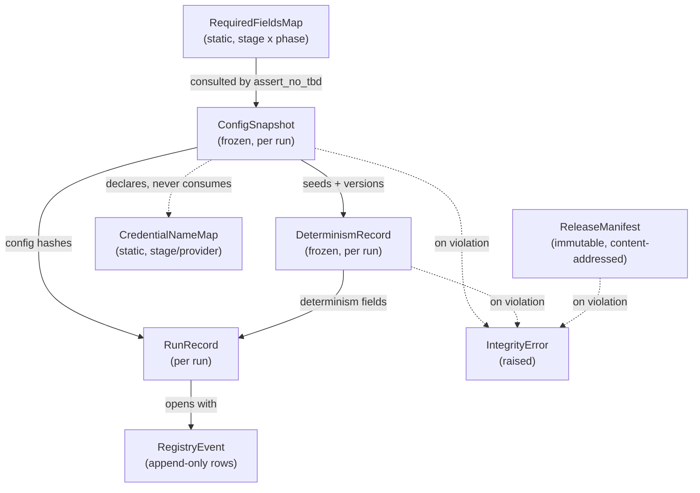

# Domain Entities — `foundation`

**Unit** `foundation` (Bolt 1) · **Kind** `library` · **Depends on** — (dependency root)

> **Addendum re-confirmed 2026-08-24.** Site **10** of
> `governance/CHANGE_RECORD_2026-08-24_foundation_amendments.md` § Addendum lands in this
> file: § 5's REQ-ENG-10 acceptance-status box read *"a row is **sought** under Amendment A
> … not approved"*, which frames the gap as provisional when **A was declined** — permanent.
> §§ 9, Coverage and Assumptions already read correctly, so this was a **missed site**, not
> a disagreement. Superseded wording preserved in place. **No count moved**; no entity,
> attribute or scientific value changed.

> **Re-established a fifth time 2026-08-23**, after a redo aimed at four stale
> cross-references in `target-standardization`'s question file. **No content of this unit
> changed.**

> **Re-established three times on 2026-08-23, after three stage-wide redo jumps** — aimed
> respectively at a correction in `acquisition`, corrections in `external-products`, and a
> misread depth policy in `component-methods.md`, and — fourth — a sweep of two question
> files that had fallen stale against their own corrected artifacts. **No content of this
> unit changed on any of the four occasions.**

The data shapes this unit owns, their lifecycles, and how they relate. A **Bolt**
is one build pass over one piece of the work, ending in something that runs;
`foundation` is Bolt 1, and every entity below is created by it and consumed by
every later Bolt through the stage entry contract.

**Nothing here is a scientific value.** These are the shapes that *carry* governed
values, not the values themselves. Every scientific constant lives in one of the
four governed configs and is frozen by D-number.

## Sources

- `../../../inception/units-generation/unit-of-work.md` § 1 `foundation` — the `Owns` list, the boundary, and the 16 requirements carried.
- `../../../inception/units-generation/unit-of-work-story-map.md` — the requirement-to-acceptance mapping; **2 of 16** requirements carry no §16/§19 row (REQ-ENG-7, REQ-ENG-10).
- `../../../inception/requirements-analysis/requirements.md` — REQ-ENG-1, -2, -3, -4, -6, -7, -8, -10, -11; FR-P1-01-10; FR-P1-04-11; FR-P1-05-13; FR-WS-7; NFR-AUD-01; NFR-SEC-01; NFR-DET-01.
- `../../../inception/application-design/component-methods.md` — the approved `ConfigSnapshot` and `DeterminismRecord` contracts.
- `../../../inception/application-design/components.md` and `component-dependency.md` — the layering rule and § Shared resources' carve-out on `evidence/locked_test_restricted/`.
- `../../../inception/application-design/services.md` — § Stage entry contract, § Run record and registry.
- `functional-design-questions.md` — Q1–Q8, FU-1–FU-3, the TA-03 verification, and the three amendments — A **declined** and B **approved** (2026-08-24), C **declined as drafted** (2026-08-25, reversing its 2026-08-24 approval). Q6 re-answered as **D′** and FU-2 rendered moot, 2026-08-25.

---

## Entity map



Text fallback: `RequiredFieldsMap` is consulted when validating `ConfigSnapshot`.
`ConfigSnapshot` supplies seeds and versions to `DeterminismRecord`, and config
hashes to `RunRecord`. `DeterminismRecord` also feeds `RunRecord`. `RunRecord`
opens by writing a `RegistryEvent`. `ReleaseManifest` carries its own
`dataset_version`, derived from its `content_hash`, and writes no separate ledger row.
`ConfigSnapshot` **declares** `CredentialNameMap` and never consumes it. Any of
`ConfigSnapshot`, `DeterminismRecord` and `ReleaseManifest` may raise an
`IntegrityError` on violation.

> *(Diagram and fallback amended 2026-08-25: the `ReleaseLedgerEntry` node and its two edges
> — `ReleaseManifest -->|"label allocation"|` and its `IntegrityError` edge — are removed, and
> the entity count moves **nine → eight**. **Amendment C was declined as drafted** by the
> project decision owner on 2026-08-25, reversing its 2026-08-24 approval; no release ledger is
> to be created. **Superseded fallback sentences, preserved:** *"`ReleaseManifest` allocation
> writes a `ReleaseLedgerEntry`."* and *"Any of `ConfigSnapshot`, `DeterminismRecord`,
> `ReleaseManifest` and `ReleaseLedgerEntry` may raise an `IntegrityError` on violation."* See
> § 8 for the full withdrawal record, the Q6 re-answer (D′, 2026-08-25) that dropped the monotonicity requirement rather than leaving it unmet, and the
> two upstream artifacts that contradicted this design and have since been corrected, 2026-08-25, on the owner's explicit authorisation.)*

---

## 1. `ConfigSnapshot` — approved contract, unchanged

Defined at stage 2.6 (`component-methods.md`) and **not modified here**:

| Attribute | Type | Meaning |
|---|---|---|
| `data`, `features`, `experiment`, `seeds` | `Mapping[str, object]` | The four governed configs, parsed |
| `hashes` | `Mapping[str, str]` | filename → SHA-256, all four |
| `snapshot_dir` | `Path` | Where the verbatim copies were written |
| `resolved_roots` | `Mapping[str, Path]` | Platform roots actually used |
| `platform` | `str` | `kaggle` \| `local` |

**Lifecycle.** Created once per run by `load_configs`, frozen, and passed by value
thereafter. There is no mutation state: a run that needs different configuration
is a different run.

**Invariant (REQ-ENG-3, ADR-07).** No machine path enters the four governed
configs, so moving a directory never changes a governed hash. `resolved_roots`
carries machine paths; the configs do not.

**Boundary (unit-of-work § 1).** This is the only unit that reads `configs/`.
Everything downstream receives resolved values, never a path into `configs/`.

## 2. `RequiredFieldsMap` — new, static, keyed by `(stage, phase)`

**FU-1 = C.** A declarative structure in `src/data/config.py`, not a governed
config file — it names field *identities*, never field *values*, so it carries no
scientific constant and needs no fifth governed file (Q1: "Do not introduce a
fifth governed configuration file").

| Attribute | Type | Meaning |
|---|---|---|
| key | `tuple[str, int]` | `(stage_slug, phase)` — phase is `1` or `2` |
| `required_fields` | `Sequence[str]` | Field paths that must be present and non-`TBD` for that stage-phase pair |

**Why the phase is in the key, not an annotation.** TE §7.0's Phase 1 hard
prohibition means a Phase-2 field is *legitimately* `TBD` during Phase 1. A
stage-only key forces one of two failures: listing the union makes Phase 1 fail on
fields it must not fill (which `project.md` § Forbidden prohibits filling), and
listing the intersection silently drops every Phase-2-only field from the check.
A `(stage, phase)` key cannot be forgotten the way a per-field annotation can be
omitted.

**Invariant — completeness is asserted, not trusted.** A test walks the parsed
configuration structure and fails when a governed required field appears in no
entry. This is the mechanism Q1 chose specifically so that an omission is a test
failure rather than a silent pass — the `DP-DATA-01` lesson that a list is not a
rule unless something proves the list complete.

**Lifecycle.** Static, versioned with the source, reviewed as code. Changes when a
stage's obligations change; every change re-runs the completeness test.

## 3. `CredentialNameMap` — new, static, declared here and never consumed here

**FU-3 = A, Q8 = D.** A second, separate declarative structure in
`src/data/config.py`, keyed by the applicable stage/provider and, where necessary,
phase.

| Attribute | Type | Meaning |
|---|---|---|
| key | `tuple[str, str]` or `tuple[str, str, int]` | `(stage_slug, provider)`, plus `phase` where a provider's requirement is phase-dependent |
| `required_names` | `Sequence[str]` | Environment-variable **names** — never values |

**The boundary statement this entity exists to make explicit.** `foundation`
**declares and hosts** this map and **does not read, return, log, serialize,
interpolate, or persist any credential value** — not in `resolve_platform_roots`,
not in any foundation-layer diagnostic. No `foundation` code path consumes the map
except to hand the names to a stage that asked for them. Hosting a list of names
is not reaching for secrets, and this is stated because without it the map reads
as a boundary violation (FU-3 recorded exactly that risk).

**Why separate from `RequiredFieldsMap`.** Both are keyed by stage, so merging
them is tempting. They are kept apart because they answer to different reviewers:
the config half is a schema review, the credential half is a §10 / NFR-SEC-01
security review. Merging them into one entry couples two review cadences, which
is how one of them gets skipped.

**Deliberately not a seventh module.** Q8's strongest form would put this in its
own file, but TE §12 fixes exactly six `src/` packages and there is no legal home
for a stray seventh. The separation is achieved by structure inside `config.py`,
not by file.

## 4. `DeterminismRecord` — approved contract, nine fields

**Approved contract — nine fields**, derived from `component-methods.md` rather than
recalled:

```
awk '/class DeterminismRecord/,/^$/' component-methods.md | grep -cE "^ +[a-z_]+: "   ->  9
```

*Superseded 2026-08-24: this section read "approved contract, plus three fields
**pending approval**" over a **six**-field contract. Amendment B was approved
(`CR-2026-08-24-FOUNDATION-AMENDMENTS`) and the three fields are now part of it.*

| Attribute | Type | Status |
|---|---|---|
| `seeds_applied` | `Mapping[str, int]` | **approved** |
| `pythonhashseed` | `str` | **approved** |
| `reexec_performed` | `bool` | **approved**. `True` when a re-exec occurred. Carried across the `exec` boundary by a **sentinel environment variable** that `ensure_process_determinism` sets before `os.execv` and the child **unsets immediately after reading** — without the pop a subprocess of a re-exec'd script inherits it and records `True` falsely. See `business-rules.md` R-05 and `business-logic-model.md` W-4. *(Carrier noted here 2026-08-25 on adversarial residual r-1 of the restored budget: this row was the field's contract and mentioned no carrier at all.)* |
| `framework_versions` | `Mapping[str, str]` | **approved** |
| `tf_op_determinism` | `bool` | **approved** |
| `nondeterministic_ops` | `Sequence[str]` | **approved** |
| `probe_scope` | `Sequence[str]` | **approved 2026-08-24** |
| `measurement_status` | `str` — `complete` \| `partial` \| `not-yet-measured` | **approved 2026-08-24** |
| `declared_vs_observed_mismatches` | `Sequence[str]` | **approved 2026-08-24** |

> ## ✅ ALL NINE FIELDS ARE IN THE APPROVED CONTRACT — AMENDMENT B APPROVED 2026-08-24
>
> **Superseded 2026-08-24, preserved:** this box was headed *"⚠ THE LAST THREE FIELDS
> DO NOT EXIST IN THE APPROVED CONTRACT"* and read *"THE LAST THREE FIELDS DO NOT
> EXIST IN THE APPROVED CONTRACT — `component-methods.md` defines **six** fields. The
> three marked PENDING are **proposed** under Amendment B and have **not been approved
> by the project decision owner**… Until Amendment B is approved,
> `nondeterministic_ops` carries the probe result with **no** recorded scope and
> **no** measurement status — which is precisely the ambiguity Q3 = C chose C to
> eliminate."*
>
> **Amendment B was approved on 2026-08-24** and `component-methods.md` now defines
> **nine** fields. The ambiguity is closed: scope and status are recorded, and the
> three fields are contract rather than specification.
>
> **What has not changed.** No determinism is claimed as measured on the strength of
> an empty list. A measured claim requires `probe_scope` to record what was examined
> **and** `measurement_status` to read `complete`; `partial` and `not-yet-measured`
> are stated rather than smoothed over. **R-06 stands** — an empty
> `nondeterministic_ops` is never proof of determinism.

**Why each field cannot be dropped** (Q3 = C requires recording probe scope,
measurement status and detected mismatches — each was tested for removal before
Amendment B was sought):

- `probe_scope` — without it, `nondeterministic_ops: []` is ambiguous between
  *probed and found none* and *probed nothing*. Q3 chose a runtime probe over a
  declared list specifically so the record is a measurement; an unrecorded scope
  makes that measurement unreadable.
- `measurement_status` — the field that stops an empty `nondeterministic_ops`
  reading as proof of determinism. Q3 names both non-complete states explicitly:
  `partial` when the framework cannot give a complete assessment,
  `not-yet-measured` when the relevant operations have not yet executed.
- `declared_vs_observed_mismatches` — the result of Q3's cross-check against the
  config-declared expected set. Empty means agreement; non-empty is an integrity
  finding under `IntegrityError`. Without the field the cross-check runs and is
  not recorded, which makes it unauditable.

**Deliberately not proposed:** a field carrying the config-declared expected set
itself. It is recoverable from the **parsed configuration** `ConfigSnapshot` carries — and from the
verbatim copies under `snapshot_dir` — and duplicating governed
data into a second location is the drift pattern
`CR-2026-08-22-SWEEP-COMPLETENESS` documents at length.

**Lifecycle.** Created once per run by `seed_everything`, after
`ensure_process_determinism` and before any graph construction. Frozen. Consumed by
`RunRecord` and the registry. **Does not** carry the bootstrap seed — that carve-out
is `src/evaluation/bootstrap.py` by ADR-05, and the carve-out is a design decision
rather than an oversight.

## 5. `RunRecord` — the per-run environment lock

**REQ-ENG-10.** Opened at step 6 of the stage entry contract, **before any domain
work**, so an aborted run is already visible.

**Eight fields, with their seven-bullet provenance stated so neither count has to
be trusted alone.** TE §13.1 carries **seven bullets**, derived:

```
awk 'NR>=749 && NR<=760 && /^- /' <TE> | wc -l   ->  7
```

Bullet 1 names two distinct captures, so the registry row carries **eight fields**
over seven bullets. REQ-ENG-10's own criterion says *"A registry row exists
carrying all eight fields"*, so the field reading is operative for the test.

| # | Field | §13.1 bullet | Source |
|---|---|---|---|
| 1 | `requirements_hash` | 1 | the pinned `requirements.txt` |
| 2 | `pip_freeze` | 1 | per-run capture |
| 3 | `runtime_versions` — Python, OS, CPU (and GPU if used), key library versions | 2 | `DeterminismRecord.framework_versions` + platform probe |
| 4 | `code_commit` | 3 | git HEAD |
| 5 | `config_hashes` — all four | 4 | `ConfigSnapshot.hashes` |
| 6 | `input_versions` — input dataset and manifest versions | 5 | release manifests consumed |
| 7 | `platform` | 6 | `ConfigSnapshot.platform` |
| 8 | `nondeterministic_ops` | 7 | `DeterminismRecord` |

**Invariant.** Every field is **populated, not `unavailable`**. A run that captures
none of them **fails the check rather than completing silently** — REQ-ENG-10's
criterion, which exists because the thirteen prior runs are recorded as violating
it (`evidence/experiment_registry.md` § Acquisition runs: the §13.1 list *"was not
captured at the time and cannot be reconstructed"*). It binds from the next run
forward.

> **Acceptance status, stated exactly.** REQ-ENG-10 has **no §16 or §19 acceptance
> row.** TA-03 was checked against all seven bullets and covers **none fully** —
> two partially, and both partials are install-time rather than per-run, which is
> the entire substance of the requirement. `requirements.md` records the same
> conclusion in REQ-ENG-10's own test column. **No row is sought: Amendment A (Vision
> §15.2) was raised and DECLINED 2026-08-24**, so REQ-ENG-10 is untested **by design,
> permanently rather than pending**. Nothing here claims acceptance coverage.
> *(Superseded status: "A row is sought under **Amendment A (Vision §15.2), not
> approved.**" — a site the 2026-08-24 sweep missed, corrected 2026-08-24 as execution
> of the same declined-A disposition already carried at § 9, § Coverage and § Assumptions.)*

## 6. `RegistryEvent` — append-only rows

**Q4 = D.** One line per run event in `experiment_registry.jsonl`, which is
**authoritative**; the CSV is derived, hashed, and marked derived.

| Attribute | Type | Meaning |
|---|---|---|
| `run_id` | `str` | Stable across every event for one run |
| `status` | `str` | **Closed enum**: `started` \| `completed` \| `aborted` \| `failed` |
| `reason` | `str` | **Required non-empty** when status is `aborted` or `failed` |
| `timestamp` | `str` | UTC |
| environment-lock fields | — | The eight `RunRecord` fields, on the `started` row |

**Status semantics, fixed by Q4:** `aborted` is an **intentional or
preflight-triggered stop**; `failed` is an **execution failure**. They are not
interchangeable and carry different diagnostic stories.

**Lifecycle — a state machine asserted by test, never by the writer.** Legal
transitions per `run_id`: `started → completed`, `started → aborted`,
`started → failed`. Rejected: duplicate `started`, repeated terminal statuses,
transitions out of a terminal status, and unknown or malformed rows.

**The invariant that makes append-only worth having.** Writes are append-only and
**never require a prior read of the run history** (Q4, explicit). The transition
graph is therefore enforced by a **separate registry-integrity test**, not at write
time — a log whose write path depends on reading is no longer a pure append. The
enum itself *is* validated at write time, because that needs no read.

**When the integrity test runs.** Before TA-10 / G-09 acceptance, and before
registry contents are relied on as audit evidence.

**NFR-AUD-01 by construction.** A failed or aborted run stays visible with its
status and reason because removing its line would require rewriting a file nothing
rewrites. Two `started` rows with one `completed` is visible in the log, so a
silent rerun cannot hide.

## 7. `ReleaseManifest` — immutable, content-addressed

**Q6 = D′** (re-answered 2026-08-25). TE §13.3's ten manifest rows over fourteen fields.

> *(Authority corrected 2026-08-25 on adversarial reviewer finding M-1, which was Major. This
> section previously read `**Q6 = D.**` and its `label` row read *"Monotonic, human-readable"* —
> **the entity contract stage 3.5 implements from**, telling an implementer the field is
> monotonic while R-12 tells them the encoding is unspecified and they must stop and report. Q6
> was re-answered as **D′**, which states verbatim "Drop 'monotonic.'" The sweep missed this
> because three sites asserted *"R-11 is unchanged"* — true of R-11's substance, false of its
> text, and the assertion stood where the check should have been.)*

| Attribute | Type | Meaning |
|---|---|---|
| `content_hash` | `str` | **AUTHORITATIVE identity.** SHA-256 over the canonical representation **specified in `business-rules.md` R-11 (decided 2026-08-25)**: RFC 8785 canonical JSON of the twelve included caller-supplied fields — **array-valued fields sorted lexicographically by the RFC 8785 serialization of their elements before serializing** (F-1, 2026-08-25: JCS does not reorder arrays, and five included fields are arrays) — excluding `dataset_version` (the label), `created_at_utc` (volatile — identical content re-released later reproduces the same identity), and `content_hash` itself |
| `dataset_version` | `str` | Human-readable, for review and citation. **Derived from `content_hash`, and NOT authoritative.** The exact hash-to-label encoding is **not specified** by any approved artifact; per TE §18.3 stage 3.5 must **stop and report** rather than choose one — see § Assumptions. *(Superseded 2026-08-25: `label` — "Monotonic, human-readable, for review and citation. **Derived and NOT authoritative**". "Monotonic" was dropped by Q6=D′; the field is named `dataset_version` in W-7 and R-12, and is named so here for consistency.)* |
| §13.3 fields — **all fourteen, enumerated** | — | `dataset_version`; `created_at_utc`; `source_manifest_id`; **`source_files`, whose own six items are specified by FR-P1-01-2 and are deliberately NOT restated in reduced form here**; the whole **`processing`** group — phase and target-definition ID, provider experiment/kindat, parameters, the station-coordinate-to-cell rule, selected cell bounds and hourly aggregation; `schema_version`; `units`; `row_counts`; `exclusions_qc_summary`; `fold_ids`; `mask_ids`; `feature_set_ids`; `output_files`; `change_record_id` |

> *(Row corrected 2026-08-25 on adversarial residual r-3 of the eighth-redo iteration 2.
> **Superseded row, preserved:** "| §13.3 fields | — | version, source manifest, hashes, schema,
> row counts, exclusions, fold/mask identifiers |" — **seven items, with `source_files` collapsed
> to "hashes"**. That is the precise defect `requirements.md` closed upstream as **`DATA-21`
> (MAJOR)**, whose remedy was to state §13.3 as **ten rows naming fourteen fields** *"against the
> seven this requirement previously listed"* and to have `source_files` **cross-reference
> FR-P1-01-2 instead of being restated in reduced form**. Reintroducing the reduction here would
> have re-set the truncated count as the bar, and FR-P1-04-11 names the consequence exactly: *"a
> release omitting its own processing provenance was conformant."* It also contradicted this unit's
> own `business-logic-model.md`, which states `source_files`' six items are validated against
> `inventory.py` **rather than restated as a bare hash**. Enumerated from FR-P1-04-11 rather than
> summarised.)*

**Which identifier wins, stated because leaving it implicit is the failure mode.**
The **content hash is authoritative**; the label is for citation at a
human-reviewed gate. Every integrity guarantee in this project is hash-based, so
making the label authoritative would put the weaker identifier in charge. A
label/hash mismatch is an **integrity violation**, not a discrepancy to reconcile.

**Invariant (TE §13.3, TA-15).** `write_release` **rejects an output directory
that already contains a release** and **never overwrites existing release
content**. Repeated writes are **not** silently treated as successful — that
behaviour would require explicit authorisation through change control, and none
has been sought.

## 8. ~~`ReleaseLedgerEntry`~~ — **WITHDRAWN 2026-08-25. Amendment C declined as drafted.**

> ## ⛔ THIS ENTITY IS WITHDRAWN — IT IS NOT PART OF THE DESIGN
>
> **Amendment C was DECLINED AS DRAFTED by the project decision owner on 2026-08-25**,
> reversing its 2026-08-24 approval. The ruling: **no release ledger is to be created**,
> `ReleaseLedgerEntry` is not to be created, `artifacts/registry/release_history.jsonl` is not
> to be created, and **`dataset_version` is to be derived from `content_hash`** — with **no
> exact hash-to-label encoding invented here**, since no approved artifact specifies one.
>
> **The ruling was given on the full evidence and reaffirmed.** Before it was executed, the
> conflict was put to the owner in these terms: this entity **predates** Amendment C (C
> propagated it upstream rather than creating it); its authority is the owner's own answers
> **Q6 = D** and **FU-2 = D** in this stage's Q&A; deriving the label from `content_hash` is
> **Q6 option C**, which the owner had read and declined in favour of D on the reasoning that
> option C cannot yield a *monotonic* label because monotonicity requires durable state; and
> executing the reversal necessarily changes the entity count and edits a workflow. The owner
> chose the full reversal with those consequences stated. It is therefore a deliberate
> override of Q6=D and FU-2=D, not an oversight, and is recorded as such.
>
> **Consequence carried forward — one open obligation, plus one requirement dropped.** *(Corrected 2026-08-25 on adversarial finding of the eighth-redo iteration 1, which found this heading **newly introduced by the previous remediation**: it read "two open items, both narrower than the one first named" while its own first bullet reads "**Monotonicity — no longer required**". A dropped requirement is not an open item, and this file's § Assumptions had it right — only never-reuse is open. It was the only live "two open items" status claim in any of the three design bodies.)* Of the two obligations
> `Q6=D` placed on the label, **neither now holds as originally stated** — monotonicity was
> dropped by the Q6=D′ re-answer, and never-reuse turns out to be contingent rather than
> satisfied *(corrected 2026-08-25 on reviewer finding M-3, which was Major; superseded claim
> preserved: "**never-reused survives** and **monotonicity does not**")*:
>
> - **Never-reused — NOT ESTABLISHED. Contingent on a label encoding that does not yet exist.**
>   What determinism *does* buy: the derivation is a pure function of `content_hash`, so it
>   allocates nothing and consults nothing, and the failure the ledger existed to prevent —
>   delete a release directory, a rebuilt index forgets the label, the next allocation reuses it
>   — requires *allocation from state* and cannot arise here. Reproducing the same label from the
>   same content is the correct outcome. **But that is idempotence, and never-reuse is its
>   converse — injectivity.** *(Corrected 2026-08-25 on reviewer finding M-3, Major. Superseded
>   claim, preserved: "**Never-reused — satisfied by determinism rather than by durable state** …
>   A label bound to two genuinely different contents reduces to a **SHA-256 collision**,
>   unreachable by any bookkeeping error.")* The collision reduction needs an encoding faithful
>   to all 256 bits, and Q6=D′ keeps the label **human-readable and citable** — necessarily
>   lossy — while leaving the encoding unspecified and forbidding stage 3.5 to choose one. So
>   never-reuse is an **open obligation on whoever specifies the encoding**, listed in
>   § Assumptions, and nothing this unit produces may claim it holds.
> - **Monotonicity — no longer required.** Ordering is information about *sequence*, which a
>   function of content alone does not carry, so no test or implementation choice reaches it.
>   Because that is a property of the mechanism rather than of its implementation, the
>   requirement was changed instead of being left unmet: **Q6 was re-presented and re-answered
>   as D′ on 2026-08-25**, dropping "monotonic". The owner decided that explicitly; the original
>   Q6=D answer is preserved verbatim beside it, and **FU-2 is moot** because it existed only to
>   locate the ledger Q6=D required. **What is disclosed is a capability, not a gap:** release
>   labels can no longer be ordered, so a reviewer comparing two of them at a gate reads
>   sequence from the run record or the experiment registry, which carry timestamps and
>   `run_id`. Nothing else in this design depended on label ordering.
>
> **FU-2's *inconsistent-mapping* obligation is discharged in the form the re-answer leaves
> available**, and its duplicate-row checks become vacuous once no rows exist and the label is a
> function of the hash — so *their* absence is not an uncovered obligation. **R-12 is amended
> rather than deleted** and carries three negative controls: derivation correspondence,
> derivation determinism, and a non-degeneracy check.
>
> **But never-reuse IS an uncovered obligation, and this passage previously implied otherwise.**
> *(Corrected 2026-08-25 on adversarial finding M-3 of the restored budget; superseded wording
> preserved: "carries three negative controls — derivation correspondence, derivation
> determinism, and **injectivity against a degenerate encoding** … so their absence is not an
> uncovered obligation.")* The third control catches a **degenerate** encoding and passes a
> **truncating** one, so it does not establish injectivity and must not be named for it.
> Never-reuse is **OPEN**, on whoever specifies the encoding — see § Assumptions.
>
> **Two upstream artifacts contradicted this design, and both have since been corrected.** They
> were first **reported** rather than edited, because this stage's scope control forbade editing
> an approved Inception artifact; the owner then authorised the edits explicitly on 2026-08-25,
> and they were made the same day with every superseded wording preserved:
> `inception/units-generation/unit-of-work.md` § 1 `foundation` → `Owns` no longer names
> `artifacts/registry/release_history.jsonl`, and
> `inception/application-design/services.md` § Run record and registry now reads *"Two
> artifacts, one authoritative"* with the ledger row removed. **No other unit referenced the
> ledger**, verified by search across `construction/`, so nothing further was orphaned and the
> correction is contained to those two sites.
>
> **The entity count moves nine → eight.** Every count the owner fixed is untouched: 16
> requirements, 2 untested, 7 acceptance rows, §19 at 36 rows, 17 rules, ten workflows
> W-1…W-10 (W-7 loses a step; the workflow remains).

**Superseded definition, preserved verbatim below.** Nothing in it is part of the design.

**FU-2 = D.** One line per label allocation at
`artifacts/registry/release_history.jsonl`, kept **separate from
`experiment_registry.jsonl`**.

| Attribute | Type | Meaning |
|---|---|---|
| `label` | `str` | The allocated human-readable label |
| `content_hash` | `str` | The authoritative release identity it binds to |
| `release_path` | `str` | Where the release was written |
| `allocating_run_id` | `str` | The run that allocated it |
| `timestamp` | `str` | UTC |

**Why a durable ledger and not a directory scan.** Q6 requires labels allocated
from a durable append-only history *rather than solely by scanning existing
directories*, and Q6's reasoning rules out a derived index: if a release directory
is deleted, a rebuilt index forgets the label and the next allocation **reuses**
it. A ledger cannot forget.

**Why separate from the registry.** Folding release events into
`experiment_registry.jsonl` would force Q4's transition graph to filter by row kind
before applying its rules — and a rule whose readers must filter first is a rule
that quietly stops applying to the rows it was written for.

**Integrity test**, following the pattern Q4 established: rejects a duplicate or
reused label, a label bound to two different content hashes, a content hash bound
to two labels, and a malformed row.

> **⛔ Amendment status — DECLINED AS DRAFTED 2026-08-25.** The box below records the
> 2026-08-24 approval that the 2026-08-25 ruling reversed; it is preserved as the dated record
> of what was approved then, and is **not** the current state. See the withdrawal box at the
> head of this section.
>
> **✅ Amendment status — APPROVED 2026-08-24** *(superseded 2026-08-25)*
> (`CR-2026-08-24-FOUNDATION-AMENDMENTS`). *Superseded, preserved:* *"PENDING, NOT
> approved. This entity is **not** in `unit-of-work.md` § 1 `foundation` → `Owns`…
> It is **not** in `services.md` § Run record and registry, which opens "Two
> artifacts, one authoritative". Both are approved-stage artifacts and **neither is
> edited**."*
>
> Both have since been annotated in place on the owner's approval: the ledger is named
> in `unit-of-work.md` § 1 `foundation` → `Owns`, and `services.md` § Run record and
> registry now reads **three artifacts, one authoritative**.
>
> **Its authority is Q6=D and FU-2=D**, two approved answers of this stage — not an
> engineering preference. Q6=D requires a *monotonic, human-readable* label alongside
> the authoritative hash, chosen **over** option C's *"version derived from the
> manifest hash"*; FU-2=D names this ledger, its ownership, its append-only behaviour
> and its independent integrity test. Monotonicity requires durable state, which is
> exactly why the directory scan below cannot serve.
>
> *(An earlier draft of the change record proposed rejecting this entity and deriving
> the label from the content hash instead. That proposal was withdrawn: it is Q6
> option C, which the owner had read and declined, and it cannot produce a monotonic
> label. Recorded so the reasoning is not lost.)*
>
> **No TE §12 amendment is required** — determined, not assumed:
> `artifacts/registry/` is already an enumerated directory in the §12 tree, and the
> tree carries **zero file-level entries** inside any `artifacts/` subdirectory
> (`sed -n '709,721p' <TE> | grep -cE '\.(jsonl|json|csv)'` → `0`). Confirming from
> the other direction, `experiment_registry.jsonl` is not named anywhere in the
> Technical Environment; it originates in stage 2.6's `services.md`.

## 9. `IntegrityError` — the exception hierarchy as an entity

**Q5 = B.** One base class, **fourteen subclasses — six of them raised by this unit** *(cardinality corrected 2026-08-25 on adversarial finding m-1 of the ninth-redo iteration 1: it read "six current subclasses" twelve lines above § 9's own corrected enumeration of all fourteen. The previous fix edited the list and its rationale and left the entity's **defining cardinality sentence** — the eighth consecutive appearance of the count-in-prose class, inside the very section that fix had edited)*, and any future
integrity-related exception.

| Attribute | Type | Meaning |
|---|---|---|
| `resource` | `str` | The affected file or resource |
| `violated_expectation` | `str` | What was expected and was not true |

**Both fields are required by the constructor**, so the affirmed two-tier posture —
*an integrity violation exits non-zero naming the file and the violated
expectation* — is enforced by construction rather than by discipline.

Subclasses — **all fourteen project-defined exceptions**, of which this unit **raises six**:
`ConfigError`, `PreflightError`, `PlatformError`, `DeterminismError`, `ReleaseError`,
`RegistryError`. The other **eight are raised by other units and derive from the same base**:
`PhaseBoundaryError`, `LockedTestError`, `LeakageError`, `AlignmentError`, `SeedError`,
`FairnessError`, `BootstrapError`, `RegimeError`.

> *(Enumeration corrected 2026-08-25 on adversarial finding m-1 of the eighth-redo iteration 2.
> **Superseded:** "Subclasses: `ConfigError`, `PreflightError`, `PlatformError`,
> `DeterminismError`, `ReleaseError`, `RegistryError`." `component-methods.md` § Assumptions
> places all fourteen in a shared base and defers placement to **stage 3.1**, which is this stage.
> The omission mattered: W-1 step 4 raises `PhaseBoundaryError`, and with it outside the hierarchy an
> `except IntegrityError` would let a phase-boundary violation exit **without the `aborted` registry
> row** that NFR-PHASE-01 and NFR-AUD-01 require. See `business-rules.md` R-01 for the full record
> and the cross-unit obligation this places on the units that raise the other eight.)*

**Why a base rather than fourteen independents** *(count corrected 2026-08-25 with the enumeration above; "six" was this unit's own raises, not the hierarchy)*. The stage entry contract must catch
*any* of them to write the `aborted` registry row. A bare list means a
seventh added later is silently not caught — the same list-versus-rule failure as
Q1, and the same one `DP-DATA-01` caught in this project already. Catching the base
means a new subclass is covered by virtue of its base.

**Completeness shortfalls are not in this hierarchy.** Per Q5, a non-fatal
shortfall (a missing month, a partial retrieval) is **explicit manifest or
return-value data**, never a raised exception — so it cannot accidentally be
raised as fatal. A second hierarchy for it would be unused machinery today.

---

## Requirement coverage

**Two different relations, kept apart because conflating them is what made the
first issue of this table wrong.** Both are derived from
`unit-of-work-story-map.md`, not reasoned from acceptance-row text:

- **Tests it** (story-map **Table 1**) — the row that verifies this requirement.
  That row may be **owned by another unit**.
- **Owned here** (story-map **Table 2**) — the rows whose **primary owner** is
  `foundation`. Exactly seven, matching `unit-of-work.md` § 1's "Acceptance rows
  (7)":

```
awk 'NR>=145 && NR<=223' unit-of-work-story-map.md | awk -F'|' '$4 ~ /foundation/ {print $2}'
  ->  TA-01 TA-02 TA-03 TA-10 TA-15 TA-22 TA-23      (count 7)
```

**The owner column is the `primary` cell of story-map Table 2, derived per row —
never the supporting cell, and never inferred:**

```
awk -F'|' 'NR>=145 && NR<=223 {r=$2; gsub(/[` *]/,"",r); print r": primary="$4" supporting="$5}' \
  unit-of-work-story-map.md
```

| Requirement | Entities | Tested by (Table 1) | Row owner (Table 2 `primary`) |
|---|---|---|---|
| REQ-ENG-1 | all — the §12 tree and `artifacts/` | TA-01 | `foundation` |
| REQ-ENG-2 | `ConfigSnapshot`, `RequiredFieldsMap` | TA-02 | `foundation` |
| REQ-ENG-3 | `ConfigSnapshot` (no machine path in configs) | **TA-03, TA-26** | TA-03 → `foundation`; TA-26 → **`models-and-baselines`** |
| REQ-ENG-4 | the `tests/` tree | **TA-09** — *bounded, see story-map § Known defects row 8* | `fixtures-and-reproducibility` |
| REQ-ENG-6 | `ConfigSnapshot.platform`, `resolved_roots` | **TA-22** | `foundation` |
| **REQ-ENG-7** | `RegistryEvent` *(superseded 2026-08-25: `RegistryEvent`, `ReleaseLedgerEntry` — the ledger entity is withdrawn, Amendment C declined as drafted; see § 8)* | ⚠ **NO ACCEPTANCE ROW, AND NONE WILL BE ADDED** — Amendment A **declined 2026-08-24**; untested by design | — |
| REQ-ENG-8 | `ConfigSnapshot` | **TA-16** | `regimes-diagnostics-reporting` |
| **REQ-ENG-10** | `RunRecord` | ⚠ **NO ACCEPTANCE ROW, AND NONE WILL BE ADDED** — TA-03 verified not to cover it; Amendment A **declined 2026-08-24**; untested by design | — |
| REQ-ENG-11 | `RunRecord.runtime_versions` | **TA-17, TA-26** | TA-17 → `fixtures-and-reproducibility`; TA-26 → **`models-and-baselines`** |
| FR-P1-01-10 | `CredentialNameMap` | TA-22 | `foundation` |
| FR-P1-04-11 | `ConfigSnapshot` | **TA-15** | `foundation` |
| FR-P1-05-13 | `DeterminismRecord` | **TA-10** | `foundation` |
| FR-WS-7 | `ReleaseManifest` | **TA-23** | `foundation` |
| NFR-AUD-01 | `RegistryEvent` | **TA-10, TA-21** | TA-10 → `foundation`; TA-21 → **`fixtures-and-reproducibility`** |
| NFR-SEC-01 | `CredentialNameMap` | TA-22 | `foundation` |
| NFR-DET-01 | `DeterminismRecord` | **WS-17, TA-13** | WS-17 → `statistical-inference`; TA-13 → `models-and-baselines` |

**`foundation` is a *supporting* unit on exactly two rows — TA-13 and TA-26** —
which is a different relation again from owning them and from being tested by them.
Both sets derived, not written:

```
# primary
awk -F'|' 'NR>=145 && NR<=223 {p=$4; gsub(/[` *]/,"",p); if(p=="foundation"){r=$2; gsub(/[` *]/,"",r); print r}}' \
  unit-of-work-story-map.md
  ->  TA-01 TA-02 TA-03 TA-10 TA-15 TA-22 TA-23        (count 7)

# supporting
awk -F'|' 'NR>=145 && NR<=223 {if($5 ~ /foundation/){r=$2; gsub(/[` *]/,"",r); print r}}' \
  unit-of-work-story-map.md
  ->  TA-13 TA-26                                       (count 2)
```

> **THIRD CORRECTION, 2026-08-22 — the same confusion class, a third time.**
>
> **Superseded text, preserved:** *"`foundation` is a supporting unit on three of
> these rows — TA-13, TA-23 and TA-26."*
>
> **TA-23's Table 2 `primary` is `foundation` itself.** It is one of the seven rows
> this unit **owns**, listed two paragraphs above in this same section — so the
> sentence contradicted its own section, not merely the source. The supporting set
> is **two** rows, not three.
>
> **This is the third occurrence of primary-versus-supporting confusion in this one
> table**, after pass 1 (wrong "tested by" citations) and pass 2 (wrong `Row owner`
> entries). Each correction fixed the cells it was aimed at and then restated the
> result in prose **without deriving the restatement**. The derivation output was
> available and was not consulted. Both sets are now produced by the commands above
> rather than summarised from memory.

**16 requirements, 2 without an acceptance row** — REQ-ENG-7 and REQ-ENG-10,
matching the story map's designation.

> **CORRECTION, 2026-08-22 — first issue of this table was wrong, and an
> adversarial review caught it.** Of the 14 requirements carrying a citation, only
> **4** were right: REQ-ENG-1, REQ-ENG-2, FR-P1-01-10, NFR-SEC-01. **8 cited the
> wrong row** (REQ-ENG-3, -4, -6, -8, FR-P1-04-11, FR-P1-05-13, FR-WS-7,
> NFR-DET-01) and **2 dropped a row from a multi-row source** (REQ-ENG-11,
> NFR-AUD-01).
>
> **Cause.** The mapping was **reasoned from what each acceptance row's text sounded
> like it ought to test**, rather than **derived from story-map Table 1**. Because
> `business-logic-model.md` carried the identical wrong table, cross-checking the two
> artifacts against each other could never have caught it — only checking both
> against the source could, which is what the reviewer did.
>
> **Superseded rows, preserved for the audit trail:** REQ-ENG-3 → `TA-02`;
> REQ-ENG-4 → `TA-01`; REQ-ENG-6 → `TA-03`; REQ-ENG-8 → `TA-02`; REQ-ENG-11 →
> `TA-17` alone; FR-P1-04-11 → `TA-02`; FR-P1-05-13 → `TA-26`; FR-WS-7 → `TA-15`;
> NFR-AUD-01 → `TA-10` alone; NFR-DET-01 → `TA-13, TA-26`.
>
> **The rollup tension the reviewer also raised is not a defect** — the figures
> count different relations and both are correct. `foundation` **owns 7** rows
> (Table 2 `primary`), its 16 requirements are **tested by 14 distinct** rows
> (Table 1), and it is a **supporting** unit on **2** rows — TA-13 and TA-26.
> Three relations, three different numbers, all three derived by the commands in
> § Requirement coverage above.
>
> *(Superseded: "a **supporting** unit on 3 more" — the same wrong figure as the
> third correction below, in a second location in this file. Correction 3 fixed the
> statement at § Requirement coverage and missed this one; found on a self-sweep
> before the next reviewer pass, making it the **fourth** occurrence of this class.
> "3 more" was doubly wrong: the count is 2, and TA-23 — the row that inflated it —
> is one of the 7 this unit **owns**, so it could not be "more" in any case.)*
>
> **Derived, because the first attempt at this sentence said 13:**
>
> ```
> for id in <foundation's 16 requirement ids>; do
>   grep -E "^\| \*{0,2}$id\b" unit-of-work-story-map.md | head -1 | awk -F'|' '{print $4}'
> done | grep -oE "(WS|TA)-[0-9]{2}" | sort -u | wc -l      ->  14
> ```
>
> `TA-01 TA-02 TA-03 TA-09 TA-10 TA-13 TA-15 TA-16 TA-17 TA-21 TA-22 TA-23 TA-26 WS-17`

> ## SECOND CORRECTION, 2026-08-22 — the first correction introduced two defects of its own
>
> Iteration 2 of the adversarial review found that the **Row owner column added to
> fix the first finding was itself wrong in 3 of its 4 multi-row entries**, and that
> the sentence explaining the fix carried an underived count. Both are confirmed
> against story-map Table 2.
>
> **Superseded owner attributions, preserved:**
> - REQ-ENG-3 → *"`foundation`; `fixtures-and-reproducibility`"*. TA-26's `primary`
>   is **`models-and-baselines`**; `fixtures-and-reproducibility` is only
>   *supporting* on that row. **Naming a supporting unit as the owner.**
> - REQ-ENG-11 → *"`fixtures-and-reproducibility`"*. One owner given for two rows;
>   TA-26's is **`models-and-baselines`**. **Incomplete.**
> - NFR-AUD-01 → *"`foundation`; `regimes-diagnostics-reporting`"*. TA-21's sole
>   `primary` is **`fixtures-and-reproducibility`**; `regimes-diagnostics-reporting`
>   appears nowhere on that row. **Wrong unit entirely.**
> - NFR-DET-01 was the one of four that was right.
>
> **Superseded count, preserved:** *"13 referenced rows"* → **14**.
>
> **Cause — the same one, twice.** The first correction fixed the "tested by" column
> by deriving it from Table 1, then filled the new owner column by **reasoning from
> which unit sounded responsible**, and wrote the distinct-row count from an earlier
> working note. Deriving one column does not make the column beside it derived.
> Both are now produced by the commands printed above.
>
> **Review budget is exhausted** (2 of 2 iterations). These corrections were applied
> *after* the final reviewer pass and have therefore **not been re-reviewed.** That
> is disclosed at the approval gate rather than presented as a clean result.

## Assumptions & Open Questions

- **[assumption]** `src/data/registry.py` and its `Station` entity are **not** part of this unit. `component-methods.md` places them between two `foundation` modules, but `unit-of-work.md` § 1 does not list them under `Owns`; the station registry belongs to `inventory-and-registry`.
- **[assumption]** `src/data/locked_test.py` is not this unit's, notwithstanding that `foundation` owns the boundary rule naming it. It belongs to `governance-guards` (BLK-07); § Shared resources fixes without qualification that nothing else may construct a path into `evidence/locked_test_restricted/`.
- **[assumption]** `frontend-components.md` is not produced. `foundation` is `kind: library`; the stage's `produces_kinds` maps that artifact to `[ui]` only, and the engine's resolved list for this unit carries three artifacts.
- **Closed — Amendment A** (Vision §15.2): §19 acceptance rows for REQ-ENG-7 and REQ-ENG-10. **Raised and DECLINED 2026-08-24.** No rule requires universal §19 coverage, and the approved position dispositions uncovered requirements as *"Open by design"*. **No acceptance coverage is claimed for either, permanently rather than pending.** *(Superseded status: "**Open** … **Not approved.**")*
- **Closed — Amendment B** (approved 2.6 artifact): three `DeterminismRecord` fields. **APPROVED 2026-08-24.** The approved contract now stands at **nine** fields. *(Superseded status: "**Not approved.** The approved contract stands at six fields.")*
- **Closed — Amendment C. Its consequences are closed EXCEPT never-reuse, which is open.** *(Heading corrected 2026-08-25 on adversarial finding M-3 of the restored budget: it read "**Closed — Amendment C, and its consequences with it**" while sitting two bullets above the OPEN injectivity item below it.)* **DECLINED AS DRAFTED 2026-08-25**, reversing the 2026-08-24 approval: no release ledger, `ReleaseLedgerEntry` withdrawn (§ 8), `dataset_version` derived from `content_hash` with no encoding specified here. *(Superseded statuses, all preserved: "**Open — Amendment C, and now carrying an unresolved consequence** … Two things stay open and are carried to the stage gate rather than resolved here"; "**Closed — Amendment C** … **APPROVED 2026-08-24** on the authority of Q6=D and FU-2=D"; and "**Not approved.**")* Three consequences first read as open; **two are closed and one — never-reuse — is OPEN.** *(Body corrected 2026-08-25 on adversarial finding M-1 of the restored budget's iteration 2. The heading of this bullet was corrected on the previous pass and **its body was not**, so it went on asserting the withdrawn claim two bullets above the OPEN injectivity item. Superseded wording preserved: "Three consequences first read as open; **all three are now closed**" and "(b) **Never-reuse** survives by determinism — a pure derivation allocates nothing, so the delete-and-rebuild failure cannot arise." Both sibling artifacts had this right; this one did not. **Fifth consecutive pass of the heading-versus-body class**, and the reason it kept recurring is that each sweep matched the phrase it had just written rather than the claim it was retiring.)* (a) **Monotonicity — CLOSED**, and not by a mechanism: it could not be met by any mechanism available here, so the requirement itself was changed — **Q6 was re-presented and re-answered as D′ on 2026-08-25**, dropping *"monotonic"*, and **FU-2 is moot** because it existed only to locate the ledger. What is disclosed there is a capability rather than a gap: release labels cannot be ordered, so sequence is read from the run record or the experiment registry. (b) **Never-reuse — OPEN.** What determinism does close is the **delete-and-rebuild failure**: a pure derivation allocates nothing, so a rebuilt index cannot forget a label. That is **idempotence**, and never-reuse is its converse, **injectivity** — different content, different label — which holds only for an encoding faithful to all 256 bits, while Q6=D′ keeps the label human-readable and therefore lossy. It is an obligation on whoever specifies the encoding; see § Assumptions. (c) **`unit-of-work.md` § 1 `Owns` and `services.md`** were **corrected on 2026-08-25** on the owner's explicit authorisation, after this stage first reported rather than edited them; superseded wordings preserved at both sites, and no other unit referenced the ledger.
- **OPEN — a cross-unit obligation on the eight exceptions this unit does not raise.** `foundation` owns `IntegrityError` and the stage-entry catch, and R-01 now places **all fourteen** project-defined exceptions in that hierarchy on the authority of `component-methods.md` § Assumptions. Eight of them are **raised by other units** — `PhaseBoundaryError` and `LockedTestError` (`governance-guards`), `LeakageError`, `AlignmentError`, `SeedError`, `FairnessError`, `BootstrapError`, `RegimeError` — and **each of those units' `functional-design` must declare its own exceptions as `IntegrityError` subclasses**. This unit cannot do it for them, and it is recorded here rather than assumed because the omission it replaces would have let a phase-boundary violation exit with **no `aborted` registry row**, against NFR-PHASE-01 and NFR-AUD-01 *(added 2026-08-25 on adversarial finding m-1 of the eighth-redo iteration 2)*. No cycle is created: every one of those units already depends on `foundation`.
- **OPEN — whether `IntegrityError` should move to a dedicated `src/data/exceptions.py`.** This stage declared the hierarchy in **`src/data/config.py`** because TE §12's `src/data/` tree names **nine** modules and **none for exceptions**, so a dedicated module is a **§12 amendment** this stage may not make by assertion. `config.py` works and crosses no import boundary — every unit raising one of the other eight already depends on `foundation`. But a module whose §12 comment reads *"config load, per-run snapshot, hashes, determinism helper"* is not an obvious home for the project-wide exception base, and the fourteen-subclass hierarchy is now project-wide rather than `foundation`-local. **The owner's decision: accept `config.py`, or amend §12 for `src/data/exceptions.py`** *(added 2026-08-25 on adversarial finding M-1 of the ninth-redo iteration 1, whose fix names this item as recorded here — so not creating it would have been the same claim-without-the-thing defect the last three passes each caught)*.
- **OPEN — the `dataset_version` hash-to-label encoding.** *(Added 2026-08-25 on adversarial reviewer finding M-4, Major: all three artifacts stated the encoding was unspecified while none listed it as an open item.)* Q6=D′ requires `dataset_version` derived from `content_hash` **and** human-readable; no approved artifact specifies the encoding, and per TE §18.3 stage 3.5 must **stop and report** rather than choose one. It blocks concrete work — `dataset_version` is a §13.3 manifest field that W-7 step 5 must produce, so `src/data/release.py` and the §18.3-critical `tests/test_release_hashes.py` cannot be completed. A freeze-gate decision, not an implementation choice.
- **OPEN — injectivity of that encoding, and with it never-reuse.** The derivation gives idempotence, not injectivity, and a citable label is a lossy encoding of a 256-bit hash. Whoever specifies the encoding must make it injective over the release population in scope, or state and have accepted its collision bound.
- **OPEN — an amendment need on `write_release`'s approved raise-contract.** `component-methods.md` has `write_release` raise `ReleaseError` *"when a field is absent"* over **all fourteen** §13.3 fields. Deriving `dataset_version` inside `write_release` (Q6=D′) narrows the **caller** precondition to thirteen while leaving the **output** obligation at fourteen. The release still carries all fourteen fields, so what the function writes is unchanged — but the caller contract does change, and this stage demanded a formal amendment for exactly this class when it declined to alter `ensure_process_determinism`'s `-> None` signature. Applying a looser standard here would be inconsistent, so this is **the owner's decision, not a settled contract** *(added 2026-08-25 on adversarial finding m-2 of the restored budget; the rule text claimed it was listed here and it was not)*.
- **OPEN — an amendment need on `verify_release`, or acceptance that the correspondence check is test-only.** R-11's and R-12's correspondence negative control was relocated to *"a presented manifest"* without naming what performs it. The only candidate in the approved contracts, `verify_release(manifest_path) -> Sequence[str]`, **does not fit**: it reports files whose *file hash* mismatches and **never raises**, so it covers neither label/hash correspondence nor failure signalling. The control is therefore specified as a **test** obligation on `tests/test_release_hashes.py` (TA-15), which needs no production entry point. **If runtime enforcement is wanted, `verify_release` must be amended** — the owner's decision *(added 2026-08-25 on adversarial finding M-5 of the restored budget; likewise claimed as listed here and not)*.
- **Open** — the concrete `RequiredFieldsMap` **and `CredentialNameMap`** contents cannot be enumerated until the four configs exist with their field names *(both maps named 2026-08-25 on an adversarial residual: this bullet named only the first where both siblings name both, and § 3's `CredentialNameMap` contents are equally unenumerable today)*. This stage fixes the **mechanism**; the populated maps are Bolt 1 work product.
- **G-09 is not signed.** Nothing here authorises creating `src/data/config.py`, `src/data/release.py` or `tests/test_determinism.py`.
- **None** of the above adopts a reading on a supervisor-owned value, and none decides a scientific constant.

## Review history

This file carried **both** of the reviewer's critical findings and both of the
defects the first correction introduced. Its § Requirement coverage table has been
wrong twice and is the section to scrutinise first.

| Pass | Verdict | Effect on this file |
|---|---|---|
| Iteration 1 (adversarial) | **NOT-READY** | § Requirement coverage wrong in **8 of 14** cited rows, incomplete in **2** more. Cause: reasoned from acceptance-row text, not derived from story-map Table 1 |
| Correction 1 | — | Table re-derived from Table 1; a `Row owner` column added to resolve the reviewer's minor finding about the 7-row rollup |
| Iteration 2 (adversarial) | **NOT-READY** | Confirmed the first fix landed — **and found the new `Row owner` column wrong in 3 of its 4 multi-row entries**, plus an underived count ("13 referenced rows", actually 14) |
| Correction 2 | — | Owner column re-derived from Table 2's `primary` cell with the command printed; count derived; three relations (tested-by / owns / supports) separated explicitly |
| Redo jump, 2026-08-22 | — | Correction 2 was **unreviewed** — the budget was spent. The owner directed a re-review before any further unit; the jump reset the budget and the receipt floor |
| Iteration 1 of the fresh budget | **NOT-READY** | Confirmed corrections 1 and 2 both landed and every printed command reproduces. Found a **third** primary-vs-supporting defect, in a sentence added by correction 2: the supporting set was stated as three rows including TA-23, which this unit **owns** |
| Correction 3 | — | Supporting set re-derived: **two** rows, TA-13 and TA-26. Both the primary and supporting sets now carry the commands that produce them |
| Self-sweep before iteration 2 | — | Found a **fourth** occurrence: the same wrong supporting count ("3 more") in a **second location in this file**, which correction 3 had missed. Corrected and derived |
| Iteration 2 of the fresh budget | ~~*pending*~~ → **READY**, completed 2026-08-24 | *(Row corrected 2026-08-25 on reviewer finding m-4; iteration-1 of the 2026-08-25 pass had named this row class explicitly and it was left un-swept. **Superseded effect cell, which was affirmatively false:** "Corrections 3 and 4 have not yet been adversarially reviewed." They were — that pass returned READY. Two further passes have run since, both **NOT-READY**: 2026-08-25 iteration 1 (seven findings) and iteration 2 (five Major).)* |

**Four occurrences of one confusion class in one table.** Passes 1 and 2 and the fresh pass 1 each caught one; the fourth was caught by a self-sweep rather than by review. The through-line is identical every time: the **table cells** were derived, and then a **sentence summarising them** was written from memory instead of from the derivation output that was already on screen. Every figure in this section now carries its producing command, and the two set memberships are printed in full rather than counted in prose.

**The pattern, recorded because it repeated.** Both failures were the same
mistake: a fact that a source artifact already states was **reasoned** instead of
**derived**. Fixing one column by derivation did not make the column beside it
derived. Every figure in § Requirement coverage now carries the command that
produced it.

**What iteration 2 cleared here.** The five re-derived counts, the TA-03 coverage
verification, Q7's dual limbs, Q8's credential placement, the pending-amendment
discipline, and boundary compliance on `registry.py` / `locked_test.py` / `TBD`
fields / scientific constants.

---

## Finalized 2026-08-24 — the three amendments are settled

Recorded under `governance/CHANGE_RECORD_2026-08-24_foundation_amendments.md`, after
an independent challenge of each amendment against the approved artifacts.

- **Amendment A — DECLINED.** No project rule requires universal §19 coverage, and the approved position dispositions uncovered requirements as *"Open by design"*. **REQ-ENG-7 and REQ-ENG-10 are untested by design, permanently rather than pending.** No count moved: untested stays 36, this unit's stays 2 of 16, its acceptance rows stay 7, TE §19 stays at 36 rows.
- **Amendment B — APPROVED.** `DeterminismRecord` is a **nine-field approved contract**, not a six-field contract plus three proposals.
- **Amendment C — DECLINED AS DRAFTED 2026-08-25**, reversing the 2026-08-24 approval. No release ledger is created, `ReleaseLedgerEntry` is withdrawn (§ 8), `artifacts/registry/release_history.jsonl` is not created, and `dataset_version` is derived from `content_hash` with **no encoding invented here**. **R-11 is unchanged** — the content hash remains authoritative. **R-12 is amended, not deleted**, and states the resulting monotonicity gap. *(Superseded status, preserved: "**Amendment C — APPROVED**, on the authority of **Q6=D** and **FU-2=D**. `ReleaseLedgerEntry` is an approved entity, now named in `unit-of-work.md` § 1 `foundation` → `Owns` and in `services.md` § Run record and registry … the label is a citation device." The reversal is a deliberate owner override of Q6=D and FU-2=D, given after the conflict was put to them in full; it is not an oversight.)*

**The entity count moves nine → eight, 2026-08-25.** *(Superseded: "**The nine-entity count is
unchanged.** `ReleaseLedgerEntry` already existed in this document; what changed on 2026-08-24
is that the upstream artifacts now carry it too." That was true then and is superseded by the
Amendment C reversal.)* Numbering is **not** renumbered, because every cross-reference in this
unit cites entities by section number: § 8 remains in place as a withdrawal record, so this
document carries **nine numbered sections and eight live entities**. Any derived count must
therefore read `grep -cE "^## [0-9]+\. " domain-entities.md` → 9 **minus the one withdrawn
section** → **8**. The two upstream artifacts that named the ledger have both been
**corrected** on 2026-08-25, on the owner's explicit authorisation after this stage had first
reported them rather than edited them: `unit-of-work.md` § 1 `Owns` no longer lists it, and
`services.md` now reads *"Two artifacts, one authoritative"*. Superseded wordings are preserved
at both sites, and a search across `construction/` confirmed **no other unit referenced the
ledger**, so nothing further was orphaned.

**G-09 remains unsigned.** Nothing in this document authorises creating a module, and
no scientific value is decided here.

---

> **Re-saved 2026-08-24 under the post-redo receipt floor.** The project decision owner
> authorised a redo jump on `functional-design` at 2026-08-24T14:57:07Z so that three
> standing reviewer findings on `models-and-baselines` could be fixed and re-reviewed;
> a redo resets the receipt floor for **every** unit of the stage. **No content of this unit
> changed** — not a question, answer, amendment, rule, entity, workflow, count or scientific
> value. The only artifacts edited after the redo were `models-and-baselines`'s, whose
> three fixes are confined to its own files. That unit returned **READY** on the second pass of
> the restored budget, which is what the redo was authorised for. The two residuals riding that
> verdict — R-96's `PartitionError` mechanism and R-95's field label — are carried to the stage
> gate rather than applied, per the rule that a suggestion riding a READY verdict is gate input.

---

> **Re-saved 2026-08-25 under the sixth post-redo receipt floor.** The stage wedged on
> `models-and-baselines`: its artifacts were written and the adversarial reviewer returned
> READY on iteration 2 of 2 (2026-08-24T15:16:47Z) *before* its summary confirmation was
> recorded (15:32:45Z). The engine requires a produces-artifact write after the confirmation
> receipt, the write-freeze hook refused the re-save because a fresh READY receipt covered the
> unit, and the 2-iteration adversarial budget was spent — a deadlock whose only sanctioned
> exit is a redo jump. The project decision owner authorised one at **2026-08-25T06:30:05Z**,
> which reset the receipt floor for every unit of the stage.
>
> **No entity, field or acceptance-status box in this document changed.** The owner directed
> **evidence-driven revision** for this recovery — keep the adversarially-verified text as the
> baseline and edit only where a real defect is found — rather than a blanket re-derive, on the
> finding that all eight built units already carry a READY `## Review` section and that a
> blanket rewrite would discard verified corrections.
>
> **Upstream provenance, enumerated per file** *(corrected 2026-08-25 on reviewer finding m-5;
> **superseded wording, preserved:** "Every consumed upstream file was last modified at 12:26
> UTC, three hours before this unit's 15:27 UTC artifacts and committed unchanged at `9c7afd9`"
> — true of three of the six, generalised across all six)*:
>
> | Consumed artifact | Last modified | Commit |
> |---|---|---|
> | `unit-of-work.md` | 2026-08-24 12:26 UTC | `9c7afd9` |
> | `component-methods.md` | 2026-08-24 12:26 UTC | `9c7afd9` |
> | `services.md` | 2026-08-24 12:26 UTC | `9c7afd9` |
> | `unit-of-work-story-map.md` | 2026-08-23 20:40 UTC | `45796f5` |
> | `components.md` | 2026-08-23 19:05 UTC | `45796f5` |
> | `requirements.md` | 2026-08-22 12:37 UTC | `89674b6` |
>
> **The no-drift conclusion is unchanged**: all six predate this unit's 15:27 UTC artifacts.
>
> The unit's figures were re-derived programmatically from the current `unit-of-work.md` § 1 —
> **16** requirements, **2** untested (REQ-ENG-7, REQ-ENG-10), **7** acceptance rows — each
> agreeing with what this document asserts, including § 5's REQ-ENG-10 box (site 10, *"untested
> by design, permanently"*, which stands as applied since Amendment A was declined rather than
> deferred).
>
> **Eight live entities**, down from nine, and their field contracts otherwise unchanged;
> `DeterminismRecord` still at the nine fields Amendment B approved. *(Superseded: "The nine
> entities and their field contracts are unchanged". **Amendment C was declined as drafted on
> 2026-08-25**, reversing its 2026-08-24 approval, so `ReleaseLedgerEntry` is withdrawn — § 8
> stays in place as the withdrawal record, giving nine numbered sections and eight live
> entities. The monotonicity requirement was dropped by re-answering Q6 as D′ on 2026-08-25 rather than left unmet, and the two contradicting upstream artifacts
> were corrected the same day on the owner's explicit authorisation, so neither is carried
> forward as an open item.)* The unit's rule count is **17
> (R-01–R-17)**, corrected 2026-08-25 on reviewer finding M-1 from a *"thirteen rules"* figure
> that the sibling `business-rules.md` had carried from prose — a reporting correction, not a
> change to the rule set, and no requirement, acceptance or §19 total moved with it.

---

> **Re-saved 2026-08-25 after the remediation of the iteration-1 findings**, under the receipt
> recorded for this unit at the sixth post-redo floor.
>
> **What changed in this file:**
>
> - **§ 8 `ReleaseLedgerEntry` is withdrawn** — Amendment C declined as drafted, reversing its
>   2026-08-24 approval. Its definition is preserved verbatim beneath a withdrawal box.
>   **The section is deliberately not renumbered**, because every cross-reference in this unit
>   cites entities by section number: § 8 stays in place as the withdrawal record, so this
>   document carries **nine numbered sections and eight live entities**. A derived count must
>   read 9 numbered sections **minus the one withdrawn** → **8**.
> - **The entity map and its text fallback** lose the ledger node and its two edges;
>   `ReleaseManifest` now carries its own `dataset_version`, derived from its `content_hash`.
>   Both superseded fallback sentences are preserved.
> - **§ 5's REQ-ENG-7 row** reads `RegistryEvent` alone, superseded value preserved.
> - **§ Assumptions** records Amendment C as **closed**, with all three of its apparent
>   consequences closed too: monotonicity by the **Q6 = D′** re-answer (which dropped the
>   requirement rather than leaving it unmet — the original Q6 = D is preserved verbatim in the
>   Q&A file, and FU-2 is moot) and the upstream contradiction by
>   *(never-reuse was listed here as closed "by determinism" and is NOT — corrected 2026-08-25 on
>   adversarial finding M-3 of the restored budget; it is an OPEN obligation on the label
>   encoding)*
>   corrections to `unit-of-work.md` § 1 `Owns` and `services.md` made on the owner's explicit
>   authorisation.
>
> **No entity contract other than § 8's changed.** `DeterminismRecord` still carries the **nine**
> fields Amendment B approved. `ConfigSnapshot`, `RequiredFieldsMap`, `CredentialNameMap`,
> `RunRecord`, `RegistryEvent`, `ReleaseManifest` and `IntegrityError` are untouched.
>
> **Counts, derived after the edits:** 16 requirements · 2 untested (REQ-ENG-7, REQ-ENG-10) · 7
> acceptance rows · §19 at 36 rows, no TA-37/TA-38 added · 17 rules · 10 workflows · **8 live
> entities**, the only figure the reversal moved. **G-09 remains unsigned**, and nothing here
> decides a scientific value.

---

> **Re-saved 2026-08-25 after the iteration-2 remediation**, under the receipt recorded at the
> **seventh** post-redo floor.
>
> **What changed in this file:**
>
> - **§ 7 `ReleaseManifest` — the entity contract corrected (Major finding M-1).** The section
>   was headed `**Q6 = D.**` and its live `label` row read *"Monotonic, human-readable"* — and
>   that table is **what stage 3.5 implements from**, so it told an implementer the field is
>   monotonic while R-12 told them the encoding is unspecified and to stop and report. Now
>   `Q6 = D′`, the field named **`dataset_version`** for consistency with W-7 and R-12,
>   "monotonic" struck, and the unspecified-encoding constraint stated in the row itself.
>   Superseded wording preserved.
> - **§ 8's withdrawal record — the never-reuse claim corrected (Major finding M-3).** It read
>   *"Never-reused — satisfied by determinism rather than by durable state"*. Determinism gives
>   **idempotence**, not the **injectivity** never-reuse requires, and a citable label is a lossy
>   encoding of a 256-bit hash. Now stated as **not established, and contingent on an encoding
>   that does not yet exist**, superseded claim preserved. Its heading no longer reads *"one
>   item"* over two bullets.
> - **§ Assumptions — two open items added at that time (Major finding M-4); the section carried four as of that pass — it now carries **five** *(the word "now" corrected 2026-08-25 on adversarial finding m-3 of the ninth-redo iteration 1: a dated record may state what was true then, but "now" asserts the present, so the historical-record defence did not hold)*** — the encoding and its
>   injectivity; and **`CredentialNameMap`** added beside `RequiredFieldsMap`, which both sibling
>   artifacts already named and this one did not.
> - **§ Review history — the *"pending"* row struck (m-4).** Its effect cell had been
>   **affirmatively false**: it stated that corrections 3 and 4 had not been adversarially
>   reviewed, and that pass had returned READY.
>
> **No entity contract other than § 7's field naming and § 8's withdrawal changed.**
> `DeterminismRecord` still carries the **nine** fields Amendment B approved; `ConfigSnapshot`,
> `RequiredFieldsMap`, `CredentialNameMap`, `RunRecord`, `RegistryEvent` and `IntegrityError` are
> untouched.
>
> **Counts, derived after the edits:** 16 requirements · 2 untested · 7 acceptance rows · **36**
> §19 rows *(derived from the Technical Environment for the first time — the `<TE>` placeholder
> two passes had reported as blocking proved resolvable)* · 17 rules · 10 workflows · **8 live
> entities** of 9 numbered sections. **G-09 remains unsigned**, and nothing here decides a
> scientific value.

---

> **Re-saved 2026-08-25 after remediating the restored budget's iteration-1 findings**, under the
> receipt recorded at that iteration's floor.
>
> **What changed in this file:**
>
> - **§ 8's withdrawal record — the never-reuse residue swept (M-3).** Its *"not an uncovered
>   obligation"* sentence and its **Closed — Amendment C, and its consequences with it** heading
>   both declared the obligation covered, and the heading sat **two bullets above** the OPEN
>   injectivity item contradicting it. Both narrowed: FU-2's *inconsistent-mapping* obligation and
>   its duplicate-row checks are genuinely covered, and **never-reuse is not**. The third negative
>   control is renamed **non-degeneracy** — naming it for injectivity was naming it for the claim
>   it cannot support (m-1).
> - **§ 4 `DeterminismRecord` — the `reexec_performed` row now names its carrier (r-1).** That row
>   is the field's own contract and mentioned no carrier at all. It now names the sentinel
>   environment variable, the requirement that the child **unset it immediately after reading**,
>   and where the rule lives — without the pop, a subprocess of a re-exec'd script inherits it and
>   records `True` falsely.
> - **§ Assumptions — two further open items (m-2, M-5):** an amendment need on `write_release`'s
>   approved raise-contract, and an amendment need on `verify_release` (or acceptance that the
>   correspondence check is test-only). Both had been asserted elsewhere as *"recorded in
>   § Assumptions"* while absent from it. This section now carries **four** OPEN items, equal to
>   both sibling artifacts and verified rather than assumed.
>
> **No entity contract changed** beyond § 4's carrier note and § 8's withdrawal record.
> `DeterminismRecord` still carries the **nine** fields Amendment B approved; `ConfigSnapshot`,
> `RequiredFieldsMap`, `CredentialNameMap`, `RunRecord`, `RegistryEvent` and `ReleaseManifest` are
> otherwise untouched, `ReleaseManifest` keeping the `dataset_version` naming and the
> unspecified-encoding constraint set on the previous pass.
>
> **Counts, derived after the edits:** 16 requirements · 2 untested · 7 acceptance rows · **36**
> §19 rows · 17 rules · 10 workflows · **8 live entities** of 9 numbered sections. **G-09 remains
> unsigned**, and nothing here decides a scientific value.

---

> **Re-saved 2026-08-25 after remediating the restored budget's iteration-2 findings**, under the
> receipt recorded at the **eighth** post-redo floor.
>
> **One correction lands in this file, and it is the one that had survived five passes.**
> § Assumptions' Amendment C bullet had its **heading** corrected on the previous pass while **its
> body was left asserting the withdrawn claim** — *"Three consequences first read as open; all three
> are now closed"* and *"(b) **Never-reuse** survives by determinism"* — standing two bullets above
> the `OPEN — injectivity … and with it never-reuse` item that contradicts it. Both sibling
> artifacts had this right; this one did not. The body now reads **two closed, never-reuse OPEN**,
> and states the distinction where the withdrawn claim used to sit: determinism closes the
> **delete-and-rebuild** failure, which is **idempotence**; never-reuse is its converse,
> **injectivity**, which holds only for a 256-bit-faithful encoding, and Q6=D′ keeps the label
> human-readable and therefore lossy. Superseded wording preserved.
>
> **Why this class recurred through five consecutive passes**, recorded because five is a pattern:
> each sweep matched the phrase it had just written rather than the claim it was retiring. Renaming a
> heading does not make its body findable by searching for the new heading.
>
> **No entity contract changed in this pass.** `DeterminismRecord` still carries the **nine** fields
> Amendment B approved, with the `reexec_performed` row's carrier note from the previous pass now
> completed upstream in R-05 and W-4 by naming **module-level state in `src/data/config.py`** as the
> in-process holder between the sentinel pop and the record — the one finding that would otherwise
> have forced stage 3.5 to invent a mechanism. `ConfigSnapshot`, `RequiredFieldsMap`,
> `CredentialNameMap`, `RunRecord`, `RegistryEvent` and `ReleaseManifest` are untouched.
>
> **Counts, re-derived after this pass:** 16 requirements · 2 untested · 7 acceptance rows · **36**
> §19 rows · 17 rules · 10 workflows · **8 live entities** of 9 numbered sections · **four** OPEN
> items, equal across all three artifacts. **G-09 remains unsigned**, and nothing here decides a
> scientific value.

---

> **Re-saved 2026-08-25 after remediating the eighth-redo iteration-1 findings.** That pass returned
> **zero Majors** — the first on this unit.
>
> **One correction lands here, and it was introduced by the previous remediation.** § 8's withdrawal
> record was headed *"**Consequences carried forward — two open items**, both narrower than the one
> first named"* while its own first bullet read *"**Monotonicity — no longer required.**"* A
> **dropped requirement is not an open item**: exactly one of the two Q6=D obligations — never-reuse
> — is open, which this file's § Assumptions already stated correctly. The reviewer verified the
> heading absent from `HEAD`, so it was written by the fix that preceded it, and it was the **only
> live "two open items" status claim in any of the three design bodies**. The heading now reads
> **one open obligation, plus one requirement dropped**, superseded wording preserved.
>
> **What this keeps teaching:** a correction that rewrites a heading does not make the claim it
> retired findable by searching for the new heading, and a count embedded in prose goes stale in
> silence. Both siblings were swept for the same class in this pass, and the durable fix applied
> throughout was to **name the open items rather than count them**.
>
> **No entity contract changed in this pass.** `DeterminismRecord` still carries the **nine** fields
> Amendment B approved, and its `reexec_performed` carrier — module-level state in
> `src/data/config.py`, upstream in R-05 and W-4 — was tested on four angles by the reviewer and
> **held**: reachable, set in the child rather than the parent, no ordering hazard, and more testable
> than an inherited environment variable. `ConfigSnapshot` (8 fields), `RequiredFieldsMap`,
> `CredentialNameMap`, `RunRecord`, `RegistryEvent` and `ReleaseManifest` are untouched.
>
> **Counts, re-derived again after these edits:** 16 requirements · 2 untested · 7 acceptance rows ·
> **36** §19 rows · 17 rules · 10 workflows · **8 live entities** of 9 numbered sections · **four**
> OPEN items, 4/4/4. **G-09 remains unsigned**, and nothing here decides a scientific value.

---

> **Re-saved 2026-08-25 after remediating the eighth-redo iteration-2 findings**, under the receipt
> recorded at the **ninth** post-redo floor.
>
> **Three corrections land in this file, and two of them were false against approved upstream
> contracts rather than merely stale:**
>
> - **§ 9's subclass enumeration named six where the hierarchy holds fourteen** — the one defect in
>   this unit that would have propagated into code. W-1 step 4 raises `PhaseBoundaryError`, R-10 has
>   the stage entry contract catch `IntegrityError` to write the `aborted` registry row, and with
>   `PhaseBoundaryError` outside the enumeration an `except IntegrityError` would let a
>   **phase-boundary violation exit with no `aborted` row** — the event **NFR-PHASE-01** and
>   **NFR-AUD-01** most require recorded. `component-methods.md` § Assumptions places all fourteen in
>   a shared base *"until 3.1 places them"*, and this stage **is** 3.1. Now: **six raised by this
>   unit, eight raised by other units on the same base**, with the *"why a base rather than six
>   independents"* rationale corrected to **fourteen**.
> - **§ 7's `ReleaseManifest` row had reintroduced a closed upstream defect.** It reduced §13.3 to
>   **seven** items and collapsed `source_files` to *"hashes"* — exactly what `requirements.md`
>   closed as **`DATA-21` (MAJOR)**, whose remedy was *"ten rows naming fourteen fields, against the
>   seven this requirement previously listed"* with `source_files` **cross-referencing FR-P1-01-2
>   rather than restated reduced**. It also contradicted this unit's own `business-logic-model.md`.
>   FR-P1-04-11 states the consequence plainly: *"a release omitting its own processing provenance
>   was conformant."* **All fourteen fields are now enumerated** from FR-P1-04-11.
> - **§ 4's *"recoverable from `ConfigSnapshot.hashes`"* was false.** `hashes` is
>   `Mapping[str, str]`, filename → SHA-256; **a hash has no preimage.** Now cites the parsed
>   configuration `ConfigSnapshot` carries and the verbatim copies under `snapshot_dir`.
>
> **§ Assumptions gained a fifth OPEN item** — the cross-unit obligation that the eight exceptions
> other units raise must be declared as `IntegrityError` subclasses **by those units**;
> `governance-guards` owns `PhaseBoundaryError`, and no cycle is created because each of those units
> already depends on `foundation`.
>
> **Counts, re-derived after these edits:** 16 requirements · 2 untested · 7 acceptance rows · **36**
> §19 rows · 17 rules · 10 workflows · **8 live entities** of 9 numbered sections · §13.3 = **14
> fields over 10 rows, now enumerated in § 7** · **five** OPEN items, **5/5/5**. The box above says
> *"four"*, which was true when it was written and is not a current-state claim. **G-09 remains
> unsigned**, and nothing here decides a scientific value.


---

> **Re-saved 2026-08-25 under the final acceptance receipt.** The owner ruled to accept this unit
> with its defects disclosed and move to unit 2. **Eight live entities** of nine numbered sections;
> `IntegrityError` carries **fourteen** subclasses (six raised here) and is **declared in
> `src/data/config.py`** per the ninth-redo M-1 decision; §13.3 stands **enumerated at fourteen
> fields over ten rows**; **six OPEN items** in § Assumptions, 6/6/6 across the artifacts. A reader
> at the stage gate should treat § Assumptions and this box as authoritative and any count embedded
> in older prose as historical. **G-09 remains unsigned.** *(This box was first appended by a script
> write and is re-saved here with the native tooling so the acceptance state carries its audit
> event.)*

---

> **Re-saved 2026-08-25 under the tenth-redo receipt.** § 7's `content_hash` row now carries the
> **full canonical-representation specification** (decided this pass, recorded in
> `business-rules.md` R-11): RFC 8785 canonical JSON of the twelve included caller-supplied fields,
> excluding `dataset_version`, `created_at_utc` and `content_hash` itself, then SHA-256. The
> exclusion of `created_at_utc` is what makes the idempotence property this entity asserts actually
> true — identical content re-released later reproduces the same identity. Eight live entities of
> nine sections, six OPEN items 6/6/6, **G-09 remains unsigned**.

---

> **Re-saved unchanged 2026-08-25 under the twelfth receipt** (eleventh redo, taken for
> `acquisition`; floor reset mechanical). Byte-identical to the terminal-READY state.
> **G-09 remains unsigned.**

---

> **Re-saved unchanged 2026-08-26 under the thirteenth receipt** (twelfth redo, taken for
> `inventory-and-registry`; floor reset mechanical). **No content of this unit changed.**
> **G-09 remains unsigned.**

---

> **Re-saved unchanged 2026-08-26 under the fourteenth-redo re-confirmation receipt** (redo taken
> for `external-products`; floor reset mechanical). **No content of this unit changed.**
> **G-09 remains unsigned.**