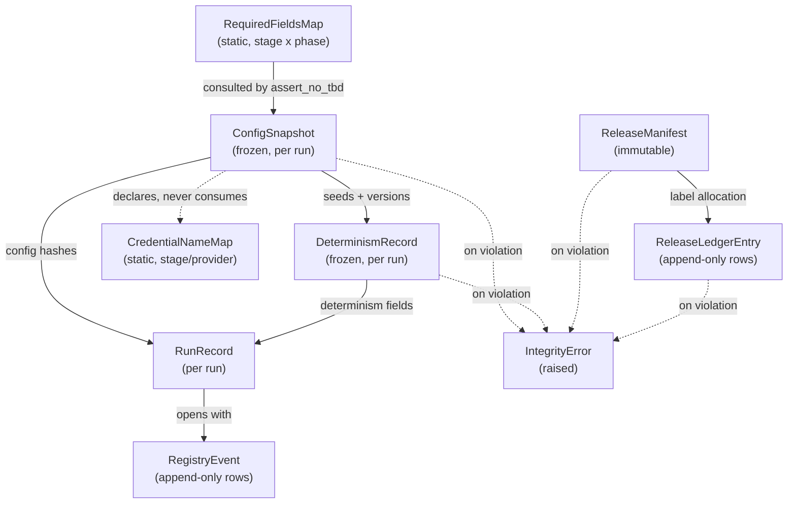

# Domain Entities — `foundation`

**Unit** `foundation` (Bolt 1) · **Kind** `library` · **Depends on** — (dependency root)

> **Addendum re-confirmed 2026-08-24.** Site **10** of
> `governance/CHANGE_RECORD_2026-08-24_foundation_amendments.md` § Addendum lands in this
> file: § 5's REQ-ENG-10 acceptance-status box read *"a row is **sought** under Amendment A
> … not approved"*, which frames the gap as provisional when **A was declined** — permanent.
> §§ 9, Coverage and Assumptions already read correctly, so this was a **missed site**, not
> a disagreement. Superseded wording preserved in place. **No count moved**; no entity,
> attribute or scientific value changed.

> **Re-established a fifth time 2026-08-23**, after a redo aimed at four stale
> cross-references in `target-standardization`'s question file. **No content of this unit
> changed.**

> **Re-established three times on 2026-08-23, after three stage-wide redo jumps** — aimed
> respectively at a correction in `acquisition`, corrections in `external-products`, and a
> misread depth policy in `component-methods.md`, and — fourth — a sweep of two question
> files that had fallen stale against their own corrected artifacts. **No content of this
> unit changed on any of the four occasions.**

The data shapes this unit owns, their lifecycles, and how they relate. A **Bolt**
is one build pass over one piece of the work, ending in something that runs;
`foundation` is Bolt 1, and every entity below is created by it and consumed by
every later Bolt through the stage entry contract.

**Nothing here is a scientific value.** These are the shapes that *carry* governed
values, not the values themselves. Every scientific constant lives in one of the
four governed configs and is frozen by D-number.

## Sources

- `../../../inception/units-generation/unit-of-work.md` § 1 `foundation` — the `Owns` list, the boundary, and the 16 requirements carried.
- `../../../inception/units-generation/unit-of-work-story-map.md` — the requirement-to-acceptance mapping; **2 of 16** requirements carry no §16/§19 row (REQ-ENG-7, REQ-ENG-10).
- `../../../inception/requirements-analysis/requirements.md` — REQ-ENG-1, -2, -3, -4, -6, -7, -8, -10, -11; FR-P1-01-10; FR-P1-04-11; FR-P1-05-13; FR-WS-7; NFR-AUD-01; NFR-SEC-01; NFR-DET-01.
- `../../../inception/application-design/component-methods.md` — the approved `ConfigSnapshot` and `DeterminismRecord` contracts.
- `../../../inception/application-design/components.md` and `component-dependency.md` — the layering rule and § Shared resources' carve-out on `evidence/locked_test_restricted/`.
- `../../../inception/application-design/services.md` — § Stage entry contract, § Run record and registry.
- `functional-design-questions.md` — Q1–Q8, FU-1–FU-3, the TA-03 verification, and the three amendments — A **declined**, B and C **approved**, all resolved 2026-08-24.

---

## Entity map



Text fallback: `RequiredFieldsMap` is consulted when validating `ConfigSnapshot`.
`ConfigSnapshot` supplies seeds and versions to `DeterminismRecord`, and config
hashes to `RunRecord`. `DeterminismRecord` also feeds `RunRecord`. `RunRecord`
opens by writing a `RegistryEvent`. `ReleaseManifest` allocation writes a
`ReleaseLedgerEntry`. `ConfigSnapshot` **declares** `CredentialNameMap` and never
consumes it. Any of `ConfigSnapshot`, `DeterminismRecord`, `ReleaseManifest` and
`ReleaseLedgerEntry` may raise an `IntegrityError` on violation.

---

## 1. `ConfigSnapshot` — approved contract, unchanged

Defined at stage 2.6 (`component-methods.md`) and **not modified here**:

| Attribute | Type | Meaning |
|---|---|---|
| `data`, `features`, `experiment`, `seeds` | `Mapping[str, object]` | The four governed configs, parsed |
| `hashes` | `Mapping[str, str]` | filename → SHA-256, all four |
| `snapshot_dir` | `Path` | Where the verbatim copies were written |
| `resolved_roots` | `Mapping[str, Path]` | Platform roots actually used |
| `platform` | `str` | `kaggle` \| `local` |

**Lifecycle.** Created once per run by `load_configs`, frozen, and passed by value
thereafter. There is no mutation state: a run that needs different configuration
is a different run.

**Invariant (REQ-ENG-3, ADR-07).** No machine path enters the four governed
configs, so moving a directory never changes a governed hash. `resolved_roots`
carries machine paths; the configs do not.

**Boundary (unit-of-work § 1).** This is the only unit that reads `configs/`.
Everything downstream receives resolved values, never a path into `configs/`.

## 2. `RequiredFieldsMap` — new, static, keyed by `(stage, phase)`

**FU-1 = C.** A declarative structure in `src/data/config.py`, not a governed
config file — it names field *identities*, never field *values*, so it carries no
scientific constant and needs no fifth governed file (Q1: "Do not introduce a
fifth governed configuration file").

| Attribute | Type | Meaning |
|---|---|---|
| key | `tuple[str, int]` | `(stage_slug, phase)` — phase is `1` or `2` |
| `required_fields` | `Sequence[str]` | Field paths that must be present and non-`TBD` for that stage-phase pair |

**Why the phase is in the key, not an annotation.** TE §7.0's Phase 1 hard
prohibition means a Phase-2 field is *legitimately* `TBD` during Phase 1. A
stage-only key forces one of two failures: listing the union makes Phase 1 fail on
fields it must not fill (which `project.md` § Forbidden prohibits filling), and
listing the intersection silently drops every Phase-2-only field from the check.
A `(stage, phase)` key cannot be forgotten the way a per-field annotation can be
omitted.

**Invariant — completeness is asserted, not trusted.** A test walks the parsed
configuration structure and fails when a governed required field appears in no
entry. This is the mechanism Q1 chose specifically so that an omission is a test
failure rather than a silent pass — the `DP-DATA-01` lesson that a list is not a
rule unless something proves the list complete.

**Lifecycle.** Static, versioned with the source, reviewed as code. Changes when a
stage's obligations change; every change re-runs the completeness test.

## 3. `CredentialNameMap` — new, static, declared here and never consumed here

**FU-3 = A, Q8 = D.** A second, separate declarative structure in
`src/data/config.py`, keyed by the applicable stage/provider and, where necessary,
phase.

| Attribute | Type | Meaning |
|---|---|---|
| key | `tuple[str, str]` or `tuple[str, str, int]` | `(stage_slug, provider)`, plus `phase` where a provider's requirement is phase-dependent |
| `required_names` | `Sequence[str]` | Environment-variable **names** — never values |

**The boundary statement this entity exists to make explicit.** `foundation`
**declares and hosts** this map and **does not read, return, log, serialize,
interpolate, or persist any credential value** — not in `resolve_platform_roots`,
not in any foundation-layer diagnostic. No `foundation` code path consumes the map
except to hand the names to a stage that asked for them. Hosting a list of names
is not reaching for secrets, and this is stated because without it the map reads
as a boundary violation (FU-3 recorded exactly that risk).

**Why separate from `RequiredFieldsMap`.** Both are keyed by stage, so merging
them is tempting. They are kept apart because they answer to different reviewers:
the config half is a schema review, the credential half is a §10 / NFR-SEC-01
security review. Merging them into one entry couples two review cadences, which
is how one of them gets skipped.

**Deliberately not a seventh module.** Q8's strongest form would put this in its
own file, but TE §12 fixes exactly six `src/` packages and there is no legal home
for a stray seventh. The separation is achieved by structure inside `config.py`,
not by file.

## 4. `DeterminismRecord` — approved contract, nine fields

**Approved contract — nine fields**, derived from `component-methods.md` rather than
recalled:

```
awk '/class DeterminismRecord/,/^$/' component-methods.md | grep -cE "^ +[a-z_]+: "   ->  9
```

*Superseded 2026-08-24: this section read "approved contract, plus three fields
**pending approval**" over a **six**-field contract. Amendment B was approved
(`CR-2026-08-24-FOUNDATION-AMENDMENTS`) and the three fields are now part of it.*

| Attribute | Type | Status |
|---|---|---|
| `seeds_applied` | `Mapping[str, int]` | **approved** |
| `pythonhashseed` | `str` | **approved** |
| `reexec_performed` | `bool` | **approved** |
| `framework_versions` | `Mapping[str, str]` | **approved** |
| `tf_op_determinism` | `bool` | **approved** |
| `nondeterministic_ops` | `Sequence[str]` | **approved** |
| `probe_scope` | `Sequence[str]` | **approved 2026-08-24** |
| `measurement_status` | `str` — `complete` \| `partial` \| `not-yet-measured` | **approved 2026-08-24** |
| `declared_vs_observed_mismatches` | `Sequence[str]` | **approved 2026-08-24** |

> ## ✅ ALL NINE FIELDS ARE IN THE APPROVED CONTRACT — AMENDMENT B APPROVED 2026-08-24
>
> **Superseded 2026-08-24, preserved:** this box was headed *"⚠ THE LAST THREE FIELDS
> DO NOT EXIST IN THE APPROVED CONTRACT"* and read *"THE LAST THREE FIELDS DO NOT
> EXIST IN THE APPROVED CONTRACT — `component-methods.md` defines **six** fields. The
> three marked PENDING are **proposed** under Amendment B and have **not been approved
> by the project decision owner**… Until Amendment B is approved,
> `nondeterministic_ops` carries the probe result with **no** recorded scope and
> **no** measurement status — which is precisely the ambiguity Q3 = C chose C to
> eliminate."*
>
> **Amendment B was approved on 2026-08-24** and `component-methods.md` now defines
> **nine** fields. The ambiguity is closed: scope and status are recorded, and the
> three fields are contract rather than specification.
>
> **What has not changed.** No determinism is claimed as measured on the strength of
> an empty list. A measured claim requires `probe_scope` to record what was examined
> **and** `measurement_status` to read `complete`; `partial` and `not-yet-measured`
> are stated rather than smoothed over. **R-06 stands** — an empty
> `nondeterministic_ops` is never proof of determinism.

**Why each field cannot be dropped** (Q3 = C requires recording probe scope,
measurement status and detected mismatches — each was tested for removal before
Amendment B was sought):

- `probe_scope` — without it, `nondeterministic_ops: []` is ambiguous between
  *probed and found none* and *probed nothing*. Q3 chose a runtime probe over a
  declared list specifically so the record is a measurement; an unrecorded scope
  makes that measurement unreadable.
- `measurement_status` — the field that stops an empty `nondeterministic_ops`
  reading as proof of determinism. Q3 names both non-complete states explicitly:
  `partial` when the framework cannot give a complete assessment,
  `not-yet-measured` when the relevant operations have not yet executed.
- `declared_vs_observed_mismatches` — the result of Q3's cross-check against the
  config-declared expected set. Empty means agreement; non-empty is an integrity
  finding under `IntegrityError`. Without the field the cross-check runs and is
  not recorded, which makes it unauditable.

**Deliberately not proposed:** a field carrying the config-declared expected set
itself. It is recoverable from `ConfigSnapshot.hashes`, and duplicating governed
data into a second location is the drift pattern
`CR-2026-08-22-SWEEP-COMPLETENESS` documents at length.

**Lifecycle.** Created once per run by `seed_everything`, after
`ensure_process_determinism` and before any graph construction. Frozen. Consumed by
`RunRecord` and the registry. **Does not** carry the bootstrap seed — that carve-out
is `src/evaluation/bootstrap.py` by ADR-05, and the carve-out is a design decision
rather than an oversight.

## 5. `RunRecord` — the per-run environment lock

**REQ-ENG-10.** Opened at step 6 of the stage entry contract, **before any domain
work**, so an aborted run is already visible.

**Eight fields, with their seven-bullet provenance stated so neither count has to
be trusted alone.** TE §13.1 carries **seven bullets**, derived:

```
awk 'NR>=749 && NR<=760 && /^- /' <TE> | wc -l   ->  7
```

Bullet 1 names two distinct captures, so the registry row carries **eight fields**
over seven bullets. REQ-ENG-10's own criterion says *"A registry row exists
carrying all eight fields"*, so the field reading is operative for the test.

| # | Field | §13.1 bullet | Source |
|---|---|---|---|
| 1 | `requirements_hash` | 1 | the pinned `requirements.txt` |
| 2 | `pip_freeze` | 1 | per-run capture |
| 3 | `runtime_versions` — Python, OS, CPU (and GPU if used), key library versions | 2 | `DeterminismRecord.framework_versions` + platform probe |
| 4 | `code_commit` | 3 | git HEAD |
| 5 | `config_hashes` — all four | 4 | `ConfigSnapshot.hashes` |
| 6 | `input_versions` — input dataset and manifest versions | 5 | release manifests consumed |
| 7 | `platform` | 6 | `ConfigSnapshot.platform` |
| 8 | `nondeterministic_ops` | 7 | `DeterminismRecord` |

**Invariant.** Every field is **populated, not `unavailable`**. A run that captures
none of them **fails the check rather than completing silently** — REQ-ENG-10's
criterion, which exists because the thirteen prior runs are recorded as violating
it (`evidence/experiment_registry.md` § Acquisition runs: the §13.1 list *"was not
captured at the time and cannot be reconstructed"*). It binds from the next run
forward.

> **Acceptance status, stated exactly.** REQ-ENG-10 has **no §16 or §19 acceptance
> row.** TA-03 was checked against all seven bullets and covers **none fully** —
> two partially, and both partials are install-time rather than per-run, which is
> the entire substance of the requirement. `requirements.md` records the same
> conclusion in REQ-ENG-10's own test column. **No row is sought: Amendment A (Vision
> §15.2) was raised and DECLINED 2026-08-24**, so REQ-ENG-10 is untested **by design,
> permanently rather than pending**. Nothing here claims acceptance coverage.
> *(Superseded status: "A row is sought under **Amendment A (Vision §15.2), not
> approved.**" — a site the 2026-08-24 sweep missed, corrected 2026-08-24 as execution
> of the same declined-A disposition already carried at § 9, § Coverage and § Assumptions.)*

## 6. `RegistryEvent` — append-only rows

**Q4 = D.** One line per run event in `experiment_registry.jsonl`, which is
**authoritative**; the CSV is derived, hashed, and marked derived.

| Attribute | Type | Meaning |
|---|---|---|
| `run_id` | `str` | Stable across every event for one run |
| `status` | `str` | **Closed enum**: `started` \| `completed` \| `aborted` \| `failed` |
| `reason` | `str` | **Required non-empty** when status is `aborted` or `failed` |
| `timestamp` | `str` | UTC |
| environment-lock fields | — | The eight `RunRecord` fields, on the `started` row |

**Status semantics, fixed by Q4:** `aborted` is an **intentional or
preflight-triggered stop**; `failed` is an **execution failure**. They are not
interchangeable and carry different diagnostic stories.

**Lifecycle — a state machine asserted by test, never by the writer.** Legal
transitions per `run_id`: `started → completed`, `started → aborted`,
`started → failed`. Rejected: duplicate `started`, repeated terminal statuses,
transitions out of a terminal status, and unknown or malformed rows.

**The invariant that makes append-only worth having.** Writes are append-only and
**never require a prior read of the run history** (Q4, explicit). The transition
graph is therefore enforced by a **separate registry-integrity test**, not at write
time — a log whose write path depends on reading is no longer a pure append. The
enum itself *is* validated at write time, because that needs no read.

**When the integrity test runs.** Before TA-10 / G-09 acceptance, and before
registry contents are relied on as audit evidence.

**NFR-AUD-01 by construction.** A failed or aborted run stays visible with its
status and reason because removing its line would require rewriting a file nothing
rewrites. Two `started` rows with one `completed` is visible in the log, so a
silent rerun cannot hide.

## 7. `ReleaseManifest` — immutable, content-addressed

**Q6 = D.** TE §13.3's ten manifest rows over fourteen fields.

| Attribute | Type | Meaning |
|---|---|---|
| `content_hash` | `str` | **AUTHORITATIVE identity.** SHA-256 over a canonical representation that **excludes** the human-readable label, volatile metadata, and any self-referential hash field |
| `label` | `str` | Monotonic, human-readable, for review and citation. **Derived and NOT authoritative** |
| §13.3 fields | — | version, source manifest, hashes, schema, row counts, exclusions, fold/mask identifiers |

**Which identifier wins, stated because leaving it implicit is the failure mode.**
The **content hash is authoritative**; the label is for citation at a
human-reviewed gate. Every integrity guarantee in this project is hash-based, so
making the label authoritative would put the weaker identifier in charge. A
label/hash mismatch is an **integrity violation**, not a discrepancy to reconcile.

**Invariant (TE §13.3, TA-15).** `write_release` **rejects an output directory
that already contains a release** and **never overwrites existing release
content**. Repeated writes are **not** silently treated as successful — that
behaviour would require explicit authorisation through change control, and none
has been sought.

## 8. `ReleaseLedgerEntry` — new, append-only, `foundation`-owned

**FU-2 = D.** One line per label allocation at
`artifacts/registry/release_history.jsonl`, kept **separate from
`experiment_registry.jsonl`**.

| Attribute | Type | Meaning |
|---|---|---|
| `label` | `str` | The allocated human-readable label |
| `content_hash` | `str` | The authoritative release identity it binds to |
| `release_path` | `str` | Where the release was written |
| `allocating_run_id` | `str` | The run that allocated it |
| `timestamp` | `str` | UTC |

**Why a durable ledger and not a directory scan.** Q6 requires labels allocated
from a durable append-only history *rather than solely by scanning existing
directories*, and Q6's reasoning rules out a derived index: if a release directory
is deleted, a rebuilt index forgets the label and the next allocation **reuses**
it. A ledger cannot forget.

**Why separate from the registry.** Folding release events into
`experiment_registry.jsonl` would force Q4's transition graph to filter by row kind
before applying its rules — and a rule whose readers must filter first is a rule
that quietly stops applying to the rows it was written for.

**Integrity test**, following the pattern Q4 established: rejects a duplicate or
reused label, a label bound to two different content hashes, a content hash bound
to two labels, and a malformed row.

> **✅ Amendment status — APPROVED 2026-08-24**
> (`CR-2026-08-24-FOUNDATION-AMENDMENTS`). *Superseded, preserved:* *"PENDING, NOT
> approved. This entity is **not** in `unit-of-work.md` § 1 `foundation` → `Owns`…
> It is **not** in `services.md` § Run record and registry, which opens "Two
> artifacts, one authoritative". Both are approved-stage artifacts and **neither is
> edited**."*
>
> Both have since been annotated in place on the owner's approval: the ledger is named
> in `unit-of-work.md` § 1 `foundation` → `Owns`, and `services.md` § Run record and
> registry now reads **three artifacts, one authoritative**.
>
> **Its authority is Q6=D and FU-2=D**, two approved answers of this stage — not an
> engineering preference. Q6=D requires a *monotonic, human-readable* label alongside
> the authoritative hash, chosen **over** option C's *"version derived from the
> manifest hash"*; FU-2=D names this ledger, its ownership, its append-only behaviour
> and its independent integrity test. Monotonicity requires durable state, which is
> exactly why the directory scan below cannot serve.
>
> *(An earlier draft of the change record proposed rejecting this entity and deriving
> the label from the content hash instead. That proposal was withdrawn: it is Q6
> option C, which the owner had read and declined, and it cannot produce a monotonic
> label. Recorded so the reasoning is not lost.)*
>
> **No TE §12 amendment is required** — determined, not assumed:
> `artifacts/registry/` is already an enumerated directory in the §12 tree, and the
> tree carries **zero file-level entries** inside any `artifacts/` subdirectory
> (`sed -n '709,721p' <TE> | grep -cE '\.(jsonl|json|csv)'` → `0`). Confirming from
> the other direction, `experiment_registry.jsonl` is not named anywhere in the
> Technical Environment; it originates in stage 2.6's `services.md`.

## 9. `IntegrityError` — the exception hierarchy as an entity

**Q5 = B.** One base class, six current subclasses, and any future
integrity-related exception.

| Attribute | Type | Meaning |
|---|---|---|
| `resource` | `str` | The affected file or resource |
| `violated_expectation` | `str` | What was expected and was not true |

**Both fields are required by the constructor**, so the affirmed two-tier posture —
*an integrity violation exits non-zero naming the file and the violated
expectation* — is enforced by construction rather than by discipline.

Subclasses: `ConfigError`, `PreflightError`, `PlatformError`, `DeterminismError`,
`ReleaseError`, `RegistryError`.

**Why a base rather than six independents.** The stage entry contract must catch
*any* of them to write the `aborted` registry row. A bare list of six means a
seventh added later is silently not caught — the same list-versus-rule failure as
Q1, and the same one `DP-DATA-01` caught in this project already. Catching the base
means a new subclass is covered by virtue of its base.

**Completeness shortfalls are not in this hierarchy.** Per Q5, a non-fatal
shortfall (a missing month, a partial retrieval) is **explicit manifest or
return-value data**, never a raised exception — so it cannot accidentally be
raised as fatal. A second hierarchy for it would be unused machinery today.

---

## Requirement coverage

**Two different relations, kept apart because conflating them is what made the
first issue of this table wrong.** Both are derived from
`unit-of-work-story-map.md`, not reasoned from acceptance-row text:

- **Tests it** (story-map **Table 1**) — the row that verifies this requirement.
  That row may be **owned by another unit**.
- **Owned here** (story-map **Table 2**) — the rows whose **primary owner** is
  `foundation`. Exactly seven, matching `unit-of-work.md` § 1's "Acceptance rows
  (7)":

```
awk 'NR>=145 && NR<=223' unit-of-work-story-map.md | awk -F'|' '$4 ~ /foundation/ {print $2}'
  ->  TA-01 TA-02 TA-03 TA-10 TA-15 TA-22 TA-23      (count 7)
```

**The owner column is the `primary` cell of story-map Table 2, derived per row —
never the supporting cell, and never inferred:**

```
awk -F'|' 'NR>=145 && NR<=223 {r=$2; gsub(/[` *]/,"",r); print r": primary="$4" supporting="$5}' \
  unit-of-work-story-map.md
```

| Requirement | Entities | Tested by (Table 1) | Row owner (Table 2 `primary`) |
|---|---|---|---|
| REQ-ENG-1 | all — the §12 tree and `artifacts/` | TA-01 | `foundation` |
| REQ-ENG-2 | `ConfigSnapshot`, `RequiredFieldsMap` | TA-02 | `foundation` |
| REQ-ENG-3 | `ConfigSnapshot` (no machine path in configs) | **TA-03, TA-26** | TA-03 → `foundation`; TA-26 → **`models-and-baselines`** |
| REQ-ENG-4 | the `tests/` tree | **TA-09** — *bounded, see story-map § Known defects row 8* | `fixtures-and-reproducibility` |
| REQ-ENG-6 | `ConfigSnapshot.platform`, `resolved_roots` | **TA-22** | `foundation` |
| **REQ-ENG-7** | `RegistryEvent`, `ReleaseLedgerEntry` | ⚠ **NO ACCEPTANCE ROW, AND NONE WILL BE ADDED** — Amendment A **declined 2026-08-24**; untested by design | — |
| REQ-ENG-8 | `ConfigSnapshot` | **TA-16** | `regimes-diagnostics-reporting` |
| **REQ-ENG-10** | `RunRecord` | ⚠ **NO ACCEPTANCE ROW, AND NONE WILL BE ADDED** — TA-03 verified not to cover it; Amendment A **declined 2026-08-24**; untested by design | — |
| REQ-ENG-11 | `RunRecord.runtime_versions` | **TA-17, TA-26** | TA-17 → `fixtures-and-reproducibility`; TA-26 → **`models-and-baselines`** |
| FR-P1-01-10 | `CredentialNameMap` | TA-22 | `foundation` |
| FR-P1-04-11 | `ConfigSnapshot` | **TA-15** | `foundation` |
| FR-P1-05-13 | `DeterminismRecord` | **TA-10** | `foundation` |
| FR-WS-7 | `ReleaseManifest` | **TA-23** | `foundation` |
| NFR-AUD-01 | `RegistryEvent` | **TA-10, TA-21** | TA-10 → `foundation`; TA-21 → **`fixtures-and-reproducibility`** |
| NFR-SEC-01 | `CredentialNameMap` | TA-22 | `foundation` |
| NFR-DET-01 | `DeterminismRecord` | **WS-17, TA-13** | WS-17 → `statistical-inference`; TA-13 → `models-and-baselines` |

**`foundation` is a *supporting* unit on exactly two rows — TA-13 and TA-26** —
which is a different relation again from owning them and from being tested by them.
Both sets derived, not written:

```
# primary
awk -F'|' 'NR>=145 && NR<=223 {p=$4; gsub(/[` *]/,"",p); if(p=="foundation"){r=$2; gsub(/[` *]/,"",r); print r}}' \
  unit-of-work-story-map.md
  ->  TA-01 TA-02 TA-03 TA-10 TA-15 TA-22 TA-23        (count 7)

# supporting
awk -F'|' 'NR>=145 && NR<=223 {if($5 ~ /foundation/){r=$2; gsub(/[` *]/,"",r); print r}}' \
  unit-of-work-story-map.md
  ->  TA-13 TA-26                                       (count 2)
```

> **THIRD CORRECTION, 2026-08-22 — the same confusion class, a third time.**
>
> **Superseded text, preserved:** *"`foundation` is a supporting unit on three of
> these rows — TA-13, TA-23 and TA-26."*
>
> **TA-23's Table 2 `primary` is `foundation` itself.** It is one of the seven rows
> this unit **owns**, listed two paragraphs above in this same section — so the
> sentence contradicted its own section, not merely the source. The supporting set
> is **two** rows, not three.
>
> **This is the third occurrence of primary-versus-supporting confusion in this one
> table**, after pass 1 (wrong "tested by" citations) and pass 2 (wrong `Row owner`
> entries). Each correction fixed the cells it was aimed at and then restated the
> result in prose **without deriving the restatement**. The derivation output was
> available and was not consulted. Both sets are now produced by the commands above
> rather than summarised from memory.

**16 requirements, 2 without an acceptance row** — REQ-ENG-7 and REQ-ENG-10,
matching the story map's designation.

> **CORRECTION, 2026-08-22 — first issue of this table was wrong, and an
> adversarial review caught it.** Of the 14 requirements carrying a citation, only
> **4** were right: REQ-ENG-1, REQ-ENG-2, FR-P1-01-10, NFR-SEC-01. **8 cited the
> wrong row** (REQ-ENG-3, -4, -6, -8, FR-P1-04-11, FR-P1-05-13, FR-WS-7,
> NFR-DET-01) and **2 dropped a row from a multi-row source** (REQ-ENG-11,
> NFR-AUD-01).
>
> **Cause.** The mapping was **reasoned from what each acceptance row's text sounded
> like it ought to test**, rather than **derived from story-map Table 1**. Because
> `business-logic-model.md` carried the identical wrong table, cross-checking the two
> artifacts against each other could never have caught it — only checking both
> against the source could, which is what the reviewer did.
>
> **Superseded rows, preserved for the audit trail:** REQ-ENG-3 → `TA-02`;
> REQ-ENG-4 → `TA-01`; REQ-ENG-6 → `TA-03`; REQ-ENG-8 → `TA-02`; REQ-ENG-11 →
> `TA-17` alone; FR-P1-04-11 → `TA-02`; FR-P1-05-13 → `TA-26`; FR-WS-7 → `TA-15`;
> NFR-AUD-01 → `TA-10` alone; NFR-DET-01 → `TA-13, TA-26`.
>
> **The rollup tension the reviewer also raised is not a defect** — the figures
> count different relations and both are correct. `foundation` **owns 7** rows
> (Table 2 `primary`), its 16 requirements are **tested by 14 distinct** rows
> (Table 1), and it is a **supporting** unit on **2** rows — TA-13 and TA-26.
> Three relations, three different numbers, all three derived by the commands in
> § Requirement coverage above.
>
> *(Superseded: "a **supporting** unit on 3 more" — the same wrong figure as the
> third correction below, in a second location in this file. Correction 3 fixed the
> statement at § Requirement coverage and missed this one; found on a self-sweep
> before the next reviewer pass, making it the **fourth** occurrence of this class.
> "3 more" was doubly wrong: the count is 2, and TA-23 — the row that inflated it —
> is one of the 7 this unit **owns**, so it could not be "more" in any case.)*
>
> **Derived, because the first attempt at this sentence said 13:**
>
> ```
> for id in <foundation's 16 requirement ids>; do
>   grep -E "^\| \*{0,2}$id\b" unit-of-work-story-map.md | head -1 | awk -F'|' '{print $4}'
> done | grep -oE "(WS|TA)-[0-9]{2}" | sort -u | wc -l      ->  14
> ```
>
> `TA-01 TA-02 TA-03 TA-09 TA-10 TA-13 TA-15 TA-16 TA-17 TA-21 TA-22 TA-23 TA-26 WS-17`

> ## SECOND CORRECTION, 2026-08-22 — the first correction introduced two defects of its own
>
> Iteration 2 of the adversarial review found that the **Row owner column added to
> fix the first finding was itself wrong in 3 of its 4 multi-row entries**, and that
> the sentence explaining the fix carried an underived count. Both are confirmed
> against story-map Table 2.
>
> **Superseded owner attributions, preserved:**
> - REQ-ENG-3 → *"`foundation`; `fixtures-and-reproducibility`"*. TA-26's `primary`
>   is **`models-and-baselines`**; `fixtures-and-reproducibility` is only
>   *supporting* on that row. **Naming a supporting unit as the owner.**
> - REQ-ENG-11 → *"`fixtures-and-reproducibility`"*. One owner given for two rows;
>   TA-26's is **`models-and-baselines`**. **Incomplete.**
> - NFR-AUD-01 → *"`foundation`; `regimes-diagnostics-reporting`"*. TA-21's sole
>   `primary` is **`fixtures-and-reproducibility`**; `regimes-diagnostics-reporting`
>   appears nowhere on that row. **Wrong unit entirely.**
> - NFR-DET-01 was the one of four that was right.
>
> **Superseded count, preserved:** *"13 referenced rows"* → **14**.
>
> **Cause — the same one, twice.** The first correction fixed the "tested by" column
> by deriving it from Table 1, then filled the new owner column by **reasoning from
> which unit sounded responsible**, and wrote the distinct-row count from an earlier
> working note. Deriving one column does not make the column beside it derived.
> Both are now produced by the commands printed above.
>
> **Review budget is exhausted** (2 of 2 iterations). These corrections were applied
> *after* the final reviewer pass and have therefore **not been re-reviewed.** That
> is disclosed at the approval gate rather than presented as a clean result.

## Assumptions & Open Questions

- **[assumption]** `src/data/registry.py` and its `Station` entity are **not** part of this unit. `component-methods.md` places them between two `foundation` modules, but `unit-of-work.md` § 1 does not list them under `Owns`; the station registry belongs to `inventory-and-registry`.
- **[assumption]** `src/data/locked_test.py` is not this unit's, notwithstanding that `foundation` owns the boundary rule naming it. It belongs to `governance-guards` (BLK-07); § Shared resources fixes without qualification that nothing else may construct a path into `evidence/locked_test_restricted/`.
- **[assumption]** `frontend-components.md` is not produced. `foundation` is `kind: library`; the stage's `produces_kinds` maps that artifact to `[ui]` only, and the engine's resolved list for this unit carries three artifacts.
- **Closed — Amendment A** (Vision §15.2): §19 acceptance rows for REQ-ENG-7 and REQ-ENG-10. **Raised and DECLINED 2026-08-24.** No rule requires universal §19 coverage, and the approved position dispositions uncovered requirements as *"Open by design"*. **No acceptance coverage is claimed for either, permanently rather than pending.** *(Superseded status: "**Open** … **Not approved.**")*
- **Closed — Amendment B** (approved 2.6 artifact): three `DeterminismRecord` fields. **APPROVED 2026-08-24.** The approved contract now stands at **nine** fields. *(Superseded status: "**Not approved.** The approved contract stands at six fields.")*
- **Closed — Amendment C** (approved 2.6 and 2.7 artifacts): the release ledger in `services.md` and `unit-of-work.md` § 1 `Owns`. **APPROVED 2026-08-24** on the authority of Q6=D and FU-2=D. *(Superseded status: "**Not approved.**")*
- **Open** — the concrete `RequiredFieldsMap` contents cannot be enumerated until the four configs exist with their field names. This stage fixes the **mechanism**; the populated map is a Bolt 1 work product.
- **G-09 is not signed.** Nothing here authorises creating `src/data/config.py`, `src/data/release.py` or `tests/test_determinism.py`.
- **None** of the above adopts a reading on a supervisor-owned value, and none decides a scientific constant.

## Review history

This file carried **both** of the reviewer's critical findings and both of the
defects the first correction introduced. Its § Requirement coverage table has been
wrong twice and is the section to scrutinise first.

| Pass | Verdict | Effect on this file |
|---|---|---|
| Iteration 1 (adversarial) | **NOT-READY** | § Requirement coverage wrong in **8 of 14** cited rows, incomplete in **2** more. Cause: reasoned from acceptance-row text, not derived from story-map Table 1 |
| Correction 1 | — | Table re-derived from Table 1; a `Row owner` column added to resolve the reviewer's minor finding about the 7-row rollup |
| Iteration 2 (adversarial) | **NOT-READY** | Confirmed the first fix landed — **and found the new `Row owner` column wrong in 3 of its 4 multi-row entries**, plus an underived count ("13 referenced rows", actually 14) |
| Correction 2 | — | Owner column re-derived from Table 2's `primary` cell with the command printed; count derived; three relations (tested-by / owns / supports) separated explicitly |
| Redo jump, 2026-08-22 | — | Correction 2 was **unreviewed** — the budget was spent. The owner directed a re-review before any further unit; the jump reset the budget and the receipt floor |
| Iteration 1 of the fresh budget | **NOT-READY** | Confirmed corrections 1 and 2 both landed and every printed command reproduces. Found a **third** primary-vs-supporting defect, in a sentence added by correction 2: the supporting set was stated as three rows including TA-23, which this unit **owns** |
| Correction 3 | — | Supporting set re-derived: **two** rows, TA-13 and TA-26. Both the primary and supporting sets now carry the commands that produce them |
| Self-sweep before iteration 2 | — | Found a **fourth** occurrence: the same wrong supporting count ("3 more") in a **second location in this file**, which correction 3 had missed. Corrected and derived |
| Iteration 2 of the fresh budget | *pending* | Corrections 3 and 4 have not yet been adversarially reviewed |

**Four occurrences of one confusion class in one table.** Passes 1 and 2 and the fresh pass 1 each caught one; the fourth was caught by a self-sweep rather than by review. The through-line is identical every time: the **table cells** were derived, and then a **sentence summarising them** was written from memory instead of from the derivation output that was already on screen. Every figure in this section now carries its producing command, and the two set memberships are printed in full rather than counted in prose.

**The pattern, recorded because it repeated.** Both failures were the same
mistake: a fact that a source artifact already states was **reasoned** instead of
**derived**. Fixing one column by derivation did not make the column beside it
derived. Every figure in § Requirement coverage now carries the command that
produced it.

**What iteration 2 cleared here.** The five re-derived counts, the TA-03 coverage
verification, Q7's dual limbs, Q8's credential placement, the pending-amendment
discipline, and boundary compliance on `registry.py` / `locked_test.py` / `TBD`
fields / scientific constants.

---

## Finalized 2026-08-24 — the three amendments are settled

Recorded under `governance/CHANGE_RECORD_2026-08-24_foundation_amendments.md`, after
an independent challenge of each amendment against the approved artifacts.

- **Amendment A — DECLINED.** No project rule requires universal §19 coverage, and the approved position dispositions uncovered requirements as *"Open by design"*. **REQ-ENG-7 and REQ-ENG-10 are untested by design, permanently rather than pending.** No count moved: untested stays 36, this unit's stays 2 of 16, its acceptance rows stay 7, TE §19 stays at 36 rows.
- **Amendment B — APPROVED.** `DeterminismRecord` is a **nine-field approved contract**, not a six-field contract plus three proposals.
- **Amendment C — APPROVED**, on the authority of **Q6=D** and **FU-2=D**. `ReleaseLedgerEntry` is an approved entity, now named in `unit-of-work.md` § 1 `foundation` → `Owns` and in `services.md` § Run record and registry. **R-11 is unchanged** — the content hash remains authoritative and the label is a citation device.

**The nine-entity count is unchanged.** `ReleaseLedgerEntry` already existed in this
document; what changed on 2026-08-24 is that the upstream artifacts now carry it too.

**G-09 remains unsigned.** Nothing in this document authorises creating a module, and
no scientific value is decided here.
