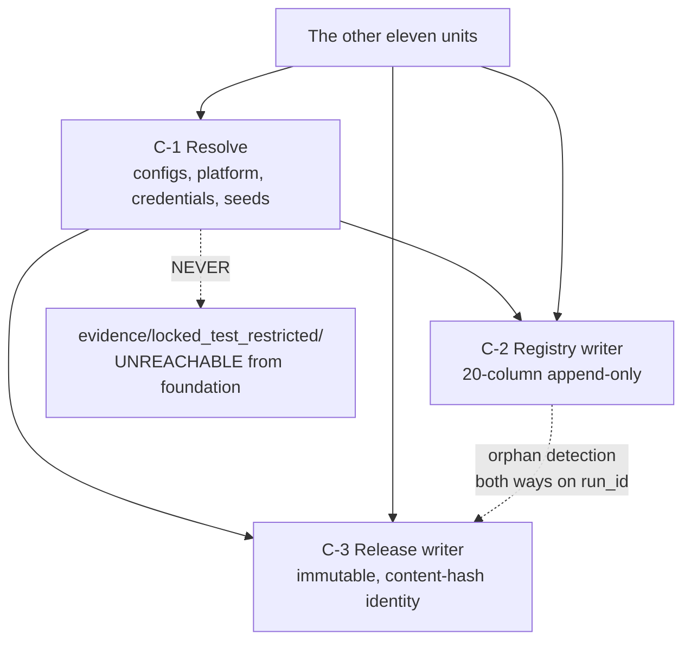

# Logical Components — `foundation`

**Unit** `foundation` (Bolt 1) · **Kind** `library` · **Stage** `nfr-design`

> ## ⚠ THIS IS A COMPONENT DESIGN. NO COMPONENT HERE EXISTS
>
> **Not one module named below is written.** `src/data/config.py`,
> `src/data/registry.py`, `src/data/release.py`, `src/data/reuse_registry.py` and
> `tests/test_determinism.py` are **named, not built** — BLK-01 granted **authority to
> name a module, which is not authority to have written one**. `configs/` does not exist.
> **No Python interpreter exists in this environment.**
>
> *(Corrected 2026-09-01 under a gate rejection. This box previously asserted "**Not one
> module named below is written**" and "**No Python interpreter exists in this
> environment**". Both were **false when written**, carried from `nfr-requirements` without
> a disk check. **`src/data/config.py`, `src/data/release.py` and `src/data/locked_test.py`
> EXIST**; `src/data/registry.py`, `src/data/reuse_registry.py` and
> `tests/test_determinism.py` remain absent. **Python 3.14.7 exists** and the suite runs —
> **277 passed, 2 skipped** — but **3.14.7 is not the governed 3.11 pin**, so that run is
> **not governed evidence**. `configs/`, `pyproject.toml` and `requirements.txt` are still
> absent, so **TC-06's scaffold precondition is still unmet**. See `security-design.md`'s
> banner for the full inventory. Superseded text preserved in this note.)*
>
> **The correction moves no component from "unbuilt" to "built" in any way that matters
> here.** `src/data/config.py`, `release.py` and `locked_test.py` existing means **C-1 and
> C-3 have partial implementations**; it does not mean either component's obligations are
> met. **C-2's registry writer has no module at all** (`src/data/registry.py` absent), so
> the boundary this document draws between the resolve path and the two writers is still a
> boundary between **one partly-built component and one that does not exist**.
>
> **This is a logical decomposition, not an infrastructure deployment.** There are no
> services, no processes, no network boundaries and no deployable units here.
> `foundation` is a **library the other eleven units import**, and its "failure domains"
> are the blast radii of function calls inside one process.
>
> **G-09 is signed (D-31) with preconditions UNMET**; **stage 3.1 remains FAIL**.
> **TA-10, TA-15, TA-21 and TA-22 are all `Pending`.**

## Sources

- `nfr-requirements/security-requirements.md` — **SEC-F-03** … **SEC-F-07**; the § Scope note assessing all five NFR categories for a `library` unit.
- `nfr-requirements/tech-stack-decisions.md` — **TS-01** (Python 3.11), **TS-05** (exactly two platforms), **TS-06** (the §12 repository structure and the six `src/` packages), **TS-07** (determinism and the environment lock).
- `functional-design/business-logic-model.md` — **W-5** (the run record), **W-6** (the twenty-column registry; step 8's durability confirmation), **W-8** (`resolve_platform_roots`).
- `security-design.md` — **SD-01** … **SD-05**, this stage's sibling artifact; the component boundaries below are where those design decisions land.
- `../../../inception/requirements-analysis/requirements.md` — **REQ-ENG-6**, **REQ-ENG-10**, **FR-P1-05-13**, **NFR-AUD-01**, **NFR-DET-01**, **NFR-REP-01** *(the last three cited 2026-09-01 on adversarial finding 1, **Critical** — C-1's own responsibility list reads "seeding and the environment lock", which is their substance, and none of the three was cited in either artifact)*.
- `../../../../../../../../PreFlight/Technical_Environment_and_Research_Implementation(1)(2).md` — **§9.1** (two platforms), **§12** (repository structure; the import-boundary rule), **§13.1** (the environment lock), **§13.3**, **§13.4**, **§13.7** (the exact-equality classes), **§19** (TA-10, TA-13, TA-15, TA-17, TA-21), **§16** (WS-17, WS-20).
- `nfr-design-questions.md` — Q4 = A, and the receipted Consolidated Summary Confirmation.

---

## The boundary criterion (Q4 = A)

**The boundary is drawn on write-integrity**, because that is where blast radius changes
kind:

> **A bad read fails a run. A bad write corrupts the permanent record.**

A configuration misread, a platform misresolved, a credential name missing, a seed unset —
each of these **fails the run that hit it**, loudly and locally, and the fix is to correct
the input and run again. A registry row written wrong, or a release directory overwritten,
**damages the record the thesis rests on**, and no later run can undo it.

**Why not one component per module.** Six boundaries would map to the six `src/` modules
TE §12 mandates, which is a **file listing rather than a failure analysis**. It would also
impose six sets of boundary contracts on the unit whose whole purpose is to be the shared
foundation the other eleven units import — pushing coupling into the callers instead of
removing it.

**Why not a single component.** `foundation` is one library to its callers, which is a
true statement about **how it is imported** and a useless one about **how it fails**. It
would leave the blast-radius section nearly contentless for the unit that owns the
permanent record — the wrong place to have nothing to say.

**The corroboration.** The split lands exactly on three separate acceptance rows:
**TA-10/TA-21** on the registry, **TA-15** on releases, and neither on the resolve path.
The boundary was derived from failure kind, and §19 had already drawn it the same way.

---

## Component inventory

| # | Component | Responsibilities | Blast radius on failure | Acceptance rows |
|---|---|---|---|---|
| **C-1** | **Resolve** | Config loading and hashing; platform and root resolution (`resolve_platform_roots`); credential resolution; seeding and the environment lock | **The current run.** Fails loudly and locally; no persisted state is altered. | TA-03 (environment), TA-22 (secrets, via SD-01) |
| **C-2** | **Registry writer** | The twenty-column experiment registry; status vocabulary; `exploratory` derivation; `AccessRecord`/`RegistryEvent` orphan detection; the durability stamp | **The permanent record.** A wrong or lost row is not recoverable by re-running. | **TA-10, TA-21** |
| **C-3** | **Release writer** | Immutable dataset releases; `content_hash` identity; `dataset_version` derivation; D-29's verify-on-write uniqueness check; overwrite refusal | **The permanent record, and every downstream claim that cites a release.** | **TA-15** — **NOT covered today** |

### C-1 — Resolve

**Isolation property.** C-1 **holds no credential value**. `resolve_platform_roots`
returns **a label and roots**; no credential value is read, returned, logged, serialized,
interpolated or persisted (SD-02, R-14). This is what keeps the secret out of the object
that every other unit imports.

**Failure mode.** `PlatformError` when the platform is not exactly one of `kaggle` or
`local`; early failure **naming the missing credential name**; a hash mismatch on a
governed config **terminates**, naming the file and the violated expectation.

**Why C-1 is one component and not four.** Its four responsibilities share a single
failure kind — **they resolve inputs, and a wrong input fails the run** — and they share a
single consumer contract: every other unit calls them at start-up and proceeds only if
all four succeeded. Splitting them would create boundaries with no failure difference
across them.

**C-1's fourth responsibility carries three requirements, named here** *(added 2026-09-01
on adversarial finding 1, **Critical** — "seeding and the environment lock" was listed as a
responsibility with no governing ID attached to it)*:

- **REQ-ENG-10** — the **eight-item** per-run environment lock. This is the object a
  registry row's `environment_lock_hash` **points at**, which is why an incomplete lock
  would let C-2's append-only guarantees faithfully preserve a false reproducibility claim.
  **It has no acceptance row**: `requirements.md` records it `UNTESTED`, and the candidate
  row was **declined at Amendment A on 2026-08-24**.
- **NFR-DET-01** — seeds fixed in `seeds.yaml`, the **three-seed element-wise mean** as the
  confirmatory prediction, nondeterministic operations **recorded**. Determinism is applied
  **before any graph construction** (R-05), and **an empty `nondeterministic_ops` is never
  proof of determinism** (R-06). Rows **WS-17, TA-13**.
- **NFR-REP-01** — C-1 supplies the lock and the **one tested** seeding utility the clean
  run depends on. **C-1 does not run the clean run** — that is
  `fixtures-and-reproducibility`'s, and rows **WS-20/TA-17** are theirs. What C-1 owes is
  complete capture; the rest is **not claimed here**.

**This does not move the boundary.** All three fail the same way the rest of C-1 does — a
bad or incomplete resolve **fails the run**, loudly and locally, before any persisted state
is touched. They belong in C-1 for exactly the reason the other three responsibilities do.

### C-2 — Registry writer

**Isolation property.** **Writes never read the run history** (R-08). This is what makes
the append safe under concurrency, and it is simultaneously what makes a row
**unrewritable** — the writer has no mechanism to locate a prior row, so it has no
mechanism to revise one to match a later belief.

**Failure mode.** An unknown status is a **failure**, not a new category (R-07). A
schema violation fails at write time against the twenty columns (R-18). On an integrity
failure, terminate and report honestly **even when reporting fails** (R-10).

**The durability stamp crosses this boundary deliberately** (SD-03, Q3 = B). C-2 writes a
row stamped **durability unverified on this platform** where the platform's semantics are
uncharacterised; **the freeze gate refuses to accept a so-stamped row as evidence.** The
refusal is a **consumer-side obligation** and is specified in `security-design.md` § SD-03
rather than assumed of a downstream unit.

### C-3 — Release writer

**Isolation property.** **A release directory is never overwritten.** Identity is the
**content hash**; the label is **not authoritative** (R-11, R-13).

**Failure mode, and the one that matters most.** D-29's verify-on-write uniqueness check
enumerates the **single authoritative release root**. **If that root is unreachable,
`write_release` refuses** — it does **not** treat an unreachable population as an empty
one, because **an empty population makes every hash unique** and converts the guard into a
rubber stamp precisely when it is most needed (SD-04).

**Why C-3 is separate from C-2.** They look alike — both are integrity-critical
append-only writers — but they fail differently and are tested separately. C-2's unit of
damage is **a row**; C-3's is **a release directory and every downstream claim citing it**.
Their acceptance rows are separate (**TA-10/TA-21** against **TA-15**), and TA-15's status
differs sharply from the others: it is **not covered**, while C-2's are merely `Pending`.

---

## Shared resources, and the one-way dependencies

**Text fallback.** C-1 is depended on by C-2 and C-3 (both need the resolved platform,
roots and environment lock) and by all eleven other units. C-2 and C-3 are called directly
by the other units. C-2 and C-3 relate only through `run_id` — the join `AccessRecord` and
`RegistryEvent` use for orphan detection in both directions. **No path runs from any
`foundation` component into `evidence/locked_test_restricted/`.**

**The shared resource is C-1's resolved state**, and it is shared **read-only**: the
platform label, the roots, the four config hashes and the environment lock. C-2 and C-3
consume it and never mutate it. That is what allows the two writers to be independent of
each other — they share an input, not a state.

**The restricted root is not a component here.** Only `src/data/locked_test.py`, owned by
`governance-guards`, may reach it, and every access records `locked_test_accessed = true`
(SD-05, R-15). It appears in the diagram **only to record the absence of an edge** —
`project.md` records that a rule enforced by nothing is a rule that shows up in a review
later, and an absent path is exactly the kind of thing a component diagram can make
visible.

---

## Requirement coverage

| Requirement | Component | Acceptance row | Status |
|---|---|---|---|
| FR-P1-05-13 | C-2 | TA-10, TA-21 | `Pending` |
| **NFR-AUD-01** | C-2 | **TA-10, TA-21** — both rows | `Pending` |
| REQ-ENG-6 | C-1 | TA-22 | `Pending` — **NOT MET** |
| **REQ-ENG-10** | C-1 | ⚠ **NO ACCEPTANCE ROW** — `UNTESTED`; candidate declined at Amendment A, 2026-08-24 | untested |
| **NFR-DET-01** | C-1 | WS-17, TA-13 | `Pending` |
| **NFR-REP-01** | C-1 | WS-20, TA-17 — rows owned by `fixtures-and-reproducibility` | `Pending` |

**Derived and printed**: 3 components (C-1…C-3); **6** coverage rows *(count re-derived
2026-09-01 on adversarial finding 1, **Critical**; superseded figure preserved: **3**)* —
counted directly from the table above. **0** rows claimed satisfied. **0** components
built. **1** row with **no acceptance row at all** (REQ-ENG-10).

**This table and `security-design.md`'s are NOT nested**, so their relation is printed as a
**decomposition rather than an "N fewer" subtraction** — stating a subtraction between two
tables that are not subsets of each other is the error that went stale three times running
on `models-and-baselines` at the previous stage. Re-derived after the correction:

- **6 rows shared** with `security-design.md` — FR-P1-05-13, NFR-AUD-01, REQ-ENG-6,
  **REQ-ENG-10**, **NFR-DET-01**, **NFR-REP-01**.
- **3 rows in `security-design.md` only** — FR-P1-01-10, NFR-SEC-01 and NFR-LIC-01 raise
  **no component-boundary question**: the first two are scan scope and the third is a
  licence record, none of which changes where a boundary sits.
- **0 rows here only.**
- **6 + 3 = 9**, matching `security-design.md`'s printed total exactly.

*(Superseded decomposition preserved: 3 shared / 3 security-design-only / 0 here-only. The
reviewer verified that decomposition as arithmetically sound — and it was, against a row
set that was itself incomplete. **A decomposition that checks out is not evidence the set
it decomposes is complete**, which is the lesson worth keeping from this correction.)*

## Assumptions & Open Questions

- **[Q4]** The three components are a **logical** decomposition. They are **one process, one library**; no component here is separately deployable, and nothing about this boundary implies a package split beyond TE §12's mandated six `src/` packages.
- **[C-3]** **The single authoritative release root is not named.** This design fixes that exactly one must exist and that an unreachable root **refuses**; **which** root awaits `configs/`.
- **[C-2]** **Kaggle durability is unmeasured**, and the stamp does not measure it. W-6 step 8's measured evidence is owed on Bolt 1's in-Kaggle work.
- **[C-2 / C-3]** The **gate-side refusal** of a durability-stamped row is specified in `security-design.md` § SD-03 and is **unbuilt**, as is every component here.
- **[C-1]** **`CredentialNameMap` is empty** until `configs/` exists, so C-1's credential responsibility is a **shape without contents**.
- **[assumption]** The eleven downstream units need **only** C-1's read-only resolved state and the two writers' entry points — no downstream unit needs a `foundation` internal. **Unverified**: no downstream unit is built, so nothing has yet tried to import one.
- **None** of the above decides a scientific value, fills a `TBD — freeze gate` field, or claims a gate, acceptance row, install or test as discharged.
