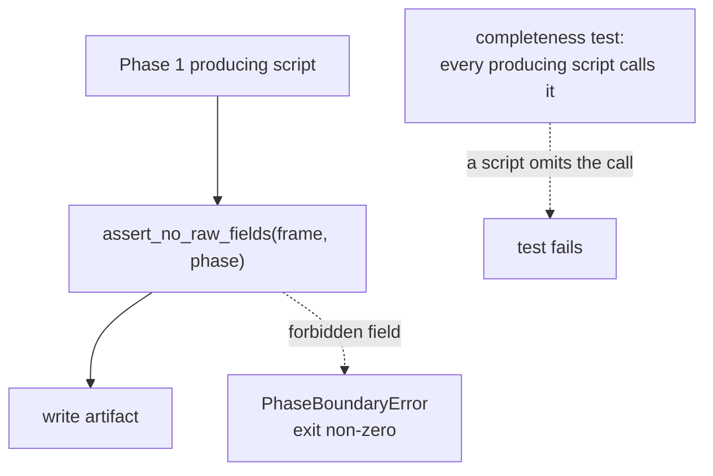
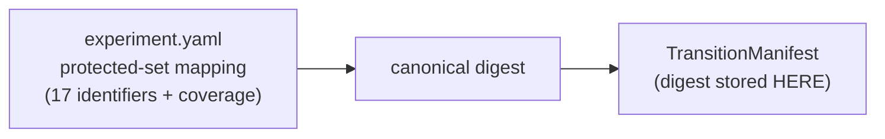
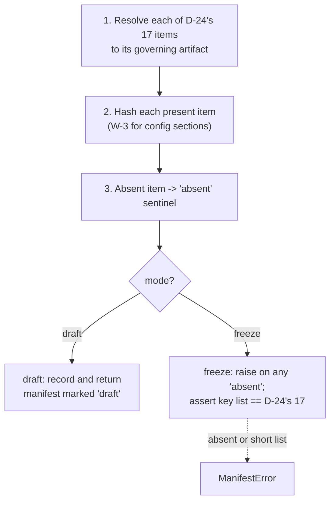
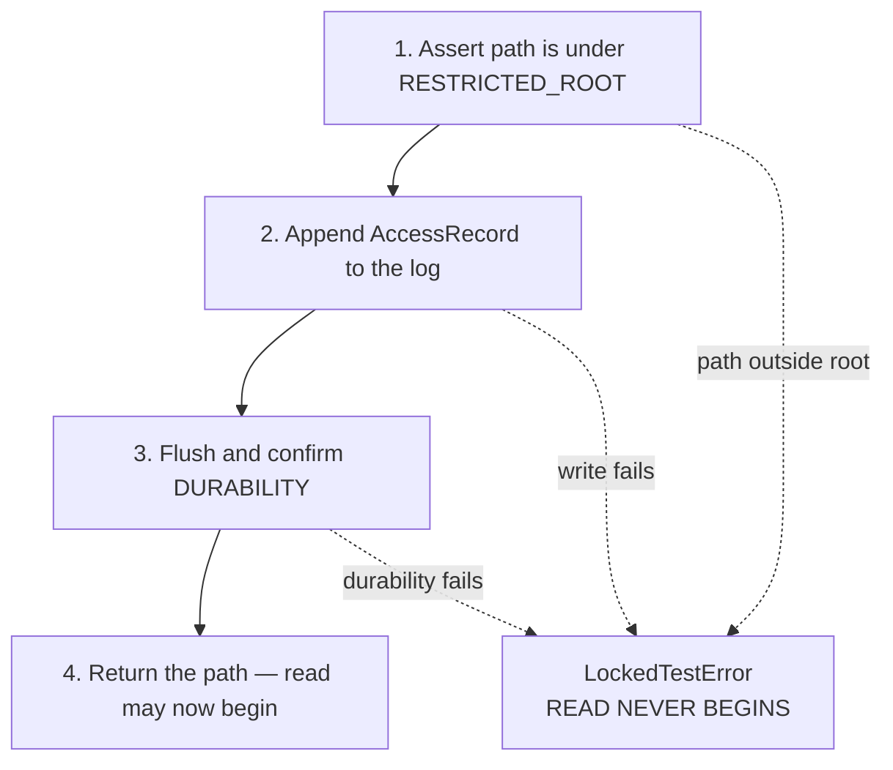

# Business Logic Model — `governance-guards`

**Unit** `governance-guards` (Bolt 2) · **Kind** `library` · **Depends on** `foundation`

The workflows this unit implements: the phase-boundary prohibition checked at every
stage entry, the Phase 1 → Phase 2 transition manifest, the single guarded path into
the locked December root, and the §10.1 reuse register.

**No workflow here computes a scientific quantity.** This unit refuses, records and
hashes. The 17 protected items are frozen by **D-24**; this stage does not reopen
them.

## Sources

- `../../../inception/units-generation/unit-of-work.md` § 2 — `Owns`, boundary, the 10 requirements, BLK-06, BLK-07, ADR-02 and ADR-03.
- `../../../inception/units-generation/unit-of-work-story-map.md` — Tables 1 and 2 plus § Per-unit coverage summary; both derivation paths agree.
- `../../../inception/requirements-analysis/requirements.md` — REQ-ENG-5; FR-P1-02-6; FR-P1-03-2; FR-P1-05-12; FR-P1-06-1…-4; NFR-PHASE-01; NFR-LIC-01.
- `../../../inception/application-design/component-methods.md` — the approved signatures and raise-contracts.
- `../../../inception/application-design/components.md` and `component-dependency.md` § Shared resources.
- `../../../inception/application-design/services.md` — § Stage entry contract, step 4.
- `evidence/DECISIONS.md` **D-24** and **D-15**.
- `../../../inception/delivery-planning/bolt-plan.md` § Gate 0 — the `DP-CHAIR-02` ruling and the pre-G-09 boundary.
- `../foundation/functional-design/business-logic-model.md` — W-1's stage entry contract, into which this unit's step 4 fits.
- `functional-design-questions.md`, `domain-entities.md`, `business-rules.md`.

---

## W-1 — Step 4 of the stage entry contract: the import limb

`foundation`'s W-1 fixes the six ordered steps. **Step 4 is this unit's**, and it
runs between preflight and seeding.

```
INPUT   phase: int, loaded_modules: Mapping[str, object]   (normally sys.modules)
OUTPUT  None
RAISES  PhaseBoundaryError naming the offending module
```

1. Return immediately unless `phase == 1`.
2. Intersect `loaded_modules` with `RAW_MODULES` — **four** names:
   `src.gnss.rinex`, `src.gnss.calibration`, `src.gnss.target`,
   `src.gnss.verification`.
3. On any intersection, **refuse to proceed** and raise, naming the module.

**Why it runs here and not only in tests.** A Kaggle session carries no git working
tree, so a commit hook cannot fire there and a local suite run proves nothing about
the environment the governed run actually executes in (ADR-02, Q3 = B). The
prohibition has to hold inside the session.

**Skipped only by `02_build_vtec_target.py`**, which is Phase 2 by definition and
asserts `phase == 2` instead.

**Four modules, not two.** FR-P1-03-2's earlier wording listed `rinex` and
`calibration`; `target.py` and `verification.py` are raw-processing adapters added
per finding `IMPL-2`.

## W-2 — The produced-field limb

```
INPUT   frame: DataFrame, phase: int
OUTPUT  None
RAISES  PhaseBoundaryError naming the field
```

Rejects a Phase 1 artifact carrying a **DCB, STEC, mapping, satellite or arc**
field.

**Call site (Q6 = C).** Each Phase 1 **producing stage script, before it writes** —
with a **completeness test asserting every Phase 1 producing script calls it.**



Text fallback: each producing script calls the field check before writing; a
forbidden field raises and exits non-zero; a separate completeness test fails if any
producing script omits the call.

**Why not inside `foundation`'s release API.** That would put a Phase 1 prohibition
inside the release path and invert the dependency — this unit depends on
`foundation`, never the reverse, and the reverse edge would **close a cycle**.

**Why not only at the manifest build.** That detects the breach after every artifact
is written, and possibly after downstream work consumed the contaminated frame.

**Independence is the requirement.** FR-P1-03-2 wants two independent results;
`component-methods.md` states it flatly — *"neither this nor
`assert_phase_boundary` substitutes for the other."* A test asserts that neither
limb passing implies the other.

## W-3 — Computing a config-section digest

```
INPUT   parsed section, per-item key list
OUTPUT  digest: str
```

1. **Parse**, then **canonicalise**: keys sorted, comments dropped, scalars
   normalised (Q1 = D).
2. **Assert the per-item key list covers the section** — a field present in the
   section but absent from the list **fails**.
3. **Digest** the canonical form.
4. **Record the canonicaliser version** in the manifest.

**Why canonical rather than byte-literal.** A byte digest changes on a comment edit,
a key reorder or a whitespace fix — none of which alters a governed value. G-P3C
would then fail on formatting, indistinguishably from a real protected-value change,
and a gate that cries wolf stops being read.

**Why the canonicaliser is versioned.** Changing *how* you canonicalise changes
every digest, so the canonicaliser is part of the frozen contract rather than an
implementation detail.

**Six of D-24's 17 items use this path** — items **4, 7, 9, 11, 14, 16**. Item 13
uses it as *one half* of a `Source + config-section hash`.

> **CORRECTION, 2026-08-22 — the first issue said "Eight … items 4, 5, 6, 7, 9, 11,
> 14, 16", and an adversarial review caught it.** Items **5** and **6** are typed
> **`Field hash`** in D-24, a *different* mechanism, and the first issue silently
> folded them into this section-and-key-list procedure. Derived rather than counted:
>
> ```
> awk '/^\| # \| Protected item/,/^\*\*Item 17/' evidence/DECISIONS.md \
>   | awk -F'|' 'NF>4 && $2 ~ /[0-9]/ && $5 ~ /Config-section hash/ {print $2}'
>   ->  4 7 9 11 14 16          (6 items)
>
> ... $5 ~ /Field hash/         ->  5 6   (2 items)
> ```
>
> **The review's finding understated the gap, and the wider version is recorded
> here.** D-24 uses **six distinct hashable-representation kinds** across the 17
> items; the first issue defined **one** and assumed it covered eight. The full
> taxonomy is now W-3a below.

## W-3a — The six hashable-representation kinds, and which items use each

Derived from D-24's table, all 17 items accounted for:

**Two independent axes, kept separate** — *what* is digested, and *who* computes it.
Conflating them is what let a mechanism go missing twice.

### Axis 1 — the digest kinds this unit computes

| Kind | Items | Computation fixed by this stage |
|---|---|---|
| **Config-section hash** | 4, 7, 9, 11, 14, 16 | W-3: canonicalise the parsed section, assert the per-item key list covers it, digest |
| **Field hash** | 5, 6 | W-3b — named field set (literals and patterns), non-empty assertion, same canonicaliser |
| **Parameter hash** | the second half of 15 | W-3c — a **named-parameter** digest, sibling of the field hash. **Not** a config-section hash and **not** a whole-file config hash |
| **Config hash** (whole file) | 12 | Canonicalise the entire parsed file — same canonicaliser, no section scoping and no key list, because the whole file *is* the scope (`configs/seeds.yaml`) |
| **Source-file content hash** | 1, and the source half of 13, 15, 17 | Digest of the source bytes of every module in scope, with the module set **enumerated rather than globbed at hash time** |

### Axis 2 — the three composites, each with a DIFFERENT second half

D-24 labels them separately, and the labels are not interchangeable:

| Item | D-24's label, verbatim | Source half | Second half | Defined by |
|---|---|---|---|---|
| **13** | `Source + config-section hash` | `src/evaluation/metrics.py` | **config-section** hash | W-3 |
| **15** | `Source + parameter hash` | `src/evaluation/bootstrap.py` | **parameter** hash | **W-3c** |
| **17** | `Source + config hash of every listed method` | each listed method's module | **config hash, per listed method** | ⚠ see § Open below |

Each composite is a digest over the **ordered pair** (source digest, second-half
digest), so a change on either side moves the composite.

### Axis 3 — four items this unit RECORDS rather than computes

| Item | Digest | Produced by |
|---|---|---|
| 2 | Serialized-architecture hash | `models-and-baselines` |
| 3 | Environment hash (TE §13.1) | `foundation` |
| 8 | Fold, embargo and comparison-mask manifest hashes | `features-and-splits` |
| 10 | Selected-value hash from the run record | `models-and-baselines` |

**Why this axis matters.** Four of the 17 protected items are **not this unit's to
compute** — it records a digest another unit produced, which makes the manifest's
integrity partly dependent on three other units. That is a real property of the
design, stated rather than hidden. It introduces **no dependency edge**:
`build_transition_manifest` receives artifact paths as a **parameter**, so this unit
never imports a downstream one and stays a DAG root.

**All 17 items appear exactly once across Axis 1 and Axis 3**, with Axis 2 decomposing
the three composites rather than adding items:
6 + 2 + 1 + 1 + 1 (config-section, field, config, source, and the three composites
counted once each) + 4 recorded = 17.

## W-3c — The parameter-hash contract (the second half of item 15)

D-24 types item 15 as **`Source + parameter hash`** and names the parameters
verbatim: *"24-hour vector blocks, 10,000 replicates, seed 20221201."* Governing
artifacts: `src/evaluation/bootstrap.py` + `configs/seeds.yaml`.

A **parameter hash** is a sibling of the field hash — a digest over an explicitly
named parameter set, using the **same canonicaliser** — with two differences that
matter:

1. **Its parameters may span more than one governing artifact.** The seed lives in
   `configs/seeds.yaml`; the block width and replicate count are bootstrap
   parameters. A field hash is scoped to one file; a parameter hash is scoped to a
   **named set wherever those names resolve**, and the resolution is recorded.
2. **Every named parameter must resolve, and the resolved set must be complete.** A
   parameter hash over two of three parameters is a digest that passes every diff
   while leaving one unprotected.

**Why this cannot be folded into the config path.** `TC-19` is `binding: hard` on
exactly these values — 24-hour blocks carrying all three stations together, 10,000
replicates, seed 20221201 — and `project.md` § Forbidden bars substituting a
within-station or naive bootstrap. Hashing "whatever is in the seeds file" would not
protect the block construction or the replicate count at all.

> **Corrected 2026-08-22 after the final adversarial pass.** The previous version of
> W-3a listed item 15 under "Composite source + config" with its second half
> *"computed by its own kind above"* — but **no parameter-hash kind existed above**.
> That silently folded a fourth mechanism into a generic bucket, which is the same
> defect class as the original eight-versus-six miscount, on a `TC-19` hard-binding
> item feeding the G-P3C pass condition. **Second occurrence of one defect class
> inside one correction pass.**

## W-3b — The field-hash contract (items 5 and 6)

D-24 types items 5 and 6 as **`Field hash`**, scoped to named fields rather than a
section. Same canonicaliser as W-3, narrower scope, plus a per-item assertion D-24
states verbatim.

```
INPUT   parsed config, the item's named field set (literal names and/or patterns)
OUTPUT  digest: str
```

1. Resolve the named field set — **literal names and declared patterns**, expanded
   against the parsed config.
2. **Assert the resolved set is non-empty.** A pattern matching nothing must fail; a
   field hash over zero fields is a digest of nothing that would pass every diff.
3. Canonicalise the resolved `name → value` pairs with the **same canonicaliser** as
   W-3, so the versioning argument carries over unchanged.
4. Digest.
5. Apply the item's own assertion.

| Item | Governing artifact | Field set | D-24's additional assertion, quoted |
|---|---|---|---|
| **5** History window | `configs/experiment.yaml` | the history-window field | *"frozen at 24 h and absent from every grid"* |
| **6** Station encoding | `configs/features.yaml` | `station_onehot_*` plus `station_lat` | *"`station_onehot_*` plus verified `station_lat`"* |

**Item 5's assertion has two limbs and both are checkable here**: the value is the
frozen 24 h, **and** the field appears in **no grid**. The second limb is what stops
the history window being tuned — `project.md` § Forbidden makes a tuned window a
defect, and Q1's own option A named it as a thing the grid must not contain.

**Item 6's "verified" is deliberately NOT this unit's verification.** This unit
hashes `station_lat`; **whether it is verified is `inventory-and-registry`'s**, whose
`assert_registry_resolved` blocks `station_lat` when the registry is unresolved or a
conflict was averaged. Recorded so the word "verified" in D-24 is not read as an
obligation landing here — this unit's assertion is that the field is **present and
hashed**, not that its value has been validated against the IGS site logs.

> **What remains PENDING, unchanged.** The *kinds* above are fixed by this stage. The
> **per-item binding to concrete config fields and file paths is still BLK-06's open
> limb** — no config file or `src/` package exists, so item 5's field name, item 6's
> pattern, item 15's parameter names, and every section boundary are named by D-24 but
> not yet resolvable against a real artifact. **BLK-06 is not closed by this stage.**

## Open — item 17's "config hash" label, raised not resolved

D-24 types item 12 as **`Config hash`** (the whole of `configs/seeds.yaml`) and item
17 as **`Source + config hash of every listed method`**. **The same two words carry a
different scope**: item 12's is one whole file; item 17's is *per listed method*
across five enumerated methods (M-01 persistence, M-02 24-hour seasonal persistence,
M-03 station×month×hour climatology, B-01 the IRI-2016 benchmark with its 2000 km
altitude ceiling, C-01 the CODE final GIM comparator).

**Whether item 17's per-method config scope is a whole file, a section, or a named
parameter set is not stated by D-24, and is not invented here.** The label appears to
be inherited from D-24 rather than introduced by this stage, so correcting it would be
an amendment to an approved decision record rather than a design choice.

**Consequence if left open:** item 17 is the one protected item whose second-half
scope a builder would have to guess. Raised at this stage's approval gate alongside
Amendments D and E — **not resolved by preference.**

## W-4 — The protected-set mapping, and why there is no circularity

**One structure** (settled in the Step 4 ambiguity analysis): a governed mapping from
**protected-item identifier → the config keys or artifact paths that item covers**.
Its 17 keys are D-24's identifiers; its values are W-3's per-item coverage lists.

**Location** `configs/experiment.yaml`. **Digest stored externally, in the
transition manifest — never inside the section.**



Text fallback: the mapping is canonicalised to a digest, and the digest is stored in
the transition manifest — not back into the section it came from.

> **Changing the list simply produces a new digest. That is correct behaviour and
> must NOT be called a circularity.** A change to the protected-set enumeration is a
> governed change requiring a Vision §15.2 amendment and a D-number, so it *should*
> surface as a manifest difference.

**The complete mapping is hashed, values included — never excluded to avoid
circularity.** Excluding it would leave the enumeration that defines what is
protected as the one unprotected thing in the set. Because identifiers and coverage
lists are one structure, this also catches a coverage-list drift where the identifier
stayed put.

**Genuine self-reference, narrow rule.** *If* the hashed section ever stores its own
expected digest, canonicalization removes or normalizes **only that self-referential
digest value**.

**Mutation contract** — the six behaviours `business-rules.md` R-03 tests: deletion
and addition change the digest and fail the membership assertion; **duplication is
rejected** because D-24's cardinality of 17 is calculated from its enumeration;
semantically irrelevant **reordering leaves the digest unchanged**; renaming changes
the digest and fails membership; and the frozen manifest holds **exactly** the
17-item set.

## W-5 — Building the transition manifest

```
INPUT   snapshot: ConfigSnapshot, artifacts: Mapping[str, Path], mode: draft|freeze
OUTPUT  TransitionManifest
RAISES  ManifestError — a freeze-mode build with an absent item, or a key list != D-24's 17
```



Text fallback: resolve all 17 items, hash those present, mark absent ones with a
sentinel, then branch on mode — draft records and returns a manifest explicitly
marked draft; freeze raises on any absent item and asserts the key list equals
D-24's 17.

**The build mode is recorded in the manifest**, so a draft can never be mistaken for
a freeze.

**Why draft mode exists.** All 17 governing artifacts are absent today — no config
file, no `src/` package, no run record. Under a raise-always rule the manifest could
not be built, tested or demonstrated until the final Bolt, and a mechanism first run
at a freeze gate is a mechanism first debugged at a freeze gate. This project's
affirmed posture is that reproducibility is executable, not asserted.

**The membership assertion is what `component-methods.md` already demands** — the key
list is asserted equal to the canonical set *"so a short list cannot pass silently."*

## W-6 — `diff_protected_hashes` and the G-P3C pass condition

```
INPUT   frozen: TransitionManifest, current: TransitionManifest
OUTPUT  Mapping[str, tuple[str, str]]   — differing keys with both values
```

An **empty mapping is the G-P3C pass condition**: no protected item changed.

**Ordering that matters.** The membership assertion runs **before** any diff, so a
manifest missing an item fails rather than producing a reassuring empty diff.

> ## ⚠ AN EMPTY DIFF IS NOT YET PROOF
>
> **BLK-06's enumeration limb is RESOLVED by D-24 at 17 items. Its per-item binding
> to concrete config fields and file paths is PENDING**, and no config file or `src/`
> package exists yet.
>
> Until that binding is discharged **and approved**, an empty diff **must not be read
> as proof that no protected item changed**, and no artifact, manifest or report from
> this unit may state or imply otherwise.
>
> `component-methods.md`'s standing caution is **half-discharged, not retired** — see
> `functional-design-questions.md` § Amendment D, where the two approved artifacts
> that still describe the enumeration as deferred are **reported, not edited**.

## W-7 — A guarded read of the locked December root

```
INPUT   path: Path, record: AccessRecord, registry: Path
OUTPUT  Path   (only after the log is durable)
RAISES  LockedTestError — path outside RESTRICTED_ROOT, or log write / durability failure
```



Text fallback: assert the path is under the restricted root, append the access
record, flush and confirm durability, and only then return the path. A path outside
the root, a failed write, or a failed durability confirmation all raise and the read
never begins.

> **The access-log append must be DURABLY COMPLETED before the December read
> begins.** A log-write failure **or** a durability failure **prevents the read** —
> not reported alongside it, not retried after it, not logged as a warning while the
> read proceeds.

**Step 1 exists to keep the guard honest**: `path` outside `RESTRICTED_ROOT` raises,
because callers must not route ordinary reads through the guard and dilute what a log
row means.

**Why ordering is the requirement.** `VAL-2` and FR-P1-02-3: **an access recorded
after the fact fails the ordering check rather than satisfying it.** An unlogged read
of the locked month cannot be undone once taken.

**Two limbs, two tests.** Patch the log writer to fail → the read never happens.
Assert the row is durable on disk before the read is attempted — which distinguishes
this contract from one that logs and reads in the same buffered transaction, where a
crash loses the row and keeps the read.

**Context.** The log already holds **five retrospective rows** predating this guard
(`evidence/experiment_registry.md` rows 3, 4, 5, 8, 9). Two kinds of row coexist, and
the distinction lives in the register explicitly rather than being inferred from
ordering.

## W-8 — Scanning for December-bearing artifacts outside the restricted root

```
INPUT   evidence_root: Path
OUTPUT  Sequence[Path]   — empty is the pass condition
```

1. Walk `evidence/` **recursively**.
2. For each artifact, **parse and inspect observation dates** — never the filename or
   directory name.
3. An artifact that **cannot be parsed** is a **failure**, not a pass.
4. Return every December-bearing artifact found outside the restricted root.

**Why record dates and not names.** `project.md` § Forbidden: *"NEVER derive fold or
partition membership from an acquisition directory name or a filename."* That rule
exists because a year-blind predicate filed locked-month records into
`audit_evidence_2022-01/`, where a name-based check cannot see them.

**Why unparseable means failure.** A file the guard cannot read is exactly where a
December record would hide. Getting past it needs an **explicit recorded exclusion**,
never silence.

**Why recursive by construction.** `DATA-01` showed a non-recursive glob silently
stopped checking the artifacts that matter most.

**Retained after D-15**, which relocated 21 December-bearing files into the
restricted root — this is the regression guard for that move.

> ## ⚠ FR-P1-02-6 IS EXPLICITLY UNTESTED
>
> This workflow's requirement has **no §16 or §19 acceptance row** — this unit's one
> untested requirement, derived from story-map Table 1 and cross-checked against
> § Per-unit coverage summary.
>
> On the project decision owner's explicit direction it is preserved as an
> **explicitly untested obligation until an approved acceptance row exists AND its
> test has passed** — both conditions. Everything above is a **test specification
> only — not an approved acceptance row and not evidence of a passing result.**
> Designing the guard does not test it; implementing it does not test it.

## W-9 — Registering reused third-party source

1. **Default: do not copy.** Reimplement the published method from the paper with a
   citation. `project.md` § Forbidden prohibits copying source whose licence is
   absent, ambiguous or incompatible, and that is the rule in force while the AGPLv3
   question is open.
2. If copying or material adaptation is nonetheless approved, record **all fifteen
   §10.1 fields** **before the code is used** and before **G-P2**.
3. The adapter module carries a mandatory **provenance marker**.
4. The register is **asserted complete** against the set of marked modules; an
   unmarked module is asserted to contain **no reuse**.

**Why the marker.** Without it an unregistered copy is indistinguishable from
original work by inspection, and the completeness assertion has nothing to range
over.

**The open governance dependency, stated not resolved.** The AGPLv3
Global-TEC-forecasting repository is the only approved direct-copy source today, and
**whether its repository-distribution obligations permit that copying is a dependency
this project does not settle.**

## W-10 — One path in, and who may use it

**Mechanism (Q8 = D).** A **static check asserts no module outside `locked_test.py`
contains the restricted-root literal.**

**Why absolute.** **D-15** records the restricted root as a **governance boundary,
not an access control** — it holds only while exactly one code path reaches it. A
second path does not weaken it slightly; it ends it.

**Why not a caller allow-list inside the guard.** That would couple this root unit to
four downstream units and close the cycle the DAG was arranged to avoid.

> ## ⚠ BLK-07 IS OPEN AND STAYS OPEN
>
> Four units reach the root through this contract: `inventory-and-registry` (pre-G-05
> coverage audit), `acquisition` (the D-9 input and any December re-acquisition — the
> unrecorded routing that **is** BLK-07), `features-and-splits` (locked partition),
> `evaluation-and-comparison` (locked evaluation).
>
> **Acceptance of this mechanism is NOT authorization to open locked December data.**
> The static check enforces **how many** paths exist, never **who** may use one.
> Which units are authorised to reach the locked month is a decision the **project
> decision owner receives and approves**, and nothing here grants, implies or
> substitutes for it.

## W-11 — What Bolt 2 builds, and what it must not

**Permitted before G-09**, per `bolt-plan.md` § Gate 0: module structure,
interfaces, placeholder CLI definitions, configuration wiring, safe fail-fast
behaviour, and the `tests/` scaffolding for this unit.

**Barred until G-09 is signed for the affected component**: implementing any
component whose P0 decision is unresolved; filling any `TBD — freeze gate` field;
executing any governed run; generating code for a unit carrying an open blocker on
that scope.

> **`src/data/phase_contract.py`, `src/data/locked_test.py` and
> `src/data/reuse_registry.py` DO NOT EXIST.** BLK-01 closed 2026-08-22 under
> `CR-2026-08-22-TE-AMEND` granting **authority only**. Authority to name a module is
> not authority to write one; creation stays gated by **G-09**, TE §18.3's
> stop-and-report rule, and stage **3.5**.

**No December access of any kind occurs in this Bolt.** The guard is designed here;
it is not exercised against the locked month.

---

## Requirement-to-workflow map

Acceptance derived from story-map Table 1; owners from Table 2's `primary` cell. Both
paths cross-checked and in agreement.

| Requirement | Workflow | Tested by (Table 1) | Row primary owner |
|---|---|---|---|
| REQ-ENG-5 | W-1, W-2, W-5 | WS-10, TA-07, TA-08, TA-12, TA-27 | `features-and-splits` ×3; `models-and-baselines`; **`governance-guards`** |
| **FR-P1-02-6** | W-8 | ⚠ **NO CURRENT ACCEPTANCE ROW** | — |
| FR-P1-03-2 | W-1, W-2 | TA-27 | `governance-guards` |
| FR-P1-05-12 | W-7 | WS-18, TA-18 | `features-and-splits` |
| FR-P1-06-1 | W-4, W-5 | TA-27 | `governance-guards` |
| FR-P1-06-2 | W-5 | TA-27 | `governance-guards` |
| FR-P1-06-3 | W-5, W-6 | TA-28 | `governance-guards` |
| FR-P1-06-4 | W-5, W-6 | TA-28 | `governance-guards` |
| NFR-PHASE-01 | W-1, W-2, W-5 | TA-27 | `governance-guards` |
| NFR-LIC-01 | W-9 | TA-28 | `governance-guards` |

**10 requirements, 1 without an acceptance row.** **Owns** TA-27 and TA-28;
**supports** TA-07, TA-18 and WS-18. Three relations, three sets, each derived.

## Assumptions & Open Questions

- **[assumption]** `tests/test_locked_test_guard.py` is not this unit's — ADR-03 splits the guard, and `features-and-splits` owns the test covering both limbs to keep this unit a DAG root.
- **[assumption]** NFR-PHASE-01's transition-manifest hash-diff test has no §12 module and needs frozen artifacts from every later unit; carried on `fixtures-and-reproducibility` with this unit supporting.
- **[assumption]** `frontend-components.md` is not produced — `kind: library`, mapped to `[ui]` only.
- **[assumption]** Whether `build_mode` and `canonicaliser_version` are new `TransitionManifest` fields or entries in an existing mapping is a stage 3.5 shaping decision. Only semantics are fixed here, so **no approved dataclass contract is changed.**
- **Open — where the D-24 conformance test gets its list.** It must assert against the **authority**, not only the config, or config and manifest can agree while both drift. Hardcoding is a fourth copy of a governed enumeration; parsing `evidence/DECISIONS.md` makes a governance prose document a test dependency, which Q3 option C was rejected for. **No third option invented.** Raised at the gate.
- **Open — BLK-06's per-item binding.** Enumeration resolved by D-24 at 17; binding **PENDING**. W-6 states the consequence.
- **Open — BLK-07 authorization.** See W-10. The owner's decision.
- **Open — Amendment D.** `component-methods.md` and `unit-of-work.md` § 2 carry text superseded by D-24, provenance preserved, **neither edited by this stage.**
- **Open — the AGPLv3 distribution question.** Unresolved; reimplementation with a citation is the standing default.
- **G-09 is not signed.** No workflow here authorises creating any module.
- **None** of the above adopts a reading on a supervisor-owned value, and none decides a scientific constant.

## Review

**Verdict:** NOT-READY
**Reviewer:** aidlc-architecture-reviewer-agent
**Date:** 2026-08-22T16:03:54Z
**Iteration:** 2 (final)

### Disposition of iteration-1 findings

| # | Iter-1 severity | Disposition | Verification |
|---|---|---|---|
| 1 | Critical — "eight of D-24's 17 items use the config-section path" contradicted D-24 (items 5, 6 are `Field hash`, not `Config-section hash`) | **RESOLVED.** All three files now state "**Six** of D-24's 17 items use this path — items **4, 7, 9, 11, 14, 16**," with the superseded eight-item sentence preserved verbatim under a `CORRECTION, 2026-08-22` banner in each file. `business-logic-model.md` §W-3a/§W-3b, `domain-entities.md` §1's kind table, and `business-rules.md` R-01 all add the missing `Field hash` contract for items 5 and 6: named-field-set resolution, a non-empty-resolved-set assertion, the shared canonicaliser, and D-24's own per-item assertion text quoted for each. | I re-ran the artifact's own derivation command against `evidence/DECISIONS.md`: `awk '/^\| # \| Protected item/,/^\*\*Item 17/' evidence/DECISIONS.md \| awk -F'\|' 'NF>4 && $2 ~ /[0-9]/ && $5 ~ /Config-section hash/ {print $2}'` → `4 7 9 11 14 16` (six); the `Field hash` variant → `5 6`. Both match the corrected text exactly. I grepped all three files for `"Eight of D-24"` — it appears three times, all inside the preserved-superseded quote or the (now-superseded) iteration-1 Review section, never as a live assertion. I independently re-derived the full 17-item table's literal "Hashable representation" column (`awk -F'\|' 'NF>4 && $2 ~ /[0-9]/ {print $2, "->", $5}'`) and cross-checked item 6's governing artifact against the corrected `configs/features.yaml` (not `experiment.yaml`, as the review brief specifically asked me to check) and item 5's two-limb assertion ("frozen at 24 h" **and** "absent from every grid") — both are quoted from D-24 character-for-character in `business-logic-model.md` §W-3b. |
| 2 | Minor — the miscount originated in `functional-design-questions.md` Question 1's premise | **RESOLVED.** Question 1 (line 51–72) now carries a boxed `⚠ THE PREMISE OF THIS QUESTION WAS WRONG, AND THE QUESTION IS PRESERVED AS ASKED` annotation, with the same derivation command, and states the chosen answer (Option D) is unaffected because it does not depend on the count. | Read `functional-design-questions.md` lines 50–89 directly. |

### New findings (this iteration)

| # | Severity | Location | Finding | Recommendation |
|---|---|---|---|---|
| 1 | Critical | `business-logic-model.md` §W-3a (the "Composite source + config" row, items 13, 15, 17); mirrored in `domain-entities.md` §1's kind table | **The fix that closed finding #1 above reproduces the identical defect class on item 15, one level down.** D-24's own literal "Hashable representation" text for item 15 is `"Source + parameter hash — 24-hour vector blocks, 10,000 replicates, seed 20221201"` — I re-derived this directly: `awk -F'\|' 'NF>4 && $2 ~ /[0-9]/ {print $2, "->", $5}' ` over the same table slice prints `15 -> Source + parameter hash — 24-hour vector blocks, 10,000 replicates, seed 20221201`. **"Parameter hash" is a fourth, distinct D-24 label**, appearing nowhere among the four atomic kinds this stage defines (`Config-section hash`, `Field hash`, `Config hash`, `Source-file content hash`). The "Composite source + config" row's own text — "Digest over the ordered pair (source digest, config digest), **each computed by its own kind above**" — asserts every composite item's non-source half maps onto one of the four atomic rows, but for item 15 it names none: unlike item 13, where W-3 explicitly says "item 13 uses it [config-section] as *one half*," and unlike items 2/3/8/10, where the Externally-supplied row's prose individually names each item's distinct literal label ("the serialized-architecture hash (2)… the run-record selected-value hash (10)"), item 15's literal "parameter hash" is never named, cross-referenced, or bound to `Field hash` (the closest atomic analogue, since it protects three specific named values rather than a section) anywhere in `business-logic-model.md`, `business-rules.md`, or `domain-entities.md`. This is not a difference of degree from the defect this correction pass just fixed — it is the same silent fold ("a different mechanism… silently folded in," in the correction's own words at §W-3, ¶125–141) recurring inside the very row that was added to fix it, on an item (Bootstrap) that backs `TC-19`, a `binding: hard` project rule, and feeds `diff_protected_hashes`'s G-P3C pass condition. A stage-3.5 implementer has no basis to choose between hashing item 15's parameters as a `Field hash` over three named values (the closest fit) versus something else, and no test can be written against an unnamed mechanism. | Add item 15's literal label to the taxonomy explicitly — either a fourth bullet in the "Why the last row matters" style naming it a `Field hash` over the three named bootstrap parameters (block size, replicate count, seed), or a new row — before stage 3.5 could implement `build_transition_manifest`'s item-15 branch. Re-check the other two composite items while at it: item 13 is already explicitly bound to `Config-section hash` in W-3's prose (no gap), and item 17's literal label ("Source + **config hash** of every listed method") matches item 12's literal label exactly, which is a real but separate ambiguity — see finding #2. |
| 2 | Minor | `business-logic-model.md` §W-3a, item 17 (Composite row) vs. item 12 (Config hash row) | Item 17's D-24 label is literally `"Source + config hash of every listed method"` — the identical literal phrase (`Config hash`) the taxonomy assigns exclusively to item 12 as a **whole-file** hash of `configs/seeds.yaml` ("no section scoping and no key list, because the whole file *is* the scope"). But item 17 covers five independently-varying baseline methods (M-01, M-02, M-03, B-01, C-01 per D-24's own item-17 enumeration), each with its own `experiment.yaml` "entry" — a per-method scope, not a whole-file one. Reusing item 12's whole-file mechanism verbatim for item 17 would make all five baselines' config-hash components identical regardless of which one actually changed, which cannot be the intent. Not the same defect as finding #1 — D-24 itself uses the identical two-word phrase for two items with apparently different intended scope, so this may be an ambiguity inherited from the frozen decision rather than an error introduced by this stage — and this stage is correct not to invent a resolution by reopening D-24. But unlike BLK-06 (explicitly flagged open in every file) this specific scoping question is raised nowhere as an open item. | Add a one-line open question alongside BLK-06 noting that item 17's "config hash" component needs per-baseline scoping distinct from item 12's whole-file scoping, so the ambiguity is visible rather than silently assumed away by reuse of the same row description. |
| 3 | Minor | `business-logic-model.md` §W-3a / `domain-entities.md` §1, the "Externally supplied digest" row | This row is presented as one of "six hashable-representation kinds" (a taxonomy of hashing *mechanisms*), but its actual grouping criterion is a different axis — *who computes the digest*, not *how*. D-24's literal text gives items 2, 3, 8, 10 four different representations (`Serialized-architecture hash`, `Environment hash`, `Manifest hashes`, `Selected-value hash`) that share no mechanism in common; they are grouped here only because this unit doesn't compute any of them. The row's prose discloses this correctly ("Not computed here… recorded by this one," with each item's literal label individually named), so this does not block implementability the way finding #1 does — but the table header ("Kind") invites reading it as a fifth or sixth *hashing* mechanism family, which it is not. | Rename the row or split the table into two axes (representation kind vs. computed-here/recorded-here) so "kind" consistently means one thing. |

### Failed refutation attempts (this iteration, beyond what iteration 1 already closed)

- **Taxonomy exhaustiveness and no double-counting.** Extracted the six kinds' item lists as literal arrays and checked programmatically (`node -e` script) that their union is exactly `{1..17}` with zero duplicates and zero gaps: `sorted 1,2,3,4,5,6,7,8,9,10,11,12,13,14,15,16,17` / `matches 1..17 exactly: true`. Cross-checked item 13's simultaneous appearance in the "Composite" bucket and in W-3's "item 13 uses it as *one half*" sentence — the two are consistent (13 is not double-counted in the six-kind table; it is only *referenced* from W-3's prose to explain the composite's config-section half). **Refutation failed — the taxonomy is exhaustive and non-overlapping as a partition of the 17 items**, independent of finding #1 above (which is about an *undisclosed sub-mechanism* inside one partition member, not about the partition itself).
- **The four "externally supplied" attributions (items 2, 3, 8, 10 → `models-and-baselines`, `foundation`, `features-and-splits`).** Checked each against `unit-of-work.md`'s per-unit `Owns.` lists (the only files this stage names as an integration-point exception, read via the shared contract rather than any sibling `construction/` directory): `foundation` §1 owns "the run record and `experiment_registry.jsonl` append-only writer," and `evidence/experiment_registry.md` independently confirms TE §13.1's per-run capture list is `requirements.txt` hash + per-run `pip freeze` + config-snapshot hashes — the environment-hash content of item 3 — is part of that run record, not a `ConfigSnapshot` field (`component-methods.md`'s `ConfigSnapshot.hashes` is only the four *config* files' SHA-256, confirming item 3's hash is a distinct, foundation-owned artifact rather than double-counted against the config hashes). `features-and-splits` §7 owns `src/data/splits.py` — "F1–F4, the 24-hour embargo, `materialise_locked_partition`" — matching item 8's fold/embargo/mask manifests exactly. `models-and-baselines` §8 owns `lstm.py` (architecture) and `train.py` (hyperparameter run record) — matching items 2 and 10. Also checked whether "recorded, not computed" implies an import-time circular dependency, given `governance-guards` is declared a DAG root that "imports nothing downstream": `build_transition_manifest`'s approved signature (`component-methods.md`) takes `artifacts: Mapping[str, Path]` as an input parameter, so the manifest builder hashes artifact *files* at paths supplied by its caller rather than importing the producing unit's code — no cycle. **Refutation failed — all four attributions are correct against the shared contracts, and no circularity is introduced.**
- **Regression sweep on everything iteration 1 cleared.** Re-checked Q3's four owner-directed limbs, the 10-requirement/1-untested traceability table (re-derived independently from `unit-of-work-story-map.md` by grep against all 10 requirement IDs — 10 exact-matching rows, including the per-unit summary's "`governance-guards` (1): FR-P1-02-6" line), the `RAW_MODULES` four-module set and two-limb independence claim, the durable-append-before-read ordering on the locked-December guard (no escape hatch found), the five retrospective access-log rows, and pending-status discipline on BLK-06, BLK-07, Amendments D and E, FR-P1-02-6, and the open D-24-test-source question. All text is byte-identical to what iteration 1 verified, apart from the corrections themselves. **Refutation failed — no regression found on any previously-cleared item.**

### Summary

The correction fully and verifiably resolves both iteration-1 findings: the eight→six count is fixed everywhere with the superseded text preserved and the derivation command reproducible against `evidence/DECISIONS.md` today, the field-hash contract for items 5 and 6 is now complete (scope, non-empty assertion, shared canonicaliser, D-24's own per-item assertions quoted verbatim, negative controls), and the question file's premise is annotated rather than silently diverged from. The wider six-kind taxonomy added while fixing it is exhaustive and non-overlapping across all 17 items — I re-derived this as a set partition independently and it holds — and the four "externally supplied" attributions to `foundation`, `features-and-splits` and `models-and-baselines` are each individually correct against the shared `unit-of-work.md` contracts, with no circular dependency introduced. But the fix introduces a new, narrower instance of the exact defect class iteration 1 caught: item 15's D-24 label is literally `"Source + parameter hash"`, a fourth mechanism distinct from the four atomic kinds this stage defines, and it is silently subsumed into the generic "config digest" half of the "Composite source + config" row without ever being named — the same "a different mechanism… silently folded in" failure mode, recurring inside the very correction meant to close it, on a `TC-19` hard-binding item that feeds the G-P3C pass condition. That leaves one of seventeen protected items with a named mechanism *family* (composite) but no named atomic sub-mechanism, which a stage-3.5 implementer would have to invent rather than read off the design — exactly what distinguishes NOT-READY from READY here, independent of the numeric Critical/Major count. A second, smaller ambiguity (item 17 reusing item 12's literal "config hash" label despite an apparently different, per-baseline scope) is likely inherited from D-24 itself rather than introduced by this stage, and is recorded as a Minor open-question gap rather than a defect. Fixing finding #1 requires naming item 15's parameter-hash mechanism explicitly (most plausibly a `Field hash` over its three named parameters) in all three files before stage 3.5 can implement that branch of `build_transition_manifest`.
