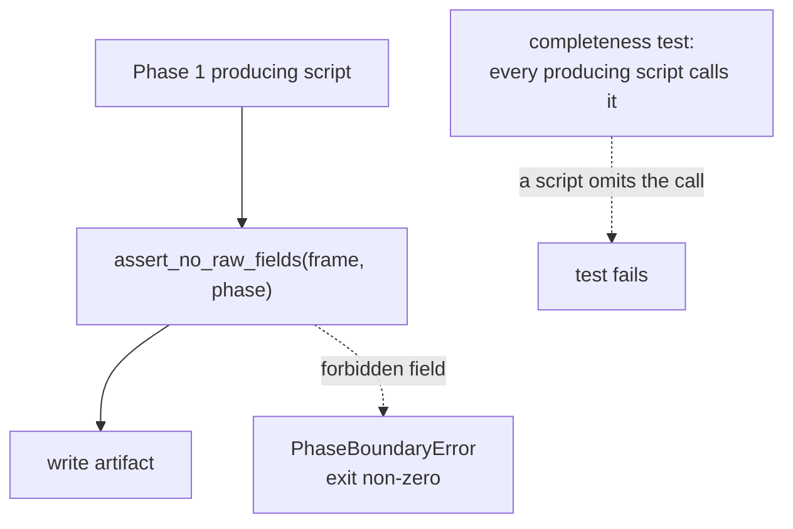
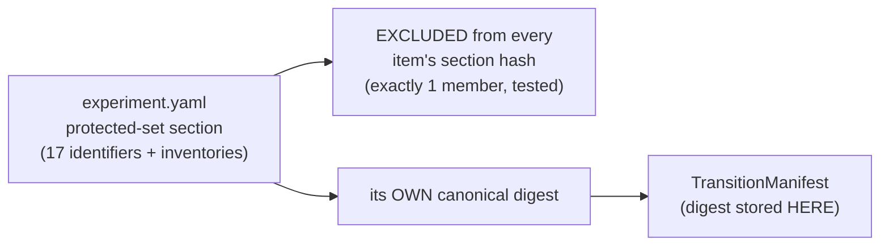
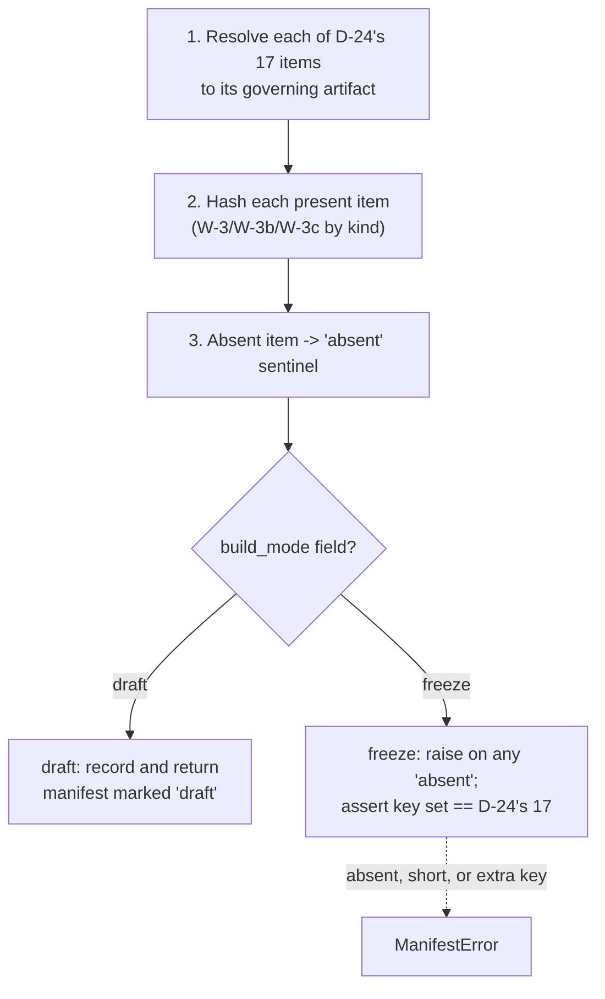
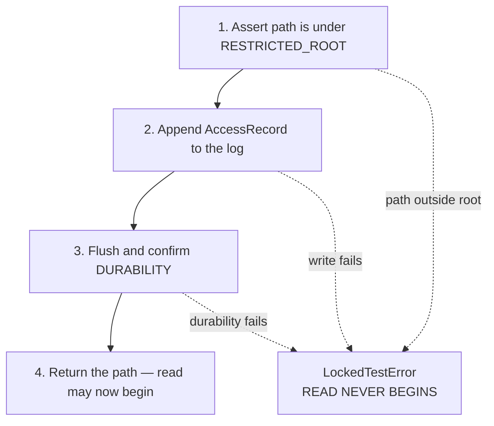

# Business Logic Model — `governance-guards`

**Unit** `governance-guards` (Bolt 2) · **Kind** `library` · **Depends on** `foundation`

> **Re-established 2026-08-23 after a stage-wide redo jump**, which reset the receipt floor
> for every unit of this stage. **No content of this unit changed at re-establishment.**
> What the jump also does here: it **resets this unit's exhausted adversarial reviewer
> budget**, so the artifacts regenerated against the nine-question set — previously
> disclosed as unreviewed because the 2-iteration budget had been spent on the prior issue —
> receive a fresh pass. See § Review.
>
> **That pass has since run and returned READY** (iteration 2), after a Critical arithmetic
> slip in § W-3a was corrected — the printed proof summed to **15** where it asserted 17.
> **Re-established a second time 2026-08-23** after a further stage-wide redo aimed at
> `external-products`; **no content of this unit changed on that occasion.** **A third
> re-establishment** followed a redo aimed at a misread depth policy in
> `component-methods.md`; **no content changed then either.**

The workflows this unit implements: the phase-boundary prohibition checked at every
stage entry, the Phase 1 → Phase 2 transition manifest, the single guarded path into
the locked December root, and the §10.1 reuse register.

**No workflow here computes a scientific quantity.** This unit refuses, records and
hashes. The 17 protected items are frozen by **D-24**; this stage does not reopen
them.

## Sources

- `../../../inception/units-generation/unit-of-work.md` § 2 — `Owns`, boundary, the 10 requirements, BLK-06, BLK-07, ADR-02 and ADR-03.
- `../../../inception/units-generation/unit-of-work-story-map.md` — Tables 1 and 2 plus § Per-unit coverage summary; both derivation paths agree. Table 2 also records `RES-01`.
- `../../../inception/requirements-analysis/requirements.md` — REQ-ENG-5; FR-P1-02-6; FR-P1-03-2; FR-P1-05-12; FR-P1-06-1…-4; NFR-PHASE-01; NFR-LIC-01.
- `../../../inception/application-design/component-methods.md` — the approved signatures and raise-contracts.
- `../../../inception/application-design/components.md` and `component-dependency.md` § Shared resources.
- `../../../inception/application-design/services.md` — § Stage entry contract step 4; § The nine stage scripts (the producing-script enumeration in W-2); § Execution platforms (a Kaggle session carries no git working tree).
- `evidence/DECISIONS.md` **D-24** and **D-15**.
- `../../../inception/delivery-planning/bolt-plan.md` § Gate 0 and § Bolt 2 — the `DP-CHAIR-02` ruling, the Definition of Done, and the confidence hypothesis *"that the prohibitions are enforced at run time, not only in tests."*
- `../foundation/functional-design/business-logic-model.md` — W-1's stage entry contract, into which this unit's step 4 fits; R-15 and R-16.
- Workspace inspection, 2026-08-22: `tests/test_phase_boundary.py` (266 lines) and `tests/test_acquisition_window.py`, read directly rather than described from a citation.
- `functional-design-questions.md` (**Q1 through Q9**), `domain-entities.md`, `business-rules.md`.

---

## W-1 — Step 4 of the stage entry contract: the import limb

`foundation`'s W-1 fixes the six ordered steps. **Step 4 is this unit's**, and it runs
between preflight and seeding.

```
INPUT   phase: int, loaded_modules: Mapping[str, object]   (normally sys.modules)
OUTPUT  None
RAISES  PhaseBoundaryError naming the offending module
```

1. Return immediately unless `phase == 1`.
2. Intersect `loaded_modules` with `RAW_MODULES` — **four** names:
   `src.gnss.rinex`, `src.gnss.calibration`, `src.gnss.target`,
   `src.gnss.verification`.
3. On any intersection, **refuse to proceed** and raise, naming the module.

**Why it runs here and not only in tests.** A Kaggle session carries no git working
tree, so a commit hook cannot fire there and a local suite run proves nothing about
the environment the governed run actually executes in (ADR-02). The prohibition has
to hold inside the session. This is the **authoritative** limb — see W-2a for its
relationship to the static scan that already exists.

**Skipped only by `02_build_vtec_target.py`**, which is Phase 2 by definition and
asserts `phase == 2` instead.

**Four modules, not two.** FR-P1-03-2's earlier wording listed `rinex` and
`calibration`; `target.py` and `verification.py` are raw-processing adapters added per
finding `IMPL-2`, and `tests/test_phase_boundary.py` already encodes all four.

## W-2 — The produced-field limb

```
INPUT   frame: DataFrame, phase: int
OUTPUT  None
RAISES  PhaseBoundaryError naming the field
```

Rejects a Phase 1 artifact carrying a **DCB, STEC, mapping, satellite or arc** field.

**Call site (Q7 = D).** Each of the **eight Phase 1 producing stage scripts, before it
writes** — read from `services.md` § The nine stage scripts:
`00_acquire_prepared_vtec`, `01_inventory_and_registry`,
`02_standardize_prepared_target`, `03_verify_processing`,
`04_build_external_products`, `05_build_features_and_splits`, `06_train_and_predict`,
`07_evaluate_and_report`. (`02_build_vtec_target` is Phase 2 by definition and skips
step 4; `run_walking_skeleton` is the orchestrator.) A **completeness test asserts
every Phase 1 producing script calls it before its first write.**



Text fallback: each producing script calls the field check before writing; a
forbidden field raises and exits non-zero; a separate completeness test fails if any
producing script omits the call.

**Why not inside `foundation`'s release API.** That would put a Phase 1 prohibition
inside the release path and invert the dependency — this unit depends on
`foundation`, never the reverse, and the reverse edge would **close a cycle**.

**Why not only at the manifest build.** That detects the breach after every artifact
is written, and possibly after downstream work consumed the contaminated frame. A
guard that fires at the end is a post-mortem.

**Independence is the requirement.** FR-P1-03-2 wants two independent results;
`component-methods.md` states it flatly — *"neither this nor `assert_phase_boundary`
substitutes for the other."* A test asserts that neither limb passing implies the
other.

## W-2a — The existing static scan, and its declared subordinate role

`tests/test_phase_boundary.py` **already exists** — 266 lines, walking `src/` and
`scripts/` with `ast`, skipping explicitly (never passing vacuously) where the subject
does not exist yet. It is kept, with its role declared (Q7 = D):

| Limb | What it is | Standing |
|---|---|---|
| Static `ast` scan over `src/` and `scripts/` | Early warning — fires before anything executes | **Subordinate.** Does not discharge FR-P1-03-2 |
| `assert_phase_boundary` on `sys.modules` at step 4 | Run-time check inside the executing session | **Authoritative** |
| `assert_no_raw_fields` at each producing script | Run-time check on the artifact about to be written | **Authoritative** |

**Why both rather than either.** A static scan of a local checkout constrains nothing
about a Kaggle session, and a dynamic import assembled from a string is invisible to
`ast` — so static alone defeats the bolt-plan's confidence hypothesis. But retiring a
working guard that fires before execution buys nothing, and would move first detection
of a forbidden import from "any test run" to "the run that would have violated the
boundary."

**The subordinate status is recorded where the code lives** (the Q7 rider):
`tests/test_phase_boundary.py`'s own module docstring states that it is the
early-warning limb and does not discharge the run-time requirement. Stating it only in
a design document is exactly where a future maintainer would miss it and read the
scan's presence as sufficient.

## W-3 — Computing a protected-item digest

```
INPUT   parsed value at the item's authorized granularity, the item's canonical
        YAML path and asserted key inventory
OUTPUT  digest: str   (SHA-256)
```

1. **Parse**, then **canonicalise** with the versioned canonicaliser (Q1 = D as
   amended).
2. **Reconcile the item's asserted key inventory against the parsed governed
   region** — a key added, deleted or renamed in the region but not in the inventory
   **fails**.
3. **Check the declared-overlap rule**: undeclared overlap **rejected**; explicit
   parent-section / child-field overlap **permitted where declared and tested**.
4. **Digest** the canonical form.
5. **Record the canonicaliser identifier and version** in the manifest.

**The canonicalisation contract, fixed here rather than left to the implementer.** It
defines mapping-key ordering, sequence-order treatment, scalar typing and
normalization, Unicode and encoding, **duplicate-key rejection**, alias and merge-key
handling, and rejection of unsupported or ambiguous values.

**Required behaviour, both directions.** Comments, whitespace, quote style,
mapping-key order and **workspace relocation** must **not** change a digest —
`foundation` R-16 forbids machine paths in any governed config, so a relocation that
moved a hash would be a defect. A governed **value** change **must** change it.

**Three granularities, not one** (derived from D-24's Hashable-representation
column, printed before being asserted):

| Granularity | Items | Count |
|---|---|---|
| Whole-file config hash | 12 (`configs/seeds.yaml`) | 1 |
| Config-**section** hash | 4, 7, 9, 11, 14, 16 — plus 13 as `Source + config-section hash` | 7 |
| Config-**field** hash | 5, 6 | 2 |

**Item 12 keeps its approved whole-file semantics.** If applying semantic YAML
canonicalisation to the whole-file hash would change D-24's meaning, that is **raised
as a governed amendment**, never assumed by the implementer.

**Why canonical rather than byte-literal.** A byte digest changes on a comment edit, a
key reorder or a whitespace fix — none of which alters a governed value. G-P3C would
then fail on formatting, indistinguishably from a real protected-value change, and a
gate that cries wolf stops being read. Byte-literal also cannot express items 5 and 6
at all, which by itself rules it out.

**Why the canonicaliser is versioned.** Changing *how* you canonicalise changes every
digest, so the canonicaliser is part of the frozen contract rather than an
implementation detail.

> **CORRECTION retained, 2026-08-22 — the first issue said "Eight … items 4, 5, 6, 7,
> 9, 11, 14, 16", and an adversarial review caught it.** Items **5** and **6** are
> typed **`Field hash`** in D-24, a *different* mechanism, and the first issue
> silently folded them into this section-and-inventory procedure. Derived rather than
> counted:
>
> ```
> awk '/^\| # \| Protected item/,/^\*\*Item 17/' evidence/DECISIONS.md \
>   | awk -F'|' 'NF>4 && $2 ~ /[0-9]/ && $5 ~ /Config-section hash/ {print $2}'
>   ->  4 7 9 11 14 16          (6 items)
>
> ... $5 ~ /Field hash/         ->  5 6   (2 items)
> ```
>
> **The review's finding understated the gap, and the wider version is recorded
> here.** D-24 uses **six distinct hashable-representation kinds** across the 17
> items; the first issue defined **one** and assumed it covered eight. The full
> taxonomy is W-3a below.

## W-3a — The six hashable-representation kinds, and which items use each

Derived from D-24's table, all 17 items accounted for.

**Two independent axes, kept separate** — *what* is digested, and *who* computes it.
Conflating them is what let a mechanism go missing twice.

### Axis 1 — the digest kinds this unit computes

| Kind | Items | Computation fixed by this stage |
|---|---|---|
| **Config-section hash** | 4, 7, 9, 11, 14, 16 | W-3: canonicalise the parsed section, reconcile the key inventory, check declared overlap, digest |
| **Field hash** | 5, 6 | W-3b — named field set (literals and patterns), non-empty assertion, same canonicaliser |
| **Parameter hash** | the second half of 15 | W-3c — a **named-parameter** digest, sibling of the field hash. **Not** a config-section hash and **not** a whole-file config hash |
| **Config hash** (whole file) | 12 | Canonicalise the entire parsed file — same canonicaliser, no section scoping and no inventory, because the whole file *is* the scope (`configs/seeds.yaml`). **Approved semantics preserved**; a meaning-changing canonicalisation is raised, not assumed |
| **Source-file content hash** | 1, and the source half of 13, 15, 17 | Digest of the source bytes of every module in scope, with the module set **enumerated rather than globbed at hash time** |

### Axis 2 — the three composites, each with a DIFFERENT second half

D-24 labels them separately, and the labels are not interchangeable:

| Item | D-24's label, verbatim | Source half | Second half | Defined by |
|---|---|---|---|---|
| **13** | `Source + config-section hash` | `src/evaluation/metrics.py` | **config-section** hash | W-3 |
| **15** | `Source + parameter hash` | `src/evaluation/bootstrap.py` | **parameter** hash | **W-3c** |
| **17** | `Source + config hash of every listed method` | each listed method's module | **config hash, per listed method** | ⚠ see § Open below |

Each composite is a digest over the **ordered pair** (source digest, second-half
digest), combined in a **versioned, domain-separated representation** — Q1's owner
amendment 4, which names item 13 specifically and applies by construction to the other
two. Domain separation is what stops a boundary shift between the two halves producing
a colliding pair; a change on either side moves the composite.

### Axis 3 — four items this unit RECORDS rather than computes

| Item | Digest | Produced by |
|---|---|---|
| 2 | Serialized-architecture hash | `models-and-baselines` |
| 3 | Environment hash (TE §13.1) | `foundation` |
| 8 | Fold, embargo and comparison-mask manifest hashes | `features-and-splits` |
| 10 | Selected-value hash from the run record | `models-and-baselines` |

**Why this axis matters.** Four of the 17 protected items are **not this unit's to
compute** — it records a digest another unit produced, which makes the manifest's
integrity partly dependent on three other units. That is a real property of the design,
stated rather than hidden. It introduces **no dependency edge**:
`build_transition_manifest` receives artifact paths as a **parameter**, so this unit
never imports a downstream one and stays a DAG root.

**All 17 items appear exactly once across Axis 1 and Axis 3**, with Axis 2 decomposing
the three composites rather than adding items:

| Category | Items | Count |
|---|---|---|
| Config-section hash | 4, 7, 9, 11, 14, 16 | 6 |
| Field hash | 5, 6 | 2 |
| Config hash (whole file) | 12 | 1 |
| Source-file content hash | 1 | 1 |
| Composites (source + a second half) | 13, 15, 17 | **3** |
| Externally supplied (recorded, not computed) | 2, 3, 8, 10 | 4 |
| **Total** | **1…17, each once** | **17** |

**6 + 2 + 1 + 1 + 3 + 4 = 17.**

> **Corrected 2026-08-23 after the first adversarial pass on this regenerated issue.**
> Superseded text, preserved: *"6 + 2 + 1 + 1 + 1 (config-section, field, config, source,
> and the three composites counted once each) + 4 recorded = 17."* **That sums to 15.** The
> composite term was printed as `1` where the parenthetical itself says *three*. The
> partition it describes was and is correct — verified item by item against D-24's
> Hashable-representation column, and consistent with the equivalent tables in
> `domain-entities.md` § 1 and `business-rules.md` R-18. **Only the printed arithmetic was
> wrong**, directly beneath a heading claiming the taxonomy was derived rather than carried
> from prose. It is now shown as a table whose column sums rather than as a sentence,
> because a sentence is where the previous two miscounts in this same passage also lived.

## W-3b — The field-hash contract (items 5 and 6)

D-24 types items 5 and 6 as **`Field hash`**, scoped to named fields rather than a
section. Same canonicaliser as W-3, narrower scope, plus a per-item assertion D-24
states verbatim.

```
INPUT   parsed config, the item's named field set (literal names and/or patterns)
OUTPUT  digest: str
```

1. Resolve the named field set — **literal names and declared patterns**, expanded
   against the parsed config.
2. **Assert the resolved set is non-empty.** A pattern matching nothing must fail; a
   field hash over zero fields is a digest of nothing that would pass every diff.
3. Canonicalise the resolved `name → value` pairs with the **same canonicaliser** as
   W-3, so the versioning argument carries over unchanged.
4. Digest.
5. Apply the item's own assertion.

| Item | Governing artifact | Field set | D-24's additional assertion, quoted |
|---|---|---|---|
| **5** History window | `configs/experiment.yaml` | the history-window field | *"frozen at 24 h and absent from every grid"* |
| **6** Station encoding | `configs/features.yaml` | `station_onehot_*` plus `station_lat` | *"`station_onehot_*` plus verified `station_lat`"* |

**Item 5's assertion has two limbs and both are checkable here**: the value is the
frozen 24 h, **and** the field appears in **no grid**. The second limb is what stops
the history window being tuned — `project.md` § Forbidden makes a tuned window a
defect.

**Item 5 is also the declared parent/child overlap case.** Item 9 hashes the Grids
section of the same file and item 5 hashes a field governed alongside it; under Q1's
owner amendment 3 that overlap is **permitted because declared and tested**, not
rejected — and the test is what stops a change being hidden in the parent or
ambiguously attributed between the two.

**Item 6's "verified" is deliberately NOT this unit's verification.** This unit hashes
`station_lat`; **whether it is verified is `inventory-and-registry`'s**, whose
`assert_registry_resolved` blocks `station_lat` when the registry is unresolved or a
conflict was averaged. Recorded so the word "verified" in D-24 is not read as an
obligation landing here — this unit's assertion is that the field is **present and
hashed**, not that its value has been validated against the IGS site logs.

## W-3c — The parameter-hash contract (the second half of item 15)

D-24 types item 15 as **`Source + parameter hash`** and names the parameters verbatim:
*"24-hour vector blocks, 10,000 replicates, seed 20221201."* Governing artifacts:
`src/evaluation/bootstrap.py` + `configs/seeds.yaml`.

A **parameter hash** is a sibling of the field hash — a digest over an explicitly
named parameter set, using the **same canonicaliser** — with two differences that
matter:

1. **Its parameters may span more than one governing artifact.** The seed lives in
   `configs/seeds.yaml`; the block width and replicate count are bootstrap parameters.
   A field hash is scoped to one file; a parameter hash is scoped to a **named set
   wherever those names resolve**, and the resolution is recorded.
2. **Every named parameter must resolve, and the resolved set must be complete.** A
   parameter hash over two of three parameters is a digest that passes every diff
   while leaving one unprotected.

**Why this cannot be folded into the config path.** `TC-19` is `binding: hard` on
exactly these values — 24-hour blocks carrying all three stations together, 10,000
replicates, seed 20221201 — and `project.md` § Forbidden bars substituting a
within-station or naive bootstrap. Hashing "whatever is in the seeds file" would not
protect the block construction or the replicate count at all.

> **Corrected 2026-08-22 after the final adversarial pass.** The previous version of
> W-3a listed item 15 under "Composite source + config" with its second half
> *"computed by its own kind above"* — but **no parameter-hash kind existed above**.
> That silently folded a fourth mechanism into a generic bucket, which is the same
> defect class as the original eight-versus-six miscount, on a `TC-19` hard-binding
> item feeding the G-P3C pass condition.

> **What remains PENDING, unchanged.** The *kinds* above are fixed by this stage. The
> **per-item binding to concrete config fields and file paths is still BLK-06's open
> limb** — no config file or `src/` package exists, so item 5's field name, item 6's
> pattern, item 15's parameter names, and every section boundary are named by D-24 but
> not yet resolvable against a real artifact. The per-item boundary table is stated in
> `business-rules.md` R-18 § Per-item boundaries as the binding evidence, and is
> **verified mechanically against D-24 before G-P3C**. **BLK-06 is not closed by this
> stage.**

## Open — item 17's "config hash" label, raised not resolved

D-24 types item 12 as **`Config hash`** (the whole of `configs/seeds.yaml`) and item
17 as **`Source + config hash of every listed method`**. **The same two words carry a
different scope**: item 12's is one whole file; item 17's is *per listed method*
across five enumerated methods (M-01 persistence, M-02 24-hour seasonal persistence,
M-03 station×month×hour climatology, B-01 the IRI-2016 benchmark with its 2000 km
altitude ceiling, C-01 the CODE final GIM comparator).

**Whether item 17's per-method config scope is a whole file, a section, or a named
parameter set is not stated by D-24, and is not invented here.** The label appears to
be inherited from D-24 rather than introduced by this stage, so correcting it would be
an amendment to an approved decision record rather than a design choice. Reusing item
12's whole-file mechanism verbatim would make all five baselines' config-hash
components identical regardless of which one changed, which cannot be the intent.

**Consequence if left open:** item 17 is the one protected item whose second-half
scope a builder would have to guess. **Raised at this stage's approval gate — not
resolved by preference.**

## W-4 — The protected-set mapping, its exclusion, and its own digest

**One structure**: a governed mapping from **protected-item identifier → the canonical
YAML paths that item covers**. Its 17 keys are D-24's identifiers; its values are the
asserted key inventories W-3 reconciles.

**Location** `configs/experiment.yaml`. **The section holding it is EXCLUDED from
every item's section hash, and the exclusion list has exactly one member** (Q3 = D).



Text fallback: the protected-set section is excluded from every item's section hash,
and the exclusion list is tested to have exactly one member; separately, the section
carries its own canonical digest, which is stored in the transition manifest rather
than back inside the section.

**Both limbs of the exclusion test carry the rule.** That the exclusion exists, **and**
that no other section is excluded. An unbounded exclusion mechanism is a hole, not a
resolution: whatever the first exclusion is for, the mechanism granting it can grant a
second one silently.

**The excluded section is not therefore unprotected.** It carries its own digest,
computed by the same canonicaliser and stored externally in the manifest, so a change
to the enumeration or to any per-item inventory still surfaces as a manifest
difference. A change to the protected-set enumeration is a governed change requiring a
Vision §15.2 amendment and a D-number, so surfacing it is the required behaviour.

> ## ⚠ THIS WORKFLOW REVERSES A RECORDED OWNER REFUSAL
>
> The previous question set's Question 3 was answered **B, modified — MODIFY, not
> approval**, and directed that the complete list be hashed and **"must not be
> excluded from hashing merely to avoid circularity. Excluding it would leave the
> enumeration that defines what is protected as the one thing unprotected."** The
> full superseded ruling is preserved verbatim in `business-rules.md` R-19.
>
> The reversal rests on an **explicit decision by the project decision owner**, taken
> 2026-08-23 after the conflict was put to them with the superseded ruling quoted —
> **not on a new argument.** The superseded reasoning is not answered, and the
> external-digest constraint above is the mitigation it demands, stated as mandatory
> rather than optional.

**Mutation contract** — the six behaviours `business-rules.md` R-20 tests: deletion
and addition change the digest and fail the membership assertion; **duplication is
rejected** because D-24's cardinality of 17 is calculated from its enumeration, and
the canonicaliser rejects duplicate keys independently; semantically irrelevant
**reordering leaves the digest unchanged**; renaming changes the digest and fails
membership; and the frozen manifest holds **exactly** the 17-item set.

## W-5 — Building the transition manifest

```
INPUT   snapshot: ConfigSnapshot, artifacts: Mapping[str, Path], mode: draft|freeze
OUTPUT  TransitionManifest
RAISES  ManifestError — a freeze-mode build with an absent item, or a key set != D-24's 17
```



Text fallback: resolve all 17 items, hash those present by their kind, mark absent
ones with a sentinel, then branch on the build mode — draft records and returns a
manifest explicitly marked draft; freeze raises on any absent item and asserts the key
set equals D-24's 17 exactly.

**The build mode is a FIELD of `TransitionManifest`**, not a build-time argument, so
it survives serialization and a draft can never be mistaken for a freeze by a later
reader or by `diff_protected_hashes` (Q2 = D's rider).

**The freeze assertion has three limbs**: no missing key, no extra key, **and no
`absent` value**. Without the third, a manifest with 17 keys of which sixteen are
`absent` would satisfy a membership check while protecting almost nothing.

**Why draft mode exists.** All 17 governing artifacts are absent today — no config
file, no `src/` package, no run record. Under a raise-always rule the manifest could
not be built, tested or demonstrated until the final Bolt, and a mechanism first run at
a freeze gate is a mechanism first debugged at a freeze gate. This project's affirmed
posture is that reproducibility is executable, not asserted.

**The membership assertion is what `component-methods.md` already demands** — the key
list is asserted equal to the canonical set *"so a short list cannot pass silently."*

**Also recorded in the manifest**: the canonicaliser identifier and version (W-3), and
the protected-set section's own digest (W-4).

## W-6 — `diff_protected_hashes` and the G-P3C pass condition

```
INPUT   frozen: TransitionManifest, current: TransitionManifest
OUTPUT  Mapping[str, tuple[str, str]]   — differing keys with both values
```

An **empty mapping is the G-P3C pass condition**: no protected item changed.

**Ordering that matters.** The membership assertion runs **before** any diff, so a
manifest missing an item fails rather than producing a reassuring empty diff.

> ## ⚠ AN EMPTY DIFF IS NOT YET PROOF
>
> **BLK-06's enumeration limb is RESOLVED by D-24 at 17 items. Its per-item binding to
> concrete config fields and file paths is PENDING**, and no config file or `src/`
> package exists yet.
>
> Until that binding is discharged **and approved**, an empty diff **must not be read
> as proof that no protected item changed**, and no artifact, manifest or report from
> this unit may state or imply otherwise.
>
> `component-methods.md`'s standing caution is **half-discharged, not retired**. Three
> approved artifacts — `component-methods.md`'s `TransitionManifest` comment,
> `unit-of-work.md` § 2 and `components.md` line 61 — still describe the enumeration as
> deferred to stage 3.1, which D-24 has since resolved. They are **reported at the
> gate, not edited.**

## W-7 — A guarded read of the locked December root

```
INPUT   path: Path, record: AccessRecord, registry: Path
OUTPUT  Path   (only after the log is durable)
RAISES  LockedTestError — path outside RESTRICTED_ROOT, or log write / durability failure
```



Text fallback: assert the path is under the restricted root, append the access record,
flush and confirm durability, and only then return the path. A path outside the root, a
failed write, or a failed durability confirmation all raise and the read never begins.

> **The access-log append must be DURABLY COMPLETED before the December read
> begins.** A log-write failure **or** a durability failure **prevents the read** —
> not reported alongside it, not retried after it, not logged as a warning while the
> read proceeds.

**Step 1 exists to keep the guard honest**: `path` outside `RESTRICTED_ROOT` raises,
because callers must not route ordinary reads through the guard and dilute what a log
row means.

**Why ordering is the requirement.** `VAL-2` and FR-P1-02-3: **an access recorded
after the fact fails the ordering check rather than satisfying it.** An unlogged read
of the locked month cannot be undone once taken.

**Two limbs, two tests, both owned by this unit (Q6 = C).** Patch the log writer to
fail → the read never happens. Assert the row is durable on disk before the read is
attempted — which distinguishes this contract from one that logs and reads in the same
buffered transaction, where a crash loses the row and keeps the read. Neither test
needs `tests/test_locked_test_guard.py`, which ADR-03 assigns to `features-and-splits`
to keep this unit a DAG root.

> ## ⚠ `RES-01` — THE PERMITTED READ IS STILL UNTESTED, AND STAYS OPEN
>
> Story-map Table 2 records `RES-01`: **permitted-read access logging is NOT
> TESTED**, with its candidate §19 criterion owned by **stage 3.2** under Vision
> §15.2. Q6's option D would have closed it here with a positive-path test for the
> permitted pre-G-05 coverage read — against a **synthetic** restricted root, not the
> real audit. That was declined deliberately: the evidence would look like coverage of
> the real audit and would not be. **Raised at this stage's gate as still open, not
> absorbed here.**

**Context.** The log already holds **five retrospective rows** predating this guard
(`evidence/experiment_registry.md` rows 3, 4, 5, 8, 9). Two kinds of row coexist, and
the distinction lives in the register explicitly rather than being inferred from
ordering.

## W-8 — What counts as a December hit

**Rule (Q5 = D).** A hit is a December 2022 **target value**, or a December-derived
**target aggregate** — a count *about* December carrying no target value, such as
`madrigal_coverage_summary.csv`'s `december_days_present` and
`december_coverage_pct`.

**Why the aggregate channel is included.** `project.md` § Forbidden bars December from
informing model selection, feature selection, thresholds or hyperparameters, with the
trigger being December being **seen**, not the lock being opened. A December coverage
figure in an unrestricted summary is December being seen with no access-log row.

**Why December-dated driver captures are excluded, and how the exclusion is bounded.**
The live instance is
`evidence/audit_ec1_2026-08-15/kyoto_dst/dst_provisional_202212.html` — hourly Dst for
December 2022, whose observation date falls in December and which is not a target
value. Dst is diagnostic/hindcast-only and never a confirmatory ML feature, so
sweeping it into locked-test custody would route every ordinary Dst read through
`open_restricted` and buy nothing the lock exists for. The exclusion is a **recorded
list naming the driver classes and why**, with **its membership pinned by test** — and
that is the limb that matters: **a target file mislabelled as a driver is
detectable**, because a reviewer checks an enumerated list rather than an unstated
omission.

**The tension this resolves, stated rather than smoothed over.** FR-P1-02-6's first
sentence says *"Any file containing a December 2022 target value is a locked-test
artifact"*; its criterion says *"a record whose observation date falls in December
2022."* Those two sentences do not pick out the same set, and the driver capture is
the difference. The owner's earlier direction said *"content scan on observation
dates"*, which reads toward the literal criterion; the owner was shown that tension on
2026-08-23 and **confirmed the narrower target-plus-aggregate reading with the bounded
driver exclusion.**

## W-8a — Scanning for December-bearing artifacts outside the restricted root

```
INPUT   evidence_root: Path
OUTPUT  Sequence[Path]   — empty is the pass condition
RAISES  EvidenceScanError — a file no declared parser handles, with no recorded exclusion
```

1. Walk `evidence/` **recursively**.
2. For **every file**, dispatch to the **declared parser for its artifact class** and
   inspect **observation dates** — never the filename or directory name.
3. A file that **cannot be parsed** by any declared parser is a **failure**, not a
   pass, unless it carries an **explicit recorded exclusion**.
4. Apply W-8's hit definition and the driver-exclusion list.
5. Return every December-bearing artifact found outside the restricted root.

**Why record dates and not names.** `project.md` § Forbidden: *"NEVER derive fold or
partition membership from an acquisition directory name or a filename."* That rule
exists because a year-blind predicate filed locked-month records into
`audit_evidence_2022-01/`, where a name-based check cannot see them.

**Why unparseable means failure.** A file the guard cannot read is exactly where a
December record would hide, so treating it as clean is the one answer that cannot be
defended.

**Why recursive by construction.** `DATA-01` showed a narrowed glob *"silently stopped
checking the artifacts that matter most."*

**What the existing green check actually covers, read from the code.**
`tests/test_acquisition_window.py` sets `RAW_RECORDS = "madrigal_coverage_raw_records.csv"`
and its `_record_csvs_at_any_depth()` helper returns `EVIDENCE_DIR.rglob(RAW_RECORDS)`
minus the restricted root — **one filename, not a content class.** Inventory of
`evidence/` by filename shows 16 instances each of `madrigal_coverage_raw_records.csv`,
`madrigal_coverage_summary.csv`, `madrigal_coverage_monthly.csv`,
`sha256_manifest.json` and `request_manifest.json`; only the first is scanned. Scanned
2026-08-22, every non-zero `december_*` value is already under the restricted root — so
**the check is green and the gap is latent rather than currently breached.** A
December-bearing `madrigal_coverage_summary.csv` appearing outside the restricted root
tomorrow would pass.

**No artifact-class registry is frozen by this stage.** Q4's option D would additionally
assert a declared registry covering every filename present under `evidence/`. It was
**declined with a reason**: it front-loads a registry before any of the artifact classes
it enumerates is produced by this pipeline, and the current 16-instance inventory is all
pre-TC-06 evidence. Failure-on-unknown gives the same protection, arriving as a failure
the first time a new class appears. Adding the registry later is not foreclosed.

**Retained after D-15**, which relocated 21 December-bearing files into the restricted
root — this is the regression guard for that move.

> ## ⚠ FR-P1-02-6 IS EXPLICITLY UNTESTED
>
> This workflow's requirement has **no §16 or §19 acceptance row** — this unit's one
> untested requirement of ten, derived from story-map Table 1 and cross-checked against
> § Per-unit coverage summary. It **is** enforced today, by
> `tests/test_acquisition_window.py::test_locked_month_values_exist_only_under_the_restricted_path`,
> and that test **is** green: lacking an acceptance row is a different thing from
> lacking a test.
>
> On the project decision owner's explicit direction it is preserved as an **explicitly
> untested obligation until an approved acceptance row exists AND its test has
> passed** — both conditions. Everything above is a **test specification only — not an
> approved acceptance row and not evidence of a passing result.** Designing the guard
> does not test it; implementing it does not test it.

## W-9 — Registering reused third-party source

1. **Default: do not copy.** Reimplement the published method from the paper with a
   citation. `project.md` § Forbidden prohibits copying source whose licence is absent,
   ambiguous or incompatible, and that is the rule in force while the AGPLv3 question
   is open. Copying is deliberately harder to reach than reimplementation, because that
   is the policy actually in force.
2. If copying or material adaptation is nonetheless approved, record **all fifteen
   §10.1 fields** **before the code is used** and before **G-P2**.
3. The adapter module carries a mandatory **provenance marker**.
4. The register is **asserted complete** against the set of marked modules; an unmarked
   module is asserted to contain **no reuse**.

**Why the marker.** Without it an unregistered copy is indistinguishable from original
work by inspection, and the completeness assertion has nothing to range over.

**The open governance dependency, stated not resolved.** The AGPLv3
Global-TEC-forecasting repository is the only approved direct-copy source today, and
**whether its repository-distribution obligations permit that copying is a dependency
this project does not settle.**

## W-10 — One path in, and who may use it

**Mechanism (Q9 = D).** A **static check asserts no module outside `locked_test.py`
contains the restricted-root literal.** This generalises `foundation`'s R-15 — the
same grep-class assertion, applied across the whole tree.

**Why absolute.** **D-15** records the restricted root as a **governance boundary, not
an access control** — it holds only while exactly one code path reaches it. A second
path does not weaken it slightly; it ends it.

**Why not a caller allow-list inside the guard.** Q9's option C would have
`open_restricted` raise when its caller is not one of the four recorded consumers. That
closes the run-time-path-assembly gap but couples this root unit to four downstream
units, and the reverse edge would **close the cycle** the DAG was arranged to avoid.
The residual gap — a path assembled at run time from fragments — is left open
deliberately: the static check plus review makes it unlikely, and the acyclic structure
is worth more.

> ## ⚠ BLK-07 IS OPEN, AND IS A PRECONDITION OF BOLT 3
>
> Four units reach the root through this contract: `inventory-and-registry` (pre-G-05
> coverage audit), `acquisition` (the D-9 input and any December re-acquisition — the
> unrecorded routing that **is** BLK-07), `features-and-splits` (locked partition),
> `evaluation-and-comparison` (locked evaluation).
>
> **The static check has a live consequence, stated now rather than discovered later:**
> `acquisition` **cannot hold its own path** to `audit_evidence_2022-FULL/` once the
> check exists, because D-15 relocated that artifact under the restricted root.
> **BLK-07's resolution is a precondition of Bolt 3, not a formality.**
>
> **Acceptance of this mechanism is NOT authorization to open locked December data.**
> The static check enforces **how many** paths exist, never **who** may use one. Which
> units are authorised to reach the locked month is a decision the **project decision
> owner receives and approves**, and nothing here grants, implies or substitutes for
> it. **No acquisition run may touch calendar 2022-12 while BLK-07 stands.**

## W-11 — What Bolt 2 builds, and what it must not

**Permitted before G-09**, per `bolt-plan.md` § Gate 0: module structure, interfaces,
placeholder CLI definitions, configuration wiring, safe fail-fast behaviour, and the
`tests/` scaffolding for this unit.

**Barred until G-09 is signed for the affected component**: implementing any component
whose P0 decision is unresolved; filling any `TBD — freeze gate` field; executing any
governed run; generating code for a unit carrying an open blocker on that scope.

> **`src/data/phase_contract.py`, `src/data/locked_test.py` and
> `src/data/reuse_registry.py` DO NOT EXIST.** BLK-01 closed 2026-08-22 under
> `CR-2026-08-22-TE-AMEND` granting **authority only**. Authority to name a module is
> not authority to write one; creation stays gated by **G-09**, TE §18.3's
> stop-and-report rule, and stage **3.5**.

**No December access of any kind occurs in this Bolt.** The guard is designed here; it
is not exercised against the locked month.

---

## Requirement-to-workflow map

Acceptance derived from story-map Table 1; owners from Table 2's `primary` cell. Both
paths cross-checked and in agreement.

| Requirement | Workflow | Tested by (Table 1) | Row primary owner |
|---|---|---|---|
| REQ-ENG-5 | W-1, W-2, W-2a, W-5 | WS-10, TA-07, TA-08, TA-12, TA-27 | `features-and-splits` ×3; `models-and-baselines`; **`governance-guards`** |
| **FR-P1-02-6** | W-8, W-8a | ⚠ **NO CURRENT ACCEPTANCE ROW** | — |
| FR-P1-03-2 | W-1, W-2, W-2a | TA-27 | `governance-guards` |
| FR-P1-05-12 | W-7 | WS-18, TA-18 | `features-and-splits` |
| FR-P1-06-1 | W-4, W-5 | TA-27 | `governance-guards` |
| FR-P1-06-2 | W-5 | TA-27 | `governance-guards` |
| FR-P1-06-3 | W-5, W-6 | TA-28 | `governance-guards` |
| FR-P1-06-4 | W-5, W-6 | TA-28 | `governance-guards` |
| NFR-PHASE-01 | W-1, W-2, W-2a, W-5 | TA-27 | `governance-guards` |
| NFR-LIC-01 | W-9 | TA-28 | `governance-guards` |

**10 requirements, 1 without an acceptance row.** **Owns** TA-27 and TA-28;
**supports** TA-07, TA-18 and WS-18. Three relations, three sets, each derived.

## Assumptions & Open Questions

- **[assumption]** Rule IDs continue `foundation`'s sequence, so `business-rules.md` opens at **R-18**. If per-unit numbering was intended, say so at the gate.
- **[assumption]** `tests/test_locked_test_guard.py` is not this unit's — ADR-03 splits the guard, and `features-and-splits` owns the test covering both limbs to keep this unit a DAG root.
- **[assumption]** `RAW_MODULES` names four `gnss` modules — `rinex`, `calibration`, `target`, `verification`.
- **[assumption]** NFR-PHASE-01's transition-manifest hash-diff test has no §12 module and needs frozen artifacts from every later unit; carried on `fixtures-and-reproducibility` with this unit supporting.
- **[assumption]** TA-27's second limb (Phase 2 cannot change protected forecasting hashes) is accepted at G-P2 and G-P3C, outside Phase 1.
- **[assumption]** `frontend-components.md` is not produced — `kind: library`, mapped to `[ui]` only.
- **[assumption]** `build_mode` is fixed as a `TransitionManifest` field. Whether `canonicaliser_version` is a new field or an entry in an existing mapping is a stage 3.5 shaping decision, so **no approved dataclass contract is otherwise changed.**
- **Open — W-4 reverses a recorded owner refusal on the owner's explicit decision**, not on a new argument. The superseded ruling is preserved verbatim in `business-rules.md` R-19, and the external-digest constraint is the mitigation its reasoning demands. Raised at the gate.
- **Open — where the D-24 conformance test gets its list.** It must assert against the **authority**, not only the config, or config and manifest can agree while both drift. Hardcoding is a fourth copy of a governed enumeration; parsing `evidence/DECISIONS.md` makes a governance prose document a test dependency, which Q3 option C was rejected for. **No third option invented.** Raised at the gate.
- **Open — BLK-06's per-item binding.** Enumeration resolved by D-24 at 17; binding **PENDING**. W-6 states the consequence; `business-rules.md` R-18 § Per-item boundaries is the binding evidence, verified mechanically against D-24 before G-P3C.
- **Open — BLK-07 authorization**, a precondition of Bolt 3. See W-10.
- **Open — `RES-01`**, permitted-read access logging is NOT TESTED. See W-7.
- **Open — item 17's per-method "config hash" scope.** See § Open above.
- **Open — a stale statement in three approved artifacts, reported not edited.** `component-methods.md`, `unit-of-work.md` § 2 and `components.md` line 61 all still describe the enumeration as deferred to stage 3.1, which D-24 resolved at 17 items; `bolt-plan.md` § Bolt 2 already reflects the resolution. Per `CHANGE_RECORD_PROCEDURE.md` a sweep reports on approved-stage artifacts and does not edit them absent owner approval for annotate-in-place.
- **Open — the AGPLv3 distribution question.** Unresolved; reimplementation with a citation is the standing default.
- **G-09 is not signed.** No workflow here authorises creating any module.
- **None** of the above adopts a reading on a supervisor-owned value, and none decides a scientific constant.

## Review

**Verdict:** READY
**Reviewer:** aidlc-architecture-reviewer-agent
**Date:** 2026-08-22T22:01:04Z
**Iteration:** 2 (final)

### Disposition of iteration-1 findings

| # | Finding | Disposition | How verified |
|---|---|---|---|
| 1 | § W-3a's printed arithmetic `6+2+1+1+1(...)+4=17` summed to 15, not 17 (composite term printed as 1 where the parenthetical said "three"). | **RESOLVED.** The sentence was replaced with a table (lines 262–271) whose rows are Config-section hash (4,7,9,11,14,16 = 6), Field hash (5,6 = 2), Config hash whole-file (12 = 1), Source-file content hash (1 = 1), Composites (13,15,17 = **3**), Externally supplied (2,3,8,10 = 4), Total = 17, followed by the explicit sum `6 + 2 + 1 + 1 + 3 + 4 = 17`, which is arithmetically correct. | Re-derived the item lists independently against `evidence/DECISIONS.md` D-24's Hashable-representation column via `awk` (same pattern the artifact itself uses): Config-section → `4 7 9 11 14 16`; Field hash → `5 6`; Config hash → `12`; Source-file content → `1`; the three `Source + ...` composites → `13 15 17`; the four items D-24 assigns to another unit's producing path → `2 3 8 10`. Union of all six lists is exactly `{1..17}` with no duplicate and no gap — every item in the new table matches D-24 item-for-item. Summed the table column by hand: 6+2+1+1+3+4=17. |

### New findings (this iteration)

None survived verification.

### Failed refutation attempts

- **Re-verified the reconciled sum is not merely locally consistent but matches D-24 directly**, rather than trusting the artifact's own restated categories. Pulled D-24's table fresh with `awk '/^\| # \| Protected item/,/^\*\*Item 17/' evidence/DECISIONS.md` and hand-classified all 17 rows by their "Hashable representation" column. Result matches the artifact's table exactly, including the four "recorded, not computed" items (2, 3, 8, 10) whose producing units — `models-and-baselines`, `foundation`, `features-and-splits`, `models-and-baselines` — match Axis 3's table in § W-3a and domain-entities.md line 137.
- **Attempted to find a defect introduced by the correction one level down** (the project's documented repeat failure mode: a correction pass introducing a fresh error). Compared the new W-3a category table against: (a) W-3's own three-granularity table (lines 170–174, a *different*, narrower axis — config-only granularities, 10 items, not all 17 — and confirmed it is not meant to sum to 17, so it is not a competing claim); (b) `domain-entities.md` § 1's seven-row kind table (lines 129–137, which additionally splits out "Parameter hash" as its own row rather than folding it under composites, but its item lists — 4,7,9,11,14,16 / 5,6 / 12 / 1 / 15's second half / 13,15,17 / 2,3,8,10 — are all consistent with W-3a's, just partitioned one level finer); (c) `business-rules.md` R-18's three-granularity table (lines 57–61, matching W-3's granularity table verbatim: whole-file=1, config-section=7 including 13, config-field=2) and its § Per-item boundaries table (lines 179–197, all 17 rows present, each item's granularity label agreeing with W-3a). No inconsistency found across any of the four tables in the three artifacts.
- **Checked the correction box for dishonesty** (quietly replacing rather than preserving the superseded text, or overstating the defect). The box (lines 273–282) quotes the superseded sentence character-for-character (`git show` not needed — the current text plus the iteration-1 finding's own quotation of it are identical), states plainly "That sums to 15," attributes the error precisely ("The composite term was printed as 1 where the parenthetical itself says three"), and explicitly affirms "The partition it describes was and is correct" — matching iteration 1's own conclusion that only the arithmetic, not the classification, was wrong. Found no overstatement and no quiet edit.
- **Re-attempted the R-19/R-19a reversal attack from iteration 1** (unchanged this pass) — re-read § W-4's boxed note (lines 422–434) and `business-rules.md` R-19; the verbatim-preservation and explicit-owner-decision structure iteration 1 verified is unchanged, and no new text was introduced that weakens the disclosure. Not a defect.
- **Checked whether the new table's own three internal sub-groupings (Axis 1 computed kinds, Axis 2 composite second-halves, Axis 3 externally-supplied) still add up given the table replaced only the Axis-3-adjacent summary**, not Axis 1 or Axis 2 above it. Re-summed Axis 1 (6+2+"the second half of 15"+1+"1, and the source half of 13/15/17" — a computation-axis, not an item-count axis, so it does not double as a 17-item partition and does not conflict with the corrected summary table beneath it) and Axis 2 (13, 15, 17 — three composites, each independently defined) against the corrected summary table: consistent, no new arithmetic claim introduced that could itself be wrong.

### Summary

The single Critical finding from iteration 1 — a printed sum of 15 where 17 was claimed — is resolved: the offending sentence was replaced with a table whose six rows reconcile exactly against `evidence/DECISIONS.md` D-24's Hashable-representation column (verified independently by this reviewer, not merely re-read from the artifact's own derivation), sum correctly to 17, and cover all seventeen items exactly once with no duplicate and no gap. The correction box preserves the superseded sentence verbatim, states the actual defect (an arithmetic slip, not a classification error) without overstatement, and its claim of consistency with `domain-entities.md` § 1 and `business-rules.md` R-18 / § Per-item boundaries holds under independent re-derivation of all three. No fresh defect was introduced by the correction itself, which the project's own history flagged as the likelier failure mode on a second pass. Nothing else raised in iteration 1 was reopened, since it was already disposed as sound. This unit is READY.
