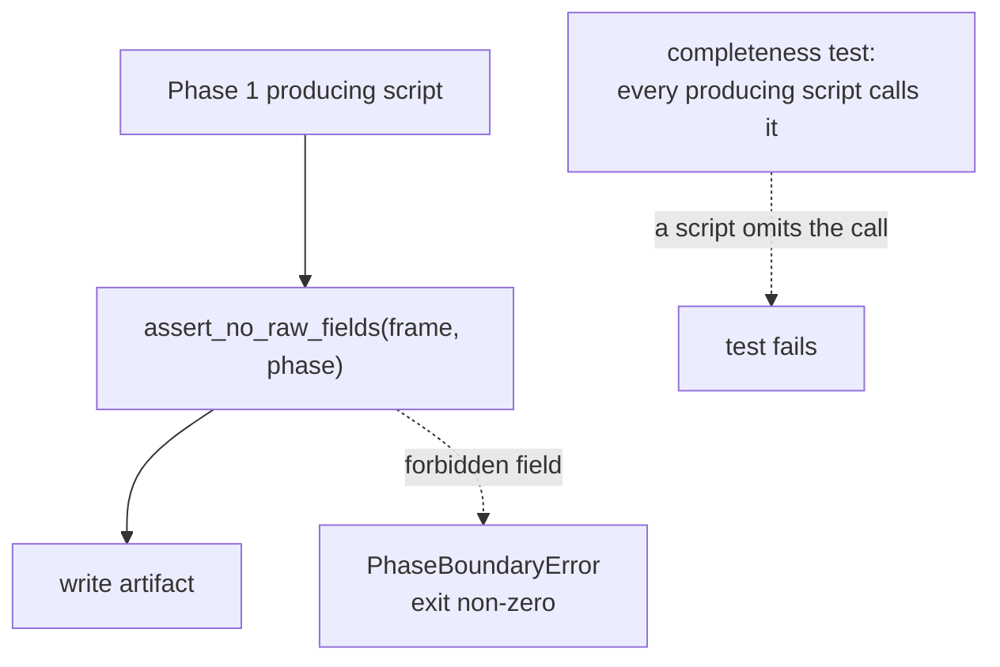
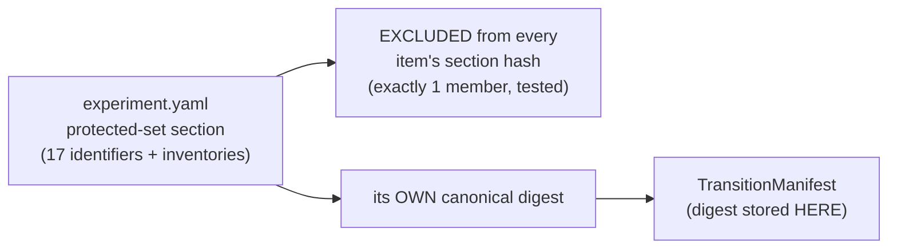
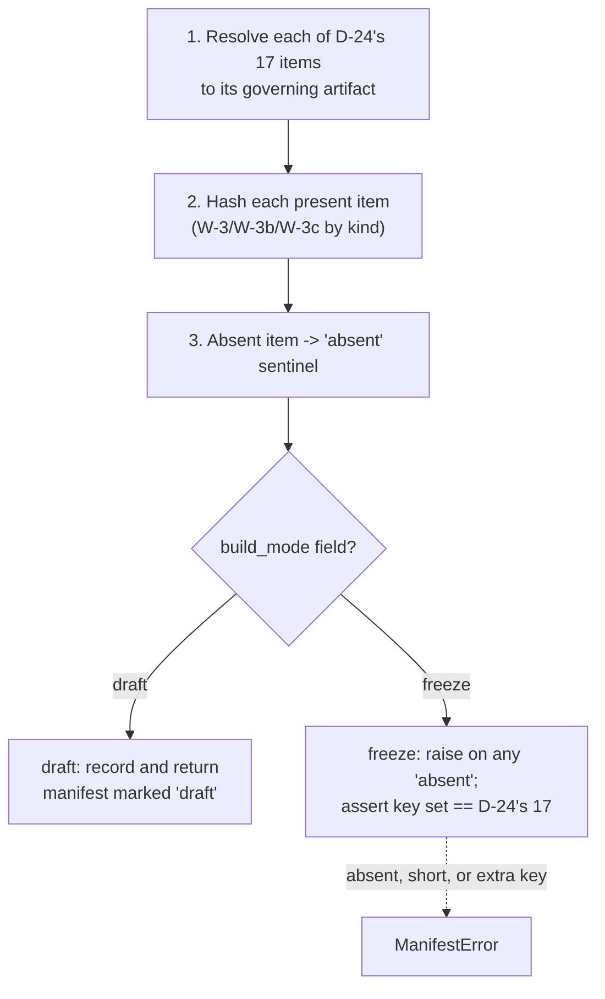
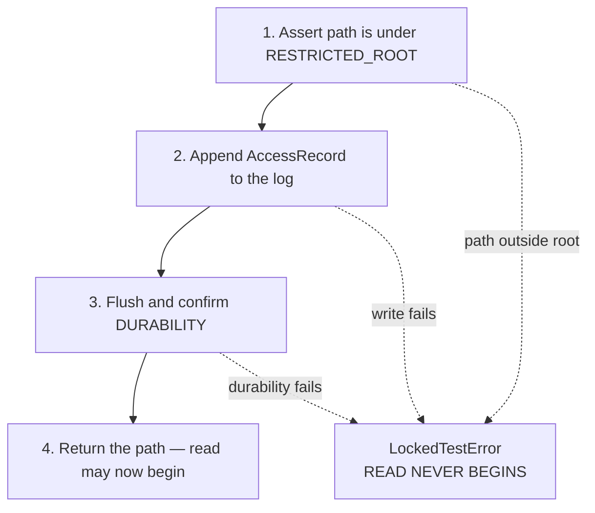

# Business Logic Model — `governance-guards`

**Unit** `governance-guards` (Bolt 2) · **Kind** `library` · **Depends on** `foundation`

> **Re-established a sixth time 2026-08-24**, on a **new stage attempt**: Inception closed
> and Construction opened at 2026-08-24T11:46:26Z, which resets the receipt floor for every
> unit. **No content of this unit changed.** `foundation`'s amendment pass of the same day
> (`governance/CHANGE_RECORD_2026-08-24_foundation_amendments.md`) was checked against this
> unit and touches nothing it cites: **A** was declined so no count propagated; **B** amended
> `DeterminismRecord`, a `foundation` contract; **C** amended `services.md` § Run record and
> registry and `unit-of-work.md` § 1, while this unit reads § Stage entry contract, § The nine
> stage scripts, § Execution platforms and § 2. The change record's own sweep reaches the same
> conclusion independently. **The READY verdict in § Review belongs to the previous attempt**
> (iteration 2, 2026-08-22); a fresh pass under this attempt follows.

> **Re-established a fifth time 2026-08-23**, after a redo aimed at four stale
> cross-references in `target-standardization`'s question file. **No content of this unit
> changed** — though the correction concerned **this unit's R-20**, which a sibling had been
> attributing to `inventory-and-registry`.

> **Re-established 2026-08-23 after a stage-wide redo jump**, which reset the receipt floor
> for every unit of this stage. **No content of this unit changed at re-establishment.**
> What the jump also does here: it **resets this unit's exhausted adversarial reviewer
> budget**, so the artifacts regenerated against the nine-question set — previously
> disclosed as unreviewed because the 2-iteration budget had been spent on the prior issue —
> receive a fresh pass. See § Review.
>
> **That pass has since run and returned READY** (iteration 2), after a Critical arithmetic
> slip in § W-3a was corrected — the printed proof summed to **15** where it asserted 17.
> **Re-established a second time 2026-08-23** after a further stage-wide redo aimed at
> `external-products`; **no content of this unit changed on that occasion.** **A third
> re-establishment** followed a redo aimed at a misread depth policy in
> `component-methods.md`; **no content changed then either.** **A fourth** followed a sweep
> of two sibling question files; **no content changed then either.**

The workflows this unit implements: the phase-boundary prohibition checked at every
stage entry, the Phase 1 → Phase 2 transition manifest, the single guarded path into
the locked December root, and the §10.1 reuse register.

**No workflow here computes a scientific quantity.** This unit refuses, records and
hashes. The 17 protected items are frozen by **D-24**; this stage does not reopen
them.

## Sources

- `../../../inception/units-generation/unit-of-work.md` § 2 — `Owns`, boundary, the 10 requirements, BLK-06, BLK-07, ADR-02 and ADR-03.
- `../../../inception/units-generation/unit-of-work-story-map.md` — Tables 1 and 2 plus § Per-unit coverage summary; both derivation paths agree. Table 2 also records `RES-01`.
- `../../../inception/requirements-analysis/requirements.md` — REQ-ENG-5; FR-P1-02-6; FR-P1-03-2; FR-P1-05-12; FR-P1-06-1…-4; NFR-PHASE-01; NFR-LIC-01.
- `../../../inception/application-design/component-methods.md` — the approved signatures and raise-contracts.
- `../../../inception/application-design/components.md` and `component-dependency.md` § Shared resources.
- `../../../inception/application-design/services.md` — § Stage entry contract step 4; § The nine stage scripts (the producing-script enumeration in W-2); § Execution platforms (a Kaggle session carries no git working tree).
- `evidence/DECISIONS.md` **D-24** and **D-15**.
- `../../../inception/delivery-planning/bolt-plan.md` § Gate 0 and § Bolt 2 — the `DP-CHAIR-02` ruling, the Definition of Done, and the confidence hypothesis *"that the prohibitions are enforced at run time, not only in tests."*
- `../foundation/functional-design/business-logic-model.md` — W-1's stage entry contract, into which this unit's step 4 fits; R-15 and R-16.
- Workspace inspection, 2026-08-22: `tests/test_phase_boundary.py` (266 lines) and `tests/test_acquisition_window.py`, read directly rather than described from a citation.
- `functional-design-questions.md` (**Q1 through Q9**), `domain-entities.md`, `business-rules.md`.

---

## W-1 — Step 4 of the stage entry contract: the import limb

`foundation`'s W-1 fixes the six ordered steps. **Step 4 is this unit's**, and it runs
between preflight and seeding.

```
INPUT   phase: int, loaded_modules: Mapping[str, object]   (normally sys.modules)
OUTPUT  None
RAISES  PhaseBoundaryError naming the offending module
```

1. Return immediately unless `phase == 1`.
2. Intersect `loaded_modules` with `RAW_MODULES` — **four** names:
   `src.gnss.rinex`, `src.gnss.calibration`, `src.gnss.target`,
   `src.gnss.verification`.
3. On any intersection, **refuse to proceed** and raise, naming the module.

**Why it runs here and not only in tests.** A Kaggle session carries no git working
tree, so a commit hook cannot fire there and a local suite run proves nothing about
the environment the governed run actually executes in (ADR-02). The prohibition has
to hold inside the session. This is the **authoritative** limb — see W-2a for its
relationship to the static scan that already exists.

**Skipped only by `02_build_vtec_target.py`**, which is Phase 2 by definition and
asserts `phase == 2` instead.

**Four modules, not two.** FR-P1-03-2's earlier wording listed `rinex` and
`calibration`; `target.py` and `verification.py` are raw-processing adapters added per
finding `IMPL-2`, and `tests/test_phase_boundary.py` already encodes all four.

## W-2 — The produced-field limb

```
INPUT   frame: DataFrame, phase: int
OUTPUT  None
RAISES  PhaseBoundaryError naming the field
```

Rejects a Phase 1 artifact carrying a **DCB, STEC, mapping, satellite or arc** field.

**Call site (Q7 = D).** Each of the **eight Phase 1 producing stage scripts, before it
writes** — read from `services.md` § The nine stage scripts:
`00_acquire_prepared_vtec`, `01_inventory_and_registry`,
`02_standardize_prepared_target`, `03_verify_processing`,
`04_build_external_products`, `05_build_features_and_splits`, `06_train_and_predict`,
`07_evaluate_and_report`. (`02_build_vtec_target` is Phase 2 by definition and skips
step 4; `run_walking_skeleton` is the orchestrator.) A **completeness test asserts
every Phase 1 producing script calls it before its first write.**



Text fallback: each producing script calls the field check before writing; a
forbidden field raises and exits non-zero; a separate completeness test fails if any
producing script omits the call.

**Why not inside `foundation`'s release API.** That would put a Phase 1 prohibition
inside the release path and invert the dependency — this unit depends on
`foundation`, never the reverse, and the reverse edge would **close a cycle**.

**Why not only at the manifest build.** That detects the breach after every artifact
is written, and possibly after downstream work consumed the contaminated frame. A
guard that fires at the end is a post-mortem.

**Independence is the requirement.** FR-P1-03-2 wants two independent results;
`component-methods.md` states it flatly — *"neither this nor `assert_phase_boundary`
substitutes for the other."* A test asserts that neither limb passing implies the
other.

## W-2a — The existing static scan, and its declared subordinate role

`tests/test_phase_boundary.py` **already exists** — 266 lines, walking `src/` and
`scripts/` with `ast`, skipping explicitly (never passing vacuously) where the subject
does not exist yet. It is kept, with its role declared (Q7 = D):

| Limb | What it is | Standing |
|---|---|---|
| Static `ast` scan over `src/` and `scripts/` | Early warning — fires before anything executes | **Subordinate.** Does not discharge FR-P1-03-2 |
| `assert_phase_boundary` on `sys.modules` at step 4 | Run-time check inside the executing session | **Authoritative** |
| `assert_no_raw_fields` at each producing script | Run-time check on the artifact about to be written | **Authoritative** |

**Why both rather than either.** A static scan of a local checkout constrains nothing
about a Kaggle session, and a dynamic import assembled from a string is invisible to
`ast` — so static alone defeats the bolt-plan's confidence hypothesis. But retiring a
working guard that fires before execution buys nothing, and would move first detection
of a forbidden import from "any test run" to "the run that would have violated the
boundary."

**The subordinate status is recorded where the code lives** (the Q7 rider):
`tests/test_phase_boundary.py`'s own module docstring states that it is the
early-warning limb and does not discharge the run-time requirement. Stating it only in
a design document is exactly where a future maintainer would miss it and read the
scan's presence as sufficient.

## W-3 — Computing a protected-item digest

```
INPUT   parsed value at the item's authorized granularity, the item's canonical
        YAML path and asserted key inventory
OUTPUT  digest: str   (SHA-256)
```

1. **Parse**, then **canonicalise** with the versioned canonicaliser (Q1 = D as
   amended).
2. **Reconcile the item's asserted key inventory against the parsed governed
   region** — a key added, deleted or renamed in the region but not in the inventory
   **fails**.
3. **Check the declared-overlap rule**: undeclared overlap **rejected**; explicit
   parent-section / child-field overlap **permitted where declared and tested**.
4. **Digest** the canonical form.
5. **Record the canonicaliser identifier and version** in the manifest.

**The canonicalisation contract, fixed here rather than left to the implementer.** It
defines mapping-key ordering, sequence-order treatment, scalar typing and
normalization, Unicode and encoding, **duplicate-key rejection**, alias and merge-key
handling, and rejection of unsupported or ambiguous values.

**Required behaviour, both directions.** Comments, whitespace, quote style,
mapping-key order and **workspace relocation** must **not** change a digest —
`foundation` R-16 forbids machine paths in any governed config, so a relocation that
moved a hash would be a defect. A governed **value** change **must** change it.

**Three granularities, not one** (derived from D-24's Hashable-representation
column, printed before being asserted):

| Granularity | Items | Count |
|---|---|---|
| Whole-file config hash | 12 (`configs/seeds.yaml`) | 1 |
| Config-**section** hash | 4, 7, 9, 11, 14, 16 — plus 13 as `Source + config-section hash` | 7 |
| Config-**field** hash | 5, 6 | 2 |

**Item 12 keeps its approved whole-file semantics.** If applying semantic YAML
canonicalisation to the whole-file hash would change D-24's meaning, that is **raised
as a governed amendment**, never assumed by the implementer.

**Why canonical rather than byte-literal.** A byte digest changes on a comment edit, a
key reorder or a whitespace fix — none of which alters a governed value. G-P3C would
then fail on formatting, indistinguishably from a real protected-value change, and a
gate that cries wolf stops being read. Byte-literal also cannot express items 5 and 6
at all, which by itself rules it out.

**Why the canonicaliser is versioned.** Changing *how* you canonicalise changes every
digest, so the canonicaliser is part of the frozen contract rather than an
implementation detail.

> **CORRECTION retained, 2026-08-22 — the first issue said "Eight … items 4, 5, 6, 7,
> 9, 11, 14, 16", and an adversarial review caught it.** Items **5** and **6** are
> typed **`Field hash`** in D-24, a *different* mechanism, and the first issue
> silently folded them into this section-and-inventory procedure. Derived rather than
> counted:
>
> ```
> awk '/^\| # \| Protected item/,/^\*\*Item 17/' evidence/DECISIONS.md \
>   | awk -F'|' 'NF>4 && $2 ~ /[0-9]/ && $5 ~ /Config-section hash/ {print $2}'
>   ->  4 7 9 11 14 16          (6 items)
>
> ... $5 ~ /Field hash/         ->  5 6   (2 items)
> ```
>
> **The review's finding understated the gap, and the wider version is recorded
> here.** D-24 uses **six distinct hashable-representation kinds** across the 17
> items; the first issue defined **one** and assumed it covered eight. The full
> taxonomy is W-3a below.

## W-3a — The six hashable-representation kinds, and which items use each

Derived from D-24's table, all 17 items accounted for.

**Two independent axes, kept separate** — *what* is digested, and *who* computes it.
Conflating them is what let a mechanism go missing twice.

### Axis 1 — the digest kinds this unit computes

| Kind | Items | Computation fixed by this stage |
|---|---|---|
| **Config-section hash** | 4, 7, 9, 11, 14, 16 | W-3: canonicalise the parsed section, reconcile the key inventory, check declared overlap, digest |
| **Field hash** | 5, 6 | W-3b — named field set (literals and patterns), non-empty assertion, same canonicaliser |
| **Parameter hash** | the second half of 15 | W-3c — a **named-parameter** digest, sibling of the field hash. **Not** a config-section hash and **not** a whole-file config hash |
| **Config hash** (whole file) | 12 | Canonicalise the entire parsed file — same canonicaliser, no section scoping and no inventory, because the whole file *is* the scope (`configs/seeds.yaml`). **Approved semantics preserved**; a meaning-changing canonicalisation is raised, not assumed |
| **Source-file content hash** | 1, and the source half of 13, 15, 17 | Digest of the source bytes of every module in scope, with the module set **enumerated rather than globbed at hash time** |

### Axis 2 — the three composites, each with a DIFFERENT second half

D-24 labels them separately, and the labels are not interchangeable:

| Item | D-24's label, verbatim | Source half | Second half | Defined by |
|---|---|---|---|---|
| **13** | `Source + config-section hash` | `src/evaluation/metrics.py` | **config-section** hash | W-3 |
| **15** | `Source + parameter hash` | `src/evaluation/bootstrap.py` | **parameter** hash | **W-3c** |
| **17** | `Source + config hash of every listed method` | each listed method's module | **config hash, per listed method** | ⚠ see § Open below |

Each composite is a digest over the **ordered pair** (source digest, second-half
digest), combined in a **versioned, domain-separated representation** — Q1's owner
amendment 4, which names item 13 specifically and applies by construction to the other
two. Domain separation is what stops a boundary shift between the two halves producing
a colliding pair; a change on either side moves the composite.

### Axis 3 — four items this unit RECORDS rather than computes

| Item | Digest | Produced by |
|---|---|---|
| 2 | Serialized-architecture hash | `models-and-baselines` |
| 3 | Environment hash (TE §13.1) | `foundation` |
| 8 | Fold, embargo and comparison-mask manifest hashes | `features-and-splits` |
| 10 | Selected-value hash from the run record | `models-and-baselines` |

**Why this axis matters.** Four of the 17 protected items are **not this unit's to
compute** — it records a digest another unit produced, which makes the manifest's
integrity partly dependent on three other units. That is a real property of the design,
stated rather than hidden. It introduces **no dependency edge**:
`build_transition_manifest` receives artifact paths as a **parameter**, so this unit
never imports a downstream one and stays a DAG root.

**All 17 items appear exactly once across Axis 1 and Axis 3**, with Axis 2 decomposing
the three composites rather than adding items:

| Category | Items | Count |
|---|---|---|
| Config-section hash | 4, 7, 9, 11, 14, 16 | 6 |
| Field hash | 5, 6 | 2 |
| Config hash (whole file) | 12 | 1 |
| Source-file content hash | 1 | 1 |
| Composites (source + a second half) | 13, 15, 17 | **3** |
| Externally supplied (recorded, not computed) | 2, 3, 8, 10 | 4 |
| **Total** | **1…17, each once** | **17** |

**6 + 2 + 1 + 1 + 3 + 4 = 17.**

> **Corrected 2026-08-23 after the first adversarial pass on this regenerated issue.**
> Superseded text, preserved: *"6 + 2 + 1 + 1 + 1 (config-section, field, config, source,
> and the three composites counted once each) + 4 recorded = 17."* **That sums to 15.** The
> composite term was printed as `1` where the parenthetical itself says *three*. The
> partition it describes was and is correct — verified item by item against D-24's
> Hashable-representation column, and consistent with the equivalent tables in
> `domain-entities.md` § 1 and `business-rules.md` R-18. **Only the printed arithmetic was
> wrong**, directly beneath a heading claiming the taxonomy was derived rather than carried
> from prose. It is now shown as a table whose column sums rather than as a sentence,
> because a sentence is where the previous two miscounts in this same passage also lived.

## W-3b — The field-hash contract (items 5 and 6)

D-24 types items 5 and 6 as **`Field hash`**, scoped to named fields rather than a
section. Same canonicaliser as W-3, narrower scope, plus a per-item assertion D-24
states verbatim.

```
INPUT   parsed config, the item's named field set (literal names and/or patterns)
OUTPUT  digest: str
```

1. Resolve the named field set — **literal names and declared patterns**, expanded
   against the parsed config.
2. **Assert the resolved set is non-empty.** A pattern matching nothing must fail; a
   field hash over zero fields is a digest of nothing that would pass every diff.
3. Canonicalise the resolved `name → value` pairs with the **same canonicaliser** as
   W-3, so the versioning argument carries over unchanged.
4. Digest.
5. Apply the item's own assertion.

| Item | Governing artifact | Field set | D-24's additional assertion, quoted |
|---|---|---|---|
| **5** History window | `configs/experiment.yaml` | the history-window field | *"frozen at 24 h and absent from every grid"* |
| **6** Station encoding | `configs/features.yaml` | `station_onehot_*` plus `station_lat` | *"`station_onehot_*` plus verified `station_lat`"* |

**Item 5's assertion has two limbs and both are checkable here**: the value is the
frozen 24 h, **and** the field appears in **no grid**. The second limb is what stops
the history window being tuned — `project.md` § Forbidden makes a tuned window a
defect.

**Item 5 is also the declared parent/child overlap case.** Item 9 hashes the Grids
section of the same file and item 5 hashes a field governed alongside it; under Q1's
owner amendment 3 that overlap is **permitted because declared and tested**, not
rejected — and the test is what stops a change being hidden in the parent or
ambiguously attributed between the two.

**Item 6's "verified" is deliberately NOT this unit's verification.** This unit hashes
`station_lat`; **whether it is verified is `inventory-and-registry`'s**, whose
`assert_registry_resolved` blocks `station_lat` when the registry is unresolved or a
conflict was averaged. Recorded so the word "verified" in D-24 is not read as an
obligation landing here — this unit's assertion is that the field is **present and
hashed**, not that its value has been validated against the IGS site logs.

## W-3c — The parameter-hash contract (the second half of item 15)

D-24 types item 15 as **`Source + parameter hash`** and names the parameters verbatim:
*"24-hour vector blocks, 10,000 replicates, seed 20221201."* Governing artifacts:
`src/evaluation/bootstrap.py` + `configs/seeds.yaml`.

A **parameter hash** is a sibling of the field hash — a digest over an explicitly
named parameter set, using the **same canonicaliser** — with two differences that
matter:

1. **Its parameters may span more than one governing artifact.** The seed lives in
   `configs/seeds.yaml`; the block width and replicate count are bootstrap parameters.
   A field hash is scoped to one file; a parameter hash is scoped to a **named set
   wherever those names resolve**, and the resolution is recorded.
2. **Every named parameter must resolve, and the resolved set must be complete.** A
   parameter hash over two of three parameters is a digest that passes every diff
   while leaving one unprotected.

**Why this cannot be folded into the config path.** `TC-19` is `binding: hard` on
exactly these values — 24-hour blocks carrying all three stations together, 10,000
replicates, seed 20221201 — and `project.md` § Forbidden bars substituting a
within-station or naive bootstrap. Hashing "whatever is in the seeds file" would not
protect the block construction or the replicate count at all.

> **Corrected 2026-08-22 after the final adversarial pass.** The previous version of
> W-3a listed item 15 under "Composite source + config" with its second half
> *"computed by its own kind above"* — but **no parameter-hash kind existed above**.
> That silently folded a fourth mechanism into a generic bucket, which is the same
> defect class as the original eight-versus-six miscount, on a `TC-19` hard-binding
> item feeding the G-P3C pass condition.

> **What remains PENDING, unchanged.** The *kinds* above are fixed by this stage. The
> **per-item binding to concrete config fields and file paths is still BLK-06's open
> limb** — no config file or `src/` package exists, so item 5's field name, item 6's
> pattern, item 15's parameter names, and every section boundary are named by D-24 but
> not yet resolvable against a real artifact. The per-item boundary table is stated in
> `business-rules.md` R-18 § Per-item boundaries as the binding evidence, and is
> **verified mechanically against D-24 before G-P3C**. **BLK-06 is not closed by this
> stage.**

## Open — item 17's "config hash" label, raised not resolved

D-24 types item 12 as **`Config hash`** (the whole of `configs/seeds.yaml`) and item
17 as **`Source + config hash of every listed method`**. **The same two words carry a
different scope**: item 12's is one whole file; item 17's is *per listed method*
across five enumerated methods (M-01 persistence, M-02 24-hour seasonal persistence,
M-03 station×month×hour climatology, B-01 the IRI-2016 benchmark with its 2000 km
altitude ceiling, C-01 the CODE final GIM comparator).

**Whether item 17's per-method config scope is a whole file, a section, or a named
parameter set is not stated by D-24, and is not invented here.** The label appears to
be inherited from D-24 rather than introduced by this stage, so correcting it would be
an amendment to an approved decision record rather than a design choice. Reusing item
12's whole-file mechanism verbatim would make all five baselines' config-hash
components identical regardless of which one changed, which cannot be the intent.

**Consequence if left open:** item 17 is the one protected item whose second-half
scope a builder would have to guess. **Raised at this stage's approval gate — not
resolved by preference.**

## W-4 — The protected-set mapping, its exclusion, and its own digest

**One structure**: a governed mapping from **protected-item identifier → the canonical
YAML paths that item covers**. Its 17 keys are D-24's identifiers; its values are the
asserted key inventories W-3 reconciles.

**Location** `configs/experiment.yaml`. **The section holding it is EXCLUDED from
every item's section hash, and the exclusion list has exactly one member** (Q3 = D).



Text fallback: the protected-set section is excluded from every item's section hash,
and the exclusion list is tested to have exactly one member; separately, the section
carries its own canonical digest, which is stored in the transition manifest rather
than back inside the section.

**Both limbs of the exclusion test carry the rule.** That the exclusion exists, **and**
that no other section is excluded. An unbounded exclusion mechanism is a hole, not a
resolution: whatever the first exclusion is for, the mechanism granting it can grant a
second one silently.

**The excluded section is not therefore unprotected.** It carries its own digest,
computed by the same canonicaliser and stored externally in the manifest, so a change
to the enumeration or to any per-item inventory still surfaces as a manifest
difference. A change to the protected-set enumeration is a governed change requiring a
Vision §15.2 amendment and a D-number, so surfacing it is the required behaviour.

> ## ⚠ THIS WORKFLOW REVERSES A RECORDED OWNER REFUSAL
>
> The previous question set's Question 3 was answered **B, modified — MODIFY, not
> approval**, and directed that the complete list be hashed and **"must not be
> excluded from hashing merely to avoid circularity. Excluding it would leave the
> enumeration that defines what is protected as the one thing unprotected."** The
> full superseded ruling is preserved verbatim in `business-rules.md` R-19.
>
> The reversal rests on an **explicit decision by the project decision owner**, taken
> 2026-08-23 after the conflict was put to them with the superseded ruling quoted —
> **not on a new argument.** The superseded reasoning is not answered, and the
> external-digest constraint above is the mitigation it demands, stated as mandatory
> rather than optional.

**Mutation contract** — the six behaviours `business-rules.md` R-20 tests: deletion
and addition change the digest and fail the membership assertion; **duplication is
rejected** because D-24's cardinality of 17 is calculated from its enumeration, and
the canonicaliser rejects duplicate keys independently; semantically irrelevant
**reordering leaves the digest unchanged**; renaming changes the digest and fails
membership; and the frozen manifest holds **exactly** the 17-item set.

## W-5 — Building the transition manifest

```
INPUT   snapshot: ConfigSnapshot, artifacts: Mapping[str, Path]
        (mode channel: see the amendment note below — the approved signature carries no mode parameter)
OUTPUT  TransitionManifest
RAISES  ManifestError — a freeze-mode build with an absent item, or a key set != D-24's 17
```



Text fallback: resolve all 17 items, hash those present by their kind, mark absent
ones with a sentinel, then branch on the build mode — draft records and returns a
manifest explicitly marked draft; freeze raises on any absent item and asserts the key
set equals D-24's 17 exactly.

**The build mode is a FIELD of `TransitionManifest`**, not a build-time argument, so
it survives serialization and a draft can never be mistaken for a freeze by a later
reader or by `diff_protected_hashes` (Q2 = D's rider).

> **How the builder learns the mode — reconciled 2026-08-25 on adversarial finding 2 of the
> post-reset pass, which was Major.** W-5's INPUT block declared `mode: draft|freeze` as a
> parameter while three statements across the artifacts say the mode is *"not a build-time
> argument"* — and the approved signature (`component-methods.md`:
> `build_transition_manifest(snapshot, *, artifacts)`) **carries no mode parameter at all**, so
> read literally nothing told the builder which mode to build, and inferring it is the
> draft-mistaken-for-freeze hazard Q2's rider exists to close. **Reconciled without changing the
> approved contract by assertion**, following `foundation`'s `write_release` precedent: the
> INPUT block above now matches the approved two-parameter signature, and **an amendment need on
> `build_transition_manifest` — adding a keyword `mode: Literal["draft","freeze"]` — is
> recorded as an OPEN item in § Assumptions for the owner's decision.** Until it is ruled on, the
> mode has no sanctioned channel and stage 3.5 must stop and report rather than invent one
> (TE §18.3). What IS settled: the semantics of each mode (draft records and returns, marked;
> freeze raises on any absent item and asserts D-24's key set), and that the **persisted** mode
> lives in the dataclass field, which is what Q2=D's rider protects.

**The freeze assertion has three limbs**: no missing key, no extra key, **and no
`absent` value**. Without the third, a manifest with 17 keys of which sixteen are
`absent` would satisfy a membership check while protecting almost nothing.

**Why draft mode exists.** All 17 governing artifacts are absent today — no config
file, no `src/` package, no run record. Under a raise-always rule the manifest could
not be built, tested or demonstrated until the final Bolt, and a mechanism first run at
a freeze gate is a mechanism first debugged at a freeze gate. This project's affirmed
posture is that reproducibility is executable, not asserted.

**The membership assertion is what `component-methods.md` already demands** — the key
list is asserted equal to the canonical set *"so a short list cannot pass silently."*

**Also recorded in the manifest**: the canonicaliser identifier and version (W-3), and
the protected-set section's own digest (W-4).

## W-6 — `diff_protected_hashes` and the G-P3C pass condition

```
INPUT   frozen: TransitionManifest, current: TransitionManifest
OUTPUT  Mapping[str, tuple[str, str]]   — differing keys with both values
```

An **empty mapping is the G-P3C pass condition**: no protected item changed.

**Ordering that matters.** The membership assertion runs **before** any diff, so a
manifest missing an item fails rather than producing a reassuring empty diff.

> ## ⚠ AN EMPTY DIFF IS NOT YET PROOF
>
> **BLK-06's enumeration limb is RESOLVED by D-24 at 17 items. Its per-item binding to
> concrete config fields and file paths is PENDING**, and no config file or `src/`
> package exists yet.
>
> Until that binding is discharged **and approved**, an empty diff **must not be read
> as proof that no protected item changed**, and no artifact, manifest or report from
> this unit may state or imply otherwise.
>
> `component-methods.md`'s standing caution is **half-discharged, not retired**. Three
> approved artifacts — `component-methods.md`'s `TransitionManifest` comment,
> `unit-of-work.md` § 2 and `components.md` line 61 — still describe the enumeration as
> deferred to stage 3.1, which D-24 has since resolved. They are **reported at the
> gate, not edited.**

## W-7 — A guarded read of the locked December root

```
INPUT   path: Path, record: AccessRecord, registry: Path
OUTPUT  Path   (only after the log is durable)
RAISES  LockedTestError — path outside RESTRICTED_ROOT, or log write / durability failure
```



Text fallback: assert the path is under the restricted root, append the access record,
flush and confirm durability, and only then return the path. A path outside the root, a
failed write, or a failed durability confirmation all raise and the read never begins.

> **The access-log append must be DURABLY COMPLETED before the December read
> begins.** A log-write failure **or** a durability failure **prevents the read** —
> not reported alongside it, not retried after it, not logged as a warning while the
> read proceeds.

**Step 1 exists to keep the guard honest**: `path` outside `RESTRICTED_ROOT` raises,
because callers must not route ordinary reads through the guard and dilute what a log
row means.

**Why ordering is the requirement.** `VAL-2` and FR-P1-02-3: **an access recorded
after the fact fails the ordering check rather than satisfying it.** An unlogged read
of the locked month cannot be undone once taken.

**Two limbs, two tests, both owned by this unit (Q6 = C).** Patch the log writer to
fail → the read never happens. Assert the row is durable on disk before the read is
attempted — which distinguishes this contract from one that logs and reads in the same
buffered transaction, where a crash loses the row and keeps the read. Neither test
needs `tests/test_locked_test_guard.py`, which ADR-03 assigns to `features-and-splits`
to keep this unit a DAG root.

> ## ⚠ `RES-01` — THE PERMITTED READ IS STILL UNTESTED, AND STAYS OPEN
>
> Story-map Table 2 records `RES-01`: **permitted-read access logging is NOT
> TESTED**, with its candidate §19 criterion owned by **stage 3.2** under Vision
> §15.2. Q6's option D would have closed it here with a positive-path test for the
> permitted pre-G-05 coverage read — against a **synthetic** restricted root, not the
> real audit. That was declined deliberately: the evidence would look like coverage of
> the real audit and would not be. **Raised at this stage's gate as still open, not
> absorbed here.**

**Context.** The log already holds **five retrospective rows** predating this guard
(`evidence/experiment_registry.md` rows 3, 4, 5, 8, 9). Two kinds of row coexist, and
the distinction lives in the register explicitly rather than being inferred from
ordering.

## W-8 — What counts as a December hit

**Rule (Q5 = D).** A hit is a December 2022 **target value**, or a December-derived
**target aggregate** — a count *about* December carrying no target value, such as
`madrigal_coverage_summary.csv`'s `december_days_present` and
`december_coverage_pct`.

**Why the aggregate channel is included.** `project.md` § Forbidden bars December from
informing model selection, feature selection, thresholds or hyperparameters, with the
trigger being December being **seen**, not the lock being opened. A December coverage
figure in an unrestricted summary is December being seen with no access-log row.

**Why December-dated driver captures are excluded, and how the exclusion is bounded.**
The live instance is
`evidence/audit_ec1_2026-08-15/kyoto_dst/dst_provisional_202212.html` — hourly Dst for
December 2022, whose observation date falls in December and which is not a target
value. Dst is diagnostic/hindcast-only and never a confirmatory ML feature, so
sweeping it into locked-test custody would route every ordinary Dst read through
`open_restricted` and buy nothing the lock exists for. The exclusion is a **recorded
list naming the driver classes and why**, with **its membership pinned by test** — and
that is the limb that matters: **a target file mislabelled as a driver is
detectable**, because a reviewer checks an enumerated list rather than an unstated
omission.

**The tension this resolves, stated rather than smoothed over.** FR-P1-02-6's first
sentence says *"Any file containing a December 2022 target value is a locked-test
artifact"*; its criterion says *"a record whose observation date falls in December
2022."* Those two sentences do not pick out the same set, and the driver capture is
the difference. The owner's earlier direction said *"content scan on observation
dates"*, which reads toward the literal criterion; the owner was shown that tension on
2026-08-23 and **confirmed the narrower target-plus-aggregate reading with the bounded
driver exclusion.**

## W-8a — Scanning for December-bearing artifacts outside the restricted root

```
INPUT   evidence_root: Path
OUTPUT  Sequence[Path]   — empty is the pass condition
RAISES  EvidenceScanError — a file no declared parser handles, with no recorded exclusion
```

1. Walk `evidence/` **recursively**.
2. For **every file**, dispatch to the **declared parser for its artifact class** and
   inspect **observation dates** — never the filename or directory name.
3. A file that **cannot be parsed** by any declared parser is a **failure**, not a
   pass, unless it carries an **explicit recorded exclusion**.
4. Apply W-8's hit definition and the driver-exclusion list.
5. Return every December-bearing artifact found outside the restricted root.

**Why record dates and not names.** `project.md` § Forbidden: *"NEVER derive fold or
partition membership from an acquisition directory name or a filename."* That rule
exists because a year-blind predicate filed locked-month records into
`audit_evidence_2022-01/`, where a name-based check cannot see them.

**Why unparseable means failure.** A file the guard cannot read is exactly where a
December record would hide, so treating it as clean is the one answer that cannot be
defended.

**Why recursive by construction.** `DATA-01` showed a narrowed glob *"silently stopped
checking the artifacts that matter most."*

**What the existing green check actually covers, read from the code.**
`tests/test_acquisition_window.py` sets `RAW_RECORDS = "madrigal_coverage_raw_records.csv"`
and its `_record_csvs_at_any_depth()` helper returns `EVIDENCE_DIR.rglob(RAW_RECORDS)`
minus the restricted root — **one filename, not a content class.** Inventory of
`evidence/` by filename shows 16 instances each of `madrigal_coverage_raw_records.csv`,
`madrigal_coverage_summary.csv`, `madrigal_coverage_monthly.csv`,
`sha256_manifest.json` and `request_manifest.json`; only the first is scanned. Scanned
2026-08-22, every non-zero `december_*` value is already under the restricted root — so
**the check is green and the gap is latent rather than currently breached.** A
December-bearing `madrigal_coverage_summary.csv` appearing outside the restricted root
tomorrow would pass.

**No artifact-class registry is frozen by this stage.** Q4's option D would additionally
assert a declared registry covering every filename present under `evidence/`. It was
**declined with a reason**: it front-loads a registry before any of the artifact classes
it enumerates is produced by this pipeline, and the current 16-instance inventory is all
pre-TC-06 evidence. Failure-on-unknown gives the same protection, arriving as a failure
the first time a new class appears. Adding the registry later is not foreclosed.

**Retained after D-15**, which relocated 21 December-bearing files into the restricted
root — this is the regression guard for that move.

> ## ⚠ FR-P1-02-6 IS EXPLICITLY UNTESTED
>
> This workflow's requirement has **no §16 or §19 acceptance row** — this unit's one
> untested requirement of ten, derived from story-map Table 1 and cross-checked against
> § Per-unit coverage summary. It **is** enforced today, by
> `tests/test_acquisition_window.py::test_locked_month_values_exist_only_under_the_restricted_path`,
> and that test **is** green: lacking an acceptance row is a different thing from
> lacking a test.
>
> On the project decision owner's explicit direction it is preserved as an **explicitly
> untested obligation until an approved acceptance row exists AND its test has
> passed** — both conditions. Everything above is a **test specification only — not an
> approved acceptance row and not evidence of a passing result.** Designing the guard
> does not test it; implementing it does not test it.

## W-9 — Registering reused third-party source

1. **Default: do not copy.** Reimplement the published method from the paper with a
   citation. `project.md` § Forbidden prohibits copying source whose licence is absent,
   ambiguous or incompatible, and that is the rule in force while the AGPLv3 question
   is open. Copying is deliberately harder to reach than reimplementation, because that
   is the policy actually in force.
2. If copying or material adaptation is nonetheless approved, record **all fifteen
   §10.1 fields** **before the code is used** and before **G-P2**.
3. The adapter module carries a mandatory **provenance marker**.
4. The register is **asserted complete** against the set of marked modules; an unmarked
   module is asserted to contain **no reuse**.

**Why the marker.** Without it an unregistered copy is indistinguishable from original
work by inspection, and the completeness assertion has nothing to range over.

**The open governance dependency, stated not resolved.** The AGPLv3
Global-TEC-forecasting repository is the only approved direct-copy source today, and
**whether its repository-distribution obligations permit that copying is a dependency
this project does not settle.**

## W-10 — One path in, and who may use it

**Mechanism (Q9 = D).** A **static check asserts no module outside `locked_test.py`
contains the restricted-root literal.** This generalises `foundation`'s R-15 — the
same grep-class assertion, applied across the whole tree.

**Why absolute.** **D-15** records the restricted root as a **governance boundary, not
an access control** — it holds only while exactly one code path reaches it. A second
path does not weaken it slightly; it ends it.

**Why not a caller allow-list inside the guard.** Q9's option C would have
`open_restricted` raise when its caller is not one of the four recorded consumers. That
closes the run-time-path-assembly gap but couples this root unit to four downstream
units, and the reverse edge would **close the cycle** the DAG was arranged to avoid.
The residual gap — a path assembled at run time from fragments — is left open
deliberately: the static check plus review makes it unlikely, and the acyclic structure
is worth more.

> ## ⚠ BLK-07 IS OPEN, AND IS A PRECONDITION OF BOLT 3
>
> Four units reach the root through this contract: `inventory-and-registry` (pre-G-05
> coverage audit), `acquisition` (the D-9 input and any December re-acquisition — the
> unrecorded routing that **is** BLK-07), `features-and-splits` (locked partition),
> `evaluation-and-comparison` (locked evaluation).
>
> **The static check has a live consequence, stated now rather than discovered later:**
> `acquisition` **cannot hold its own path** to `audit_evidence_2022-FULL/` once the
> check exists, because D-15 relocated that artifact under the restricted root.
> **BLK-07's resolution is a precondition of Bolt 3, not a formality.**
>
> **Acceptance of this mechanism is NOT authorization to open locked December data.**
> The static check enforces **how many** paths exist, never **who** may use one. Which
> units are authorised to reach the locked month is a decision the **project decision
> owner receives and approves**, and nothing here grants, implies or substitutes for
> it. **No acquisition run may touch calendar 2022-12 while BLK-07 stands.**

## W-11 — What Bolt 2 builds, and what it must not

**Permitted before G-09**, per `bolt-plan.md` § Gate 0: module structure, interfaces,
placeholder CLI definitions, configuration wiring, safe fail-fast behaviour, and the
`tests/` scaffolding for this unit.

**Barred until G-09 is signed for the affected component**: implementing any component
whose P0 decision is unresolved; filling any `TBD — freeze gate` field; executing any
governed run; generating code for a unit carrying an open blocker on that scope.

> **`src/data/phase_contract.py`, `src/data/locked_test.py` and
> `src/data/reuse_registry.py` DO NOT EXIST.** BLK-01 closed 2026-08-22 under
> `CR-2026-08-22-TE-AMEND` granting **authority only**. Authority to name a module is
> not authority to write one; creation stays gated by **G-09**, TE §18.3's
> stop-and-report rule, and stage **3.5**.

**No December access of any kind occurs in this Bolt.** The guard is designed here; it
is not exercised against the locked month.

---

## Requirement-to-workflow map

Acceptance derived from story-map Table 1; owners from Table 2's `primary` cell. Both
paths cross-checked and in agreement.

| Requirement | Workflow | Tested by (Table 1) | Row primary owner |
|---|---|---|---|
| REQ-ENG-5 | W-1, W-2, W-2a, W-5 | WS-10, TA-07, TA-08, TA-12, TA-27 | `features-and-splits` ×3; `models-and-baselines`; **`governance-guards`** |
| **FR-P1-02-6** | W-8, W-8a | ⚠ **NO CURRENT ACCEPTANCE ROW** | — |
| FR-P1-03-2 | W-1, W-2, W-2a | TA-27 | `governance-guards` |
| FR-P1-05-12 | W-7 | WS-18, TA-18 | `features-and-splits` |
| FR-P1-06-1 | W-4, W-5 | TA-27 | `governance-guards` |
| FR-P1-06-2 | W-5 | TA-27 | `governance-guards` |
| FR-P1-06-3 | W-5, W-6 | TA-28 | `governance-guards` |
| FR-P1-06-4 | W-5, W-6 | TA-28 | `governance-guards` |
| NFR-PHASE-01 | W-1, W-2, W-2a, W-5 | TA-27 | `governance-guards` |
| NFR-LIC-01 | W-9 | TA-28 | `governance-guards` |

**10 requirements, 1 without an acceptance row.** **Owns** TA-27 and TA-28;
**supports** TA-07, TA-18 and WS-18. Three relations, three sets, each derived.

## Assumptions & Open Questions

- **OPEN — an amendment need on `build_transition_manifest`** *(added 2026-08-25 on adversarial finding 2 of the post-reset pass)*: the approved signature carries no mode parameter, three artifact statements correctly say the mode is not a build-time argument, yet the builder must be told which mode to build. The reconciliation (W-5) records an amendment need — a keyword `mode: Literal["draft","freeze"]` — for the owner, following `foundation`'s `write_release` precedent. Until ruled on, 3.5 must stop and report rather than invent the channel (TE §18.3).
- **[assumption]** Rule IDs continue `foundation`'s sequence, so `business-rules.md` opens at **R-18**. If per-unit numbering was intended, say so at the gate.
- **[assumption]** `tests/test_locked_test_guard.py` is not this unit's — ADR-03 splits the guard, and `features-and-splits` owns the test covering both limbs to keep this unit a DAG root.
- **[assumption]** `RAW_MODULES` names four `gnss` modules — `rinex`, `calibration`, `target`, `verification`.
- **[assumption]** NFR-PHASE-01's transition-manifest hash-diff test has no §12 module and needs frozen artifacts from every later unit; carried on `fixtures-and-reproducibility` with this unit supporting.
- **[assumption]** TA-27's second limb (Phase 2 cannot change protected forecasting hashes) is accepted at G-P2 and G-P3C, outside Phase 1.
- **[assumption]** `frontend-components.md` is not produced — `kind: library`, mapped to `[ui]` only.
- **[assumption]** `build_mode` is fixed as a `TransitionManifest` field. Whether `canonicaliser_version` is a new field or an entry in an existing mapping is a stage 3.5 shaping decision, so **no approved dataclass contract is otherwise changed.**
- **Open — W-4 reverses a recorded owner refusal on the owner's explicit decision**, not on a new argument. The superseded ruling is preserved verbatim in `business-rules.md` R-19, and the external-digest constraint is the mitigation its reasoning demands. Raised at the gate.
- **Open — where the D-24 conformance test gets its list.** It must assert against the **authority**, not only the config, or config and manifest can agree while both drift. Hardcoding is a fourth copy of a governed enumeration; parsing `evidence/DECISIONS.md` makes a governance prose document a test dependency, which Q3 option C was rejected for. **No third option invented.** Raised at the gate.
- **Open — BLK-06's per-item binding.** Enumeration resolved by D-24 at 17; binding **PENDING**. W-6 states the consequence; `business-rules.md` R-18 § Per-item boundaries is the binding evidence, verified mechanically against D-24 before G-P3C.
- **Open — BLK-07 authorization**, a precondition of Bolt 3. See W-10.
- **Open — `RES-01`**, permitted-read access logging is NOT TESTED. See W-7.
- **Open — item 17's per-method "config hash" scope.** See § Open above.
- **Open — a stale statement in three approved artifacts, reported not edited.** `component-methods.md`, `unit-of-work.md` § 2 and `components.md` line 61 all still describe the enumeration as deferred to stage 3.1, which D-24 resolved at 17 items; `bolt-plan.md` § Bolt 2 already reflects the resolution. Per `CHANGE_RECORD_PROCEDURE.md` a sweep reports on approved-stage artifacts and does not edit them absent owner approval for annotate-in-place.
- **Open — the AGPLv3 distribution question.** Unresolved; reimplementation with a citation is the standing default.
- **G-09 is not signed.** No workflow here authorises creating any module.
- **None** of the above adopts a reading on a supervisor-owned value, and none decides a scientific constant.

## Review

**Verdict:** READY
**Reviewer:** aidlc-architecture-reviewer-agent
**Date:** 2026-08-22T22:01:04Z
**Iteration:** 2 (final)

### Disposition of iteration-1 findings

| # | Finding | Disposition | How verified |
|---|---|---|---|
| 1 | § W-3a's printed arithmetic `6+2+1+1+1(...)+4=17` summed to 15, not 17 (composite term printed as 1 where the parenthetical said "three"). | **RESOLVED.** The sentence was replaced with a table (lines 262–271) whose rows are Config-section hash (4,7,9,11,14,16 = 6), Field hash (5,6 = 2), Config hash whole-file (12 = 1), Source-file content hash (1 = 1), Composites (13,15,17 = **3**), Externally supplied (2,3,8,10 = 4), Total = 17, followed by the explicit sum `6 + 2 + 1 + 1 + 3 + 4 = 17`, which is arithmetically correct. | Re-derived the item lists independently against `evidence/DECISIONS.md` D-24's Hashable-representation column via `awk` (same pattern the artifact itself uses): Config-section → `4 7 9 11 14 16`; Field hash → `5 6`; Config hash → `12`; Source-file content → `1`; the three `Source + ...` composites → `13 15 17`; the four items D-24 assigns to another unit's producing path → `2 3 8 10`. Union of all six lists is exactly `{1..17}` with no duplicate and no gap — every item in the new table matches D-24 item-for-item. Summed the table column by hand: 6+2+1+1+3+4=17. |

### New findings (this iteration)

None survived verification.

### Failed refutation attempts

- **Re-verified the reconciled sum is not merely locally consistent but matches D-24 directly**, rather than trusting the artifact's own restated categories. Pulled D-24's table fresh with `awk '/^\| # \| Protected item/,/^\*\*Item 17/' evidence/DECISIONS.md` and hand-classified all 17 rows by their "Hashable representation" column. Result matches the artifact's table exactly, including the four "recorded, not computed" items (2, 3, 8, 10) whose producing units — `models-and-baselines`, `foundation`, `features-and-splits`, `models-and-baselines` — match Axis 3's table in § W-3a and domain-entities.md line 137.
- **Attempted to find a defect introduced by the correction one level down** (the project's documented repeat failure mode: a correction pass introducing a fresh error). Compared the new W-3a category table against: (a) W-3's own three-granularity table (lines 170–174, a *different*, narrower axis — config-only granularities, 10 items, not all 17 — and confirmed it is not meant to sum to 17, so it is not a competing claim); (b) `domain-entities.md` § 1's seven-row kind table (lines 129–137, which additionally splits out "Parameter hash" as its own row rather than folding it under composites, but its item lists — 4,7,9,11,14,16 / 5,6 / 12 / 1 / 15's second half / 13,15,17 / 2,3,8,10 — are all consistent with W-3a's, just partitioned one level finer); (c) `business-rules.md` R-18's three-granularity table (lines 57–61, matching W-3's granularity table verbatim: whole-file=1, config-section=7 including 13, config-field=2) and its § Per-item boundaries table (lines 179–197, all 17 rows present, each item's granularity label agreeing with W-3a). No inconsistency found across any of the four tables in the three artifacts.
- **Checked the correction box for dishonesty** (quietly replacing rather than preserving the superseded text, or overstating the defect). The box (lines 273–282) quotes the superseded sentence character-for-character (`git show` not needed — the current text plus the iteration-1 finding's own quotation of it are identical), states plainly "That sums to 15," attributes the error precisely ("The composite term was printed as 1 where the parenthetical itself says three"), and explicitly affirms "The partition it describes was and is correct" — matching iteration 1's own conclusion that only the arithmetic, not the classification, was wrong. Found no overstatement and no quiet edit.
- **Re-attempted the R-19/R-19a reversal attack from iteration 1** (unchanged this pass) — re-read § W-4's boxed note (lines 422–434) and `business-rules.md` R-19; the verbatim-preservation and explicit-owner-decision structure iteration 1 verified is unchanged, and no new text was introduced that weakens the disclosure. Not a defect.
- **Checked whether the new table's own three internal sub-groupings (Axis 1 computed kinds, Axis 2 composite second-halves, Axis 3 externally-supplied) still add up given the table replaced only the Axis-3-adjacent summary**, not Axis 1 or Axis 2 above it. Re-summed Axis 1 (6+2+"the second half of 15"+1+"1, and the source half of 13/15/17" — a computation-axis, not an item-count axis, so it does not double as a 17-item partition and does not conflict with the corrected summary table beneath it) and Axis 2 (13, 15, 17 — three composites, each independently defined) against the corrected summary table: consistent, no new arithmetic claim introduced that could itself be wrong.

### Summary

The single Critical finding from iteration 1 — a printed sum of 15 where 17 was claimed — is resolved: the offending sentence was replaced with a table whose six rows reconcile exactly against `evidence/DECISIONS.md` D-24's Hashable-representation column (verified independently by this reviewer, not merely re-read from the artifact's own derivation), sum correctly to 17, and cover all seventeen items exactly once with no duplicate and no gap. The correction box preserves the superseded sentence verbatim, states the actual defect (an arithmetic slip, not a classification error) without overstatement, and its claim of consistency with `domain-entities.md` § 1 and `business-rules.md` R-18 / § Per-item boundaries holds under independent re-derivation of all three. No fresh defect was introduced by the correction itself, which the project's own history flagged as the likelier failure mode on a second pass. Nothing else raised in iteration 1 was reopened, since it was already disposed as sound. This unit is READY.

---

> **Re-saved 2026-08-24 under the post-redo receipt floor.** The project decision owner
> authorised a redo jump on `functional-design` at 2026-08-24T14:57:07Z so that three
> standing reviewer findings on `models-and-baselines` could be fixed and re-reviewed;
> a redo resets the receipt floor for **every** unit of the stage. **No content of this unit
> changed** — not a question, answer, amendment, rule, entity, workflow, count or scientific
> value. The only artifacts edited after the redo were `models-and-baselines`'s, whose
> three fixes are confined to its own files. That unit returned **READY** on the second pass of
> the restored budget, which is what the redo was authorised for. The two residuals riding that
> verdict — R-96's `PartitionError` mechanism and R-95's field label — are carried to the stage
> gate rather than applied, per the rule that a suggestion riding a READY verdict is gate input.

---

> **Re-saved 2026-08-25 under the receipt recorded after ten stage-wide redo floors** (all taken for
> `foundation`, which closed with a terminal **READY**). **Nothing in this unit's workflows
> changed**; the unit's figures were re-derived from `unit-of-work.md` § 2 — **10** requirements
> (**1** untested: FR-P1-02-6), **2** acceptance rows (TA-27, TA-28) — and all four files checked
> clean of the Amendment C contamination classes. The one edit this pass makes is in the sibling
> artifacts: the four exceptions this unit raises are declared **`IntegrityError` subclasses,
> imported from `src/data/config.py`**, discharging the cross-unit obligation `foundation`'s R-01
> records. **G-09 remains unsigned.**

---

## Review — 2026-08-25 post-reset pass, iteration 1

**Reviewer:** aidlc-architecture-reviewer-agent

**Verdict: NOT-READY**

**Class:** adversarial · **Iteration:** 1 of 2 · **Date:** 2026-08-25

Two spec-affecting defects survived verification, one of them inside today's only content
change. Every count below was derived from the artifacts and printed before being asserted;
the derivations are shown whether they refuted the artifact or confirmed it.

### Findings, most severe first

#### 1 — Major, **would mislead stage 3.5**. The base-class declaration says "four" over a five-row table, and the one exception it omits is the December-scan guard's

`domain-entities.md` § 8's new box (line 355) states: *"**All four exceptions
below derive from `IntegrityError`, imported from `src/data/config.py`**"*. Derived from the
rows the box heads:

```
awk 'NR>=364 && NR<=368' domain-entities.md | grep -c "^|"      ->  5
names in those rows: PhaseBoundaryError, LockedTestError, ReuseError,
                     ManifestError, EvidenceScanError
names enumerated in the box: PhaseBoundaryError, LockedTestError, ReuseError, ManifestError
set difference (rows \ box):  { EvidenceScanError }
```

The same "four" is asserted in five places: `domain-entities.md:355` and `:449`,
`business-rules.md:377` and `:742`, `business-logic-model.md:868`. `business-rules.md:375`
raises it to a universal claim — *"**Base class of every exception this unit raises**"* — over
the same four names, and that claim is false as written: `business-logic-model.md:640` reads
`RAISES  EvidenceScanError — a file no declared parser handles, with no recorded exclusion`,
in **W-8a, a workflow this unit owns**. The count is **five**, not four.

**Why it is a specification defect and not a blemish.** The box's own stated rationale is that
an exception outside the hierarchy exits with **no `aborted` registry row**, *"the one event
NFR-PHASE-01 and NFR-AUD-01 most require recorded"*. That rationale applies verbatim to
`EvidenceScanError`: R-27's fail-closed limb (*"an unparseable artifact is a FAILURE"*) is the
limb most likely to fire on real evidence, and `foundation`'s R-10 writes the `aborted` row by
catching `IntegrityError`. A builder who follows the box's enumeration literally leaves the
December-scan failure uncaught — the exact defect the R-01 correction exists to prevent, in the
unit that owns the guard.

**Mitigating, and why this is Major rather than Critical.** The section heading
(`## 8. `IntegrityError` subclasses raised here`), its intro (*"Deriving from `foundation`'s
base (unit 1, R-01)"*) and its closing line (*"for any of them — including a subclass added
later"*) all range over the full five rows. So 3.5 meets a contradiction inside one section
rather than a silent omission, and the likelier failure is a builder stopping to ask.

**Related, recorded rather than raised separately.** The receipt the human answered
(`functional-design-questions.md:706-710`) approved *"one addition ... stating that
`PhaseBoundaryError` and `LockedTestError` **derive from `IntegrityError`**"* — two exceptions.
The applied edit covers four. The expansion is sound on the authority of R-01's *"any future
integrity-related exception"* clause (verified against `foundation/business-rules.md:80`), and
`ReuseError`/`ManifestError` are correctly **not** claimed to be among the fourteen. The point
is the asymmetry: the edit ranged past its receipt in one direction and still stopped one
exception short of consistency.

**Should be:** five, with `EvidenceScanError` named beside `ReuseError` and `ManifestError`
under the same clause, and `business-rules.md:375`'s universal claim covering it.

#### 2 — Major, **would mislead stage 3.5**. `build_transition_manifest`'s build mode is specified as an input and as "not an input" in the same artifact set

`business-logic-model.md:470` declares:

```
INPUT   snapshot: ConfigSnapshot, artifacts: Mapping[str, Path], mode: draft|freeze
```

Three statements contradict that third input directly:

- `business-logic-model.md:494` — *"**The build mode is a FIELD of `TransitionManifest`**, not a build-time argument"*
- `domain-entities.md:191` — *"**`build_mode` (`draft` | `freeze`) is a FIELD of `TransitionManifest`**, not a build-time argument"*
- `business-rules.md:330` — *"The **build mode** (`draft` | `freeze`) is a **field of `TransitionManifest` itself**, not a build-time argument"*

The approved signature carries no such parameter — `component-methods.md:219-223`:
`build_transition_manifest(snapshot, *, artifacts: Mapping[str, Path]) -> TransitionManifest`.
Q2's answered rider is the source of the "field" wording (*"the draft/freeze flag be a field of
`TransitionManifest` itself rather than a build-time argument, so it survives serialization"*,
`functional-design-questions.md`, Q2 recommendation, `[Answer]: D`).

**Why 3.5 cannot proceed without inventing something.** Read literally, the three "not a
build-time argument" statements leave **no channel by which the builder learns which mode to
build** — and W-5's own mermaid node reads `M{"build_mode field?"}`, branching on a field the
function has not yet been given a value for. 3.5 must either (a) add a parameter to an approved
signature, which the artifacts nowhere disclose as a change, or (b) infer the mode — and an
inferred mode is precisely the draft-mistaken-for-freeze hazard Q2's rider exists to close.
The disclosure discipline this unit applies elsewhere makes the omission sharper:
`domain-entities.md` § 2 is titled *"approved contract, **one field added**"* and the assumption
line states *"no approved dataclass contract is otherwise changed by this stage"* — the added
**field** is disclosed prominently, the added **parameter** not at all.

**Should be:** state that the mode is *supplied to the builder and recorded as a serialized
field* (the only reading under which both Q2's rider and W-5's input list hold), and disclose
the signature change to `build_transition_manifest` the way the dataclass field addition is
disclosed.

#### 3 — Minor, **documentation defect a human reads at the gate**. The new box breaks the exception table's rendering

Verified with `cat -A` on `domain-entities.md:350-368`: the header `| Exception | Raised when |`
and delimiter `|---|---|` are followed by a **blank line**, then the box, then another blank
line, then the five body rows. Under GFM a table ends at the blank line, so a gate reader sees
an empty two-column table, a note, and then five lines of literal pipe-delimited text. The
table's data does not render as a table at the one moment it is read for approval.

**Should be:** the box placed above the header, or the five rows returned to immediately after
the delimiter.

#### 4 — Minor, **documentation defect**. `tests/test_reuse_registry.py` — owned by this unit, evidence for one of its two acceptance rows — is never named

Derived: `grep -c "test_reuse_registry"` → `business-logic-model.md:0`,
`business-rules.md:0`, `domain-entities.md:0`. The module is in this unit's `Owns` list
(`unit-of-work.md:158`) and is TA-28's evidence artifact (`unit-of-work-story-map.md:211`:
*"`tests/test_reuse_registry.py`, §10.1 register rows"*), and TA-28 is one of this unit's two
acceptance rows. R-29 states four negative controls for the register but places none of them in
a module, while its sibling `tests/test_phase_boundary.py` is named, line-counted and
role-declared throughout. Low build risk — §12 and `team.md`'s `test_<subject>.py` convention fix
the name — but the asymmetry is a gap the gate reader has no way to see is deliberate.

**Should be:** name the module where R-29's negative controls are placed, as W-2a does for the
phase-boundary scan.

### Derivations that confirmed the artifacts (refutation attempts that failed)

- **The three headline figures — 10 requirements, 1 untested, 2 acceptance rows — hold, checked
  by set difference rather than by totals** (`project.md` § Way of Working, learned 2026-08-22).
  Requirement IDs extracted from `unit-of-work.md:162`, from `domain-entities.md` § Requirement
  coverage, and from `business-logic-model.md` § Requirement-to-workflow map, then `comm -3`
  pairwise: **empty in both directions on both comparisons**. The shared set is
  `FR-P1-02-6, FR-P1-03-2, FR-P1-05-12, FR-P1-06-1…4, NFR-LIC-01, NFR-PHASE-01, REQ-ENG-5`
  (10). Untested = 1, `FR-P1-02-6`, matching `unit-of-work.md:164` (*"1 of 10 here"*) and
  `unit-of-work-story-map.md:259` (*"`governance-guards` (1): FR-P1-02-6"*). Acceptance rows =
  2, TA-27 and TA-28, matching `unit-of-work.md:166` and story-map line 229
  (`| governance-guards | 10 | 1 | TA-27, TA-28 | WS-18, TA-07, TA-18 |`).
- **The base-class declaration is legal and correctly attributed, apart from finding 1.**
  `foundation/business-rules.md:80-85` reads *"**All fourteen project-defined exceptions derive
  from `IntegrityError`**, and so does any future integrity-related exception"*, names
  `PhaseBoundaryError` and `LockedTestError` as `governance-guards`', and places the base in
  **`src/data/config.py`** (line 90) — every particular the box asserts. The import direction is
  legal twice over: this unit depends on `foundation`, and both sit inside `src/data/`.
  `ReuseError` and `ManifestError` are correctly treated under the "any future" clause and
  correctly **not** claimed to be among the fourteen.
- **D-24's taxonomy re-derived from the authority, not from the artifact.** Ran the item→kind
  extraction over `evidence/DECISIONS.md` D-24 independently: config-section `4 7 9 11 14 16`
  (6); field hash `5 6` (2); config hash `12` (1); source-file content `1` (1); `Source + …`
  composites `13 15 17` (3); externally supplied `2 3 8 10` (4). Union = `{1..17}`, no gap, no
  duplicate; `6+2+1+1+3+4 = 17`. Matches W-3a's summary table, `domain-entities.md` § 1's
  seven-row table and `business-rules.md` R-18 § Per-item boundaries, item for item. The
  iteration-2 correction of 2026-08-23 (the printed sum of 15) remains correctly resolved.
- **Every workspace-inspection claim checked against the workspace.**
  `wc -l tests/test_phase_boundary.py` → **266**, as claimed. All four `src/gnss` names are in
  that file (lines 55-58). `evidence/experiment_registry.md:39` reads *"Rows 3, 4, 5, 8 and 9
  are retrospective"* — the artifacts' "five retrospective rows, rows 3, 4, 5, 8 and 9" is
  exact. The 16-instance inventory verified by `find`: 16 each of
  `madrigal_coverage_raw_records.csv`, `madrigal_coverage_summary.csv`,
  `madrigal_coverage_monthly.csv`, `sha256_manifest.json`, `request_manifest.json`. D-15's 21
  relocated files confirmed (`DECISIONS.md:662`, `:1453`).
  `evidence/audit_ec1_2026-08-15/kyoto_dst/dst_provisional_202212.html` exists, as W-8 states.
- **The eight Phase 1 producing scripts are the right eight.** `services.md:46-54` lists nine
  scripts; removing `02_build_vtec_target.py` (Phase 2 by definition) leaves exactly the eight
  W-2 and R-24 name, in order. Step 4 of the stage entry contract is
  `assert_phase_boundary(phase, loaded_modules=sys.modules)` (`services.md:152`), skipped only
  by `02_build_vtec_target.py` (`:161-163`) — as the artifacts state.
- **Attacked the IRI import boundary as an undisclosed support gap, and the attack failed.**
  Story map line 286 names `governance-guards` supporting TA-07 with the annotation *"independent
  import-limb check"*, and the three artifacts mention `iri` **zero** times (`grep -n` → no
  hits), which looked like an unplaced obligation of the same class as the hash-diff test.
  `component-dependency.md:197` settles it: *"This design places the assertion in `features.build`
  and the check in `test_iri_denial.py`, and does not invent a module to own it"* — the check is
  placed, in a module `features-and-splits` owns. R-23's acceptance line (*"contributes to WS-10,
  TA-07, TA-08, TA-12 through REQ-ENG-5 (all owned by other units)"*) is the correct
  representation. Not a defect.
- **BLK-06 and BLK-07 are honestly represented.** `unit-of-work.md:168` carries BLK-06 as this
  unit's only open blocker and mentions BLK-07 only as a cross-reference to `acquisition`'s;
  the artifacts state exactly that split, disclose BLK-06's enumeration limb as resolved by D-24
  and its per-item binding as PENDING, and refuse to read an empty diff as proof — matching
  story-map line 322's *"Enumeration limbs RESOLVED … implementation limb OPEN"* verbatim in
  substance. BLK-07 is disclosed as open, owned elsewhere, and a precondition of Bolt 3, with
  the live `audit_evidence_2022-FULL/` consequence stated rather than discovered later.
- **No hard rule is breached and nothing is decided that this stage may not decide.** The Phase 1
  prohibition is specified without being exercised — `RAW_MODULES` is a frozenset of names, not
  an import. `grep -c TBD` → 1 across the three artifacts, and that one occurrence is W-11's
  *prohibition* on filling a `TBD — freeze gate` field. The governed values quoted (24 h, 10,000
  replicates, seed 20221201, the 17-item set) are all pre-frozen by D-24 and TC-19 and are quoted,
  never chosen. G-09 is stated unsigned in all three files, and no module is authorised.

### Implementability

The unit is close but not buildable as written. Its shapes, workflows and rules are specified at
a depth stage 3.5 can execute — the two phase-boundary limbs with their declared authoritative /
subordinate roles, the six digest kinds bound item-for-item to D-24, the log-then-read ordering
with durability as a precondition rather than a preference, the bounded driver exclusion, the
fifteen-field register with its provenance marker, and the single-chokepoint static check — and
every open item (BLK-06's per-item binding, BLK-07's authorization, `RES-01`, item 17's scope,
R-20's list source) is disclosed as open with no default quietly adopted. What blocks READY is
two points where 3.5 would have to choose for itself: the base class of `EvidenceScanError`,
left outside a declaration whose entire purpose is to prevent an uncaught integrity error from
exiting without an `aborted` row, and the build mode of `build_transition_manifest`, specified
as an input in one artifact and as "not an input" in three. Both are single-location fixes that
change no rule, no entity, no count and no governed value; findings 3 and 4 are cosmetic beside
them and can ride the same edit.

---

## Remediation of the post-reset iteration-1 findings

*(Written under the same receipt; the § Review above stands unaltered.)*

**All four findings fixed.** (1) The base-class declaration now covers **all five** exceptions this
unit raises — `EvidenceScanError`, R-27's fail-closed December-scan limb, had been omitted from the
very box whose rationale is that an unenumerated exception exits with no `aborted` row; the box now
says "the table below" rather than repeating a numeral. (2) **The mode channel is reconciled**: W-5's
INPUT block matches the approved two-parameter signature, and an **amendment need on
`build_transition_manifest`** (keyword `mode: Literal["draft","freeze"]`) is recorded as an OPEN
item in all three § Assumptions, following `foundation`'s `write_release` precedent — until ruled
on, 3.5 stops and reports rather than inventing the channel. (3) The box no longer splits the
exception table's header from its rows. (4) **`tests/test_reuse_registry.py`** is named as TA-28's
evidence at R-29. Figures unchanged: 10 requirements, 1 untested, 2 acceptance rows.
**G-09 remains unsigned.**

---

## Review — 2026-08-25 post-reset pass, iteration 2 (terminal)

**Reviewer:** aidlc-architecture-reviewer-agent

**Verdict: READY**

**Class:** adversarial · **Iteration:** 2 of 2 (terminal) · **Date:** 2026-08-25

All four iteration-1 findings are fixed and sound at their normative sites, verified mechanically
rather than read from the remediation note. Three residual defects survived refutation; **all three
are documentation-class** — none would cause stage 3.5 to build the wrong thing, and none reopens a
rule, an entity, a count or a governed value. They ride this verdict as **gate input, not as edits**
(`project.md` § Corrections, `units-generation:c4`). Every count below was derived and printed
before being asserted.

### Verification of the four fixes

| Fix | Site | Verdict | Derivation |
|---|---|---|---|
| **1** — five-exception base class | `domain-entities.md:350-358` (box) · `business-rules.md:375-381` (R-23) | **Sound at both normative sites** | `grep -oh "[A-Za-z]*Error"` over all four unit files → `IntegrityError` 24, `PhaseBoundaryError` 16, `EvidenceScanError` 16, `LockedTestError` 14, `ManifestError` 12, `ReuseError` 10, `PartitionError` 3. The five-name set is complete: `PartitionError`'s three hits are all inside the 2026-08-24 re-save note quoting `models-and-baselines`' R-96 residual (`business-logic-model.md:876`, `business-rules.md:744`, `domain-entities.md:454`) — **no sixth exception exists anywhere in the artifact set.** Every `RAISES`/`Raises` clause resolves to one of the five (`business-logic-model.md:68, 95, 473, 564, 657`; `business-rules.md:387, 390, 471`). Attribution re-checked against `foundation/business-rules.md:80-90`: fourteen project-defined subclasses, of which `PhaseBoundaryError` and `LockedTestError` are named as `governance-guards`'; `ReuseError`, `ManifestError`, `EvidenceScanError` are correctly **not** claimed among them and correctly placed under R-01's *"any future integrity-related exception"* clause; base in `src/data/config.py`, as asserted. |
| **2** — mode reconciliation | `business-logic-model.md:470-514` · three § Assumptions | **Sound** | `component-methods.md:219-223` is `build_transition_manifest(snapshot, *, artifacts: Mapping[str, Path]) -> TransitionManifest` — two parameters, and W-5's INPUT block now carries exactly those two. Parity checked by hashing the OPEN item line in each file: `md5sum` → `92415266a0cd08bafaeb5962d6188872` in **all three**, byte-identical. OPEN-item counts per § Assumptions: business-logic-model **9**, business-rules **9**, domain-entities **9**. The cited precedent is real and exactly analogous — `foundation/business-rules.md:940` carries *"OPEN — an amendment need on `write_release`'s approved raise-contract … the owner's decision, not a settled contract"*, added the same day for the same class of change. The reconciliation escalates rather than invents, and states the TE §18.3 stop-and-report consequence. |
| **3** — table rendering | `domain-entities.md:368-379` | **Sound** | `cat -A` on the region: blockquote closes, one blank line, then `\| Exception \| Raised when \|`, `\|---\|---\|` and **five** body rows with no interleaved blank line. Extended to a global check — an `awk` pass over all three artifacts for a delimiter row not preceded by a header or not followed by a body row returned **zero** hits, so the fix introduced no rendering defect elsewhere. |
| **4** — evidence module named | `business-rules.md:669-671` (R-29) | **Substance sound; one collateral defect** — see finding 1 | `grep -n test_reuse_registry` → present at `business-rules.md:669` and `:671`, absent before. Confirmed as TA-28's evidence at `unit-of-work-story-map.md:211` and in this unit's `Owns` at `unit-of-work.md:158`. |

### Findings, most severe first

#### 1 — Minor, **documentation defect introduced by fix 4**. R-29's new evidence sentence cites `R-30`, a rule that does not exist

```
grep -c "^## R-" business-rules.md            -> 12
headings present: R-18 R-19 R-20 R-21 R-22 R-23 R-24 R-25 R-26 R-27 R-28 R-29
grep -n "R-30" *.md  -> business-rules.md:671   (one hit, in fix 4's own added sentence)
```

`business-rules.md:671` reads *"this rule and R-30 are proven by **`tests/test_reuse_registry.py`**"*.
The unit's rules run R-18 → R-29; there is no R-30 anywhere in the four files, and the token appears
exactly once — inside the text the fix added. A builder is told the module discharges a second
obligation it cannot resolve.

**Why Minor rather than spec-affecting.** Nothing is lost from what gets built: R-29 states its three
negative controls explicitly (marked module with no register entry → fails; entry missing any of the
fifteen fields → fails; unmarked module with a recognisable upstream fragment → fails the no-reuse
assertion) and now names the module that carries them. *(Recorded in passing: iteration 1's own
finding 4 said R-29 states "four negative controls"; the rule states **three** — the artifact was
right and the finding's count was wrong, which is the likeliest origin of a reference to a rule that
was never written.)*

**Should be:** drop `and R-30`, or name the rule actually intended.

#### 2 — Minor, **documentation defect: fix 1 corrected two of its five named sites' numeral but not their enumeration**

Iteration 1 named five sites asserting "four". Two still misstate the set:

- `domain-entities.md:460` — the numeral **was** corrected in place to *"**all five** exceptions this unit raises … derive from `IntegrityError`"*, but the enumeration that immediately follows still accounts for only four: *"`PhaseBoundaryError` and `LockedTestError` as two of the fourteen …, `ReuseError` and `ManifestError` as unit-local exceptions under R-01's 'any future integrity-related exception' clause."* `EvidenceScanError` appears in that sentence **only inside the parenthetical naming it as the omission**, never placed under the clause that authorises it. Stated total five, categorised four.
- `business-logic-model.md:886` — still reads *"the **four** exceptions this unit raises are declared `IntegrityError` subclasses"*. This one is a prior section (unmodifiable under this pass's contract) and is explicitly superseded by the appended remediation paragraph in the same file, so it is the weaker half of the finding.

This is precisely the class `project.md` § Corrections names — *"sweep every REPRESENTATION of a corrected fact, not every instance of the entity that carries it"* (`units-generation:re-1`) and *"sweep for the … status claims an amended figure supported, not only for the superseded numeral"* (`delivery-planning:c22`). Here the numeral was swept and the claim it supported was not.

**Why Minor.** Both **normative** sites are complete and correct — § 8's box over the five-row table, and R-23's *"Base class of every exception this unit raises"* now naming `EvidenceScanError` explicitly. 3.5 reading either gets five; only the change-log notes disagree, and one of them contradicts itself visibly rather than asserting a wrong default.

**Should be:** at `domain-entities.md:460`, name `EvidenceScanError` beside `ReuseError` and `ManifestError` under the "any future" clause.

#### 3 — Minor, **documentation defect: fix 1's stated rationale does not hold for the one exception the fix added**

The box's rationale (`domain-entities.md:366-368`) is that *"the stage-entry contract writes the
`aborted` registry row by catching `IntegrityError` — outside the hierarchy, a violation exits with
no `aborted` row."* Derived against the contract it invokes:

```
services.md § Stage entry contract, steps 1-6:  ensure_process_determinism, load_configs,
  assert_no_tbd/assert_declared_sources_exist, assert_phase_boundary, seed_everything, open run record
grep -n "assert_no_december_outside_restricted" -> component-methods.md:291 (signature only);
  business-rules.md:557, domain-entities.md:70 (this unit) — NO declared call site in any artifact
```

`assert_no_december_outside_restricted` is **not** one of the six stage-entry steps, and no artifact
names where it is invoked — unlike every other workflow in this unit (W-1 is step 4; W-2 names its
eight producing scripts; W-7 runs at every restricted read; W-5/W-6 build and diff the manifest).
`foundation`'s R-10 scopes the honest-abort constraint to *"failure in steps 1–5"*. So
`EvidenceScanError` does not reach the `aborted`-row path by virtue of its base class, and the
sentence offered as the reason for enumerating it is inapplicable to it.

**Why this is not a specification defect, having tested that reading.** The **inclusion is correct on
the correct authority** — the box cites R-01's *"any future integrity-related exception"* clause for
exactly these three unit-local exceptions, and that clause, not the aborted-row argument, is what
carries them. And the guard's shape is settled by the approved signature: `component-methods.md:291`
returns `Sequence[Path]` (an empty sequence is R-27's pass condition), which is a reporting contract
rather than a stage-entry assertion, and R-27's negative controls are all plant-and-detect. 3.5 is not
left choosing between two opposite-signed placements as I first suspected. What survives is the
narrower point: the rationale over-generalises from `PhaseBoundaryError` (step 4, where it is exactly
true) to a member for which it is not.

**Should be:** attach the aborted-row rationale to the exceptions raised inside steps 1–5 and rest
`EvidenceScanError`'s membership on R-01's clause alone, which already carries it.

### Refutation attempts that failed

- **Counts, checked by set difference and not by totals** (`project.md` § Way of Working, learned
  2026-08-22). Requirement IDs extracted from `unit-of-work.md:162`, from
  `business-logic-model.md` § Requirement-to-workflow map and from `domain-entities.md`
  § Requirement coverage, then `comm -3` pairwise: **10 / 10 / 10, and empty in both directions on
  both comparisons.** Shared set `FR-P1-02-6, FR-P1-03-2, FR-P1-05-12, FR-P1-06-1…4, NFR-LIC-01,
  NFR-PHASE-01, REQ-ENG-5`. Untested = **1** (`FR-P1-02-6`), matching `unit-of-work.md:164` and
  `unit-of-work-story-map.md:259`. Acceptance rows = **2** (TA-27, TA-28), matching
  `unit-of-work.md:166` and story-map line 229. Per-requirement acceptance cells also match the
  story map row for row (lines 42, 71, 73, 108, 117–120, 136, 138) — not only the totals.
- **Attacked fix 2 as an invented channel, and the attack failed.** Neither the reconciliation nor
  the OPEN item adopts the amendment: both record it as an amendment **need** for the owner and state
  that 3.5 stops and reports until it is ruled on. That is the same disposition `foundation` took for
  `write_release` and `verify_release` (`foundation/business-rules.md:940-941`), so the precedent is
  cited accurately rather than as cover. W-5's mermaid still branches on `build_mode`, which is
  correct under the reconciliation's persisted-versus-supplied distinction — the persisted mode is the
  dataclass field Q2=D's rider protects; the supply channel is the open item. Not a defect.
- **Attacked fix 2 for leaving the three "not a build-time argument" statements unqualified**
  (`business-logic-model.md:495`, `domain-entities.md:190-191`, `business-rules.md:331`). Each file
  carries the byte-identical OPEN item naming W-5 as the reconciliation, so the distinction is
  reachable from every file that makes the claim. Thin, but not a gap I can call a defect.
- **Attacked the "no numeral repeated" claim.** The § 8 box does state a numeral once (*"All FIVE
  exceptions in the table below"*); its own sentence claims only that it does not repeat one
  *elsewhere*, and it does not. The numeral is anchored directly above the five rows that prove it.
  Not a defect.
- **Hard rules re-checked, none breached.** `grep -n TBD` over the three artifacts → **1** hit,
  `business-logic-model.md:781`, which is W-11's *prohibition* on filling a `TBD — freeze gate`
  field. `G-09` stated unsigned in all three files (7 / 3 / 4 mentions). The Phase 1 prohibition is
  specified without being exercised — `RAW_MODULES` is a static frozenset of four names
  (`domain-entities.md:54, 220`) and `grep "import src.gnss\|from src.gnss"` → **zero** hits. IRI
  boundary intact: the only IRI mention is item 17's enumerated B-01 IRI-2016 **benchmark**
  (`business-logic-model.md:397`), an evaluation-time comparator whose config is hashed, not
  imported, and this unit lives in `src/data/` — the `src/features`/`src/models` import ban is not
  engaged. No scientific constant is decided: the values quoted (24 h, 10,000 replicates, seed
  20221201, the 17-item set) are all pre-frozen by D-24 and TC-19 and are quoted, never chosen.
- **Re-derived D-24's taxonomy from the authority rather than from the artifact**, since the
  corrected sum lives one edit away from this pass's changes: config-section `4 7 9 11 14 16` (6);
  field hash `5 6` (2); config hash `12` (1); source-file content `1` (1); `Source + …` composites
  `13 15 17` (3); externally supplied `2 3 8 10` (4). Union `{1..17}`, no gap, no duplicate,
  `6+2+1+1+3+4 = 17`. W-3a's table, `domain-entities.md` § 1 and `business-rules.md` R-18
  § Per-item boundaries all still agree item for item. Unchanged by this pass's edits.
- **Checked whether fix 1 creates a new cross-unit obligation on `foundation`.** It does not:
  R-01's *"and so does any future integrity-related exception"* already admits the three unit-local
  exceptions without amending the fourteen-name enumeration, and the box claims membership in the
  fourteen only for the two `foundation` actually names. No amendment to `foundation` is implied.
- **Checked the acceptance-gap table for drift after fix 4's edit.** § Rules with no acceptance row
  still carries exactly R-26 and R-27 against **FR-P1-02-6**, with the distinction that two rules
  implement one untested *requirement* stated explicitly. Consistent with W-8a's box and with
  R-27's box, which both refuse to let designing or implementing the guard read as testing it.

### Implementability

The unit is buildable as written, and the two Majors that blocked iteration 1 are genuinely closed
rather than papered over: the exception hierarchy now names all five exceptions at both normative
sites, so the December-scan failure cannot fall outside the catchable base by following the
specification; and the mode channel is no longer specified as an input and a non-input at once —
W-5's INPUT block matches the approved two-parameter signature, and the missing supply channel is
escalated as an amendment need in three byte-identical OPEN items with an explicit TE §18.3
stop-and-report instruction, which is the disposition this project's own `foundation` precedent
establishes for changing an approved contract. Everything a builder needs at this depth is fixed
item-for-item: the two phase-boundary limbs with their authoritative/subordinate standing, the six
digest kinds bound to D-24 with the parameter hash and the whole-file hash kept distinct, the
log-then-read ordering with durability as a precondition, the bounded driver exclusion pinned by
test, the fifteen-field register with its provenance marker and now its evidence module, and the
single-chokepoint static check — while every genuinely open point (BLK-06's per-item binding,
BLK-07's authorization, `RES-01`, item 17's per-method scope, R-20's list source, and now the mode
channel) is disclosed as open with no default quietly adopted. The three surviving findings are a
dangling reference to a rule that was never written, a change-log note that states five and lists
four, and a rationale sentence that is true of one exception and offered for five; none changes a
rule, an entity, a count or a governed value, and all three are single-location edits a builder
would not be stopped by. **G-09 remains unsigned, so nothing here authorises creating a module.**

---

> **Re-saved unchanged 2026-08-25 under the second receipt** — the eleventh redo, taken for
> `acquisition`, reset every unit's floor. **No content of this unit changed**; these are the bytes
> the terminal READY pass reviewed, its three documentation-class findings still disclosed as gate
> input. One narrow confirming review follows. **G-09 remains unsigned.**

---

## Review — 2026-08-25 second-receipt confirming pass

**Reviewer:** aidlc-architecture-reviewer-agent

**Verdict: READY**

**Class:** adversarial · **Scope:** NARROW change-verification · **Date:** 2026-08-25

The claim under review — *these three `produces[]` artifacts are unchanged in substance since the
terminal READY, apart from one dated re-save box per file* — **holds**. Every headline verification
of the terminal pass re-derives to the same value, four of them by reproducing that pass's own
printed figures exactly rather than by re-reasoning them. The three disclosed documentation-class
findings are untouched and still ride as gate input; they are not re-litigated here. **G-09 remains
unsigned.**

### A — Byte-level proof that the pre-READY body is intact

The terminal pass printed several censuses before it appended its own section. Re-running each over
the same cut — `business-logic-model.md` 1–1114, `business-rules.md` 1–770, `domain-entities.md`
1–475, `functional-design-questions.md` 1–723 — reproduces its numbers **exactly**, which no edit
above those lines could survive.

| Census | Terminal pass asserted | Re-derived now | Match |
|---|---|---|---|
| `grep -oh "[A-Za-z]*Error"`, all four files | `IntegrityError` 24 · `PhaseBoundaryError` 16 · `EvidenceScanError` 16 · `LockedTestError` 14 · `ManifestError` 12 · `ReuseError` 10 · `PartitionError` 3 | 24 · 16 · 16 · 14 · 12 · 10 · 3 | **exact, all seven** |
| `G-09` mentions per file | 7 / 3 / 4 | 7 / 3 / 4 | **exact** |
| `grep -n TBD`, three artifacts | 1 hit, `business-logic-model.md:781`, W-11's *prohibition* | 1 hit, line **781** | **exact, anchor unmoved** |
| mode-channel OPEN item, `md5sum` | `92415266a0cd08bafaeb5962d6188872` in all three | `92415266a0cd08bafaeb5962d6188872` at `business-logic-model.md:818`, `business-rules.md:716`, `domain-entities.md:425` | **exact, and byte-identical across the three** |

Cited line anchors also still resolve, which insertion above them would have shifted:
`business-rules.md:373` (R-23), `:669` and `:671` (`tests/test_reuse_registry.py`),
`domain-entities.md:349` (base-class box), `:460` ("all five"). The one bare `Error` token in the
full-file census is at `business-logic-model.md:1134` — inside the terminal pass's own quoted
`grep` command, not an eighth exception.

**Negative check, deliberately run:** a *silent fix* of a disclosed finding would itself be a
substantive post-READY change. None occurred. `R-30` still appears exactly once outside the review
prose, at `business-rules.md:671`; `domain-entities.md:460` still states five and enumerates four;
the aborted-row rationale at `domain-entities.md:366-368` is unamended. All three findings stand as
gate input, as intended.

### B — Headline verifications, re-derived independently

**Requirements — 10 / untested 1 / acceptance rows 2.** Reconciled by set-differencing ID lists, not
by comparing totals (`project.md` § Way of Working, learned 2026-08-22). Three sources extracted and
`comm -3` pairwise:

```
unit-of-work.md:162                                   -> 10 IDs
business-logic-model.md § Requirement-to-workflow map  -> 10 IDs
domain-entities.md § Requirement coverage              -> 10 IDs
comm -3 (uow, map)  -> empty both directions
comm -3 (map, dom)  -> empty both directions
set = FR-P1-02-6 FR-P1-03-2 FR-P1-05-12 FR-P1-06-1 FR-P1-06-2
      FR-P1-06-3 FR-P1-06-4 NFR-LIC-01 NFR-PHASE-01 REQ-ENG-5
```

Untested = **1**, `FR-P1-02-6`, bold at `unit-of-work.md:164` (*"1 of 10 here"*) and carrying
⚠ **NO CURRENT ACCEPTANCE ROW** in both in-unit tables. Acceptance rows = **2**, TA-27 and TA-28,
matching `unit-of-work.md:166` and the roll-up sentence beneath each of the two in-unit tables.

**Five-exception base-class declaration — sound at both normative sites.**
`domain-entities.md:349-357` states *"All FIVE exceptions in the table below derive from
`IntegrityError`, imported from `src/data/config.py`"* and names `PhaseBoundaryError`,
`LockedTestError`, `ReuseError`, `ManifestError` **and** `EvidenceScanError`;
`business-rules.md:373-381` (R-23) enumerates the same five. The census in § A proves no sixth
exception exists — `PartitionError`'s hits are confined to re-save notes quoting
`models-and-baselines`' R-96 residual, a cross-unit quotation rather than a raise-contract here.

**Exception table renders contiguously.** `cat -A` over `domain-entities.md:366-380`: the blockquote
closes at 370, one blank line at 371, header `| Exception | Raised when |` at 372, the delimiter row
at 373, then **five** body rows at 374–378 with no interleaved blank line and no stray `^M`.
Extended globally — an `awk` pass over all three artifacts for a delimiter row not preceded by a
header or not followed by a body row returned **zero** hits.

**D-24's 17 protected items — re-derived from the authority, not from the artifact.** Read off
`evidence/DECISIONS.md` § D-24's Hashable-representation column directly:

| Kind | Items | Count |
|---|---|---|
| Config-section hash | 4, 7, 9, 11, 14, 16 | 6 |
| Field hash | 5, 6 | 2 |
| Config hash (whole file) | 12 | 1 |
| Source-file content hash | 1 | 1 |
| Composites (`Source + …`) | 13, 15, 17 | 3 |
| Externally supplied | 2, 3, 8, 10 | 4 |
| **Total** | **union {1…17}, no gap, no duplicate** | **17** |

`6 + 2 + 1 + 1 + 3 + 4 = 17`, and D-24 itself states *"cardinality 17, calculated from the
enumeration"*. W-3a's three tables agree with this item for item. Unchanged by the re-save.

**Rule numbering.** `grep -c "^## R-"` → **12**; headings run R-18 → R-29 with no gap and no R-30
heading — the premise of disclosed finding 1, confirmed rather than reopened.

### C — The post-READY additions, and whether they assert anything false

Exactly **one** new dated box per artifact, each the file's final content and each three lines:
`business-logic-model.md` 1285–1288 of 1288 · `business-rules.md` 771–773 of 773 ·
`domain-entities.md` 476–478 of 478. The older stacked re-save notes in `business-rules.md` and
`domain-entities.md` all fall inside the § A baseline cut, so they predate the terminal READY and are
not additions of this receipt. `functional-design-questions.md` gained a re-confirmation block at
724–742 with a filled `[Answer]: Looks correct`.

Each assertion tested:

- *"No content of this unit changed since the terminal READY"* — **true**, on the four exact census
  reproductions and four unmoved anchors in § A.
- *"G-09 remains unsigned"* — **true**. Vision §13.1 records G-09 as `Open, before any affected
  component is coded`; `evidence/DECISIONS.md:1207` and `:1463` both state implementation stays gated
  by G-09; no signature record exists anywhere in `evidence/` or `governance/`.
- *"its three documentation-class findings still disclosed as gate input"* — **true**, per the
  negative check in § A.
- *"the eleventh redo, taken for `acquisition`, reset every unit's floor"* — the redo event is real
  and its cited timestamp is exact: `STAGE_JUMPED`, Direction `REDO`, source and target
  `functional-design`, **2026-08-25T17:21:15Z**, matching the Q&A block's citation to the second.
  Recorded honestly: the audit shard carries **no per-unit attribution field**, so *"taken for
  `acquisition`"* is corroborated (only `acquisition`'s construction files are modified in the
  working tree) rather than provable from the log, and the ordinal *"eleventh"* is orchestrator
  bookkeeping the shard does not number. Neither is a design claim about this unit, neither is
  contradicted by anything on disk, and neither changes what stage 3.5 would build — so this is a
  scope note, **not a finding**.
- *"One narrow confirming review follows"* — this section.

### D — Refutation attempts that failed

- **Tried to read the exception-token deltas as drift.** The full-file census now reads 28 / 23 / 20
  / 17 / 16 / 14 / 5 against the terminal pass's 24 / 16 / 16 / 14 / 12 / 10 / 3. Every unit of the
  difference is accounted for by text appended *after* that pass counted — its own findings prose and
  the three new boxes — and cutting the files at the pre-READY boundary returns the original seven
  figures exactly. Not drift.
- **Tried to make the stacked re-save boxes a violation of "one box per file."** They are not new:
  `domain-entities.md`'s post-ten-redo and iteration-1-remediation boxes and `business-rules.md`'s
  iteration-1 box all sit inside the baseline cut whose censuses reproduce, so they were present when
  the terminal READY was issued. Exactly one box per file is new.
- **Tried to find a substantive edit disguised as a box.** Each new box is three lines of dated
  provenance prose. None states a rule, an entity, a count, a signature, a governed value or a
  scientific constant; none supersedes a prior statement; none adopts a default for any open item.
  The six disclosed open points (BLK-06's per-item binding, BLK-07's authorization, `RES-01`, item
  17's per-method scope, R-20's list source, the mode channel) remain open with no default quietly
  taken.
- **Re-checked the hard rules the re-save could have disturbed.** The single `TBD` hit is W-11's own
  prohibition; `RAW_MODULES` remains a static frozenset of four names with zero
  `import src.gnss` / `from src.gnss` hits; the only IRI mention stays item 17's enumerated B-01
  evaluation-time benchmark, whose configuration is hashed and never imported, in a unit living under
  `src/data/` where the `src/features` / `src/models` import ban is not engaged. No breach.

### E — Disposition

The artifacts are the bytes the terminal READY pass reviewed. Nothing of substance changed, no count
fails, and no post-READY addition asserts anything false. The unit stays buildable exactly as it was
approved, with its three documentation-class findings carried to the stage gate as input rather than
applied. **G-09 remains unsigned, so nothing here authorises creating a module.**

---

> **Re-saved unchanged 2026-08-26 under the third receipt** (twelfth redo, taken for
> `inventory-and-registry`; floor reset mechanical). **No content of this unit changed.**
> **G-09 remains unsigned.**

---

## Review — 2026-08-26 third-receipt confirming pass

**Reviewer:** aidlc-architecture-reviewer-agent

**Verdict: READY**

**Class:** adversarial · **Scope:** NARROW change-verification · **Date:** 2026-08-26

The claim under review — *these three `produces[]` artifacts are unchanged in substance since the
2026-08-25 second-receipt confirming pass, apart from one dated re-save box per file* — **holds**.
Every census that pass printed re-derives to the same value, and two further counts are re-derived
independently. The three disclosed documentation-class findings are untouched and still ride as gate
input; they are not re-litigated here. **G-09 remains unsigned.**

### A — Byte-level proof that the reviewed body is intact

Two cuts were measured. The first is the second-receipt pass's own § A baseline —
`business-logic-model.md` 1–1114, `business-rules.md` 1–770, `domain-entities.md` 1–475,
`functional-design-questions.md` 1–723 — the pre-READY body. The second is the state of the files
*at the moment that pass measured them*, before it appended its own section:
`business-logic-model.md` 1–1288, `business-rules.md` 1–773, `domain-entities.md` 1–478,
`functional-design-questions.md` 1–741. Reproducing both pins every byte through that pass's own
measurement point, not merely through the terminal READY.

| Census | Second-receipt pass asserted | Re-derived now | Match |
|---|---|---|---|
| `grep -oh "[A-Za-z]*Error"`, pre-READY cut | `IntegrityError` 24 · `PhaseBoundaryError` 16 · `EvidenceScanError` 16 · `LockedTestError` 14 · `ManifestError` 12 · `ReuseError` 10 · `PartitionError` 3 | 24 · 16 · 16 · 14 · 12 · 10 · 3 | **exact, all seven** |
| same census, that pass's own measurement cut | 28 · 23 · 20 · 17 · 16 · 14 · 5, plus **1** bare `Error` | 28 · 23 · 20 · 17 · 16 · 14 · 5, plus **1** bare `Error` | **exact, all eight** |
| `G-09` mentions per file, pre-READY cut | 7 / 3 / 4 | 7 / 3 / 4 | **exact** |
| `grep -n TBD`, three artifacts | 1 substantive hit, `business-logic-model.md:781`, W-11's *prohibition* | 1 hit, line **781** | **exact, anchor unmoved** |
| mode-channel OPEN item, `md5sum` | `92415266a0cd08bafaeb5962d6188872` at three sites | `92415266a0cd08bafaeb5962d6188872` at `business-logic-model.md:818`, `business-rules.md:716`, `domain-entities.md:425` | **exact, and still byte-identical across the three** |

The second row is the decisive one: an edit anywhere in `business-logic-model.md` 1–1288 — including
inside the second-receipt section's own § A–§ E — would have to leave all eight token counts
untouched to survive it.

Cited line anchors still resolve, which insertion above them would have shifted:
`business-rules.md:373` reads `## R-23 — Both phase-boundary limbs run, and neither substitutes for
the other`; `:669` and `:671` still carry `tests/test_reuse_registry.py`; `domain-entities.md:349` is
the base-class box; `:460` still reads *"all five"*; the aborted-row rationale still sits at
`:366-368`.

**Exception table still renders contiguously.** `cat -A` over `domain-entities.md:371-379`: blank at
371, header `| Exception | Raised when |` at 372, delimiter at 373, **five** body rows at 374–378
(`PhaseBoundaryError`, `LockedTestError`, `ReuseError`, `ManifestError`, `EvidenceScanError`), blank
at 379. No interleaved blank line, no stray `^M`.

**Negative check, deliberately run.** A *silent fix* of a disclosed finding would itself be a
substantive change. None occurred: `R-30` still appears exactly once outside review prose, at
`business-rules.md:671`; `domain-entities.md:460` still states five and enumerates four; the
aborted-row rationale is unamended. All three findings stand as gate input, as intended.

### B — Spot re-derivations, chosen independently

**Rule numbering — 12 headings, R-18 → R-29.** `grep -c "^## R-" business-rules.md` → **12**; the
extracted heading list, sorted with `sort -V`, is `R-18 R-19 R-20 R-21 R-22 R-23 R-24 R-25 R-26 R-27
R-28 R-29`: no gap, no duplicate, and **no `R-30` heading**. That is the premise of disclosed finding
1, confirmed rather than reopened.

**Second, re-derived from the authority rather than from the artifact — D-24's 17 protected items.**
Read straight off `evidence/DECISIONS.md` § D-24's Hashable-representation column, rows extracted
programmatically rather than carried from adjacent prose:

| Kind | Items | Count |
|---|---|---|
| Config-section hash | 4, 7, 9, 11, 14, 16 | 6 |
| Field hash | 5, 6 | 2 |
| Config hash (whole file) | 12 | 1 |
| Source-file content hash | 1 | 1 |
| Composites (`Source + …`) | 13, 15, 17 | 3 |
| Externally supplied | 2, 3, 8, 10 | 4 |
| **Total** | **union {1…17}, no gap, no duplicate** | **17** |

`6 + 2 + 1 + 1 + 3 + 4 = 17`, and `evidence/DECISIONS.md:1463` independently states *"cardinality 17,
calculated from the enumeration"*. W-3a's three tables agree item for item. Unchanged by the re-save.

### C — The post-READY additions, and whether they assert anything false

Exactly **one** new dated box per artifact, each three lines and each the file's final content before
this section: `business-logic-model.md` 1447–1449 · `business-rules.md` 777–779 ·
`domain-entities.md` 482–484. Every older stacked box falls inside the § A measurement cuts whose
censuses reproduce, so none is an addition of this receipt.
`functional-design-questions.md` gained a re-confirmation block at 742–758.

Each assertion tested:

- *"No content of this unit changed"* — **true**, on the eight exact census reproductions across two
  cuts and the unmoved anchors in § A.
- *"G-09 remains unsigned"* — **true**. Vision §13.1 records G-09 as `Open, before any affected
  component is coded` (quoted at `governance/reviews/GOV-2026-08-21-RA-01.md:135`);
  `evidence/DECISIONS.md:1207` and `:1463` both state implementation stays gated by G-09; a search of
  `evidence/` and `governance/` for a G-09 sign, approve or close record returns no signature.
- *"twelfth redo, taken for `inventory-and-registry`; floor reset mechanical"* — the redo event is
  real and its cited timestamp is exact to the second: `STAGE_JUMPED`, **Direction** `REDO`,
  **Source** and **Target** `functional-design`, **2026-08-26T05:43:39Z**, matching the citation in
  `functional-design-questions.md`. Recorded honestly, exactly as the second-receipt pass recorded
  the equivalent claim: the audit shard carries **no per-unit attribution field**, so *"taken for
  `inventory-and-registry`"* is **corroborated** — that unit's `functional-design/` files were written
  10:04–10:14 today against this unit's 09:48–09:50, and its construction files are modified in the
  working tree — rather than provable from the log. The ordinal *"twelfth"* is orchestrator
  bookkeeping the shard does not number: the shard records **17** `functional-design` →
  `functional-design` `REDO` jumps and numbers none of them. Neither point is a design claim about
  this unit, neither is contradicted by anything on disk, and neither changes what stage 3.5 would
  build — so this is a **scope note, not a finding**.

### D — Refutation attempts that failed

- **Tried to read the exception-token deltas as drift.** The full-file census now reads
  30 / 25 / 22 / 19 / 18 / 16 / 7 against the pre-READY 24 / 16 / 16 / 14 / 12 / 10 / 3. Every unit of
  the difference is text appended *after* each measurement — the second-receipt section's own prose
  and the three new boxes — and cutting at either § A boundary returns that boundary's figures
  exactly. Not drift.
- **Tried to make `grep "import src.gnss\|from src.gnss"` fail.** The full file now returns **2**
  hits in `business-logic-model.md`, at `:1240` and `:1434` — both inside review prose *quoting the
  grep pattern*, the same self-reference artefact as the single bare `Error` token at `:1134`. Over
  the pre-READY cut the count is **0**, and `business-rules.md` and `domain-entities.md` return zero
  over the whole file. The import ban is intact.
- **Tried to find a substantive edit disguised as a box.** Each new box is three lines of dated
  provenance prose. None states a rule, an entity, a count, a signature, a governed value or a
  scientific constant; none supersedes a prior statement; none adopts a default for any open item.
  The six disclosed open points (BLK-06's per-item binding, BLK-07's authorization, `RES-01`, item
  17's per-method scope, R-20's list source, the mode channel) remain open, and the mode-channel item
  is byte-identical at all three sites per § A.
- **Re-checked the hard rules the re-save could have disturbed.** The single substantive `TBD` hit is
  W-11's own prohibition at `:781`; `RAW_MODULES` remains a static frozenset of four names —
  `rinex`, `calibration`, `target`, `verification` (`business-logic-model.md:72`, `:821`;
  `business-rules.md:396`); the only IRI mention of consequence stays item 17's enumerated B-01
  evaluation-time benchmark, whose configuration is hashed and never imported, in a unit living under
  `src/data/` where the `src/features` / `src/models` import ban is not engaged. No breach.

### E — Disposition

The artifacts are the bytes the second-receipt confirming pass reviewed, which were in turn the bytes
the terminal READY pass reviewed. Nothing of substance changed, no count fails, and no post-READY
addition asserts anything false. The unit stays buildable exactly as it was approved, with its three
documentation-class findings carried to the stage gate as input rather than applied. **G-09 remains
unsigned, so nothing here authorises creating a module.**

---

> **Re-saved unchanged 2026-08-26 under the fourteenth-redo re-confirmation receipt** (redo taken
> for `external-products`; floor reset mechanical). **No content of this unit changed.**
> **G-09 remains unsigned.**

## Review — 2026-08-26 fourteenth-receipt confirming pass

**Reviewer:** aidlc-architecture-reviewer-agent

**Class:** advisory-narrow · **Scope:** confirming pass over the fourteenth-redo re-confirmation
receipt (2026-08-26T08:18:34Z, taken for `external-products`; floor reset mechanical for this unit).

### Findings

1. `business-logic-model.md` — verified the only bytes added after the third-receipt confirming-pass
   review section (line 1453) are the disclosed fourteenth-redo provenance blockquote (three lines,
   ending the file). No other content added or removed.
2. `business-rules.md` and `domain-entities.md` — each carries the pre-existing twelfth-redo
   ("third receipt") blockquote followed by the new fourteenth-redo blockquote as the last content in
   the file; no other change intervenes.
3. `functional-design-questions.md` — the new "Re-confirmation, 2026-08-26 — under the
   fourteenth-redo floor" section is well-formed: an Impact line under each option, exactly one
   `> **💡 Recommendation**:` line placed after the options and before `[Answer]:`, and the tag is
   filled `Looks correct`.
4. Scripted scan (`bun -e`) of all four in-scope files for mojibake (`Ã`/`Â` runs) and C1 controls
   (U+0080–U+009F) found zero hits in every file.

No regression found. This is a narrow confirming pass only — the underlying content was not
re-litigated, and G-09 remains unsigned.

READY
