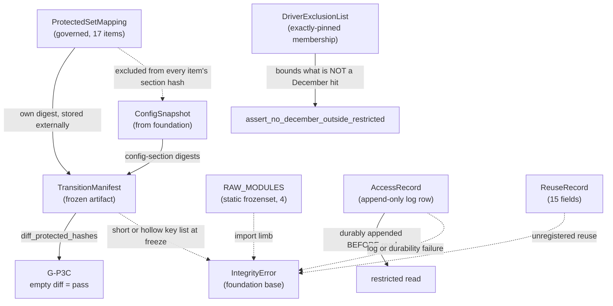

# Domain Entities — `governance-guards`

**Unit** `governance-guards` (Bolt 2) · **Kind** `library` · **Depends on** `foundation`

> **Re-established a sixth time 2026-08-24**, on a **new stage attempt** — Inception closed
> and Construction opened at 2026-08-24T11:46:26Z, resetting the receipt floor for every unit.
> **No content of this unit changed.** `foundation`'s amendment pass of the same day
> (`governance/CHANGE_RECORD_2026-08-24_foundation_amendments.md`) touches no contract this
> unit cites — **A** declined, **B** amended `DeterminismRecord`, **C** amended `services.md`
> § Run record and registry and `unit-of-work.md` § 1, none of them read here. **The READY
> verdict in § Review belongs to the previous attempt**; a fresh pass follows.

> **Re-established a fifth time 2026-08-23**, after a redo correcting a sibling's
> cross-references to **this unit's R-20**. **No content of this unit changed.**

> **Re-established 2026-08-23 after a stage-wide redo jump**, which reset the receipt floor
> for every unit of this stage and, for this unit, the **exhausted adversarial reviewer
> budget**. **No content changed at re-establishment.** The regenerated artifacts — until
> now disclosed as unreviewed — receive a fresh pass. **That pass returned READY** on its
> second iteration. **Re-established again 2026-08-23** after a further stage-wide redo aimed
> at `external-products`; **no content of this unit changed on that occasion.** **A third
> re-establishment** followed a redo aimed at a misread depth policy in
> `component-methods.md`; **no content changed then either.** **A fourth** followed a sweep
> of two sibling question files; **no content changed then either.**

The data shapes this unit owns: the phase-boundary prohibition, the Phase 1 → Phase 2
transition contract, the single access path into the locked December root, and the
§10.1 external-code reuse register.

**Nothing here is a scientific value.** These shapes *carry* governed values. The 17
protected items are frozen by **D-24**; this stage does not reopen them.

## Sources

- `../../../inception/units-generation/unit-of-work.md` § 2 `governance-guards` — the `Owns` list, the boundary, the 10 requirements, BLK-06 and BLK-07.
- `../../../inception/units-generation/unit-of-work-story-map.md` — Tables 1 and 2, and § Per-unit coverage summary. **Derived by pattern match and cross-checked across both paths, which agree:** 10 requirements, **1** untested (`FR-P1-02-6`); tested by TA-07 TA-08 TA-12 TA-18 TA-27 TA-28 WS-10 WS-18; **owns** TA-27 TA-28; **supports** TA-07 TA-18 WS-18. Table 2 also records `RES-01`: permitted-read access logging is **NOT TESTED**.
- `../../../inception/requirements-analysis/requirements.md` — REQ-ENG-5; FR-P1-02-6; FR-P1-03-2; FR-P1-05-12; FR-P1-06-1…-4; NFR-PHASE-01; NFR-LIC-01.
- `../../../inception/application-design/component-methods.md` — the approved contracts for `phase_contract.py` and `locked_test.py`.
- `../../../inception/application-design/components.md` and `component-dependency.md` § Shared resources — the unqualified carve-out.
- `../../../inception/application-design/services.md` — § Stage entry contract, step 4, and § The nine stage scripts.
- `evidence/DECISIONS.md` **D-24** (the 17-item canonical protected set) and **D-15** (the relocation of 21 December-bearing files).
- `../../../inception/delivery-planning/bolt-plan.md` § Gate 0 — the `DP-CHAIR-02` ruling and the pre-G-09 boundary.
- `../foundation/functional-design/` — unit 1's `IntegrityError` base, two-tier posture, `ConfigSnapshot`, and R-15/R-16.
- `functional-design-questions.md` — **Q1 through Q9**, Q1's three owner amendments, and the Q3 reversal.

---

## Entity map

Text fallback: `ConfigSnapshot` supplies config-section digests to
`TransitionManifest`; `ProtectedSetMapping` is excluded from every item's section
hash but carries its own digest, stored externally in the manifest;
`diff_protected_hashes` over the manifest yields G-P3C's pass condition, an empty
diff. `RAW_MODULES` backs the import limb. An `AccessRecord` must be **durably
appended before** a restricted read begins. `DriverExclusionList` bounds what the
December scan does *not* treat as a hit. Any of the import limb, a log or durability
failure, unregistered reuse, or a short or hollow key list at freeze raises an
`IntegrityError` subclass.

---

## 1. `ProtectedSetMapping` — new, governed, **one** structure

**Q1 = D as amended, and Q3 = D.** One structure, because that is the only reading
under which both answers hold:

| Attribute | Type | Meaning |
|---|---|---|
| key | `str` | A protected-item identifier — exactly D-24's 17 |
| value | `Sequence[str]` | The canonical YAML paths / config keys that item covers — its asserted key inventory |

**Location.** `configs/experiment.yaml`, holding **only** the authoritative
identifiers and their coverage. Governed, versioned, hashable, reachable through
`ConfigSnapshot` — and not a fifth config file. A literal in `phase_contract.py` is
barred by `project.md` § Forbidden; parsing `evidence/DECISIONS.md` at run time makes
a governance prose document a parse target and was rejected.

**The section holding this mapping is EXCLUDED from every item's section hash, and
the exclusion list has exactly one member.** A test asserts both limbs — that the
exclusion exists, and that **no other section is excluded**. An unbounded exclusion
mechanism is a hole; the exactly-one assertion is what makes this a named carve-out.

**The mapping is not therefore unprotected.** It carries **its own digest, computed
by the same canonicaliser and stored externally in the `TransitionManifest`**, so a
change to the enumeration or to any per-item coverage list still surfaces as a
manifest difference. A change to the protected-set enumeration is a governed change
requiring a Vision §15.2 amendment and a D-number, so surfacing it is the required
behaviour rather than a nuisance.

> ## ⚠ THIS DESIGN REVERSES A RECORDED OWNER REFUSAL
>
> The previous question set's Question 3 was answered **B, modified**, and its ruling
> is preserved verbatim in `business-rules.md` R-19. It directed that the complete
> list be hashed and **"must not be excluded from hashing merely to avoid
> circularity. Excluding it would leave the enumeration that defines what is
> protected as the one thing unprotected."**
>
> The reversal rests on an **explicit decision by the project decision owner**, taken
> 2026-08-23 after the conflict was put to them with the superseded ruling quoted.
> No new argument answers the superseded reasoning; the external-digest constraint
> above is the mitigation that reasoning demands, and it is mandatory rather than
> optional.

**Canonical contract, per Q1 = D as amended.** SHA-256 over a **versioned canonical
serialization of the parsed YAML value at the exact granularity D-24 authorizes**.
The canonicaliser identifier and version are recorded in the manifest, and the
contract fixes mapping-key ordering, sequence-order treatment, scalar typing and
normalization, Unicode and encoding, **duplicate-key rejection**, alias and merge-key
handling, and rejection of unsupported or ambiguous values. Comments, whitespace,
quote style, key order and workspace relocation must not move a digest; a governed
value change must.

**Overlap is declared, not forbidden.** Undeclared overlap is rejected; **explicit
parent-section / child-field overlap is permitted** where D-24 intentionally protects
both — items 5 and 9 are the live case. Every permitted overlap is declared and
tested so a change cannot be hidden or ambiguously attributed.

**Six hashable-representation kinds cover D-24's 17 items, not one.** Derived from
D-24's table; the full taxonomy and each kind's computation are in
`business-logic-model.md` § W-3a through § W-3c:

| Kind | Items | Computed by this unit? |
|---|---|---|
| Config-section hash | 4, 7, 9, 11, 14, 16 | Yes |
| **Field hash** | **5, 6** | Yes — narrower scope, same canonicaliser, plus D-24's per-item assertion |
| Config hash (whole file) | 12 | Yes — **approved whole-file semantics preserved**; a canonicalisation that would change D-24's meaning is raised as an amendment, never assumed |
| Source-file content hash | 1 | Yes |
| **Parameter hash** | the second half of **15** | Yes — named-parameter digest, sibling of the field hash; **not** a config-section or whole-file hash |
| Composite source + second half | 13, 15, 17 | Yes — **domain-separated versioned pair**, but **each has a DIFFERENT second half**: 13 config-section, 15 **parameter**, 17 config-per-listed-method (scope ⚠ open) |
| **Externally supplied digest** | 2, 3, 8, 10 | **No — recorded, not computed.** Item 3 is `foundation`'s §13.1 environment hash; item 8 is `features-and-splits`' fold/embargo/mask manifests; items 2 and 10 come from `models-and-baselines`' training path |

> **Correction retained from the 2026-08-22 adversarial passes.** The first issue of
> these artifacts asserted *"Eight of D-24's 17 items"* use the config-section path,
> listing 4, 5, 6, 7, 9, 11, 14, 16. Items 5 and 6 are typed **`Field hash`** — a
> different mechanism silently folded in. The wider defect, found while fixing that
> one: **D-24 uses six distinct kinds and the first issue defined one**. A second
> pass then found item 15's `parameter hash` folded into a generic composite bucket,
> the same defect class one level down, on a `TC-19` hard-binding item.
>
> **Four of the 17 are not this unit's to compute at all**, which makes the manifest's
> integrity partly dependent on three other units. That is a real property of the
> design and is stated rather than left implicit. It introduces **no dependency
> edge**: `build_transition_manifest` receives artifact paths as a **parameter**, so
> this unit never imports a downstream one and stays a DAG root.

**Required mutation behaviour** — the contract each test in `business-rules.md` R-20
asserts:

| Mutation | Required behaviour |
|---|---|
| **Deletion** of a protected key | Digest changes **and** freeze-mode membership assertion fails |
| **Addition** of a key | Digest changes **and** membership assertion fails against D-24's 17 |
| **Duplication** of a key | **Rejected** — D-24's cardinality of 17 is *calculated from the enumeration*, so a duplicate is a malformed set, not a longer one; R-18's canonicaliser rejects duplicate keys independently |
| **Reordering**, semantically irrelevant | Digest **unchanged** — the 17 items are a set and the canonical form sorts keys |
| **Renaming** a key | Digest changes **and** membership assertion fails; the name *is* the identifier |
| Frozen manifest contents | **Exactly** D-24's 17-item set — no more, no fewer, no duplicates |

## 2. `TransitionManifest` — approved contract, one field added

Defined at stage 2.6 and otherwise **not modified here**: `protected_hashes`,
`phase1_artifacts`, `phase1_schema`, `config_hashes`, `approved_decisions`,
`invariants`, `unresolved_phase2`.

**What this stage adds:**

- `protected_hashes` carries **exactly** the canonical set — D-24's 17.
- **`build_mode` (`draft` | `freeze`) is a FIELD of `TransitionManifest`**, not a
  build-time argument, so it survives serialization and a later reader or
  `diff_protected_hashes` cannot mistake a draft for a freeze (Q2 = D's rider).
- The **canonicaliser identifier and version** are recorded in the manifest. Whether
  that is a new field or an entry within an existing mapping is a stage 3.5 shaping
  decision; the *semantics* are fixed here.
- The **protected-set mapping's own digest** is stored here, per § 1 — the mitigation
  that keeps the excluded section inside the freeze.

**Lifecycle.** Built by `build_transition_manifest`. **Draft** builds are permitted
from Bolt 2 onward and record an `absent` sentinel for any item whose governing
artifact does not yet exist — which is currently **all 17**, since no config file or
`src/` package exists. **Freeze** builds raise on any `absent` item and assert the key
set equals D-24's 17 exactly: no missing key, no extra key, no `absent` value.

**Why draft mode exists.** A mechanism first run at a freeze gate is a mechanism first
debugged at a freeze gate. Draft builds make the manifest exercisable ten Bolts before
it is relied on, which matches this project's affirmed posture that reproducibility is
executable rather than asserted.

**The G-P3C pass condition is an empty `diff_protected_hashes`.** Its strength is
exactly the strength of the set behind it:

> **BLK-06's enumeration limb is RESOLVED by D-24 at 17 items. Its per-item binding
> to concrete config fields and file paths is PENDING.** Until that is discharged and
> approved, **an empty diff is still not proof that no protected item changed.**
> `component-methods.md`'s standing caution is half-discharged, not retired — and the
> three approved artifacts that still describe the enumeration as deferred are
> **reported at the gate, not edited.**

## 3. `RAW_MODULES` — approved constant, four modules

`frozenset({"src.gnss.rinex", "src.gnss.calibration", "src.gnss.target", "src.gnss.verification"})`

**Four, not two.** FR-P1-03-2's earlier wording listed only `rinex` and
`calibration`; `target.py` and `verification.py` were added as raw-processing
adapters per finding `IMPL-2`. The existing `tests/test_phase_boundary.py` already
encodes all four, and this stage designs to four.

**Lifecycle.** Static. Consumed by `assert_phase_boundary` at step 4 of the stage
entry contract, so the prohibition holds **inside the Kaggle session**, where a commit
hook cannot fire and a local suite run proves nothing about the environment the
governed run executes in. The static `ast` scan in `tests/test_phase_boundary.py`
reads the same set as the **subordinate early-warning limb** (R-24).

## 4. `AccessRecord` — approved contract, with a hardened ordering rule

Approved fields, unchanged: `run_id`, `retrieved_at_utc`, `scope`, `purpose`
(`coverage_audit` | `regime_audit` | `locked_evaluation`), `performance_inspected`,
`locked_test_accessed` (always `True` for any read under `RESTRICTED_ROOT`),
`authorization`.

**Ordering, stated as a hard precondition:**

> **The access-log append must be DURABLY COMPLETED before the December read
> begins.** A log-write failure **or** a durability failure must **prevent the
> read** — not be reported alongside it, not be retried after it, not be logged as a
> warning while the read proceeds.

`VAL-2` and FR-P1-02-3 make log-then-read the requirement: an access recorded after
the fact **fails** the ordering check rather than satisfying it.

**Two tests, both owned by this unit** (Q6 = C): patch the registry writer to fail and
assert the read never happens; assert the log row is durable on disk before the read
is attempted.

**Lifecycle.** One row per read, appended to the access log, never mutated. The log
already contains **five retrospective rows** predating this guard
(`evidence/experiment_registry.md` records rows 3, 4, 5, 8 and 9 as retrospective), so
the log holds two kinds of row and the distinction is explicit in the register rather
than inferred from ordering.

> **`RES-01` stays open.** The **permitted** pre-G-05 coverage read is **NOT
> TESTED**, and Q6's option D — a positive-path test against a synthetic restricted
> root — was declined deliberately, because such evidence would look like coverage of
> the real audit and is not. Its candidate §19 criterion is owned by **stage 3.2**
> under Vision §15.2. Raised at this stage's gate.

## 5. `DriverExclusionList` — new, bounded, and tested to exactly its membership

The enumerated **driver artifact classes** that are **not** December hits, with the
reason recorded per class.

**Why it exists (Q5 = D).** A hit is a December 2022 **target value** or a
December-derived **target aggregate**. A December-dated **driver capture** — the live
instance is `evidence/audit_ec1_2026-08-15/kyoto_dst/dst_provisional_202212.html`, hourly
Dst for December 2022 — is a record whose observation date falls in December and is
not a target value. Dst is diagnostic/hindcast-only and never a confirmatory ML
feature, so sweeping it into locked-test custody would route every ordinary Dst read
through `open_restricted` and buy nothing the lock exists for.

**Why it is a list rather than a judgement in the guard.** The membership is
**asserted by test**. That is the limb that makes the rule enforceable in the
direction that matters: **a target file mislabelled as a driver is detectable**,
because the excluded classes are enumerated and a reviewer checks the list, rather
than the omission being unstated.

**Lifecycle.** Declared alongside the guard, versioned with it, and pinned by a
membership test. Adding a class is a visible change that fails the test until the
test is updated.

## 6. `ReuseRecord` — the §10.1 register, fifteen fields

`reuse_id` · repository URL · immutable commit or tag · upstream file and line or
function · retrieval date · licence and SPDX ID · copied-versus-adapted status ·
destination file · scientific purpose · modifications · tests · original citation ·
notice location · reviewer · approval date.

**Recorded before the code is used**, and before gate **G-P2**.

**Per Q8 = D, this is the exception path, not the main road.** The standing default is
**reimplementation from the paper with a citation** — `project.md` § Forbidden
prohibits copying source whose licence is absent, ambiguous or incompatible, and that
default holds while the AGPLv3 question is open. The AGPLv3 Global-TEC-forecasting
repository is the only approved direct-copy source today, and **whether its
distribution obligations permit that copying is an unresolved governance dependency
this project does not settle.**

**Completeness is checkable, not trusted.** Every adapter module carries a mandatory
**provenance marker**; the register is asserted complete against the set of marked
modules, and an unmarked module is asserted to contain no reuse.

## 7. `RESTRICTED_ROOT` — the single chokepoint

`"evidence/locked_test_restricted"`. `open_restricted` is the **only** path into it.
`component-dependency.md` § Shared resources states the rule without qualification:
*"nothing else may construct a path into it."* `foundation`'s **R-15** states its own
side of that as the absence of a path.

**Why absolute.** **D-15** records that the restricted root is a **governance
boundary, not an access control** — it holds only while exactly one code path reaches
it. A second path does not weaken it slightly; it ends it.

**Mechanism (Q9 = D).** A static check asserts no module outside `locked_test.py`
contains the restricted-root literal. A caller allow-list inside the guard (Q9's
option C) was declined: it would couple this root unit to four downstream units and
close a cycle. The residual run-time-path-assembly gap is left open deliberately.

> **BLK-07 is OPEN, and it is a PRECONDITION OF BOLT 3.** Four units reach the root
> through this contract: `inventory-and-registry` (pre-G-05 coverage audit),
> `acquisition` (the D-9 input and any December re-acquisition — the unrecorded
> routing that *is* BLK-07), `features-and-splits` (locked partition),
> `evaluation-and-comparison` (locked evaluation).
>
> **Live consequence:** `acquisition` **cannot hold its own path** to
> `audit_evidence_2022-FULL/` once the static check exists, because D-15 relocated
> that artifact under the restricted root.
>
> **Acceptance of the Question 9 design mechanism is NOT authorization to open locked
> December data.** Which units are authorised to reach the locked month is a decision
> the project decision owner receives and approves. Nothing in this unit's artifacts
> grants it, implies it, or substitutes for it. **No acquisition run may touch
> calendar 2022-12 while BLK-07 stands.**

## 8. `IntegrityError` subclasses raised here

Deriving from `foundation`'s base (unit 1, R-01), each carrying the affected resource
and the violated expectation:

| Exception | Raised when |
|---|---|
| `PhaseBoundaryError` | A `RAW_MODULES` name is loaded under `phase == 1`; or a Phase 1 frame carries a DCB, STEC, mapping, satellite or arc field |
| `LockedTestError` | `path` is not under `RESTRICTED_ROOT`; or the access-log write or its durability fails |
| `ReuseError` | A marked adapter module has no register entry, or an entry is missing any of the fifteen fields |
| `ManifestError` | A freeze-mode build finds an `absent` item, or the key list does not equal D-24's 17 |
| `EvidenceScanError` | A file under `evidence/` cannot be parsed by any declared artifact-class parser and carries no recorded exclusion |

Catching `foundation`'s base is what lets the stage entry contract write the
`aborted` registry row for any of them — including a subclass added later.

---

## Requirement coverage

Derived from story-map Table 1, with owners from Table 2's `primary` cell. Both paths
cross-checked and in agreement.

| Requirement | Entities | Tested by (Table 1) | Row primary owner |
|---|---|---|---|
| REQ-ENG-5 | `RAW_MODULES`, `TransitionManifest` | WS-10, TA-07, TA-08, TA-12, TA-27 | `features-and-splits` ×3; `models-and-baselines`; **`governance-guards`** (TA-27) |
| **FR-P1-02-6** | `RESTRICTED_ROOT` guard, `DriverExclusionList` | ⚠ **NO CURRENT ACCEPTANCE ROW** | — |
| FR-P1-03-2 | `RAW_MODULES`, both limbs | TA-27 | `governance-guards` |
| FR-P1-05-12 | `AccessRecord` | WS-18, TA-18 | `features-and-splits` |
| FR-P1-06-1 | `ProtectedSetMapping`, `TransitionManifest` | TA-27 | `governance-guards` |
| FR-P1-06-2 | `TransitionManifest` | TA-27 | `governance-guards` |
| FR-P1-06-3 | `TransitionManifest` | TA-28 | `governance-guards` |
| FR-P1-06-4 | `TransitionManifest` | TA-28 | `governance-guards` |
| NFR-PHASE-01 | `RAW_MODULES`, `TransitionManifest` | TA-27 | `governance-guards` |
| NFR-LIC-01 | `ReuseRecord` | TA-28 | `governance-guards` |

**10 requirements, 1 without an acceptance row.** This unit **owns** TA-27 and TA-28,
and **supports** TA-07, TA-18 and WS-18 — three relations, three different sets, each
derived rather than reasoned.

> ## FR-P1-02-6 — explicitly untested, and it stays that way
>
> On the project decision owner's explicit direction, `FR-P1-02-6` is preserved as an
> **explicitly untested obligation until an approved acceptance row exists AND its
> test has passed** — both conditions, not either.
>
> It **is** enforced today, by
> `tests/test_acquisition_window.py::test_locked_month_values_exist_only_under_the_restricted_path`,
> and that test **is** green. Lacking an acceptance row is a different thing from
> lacking a test.
>
> The Q4 and Q5 designs are a **test specification only — not an approved acceptance
> row and not evidence of a passing result.** No artifact, manifest or report may
> state or imply that FR-P1-02-6 is covered, satisfied or verified. Designing the
> guard does not test it; implementing it does not test it.

## Assumptions & Open Questions

- **[assumption]** Rule IDs continue `foundation`'s sequence, so `business-rules.md` opens at **R-18**. If per-unit numbering was intended, say so at the gate.
- **[assumption]** `tests/test_locked_test_guard.py` is **not** this unit's. ADR-03 splits the guard deliberately — the access-log limb here, the execution limb in `features-and-splits`'s `splits.py` — and the test covering both limbs is owned by `features-and-splits` to keep this unit a DAG root. Table 2 confirms `features-and-splits` owns WS-18 and TA-18 with this unit supporting.
- **[assumption]** `RAW_MODULES` names four `gnss` modules, not two.
- **[assumption]** NFR-PHASE-01's transition-manifest hash-diff test has **no module in the TE §12 tree** and needs frozen artifacts from every later unit. Carried on `fixtures-and-reproducibility` with this unit supporting. Not this unit's to build.
- **[assumption]** TA-27's second limb (Phase 2 cannot change protected forecasting hashes) is accepted at G-P2 and G-P3C, outside Phase 1.
- **[assumption]** `frontend-components.md` is not produced — `kind: library`, and the stage maps that artifact to `[ui]` only.
- **[assumption]** `build_mode` is fixed as a `TransitionManifest` field by Q2's rider. Whether `canonicaliser_version` is a new field or an entry inside an existing mapping is left to stage 3.5, so no approved dataclass contract is otherwise changed by this stage.
- **Open — § 1 reverses a recorded owner refusal on the owner's explicit decision.** The superseded ruling is preserved verbatim in `business-rules.md` R-19 and is not answered by a new argument; the external-digest constraint is the mitigation it demands. Raised at the gate.
- **Open — BLK-06's per-item binding.** D-24 resolved the enumeration at **17 items**; the binding to concrete config fields and file paths is **PENDING**, and no config file or `src/` package exists yet. `business-rules.md` § Per-item boundaries produces the binding evidence. **BLK-06 is not closed by this stage**, per `DP-CHAIR-02`.
- **Open — BLK-07 authorization**, and it is a precondition of Bolt 3. See § 7.
- **Open — `RES-01`**, permitted-read access logging is NOT TESTED. See § 4.
- **Open — item 17's per-method "config hash" scope.** D-24 uses the same two words for item 12's whole-file hash and item 17's per-listed-method hash. Not invented here — see `business-logic-model.md` § Open.
- **Open — where the D-24 conformance test gets its list.** The test must assert the frozen manifest contains exactly D-24's 17 items, checked against the **authority** rather than only the config. Hardcoding is a fourth copy of a governed enumeration; parsing `evidence/DECISIONS.md` makes a governance prose document a test dependency, which Q3 option C was rejected for. **No third option is invented.** Raised at the gate.
- **Open — a stale statement in three approved artifacts, reported not edited.** `component-methods.md`'s `TransitionManifest` comment, `unit-of-work.md` § 2 and `components.md` line 61 all still describe the enumeration and cardinality as deferred to stage 3.1; **D-24 has since resolved them at 17 items**, and `bolt-plan.md` § Bolt 2 already reflects that. Per `CHANGE_RECORD_PROCEDURE.md`, a sweep reports on approved-stage artifacts and does not edit them absent owner approval for annotate-in-place.
- **Open — the AGPLv3 distribution question.** Unresolved; the standing default is reimplementation with a citation.
- **G-09 is not signed.** No entity here authorises creating `phase_contract.py`, `locked_test.py` or `reuse_registry.py`.
- **None** of the above adopts a reading on a supervisor-owned value, and none decides a scientific constant.
