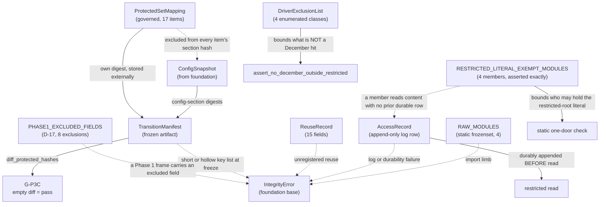

# Domain Entities — `governance-guards`

> ## ✳ G-09 IS SIGNED — 2026-08-28, **D-31** (read this before any G-09 statement below)
>
> The project decision owner **signed and approved G-09 (Agent preflight)** on 2026-08-28,
> recorded as **D-31** in `evidence/DECISIONS.md` with change record
> `governance/CHANGE_RECORD_2026-08-28_G09_signed.md`. **Every statement below of the form
> "G-09 is not signed" / "G-09 stays unsigned" is superseded as to the gate's status**, and
> is left standing as the accurate record of the constraint that applied when it was
> written.
>
> ⚠ **D-31 records the gate's own TE §18.3 preconditions as UNMET, and that disclosure
> travels with the signature.** `configs/`, and until 2026-08-28 `src/`, did not exist, so
> the mandated automated zero-TBD preflight **could not run**; the ten named critical tests
> **cannot be executed in this environment** (no Python interpreter is installed — a
> zero-byte Windows Store stub, no registry entry, no interpreter on disk); and the evidence
> artifact `aws_ai_dlc_preflight_report` **does not exist**. "No failing critical test" is
> therefore **unproven, not proven** — an absence of executions, not an absence of failures.
> This is the owner **opening the gate by authority**, not a record that its evidentiary
> conditions were satisfied, and no reader may infer the second from the first.
>
> **What the signature changes here:** module creation is authorised, and any defect this
> unit deferred *solely* because G-09 barred editing a file is now correctable.
> **What it does NOT change:** G-05 and G-06 remain `Blocked`; G-P1A, G-P2, G-P3A, G-P3C
> and G-07 are unaffected; **TE §18.2's absolute rule stands** — every scientific value this
> unit routed to G-04/G-05 **stays routed**, and no agent may fill a freeze-gate value by
> convenience; and **§18.3's stop-and-report obligation survives its own gate**, being a
> standing rule on implementation rather than a one-time gate condition.

**Unit** `governance-guards` (Bolt 2) · **Kind** `library` · **Depends on** `foundation`

> **Re-established a sixth time 2026-08-24**, on a **new stage attempt** — Inception closed
> and Construction opened at 2026-08-24T11:46:26Z, resetting the receipt floor for every unit.
> **No content of this unit changed.** `foundation`'s amendment pass of the same day
> (`governance/CHANGE_RECORD_2026-08-24_foundation_amendments.md`) touches no contract this
> unit cites — **A** declined, **B** amended `DeterminismRecord`, **C** amended `services.md`
> § Run record and registry and `unit-of-work.md` § 1, none of them read here. **The READY
> verdict in § Review belongs to the previous attempt**; a fresh pass follows.

> **Re-established a fifth time 2026-08-23**, after a redo correcting a sibling's
> cross-references to **this unit's R-20**. **No content of this unit changed.**

> **Re-established 2026-08-23 after a stage-wide redo jump**, which reset the receipt floor
> for every unit of this stage and, for this unit, the **exhausted adversarial reviewer
> budget**. **No content changed at re-establishment.** The regenerated artifacts — until
> now disclosed as unreviewed — receive a fresh pass. **That pass returned READY** on its
> second iteration. **Re-established again 2026-08-23** after a further stage-wide redo aimed
> at `external-products`; **no content of this unit changed on that occasion.** **A third
> re-establishment** followed a redo aimed at a misread depth policy in
> `component-methods.md`; **no content changed then either.** **A fourth** followed a sweep
> of two sibling question files; **no content changed then either.**

The data shapes this unit owns: the phase-boundary prohibition, the Phase 1 → Phase 2
transition contract, the single access path into the locked December root, and the
§10.1 external-code reuse register.

**Nothing here is a scientific value.** These shapes *carry* governed values. The 17
protected items are frozen by **D-24**; this stage does not reopen them.

## Sources

- `../../../inception/units-generation/unit-of-work.md` § 2 `governance-guards` — the `Owns` list, the boundary, the 10 requirements, BLK-06 and BLK-07.
- `../../../inception/units-generation/unit-of-work-story-map.md` — Tables 1 and 2, and § Per-unit coverage summary. **Derived by pattern match and cross-checked across both paths, which agree:** 10 requirements, **1** untested (`FR-P1-02-6`); tested by TA-07 TA-08 TA-12 TA-18 TA-27 TA-28 WS-10 WS-18; **owns** TA-27 TA-28; **supports** TA-07 TA-18 WS-18. Table 2 also records `RES-01`: permitted-read access logging is **NOT TESTED**.
- `../../../inception/requirements-analysis/requirements.md` — REQ-ENG-5; FR-P1-02-6; FR-P1-03-2; FR-P1-05-12; FR-P1-06-1…-4; NFR-PHASE-01; NFR-LIC-01.
- `../../../inception/application-design/component-methods.md` — the approved contracts for `phase_contract.py` and `locked_test.py`.
- `../../../inception/application-design/components.md` and `component-dependency.md` § Shared resources — the unqualified carve-out.
- `../../../inception/application-design/services.md` — § Stage entry contract, step 4, and § The nine stage scripts.
- `evidence/DECISIONS.md` **D-24** (the 17-item canonical protected set) and **D-15** (the relocation of 21 December-bearing files).
- `../../../inception/delivery-planning/bolt-plan.md` § Gate 0 — the `DP-CHAIR-02` ruling and the pre-G-09 boundary.
- `../foundation/functional-design/` — unit 1's `IntegrityError` base, two-tier posture, `ConfigSnapshot`, and R-15/R-16.
- `functional-design-questions.md` — **Q1 through Q9**, Q1's three owner amendments, and the Q3 reversal.

---

## Entity map

Text fallback: `ConfigSnapshot` supplies config-section digests to
`TransitionManifest`; `ProtectedSetMapping` is excluded from every item's section
hash but carries its own digest, stored externally in the manifest;
`diff_protected_hashes` over the manifest yields G-P3C's pass condition, an empty
diff. `RAW_MODULES` backs the import limb. An `AccessRecord` must be **durably
appended before** a restricted read begins. `DriverExclusionList` bounds what the
December scan does *not* treat as a hit, across four enumerated classes.
`PHASE1_EXCLUDED_FIELDS` carries D-17's eight exclusions and raises when a Phase 1 frame
holds one. `RESTRICTED_LITERAL_EXEMPT_MODULES` bounds which modules may hold the
restricted-root literal in the static one-door check, and a member that reads content
beneath the root without a prior durable access row fails. Any of the import limb, a log or
durability failure, unregistered reuse, or a short or hollow key list at freeze raises an
`IntegrityError` subclass.

---

## 1. `ProtectedSetMapping` — new, governed, **one** structure

**Q1 = D as amended, and Q3 = D.** One structure, because that is the only reading
under which both answers hold:

| Attribute | Type | Meaning |
|---|---|---|
| key | `str` | A protected-item identifier — exactly D-24's 17 |
| value | `Sequence[str]` | The canonical YAML paths / config keys that item covers — its asserted key inventory |

**Location.** `configs/experiment.yaml`, holding **only** the authoritative
identifiers and their coverage. Governed, versioned, hashable, reachable through
`ConfigSnapshot` — and not a fifth config file. A literal in `phase_contract.py` is
barred by `project.md` § Forbidden; parsing `evidence/DECISIONS.md` at run time makes
a governance prose document a parse target and was rejected.

**The section holding this mapping is EXCLUDED from every item's section hash, and
the exclusion list has exactly one member.** A test asserts both limbs — that the
exclusion exists, and that **no other section is excluded**. An unbounded exclusion
mechanism is a hole; the exactly-one assertion is what makes this a named carve-out.

**The mapping is not therefore unprotected.** It carries **its own digest, computed
by the same canonicaliser and stored externally in the `TransitionManifest`**, so a
change to the enumeration or to any per-item coverage list still surfaces as a
manifest difference. A change to the protected-set enumeration is a governed change
requiring a Vision §15.2 amendment and a D-number, so surfacing it is the required
behaviour rather than a nuisance.

> ## ⚠ THIS DESIGN REVERSES A RECORDED OWNER REFUSAL
>
> The previous question set's Question 3 was answered **B, modified**, and its ruling
> is preserved verbatim in `business-rules.md` R-19. It directed that the complete
> list be hashed and **"must not be excluded from hashing merely to avoid
> circularity. Excluding it would leave the enumeration that defines what is
> protected as the one thing unprotected."**
>
> The reversal rests on an **explicit decision by the project decision owner**, taken
> 2026-08-23 after the conflict was put to them with the superseded ruling quoted.
> No new argument answers the superseded reasoning; the external-digest constraint
> above is the mitigation that reasoning demands, and it is mandatory rather than
> optional.

**Canonical contract, per Q1 = D as amended.** SHA-256 over a **versioned canonical
serialization of the parsed YAML value at the exact granularity D-24 authorizes**.
The canonicaliser identifier and version are recorded in the manifest, and the
contract fixes mapping-key ordering, sequence-order treatment, scalar typing and
normalization, Unicode and encoding, **duplicate-key rejection**, alias and merge-key
handling, and rejection of unsupported or ambiguous values. Comments, whitespace,
quote style, key order and workspace relocation must not move a digest; a governed
value change must.

**Overlap is declared, not forbidden.** Undeclared overlap is rejected; **explicit
parent-section / child-field overlap is permitted** where D-24 intentionally protects
both — items 5 and 9 are the live case. Every permitted overlap is declared and
tested so a change cannot be hidden or ambiguously attributed.

**Six hashable-representation kinds cover D-24's 17 items, not one.** Derived from
D-24's table; the full taxonomy and each kind's computation are in
`business-logic-model.md` § W-3a through § W-3c:

| Kind | Items | Computed by this unit? |
|---|---|---|
| Config-section hash | 4, 7, 9, 11, 14, 16 | Yes |
| **Field hash** | **5, 6** | Yes — narrower scope, same canonicaliser, plus D-24's per-item assertion |
| Config hash (whole file) | 12 | Yes — **approved whole-file semantics preserved**; a canonicalisation that would change D-24's meaning is raised as an amendment, never assumed |
| Source-file content hash | 1 | Yes |
| **Parameter hash** | the second half of **15** | Yes — named-parameter digest, sibling of the field hash; **not** a config-section or whole-file hash |
| Composite source + second half | 13, 15, 17 | Yes — **domain-separated versioned pair**, but **each has a DIFFERENT second half**: 13 config-section, 15 **parameter**, 17 config-per-listed-method (scope ⚠ open) |
| **Externally supplied digest** | 2, 3, 8, 10 | **No — recorded, not computed.** Item 3 is `foundation`'s §13.1 environment hash; item 8 is `features-and-splits`' fold/embargo/mask manifests; items 2 and 10 come from `models-and-baselines`' training path |

> **Correction retained from the 2026-08-22 adversarial passes.** The first issue of
> these artifacts asserted *"Eight of D-24's 17 items"* use the config-section path,
> listing 4, 5, 6, 7, 9, 11, 14, 16. Items 5 and 6 are typed **`Field hash`** — a
> different mechanism silently folded in. The wider defect, found while fixing that
> one: **D-24 uses six distinct kinds and the first issue defined one**. A second
> pass then found item 15's `parameter hash` folded into a generic composite bucket,
> the same defect class one level down, on a `TC-19` hard-binding item.
>
> **Four of the 17 are not this unit's to compute at all**, which makes the manifest's
> integrity partly dependent on three other units. That is a real property of the
> design and is stated rather than left implicit. It introduces **no dependency
> edge**: `build_transition_manifest` receives artifact paths as a **parameter**, so
> this unit never imports a downstream one and stays a DAG root.

**Required mutation behaviour** — the contract each test in `business-rules.md` R-20
asserts:

| Mutation | Required behaviour |
|---|---|
| **Deletion** of a protected key | Digest changes **and** freeze-mode membership assertion fails |
| **Addition** of a key | Digest changes **and** membership assertion fails against D-24's 17 |
| **Duplication** of a key | **Rejected** — D-24's cardinality of 17 is *calculated from the enumeration*, so a duplicate is a malformed set, not a longer one; R-18's canonicaliser rejects duplicate keys independently |
| **Reordering**, semantically irrelevant | Digest **unchanged** — the 17 items are a set and the canonical form sorts keys |
| **Renaming** a key | Digest changes **and** membership assertion fails; the name *is* the identifier |
| Frozen manifest contents | **Exactly** D-24's 17-item set — no more, no fewer, no duplicates |

## 2. `TransitionManifest` — approved contract, one field added

Defined at stage 2.6 and otherwise **not modified here**: `protected_hashes`,
`phase1_artifacts`, `phase1_schema`, `config_hashes`, `approved_decisions`,
`invariants`, `unresolved_phase2`.

**What this stage adds:**

- `protected_hashes` carries **exactly** the canonical set — D-24's 17.
- **`build_mode` (`draft` | `freeze`) is a FIELD of `TransitionManifest`**, not a
  build-time argument, so it survives serialization and a later reader or
  `diff_protected_hashes` cannot mistake a draft for a freeze (Q2 = D's rider).
- The **canonicaliser identifier and version** are recorded in the manifest. Whether
  that is a new field or an entry within an existing mapping is a stage 3.5 shaping
  decision; the *semantics* are fixed here.
- The **protected-set mapping's own digest** is stored here, per § 1 — the mitigation
  that keeps the excluded section inside the freeze.

**Lifecycle.** Built by `build_transition_manifest`. **Draft** builds are permitted
from Bolt 2 onward and record an `absent` sentinel for any item whose governing
artifact does not yet exist — which is currently **all 17**, since no config file or
`src/` package exists. **Freeze** builds raise on any `absent` item and assert the key
set equals D-24's 17 exactly: no missing key, no extra key, no `absent` value.

**Why draft mode exists.** A mechanism first run at a freeze gate is a mechanism first
debugged at a freeze gate. Draft builds make the manifest exercisable ten Bolts before
it is relied on, which matches this project's affirmed posture that reproducibility is
executable rather than asserted.

**The G-P3C pass condition is an empty `diff_protected_hashes`.** Its strength is
exactly the strength of the set behind it:

> **BLK-06's enumeration limb is RESOLVED by D-24 at 17 items. Its per-item binding
> to concrete config fields and file paths is PENDING.** Until that is discharged and
> approved, **an empty diff is still not proof that no protected item changed.**
> `component-methods.md`'s standing caution is half-discharged, not retired — and the
> three approved artifacts that still describe the enumeration as deferred are
> **reported at the gate, not edited.**

## 3. `RAW_MODULES` — approved constant, four modules

`frozenset({"src.gnss.rinex", "src.gnss.calibration", "src.gnss.target", "src.gnss.verification"})`

**Four, not two.** FR-P1-03-2's earlier wording listed only `rinex` and
`calibration`; `target.py` and `verification.py` were added as raw-processing
adapters per finding `IMPL-2`. The existing `tests/test_phase_boundary.py` already
encodes all four, and this stage designs to four.

**Lifecycle.** Static. Consumed by `assert_phase_boundary` at step 4 of the stage
entry contract, so the prohibition holds **inside the Kaggle session**, where a commit
hook cannot fire and a local suite run proves nothing about the environment the
governed run executes in. The static `ast` scan in `tests/test_phase_boundary.py`
reads the same set as the **subordinate early-warning limb** (R-24).

## 4. `AccessRecord` — approved contract, with a hardened ordering rule

Approved fields, unchanged: `run_id`, `retrieved_at_utc`, `scope`, `purpose`
(`coverage_audit` | `regime_audit` | `locked_evaluation`), `performance_inspected`,
`locked_test_accessed` (always `True` for any read under `RESTRICTED_ROOT`),
`authorization`.

**Ordering, stated as a hard precondition:**

> **The access-log append must be DURABLY COMPLETED before the December read
> begins.** A log-write failure **or** a durability failure must **prevent the
> read** — not be reported alongside it, not be retried after it, not be logged as a
> warning while the read proceeds.

`VAL-2` and FR-P1-02-3 make log-then-read the requirement: an access recorded after
the fact **fails** the ordering check rather than satisfying it.

**Two tests, both owned by this unit** (Q6 = C): patch the registry writer to fail and
assert the read never happens; assert the log row is durable on disk before the read
is attempted.

**Lifecycle.** One row per read, appended to the access log, never mutated. The log
already contains **five retrospective rows** predating this guard
(`evidence/experiment_registry.md` records rows 3, 4, 5, 8 and 9 as retrospective), so
the log holds two kinds of row and the distinction is explicit in the register rather
than inferred from ordering.

> **`RES-01` stays open.** The **permitted** pre-G-05 coverage read is **NOT
> TESTED**, and Q6's option D — a positive-path test against a synthetic restricted
> root — was declined deliberately, because such evidence would look like coverage of
> the real audit and is not. Its candidate §19 criterion is owned by **stage 3.2**
> under Vision §15.2. Raised at this stage's gate.

## 5. `DriverExclusionList` — new, bounded, and tested to exactly its membership

The enumerated **driver artifact classes** that are **not** December hits, with the
reason recorded per class.

**Why it exists (Q5 = D).** A hit is a December 2022 **target value** or a
December-derived **target aggregate**. A December-dated **driver capture** — the live
instance is `evidence/audit_ec1_2026-08-15/kyoto_dst/dst_provisional_202212.html`, hourly
Dst for December 2022 — is a record whose observation date falls in December and is
not a target value. Dst is diagnostic/hindcast-only and never a confirmatory ML
feature, so sweeping it into locked-test custody would route every ordinary Dst read
through `open_restricted` and buy nothing the lock exists for.

**Why it is a list rather than a judgement in the guard.** The membership is
**asserted by test**. That is the limb that makes the rule enforceable in the
direction that matters: **a target file mislabelled as a driver is detectable**,
because the excluded classes are enumerated and a reviewer checks the list, rather
than the omission being unstated.

**Lifecycle.** Declared alongside the guard, versioned with it, and pinned by a
membership test. Adding a class is a visible change that fails the test until the
test is updated.

> **Amended 2026-08-28 — the membership is now actually enumerated, at four classes.**
> `GOV-2026-08-28-FD-01` **Recommendation 44(b)** (`VAL-08`), **board option 2**, approved by
> the project decision owner. This entity **claimed** an enumerated membership while naming
> **one live instance and no class list**, so the membership test that is its whole point had
> nothing to range over. Relocating `.dst_summary.json` inside `evidence/` — **done 2026-08-28 under D-30** (see
> `business-rules.md` R-27) forces the enumeration, and auditing the scan root for it surfaced
> **two further December-bearing driver artifacts already on disk and never enumerated** — a
> new observation, in neither the board's report nor the remediation brief.

**Membership — exactly these four classes.** Every figure derived and printed 2026-08-28 by
walking `evidence/` and reading each candidate's December content before it was written here.

| # | Class | Path | December content, measured |
|---|---|---|---|
| 1 | Raw provisional-Dst monthly capture | `evidence/audit_ec1_2026-08-15/kyoto_dst/dst_provisional_YYYYMM.html` | **12** captures present; the December one is hourly Dst for December 2022 |
| 2 | Raw F10.7 flux table | `evidence/audit_ec1_2026-08-15/nrcan_f107/fluxtable.txt` | **95** lines dated `202212`; EC-1 records the 2022 range as `2022-01-01` → **`2022-12-31`** |
| 3 | Derived driver audit report | `evidence/audit_ec1_2026-08-15/ec1-audit-report.json` | month keys `1`…`12` (**12**); `"12"` carries `expected_days: 31`, `day_rows_parsed: 31` |
| 4 | Derived driver summary | `.dst_summary.json` — **conditional on the Recommendation 44(b) relocation having happened** ⚠ **NOW UNCONDITIONAL (2026-08-28, D-30)** — the relocation has happened, so class 4 applies without condition. | **12** month keys; `"12"` holds `days_parsed: 31`, `hours: 744`, `min: -68`, `storm50: [7, 27]`, `storm30` **15** days, `daily_min` **31** entries |

**Classes 2 and 3 are a correction, not a widening.** Both sit inside the scan root **today**,
so a guard implemented from the previous text would have **failed on first run against evidence
already committed**, and that failure would have read as a breach rather than as an
unenumerated exclusion.

**This entity is a custody exclusion and never a licence to use an excluded file.** **D-11**
bars any provisional-Dst-derived figure from becoming a G-05 regime count, a modelling input or
a frozen tolerance, and that restriction rides classes 1, 3 and 4 wherever they sit. The
control closing that channel lives in another unit — `regimes-diagnostics-reporting` **R-123**,
whose `RegimeError` fires on a provisional-Dst-derived series offered as the storm-count input,
naming `.dst_summary.json` as the path it closes. *(ID corrected 2026-08-28: the remediation
brief and the board both cite "R-122"; grepping the rule headings gives
`statistical-inference` R-113…R-122 and `regimes-diagnostics-reporting` opening at **R-123**.)*

## 6. `ReuseRecord` — the §10.1 register, fifteen fields

`reuse_id` · repository URL · immutable commit or tag · upstream file and line or
function · retrieval date · licence and SPDX ID · copied-versus-adapted status ·
destination file · scientific purpose · modifications · tests · original citation ·
notice location · reviewer · approval date.

**Recorded before the code is used**, and before gate **G-P2**.

**Per Q8 = D, this is the exception path, not the main road.** The standing default is
**reimplementation from the paper with a citation** — `project.md` § Forbidden
prohibits copying source whose licence is absent, ambiguous or incompatible, and that
default holds while the AGPLv3 question is open. The AGPLv3 Global-TEC-forecasting
repository is the only approved direct-copy source today, and **whether its
distribution obligations permit that copying is an unresolved governance dependency
this project does not settle.**

**Completeness is checkable, not trusted.** Every adapter module carries a mandatory
**provenance marker**; the register is asserted complete against the set of marked
modules, and an unmarked module is asserted to contain no reuse.

## 7. `RESTRICTED_ROOT` — the single chokepoint

`"evidence/locked_test_restricted"`. `open_restricted` is the **only** path into it.
`component-dependency.md` § Shared resources states the rule without qualification:
*"nothing else may construct a path into it."* `foundation`'s **R-15** states its own
side of that as the absence of a path.

**Why the boundary is still absolute where it counts.** **D-15** records that the restricted
root is a **governance boundary, not an access control** — it holds only while exactly one
code path reaches it. **That sentence is retained verbatim, and its scope is stated rather
than inferred: a "path" is a route through which restricted CONTENT is read.** D-15's
boundary *"does not weaken slightly; it ends"*, and § 10's exemption is built so nothing
about that changes — **holding a string is not an access; reading bytes is.**

**Mechanism (Q9 = D, as narrowed 2026-08-28).** A static check asserts that no module
outside `locked_test.py` **and outside § 10's enumerated `tests/` exemption** contains the
restricted-root literal, and that the exemption's membership is **exactly** its five members *(corrected 2026-08-29 on adversarial finding 1 — superseded figure preserved: "its **four** members"; and the exemption is no longer `tests/`-only, member 5 being a production script. See § 10's correction box)*.
A caller allow-list inside the guard (Q9's option C) was declined: it would couple this root
unit to four downstream units and close a cycle. The residual run-time-path-assembly gap is
left open deliberately.

> **Amended 2026-08-28 (`GOV-2026-08-28-FD-01` Recommendation 2 — BLOCKER, `VAL-02`,
> Validation Auditor **veto**; board option 1, owner approved).** The unqualified mechanism was
> **false against the workspace**: `tests/test_acquisition_window.py:46`,
> `tests/test_phase_boundary.py:49` and `tests/test_release_hashes.py:49` each define
> `RESTRICTED_DIR`, so with the future `locked_test.py` **four** modules hold the literal and
> the design's own negative control was satisfied by the tree as it stands. **Board option 3**
> — scoping the check to `src/` only — was rejected by name: it converts the largest known hole
> into a **permanent blind spot**, a hazard `evidence/experiment_registry.md:79–83` records as
> having already fired in fact. See § 10 and `business-rules.md` R-28.

> **BLK-07 is OPEN, and it is a PRECONDITION OF BOLT 3.** Four units reach the root
> through this contract: `inventory-and-registry` (pre-G-05 coverage audit),
> `acquisition` (the D-9 input and any December re-acquisition — the unrecorded
> routing that *is* BLK-07), `features-and-splits` (locked partition),
> `evaluation-and-comparison` (locked evaluation).
>
> **Live consequence:** `acquisition` **cannot hold its own path** to
> `audit_evidence_2022-FULL/` once the static check exists, because D-15 relocated
> that artifact under the restricted root.
>
> **Acceptance of the Question 9 design mechanism is NOT authorization to open locked
> December data.** Which units are authorised to reach the locked month is a decision
> the project decision owner receives and approves. Nothing in this unit's artifacts
> grants it, implies it, or substitutes for it. **No acquisition run may touch
> calendar 2022-12 while BLK-07 stands.**

## 8. `IntegrityError` subclasses raised here

Deriving from `foundation`'s base (unit 1, R-01), each carrying the affected resource
and the violated expectation:

> **Base class, stated 2026-08-25 to discharge this unit's half of the cross-unit exception
> obligation** (created by `foundation`'s R-01, on the authority of `component-methods.md`
> § Assumptions, after these artifacts were written). **All FIVE exceptions in the table below
> derive from `IntegrityError`, imported from `src/data/config.py`** — a legal import, since this
> unit depends on `foundation`. `PhaseBoundaryError` and `LockedTestError` are two of the fourteen
> that contract places in the shared base; `ReuseError`, `ManifestError` **and `EvidenceScanError`**
> are this unit's own (Q1 permits per-unit naming) and derive from the same base under R-01's
> *"any future integrity-related exception"* clause.
>
> *(Corrected 2026-08-25 on adversarial finding 1 of the post-reset pass, which was Major: the box
> as first written said "all four" over a table of **five** rows — `EvidenceScanError`, R-27's
> fail-closed December-scan limb, was left outside the enumeration, so a builder following it
> literally would let a scan failure exit with no `aborted` registry row, the exact failure the
> box's own rationale names. The same finding placed this box where it split the table's header
> from its rows, breaking GFM rendering at the one moment the table is read for approval — it now
> stands above the table. The count-in-prose lesson from `foundation` applies verbatim: the box now
> says "the table below" rather than repeating a numeral anywhere else.)*
>
> **Why it matters here more than anywhere:** the stage-entry contract writes the `aborted`
> registry row by catching `IntegrityError` — outside the hierarchy, a violation exits with no
> `aborted` row, the one event NFR-PHASE-01 and NFR-AUD-01 most require recorded, and this unit
> owns the guards.

| Exception | Raised when |
|---|---|
| `PhaseBoundaryError` | A `RAW_MODULES` name is loaded under `phase == 1`; or a Phase 1 frame carries a field in `PHASE1_EXCLUDED_FIELDS` — **D-17's eight exclusions** (§ 9), *widened 2026-08-28 from §7.0's five classes under Recommendation 37* |
| `LockedTestError` | `path` is not under `RESTRICTED_ROOT`; or the access-log write or its durability fails |
| `ReuseError` | A marked adapter module has no register entry, or an entry is missing any of the fifteen fields |
| `ManifestError` | A freeze-mode build finds an `absent` item, or the key list does not equal D-24's 17 |
| `EvidenceScanError` | A file under `evidence/` cannot be parsed by any declared artifact-class parser and carries no recorded exclusion |

Catching `foundation`'s base is what lets the stage entry contract write the
`aborted` registry row for any of them — including a subclass added later.

## 9. `PHASE1_EXCLUDED_FIELDS` — new, D-17's frozen excluded set, eight exclusions

> **Added 2026-08-28** under `GOV-2026-08-28-FD-01` **Recommendation 37** (`TEC-08`, Medium /
> `MINOR`), **board option 1**, approved by the project decision owner. It exists because the
> produced-field limb previously carried §7.0's **five** classes inline as prose and had no
> named, bounded shape to assert membership against — the same defect § 5 had, and the same
> enumerated-list remedy applies. Nothing frozen is reopened: **D-17 is the authority and every
> member is copied from it.**

The **field classes a Phase 1 artifact may not carry**, enumerated exhaustively from
`evidence/DECISIONS.md` **D-17** § *"Explicitly NOT in the Phase 1 row, and not substituted"*
(lines **808–813**). **Derived 2026-08-28** by splitting that sentence on its semicolons and
printing the result: **8 exclusions.**

| # | Exclusion (verbatim from D-17) | Named by TE §7.0's five? |
|---|---|---|
| 1 | `valid_satellite_count` | yes — satellite |
| 2 | any per-satellite or per-IPP quantity | **partly** — satellite yes, **per-IPP no** |
| 3 | zenith angle or zenith weight | **no** |
| 4 | elevation | **no** |
| 5 | DCB | yes |
| 6 | STEC | yes |
| 7 | mapping function output | yes — mapping |
| 8 | arc or cycle-slip statistics | yes — arc (**cycle-slip** made explicit by D-17) |

**Why the wider set, and why it costs nothing.** TE §7.0 names **5** classes; D-17 enumerates
**8** exclusions. **2** of the 8 name no §7.0 class token at all, and counted as distinct
quantities, **3** are uncovered by §7.0's five — **per-IPP quantity**, **zenith angle or zenith
weight**, **elevation**. `assert_no_raw_fields` is the **cross-cutting** guard invoked at step
4 of every Phase 1 stage entry: it is the check that runs *everywhere*, so it must enforce the
full frozen boundary rather than the narrower one the authority sentence happens to spell.
**D-16** (lines **754–761**) is why exclusions 3 and 4 are not merely tidy: the Phase 1 product
is five columns — `ut1_unix`, `gdlat`, `glon`, `tec`, `dtec` — with *"no elevation, no zenith
angle, no satellite identifier and no per-IPP record"*, so zenith weighting is **not
computable** and is declared and **deferred**, not reinstatable. A Phase 1 frame carrying
`zenith_angle` or `elevation` cannot have been measured.

**The authority citation names D-17, not only §7.0.** This entity enforces more than §7.0
states, so a reader must not mistake the wider set for the design over-reaching. Verified
2026-08-28 by scripted match: `zenith`, `elevation`, `IPP` and `D-17` each appeared **0**
times across all four of this unit's artifacts before this amendment.

**Matching is by fragment, not exact name.** `tests/test_phase_boundary.py` already implements
this and states the reason in its own comment — *"a column called `n_sat_valid` or `sat_count`
must trip this as surely as `valid_satellite_count`"*. Counted programmatically 2026-08-28, its
`FORBIDDEN_FIELD_FRAGMENTS` holds **13** fragments covering all **8** exclusions, and
`D17_TARGET_FIELDS` holds the **17**-name allow-list with its own guard against a Phase 2
quantity being added to the contract. **The subordinate static limb was already stronger than
the authoritative run-time limb this unit specified** — the amendment closes that inversion in
the design's favour rather than weakening the test.

**Lifecycle.** Static, frozen by D-17, versioned with the guard, membership pinned by test.
Adding or removing a member fails that test until it is edited, so the set cannot drift
silently in either direction.

## 10. `RESTRICTED_LITERAL_EXEMPT_MODULES` — new, bounded, five members, membership asserted exactly

> ## ⛔ COUNT CORRECTED 2026-08-29 — **FIVE**, not four. Read this before any figure below.
>
> *(Corrected on adversarial finding 1 of the 2026-08-29 re-confirmation pass, Critical. The
> **sixth-holder** discovery recorded in `business-rules.md` R-28 on 2026-08-28 — a full-repository
> sweep that found `scripts/merge_coverage_year.py` holding the restricted-root literal and reading
> six restricted sites with **no `AccessRecord`** — was written into R-28's own box and **not swept
> into this entity's heading, its body sentence, its field table, or either file's `§ Assumptions`**.
> That left this specification, which is what an implementer reads first, describing a membership
> set that would **fail against the workspace on first run** — reproducing the exact failure the
> discovery was raised to prevent. Superseded figures are preserved in place below, never deleted.)*
>
> **The two counting conventions, stated so they are never confused again:**
> - **This entity counts members IN ADDITION TO the chokepoint** `src/data/locked_test.py`.
>   Under that convention the corrected count is **FIVE** — the four `tests/` modules already
>   listed, plus `scripts/merge_coverage_year.py`.
> - **R-28's box counts the chokepoint as well**, which is why it says **six**. Six = the
>   chokepoint + these five. The two figures describe the same set and neither is wrong; only
>   the convention differs.
>
> **What the fifth member changes about the rule's shape.** Member 5 is **not a test**. R-28's
> exemption was a `tests/` exemption, so a production script was outside it entirely — an
> **unexempted** holder, not an exempted one. The exemption is therefore **no longer
> `tests/`-only**: membership is an **exact enumerated list, never a directory predicate**, and a
> substring or prefix exemption stays expressly refused. `tests/test_locked_test_guard.py` asserts
> exact set membership, so a **seventh** holder fails rather than being silently admitted.
>
> ⚠ **Unchanged by this correction:** the guard test is written but **has NOT been executed** (no
> Python interpreter in this environment), so every runtime claim is a claim about code as
> written. **WS-18 and TA-18 are NOT discharged.**

> ## ⚠ ADDED 2026-08-28 — THE ONE-DOOR RULE'S BOUNDED CARVE-OUT
>
> `GOV-2026-08-28-FD-01` **Recommendation 2** — the board's **BLOCKER**, finding `VAL-02`, on
> which the **Validation Auditor exercised its veto**. **Board option 1**, approved by the
> project decision owner. This entity exists to make a **narrowing visible**, and the honest
> statement of it comes first: **more than one module holds the restricted-root literal, and
> § 7's mechanism as first written was false against the workspace this unit had already
> read.** Verified on disk 2026-08-28 — `tests/test_acquisition_window.py:46`,
> `tests/test_phase_boundary.py:49` and `tests/test_release_hashes.py:49` each define
> `RESTRICTED_DIR = EVIDENCE_DIR / "locked_test_restricted"`; with the future `locked_test.py`
> that is **four** holders, so the design's own negative control was satisfied by the tree as
> it stands.
>
> **Board option 3 was rejected by name** — scoping the check to `src/` only leaves `tests/`
> out of scope, is *"what will be chosen by default if nothing is decided"*, and converts the
> largest known hole into a **permanent blind spot**;
> `evidence/experiment_registry.md:79–83` records that hazard having already fired in fact.
> **Board option 2** — refactor every test to obtain the root from `locked_test.py` — is
> **circular** for member 1 and buys only cosmetic custody, since an imported constant still
> yields a readable path with no `AccessRecord`.

The modules permitted to hold the restricted-root literal **in addition to**
`src/data/locked_test.py`. **Five members** *(corrected 2026-08-29 — see the box above; superseded
figure preserved: "**Four members**, derived and printed 2026-08-28; **3 of the 4 exist on disk
today**, the fourth being unbuilt")*, derived and printed 2026-08-29; **4 of the 5 exist on disk
today**, the unbuilt one being member 1.

| # | Member | Why it must hold the literal | Route for any CONTENT read beneath the root | On disk |
|---|---|---|---|---|
| 1 | `tests/test_locked_test_guard.py` | It is the test **of the guard**; obtaining the root from the module under test is circular | **Synthetic fixture root only** — never the real root, consistent with Q6's option D having been declined and `RES-01` staying open | **No** — unbuilt, owned by `features-and-splits` (R-82) |
| 2 | `tests/test_acquisition_window.py` | `RESTRICTED_DIR` (`:46`) feeds `EVIDENCE_ROOTS` (`:50`) so the run-window invariant covers **both** roots; the custody helper (`:195`) filters restricted paths **by ancestry**, so renaming the root cannot silently widen the scan | `_observed_dates()` (`:117–122`) opens and `DictReader`-parses a month's raw-records CSV supplied from the restricted root by `_month_dirs()` (`:81`) — a content read, **owing a pre-read access row**. The `:195` helper reads nothing beneath the root | **Yes** |
| 3 | `tests/test_phase_boundary.py` | `:259–261` asserts the produced-field collector **reaches inside** the root — *"a custody boundary is not a checking exemption"*. Removing the literal removes the assertion that D-15's relocation did not excuse December from boundary checking | `_phase1_artifacts()` (`:133–137`) rglobs across both roots and the field test reads each artifact's **CSV header** — a content read, **owing a pre-read access row**. The ancestry assertion itself reads no content | **Yes** |
| 4 | `tests/test_release_hashes.py` | `:137` asserts a manifest was found **under** the root, because *"a collector that misses them silently stops verifying the locked month"* | `_declared_artifacts()` (`:84–91`) `read_text`s each manifest and the hash test **streams `_sha256()`** over each declared artifact beneath the root — content and byte reads, **owing pre-read access rows** on the precedent of access-log rows 6 and 11 (bytes-only, logged first, no value inspected) | **Yes** |
| 5 | `scripts/merge_coverage_year.py` — ⚠ **NOT a test; a production script** *(added 2026-08-29, correcting the 2026-08-28 sweep's unswept discovery)* | It holds the literal at `:55`, defines `EVIDENCE_ROOTS = (EVIDENCE_DIR, RESTRICTED_DIR)` and **writes** the merged year into the restricted root. Its restricted access is legitimate under **D-18** (the year re-merge). It is listed **explicitly** because an exemption a reader cannot see is not an exemption but a hole — and because it is the member that proves membership is an enumerated list rather than a `tests/` predicate | **Six** restricted content sites — the per-month `sha256_manifest.json`, the raw-records CSV, two `request_manifest.json` reads and two `sha256_of_file` calls — **all six routed under D-31 through `src.data.locked_test.open_restricted`**, which writes a durable `AccessRecord` before returning the path and **aborts the read if the log write fails**. Before that correction all six read with **no `AccessRecord`**: the one-door property was broken by a production path, not merely by test scaffolding | **Yes** |

**Membership is asserted exactly**, using the same enumerated-list technique § 5 applies to
the driver exclusion — a technique this design already trusts. It fails in both directions: an
**unlisted** module holding the literal fails the static check, and a **listed** module that no
longer needs it fails the membership test until the list is edited. **Adding a module to the
list fails the membership test**, which is the board's named closure control, so every addition
is a reviewed edit rather than a quiet one.

**An exempt member that reads content still owes a pre-read access row.** This entity composes
with the already-registered **RES-04** obligation and does not displace it: exemption from the
*literal* check is **not** exemption from § 4's ordering rule. Any content read beneath the
restricted root is a December read, so the `AccessRecord` must be **durably appended before the
read begins**.

**Member 1's route answers a question `features-and-splits` left open.** R-82 assigns
`tests/test_locked_test_guard.py` there *"because it exercises **both** limbs"* and never says
how it reaches the root without the literal. Row 1 is that answer. **Ownership does not
move**, and this unit remains a **DAG root**: an exemption-list entry is a name inside this
unit's static check, not a dependency edge on `features-and-splits`.

> ## ⚠ A LIVE CONSEQUENCE NEEDING AN OWNER RULING — STATED, NOT RESOLVED
>
> Members 2, 3 and 4 **read December content beneath the restricted root today, on every suite
> run, with no access row**, because `open_restricted` does not exist (**G-09 unsigned**) and
> there is nothing to route through. That is the RES-04 hazard in present tense; this entity
> **surfaces** it rather than creating it. **Nothing here authorises those reads, retro-labels
> them, or writes a row for them.** Two dispositions exist and this design **chooses neither** —
> (i) route the three members' restricted-root content reads to **synthetic fixture roots**, or
> (ii) keep them against the real root with a standing obligation that each is owed an access
> row from the moment `open_restricted` exists, the interim disclosed in the G-05 and G-06
> evidence packages beside the five retrospective rows § 4 already names. **Raised at this
> stage's gate.**

**Lifecycle.** Static, declared alongside the static check, versioned with it, membership
pinned by test. **The list is a test specification only** — the static check and the membership
test do not exist, and **G-09 authorises no module**. What is true today is the observation
that motivated the entity: **five modules hold the literal and no check exists to notice** *(corrected 2026-08-29 on adversarial finding 1; superseded figure preserved: "**four** modules hold the literal". Four of the five exist on disk today — the three `tests/` modules and `scripts/merge_coverage_year.py`; member 1 is unbuilt)*.

---

## Requirement coverage

Derived from story-map Table 1, with owners from Table 2's `primary` cell. Both paths
cross-checked and in agreement.

| Requirement | Entities | Tested by (Table 1) | Row primary owner |
|---|---|---|---|
| REQ-ENG-5 | `RAW_MODULES`, `TransitionManifest` | WS-10, TA-07, TA-08, TA-12, TA-27 | `features-and-splits` ×3; `models-and-baselines`; **`governance-guards`** (TA-27) |
| **FR-P1-02-6** | `RESTRICTED_ROOT` guard, `DriverExclusionList` | ⚠ **NO CURRENT ACCEPTANCE ROW** | — |
| FR-P1-03-2 | `RAW_MODULES`, **`PHASE1_EXCLUDED_FIELDS`**, both limbs | TA-27 | `governance-guards` |
| FR-P1-05-12 | `AccessRecord`, **`RESTRICTED_LITERAL_EXEMPT_MODULES`** | WS-18, TA-18 | `features-and-splits` |
| FR-P1-06-1 | `ProtectedSetMapping`, `TransitionManifest` | TA-27 | `governance-guards` |
| FR-P1-06-2 | `TransitionManifest` | TA-27 | `governance-guards` |
| FR-P1-06-3 | `TransitionManifest` | TA-28 | `governance-guards` |
| FR-P1-06-4 | `TransitionManifest` | TA-28 | `governance-guards` |
| NFR-PHASE-01 | `RAW_MODULES`, **`PHASE1_EXCLUDED_FIELDS`**, `TransitionManifest` | TA-27 | `governance-guards` |
| NFR-LIC-01 | `ReuseRecord` | TA-28 | `governance-guards` |

**10 requirements, 1 without an acceptance row.** This unit **owns** TA-27 and TA-28,
and **supports** TA-07, TA-18 and WS-18 — three relations, three different sets, each
derived rather than reasoned. **Re-derived 2026-08-28 and unchanged** by the Recommendation
2, 37 and 44 amendments: adding two entities changes which shapes a requirement names, not
how many requirements exist or which of them has a row. **Entities: 8 → 10.**

> ## FR-P1-02-6 — explicitly untested, and it stays that way
>
> On the project decision owner's explicit direction, `FR-P1-02-6` is preserved as an
> **explicitly untested obligation until an approved acceptance row exists AND its
> test has passed** — both conditions, not either.
>
> It **is** enforced today, by
> `tests/test_acquisition_window.py::test_locked_month_values_exist_only_under_the_restricted_path`,
> and that test **is** green. Lacking an acceptance row is a different thing from
> lacking a test.
>
> The Q4 and Q5 designs are a **test specification only — not an approved acceptance
> row and not evidence of a passing result.** No artifact, manifest or report may
> state or imply that FR-P1-02-6 is covered, satisfied or verified. Designing the
> guard does not test it; implementing it does not test it.

## Assumptions & Open Questions

- **OPEN — which disposition the three existing exempt test modules take** *(added 2026-08-28 under Recommendation 2)*: options (i) synthetic fixture roots or (ii) real-root reads with a standing access-row obligation, set out in § 10's boxed live consequence. **No option is chosen here.** Until ruled on, the three modules continue to read December content beneath the restricted root with no access row, and 3.5 must stop and report rather than pick a route (TE §18.3).
- ~~**OPEN — the `.dst_summary.json` relocation is authorised in disposition but not performed**~~ *(added 2026-08-28 under Recommendation 44(b))*: the move to `evidence/audit_ec1_2026-08-15/kyoto_dst/` owes a **D-number and a change record** on the D-15 precedent, and neither exists. § 5's driver-exclusion **class 4 is conditional on the move having happened**, and this stage does not perform it. ⚠ **CLOSED 2026-08-28 — the relocation is PERFORMED.** The project owner authorised it on `GOV-2026-08-28-FD-01` Rec 44(b); it is recorded as **D-30** with change record `governance/CHANGE_RECORD_2026-08-28_dst_summary_relocation.md`, and executed the same day: the file is now at `evidence/audit_ec1_2026-08-15/kyoto_dst/.dst_summary.json`, byte-identical across the move (`sha256 410927a4ff620b6f7597b18e07746f74233cf5aa87bc84d6f5b0ec25b3e9c064`, 5,653 bytes), with **access-log row 12 written BEFORE the read**. The file is inside the scan root and **driver-exclusion class 4 is now unconditional**. The two things this item said were missing — the D-number and the change record — both exist.
- **[assumption]** `RESTRICTED_LITERAL_EXEMPT_MODULES` has **exactly five** members *(corrected 2026-08-29 on adversarial finding 1, Critical; superseded figure preserved: "**exactly four**")* — `test_locked_test_guard.py`, the three `tests/` modules holding the literal today, **and `scripts/merge_coverage_year.py`, a production script found by the 2026-08-28 full-repository sweep**. The three existing test modules are **retained** rather than refactored, because all three are green, all three are in `team.md`'s mandated 17-module set, and TC-06 directs pre-TC-06 evidence to be **re-verified under the new suite rather than re-acquired**, which is what those three perform. The fifth member makes the exemption **no longer `tests/`-only**: membership is an exact enumerated list, never a directory predicate. If the owner prefers refactoring any member out, the list shrinks with the membership test.
- **[assumption]** § 10 is a **narrowing of D-15's framing**, not a relocation of D-15's requirement: "exactly one path" is read as governing routes through which restricted **content** is read, so holding the literal without reading content falls outside it. If the owner reads D-15 as governing the **literal**, board option 2 is the only remaining route and its circularity must be accepted with it.
- **[assumption]** `PHASE1_EXCLUDED_FIELDS` enumerates **D-17's** eight exclusions, not TE §7.0's five classes, and cites both as authority. D-17 is frozen, so the wider set invents no value; a reader must not take it for the design over-reaching its authority.
- **OPEN — an amendment need on `build_transition_manifest`** *(added 2026-08-25 on adversarial finding 2 of the post-reset pass)*: the approved signature carries no mode parameter, three artifact statements correctly say the mode is not a build-time argument, yet the builder must be told which mode to build. The reconciliation (W-5) records an amendment need — a keyword `mode: Literal["draft","freeze"]` — for the owner, following `foundation`'s `write_release` precedent. Until ruled on, 3.5 must stop and report rather than invent the channel (TE §18.3).
- **[assumption]** Rule IDs continue `foundation`'s sequence, so `business-rules.md` opens at **R-18**. If per-unit numbering was intended, say so at the gate.
- **[assumption]** `tests/test_locked_test_guard.py` is **not** this unit's. ADR-03 splits the guard deliberately — the access-log limb here, the execution limb in `features-and-splits`'s `splits.py` — and the test covering both limbs is owned by `features-and-splits` to keep this unit a DAG root. Table 2 confirms `features-and-splits` owns WS-18 and TA-18 with this unit supporting.
- **[assumption]** `RAW_MODULES` names four `gnss` modules, not two.
- **[assumption]** NFR-PHASE-01's transition-manifest hash-diff test has **no module in the TE §12 tree** and needs frozen artifacts from every later unit. Carried on `fixtures-and-reproducibility` with this unit supporting. Not this unit's to build.
- **[assumption]** TA-27's second limb (Phase 2 cannot change protected forecasting hashes) is accepted at G-P2 and G-P3C, outside Phase 1.
- **[assumption]** `frontend-components.md` is not produced — `kind: library`, and the stage maps that artifact to `[ui]` only.
- **[assumption]** `build_mode` is fixed as a `TransitionManifest` field by Q2's rider. Whether `canonicaliser_version` is a new field or an entry inside an existing mapping is left to stage 3.5, so no approved dataclass contract is otherwise changed by this stage.
- **Open — § 1 reverses a recorded owner refusal on the owner's explicit decision.** The superseded ruling is preserved verbatim in `business-rules.md` R-19 and is not answered by a new argument; the external-digest constraint is the mitigation it demands. Raised at the gate.
- **Open — BLK-06's per-item binding.** D-24 resolved the enumeration at **17 items**; the binding to concrete config fields and file paths is **PENDING**, and no config file or `src/` package exists yet. `business-rules.md` § Per-item boundaries produces the binding evidence. **BLK-06 is not closed by this stage**, per `DP-CHAIR-02`.
- **Open — BLK-07 authorization**, and it is a precondition of Bolt 3. See § 7.
- **Open — `RES-01`**, permitted-read access logging is NOT TESTED. See § 4.
- **Open — item 17's per-method "config hash" scope.** D-24 uses the same two words for item 12's whole-file hash and item 17's per-listed-method hash. Not invented here — see `business-logic-model.md` § Open.
- **Open — where the D-24 conformance test gets its list.** The test must assert the frozen manifest contains exactly D-24's 17 items, checked against the **authority** rather than only the config. Hardcoding is a fourth copy of a governed enumeration; parsing `evidence/DECISIONS.md` makes a governance prose document a test dependency, which Q3 option C was rejected for. **No third option is invented.** Raised at the gate.
- **Open — a stale statement in three approved artifacts, reported not edited.** `component-methods.md`'s `TransitionManifest` comment, `unit-of-work.md` § 2 and `components.md` line 61 all still describe the enumeration and cardinality as deferred to stage 3.1; **D-24 has since resolved them at 17 items**, and `bolt-plan.md` § Bolt 2 already reflects that. Per `CHANGE_RECORD_PROCEDURE.md`, a sweep reports on approved-stage artifacts and does not edit them absent owner approval for annotate-in-place.
- **Open — the AGPLv3 distribution question.** Unresolved; the standing default is reimplementation with a citation.
- **G-09 is not signed.** ⚠ **G-09 IS SIGNED as of 2026-08-28 (D-31)** — this prohibition's stated ground no longer holds, and module creation is authorised. **The other grounds stated alongside it, if any, are untouched**, and D-31's disclosure travels with the signature: the §18.3 preflight never ran, the critical tests are unexecuted in this environment, and `aws_ai_dlc_preflight_report` does not exist. **No scientific value becomes fillable** — TE §18.2 and §18.3's stop-and-report rule are unchanged. No entity here authorises creating `phase_contract.py`, `locked_test.py` or `reuse_registry.py`.
- **None** of the above adopts a reading on a supervisor-owned value, and none decides a scientific constant.

---

> **Re-saved 2026-08-24 under the post-redo receipt floor.** The project decision owner
> authorised a redo jump on `functional-design` at 2026-08-24T14:57:07Z so that three
> standing reviewer findings on `models-and-baselines` could be fixed and re-reviewed;
> a redo resets the receipt floor for **every** unit of the stage. **No content of this unit
> changed** — not a question, answer, amendment, rule, entity, workflow, count or scientific
> value. The only artifacts edited after the redo were `models-and-baselines`'s, whose
> three fixes are confined to its own files. That unit returned **READY** on the second pass of
> the restored budget, which is what the redo was authorised for. The two residuals riding that
> verdict — R-96's `PartitionError` mechanism and R-95's field label — are carried to the stage
> gate rather than applied, per the rule that a suggestion riding a READY verdict is gate input.

---

> **Re-saved 2026-08-25 under the post-ten-redo receipt.** One addition: the exception table now
> carries the **base-class box** — **all five** exceptions this unit raises *(corrected from "all four" on adversarial finding 1, which caught `EvidenceScanError` omitted)* derive from
> **`IntegrityError`, imported from `src/data/config.py`**; `PhaseBoundaryError` and
> `LockedTestError` as two of the fourteen the shared-base contract names, `ReuseError` and
> `ManifestError` as unit-local exceptions under R-01's *"any future integrity-related exception"*
> clause. No entity changed; figures re-derived and unchanged. **G-09 remains unsigned. ⚠ **G-09 IS SIGNED as of 2026-08-28 (D-31)** — this prohibition's stated ground no longer holds, and module creation is authorised. **The other grounds stated alongside it, if any, are untouched**, and D-31's disclosure travels with the signature: the §18.3 preflight never ran, the critical tests are unexecuted in this environment, and `aws_ai_dlc_preflight_report` does not exist. **No scientific value becomes fillable** — TE §18.2 and §18.3's stop-and-report rule are unchanged.**

---

> **Re-saved 2026-08-25 after the post-reset iteration-1 remediation.** The base-class box now
> covers **all five** exceptions (finding 1 caught `EvidenceScanError` omitted and the box splitting
> the exception table's header from its rows — it now stands above a contiguous table), and
> § Assumptions carries the **`build_transition_manifest` mode-channel amendment need** (finding 2).
> No entity changed; figures re-derived and unchanged. **G-09 remains unsigned. ⚠ **G-09 IS SIGNED as of 2026-08-28 (D-31)** — this prohibition's stated ground no longer holds, and module creation is authorised. **The other grounds stated alongside it, if any, are untouched**, and D-31's disclosure travels with the signature: the §18.3 preflight never ran, the critical tests are unexecuted in this environment, and `aws_ai_dlc_preflight_report` does not exist. **No scientific value becomes fillable** — TE §18.2 and §18.3's stop-and-report rule are unchanged.**

---

> **Re-saved unchanged 2026-08-25 under the second receipt** (eleventh redo, taken for
> `acquisition`; floor reset mechanical). **No content of this unit changed** since the terminal
> READY. **G-09 remains unsigned. ⚠ **G-09 IS SIGNED as of 2026-08-28 (D-31)** — this prohibition's stated ground no longer holds, and module creation is authorised. **The other grounds stated alongside it, if any, are untouched**, and D-31's disclosure travels with the signature: the §18.3 preflight never ran, the critical tests are unexecuted in this environment, and `aws_ai_dlc_preflight_report` does not exist. **No scientific value becomes fillable** — TE §18.2 and §18.3's stop-and-report rule are unchanged.**

---

> **Re-saved unchanged 2026-08-26 under the third receipt** (twelfth redo, taken for
> `inventory-and-registry`; floor reset mechanical). **No content of this unit changed.**
> **G-09 remains unsigned. ⚠ **G-09 IS SIGNED as of 2026-08-28 (D-31)** — this prohibition's stated ground no longer holds, and module creation is authorised. **The other grounds stated alongside it, if any, are untouched**, and D-31's disclosure travels with the signature: the §18.3 preflight never ran, the critical tests are unexecuted in this environment, and `aws_ai_dlc_preflight_report` does not exist. **No scientific value becomes fillable** — TE §18.2 and §18.3's stop-and-report rule are unchanged.**

---

> **Re-saved unchanged 2026-08-26 under the fourteenth-redo re-confirmation receipt** (redo taken
> for `external-products`; floor reset mechanical). **No content of this unit changed.**
> **G-09 remains unsigned. ⚠ **G-09 IS SIGNED as of 2026-08-28 (D-31)** — this prohibition's stated ground no longer holds, and module creation is authorised. **The other grounds stated alongside it, if any, are untouched**, and D-31's disclosure travels with the signature: the §18.3 preflight never ran, the critical tests are unexecuted in this environment, and `aws_ai_dlc_preflight_report` does not exist. **No scientific value becomes fillable** — TE §18.2 and §18.3's stop-and-report rule are unchanged.**

---

> ## Re-saved 2026-08-28 — remediation of `GOV-2026-08-28-FD-01`, verdict FAIL
>
> The project decision owner ruled on `governance/reviews/GOV-2026-08-28-FD-01.md` (verdict
> **FAIL**) and authorised three remediations touching this unit. A redo jump cleared the
> write-freeze. **Every earlier dated box above is preserved unchanged, and the READY verdicts
> they record predate these edits and do not cover them.**
>
> | Item | Entity | What changed |
> |---|---|---|
> | **Recommendation 2** (BLOCKER, `VAL-02`, Validation Auditor **veto**) — board option 1 | **§ 7**, new **§ 10** | § 7's mechanism narrowed to admit a bounded, **enumerated `tests/` exemption**; new § 10 `RESTRICTED_LITERAL_EXEMPT_MODULES` carries the **4 members** with each one's route for content reads, the exact-membership assertion, and the RES-04 composition. Member 1's route answers what `features-and-splits` R-82 left open |
> | **Recommendation 37** (`TEC-08`) — board option 1 | new **§ 9**, **§ 8** table | New § 9 `PHASE1_EXCLUDED_FIELDS` carries **D-17's 8 exclusions** with the §7.0 mapping; § 8's `PhaseBoundaryError` row now names it instead of §7.0's five classes |
> | **Recommendation 44(b)** (`VAL-08`) — board option 2 | **§ 5** | The driver exclusion is **enumerated at 4 classes** with per-class December figures, two of them previously unenumerated and already on disk; the custody-versus-licence distinction and R-123's `RegimeError` control stated |
>
> **Counts derived and printed before assertion, per `project.md` § Way of Working.** Entities
> **8 → 10**. Requirements unchanged at **10**, **1** without an acceptance row (`FR-P1-02-6`),
> **2** rows owned (TA-27, TA-28) — adding entities changes which shapes a requirement names,
> not the requirement figures. Exceptions unchanged at **5**. D-17: **8** exclusions, **2**
> naming no §7.0 token, **3** distinct quantities uncovered by §7.0's five. Existing
> `test_phase_boundary.py` fragment set: **13**, covering all 8; its `D17_TARGET_FIELDS`
> allow-list: **17**. Exemption members: **4**, of which **3** on disk. Driver-exclusion
> classes: **4**. Entity-map nodes and the text fallback re-synced to both additions.
>
> **What this re-save does NOT do.** **BLK-06 remains open** — the protected-key list's
> derivation from TE §7.0B is untouched. **G-09 remains unsigned**, and no entity here
> authorises creating `phase_contract.py`, `locked_test.py` or `reuse_registry.py`. No
> scientific constant is decided, no supervisor-owned value is read into, and no acceptance row
> is created. The three documentation-class findings riding the terminal READY remain **gate
> input**, unchanged and unapplied.

---

> **Re-confirmation receipt, 2026-08-29.** The 2026-08-27T21:49:36Z REDO jump reset every
> unit's receipt floor. This unit's content had already changed after that floor under the
> G-09 pass (D-29 through D-32; G-09 signed under D-31 with its §18.3 preconditions disclosed
> unmet), so the owner re-confirmed the unchanged post-G-09-pass content via the Consolidated
> Summary Confirmation at the foot of `functional-design-questions.md`, receipted `2026-08-29`.
> No line above this marker was touched by this pass.
