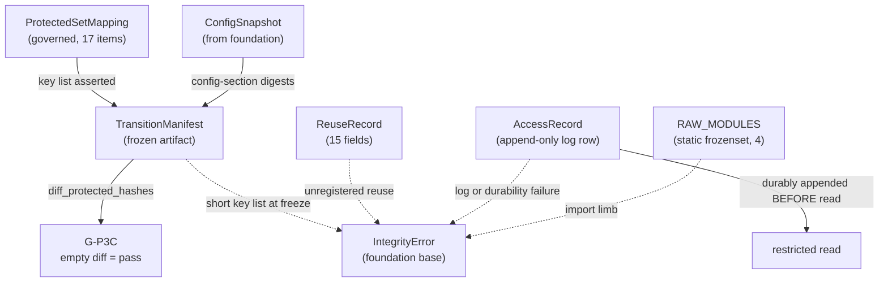

# Domain Entities — `governance-guards`

**Unit** `governance-guards` (Bolt 2) · **Kind** `library` · **Depends on** `foundation`

The data shapes this unit owns: the phase-boundary prohibition, the Phase 1 → Phase 2
transition contract, the single access path into the locked December root, and the
§10.1 external-code reuse register.

**Nothing here is a scientific value.** These shapes *carry* governed values. The 17
protected items are frozen by **D-24**; this stage does not reopen them.

## Sources

- `../../../inception/units-generation/unit-of-work.md` § 2 `governance-guards` — the `Owns` list, the boundary, the 10 requirements, BLK-06 and BLK-07.
- `../../../inception/units-generation/unit-of-work-story-map.md` — Tables 1 and 2, and § Per-unit coverage summary. **Derived by pattern match and cross-checked across both paths, which agree:** 10 requirements, **1** untested (`FR-P1-02-6`); tested by TA-07 TA-08 TA-12 TA-18 TA-27 TA-28 WS-10 WS-18; **owns** TA-27 TA-28; **supports** TA-07 TA-18 WS-18.
- `../../../inception/requirements-analysis/requirements.md` — REQ-ENG-5; FR-P1-02-6; FR-P1-03-2; FR-P1-05-12; FR-P1-06-1…-4; NFR-PHASE-01; NFR-LIC-01.
- `../../../inception/application-design/component-methods.md` — the approved contracts for `phase_contract.py` and `locked_test.py`.
- `../../../inception/application-design/components.md` and `component-dependency.md` § Shared resources — the unqualified carve-out.
- `../../../inception/application-design/services.md` — § Stage entry contract, step 4.
- `evidence/DECISIONS.md` **D-24** (the 17-item canonical protected set) and **D-15** (the relocation of 21 December-bearing files).
- `../../../inception/delivery-planning/bolt-plan.md` § Gate 0 — the `DP-CHAIR-02` ruling and the pre-G-09 boundary.
- `../foundation/functional-design/` — unit 1's `IntegrityError` base, two-tier posture and `ConfigSnapshot`.
- `functional-design-questions.md` — Q1–Q8, the Step 4 ambiguity analysis, and Amendments D and E.

---

## Entity map

Text fallback: `ConfigSnapshot` supplies config-section digests to
`TransitionManifest`; `ProtectedSetMapping` supplies the key list the manifest
asserts against; `diff_protected_hashes` over the manifest yields G-P3C's pass
condition, an empty diff. `RAW_MODULES` backs the import limb. An `AccessRecord`
must be **durably appended before** a restricted read begins. Any of the import
limb, a log or durability failure, unregistered reuse, or a short key list at
freeze raises an `IntegrityError` subclass.

---

## 1. `ProtectedSetMapping` — new, governed, **one** structure

**Q3 as modified by the owner, plus Q1 = D. Settled in the Step 4 analysis as a
single structure**, because that is the only reading under which both answers hold:

| Attribute | Type | Meaning |
|---|---|---|
| key | `str` | A protected-item identifier — exactly D-24's 17 |
| value | `Sequence[str]` | The config keys or artifact paths that item covers (Q1 = D's per-item coverage list) |

**Location.** `configs/experiment.yaml`, holding **only** the authoritative
identifiers and their coverage. Governed, versioned, hashable, reachable through
`ConfigSnapshot` — and not a fifth config file.

**The digest is stored externally, in the `TransitionManifest`, never inside the
section.** This is the whole reason there is no self-reference:

> **Changing the list simply produces a new digest, and that is correct behaviour —
> it is NOT a circularity.** A change to the protected-set enumeration is a governed
> change requiring a Vision §15.2 amendment and a D-number, so it *should* surface
> as a manifest difference. Calling it circular would be an argument for hiding it.

**The complete mapping is hashed — values included.** It is **never** excluded from
hashing to avoid circularity. Excluding it would leave the enumeration that defines
what is protected as the one unprotected thing in the set. Because the mapping is one
structure, this covers a coverage-list drift as well as an identifier change: a
per-item list that changed while its identifier stayed put would otherwise be an
unprotected change to what "protected" means.

**Genuine self-reference, narrow rule.** *If* the hashed section ever stores its
**own expected digest**, canonicalization removes or normalizes **only** that
self-referential digest value — nothing else.

**Canonical contract, per Q1 = D.** Keys sorted; comments dropped; scalars
normalised; the **canonicaliser's own version recorded in the manifest**, because
changing how you canonicalise changes every digest.

**Six hashable-representation kinds cover D-24's 17 items, not one.** Derived from
D-24's table; the full taxonomy and each kind's computation are in
`business-logic-model.md` § W-3a and § W-3b:

| Kind | Items | Computed by this unit? |
|---|---|---|
| Config-section hash | 4, 7, 9, 11, 14, 16 | Yes |
| **Field hash** | **5, 6** | Yes — narrower scope, same canonicaliser, plus D-24's per-item assertion |
| Config hash (whole file) | 12 | Yes |
| Source-file content hash | 1 | Yes |
| **Parameter hash** | the second half of **15** | Yes — named-parameter digest, sibling of the field hash; **not** a config-section or whole-file hash |
| Composite source + second half | 13, 15, 17 | Yes — ordered pair, but **each has a DIFFERENT second half**: 13 config-section, 15 **parameter**, 17 config-per-listed-method (scope ⚠ open) |
| **Externally supplied digest** | 2, 3, 8, 10 | **No — recorded, not computed.** Item 3 is `foundation`'s §13.1 environment hash; item 8 is `features-and-splits`' fold/embargo/mask manifests; items 2 and 10 come from `models-and-baselines`' training path |

> **Corrected 2026-08-22 after an adversarial review.** The first issue of these
> artifacts asserted *"Eight of D-24's 17 items"* use the config-section path, listing
> 4, 5, 6, 7, 9, 11, 14, 16. Items 5 and 6 are typed **`Field hash`** — a different
> mechanism that was silently folded in. The wider defect, found while fixing that
> one: **D-24 uses six distinct kinds and the first issue defined one**, leaving
> eleven items' mechanisms unspecified in the unit that owns the phase-transition
> manifest.
>
> **Four of the 17 are not this unit's to compute at all**, which makes the manifest's
> integrity partly dependent on three other units. That is a real property of the
> design and is now stated rather than left implicit.

**Required mutation behaviour** — the contract each test in `business-rules.md` R-03
asserts:

| Mutation | Required behaviour |
|---|---|
| **Deletion** of a protected key | Digest changes **and** freeze-mode membership assertion fails |
| **Addition** of a key | Digest changes **and** membership assertion fails against D-24's 17 |
| **Duplication** of a key | **Rejected** — D-24's cardinality of 17 is *calculated from the enumeration*, so a duplicate is a malformed set, not a longer one |
| **Reordering**, semantically irrelevant | Digest **unchanged** — the 17 items are a set and the canonical form sorts keys |
| **Renaming** a key | Digest changes **and** membership assertion fails; the name *is* the identifier |
| Frozen manifest contents | **Exactly** D-24's 17-item set — no more, no fewer, no duplicates |

## 2. `TransitionManifest` — approved contract, unchanged

Defined at stage 2.6 and **not modified here**: `protected_hashes`,
`phase1_artifacts`, `phase1_schema`, `config_hashes`, `approved_decisions`,
`invariants`, `unresolved_phase2`.

**Two fields this stage adds behaviour to rather than shape:**

- `protected_hashes` carries **exactly** the canonical set — D-24's 17.
- Per Q2 = D, the manifest additionally records its **build mode** (`draft` |
  `freeze`) and the **canonicaliser version**. Whether those are new fields or
  entries within an existing mapping is a stage 3.5 shaping decision; the
  *semantics* are fixed here.

**Lifecycle.** Built by `build_transition_manifest`. **Draft** builds are permitted
from Bolt 2 onward and record an `absent` sentinel for any item whose governing
artifact does not yet exist — which is currently **all 17**, since no config file or
`src/` package exists. **Freeze** builds raise on any `absent` item and assert the
key list equals D-24's 17.

**Why draft mode exists.** A mechanism first run at a freeze gate is a mechanism
first debugged at a freeze gate. Draft builds make the manifest exercisable eleven
Bolts before it is relied on, which matches this project's affirmed posture that
reproducibility is executable rather than asserted.

**The G-P3C pass condition is an empty `diff_protected_hashes`.** Its strength is
exactly the strength of the set behind it:

> **BLK-06's enumeration limb is RESOLVED by D-24 at 17 items. Its per-item binding
> to concrete config fields and file paths is PENDING.** Until that is discharged and
> approved, **an empty diff is still not proof that no protected item changed.**
> `component-methods.md`'s standing caution is half-discharged, not retired — see
> `functional-design-questions.md` § Amendment D.

## 3. `RAW_MODULES` — approved constant, four modules

`frozenset({"src.gnss.rinex", "src.gnss.calibration", "src.gnss.target", "src.gnss.verification"})`

**Four, not two.** FR-P1-03-2's earlier wording listed only `rinex` and
`calibration`; `target.py` and `verification.py` were added as raw-processing
adapters per finding `IMPL-2`. This stage designs to the four.

**Lifecycle.** Static. Consumed by `assert_phase_boundary` at step 4 of the stage
entry contract, so the prohibition holds **inside the Kaggle session**, where a
commit hook cannot fire and a local suite run proves nothing about the environment
the governed run executes in.

## 4. `AccessRecord` — approved contract, with a hardened ordering rule

Approved fields, unchanged: `run_id`, `retrieved_at_utc`, `scope`, `purpose`
(`coverage_audit` | `regime_audit` | `locked_evaluation`), `performance_inspected`,
`locked_test_accessed` (always `True` for any read under `RESTRICTED_ROOT`),
`authorization`.

**Ordering, stated as a hard precondition on the owner's direction:**

> **The access-log append must be DURABLY COMPLETED before the December read
> begins.** A log-write failure **or** a durability failure must **prevent the
> read** — not be reported alongside it, not be retried after it, not be logged as a
> warning while the read proceeds.

`VAL-2` and FR-P1-02-3 make log-then-read the requirement: an access recorded after
the fact **fails** the ordering check rather than satisfying it.

**Lifecycle.** One row per read, appended to the access log, never mutated. The log
already contains **five retrospective rows** predating this guard
(`evidence/experiment_registry.md` records rows 3, 4, 5, 8 and 9 as retrospective),
so the log holds two kinds of row and the distinction is explicit in the register
rather than inferred from ordering.

## 5. `ReuseRecord` — the §10.1 register, fifteen fields

`reuse_id` · repository URL · immutable commit or tag · upstream file and line or
function · retrieval date · licence and SPDX ID · copied-versus-adapted status ·
destination file · scientific purpose · modifications · tests · original citation ·
notice location · reviewer · approval date.

**Recorded before the code is used**, and before gate **G-P2**.

**Per Q7 = D, this is the exception path, not the main road.** The standing default
is **reimplementation from the paper with a citation** — `project.md` § Forbidden
prohibits copying source whose licence is absent, ambiguous or incompatible, and
that default holds while the AGPLv3 question is open. The AGPLv3 Global-TEC-forecasting
repository is the only approved direct-copy source today, and **whether its
distribution obligations permit that copying is an unresolved governance dependency
this project does not settle.**

**Completeness is checkable, not trusted.** Every adapter module carries a mandatory
**provenance marker**; the register is asserted complete against the set of marked
modules, and an unmarked module is asserted to contain no reuse.

## 6. `RESTRICTED_ROOT` — the single chokepoint

`"evidence/locked_test_restricted"`. `open_restricted` is the **only** path into it.
`component-dependency.md` § Shared resources states the rule without qualification:
*"nothing else may construct a path into it."*

**Why absolute.** **D-15** records that the restricted root is a **governance
boundary, not an access control** — it holds only while exactly one code path reaches
it. A second path does not weaken it slightly; it ends it.

> **BLK-07 is OPEN and stays open.** Four units reach the root through this
> contract: `inventory-and-registry` (pre-G-05 coverage audit), `acquisition` (the
> D-9 input and any December re-acquisition — the unrecorded routing that *is*
> BLK-07), `features-and-splits` (locked partition), `evaluation-and-comparison`
> (locked evaluation).
>
> **Acceptance of the Question 8 design mechanism is NOT authorization to open
> locked December data.** Which units are authorised to reach the locked month is a
> decision the project decision owner receives and approves. Nothing in this unit's
> artifacts grants it, implies it, or substitutes for it.

## 7. `IntegrityError` subclasses raised here

Deriving from `foundation`'s base (unit 1, R-01), each carrying the affected
resource and the violated expectation:

| Exception | Raised when |
|---|---|
| `PhaseBoundaryError` | A `RAW_MODULES` name is loaded under `phase == 1`; or a Phase 1 frame carries a DCB, STEC, mapping, satellite or arc field |
| `LockedTestError` | `path` is not under `RESTRICTED_ROOT`; or the access-log write or its durability fails |
| `ReuseError` | A marked adapter module has no register entry, or an entry is missing any of the fifteen fields |
| `ManifestError` | A freeze-mode build finds an `absent` item, or the key list does not equal D-24's 17 |

Catching `foundation`'s base is what lets the stage entry contract write the
`aborted` registry row for any of them — including a subclass added later.

---

## Requirement coverage

Derived from story-map Table 1, with owners from Table 2's `primary` cell. Both
paths cross-checked and in agreement.

| Requirement | Entities | Tested by (Table 1) | Row primary owner |
|---|---|---|---|
| REQ-ENG-5 | `RAW_MODULES`, `TransitionManifest` | WS-10, TA-07, TA-08, TA-12, TA-27 | `features-and-splits` ×3; `models-and-baselines`; **`governance-guards`** (TA-27) |
| **FR-P1-02-6** | `RESTRICTED_ROOT` guard | ⚠ **NO CURRENT ACCEPTANCE ROW** | — |
| FR-P1-03-2 | `RAW_MODULES`, both limbs | TA-27 | `governance-guards` |
| FR-P1-05-12 | `AccessRecord` | WS-18, TA-18 | `features-and-splits` |
| FR-P1-06-1 | `ProtectedSetMapping`, `TransitionManifest` | TA-27 | `governance-guards` |
| FR-P1-06-2 | `TransitionManifest` | TA-27 | `governance-guards` |
| FR-P1-06-3 | `TransitionManifest` | TA-28 | `governance-guards` |
| FR-P1-06-4 | `TransitionManifest` | TA-28 | `governance-guards` |
| NFR-PHASE-01 | `RAW_MODULES`, `TransitionManifest` | TA-27 | `governance-guards` |
| NFR-LIC-01 | `ReuseRecord` | TA-28 | `governance-guards` |

**10 requirements, 1 without an acceptance row.** This unit **owns** TA-27 and
TA-28, and **supports** TA-07, TA-18 and WS-18 — three relations, three different
sets, each derived rather than reasoned.

> ## FR-P1-02-6 — explicitly untested, and it stays that way
>
> On the project decision owner's explicit direction, `FR-P1-02-6` is preserved as
> an **explicitly untested obligation until an approved acceptance row exists AND
> its test has passed** — both conditions, not either.
>
> Q4's content-scan design is a **test specification only — not an approved
> acceptance row and not evidence of a passing result.** No artifact, manifest or
> report may state or imply that FR-P1-02-6 is covered, satisfied or verified.
> Designing the guard does not test it; implementing it does not test it.

## Assumptions & Open Questions

- **[assumption]** `tests/test_locked_test_guard.py` is **not** this unit's. ADR-03 splits the guard deliberately — the access-log limb here, the execution limb in `features-and-splits`'s `splits.py` — and the test covering both limbs is owned by `features-and-splits` to keep this unit a DAG root. Table 2 confirms `features-and-splits` owns WS-18 and TA-18 with this unit supporting.
- **[assumption]** NFR-PHASE-01's transition-manifest hash-diff test has **no module in the TE §12 tree** and needs frozen artifacts from every later unit. Carried on `fixtures-and-reproducibility` with this unit supporting. Not this unit's to build.
- **[assumption]** `frontend-components.md` is not produced — `kind: library`, and the stage maps that artifact to `[ui]` only.
- **[assumption]** Whether `build_mode` and `canonicaliser_version` are new `TransitionManifest` fields or entries inside an existing mapping is left to stage 3.5. Only the semantics are fixed here, so no approved dataclass contract is changed by this stage.
- **Open — BLK-06's per-item binding.** D-24 resolved the enumeration at **17 items**; the binding to concrete config fields and file paths is **PENDING**, and no config file or `src/` package exists yet. Entities 1 and 2 produce the binding evidence. **BLK-06 is not closed by this stage**, per `DP-CHAIR-02`.
- **Open — BLK-07 authorization.** See § 6. The owner receives and approves it; the design mechanism is not a substitute.
- **Open — Amendment D.** `component-methods.md` and `unit-of-work.md` § 2 both carry text superseded by D-24. Provenance preserved: both were correct when written. **Neither is edited by this stage** — approved-stage artifacts, reserved by `CHANGE_RECORD_PROCEDURE.md` absent owner approval for annotate-in-place.
- **Open — where the D-24 conformance test gets its list.** The test must assert the frozen manifest contains exactly D-24's 17 items, checked against the **authority** rather than only the config. Both available routes carry a named cost: hardcoding the list is a fourth copy of a governed enumeration; parsing `evidence/DECISIONS.md` makes a governance prose document a test dependency, which Q3 option C was rejected for. **No third option is invented.** Raised at the gate.
- **G-09 is not signed.** No entity here authorises creating `phase_contract.py`, `locked_test.py` or `reuse_registry.py`.
- **None** of the above adopts a reading on a supervisor-owned value, and none decides a scientific constant.
