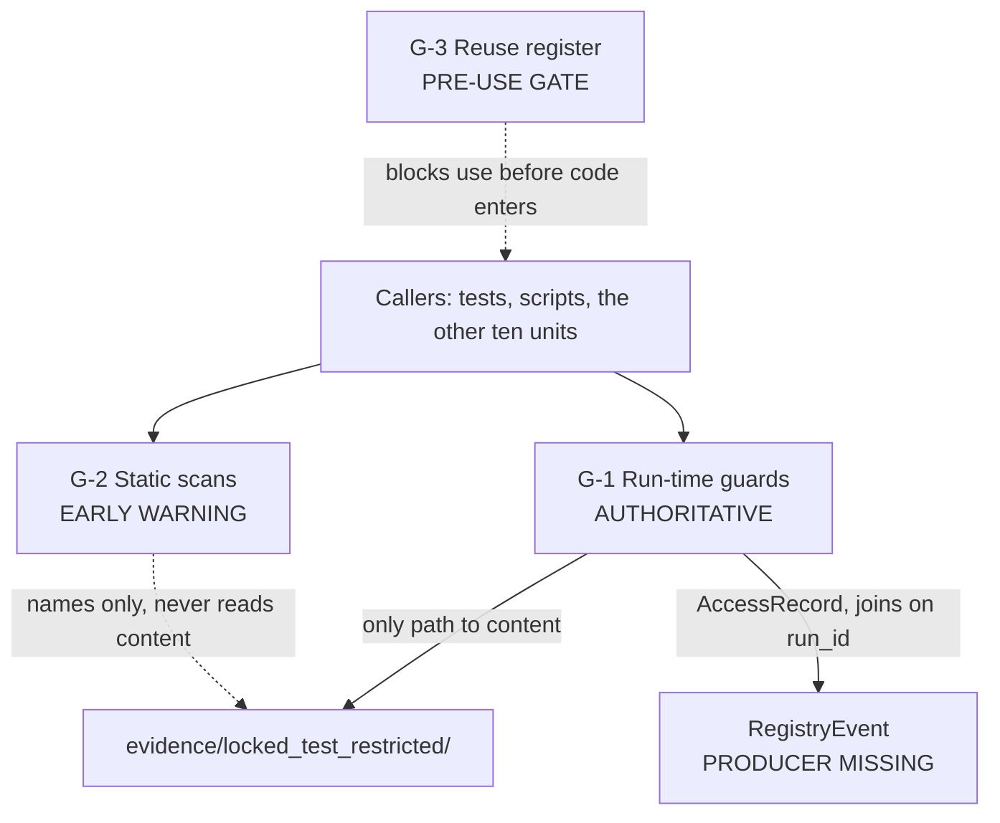

# Logical Components — `governance-guards`

**Unit** `governance-guards` (Bolt 2) · **Kind** `library` · **Stage** `nfr-design`

> **Re-saved 2026-09-02, content unchanged.** A `STAGE_JUMPED` redo of `nfr-design` — ordered
> by the project decision owner to repair a Critical finding in the sibling unit
> `external-products` — cleared this stage's per-unit checkpoint and review receipts for every
> unit. This unit's decomposition was **not** revised; the summary was re-confirmed and the
> artifact re-saved so the required receipts exist again. **G-1/G-2/G-3, the 121 access rows
> and every status claim stand exactly as recorded.**
>
> **Repeated once more the same day**, after a second owner-directed redo. This unit was
> untouched by both. **G-2 now carries a second recorded narrowing** beside DISC-2:
> `assert_no_december_outside_restricted` scans `*.json` only, recorded by
> `inventory-and-registry`. Widening it is G-2's change to make.
>
> **Repeated a third time**, after the seventh reviewer pass on `external-products`. **This
> unit was untouched by all three redos.**
>
> **And a fourth redo 2026-09-04**, to repair two Majors in `target-standardization`. **This unit was untouched by all four.**

> ## ⚠ COMPONENT STATE IS MIXED — some of this is built, most is not
>
> Written against the **workspace as it is on 2026-09-01**, per the owner's ruling, not
> against `nfr-requirements`' status claims. See `security-design.md` § SD-G-00 for the
> three upstream claims this contradicts and the **two discrepancies that run the other
> way** (DISC-1: the exempt list has **seven** members, not six; DISC-2: the literal scan
> is **textual**, not AST-based).
>
> **The execution evidence lands on G-1 only, and does not redistribute across the
> boundary.** The 121 rows evidence **G-1's chokepoint**; they say nothing about **G-2's**
> scans (whose weakness is DISC-2) or **G-3**, which does not exist. A boundary drawn on
> enforcement timing is exactly what makes that legible: run-time evidence accrues to the
> run-time component and nowhere else.
>
> **This is a logical decomposition, not an infrastructure deployment.** No services, no
> processes, no network boundaries. `governance-guards` is a **guard library plus its
> tests**, and its "failure domains" are the blast radii of function calls in one process.
>
> **The suite runs off-pin.** 277 passed / 2 skipped under **Python 3.14.7**, not the
> governed **3.11**. **Not governed evidence.** **G-09 is signed (D-31), preconditions
> UNMET**; **stage 3.1 remains FAIL**.
>
> **That run exercised G-1, and left 121 rows behind.** The routed suites read restricted
> content, so **G-1's chokepoint logged every access**: `evidence/test_run_access_log.jsonl`
> went from **37 rows to 158** — insertions only, no rewrites (`git diff --stat`:
> `121 insertions(+), 0 deletions`, derived rather than asserted). Every row carries
> `locked_test_accessed: true` and a **guard-stamped `logged_at_utc`**.
>
> **This is the first execution evidence that G-1 behaves as designed**, and it belongs in
> this component's own record rather than only in the sibling artifact. It is still **not
> governed evidence**, because it is off-pin. The rows were **not deleted afterwards**:
> deleting access records is the exact failure G-1 exists to prevent, and `project.md`
> forbids back-filling a registry to clear entries. See `security-design.md` § SD-G-01.

## Sources

- `security-design.md` — **SD-G-00** … **SD-G-06**, this stage's sibling artifact; the boundaries below are where those decisions land, and § SD-G-00 carries the workspace evidence.
- `nfr-requirements/security-requirements.md` — **SEC-G-01** … **SEC-G-06** as the requirement set; **status claims superseded**.
- `nfr-requirements/tech-stack-decisions.md` — **TS-G-01** … **TS-G-04**.
- `functional-design/business-logic-model.md` — **W-8**/**W-8a**, **W-10**, **W-11**; **R-23** (both limbs), **R-24** (the enforcement hierarchy), **R-25**, **R-26**, **R-27**, **R-28**.
- **The workspace, read 2026-09-01** — `src/data/locked_test.py`, the six test modules, `scripts/` (two scripts only), and the pytest run.
- `../../foundation/nfr-design/logical-components.md` — the sibling decomposition; the same criterion class (failure consequence, not module listing) is applied here.
- `../../../inception/requirements-analysis/requirements.md` — **FR-P1-02-3**, **FR-P1-02-6**, **FR-P1-03-2**, **FR-P1-06-1** … **FR-P1-06-4**, **REQ-ENG-5**, **NFR-AUD-01**, **NFR-PHASE-01**, **NFR-LIC-01**.
- `nfr-design-questions.md` — Q4 = A, and the receipted Consolidated Summary Confirmation.

---

## The boundary criterion (Q4 = A)

**The boundary is drawn on enforcement timing, mirroring R-24's own hierarchy:**

> **A static-scan failure is a warning to fix before a run. A run-time guard failure stops
> the run.**

R-24 already fixes that the **static scan is the early-warning limb** and the **run-time
assertions are authoritative**, and that **both run**. A component diagram that did not
show that distinction would describe a different system — and conflating the two is
precisely how a project comes to treat an advisory scan as though it enforced something.

**Why not "on what is guarded"** (restricted-root / phase-boundary / licence). It maps
neatly to the three governing rules and reads well against the requirements, but it puts a
**static scan and a run-time assertion in the same box**, blurring the one distinction
R-24 exists to preserve. It would also split the literal scan from the residency scan,
which share a traversal technique and a fail-closed rule.

**Why not a single component.** True to how it is imported, silent on the property that
matters most.

**Consistency with the sibling unit.** `foundation` drew its boundary on **failure
consequence** — a bad read fails a run, a bad write corrupts the record. This unit uses the
same *kind* of criterion, applied to its own material. The two units stay comparable
without being forced into the same shape.

---

## Component inventory

| # | Component | Contents | Enforcement class | State on disk |
|---|---|---|---|---|
| **G-1** | **Run-time guards** | `open_restricted` chokepoint; `AccessRecord` writer with `os.fsync`; `assert_no_raw_fields`; `diff_protected_hashes` | **Authoritative** — failure **stops the run** | **Partially built** |
| **G-2** | **Static scans** | literal scan; residency scan (`assert_no_december_outside_restricted`); phase-boundary import walk | **Early warning** — failure is a warning to fix | **Built, one weaker than specified** |
| **G-3** | **Reuse register** | §10.1 register; licence gate for G-P2 | **Pre-use precondition** — blocks *use*, not a run | **Unbuilt** |

### G-1 — Run-time guards (authoritative)

**What is built.** `open_restricted` (`src/data/locked_test.py:147`) and its
`AccessRecord` writer. Three properties enforced in code: it **refuses ordinary paths**
(*"a guard that accepts anything stops being evidence"*); it **derives the boundary from
the module's own location**, so a caller cannot relocate it by passing a different root;
and a **failed log write aborts the read**. Durability is **`os.fsync`**, and
`logged_at_utc` is **stamped by the guard, never by the caller**.

**What is not built.** **`assert_no_raw_fields` does not exist** — verified by grep across
`src/`, `tests/` and `scripts/` — and **none of the eight Phase 1 producing scripts
exists** (`scripts/` holds `audit_ec1_drivers.py` and `merge_coverage_year.py` only).
**`diff_protected_hashes` does not exist.**

**The blast radius, and why this component is one.** Every member either **prevents an
action** or **fails the run attempting it**. A chokepoint failure prevents a read; a
produced-field assertion failure prevents a write; a protected-hash difference prevents
Phase 2 training. They share a failure consequence, which is the criterion.

> **⚠ R-23's "neither limb substitutes for the other" is load-bearing here.** The import
> limb lives in **G-2** and is built; the produced-field limb lives in **G-1** and is not.
> **The built limb does not cover for the missing one** — a component diagram that grouped
> them would make that gap invisible, which is the second reason for this boundary.

### G-2 — Static scans (early warning)

**What is built.** The **literal scan** (`tests/test_locked_test_guard.py:277`), the
**residency scan** (`assert_no_december_outside_restricted`), and the **phase-boundary
import walk** (`tests/test_phase_boundary.py`, 53 tests, `ast`-based over `src/` and
`scripts/`).

**Two independent scans, one shared rule** (Q3 = A). The literal scan asks **who may name**
the root; the residency scan asks **whether December content has escaped** it. Different
hit definitions, different failures, separately runnable — which matters because
**`FR-P1-02-6` carries no acceptance row at all**, making the residency scan the one most
likely to be run or changed on its own. **R-27's unparseable-is-a-failure rule is one
helper both call.**

**The residency scan is recursive by construction** — the code records that `DATA-01`
showed a non-recursive glob *"silently stopped checking the artifacts that matter most"*,
and D-15 relocated 21 files.

> **⚠ DISC-2 lives in this component.** The literal scan is **textual**
> (`if "locked_test_restricted" in text`), not **AST-based with constant folding** as
> `nfr-requirements` Q2 = B specifies. A **concatenated literal is not caught**. G-2 is
> therefore **weaker than its own specification**, and because G-2 is the *early-warning*
> limb, the authoritative containment still rests on **G-1's chokepoint** — which is
> exactly why R-24's hierarchy is the right boundary and why the gap, while real, is not a
> containment breach.

### G-3 — Reuse register (pre-use precondition)

**Unbuilt.** `src/data/reuse_registry.py` and `tests/test_reuse_registry.py` do not exist.

**Why it is its own component rather than folded into G-2.** It gates **when code may be
used**, not when a run may proceed — a different question from both other components, on a
different timeline (before the code enters the repository at all), with a **different
consumer**: gate **G-P2**, which is **unaffected by G-09's signature**. Reimplementation
from the paper is the **standing default** while the AGPLv3 question is open.

---

## Shared resources and the enforcement hierarchy

**Text fallback.** Callers reach both G-1 and G-2. **G-1 is the only path to restricted
content**; G-2 only *names* the root and never reads content beneath it — which is D-15's
distinction as scoped by R-28: **holding the literal is not an access; reading bytes is**.
G-1 writes `AccessRecord`s that join `RegistryEvent` on `run_id`, and **that producer does
not exist**. G-3 gates code before it enters the repository, so it constrains the callers
rather than any run.

**The shared resource is the exempt list**, and it is shared **read-only** by G-1 and G-2 —
G-1's chokepoint is its first member; G-2's literal scan asserts membership **exactly**.
Per **Q2 = A** it is a **module-level source constant**, not config: the criterion was
*what does it take to widen this*, and a source constant costs a code change plus a test
update. TC-03e does not reach it — that rule governs **scientific constants**, and a
security allowlist changes who may name a boundary, not what any number comes out as.

> **⚠ DISC-1: the list has seven members on disk, six in every upstream document.** The
> seventh, `tests/test_merge_script_restricted_reads.py`, was added **2026-08-28 because
> the membership assertion caught it on first run** — *"a new holder fails rather than
> being silently admitted."* **The mechanism working is what made the documented count
> stale.** Member 5 is `scripts/merge_coverage_year.py`, a **production script, not a
> test**.

---

## Requirement coverage

| Requirement | Component | Acceptance row | Status |
|---|---|---|---|
| **FR-P1-02-3** | G-1 | **WS-18, TA-18** | `Pending` — built, passes **off-pin only** |
| **FR-P1-02-6** | G-2 | ⚠ **NO ACCEPTANCE ROW** | untested by any §16/§19 row |
| FR-P1-03-2 | G-1, G-2 | TA-27 | `Pending` — **import limb only; produced-field limb unbuilt** |
| **NFR-PHASE-01** | G-1, G-2 | TA-27 | `Pending` |
| **NFR-AUD-01** | G-1 | **TA-10, TA-21** — both rows | `Pending` — **`RegistryEvent` producer missing** |
| **NFR-LIC-01** | G-3 | TA-28 | `Pending` — **unbuilt** |

**Derived and printed**: 3 components (G-1…G-3); **6** coverage rows — counted directly
from the table above. **0** rows claimed satisfied; **0** components complete.

**Relation to `security-design.md`'s 11 rows, printed as a decomposition** — the two tables
are **not nested**, so no single "N fewer" subtraction can describe them, and a subtraction
of that form went stale three times running on `models-and-baselines` at the previous
stage:

- **6 rows shared** — FR-P1-02-3, FR-P1-02-6, FR-P1-03-2, NFR-PHASE-01, NFR-AUD-01, NFR-LIC-01.
- **5 rows in `security-design.md` only** — REQ-ENG-5, FR-P1-06-1, FR-P1-06-2, FR-P1-06-3, FR-P1-06-4. All four `FR-P1-06-*` and REQ-ENG-5 are **obligations on the reuse register's contents and the phase-boundary rule text**; none of them changes **where a component boundary sits**.
- **0 rows here only.**
- **6 + 5 = 11**, matching `security-design.md`'s printed total.

> **A decomposition that verifies is not evidence the decomposed set is complete.** That
> lesson came from `foundation` at this stage, where a sound 3/3/0 decomposition sat over a
> row set missing three requirements. **The ID set here was set-differenced against
> `requirements.md` before either table was written.**

## Assumptions & Open Questions

- **[DISC-1]** **Seven exempt members on disk, six in every upstream artifact.** Owed to the human at the gate; **`nfr-requirements` is not edited**, per the owner's ruling.
- **[DISC-2]** **G-2's literal scan is textual, not AST-based**, so the concatenated-literal evasion is open. Containment still rests on **G-1's chokepoint**. Owed at 3.5.
- **[G-1]** **`assert_no_raw_fields` and `diff_protected_hashes` do not exist**; **none of the eight Phase 1 producing scripts exists**. R-23's produced-field limb is **specified and unbuilt**, and the built import limb **does not substitute for it**.
- **[G-1]** **Kaggle's `fsync` semantics are uncharacterised**, and Q1 = A makes `open_restricted` **refuse there** — which **blocks the pre-G-05 December coverage audit on Kaggle** until W-6 step 8's measurement. **A scheduling dependency on the critical path.**
- **[G-1 → RegistryEvent]** **`src/data/registry.py` does not exist**, so SEC-G-02's **both-ways orphan detection cannot run in either direction**. One half of a two-half contract.
- **[G-3]** Entirely unbuilt. **G-P2 is unaffected by G-09's signature**, and the AGPLv3 distribution question is a **governance dependency this project does not resolve on its own**.
- **[assumption]** The other ten units need only G-1's and G-2's entry points, never a guard internal. **Unverified** — most of those units are unbuilt, so nothing has yet tried.
- **[banner]** **The suite is off-pin** — Python **3.14.7** against the governed **3.11**, pytest unpinned for want of a `requirements.txt`. **Not governed evidence.**
- **None** of the above decides a scientific value, fills a `TBD — freeze gate` field, or claims a gate, acceptance row, install or test as discharged.
