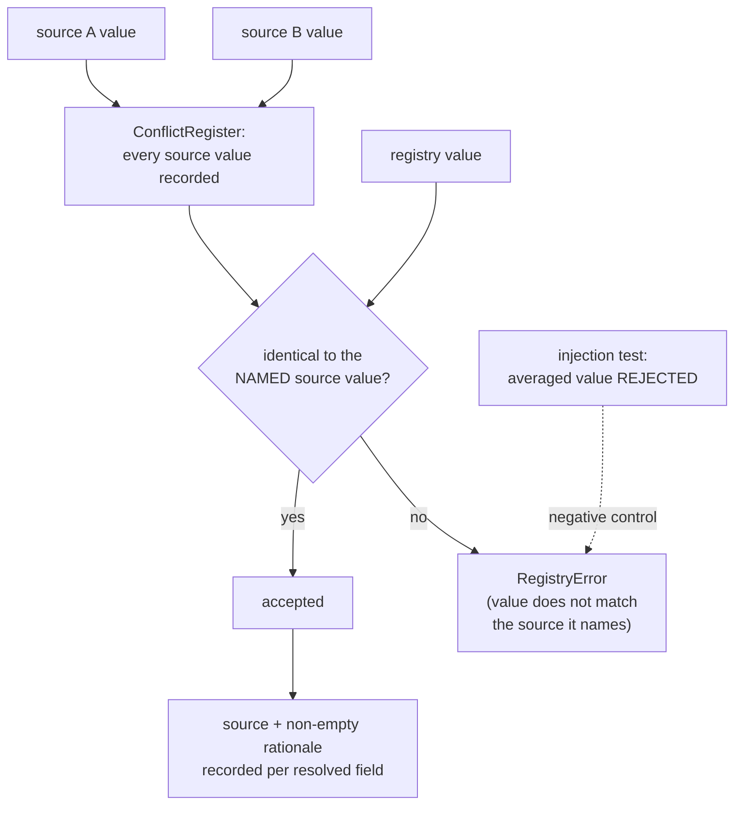
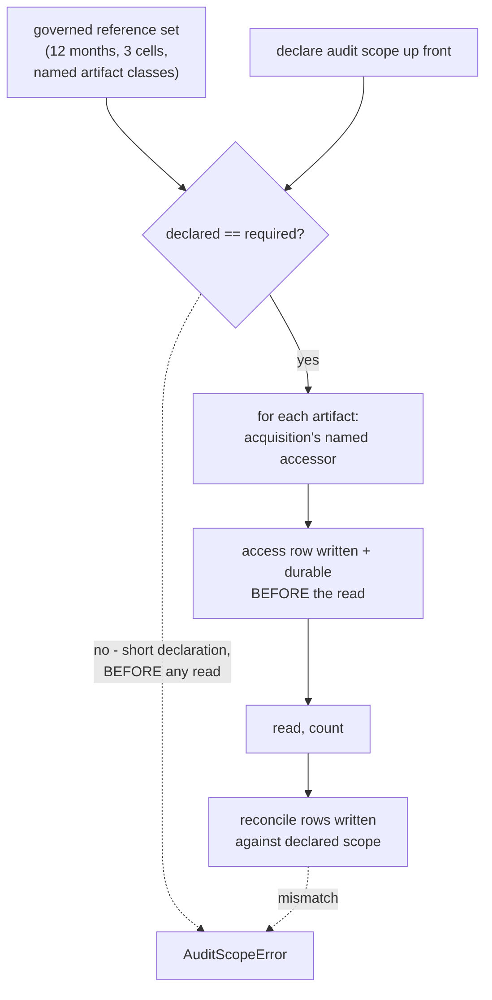

# Business Logic Model — `inventory-and-registry`

**Unit** `inventory-and-registry` (Bolt 4) · **Kind** `library` · **Depends on**
`acquisition`

> **Re-established a sixth time 2026-08-24**, on a **new stage attempt** — Inception closed
> and Construction opened at 2026-08-24T11:46:26Z, resetting the receipt floor for every
> unit. **No content of this unit changed.** Both `foundation` passes of that day (the
> amendment pass and the sites 9–11 addendum, in
> `governance/CHANGE_RECORD_2026-08-24_foundation_amendments.md`) touch nothing this unit
> reads: `DeterminismRecord` is not among the `component-methods.md` contracts consumed
> here, and the amended `services.md` § Run record and registry and `unit-of-work.md` § 1
> are not the sections read here (**§ The nine stage scripts**, **§ Stage entry contract**
> and **§ 4** are). **`write_release` was checked directly rather than inferred**: its
> signature is unchanged and the `source_files`-validated-against-`inventory.py` clause this
> unit depends on is intact. Amendment A was declined, so **no count moved**. **The READY
> verdict in § Review belongs to the previous attempt.**

> **Re-established a fifth time 2026-08-23**, after a redo correcting a sibling's citations.
> **No content of this unit changed** — but the correction concerned this unit's numbering:
> `target-standardization` had cited "`inventory-and-registry` R-20" for an open authority
> question. **This unit's rules run R-44…R-53 and it has no R-20**; the rule carrying that
> question is `governance-guards` R-20. This unit's **R-49** carries a related but distinct
> point — that D-24's protected set is not reopened.

> **Re-established 2026-08-23 after a stage-wide redo jump.** The jump was aimed at a
> correction in `acquisition` and reset the receipt floor for **every** unit of this stage.
> **No content of this unit changed** — its iteration-2 adversarial verdict was READY with
> no surviving findings. The summary was re-confirmed and the artifact re-saved so the
> receipts match the current attempt.
>
> **Re-established a second time 2026-08-23** after a further stage-wide redo aimed at
> `external-products`. **No content of this unit changed on that occasion either.**
>
> **Re-established a third time 2026-08-23**, and this one DID change content here.
> `component-methods.md` § Depth specifies **cross-package boundary calls only** and names
> **`functional-design` (3.1)** as where intra-package shapes are specified. `inventory.py`
> and `release.py` are the **same package**, so W-1's contract is this stage's ordinary work
> and **not an amendment owed**. **Question 1's answer (D) is unchanged**; this unit owes
> **one** amendment — W-2a's `Station.provenance` field — not two.
>
> **A fourth re-establishment** followed a sweep of this unit's **question file**, which had
> not been corrected alongside these artifacts because its receipt was recorded before the
> correction was applied. **No content of this artifact changed.** The ordering is changed
> going forward: corrections land in the artifacts **and** the question file before a
> confirmation receipt is recorded.

The workflows this unit implements: the source inventory, the station registry and its
conflict resolution, migration of the frozen notebook literals, schema validation of the
prepared product, the **performance-blind December coverage and regime audit**, and the
**G-P1A** decision record that audit feeds.

**This unit performs the one December read this project treats as legitimate before the
lock opens.** Vision §8.3 makes the pre-G-05 coverage and regime audit **required** and
performance-blind; it is a different event from the one-shot locked evaluation at G-06,
and the "open it once" rule governs only the latter.

**It does not transform provider values.** It inventories, validates, counts and refuses.

## Sources

- `../../../inception/units-generation/unit-of-work.md` § 4 — the `Owns` list, the boundary, the 7 requirements, and the implementation notes.
- `../../../inception/units-generation/unit-of-work-story-map.md` — Tables 1 and 2 plus § Per-unit coverage summary; both derivation paths agree on 7 requirements and **2** without an acceptance row.
- `../../../inception/requirements-analysis/requirements.md` — FR-P1-02-1 through -5, -7, -8; § Known defects rows 3 and 9.
- `../../../inception/application-design/component-methods.md` — `src/data/registry.py` (`Station`, `load_registry`, `assert_registry_resolved`) and `src/data/release.py` (`write_release`, which validates `source_files` against `inventory.py`).
- `../../../inception/application-design/services.md` § The nine stage scripts and § Stage entry contract.
- `../acquisition/functional-design/business-rules.md` — **R-32**, **R-33**. This unit is `acquisition`'s first downstream consumer and uses its named-accessor routing.
- `../governance-guards/functional-design/business-rules.md` — **R-25**, **R-26**, **R-28**.
- `evidence/DECISIONS.md` — **D-1** and its 2026-08-21 addendum, **D-2**, **D-12**, **D-13**, **D-143**, **D-144**.
- Workspace inspection, 2026-08-23: `notebooks/madrigal_phase1_coverage_audit.ipynb`, `tests/`, and the absence of `src/` and `configs/`.
- `functional-design-questions.md` (**Q1 through Q9**), `domain-entities.md`, `business-rules.md`.

---

## W-1 — Building the source inventory

```
INPUT   acquisition's released artifacts, by release ID and hash
OUTPUT  a source inventory: TE §5.1's nine fields per entry
RAISES  InventoryError
```

Nine fields per source entry, not three: provider, role, filename or product identifier,
coverage, retrieval date, checksum, version or release status, licence and access notes,
**and the configuration that consumes it**. An entry carrying fewer than nine **fails**.

**Consumes by release ID and hash, never by path.** `unit-of-work.md` § 4 fixes the
boundary: this unit reads `acquisition`'s *released* artifacts, so a change upstream
surfaces as a hash mismatch rather than as silently different content.

> ## `src/data/inventory.py` — SPECIFIED HERE BY DESIGN, NOT AN AMENDMENT
>
> `unit-of-work.md` § 4 names it in this unit's `Owns` list, and `component-methods.md`'s
> `write_release` states that `source_files`' six items *"are validated against
> `inventory.py` rather than restated as a bare hash"*. **Q1 = D designs it MINIMALLY** —
> only what that stated dependency and TE §5.1's nine fields require, nothing speculative.
> A minimal contract is easier to widen later than a speculative one is to narrow.
>
> ## ⚠ CORRECTED 2026-08-23 — THIS IS NOT AN AMENDMENT OWED
>
> `component-methods.md` § Depth states its own policy: **"Full signatures with types for
> cross-package boundary calls. Names and one-line purposes for intra-package functions…
> Every signature below is a cross-package boundary."** Its Assumptions add: **"[Q1]
> Intra-package helper names are indicative. `functional-design` (3.1) specifies them per
> unit and may rename freely — only the signatures above are contracts."**
>
> **`src/data/inventory.py` and `src/data/release.py` are the same package.** The reference
> from `write_release` is therefore **intra-package**, and the absence of a block is the
> artifact's **stated design**, which **names this stage (3.1) as where the shape is
> specified**. Nothing is owed and no change record is needed.
>
> **Superseded reading, preserved:** that the absence was a gap of the same class as
> `acquisition`'s `open_d9_input` — a new symbol in a boundary block that exists and omits
> it, `scripts/` to `src/data` being genuinely cross-package. That one is real; **this one
> was a misreading of a stated depth policy.**
>
> **Consequence for the count:** this unit owes **one** amendment, not two — R-46's
> `Station.provenance` field, which modifies an existing boundary dataclass.


## W-2 — Building the station registry

```
INPUT   snapshot: ConfigSnapshot
OUTPUT  Mapping[str, Station]
RAISES  RegistryError
```

The approved `Station` carries Vision §6.2's full content: `station_id`, `lat`, `lon`,
`ellipsoidal_height_m`, `domes`, receiver / antenna / firmware intervals covering all of
2022, `sampling_interval_s`, `observable_codes`, `hardware_changes_2022`, a **pinned**
`igrf_version`, and `cell`.

**`cell = (floor(lat), floor(lon))`, tested half-open as `[floor, floor+1)` on both
axes** — D-1, so a station exactly on a boundary belongs to the higher-indexed cell and
no station is counted twice. ARUC 40/44, BSHM 32/35, NICO 35/33, verified against
executed 2022 output.

**`assert_registry_resolved` raises** when a §6.2 field is missing, when `igrf_version` is
a **default rather than a pin**, or when a conflict was resolved by **averaging**. An
unresolved registry **blocks `station_lat` and excludes `lst_sin`/`lst_cos`**, so
`features.build` calls it before constructing either.

### W-2a — Presence is not provenance (Q2 = C)

FR-P1-02-1 requires coordinates and the cell rule to be *"validated against the **official
IGS site logs** before being treated as final."* **They have not been.** D-1's own Known
limitation: *"Station coordinates are taken from IGS network pages, **not** from the
official IGS site-log PDFs, which rank higher in the §6.2 evidence hierarchy… Site-log
validation remains outstanding."* The 2026-08-21 addendum repeats it as **separate and
still open**, and the notebook literal's own `source` field reads
`'IGS network page -- cross-check against site log required'`.

So `Station` gains a **per-field provenance** value, and the raise is conditioned on
**provenance**, not only on presence:

| Reading | Consequence |
|---|---|
| Presence only (rejected) | The pipeline runs, and FR-P1-02-1's *"before being treated as final"* has nothing enforcing it — the values are already treated as final and D-1's limitation becomes a note no code reads |
| Provenance insufficient ⇒ unresolved, universally (rejected) | Literally faithful, and it **halts the entire downstream pipeline today** on an obligation nothing in the plan is sequenced around — while D-1 records that all three stations sit ≈0.14° or further from a cell edge, so no assignment would change |
| **Provenance recorded, sufficiency decided per consumer (chosen)** | The distinction that actually exists is made explicit and checkable. A gate can demand site-log provenance where a fixture run need not |

> **What provenance is SUFFICIENT is not decided here.** Station coordinates are a §18.2
> **Student** forbidden-choice item and the coordinate-to-cell rule a **Student +
> Supervisor** one. This stage fixes the mechanism and **puts the sufficiency question to
> the owner at the gate** rather than writing a default — because a written default is how
> a deferral quietly stops being one.

> **An amendment owed**: the provenance field is an addition to the approved `Station`
> dataclass in `component-methods.md`. Stated, not applied.

## W-3 — Resolving a conflict, and why averaging becomes detectable

Vision §6.2, quoted through FR-P1-02-1: *"A conflict must be resolved and recorded, never
averaged or ignored."* The acceptance criterion is that **a conflict resolved by averaging
fails**.

**The difficulty is that a number carries no history.** Given a latitude of 40.286,
nothing about the value reveals whether it was read from one source, chosen between two,
or averaged across them.

**Mechanism (Q3 = D), four limbs:**



Text fallback: every source value for every field is recorded in a conflict register; each
resolved field names the source it came from and carries a non-empty rationale; the
registry's value must be identical to **that named source's** value; and an injected
averaged value is tested to be rejected, including the three-or-more source case.

**Why the check is an equality against a NAMED source, not an existence check.** An
existence check — *"equals some recorded source value"* — is sound only for **two**
sources, where `(a+b)/2 == a` forces `a == b`. **With three or more it is not:** sources
0, 3 and 6 average to 3, which **is** a recorded source value, so an existence check passes
an averaged resolution. Binding the value to the **named** source makes the resolution
assert a provenance claim the value must satisfy, rather than asserting only that the value
appears somewhere in the register.

> **Corrected 2026-08-23 after an adversarial pass.** The first issue said the value must
> be *"identical to one of them"* and called averaging caught *"by construction"* — **a
> stronger guarantee than the mechanism delivers**, unqualified, on the acceptance-critical
> path behind WS-01 and TA-04. The unqualified claim is withdrawn.

**The residual case, stated rather than hidden.** When a mean **coincides exactly with the
named source's value**, the stored value *is* that source's value bit for bit, and **no
check on the value can distinguish it from a legitimate resolution.** Nothing here claims
otherwise. What reaches that case is the rationale, read by a human at G-P1A — which is why
the negative control must exercise the coincidence case, **pinning the limit rather than
leaving it to be discovered**.

**What it also does not catch**: a conflict resolved by **picking the wrong source**. The
identity check proves nothing was invented; the rationale is what a reviewer judges.

**Why the rationale is required non-empty.** §6.2 says *"resolved **and recorded**"*, two
things. A non-empty rationale is a weak check; its **absence** is a strong one.

**The negative control is mandatory, not optional.** `team.md` § Testing Posture makes it
so for every hard rule: a test that proves the violation is caught, not only that the
happy path works.

## W-4 — Migrating the frozen literals

`team.md` § Code Style fixes the order: the inline constants are **frozen as a D-number
decision first**, and only then moved into `configs/data.yaml` and `src/data/registry.py`
— *"so the migration itself cannot silently change a scientific value."*

**The cell rule is already frozen. D-1 is the freeze.** Its 2026-08-21 addendum corrects
the earlier belief that none existed: *"The notebook literal is a duplicate of a frozen
decision awaiting migration… not the decision itself."*

**The coordinates are the unsettled half** — recorded in D-1's table, but carrying the
site-log limitation W-2a describes.

**Mechanism (Q9 = D).** Both migrate together; each coordinate carries its **provenance**
(W-2a), so what is *not yet established about it* moves with the value rather than being
lost at the boundary. The migration **emits a diff against the notebook literal and
asserts no value changed in the move.**

**Why the diff rather than the freeze alone.** A freeze prevents an *intentional* change.
The likelier failure in a hand migration of three coordinate pairs is an *accidental* one
— a transposed digit — and only a comparison catches that. The diff enforces the stated
purpose of the freeze-first rule rather than only its form.

**Why not hold the coordinates back until site-log validation.** It would leave
`configs/data.yaml` holding a cell rule with no coordinates to apply it to, halting
everything downstream on an obligation nothing has scheduled. Carrying the unresolved
provenance forward lets work continue **without anyone forgetting what is outstanding**,
which is the point of recording it.

## W-5 — Schema validation of the prepared product

```
INPUT   prepared product, expected schema (configs/data.yaml)
OUTPUT  a schema report
RAISES  SchemaError
```

Covers **parameter names, units, fill values, UTC cadence and duplicates** (FR-P1-02-2)
for the **D-144-approved** prepared product.

**The expected schema lives in `configs/data.yaml`** (Q7 = D) — governed, versioned,
hashable, reachable through `ConfigSnapshot`, and needing no fifth config file beyond TE
§12's four. Units and fill values are genuinely facts about the product, and a
pipeline-wide contract inside one module's source would be invisible to config review.

**The report records BOTH the expected schema's digest and the observed values**, so it
is interpretable a year later without reconstructing the config state it ran against. A
changed expected schema produces a visibly different digest in the report.

> **D-24's protected set is NOT reopened.** Hashing the schema block as an eighteenth
> protected item would surface a schema change at G-P3C, which is the stronger design —
> but **D-24 is frozen at 17 items, calculated from its enumeration**, and adding one is a
> Vision §15.2 amendment rather than a design choice. `governance-guards`' own artifacts
> state that the enumeration does not reopen at this stage. The digest-in-report gets the
> drift-detection benefit **inside this unit's own evidence**, where this stage does have
> authority, and leaves the protected-set question available to raise separately.

## W-6 — The performance-blind December coverage and regime audit

```
INPUT   released artifacts (by release ID and hash), a DECLARED audit scope
OUTPUT  a coverage report + a regime-count report
RAISES  LockedTestError (through acquisition's routing); AuditScopeError
```

**This is the required pre-G-05 read.** Vision §8.3: December target values may be
audited for coverage and regime counts **without inspecting model performance**, and this
audit is a **precondition of G-05**, not a violation of the lock.

**FR-P1-02-3's scope is `access`, unqualified** — the requirement says so explicitly, and
enumerates: *"derived-artifact merges, re-derivations, corrections, coverage recounts and
schema validations, **not only a model execution**."* Three of those are this unit's
ordinary work.

**Mechanism (Q4 = C):**



Text fallback: the audit declares its scope up front; that declaration is checked against a
governed reference set — twelve 2022 months, all three cells, the named artifact classes,
derived from the release inventory rather than from the declaration itself — and a short
declaration fails **before anything is read**. It then opens each artifact through
`acquisition`'s named accessor, which writes a durable access row before the read, counts,
and finally reconciles the rows actually written against the declared scope. A mismatch at
either check fails.

**Why one row per artifact rather than one per run.** An audit spanning twelve months,
three cells and several artifact classes is many operations. One row makes the log say
less than what happened, and a reviewer cannot tell which reads occurred.

**Why three checks, and why none substitutes for another.** Per-artifact rows prove **every
read was logged**. Reconciling rows against the declaration proves **the audit read what it
declared**. Only the declared-versus-**required** check proves **it declared everything
required** — and this unit's output is a coverage figure a supervisor accepts at G-P1A, so
**a silently skipped month produces a wrong figure that looks right.**

> **The declared-versus-required check was added 2026-08-23 after an adversarial pass.**
> The first issue carried only the other two, so **an audit declaring eleven months and
> executing exactly eleven reconciled cleanly and raised nothing** — while this workflow's
> own stated purpose is catching the skipped month. Declared-versus-executed proves
> internal consistency; only declared-versus-required proves completeness. FR-P1-02-3's own
> criterion — *"the coverage report covers all twelve months"* — is what the new check
> enforces inside this unit rather than leaving to an external row.

**Routing is `acquisition`'s, not a second mechanism.** R-32's named accessors delegate to
`open_restricted`; R-25 makes the append durable before the read; R-33 governs writes.
This unit adds no path of its own — `governance-guards` R-28's static check asserts none
exists.

> ⚠ **That routing is PROPOSED, not approved.** `acquisition` R-32's named accessors are
> **absent from `component-methods.md`'s approved `src/data/locked_test.py` block** and are
> amendment (1) of that unit's three. **This workflow inherits the status**: until the
> change record clears, the mechanism this audit routes through is a proposal. Stated at
> the point of use so a builder does not read the dependency as settled.

**Performance-blind means the report contains no performance figure and neither does its
execution log.** That is FR-P1-02-3's criterion, and it is checkable.

> **BLK-07's authorization limb is open**, and this audit runs through the mechanism it
> fixes. **No run may touch calendar 2022-12 while that limb stands.** A refusal keyed to
> the authorization is deliberately **not** built here: BLK-07's authorization is the
> project decision owner's, and encoding this stage's reading of an authorization it does
> not hold would substitute for the decision.

> **`RES-01` is open, and it is about exactly this workflow.** Story-map Table 2 records
> that **permitted-read access logging is NOT TESTED**, with its candidate §19 criterion
> owned by stage 3.2 under Vision §15.2. `inventory-and-registry` performs the permitted
> read; the test that would prove its row is written first does not exist.

## W-7 — The G-P1A decision record

**Two thresholds, and neither substitutes for the other** (FR-P1-02-4):

| Threshold | Value | Decision |
|---|---|---|
| Hourly | **≥ 90% usable hourly coverage per station per month**, hard gate | **D-12** (Vision §6.1B, frozen 2026-08-21) |
| Day | **≥ 95% of calendar days** per month, and **100% of December days** (31/31) | **D-2** |

§6.12's exception-plus-claim-limitation path **does not apply at G-P1A**.

**Shape (Q5 = C).** A verdict per station-month against both thresholds, **plus the
measured hourly and day figure for every station-month, each attributed to the D-number it
is judged against** — because the criterion forbids *"an unattributed number"*, and a bare
`PASS` makes ARUC's 100.0% and NICO's 93.2% look identical.

**Measured as at 2026-08-21, straddle days excluded, across the nine cached non-December
months:** ARUC 99.2–100.0%, BSHM 99.3–100.0%, **NICO 93.2–98.9%**. Every station-month
clears 90%; **NICO's margin is thin**, and the record shows it rather than absorbing it
into a verdict.

**D-2's own disclosure is carried into the record.** D-2 states that **five of twelve
months had already been audited at 100% day coverage when the threshold was chosen** —
*"It was **not** set blind. It is stated here so a reviewer can discount it
accordingly."* A decision record that omits it presents a partly post-hoc threshold as
though it were blind, and defeats the purpose the disclosure was written for.

**A soft margin band was declined**, with a reason: flagging station-months near a
threshold is genuinely useful at NICO's 93.2%, but *"near"* would be a new number this
stage invented beside a **supervisor-frozen** hard threshold — and an adjacent number that
becomes the real rule is a failure this project has already had to correct.

## W-8 — The four G-P1A prohibitions

FR-P1-02-8 names four, and its criterion is unusually specific: *"Each of the four has an
injection test that **fails** the pipeline; **four separate results, not one**."*

| # | Prohibition | Proven by | Owned by |
|---|---|---|---|
| 1 | **Silent imputation** | Injection test — an imputed value must fail | This unit |
| 2 | **Source mixing** | Injection test — a mixed-source artifact must fail | This unit |
| 3 | **Retrospective split redesign after model performance is viewed** | **A frozen-hash ordering artifact**, not an injection test | `features-and-splits` |
| 4 | **Labelling a map value as station-observed VTEC** | Injection test — the mislabel must fail | `target-standardization` |

**Why 3 cannot be an injection test.** The prohibited act is **a person changing a design
after seeing a result**. No injected value can prove that did not happen. A **hash of the
split definition frozen before any performance figure is produced**, plus a timestamp
ordering, is the only evidence class that distinguishes *designed before* from *redesigned
after* — the same mechanism `governance-guards`' transition manifest already uses.

**Why 3 and 4 are owned elsewhere.** This unit is where the **gate** lives, not where
splits are designed or targets labelled. Each test belongs with the unit that owns the
prohibited act; **this unit's obligation is to assert all four results are present and
passing before G-P1A accepts.**

> ## ⚠ WHY THIS REQUIREMENT WENT UNTESTED, AND WHAT FIXES IT STRUCTURALLY
>
> FR-P1-02-8 previously cited **`TA-29`** — a row `requirements.md` itself lists under
> *"Not applicable in Phase 1 — Phase 2 by definition"*. The citation made the row
> **appear covered** and kept it out of the untested list **that stage 3.2 reads to size
> the G-05 freeze manifest**. **Four governance boards passed over it**; an advisory
> reviewer found it on the fifth revision.
>
> The cause was that **one citation stood for four obligations**. So the four results are
> **named individually in the G-P1A evidence set**, which makes a missing one structural
> rather than something a fifth reviewer has to notice.
>
> **The row remains UNTESTED.** Naming four results is a mechanism, not an acceptance row;
> the replacement row is stage 3.2's and change control's.

## W-9 — What Bolt 4 builds, and what it must not

**Permitted before G-09**: module structure, interfaces, placeholder CLI definitions,
configuration wiring, safe fail-fast behaviour, and this unit's `tests/` scaffolding.

**Barred until G-09 is signed for the affected component**: implementing any component
whose P0 decision is unresolved; filling any `TBD — freeze gate` field; executing any
governed run; generating code for a unit carrying an open blocker on that scope.

> **`src/data/inventory.py`, `src/data/registry.py`,
> `scripts/01_inventory_and_registry.py` and `tests/test_station_registry.py` DO NOT
> EXIST**, and neither does `src/` or `configs/`. `tests/` holds three modules —
> `test_acquisition_window.py`, `test_phase_boundary.py`, `test_release_hashes.py` — and
> this unit's mandated test is not among them.
>
> **No December access of any kind occurs in this Bolt.** The audit is designed here; it
> is not run.

`merge_coverage_year.py` migrates here, taking `--config configs/` and its
`NN_verb_noun.py` position; its `sha256_of_file` copy consolidates into `foundation`'s
`src/data/release.py`. This stage designs the target shape, not the migration commit.

---

## Requirement-to-workflow map

Acceptance derived from story-map Table 1; owners from Table 2's `primary` cell. Both
paths cross-checked and in agreement.

| Requirement | Workflow | Tested by (Table 1) | Row primary owner |
|---|---|---|---|
| FR-P1-02-1 | W-2, W-2a, W-3, W-4 | WS-01, TA-04 | **`inventory-and-registry`** (both) |
| **FR-P1-02-7** | W-2 | ⚠ **NO ACCEPTANCE ROW** — WS-01 reaches the registry's existence and the header cross-check only | — |
| FR-P1-02-2 | W-5 | TA-04 | **`inventory-and-registry`** |
| FR-P1-02-3 | W-6 | WS-18, TA-25 | `features-and-splits` (WS-18); **`inventory-and-registry`** (TA-25) |
| FR-P1-02-4 | W-7 | TA-25 | **`inventory-and-registry`** |
| FR-P1-02-5 | W-7 | TA-25 | **`inventory-and-registry`** |
| **FR-P1-02-8** | W-8 | ⚠ **NO ACCEPTANCE ROW** — `TA-29` was cited and is **withdrawn** | — |

**7 requirements, 2 without an acceptance row.** This unit **owns** WS-01, TA-04 and
TA-25, and **supports** WS-18, TA-18 and TA-32.

### The two, and what evidence would close each

No §19 criterion is drafted — §19 rows are owned by stage 3.2 and change control, and a
drafted criterion in a functional-design artifact is indistinguishable, months later, from
an approved one.

| Requirement | Evidence that would close it |
|---|---|
| **FR-P1-02-7** | An approved §19 row asserting all seven §6.2 items beyond coordinates — ellipsoidal height, DOMES, receiver/antenna/firmware intervals covering 2022, sampling interval, observable codes, 2022 hardware changes, **and a pinned (never defaulted) IGRF version** — are present and match the site logs, plus a passing result against it. A defaulted or absent IGRF version must fail |
| **FR-P1-02-8** | An approved §19 row replacing the withdrawn `TA-29`, carrying **four separately named results**, plus passing results for all four: injection tests for silent imputation, source mixing and map-value mislabelling, and the frozen-hash ordering artifact for retrospective split redesign |

## Assumptions & Open Questions

- **[assumption]** Rule IDs continue the single sequence — `foundation` R-01…R-17, `governance-guards` R-18…R-29, `acquisition` R-30…R-43 — so `business-rules.md` opens at **R-44**. If per-unit numbering was intended, say so at the gate.
- **[assumption]** `tests/test_station_registry.py` is this unit's per `unit-of-work.md` § 4. **It does not exist.**
- **[assumption]** WS-01's Phase 1 retention is settled governance (approved 2026-08-21, `GOV-2026-08-21-RA-01` Rec 12); this stage records rather than revisits it. **WS-01 only — WS-02 through WS-08 remain deferred to G-P3A**, the basis being that §7.0's Phase 1 hard prohibition does not reach a station registry.
- **[assumption]** The December regime-count **threshold** is D-13's — at least three independent storm events under Vision §9.3's definitions, counted from **GFZ Kp/Hp60 at a recorded release grade**, with **D-11 barring any provisional-Dst-derived figure**. This unit measures; it does not set the threshold.
- **[assumption]** `frontend-components.md` is not produced — `kind: library`.
- **Corrected 2026-08-23 — `src/data/inventory.py` is NOT an amendment owed.** `component-methods.md` § Depth specifies boundary calls only and names **`functional-design` (3.1)** as where intra-package shapes are specified; `inventory.py` and `release.py` are the same package. W-1's contract is this stage's ordinary work. **Superseded reading preserved in W-1's box.**
- **Open — the amendment count, corrected 2026-08-23.** This unit owes **one** (R-46's `Station.provenance` field, which modifies an existing boundary dataclass), not two: the `inventory.py` contract is intra-package and this stage's to specify. With `acquisition`'s three that is **four across two units**. **Superseded reading, preserved:** *"Five owed amendments to approved stage-2.6 contracts across two units."*
- **Open — what provenance is sufficient.** W-2a fixes the mechanism and deliberately writes no default. Station coordinates are a §18.2 **Student** forbidden choice; the cell rule **Student + Supervisor**.
- **Open — D-1's site-log validation limitation**, recorded in D-1 and repeated in its addendum as *separate and still open*. W-2a and W-4 both turn on it; neither closes it.
- **Open — BLK-07's authorization limb**, carried from `acquisition`. W-6 runs through the mechanism R-32 fixes; **no run may touch calendar 2022-12 while it stands.**
- **Open — `RES-01`**, permitted-read access logging is NOT TESTED, owned by stage 3.2 — and **this unit performs the permitted read it is about.**
- **Open — FR-P1-02-8's replacement acceptance row** after `TA-29`'s withdrawal.
- **Open — D-24's protected set is not reopened.** Hashing the schema block as an eighteenth item is available to raise separately; it is not proposed here.
- **G-09 is not signed.** No workflow here authorises creating any module.
- **None** of the above adopts a reading on a supervisor-owned value, and none decides a scientific constant.

## Review

**Verdict:** READY
**Reviewer:** aidlc-architecture-reviewer-agent
**Date:** 2026-08-23T06:05:54Z
**Iteration:** 1 (final cycle after the depth-policy correction)

### Findings

| # | Severity | Location | Finding | Recommendation |
|---|---|---|---|---|
| 1 | Major | `functional-design-questions.md` lines 407, 427, 438–442 (§ Assumptions & Open Questions and § Consolidated Summary Confirmation) | These three passages still assert the **superseded** pre-correction reading — that `inventory.py`'s minimal contract "is an amendment owed" (line 407), that Q1's answer is "recorded as an **amendment owed** to `component-methods.md`, not as settled" (line 427), and that the cross-unit total is "**five** amendments owed... across two units" (line 438–442) — with no "Corrected" marker and no "superseded, preserved" framing, unlike every other instance of this claim in the same unit's four artifacts. This directly contradicts the "Re-confirmation, third" section 30–70 lines below it in the *same file* (lines 475–490), which states plainly that Q1's output is "this stage's ordinary work rather than as an amendment owed" and that the unit owes "one" amendment, not two — and it contradicts `business-logic-model.md`, `domain-entities.md`, and `business-rules.md`, all three of which correctly read "four across two units" everywhere, with the old "five" figure explicitly marked `**Superseded reading, preserved:**` each time it appears. A reader who stops at the Consolidated Summary (the section immediately preceding the confirmation gate answer, and the most likely thing a human skims before answering "Looks correct") is told the wrong classification and the wrong total for a figure this project's own text says is "worth surfacing at the gate as a pattern." | Edit lines 407, 427, and 438–442 to match the corrected reading used everywhere else: Q1's row should read that its output is this stage's ordinary intra-package specification (not an amendment), and the cross-unit total should read "four... across two units," with the original wording preserved as a marked "Superseded reading" the way the other three artifacts already do it. |

### Failed refutation attempts

- **Whether the original "amendment owed" reading for `inventory.py` was actually correct, and the correction is what's wrong.** Read `component-methods.md` § Depth and its Assumptions verbatim at source (lines 15–38, 516–520): "Full signatures with types for cross-package boundary calls. Names and one-line purposes for intra-package functions… Every signature below is a cross-package boundary," plus "[Q1] Intra-package helper names are indicative. `functional-design` (3.1) specifies them per unit and may rename freely — only the signatures above are contracts." Both quotations in the unit's artifacts match character-for-character. Confirmed `src/data/inventory.py` and `src/data/release.py` are both under `src/data/`, one of the six mandated `src/` packages fixed in `team.md`, so the reference genuinely sits inside one package. Tried the counter-hypothesis that `inventory.py`'s functions might be invoked directly by `scripts/01_inventory_and_registry.py` (this unit's own stage-script entry point) rather than only internally by `release.py`'s `write_release` — which would make it a genuine, undocumented boundary call of the same kind `src/features`, `src/models` and `src/evaluation` get explicit "— boundary calls" section headers for. Found no contract evidence either way (no passed artifact states what `01_inventory_and_registry.py` calls), but found that the Assumption's own wording — "intra-package helper **names are indicative**" — matches this exact scenario: `inventory.py` is named, indicatively, inside `write_release`'s prose without a full block, which is precisely the gap-class the Assumption pre-announces as this stage's to specify. The correction's textual basis is at least as strong as, and better supported by direct quotation than, the original reading. Not overturned.
- **Whether `Station.provenance` is correctly still classified as a real amendment.** Confirmed `Station` is a `@dataclass(frozen=True)` in `component-methods.md`'s `src/data/registry.py` block (a full cross-package boundary signature), and that `Mapping[str, Station]` is consumed directly by `src/features`' `build_features` (component-methods.md line 389) — a genuine cross-package reference. Adding a `provenance` field therefore does modify an approved cross-package contract, unlike `inventory.py`'s case. Classification holds.
- **Whether the "four across two units" arithmetic is right post-correction.** Recounted from source: this unit owes one (`Station.provenance`); `acquisition`'s own R-32 ⚠ block states its pile is "three, not two" (`open_d9_input`/writer, R-33's enum extension and write function, R-35's `identity_fields` parameter). 1 + 3 = 4, matching `business-logic-model.md`, `domain-entities.md` and `business-rules.md` exactly. The only place still reading "five" is the finding above.
- **Whether the conflict-register named-source equality (W-3/R-47/§3) still holds at the strength it claims, unaffected by this iteration's correction.** Re-derived independently: sources {0, 3, 6} average to 3; the named-source equality rejects unless the *named* source's own value is 3, which is exactly the disclosed residual and no more. No regression from the prior iteration's fix.
- **Whether the December-audit declared-versus-required check (W-6/R-50/§5) is still anchored to fixed constants rather than a count the release inventory could shrink.** Re-read `requirements.md` FR-P1-02-3's own criterion ("the coverage report covers all twelve months") and D-1's frozen three-cell definition — both are constants independent of inventory contents. No regression.
- **Whether the core counts and ownership claims (7 requirements/2 unrowed, WS-01/TA-04/TA-25 ownership, supports WS-18/TA-18/TA-32, RES-01, BLK-07, D-1/D-2/D-12/D-13/D-143/D-144 quotations, the G-P1A measured-coverage ranges, and the workspace-state claims) survive independent re-derivation.** Cross-read `unit-of-work.md` § 4, `unit-of-work-story-map.md` (Tables 1/2 and § Per-unit coverage summary), `requirements.md`'s FR-P1-02 table and TA-29 withdrawal text, `evidence/DECISIONS.md` D-1/D-2/D-12/D-13/D-3(D-144), the notebook's literal `source` field, and the live workspace (`src/`, `configs/` absent; `tests/` holds exactly the three named modules). Independently recomputed the D-12 hourly-coverage ranges from its own table (ARUC 99.2–100.0%, BSHM 99.3–100.0%, NICO 93.2–98.9% across the nine non-April/July/December months) — all match the artifacts exactly. No drift found anywhere in this set.

### Summary

The correction itself is sound: `component-methods.md` § Depth and its Assumptions genuinely restrict full-signature contracts to cross-package boundary calls and genuinely delegate intra-package shape-naming to this stage, `inventory.py` and `release.py` genuinely share the `src/data` package, and the revised "one amendment, four across two units" count is independently correct arithmetic once `inventory.py` is reclassified. `business-logic-model.md`, `domain-entities.md` and `business-rules.md` apply the correction consistently and mark every superseded claim as superseded. The one defect found is that the sweep stopped one file short: `functional-design-questions.md`'s § Assumptions & Open Questions (line 407) and § Consolidated Summary Confirmation (lines 427, 438–442) still state the pre-correction classification and the pre-correction "five across two units" total as live fact, unmarked, directly beneath the section that says the opposite — the same "amended figure, stale restatement survives" failure mode this project has hit before. This is a documentation-consistency defect in the audit-trail file rather than in the governing design artifacts a builder would actually implement from (those three are correct and consistent), so it does not block readiness on its own, but it should be fixed before the amendment count reaches the gate as a number the human is asked to act on. Every other checked claim — the requirement counts and two unrowed IDs, the WS-01/TA-04/TA-25 and supporting-row ownership, the named-source conflict mechanism and its disclosed residual, the three-check declared/required/executed audit-scope design, the D-1/D-2/D-12/D-13/D-143/D-144 quotations and figures, the G-P1A prohibition table, and the workspace-state claims — was independently re-derived from source and held up without exception. Verdict: READY, with one Major finding to clear before or alongside the gate.

---

> **Re-saved 2026-08-24 under the post-redo receipt floor.** The project decision owner
> authorised a redo jump on `functional-design` at 2026-08-24T14:57:07Z so that three
> standing reviewer findings on `models-and-baselines` could be fixed and re-reviewed;
> a redo resets the receipt floor for **every** unit of the stage. **No content of this unit
> changed** — not a question, answer, amendment, rule, entity, workflow, count or scientific
> value. The only artifacts edited after the redo were `models-and-baselines`'s, whose
> three fixes are confined to its own files. That unit returned **READY** on the second pass of
> the restored budget, which is what the redo was authorised for. The two residuals riding that
> verdict — R-96's `PartitionError` mechanism and R-95's field label — are carried to the stage
> gate rather than applied, per the rule that a suggestion riding a READY verdict is gate input.
