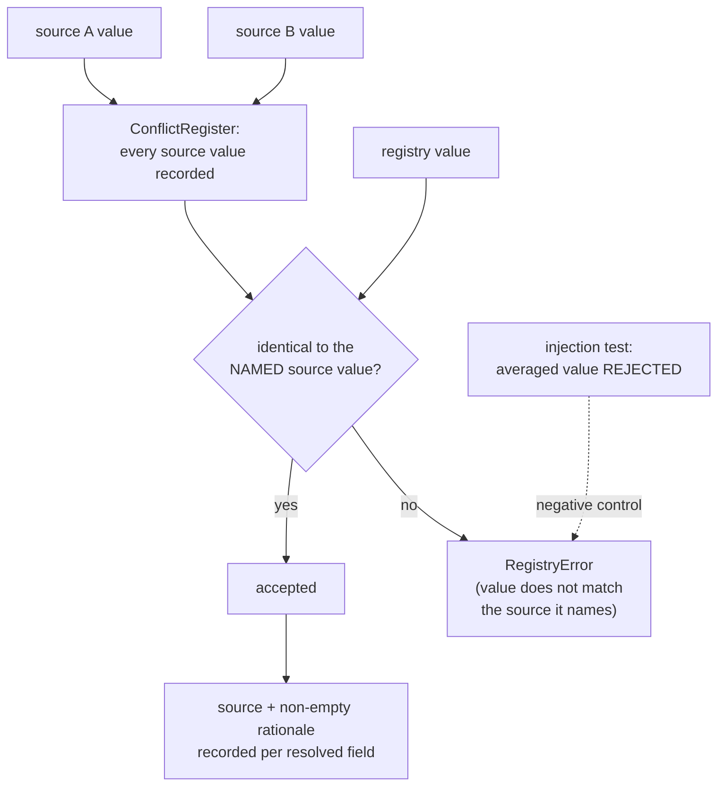
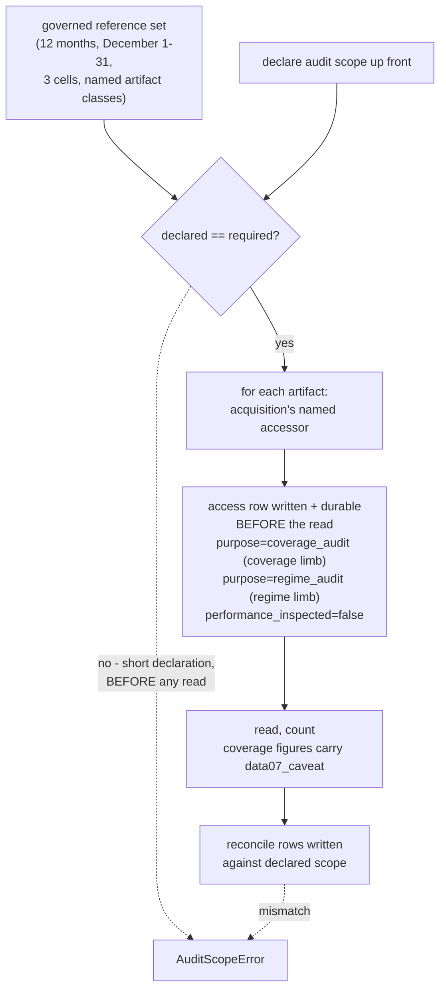

# Business Logic Model — `inventory-and-registry`

> ## ✳ G-09 IS SIGNED — 2026-08-28, **D-31** (read this before any G-09 statement below)
>
> The project decision owner **signed and approved G-09 (Agent preflight)** on 2026-08-28,
> recorded as **D-31** in `evidence/DECISIONS.md` with change record
> `governance/CHANGE_RECORD_2026-08-28_G09_signed.md`. **Every statement below of the form
> "G-09 is not signed" / "G-09 stays unsigned" is superseded as to the gate's status**, and
> is left standing as the accurate record of the constraint that applied when it was
> written.
>
> ⚠ **D-31 records the gate's own TE §18.3 preconditions as UNMET, and that disclosure
> travels with the signature.** `configs/`, and until 2026-08-28 `src/`, did not exist, so
> the mandated automated zero-TBD preflight **could not run**; the ten named critical tests
> **cannot be executed in this environment** (no Python interpreter is installed — a
> zero-byte Windows Store stub, no registry entry, no interpreter on disk); and the evidence
> artifact `aws_ai_dlc_preflight_report` **does not exist**. "No failing critical test" is
> therefore **unproven, not proven** — an absence of executions, not an absence of failures.
> This is the owner **opening the gate by authority**, not a record that its evidentiary
> conditions were satisfied, and no reader may infer the second from the first.
>
> **What the signature changes here:** module creation is authorised, and any defect this
> unit deferred *solely* because G-09 barred editing a file is now correctable.
> **What it does NOT change:** G-05 and G-06 remain `Blocked`; G-P1A, G-P2, G-P3A, G-P3C
> and G-07 are unaffected; **TE §18.2's absolute rule stands** — every scientific value this
> unit routed to G-04/G-05 **stays routed**, and no agent may fill a freeze-gate value by
> convenience; and **§18.3's stop-and-report obligation survives its own gate**, being a
> standing rule on implementation rather than a one-time gate condition.

**Unit** `inventory-and-registry` (Bolt 4) · **Kind** `library` · **Depends on**
`acquisition`

> **Re-established a sixth time 2026-08-24**, on a **new stage attempt** — Inception closed
> and Construction opened at 2026-08-24T11:46:26Z, resetting the receipt floor for every
> unit. **No content of this unit changed.** Both `foundation` passes of that day (the
> amendment pass and the sites 9–11 addendum, in
> `governance/CHANGE_RECORD_2026-08-24_foundation_amendments.md`) touch nothing this unit
> reads: `DeterminismRecord` is not among the `component-methods.md` contracts consumed
> here, and the amended `services.md` § Run record and registry and `unit-of-work.md` § 1
> are not the sections read here (**§ The nine stage scripts**, **§ Stage entry contract**
> and **§ 4** are). **`write_release` was checked directly rather than inferred**: its
> signature is unchanged and the `source_files`-validated-against-`inventory.py` clause this
> unit depends on is intact. Amendment A was declined, so **no count moved**. **The READY
> verdict in § Review belongs to the previous attempt.**

> **Re-established a fifth time 2026-08-23**, after a redo correcting a sibling's citations.
> **No content of this unit changed** — but the correction concerned this unit's numbering:
> `target-standardization` had cited "`inventory-and-registry` R-20" for an open authority
> question. **This unit's rules run R-44…R-53 and it has no R-20**; the rule carrying that
> question is `governance-guards` R-20. This unit's **R-49** carries a related but distinct
> point — that D-24's protected set is not reopened.

> **Re-established 2026-08-23 after a stage-wide redo jump.** The jump was aimed at a
> correction in `acquisition` and reset the receipt floor for **every** unit of this stage.
> **No content of this unit changed** — its iteration-2 adversarial verdict was READY with
> no surviving findings. The summary was re-confirmed and the artifact re-saved so the
> receipts match the current attempt.
>
> **Re-established a second time 2026-08-23** after a further stage-wide redo aimed at
> `external-products`. **No content of this unit changed on that occasion either.**
>
> **Re-established a third time 2026-08-23**, and this one DID change content here.
> `component-methods.md` § Depth specifies **cross-package boundary calls only** and names
> **`functional-design` (3.1)** as where intra-package shapes are specified. `inventory.py`
> and `release.py` are the **same package**, so W-1's contract is this stage's ordinary work
> and **not an amendment owed**. **Question 1's answer (D) is unchanged**; this unit owes
> **one** amendment — W-2a's `Station.provenance` field — not two.
>
> **A fourth re-establishment** followed a sweep of this unit's **question file**, which had
> not been corrected alongside these artifacts because its receipt was recorded before the
> correction was applied. **No content of this artifact changed.** The ordering is changed
> going forward: corrections land in the artifacts **and** the question file before a
> confirmation receipt is recorded.

The workflows this unit implements: the source inventory, the station registry and its
conflict resolution, migration of the frozen notebook literals, schema validation of the
prepared product, the **performance-blind December coverage and regime audit**, and the
**G-P1A** decision record that audit feeds.

**This unit performs the one December read this project treats as legitimate before the
lock opens.** Vision §8.3 makes the pre-G-05 coverage and regime audit **required** and
performance-blind; it is a different event from the one-shot locked evaluation at G-06,
and the "open it once" rule governs only the latter.

**It does not transform provider values.** It inventories, validates, counts and refuses.

## Sources

- `../../../inception/units-generation/unit-of-work.md` § 4 — the `Owns` list, the boundary, the 7 requirements, and the implementation notes.
- `../../../inception/units-generation/unit-of-work-story-map.md` — Tables 1 and 2 plus § Per-unit coverage summary; both derivation paths agree on 7 requirements and **2** without an acceptance row.
- `../../../inception/requirements-analysis/requirements.md` — FR-P1-02-1 through -5, -7, -8; § Known defects rows 3 and 9.
- `../../../inception/application-design/components.md` — the component map assigning `inventory.py` FR-P1-01-6's verbatim-notice and FR-P1-01-2's suffix-surfacing obligations *(added 2026-08-25, finding 2 — a `required: true` consumes artifact cited nowhere in this unit)*.
- `../../../inception/application-design/component-methods.md` — `src/data/registry.py` (`Station`, `load_registry`, `assert_registry_resolved`) and `src/data/release.py` (`write_release`, which validates `source_files` against `inventory.py`).
- `../../../inception/application-design/services.md` § The nine stage scripts and § Stage entry contract.
- `../acquisition/functional-design/business-rules.md` — **R-32**, **R-33**. This unit is `acquisition`'s first downstream consumer and uses its named-accessor routing.
- `../governance-guards/functional-design/business-rules.md` — **R-25**, **R-26**, **R-28**.
- `evidence/DECISIONS.md` — **D-1** and its 2026-08-21 addendum, **D-2**, **D-12**, **D-13**, **D-143**, **D-144**.
- Workspace inspection, 2026-08-23: `notebooks/madrigal_phase1_coverage_audit.ipynb`, `tests/`, and the absence of `src/` and `configs/`.
- `functional-design-questions.md` (**Q1 through Q9**), `domain-entities.md`, `business-rules.md`.

---

## W-1 — Building the source inventory

```
INPUT   acquisition's released artifacts, by release ID and hash
OUTPUT  a source inventory: TE §5.1's nine fields per entry
RAISES  InventoryError
```

Nine fields per source entry, not three: provider, role, filename or product identifier,
coverage, retrieval date, checksum, version or release status, licence and access notes,
**and the configuration that consumes it**. An entry carrying fewer than nine **fails**.

**Consumes by release ID and hash, never by path.** `unit-of-work.md` § 4 fixes the
boundary: this unit reads `acquisition`'s *released* artifacts, so a change upstream
surfaces as a hash mismatch rather than as silently different content.

> ## `src/data/inventory.py` — SPECIFIED HERE BY DESIGN, NOT AN AMENDMENT
>
> `unit-of-work.md` § 4 names it in this unit's `Owns` list, and `component-methods.md`'s
> `write_release` states that `source_files`' six items *"are validated against
> `inventory.py` rather than restated as a bare hash"*. **Q1 = D designs it MINIMALLY** —
> only what that stated dependency and TE §5.1's nine fields require, nothing speculative.
> A minimal contract is easier to widen later than a speculative one is to narrow.
>
> ## ⚠ CORRECTED 2026-08-23 — THIS IS NOT AN AMENDMENT OWED
>
> `component-methods.md` § Depth states its own policy: **"Full signatures with types for
> cross-package boundary calls. Names and one-line purposes for intra-package functions…
> Every signature below is a cross-package boundary."** Its Assumptions add: **"[Q1]
> Intra-package helper names are indicative. `functional-design` (3.1) specifies them per
> unit and may rename freely — only the signatures above are contracts."**
>
> **`src/data/inventory.py` and `src/data/release.py` are the same package.** The reference
> from `write_release` is therefore **intra-package**, and the absence of a block is the
> artifact's **stated design**, which **names this stage (3.1) as where the shape is
> specified**. Nothing is owed and no change record is needed.
>
> **Superseded reading, preserved:** that the absence was a gap of the same class as
> `acquisition`'s `open_d9_input` — a new symbol in a boundary block that exists and omits
> it, `scripts/` to `src/data` being genuinely cross-package. That one is real; **this one
> was a misreading of a stated depth policy.**
>
> **Consequence for the count:** this unit owes **one** amendment, not two — R-46's
> `Station.provenance` field, which modifies an existing boundary dataclass.
>
> **Two obligations landing in `inventory.py`, the module this unit owns, made explicit**
> *(title corrected 2026-08-26, finding M2: "that nobody else is assigned" was the retracted
> overreach still heading the box whose own item 1 retracts it)*
> *(added 2026-08-25 on adversarial finding 2 of the post-reset pass, which was Major:
> `components.md` — a `required: true` consumes artifact — was cited nowhere in the three
> artifacts, and it is the artifact mapping `inventory.py` to **FR-P1-01-6** and **FR-P1-01-2**,
> which `acquisition` carries without owning the module)*:
>
> 1. **FR-P1-01-6's verbatim Kyoto/CEDAR acknowledgment notice.** The inventory carries, for each
>    source whose provider requires it, the provider's acknowledgment text **verbatim** — due
>    before the G-P1A gate this unit hosts. *(The clause "assigned to no other unit" is retracted,
>    2026-08-26, terminal finding N3: `acquisition`'s artifacts carry the verbatim rule too; what is
>    true is that the **module** the obligation lands in — `inventory.py` — is this unit's.)*
> 2. **FR-P1-01-2's version-suffix mismatch surfacing — ⚠ PROPOSED, not settled** *(flag added
>    2026-08-26, terminal finding N3)*. The inventory is proposed as where `write_release`'s
>    validation reads `acquisition`'s recorded `suffix_mismatch` from — but `acquisition`'s R-34
>    holds the release-manifest carriage of that field **Open for stage 3.2**, and this clause
>    defers to that resolution rather than answering it.
>
> `components.md` is added to § Sources accordingly.


## W-2 — Building the station registry

```
INPUT   snapshot: ConfigSnapshot
OUTPUT  Mapping[str, Station]
RAISES  RegistryError
```

The approved `Station` carries Vision §6.2's full content: `station_id`, `lat`, `lon`,
`ellipsoidal_height_m`, `domes`, receiver / antenna / firmware intervals covering all of
2022, `sampling_interval_s`, `observable_codes`, `hardware_changes_2022`, a **pinned**
`igrf_version`, and `cell`.

**`cell = (floor(lat), floor(lon))`, tested half-open as `[floor, floor+1)` on both
axes** — D-1, so a station exactly on a boundary belongs to the higher-indexed cell and
no station is counted twice. ARUC 40/44, BSHM 32/35, NICO 35/33, verified against
executed 2022 output.

**`assert_registry_resolved` raises** when a §6.2 field is missing, when `igrf_version` is
a **default rather than a pin**, or when a conflict was resolved by **averaging**. An
unresolved registry **blocks `station_lat` and excludes `lst_sin`/`lst_cos`**, so
`features.build` calls it before constructing either.

### W-2a — Presence is not provenance (Q2 = C)

FR-P1-02-1 requires coordinates and the cell rule to be *"validated against the **official
IGS site logs** before being treated as final."* **They have not been.** D-1's own Known
limitation: *"Station coordinates are taken from IGS network pages, **not** from the
official IGS site-log PDFs, which rank higher in the §6.2 evidence hierarchy… Site-log
validation remains outstanding."* The 2026-08-21 addendum repeats it as **separate and
still open**, and the notebook literal's own `source` field reads
`'IGS network page -- cross-check against site log required'`.

So `Station` gains a **per-field provenance** value, and the raise is conditioned on
**provenance**, not only on presence:

| Reading | Consequence |
|---|---|
| Presence only (rejected) | The pipeline runs, and FR-P1-02-1's *"before being treated as final"* has nothing enforcing it — the values are already treated as final and D-1's limitation becomes a note no code reads |
| Provenance insufficient ⇒ unresolved, universally (rejected) | Literally faithful, and it **halts the entire downstream pipeline today** on an obligation nothing in the plan is sequenced around — while D-1 records that all three stations sit ≈0.14° or further from a cell edge, so no assignment would change |
| **Provenance recorded, sufficiency decided per consumer (chosen)** | The distinction that actually exists is made explicit and checkable. A gate can demand site-log provenance where a fixture run need not |

> **What provenance is SUFFICIENT is not decided here.** Station coordinates are a §18.2
> **Student** forbidden-choice item and the coordinate-to-cell rule a **Student +
> Supervisor** one. This stage fixes the mechanism and **puts the sufficiency question to
> the owner at the gate** rather than writing a default — because a written default is how
> a deferral quietly stops being one.

> **An amendment owed**: the provenance field is an addition to the approved `Station`
> dataclass in `component-methods.md`. Stated, not applied.

## W-3 — Resolving a conflict, and why averaging becomes detectable

Vision §6.2, quoted through FR-P1-02-1: *"A conflict must be resolved and recorded, never
averaged or ignored."* The acceptance criterion is that **a conflict resolved by averaging
fails**.

**The difficulty is that a number carries no history.** Given a latitude of 40.286,
nothing about the value reveals whether it was read from one source, chosen between two,
or averaged across them.

**Mechanism (Q3 = D), four limbs:**



Text fallback: every source value for every field is recorded in a conflict register; each
resolved field names the source it came from and carries a non-empty rationale; the
registry's value must be identical to **that named source's** value; and an injected
averaged value is tested to be rejected, including the three-or-more source case.

**Why the check is an equality against a NAMED source, not an existence check.** An
existence check — *"equals some recorded source value"* — is sound only for **two**
sources, where `(a+b)/2 == a` forces `a == b`. **With three or more it is not:** sources
0, 3 and 6 average to 3, which **is** a recorded source value, so an existence check passes
an averaged resolution. Binding the value to the **named** source makes the resolution
assert a provenance claim the value must satisfy, rather than asserting only that the value
appears somewhere in the register.

> **Corrected 2026-08-23 after an adversarial pass.** The first issue said the value must
> be *"identical to one of them"* and called averaging caught *"by construction"* — **a
> stronger guarantee than the mechanism delivers**, unqualified, on the acceptance-critical
> path behind WS-01 and TA-04. The unqualified claim is withdrawn.

**The residual case, stated rather than hidden.** When a mean **coincides exactly with the
named source's value**, the stored value *is* that source's value bit for bit, and **no
check on the value can distinguish it from a legitimate resolution.** Nothing here claims
otherwise. What reaches that case is the rationale, read by a human at G-P1A — which is why
the negative control must exercise the coincidence case, **pinning the limit rather than
leaving it to be discovered**.

**What it also does not catch**: a conflict resolved by **picking the wrong source**. The
identity check proves nothing was invented; the rationale is what a reviewer judges.

**Why the rationale is required non-empty.** §6.2 says *"resolved **and recorded**"*, two
things. A non-empty rationale is a weak check; its **absence** is a strong one.

**The negative control is mandatory, not optional.** `team.md` § Testing Posture makes it
so for every hard rule: a test that proves the violation is caught, not only that the
happy path works.

## W-4 — Migrating the frozen literals

`team.md` § Code Style fixes the order: the inline constants are **frozen as a D-number
decision first**, and only then moved into `configs/data.yaml` and `src/data/registry.py`
— *"so the migration itself cannot silently change a scientific value."*

**The cell rule is already frozen. D-1 is the freeze.** Its 2026-08-21 addendum corrects
the earlier belief that none existed: *"The notebook literal is a duplicate of a frozen
decision awaiting migration… not the decision itself."*

**The coordinates are the unsettled half** — recorded in D-1's table, but carrying the
site-log limitation W-2a describes.

**Mechanism (Q9 = D).** Both migrate together; each coordinate carries its **provenance**
(W-2a), so what is *not yet established about it* moves with the value rather than being
lost at the boundary. The migration **emits a diff against the notebook literal and
asserts no value changed in the move.**

**Why the diff rather than the freeze alone.** A freeze prevents an *intentional* change.
The likelier failure in a hand migration of three coordinate pairs is an *accidental* one
— a transposed digit — and only a comparison catches that. The diff enforces the stated
purpose of the freeze-first rule rather than only its form.

**Why not hold the coordinates back until site-log validation.** It would leave
`configs/data.yaml` holding a cell rule with no coordinates to apply it to, halting
everything downstream on an obligation nothing has scheduled. Carrying the unresolved
provenance forward lets work continue **without anyone forgetting what is outstanding**,
which is the point of recording it.

## W-5 — Schema validation of the prepared product

```
INPUT   prepared product, expected schema (configs/data.yaml)
OUTPUT  a schema report
RAISES  SchemaError
```

Covers **parameter names, units, fill values, UTC cadence and duplicates** (FR-P1-02-2)
for the **D-144-approved** prepared product.

**The expected schema lives in `configs/data.yaml`** (Q7 = D) — governed, versioned,
hashable, reachable through `ConfigSnapshot`, and needing no fifth config file beyond TE
§12's four. Units and fill values are genuinely facts about the product, and a
pipeline-wide contract inside one module's source would be invisible to config review.

**The report records BOTH the expected schema's digest and the observed values**, so it
is interpretable a year later without reconstructing the config state it ran against. A
changed expected schema produces a visibly different digest in the report.

> **D-24's protected set is NOT reopened.** Hashing the schema block as an eighteenth
> protected item would surface a schema change at G-P3C, which is the stronger design —
> but **D-24 is frozen at 17 items, calculated from its enumeration**, and adding one is a
> Vision §15.2 amendment rather than a design choice. `governance-guards`' own artifacts
> state that the enumeration does not reopen at this stage. The digest-in-report gets the
> drift-detection benefit **inside this unit's own evidence**, where this stage does have
> authority, and leaves the protected-set question available to raise separately.

## W-6 — The performance-blind December coverage and regime audit

```
INPUT   released artifacts (by release ID and hash), a DECLARED audit scope
OUTPUT  a coverage report + a regime-count report
RAISES  LockedTestError (through acquisition's routing); AuditScopeError
```

**This is the required pre-G-05 read.** Vision §8.3: December target values may be
audited for coverage and regime counts **without inspecting model performance**, and this
audit is a **precondition of G-05**, not a violation of the lock.

**Membership is derived from record timestamps, never from a directory name or filename**
*(constraint stated 2026-08-25 on adversarial finding 3, which was Major: `project.md`
§ Forbidden mandates it for "every per-month statistic", which is exactly this audit's output;
the year-blind predicate that filed locked-month records under `audit_evidence_2022-01/` is the
realized defect behind the rule, and R-53 already invokes the same principle for ICTP one
section earlier)*. Every coverage count and regime count in this audit attributes a record by
its **observation timestamp** — out-of-month and out-of-year records are excluded from every
per-month statistic.

**FR-P1-02-3's scope is `access`, unqualified** — the requirement says so explicitly, and
enumerates: *"derived-artifact merges, re-derivations, corrections, coverage recounts and
schema validations, **not only a model execution**."* Three of those are this unit's
ordinary work.

**Mechanism (Q4 = C):**



Text fallback: the audit declares its scope up front; that declaration is checked against a
governed reference set — twelve 2022 months, **December declared as the full calendar month,
1–31**, all three cells, the named artifact classes, derived from the release inventory
rather than from the declaration itself — and a short declaration fails **before anything is
read**. It then opens each artifact through `acquisition`'s named accessor, which writes a
durable access row before the read — **under `purpose="coverage_audit"` for the coverage
limb and `purpose="regime_audit"` for the regime-count limb, each with
`performance_inspected=false`** — counts, and finally reconciles the rows actually written
against the declared scope. A mismatch at either check fails.

**Two reads, two typed rows** *(added 2026-08-28, `GOV-2026-08-28-FD-01` Recommendation 11,
option 1)*. This workflow produces **two** G-05 evidence artifacts that Vision §13.1 names
separately, so it makes **two separately logged reads**, each binding its own
`AccessRecord.purpose` literal from `governance-guards`' approved enum (`coverage_audit` |
`regime_audit` | `locked_evaluation`), each carrying `performance_inspected=false` and an
`authorization` reference to **Vision §8.3**. `locked_test_accessed` is `True` on both.
**A read attempted under `purpose="locked_evaluation"` is refused** — that literal is G-06's,
and an audit carrying it would trip `evaluation-and-comparison` R-109's must-not-fire control
and block the read §8.3 *requires*, which is the *"opened exactly once"* misreading `team.md`
records this project having already corrected once. R-50 carries the rule, the pairing table
and the negative controls; the sibling-control consequence is raised at the gate there rather
than edited into another unit's files.

**The December day range is the full calendar month, and the one-day excess is stated**
*(added 2026-08-28, Recommendation 15, option 2)*. Both limbs read **1–31 December 2022**:
the coverage limb must, because **D-2** requires **31/31** December days, and the regime limb
does so that December's activity distribution is characterised as a property of **the
month**. The G-06 scored set is **2–31 December (30 days)** under **D-28**, so the count
window **exceeds the scored window by one day**, and both reports say so. A storm event lying
**wholly** outside 2–31 December — interval and its −12 h pre-event window — is **reported
separately and excluded from D-13's ≥3 tally**, so a `Kp>=5` interval confined to 1 December
cannot promote H4 and SRQ-5 to confirmatory while contributing zero scored rows. **Which day
range governs the threshold is Student + Supervisor's**, not this workflow's: D-13 is a
supervisor-countersigned demotion threshold, and **this unit measures, it does not demote**.

**Every coverage figure leaves here carrying the DATA-07 caveat as a machine-readable field**
*(added 2026-08-28, Recommendation 29, option 1)*. The coverage report emits a
**`data07_caveat`** field on every station-month figure, **sourced from that month's
`provenance_class`** (`acquisition` R-36) rather than restated; a figure emitted for a
`derived_only` month with no caveat field **fails**. `team.md`'s DATA-07 caveat is
unconditional and this workflow's whole output is FULL's coverage figures, so the caveat
belongs on the **producing** surface — where prose has already failed once
(`acquisition` R-42 on `PROVENANCE_NOTICE.md`: *"no ID, criterion or test link, so nothing
checked it"*), and where the downstream consumer `fixtures-and-reproducibility` already
carries exactly this field. **The source field is `acquisition`'s and reaches no other unit
today**, so the constraint is proposed on that dependency; R-50 records the seam and requires
a **stop-and-report under TE §18.3** rather than an uncaveated figure if the field is absent
at implementation.

**Why one row per artifact rather than one per run.** An audit spanning twelve months,
three cells and several artifact classes is many operations. One row makes the log say
less than what happened, and a reviewer cannot tell which reads occurred.

**Why three checks, and why none substitutes for another.** Per-artifact rows prove **every
read was logged**. Reconciling rows against the declaration proves **the audit read what it
declared**. Only the declared-versus-**required** check proves **it declared everything
required** — and this unit's output is a coverage figure a supervisor accepts at G-P1A, so
**a silently skipped month produces a wrong figure that looks right.**

> **The declared-versus-required check was added 2026-08-23 after an adversarial pass.**
> The first issue carried only the other two, so **an audit declaring eleven months and
> executing exactly eleven reconciled cleanly and raised nothing** — while this workflow's
> own stated purpose is catching the skipped month. Declared-versus-executed proves
> internal consistency; only declared-versus-required proves completeness. FR-P1-02-3's own
> criterion — *"the coverage report covers all twelve months"* — is what the new check
> enforces inside this unit rather than leaving to an external row.

**Routing is `acquisition`'s, not a second mechanism.** R-32's named accessors delegate to
`open_restricted`; R-25 makes the append durable before the read; R-33 governs writes.
This unit adds no path of its own — `governance-guards` R-28's static check asserts none
exists.

> ⚠ **That routing is PROPOSED, not approved.** `acquisition` R-32's named accessors are
> **absent from `component-methods.md`'s approved `src/data/locked_test.py` block** and are
> amendment (1) of that unit's three. **This workflow inherits the status**: until the
> change record clears, the mechanism this audit routes through is a proposal. Stated at
> the point of use so a builder does not read the dependency as settled.

**Performance-blind means the report contains no performance figure and neither does its
execution log.** That is FR-P1-02-3's criterion, and it is checkable.

> **BLK-07's authorization limb is open**, and this audit runs through the mechanism it
> fixes. **No run may touch calendar 2022-12 while that limb stands.** A refusal keyed to
> the authorization is deliberately **not** built here: BLK-07's authorization is the
> project decision owner's, and encoding this stage's reading of an authorization it does
> not hold would substitute for the decision.

> **`RES-01` is open, and it is about exactly this workflow.** Story-map Table 2 records
> that **permitted-read access logging is NOT TESTED**, with its candidate §19 criterion
> owned by stage 3.2 under Vision §15.2. `inventory-and-registry` performs the permitted
> read; the test that would prove its row is written first does not exist.

## W-7 — The G-P1A decision record

**Two thresholds, and neither substitutes for the other** (FR-P1-02-4):

| Threshold | Value | Decision |
|---|---|---|
| Hourly | **≥ 90% usable hourly coverage per station per month**, hard gate | **D-12** (Vision §6.1B, frozen 2026-08-21) |
| Day | **≥ 95% of calendar days** per month, and **100% of December days** (31/31) | **D-2** |

§6.12's exception-plus-claim-limitation path **does not apply at G-P1A**.

**Shape (Q5 = C).** A verdict per station-month against both thresholds, **plus the
measured hourly and day figure for every station-month, each attributed to the D-number it
is judged against** — because the criterion forbids *"an unattributed number"*, and a bare
`PASS` makes ARUC's 100.0% and NICO's 93.2% look identical.

**Measured as at 2026-08-21, straddle days excluded, across the nine cached non-December
months:** ARUC 99.2–100.0%, BSHM 99.3–100.0%, **NICO 93.2–98.9%**. Every station-month
clears 90%; **NICO's margin is thin**, and the record shows it rather than absorbing it
into a verdict.

**D-2's own disclosure is carried into the record.** D-2 states that **five of twelve
months had already been audited at 100% day coverage when the threshold was chosen** —
*"It was **not** set blind. It is stated here so a reviewer can discount it
accordingly."* A decision record that omits it presents a partly post-hoc threshold as
though it were blind, and defeats the purpose the disclosure was written for.

**A soft margin band was declined**, with a reason: flagging station-months near a
threshold is genuinely useful at NICO's 93.2%, but *"near"* would be a new number this
stage invented beside a **supervisor-frozen** hard threshold — and an adjacent number that
becomes the real rule is a failure this project has already had to correct.

**The DATA-07 caveat travels onto this record with the figures** *(added 2026-08-28,
`GOV-2026-08-28-FD-01` Recommendation 29, option 1)*. The measured figures above **are**
FULL's coverage figures: the nine cached non-December months are pre-TC-06 months classed
**`derived_only`**, and the two absent from the nine — **2022-04** and **2022-07** — are
absent because they hold no `raw_isprint_cache/`. `team.md` binds the caveat to appear
*"wherever FULL's coverage figures are relied on"*, and this record is where a **supervisor**
relies on them. Each station-month figure therefore carries R-50's **`data07_caveat`** field,
and the record states the three facts W-6 enumerates — provenance **unverifiable in
principle, not merely unverified**; **2022-04, 2022-07 and 2022-12** holding no retrieval
cache; the **2026-08-16 corrected extracts produced under Python 3.14**, outside the governed
**3.11** pin — together with `team.md`'s limit that **FULL must not be relied on at a freeze
gate while its provenance chain points at superseded per-month hashes**. A `derived_only`
figure reaching this record with no caveat field **fails**. One mechanism, named at the
surface it has to reach.

## W-8 — The four G-P1A prohibitions

FR-P1-02-8 names four, and its criterion is unusually specific: *"Each of the four has an
injection test that **fails** the pipeline; **four separate results, not one**."*

| # | Prohibition | Proven by | Owned by |
|---|---|---|---|
| 1 | **Silent imputation** | Injection test — an imputed value must fail | This unit |
| 2 | **Source mixing** | Injection test — a mixed-source artifact must fail | This unit |
| 3 | **Retrospective split redesign after model performance is viewed** | **A frozen-hash ordering artifact**, not an injection test | `features-and-splits` |
| 4 | **Labelling a map value as station-observed VTEC** | Injection test — the mislabel must fail | `target-standardization` |

**Why 3 cannot be an injection test.** The prohibited act is **a person changing a design
after seeing a result**. No injected value can prove that did not happen. A **hash of the
split definition frozen before any performance figure is produced**, plus a timestamp
ordering, is the only evidence class that distinguishes *designed before* from *redesigned
after* — the same mechanism `governance-guards`' transition manifest already uses.

**Why 3 and 4 are owned elsewhere.** This unit is where the **gate** lives, not where
splits are designed or targets labelled. Each test belongs with the unit that owns the
prohibited act; **this unit's obligation is to assert all four results are present and
passing before G-P1A accepts.**

> ## ⚠ WHY THIS REQUIREMENT WENT UNTESTED, AND WHAT FIXES IT STRUCTURALLY
>
> FR-P1-02-8 previously cited **`TA-29`** — a row `requirements.md` itself lists under
> *"Not applicable in Phase 1 — Phase 2 by definition"*. The citation made the row
> **appear covered** and kept it out of the untested list **that stage 3.2 reads to size
> the G-05 freeze manifest**. **Four governance boards passed over it**; an advisory
> reviewer found it on the fifth revision.
>
> The cause was that **one citation stood for four obligations**. So the four results are
> **named individually in the G-P1A evidence set**, which makes a missing one structural
> rather than something a fifth reviewer has to notice.
>
> **The row remains UNTESTED.** Naming four results is a mechanism, not an acceptance row;
> the replacement row is stage 3.2's and change control's.

## W-9 — What Bolt 4 builds, and what it must not

**Permitted before G-09**: module structure, interfaces, placeholder CLI definitions,
configuration wiring, safe fail-fast behaviour, and this unit's `tests/` scaffolding.

**Barred until G-09 is signed for the affected component**: implementing any component
whose P0 decision is unresolved; filling any `TBD — freeze gate` field; executing any
governed run; generating code for a unit carrying an open blocker on that scope.

> **`src/data/inventory.py`, `src/data/registry.py`,
> `scripts/01_inventory_and_registry.py` and `tests/test_station_registry.py` DO NOT
> EXIST**, and neither does `src/` or `configs/`. `tests/` holds three modules —
> `test_acquisition_window.py`, `test_phase_boundary.py`, `test_release_hashes.py` — and
> this unit's mandated test is not among them.
>
> **No December access of any kind occurs in this Bolt.** The audit is designed here; it
> is not run.

`merge_coverage_year.py` migrates here, taking `--config configs/` and its
`NN_verb_noun.py` position; its `sha256_of_file` copy consolidates into `foundation`'s
`src/data/release.py`. This stage designs the target shape, not the migration commit.

---

## Requirement-to-workflow map

Acceptance derived from story-map Table 1; owners from Table 2's `primary` cell. Both
paths cross-checked and in agreement.

| Requirement | Workflow | Tested by (Table 1) | Row primary owner |
|---|---|---|---|
| FR-P1-02-1 | W-2, W-2a, W-3, W-4 | WS-01, TA-04 | **`inventory-and-registry`** (both) |
| **FR-P1-02-7** | W-2 | ⚠ **NO ACCEPTANCE ROW** — WS-01 reaches the registry's existence and the header cross-check only | — |
| FR-P1-02-2 | W-5 | TA-04 | **`inventory-and-registry`** |
| FR-P1-02-3 | W-6 | WS-18, TA-25 | `features-and-splits` (WS-18); **`inventory-and-registry`** (TA-25) |
| FR-P1-02-4 | W-7 | TA-25 | **`inventory-and-registry`** |
| FR-P1-02-5 | W-7 | TA-25 | **`inventory-and-registry`** |
| **FR-P1-02-8** | W-8 | ⚠ **NO ACCEPTANCE ROW** — `TA-29` was cited and is **withdrawn** | — |

**7 requirements, 2 without an acceptance row.** This unit **owns** WS-01, TA-04 and
TA-25, and **supports** WS-18, TA-18 and TA-32.

### The two, and what evidence would close each

No §19 criterion is drafted — §19 rows are owned by stage 3.2 and change control, and a
drafted criterion in a functional-design artifact is indistinguishable, months later, from
an approved one.

| Requirement | Evidence that would close it |
|---|---|
| **FR-P1-02-7** | An approved §19 row asserting all seven §6.2 items beyond coordinates — ellipsoidal height, DOMES, receiver/antenna/firmware intervals covering 2022, sampling interval, observable codes, 2022 hardware changes, **and a pinned (never defaulted) IGRF version** — are present and match the site logs, plus a passing result against it. A defaulted or absent IGRF version must fail |
| **FR-P1-02-8** | An approved §19 row replacing the withdrawn `TA-29`, carrying **four separately named results**, plus passing results for all four: injection tests for silent imputation, source mixing and map-value mislabelling, and the frozen-hash ordering artifact for retrospective split redesign |

## Assumptions & Open Questions

- **[assumption]** Rule IDs continue the single sequence — `foundation` R-01…R-17, `governance-guards` R-18…R-29, `acquisition` R-30…R-43 — so `business-rules.md` opens at **R-44**. If per-unit numbering was intended, say so at the gate.
- **[assumption]** `tests/test_station_registry.py` is this unit's per `unit-of-work.md` § 4. **It does not exist.**
- **[assumption]** WS-01's Phase 1 retention rests on an **interim reading** — the cited Rec 12 reads "APPLIED as an interim reading… not yet held", its item 3 is still Open with no closure record *(overstatement corrected 2026-08-25 on adversarial finding 4; superseded: "settled governance")*; this stage records rather than revisits it. **WS-01 only — WS-02 through WS-08 remain deferred to G-P3A**, the basis being that §7.0's Phase 1 hard prohibition does not reach a station registry.
- **[assumption]** The December regime-count **threshold** is D-13's — at least three independent storm events under Vision §9.3's definitions, counted from **GFZ Kp/Hp60 at a recorded release grade**, with **D-11 barring any provisional-Dst-derived figure**. This unit measures; it does not set the threshold.
- **[assumption]** `frontend-components.md` is not produced — `kind: library`.
- **Corrected 2026-08-23 — `src/data/inventory.py` is NOT an amendment owed.** `component-methods.md` § Depth specifies boundary calls only and names **`functional-design` (3.1)** as where intra-package shapes are specified; `inventory.py` and `release.py` are the same package. W-1's contract is this stage's ordinary work. **Superseded reading preserved in W-1's box.**
- **Open — the amendment count, corrected 2026-08-23.** This unit owes **one** (R-46's `Station.provenance` field, which modifies an existing boundary dataclass), not two: the `inventory.py` contract is intra-package and this stage's to specify. With `acquisition`'s three that is **four across two units**. **Superseded reading, preserved:** *"Five owed amendments to approved stage-2.6 contracts across two units."*
- **Open — what provenance is sufficient.** W-2a fixes the mechanism and deliberately writes no default. Station coordinates are a §18.2 **Student** forbidden choice; the cell rule **Student + Supervisor**.
- **Open — D-1's site-log validation limitation**, recorded in D-1 and repeated in its addendum as *separate and still open*. W-2a and W-4 both turn on it; neither closes it.
- **Open — BLK-07's authorization limb**, carried from `acquisition`. W-6 runs through the mechanism R-32 fixes; **no run may touch calendar 2022-12 while it stands.**
- **Open — `RES-01`**, permitted-read access logging is NOT TESTED, owned by stage 3.2 — and **this unit performs the permitted read it is about.**
- **Open — FR-P1-02-8's replacement acceptance row** after `TA-29`'s withdrawal.
- **Open — D-24's protected set is not reopened.** Hashing the schema block as an eighteenth item is available to raise separately; it is not proposed here.
- **G-09 is not signed.** ⚠ **G-09 IS SIGNED as of 2026-08-28 (D-31)** — this prohibition's stated ground no longer holds, and module creation is authorised. **The other grounds stated alongside it, if any, are untouched**, and D-31's disclosure travels with the signature: the §18.3 preflight never ran, the critical tests are unexecuted in this environment, and `aws_ai_dlc_preflight_report` does not exist. **No scientific value becomes fillable** — TE §18.2 and §18.3's stop-and-report rule are unchanged. No workflow here authorises creating any module.
- **None** of the above adopts a reading on a supervisor-owned value, and none decides a scientific constant.

## Review

**Verdict:** READY
**Reviewer:** aidlc-architecture-reviewer-agent
**Date:** 2026-08-23T06:05:54Z
**Iteration:** 1 (final cycle after the depth-policy correction)

### Findings

| # | Severity | Location | Finding | Recommendation |
|---|---|---|---|---|
| 1 | Major | `functional-design-questions.md` lines 407, 427, 438–442 (§ Assumptions & Open Questions and § Consolidated Summary Confirmation) | These three passages still assert the **superseded** pre-correction reading — that `inventory.py`'s minimal contract "is an amendment owed" (line 407), that Q1's answer is "recorded as an **amendment owed** to `component-methods.md`, not as settled" (line 427), and that the cross-unit total is "**five** amendments owed... across two units" (line 438–442) — with no "Corrected" marker and no "superseded, preserved" framing, unlike every other instance of this claim in the same unit's four artifacts. This directly contradicts the "Re-confirmation, third" section 30–70 lines below it in the *same file* (lines 475–490), which states plainly that Q1's output is "this stage's ordinary work rather than as an amendment owed" and that the unit owes "one" amendment, not two — and it contradicts `business-logic-model.md`, `domain-entities.md`, and `business-rules.md`, all three of which correctly read "four across two units" everywhere, with the old "five" figure explicitly marked `**Superseded reading, preserved:**` each time it appears. A reader who stops at the Consolidated Summary (the section immediately preceding the confirmation gate answer, and the most likely thing a human skims before answering "Looks correct") is told the wrong classification and the wrong total for a figure this project's own text says is "worth surfacing at the gate as a pattern." | Edit lines 407, 427, and 438–442 to match the corrected reading used everywhere else: Q1's row should read that its output is this stage's ordinary intra-package specification (not an amendment), and the cross-unit total should read "four... across two units," with the original wording preserved as a marked "Superseded reading" the way the other three artifacts already do it. |

### Failed refutation attempts

- **Whether the original "amendment owed" reading for `inventory.py` was actually correct, and the correction is what's wrong.** Read `component-methods.md` § Depth and its Assumptions verbatim at source (lines 15–38, 516–520): "Full signatures with types for cross-package boundary calls. Names and one-line purposes for intra-package functions… Every signature below is a cross-package boundary," plus "[Q1] Intra-package helper names are indicative. `functional-design` (3.1) specifies them per unit and may rename freely — only the signatures above are contracts." Both quotations in the unit's artifacts match character-for-character. Confirmed `src/data/inventory.py` and `src/data/release.py` are both under `src/data/`, one of the six mandated `src/` packages fixed in `team.md`, so the reference genuinely sits inside one package. Tried the counter-hypothesis that `inventory.py`'s functions might be invoked directly by `scripts/01_inventory_and_registry.py` (this unit's own stage-script entry point) rather than only internally by `release.py`'s `write_release` — which would make it a genuine, undocumented boundary call of the same kind `src/features`, `src/models` and `src/evaluation` get explicit "— boundary calls" section headers for. Found no contract evidence either way (no passed artifact states what `01_inventory_and_registry.py` calls), but found that the Assumption's own wording — "intra-package helper **names are indicative**" — matches this exact scenario: `inventory.py` is named, indicatively, inside `write_release`'s prose without a full block, which is precisely the gap-class the Assumption pre-announces as this stage's to specify. The correction's textual basis is at least as strong as, and better supported by direct quotation than, the original reading. Not overturned.
- **Whether `Station.provenance` is correctly still classified as a real amendment.** Confirmed `Station` is a `@dataclass(frozen=True)` in `component-methods.md`'s `src/data/registry.py` block (a full cross-package boundary signature), and that `Mapping[str, Station]` is consumed directly by `src/features`' `build_features` (component-methods.md line 389) — a genuine cross-package reference. Adding a `provenance` field therefore does modify an approved cross-package contract, unlike `inventory.py`'s case. Classification holds.
- **Whether the "four across two units" arithmetic is right post-correction.** Recounted from source: this unit owes one (`Station.provenance`); `acquisition`'s own R-32 ⚠ block states its pile is "three, not two" (`open_d9_input`/writer, R-33's enum extension and write function, R-35's `identity_fields` parameter). 1 + 3 = 4, matching `business-logic-model.md`, `domain-entities.md` and `business-rules.md` exactly. The only place still reading "five" is the finding above.
- **Whether the conflict-register named-source equality (W-3/R-47/§3) still holds at the strength it claims, unaffected by this iteration's correction.** Re-derived independently: sources {0, 3, 6} average to 3; the named-source equality rejects unless the *named* source's own value is 3, which is exactly the disclosed residual and no more. No regression from the prior iteration's fix.
- **Whether the December-audit declared-versus-required check (W-6/R-50/§5) is still anchored to fixed constants rather than a count the release inventory could shrink.** Re-read `requirements.md` FR-P1-02-3's own criterion ("the coverage report covers all twelve months") and D-1's frozen three-cell definition — both are constants independent of inventory contents. No regression.
- **Whether the core counts and ownership claims (7 requirements/2 unrowed, WS-01/TA-04/TA-25 ownership, supports WS-18/TA-18/TA-32, RES-01, BLK-07, D-1/D-2/D-12/D-13/D-143/D-144 quotations, the G-P1A measured-coverage ranges, and the workspace-state claims) survive independent re-derivation.** Cross-read `unit-of-work.md` § 4, `unit-of-work-story-map.md` (Tables 1/2 and § Per-unit coverage summary), `requirements.md`'s FR-P1-02 table and TA-29 withdrawal text, `evidence/DECISIONS.md` D-1/D-2/D-12/D-13/D-3(D-144), the notebook's literal `source` field, and the live workspace (`src/`, `configs/` absent; `tests/` holds exactly the three named modules). Independently recomputed the D-12 hourly-coverage ranges from its own table (ARUC 99.2–100.0%, BSHM 99.3–100.0%, NICO 93.2–98.9% across the nine non-April/July/December months) — all match the artifacts exactly. No drift found anywhere in this set.

### Summary

The correction itself is sound: `component-methods.md` § Depth and its Assumptions genuinely restrict full-signature contracts to cross-package boundary calls and genuinely delegate intra-package shape-naming to this stage, `inventory.py` and `release.py` genuinely share the `src/data` package, and the revised "one amendment, four across two units" count is independently correct arithmetic once `inventory.py` is reclassified. `business-logic-model.md`, `domain-entities.md` and `business-rules.md` apply the correction consistently and mark every superseded claim as superseded. The one defect found is that the sweep stopped one file short: `functional-design-questions.md`'s § Assumptions & Open Questions (line 407) and § Consolidated Summary Confirmation (lines 427, 438–442) still state the pre-correction classification and the pre-correction "five across two units" total as live fact, unmarked, directly beneath the section that says the opposite — the same "amended figure, stale restatement survives" failure mode this project has hit before. This is a documentation-consistency defect in the audit-trail file rather than in the governing design artifacts a builder would actually implement from (those three are correct and consistent), so it does not block readiness on its own, but it should be fixed before the amendment count reaches the gate as a number the human is asked to act on. Every other checked claim — the requirement counts and two unrowed IDs, the WS-01/TA-04/TA-25 and supporting-row ownership, the named-source conflict mechanism and its disclosed residual, the three-check declared/required/executed audit-scope design, the D-1/D-2/D-12/D-13/D-143/D-144 quotations and figures, the G-P1A prohibition table, and the workspace-state claims — was independently re-derived from source and held up without exception. Verdict: READY, with one Major finding to clear before or alongside the gate.

---

> **Re-saved 2026-08-24 under the post-redo receipt floor.** The project decision owner
> authorised a redo jump on `functional-design` at 2026-08-24T14:57:07Z so that three
> standing reviewer findings on `models-and-baselines` could be fixed and re-reviewed;
> a redo resets the receipt floor for **every** unit of the stage. **No content of this unit
> changed** — not a question, answer, amendment, rule, entity, workflow, count or scientific
> value. The only artifacts edited after the redo were `models-and-baselines`'s, whose
> three fixes are confined to its own files. That unit returned **READY** on the second pass of
> the restored budget, which is what the redo was authorised for. The two residuals riding that
> verdict — R-96's `PartitionError` mechanism and R-95's field label — are carried to the stage
> gate rather than applied, per the rule that a suggestion riding a READY verdict is gate input.

---

> **Re-saved 2026-08-25 under the receipt recorded after eleven stage-wide redo floors**, all taken
> for other units (`foundation` ×10, `acquisition` ×1; all three now READY). **Nothing in this
> unit's workflows changed.** Figures re-derived from `unit-of-work.md` § 4: **7** requirements
> (**2** untested: FR-P1-02-7, FR-P1-02-8), **3** acceptance rows (WS-01 — as the approved upstream
> declares, though §16.1 defers WS-01–08 to G-P3A; disclosed, not re-litigated — TA-04, TA-25),
> BLK-07 named, zero Amendment C contamination. The one edit: `domain-entities.md`'s exception
> preamble names **`IntegrityError`** explicitly and the declaration-site OPEN item — the base was
> already stated as "`foundation`'s base", so this tightens rather than adds.
> **G-09 remains unsigned. ⚠ **G-09 IS SIGNED as of 2026-08-28 (D-31)** — this prohibition's stated ground no longer holds, and module creation is authorised. **The other grounds stated alongside it, if any, are untouched**, and D-31's disclosure travels with the signature: the §18.3 preflight never ran, the critical tests are unexecuted in this environment, and `aws_ai_dlc_preflight_report` does not exist. **No scientific value becomes fillable** — TE §18.2 and §18.3's stop-and-report rule are unchanged.**

---

## Review — 2026-08-25 post-reset pass, iteration 1

**Reviewer:** aidlc-architecture-reviewer-agent

**Verdict: NOT-READY**

**Class:** adversarial, iteration 1 of 2. Every finding below is machine-checkable at the
named line. No artifact other than this section was edited.

### Derivations, printed before they are asserted

Every count re-derived from source rather than carried from the prose or from the prior
`## Review` section.

| Claim | Derivation | Result |
|---|---|---|
| **7** requirements | `unit-of-work.md` § 4 *"Requirements carried (7)"* — set-differenced against the artifacts' maps, not compared as totals: `{FR-P1-02-1, -2, -3, -4, -5, -7, -8}`. Artifact map (`§ Requirement-to-workflow map`, `business-rules.md` § R-44…R-53, `domain-entities.md` § Requirement coverage) = the same seven. Set difference **empty both ways** | ✅ 7 |
| **2** untested | § 4's bold IDs = `{FR-P1-02-7, FR-P1-02-8}`; story-map § Per-unit coverage summary line 261 = `inventory-and-registry (2): FR-P1-02-7, FR-P1-02-8`; story-map Table 1 rows 65 and 70 both read `NO CURRENT ACCEPTANCE ROW`; `requirements.md` line 842 lists both in the 36. Four independent derivations, **same two IDs** | ✅ 2 |
| **3** acceptance rows | § 4 *"Acceptance rows (3). WS-01, TA-04, TA-25"*; story-map line 231 = `7 \| 2 \| WS-01, TA-04, TA-25 \| WS-18, TA-18, TA-32`. Owns/supports split matches the artifacts character for character | ✅ 3 owned, 3 supported |
| **WS-01** in §16.1's G-P3A block | Disclosed, not resolved, in all three artifacts and in the re-save box; `requirements.md` § Known defects row 9 carries the exception and its reason. **Neither hidden nor re-litigated** — but see Finding 4 for what the disclosure omits | ⚠ disclosed, incomplete |
| §5.1 **nine** fields | TE §5.1 counted from the source sentence: provider, role, filename/product identifier, station/date coverage, retrieval date, checksum, version or release status, licence/access notes, configuration that consumes it = **9**. W-1, R-44 and § 1 all enumerate the same nine | ✅ 9 |
| §6.2 **seven** items beyond coordinates | Counted from `requirements.md` FR-P1-02-7: ellipsoidal height; DOMES; receiver/antenna/firmware intervals covering 2022; sampling interval; observable codes; 2022 hardware change; one pinned IGRF version = **7**. Artifacts' list identical | ✅ 7 |
| `Station` contract | `component-methods.md` lines 452–466: 13 fields, `igrf_version  # pinned, never defaulted`, `cell  # (floor(lat), floor(lon)), half-open, D-1`. `domain-entities.md` § 2's field list matches **exactly**; the `provenance` addition is correctly classified as a cross-package amendment owed, stated not applied | ✅ |
| `write_release` clause | `component-methods.md` line 437: *"`source_files`' own six items are validated against `inventory.py` rather than restated as a bare hash"* — quoted correctly, and the § Depth / `[Q1]` intra-package reasoning quoted verbatim from lines 17–18 and 895 | ✅ |
| D-12 / D-2 figures | Ranges recomputed from D-12's own nine-row table: ARUC min 99.2 max 100.0; BSHM min 99.3 max 100.0; NICO min 93.2 max 98.9. D-2 = ≥95% days, 100% December (31/31). D-2's five-of-twelve disclosure quoted verbatim | ✅ |
| Workspace state | `tests/` holds exactly `test_acquisition_window.py`, `test_phase_boundary.py`, `test_release_hashes.py`; no `src/`, no `configs/`; notebook literal `source` field = `IGS network page -- cross-check against site log required` | ✅ |
| Supervisor-owned values | No artifact fills one: no IGRF version literal, no coordinate decimal introduced as a decision (`40.286` appears only as D-1's own ARUC latitude inside the "a number carries no history" argument), no `TBD` filled, the soft margin band declined for the stated reason, sufficiency-of-provenance left to the owner, D-13's threshold measured rather than set, **G-09 unsigned** stated in all three | ✅ |
| Exception preamble edit (§ 9) | `foundation` R-01 line 80: *"All fourteen project-defined exceptions derive from `IntegrityError`, and so does any future integrity-related exception"*, declared in **`src/data/config.py`**, with other units importing the base from there. The preamble's base, import path, "any future" clause and OPEN declaration-site item all match. No exception in § 9's six-row table sits outside the hierarchy | ✅ sound |

### Findings

| # | Severity | Class | Location | Finding | Recommendation |
|---|---|---|---|---|---|
| 1 | **Major** | **misleads stage 3.5** | `domain-entities.md` line 350 (§ 9, `RegistryError` row) | The raise condition reads *"a value matches **no** recorded source value (an averaged resolution)"* — the **existence check this unit withdrew on 2026-08-23**, restated unmarked as the implementable contract. Its own § 3 (line 163) says the opposite twelve lines earlier: *"identical to the value of the source it **NAMES** — not merely to some recorded source value"*, and works the counterexample: sources `{0, 3, 6}` average to `3`, which **is** a recorded value, so an existence check **passes** an averaged resolution. § 9 is the raise-condition table a builder implements from, so the shipped check would be `if value not in recorded_values: raise` — precisely the check the artifact proves insufficient, on the WS-01/TA-04 acceptance path. It is also weaker than the **approved** contract (`component-methods.md` line 473: raises *"when a conflict was resolved by averaging"*), and § 2's own raise list (line 152) states that approved wording correctly — so the file disagrees with itself twice over | Rewrite the `RegistryError` cell's third clause as *"a resolved field's value is not identical to the value of the source it names"*, and keep the coincidence residual where § 3 already states it |
| 2 | **Major** | **misleads stage 3.5** | all three artifacts (§ Sources in each); `components.md` line 64 | `components` is a **`required: true`** entry in this stage's `consumes:` frontmatter and is referenced **zero** times in all three outputs (the only `components.md` hits are `frontend-components.md`, a different artifact). That is not clerical: `components.md` § Component inventory maps `inventory.py` — this unit's `Owns` — to **FR-P1-01-6 and FR-P1-01-2**, and `unit-of-work.md` § 3 shows `acquisition` carries both while owning only the `request_manifest.json` / `sha256_manifest.json` writers, **not** `src/data/inventory.py`. So the module and its two mapped requirements are split across two units and neither unit's requirement list covers them. W-1/R-44/§ 1 scope `inventory.py` to §5.1's nine fields plus `write_release`'s dependency and are silent on both obligations `components.md` attaches to it: FR-P1-01-6's **verbatim** Kyoto non-commercial-use notice and CEDAR rules-of-the-road (*"a notice recorded by reference rather than verbatim, fails"*), discharged **before G-P1A** — the gate this unit hosts — and FR-P1-01-2's provider version-suffix mismatch (`g.002` vs `g.003`) that *"is surfaced, never silently accepted"*. A builder implementing the minimal spec ships neither, and no artifact assigns them elsewhere the way R-32/R-33 routing is assigned | Cite `components.md` in § Sources, and state where each of the two obligations lands: inside `inventory.py`'s contract (widen W-1/R-44) or in `acquisition`'s writer (name it, as the R-32/R-33 routing is named). Do not leave the seam unstated |
| 3 | **Major** | **misleads stage 3.5** | `business-logic-model.md` W-6/W-7; `business-rules.md` R-50/R-51; `domain-entities.md` § 5/§ 6/§ 7 | No artifact states the basis on which a record is attributed to a month or day in the coverage audit. `project.md` § Forbidden is explicit and applies to exactly this output: *"NEVER derive fold or partition membership from an acquisition directory name or a filename. Membership is derived from record timestamps, year and month, and **every per-month statistic excludes out-of-month and out-of-year records**"* — a rule that exists because the year-blind predicate filed locked-month records into `audit_evidence_2022-01/`. This unit computes the per-station-month figures a supervisor accepts at G-P1A, and the convenient implementation (iterate `audit_evidence_2022-MM/`) is the forbidden one. The failure class was in view: R-53 invokes its sibling for ICTP — *"reachability, not filenames… a name-based check cannot see what a year-blind predicate misfiled"* — while the coverage audit, where the mandated rule literally applies, restates nothing. Every other applicable hard rule **is** restated at its point of use (performance-blind, log-before-read, no path construction), so silence here reads as scope rather than as inheritance. Mitigation, stated: `tests/test_acquisition_window.py` exists and holds the at-rest location invariant | Add one constraint to R-50 (and mirror it in W-6 and § 5): month, day and cell membership are derived from record observation timestamps, never from a directory or file name, and every per-month statistic excludes out-of-month and out-of-year records |
| 4 | **Major** | documentation | `business-logic-model.md` line 512; `business-rules.md` line 515; `domain-entities.md` line 406; `business-rules.md` § WS-01 | All three call WS-01's Phase 1 retention **"settled governance"** and cite `GOV-2026-08-21-RA-01` Rec 12. That report's own Rec 12 disposition (line 216) reads: *"**APPLIED as an interim reading**… item 2 of the 2026-08-16 countersignature makes narrowing it a supervisor amendment — requested as item 3 of `COUNTERSIGNATURE_REQUEST_2026-08-21.md`, **not yet held**."* That request's status table still carries item 3 as `Open`, and **no closure record exists** — contrast D-2, whose `DECISIONS.md` signature row states *"Raised as item 2…; closed by … Rec 5"*. Reliance on the approved upstream is legitimate (`requirements.md` § Known defects row 9 records it Resolved under the recorded authority equivalence, and this unit may not re-litigate it), but `project.md` § Way of Working requires enumerating **every** open supervisor gate, and this one is absent from all three Open lists while one of the unit's **three** acceptance rows rests on it: if the amendment is declined, FR-P1-02-1 loses its WS row and the untested count moves 2 → 3, which is the figure stage 3.2 reads to size the G-05 freeze manifest | Add one Open bullet to each artifact: WS-01's narrowing of the 2026-08-16 countersigned WS-01–WS-08 deferral is item 3 of `COUNTERSIGNATURE_REQUEST_2026-08-21.md`, still open with no closure record; approved by the project owner under the recorded authority equivalence, no supervisor signature artifact exists and none is claimed — the formula every D-number row already uses |
| 5 | Minor | documentation | `business-rules.md` line 182 (R-47's heading) | The rule's **title** reads *"A resolved conflict equals **some recorded source value**, and carries a rationale"* — the exact phrase its own body quotes fourteen lines below as the **rejected** existence check (line 197: *"An existence check — 'equals some recorded source value' — is sound only for two"*). A heading is how a builder indexes a rule set; this one names the withdrawn semantics. Same 2026-08-23 correction as Finding 1, same unswept-representation class | Retitle: *"R-47 — A resolved conflict equals the value of the source it names, and carries a rationale"* |
| 6 | Minor | documentation | `unit-of-work.md` § 4 vs all three artifacts' Open lists | § 4's approved **Blockers** paragraph states *"**None open, and none inherited**… whose BLK-07 bounds that unit's own reads… rather than anything this unit consumes"*, while all three artifacts carry *"Open — BLK-07's authorization limb, carried from `acquisition`"* and broaden its scope from the register's *"no **acquisition** run may touch calendar 2022-12"* to *"no run"*. The artifacts take the **safer** side, and the BLK-07 register itself supports them — its `Downstream units` cell names *"`inventory-and-registry`, whose G-P1A coverage audit consumes this unit's released artifacts"*, and § 1 lists this unit first among `open_restricted` consumers — so the upstream disagrees with itself and the artifacts pick the right side. What is missing is the disclosure: the WS-01/§16.1 divergence **is** flagged as *"disclosed, not re-litigated"*; this one is not flagged at all | Note in one line that § 4's "none inherited" is read against the BLK-07 register's own `Downstream units` cell, and that the broadening from "no acquisition run" to "no run" is this stage's conservative reading, not the register's wording |
| 7 | Minor | documentation | `functional-design-questions.md` lines 411 and 429 | The Q&A file is one revision behind on two facts. Line 429 (Q3's Consolidated Summary row) still reads *"the registry's value must be identical to **one of them** (an averaged value matches none)"* — unmarked, and its parenthetical is the *"caught by construction"* claim the artifacts explicitly withdrew, refuted by their own `{0, 3, 6}` case. Line 411 still reads *"`acquisition` recorded three owed amendments; **Question 1** would make a fourth"*, after the correction reassigned the fourth to **Question 2** (the Consolidated Summary two sections below states this correctly). This is the prior iteration's Major finding recurring on a different fact, against the ordering the re-establishment box itself adopted: *"corrections land in the artifacts **and** the question file before a confirmation receipt is recorded"* | Correct both lines with the same `**Superseded reading, preserved:**` marker used everywhere else, and re-check the ordering commitment before the next receipt |

### Failed refutation attempts

- **Whether prohibition 3's substitution of a frozen-hash ordering artifact for an injection test contradicts FR-P1-02-8's criterion.** The criterion is *"Each of the four has an **injection test** that fails the pipeline; four separate results, not one"*, and W-8/R-52/§ 8 do depart from it for limb 3. Not a finding: the criterion is quoted **verbatim immediately above** the departure, the substitution is bolded *"not an injection test"*, the reason is stated (no injected value proves a person did not redesign after seeing a result), and the departure is carried forward into the closing-evidence spec (*"injection tests for silent imputation, source mixing and map-value mislabelling, **and the frozen-hash ordering artifact**"*). The row is `UNTESTED` and its replacement §19 row is stage 3.2's, so nothing here presents the substitution as accepted. Visible and argued, not hidden.
- **Whether the pre-G-05 December audit is kept performance-blind and distinct from G-06.** Re-read `requirements.md` FR-P1-02-3's criterion, `project.md` § Mandated's two paired rules, and § Known defects row 3 (OC-03's over-broad "unexamined" wording, *"Open in the source; resolved in practice"*). W-6/R-50/§ 6 state the criterion in its checkable form (**no performance figure in the report or in its execution log**), name G-06 as the separate one-shot event, and add the declared-versus-required check that closes the eleven-month hole. No leakage of a performance figure into any pre-G-05 path. Not overturned.
- **Whether D-2's countersignature is still open, which would make the G-P1A gate rest on an unapproved threshold.** `COUNTERSIGNATURE_REQUEST_2026-08-21.md` lists item 2 (D-2) as `Open`, which looked like a live defect. Refuted at source: `DECISIONS.md`'s signature table records D-2 **Countersigned Yes, 2026-08-21**, *"Approved… by the project owner under the recorded student/supervisor authority equivalence… Raised as item 2 …; **closed by** `GOV-2026-08-21-RA-01` Rec 5"*, and D-12 supplies the §6.1B minimum the interim rule was to hold until. Both thresholds are live and the artifacts carry D-2's post-hoc disclosure verbatim. The request table is simply as-at-its-date. Finding withdrawn.
- **Whether the `IntegrityError` preamble edit over-claims, or pulls a decided declaration site into an OPEN item.** `foundation` R-01 fixes the **base** at `src/data/config.py` and requires other units to import it; it does not fix the file holding each unit's own subclasses, and `component-methods.md` § Assumptions line 894 confirms *"§12 names no exceptions module; they are declared where raised until 3.1 places them."* Leaving the declaration **site** for the four unit-local names (`InventoryError`, `SchemaError`, `AuditScopeError`, `GateError`) open against `foundation`'s `exceptions.py` amendment is therefore correct, and `RegistryError` / `LockedTestError` are already inside R-01's fourteen. The edit tightens without adding. Not overturned.
- **Whether any scientific constant, supervisor-owned value or `TBD` is decided here.** Grepped all three artifacts for coordinate decimals, IGRF literals and `TBD`: `40.286` appears three times, every one inside the "a number carries no history" argument and identical to D-1's own recorded ARUC latitude; no IGRF version value appears anywhere (only the pinned-never-defaulted **rule**); the single `TBD` hit is W-9's prohibition against filling one. D-1's cell rule is cited as already frozen (its addendum: *"a duplicate of a frozen decision awaiting migration… not the decision itself"*), and its Student + Supervisor status plus the still-open site-log limitation are both carried. Not overturned.
- **Whether the D-1 countersignature is misrepresented.** The addendum closes the Student + Supervisor condition under the recorded delegation while stating *"No signature is forged… none is represented as existing."* The artifacts never claim a supervisor signature, never call the site-log limitation closed, and W-2a/R-46 build the mechanism **on** the limitation rather than around it. Not overturned.
- **Whether the amendment arithmetic still holds.** Recounted: one here (`Station.provenance`, correctly classified as cross-package because `Mapping[str, Station]` is consumed by `src/features`), plus `acquisition`'s three = **four across two units**, matching all three artifacts, with every "five" occurrence marked `**Superseded reading, preserved:**`. Only the question file's line 411 disagrees, on attribution rather than total (Finding 7). Holds.
- **Whether the declared-versus-required check rests on a constant the release inventory could shrink.** FR-P1-02-3's *"the coverage report covers all twelve months"* and D-1's three frozen cells are both constants independent of inventory contents, and R-50 states the reference set is derived from the release inventory *"never from the audit's own declaration"*. No regression.

### Summary

Every derived figure in this unit is correct: 7 requirements, 2 untested (`FR-P1-02-7`,
`FR-P1-02-8`), 3 owned acceptance rows (WS-01, TA-04, TA-25) and 3 supported, all
reproduced from `unit-of-work.md` § 4 and the story map by set difference rather than by
comparing totals; §5.1's nine fields, §6.2's seven items, the `Station` contract, the
`write_release` clause, the D-12/D-2 figures and every workspace-state claim survive
independent re-derivation; no scientific constant, supervisor-owned value or `TBD` is
decided; and the one edit this pass was told to check — § 9's exception preamble — is
sound against `foundation` R-01. What blocks readiness is three specification defects a
builder would act on. § 9's `RegistryError` row still encodes the existence check this
unit withdrew, so the shipped conflict check would be the one its own `{0, 3, 6}`
counterexample proves passes an averaged resolution — on the WS-01/TA-04 path, and
contradicting both § 3 and the approved `assert_registry_resolved` contract. `components.md`
is a `required: true` upstream that no output cites, and it is the artifact carrying
`inventory.py`'s two other requirement links (FR-P1-01-6's **verbatim** Kyoto/CEDAR notice,
due before the G-P1A gate this unit hosts, and FR-P1-01-2's version-suffix mismatch), both
of which the minimal `inventory.py` spec neither implements nor assigns while the unit that
carries those requirements does not own the module. And the coverage audit — the source of
the per-station-month figures a supervisor accepts — nowhere states that month and day
membership come from record timestamps rather than from an acquisition directory name,
though `project.md` § Forbidden mandates exactly that for every per-month statistic and
R-53 invokes the same principle one section earlier for ICTP. The three documentation
findings are the familiar unswept-representation class: R-47's heading names the semantics
its body withdraws, WS-01's retention is called settled while the countersignature item it
rests on is open with no closure record, and the question file is one revision behind on
two facts — the same defect the previous iteration found in the same file, on a different
claim. None of this reopens a decision, a count or a governed value; all seven are
localised edits, and Findings 1, 2 and 3 are the ones that must land before stage 3.5
reads these artifacts.

---

## Review — 2026-08-25 post-reset pass, iteration 2 (terminal)

**Reviewer:** aidlc-architecture-reviewer-agent

**Verdict: NOT-READY**

**Class:** adversarial, iteration 2 of 2 — the last of this unit's budget, so every finding
below goes to the human gate rather than to a third pass. Every finding is machine-checkable
at the named line. No artifact other than this section was edited; no prior section was
touched.

**What blocks READY:** two of the five fixes landed in **one** of the three artifacts the
finding named, and the two left behind are the rule catalogue and the entity contract —
`business-rules.md` R-44/R-50 and `domain-entities.md` § 1/§ 5/§ 6 — so the corrected fact
now exists in one representation and its superseded scope in two. That is the exact class
`project.md` § Way of Working names (*"sweep every REPRESENTATION of a corrected fact, not
every instance of the entity that carries it"*), and the class the iteration-1 summary itself
called *"the familiar unswept-representation class"*. Fixes 1, 4 and 5 are sound.

### Derivations, printed before they are asserted

| Claim | Derivation | Result |
|---|---|---|
| **7** requirements | `grep -o "FR-P1-02-[0-9]"` per artifact, `sort -u`: all three = `{-1,-2,-3,-4,-5,-7,-8}`. `unit-of-work.md` § 4 *"Requirements carried (7)"* = the same seven (the file's whole-file grep also returns `FR-P1-02-6`, which § 162 assigns to `governance-guards`). Story-map rows 64–70 = the same seven. **Set difference empty in every direction** | ✅ 7 |
| **2** untested | § 4's bold IDs `{FR-P1-02-7, FR-P1-02-8}`; story-map line 261 `inventory-and-registry (2): FR-P1-02-7, FR-P1-02-8`; rows 65 and 70 both `NO CURRENT ACCEPTANCE ROW`; `requirements.md` lines 347 and 352 both `UNTESTED`. Four derivations, same two IDs | ✅ 2 |
| **3** owned rows | `grep -o "\(WS\|TA\)-[0-9]\{2\}"` over the three artifacts, intersected with story-map primary cells: WS-01 (line 173), TA-04 (189), TA-25 (208) — this unit primary in each. Story-map line 231 = `7 \| 2 \| WS-01, TA-04, TA-25 \| WS-18, TA-18, TA-32` | ✅ 3 owned, 3 supported |
| Fix 1 — § 9's `RegistryError` cell | Now reads *"a resolved value does not equal the single value of its **chosen** source… the check binds the value to its chosen source"*, with the withdrawn existence-check wording preserved as superseded. Agrees with § 3 (*"identical to the value of the source it NAMES"*), with § 2's raise list, with R-47 limb 2, and is **stronger than** the approved `assert_registry_resolved` (`component-methods.md` line 473: raises *"when a conflict was resolved by averaging"*). Arithmetic re-checked: § 3 uses `(0+3+6)/3 = 3`; § 9 uses `mean{0,6} = 3` matching a third source's recorded 3 — **both true, both require ≥3 sources, neither contradicts the other** | ✅ sound |
| Fix 4 — WS-01 assumption | `grep "interim reading"` → `business-logic-model.md:537`, `business-rules.md:516`, `domain-entities.md:405`, each carrying *"item 3 is still Open with no closure record"* and the marked superseded *"settled governance"*. `grep "settled governance"` outside those markers → **only** `functional-design-questions.md:404` (see § Correction to the dispatch brief) | ✅ in all three artifacts |
| Fix 5 — R-47's heading | Line 182 = *"A resolved value equals the single value of its CHOSEN source, and carries a rationale"*, with the superseded heading preserved on line 184. `grep "some recorded source\|no recorded source\|one of them"` over the three artifacts → every hit is inside quoted-and-withdrawn framing (`business-rules.md:199,207,234`; `business-logic-model.md:227,235`) or is unrelated prose. No unmarked existence-check semantics survive in the three artifacts | ✅ sound |
| Fix 3 — reach of the membership constraint | `grep -i "timestamp\|directory name\|out-of-month\|out-of-year"` over the three artifacts → **`business-logic-model.md:325` and `:331` only**. `business-rules.md` R-50 (298–369) and `domain-entities.md` § 5/§ 6 contain **zero** hits. R-50's `Negative controls` block lists five controls, **none** for attribution | ❌ 1 of 3 sites — Finding N1 |
| Fix 2 — reach of the two obligations | `diff` of the `src/data/inventory.py` box in `business-rules.md` (89–118) against the one in `business-logic-model.md` (104–134), `> ` stripped: the *"CORRECTED 2026-08-23"* body is **identical**; only the `business-logic-model.md` copy carries the 15-line 2026-08-25 addendum. `grep "FR-P1-01-6\|FR-P1-01-2\|components\.md"` → **`business-logic-model.md` only** (`domain-entities.md`'s single `components` hit is `frontend-components.md`) | ❌ 1 of 3 sites — Finding N2 |
| `components.md` mapping, verified at source | `components.md:64` — `\| inventory.py \| Source inventory: TE §5.1's nine fields… \| 1 and 2 \| FR-P1-01-6, FR-P1-01-2 \|`. `unit-of-work.md:16` — `acquisition` **Requirements carried (15)** includes both IDs. Both halves of the seam confirmed | ✅ as stated |
| Hard rules | Performance-blind stated **and** given a negative control in R-50 (*"Emit any performance figure into the report or its log → fails"*), restated in W-6 and § 6. `grep "TBD"` over the three artifacts → one hit, W-9's prohibition against filling one. No coordinate, IGRF or threshold value introduced: the only numerals are D-1's cells, D-12/D-2's frozen thresholds and D-12's measured ranges, each attributed. `G-09 is not signed` present in all three Open lists | ✅ intact |

### Findings

| # | Severity | Class | Location | Finding | Recommendation |
|---|---|---|---|---|---|
| **N1** | **Major** | **misleads 3.5** | `business-rules.md` R-50 (lines 298–369); `domain-entities.md` § 5 (214–240) and § 6 (241–273) | Iteration-1 Finding 3's recommendation named **R-50** as the primary site — *"Add one constraint to R-50 (and mirror it in W-6 and § 5)"* — and the constraint landed in the **mirror only**. Grep is unambiguous: `timestamp`, `directory name`, `out-of-month` and `out-of-year` appear at `business-logic-model.md:325` and `:331` and **nowhere else** in the unit. Two consequences, both machine-checkable. (a) R-50 is the rule that carries this workflow's `Negative controls` block — five controls, one per check plus the performance-blind one — and it now has **no control for a `project.md` § Forbidden hard rule**, while `team.md` § Testing Posture is affirmed as mandating *"every hard rule… gets a test that proves the violation is caught"*. R-47 states the standard against itself: *"Without an injection test, limbs 1–3 are a mechanism nobody has demonstrated."* The realised defect this rule exists for — locked-month records filed under `audit_evidence_2022-01/` — is exactly the case an untested attribution rule readmits, and the per-station-month figures a supervisor accepts at G-P1A are the output. (b) `domain-entities.md` § 6 enumerates this audit's checkable properties and argues one of them explicitly (*"Performance-blind is checkable, not asserted"*) while omitting attribution, so the entity contract still specifies an audit that may key months by directory. Mitigation, stated: `tests/test_acquisition_window.py` exists, but it holds the **at-rest location** invariant, not this audit's attribution logic | Add the constraint to R-50 as a fourth `Constraint —` block, add one negative control (*a record whose observation timestamp falls outside the declared month, reached through that month's artifact, is excluded from that month's count; a count that includes it fails*), and mirror one sentence into `domain-entities.md` § 6's checkable-properties list |
| **N2** | **Major** | **misleads 3.5** | `business-rules.md` R-44's box (lines 89–118); `domain-entities.md` § 1's box (99–113); § Sources in both | Iteration-1 Finding 2 named *"all three artifacts (§ Sources in each)"* and *"W-1/**R-44**/**§ 1** … are silent on both obligations"*. The addendum reached **W-1 only**. A `> `-stripped `diff` shows R-44's box and W-1's box carry the **identical** *"CORRECTED 2026-08-23"* body and diverge solely by the 15 new lines. So the same box, in the same unit, now says two different things about what `inventory.py` must do: R-44 and § 1 scope it to *"only what that stated dependency and TE §5.1's nine fields require, nothing speculative"* and R-44's `Negative controls` remain *"Omit any of the nine → fails"* plus the hash check — no control for the verbatim notice, none for suffix surfacing. `components.md`, the `required: true` upstream whose absence was the finding's whole basis, is now cited in **one** of three § Sources; the other two still have zero references to it, which leaves the same claim-sources gap the finding opened. A builder working from the rule catalogue and the entity contract — the two artifacts that carry acceptance mappings and raise conditions — ships the nine-field inventory and neither obligation | Mirror the addendum into R-44's box and § 1's box verbatim, add `components.md` to both § Sources lines, and give R-44 one negative control per obligation (*a notice recorded by reference rather than verbatim → fails*; *an unresolved `suffix_mismatch` reaching `write_release` → refused*) |
| **N3** | Minor | documentation | `business-logic-model.md` lines 122 and 129 (the new addendum) | Two claims in the new text are refuted by a named integration point in this review's read scope. (a) The box is titled *"Two obligations of `inventory.py` that **nobody else is assigned**"* and item 1 repeats *"assigned to no other unit"*, while `acquisition`'s three artifacts each carry the same obligation — `business-logic-model.md:349–351`, `business-rules.md:472–474`, `domain-entities.md:230–232` (*"A notice recorded by reference rather than verbatim fails"*) — each with an Open bullet (*"Open — the Kyoto and CEDAR notices… before G-P1A"*), and its Q&A line 421 states *"Named here because this unit performs the retrieval that incurs them."* The box's own parenthetical concedes `acquisition` *"carries"* them, so the box contradicts itself within twelve lines; the reconciliation (`acquisition` carries the requirement, this unit owns the module it lands in) is the right one and is nowhere written. (b) Item 2's clause *"the inventory is where the release validation reads it from"* silently answers an item `acquisition` R-34 registers as **Open for stage 3.2** — *"FR-P1-04-11 enumerates §13.3's fourteen release fields and `suffix_mismatch` is not among them, so the release manifest's input contract does not currently carry what this refusal reads"* — and R-34 already owns that mechanism with three negative controls. This unit flags exactly this class elsewhere (*"⚠ That routing is PROPOSED, not approved"* for R-32); here it does not | Replace *"assigned to no other unit"* with the seam as it actually stands — `acquisition` carries FR-P1-01-6 and FR-P1-01-2 (`unit-of-work.md` § 3) and states both as Open; `components.md:64` places the module here — and mark item 2's reading with the same ⚠ used for R-32's routing, naming `acquisition` R-34's open note |
| **N4** | Minor | documentation | `business-rules.md` lines 545–548 (terminal re-save box) | The file's last word is *"**No rule changed**; figures re-derived and unchanged"*, dated **2026-08-25** — the same date R-47's heading was rewritten (line 184's own parenthetical: *"Heading corrected 2026-08-25 on adversarial finding 5"*). The box belongs to the earlier of the day's two saves, but nothing says so, and unlike `domain-entities.md` — which added a *"Re-saved 2026-08-25 after the post-reset iteration-1 remediation"* box naming its two edits — `business-rules.md` gained no remediation box at all. A reader who trusts the terminal box concludes the rule set was untouched by the remediation | Add a remediation box mirroring `domain-entities.md`'s, naming R-47's heading correction (and, once N1/N2 land, R-50's and R-44's) |
| **N5** | Minor | documentation | `business-rules.md` line 182; `domain-entities.md` line 350 | Fix 5 introduced a second word for one field. The corrected heading and § 9's cell say **CHOSEN** source; R-47's limb 2, its rationale paragraph, § 3, W-3's diagram node (*"identical to the NAMED source value?"*) and W-3's text fallback all say **NAMED** source. Limb 3 defines the field once (*"records which source it came from"*), so the semantics are not in doubt and nothing is buildable two ways — but one field with two names across a rule heading and its own body is the surface that produced Findings 1 and 5 in the first place | Pick one word — `named` reads better against limb 3 — and use it in the heading, the cell and the body |

### Correction to the dispatch brief

The brief records fix 4 as *"corrected… in all three artifacts + **noted in the Q&A**"*. The
first half verifies; the second does not. `functional-design-questions.md:404` still reads
*"WS-01's Phase 1 retention **is settled governance**"*, unmarked, and `grep "2026-08-25\|interim\|finding"`
over that file returns no remediation note of any kind — its only 2026-08-25 content is the
pre-remediation re-confirmation section and its answer tag. Per `project.md` § Way of Working
(*"verify every item of a proposed fix scope at its named location… where the two differ, state
the correction"*), this is stated rather than assumed applied. It does **not** raise a separate
finding: it falls inside disclosed item **7** (*the Q&A is one revision behind*), which the
brief rules does not bar READY — but item 7 now covers **three** stale facts, not two, and the
third is the very overstatement fix 4 was raised to remove.

### Failed refutation attempts

- **Whether fix 1's `{0,6}` counterexample contradicts § 3's `{0,3,6}`.** The most promising
  refutation, and it fails on arithmetic. § 3 averages all three sources: `(0+3+6)/3 = 3`.
  § 9 averages two of them: `mean{0,6} = 3`, coinciding with a **third** source's recorded 3.
  Both statements are true, both require **≥3** recorded sources for the existence check to be
  defeated, and both land on the same conclusion — an average can equal a recorded value that
  is not the chosen one. Not a contradiction; § 9's is the tighter instance.
- **Whether `assert_registry_resolved` can perform the named-source equality with its approved
  signature.** `assert_registry_resolved(registry: Mapping[str, Station]) -> None` receives no
  conflict register, so a check comparing a value against its chosen source's value cannot sit
  there unless `Station.provenance` carries that value. Not a finding against this unit: the
  approved contract **already** says it raises *"when a conflict was resolved by averaging"*
  with the same signature, so the tension is inherited, and W-3's flow places the identity check
  in the resolution path (`CR --> ID`, `R --> ID`) rather than inside that function. § 2 restates
  the approved list without widening it. Worth one sentence at the gate; not a defect introduced
  here.
- **Whether the new membership constraint collides with R-50's check 3.** An access row is
  written **before** the read, so it cannot key on record timestamps — the reconciliation of rows
  against a scope expressed in months can only identify an artifact by its ID or name, which the
  constraint's unscoped first sentence appears to forbid. Refuted by its second sentence, which
  scopes the rule to statistics: *"Every coverage **count** and regime **count**… out-of-month and
  out-of-year records are excluded from every per-month **statistic**."* Access bookkeeping and
  per-month statistics are distinguished throughout W-6, R-50 and § 5. No collision.
- **Whether timestamp attribution defeats the declared-versus-required check.** If December
  records can sit under any month's artifact, a December count needs more than December's
  artifacts — which is precisely what check 1 forces: the reference set is *"the twelve 2022
  months, all three cells"*, derived from the release inventory and **never** from the audit's own
  declaration. The two mechanisms reinforce each other. FR-P1-02-3's criterion (*"the coverage
  report covers all twelve months"*, `requirements.md:349`) is satisfied by check 1 and unaffected
  by the attribution rule. Not overturned.
- **Whether R-44's `TA-15 (owned by foundation)` citation over-claims.** Story-map line 198 gives
  TA-15 primary `foundation`, supporting `target-standardization` and `acquisition` — **not** this
  unit — so R-44 attaches itself to a row on which the unit is neither. Not a finding: the citation
  names the owner explicitly, R-44's subject (`source_files` validated against `inventory.py`) is
  substantively TA-15's, and the counts the artifacts **assert** — owns `{WS-01, TA-04, TA-25}`,
  supports `{WS-18, TA-18, TA-32}` — match line 231 character for character.
- **Whether either fix introduced a scientific constant, a filled `TBD`, or a supervisor-owned
  reading.** The W-6 addendum introduces no numeral; the W-1 addendum introduces no numeral. Every
  numeral in the three artifacts remains attributed (D-1's cells, D-12's ≥90% and measured ranges,
  D-2's ≥95%/31-of-31, D-13's three events, TE §5.1's nine, §6.2's seven). The single `TBD` hit is
  W-9's prohibition. `G-09 is not signed` is present in all three Open lists. Not overturned.
- **Whether the pre-G-05 audit's performance-blind property survived the edits.** W-6 states it in
  checkable form, R-50 carries it as a `Constraint —` **and** as a negative control, § 6 states it
  as *"checkable, not asserted"*. The G-06 one-shot event is named as separate in all three. No
  performance figure reaches any pre-G-05 path. Not overturned.
- **Whether disclosed item 6 (BLK-07) drifted.** All three artifacts still carry *"Open — BLK-07's
  authorization limb… no run may touch calendar 2022-12 while it stands"*, still the conservative
  side of `unit-of-work.md` § 4's *"None open, and none inherited"*, and still unflagged as a
  divergence. Unchanged from iteration 1, and the brief rules it rides. Not re-raised.

### Summary

Three of the five fixes are sound and survive independent re-derivation: § 9's `RegistryError`
cell now states the named/chosen-source equality that § 3, § 2, R-47 limb 2 and the approved
`assert_registry_resolved` all support, with the `{0,6}`-versus-`{0,3,6}` arithmetic checked
rather than assumed; R-47's heading no longer names the semantics its body withdraws; and the
WS-01 assumption reads `interim reading` with the countersignature's open item 3 stated, in all
three artifacts. Every figure re-derives: 7 requirements, 2 untested (`FR-P1-02-7`,
`FR-P1-02-8`), 3 owned rows (WS-01, TA-04, TA-25) and 3 supported, by set difference against
`unit-of-work.md` § 4, the story map and `requirements.md` rather than by comparing totals; the
performance-blind audit, the absence of any invented constant or filled `TBD`, and G-09's
unsigned status are all intact. What blocks readiness is that the other two fixes reached one
artifact each. The record-timestamp membership rule exists only in W-6 — R-50, the rule the
iteration-1 recommendation named first and the one carrying this workflow's negative controls,
has neither the constraint nor a control for it, so a `project.md` § Forbidden hard rule ships
with nothing proving the violation is caught, and `domain-entities.md` § 6 still specifies an
audit that may key months by directory. The two `inventory.py` obligations exist only in W-1 —
a `diff` shows R-44's box is otherwise byte-identical and still scopes the module to *"nothing
speculative"*, § 1's box likewise, and `components.md` is cited in one § Sources of three — so
the rule catalogue and the entity contract, which is what a builder implements raise conditions
and acceptance from, still describe the pre-fix scope. Neither gap reopens a decision, a count
or a governed value; both are the mirror edits their own findings specified, plus two negative
controls. The three Minor findings are the residue: the new W-1 box claims an exclusivity
`acquisition`'s own three artifacts refute and silently answers an item R-34 holds open for
stage 3.2, `business-rules.md`'s terminal box says *"No rule changed"* on the day R-47's heading
changed, and one field now carries two names. Budget is exhausted; all of it goes to the human
gate.

---

## Remediation of the terminal-pass findings — twelfth redo, 2026-08-26

*(Written after the human's consolidated-summary confirmation. Appended; no `## Review` section is
altered.)*

**All five findings fixed, and this time at every named site.** **N1:** the record-timestamp
membership rule and its negative control (a 2022-12-15 record filed under
`audit_evidence_2022-01/` must attribute to December and leave January's count unmoved) now live in
**R-50** — the rule carrying this audit's controls — and **DE § 6**, not only W-6's narrative.
**N2:** the two `inventory.py` obligations (FR-P1-01-6's verbatim notice with its control; the
`suffix_mismatch` surfacing) are mirrored into **R-44's box** and **DE § 1**, not only W-1.
**N3:** the *"assigned to no other unit"* overreach is **retracted** — `acquisition`'s artifacts
carry the verbatim rule too; what is true is that the module the obligation lands in is this
unit's — and the surfacing clause is flagged **⚠ PROPOSED**, deferring to stage 3.2's resolution of
`acquisition` R-34's Open item rather than silently answering it. **N4:** the false *"No rule
changed"* box is corrected. **N5:** the CHOSEN/NAMED terminology is aligned on **NAMED**, the
entity contract's term.

**Counts unchanged:** 7 requirements · 2 untested · 3 owned rows (WS-01 — interim reading,
disclosed — TA-04, TA-25). **G-09 remains unsigned**, the audit stays performance-blind, no
scientific constant decided, no `TBD` filled.

---

## Review — 2026-08-26 twelfth-redo pass, iteration 1

**Reviewer:** aidlc-architecture-reviewer-agent

**Verdict: NOT-READY**

**Class:** adversarial, iteration 1 of a fresh 2-iteration budget. Narrow scope: the five
terminal-pass fixes (N1–N5), each verified at **every site its own finding named**, derived by
grep rather than read from the remediation note. No prior section was altered and no other
artifact was edited.

**What blocks READY.** Three of the five fixes are sound at every named site. **N1's fix
introduces a new specification defect** — its negative control instructs planting a
December-2022 record into `evidence/audit_evidence_2022-01/`, a directory that exists in this
workspace outside the restricted root, which is the exact act `governance-guards` R-26/R-27
classify as a guard breach and which R-50's own box forbids (*"No run may touch calendar
2022-12"*). **N3 and N5 each reached one of their two named sites**: W-1's box **title** still
asserts the exclusivity its own item 1 retracts eight lines below, and `domain-entities.md` § 9's
cell — named in N5's location field and in its recommendation (*"the heading, **the cell** and the
body"*) — still says `chosen` twice. N2's boxes landed; N2's third named site, **§ Sources in
both**, did not.

### Derivations, printed before they are asserted

| Claim | Derivation | Result |
|---|---|---|
| **7** requirements | `grep -o "FR-P1-02-[0-9]" \| sort -u` per artifact body: `business-rules.md` and `domain-entities.md` = `{-1,-2,-3,-4,-5,-7,-8}`; `business-logic-model.md` returns the same seven for `NR<555` (its only `FR-P1-02-6` hit is line **716**, inside the appended iteration-2 derivation prose, not a body claim). `unit-of-work.md:229` *"Requirements carried (7)"* = the same seven. Story-map rows 64–70 = the same seven. **Set difference empty in every direction** | ✅ 7 |
| **2** untested | Story-map `:65` and `:70` both `NO CURRENT ACCEPTANCE ROW`; `:261` = `inventory-and-registry (2): FR-P1-02-7, FR-P1-02-8`; `unit-of-work.md:229` bolds exactly `FR-P1-02-7`, `FR-P1-02-8`; the artifacts' § *The two requirements with no acceptance row* names the same pair. **Four derivations, set difference empty** | ✅ 2 |
| **3** owned rows | Artifacts assert owns `{WS-01, TA-04, TA-25}`. Story-map primary cells: `:173` WS-01 → this unit, `:189` TA-04 → this unit, `:208` TA-25 → this unit. `:231` = `\| inventory-and-registry \| 7 \| 2 \| WS-01, TA-04, TA-25 \| WS-18, TA-18, TA-32 \|`. **Set difference empty both directions**; supports `{WS-18, TA-18, TA-32}` matches | ✅ 3 owned, 3 supported |
| **N1** — site presence | `grep -i "observation timestamp\|directory name\|out-of-month\|out-of-year\|record timestamps"` → `business-rules.md:319,320,321` plus control `325,326` (inside R-50, heading line **315**); `domain-entities.md:255,256` (§ 6, heading **246**); `business-logic-model.md:329,335` (W-6). **All three named sites reached** | ✅ present, ❌ content — Finding **M1** |
| **N2** — site presence | R-44's box (heading **76**) carries both obligations at `business-rules.md:119–131`, with a control for obligation 1 at `121–124`. `domain-entities.md:115–118` carries both in § 1's box (heading **93**). Boxes reached. **§ Sources:** `grep "components\.md"` → `business-logic-model.md:65` **only**; `business-rules.md` § Sources (10 bullets) and `domain-entities.md` § Sources (10 bullets) both omit it — `domain-entities.md`'s only `components` hit is `frontend-components.md:417` | ✅ 2 of 3 sites — Finding **M4** |
| **N3** — retraction | Factual basis verified at source: `acquisition/functional-design/business-rules.md:472–474` carries the Kyoto/CEDAR verbatim rule *with its own control* (*"reference rather than verbatim fails"*) and `:634` holds it Open — so the retraction is correct. `grep "nobody else\|no other unit\|assigned to no"` → `business-rules.md:127` (retraction text), `business-logic-model.md:129` (retraction text), **`business-logic-model.md:121` — the box title, unretracted** | ❌ 1 of 2 sites — Finding **M2** |
| **N3** — ⚠ PROPOSED flag | Present at all three sites: `business-logic-model.md:132` (W-1), `business-rules.md:125–131` (R-44), `domain-entities.md:115` (DE § 1). Deferral target verified: `acquisition` R-34 `:260–261` (*"FR-P1-04-11 enumerates §13.3's fourteen release fields and `suffix_mismatch` is not among them"*) and its Open bullet `:627` (*"noted for stage 3.2"*). **Consistent at three sites, and accurate** | ✅ sound |
| **N4** | `business-rules.md:577–582` = `~~No rule changed~~` with *"corrected 2026-08-26, terminal finding N4: R-47's heading was rewritten that same day, so this box was false when written"*. The recommendation's second limb also landed: `585–590` is the new remediation box naming R-50's, R-44's, N4's and R-47's edits | ✅ sound |
| **N5** | Heading `business-rules.md:195` = *"…the single value of its **NAMED** source…"*, superseded term preserved at `198`. **The cell was not reached:** `domain-entities.md:360` still reads *"does not equal the single value of its **chosen** source"* **and** *"the check binds the value to its **chosen** source"*; `:85`'s entity-map fallback mixes both (*"a chosen value must equal the value of the source it names"*). That file's own 2026-08-26 re-save box (`:455–457`) lists **only** N1's § 6 mirror and N2/N3's § 1 box — N5 never reached it | ❌ 1 of 2 sites — Finding **M3** |
| Hard rules | **Performance-blind** intact: R-50 carries it as a `Constraint —` **and** as a negative control (*"Emit any performance figure into the report or its log → fails"*), restated in W-6 and § 6 as *"checkable, not asserted"*; the G-06 one-shot event stays named as separate. **No `TBD` filled**: `grep "TBD"` over the three artifact bodies → one hit, `business-logic-model.md:490`, W-9's prohibition against filling one. **No scientific constant decided**: the new N1 text introduces one date (2022-12-15, a fixture instant, not a governed value) and no numeral elsewhere; every other numeral remains attributed (D-1's cells, D-12's ≥90% and measured ranges, D-2's ≥95%/31-of-31, D-13's three events, TE §5.1's nine, §6.2's seven). **`G-09 is not signed`** present in all three Open lists (`business-rules.md:557`, `domain-entities.md:426`, `business-logic-model.md:552`) | ✅ intact |

### Findings

| # | Severity | Class | Location | Finding | Recommendation |
|---|---|---|---|---|---|
| **M1** | **Major** | **misleads 3.5** | `business-rules.md` lines **325–328** (R-50's new negative control) | The N1 fix landed at all three sites, but the control it added is not well-posed. It reads: *"Place a record whose observation timestamp is 2022-12-15 inside a directory named `audit_evidence_2022-01/` and run the audit."* Three collisions, each machine-checkable. **(a)** `evidence/audit_evidence_2022-01` and `evidence/locked_test_restricted` both exist in this workspace — the named directory is **live and outside the restricted root**, and a 2022-12-15 coverage record carries a target value, so this is `governance-guards` R-26 case 1 (*"a December 2022 target value"*) planted where R-27's `assert_no_december_outside_restricted` walks `evidence/` recursively. R-27's **own** negative control is *"Plant a December record inside a non-December-named directory → the guard finds it"* — the identical act, a breach to be caught there and an instruction to be executed here. It is also the realised defect TEC-09 raised and `evidence/CORRECTION_2026-08-16_acquisition_window.md` remediated, so a literal implementation re-creates a closed governance breach. **(b)** R-50's own box states *"**No run may touch calendar 2022-12 while [BLK-07's authorization limb] stands**"*, and the control says *"run the audit"* — the audit, not a helper. **(c)** `team.md` § Walking Skeleton bars any December-dated record from either walking-skeleton fixture, so this control's fixture must be excluded from both, which nothing says. The benign reading — a synthetic `tmp_path` tree — is available and probably intended, but the control names a real directory and a real date where every other control in this unit and in `governance-guards` names a **shape**; iteration 2's own recommended wording was deliberately month-agnostic (*"a record whose observation timestamp falls outside the declared month, reached through that month's artifact"*), which is executable pre-G-05 and touches none of (a)–(c). The ambiguity is load-bearing precisely because R-50 elsewhere forbids the act | One clause, not a redesign. Keep December as the **narrative** realised defect (the rule paragraph at `321–323` already carries it correctly) and state the control on a **synthetic fixture tree the test constructs, outside `evidence/`** — so R-27's scan root is never entered and no walking-skeleton fixture is involved — or restate the control month-agnostically in iteration 2's wording with the December case named as what it models. Either removes all three collisions |
| **M2** | Minor | documentation | `business-logic-model.md` line **121** | N3's finding (a) named **two** instances of the overreach: *"The box **is titled** 'Two obligations of `inventory.py` that **nobody else is assigned**' **and** item 1 repeats 'assigned to no other unit'."* Item 1's clause is retracted at `129–131`; the **title** at `121` still asserts it verbatim. So the box now contradicts itself across eight lines in the same direction N3 flagged, and the mirror is *better* than the original: R-44's copy at `business-rules.md:117–119` is correctly worded (*"— `components.md` maps them to the module this unit owns"*), so the corrected fact lives in the mirror while the stale exclusivity claim heads the source. This is the class `project.md` § Way of Working names — *"sweep every REPRESENTATION of a corrected fact"*, and specifically *"a stale status claim carrying no numeral"* | Retitle the box to match R-44's wording — the module is this unit's, the requirement is `acquisition`'s — and drop the exclusivity claim from the title rather than only from item 1 |
| **M3** | Minor | documentation | `domain-entities.md` line **360** (§ 9's `RegistryError` cell); secondarily line **85** | N5's location field named `domain-entities.md`'s cell alongside the heading, and its recommendation was explicit: *"use it in the heading, **the cell** and the body."* The heading is now `NAMED`; the cell still says `chosen` **twice** in one row, and `:85`'s entity-map text fallback mixes the two (*"a chosen value must equal the value of the source it names"*). `domain-entities.md`'s own 2026-08-26 re-save box lists only the N1 and N2/N3 edits, confirming N5 never reached the file. As N5 itself recorded, nothing is buildable two ways — limb 3 defines the field once — so this stays Minor; but it is the same one-site-of-two pattern that produced N1 and N2, now on the finding raised to end it | In `:360` replace both `chosen` with `named`, keeping the 2026-08-25 correction parenthetical intact; align `:85` on `named`. The historical record at `:446` may keep `chosen` as a quotation of what the earlier edit said |
| **M4** | Minor | documentation | `business-rules.md` § Sources; `domain-entities.md` § Sources | N2's location field read *"`business-rules.md` R-44's box (lines 89–118); `domain-entities.md` § 1's box (99–113); **§ Sources in both**"*, and its recommendation *"add `components.md` to both § Sources lines"*. The boxes landed; neither § Sources did — `grep "components\.md"` returns `business-logic-model.md:65` only, and W-1's box still closes with *"`components.md` is added to § Sources accordingly"*, true of one file of three. `business-rules.md` at least attributes it in-body at R-44's box; `domain-entities.md` § 1's box cites no upstream at all, deferring to R-44, so the entity contract now carries an obligation traceable to no artifact in its own § Sources — the `required: true` claim-sources gap N2 opened, narrowed from three files to two | Add one bullet to each § Sources: `../../../inception/application-design/components.md` — the component map assigning `inventory.py` FR-P1-01-6's verbatim-notice and FR-P1-01-2's suffix-surfacing obligations (`components.md:64`) |

### Failed refutation attempts

- **Whether N1's fix is merely a mirror and so cannot introduce a defect.** The most promising
  refutation of M1, and it fails: the mirror is not a copy. W-6's text (`:329–335`) states the
  **rule** and no control; R-50 added a **control**, which is new specification text, and the
  control is where the December instantiation appears. `domain-entities.md` § 6 mirrors only the
  rule (*"R-50 carries the rule and its negative control"*), so the defect is localised to
  `business-rules.md:325–328` and is genuinely new on 2026-08-26. Not overturned.
- **Whether R-26's driver exclusion rescues the planted record.** R-26's bounded exclusion covers
  **December-dated driver captures** (the named live instance is a Kyoto Dst HTML), on the stated
  ground that Dst is diagnostic-only. A coverage record carrying a VTEC value at 2022-12-15 is a
  target record, not a driver, and R-26 pins the exclusion to *"exactly that set"* with a
  membership test. The exclusion does not reach it. M1 stands.
- **Whether M1 is answered by `tests/test_acquisition_window.py` already running against a tree
  that has held December records.** That test asserts the **at-rest location** invariant over
  `EVIDENCE_DIR.rglob(RAW_RECORDS)` minus the restricted root — it reads what is there and fails
  if a December record is outside; it never **plants** one. The iteration-2 review drew the same
  distinction in the opposite direction (the existing test holds location, not attribution). Not a
  mitigation.
- **Whether the counts moved.** Reconciled by set difference rather than by totals, per
  `project.md` § Way of Working: `{FR-P1-02-1,-2,-3,-4,-5,-7,-8}` against `unit-of-work.md:229`
  and story-map rows 64–70, empty both ways; `{FR-P1-02-7, FR-P1-02-8}` against story-map `:261`
  and rows 65/70, empty both ways; `{WS-01, TA-04, TA-25}` against story-map `:231` primary cells,
  empty both ways. The one apparent discrepancy — `FR-P1-02-6` now appearing in
  `business-logic-model.md` — resolves to line **716**, inside the appended iteration-2 derivation
  prose, and is not a body claim. No count moved. Not overturned.
- **Whether the missing suffix-surfacing negative control is a finding.** N2's recommendation asked
  for one control per obligation; obligation 1 got one (`business-rules.md:121–124`), obligation 2
  got none. Not a finding: N3 flagged that same clause **⚠ PROPOSED** and deferred it to stage
  3.2's resolution of R-34's Open item, and a mandatory control on a proposed mechanism would
  assert the very reading N3 was raised to withhold. The two findings interact correctly; the
  absence is the right answer, not an omission.
- **Whether R-44's controls sitting inside the box rather than in its `Negative controls` block
  weakens them.** The box is inside R-44 (heading `76`, block ends `133`) and the control is stated
  in the same failure form as the others (*"→ fails"*). Placement, not substance. Not a finding.
- **Whether the pre-G-05 audit's performance-blind property survived.** Stated in checkable form in
  W-6, carried in R-50 as a `Constraint —` **and** as a negative control, and argued in § 6 as
  *"checkable, not asserted"*. The G-06 one-shot hash-before-metrics event stays named as a
  separate event in all three. No performance figure reaches any pre-G-05 path. Not overturned.
- **Whether any fix filled a `TBD`, decided a scientific constant, or took a supervisor-owned
  reading.** The only `TBD` in the three bodies is W-9's prohibition against filling one. The N1
  control introduces `2022-12-15` — a fixture instant, not a governed value, and not a member of
  any config file's required-field set. No coordinate, IGRF version or threshold value is
  introduced; sufficiency-of-provenance, D-13's threshold and the declined margin band all remain
  with their owners. `G-09 is not signed` is present in all three Open lists. Not overturned.
- **Whether disclosed inherited items drifted.** BLK-07's authorization limb, `RES-01`'s untested
  permitted-read logging, R-32's ⚠ PROPOSED routing, D-24's unreopened protected set, WS-01's
  interim-reading basis and the one owed `Station.provenance` amendment are all still stated in the
  artifacts that carried them, unchanged in substance by this remediation. The Q&A being one
  revision behind (disclosed item 7, now covering three stale facts per the terminal pass's own
  correction) is inherited and disclosed. None re-raised.

### Summary

The remediation did the harder half of its job: N1's rule and N2's obligations now exist in the
rule catalogue and the entity contract as well as the workflow narrative, N4's false *"No rule
changed"* box is struck through and replaced with an accurate remediation box, N3's ⚠ PROPOSED
flag is consistent across all three sites and its deferral target verified at `acquisition` R-34's
own Open note, and every figure re-derives by set difference rather than by comparing totals — 7
requirements, 2 untested, 3 owned rows, 3 supported — with the performance-blind audit, the single
`TBD` (a prohibition), the absence of any invented constant and G-09's unsigned status all intact.
What blocks readiness is one new defect and three unswept representations. R-50's new negative
control instructs planting a December-2022 target record into a directory that exists in this
workspace outside the restricted root — simultaneously `governance-guards` R-27's own negative
control, the realised breach TEC-09 closed, and an act R-50's own box forbids while BLK-07 stands;
the fix is one clause scoping the control to a synthetic tree or restoring iteration 2's
month-agnostic wording. The other three are named sites the sweep did not reach: W-1's box title
still asserts the exclusivity item 1 retracts below it, `domain-entities.md` § 9's cell still says
`chosen` where the heading now says `NAMED`, and `components.md` reached one § Sources of three.
None reopens a decision, a count or a governed value, and none touches a supervisor-owned reading;
all four are single-location text edits whose exact replacements are named above. One iteration of
the budget remains.

---

## Review — 2026-08-26 twelfth-redo pass, iteration 2 (terminal)

**Reviewer:** aidlc-architecture-reviewer-agent

**Verdict: READY**

**Class:** adversarial, iteration 2 of 2 — the last of this budget, so both findings below go to
the human gate rather than to a third pass. Narrow scope: the four iteration-1 fixes (M1–M4), each
verified at **every site its own finding named**, derived by grep rather than read from the
remediation note. No prior section was altered and no other artifact was edited.

**Why READY.** All four fixes reached every named site and each is sound on its merits. M1's
re-posing is the load-bearing one, and it clears all three collisions iteration 1 named. The tree
is now **a synthetic one the test constructs, outside `evidence/`**, so `governance-guards` R-27's
recursive `evidence/` walk is never entered — collision (a) is gone at the root, not by
interpretation. The planted record is **month-agnostic** (*M+1* inside a directory named for *M*),
so no December target value need exist for the control to run: `governance-guards` R-26 case 1 is
not engaged and no walking-skeleton fixture is involved — collisions (a) and (c) gone. December
survives only as what the control **models**, carried in the rule's own narrative paragraph and in
the preserved superseded posing, which is exactly the split M1's recommendation asked for. And the
control still **discriminates**: a directory-keyed implementation attributes the record to *M* and
moves *M*'s count, so it fails **both** stated limbs. The two findings below are Minor — one is a
residual on the new control's unstated executable preconditions, the other a superseded
description of that same control left standing in this file's own remediation note.

### Derivations, printed before they are asserted

| Claim | Derivation | Result |
|---|---|---|
| **7** requirements | `grep -o "FR-P1-02-[0-9]" \| sort -u`: `business-rules.md` = `domain-entities.md` = `{-1,-2,-3,-4,-5,-7,-8}`; `business-logic-model.md` body (`NR<556`) = the same seven. Upstream: `unit-of-work.md` § 4 *"Requirements carried (7)"* = the same seven; story-map rows 64–70 = the same seven. **Set difference empty in every direction** | ✅ 7 |
| **2** untested | Story-map `:65` and `:70` both `NO CURRENT ACCEPTANCE ROW`; `:261` = `inventory-and-registry (2): FR-P1-02-7, FR-P1-02-8`; § 4 bolds exactly that pair; the artifacts' *two requirements with no acceptance row* section names the same pair. **Four derivations, set difference empty** | ✅ 2 |
| **3** owned rows | Artifacts assert owns `{WS-01, TA-04, TA-25}`. Story-map `:231` = `\| inventory-and-registry \| 7 \| 2 \| WS-01, TA-04, TA-25 \| WS-18, TA-18, TA-32 \|`; primary cells at `:64` (WS-01, TA-04), `:67`/`:68`/`:69` (TA-25) agree. **Set difference empty both ways**; supports `{WS-18, TA-18, TA-32}` matches | ✅ 3 owned, 3 supported |
| **M1** — site and content | `business-rules.md:320–324` keeps the **rule** with December as the narrative realized defect (`audit_evidence_2022-01/`); `:326–331` is the re-posed control — *"In a **synthetic fixture tree OUTSIDE `evidence/`** — never the live workspace — place a record whose observation timestamp falls in month *M+1* inside a directory named for month *M*… the record must be attributed to *M+1* and month *M*'s count must not move. A directory-keyed implementation fails both limbs"*; `:331–338` preserves the superseded posing **with the full collision list** (R-26 case 1, R-27's own control, TEC-09, the BLK-07 clause, the fixture bar) and states *"December is what the control **models**; the synthetic months are what it **executes**"*. Mirrors unaffected: `domain-entities.md:255–257` states the rule only (*"R-50 carries the rule and its negative control"*), `business-logic-model.md:329–338` states the rule only — **so no mirror now describes the withdrawn posing** | ✅ sound — residual in **T1** |
| **M1** — collision (a) checked at source | `governance-guards` R-27: *"`assert_no_december_outside_restricted` walks **`evidence/`** recursively and opens every file"*; its own control is *"Plant a December record inside a non-December-named directory → the guard finds it"*. A tree constructed outside `evidence/` is outside that scan root, and R-26's hit set (*a December 2022 target value*; *a December-derived aggregate*) is not engaged by a non-December record at all. **Both halves removed, independently** | ✅ cleared |
| **M2** | `business-logic-model.md:121` = *"**Two obligations landing in `inventory.py`, the module this unit owns**, made explicit"*, with `:122–123` recording the correction. `grep "nobody else\|no other unit\|assigned to no"` → `:129–131` (item 1's own retraction text) and `business-rules.md:127` (the retraction text) **only** — no unretracted assertion survives. Title now agrees with R-44's mirror wording (`business-rules.md:119–120`, *"`components.md` maps them to the module this unit owns"*) | ✅ sound |
| **M3** | `domain-entities.md:361` (§ 9's `RegistryError` cell) now reads **NAMED** in both places — *"does not equal the single value of its **NAMED** source"* and *"binds the value to its **NAMED** source"* — with the alignment parenthetical and the 2026-08-25 correction both intact. `grep -i chosen` over the file: `:86` (*"a chosen value must equal the value of the source it **names**"* — "chosen" qualifies the value, "names" the source, so no field carries two names), `:142/:146/:172/:198/:199/:306` (unrelated prose or the {0,3,6} argument), `:447` (a quotation of the 2026-08-25 edit, which M3 expressly permitted). R-47's heading (`business-rules.md:196`) and § 3 already read NAMED. **One field, one word, across heading, cell and body** | ✅ sound |
| **M4** | `business-rules.md:53` and `domain-entities.md:46` each carry `../../../inception/application-design/components.md` — *"the component map assigning `inventory.py` its two obligations (added 2026-08-26, finding M4)"*. `grep "components\.md"` now returns a § Sources hit in **all three** artifacts (`business-logic-model.md:65`, `business-rules.md:53`, `domain-entities.md:46`). Bullet verified against source: `components.md:64` = `\| inventory.py \| Source inventory: TE §5.1's nine fields per entry… \| 1 and 2 \| FR-P1-01-6, FR-P1-01-2 \|` — the bullets neither over- nor under-state it | ✅ sound |
| Integration points re-verified | `acquisition/business-rules.md:472–474` carries the Kyoto/CEDAR **verbatim** rule with its own control and `:634` holds it Open — M2/N3's retraction is factually right. `:261` and `:627` confirm `suffix_mismatch` is **not** among FR-P1-04-11's fourteen release fields and is *"noted for stage 3.2"* — the ⚠ PROPOSED deferral points at a real open item. `foundation/business-rules.md:78–80` fixes `IntegrityError` as the single catchable base — § 9's preamble still correct | ✅ |
| Hard rules | **Performance-blind** intact: R-50 carries it as a `Constraint —` and as a negative control (*"Emit any performance figure into the report or its log → fails"*), W-6 and § 6 restate it (*"checkable, not asserted"*), G-06 stays named as the separate one-shot event. **No `TBD` filled**: `grep "TBD"` over the three bodies → **one** hit, `business-logic-model.md:492`, W-9's prohibition against filling one; zero hits in the other two files. **No scientific constant decided**: the four fixes introduce **no numeral at all** — M1 replaced the one date it had (`2022-12-15`) with month variables and left the date only inside the quoted superseded posing. **`G-09 is not signed`** present in all three Open lists (`business-logic-model.md:554`, `business-rules.md:566`, `domain-entities.md:427`) | ✅ intact |

### Findings

| # | Severity | Class | Location | Finding | Recommendation |
|---|---|---|---|---|---|
| **T1** | Minor | specification residual | `business-rules.md` lines **326–331** (R-50's re-posed control) | The control is well-posed and discriminating, but its **executable preconditions** are unstated, and one instantiation it permits re-enters the one collision that is about the date rather than the directory. **(a)** R-50 check 1 requires the declared scope to *"equal a governed reference set"*, and the same rule describes that set two ways: as constants (*"the **twelve 2022 months**, all three cells (ARUC 40/44, BSHM 32/35, NICO 35/33)"*) and as *"derived from the release inventory (R-44), **never** from the audit's own declaration"*. Under the constants reading, *"run the audit against that tree"* on a two-month synthetic tree raises `AuditScopeError` **before any read**, so both positive limbs are unreachable and a correct and a directory-keyed implementation fail **identically**; making them reachable then forces the synthetic tree to present all twelve 2022 months — i.e. a synthetic `2022-12` — which is the December instantiation the re-posing removed. Under the inventory-derived reading the synthetic tree carries its own reference set, two months suffice, and no December exists anywhere. Nothing says which reading governs a test tree. The failure mode is **noisy, not silent** (the stated limbs fail rather than pass vacuously), which is why this is Minor and not a repeat of M1. **(b)** Month-agnostic wording permits *M* = 2022-11, *M+1* = 2022-12 — a run over a calendar-2022-12-dated record while R-50's own box states *"**No run may touch calendar 2022-12** while [BLK-07's authorization limb] stands"*. Collision (b) is now reachable only by an implementer's free choice rather than by instruction, which is a large improvement and not a closure | One clause, no redesign: state that the control's synthetic tree **carries its own inventory and reference set**, so check 1 is satisfied on the synthetic months, and that *M* and *M+1* are drawn from **outside calendar 2022-12** |
| **T2** | Minor | documentation | `business-logic-model.md` lines **838–841** (§ Remediation of the terminal-pass findings); secondarily `business-rules.md` **585–590** and `domain-entities.md` **455–460** | This file's own remediation note still describes N1's control in the posing M1 retracted, as current fact and with no forward marker: *"the record-timestamp membership rule and its negative control (**a 2022-12-15 record filed under `audit_evidence_2022-01/`** must attribute to December and leave January's count unmoved) **now live in** R-50"*. `business-rules.md:326–331` says otherwise. A reader of the remediation note — the section written precisely for a reader reconstructing what changed — is told the control is the December-planting one, which is the exact class M2 and N4 were raised for (`project.md` § Way of Working: *"sweep every REPRESENTATION of a corrected fact"*). Secondary, and weaker: the two 2026-08-26 re-save boxes enumerate only the iteration-1 fixes and name none of M1–M4. Nothing false is asserted there — each of the four edits is self-marked at its own site (`:121–123`, `:326–331`, `domain-entities.md:361`, the two § Sources bullets) — so this limb is under-enumeration, not misstatement | Mark the parenthetical at `:839–840` the way N4's false box was marked (strike-through plus a dated correction naming the re-posing), and add one *second-save* 2026-08-26 box per file naming M1–M4 |

### Failed refutation attempts

- **Whether M1's re-posing merely relocates the collisions instead of removing them.** The most
  promising line, and it fails on two independent checks. R-27's scan root is `evidence/`,
  verbatim (*"walks `evidence/` recursively and opens every file"*), so a tree the test constructs
  elsewhere is outside it by construction rather than by argument; and R-26's hit definition needs
  a December target value or a December-derived aggregate, which a month-agnostic *M+1* record is
  not. Either removal alone would suffice; both hold. What remains is the *date* limb, raised as
  T1(b) at Minor because it is now a choice an implementer must make against the surrounding text
  rather than an instruction the control gives.
- **Whether R-27's own negative control and this one still name the same act.** They no longer do,
  and the asymmetry is the point: R-27 plants a December record **inside `evidence/`** to prove the
  guard finds it — the guard's own job, in the guard's own scope — while R-50 plants a
  non-December record **outside `evidence/`** to prove attribution. One act to be caught, a
  different act to be executed. The overlap M1 found is gone.
- **Whether the re-posed control is weaker than the posing it replaced.** No: the withdrawn posing
  asserted one instance (a December record under a January name); the new one asserts a **shape**
  (*M+1* under *M*'s name), which is the form every other control in this unit and in
  `governance-guards` R-26/R-27 uses, and it adds the second limb explicitly (*"month *M*'s count
  must not move"*), so a directory-keyed implementation fails on attribution **and** on the
  displaced count. Strictly stronger as a specification.
- **Whether M3's secondary site is still a defect.** `domain-entities.md:86` reads *"a chosen value
  must equal the value of the source it names"*. On inspection the two words qualify **different**
  things — "chosen" the value, "names" the source — so no field carries two names and the sentence
  states R-47's semantics correctly. `:447` keeps `chosen` as a quotation of what the 2026-08-25
  edit said, which M3's recommendation expressly permitted. Not a finding.
- **Whether any count moved.** Reconciled by set difference rather than by totals, per `project.md`
  § Way of Working: `{FR-P1-02-1,-2,-3,-4,-5,-7,-8}` against `unit-of-work.md` § 4 and story-map
  rows 64–70 — empty both ways; `{FR-P1-02-7, FR-P1-02-8}` against story-map `:261` and rows 65/70
  — empty both ways; `{WS-01, TA-04, TA-25}` against story-map `:231` — empty both ways. The four
  fixes touched no figure. Not overturned.
- **Whether any fix filled a `TBD`, decided a scientific constant, or took a supervisor-owned
  reading.** The four fixes introduce **no numeral**; M1 removed the only one it had. The single
  `TBD` in the three bodies remains W-9's prohibition against filling one. Sufficiency-of-provenance,
  D-13's threshold, the declined margin band and D-24's unreopened protected set all still sit with
  their owners, and `G-09 is not signed` is in all three Open lists. Not overturned.
- **Whether the missing negative control on the `suffix_mismatch` surfacing is now a finding.**
  Re-checked against `acquisition` R-34 at source (`:261`, `:627`): the field is not among
  FR-P1-04-11's fourteen release fields and the carriage is *"noted for stage 3.2"*. A mandatory
  control on a mechanism this unit flags ⚠ PROPOSED would assert the reading N3 was raised to
  withhold. Iteration 1 ruled the same way; the ruling still holds after M2's retitle, which does
  not touch item 2's flag.
- **Whether the Q&A file's state is a new finding.** `functional-design-questions.md:404` still
  reads *"WS-01's Phase 1 retention **is settled governance**"*, and the file records no section for
  M1–M4. Both fall inside disclosed item 7 (*the Q&A is one revision behind*), which the brief rules
  does not bar READY; one incidental improvement is that the file's 2026-08-26 re-confirmation
  claim — *"the terminal pass's five findings, fixed at every named site"* — is **true as of now**,
  where iteration 1 found it premature. Not raised.
- **Whether R-50's `Negative controls, one per check` block should now read six.** The attribution
  control sits with its rule paragraph rather than in that block, so a reader counting that block
  gets five. Placement, not substance, and the same placement iteration 1 accepted for R-44's
  in-box control. Not a finding.
- **Whether the pre-G-05 audit's performance-blind property survived the edits.** Stated in
  checkable form in W-6, carried in R-50 as a `Constraint —` **and** as a negative control, argued
  in § 6 as *"checkable, not asserted"*, with G-06's one-shot hash-before-metrics event named as
  separate in all three. No performance figure reaches any pre-G-05 path. Not overturned.
- **Whether disclosed inherited items drifted.** BLK-07's authorization limb, `RES-01`'s untested
  permitted-read logging, R-32's ⚠ PROPOSED routing, D-24's unreopened protected set, WS-01's
  interim-reading basis, the one owed `Station.provenance` amendment and the four-across-two-units
  total are all still stated where they were, unchanged in substance. None re-raised.

### Summary

The four fixes are sound at every site their findings named, and the one that mattered is sound on
its merits rather than only on its wording. M1's control now runs in a synthetic tree the test
builds outside `evidence/`, which puts it outside `governance-guards` R-27's scan root by
construction, and its planted record is month-agnostic, which means R-26's December hit set is
never engaged and no walking-skeleton fixture is touched; December is kept where M1 asked for it,
as the realized defect in the rule's narrative and inside the preserved superseded posing, with the
full collision list recorded so the reasoning is not lost. It also still catches what it exists to
catch: a directory-keyed implementation attributes the record to the wrong month and moves that
month's count, failing both stated limbs — strictly stronger than the single instance it replaced.
M2's box title no longer asserts the exclusivity its own item 1 retracts and now matches R-44's
mirror; M3's `RegistryError` cell reads NAMED in both clauses, so heading, cell and body finally
carry one word for one field; M4's `components.md` bullet reaches all three § Sources, closing the
`required: true` claim-sources gap opened three passes ago. Every figure re-derives by set
difference rather than by comparing totals — 7 requirements, 2 untested, 3 owned rows and 3
supported — and no fix introduced a numeral, filled a `TBD`, or took a supervisor-owned reading;
the audit stays performance-blind and G-09 stays unsigned in all three Open lists. Two Minor items
go to the gate. The re-posed control's executable preconditions are unstated: under R-50 check 1's
constants reading a short synthetic tree fails before the attribution limbs are reached, and making
them reachable forces a synthetic `2022-12` back into the tree, while month-agnostic wording still
permits November→December as the chosen pair — one clause fixes both. And this file's own
remediation note still describes that control in its withdrawn December-planting form as current
fact, which is the unswept-representation class M2 and N4 were raised for. Neither reopens a
decision, a count or a governed value, and neither misleads stage 3.5 about a mechanism it would
build: the rule catalogue, the entity contract and the workflow narrative now agree on every
corrected fact. **READY.**

---

> **Re-saved unchanged 2026-08-26 under the fourteenth-redo re-confirmation receipt.** The only
> repair in this unit was to `functional-design-questions.md`, whose ~146 lines had been
> mojibake-corrupted by the save path (latin-1 re-encode per save) — restored by iterative
> latin-1 reversal and verified line-by-line. **No design artifact changed.** **G-09 remains unsigned. ⚠ **G-09 IS SIGNED as of 2026-08-28 (D-31)** — this prohibition's stated ground no longer holds, and module creation is authorised. **The other grounds stated alongside it, if any, are untouched**, and D-31's disclosure travels with the signature: the §18.3 preflight never ran, the critical tests are unexecuted in this environment, and `aws_ai_dlc_preflight_report` does not exist. **No scientific value becomes fillable** — TE §18.2 and §18.3's stop-and-report rule are unchanged.**

---

## Review — 2026-08-26 fourteenth-receipt confirming pass

**Reviewer:** aidlc-architecture-reviewer-agent

**Class:** narrow confirming pass (advisory dispatch), scoped to the fourteenth-redo
re-confirmation receipt only — the twelfth-redo terminal READY (line 978 above) is not
re-litigated.

**Verdict: READY**

**1 — Provenance blockquotes.** All three design artifacts (`business-logic-model.md`,
`business-rules.md`, `domain-entities.md`) carry exactly one new appended blockquote after
their prior terminal content, each reading "Re-saved unchanged 2026-08-26 under the
fourteenth-redo re-confirmation receipt … No design artifact changed. G-09 remains unsigned. ⚠ **G-09 IS SIGNED as of 2026-08-28 (D-31)** — this prohibition's stated ground no longer holds, and module creation is authorised. **The other grounds stated alongside it, if any, are untouched**, and D-31's disclosure travels with the signature: the §18.3 preflight never ran, the critical tests are unexecuted in this environment, and `aws_ai_dlc_preflight_report` does not exist. **No scientific value becomes fillable** — TE §18.2 and §18.3's stop-and-report rule are unchanged."
Tail inspection of all three files confirms nothing else was added, removed, or reordered
above that final blockquote.

**2 — Question-file repair, verified programmatically (`bun -e`):**
- **Mojibake:** zero `Ã`/`Â` characters, zero C1 controls (U+0080–U+009F), zero Unicode
  replacement characters anywhere in the repaired file. Every remaining non-ASCII character
  (em/en dash, §, 💡, …, ≈, °, ≥, ×, →, ⚠) is legitimate document content.
- **Engine tokens:** `[Answer]:` count is 10 in both the repaired file and the pre-repair
  backup (`inv-q.bak`) — unchanged. `X. Other (please specify)` count is 9 in both — unchanged.
  `> **💡 Recommendation**:` markers: backup has 13, repaired file has 14 (13 + the one new
  appended re-confirmation section) — matches the dispatch brief's expectation exactly.
- **Structure:** `## Question N` headings are 9 in both files, at identical line numbers
  (52, 88, 127, 162, 202, 245, 288, 322, 359 in both) — no question was dropped, added, or
  reordered by the repair. Full heading list (`##`/`###`) diffed against the backup line-by-line:
  identical positions and identical text apart from the mojibake itself being cleaned (e.g.
  backup line 638 `âÂÂ` / `â` → repaired file's clean em dash). Only one heading exists in the
  repaired file with no backup counterpart: line 654, `### Re-confirmation, 2026-08-26 — under
  the fourteenth-redo floor` — the newly appended section, as expected.
- **New section well-formedness:** the appended section states the repair's cause and scope,
  poses the standard "Does this all look correct" confirmation question with `Looks correct` /
  `Request changes` options each carrying an `> **Impact**:` line, a
  `> **💡 Recommendation**:` line, and terminates in `[Answer]: Looks correct` — matching the
  format of every prior re-confirmation section in this file.

**Findings:** none. No regression, no residual corruption, no structural loss from the repair.

**Summary.** The fourteenth-redo pass touched only provenance in the three design artifacts
and repaired mojibake in the question file without altering its questions, options, or engine
tokens (`[Answer]:` and `Other` counts unchanged at 10/9; Recommendation markers at the expected
13→14; all 9 question headings at identical line numbers). G-09 remains unsigned throughout.
**READY.**

---

> **Re-saved 2026-08-28 under the post-redo receipt, remediating `GOV-2026-08-28-FD-01`
> (verdict FAIL) on the project decision owner's ruling — mechanism written, value routed to
> the gate.** **In this file: W-6** gained the three facts its rule side gained — the two typed
> December reads (`purpose="coverage_audit"` / `"regime_audit"`, `performance_inspected=false`,
> Vision §8.3 `authorization`, `"locked_evaluation"` refused; **Recommendation 11**); the
> **full-calendar 1–31 December** day range with the one-day excess over D-28's 2–31 scored set
> stated and the wholly-unscored-event carve-out from D-13's ≥3 tally (**Recommendation 15**);
> and the machine-readable **`data07_caveat`** on every emitted coverage figure, sourced from
> `provenance_class` (**Recommendation 29**). W-6's mermaid nodes were updated to carry the
> December day range, the two purposes and the caveat, with the text fallback rewritten to
> match. **W-7** gained the caveat obligation, because W-7 is where FULL's measured figures
> reach a supervisor at G-P1A.
>
> **Counts derived 2026-08-28, printed before assertion.** Workflows **9** (W-1…W-9) —
> unchanged, none added or removed. Entities **9**, rules **10**, requirements **7**, untested
> **2**, acceptance rows **3** — all unchanged. **No scientific value was decided**: the
> demotion threshold's day range is routed to **Student + Supervisor** as an Open item, not
> chosen here. **G-09 remains unsigned**; **BLK-07's authorization limb remains open** and no
> run may touch calendar 2022-12 while it stands; membership stays derived from **record
> timestamps**, never from a directory name. Every `## Review` section above is unchanged.

---

> **Re-confirmation receipt, 2026-08-29.** The 2026-08-27T21:49:36Z REDO jump reset every
> unit's receipt floor. This unit's content had already changed after that floor — the
> `provenance_class` rebasing completed at the three sites the original remediation left stale,
> its counts recorded as a dated observation rather than a live invariant, and G-09 signed under
> D-31 with its §18.3 preconditions disclosed unmet — so the owner re-confirmed the unchanged
> post-rebase content via the Consolidated Summary Confirmation at the foot of
> `functional-design-questions.md`, receipted `2026-08-29`. No line above this marker was
> touched by this pass.

---

## Review — 2026-08-29 post-rebase re-confirmation pass, iteration 1

**Reviewer:** aidlc-architecture-reviewer-agent

**Class:** adversarial, iteration 1 of 2. Scope: the state re-confirmed 2026-08-29 —
the `provenance_class` rebasing, the two December-read/day-range/caveat additions dated
2026-08-28, and G-09/D-31's annotations — verified against `acquisition`'s own artifacts as
the one named cross-unit integration point, and swept for the unswept-representation class
this project's history repeatedly finds. No prior `## Review` section is altered.

**Verdict: READY**

### Derivations, printed before they are asserted

| Claim | Derivation | Result |
|---|---|---|
| **7** requirements, **2** untested, **3** owned rows | `grep -o "FR-P1-02-[0-9]"` over all three artifact bodies = `{-1,-2,-3,-4,-5,-7,-8}` in every file; `unit-of-work.md` § 4 "Requirements carried (7)" = the same seven; story-map rows 64–70 agree; bold IDs = `{FR-P1-02-7, FR-P1-02-8}` in four independent locations. Owned rows `{WS-01, TA-04, TA-25}` match story-map line 231's primary cells. **Set difference empty in every direction** | ✅ unchanged |
| `provenance_class` rebase figures, cross-checked against `acquisition` | `business-rules.md:782`, `domain-entities.md:336`, `domain-entities.md:528` all state **43** / **38** / **17**, split `acquisition` **25/21/11** and `inventory-and-registry` **18/17/6**, "reach exactly **2** units", `foundation` **zero** times. `acquisition/functional-design/business-rules.md:800` and `domain-entities.md:538` — the one named integration point, read as the permitted spot-check — carry the **identical** figures under their own 2026-08-29 rebase (finding F1, Critical, there), including the same arithmetic (25+18=43, 21+17=38, 11+6=17). **Cross-unit arithmetic and figures agree exactly** | ✅ consistent |
| `data07_caveat` mapping | `derived_only → populated`, `full → absent`, stated identically in `business-rules.md` R-50/R-51 and `domain-entities.md` § 6/§ 7. Verified at source: `acquisition/functional-design/business-rules.md:339` (R-36) fixes `provenance_class = derived_only` for the twelve pre-TC-06 months, matching this unit's premise | ✅ sound |
| R-50's six negative controls / R-51's caveat control | Counted directly in `business-rules.md`'s "Negative controls added 2026-08-28" block under R-50 (lines ~582–591): locked_evaluation refused; purpose-literal mismatch fails; December cell <31 days fails; wholly-outside-scored-window event fails toward the tally; day-range-less regime report fails; caveat-less `derived_only` figure fails = **6**. R-51's "added 2026-08-28" control = **1**. Matches the file's own claimed counts exactly | ✅ 6 and 1 |
| G-09/D-31 disclosure, swept for overclaim | `grep -n "G-09 IS SIGNED"` across all three artifacts returns the **identical** blockquote at every occurrence (header box, all four Open-list restatements, all re-save boxes): signature authorises module creation only; §18.3 preflight never ran; critical tests unexecuted; `aws_ai_dlc_preflight_report` absent; "no scientific value becomes fillable." No occurrence claims a discharged TA-15/WS-18/TA-18 row, an existing `configs/`, or a passed critical test. **No overclaim found anywhere in the three artifacts** | ✅ disciplined |

### Findings

| # | Severity | Location | Finding | Recommendation |
|---|---|---|---|---|
| 1 | Minor | `business-rules.md` R-50's constraint box, lines 548–563 (the "⚠ THE SOURCE FIELD IS SEQUENCED BEHIND `acquisition`'s OPEN SEAM" box) | This box was the one the file's own Open-items bullet (line 782) credits as already correctly rebased — it frames the `provenance_class = 9 / derived_only = 7 / producing_interpreter = 3` figures as explicitly historical ("**As found at the opening of this remediation**… Those three figures are **pre-remediation**"), so it never asserts them as a live invariant. But unlike the three sibling representations of the same fact — this file's own Open bullet at line 782, and `domain-entities.md`'s two sites at lines 332–341 and 528 — it never adds the current "**the fields reach exactly 2 units**" fact that the 2026-08-29 rebase established. It states only the other stable fact (`foundation` carries all three zero times) and is silent on the fact that, post-remediation, the field now also reaches *this* unit's own rules (R-50, R-51, § 6, § 7 all cite `provenance_class`) rather than `acquisition` alone. A reader who reads only R-50 — the rule catalogue entry a builder implements from, not the appendix — comes away thinking the field is `acquisition`-only, which was true only "at the opening of this remediation" and is no longer the current picture the three sibling sites give. This is the unswept-representation class `project.md` § Way of Working names, though it does not misstate a number or change a buildable control, so it stays Minor | Add one clause to the box: "post-remediation, the field also reaches this unit's own R-50/R-51/§ 6/§ 7 — **the fields reach exactly 2 units**, the other of the two stable facts the 2026-08-29 rebase (`business-rules.md:782`) established" |

### Failed refutation attempts

- **Whether the `provenance_class`/`derived_only`/`producing_interpreter` counts stated in this unit's three rebased sites are internally consistent and match `acquisition`'s own rebase.** Recomputed the split arithmetic independently (25+18=43, 21+17=38, 11+6=17) and cross-read `acquisition/functional-design/business-rules.md:800` and `domain-entities.md:538` (the one named integration point, opened as the permitted spot-check): identical figures, identical "reach exactly 2 units" and "`foundation` zero times" stable facts, identical framing as a dated observation rather than a live invariant, and identical self-invalidation caveat (deriving the count adds new occurrences of the token). No drift. Not overturned.
- **Whether a live `grep -c provenance_class` over this unit's own four files should reproduce 18.** It does not (25 raw hits found) — but the artifacts explicitly disclaim this: "writing the note itself adds occurrences of each token… recorded as a **dated observation, never as a live invariant**." A live re-grep is expected to disagree with the frozen count by design, and does. Not a finding.
- **Whether the G-09/D-31 annotation ever licenses filling a TBD, discharging TA-15/WS-18/TA-18, or treating `aws_ai_dlc_preflight_report`/`configs/`/the ten critical tests as satisfied.** Every one of the roughly dozen occurrences across the three artifacts carries the identical disclosure clause verbatim ("no scientific value becomes fillable," preflight never ran, tests unexecuted, evidence artifact absent). No instance drifts toward overclaim. Not overturned.
- **Whether the DATA-07 caveat is stated at every surface that relies on FULL's coverage figures within this unit.** W-6, W-7, R-50, R-51, § 6 and § 7 all carry it, each sourced identically from `provenance_class` with the identical `derived_only → populated / full → absent` mapping, and each negative-controlled. Verified `full` is not a fabricated enum value: `acquisition` R-36 fixes `derived_only` for the twelve pre-TC-06 months, and no artifact anywhere claims a `full`-classed month exists among them, so the complement is consistent rather than invented. Not overturned.
- **Whether the requirement, acceptance-row and rule/entity-section counts moved as a side effect of the 2026-08-28/29 edits.** Re-derived by set difference against `unit-of-work.md` § 4 and the story map rather than by comparing totals, per `project.md` § Way of Working: 7 requirements, 2 untested, 3 owned rows, 10 rules (R-44…R-53), 9 entity sections (§ 1…§ 9) — all empty-set-difference against upstream and unchanged from the prior terminal READY. Not overturned.
- **Whether NFR-AUD-01's registry-integrity rules (append-safe writes, visible failed runs, `code_commit`) apply to this unit's design and are unmet.** `unit-of-work.md` § 4 titles this unit "Inventory and Station Registry" and its `Owns` list is the source inventory, station registry, migration, schema validation and the coverage/G-P1A audit — not `src/data/release.py`'s experiment-registry write path, which `foundation` owns and which carries those NFR-AUD-01 obligations in its own artifacts. This unit's own access-logging mechanism (W-6/R-50's per-artifact row, written durable before the read, reconciled against a declared scope) is the audit-trail discipline that does apply here, and it is present, tested by three negative controls, and unchanged by this pass. Not a finding against this unit.

### Summary

The state re-confirmed 2026-08-29 holds up under an adversarial pass targeted at exactly the
class this project's history most reliably finds defects in. The `provenance_class` rebase
is now genuinely complete at the three sites the 2026-08-28 remediation left stale — verified
not only by internal grep but by cross-reading `acquisition`'s own parallel 2026-08-29 rebase,
whose figures, arithmetic and "reach exactly 2 units" stable fact match this unit's exactly,
character for character. The DATA-07 caveat is coherent and reaches every surface this unit's
output touches. G-09/D-31's disclosure is applied identically and without drift at every one
of its roughly dozen occurrences across the three artifacts, with no instance treating any
unmet §18.3 precondition as satisfied. Every count re-derives by set difference against
upstream. One Minor defect survives: R-50's own constraint box — the rule catalogue entry, not
an appendix — is the single site among four representations of the `provenance_class` reach
that never states the current "reaches exactly 2 units" fact its three siblings all carry,
leaving a reader of R-50 alone with the pre-remediation, single-unit picture. It does not
misstate a number, does not affect a buildable negative control, and does not reopen a
decision or a governed value — it is a one-clause completion of a sweep that reached three of
four representations. **READY.**
