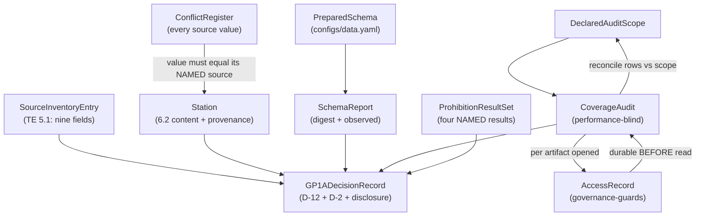

# Domain Entities — `inventory-and-registry`

**Unit** `inventory-and-registry` (Bolt 4) · **Kind** `library` · **Depends on**
`acquisition`

> **Re-established 2026-08-23 after a stage-wide redo jump** aimed at a correction in
> `acquisition`. **No content of this unit changed** — its iteration-2 adversarial verdict
> was READY with no surviving findings. **Re-established again 2026-08-23** after a further
> stage-wide redo aimed at `external-products`; **no content changed then either.**
>
> **A third re-establishment DID change content here.** `component-methods.md` § Depth
> specifies **cross-package boundary calls only** and names **`functional-design` (3.1)** as
> where intra-package shapes are specified; `inventory.py` and `release.py` are the **same
> package**, so § 1's contract is this stage's ordinary work, **not an amendment owed**.
> **No answer changed**; this unit owes **one** amendment — § 2's provenance field.

The data shapes this unit owns: the source inventory, the station registry and the
conflict register that makes its resolution rule checkable, the prepared-product schema
and its report, the declared audit scope the December coverage audit reconciles against,
the G-P1A decision record, and the four separately named prohibition results.

**Nothing here is a scientific value.** These shapes *carry* governed values — D-1's cell
rule and coordinates, D-2's and D-12's thresholds, D-13's storm-event count — and record
what is and is not established about them.

## Sources

- `../../../inception/units-generation/unit-of-work.md` § 4 — the `Owns` list, the boundary, the 7 requirements, the implementation notes.
- `../../../inception/units-generation/unit-of-work-story-map.md` — Tables 1 and 2 plus § Per-unit coverage summary. **Derived by reading the rows:** 7 requirements, **2** with no acceptance row; **owns** WS-01, TA-04, TA-25; **supports** WS-18, TA-18, TA-32.
- `../../../inception/requirements-analysis/requirements.md` — FR-P1-02-1…-5, -7, -8; § Known defects rows 3 and 9.
- `../../../inception/application-design/component-methods.md` — `src/data/registry.py`'s `Station`, `load_registry`, `assert_registry_resolved`; `src/data/release.py`'s `write_release`.
- `../../../inception/application-design/services.md` § The nine stage scripts, § Stage entry contract.
- `../acquisition/functional-design/domain-entities.md` — `SourceInventoryEntry`'s upstream, `RestrictedArtifactAccessor`, `DriverSeriesInventory`.
- `../governance-guards/functional-design/domain-entities.md` — `AccessRecord`, `RESTRICTED_ROOT`.
- `evidence/DECISIONS.md` — **D-1** and its 2026-08-21 addendum, **D-2**, **D-12**, **D-13**, **D-143**, **D-144**.
- Workspace inspection, 2026-08-23: `notebooks/madrigal_phase1_coverage_audit.ipynb`, `tests/`, and the absence of `src/` and `configs/`.
- `functional-design-questions.md` (**Q1 through Q9**), `business-logic-model.md`, `business-rules.md`.

---

## Entity map

Text fallback: the source inventory, the station registry, the schema report, the coverage
audit and the four prohibition results all feed the G-P1A decision record. The conflict
register constrains the registry — a chosen value must equal the value of the source it
names.
The audit declares its scope up front, writes an access record per artifact opened which
must be durable before the read, and reconciles the rows written against the declared
scope.

---

## 1. `SourceInventoryEntry` — nine fields, and a module this stage specifies

TE §5.1's nine, per source entry: provider, role, filename or product identifier,
coverage, retrieval date, checksum, version or release status, licence and access notes,
**and the configuration that consumes it**. An entry carrying fewer than nine **fails**.

**Read by release ID and hash, never by path** — `unit-of-work.md` § 4's boundary, so an
upstream change surfaces as a hash mismatch rather than as silently different content.

> ## `src/data/inventory.py` — SPECIFIED HERE BY DESIGN, NOT AN AMENDMENT
>
> The approved `write_release` states that `source_files`' six items *"are validated
> against `inventory.py` rather than restated as a bare hash"*. **Q1 = D designs it
> MINIMALLY**: only what that stated dependency and TE §5.1's nine fields require.
>
> **Corrected 2026-08-23: this is NOT an amendment owed.** § Depth specifies **cross-package
> boundary calls only** and its Assumptions name **`functional-design` (3.1)** as where
> intra-package shapes are specified. `inventory.py` and `release.py` are the same package,
> so the absence is the artifact's stated design. **Superseded reading preserved:** that this
> was a gap of the same class as `acquisition`'s `open_d9_input`, which is genuinely
> cross-package and remains real. This unit owes **one** amendment — § 2's provenance field.

## 2. `Station` — the approved contract, plus provenance

Approved fields, unchanged: `station_id`, `lat`, `lon`, `ellipsoidal_height_m`, `domes`,
`receiver_intervals`, `antenna_intervals`, `firmware_intervals`, `sampling_interval_s`,
`observable_codes`, `hardware_changes_2022`, `igrf_version` (**pinned, never defaulted**),
`cell`.

**`cell = (floor(lat), floor(lon))`, half-open `[floor, floor+1)` on both axes** — D-1. A
station exactly on a boundary belongs to the higher-indexed cell; none is counted twice.
ARUC **40/44**, BSHM **32/35**, NICO **35/33**, verified against executed 2022 output
(2022-11-30: ARUC 208 rows, BSHM 269, NICO 227).

**New: a per-field `provenance` value (Q2 = C).** `assert_registry_resolved` raises on
insufficient **provenance**, not only on missing **presence**.

**Why the distinction is the real one.** FR-P1-02-1 requires validation against the
**official IGS site logs** *"before being treated as final"*, and D-1 records plainly that
the coordinates came from **IGS network pages** instead — *"Site-log validation remains
outstanding."* The notebook literal says so in its own data:
`'IGS network page -- cross-check against site log required'`.

| Reading | Why rejected / chosen |
|---|---|
| Presence only | FR-P1-02-1 would have nothing enforcing it; the values are already treated as final and D-1's limitation becomes a note no code reads |
| Insufficient provenance ⇒ unresolved, universally | Literally faithful; **halts the whole downstream pipeline today** on an obligation nothing has scheduled — while D-1 records all three stations sit ≈0.14° or further from a cell edge, so no assignment would change |
| **Provenance recorded, sufficiency per consumer** | **Chosen.** A gate can demand site-log provenance where a fixture run need not |

> **What provenance is SUFFICIENT is deliberately not decided here.** Station coordinates
> are a §18.2 **Student** forbidden-choice item; the coordinate-to-cell rule is **Student +
> Supervisor**. The mechanism is fixed; the sufficiency question goes to the owner at the
> gate. A written default is how a deferral stops being one.

> **The one amendment this unit owes**: the provenance field is an addition to the approved
> `Station` dataclass — a **cross-package boundary** shape, so unlike § 1's intra-package
> contract it does need a change record. Stated, not applied. **Corrected 2026-08-23** from
> *"Amendment (2) of two"*.

**`assert_registry_resolved` raises** when a §6.2 field is missing, when `igrf_version` is
a default rather than a pin, when provenance is insufficient for the requesting consumer,
or when a conflict was resolved by **averaging**. An unresolved registry **blocks
`station_lat` and excludes `lst_sin`/`lst_cos`**.

## 3. `ConflictRegister` — new, and what makes averaging detectable

Every **source value** for every field, recorded — plus, per resolved field, **which
source the registry's value came from** and a **non-empty rationale**.

**The constraint that carries the rule: the registry's value must be identical to the
value of the source it NAMES** — not merely to *some* recorded source value.

**Why a named-source equality rather than an existence check.** A number carries no
history — given 40.286, nothing about the value says whether it was read, chosen, or
averaged. An existence check is sound only for **two** sources, where `(a+b)/2 == a` forces
`a == b`. **With three or more it is not:** sources 0, 3 and 6 average to 3, which **is** a
recorded source value, so an existence check passes an averaged resolution. Binding the
value to the **named** source makes the resolution assert a provenance claim the value must
satisfy.

> **Corrected 2026-08-23 after an adversarial pass.** The first issue required only
> *"identical to one of the recorded source values"* and claimed averaging was caught *"by
> construction"* — **a stronger guarantee than the mechanism delivers**, unqualified, on the
> acceptance-critical path behind WS-01 and TA-04.

**The residual case, stated rather than hidden.** When a mean **coincides exactly with the
named source's value**, the stored value *is* that source's value bit for bit, and **no
check on the value can distinguish it from a legitimate resolution.** The rationale, read
by a human at G-P1A, is what reaches that case — and the negative control must exercise the
coincidence case so the limit is pinned rather than discovered.

**What it also does not catch:** a conflict resolved by **picking the wrong source**. The
identity check proves nothing was **invented**; the rationale is what a reviewer judges.

**Why the rationale must be non-empty.** §6.2 says *"resolved **and recorded**"* — two
obligations. A non-empty rationale is a weak check; its **absence** is a strong one.

**Negative control, mandatory rather than optional** (`team.md` § Testing Posture): an
**injected averaged value** is tested to be rejected — including a **three-source** average
chosen so the mean equals a recorded source value **other than the named one** (rejected),
and one chosen so the mean equals **the named source's** value (**passes**, and the test
asserts that it does, pinning the stated limit).

## 4. `PreparedSchema` and `SchemaReport`

**`PreparedSchema` lives in `configs/data.yaml`** — parameter names, units, fill values,
UTC cadence, duplicate policy (FR-P1-02-2). Governed, versioned, hashable, reachable
through `ConfigSnapshot`, and needing no fifth config file beyond TE §12's four. Units and
fill values are facts about the product; a pipeline-wide contract inside one module's
source would be invisible to config review.

**`SchemaReport` records BOTH the expected schema's digest and the observed values**, so a
reader a year later can tell what it was checked against without reconstructing the config
state. A changed expected schema produces a visibly different digest.

> **D-24's protected set is NOT reopened.** Hashing the schema block as an **eighteenth**
> protected item would surface a schema change at G-P3C — the stronger design — but D-24
> is **frozen at 17 items, cardinality calculated from its enumeration**, and adding one
> is a Vision §15.2 amendment rather than a design choice. The digest-in-report gets the
> drift-detection benefit inside this unit's own evidence, where this stage has authority.

## 5. `DeclaredAuditScope` — new, and the limb that makes an audit an audit

The months, cells and artifact classes the December coverage and regime audit **declares
it will read**, stated **before** it reads anything — **checked against a governed reference
set before the audit is permitted to run**, and **reconciled against the access rows
actually written** when it finishes.

**The reference set is the twelve 2022 months, all three cells (ARUC 40/44, BSHM 32/35,
NICO 35/33), and the artifact classes FR-P1-02-3 names**, derived from the release
inventory (§ 1) and **never from the audit's own declaration**. A short declaration fails
**before anything is read**.

**Why three checks, and why none substitutes.** Per-artifact rows prove **every read was
logged**. The reconciliation proves **the audit read what it declared**. Only the
declared-versus-**required** check proves **it declared everything required** — and this
unit's output is a coverage figure a supervisor accepts at G-P1A, so **a silently skipped
month produces a wrong figure that looks right.**

> **The declared-versus-required check was added 2026-08-23 after an adversarial pass.**
> The first issue carried only the other two, so an audit declaring eleven months and
> executing exactly eleven reconciled cleanly and raised nothing — while this entity's whole
> purpose is catching the skipped month.

**Why not one access row per run.** An audit spanning twelve months, three cells and
several artifact classes is many operations. One row makes the log say less than what
happened, and a reviewer cannot tell which reads occurred.

## 6. `CoverageAudit` — performance-blind, and routed through `acquisition`

Produces the **coverage report** and the **regime-count report** that Vision §13.1 names
as G-05 inputs.

**Performance-blind is checkable, not asserted:** FR-P1-02-3's criterion is that **no
performance figure appears in the report or in its execution log**.

**Routing is `acquisition`'s, not a second mechanism.** R-32's named accessors delegate to
`open_restricted`; `governance-guards` R-25 makes the append **durable before the read**;
R-33 governs writes. This unit constructs **no path** into the restricted root —
`governance-guards` R-28's static check asserts none exists outside `locked_test.py`.

**FR-P1-02-3's scope is `access`, unqualified**, and the requirement enumerates what that
covers: *"derived-artifact merges, re-derivations, corrections, coverage recounts and
schema validations, **not only a model execution**."* Three of those are this unit's
ordinary work.

**The regime count's threshold is D-13's**, not this unit's: at least **three independent
storm events** under Vision §9.3 — a contiguous interval of `Kp>=5`, independence at
`>=24 h` of `Kp<4` — counted from **GFZ Kp/Hp60 at a recorded release grade**, with
**D-11 barring any provisional-Dst-derived figure**. This unit **measures**.

> **BLK-07's authorization limb is open**, and this audit runs through the mechanism it
> fixes. **No run may touch calendar 2022-12 while it stands.** A refusal keyed to that
> authorization is deliberately **not** built here — it is the owner's decision, and
> encoding this stage's reading of it would substitute for the decision.

> **`RES-01` is open and is about exactly this entity.** Permitted-read access logging is
> **NOT TESTED**; its candidate §19 criterion is owned by stage **3.2** under Vision
> §15.2. This unit performs the permitted read; nothing yet proves its row is written
> first.

## 7. `GP1ADecisionRecord` — two thresholds, every number attributed, and a disclosure

**Two thresholds, neither substituting for the other** (FR-P1-02-4). §6.12's
exception-plus-claim-limitation path **does not apply at G-P1A**.

| Threshold | Value | Decision |
|---|---|---|
| Hourly | **≥ 90% usable hourly coverage per station per month**, hard gate | **D-12** |
| Day | **≥ 95% of calendar days** per month, and **100% of December days** (31/31) | **D-2** |

**Contents.** A verdict per station-month against both, **plus the measured hourly and day
figure for every station-month, each attributed to the D-number it is judged against** —
the criterion forbids *"an unattributed number"*, and a bare `PASS` makes ARUC's 100.0%
and NICO's 93.2% look identical.

**Measured as at 2026-08-21, straddle days excluded, nine cached non-December months:**
ARUC 99.2–100.0%, BSHM 99.3–100.0%, **NICO 93.2–98.9%**. Every station-month clears 90%;
**NICO's margin is thin**, and the record shows it.

**D-2's own disclosure is carried into the record**, not left to be cross-referenced: D-2
states that **five of twelve months had already been audited at 100% day coverage when the
threshold was chosen** — *"It was **not** set blind. It is stated here so a reviewer can
discount it accordingly."* A record that omits it presents a partly post-hoc threshold as
blind.

**A soft margin band was declined.** Flagging station-months near a threshold is genuinely
useful at NICO's 93.2%, but *"near"* would be a number this stage invented beside a
**supervisor-frozen** threshold, and an adjacent number that becomes the real rule is a
failure this project has already had to correct.

## 8. `ProhibitionResultSet` — four results, named individually

| # | Prohibition | Proven by | Owned by |
|---|---|---|---|
| 1 | **Silent imputation** | Injection test — an imputed value must fail | This unit |
| 2 | **Source mixing** | Injection test — a mixed-source artifact must fail | This unit |
| 3 | **Retrospective split redesign after model performance is viewed** | **A frozen-hash ordering artifact** | `features-and-splits` |
| 4 | **Labelling a map value as station-observed VTEC** | Injection test — the mislabel must fail | `target-standardization` |

**Why 3 is not an injection test.** The prohibited act is **a person changing a design
after seeing a result**. No injected value proves that did not happen. A **hash of the
split definition frozen before any performance figure is produced**, plus a timestamp
ordering, is the only evidence class that distinguishes *designed before* from *redesigned
after* — the mechanism `governance-guards`' transition manifest already uses.

**Why 3 and 4 are owned elsewhere.** This unit is where the **gate** lives, not where
splits are designed or targets labelled. **This unit's obligation is to assert all four
results are present and passing before G-P1A accepts.**

> ## ⚠ WHY THIS ENTITY IS SHAPED AS FOUR NAMED RESULTS
>
> FR-P1-02-8 previously cited **`TA-29`** — a row `requirements.md` itself lists under
> *"Not applicable in Phase 1 — Phase 2 by definition"*. The citation made the row
> **appear covered** and kept it out of the untested list **stage 3.2 reads to size the
> G-05 freeze manifest**. **Four governance boards passed over it**; an advisory reviewer
> found it on the fifth revision.
>
> The cause was **one citation standing for four obligations**. Four **individually named**
> results in the G-P1A evidence set make a missing one structural rather than something a
> fifth reviewer has to notice.
>
> **The requirement remains UNTESTED.** A mechanism is not an acceptance row.

## 9. `IntegrityError` subclasses raised here

Deriving from `foundation`'s base, each naming the affected resource and the violated
expectation:

| Exception | Raised when |
|---|---|
| `InventoryError` | A source entry carries fewer than TE §5.1's nine fields; a released artifact's hash does not match its release ID |
| `RegistryError` | A §6.2 field is missing; `igrf_version` is defaulted rather than pinned; provenance is insufficient for the requesting consumer; a value matches **no** recorded source value (an averaged resolution); a resolved field carries an empty rationale |
| `SchemaError` | A parameter name, unit, fill value, UTC cadence or duplicate policy does not match `PreparedSchema` |
| `AuditScopeError` | The declared audit scope does not equal the governed reference set (raised **before any read**); or the access rows written do not reconcile against the declared scope |
| `LockedTestError` | Raised **through** `acquisition`'s named accessor — a log write or durability failure, before any read proceeds |
| `GateError` | A G-P1A record carries an unattributed number; a prohibition result is absent from the four |

Catching `foundation`'s base is what lets the stage entry contract write the `aborted`
registry row for any of them.

---

## Requirement coverage

Derived from story-map Table 1, with owners from Table 2's `primary` cell. Both paths
cross-checked and in agreement.

| Requirement | Entities | Tested by (Table 1) | Row primary owner |
|---|---|---|---|
| FR-P1-02-1 | `Station`, `ConflictRegister` | WS-01, TA-04 | **`inventory-and-registry`** (both) |
| **FR-P1-02-7** | `Station` | ⚠ **NO ROW** — WS-01 reaches the registry's existence and the header cross-check only | — |
| FR-P1-02-2 | `PreparedSchema`, `SchemaReport` | TA-04 | **`inventory-and-registry`** |
| FR-P1-02-3 | `CoverageAudit`, `DeclaredAuditScope` | WS-18, TA-25 | `features-and-splits` (WS-18); **`inventory-and-registry`** (TA-25) |
| FR-P1-02-4 | `GP1ADecisionRecord` | TA-25 | **`inventory-and-registry`** |
| FR-P1-02-5 | `GP1ADecisionRecord` | TA-25 | **`inventory-and-registry`** |
| **FR-P1-02-8** | `ProhibitionResultSet` | ⚠ **NO ROW** — `TA-29` cited and **withdrawn** | — |

**7 requirements, 2 without an acceptance row.** **Owns** WS-01, TA-04, TA-25;
**supports** WS-18, TA-18, TA-32.

> ## WS-01 IS A NAMED EXCEPTION, AND ITS BOUNDARY IS PART OF THE FACT
>
> `team.md` § Testing Posture defines Phase 1's acceptance set as **WS-09 through
> WS-20**, deferring WS-01–WS-08 to G-P3A. **WS-01 is retained in Phase 1 as a named
> exception**, approved by the project owner **2026-08-21** (`GOV-2026-08-21-RA-01` Rec
> 12), because it is Phase 1-producible — built by `01_inventory_and_registry.py` and
> `test_station_registry.py`, neither a raw-processing module — and **§7.0's Phase 1 hard
> prohibition, the stated basis for the deferral, does not reach a station registry.**
>
> **WS-02 through WS-08 remain deferred to G-P3A, unchanged.** The boundary is stated
> because both failure modes are live: without the exception the station registry — *"the
> authority for `station_lat`, the coordinate-to-cell rule and every per-cell statistic"* —
> would have **no acceptance row at all**; and without the boundary a later reader
> generalises it.

> **The two without a row.** No §19 criterion is drafted here — §19 rows are owned by
> stage 3.2 and change control. **FR-P1-02-7** would close on an approved row asserting all
> seven §6.2 items beyond coordinates, including a **pinned, never defaulted** IGRF
> version, plus a passing result. **FR-P1-02-8** would close on a row replacing the
> withdrawn `TA-29`, carrying **four separately named results**, plus passing results for
> all four.

## Assumptions & Open Questions

- **[assumption]** Rule IDs continue the single sequence, so `business-rules.md` opens at **R-44**. If per-unit numbering was intended, say so at the gate.
- **[assumption]** `tests/test_station_registry.py` is this unit's per `unit-of-work.md` § 4. **It does not exist** — `tests/` holds three modules and that is not one of them.
- **[assumption]** WS-01's Phase 1 retention is settled governance; this stage records rather than revisits it.
- **[assumption]** D-13 owns the regime-count threshold; this unit measures against it.
- **[assumption]** `frontend-components.md` is not produced — `kind: library`.
- **Corrected 2026-08-23 — `src/data/inventory.py` is NOT an amendment owed**; § Depth specifies boundary calls only and names this stage as where intra-package shapes are specified.
- **Open — the amendment count, corrected 2026-08-23.** **One** here (§ 2's provenance field), not two. With `acquisition`'s three that is **four across two units**. **Superseded:** *"Five across two units."*
- **Open — what provenance is sufficient**, a §18.2 forbidden-choice question. Mechanism fixed here; sufficiency to the owner.
- **Open — D-1's site-log validation limitation**, recorded in D-1 and repeated in its addendum as *separate and still open*.
- **Open — BLK-07's authorization limb**, carried from `acquisition`. **No run may touch calendar 2022-12 while it stands.**
- **Open — `RES-01`**, and **this unit performs the permitted read it is about.**
- **Open — FR-P1-02-8's replacement acceptance row** after `TA-29`'s withdrawal.
- **Open — D-24's protected set is not reopened.** The schema-block-as-eighteenth-item question is available to raise separately; it is not proposed here.
- **G-09 is not signed.** No entity here authorises creating `src/data/inventory.py`, `src/data/registry.py`, `scripts/01_inventory_and_registry.py` or `tests/test_station_registry.py`.
- **None** of the above adopts a reading on a supervisor-owned value, and none decides a scientific constant.
