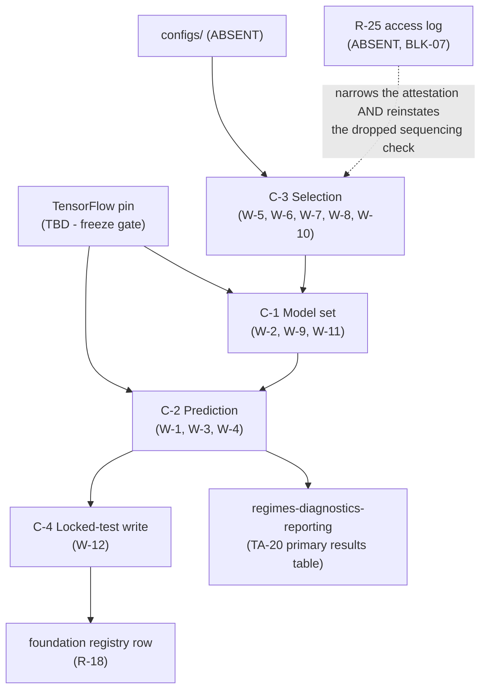

# Logical Components — `models-and-baselines`

**Unit** `models-and-baselines` (Bolt 8) · **Kind** `library` · **Stage** `nfr-design`

> ## ⚠ FOUR COMPONENTS, TEN FILES, NONE OF THEM BUILT
>
> Every component below is a **logical** boundary over modules that do not exist. Derivation 1:
> W-11 names **ten** files and **0** are present — `src/models/` holds `__init__.py` only,
> `scripts/06_train_and_predict.py` is absent, and neither `tests/test_models_smoke.py` nor
> `tests/test_checkpoint_restore.py` exists.
>
> **No model has ever been trained.** The **TensorFlow pin is `TBD — freeze gate`** and blocks
> this unit specifically. **`configs/` does not exist**; **no Python interpreter is reachable**.
> **BLK-03 is an open exit condition** and independently bars implementation; **BLK-07 is
> open**, and § SD-M-01 is designed around that rather than through it.
>
> This is a `library` unit: **no service boundary, no deployable process, no request path, no
> scaling axis**. "Blast radius" below means *which claims a defect invalidates and how far
> downstream it travels*, not which process restarts.

## Sources

- `../nfr-requirements/security-requirements.md` — **SEC-M-01**…**SEC-M-06**, and its § Scope note's assessment of all five NFR categories.
- `../nfr-requirements/tech-stack-decisions.md` — **TS-M-01**…**TS-M-06**: the one forecasting stack and the pin this unit waits on, determinism as a utility, `scikit-learn`'s two library-shaped prohibitions, checkpoints and serialization, the two tested absences, the platform posture.
- **`performance-requirements`, `scalability-requirements` and `reliability-requirements`** are **absent by scope design** — `produces_kinds` maps all three to `[service]` / `[service, ui]` and this unit is `library`. Their subject matter is carried in `security-design.md` § Scope note.
- `../functional-design/business-logic-model.md` — **W-1**…**W-12**, the workflows these components partition, and **W-11**'s ten-file build list.
- `../functional-design/business-rules.md` — **R-90**…**R-102a**.
- `./security-design.md` — **SD-M-00**…**SD-M-07**, and the **14**-row coverage table this file's own table mirrors.
- `../../../inception/application-design/component-methods.md` — `FeatureBundle`, `Prediction` carrying `partition_id`/`transform_id`, and § Depth's intra-package carve-out.
- `../../../inception/application-design/services.md` — `06_train_and_predict.py`'s writes and the nine stage scripts' read/write split.
- `../../../inception/application-design/component-dependency.md` — `src/models` may not import `src/external/iri.py`, `gim.py` or `src/evaluation`.
- `../../../inception/units-generation/unit-of-work.md` § 8 — the **9** requirements and **BLK-03**.
- `nfr-design-questions.md` — **Q5 = A**, and the receipted Consolidated Summary Confirmation.

---

## The boundary criterion (Q5 = A)

**The boundary is drawn on the substitution each component refuses.**

> **This is the only unit that trains, and almost every rule it carries has one shape: something
> plausible must not be allowed to stand in for the thing that was specified.** A single seed
> for the three-seed mean. A last epoch for the best checkpoint. A re-tuned refit for the frozen
> one. A December-informed criterion for a January–November one. A regenerated prediction for
> the one-shot write.

**Why this axis and not one of the seven the siblings used.** `foundation` drew on
**write-integrity**, `governance-guards` on **enforcement timing**, `acquisition` on **egress
direction**, `inventory-and-registry` on **how a failure reaches a human**, `external-products`
on **what the component keeps out**, `target-standardization` on **what each component makes
true about the target**, `features-and-splits` on **the object whose integrity is at stake**.

| Rejected axis | Why not here |
|---|---|
| **By pipeline stage** (tune \| fit \| checkpoint \| predict) | Matches how `06_train_and_predict.py` reads, and splits the three-seed mean from the checkpoint restore even though both substitute one model for another. It has **no box for the locked-test write**, which is an event rather than a stage. |
| **By model family** (M-01…M-06 + the two generated tables) | Boundaries would coincide with modules exactly. **Eight** components for one `library` unit, and the rules that matter most — determinism, tuning, the receipt — cut **across** every family, so they would be replicated in eight places or homeless. |
| **By workflow grouping** (W-1/W-2 \| W-3/W-4 \| W-5/W-6/W-7 \| W-8…W-12) | Traceable, but W-12's one-shot write would share a box with the horizon and two sibling-owned evidence obligations on adjacency alone. |
| **The object whose integrity is at stake** (`features-and-splits`' axis) | Defensible, and it would work — but this unit's objects are mostly *the same* object at different moments (a `Prediction`), so the axis under-discriminates here in the way it discriminated well there. |

**What the chosen axis buys.** Every component's negative control **falls out of the
decomposition** rather than being bolted on: each one is *"the substitution is attempted and it
fails"*, which is exactly the affirmed every-hard-rule-gets-a-test practice. And the four boxes
have genuinely different blast radii (§ Failure domains).

<!-- Text fallback: four components. The unfrozen TensorFlow pin feeds C-1 Model set and C-2 Prediction. configs/ (absent) feeds C-3 Selection. R-25's absent access log has a dashed edge to C-3, labelled "narrows the attestation AND reinstates the dropped sequencing check". C-3 feeds C-1; C-1 feeds C-2; C-2 feeds C-4 Locked-test write; C-4 feeds foundation's registry row (R-18); C-2 also feeds regimes-diagnostics-reporting, which owns the TA-20 primary results table. -->

---

## Component inventory

Four components. **Every one is unbuilt.**

### C-1 — Model set (refuses: a family that is not in the ladder)

- **Substitutions refused**: a seventh family added; a **prohibited architecture** present (GRU,
  a residual module, PyTorch, Transformer/attention/BiLSTM/GNN); **B-01 (IRI) or C-01 (CODE
  GIM)** treated as a trained model rather than a generated benchmark/comparator table; **M-03
  fitted on everything** instead of on training partitions only; **SSN** present as a feature.
- **Modules (absent)**: `src/models/persistence.py`, `climatology.py`, `ridge.py`,
  `random_forest.py`, `lstm.py` · **Test (absent)**: `tests/test_models_smoke.py`
- **Controls**: **TA-08 and TA-12 require grep evidence** that the prohibited modules are absent
  from the codebase — a **tested** absence, not a documented one; `climatology_fit_partition`
  returns the partitions M-03 was **actually** fitted on and every one must be a training
  partition, so **a climatology fitted across all partitions fails**.
- **Raises**: `LeakageError`.
- **Waits on**: the **TensorFlow pin** — M-06's checkpoint format and determinism settings are
  version-dependent.

### C-2 — Prediction (refuses: a number that looks like the confirmatory one)

- **Substitutions refused**: a **single seed**, a **best-of-three**, or a **median** in place of
  the **three-seed element-wise mean**; a mean whose inputs **disagree on provenance** (feature
  set, partition, or `transform_id`); M-06's **last epoch** in place of its
  **lowest-validation-RMSE checkpoint**; a bundle whose **`transform_id is None`** reaching a
  scoring path; a frame whose spec is not `(partition k, role "score")` reaching partition *k*'s
  scoring.
- **Modules (absent)**: `src/models/train.py` (including W-1's match function),
  `checkpoint.py` · **Test (absent)**: `tests/test_checkpoint_restore.py`
- **Controls**: the **expected seed set is an argument** (`expected_seeds`), so a mean over the
  wrong set is unrepresentable rather than merely wrong; the **stamp match runs before EVERY
  scoring path**, not once at entry; the restore path is a **tested behaviour**, because
  last-epoch restore is the library default and the correct behaviour is the one needing proof.
- **Raises**: `SeedError`, `AlignmentError`, `PartitionError`, `LeakageError`.
- **Hands on**: `Prediction` carries `partition_id` and `transform_id` to `07`, so the stamp
  travels the whole way rather than to the first consumer.

### C-3 — Selection (refuses: a choice informed by something it must not see)

- **Substitutions refused**: a **December-informed** criterion; a **changed grid** or one whose
  **content** differs from D-121's counts; an **ablation invented after results are seen**; an
  **RF importance score** used to add, drop or rank a feature; a **refit that re-tunes**; a
  **selected seed**; a **horizon change requiring a code edit**.
- **Modules (absent)**: the tuning path inside `src/models/train.py`;
  `scripts/06_train_and_predict.py`
- **Controls**: `TuningRecord.partitions_read` excludes December; **`criterion_hash ==
  criterion_used_hash`**; **an unconditional, dated, named attestation bound to this run's
  `criterion_hash`** (Q1 = C, Q2 = A) — *the three attestation fields are an **owed,
  change-control-gated amendment** to `TuningRecord`'s frozen owning definition, which does
  not yet carry them (2026-09-04, Major; see `security-design.md` § SD-M-01's dated note)* —
  so a **re-declared criterion invalidates it**; the grid
  lives **once** in `experiment.yaml` with its **hash committed before G-05** and its **content
  asserted separately**; ablations are **predeclared as named runs with run IDs** — five named,
  **four reachable in Phase 1**, `ABL-ZENITH` deferred to Phase 2; RF importance is saved
  `authoritative = false` and **an importance score reaching the production feature path
  fails**.
- **Was blocked, now partly is not**: § SEC-M-01's third mechanism read `governance-guards`
  R-25's durable log, which does not exist. Q1 = C removes that dependency **for the
  attestation limb**, which now runs unconditionally. ⚠ **The mechanism's other limb is
  dropped, not replaced** *(corrected 2026-09-04 on adversarial finding 1, Major; the
  superseded claim "BLK-07 narrows this component later rather than blocking it" is preserved
  here)*: a `"locked_evaluation"` access inside the tuning window is *"itself a finding"* —
  a **mechanical sequencing check** an attestation cannot perform — and it is **unavailable
  today with no substitute**. **When R-25's log lands it reinstates that check as an addition,
  so BLK-07 is not a mere narrowing.**
- **Claims no check over**: FR-P1-05-3's stated evidence, *"the feature manifest's
  provenance"* — that manifest is `features-and-splits`' (W-10).

### C-4 — Locked-test write (refuses: a second chance)

- **Substitutions refused**: a **second write** of the `DEC` prediction; a **regenerated** file;
  **any metric computed before the receipt exists**; a receipt **created by the
  metric-computing process**.
- **Module (absent)**: the `DEC` path inside `scripts/06_train_and_predict.py`
- **Controls**: `06` writes once; hashes the file **as written**, at a moment when **no metric
  exists**; **`fsync` + atomic rename**, then the registry append, and **refuses to exit unless
  both returned success** (Q3 = A); `07` and the bootstrap **re-verify** the file against
  `sha256` and refuse a `recorded_at_utc` that does not precede their own call. **Precedence:
  the receipt file is authoritative for the hash, the registry row for the run's existence, and
  a disagreement raises.**
- **Raises**: `LockedTestError` — **on `06`'s own exit path**, so the failure reads *`06`
  aborted* rather than *`07` blocked*.
- **Two halves**: `foundation` R-18's W-6 step 4 **refuses a `prediction_hash` presented by the
  metric-computing process**. Neither half suffices alone, and **this unit does not declare the
  contract satisfied**.
- **Barred until**: **G-05 is signed**. **No December execution occurs in this Bolt.**

---

## Failure domains and blast radius

| Component | Characteristic failure | How it announces itself | Blast radius |
|---|---|---|---|
| **C-1** | A prohibited architecture present, or M-03 fitted on everything | **Mostly loud** — `LeakageError` for the climatology; the prohibited-module failures are caught by a **grep test**, so they announce themselves only when that test runs | **The ladder.** A model set that is not the closed set makes the comparison a different experiment from the declared one. |
| **C-2** | A single seed, or a last-epoch checkpoint, presented as the confirmatory prediction | **Loud where the stamp reaches** — `SeedError` / `AlignmentError` / `PartitionError`. **Silent** where a frame never carried a stamp at all: a bundle-less frame leaves the match nothing to compare | **One number**, and everything computed from it. Bounded by the stamp's reach. |
| **C-3** | **A criterion informed by a December figure a human carries in their head** | **Nothing.** No mechanism sees it, and § SD-M-01 states that none can | **Every number downstream of the selection.** The grid, the hyperparameters, the refit, and every metric computed with them. |
| **C-4** | A `DEC` prediction regenerated after a score was seen | **Loud, if and only if the writer and reader stay in different processes.** Move the receipt into `07` or the bootstrap and *"the receipt precedes the metric"* holds **by construction on every run** — the control passes its own test and **detects nothing** | **Irreversible.** The locked test opens once; a compromised one-shot write cannot be undone by any later care. |

> **The two failures that matter most are the two that are quiet, and they are quiet for
> different reasons.** C-3's is quiet because the channel is a human's memory — **an
> irreducible residual**, which is why the attestation buys a dated record rather than a
> guarantee, and why **no artifact may describe December-blindness in tuning as fully
> enforced**. C-4's is quiet only if the design is built wrong: the process boundary is what
> makes it loud, so the **cheapest implementation is the one that silently disables the
> control**. One residual cannot be closed; the other must not be opened.

**A third asymmetry worth naming.** C-1 and C-2 both **wait on the TensorFlow pin**, and C-3
and C-4 do not. So the two components that can be designed but not built are the two whose
failures are loud, and the two that could be built today are the two whose failures are
quiet — which is the opposite of the order anyone would choose.

---

## Shared resources

| Resource | Shared with | Contention or coupling |
|---|---|---|
| `configs/experiment.yaml`, `seeds.yaml` | Every unit | Read-only, snapshotted and hashed per run. **Absent.** The grid lives here **once**; the seeds are D-122's; the horizon list exposes `[1]` with 24 implemented and testable. |
| The **TensorFlow pin** | `foundation` owns it | **`TBD — freeze gate`**, candidate 2.21.0, frozen only after Kaggle/local fixture installation passes — **neither fixture has run**. It blocks C-1 and C-2. |
| `src/data/config.py`'s exception hierarchy | Every unit | This unit raises 5 of its 17 names; **0** owed (Derivation 2). **`PartitionError`: this unit is the semantic owner, `src/data/config.py` is the declaration site.** |
| `FeatureBundle` / `Partition` | **`features-and-splits`** | Consumed, never derived. Fold construction is that unit's; `scikit-learn`'s CV splitters are **not used**. C-2's stamp match is the consumer half of that unit's fitting-identity contract. |
| The **feature manifest's provenance** | **`features-and-splits`** | FR-P1-05-3's stated evidence rests on it; this unit **claims no check over it**. |
| `governance-guards` R-25's durable access log | `governance-guards` | **Absent (BLK-07).** After Q1 = C it does **two** things when it lands: **narrows** C-3's attestation requirement, **and reinstates the mechanical sequencing check** (`"locked_evaluation"` inside the tuning window) that the unconditional attestation **cannot** perform and that is **unavailable today with no substitute**. |
| The registry row (`prediction_hash`, column 18 of twenty) | **`foundation`** (R-18) | The receipt's destination. R-18 **refuses a hash presented by the metric-computing process**; C-4 stops the receipt being **created** in one. **`prior_period_exposure` is not written here** — Phase 1 value `false`, source `governance-guards`, destination `foundation`. |
| The **primary results table** (TA-20) | **`regimes-diagnostics-reporting`** | This unit **produces** all three difficulty controls; that unit **owns** the table and the binding honesty rule's disclosure. |
| Kaggle and local | Every unit | Exactly two platforms; **CPU is a complete execution path**; **GPU an optional accelerator only, never a dependency of any result**. The **in-Kaggle test-and-fixture obligation is live here**, because this unit performs the project's largest governed runs. |

**No shared runtime resource exists** — no pool, cache, queue, load balancer or failover path.

---

## Requirement coverage

| Requirement | Component | Acceptance row | Status |
|---|---|---|---|
| **FR-P1-04-14** | **C-3** | ⚠ **NO ROW** — proposed, not approved | control required |
| FR-P1-05-1 | **C-1** | WS-14, TA-12, TA-26 | `Pending` — pin unfrozen |
| FR-P1-05-2 | **C-2** | WS-15, TA-13 | `Pending` |
| **FR-P1-05-3** | **C-3** | ⚠ **NO ROW** — proposed | control required; evidence is a sibling's |
| **FR-P1-05-4** | **C-3** | ⚠ **NO ROW** — proposed | control required; **third clause now runnable** |
| **FR-P1-05-5** | **C-3** | ⚠ **NO ROW** — proposed | control required |
| **FR-P1-05-6** | **C-3** | ⚠ **NO ROW** — proposed | control required |
| **FR-P1-05-21** | **C-1** | ⚠ **NO ROW** — proposed | control required |
| **FR-P1-05-22** | **C-3** | ⚠ **NO ROW** — proposed | control required |
| NFR-DET-01 | **C-2** | WS-17 (supporting), TA-13 | `Pending` — probe subject owed at pin-freeze |
| NFR-LEAK-01 | **C-1** | TA-11 | `Pending` |
| NFR-IRI-01 | **C-1** | WS-10, TA-07 | `Pending` — test written, UNEXECUTED |
| NFR-AUD-01 | **C-4** | **TA-10, TA-21** — owned elsewhere | `Pending` |
| NFR-PHASE-01 | **C-2** | **TA-27** — owned by `governance-guards` | `Pending` |

**Derived and printed.** **4** components (C-1…C-4). **14** coverage rows, counted from the
table above and **set-differenced against `security-design.md`'s 14** — identical ID sets, so
the two tables agree by their **lists** rather than by their totals. Per-component
distribution, **derived by grepping this table's own rows and printed before assertion**:
**C-1: 4** (FR-P1-05-1, FR-P1-05-21, NFR-LEAK-01, NFR-IRI-01), **C-2: 3** (FR-P1-05-2,
NFR-DET-01, NFR-PHASE-01), **C-3: 6** (FR-P1-04-14, FR-P1-05-3, -4, -5, -6, -22), **C-4: 1**
(NFR-AUD-01) — **4 + 3 + 6 + 1 = 14**. *(Corrected 2026-09-04 on adversarial finding 2, Major;
superseded figure preserved: **C-2: 4**, printed alongside a correct total of 14, so the total
concealed the component error. The three named derivations in this unit's questions file were
each run with a command and printed; this fourth count sat one sentence below them and was read
off the table by eye — `project.md` § Way of Working requires every count derived
programmatically and printed, and a count riding inside a sentence whose other figures were
derived is exactly where that habit stops looking.)* **7**
with **no acceptance row**, re-derived by counting `⚠ NO ROW` cells. **0** rows claimed
satisfied. **10** files named by W-11, **0** present. **0** IDs added at this stage.

**C-3 carries six of fourteen, and C-4 carries one.** Stated rather than smoothed: the axis is
the substitution refused, and *selection* is where this unit's rules concentrate — six of the
seven requirements with no acceptance row land there. C-4's single row is **NFR-AUD-01**, whose
two acceptance rows are both owned elsewhere; its low row count is the inverse of its blast
radius, which is the largest in the unit and the only irreversible one.

## Assumptions & Open Questions

- **[Q5]** The decomposition is by **the substitution each component refuses**. The visibility distinction is carried in § Failure domains, and the pin-dependency asymmetry (C-1/C-2 blocked, C-3/C-4 not) is stated there because it inverts the order in which anyone would want to build them.
- **[Q1 / C-3]** The attestation is **unconditional** and depends on no external artifact. **The residual cannot be closed by any mechanism**, and no artifact may describe December-blindness in tuning as fully enforced.
- **⚠ Open, and OWED — C-3 lost a mechanical check that nothing here replaces** *(added 2026-09-04 on adversarial finding 1, Major)*. Mechanism 3's second limb made a `"locked_evaluation"` access inside the tuning window *"itself a finding"* — no human-memory component, purely a sequencing violation — and an attestation about what informed a criterion **cannot** catch it. **Unavailable today with no substitute**, **reinstated as an addition when R-25's log lands**, and therefore **BLK-07 is not a mere narrowing**. Until then no artifact may describe the sequencing violation as detected.
- **[Q3 / C-4]** The control is **loud only while writer and reader stay in different processes**. The cheapest implementation — writing the receipt inside `07` or the bootstrap — silently disables it, which is why the process boundary is stated as the mechanism rather than as an implementation note.
- **[Q4 / C-2]** **The determinism probe's subject operation is owed at pin-freeze.** If no operation on the frozen pin is reliably nondeterministic, the probe degrades to a recorded boolean and **the degradation is recorded**.
- **Open — the TensorFlow pin is `TBD — freeze gate`** and blocks C-1 and C-2. Neither Kaggle nor local fixture installation has run.
- **Open — BLK-03 is an exit condition on this unit** and independently bars implementation. **Approving this decomposition approves no contract.**
- **Open — seven acceptance rows are proposed and unapproved** as one Vision §15.2 request; six of the seven land in C-3.
- **Open — `prior_period_exposure`'s predicate deviation** is raised for the owner at R-102a: `foundation`'s W-6 step 5 hard-refuses `true` on a Phase 1 row, and this unit is Phase 1, so if Recommendation 1 meant a different predicate it needs a different field name.
- **Carried, re-derived 2026-09-04 — D-122's sign-off status.** Vision §14.2's current row: closed 2026-08-22 under the recorded authority equivalence, **no supervisor signature artifact exists and none is claimed** *(superseded carried line preserved: "owes a supervisor signature at G-05"; whether the equivalence closure satisfies the G-05 gate's intent is routed to the gate — see `security-design.md`'s matching correction)*. The grid hash must still be committed before G-05 — unchanged.
- **Carried — nothing has been measured**: no training runtime, no peak memory, no convergence behaviour. TE §9.3's envelope is a **storage** budget and **no numeric memory ceiling exists in the authorities**.
- **Carried — D-31's disclosure travels with the G-09 signature**: the §18.3 preflight never ran, the critical tests are unexecuted here, and `aws_ai_dlc_preflight_report` does not exist.
- **None** of the above decides a scientific value, fills a `TBD — freeze gate` field, approves an acceptance row, closes a blocker, or claims a gate or test as discharged.

---

## Receipt-floor note — 2026-09-04 (re-saved after the second re-affirmation)

*A second redo jump was taken because the first recovery ran confirm/write/review out of
order. **Both fixes below are unchanged by that**; only the receipts moved.*

**This is one of the two units the redo jump was taken for.** The prior adversarial pass
returned READY with two Majors, and the project decision owner directed that all findings be
fixed. Because a terminal review receipt freezes a `produces[]` artifact, the fix required a
**redo jump** to clear this stage's receipt floor — which invalidated every unit's receipts,
not only this one's.

**Both fixes are in this file:**

1. **The per-component distribution was wrong** — printed as `C-2: 4` beside a correct total
   of 14, so the total concealed the component error. Corrected to **C-2: 3**, now derived by
   grepping this table's own rows with each component's IDs printed, and `4 + 3 + 6 + 1 = 14`
   shown.
2. **The narrowing claim was one-directional** — C-3, the shared-resources row, the Mermaid
   edge label and its text fallback all said R-25's log would merely *narrow* the attestation
   later. All four now state that mechanism 3's **`locked_evaluation` sequencing check is
   dropped with no substitute**, is **unavailable today**, and is **reinstated as an addition**
   when the log lands — so BLK-07 is **not** a mere narrowing.

The withdrawal of "strictly more coverage" is recorded in `security-design.md` § SD-M-01's
correction box, with the superseded claim preserved. **Nothing else changed**, and the summary
was re-affirmed by the owner on 2026-09-04 (its stored value was already `Looks correct`).
