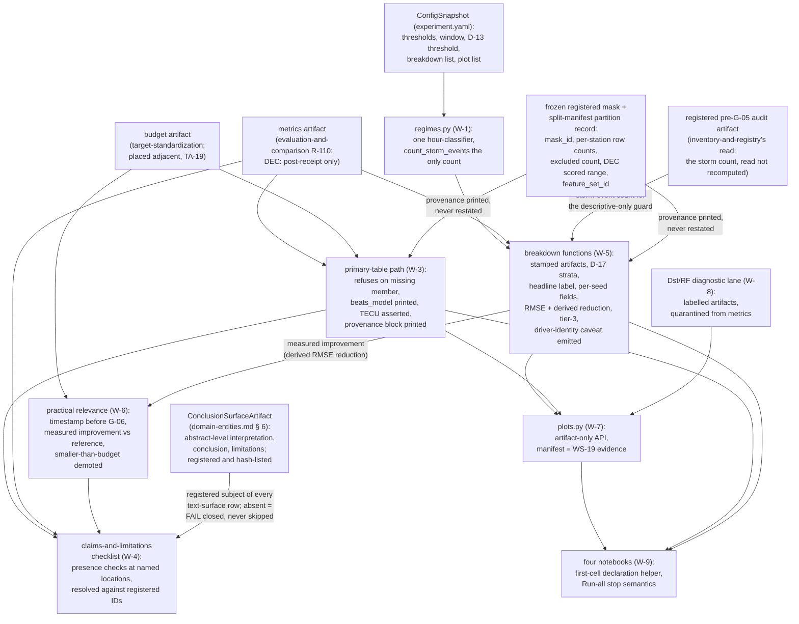

# Business Logic Model — `regimes-diagnostics-reporting`

**Unit** `regimes-diagnostics-reporting` · **Kind** `library` · **Complexity** L ·
**Deployment** embedded · **Depends on** `statistical-inference`

The workflows this unit implements: everything between a computed interval and a
defensible statement. The **single regime classifier** whose thresholds and event window
arrive from `experiment.yaml` via `ConfigSnapshot` and whose one counting path is the
approved `count_storm_events`; the **December/ML-02 guard pair** — classification that is
December-blind by signature and regime **performance** breakdowns that are post-receipt by
construction, with the descriptive-only storm guard reading the **registered** pre-G-05
audit count rather than recomputing it; the **primary results table** as a producing path
that consumes `evaluation-and-comparison` R-110's checked fields; the **machine-readable
claims-and-limitations checklist** turning the **seven** mandated disclosure obligations
into
presence checks at named locations against a **registered** conclusion surface; the
**FR-P1-05-16 breakdown family** as stamped
producing functions with the D-17 strata bound structural, the §5.5 metric set reported and
the TC-12 driver-identity caveat emitted from the producing path; the
**practical-relevance and
post-access pair** made mechanical **on both of Vision §5.3's conjuncts**; **`plots.py`**
rendering exclusively from serialized
stamped artifacts with the manifest as WS-19's evidence; the **Dst/RF diagnostics
quarantine**; and the **notebook declaration helper** that gives REQ-ENG-12's "Run all"
semantics their mechanism.

**It decides no scientific value.** The regime thresholds (quiet `Kp<4`, disturbed
`Kp>=4`, storm `Kp>=5`), the −12 h/+24 h event window, D-13's three-independent-events
threshold, the D-8 claim boundary and every mandated disclosure sentence are already
frozen and merely encoded; everything underdetermined — the migrated coverage notebook's
home (W-9), the Vision §15.2 acceptance-row proposals (W-4, W-10), the exploratory
label's writer (W-6) — is expressly routed to the gate. **BLK-03 ↓, BLK-04 ↓, BLK-08 ↓ and
BLK-09 ↓ are inherited open exit conditions on this stage** — none owned here, none closed
here. **BLK-08 ↓ reaches the claims directly**: the practical-relevance comparison and the
primary table's numbers are TECU-denominated only if the co-owner adopts its half of
`evaluation-and-comparison`'s R-103 joint contract, and until then no design path returns
model output to TECU — W-3's and W-6's units assertions make that dependence checked
rather than silent. **BLK-09 ↓** bounds the fit every reported number rests on. This unit
may enter 3.1, **may not complete or exit** it while any contract is unapproved, and **no
implementation may proceed while they stand** (`GOV-2026-08-22-REM-01` Rec 2, extended to
BLK-08/BLK-09 on 2026-08-23). **G-09 is not signed** — every workflow below is design, and
no module or notebook is created.

> **Remediation, 2026-08-28 — `GOV-2026-08-28-FD-01` (verdict FAIL), owner-ruled items.**
> The workflows below gain, each dated at its site with its Recommendation number:
> **W-3 point 7** — the provenance block (`mask_id`, `feature_set_id`, per-station surviving
> row counts, exclusion counts, the D-28 scored-window statement) and the §5.5 metric
> surface, printed from the producing objects and never restated (Rec 16, Rec 20);
> **W-4** — the registered `ConclusionSurfaceArtifact` as the checked text's declared
> subject, fail-closed when absent, plus the D-28 scored-set and TC-12 rows (Rec 21,
> Rec 16, Rec 17), **and — added on the 2026-08-28 resume pass — the `NFR-TDEF-01` and
> `FR-P1-03-4` disclosure rows (Rec 18 limb (3)), which the original remediation recorded as
> owed and did not write**; **W-5** — the §5.5 metric fields, the `derived: true` label, the tier-3
> row for the owner's third comparison set, and the standing driver-identity caveat emitted
> from the per-station producing path (Rec 20, Rec 19, Rec 17); **W-6** — the **measured
> improvement** in its `INPUT`, so Vision §5.3's first conjunct is evaluable at all
> (Rec 20); **W-2** — an **asserted** December day range rather than an inherited one, and
> wholly-outside storm events excluded from D-13's threshold, with the range's value routed
> to the gate as Student + Supervisor (Rec 15); **W-10 / § Sources** — §12's count corrected
> to the derived **21** with the `test_acquisition_window.py` precedent sentence fixed
> (Rec 27); and VAL-05's named falsifier (Rec 43). **Nothing here decides a scientific
> value; BLK-03 ↓, BLK-04 ↓, BLK-08 ↓, BLK-09 ↓ stay open; G-09 stays unsigned.** The two
> `## Review` sections at the end of this file are the 2026-08-27 historical record and are
> **preserved byte-for-byte**; the counts they verified (30/31 controls, 5 entities) were
> correct then — the live counts are **40 controls** and **6 entities**, re-derived in
> `business-rules.md` § Negative-control count and `domain-entities.md` § Requirement
> coverage.

## Sources

- `../../../inception/units-generation/unit-of-work.md` § 11 — the `Owns` list (3 `src/` modules + 4 notebooks + 1 checklist artifact, derived by counting), the boundary (runs inside `scripts/07_evaluate_and_report.py`, which `evaluation-and-comparison` owns, and inside the four review notebooks; `plots.py` presentation only and computes no reported quantity; a notebook never holds the only copy of parsing, calibration, feature, split, training, evaluation or bootstrap logic), the 11 requirements (7 bolded untested), acceptance rows WS-19/TA-16/TA-20, the six implementation notes; **BLK-03/BLK-04/BLK-08/BLK-09** with the exit-condition ruling and BLK-08's TECU reach into the claims.
- `../../../inception/units-generation/unit-of-work-story-map.md` — Table 1's rows for the 11 requirements (7 marked **NO CURRENT ACCEPTANCE ROW**); Table 2's WS-19 row (figure set, each carrying its source-data IDs), TA-16 row (notebook header declarations + acquisition-notebook/script diff), TA-19 row (primary `target-standardization`, supporting this unit), TA-20 row (primary results table with the three controls alongside the IRI comparison); § Per-unit coverage summary (11 / 7 / WS-19, TA-16, TA-20 / TA-19); § Cross-unit responsibilities (REQ-ENG-8: the coverage notebook migrates here); the open-issues rows (FR-P1-05-18's missing source criterion — a `requirements.md` change).
- `../../../inception/requirements-analysis/requirements.md` — REQ-ENG-12, FR-P1-05-9, FR-P1-05-10, FR-P1-05-11, FR-P1-05-14, FR-P1-05-15, FR-P1-05-16, FR-P1-05-18 (four clauses; the advisory NOT-READY on the count's source), FR-P1-05-19, FR-P1-05-20, REQ-CLAIM-01; § Cleanup row on `.dst_summary.json`.
- `../../../inception/application-design/component-methods.md` — § `src/evaluation`'s approved `count_storm_events` boundary call and raise contract, quoted verbatim in W-1; § Depth (Q1 = B: full signatures at cross-package boundaries only; intra-package shapes this stage's to specify, names indicative); § Assumptions (the fourteen project exceptions declared where raised until 3.1 places them; no signature encodes a scientific constant); `src/data/locked_test.py`'s `purpose` enum (`"coverage_audit" | "regime_audit" | "locked_evaluation"`).
- `../../../inception/application-design/services.md` — `07_evaluate_and_report.py`'s row (reads predictions carrying `partition_id`/`transform_id`, benchmark, mask; writes metrics, bootstrap intervals, **breakdowns, figures**); the five notebooks as review and presentation surfaces (TE §7: notebooks do not own production logic).
- `../evaluation-and-comparison/functional-design/business-rules.md` — R-108 (`EstimandResult`'s machine-readable orientation/weighting/sign-convention fields; this unit asserts presence, restates nothing), R-109 (the two-events boundary; the DEC hash receipt; scored range exactly 2–31 December), R-110 (completeness refusal upstream; the per-benchmark `beats_model` flag; the spatial-representativeness sentence and `gim_network_overlap_flag` emitted by the comparison-producing path; **"their co-reporting in the primary table is `regimes-diagnostics-reporting`'s obligation"**), R-112 (`src/evaluation/` a path grant owned by three units).
- `../statistical-inference/functional-design/` — R-121 (the cross-station correlation carried machine-readably on `BootstrapResult`; presence asserted here, nothing restated), R-120 (the widening-guard comparator's numbers never serialized as a reported interval — quarantined from every results artifact, table and notebook), `domain-entities.md` § 5 (`BootstrapResult`'s fields).
- `../features-and-splits/functional-design/` — **FU-7 = A**: the G-06 locked test scores **2–31 December 2022, 30 days**, first 24 h excluded and counted; BLK-04/BLK-09's home; WS-11's Dst-never-a-feature control is its lane.
- `../inventory-and-registry/functional-design/business-rules.md` — its assumption row: **D-13 owns the December regime-count threshold** — three independent storm events under Vision §9.3, counted from GFZ Kp/Hp60 at a recorded release grade, D-11 barring any provisional-Dst-derived figure; *"This unit measures against it"* — the pre-G-05 December coverage and regime audit is **its** read, not this unit's.
- `../external-products/functional-design/business-rules.md` — R-62 (Dst's three restrictions kept apart; the provisional grade renders the series ineligible for a modelling input, a frozen tolerance, or a G-05 regime count, asserted at the point of use; `dst_provisional_202212.html` in the workspace), R-60 (the emit-from-the-producing-path pattern for mandated sentences), the driver-alignment rule (Dst aligned to its own hourly averaging interval).
- `../models-and-baselines/functional-design/business-rules.md` — R-100 (RF importance never adds, removes or ranks a feature into the production feature set; the production-path negative control lives there; the score saved with `authoritative = false` in its own metadata — the figure rendered from it is this unit's surface); BLK-03's open contract limbs.
- `../foundation/functional-design/business-rules.md` — R-01 (all fourteen project exceptions derive from `IntegrityError`, base in `src/data/config.py`; **`RegimeError` named among the eight raised by other units** — verified 2026-08-27 against R-01's enumeration; each raising unit's 3.1 declares its own as subclasses), R-10 (report honestly even when reporting fails), R-15 (only `foundation` reads `configs/`), R-17 (docstrings), § Stage entry contract (the six ordered steps `07` performs before this unit runs).
- `aidlc/spaces/default/memory/project.md` § Mandated/Forbidden and `team.md` — Dst diagnostic/hindcast-only (TC-11); no grade mixing (D-10.1); NEVER let December inform model/feature/threshold/hyperparameter selection — the trigger is December being **seen** (ML-02); the pre-G-05 audit kept performance-blind and recorded (Vision §8.3, R-13); PC-03/PC-04's same-primary-table rule; the beats-the-LSTM disclosure in table and abstract-level conclusion; the spatial-representativeness statement wherever an IRI/GIM comparison is reported (TEC-06); VAL-05's Phase-2-not-independent disclosure; claim boundary D-8 and the NICO 5-minute bar (D-7); PC-09; RF importance never a selection input; the `phase_id`/`source_id`/`target_definition_id` stamps (TEC-05); §14/§7 notebook rules; TC-03e; the two-tier error posture; the negative-control-per-hard-rule methodology; TE §18.3's stop-and-report posture.
- `PreFlight/Technical_Environment_and_Research_Implementation(1)(2).md` §14 (notebook obligations), §13.5 (per-seed reporting), §12 (the `tests/` tree — its **21** named modules include none for regimes, diagnostics, plots, notebooks or claims; the enumeration is re-derived and printed at `business-rules.md` R-132 § "§12's `tests/` enumeration". **§12's mandated set as amended; see `requirements.md` REQ-ENG-4 for the current count.** Five notebooks, no sixth), **§15.4** (the required-output tree; every output hash-listed in `artifact_manifest.json` — the home of `domain-entities.md` § 6's registered conclusion surface), §9.3 via Vision (regime thresholds, event definition, analysis window). *(Corrected 2026-08-28 per `GOV-2026-08-28-FD-01` Rec 27: this line previously read "its seventeen named modules … derived by scanning the list"; the derived figure is 21, set-differenced against `team.md`'s affirmed 17 as +4 / −0.)*
- `PreFlight/vision_document(3)(2)(2).md` — **§8.9** (*"exclusions and row counts are reported"*; *"the comparison records a stable mask ID and feature-set ID"* — W-3 point 7); **§5.5** (RMSE as the primary reported error metric, the derived relative summary `1 - RMSE_model/RMSE_reference`, the six supporting metrics — W-5, W-6); **§9.5** required result 2 (*"Derived percentage RMSE reduction, clearly labeled as derived"*); **§5.3**'s practical-relevance layer (two conjuncts) and **§5.4**'s ten-percent reference magnitude — W-6; **§2.4** (the binding honesty rule; tier 3's learned-model comparison).
- `evidence/DECISIONS.md` **D-28** (2026-08-28) — the G-06 locked-test scored set is **2–31 December 2022, 30 days**, first 24 h excluded and counted; its consequence that the scored set *"must be disclosed as 30 days"* on the primary table, the breakdowns and the checklist; the **disclosed** Vision §8.2 / TE §7.1 authority conflict carried unresolved to G-05; the owed revised split manifest; **no supervisor signature exists or is claimed**. D-28 ratifies the FU-7 = A ruling this file already consumed. Also **D-13**, **D-11**, **D-17**, **D-7**, **D-8**.
- `governance/reviews/GOV-2026-08-28-FD-01.md` — Recommendations **15**, **16**, **17**, **18** (limb (3)'s two checklist rows — added on the 2026-08-28 resume pass, having been recorded as owed by `target-standardization` and left unwritten), **19** (the owner's third declared comparison set `{M-04, M-05, M-06}`), **20**, **21**, **27**, **43**; verdict FAIL; the remediation is dated at each site below.
- Workspace inspection, 2026-08-27: `tests/` holds three modules, none this unit's; `src/` and `configs/` absent; `notebooks/madrigal_phase1_coverage_audit.ipynb` present; `.dst_summary.json` at the repository root; `evidence/audit_ec1_2026-08-15/kyoto_dst/dst_provisional_202212.html` present.
- `functional-design-questions.md` (**Q1 through Q10**, all answered **C**; Consolidated Summary Confirmation receipted), `business-rules.md`, `domain-entities.md`.

---

The reporting run's shape, end to end:



Text fallback: `ConfigSnapshot` supplies the frozen regime thresholds, the −12 h/+24 h
window, D-13's three-event threshold and the configured breakdown and plot lists;
`regimes.py` holds the one hour-classifier and `count_storm_events`, the only counting
path; the breakdown functions consume the classifier's labels, the emitted metrics
artifact (for `DEC`, an artifact that cannot exist before R-109's verified hash receipt)
and — for the descriptive-only storm guard — the storm-event count read from the
registered pre-G-05 audit artifact; the primary-table path consumes the metrics artifact
and places the budget artifact adjacent; the frozen registered mask and the split-manifest
partition record supply the five provenance values — `mask_id`, `feature_set_id`,
per-station surviving row counts, exclusion counts and the D-28 scored-window statement —
which the table and every breakdown **print, never restate** (added 2026-08-28, Rec 16);
the practical-relevance function compares the
threshold record against the budget **and the measured improvement against Vision §5.4's
reference magnitude**, so both of §5.3's conjuncts are evaluated (added 2026-08-28,
Rec 20); the checklist path checks every mandated disclosure
and prohibited class against the reported artifacts, resolving every text-surface row
against the **registered** `ConclusionSurfaceArtifact` and **failing closed** when that
artifact is absent or unregistered (added 2026-08-28, Rec 21); the Dst/RF diagnostic lane
emits
labelled artifacts confined to diagnostic paths; `plots.py` renders exclusively from the
serialized stamped artifacts and writes the manifest; and the four notebooks read
artifacts through the first-cell declaration helper, owning no production logic.

## W-1 — The single regime classifier: configured thresholds, one counting path

```
INPUT   kp: the GFZ Kp/Hp60 driver series (through external-products' surface, with its
        recorded release grade); thresholds and event window from experiment.yaml via
        ConfigSnapshot
OUTPUT  per-hour regime labels (quiet | disturbed | storm); the storm-event count and
        event intervals from count_storm_events
RAISES  RegimeError
```

Vision §9.3's frozen values — quiet `Kp<4`, disturbed `Kp>=4`, storm `Kp>=5`; an event a
contiguous `Kp>=5` interval with independence at >=24 h of `Kp<4`; the analysis window
−12 h to +24 h; D-13's three-independent-events threshold — are **encoded, not decided**
(Q1 = C):

1. **One hour-classification function in `src/evaluation/regimes.py`** reads the three
   thresholds and the −12 h/+24 h window from `experiment.yaml` via `ConfigSnapshot`
   (TC-03e; R-15 — this unit receives resolved values, never a path into `configs/`; the
   key names are `foundation`'s surface). FR-P1-05-18 clause 3 — the thresholds
   **asserted as configured values, read from configuration rather than recomputed per
   report** — is satisfied by construction: no threshold literal exists in this unit's
   source.
2. **`count_storm_events` is the only counting path**, implementing D-13's event and
   independence definitions. The approved boundary call, quoted exactly from
   `component-methods.md` § `src/evaluation`:

   ```python
   def count_storm_events(
       kp: DataFrame,
       *,
       release_grade: str,
       source: str,
   ) -> tuple[int, Sequence[tuple[str, str]]]: ...
   ```

   with its approved contract: *"`release_grade` and `source` are **required arguments,
   not inferred**, so the §9.3 count cannot be computed from an unrecorded or
   provisional-Dst-derived series without that appearing at the call site. **Raises**
   `RegimeError` when `source` is not GFZ Kp/Hp60 or when `release_grade` is absent."*
   Consumed exactly as approved — **no signature amendment**.
3. **Every consumer in this unit calls these and never reclassifies** — every regime
   label and storm-event count any workflow or artifact here uses comes from the one
   classifier and the one counting path in `regimes.py` (W-5 consumes W-1's labels only);
   no inline reclassification exists in this unit. Cross-unit consistency with the
   pre-G-05 audit runs in the **other direction**: `inventory-and-registry` computes its
   audit count by its own means in its own lane — `external-products` R-56's allowlist
   gives it no path into `src/evaluation/`, and the unit DAG carries no edge from it to
   this unit — and this unit **reads** the registered audit artifact's count (W-2),
   never expecting the audit to call this unit's code. D-13 deliberately collapsed H4's
   fate and the general storm-claim guard onto **one measured quantity** — the
   registered audit count; an audit count and a breakdown count that disagree would be
   uninterpretable at G-05, which is why W-2's audit-count consistency control makes a
   divergence **raise loudly rather than be silently resolved**, adjudicated at the
   gate, not by this unit. *(Corrected 2026-08-27, iteration-1 Critical: the earlier
   text asserted the pre-G-05 audit calls this unit's classifier — a call R-56's
   three-unit allowlist bars and neither `inventory-and-registry`'s own design nor the
   unit DAG carries.)*
4. **The provisional-Dst control** (D-11; R-62 restriction 3): a provisional-Dst-derived
   series offered as the count's input **raises `RegimeError`** — with `.dst_summary.json`
   (the VAL-11 custody item, present in the workspace today) named as exactly the path of
   least resistance this control closes. The count comes from GFZ Kp/Hp60 at a recorded
   release grade or it does not exist.
5. **`RegimeError` is declared here** — `src/evaluation/regimes.py`, this unit's raise
   site — as an `IntegrityError` subclass (base imported from `src/data/config.py`),
   discharging `foundation` R-01's OPEN cross-unit obligation for this unit
   (`domain-entities.md` § 5). Every raise names the file or resource and the violated
   expectation (R-01's constructor contract).

**The advisory NOT-READY, reported not fixed.** FR-P1-05-18's criterion still does not
test the count's source; the required `source`/`release_grade` arguments and the controls
above are *as far as design can carry the open advisory finding* — writing the criterion
remains a `requirements.md` change outside this stage's produces list.

## W-2 — The December channel: blind by signature, post-receipt by construction, guarded by the registered count

```
INPUT   the Kp driver series and configured thresholds (classification); the configured
        December day range, asserted not inherited (added 2026-08-28, Rec 15); the emitted
        metrics artifact (DEC performance breakdowns); the registered pre-G-05 audit
        artifact (the storm-event count); the H4/SRQ-5 demotion record
OUTPUT  DEC regime performance breakdowns, labelled confirmatory or descriptive-only;
        any wholly-outside-scored-set storm event reported separately and excluded from
        D-13's threshold (added 2026-08-28, Rec 15)
RAISES  RegimeError (guard, ordering, audit-count consistency, and outside-scored-set
        threshold violations); LockedTestError consumed upstream
```

ML-02 names the pre-G-05 audit as precisely the channel through which December is
legitimately **seen**, and closes it: nothing December-derived may inform model, feature,
threshold or hyperparameter selection. The pre-G-05 December coverage and regime-count
audit is **`inventory-and-registry`'s read**, under `open_restricted` purposes
`"coverage_audit"`/`"regime_audit"` — **not this unit's** (R-109's two-events boundary).
This unit computes December regime **performance** breakdowns, which exist only after
G-06. The guard pair (Q2 = C):

1. **December-blind by signature.** The hour-classifier consumes only the Kp driver
   series and configured thresholds — never a December target or prediction value — so
   classification itself cannot see December.
2. **Post-receipt by construction.** Every regime **performance** breakdown over a
   `DEC`-partition result is computed only from `evaluation-and-comparison`'s emitted
   metrics artifact, which cannot exist before R-109's verified hash receipt — the
   breakdown functions take **the artifact, not raw predictions**. This unit performs
   **no pre-G-05 December read of any kind** and constructs no path into the restricted
   root.
3. **The descriptive-only storm guard** (FR-P1-05-16's closing clause): December regime
   results are labelled **descriptive-only unless** the registered pre-G-05 audit
   artifact records **>=3 independent storm events** — the count **read from the
   registered December regime-count audit report, never recomputed here as the guard's
   input**, so one measured quantity governs both the guard and H4's fate. A December
   regime breakdown missing the label when the recorded count is below three **fails**.
4. **The demotion-ordering assertion** (FR-P1-05-18 clause 2): the H4/SRQ-5 demotion
   record's timestamp is asserted to **precede the G-05 freeze**; a post-freeze demotion
   **fails rather than being corrected** (`RegimeError`, naming the record and the
   violated ordering).

**The audit-count consistency control** *(added 2026-08-27, iteration-1 Critical)*: no
shared call path exists between this unit's classifier and the pre-G-05 audit —
`inventory-and-registry` computes its count by its own means in its own lane
(`external-products` R-56's allowlist gives it no path into `src/evaluation/`) — so where
D-13's single-measured-quantity collapse matters, this unit checks **divergence** instead
of assuming a shared mechanism: when the DEC regime breakdown is produced (post-receipt
by construction, point 2), the breakdown path also runs `count_storm_events` over the
same Kp series and over the **asserted** December day range (point 5) and compares the
result against
the registered count; a disagreement **raises `RegimeError`** — naming both counts, the
audit artifact and the violated single-measured-quantity expectation — rather than
silently preferring either. This unit does not adjudicate; the disagreement surfaces at
the gate. **Scoping — no new ML-02 channel**: the check runs only inside the
post-receipt DEC breakdown path; pre-receipt, this unit reads only the audit's own
already-registered numbers and opens no December path of any kind. The registered count
remains the storm guard's sole governing input (point 3): the comparison count exists
for divergence detection only, never as a substitute.

5. **The count window is asserted here, not inherited** *(added 2026-08-28 per
   `GOV-2026-08-28-FD-01` Rec 15; owner ruling **mechanism written, value routed**)*. The
   previous text ran `count_storm_events` over *"the window the registered audit covers"*,
   deferring the window to `inventory-and-registry`'s audit, whose declared scope is
   **month granularity only** — twelve 2022 months, all three cells, the named artifact
   classes — with **no day range**. D-13 makes H4/SRQ-5's confirmatory status turn on
   December containing **>=3 independent storm events**, and D-28 fixes the scored set at
   **30 days**, so under the old wording a `Kp>=5` interval confined to **1 December** could
   promote H4 and lift the descriptive-only label while contributing **zero** scored rows;
   the −12 h pre-event window of an event beginning early on 2 December has the same shape
   in reverse. Two mechanism changes:
   - the comparison count is taken over an **explicitly configured December day range**
     read from `experiment.yaml` via `ConfigSnapshot` and **asserted at the call site**;
   - a storm event falling **wholly outside** the scored set is **reported separately** on
     the DEC regime rows and **excluded from D-13's >=3 threshold**; counting one toward
     the threshold **fails** (`RegimeError`, control (40)) — a control executable whichever
     day range is frozen, because it tests the exclusion rule and not the range value.

   **Routed, not decided:** *which* December day range governs the count is a **Student +
   Supervisor** gate item (D-13 is a supervisor-countersigned demotion threshold; D-11 bars
   any provisional-Dst figure from a G-05 regime count; TE §18.3 forbids this stage filling
   it by convenience). `inventory-and-registry` is being amended in parallel to fix the
   audit's day range and to report any wholly-outside event separately; where the two
   ranges disagree, control (31) already makes the divergence raise rather than resolve.

**Controls that must *not* fire:** `inventory-and-registry`'s pre-G-05 coverage and
regime audit read is legitimate, earlier, performance-blind and someone else's — nothing
in this unit refuses it; and a post-receipt DEC breakdown computed from the emitted
metrics artifact, with the registered count at three or more, renders confirmatory regime
rows without the descriptive-only label — the guard must not demote what D-13's threshold
admits.

## W-3 — The primary results table: a producing path consuming checked fields

```
INPUT   the emitted metrics artifact (R-110: every declared member's estimand, the three
        difficulty controls over the one frozen mask, per-benchmark beats_model, R-108's
        orientation/weighting/sign-convention fields); the target uncertainty budget
        artifact (target-standardization's, TA-19); the registered frozen mask and the
        split-manifest partition record — mask_id, per-station surviving row counts, the
        DEC scored range, the excluded count, feature_set_id (added 2026-08-28, Rec 16)
OUTPUT  the primary-table artifact (domain-entities.md § 1), carrying the provenance block
        and the §5.5 metric fields (added 2026-08-28, Rec 16/Rec 20); TA-20's evidence
RAISES  FairnessError (declared member missing); RegimeError (units, placement,
        scored-window disagreement)
```

`evaluation-and-comparison` R-110 stated the split: completeness refusal and control
computation are upstream; **the co-reporting in the primary table is this unit's
obligation** (FR-P1-05-9, TA-20). The producing path in `diagnostics.py` (Q3 = C):

1. **Refuses to render** when any declared primary member's metric is absent — consuming
   R-110 limb 1's completeness refusal rather than re-checking membership. A primary
   table missing M-02 is impossible upstream of the table; this refusal is the same class
   asserted at the render, redundancy at the honesty boundary by design.
2. **Same table by construction**: all three difficulty controls (M-01 persistence, M-02
   24-hour seasonal persistence, M-03 fitted station×month×hour climatology) and the IRI
   comparison land in the **one** primary-table artifact — appendix relegation is
   unrepresentable (PC-03/PC-04; never an appendix).
3. **R-108's fields asserted present and printed, never restated**: the orientation
   `benchmark_minus_model`, the weighting `equal_station`, and the sign-convention
   sentence are printed **from the artifact's machine-readable fields** — a remembered
   convention is exactly the failure R-108 built the fields to close.
4. **The budget placed adjacent** (TA-19's supporting evidence): FR-P1-05-10's budget
   artifact is read and rendered adjacent to the primary result, its **Phase 1-applicable
   contents and the asymmetry statement asserted non-empty**, and the four Phase 2
   quantities shown as **recorded not-applicable** (per `requirements.md` § Known defects
   row 11) — contents, not existence.
5. **The disclosure trigger printed and enrolled**: every benchmark row prints its
   `beats_model` flag (R-110 limb 2's field), and any **true** flag enrols that baseline
   in W-4's abstract-level conclusion check — the field comparison the flag was built
   for. A benchmark row without a `beats_model` field **fails** the presence test.
6. **Units asserted TECU from the artifact's units metadata**, never assumed — BLK-08's
   bound made checked, not silent: until the co-owner adopts its half of the R-103 joint
   contract, no design path returns model output to TECU, and this assertion is what
   fires instead of a wrong number being reported.
7. **The provenance block and the §5.5 metric surface** *(added 2026-08-28 per
   `GOV-2026-08-28-FD-01` Rec 16 and Rec 20, board option 1 in both cases; full field list
   at `domain-entities.md` § 1, rule at `business-rules.md` R-125 limb 7)*.
   - **Provenance, printed from the mask and the partition record, never restated** — the
     same discipline point 3 applies to R-108's fields: `mask_id`; `feature_set_id`;
     per-station `surviving_row_counts`; `exclusion_counts`; and the
     `scored_window_statement` **"2–31 December 2022, 30 days, first 24 h excluded and
     counted"**, citing **D-28** and **asserted equal to the DEC mask's own asserted scored
     range** (`evaluation-and-comparison` R-109 limb 3), so one denominator exists in one
     place. A rendered table or breakdown missing any of the five **fails** (control (32));
     a scored-window statement disagreeing with the mask **raises** (control (33)).
     *Why:* Vision §8.9 requires that *"exclusions and row counts are reported"* and that
     the comparison *"records a stable mask ID and feature-set ID"*; R-107 limbs 1–2 record
     `mask_id` and per-station row counts **on the mask** and nothing carried them onto the
     surface a human reads — derived across this unit's four artifacts before the fix:
     `mask_id` **0**, "row count" **0**, "exclusion" **0**, `feature_set_id` **0**.
     `feature_set_id` is not among R-107's enumerated mask fields today; supplying it is
     `evaluation-and-comparison`'s half of Rec 16, **named not annexed**, and until it lands
     the presence assertion is what fires — the same checked-not-silent posture point 6
     takes for BLK-08's TECU bound.
   - **The §5.5 metric fields** — per member: `rmse`; the **derived** relative summary
     `1 - RMSE_model/RMSE_reference` in a field carrying an explicit **`derived: true`**
     label (Vision §9.5 required result 2, *"clearly labeled as derived"*); and §5.5's six
     supporting metrics (MAE, median absolute error, mean error/bias, R-squared,
     correlation, 90th/95th percentile absolute error). The paired loss differential remains
     the confirmatory estimand (Vision §2.3) — RMSE and its reduction are the **reported**
     error surface and decide nothing. *Why:* derived across all 48 stage artifacts before
     the fix, "RMSE reduction", "percentage reduction", "relative summary" and "1−RMSE" were
     **0**; `MAE`, `R²`, "median absolute" and "90th–95th percentile" were **0**; and `RMSE`
     occurred in **one** unit only (`models-and-baselines`, the tuning owner) and **0 times**
     in the unit that owns the primary results table.
   - **`REQ-CLAIM-01` is not edited here.** Its text still reads *"tested on December 2022
     only"*; it is a **completed-stage artifact**, recorded as owed an owner-approved
     annotate-in-place or a Vision §15.2 amendment (Rec 16's follow-on (3)), with W-4's
     D-28 disclosure row carrying the scope meanwhile.
   - **The §5.5 metric-set re-citation is owed upstream, not made here.**
     `requirements.md` FR-P1-05-16 cites `[Vision §5.5]` but enumerates only breakdowns and
     never the metric set, and audit finding **`TEC-14`** (`requirements.md:1006`) is already
     **Open** for exactly that re-citation. What this stage specifies is the **reported
     surface**, which is this stage's to specify.

## W-4 — The claims-and-limitations checklist: presence checks at named locations

```
INPUT   the reported artifacts (primary table, breakdowns, figures); the REGISTERED
        ConclusionSurfaceArtifact (domain-entities.md § 6 — the abstract-level
        interpretation, conclusion and limitations surfaces, resolved by registered
        artifact ID and never by an implementation-time path; added 2026-08-28, Rec 21);
        § Out of scope C's prohibited-class enumeration (cited by reference); the metrics
        artifact's beats_model flags
OUTPUT  the machine-readable claims-and-limitations checklist artifact
        (domain-entities.md § 2)
RAISES  RegimeError (a failed presence check is a failed row, surfaced per the two-tier
        posture; an absent, unmanifested or unregistered conclusion surface FAILS CLOSED
        rather than skipping — added 2026-08-28, Rec 21)
```

**Seven** disclosure obligations converge on this unit's prose surfaces — derived by
counting the rows of point 2 below, **five before 2026-08-28** plus the **TC-12
driver-identity caveat** (Rec 17) and the **D-28 scored-set statement** (Rec 16) added
then. Each carries a machine-checkable **presence** half the design binds now (Q4 = C),
the `gim_network_overlap_flag` row conditional on the overlap audit having run; the
residue — whether found text *means* what the rule requires — stays human and is recorded
on the row (point 4). *(The prior wording, "Five disclosure obligations … four have
machine-checkable halves", is superseded by this derived count.)* The checklist is a
**machine-readable artifact produced by a path in `diagnostics.py`**:

1. **One row per prohibited class** (REQ-CLAIM-01, implemented as written): the
   enumeration is **maintained in § Out of scope C only, cited by reference and never
   duplicated**; each class is recorded **unasserted across every reported artifact** —
   a planted prohibited-class phrase in a reported artifact **is caught**. The D-8 claim
   boundary (ARUC 40/44, BSHM 32/35, NICO 35/33 cells, calendar year 2022, tested on
   December 2022 only) and the NICO 5-minute bar (D-7) are checklist rows. **TC-12's
   interpretive half is a row too** *(added 2026-08-28 per `GOV-2026-08-28-FD-01` Rec 17,
   board option 3 — both mechanisms)*: *"a station performance difference must never be
   attributed to local forcing the dataset does not contain"* (`project.md` § Mandated,
   `binding: hard`), with planted-phrase detection mirroring D-8 and D-7 (control (37)).
   Derived before the fix: `TC-12` = **7** hits in **one** unit (`external-products`) and
   `local forcing` = **2** hits in **one** unit — this unit carried **zero** of either,
   while W-5 produces the per-cell metrics, the pooled/equal-station split, the
   quiet/disturbed/storm split, four LST bins, daily error and the fold table. Its
   companion is the standing caveat W-5 emits **from the per-station producing path
   itself** (the R-110 limb 3 pattern; control (38) at its owning rule) — the identical
   emitted-there / asserted-here treatment this design already gives TEC-06, so no new
   mechanism is introduced. The need is measured: D-11 records ARUC 163/168, BSHM 168/168,
   NICO 155/168; D-7 records NICO holding 53.8% of its native 5-minute slots against
   BSHM's 89.9%; and the three cells span 32–40°N across roughly 11° of longitude — so
   per-station results **will** differ, and the natural-sounding explanation is the one
   explanation this dataset structurally cannot support, because every driver value is
   identical across all three cells by construction.
2. **One row per mandated disclosure**, each recording **where the text was found, or
   failing**:
   - every `beats_model = true` baseline found in the primary table **and** the
     abstract-level conclusion (FR-P1-05-20);
   - FR-P1-05-19's plasmaspheric-offset sentence found at each of its **three** points —
     table caption, abstract-level conclusion, limitations section;
   - VAL-05's sentence — Phase 2 is a fixed-protocol replication on a new target lineage,
     **not a second statistically independent blind test** — found at the abstract-level
     interpretation;
   - the spatial-representativeness sentence **asserted present on every serialized
     IRI/GIM comparison artifact** — emitted by `evaluation-and-comparison`'s producing
     path (R-110 limb 3; R-60's pattern); this unit asserts presence and emits nothing;
   - the `gim_network_overlap_flag` value present wherever GIM is compared, once the
     overlap audit has run;
   - *(added 2026-08-28, Rec 17)* the **driver-identity / no-local-forcing caveat** present
     on every per-station breakdown artifact — emitted by W-5's producing path, presence
     asserted here;
   - *(added 2026-08-28, Rec 16)* the **D-28 scored-set statement** — **"2–31 December
     2022, 30 days, first 24 h excluded and counted"** — required at **the primary-table
     caption and the limitations section**, and asserted equal to W-3 point 7's
     `scored_window_statement`. Derived before the fix: this checklist's `reference`
     enumeration (FR-P1-05-19, FR-P1-05-20, VAL-05, TEC-06, D-8, D-7) had **no row**
     recording that the test scored **30 of 31** December days, while `REQ-CLAIM-01` still
     reads *"tested on December 2022 only"*. A claim-boundary overstatement produced by
     **omission** is invisible to a prohibited-class check, which searches for phrases that
     are *present* — which is why this is a **disclosure** row, not a prohibited-class one.
   - *(added 2026-08-28 on the resume pass, Rec 18 — board recommendation "(1) plus (3)'s
     checklist rows", **limb (3)**)* two further disclosure rows, **`NFR-TDEF-01`** and
     **`FR-P1-03-4`**. Limb (1) — moving NFR-TDEF-01's statement onto the target-writing
     path — was applied by `target-standardization` on 2026-08-28; limb (3) was recorded
     **there** as owed by **this** unit and was never written, so the routing had **no
     destination**. Derived before this fix across this unit's four artifacts:
     `NFR-TDEF-01` = **0**, `FR-P1-03-4` = **0**.
     **`NFR-TDEF-01`** carries the **cross-phase target-lineage** mismatch (grid-cell
     population versus IPP population) — **a different physical fact from TEC-06's
     comparison-geometry mismatch**, and not discharged by TEC-06's row; keeping them
     distinct is the finding's substance. Its `required_location` is **every reported
     artifact describing the Phase 1 target**, not only serialized IRI/GIM comparisons,
     which is the gap: a Phase 1 release carrying no comparison disclosed it nowhere, and
     Phase 2 compares against Phase 1's reported December timestamps, so the mismatch
     matters most where no comparison report is in scope. Emitted upstream on the
     target-writing path; **presence asserted here, nothing emitted here** — W-4's standing
     emitted-there / asserted-here split.
     **`FR-P1-03-4`** is the notebook-caption case `target-standardization` R-69 routes to
     "FR-P1-03-4's claims-checklist review" — this checklist. `required_location` is every
     notebook figure caption describing the Phase 1 target, with `human_residue` recorded:
     the row makes the review reach a surface, it does not make a caption
     machine-verifiable.
3. **Every text-surface row has a declared subject, and fails closed** *(added 2026-08-28
   per `GOV-2026-08-28-FD-01` Rec 21, board option 1)*. `found_at` resolves against a
   **registered artifact ID plus a surface plus a location within it**, taken from
   `domain-entities.md` § 6's registered, hash-listed `ConclusionSurfaceArtifact` — never an
   implementation-time path. A row whose surface artifact is **absent, unmanifested or
   unregistered** **fails** (control (36)): "unrunnable therefore skipped" is not a path.
   Derived before the fix, across all 48 stage artifacts: "abstract artifact" = **0**;
   `.tex`/`.docx`/"manuscript" = **0**; "conclusion artifact/file/text/document/path/source"
   = **1**, and that one hit is a question-option restatement — **no unit declared the
   conclusion or limitations surfaces as artifacts with an owner, a path, a schema or a
   producer**, so FR-P1-05-20's criterion (*"a disclosure present in the table and absent
   from the conclusion fails"*) ran against an undeclared input. This is the control
   standing over **R-16**, the project's highest-rated reporting risk. The `beats_model`
   field itself is well built and **is not disturbed** — the defect was entirely on the text
   side of a field-versus-text comparison. **Which surface is authoritative for the thesis
   text is a Student confirmation**, routed to the gate; what is fixed here is that the
   check has a registered subject and cannot be satisfied by a stub nor skipped for want of
   an input.
4. **The human residue recorded as such**: whether found text *means* what the rule
   requires stays a human check, recorded on the row as the residue rather than claimed
   covered.
5. **VAL-05 gains its named falsifier** *(added 2026-08-28 per `GOV-2026-08-28-FD-01`
   Rec 43)*: an **abstract-level interpretation missing VAL-05's Phase-2-not-independent
   sentence** → **fails** (control (39)). The disclosure itself was already **present and
   correct** — `VAL-05` appears **11 times in this unit and 0 times in the other eleven**,
   so the prior board pass's "absent from every stage artifact" finding is **closed and is
   not disturbed**. What was missing was the named falsifier the affirmed methodology
   requires: R-126's enumerated controls were (10) a `beats_model = true` baseline absent
   from the conclusion, (11) a caption missing the plasmaspheric sentence and (12) a planted
   prohibited-class phrase — VAL-05's two neighbours in the same rule each had one and
   VAL-05 did not, which is exactly why its absence was hard to see.
6. **The acceptance-row routing**: `TST-CLAIMS-01` is named by Vision §11.2 with no
   §16/§19 row, and adding one is a Vision §15.2 amendment this stage may not make. The
   candidate rows — FR-P1-05-20, FR-P1-05-19 (both named candidates in
   `requirements.md`), FR-P1-05-16, FR-P1-05-18 and `TST-CLAIMS-01` — are **proposed at
   the gate, never applied here**, each naming the checklist or test-module evidence it
   would point at.

## W-5 — The breakdown family: producing functions, stamped artifacts, the D-17 bound

```
INPUT   the emitted metrics artifact; the regime labels from W-1; D-17's enumerated
        quality fields (from config); the per-seed predictions' metrics; the configured
        breakdown list (which, from 2026-08-28, includes the §5.5 metric rows and the
        tier-3 row); the registered frozen mask and split-manifest partition record, for
        the provenance block carried on every breakdown (added 2026-08-28, Rec 16)
OUTPUT  one stamped machine-readable breakdown artifact per named breakdown
        (domain-entities.md § 3), each carrying the five provenance fields, and every
        per-station artifact carrying the standing driver-identity caveat
        (added 2026-08-28, Rec 16 / Rec 17)
RAISES  RegimeError (non-D-17 stratum bypass, missing declared breakdown, unlabelled
        derived reduction, missing driver-identity caveat);
        the stamp/label assertions fail per the two-tier posture
```

FR-P1-05-16's enumeration — the longest single criterion this unit carries, `UNTESTED` —
becomes a checkable inventory (Q5 = C). Each named breakdown is a **producing function in
`diagnostics.py`** emitting a machine-readable artifact stamped
`phase_id`/`source_id`/`target_definition_id` (TEC-05):

1. **Per-cell metrics at +1 h**; **equal-station macro-average as the headline**; pooled
   row-weighted as **supplementary** — headline/supplementary is a **label carried on the
   artifact**, the equal-station macro being the headline value; a pooled row-weighted
   figure labelled headline **fails**.
2. **The quiet/disturbed/storm split**, consuming W-1's labels only — never reclassifying
   — and, for `DEC`, gated and guarded per W-2.
3. **Quality strata from D-17's measured-available fields only**: the strata surface
   accepts **only** `valid_observation_count`, `within_hour_spread_tecu`,
   `provider_dtec_summary` — an enumerated set from config, not free strings — so a
   stratum on satellite count, elevation or zenith angle (none of which exists on the
   five-column product) is **unrepresentable by signature**; a bypass attempt fails.
4. **Daily error**; **four LST diagnostic bins**; **Vision §9.5's F1–F4 validation-fold
   table** — a fold table missing any of F1–F4 **fails**.
5. **Per-seed three-seed stability**: the three per-seed values, the mean **and** the
   spread emitted as separate fields (TE §13.5) — mean-only reporting **fails**.
6. **The top-1%-absolute-error-removed sensitivity** (FR-P1-05-10) is emitted beside its
   parent figure, **labelled sensitivity** — never merged (the same labelled-never-merged
   discipline as `statistical-inference` R-118's sensitivity).
7. **Completeness shortfalls are machine-readable fields on the artifact, never console
   text** (the affirmed two-tier posture), with the artifact explicitly marked derived
   and/or partial.
8. **The inventory refusal**: the emitted breakdown inventory is asserted complete
   against the configured breakdown list — a missing declared breakdown **refuses the
   results artifact** rather than shipping partial, mirroring R-110 limb 1's shape one
   level down.
9. **The §5.5 metric fields per member** *(added 2026-08-28 per `GOV-2026-08-28-FD-01`
   Rec 20, board option 1)*: `rmse`; the **derived** relative summary
   `1 - RMSE_model/RMSE_reference` carrying an explicit **`derived: true`** label (Vision
   §9.5 required result 2 — an unlabelled derived field **fails**, control (34)); and §5.5's
   six supporting metrics — MAE, median absolute error, mean error/bias, R-squared,
   correlation, 90th/95th percentile absolute error. These enter the **configured breakdown
   list**, so point 8's completeness refusal reaches them and a missing metric row refuses
   the results artifact. The paired loss differential remains the confirmatory estimand
   (Vision §2.3); this is the **reported** error surface and decides nothing. The upstream
   §15.2 re-citation of FR-P1-05-16 (audit finding **`TEC-14`**, Open) is **owed, not made
   here**.
10. **The tier-3 breakdown row** *(added 2026-08-28; the third declared comparison set
    `{M-04, M-05, M-06}` is the **owner's ruling** on `GOV-2026-08-28-FD-01` Rec 19, not
    this unit's choice)*: a tier-3 row in the configured breakdown list gives Vision §2.4
    tier 3 — LSTM versus direct Random Forest and versus ridge regression — a reported
    surface, so point 8's completeness refusal reaches it. Set **membership**, the third
    mask's registration and freezing, and Vision §8.9's matched-window assertion all remain
    `evaluation-and-comparison`'s (R-106, R-107, R-108); the **primary** comparison set is
    unchanged, which is the point of a third set rather than a widened first one. This unit
    declares no membership.
11. **Per-station rows carry the standing driver-identity caveat** *(added 2026-08-28 per
    `GOV-2026-08-28-FD-01` Rec 17, board option 3)*: every per-station / per-cell breakdown
    artifact is emitted with a fixed caveat field stating that **every external driver value
    is identical across all three cells by construction** (TC-12's data-shape half, enforced
    at the producing unit by `external-products` R-63) and that **no station performance
    difference may be attributed to local forcing the dataset does not contain** (TC-12's
    interpretive half). Emitted **by the producing path** — the R-110 limb 3 pattern — so it
    cannot be omitted from a breakdown nobody has written yet; a per-station breakdown
    emitted without it **fails** (control (38)), and W-4 presence-asserts it. This is the
    identical treatment the design already gives TEC-06, so no new mechanism is introduced.

## W-6 — Practical relevance and post-access discipline: two untested requirements made mechanical

```
INPUT   the practical-relevance threshold record (with its timestamp); the budget
        artifact (FR-P1-05-10); THE MEASURED IMPROVEMENT — W-5 point 9's derived percentage
        RMSE reduction, with its derived: true label intact (added 2026-08-28, Rec 20:
        without it Vision §5.3's FIRST conjunct had no input at all); Vision §5.4's named
        reference magnitude from the frozen record; the G-06 receipt's timestamp; the
        experiment registry's locked_test_accessed flags and run timestamps
OUTPUT  every practical-relevance statement (from the only producing path, labelled where
        demoted), reporting BOTH of Vision §5.3's conjuncts; the post-access
        exploratory-label assertion
RAISES  RegimeError (ordering violation, non-TECU units, missing exploratory label,
        missing measured improvement leaving §5.3's first conjunct unevaluated)
```

Both requirements protect the locked test's meaning after the fact — this unit's whole
jurisdiction (Q6 = C):

1. **The practical-relevance comparison is a producing function**: it reads the threshold
   record with its timestamp, FR-P1-05-10's budget artifact and — *added 2026-08-28 per
   `GOV-2026-08-28-FD-01` Rec 20* — the **measured improvement**; **asserts the threshold
   timestamp precedes the G-06 receipt's** (PC-09's freeze made mechanical — no
   threshold introduction, change or reinterpretation after the December locked test is
   opened); and evaluates **both** conjuncts of Vision §5.3's practical-relevance layer:
   - **first conjunct — does the measured improvement reach the reference magnitude?** The
     measured improvement is compared against §5.4's named reference magnitude (*"Ten
     percent RMSE reduction"*, expressly *"a named reference magnitude, not a pass/fail
     rule"*) and reported as such. **Before this fix the conjunct had no input**: W-6's
     `INPUT` named the threshold record, the budget artifact, the G-06 receipt timestamp and
     the registry flags but **not the measured improvement**, so the function could only ever
     **demote** a claim, never **determine** one — Vision §5.3's success layer 3 was
     unreportable, and no design path computed an RMSE reduction for the reference magnitude
     to be compared against. A practical-relevance statement produced without the measured
     improvement **refuses** (control (35));
   - **second conjunct — reference versus budget.** Where the reference is
     **smaller than the target uncertainty budget**, it **emits the descriptive-only label on
     every practical-relevance statement** (Vision §5.4's first constraint). A claim
     without the label is unrepresentable because the producing path is the **only** source
     of the statement.

   **No threshold is set here.** §5.4's ten-percent figure is a reference magnitude the
   Vision already fixes, and whether a supervisor-approved *threshold* exists at all remains
   the supervisor's (*"Practical relevance is reported descriptively unless the supervisor
   explicitly approves a threshold"*). This workflow reads the frozen record and compares; it
   invents no number and reinterprets none (PC-09).
2. **The TECU refusal**: the comparison **refuses when either input's units metadata is
   not TECU** — BLK-08's bound checked at the exact comparison the register names as its
   direct reach into this unit's claims.
3. **The reporting-side post-access assertion** (FR-P1-05-14): every run this unit
   reports whose registry timestamp postdates a recorded `locked_test_accessed = true`
   event is asserted to carry the **exploratory** label — a post-access run reported
   without the label **fails**. The question of which surface **writes** the label (the
   registry writer is `foundation`/`inventory-and-registry` territory) is **routed to the
   gate rather than annexed** — this unit checks what only it can see, the reporting
   surface.

## W-7 — `plots.py`: presentation-only by signature, the manifest as WS-19's evidence

```
INPUT   serialized, stamped artifacts only: the metrics artifact, W-5's breakdown
        artifacts, the budget artifact, BootstrapResult, W-8's labelled diagnostic
        artifacts
OUTPUT  the required prediction/residual/target-support/quality plots; the plot manifest
        (domain-entities.md § 4)
RAISES  RegimeError (missing required plot at the manifest completeness assertion)
```

The approved boundary states `plots.py` is **presentation only and computes no reported
quantity**; the enforcement is structural (Q7 = C):

1. **Artifact-only API**: `plots.py` renders **exclusively from serialized, stamped
   artifacts** emitted by producing paths — its API takes artifact objects, not raw
   predictions or DataFrames of unstamped numbers — so presentation-only holds **by
   signature**. A figure cannot smuggle a number no producing path owns.
2. **The manifest is WS-19's evidence**: every figure is written with a manifest entry
   carrying the plot ID, the source artifact IDs and stamps it rendered, and its
   axis-units label **taken from the artifact's units metadata** rather than hardcoded —
   a TECU axis label can never disagree with the data behind it. "Each carrying its
   source-data IDs" is the manifest's schema, not a caption convention.
3. **Completeness asserted**: the manifest is asserted complete against the configured
   required-plot list — a missing required plot **refuses**, mirroring W-5's inventory
   shape.
4. **The labelled diagnostics**: the RF-importance and Dst-diagnostic figures render only
   from their labelled artifacts (W-8), printing the **non-authoritative** /
   **diagnostic, hindcast-only** labels those artifacts carry — the caveat arrives on the
   input, so no second copy of it exists anywhere.
5. **The quarantine consumed**: `statistical-inference` R-120's widening-guard comparator
   numbers are never serialized as a reported interval — no plot input carries them, so
   no figure can render them; the quarantine is inherited by the artifact-only API.

## W-8 — The diagnostics quarantine: Dst hindcast work and the RF-importance figure

```
INPUT   the Dst series through external-products' surface, with its recorded release
        grade; models-and-baselines' saved RF-importance diagnostic artifact
        (authoritative = false in its own metadata)
OUTPUT  Dst hindcast diagnostic artifacts, labelled diagnostic/hindcast-only, confined to
        diagnostic paths; the RF-importance figure input
RAISES  RegimeError (mixed grade; provisional grade at a barred surface)
```

The diagnostic lane exists precisely so forbidden things have a permitted place to live
(Q8 = C):

1. **Dst hindcast diagnostics are producing functions in `diagnostics.py`**: they consume
   the Dst series **through `external-products`' surface with its recorded release
   grade**, assert a **single grade per series** (mixed grade **raises**, D-10.1), align
   per the driver rule (Dst aligned to its own hourly averaging interval), and emit
   artifacts **labelled diagnostic/hindcast-only** that live only under diagnostic
   paths — never in the metrics artifact, the primary table, or any feature-bearing
   artifact. A diagnostic-labelled field found in any feature-bearing or metrics artifact
   **fails**.
2. **Provisional grade raises at the point of use** (R-62 restriction 3): a
   provisional-grade series reaching any surface R-62 bars — a modelling input, a frozen
   tolerance, a G-05 regime count — **raises**; eligibility is a property of the data,
   read from the grade field.
3. **The RF-importance figure renders only from `models-and-baselines`' saved diagnostic
   artifact**, the **non-authoritative** label emitted with it by the producing path
   (R-100; R-60's emit-from-the-path pattern, third use) — an RF-importance figure
   without the label **fails**. RF importance never adds, removes or ranks a feature into
   the production set; the production-path control lives in `models-and-baselines`, not
   here.
4. **The boundary stated, not annexed**: the Dst-never-a-feature negative control is
   **`features-and-splits`'/WS-11's lane** — this unit's controls are scoped to the
   surfaces it actually touches.

## W-9 — The four notebooks: one declaration helper, stop semantics, and the migration proposal

```
INPUT   each notebook's declared dataset version, code commit, config IDs and artifact
        IDs (the first-cell declaration)
OUTPUT  the verified header-declaration block, emitted in a fixed machine-readable form
        (TA-16's evidence); or the stated missing-artifact / Internet-access stop message
RAISES  the helper stops the notebook before any later cell runs (surfaced per the
        two-tier posture)
```

REQ-ENG-12's three clauses become one mechanism (Q9 = C):

1. **A shared first-cell pattern**: each of the four notebooks
   (`01_data_and_target_audit`, `02_processor_verification`,
   `03_features_and_splits_review`, `04_results_and_figures`) begins with one `src/`
   helper call declaring the expected **dataset version, code commit, configuration IDs
   and artifact IDs**; the helper **verifies each against the workspace and stops with
   the stated missing-artifact or Internet-access message before any later cell runs** —
   "Run all" either succeeds from declared inputs or stops, **by construction**, never
   proceeding on partial state.
2. **All four notebooks call `src/` functions only** — none holds the only copy of any
   logic class (§14; the no-only-copy check is machine-producible grep evidence).
3. **TA-16's evidence is a parse, not a screenshot**: the header-declaration block is
   emitted in a fixed machine-readable form; the deliberately-missing-declared-input
   negative control is asserted **per notebook**. The acquisition notebook is expressly
   excluded (REQ-ENG-13, `acquisition`'s lane) — the acquisition-notebook/script diff
   half of TA-16's evidence column attaches there, named not annexed.
4. **The migration proposal, routed to the gate**: REQ-ENG-8 migrates
   `madrigal_phase1_coverage_audit.ipynb` into this unit; the migrated coverage-audit
   content is **proposed to land in `01_data_and_target_audit`** — §12's tree fixes five
   notebooks and names no sixth — with the proposal **put to the owner, not assumed**.
   The D-number-first freeze of its inline constants remains the recorded team
   obligation (`acquisition`/`foundation` scaffold territory) and is not performed here.

## W-10 — `tests/test_regimes_and_reporting.py`: the verification plan

Scope per Q10 = C (design specified; **no module is created — G-09 is not signed**): one
project-authored module, `tests/test_regimes_and_reporting.py` (the `test_<subject>.py`
convention), **a twenty-second module beside §12's 21** (**§12's mandated set as amended;
see `requirements.md` REQ-ENG-4 for the current count**) — §12's list, re-derived and
printed at `business-rules.md` R-132, names no module for regimes, diagnostics, plots,
notebooks or claims. It hosts every named negative control from W-1…W-9, on synthetic
fixtures — no full-year data needed:

> **Two corrections of 2026-08-28** (`GOV-2026-08-28-FD-01` Rec 27). **(a) The numeral.**
> This sentence and § Sources previously read **"seventeen"**, a figure this unit twice
> claimed to have **derived by scanning the list**. Derived from TE §12's `tests/` block
> (**TE:673-702**) by listing every `test_*.py` entry and counting: **21**. Set-differenced
> against `team.md`'s affirmed 17: **+4, −0** — `test_acquisition_window.py`,
> `test_determinism.py`, `test_prepared_target_schema.py`, `test_feature_leakage_guards.py`.
> `requirements.md:266` (REQ-ENG-4, an approved upstream this unit consumes) already states
> 21 with the full change-record chain. The **substantive conclusion is unchanged and was
> independently verified correct**: none of the 21 covers regimes, diagnostics, plots,
> notebooks or claims. **(b) The precedent, which changes the conclusion.** This sentence
> cited `test_acquisition_window.py` as the precedent for an addition *beside* §12's set
> rather than an amendment *to* it. Under the correct enumeration that module **is inside
> §12's tree** — written into it on 2026-08-22 under `CR-2026-08-22-TE-AMEND`, on a
> countersignature of 2026-08-16. The named precedent is therefore a module that ended up
> **inside** §12 by amendment, which undercuts the original argument: placing
> `tests/test_regimes_and_reporting.py` into §12's tree **is a §12 amendment**, routed to
> the gate as an owner/supervisor item rather than asserted here as needing none. Nothing is
> created (G-09 unsigned), so the routing costs nothing now. **Residual, recorded not
> fixed:** `functional-design-questions.md` retains **five** stale `seventeen` sites (lines
> 65, 357, 359, 362, 530) inside a receipted record this remediation may not edit, and
> `team.md` § Testing Posture still carries the superseded 17 — a residual obligation on the
> practices gate.

| Property | Controls hosted | Source |
|---|---|---|
| Boundary-value classification; window span; source/grade raises; provisional-Dst raise | W-1 / R-123 (1)–(4) | FR-P1-05-18, D-11, D-13 |
| Descriptive-only storm guard; demotion ordering; audit-count consistency; **outside-scored-set event excluded from D-13's threshold** | W-2 / R-124 (5)–(6), (31), **(40)** | FR-P1-05-16, FR-P1-05-18, D-13, **D-28** |
| Missing-member refusal; same-table assertion; `beats_model` presence; **five provenance fields present**; **scored-window equals the mask's range** | W-3 / R-125 (7)–(9), **(32)–(33)** | FR-P1-05-9, TA-20, **Vision §8.9**, **D-28** |
| Disclosure presence checks; planted-claim catch; **conclusion surface absent or unregistered fails closed**; **planted local-forcing attribution**; **VAL-05 sentence missing** | W-4 / R-126 (10)–(12), **(36)–(37)**, **(39)** | FR-P1-05-19/20, VAL-05, REQ-CLAIM-01, **TC-12**, **D-28** |
| D-17 strata bound; headline label; fold table; per-seed; stamps; inventory refusal; **unlabelled derived reduction**; **missing driver-identity caveat** | W-5 / R-127 (13)–(18), **(34)**, **(38)** | FR-P1-05-16, TEC-05, **Vision §5.5/§9.5**, **TC-12** |
| Threshold-timestamp ordering; TECU refusal; exploratory label; **measured improvement absent, §5.3's first conjunct unevaluated** | W-6 / R-128 (19)–(21), **(35)** | FR-P1-05-14/15, PC-09, **Vision §5.3/§5.4** |
| Manifest source IDs; units-label agreement; manifest completeness | W-7 / R-129 (22)–(24) | FR-P1-05-11, WS-19 |
| Mixed-grade raise; quarantine; RF label; provisional-grade raise | W-8 / R-130 (25)–(28) | TC-11, D-10.1, R-62, R-100 |
| Notebook stop semantics; no-only-copy grep evidence | W-9 / R-131 (29)–(30) | REQ-ENG-12, TA-16 |

The module emits **machine-readable evidence** named as what the candidate Vision §15.2
acceptance rows would point at (FR-P1-05-20, FR-P1-05-19, FR-P1-05-16, FR-P1-05-18,
`TST-CLAIMS-01` — proposed at the gate, never applied here); FR-P1-05-14 and FR-P1-05-15
remain rowless and are covered by the module's controls meanwhile. Fixture assertion data
lives in `tests/fixtures/<fixture_id>/fixture_manifest.yaml` (§15.2), never hardcoded in
test bodies; synthetic Kp series, artifact fixtures and planted-text fixtures are declared
constants **of the test apparatus**, not scientific values, while the thresholds, window
and D-13 count arrive **from config even under test** (TC-03e).

---

## Requirement coverage

| Requirement | Workflows | Acceptance |
|---|---|---|
| REQ-ENG-12 | W-9 | TA-16 (primary) |
| FR-P1-05-9 | W-3 | TA-20 (primary) |
| FR-P1-05-10 | W-3 (budget adjacency, contents), W-5 (top-1% sensitivity) | TA-19 (supporting; `target-standardization` primary) |
| FR-P1-05-11 | W-7 | WS-19 (primary) |
| FR-P1-05-14 | W-6 (post-access assertion) | ⚠ no row — covered by R-128's controls meanwhile |
| FR-P1-05-15 | W-6 (timestamp, budget comparison, TECU refusal) | ⚠ no row — covered by R-128's controls meanwhile |
| FR-P1-05-16 | W-5 (the enumeration), W-2 (the storm guard) | ⚠ no row — candidate Vision §15.2 row proposed at the gate |
| FR-P1-05-18 | W-1 (clauses 3–4, the count), W-2 (clauses 1–2) | ⚠ no row — candidate row proposed; the advisory NOT-READY on the source criterion reported, not fixed |
| FR-P1-05-19 | W-4 (three-location presence check) | ⚠ no row — named candidate in `requirements.md`, proposed at the gate |
| FR-P1-05-20 | W-3 (`beats_model` printed), W-4 (conclusion check) | ⚠ no row — named candidate in `requirements.md`, proposed at the gate |
| REQ-CLAIM-01 | W-4 (one row per prohibited class, cited from § Out of scope C) | ⚠ no row — `TST-CLAIMS-01` named by Vision §11.2 with no §16/§19 row; row proposed at the gate |

**11 requirements, 7 untested — derived from the story map's rows, the two upstream
artifacts agreeing**: 4 with rows (REQ-ENG-12/TA-16, FR-P1-05-9/TA-20, FR-P1-05-10/TA-19,
FR-P1-05-11/WS-19) + 7 without (FR-P1-05-14, FR-P1-05-15, FR-P1-05-16, FR-P1-05-18,
FR-P1-05-19, FR-P1-05-20, REQ-CLAIM-01) = 11. Every untested requirement lands in a
designed falsifier above; the acceptance-row gap is addressed only through Vision §15.2
proposals at the gate — **nothing minted here**.

## Assumptions & Open Questions

- **[assumption]** The workflow count is **10** (W-1…W-10), derived by numbering this file's own sections, not carried — **unchanged by the 2026-08-28 remediation**, which added obligations to existing workflows rather than new workflows. The rule count is **10** (R-123…R-132), also unchanged. The entity count is **6** (`domain-entities.md` § 1…§ 6) — **was 5**; § 6 `ConclusionSurfaceArtifact` was added 2026-08-28 under `GOV-2026-08-28-FD-01` Rec 21. The negative-control count is **40** — **was 31**; re-derived and printed at `business-rules.md` § Negative-control count. Each count is derived in its own file. The two `## Review` sections below record 30/31 controls and 5 entities as verified on 2026-08-27 and are preserved as the historical record.
- **[assumption]** `count_storm_events` is this unit's only approved cross-package boundary call (§ Depth Q1 = B), consumed exactly as approved with no signature change; the hour-classifier, the breakdown/table/checklist/practical-relevance producing functions, the plot API and the notebook declaration helper are intra-package shapes this stage specifies, names indicative.
- **[assumption]** The regime thresholds, the −12 h/+24 h window and D-13's three-event threshold arrive via `ConfigSnapshot` from `experiment.yaml` — frozen values encoded, not decided; the config key names are `foundation`'s surface, and this unit consumes whatever keys its schema fixes.
- **[assumption]** The pre-G-05 December coverage and regime-count audit is `inventory-and-registry`'s read under its own `open_restricted` purpose; this unit performs no pre-G-05 December read of any kind and consumes the audit's **registered artifact** only.
- **[assumption]** `src/evaluation/` is a path grant owned by three units (`evaluation-and-comparison` R-112); this unit designs `regimes.py`, `diagnostics.py` and `plots.py` only and narrows nothing of TE §12. This unit owns no stage script: it runs inside `scripts/07_evaluate_and_report.py` after `foundation`'s six-step stage entry contract, and inside the four review notebooks.
- **Open — BLK-03 ↓, BLK-04 ↓, BLK-08 ↓, BLK-09 ↓ are inherited exit conditions on this stage.** Nothing in this file closes any of them; this unit may not complete or exit 3.1 while any contract is unapproved, and no implementation may proceed while they stand. **BLK-08 ↓ reaches the claims directly** — W-3's and W-6's units assertions make that dependence checked rather than silent; **BLK-09 ↓** bounds the fit every reported number rests on.
- **Open — the FR-P1-05-18 advisory NOT-READY carried from 2.3 lands here and stays open**: the criterion still does not test the count's source; W-1 makes the source assertable, and writing the criterion is a `requirements.md` change outside this stage, **reported not fixed**.
- **[assumption]** *(added 2026-08-28)* The five provenance values W-3 point 7 and W-5 print are **owned by their producing units** and merely asserted and printed here: `mask_id` and per-station surviving row counts from the registered frozen mask (`evaluation-and-comparison` R-107 limbs 1–2); the DEC scored range from R-109 limb 3; the excluded count from `features-and-splits`' partition record; `feature_set_id` from the feature-set identity `features-and-splits` freezes and `foundation`'s §13.3 `feature_set_ids` manifest field. **`feature_set_id` is not among R-107's enumerated mask fields today** — supplying it is `evaluation-and-comparison`'s half of Rec 16, named not annexed, and until it lands control (32)'s presence assertion is what fires.
- **[assumption]** *(added 2026-08-28)* **D-28 is carried with its own disclosed limits**: the Vision §8.2 / TE §7.1 `—` cells, the level-4 `requirements.md` paraphrase as the sole textual basis, the conflict **disclosed rather than resolved** and carried to G-05, the revised split manifest owed at G-05, and the fact that **no supervisor signature exists or is claimed**. This unit encodes the 30-day value and reports those limits; it resolves nothing and claims no signature.
- **[assumption]** *(added 2026-08-28)* The third declared comparison set `{M-04, M-05, M-06}` is the **owner's ruling** on Rec 19. W-5 point 10 adds only the tier-3 reported surface; membership, mask registration and Vision §8.9's matched-window assertion stay `evaluation-and-comparison`'s, and the **primary** set is unchanged.
- **Open — routed to the gate**: the migrated coverage notebook's home (W-9, proposed `01_data_and_target_audit`); the exploratory label's writer (W-6, the registry surface); the Vision §15.2 acceptance-row proposals (W-4, W-10 — owner/supervisor, proposed never applied); the regime config content under the four-config regime. **Added 2026-08-28:** **which December day range governs D-13's storm count** (Student + Supervisor — W-2 point 5, Rec 15; `inventory-and-registry` amended in parallel); **which text surface is authoritative for the thesis** (Student — `domain-entities.md` § 6, Rec 21); **the Vision §15.2 amendment to FR-P1-05-16** re-citing §5.5's metric set (owner/supervisor — audit finding `TEC-14`, Open, Rec 20); **`REQ-CLAIM-01`'s boundary text**, owed an owner-approved annotate-in-place or a §15.2 amendment (Rec 16 follow-on); **`feature_set_id`'s supply onto the comparison object** (`evaluation-and-comparison`, Rec 16); and **placing `tests/test_regimes_and_reporting.py` inside §12's tree**, which W-10's corrected precedent shows is a §12 amendment (owner/supervisor, Rec 27).
- **Open — the 2026-08-28 remediation's residual obligations, recorded not fixed:** `functional-design-questions.md` retains **five** stale `seventeen` sites (lines 65, 357, 359, 362, 530) inside a receipted record this remediation may not edit; `team.md` § Testing Posture still states the superseded 17-module figure, affirmed 2026-08-16 before all four §12 amendments — a residual obligation on the practices gate, not a sweep this stage may perform.
- **G-09 is not signed.** No workflow here authorises creating `src/evaluation/regimes.py`, `diagnostics.py`, `plots.py`, any notebook, or `tests/test_regimes_and_reporting.py`; TE §18.3's stop-and-report rule binds every affected component while any P0 decision is unresolved.
- **None** of the above decides a scientific value, and December never informs model, feature, threshold or hyperparameter selection through any path designed here (ML-02). This holds unchanged for every 2026-08-28 addition: **no regime threshold, no December day range and no storm-count criterion is decided here**; §5.5's metric set, §5.4's reference magnitude, D-28's 30-day scored window, D-13's >=3-event threshold and the third comparison set's membership are frozen upstream, ruled by the owner, or routed to the gate; and **D-11's bar on any provisional-Dst figure entering a G-05 regime count stands unchanged**.

## Review — 2026-08-27 first adversarial pass

**Reviewer:** aidlc-architecture-reviewer-agent

### Findings

| # | Severity | Location | Finding | Recommendation |
|---|---|---|---|---|
| 1 | Critical | `business-logic-model.md` W-1 (3); `business-rules.md` R-123 (paragraph 3); `domain-entities.md` § 5 diagram edge `AUD -->|"storm-event count"| BRK` is fine, but the *classifier-sharing* claim sits in W-1/R-123 | **The single-classifier-copy guarantee this design's whole D-13 architecture rests on names a consumer that cannot legally make the call.** W-1 clause 3 / R-123 assert as a design fact that *"every consumer — this unit's regime split and `inventory-and-registry`'s pre-G-05 audit alike — calls these [the hour-classifier and `count_storm_events`] and never reclassifies."* Cross-checked against three independent sources, all confirming the same contradiction: (a) `external-products` R-56 — the rule that actually defines the `src/evaluation/` allowlist — states verbatim *"`src/evaluation/` is owned by **three** units: `evaluation-and-comparison` (`masks.py`, `metrics.py`), `statistical-inference` (`bootstrap.py`), `regimes-diagnostics-reporting` (`regimes.py`, `diagnostics.py`, `plots.py`)"* — `inventory-and-registry` is not one of the three, and R-56 states the allowlist is enforced by a **transitive static reachability scan** that would fail any import from outside those three. (b) `inventory-and-registry`'s own functional-design artifacts (`business-logic-model.md` W-6, `domain-entities.md` § 6, `business-rules.md`'s D-13 assumption row) describe its regime-count report as "measuring against" D-13's threshold but never once mention `count_storm_events`, `src/evaluation`, or any dependency on this unit — the mechanism this unit assumes it uses is absent from the producing unit's own design. (c) The unit DAG (`unit-of-work.md` § summary table) places `inventory-and-registry` at position 4 and `regimes-diagnostics-reporting` at position 11, with no dependency edge from 4 to 11 declared anywhere — for unit 4 to call a function owned by unit 11 would be a backward/circular dependency this project's own units-generation stage would have had to flag (and did not, because it isn't declared). The claim is not a minor citation slip: it is the mechanism by which FR-P1-05-18's "one measured quantity" collapse (H4's fate and the storm-claim guard sharing a single count) is supposed to hold, and R-123's own text states the stakes explicitly — *"an audit count and a breakdown count that disagree would be uninterpretable at G-05."* As designed, nothing prevents exactly that disagreement: `inventory-and-registry` has no authorized path to the classifier this unit builds, so its regime-count report must either (i) duplicate the counting logic independently (an undocumented second copy — the TC-03e/D-13 failure this unit's own Option A explicitly rejected for itself), or (ii) the two counts are not actually computed by the same mechanism, contrary to what W-1/R-123 assert. | Before this design can be treated as closing FR-P1-05-18's single-measured-quantity requirement, resolve the mechanism explicitly: either (a) extend `external-products` R-56's allowlist (a boundary-contract amendment to `component-methods.md`, which this unit's own § Amendments owed table currently states is unnecessary — that table needs revisiting too) to grant `inventory-and-registry` a path to `count_storm_events`, and add a corresponding dependency edge and a matching sentence in `inventory-and-registry`'s own W-6/§6 design; or (b) state instead that `inventory-and-registry` computes the count independently against the same frozen `experiment.yaml` config values (not by calling this unit's function), and drop or reword W-1 clause 3 / R-123's "calls these and never reclassifies" claim to describe config-sharing rather than function-sharing. Either fix is a same-stage correction; as written, the claim is unverifiable against the cited sibling and contradicted by the module-path rule that governs it. |

### Verified and found sound (failed refutation attempts)

- **`count_storm_events(kp, *, release_grade, source)`** — byte-checked against `component-methods.md` § `src/evaluation`: signature, required-keyword-only arguments, and `RegimeError` raise contract all match verbatim.
- **`RegimeError` placement** — `foundation` R-01 (line 936) names `RegimeError` explicitly among the eight exceptions raised by units other than `foundation` (fourteen total, six raised by `foundation`); this unit's declaration of it as an `IntegrityError` subclass in `src/evaluation/regimes.py`, discharging R-01's OPEN cross-unit obligation, is exactly what R-01 requires.
- **R-108/R-109/R-110/R-112 citations** (evaluation-and-comparison) and **R-120/R-121** (statistical-inference) — read in full; every paraphrase in this unit's three artifacts (orientation/weighting/sign-convention fields, the `beats_model` flag, completeness-refusal-upstream, the spatial-representativeness sentence, the widening-guard quarantine, `pairwise_correlations`) matches the source text with no dropped clause and no invented claim.
- **`BootstrapResult` fields** — `statistical-inference` `domain-entities.md` § 5 confirms `pairwise_correlations` and its own annotation "`regimes-diagnostics-reporting` asserts presence, restates nothing," matching this unit's W-1/R-121 treatment exactly.
- **Sibling rule-ID ranges** — `evaluation-and-comparison` and `statistical-inference` `business-rules.md` each independently grepped: exactly 10 `## R-` headings apiece (R-103…R-112, R-113…R-122); this unit's R-123 opening is correctly re-derived, not carried.
- **D-17 quality-strata fields**, **FU-7 = A's 2–31 December/30-day reading**, **D-13's storm-event/independence definition**, **R-01's `RegimeError` inclusion**, **R-100's `authoritative = false`**, **R-56's three-unit `src/evaluation/` allowlist**, **REQ-ENG-12/13's split** — all cross-checked against `requirements.md`, `features-and-splits`, `models-and-baselines`, `external-products` and `inventory-and-registry` directly; all match.
- **Counts, re-derived, not carried**: 10 workflows (W-1…W-10), 10 rules (R-123…R-132), 5 entities (§ 1…§ 5), 30 negative controls (4+2+3+3+6+3+3+4+2+0, summed independently from the nine rule-by-rule tallies), 11 requirements / 7 untested (the 7 untested IDs — FR-P1-05-14/15/16/18/19/20, REQ-CLAIM-01 — matched one-for-one against `unit-of-work.md` § 11's bold list), amendments 7 across 5 (5+0+1+1+0, cross-checked against `statistical-inference`'s own printed 5+0+1+1 basis) — every one derives correctly.
- **BLK-03 ↓/BLK-04 ↓/BLK-08 ↓/BLK-09 ↓** — confirmed open, inherited, and stated as exit-not-entry conditions identically in `unit-of-work.md` § 11's own Blockers paragraph; nothing in this stage's artifacts closes any of them, consistent with the register.
- **G-09 unsigned** — workspace inspection (`tests/` three unrelated modules, `src/`/`configs/` absent) is stated accurately and consistently across all three artifacts and the question file; no module-creation authorization leaks in anywhere.
- **Required sections, mermaid, encoding** — `## Sources` and `## Assumptions & Open Questions` present in all three artifacts; both mermaid diagrams (`business-logic-model.md`, `domain-entities.md`) are syntactically valid `graph TD` with text fallbacks provided; no mojibake found in any of the four files (`Ã`, `â€`, stray `Â` patterns all absent).

### Summary

One Critical finding: the design's core single-measured-quantity guarantee (W-1/R-123, "every consumer... calls these and never reclassifies") names `inventory-and-registry` as a caller of a function it has no authorized module-path grant to reach (per `external-products` R-56's own three-unit allowlist), that unit's own functional-design artifacts never mention the call, and the unit DAG carries no dependency edge that would make the call legal — the claim is unverified at best and architecturally backward at worst. Everything else in the three artifacts — the approved boundary-call signature, the `RegimeError` placement, every cross-unit rule citation (R-108/109/110/112, R-120/121, R-56, R-100, R-01), every derived count (workflows, rules, entities, negative controls, requirement coverage, amendments), the BLK-03/04/08/09 and G-09 postures, and required-section/encoding hygiene — was independently re-derived or cross-checked against the cited source and found sound.

**NOT-READY**

## Review — 2026-08-27 second adversarial pass (iteration 2)

**Reviewer:** aidlc-architecture-reviewer-agent

### Disposition of the iteration-1 Critical

**Dead, verified from three independent angles, not trusted on the remediation's word:**

- **`external-products` R-56** (read in full): the `src/evaluation/` allowlist is exactly three units — `evaluation-and-comparison`, `statistical-inference`, `regimes-diagnostics-reporting` — enforced by a transitive static reachability scan. `inventory-and-registry` is not, and never was, in that list.
- **`inventory-and-registry`'s own design** (`domain-entities.md` § 6 `CoverageAudit`, `business-logic-model.md`, `business-rules.md`'s D-13 assumption row — all read directly, not taken on this unit's citation): "This unit **measures**" against D-13's threshold; the entity produces "the regime-count report" that Vision §13.1 names as a G-05 input, carrying D-13's storm-event count. No mention anywhere of `count_storm_events`, `src/evaluation/`, or a call into this unit — consistent with an independent measurement, not a shared function call.
- **The unit DAG** (`unit-of-work.md` line 493): `regimes-diagnostics-reporting` **depends on** `inventory-and-registry` (among seven others) — the edge runs the direction the correction claims (this unit reads i-a-r's output), and there is no reverse edge from `inventory-and-registry` to this unit anywhere in the dependency table. A call from unit 4 into unit 11's code would have needed exactly such a reverse edge; none exists.

The corrected direction is stated consistently at every representation checked: W-1 clause 3 and R-123 (the prose fix plus the dated correction note), the mermaid diagram and its text fallback (`AUD -->|"storm-event count for the descriptive-only guard"| BRK`), `domain-entities.md` § 3 and its own mermaid edge (`AUD -->|"storm-event count read, never recomputed"| BRK`), and W-10's table. No representation was missed — this project's own recorded failure class (one-representation-short sweeps) does not recur here.

### Control (31) — verified executable and ML-02-safe

- **The registered audit artifact does carry a count this control can compare against.** `inventory-and-registry`'s `domain-entities.md` § 6 confirms `CoverageAudit` produces "the regime-count report" carrying D-13's storm-event count — this is not a control built against a field that does not exist. Had that report carried no such field, control (31) would be comparing against nothing; it is not.
- **Post-receipt scoping is real, not asserted loosely.** The audit-count consistency control is written to fire "when the DEC regime breakdown is produced (post-receipt by construction, point 2)" — i.e. it rides the same gate as W-2 point 2's post-receipt property (the breakdown functions consume only `evaluation-and-comparison`'s emitted metrics artifact, which cannot exist before R-109's verified hash receipt). There is no separate, ungated code path for the comparison; it is attached to an already-gated one.
- **No new pre-receipt December read.** All three representations (W-2, R-124, DE § 3) state the pre-receipt behavior identically: this unit reads only the audit's own already-registered numbers before receipt, and constructs no path into the restricted root at any point.
- **The raise names both counts and does not adjudicate.** "naming both counts, the audit artifact and the violated single-measured-quantity expectation — rather than silently preferring either. This unit does not adjudicate; the disagreement surfaces at the gate." Neither count is preferred; divergence is loud, not resolved.

### Failed refutation attempts on the fix itself

- Tried to find a residual live claim that `inventory-and-registry` calls this unit's code anywhere in the three design artifacts (`business-logic-model.md`, `business-rules.md`, `domain-entities.md`) — none found. Every remaining occurrence of the old wording is either the dated correction note quoting it as superseded, or the iteration-1 review section's own verbatim quotation of the original defect (both legitimate historical record, not live design claims).
- Tried to find an asymmetry between the four representations of control (31) (business-logic-model W-2, business-rules R-124, domain-entities § 3, W-10's table) — none found; all four state the same scoping, the same "raises rather than substitutes," and the same non-adjudication.
- Tried to find a scientific value, TBD, or supervisor-owned reading introduced by the fix — none; the fix is purely mechanism/attribution (who computes what, and what happens on disagreement), consistent with "the registered count remains the storm guard's sole governing input... the comparison count exists for divergence detection only."

### One observation, not blocking

`functional-design-questions.md` carries the stale "every consumer... calls these... alike" wording in **two** places, not the one the remediation description named: Q1's option B (line 89, the receipted interview record) **and** the "Consolidated Summary Confirmation" § "What will be generated" (line ~475), both inside the pre-generation record the human answered "Looks correct" to. Both are legitimately frozen — the question file is a receipted record, not a live design artifact, and this project's convention (seen elsewhere, e.g. `inventory-and-registry`'s superseded-bullet handling) is to preserve rather than silently edit receipted text. This is recorded here because the remediation's own description undercounted the divergence by one location; it does not affect the correctness of the three design artifacts, which carry no live instance of the defect. Minor, non-blocking.

### Counts re-derived, not carried

- **Negative controls**: scanned every `(n)` control marker in `business-rules.md` — (1) through (30) plus (31), no gaps, no duplicates, 31 distinct controls. Matches the printed derivation (R-123 4, R-124 3, R-125 3, R-126 3, R-127 6, R-128 3, R-129 3, R-130 4, R-131 2, R-132 0 = 31) and the summary claim.
- **Workflows**: W-1 through W-10 in `business-logic-model.md` — 10, unchanged.
- **Rules**: R-123 through R-132 in `business-rules.md` — 10, unchanged.
- **Entities**: § 1 through § 5 in `domain-entities.md` — 5, unchanged.
- **Amendments owed**: `business-rules.md`'s table — 5 + 0 + 1 + 1 + 0 = 7 across 5 units — unchanged, matches the printed total.

### Review-section integrity

The `## Review — 2026-08-27 first adversarial pass` section in this file is present and intact, byte-for-byte, with its full Critical finding, its "Verified and found sound" list, its summary, and its `NOT-READY` verdict line preserved as the historical record. No content was altered.

### No new defect from the edits

The three edited regions (W-1 point 3 / R-123's corrected paragraph; W-2's and R-124's new audit-count consistency control and its "Scoping" paragraph; the W-10 table's `(31)` cell) were read in full. None introduces a scientific value, a filled `TBD`, a supervisor-owned reading, a new cross-unit call, or a new pre-receipt December path. The renumbering discipline (control (31) appended out of order so (7)–(30) keep their numbers) holds throughout — no other control's number shifted.

### Verified and found sound (this pass, beyond the Critical's disposition)

- `RegimeError` placement, `count_storm_events` signature fidelity, R-108/109/110/112 and R-120/121 citations, D-17 strata fields, FU-7 = A's 2–31 December reading, R-100's `authoritative = false`, REQ-ENG-12/13's split, BLK-03/04/08/09 and G-09 postures, required-section/mermaid/encoding hygiene — all re-checked spot-fashion against the same iteration-1 basis and found unchanged and sound.

### Summary

The iteration-1 Critical is genuinely fixed, not merely reworded: the single-classifier claim now correctly excludes `inventory-and-registry` as a caller, the corrected direction is verified against `external-products` R-56, `inventory-and-registry`'s own design, and the unit DAG (all three independently confirming the fix rather than merely failing to contradict it), and the new audit-count consistency control (31) is executable, reads a field that genuinely exists on the registered audit artifact, is gated to the same post-receipt path as the rest of December reporting, raises without adjudicating, and is represented identically at all four locations that describe it. Counts (31 controls, 10 workflows, 10 rules, 5 entities, 7 amendments across 5 units) all re-derive correctly. The only new observation — the question file's stale wording surviving in two receipted locations rather than the one the remediation described — is a documentation-completeness note against a frozen historical record, not a defect in the three live design artifacts, and does not block readiness.

**READY**
