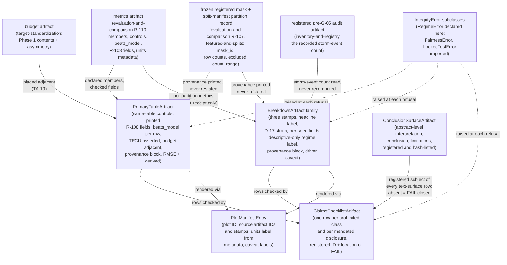

# Domain Entities — `regimes-diagnostics-reporting`

**Unit** `regimes-diagnostics-reporting` · **Kind** `library` · **Complexity** L ·
**Deployment** embedded · **Depends on** `statistical-inference`

The intra-package shapes § Depth (Q1 = B) assigns to this stage: the **primary-table
artifact**, the **claims-and-limitations checklist artifact**, the **breakdown artifact
family**, the **plot-manifest entry**, the **conclusion-surface artifact** (§ 6, added
2026-08-28), and **`RegimeError`**'s placement under the
fourteen-exception hierarchy. Field names are indicative (§ Depth Q1 = B); the
**obligations** each shape carries are the contract. **No scientific value is fixed here;
G-09 is not signed and no module is created; BLK-03 ↓, BLK-04 ↓, BLK-08 ↓ and BLK-09 ↓
remain open exit conditions on this stage** — BLK-08 ↓ reaches the claims directly, made
a checked assertion by the units metadata obligations in § 1 and the practical-relevance
refusal (R-128).

## Sources

- `../../../inception/application-design/component-methods.md` — the approved `count_storm_events` boundary call and `RegimeError` raise contract (quoted in `business-logic-model.md` W-1); § Depth (intra-package shapes this stage's to specify, names indicative); § Assumptions (the fourteen exceptions declared where raised until 3.1 places them); the `Prediction` stamps `partition_id`/`transform_id` (ADR-11).
- `../../../inception/units-generation/unit-of-work.md` § 11 — the `Owns` list (the checklist artifact among the nine owned items), the boundary, the blockers.
- `../../../inception/units-generation/unit-of-work-story-map.md` — WS-19's evidence column (figure set, each carrying its source-data IDs), TA-16's (header declarations, machine-parsed), TA-19's (budget artifact + its placement in the results section), TA-20's (the primary table with the three controls).
- `../../../inception/requirements-analysis/requirements.md` — FR-P1-05-9, FR-P1-05-10 (budget contents, not existence), FR-P1-05-11, FR-P1-05-16 (the enumerated breakdowns and the D-17 strata bound), FR-P1-05-18, FR-P1-05-19, FR-P1-05-20, REQ-CLAIM-01 (§ Out of scope C cited, not duplicated).
- `../evaluation-and-comparison/functional-design/` — R-108 (`EstimandResult`'s machine-readable orientation/weighting/sign-convention fields, printed here, never restated), R-110 (`beats_model` per benchmark; the spatial-representativeness sentence emitted by the producing path), `domain-entities.md` § 8 (the exception-placement table this file's § 5 extends).
- `../statistical-inference/functional-design/domain-entities.md` — § 5 (`BootstrapResult`'s fields, whose correlation and interval fields are asserted present and printed here), § 6 (the widening-guard quarantine no plot input may carry), § 8 (the exception-placement precedent).
- `../inventory-and-registry/functional-design/business-rules.md` — the D-13 assumption row (the registered pre-G-05 audit artifact whose recorded count § 3's regime rows read, never recompute).
- `../external-products/functional-design/business-rules.md` — R-62 (the grade field; provisional-grade ineligibility asserted at the point of use), R-60 (emit-from-the-producing-path).
- `../models-and-baselines/functional-design/business-rules.md` — R-100 (the RF-importance diagnostic artifact with `authoritative = false` in its own metadata — the labelled input § 4's RF figure renders from).
- `../foundation/functional-design/business-rules.md` — R-01: the fourteen-exception `IntegrityError` hierarchy, its `src/data/config.py` base, **`RegimeError` named among the eight raised by other units** (verified 2026-08-27), and the constructor contract (file or resource + violated expectation).
- `aidlc/spaces/default/memory/project.md` § Mandated — the `phase_id`/`source_id`/`target_definition_id` stamps (TEC-05), PC-03/PC-04, TEC-06, VAL-05, D-8/TC-17, D-7, **TC-12** (`binding: hard`) — both halves: driver series are time-indexed only and identical across all three cells, and **a station performance difference must never be attributed to local forcing the dataset does not contain** (cited 2026-08-28 per `GOV-2026-08-28-FD-01` Rec 17; the data-shape half is enforced by `external-products` R-63, the interpretive half reaches § 2 and § 3 here), TC-11, D-10.1, the two-tier error posture.
- `PreFlight/Technical_Environment_and_Research_Implementation(1)(2).md` §14, §13.5, §12 (the `tests/` tree, **21** `test_*.py` modules as amended — derivation printed in `business-rules.md` R-132; §12's mandated set as amended, see `requirements.md` REQ-ENG-4 for the current count), §15.4 (the required-output tree and `artifact_manifest.json` hash-listing every output — § 6's home), §9.3 via Vision.
- `PreFlight/vision_document(3)(2)(2).md` — **§8.9** (`"exclusions and row counts are reported"`; `"the comparison records a stable mask ID and feature-set ID"` — § 1/§ 3's provenance block); **§5.5** (primary reported error metric **RMSE**; the derived relative summary `1 - RMSE_model/RMSE_reference`; the six supporting metrics MAE, median absolute error, mean error/bias, R-squared, correlation, 90th/95th percentile absolute error); **§9.5** required result 2 (`"Derived percentage RMSE reduction, clearly labeled as derived"`); **§5.3** (the practical-relevance layer's two conjuncts) and **§5.4** (the ten-percent RMSE-reduction reference magnitude); **§2.4**'s binding honesty rule and its tier-3 learned-model comparison.
- `evidence/DECISIONS.md` **D-28** (2026-08-28) — the G-06 locked-test scored set is **2–31 December 2022, 30 days**, first 24 h excluded and counted; its stated consequence that *"the scored set is 30 days everywhere, and must be disclosed as 30 days"* and that the primary table, the breakdown artifacts and the claims-and-limitations checklist each carry the scored-window statement; the disclosed Vision §8.2 / TE §7.1 authority conflict, carried to G-05 unresolved; **no supervisor signature exists or is claimed**. Also **D-13** (the >=3-independent-storm-event threshold), **D-11** (provisional Dst barred from any G-05 regime count), **D-17**, **D-7**, **D-8**.
- `governance/reviews/GOV-2026-08-28-FD-01.md` — Recommendations **16** (provenance and scored-set disclosure), **17** (TC-12's interpretive half), **18** (limb (3) — the `NFR-TDEF-01` cross-phase target-lineage row and the `FR-P1-03-4` notebook-caption row, added on the 2026-08-28 resume pass), **19** (the third declared comparison set `{M-04, M-05, M-06}`, ruled by the owner), **20** (the RMSE/derived-reduction metric surface), **21** (the conclusion surface as a registered artifact), **27** (§12's 21 modules), **43** (VAL-05's named falsifier).
- `functional-design-questions.md` (**Q1 through Q10**, all answered **C**; summary receipted — **not edited in the 2026-08-28 remediation**; its five stale `seventeen` sites are recorded as owed in `business-rules.md` R-132), `business-rules.md`, `business-logic-model.md`.

## Entity map

Text fallback: the emitted metrics artifact (with its declared members, difficulty
controls, per-benchmark `beats_model` flags, R-108's machine-readable fields and units
metadata) feeds the primary-table artifact, which places the target uncertainty budget
artifact adjacent; the breakdown artifact family consumes the metrics artifact (for
`DEC`, post-receipt only) and reads the storm-event count from the registered pre-G-05
audit artifact, never recomputing it as the guard's input (a post-receipt comparison
count exists only for R-124's audit-count divergence check, added 2026-08-27, and never
substitutes); the frozen registered mask and the split-manifest partition record supply the
five provenance values — `mask_id`, `feature_set_id`, per-station surviving row counts,
exclusion counts and the scored-window statement — which the table and every breakdown
**print, never restate** (added 2026-08-28, Rec 16); the claims-and-limitations checklist
checks the
table's and breakdowns' reported surfaces row by row, resolving every text-surface row
against the registered `ConclusionSurfaceArtifact` (§ 6, added 2026-08-28, Rec 21) and
**failing closed** when that artifact is absent or unregistered; every figure renders
through a plot
manifest entry carrying its source artifact IDs, stamps and metadata-derived units label;
and every refusal raises an `IntegrityError` subclass — `RegimeError` declared here,
`FairnessError` and `LockedTestError` imported.

---

## 1. `PrimaryTableArtifact` — the co-reporting contract as a shape

Emitted by the producing path in `diagnostics.py` (R-125); TA-20's evidence. Indicative
fields: `members` (the declared primary comparison set, echoed from the metrics
artifact), per-row `member_id`, metric values, `beats_model` (printed per benchmark row),
`orientation` (`benchmark_minus_model`), `weighting` (`equal_station`), the
sign-convention sentence, `units` (asserted `TECU` from the metrics artifact's units
metadata), `budget_ref` (the adjacent budget artifact's ID and placement), `caption`
(carrying FR-P1-05-19's plasmaspheric sentence, checked by § 2), the three stamps
`phase_id`/`source_id`/`target_definition_id`, and — added 2026-08-28 — the
**provenance block** and the **§5.5 metric fields** below.

> **The provenance block (added 2026-08-28 per `GOV-2026-08-28-FD-01` Rec 16, board
> option 1).** Vision §8.9 requires that *"exclusions and row counts are reported"* and
> that the comparison *"records a stable mask ID and feature-set ID"*. Those values are
> recorded upstream on the mask (`evaluation-and-comparison` R-107 limbs 1–2) and on the
> split-manifest partition record (`features-and-splits`: range, validation month and
> excluded count), and until now nothing carried them onto the surface a human reads —
> derived across this unit's four artifacts before the fix: `mask_id` **0**, "row count"
> **0**, "exclusion" **0**, `feature_set_id` **0**. Five fields, **printed from the
> producing objects and never restated** (limb 3's pattern):
>
> 1. `mask_id` — printed from the registered frozen mask R-107 limb 1 gives a
>    deterministic identity; the table's `mask_id` is asserted to name a **registered**
>    mask for the row's declared comparison set.
> 2. `feature_set_id` — printed from the same object the release manifest's
>    `feature_set_ids` field reads (`foundation` §13.3) / the feature-set identity
>    `features-and-splits` freezes per window length. **Stated bound**: `feature_set_id`
>    is not among R-107's enumerated mask fields today, so the presence assertion is what
>    fires if the supplying object does not carry it — the same checked-not-silent posture
>    R-125 limb 6 takes for BLK-08's TECU bound. Supplying it is
>    `evaluation-and-comparison`'s half of Rec 16 and is named, not annexed.
> 3. `surviving_row_counts` — **per station**, printed from the mask (R-107 limb 2, WS-16's
>    own evidence field).
> 4. `exclusion_counts` — printed from the split-manifest partition record's excluded
>    count, per partition.
> 5. `scored_window_statement` — the fixed sentence **"2–31 December 2022, 30 days, first
>    24 h excluded and counted"**, citing **D-28**, asserted **equal to the DEC mask's own
>    asserted scored range** (`evaluation-and-comparison` R-109 limb 3) rather than
>    written independently. A disagreement raises rather than printing a second version of
>    the denominator.
>
> The same five fields are carried on the `BreakdownArtifact` family (§ 3), because a
> breakdown is a reported result too. `REQ-CLAIM-01`'s own text still reads *"tested on
> December 2022 only"*; it is a **completed-stage artifact** and is **not edited here** —
> it is recorded as owed an owner-approved annotate-in-place or a Vision §15.2 amendment
> (Rec 16's follow-on (3)), and § 2 carries the scored-set disclosure row meanwhile.

> **The §5.5 metric fields (added 2026-08-28 per `GOV-2026-08-28-FD-01` Rec 20, board
> option 1).** Derived across all 48 stage artifacts before the fix: "RMSE reduction",
> "percentage reduction", "relative summary", "1−RMSE" = **0**; `MAE`, `R²`, "median
> absolute", "90th–95th percentile" = **0**; `RMSE` occurred in **one** unit only
> (`models-and-baselines`, the tuning owner — 13 hits across its four artifacts) and **0
> times** in this unit. Vision §5.5 makes **RMSE** the primary reported error metric, so
> the table carries, per member: `rmse`; the **derived relative summary**
> `1 - RMSE_model/RMSE_reference` in a field carrying an explicit **`derived: true`**
> label (Vision §9.5 required result 2, *"clearly labeled as derived"*); and §5.5's six
> supporting metrics — `mae`, `median_absolute_error`, `mean_error_bias`, `r_squared`,
> `correlation`, `pct90_95_absolute_error`. The paired loss differential remains the
> confirmatory estimand (Vision §2.3); RMSE and its derived reduction are the **reported**
> error surface and decide nothing. **Upstream origin recorded honestly:**
> `requirements.md` FR-P1-05-16 cites `[Vision §5.5]` but enumerates only breakdowns and
> never the metric set, and audit finding **`TEC-14`** (`requirements.md:1006`) is already
> **Open** for exactly that re-citation — a Vision §15.2 amendment to FR-P1-05-16 is
> **owed upstream** and is not made here; what this stage specifies is the **reported
> surface**, which is this stage's to specify.

- **Same table by construction**: M-01, M-02, M-03 and the IRI comparison are rows of
  this one artifact — appendix relegation unrepresentable (PC-03/PC-04).
- **Refusal**: rendering with any declared member's metric absent **fails**
  (`FairnessError`, the consumed R-110 limb 1 class); a benchmark row without a
  `beats_model` field **fails** the presence test.
- **Printed, never restated**: the orientation, weighting and sign-convention values are
  copies of R-108's machine-readable fields — asserted present on the input, printed from
  it.
- **Units**: `units` is read from the artifact's metadata and asserted `TECU` — BLK-08 ↓'s
  bound checked at the surface the register names; never assumed.
- **Budget adjacency** (TA-19, supporting): `budget_ref` points at FR-P1-05-10's artifact
  with its Phase 1-applicable contents and asymmetry statement asserted non-empty and the
  four Phase 2 quantities recorded not-applicable.
- **Provenance presence, added 2026-08-28 (Rec 16)**: a rendered table missing **any** of
  the five provenance fields **fails** the presence test (control (32)); a
  `scored_window_statement` that does not equal the DEC mask's asserted scored range
  **raises `RegimeError`** (control (33)). Both are printed from the producing objects, so
  a table can carry no independently authored denominator.
- **Metric presence, added 2026-08-28 (Rec 20)**: the derived relative summary emitted
  without its `derived: true` label **fails** (control (34)); the metric set's presence is
  enforced through R-127's completeness refusal against the configured list, so a missing
  RMSE row or derived-reduction row **refuses** the results artifact rather than shipping
  a table a reader cannot connect to Vision §5.4's ten-percent reference magnitude.

## 2. `ClaimsChecklistArtifact` — one row per prohibited class and per mandated disclosure

The checklist artifact `unit-of-work.md` § 11's `Owns` list names, produced
machine-readably by `diagnostics.py` (R-126). Indicative row fields: `row_kind`
(`prohibited_class | disclosure`), `reference` (the § Out of scope C class cited **by
reference, never duplicated**, or the mandating rule — FR-P1-05-19, FR-P1-05-20, VAL-05,
TEC-06, D-8, D-7, **TC-12**, **D-28**, **NFR-TDEF-01** and **FR-P1-03-4**, the last four
added 2026-08-28),
`required_location` (primary table, table caption, abstract-level
conclusion, limitations section, every serialized IRI/GIM comparison, every per-station
breakdown artifact), `found_at` (**a registered artifact ID plus a location within it** —
see § 6; a row whose surface is absent or unregistered **fails closed**),
`human_residue` (whether found text *means*
what the rule requires — recorded as the human check it is).

- **Prohibited-class rows**: one per class in § Out of scope C's enumeration, each
  recorded **unasserted across every reported artifact**; a planted prohibited-class
  phrase is caught (control 12). The D-8 claim boundary and the D-7 NICO 5-minute bar are
  rows.
- **The TC-12 prohibited-class row, added 2026-08-28** (per `GOV-2026-08-28-FD-01` Rec 17,
  board option 3 — both mechanisms): TC-12's **interpretive** half —
  *"a station performance difference must never be attributed to local forcing the dataset
  does not contain"* — is a `prohibited_class` row with **planted-phrase detection**,
  mirroring the D-8 and D-7 rows (control (37)). Derived before the fix: `TC-12` = 7 hits
  in **one** unit (`external-products`) and `local forcing` = 2 hits in **one** unit — this
  unit carried **zero** of either, while § 3 produces the very per-station artifact that
  invites the inference. The row's `required_location` is every reported surface; its
  companion mechanism is the standing caveat § 3 emits from the producing path itself, so
  the prohibition does not depend on an author remembering it.
- **Disclosure rows**: each `beats_model = true` baseline found in the table **and** the
  registered conclusion artifact (§ 6); the plasmaspheric sentence at its three points;
  VAL-05's sentence at the
  abstract-level interpretation; the spatial-representativeness sentence present on every
  serialized IRI/GIM comparison (emitted upstream, asserted here); the
  `gim_network_overlap_flag` value wherever GIM is compared once the audit has run; the
  **driver-identity / no-local-forcing caveat** present on every per-station breakdown
  artifact (emitted by § 3's producing path, presence asserted here — the identical
  emitted-there / asserted-here split the design already uses for TEC-06).
- **The scored-set disclosure row, added 2026-08-28** (per `GOV-2026-08-28-FD-01` Rec 16):
  `row_kind` = `disclosure`, `reference` = **D-28**, text = **"2–31 December 2022, 30
  days, first 24 h excluded and counted"**, `required_location` = **the primary-table
  caption and the limitations section**. Derived before the fix: this section's `reference`
  enumeration (FR-P1-05-19, FR-P1-05-20, VAL-05, TEC-06, D-8, D-7) had **no row** recording
  that the test scored **30 of 31** December days, while `REQ-CLAIM-01` still reads
  *"tested on December 2022 only"* — a claim-boundary overstatement produced by
  **omission**, which a prohibited-class check searching for phrases that are *present*
  cannot see. The row's text is asserted equal to § 1's `scored_window_statement`, itself
  printed from the mask, so one denominator exists in one place.
- **The NFR-TDEF-01 and FR-P1-03-4 disclosure rows, added 2026-08-28** (per
  `GOV-2026-08-28-FD-01` **Rec 18**, board recommendation "(1) plus (3)'s checklist rows" —
  **limb (3), the half `target-standardization` recorded as owed by this unit and which this
  resume pass found unwritten**). Derived before the fix across this unit's four artifacts:
  `NFR-TDEF-01` = **0** and `FR-P1-03-4` = **0**, while `target-standardization`
  `business-logic-model.md:494` states in terms that its notebook-caption routing *"currently
  has **no destination**"* because this section's `reference` enumeration carries neither.
  Both rows are `row_kind` = `disclosure`:
  - **`NFR-TDEF-01`** — the **cross-phase target-lineage** mismatch (grid-cell population
    versus IPP population), **distinct from TEC-06's comparison-geometry mismatch** and not
    discharged by it; that distinctness is Rec 18's substance and this row must not be
    collapsed into the TEC-06 row. `required_location` = **every reported artifact
    describing the Phase 1 target** — the primary table caption, the limitations section,
    and every registered target/coverage/release surface, **not only serialized IRI/GIM
    comparisons**, which is precisely the gap: a Phase 1 release carrying no comparison
    disclosed it nowhere. Emitted on the **target-writing path** by
    `target-standardization` (Rec 18 limb (1), applied there 2026-08-28); **presence
    asserted here** — the same emitted-there / asserted-here split this section already
    uses for TEC-06 and for § 3's driver-identity caveat.
  - **`FR-P1-03-4`** — the notebook-caption case `target-standardization` R-69 routes to
    "FR-P1-03-4's claims-checklist review", which is this checklist. `required_location` =
    **every notebook figure caption describing the Phase 1 target**. `human_residue`
    applies: whether a caption's text *means* what the rule requires is the human check,
    recorded as one — this row makes the review reach a surface, it does not make a
    caption machine-verifiable.
  Both rows **fail closed** under the bullet below: an absent, unmanifested or unregistered
  surface fails rather than being skipped. **What these rows do not do**: they assert
  presence, not authorship. If `target-standardization`'s emitting path does not write the
  lineage sentence, this row **fails** — it does not write one, and no second version of the
  statement is produced here.
- **Fail closed, added 2026-08-28** (per `GOV-2026-08-28-FD-01` Rec 21, board option 1):
  every row whose `required_location` names a text surface resolves `found_at` against a
  **registered artifact ID** from § 6 plus a location inside it — never an
  implementation-time path. A row whose surface artifact is **absent, unmanifested or
  unregistered** **fails** (control (36)); "unrunnable therefore skipped" is not a path.
  This is the control standing over **R-16**, the project's highest-rated reporting risk:
  before the fix, `found_at` could be satisfied by whatever file the implementation was
  pointed at, so FR-P1-05-20's criterion (*"a disclosure present in the table and absent
  from the conclusion fails"*) ran against an undeclared input. The `beats_model` field
  itself is well built and is **not** disturbed — the defect was entirely on the text side
  of a field-versus-text comparison.
- **Routing**: the checklist is the evidence the candidate Vision §15.2 rows
  (FR-P1-05-20, FR-P1-05-19, `TST-CLAIMS-01`) would point at — **proposed at the gate,
  never applied here**.

## 3. `BreakdownArtifact` family — stamped, labelled, enumerated

One machine-readable artifact per breakdown FR-P1-05-16 enumerates, emitted by producing
functions in `diagnostics.py` (R-127). Indicative fields common to the family: the three
stamps `phase_id`/`source_id`/`target_definition_id` (TEC-05 — an artifact missing any
stamp **fails**), `breakdown_id` (from the configured breakdown list; the emitted
inventory asserted complete against it — a missing declared breakdown **refuses** the
results artifact), `role_label` (`headline | supplementary` — the equal-station
macro-average is the headline value; a pooled row-weighted figure labelled headline
**fails**), `completeness_shortfalls` (machine-readable fields, never console text; the
artifact marked derived and/or partial — the two-tier posture), and — added 2026-08-28 —
§ 1's **five provenance fields** (`mask_id`, `feature_set_id`, per-station
`surviving_row_counts`, `exclusion_counts`, `scored_window_statement`), carried across the
whole family because a breakdown is a reported result too, and **printed from the same
producing objects, never restated** (Rec 16).

Family-specific obligations:

- **Quality strata**: the strata surface accepts **only** D-17's measured-available
  fields — `valid_observation_count`, `within_hour_spread_tecu`,
  `provider_dtec_summary` — an enumerated set from config, not free strings; a stratum on
  satellite count, elevation or zenith angle is **unrepresentable by signature**.
- **Regime split rows**: labels consumed from R-123's classifier only; `DEC` rows carry
  the `descriptive_only` label unless the **registered** pre-G-05 audit artifact records
  >=3 independent storm events — the count **read, never recomputed as the guard's
  input** (R-124); the demotion-ordering assertion travels with the `DEC` rows; and a
  post-receipt divergence between the registered count and this unit's own comparison
  count over the same Kp series and **asserted** December day range **raises rather than
  substituting** (R-124's
  audit-count consistency control (31), added 2026-08-27 — `inventory-and-registry`
  computes its count by its own means in its own lane; this unit does not adjudicate).
  *(Amended 2026-08-28 per `GOV-2026-08-28-FD-01` Rec 15, mechanism-plus-route-the-value:
  the day range is **asserted** on this side rather than inherited from the audit's
  month-granular scope, and a storm event falling **wholly outside the scored set** is
  **reported separately and does not count toward D-13's >=3 threshold** (control (40)) —
  so a Kp>=5 interval confined to 1 December cannot promote H4/SRQ-5 while contributing
  zero scored rows. **Which day range governs the count is routed to the gate as a
  Student + Supervisor item** — D-13 is a supervisor-countersigned demotion threshold and
  this unit decides no scientific value. `inventory-and-registry` is being amended in
  parallel to fix the audit's day range and to report any wholly-outside event separately.)*
- **Per-station rows carry the standing driver-identity caveat** *(added 2026-08-28 per
  `GOV-2026-08-28-FD-01` Rec 17, board option 3)*: every per-station / per-cell breakdown
  artifact is emitted with a fixed caveat field stating that **every external driver value
  is identical across all three cells by construction** (TC-12's data-shape half, enforced
  at the producing unit by `external-products` R-63) and that **no station performance
  difference may be attributed to local forcing the dataset does not contain**. The caveat
  is emitted **by the producing path**, so it cannot be omitted from a breakdown nobody has
  written yet — the R-110 limb 3 pattern, and the identical treatment the design already
  gives TEC-06, so no new mechanism is introduced. A per-station breakdown emitted without
  it **fails** (control (38)); § 2 presence-asserts it. The reason it is needed is measured,
  not hypothetical: D-11 records ARUC 163/168, BSHM 168/168, NICO 155/168, D-7 records NICO
  holding 53.8% of its native 5-minute slots against BSHM's 89.9%, and the three cells span
  32–40°N across roughly 11° of longitude — so per-station results **will** differ, and the
  natural-sounding explanation is the one explanation the dataset structurally cannot
  support.
- **Metric fields per member** *(added 2026-08-28 per Rec 20)*: `rmse`, the derived
  relative summary `1 - RMSE_model/RMSE_reference` with its explicit **`derived: true`**
  label, and §5.5's six supporting metrics (`mae`, `median_absolute_error`,
  `mean_error_bias`, `r_squared`, `correlation`, `pct90_95_absolute_error`). The derived
  field without its label **fails** (control (34)).
- **The tier-3 breakdown row** *(added 2026-08-28; the third declared comparison set
  `{M-04, M-05, M-06}` is the **owner's ruling** on `GOV-2026-08-28-FD-01` Rec 19, not this
  unit's choice)*: `breakdown_id` for the tier-3 learned-model comparison (Vision §2.4
  tier 3 — LSTM versus direct Random Forest and versus ridge regression) is a row of the
  configured breakdown list, so R-127's completeness refusal reaches it. Membership,
  masking and the matched-window assertion stay `evaluation-and-comparison`'s (R-106,
  R-107, R-108) and the **primary** set is unchanged; this unit adds only the reported
  surface Rec 19's closure evidence names.
- **Fold table**: Vision §9.5's F1–F4 — a missing fold **fails**.
- **Per-seed stability**: the three per-seed values, `mean` and `spread` as **separate
  fields** (TE §13.5) — mean-only **fails**.
- **Top-1% sensitivity**: emitted beside its parent figure with `label = "sensitivity"`,
  never merged (FR-P1-05-10).
- **Diagnostic-lane artifacts** (R-130): Dst hindcast artifacts carry
  `label = "diagnostic/hindcast-only"` and a single recorded release grade (mixed grade
  raises; provisional grade raises at any R-62-barred surface); they live only under
  diagnostic paths — a diagnostic-labelled field in any feature-bearing or metrics
  artifact **fails** the quarantine test.

## 4. `PlotManifestEntry` — WS-19's evidence schema

Written by `plots.py` for every figure (R-129); the manifest is WS-19's evidence.
Indicative fields: `plot_id` (from the configured required-plot list — the manifest is
asserted complete against it; a missing required plot **refuses**), `source_artifact_ids`
(the serialized stamped artifacts rendered — missing source IDs **fails**), the source
artifacts' stamps, `units_label` (**taken from the source artifact's units metadata**,
never hardcoded — disagreement **fails**), `caveat_labels` (printed from the input: the
RF-importance figure's **non-authoritative** label from `models-and-baselines`' artifact
metadata (`authoritative = false`), the Dst figures' **diagnostic, hindcast-only** label
from § 3's diagnostic artifacts).

- **Presentation-only by signature**: `plots.py`'s API takes artifact objects, not raw
  predictions or unstamped numbers — no figure can smuggle a quantity no producing path
  owns.
- **The quarantine inherited**: `statistical-inference` R-120's widening-guard comparator
  numbers are never serialized as a reported interval, so no plot input carries them and
  no manifest entry can reference them.
- The required prediction, residual, target-support and quality plots each carry their
  source-data IDs through this schema — "each carrying its source-data IDs" is the
  manifest's shape, not a caption convention (FR-P1-05-11).

## 5. `IntegrityError` subclasses raised here — placement under the fourteen-exception hierarchy

`foundation` R-01: all fourteen project exceptions derive from `IntegrityError` (base in
`src/data/config.py`), and each raising unit's 3.1 declares its own as subclasses.
**`RegimeError` is one of the fourteen — R-01 names it among the eight raised by other
units (verified 2026-08-27) — and this is the unit that raises it**, so it is declared
here, discharging R-01's OPEN cross-unit obligation for this unit. **No fifteenth
exception is minted** — reporting refusals reuse `FairnessError` and `RegimeError` as
placed:

| Exception | Of the fourteen? | Declared | Raised on |
|---|---|---|---|
| **`RegimeError`** | **yes** | **here** (`src/evaluation/regimes.py`, this unit's raise site), importing the base from `src/data/config.py` | non-GFZ `source` or absent `release_grade` at `count_storm_events` (R-123, the approved contract); a provisional-Dst-derived count input (R-123); a post-freeze demotion record, or a post-receipt divergence between the registered audit count and this unit's comparison count (R-124; control (31) added 2026-08-27); a non-TECU input at the practical-relevance comparison (R-128); mixed or provisional Dst grade at this unit's point of use (R-130); reporting-discipline refusals — table units/placement, breakdown inventory, manifest completeness (R-125, R-127, R-129); **and, added 2026-08-28**: a `scored_window_statement` that disagrees with the DEC mask's asserted scored range (R-125, control (33)); a practical-relevance statement produced without the measured improvement, leaving Vision §5.3's first conjunct unevaluated (R-128, control (35)); a checklist run whose `ConclusionSurfaceArtifact` is absent, unmanifested or unregistered (R-126, control (36), § 6 — fail closed); a storm event wholly outside the scored set counted toward D-13's threshold (R-124, control (40)) |
| `FairnessError` | yes | by `evaluation-and-comparison` (`src/evaluation`); imported | a declared primary member's metric absent at the table render — the consumed R-110 limb 1 completeness class (R-125) |
| `LockedTestError` | yes | by `governance-guards` (`locked_test.py`); imported | consumed precondition only: the `DEC` metrics artifact this unit's breakdowns take cannot exist before R-109's verified receipt — the raise is upstream; this unit constructs no December path of its own (R-124) |

Every raise carries the affected file or resource and the violated expectation — R-01's
constructor contract. The stage-entry catch (`foundation` R-10) writes the `aborted`
registry row for every one of them without a hand-maintained list; where reporting itself
fails, R-10's report-honestly constraint applies unchanged.

## 6. `ConclusionSurfaceArtifact` — the checked text given a declared subject

*Added 2026-08-28 per `GOV-2026-08-28-FD-01` Rec 21, board option 1.*

**The gap this closes.** § 2's disclosure rows check text, and until now no unit declared
the text. Derived across all 48 stage artifacts: "abstract artifact" = **0**;
`.tex` / `.docx` / "manuscript" = **0**; "conclusion artifact/file/text/document/path/
source" = **1** — and that one hit is a question-option restatement, not a declaration. No
unit declared the conclusion or limitations surfaces as artifacts with an owner, a path, a
schema or a producer, so FR-P1-05-20's criterion (*"a disclosure present in the table and
absent from the conclusion fails"*) ran against an undeclared input, and `found_at` could
be satisfied by whatever file the implementation was pointed at. This is the control
standing over **R-16**.

**The shape.** One **named, registered, hash-listed** artifact carrying the three text
surfaces the mandated disclosures name — the **abstract-level interpretation**, the
**conclusion**, and the **limitations section** — declared here and **owned by this unit**
(the unit that already owns every check against them). Indicative fields:
`conclusion_artifact_id` (the registered ID § 2's `found_at` resolves against),
`surfaces` (an enumerated set — `abstract_level_interpretation | conclusion | limitations`,
each with its own text body, so `found_at` records **artifact ID plus surface plus
location within it**), the three stamps `phase_id`/`source_id`/`target_definition_id`
(TEC-05), and `manifest_ref` (its entry in `artifact_manifest.json`).

- **Path**: under TE **§15.4**'s required-output tree, beside the other reported outputs,
  and **hash-listed in `artifact_manifest.json`** — §15.4's closing rule, *"Every output is
  hash-listed in `artifact_manifest.json`"*, so the honesty text sits inside the same
  hash-and-manifest discipline as every other governed artifact.
- **Fail closed**: a checklist run whose `ConclusionSurfaceArtifact` is **absent,
  unmanifested or unregistered** **fails** rather than skipping (control (36)) — the
  "unrunnable therefore skipped" path is closed, and the honesty obligation cannot revert
  silently to the human memory it was built to replace.
- **The named falsifiers it gives the disclosure rows**: a planted `beats_model = true`
  baseline present in the primary table and **omitted from the registered conclusion**
  **fails** control (10); an **abstract-level interpretation missing VAL-05's
  Phase-2-not-independent sentence** **fails** control (39) *(added 2026-08-28 per Rec 43 —
  VAL-05's disclosure was already present and correct, 11 occurrences in this unit against
  0 in the other eleven, and the prior board pass's "absent from every stage artifact"
  finding is closed and undisturbed; what was missing was the named falsifier its two
  neighbours in R-126 each already had)*.
- **Stated limit — this unit does not decide which surface is authoritative for the thesis
  text.** Whether the registered artifact is the authoritative copy of the submitted
  prose, or a machine-readable copy kept in step with it, is a **Student confirmation**
  routed to the gate. What the design fixes is that the check has a **registered subject**
  and fails closed without one; it does not fix where the student writes.
- **No text is authored here.** The disclosure sentences are frozen upstream (FR-P1-05-19,
  FR-P1-05-20, VAL-05, TEC-06, D-8, D-7, TC-12, D-28, **NFR-TDEF-01**, **FR-P1-03-4** — the
  last two added 2026-08-28 with § 2's Rec 18 rows) and merely located. **This applies with
  particular force to NFR-TDEF-01**: its sentence is emitted by `target-standardization`'s
  target-writing path, and this unit asserting its presence must never become this unit
  writing a second version of it.

---

## Requirement coverage

| Requirement | Entities | Acceptance |
|---|---|---|
| REQ-ENG-12 | (the header-declaration block is `business-logic-model.md` W-9's fixed machine-readable form; no entity here) | TA-16 (primary) |
| FR-P1-05-9 | § 1 | TA-20 (primary) |
| FR-P1-05-10 | § 1 (budget adjacency), § 3 (the sensitivity label) | TA-19 (supporting) |
| FR-P1-05-11 | § 4 | WS-19 (primary) |
| FR-P1-05-14 | § 2 (the exploratory-label assertion is R-128's; its finding surfaces as a checklist-adjacent report row) | ⚠ no row — gate item |
| FR-P1-05-15 | § 1 (units, the §5.5 metric fields), § 5 (`RegimeError` at the comparison) | ⚠ no row — gate item |
| FR-P1-05-16 | § 3 (including the §5.5 metric fields and the tier-3 row) | ⚠ no row — candidate §15.2 row a gate item; **the §5.5 metric-set re-citation is owed upstream** (`TEC-14`, Open) |
| FR-P1-05-18 | § 3 (`DEC` regime rows), § 5 (`RegimeError`) | ⚠ no row — candidate row a gate item; advisory NOT-READY reported, not fixed |
| FR-P1-05-19 | § 2, § 6 (the registered surface its three locations resolve against) | ⚠ no row — named candidate; §15.2 row a gate item |
| FR-P1-05-20 | § 1 (`beats_model` per row), § 2 (the conclusion row), § 6 (its declared subject) | ⚠ no row — named candidate; §15.2 row a gate item |
| REQ-CLAIM-01 | § 2 (including the D-28 scored-set disclosure row) | ⚠ no row — `TST-CLAIMS-01` has no §16/§19 row; §15.2 row a gate item. **`REQ-CLAIM-01`'s own "tested on December 2022 only" text is a completed-stage artifact, not edited here** — owed an owner-approved annotate-in-place or a Vision §15.2 amendment (Rec 16 follow-on) |

**11 requirements, 7 untested — derived from the story map's rows.** **6 entities**
(§ 1…§ 6), derived by counting this file's numbered sections — **was 5 before 2026-08-28**;
§ 6 `ConclusionSurfaceArtifact` was added under `GOV-2026-08-28-FD-01` Rec 21. The two
`## Review` sections in `business-logic-model.md` record "5 entities" as the count they
verified on 2026-08-27 and are preserved as the historical record; the live count is 6.

## Assumptions & Open Questions

- **[assumption]** Every field name above is indicative (§ Depth Q1 = B); the obligations are the contract. No shape here amends `component-methods.md`: `count_storm_events` is consumed exactly as approved, and the § 3/§ 4 config surfaces (the breakdown list, the required-plot list, the D-17 field enumeration) are gate-confirmed configuration content under the four-config regime, `foundation`'s schema surface.
- **[assumption]** The metrics artifact, the registered pre-G-05 audit artifact, the budget artifact and `BootstrapResult` are consumed shapes owned by their producing units (`evaluation-and-comparison`, `inventory-and-registry`, `target-standardization`, `statistical-inference`); this file specifies only what this unit asserts about them at its own surfaces.
- **[assumption]** The checklist artifact is the one checklist item in `unit-of-work.md` § 11's `Owns` list; § 2 is its specification.
- **[assumption]** *(added 2026-08-28)* The five provenance values § 1/§ 3 print are **owned by their producing units** — `mask_id`, per-station surviving row counts and the DEC scored range by `evaluation-and-comparison` (R-107 limbs 1–2, R-109 limb 3); the excluded count by `features-and-splits`' partition record; `feature_set_id` by the feature-set identity `features-and-splits` freezes and `foundation`'s §13.3 `feature_set_ids` manifest field. This file specifies only that they are **asserted present and printed** at this unit's surfaces. `feature_set_id` is **not** among R-107's enumerated mask fields today: supplying it is `evaluation-and-comparison`'s half of Rec 16, named not annexed, and the presence assertion is what fires until it lands.
- **Verification obligations owned here:** § 1's refusal, same-table, presence and units assertions, plus the provenance and metric presence assertions (controls (32)–(34)); § 2's presence checks, the planted-claim catch, the TC-12 planted-phrase catch (37), the fail-closed conclusion-surface refusal (36) and VAL-05's named falsifier (39); § 3's stamp, label, strata, fold, per-seed and inventory controls, the driver-identity caveat (38) and the outside-scored-set exclusion (40); § 4's source-ID, units-label and completeness controls; § 5's constructor-contract compliance on every `RegimeError` raise; § 6's registration and manifest-listing obligation.
- **Governance dependencies owned outside:** BLK-03's limbs (`models-and-baselines`); BLK-04's limbs and BLK-09's `train_start` (`features-and-splits`); BLK-08's co-owner adoption of the R-103 joint contract — until then nothing returns model output to TECU and § 1's units assertion inherits that bound; the pre-G-05 audit's execution and registration **and its December day range** (`inventory-and-registry`, amended in parallel per Rec 15); the exploratory label's writer (registry surface; gate); the candidate §15.2 rows (owner/supervisor); **the Vision §15.2 amendment to FR-P1-05-16 re-citing §5.5's metric set — audit finding `TEC-14`, Open (owner/supervisor)**; **`REQ-CLAIM-01`'s boundary text, owed an owner-approved annotate-in-place or a §15.2 amendment (Rec 16 follow-on)**; **`feature_set_id`'s supply onto the comparison object (`evaluation-and-comparison`, Rec 16)**; **which text surface is authoritative for the thesis (Student, § 6)**; **which December day range governs D-13's storm count (Student + Supervisor, Rec 15)**; G-05's freeze of the evaluation code (Supervisor). **Added on the 2026-08-28 resume pass (Rec 18 limb (3)):** the **emission** of NFR-TDEF-01's cross-phase target-lineage sentence on the target-writing path (`target-standardization`, Rec 18 limb (1), applied there 2026-08-28) — this unit's two new checklist rows assert that sentence's **presence** and never author it, so if the upstream path does not write it the row **fails** rather than this unit emitting a second version; and the **FR-P1-03-4 notebook-caption text** itself, which `target-standardization` R-69 routes here for review and whose `human_residue` stays a human check.
- **Open — BLK-03 ↓, BLK-04 ↓, BLK-08 ↓, BLK-09 ↓ are exit conditions on this stage.** Nothing in this file closes any of them; no implementation may proceed while any stands.
- **G-09 is not signed.** These shapes are design only; no module, artifact writer or test is created.
- **None** of the above decides a scientific value; the enumerations encoded here (D-17's three fields, the F1–F4 folds, §5.5's metric set, the disclosure locations, D-28's 30-day scored window, the third comparison set's membership) are frozen upstream, ruled by the owner, or routed to the gate, and merely carried.
- **[assumption]** *(added 2026-08-28)* **D-28's 30-day scored set is carried, and its own disclosed limits travel with it**: D-28 records that Vision §8.2 and TE §7.1 both carry `—` in the Locked-test Embargo column, that a level-4 `requirements.md` paraphrase is the sole textual basis, that the conflict is **disclosed rather than resolved** and carried to G-05, that a revised split manifest is owed at G-05, and that **no supervisor signature exists or is claimed**. This unit encodes the value and reports the limits; it neither resolves the conflict nor represents the ratification as a supervisor signature.
- **Open — the 2026-08-28 remediation's residual obligations, recorded not fixed:** `functional-design-questions.md` retains **five** stale `seventeen` sites (lines 65, 357, 359, 362, 530) inside a receipted record this remediation may not edit; `team.md` § Testing Posture still states the superseded 17-module figure, affirmed 2026-08-16 before all four §12 amendments, which a sweep may not edit either — recorded as a residual obligation on the practices gate; FR-P1-05-18's advisory NOT-READY on its source criterion remains a `requirements.md` change reported here, not fixed.
