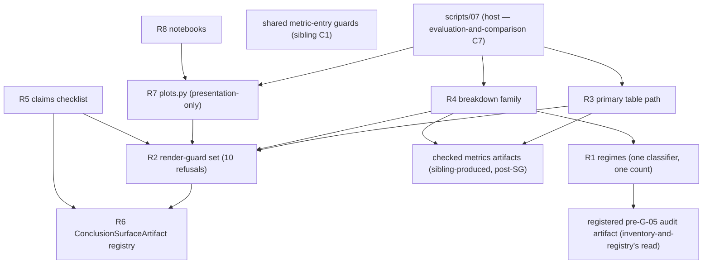

# Logical Components — `regimes-diagnostics-reporting`

**Unit** `regimes-diagnostics-reporting` (Bolt 11) · **Kind** `library` · **Stage** `nfr-design`

> ## ⚠ NOTHING HERE IS CLAIMED SATISFIED
>
> Component inventory for modules that **do not exist** — no interpreter, no `configs/`,
> no results table ever produced. Both SEC-R-02 producing halves are unbuilt, so the
> render guards refuse every input today. BLK-03/04/08/09 remain open exit conditions.
> Every component below is design for 3.5, not a claim that anything runs.

## Sources

- `nfr-design-questions.md` — **Q1 = A**, **Q2 = A**, receipted.
- `security-design.md` (this stage) — SD-R-01…SD-R-04, especially SD-R-01's guard table and boundary split.
- `../nfr-requirements/security-requirements.md` and `../nfr-requirements/tech-stack-decisions.md` — SEC-R-01…SEC-R-04, TS-R-01…TS-R-05; the `library`-kind Scope note standing in for the absent `performance-requirements.md`, `scalability-requirements.md` and `reliability-requirements.md` (not produced for this unit by design).
- `../functional-design/business-logic-model.md` — W-1…W-10, mapped onto components; the reporting run's end-to-end mermaid shape.
- `../../evaluation-and-comparison/nfr-design/logical-components.md` — C1 (shared metric-entry guard module) and C7 (`scripts/07`, the host), against which the boundary split is drawn.
- `../../../inception/application-design/component-methods.md` — § `src/evaluation`'s approved `count_storm_events` boundary; § Depth (intra-package shapes are this stage's to specify).

---

## Component inventory

This unit owns 3 `src/` modules + 4 notebooks + 1 checklist artifact (unit-of-work § 11);
it runs inside `scripts/07_evaluate_and_report.py` (owned by `evaluation-and-comparison`)
and the four review notebooks. Names proposed to 3.5.

| # | Component (proposed) | Owns | Workflows | Raises |
|---|---|---|---|---|
| R1 | `regimes` module | the one hour-classifier; `count_storm_events` as the only counting path; thresholds from `ConfigSnapshot` | W-1, W-2 | `RegimeError` |
| R2 | **render-guard set** (`report_guards`) | the ten rendering refusals (SD-R-01's table, counted: 10) *(corrected 2026-09-05 with SD-R-01's finding-1 repair; superseded: "the six … counted: 6")* | all emitting paths | `FairnessError`, `RegimeError`, `IntegrityError` members per check |
| R3 | reporting module — primary table path | table assembly from checked fields; `beats_model` printed; provenance block (mask_id, feature_set_id, row/exclusion counts, D-28 scored-window statement) printed never restated | W-3 | via R2 |
| R4 | breakdown family | stamped producing functions; D-17 strata bound; §5.5 metric set; tier-3 row; driver-identity caveat emitted; **five-field provenance block on every breakdown (`require_provenance_block`, widened to W-5 at the stage gate, governance Recommendation 2)** | W-5, W-6 | via R2 |
| R5 | claims checklist | presence + citation checks over the **registered** conclusion surface (Q1 = A); fail-closed when the registry is absent | W-4 | `FairnessError` |
| R6 | `ConclusionSurfaceArtifact` registry | the thesis-level location enumeration (Q1 = A); registration enforced at every producing path | W-4, all emitters | via R2 (`require_registered_surface`) |
| R7 | `plots.py` | presentation-only by signature; renders from stored stamped artifacts; manifest = WS-19 evidence | W-7 | via R2 |
| R8 | four analysis notebooks + declaration helper | header declarations; stop semantics; no only-copy; conclusion cells are registered surfaces | W-9 | stop-with-message |
| R9 | `tests/test_regimes_and_reporting.py` (specified, unwritten) | every named control including R2's per-entry negative controls | W-10 | — |

## Component boundaries and isolation

Text fallback: `07` calls the table path (R3), breakdowns (R4) and plots (R7); every
emitting path calls the render-guard set (R2) before emitting, and R2 consults the registry
(R6) for the registered-surface check; R3/R4 consume metrics artifacts already checked by
the sibling's shared metric-entry guards; the regime classifier (R1) reads the registered
pre-G-05 audit artifact for the storm count and never recomputes it; the checklist (R5)
inspects exactly R6's registered set; notebooks (R8) render through R7 and register their
conclusion cells.

- **The boundary split (Q2 = A), stated once**: metric-entry checks = the sibling's shared
  guard module, run at metric computation; rendering checks = R2, run where values become
  reader-visible. Nothing double-owned, nothing homeless — the one formerly homeless check
  (mask-vs-member partition alignment, a metric-entry concern R2 correctly never absorbed)
  was closed at the stage gate on 2026-09-05 as the sibling's sixth guard.
- **R6 is the single enumeration** (Q1 = A): the checklist's scope and the emitting paths'
  registration obligation are the same artifact, so the location list cannot go stale
  independently of the surface it bounds.
- **R1 is the only counting path**; the December-blind and post-receipt guards make the
  quarantine structural (W-2's two guards).
- **R7 computes nothing**: presentation-only by signature; the no-derived-statistics half
  rests on review, as TS-R-02's boxed caveat states — carried, not re-strengthened.
- **Import boundary (TA-07)**: nothing here imports `src/external/iri.py` or
  `src/external/gim.py`; IRI/GIM values arrive as checked comparison artifacts.

## Failure domains and blast radius

| Failure | Domain | Blast radius | Containment |
|---|---|---|---|
| Render-guard defect | R2 | every emission — widest in the unit | one module; per-entry negative controls; adversarial review at 3.5 |
| Emitting path skips R2 | that path | one surface renders unguarded | per-entry negative controls (Q2 = A), designed to fail the build |
| Registry (R6) absent or stale | R5, R2 | checklist and registered-surface check refuse — fail-closed | W-4's fail-closed-when-absent, extended by Q1 = A |
| Second counting path appears | R1's invariant | regime counts can disagree | R-123's one-path rule; negative control in R9 |
| Comparator or quarantined value reaches a surface | R2/R6 | refused — no registered surface exists for it | R-120 quarantine via `require_registered_surface` |
| Producing halves absent (today's state) | R2 | every emission refuses | correct fail-closed; recorded so the first failure reads as the mechanism working |
| Hand-authored prose cites a diagnostic indirectly | none — outside the pipeline | escapes the check | stated residual (SD-R-03); supervisor/gate remain the check |

Unit posture: **refuse rather than mislead** — every code failure lands on a refusal or a
fail-closed stop; the stated residuals (indirect citation, out-of-pipeline prose) are
narrowed and disclosed, never claimed closed.

## Shared resources

| Resource | Owner | This unit's access |
|---|---|---|
| Shared metric-entry guard module | `evaluation-and-comparison` (SD-C-01) | consumed upstream of this unit's inputs; not re-run here |
| Checked metrics artifacts (`EstimandResult`, `BootstrapResult`) | `evaluation-and-comparison`, `statistical-inference` | read-only; fields asserted present by R2, never recomputed |
| Registered pre-G-05 audit artifact | `inventory-and-registry` | R1 reads the storm count; never recomputes (one counting path) |
| `ConclusionSurfaceArtifact` registry | **this unit (R6)** | written at registration, read by R2/R5 |
| Primary results table + breakdowns + figures + manifest | **this unit (R3/R4/R7)** | emitted through R2; consumers: thesis, supervisor, §15.4 artifact manifest |
| The four governed configs | freeze gates via `foundation` | read-only; thresholds never in source |

## Cross-cutting notes for 3.5

- Owed: render-guard naming and the emitting-path enumeration; the registration/guard
  transaction boundary (an artifact must not be emittable registered-but-unguarded or
  guarded-but-unregistered); where the refusals sit in the concrete rendering call chain.
- Standing stop-and-report triggers at 3.5: BLK-03/04/08/09 open (no implementation while
  any stands); the exploratory label's writer, coverage notebook's home, §15.2 proposals
  unresolved.
- No new dependency: `pandas`/`pyarrow`/`matplotlib`/`seaborn`/stdlib only, per TS-R-01…04.

## Assumptions & Open Questions

- **[Q1]** R6 binds pipeline-produced artifacts only; out-of-pipeline prose escapes —
  narrowed, not closed.
- **[Q2]** The split assumes the sibling's shared guard module lands as designed; its
  formerly open Major (mask-vs-member alignment) was closed at the stage gate on 2026-09-05
  as the sibling's sixth guard.
- **[assumption]** Notebook conclusion cells can be registered surfaces without making
  notebooks production logic — the registration is metadata on the cell's emitted artifact,
  not logic in the notebook. If 3.5 finds otherwise, the fallback is registering the
  notebook's emitted artifacts instead of cells, which weakens location granularity and is
  said here so the trade is visible.
- **None** of the above decides a scientific value, fills a `TBD — freeze gate` field, or
  claims a gate, acceptance row or test as discharged.
