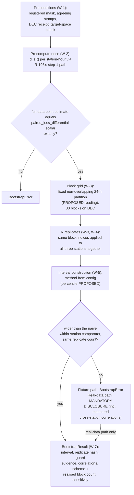

# Business Logic Model — `statistical-inference`

> ## ✳ G-09 IS SIGNED — 2026-08-28, **D-31** (read this before any G-09 statement below)
>
> The project decision owner **signed and approved G-09 (Agent preflight)** on 2026-08-28,
> recorded as **D-31** in `evidence/DECISIONS.md` with change record
> `governance/CHANGE_RECORD_2026-08-28_G09_signed.md`. **Every statement below of the form
> "G-09 is not signed" / "G-09 stays unsigned" is superseded as to the gate's status**, and
> is left standing as the accurate record of the constraint that applied when it was
> written.
>
> ⚠ **D-31 records the gate's own TE §18.3 preconditions as UNMET, and that disclosure
> travels with the signature.** `configs/`, and until 2026-08-28 `src/`, did not exist, so
> the mandated automated zero-TBD preflight **could not run**; the ten named critical tests
> **cannot be executed in this environment** (no Python interpreter is installed — a
> zero-byte Windows Store stub, no registry entry, no interpreter on disk); and the evidence
> artifact `aws_ai_dlc_preflight_report` **does not exist**. "No failing critical test" is
> therefore **unproven, not proven** — an absence of executions, not an absence of failures.
> This is the owner **opening the gate by authority**, not a record that its evidentiary
> conditions were satisfied, and no reader may infer the second from the first.
>
> **What the signature changes here:** module creation is authorised, and any defect this
> unit deferred *solely* because G-09 barred editing a file is now correctable.
> **What it does NOT change:** G-05 and G-06 remain `Blocked`; G-P1A, G-P2, G-P3A, G-P3C
> and G-07 are unaffected; **TE §18.2's absolute rule stands** — every scientific value this
> unit routed to G-04/G-05 **stays routed**, and no agent may fill a freeze-gate value by
> convenience; and **§18.3's stop-and-report obligation survives its own gate**, being a
> standing rule on implementation rather than a one-time gate condition.

**Unit** `statistical-inference` · **Kind** `library` · **Complexity** M ·
**Deployment** embedded · **Depends on** `evaluation-and-comparison`

The workflows this unit implements: the bootstrap boundary as a **metric entry point in
full** — registered mask, agreeing stamps, the DEC hash receipt re-verified before any
draw, the transformed-space refusal — so the interval is TECU-denominated **by check**;
the precompute-once estimand reuse with its exact-equality control; the fixed
non-overlapping 24-hour block grid and the ragged vector draw that carries all three
stations together; the pinned generator with its child streams; the method-parametric
interval construction with the 48-hour sensitivity as a predeclared named run; the
**widening guard whose raise lands at fixture time and whose real-data comparison is a
mandatory disclosure**, its comparator the rejected Q-27 method, present in the code solely
to be beaten; and the correlation emission that makes TE §13.6's mandated disclosure a
produced field rather than a reporting-side hope.

**It decides no scientific value.** 24 h, 10,000, 20221201, 95% and 2–31 December (recorded
as **D-28**, 2026-08-28) are already frozen and merely encoded; the interval-construction
method (percentile, W-5), the correlation series (paired differences, W-7) and the
**block-resampling scheme** (fixed non-overlapping partition, W-3) are **proposed to the
gate, not fixed here** (TE §18.3). This unit carries **the heaviest CPU cost in the
pipeline** — 10,000 replicates over 24-hour vector blocks, on a CPU path that is complete
rather than an emergency mode — and every cost figure is **measured and recorded at fixture
time and frozen, never invented** (§15.1); **storage is bounded by TE §9.3's 10.0 GB plan,
and no numeric memory ceiling is currently frozen** (see § Assumptions, Recommendation 40).
**BLK-03 ↓, BLK-04 ↓, BLK-08 ↓ and BLK-09 ↓ are inherited open exit conditions on this
stage** — **BLK-08 ↓ bounds the interval's units for `ABL-DIFF` only**: **D-27**
(2026-08-24) froze that the primary configuration's transform touches target-**derived
inputs** and the target stays **raw TECU**, so the primary path needs no inverse transform
and the primary interval's TECU status is a **recorded fact**, leaving `ABL-DIFF` as the
residual — and **no implementation may proceed while any stands. G-09 is not signed** —
every workflow below is design, and no module is created.

> **Remediation, 2026-08-28 — `GOV-2026-08-28-FD-01`, verdict FAIL.** Six owner-ruled items
> were applied across this unit's three design artifacts, each with a dated note at the site
> it changed: **Rec 23** (W-6, R-120), **Rec 24** (W-3, W-5, W-8, R-115/R-118/R-120/R-122),
> **Rec 26** (W-3, § Gate items, `domain-entities.md` §§ 2 and 5), **Rec 7 as narrowed**
> (W-1 precondition 4, D-27), **Rec 8** (W-1 step 2, `domain-entities.md` § 8) and **Rec 40**
> (this header, W-6 point 4, `domain-entities.md` § 6). `business-rules.md`'s header carries
> the same summary. **No blocker closes; no scientific value is decided.** The `## Review`
> section below is the dated 2026-08-27 adversarial pass and is **preserved byte-for-byte** —
> its finding 1 is what Rec 26 ratified, its finding 2 is what Rec 40 ratified, and its
> re-derived control count (**23**) is correct for the artifact it reviewed, the live count
> now being **24**.

## Sources

- `../../../inception/units-generation/unit-of-work.md` § 10 — the `Owns` list (2 files), the boundary (runs inside `07`, seed a required parameter read from `seeds.yaml`, never defaulted and never inlined), the 1 requirement, the acceptance rows, the three implementation notes (Q-27 rejection; **quoted as written** — "heaviest CPU cost inside TE §9.3's 10.0 GB hard planning envelope", `:453`, the sentence Recommendation 40 identifies as the upstream storage-versus-memory conflation and against which a change record is owed, **not repeated as this design's own claim**; the ADR-05 seed carve-out as a design decision); **BLK-03/BLK-04/BLK-08/BLK-09** with the exit-condition ruling and BLK-08's TECU reach into this unit's interval — **narrowed to `ABL-DIFF` alone by D-27** (2026-08-24), which post-dates that paragraph.
- `../../../inception/units-generation/unit-of-work-story-map.md` — Table 1's FR-P1-05-8 → WS-17, TA-14 row; Table 2's WS-17 row (evidence: `tests/test_bootstrap.py`, replicate hash from seed 20221201) and TA-14 row (reproducible 24-hour output, a 48-hour sensitivity, cross-station correlation, verified on synthetic correlated data); § Per-unit coverage summary (1 / 0 / WS-17, TA-14 / —).
- `../../../inception/requirements-analysis/requirements.md` FR-P1-05-8 — the eight enumerated mechanical checks, and check 8's stated reason ("why the other seven are not enough").
- `../../../inception/application-design/component-methods.md` — § `src/evaluation`'s approved `vector_block_bootstrap` boundary call, quoted verbatim in W-1; § Open (`BootstrapResult` referenced as a type and left unspecified, an intra-package shape under § Depth); § Assumptions (the fourteen project exceptions in a shared base, declared where raised until 3.1 places them).
- `../../../inception/application-design/services.md` — `07_evaluate_and_report.py`'s row (reads predictions carrying `partition_id`/`transform_id`, benchmark, mask; writes metrics, **bootstrap intervals**, breakdowns, figures) and the resource-envelope note at `:258-259`/`:264`, **quoted as written**: "`07` carries the heaviest CPU cost", and "peak memory, not cumulative runtime, is the binding quantity against TE §9.3's 10.0 GB hard planning envelope". **That second clause is the conflation Recommendation 40 rules on** — TE §9.3 is a **storage** budget and no numeric memory ceiling exists in the authorities — so this design cites the sentence as its upstream's text and **does not adopt it**; a change record against `services.md` is owed and that file is not edited from here.
- `../evaluation-and-comparison/functional-design/` — R-104 (inverse-before-metric refused at the boundary every caller crosses), R-105 (`07`'s stamp refusal; absent or mismatched stamps raise `LeakageError`, a wrong-partition mask raises `FairnessError`), R-107 (mask identity, once-only registration, G-05 freeze), R-108 (the estimand as an ordered executable contract, and its step-1 path), R-109 (hash-receipt before metrics; the scored range exactly 2–31 December), R-110 (the emit-from-the-producing-path disclosure pattern), R-112 (`src/evaluation/` is a path grant owned by three units; `vector_block_bootstrap` expressly recorded as belonging to this unit); `domain-entities.md` § 5 (`PredictionHashReceipt`) and § 8 (the exception-placement table).
- `../features-and-splits/functional-design/` — **FU-7 = A**: the G-06 locked test scores **2–31 December 2022, 30 days**, first 24 h excluded and counted.
- `../models-and-baselines/functional-design/business-rules.md` — R-91 (`three_seed_mean(..., expected_seeds)` from `ConfigSnapshot.seeds`, the seed shape cited as this unit's precedent), R-92 (the (`station`, `interval_start_utc`) alignment key used by the pairing step).
- `../foundation/functional-design/business-rules.md` — R-01 (the fourteen-exception `IntegrityError` hierarchy, **`BootstrapError` named among the eight raised by other units**), R-10 and § Stage entry contract (the six ordered steps `07` performs before this unit runs).
- `aidlc/spaces/default/memory/project.md` § Mandated/Forbidden and `team.md` — the vector time-block bootstrap rule (TE §13.6; TC-19 `binding: hard`), NEVER substitute a within-station or naive bootstrap, the estimand (Vision §2.3, TE §1.3), seeds from `seeds.yaml` (NFR-DET-01, TC-21), no scientific constant in source (TC-03e), the negative-control-per-hard-rule methodology, CPU as a complete execution path (TC-01), TE §18.3's stop-and-report posture.
- `PreFlight/Technical_Environment_and_Research_Implementation(1)(2).md` §13.6 (the procedure verbatim; **no interval-construction method is named and no block-resampling scheme is named**; its final sentence, line 854, puts the widening confirmation on *"a synthetic dataset with known cross-station and temporal correlation"*), §13.7 (exact equality for deterministic CPU transformations; fixture-derived tolerances for floats), **TE §9.3 — line 532, titled "Storage budget", a capacity plan across eight disk categories totalling 10.0 GB; distinct from Vision §9.3 (Geomagnetic Regimes and Storm Events), so always written "TE §9.3" here**, §9.2 (records "peak memory" with **no numeric value**), §7.2 (the predeclared named-run discipline; the `ABL-DIFF` row's "Primary remains: Raw TECU"), §15.1/§15.2 (measured-not-invented figures; the fixture manifest), **§15.3** (line 913: fixture 2 runs *"one bootstrap execution at reduced replicate count for timing"*).
- `evidence/DECISIONS.md` — **D-27** (2026-08-24): the primary configuration's transform touches target-**derived inputs**, the target stays **raw TECU**, so the primary path needs no inverse transform and `ABL-DIFF` alone retains the obligation. **D-28** (2026-08-28): the locked-test scored set is **2–31 December 2022, 30 days**, the record behind FU-7 = A. **D-14**: fixture 2 is **March 2022, 1–31 March inclusive**. **D-11**: the seven-day plumbing window.
- `governance/reviews/GOV-2026-08-28-FD-01.md` — Recommendations 7 (as narrowed to `ABL-DIFF`), 8, 23, 24, 26 and 40, with the owner rulings summarized in this file's header.
- Workspace inspection, 2026-08-27: `tests/` holds three modules, none this unit's; `src/` and `configs/` absent.
- `functional-design-questions.md` (**Q1 through Q10**, answered; Consolidated Summary Confirmation receipted), `business-rules.md`, `domain-entities.md`.

---

## W-1 — The boundary: `vector_block_bootstrap` as a metric entry point in full

```
INPUT   model: Prediction, benchmark: Prediction, *, mask (registered, frozen),
        block_hours, replicates (from experiment.yaml via ConfigSnapshot), seed
        (ConfigSnapshot.seeds' bootstrap entry, 20221201)
OUTPUT  BootstrapResult (domain-entities.md § 5)
RAISES  FairnessError, PartitionError, LeakageError, LockedTestError (DEC),
        InverseTransformError, BootstrapError
```

The approved boundary call, quoted exactly from `component-methods.md` § `src/evaluation`:

```python
def vector_block_bootstrap(
    model: Prediction,
    benchmark: Prediction,
    *,
    mask: DataFrame,
    block_hours: int = 24,
    replicates: int = 10_000,
    seed: int,
) -> BootstrapResult: ...
```

with its approved raise contract: *"**Raises** `BootstrapError` when a block does not
carry all three stations at the same timestamps, when a paired prediction is missing and
no declared rule handled it, or when the resulting interval is **narrower** than a naive
within-station bootstrap on the same data — the widening control, which is what makes the
other checks sufficient."* (The two defaults shown are the subject of the R-118 amendment,
**proposed at the gate, not applied**. The **third raise clause** — the widening control —
is the subject of the **R-120 amendment**, also **proposed at the gate, not applied**: the
raise relocates to the TA-14 synthetic fixture TE §13.6 specifies and the real-data
comparison becomes a mandatory disclosure. The contract sentence above is quoted **as
approved**, byte-exact, and is not rewritten by this design; W-6 carries the amendment and
its reasoning.)

This unit owns no stage script: it runs inside `scripts/07_evaluate_and_report.py`, after
`foundation`'s six-step stage entry contract (`ensure_process_determinism`,
`load_configs`, the §18.3 zero-`TBD` preflight, `assert_phase_boundary` under `--phase 1`,
`seed_everything`, the run record opened before domain work — R-10 catches any
`IntegrityError` subclass and writes the `aborted` row). But the bootstrap **re-asserts
its own preconditions rather than trusting `07`'s call order** (Q1 = C) — TE §14 expressly
reads bootstrap artifacts into `04_results_and_figures.ipynb`, so the one-specific-caller
gap R-104 was written to close applies here verbatim:

1. **Registered mask** (R-107's check, imported intra-package from
   `evaluation-and-comparison`): `mask` is a registered frozen mask for the members'
   declared comparison set, or **`FairnessError`**.
2. **Stamps** (**R-105 as corrected**): both `Prediction`s carry **non-`None`**, mutually
   agreeing `partition_id`/`transform_id` stamps — a **`partition_id` mismatch raises
   `PartitionError`**, matching `models-and-baselines` R-92 exactly; an **absent (`None`)
   stamp of either kind, or a `transform_id` mismatch, raises `LeakageError`**; a mask whose
   recorded `partition_id` differs from the members' **raises `FairnessError`**.

   > **Applied 2026-08-28 — `GOV-2026-08-28-FD-01` Recommendation 8.** The earlier text
   > imported R-105 *"as written"*, inheriting a taxonomy disagreement the sibling's own
   > reviewer had logged: R-105 raised `LeakageError` for a `partition_id` mismatch where
   > R-92 raised `PartitionError` for the identical condition, so a test asserting
   > `pytest.raises(PartitionError)` passed at `06` and failed at `07`. The owner ruled
   > `PartitionError` into **`foundation` R-01's enumeration as its fifteenth**, and R-105's
   > mismatch limb is corrected to raise it. `PartitionError` is **imported here, declared by
   > `models-and-baselines`**. R-113 carries the rule and the dependency note; the sibling
   > files on disk still show the pre-ruling text and are being corrected in parallel.
3. **The DEC receipt** (R-109 limb 1): evaluating the `DEC` partition requires the
   recorded prediction-hash receipt **re-verified before any draw** — absence, hash
   mismatch, or a receipt timestamp not preceding the call **raises `LockedTestError`**.
   The DEC mask's own assertion that the scored range is exactly 2–31 December (R-109
   limb 3, FU-7 = A) is inherited as a precondition.
4. **Target space** (R-104): transformed-space input is **refused** —
   **`InverseTransformError`** unless the resolved transform is declared
   non-target-touching or the inversion lineage shows the inverse applied. The interval is
   therefore **TECU-denominated by check, not by assumption**.

   > **Applied 2026-08-28 — `GOV-2026-08-28-FD-01` Recommendation 7, as narrowed by the
   > owner to `ABL-DIFF` on D-27's strength.** **D-27** (2026-08-24, `evidence/DECISIONS.md`
   > — a reading of already-frozen text, setting no scientific value) froze that the primary
   > configuration's train-only transform acts on target-**derived input features**
   > (`vtec_lag_1h/2h/3h/24h`, `vtec_seq_24` — the TE §6.2 **feature** dictionary) while the
   > target itself stays **raw TECU**; TE §7.2's `ABL-DIFF` row reads "Primary remains: Raw
   > TECU". So **the primary path needs no inverse transform**: this precondition **passes by
   > the non-target-touching branch**, the interval is computed on the quantity the model
   > emits, and **the primary interval's TECU status is a recorded fact rather than an open
   > dependency**. The residual under BLK-08 ↓ is **`ABL-DIFF` alone**, the sole
   > configuration that transforms the target and which TE §7.2 requires to inverse-transform
   > to absolute TECU before any metric with its error propagation recorded. The check is
   > **kept, not deleted** — D-27's own § Limitation makes a model path that scales the target
   > *"a contradiction to surface"*, and this is what surfaces it, now asserted on a synthetic
   > first-difference `Prediction` rather than on the primary path.
   > `evaluation-and-comparison` is narrowing its resolver to
   > **`load_inverse(transform_id) -> Inverse`** in parallel under the same Recommendation;
   > this unit reads the inversion **lineage**, never a transform object, and gains no import
   > edge either way.

The run's shape, end to end:



Text fallback: after the four boundary preconditions pass, the per-(station, hour) paired
squared-error differences are computed once through R-108's step-1 path; the full-data
point estimate must equal `paired_loss_differential`'s scalar exactly or `BootstrapError`
is raised; the fixed non-overlapping 24-hour block grid is built (30 blocks on DEC; the
scheme is the proposed reading, routed to the gate); the replicates each draw N blocks with
replacement, the same block indices applied to all three stations together, at the
replicate count the call was given (10,000 for the confirmatory run, the fixture manifest's
reduced count for TE §15.3's timing execution); the interval is constructed by the
config-declared method (percentile, proposed); the widening comparison runs against the
naive within-station comparator at the **same** replicate count — on the TA-14 synthetic
fixture a non-wider result **raises `BootstrapError`**, and on real data it emits a
**mandatory disclosure** carrying the measured cross-station correlations rather than
aborting the run; and the `BootstrapResult` is assembled with the replicate hash, guard
evidence, the three pairwise correlations, the block scheme and realised block count, and
the labelled sensitivity result.

## W-2 — Precompute once, resample the precomputed: one copy of the estimand arithmetic

```
INPUT   the masked rows of both Predictions (post W-1 preconditions)
OUTPUT  the per-(station, hour) paired squared-error difference series d_s(t)
        (domain-entities.md § 4), and the full-data point estimate
RAISES  BootstrapError (the exact-equality control)
```

FR-P1-05-8 check 5 requires the bootstrap's station weighting to **match the estimand**,
and R-108 has fixed that estimand as one ordered pipeline. The one-copy discipline
(Q2 = C):

1. **Differencing runs once, not 10,000 times.** The per-(station, hour) paired
   squared-error differences are computed **once**, on masked rows only, **through the
   same step-1 code path R-108's `paired_loss_differential` uses** — pairing per station
   and hour on the (`station`, `interval_start_utc`) alignment key (R-92) **before**
   differencing (check 1). No differencing arithmetic is reimplemented in `bootstrap.py`;
   the second-copy drift class §14's one-copy rule names is structurally absent.
2. **Replicates resample blocks of the precomputed differences** and reapply **only steps
   2–3** of R-108: per-station mean of the drawn rows' differences (orientation
   **benchmark minus model**, preserved), then the unweighted mean of the three
   per-station values (**equal-station weighting**, check 5) — the replicate statistic is
   the estimand **by construction, not by review**. This is simultaneously the cheap
   shape, material for the pipeline's heaviest CPU unit.
3. **The exact-equality control** (§13.7's exact-equality rule for deterministic CPU
   transformations): the bootstrap's own full-data point estimate — steps 2–3 applied to
   the complete precomputed series — must equal `paired_loss_differential`'s scalar on the
   same mask **exactly**, or **`BootstrapError`** is raised. The one-copy claim is a
   checked invariant, not an architecture diagram.
4. **The pooled-weighting negative control**: a pooled row-weighted replicate statistic
   **fails** on the fixture with asymmetric per-station row counts — the same fixture
   R-108's control (16) uses, applied to the replicate path.

## W-3 — The block grid and the vector draw: fixed partition, ragged blocks, same indices

```
INPUT   the precomputed difference series over the mask's scored range; block_hours
OUTPUT  the BlockGrid (domain-entities.md § 2) and, per replicate, a VectorBlockDraw
        (domain-entities.md § 3)
RAISES  BootstrapError
```

**The grid (Q3 = C).** The scored range is partitioned into **contiguous, non-overlapping
`block_hours`-hour blocks aligned to its start** — for DEC: 00:00 UTC block boundaries,
**exactly 30 whole blocks** over the 2–31 December scored set (FU-7 = A, recorded as
**D-28**), and **exactly 15** at the 48-hour sensitivity. This is the plainest reading of
TE §13.6's fixed-block wording, stated at the gate as a derivation from the frozen texts,
not decided silently. `BootstrapResult` records **the scheme and the realised block count**,
so what was actually partitioned is auditable rather than inferred. Two structural raises:

- a scored range **not evenly divisible** by the block length **raises `BootstrapError`**
  rather than silently truncating or padding a partial block; it exists so a changed range
  surfaces as an error, not a quiet reweighting;

  > **Corrected 2026-08-28 — `GOV-2026-08-28-FD-01` Recommendation 24.** The earlier text
  > said "for the frozen ranges it never fires (30/1 and 30/2 both divide)". That was
  > **derived over the DEC range only**. Derived over every range in play and printed before
  > asserted: **DEC 720 h → 30 / 15** ✓✓; **fixture 2's raw March window (D-14) 744 h →
  > 31 blocks at 24 h but INDIVISIBLE at 48 h (15.5)**; **the April and November validation
  > months after the 24-h exclusion, 696 h each → 29 at 24 h, INDIVISIBLE at 48 h (14.5)**;
  > **the raw 7-day plumbing window (D-11) 168 h → 7 at 24 h, INDIVISIBLE at 48 h (3.5)**;
  > July and October after exclusion, 720 h → 30 / 15 ✓✓. The corrected claim: limb 1 **never
  > fires on the DEC range at either block length** — the range the confirmatory interval and
  > its sensitivity are computed over — and **does** fire by design on those three other
  > ranges at 48 h, which is the raise working rather than a defect. **Consequence for
  > TE §15.3's fixture bootstrap** (W-5): its scored range must be declared, since 744 h and
  > 720 h differ at 48 h; §15.3 asks for one timing execution and names no block length, so
  > the declared fixture execution is at **24 hours**, where every range above divides.

  R-115 carries the full derivation table.
- any block extending **outside the mask's scored range** **raises `BootstrapError`**. A
  31-block December containing 1 December is unrepresentable upstream (R-109 limb 3's
  mask assertion) **and additionally refused here** — redundancy at the locked boundary is
  by design.

**The draw (Q3 = C).** A replicate draws **exactly N blocks with replacement**, N being
the number of whole blocks in the range (30 for DEC at 24 h).

> **Applied 2026-08-28 — `GOV-2026-08-28-FD-01` Recommendation 26 (board option 1).** The
> block-scheme reading was routed to the gate by R-115's own words while
> `functional-design-questions.md` § Gate items listed only four entries — none of them
> this one — so the largest un-frozen statistical choice after the interval method reached no
> punch-list entry. **It is now § Gate items' fifth entry.** The numbers that make the choice
> non-cosmetic, derived and printed: over the DEC scored range (720 h) at a 24-hour block
> length, a **fixed non-overlapping partition yields 30 resampling units**, while a
> **moving-block (Künsch) scheme yields 720 − 24 + 1 = 697 overlapping candidate blocks**.
> Block-level variance from 30 units is coarse, making the 95% percentile interval materially
> wider and noisier, and it is the configuration most exposed to W-6's widening comparison,
> because a small block count inflates the Monte Carlo variability of the interval's
> endpoints. The **fixed non-overlapping partition remains the proposed reading**, with the
> moving-block scheme named as the alternative — TE §13.6 names no scheme at all
> (fixed-partition, moving/overlapping or circular), and **TE §18.2 bars this artifact
> settling it by its own reading**, exactly as W-5 refused to settle the interval method.

**The vector property and the declared rule for missing pairs (Q4 = C).** The
comparison-wide mask is an intersection per (station, hour), but a station can be absent
from the mask at hours where another is present (NICO holds 96.4% of hourly bins), so a
24-hour window generally holds a **ragged** three-station vector. The declared rule —
check 7's "declared rule", declared here at last:

1. A block carries, **per station, exactly the masked rows falling inside its window** —
   arithmetic on what the mask already says, not a new exclusion policy. The scored
   population is never narrowed relative to the frozen mask (the rejected option A of Q4
   would have made the interval bracket a different data set than the point estimate).
2. "All three stations together" is enforced as **the same resampled block indices applied
   to all three stations simultaneously** — the property that preserves cross-station
   dependence, and the thing a within-station resampler breaks.
3. Per-replicate per-station means use whatever masked rows the drawn blocks contain.
4. A replicate in which any station ends with **zero** masked rows **raises
   `BootstrapError`** — the equal-station mean is undefined — recorded as a structural
   guard that December's measured coverage makes practically unreachable; the raise names
   the station and window per R-01's constructor contract.

The TA-14 synthetic fixture — known cross-station and temporal correlation, gaps injected
in one station's series — proves blocks travel together (recovered correlation within the
declared tolerance) and that gap handling follows the declared rule; the negative control
resurrects the **Q-27 anti-pattern** (independently resampled per-station block indices)
in order to prove it is **caught** — structurally, because `VectorBlockDraw` carries one
index sequence per replicate and a per-station sequence is unrepresentable in the shape;
directly, by a same-indices assertion; and behaviourally, by **W-6's fixture-time raise**
firing on the narrower interval it produces. That last limb is why the raise belongs on
this fixture: the planted correlation makes widening hold **by construction**, so the
substitution TC-19 forbids is detectable here **with certainty** rather than
probabilistically.

## W-4 — Seed and stream discipline: what "reproduces exactly" pins

```
INPUT   seed: int (required; ConfigSnapshot.seeds' bootstrap entry, 20221201)
OUTPUT  the primary generator and its deterministically derived child streams
RAISES  TypeError (a call without seed is unrepresentable by signature)
```

A seed alone does not pin a bit stream, so the contract pins the generator and the draw
discipline (Q5 = C):

1. **NumPy `default_rng(seed)` (PCG64)** — the function builds **its own local generator**
   (the ADR-05 carve-out, recorded in `unit-of-work.md` § 10 as a design decision, not an
   oversight: a model-seed change can never move a bootstrap draw).
2. **Block-index draws are the only consumer of the primary stream.** The 48-hour
   sensitivity (W-5) and the widening comparator (W-6) draw from **deterministically
   derived child streams** (seed-sequence spawn), so no consumer can perturb another's
   draws.
3. **The seed arrives as a parameter** — read from `configs/seeds.yaml` via
   `ConfigSnapshot.seeds` at `07`'s call site, **never defaulted and never inlined**
   (TC-03e; TE §13.5). A call without `seed` is a `TypeError` **by signature** — the
   never-defaulted rule is unrepresentable rather than checked.
4. **The recorded evidence** (the R-110 emit-from-the-producing-path pattern):
   `BootstrapResult` records the **seed key consumed, the generator identity, and the
   replicate hash** — WS-17's evidence emitted by the producing path, an assertable
   artifact fact rather than a log line.

These pins are **engineering contracts, not scientific constants**: the scientific value
(20221201) stays in `seeds.yaml`; the generator name is no more a scientific constant than
the language pin. Controls: a **different seed produces a different replicate hash**, and
a **same-seed rerun reproduces the hash exactly** — both in `tests/test_bootstrap.py`.

## W-5 — Interval construction (method-parametric) and the 48-hour sensitivity

```
INPUT   the replicate statistics (10,000); ci level, interval method, block_hours,
        replicates — all from experiment.yaml via ConfigSnapshot
OUTPUT  the confirmatory interval on BootstrapResult; the labelled SensitivityResult
RAISES  BootstrapError (unrecognized method value)
```

**Where the frozen numbers live (Q6 = C).** `block_hours` and `replicates` are **declared
in `experiment.yaml` and passed explicitly from `ConfigSnapshot` at every call** — the
signature's two defaults are never exercised, and the amendment removing them (making both
required keywords like `seed`) is **raised at the gate as an amendment owed to
`component-methods.md`, proposed not applied** (R-118; the same rule that made `seed`
required, finished under the same reasoning).

**TE §15.3's reduced-replicate fixture bootstrap** *(added 2026-08-28 —
`GOV-2026-08-28-FD-01` Recommendation 24, board option 2)*. §15.3 requires, verbatim, that
fixture 2 run *"one bootstrap execution at **reduced replicate count** for timing"*. Derived:
that phrase appears **once** across all twelve units — a Sources citation in
`fixtures-and-reproducibility` — and **zero** times in this unit, which owns
`vector_block_bootstrap`; and two of this unit's own rules made the mandated execution
unrepresentable. The design now states three things:

1. **The reduced count is an apparatus constant, not config.** It is declared in
   `tests/fixtures/scientific_1month/fixture_manifest.yaml` on R-122's authority — the same
   route already used for the planted correlation, the gap pattern and the per-station row
   counts — **explicitly not a scientific value** and **not** a fifth `experiment.yaml`
   field. `fixtures-and-reproducibility` owns that declaration.
2. **The comparator tracks its primary's replicate count** (W-6 point 1), not the literal
   10,000. A reduced-replicate primary against a full-replicate comparator is not
   like-for-like and **biases the comparison toward firing**, because a 2.5/97.5 percentile
   interval is unstable at low replicate counts.
3. **The `block_hours`/`replicates` echo control is scoped to confirmatory runs**
   (R-118 control (17)), so the declared fixture execution does not trip the control written
   to catch dead-default drift; the fixture run's paired assertion is against the **fixture
   manifest's** declared count. Its scored range is stated in W-3 so the divisibility raise
   is checkable, and the declared execution is at a **24-hour** block length.

**The interval method (Q7 = B).** TE §13.6 says *"report 95% confidence intervals"* and
stops — verified against the source: **no interval-construction method is named**. The
method is a scientific protocol value; §18.2 bars an implementer filling it by
convenience. The **percentile interval** (2.5th and 97.5th percentiles of the 10,000
replicate statistics) is **PROPOSED and routed to the gate as an explicit scientific
confirmation** — exactly reproducible from the replicate set alone, which keeps WS-17's
replicate-hash evidence sufficient to re-derive the interval — to be recorded in
`experiment.yaml` beside the 0.95 level **once confirmed**. It is **not decided here**.
The design is **method-parametric**: interval construction is a named component reading
its method from config, so a BCa ruling at the gate changes **that component, not the
whole unit**. If implementation is reached with the method unconfirmed, the posture is TE
§18.3's: **stop and report rather than choose a default** — executable as a raise on an
unrecognized or unconfirmed method value.

**The 48-hour sensitivity (Q6 = C).** A **predeclared named run in `experiment.yaml`**
(the TE §7.2 ablation discipline applied to a required sensitivity): same seed 20221201 on
its **own derived child stream**, `block_hours = 48` (15 blocks on DEC), its result
**labelled sensitivity and never merged into or substituted for** the 24-hour confirmatory
interval (`SensitivityResult`, domain-entities.md § 7).

## W-6 — The widening guard: the rejected method as the yardstick, the raise at fixture time, the disclosure on real data

```
INPUT   the same precomputed differences, the same mask, the same block length,
        the same replicate count as the primary call; a derived child-stream seed
OUTPUT  WideningGuardEvidence on BootstrapResult (domain-entities.md § 6); on a failed
        real-data comparison, the mandatory disclosure
RAISES  BootstrapError — on the TA-14 synthetic fixture only (interval narrower than
        the comparator's). Real data discloses; it does not raise.
```

Check 8 is the check *"which is what makes the other checks sufficient"*: without it a
within-station resampler seeded 20221201 satisfies every other stated criterion while
producing systematically narrower intervals — TC-19's named failure. The comparison runs on
**every** call; what differs is what a failure does (Q8 = C, amended 2026-08-28):

1. **The comparator is the rejected Q-27 method, run to be beaten**: a naive
   within-station bootstrap on the **same masked data**, the **same block length**, and
   **the same replicate count as its primary call** — 10,000 for the confirmatory run, the
   fixture manifest's reduced count for TE §15.3's timing execution (W-5), so the
   comparison is always like-for-like. The rejected variant's 2,000-replicate parameter is
   never resurrected as a *fixed* comparator count, so there is no small-sample excuse for a
   narrow comparator; the seed is drawn from a deterministically derived child stream (W-4's
   discipline).
2. **The comparison and what a failure does**: interval width at the same confidence level;
   **narrower** fails. On the **TA-14 synthetic fixture** — known cross-station and temporal
   correlation, where widening holds **by construction** — a failure **raises
   `BootstrapError`**. On **real data** a failure emits a **mandatory disclosure** and the
   run continues, because the premise that makes the comparison meaningful is unmeasured
   until it runs.
3. **Quarantine**: the comparator's numbers are **never serialized as a reported
   interval** — the Q-27 variant may not re-enter any results artifact, table or notebook.
   What is recorded is **guard evidence** — the comparator's width, its replicate count and
   derived seed, the outcome, and the disclosure when the real-data comparison fails —
   machine-readable on `BootstrapResult`, expressly *evidence of the check, not a reported
   interval* (the R-110 pattern).
4. **The cost is measured and recorded, not invented**: the doubled CPU cost is **measured
   at fixture time and frozen into the fixture manifest** per §15.2 — no runtime or tolerance
   figure in this design is invented before then. **Storage** is bounded by **TE §9.3**'s
   10.0 GB plan, and **no numeric memory ceiling is currently frozen**.

   > **Corrected 2026-08-28 — `GOV-2026-08-28-FD-01` Recommendation 40.** This point
   > previously stated the doubled CPU cost "against TE §9.3's 10.0 GB envelope". **TE §9.3**
   > (line 532) is titled **"Storage budget"**, self-describes as *"A capacity plan, not a
   > scientific freeze gate"*, and totals 10.0 GB across **eight disk categories** — one of
   > which ("predictions, paired errors, metrics, bootstrap", 1.0 GB) already anticipates this
   > very bootstrap **as storage**, its correct reading. **TE §9.2** records *"peak memory
   > where available"* and names **no numeric value**; no memory ceiling exists anywhere in
   > the authorities. **The conflation is upstream, not introduced here** —
   > `services.md:258-259`/`:264` and `unit-of-work.md:453` state it, both approved upstream
   > artifacts this stage cited faithfully, as this file's own `## Review` finding 2
   > identified and traced before the board did. **A change record against `services.md` and
   > `unit-of-work.md` is owed** (owner: those artifacts' owners, before G-07); **neither is
   > edited from here.** **Two different §9.3s exist** — TE §9.3 = Storage budget, **Vision
   > §9.3** = Geomagnetic Regimes and Storm Events (Vision line 896) — so this artifact set
   > always writes "TE §9.3" or "Vision §9.3" explicitly. A real memory envelope **could be
   > frozen from measurement after the fixtures run**, which §15.1 permits; inventing one now
   > it forbids.

5. **The controls that prove the check is not downgraded**: a deliberately
   within-station-resampled primary **raises** on the TA-14 synthetic fixture (control (19)),
   and a **failed real-data comparison that emits no disclosure — or a disclosure omitting
   the measured cross-station correlations — fails** (control (22)). The second exists
   precisely so relocating the raise cannot quietly turn the check into a suppressible
   warning.

**Where TC-19 stays caught, and why the raise moved.** TC-19 is caught structurally by
`VectorBlockDraw`'s shape (W-3), directly by control (11)'s same-indices assertion, and
behaviourally **with certainty** by point 5's fixture-time raise. The real-data comparison
never was the mechanism that caught it: the equal-station mean's variance under the vector
construction is (1/9)ΣΣCov(d̄_s,d̄_t), and under within-station resampling the s≠t terms
vanish, so **widening follows only where cross-station paired-error covariance is positive**
— and no frozen document asserts that sign for ARUC/BSHM/NICO. The disclosure therefore
carries the **measured** correlations (W-7, R-121) beside the failure, so a reader can tell
the expected convergence of two estimators under near-zero dependence from the case genuinely
worth stopping for.

> **Applied 2026-08-28 — `GOV-2026-08-28-FD-01` Recommendation 23 (board option 1, with
> option 2's condition folded into the disclosure's content).** TE §13.6's final sentence
> reads, verbatim: *"**A synthetic dataset with known cross-station and temporal
> correlation** must confirm that blocks carry all stations together and that intervals widen
> relative to a naive within-station bootstrap."* `component-methods.md:869-872` converted
> that to a runtime raise on "narrower than"; this design **propagated it and strengthened it
> to "narrower than or equal in width to"**, with the comparator pinned at a fixed 10,000 —
> **applied by assertion, in the same artifact that correctly refused to apply its R-118
> signature change by assertion.** Three fixes: **"narrower or equal" is restored to
> "narrower"**; **the raise moves to the fixture**, because the guard's firing point is the
> **DEC** partition and a false raise there **aborts G-06 after the lock has been opened and
> the access logged**, with Vision §8.3 then labelling whatever follows **exploratory**; and
> **the runtime-versus-fixture reading is routed to the gate rather than asserted** — it is a
> **weakening** of the approved raise contract, so it is an amendment owed
> (`business-rules.md` § Amendments owed, now **8 across 5 units**), and the approved
> sentence stays quoted byte-exact in W-1. **The G-06 abort policy — what happens if the
> comparison fails at the locked evaluation — is owed to the Supervisor at G-05** and is
> decided by no artifact here.

## W-7 — Correlation emission and `BootstrapResult` assembly

```
INPUT   the per-station paired-difference series d_s(t) (W-2's precomputed series)
OUTPUT  the three pairwise correlations and the assembled BootstrapResult
RAISES  nothing new (presence asserted downstream)
```

TE §13.6 mandates *"report the cross-station paired-error correlation"* without fixing the
series or the statistic (Q9 = C):

1. **The statistic**: pairwise **Pearson** correlation of the per-station paired-error
   difference series **d_s(t)** — the estimand's own series, whose cross-station
   correlation is precisely the quantity that justifies the vector construction — over
   **common masked timestamps of each pair**, **all three pairs** reported (ARUC–BSHM,
   ARUC–NICO, BSHM–NICO), carried machine-readably on `BootstrapResult`.
2. **The series choice goes to the gate as a stated reading** — the governing sentence
   names "paired-error correlation" without fixing the series (paired differences, not raw
   errors, is the proposal), confirmed, not assumed.
3. **The producing path emits it** (R-110's pattern); `regimes-diagnostics-reporting`
   asserts the field's presence and restates nothing. §14 forbids a notebook holding the
   only copy of bootstrap logic — the notebook reads the field, never computes it.
4. **The fixture control**: the TA-14 synthetic fixture plants a known cross-station
   correlation and asserts the reported values recover it within a declared tolerance
   (§13.7's fixture-derived-tolerance discipline; the tolerance lives in the fixture
   manifest, not here).

5. **The correlations are load-bearing twice** *(added 2026-08-28, Recommendation 23)*: as
   TE §13.6's mandated disclosure, unchanged, **and** as the content of W-6's real-data
   disclosure, which is what makes a failed widening comparison interpretable rather than
   ambiguous. R-121 still does **not** condition the guard on them — the correlation is
   reported and disclosed, never a gate on the raise.

The assembled `BootstrapResult` (domain-entities.md § 5) carries: the interval bounds and
level with the method identifier; **the block scheme and the realised block count**
*(added 2026-08-28, Recommendation 26)*; the equality-checked point estimate and per-station
components; the seed key consumed, generator identity and replicate hash (WS-17); the
widening-guard evidence including the disclosure when the real-data comparison fails (W-6);
the three pairwise correlations; the labelled 48-hour sensitivity result (W-5); and the
mask/stamp identifiers it was computed over.

## W-8 — `tests/test_bootstrap.py`: the verification plan

Scope per Q10 = C (design specified; **no module created — G-09 is not signed**): the
eight FR-P1-05-8 checks plus every named negative control from Q1–Q9, each asserted to
raise or fail.

| Check | Property | Source |
|---|---|---|
| Pairing per station-hour before differencing | check 1 — via R-108's step-1 path (W-2) | FR-P1-05-8 |
| Same block indices across all three stations; independently resampled indices **caught** | check 2 + the Q-27 anti-pattern control (W-3) | FR-P1-05-8, TC-19 |
| Block length 24 h; misaligned or boundary-crossing block **raises**; indivisible range **raises**; the recorded scheme and realised block count match the grid built | check 3 + W-3's structural raises + the Rec 26 fields | FR-P1-05-8 |
| Replicate count 10,000 from config **on a confirmatory run**; the §15.3 fixture execution's count matches the **fixture manifest's** declared reduced value and does **not** trip the confirmatory echo control | check 4 (W-5) + R-118 control (17) as scoped | FR-P1-05-8, TC-03e, TE §15.3 |
| Equal-station weighting; pooled row-weighted statistic **fails** on the asymmetric fixture; full-data point estimate equals the estimand scalar **exactly** | check 5 + W-2's controls | FR-P1-05-8, §13.7 |
| Exact reproduction from seed 20221201 on synthetic correlated data; wrong seed → **different** hash; same seed → **identical** hash | check 6 + W-4's controls | FR-P1-05-8, WS-17 |
| Missing paired prediction handled by the declared rule; zero-support replicate **raises**; gap fixture follows the rule | check 7 + W-3's controls | FR-P1-05-8, TA-14 |
| Interval **wider** than the naive within-station bootstrap at the same replicate count; a within-station-resampled primary **raises on the TA-14 synthetic fixture**; a failed **real-data** comparison emitting no disclosure, or a disclosure omitting the measured cross-station correlations, **fails** | check 8 + W-6's controls (19) and (22) | FR-P1-05-8, TC-19, TE §13.6 |
| 48-hour sensitivity produced, labelled, never merged | W-5 | TE §13.6, TA-14 |
| Planted cross-station correlation recovered within declared tolerance; correlation fields present | W-7's controls | TA-14 |
| Unregistered mask (`FairnessError`), `partition_id` mismatch (**`PartitionError`**), absent stamp or `transform_id` mismatch (`LeakageError`), missing DEC receipt (`LockedTestError`), transformed-space input (`InverseTransformError`) each **raise** — asserted **by discriminated type** | W-1's preconditions | Q1 = C, Rec 8 |

**The constants convention** (Q10 = C): synthetic fixture parameters — planted
correlation, gap pattern, per-station row counts, **and TE §15.3's reduced replicate
count** — are declared constants **of the test apparatus**, stated as such; the scientific
values (seed, block length, confirmatory replicate count, CI level) arrive **from config
even under test**, so the suite itself proves the no-inlined-constant rule (TC-03e). The
module emits WS-17's replicate hash and TA-14's synthetic-case results as **machine-readable
evidence** suitable for the acceptance rows' evidence columns. Fixture assertion data lives
in `tests/fixtures/<fixture_id>/fixture_manifest.yaml` (§15.2), not hardcoded in test
bodies — for fixture 2 that manifest additionally carries the reduced replicate count, the
execution's scored range and its realised block counts (Recommendation 24;
`fixtures-and-reproducibility` owns the declaration).

---

## Requirement coverage

| Requirement | Workflows | Acceptance |
|---|---|---|
| FR-P1-05-8 | W-1 (boundary preconditions), W-2 (checks 1, 5), W-3 (checks 2, 3, 7), W-4 (check 6), W-5 (check 4; the sensitivity), W-6 (check 8), W-7 (the correlation), W-8 (the module) | WS-17 (primary), TA-14 (primary) |

**1 requirement, 0 untested — derived from the story map's rows, the two upstream
artifacts agreeing.** The story map names this the one unit with full acceptance coverage;
that coverage is earned in W-8's module or hollow — each of the eight checks lands in a
designed behaviour above.

## Assumptions & Open Questions

- **[assumption]** The workflow count is **8** (W-1…W-8), derived by numbering this file's own sections, not carried. The rule count is **10** (R-113…R-122) and the entity count **8** — each derived in its own file. **The negative-control count is now 24**, not the 23 the `## Review` box below re-derived on 2026-08-27: R-120 gained control (22), the mandatory-disclosure falsifier, and R-121's two shifted to (23)–(24). All four counts were re-derived programmatically on 2026-08-28 and printed before being asserted; the Review box's figure is correct for the artifact it reviewed and is deliberately left untouched.
- **[assumption]** `BootstrapResult` is an intra-package shape and this stage's to specify (`component-methods.md` § Open and § Depth); its fields are finalized in `domain-entities.md`.
- **[assumption]** The seed 20221201 reaches this unit as `ConfigSnapshot.seeds`' bootstrap entry through `07`'s call site; the `seeds.yaml` key name is `foundation`'s surface, and this unit consumes whatever key that unit's config schema fixes.
- **[assumption]** The intra-package imports W-1's preconditions use (the mask-registry check, the receipt verification, the lineage read) are `evaluation-and-comparison`'s surfaces inside the shared `src/evaluation/` path grant (R-112) — an intra-package call, no new dependency edge.
- **Open — BLK-03 ↓, BLK-04 ↓, BLK-08 ↓, BLK-09 ↓ are inherited exit conditions on this stage.** Nothing in this file closes any of them; this unit may not complete or exit 3.1 while any contract is unapproved, and no implementation may proceed while they stand. **BLK-08 ↓ bounds the interval's units for `ABL-DIFF` only** — narrowed 2026-08-28 on **D-27**'s strength (Recommendation 7 as the owner narrowed it): the primary interval's TECU status is a **recorded fact**, so W-1's precondition 4 is **discharged for the primary path and open only for `ABL-DIFF`**, where it stays as the check that surfaces a contradiction rather than assuming one away. **The blocker itself does not close here**: its residual limb is the `ABL-DIFF` inverse mechanism and its error-propagation record, jointly owned by `features-and-splits` and `evaluation-and-comparison` (the latter narrowing its resolver to `load_inverse(transform_id) -> Inverse` in parallel).
- **Open — the interval method (W-5), the correlation series (W-7) and the block-resampling scheme (W-3) are proposed, not decided**: scientific protocol values the student/supervisor freeze at the gate. The scheme was added to § Gate items on 2026-08-28 as its **fifth** entry (Recommendation 26) — TE §13.6 names none, and TE §18.2 bars this artifact settling one.
- **Open — the CPU and memory figures are measured and recorded, not asserted**: every runtime and tolerance in this design is a placeholder until fixture time (§15.1) and is frozen only in the fixture manifest. **Storage is bounded by TE §9.3's 10.0 GB plan; no numeric memory ceiling is currently frozen** anywhere in the authorities (Recommendation 40, W-6 point 4 — a change record against `services.md` and `unit-of-work.md` is owed and neither is edited from here; note that **TE §9.3** and **Vision §9.3** are different sections).
- **Open — TE §15.3's reduced-replicate fixture bootstrap** (Recommendation 24): its replicate count is an **apparatus constant** in `tests/fixtures/scientific_1month/fixture_manifest.yaml`, declared by `fixtures-and-reproducibility`, along with the execution's scored range and realised block counts. This unit's three obligations are discharged in W-3, W-5 and W-6 (comparator tracks its primary's count; control (17) scoped to confirmatory runs; the fixture scored range stated so the divisibility raise is checkable).
- **Open — the exception taxonomy** (Recommendation 8): `PartitionError` is `foundation` R-01's **fifteenth** by owner ruling and is **imported** here, declared by `models-and-baselines`; `evaluation-and-comparison`'s R-105 is being corrected to raise it for the `partition_id`-mismatch limb; `InverseTransformError`'s placement is `foundation`'s to settle. `foundation` still reads "all fourteen" on disk and R-105 still raises `LeakageError` for the mismatch, so the dependency is **stated, not assumed discharged**. ⚠ **SWEPT 2026-08-28 on the resume pass — this disk-state claim is SUPERSEDED.** `foundation` R-01 **has been amended** and now reads **fifteen**, with `PartitionError` promoted into the enumeration, the count restated as **derived and printed** rather than carried in prose, and `InverseTransformError` **explicitly disposed** — not a sixteenth, riding R-01's *"any future integrity-related exception"* clause, on the stated ground that the two units raising it agree on its condition and meaning, so nothing needs reconciling. Verified at `foundation/functional-design/business-rules.md` R-01 (the amendment row, the superseded-wording box, and the `InverseTransformError` box). **The dependency this sentence recorded is discharged; any open item stated alongside it is NOT** — see the sentence it accompanies.
- **Open — the G-06 abort policy** for a failed widening comparison at the locked evaluation is **owed to the Supervisor at G-05** (Recommendation 23) and is decided by no artifact here.
- **G-09 is not signed.** ⚠ **G-09 IS SIGNED as of 2026-08-28 (D-31)** — this prohibition's stated ground no longer holds, and module creation is authorised. **The other grounds stated alongside it, if any, are untouched**, and D-31's disclosure travels with the signature: the §18.3 preflight never ran, the critical tests are unexecuted in this environment, and `aws_ai_dlc_preflight_report` does not exist. **No scientific value becomes fillable** — TE §18.2 and §18.3's stop-and-report rule are unchanged. No workflow here authorises creating `src/evaluation/bootstrap.py` or `tests/test_bootstrap.py`; TE §18.3's stop-and-report rule binds every affected component while any P0 decision is unresolved.
- **None** of the above adopts a reading on a supervisor-owned value, and none decides a scientific constant. **Nor does the 2026-08-28 remediation**: D-27 and D-28 are cited as already-recorded decisions, Recommendation 8's taxonomy is the owner's ruling being cited rather than made here, Recommendation 23's raise relocation is **proposed at the gate** as an amendment owed, Recommendation 26 **adds a gate item instead of settling it**, Recommendation 24 classifies a test-apparatus constant rather than a protocol value, and Recommendation 40 **removes** an unfounded ceiling rather than inventing a founded one.

## Review — 2026-08-27 first adversarial pass

**Reviewer:** aidlc-architecture-reviewer-agent
**Date:** 2026-08-27T07:33:20Z
**Iteration:** 1

### Findings

| # | Severity | Location | Finding | Recommendation |
|---|---|---|---|---|
| 1 | Major | `functional-design-questions.md` § Consolidated Summary Confirmation → "### Gate items"; `business-rules.md` R-115; `business-logic-model.md` W-3 | Q3's block-alignment reading is described with the identical "stated at the gate" phrasing used for the two items that *are* enumerated as Gate items, but it is itself omitted from the "### Gate items" list. R-115: *"Block alignment is stated at the gate as a derivation from the frozen texts... if the owner reads §13.6 otherwise, the gate is where it surfaces."* R-121 (Q9) uses the same construction — *"The series choice... is stated at the gate as a proposal"* — and Q9 **is** listed under Gate items ("The Q9 series-choice proposal"); Q3's block-alignment reading is not, alongside Q7 (interval method) and Q6 (signature amendment + `experiment.yaml` fields). This is exactly the representation-sweep failure class this project's own learned rule names (`project.md`: "sweep every REPRESENTATION of a corrected fact... A register entry, the owning unit's own paragraph, a summary table and a roll-up row are four representations of one fact"): the same claim ("this is confirmed at the gate, not assumed") is asserted in the rule body but not carried into the itemized punch-list a gate reviewer would actually work from. A reader who checks only "### Gate items" (the mechanism `component-methods.md`'s own amendments and Q7/Q9 use) would not learn that the fixed-non-overlapping-partition reading is contestable, even though R-115's own prose says a contrary reading "surfaces" at the gate. | Either add a fourth Gate items bullet — "The Q3 block-alignment reading (fixed non-overlapping partition vs. a moving-block scheme) — proposed as the plain reading of §13.6's fixed-block wording, confirmed if unchallenged" — or soften R-115/W-3's "stated at the gate" language to say explicitly that Q3's own `[Answer]: C` *is* the confirmation mechanism (distinct from Q6/Q7/Q9, which need a further owner ruling beyond this file's own approval). Leaving both phrasings as currently written lets the two questions look procedurally identical while only one actually reaches the punch-list. |
| 2 | Minor (inherited, not introduced here) | `business-rules.md` R-120 limb 4; `business-logic-model.md` W-6 point 4; `domain-entities.md` § 6 | TE §9.3 is titled **"Storage budget"** and its 10.0 GB total is an explicit disk-capacity plan across eight categories (raw cache 2.8 GB, processing intermediates 1.4 GB, immutable datasets 1.4 GB, checkpoints 1.0 GB, "predictions, paired errors, metrics, bootstrap" 1.0 GB, figures/registry 0.6 GB, dependency cache 1.0 GB, safety margin 0.8 GB) — verified directly against `PreFlight/Technical_Environment_and_Research_Implementation(1)(2).md` §9.3. No RAM/CPU/peak-memory budget of 10.0 GB exists anywhere in that document; the only other memory reference (§9.2, "record CPU/GPU type, runtime, peak memory... for every run") names no numeric ceiling. This unit's design nonetheless states the widening guard's "doubled CPU cost is stated against TE §9.3's 10.0 GB envelope" and that runtime is "measured at fixture time and frozen... never invented," treating a disk-storage line item as if it bounded a single run's peak RAM. This is a claim outrunning its cited contract — but it is **inherited verbatim**, not invented at this stage: `unit-of-work.md` § 10 already says "inside TE §9.3's 10.0 GB hard planning envelope" and `services.md` § Resource envelope already frames §9.3 as "the resource envelope" against which "peak memory" is checked, both already-approved upstream artifacts this stage correctly cites rather than silently deviates from. | Not this unit's to fix unilaterally — the conflation is systemic (present in at least `units-generation` and `application-design`'s finalized artifacts too). Recommend raising a cross-cutting correction at the next available gate: either TE needs an explicit RAM/CPU envelope value (currently absent), or every "measured against TE §9.3's 10.0 GB envelope" sentence project-wide needs to be reworded to "measured and recorded, with no numeric memory ceiling currently frozen." Not blocking for this unit alone since the language is faithfully carried, not fabricated here. |

### Failed refutation attempts (recorded for the audit trail)

- **Attempted:** the `vector_block_bootstrap` signature and raise contract quoted in W-1 diverge from the approved boundary call. **Refuted**: byte-compared against `inception/application-design/component-methods.md` lines 855–872 — the parameter list, defaults, and the full raise sentence ("...the widening control, which is what makes the other checks sufficient") match exactly, including the two un-amended defaults `block_hours=24`/`replicates=10_000` this design correctly flags as the subject of a proposed, not-applied amendment.
- **Attempted:** TE §13.6 actually names an interval-construction method, making Q7/R-119's "no method is named" claim false. **Refuted**: read §13.6 directly — "report 95% confidence intervals" and stops; no percentile/basic/BCa wording anywhere in the section. Independently confirmed §13.7's exact-equality-for-deterministic-CPU-transformations / fixture-derived-tolerance-for-floats wording matches the citation in R-114/R-122 exactly.
- **Attempted:** the percentile interval is silently treated as decided somewhere despite being marked PROPOSED. **Refuted**: grepped every "percentile" occurrence across all four artifacts in this unit — every instance carries PROPOSED / "not decided here" / "once confirmed" framing; no live sentence asserts it as frozen.
- **Attempted:** FU-7=A's "2–31 December, 30 days, first 24 h excluded and counted" is stale or paraphrased incorrectly from `features-and-splits`. **Refuted**: verified against `features-and-splits/functional-design/business-rules.md` line 875 ("the G-06 locked test scores 2–31 December (30 days) per ADR-11 and FR-P1-04-5") and line 568 ("Each fold carries a 24-hour embargo; the first 24 h are excluded and counted") — both match verbatim; 30 days / 24 h blocks / 15 at 48 h all arithmetically consistent (30/1=30, 30/2=15).
- **Attempted:** FR-P1-05-8's "eight mechanical checks" are invented or renumbered from the actual requirement text. **Refuted**: read `requirements.md`'s FR-P1-05-8 row directly — all eight checks, verbatim wording, and the "Check 8 is why the other seven are not enough" framing all match this unit's artifacts exactly, including the ML-04+IMPL-6 origin tag cross-checked against the requirements-analysis review's own finding table.
- **Attempted:** the claimed "open Major finding on R-105's exception taxonomy versus R-92" (R-113 precondition 2) is fabricated or exaggerated, since `evaluation-and-comparison/business-rules.md` itself carries no `## Review` section. **Refuted, but the citation is imprecise**: the Review section lives in the *sibling's* `business-logic-model.md` (not `business-rules.md`), verdict READY with exactly one Major finding whose substance matches precisely — R-105 claims to "mirror" R-92 but raises `LeakageError` where R-92 raises `PartitionError` for a `partition_id` mismatch, and `PartitionError` is confirmed absent from both this unit's own exception table and `foundation` R-01's fourteen-exception enumeration. The underlying claim holds; only the file attribution in the Sources list (which cites `business-rules.md`, not `business-logic-model.md`, for this specific finding) is loose. Not raised as a separate finding — the substance is accurate and the citation ambiguity is cosmetic.
- **Attempted:** `foundation` R-01's fourteen-exception enumeration does not actually include `BootstrapError` among the eight raised by other units, making this unit's exception-placement claim (R-122's table, § 8 of `domain-entities.md`) ungrounded. **Refuted**: read `foundation/functional-design/business-rules.md` lines 82–85 and 1250–1256 directly — `BootstrapError` is explicitly named in both the primary declaration and the post-redo-adversarial-finding restatement of the eight-raised-by-other-units set.
- **Attempted:** the negative-control count (23) or the rule/workflow/entity counts (10/8/8) are carried rather than derived, or contain a gap/duplicate. **Refuted programmatically**: `grep -oE '^## R-1[0-9]{2}'` on `business-rules.md` returns exactly R-113…R-122 (10, contiguous); `grep -oE '\([0-9]+\)'` returns exactly 1–23 with no gap or duplicate; `grep -oE '^## W-[0-9]+'` on `business-logic-model.md` returns exactly W-1…W-8; `grep -oE '^## [0-9]+\.'` on `domain-entities.md` returns exactly 1…8. All four match the artifacts' own asserted counts.
- **Attempted:** the amendment-total arithmetic ("5 + 0 + 1 + 1 = 7 across 5 units") double-counts or miscounts a unit. **Refuted**: re-derived the unit-tally convention from the sibling's identical construction (`evaluation-and-comparison`'s "5 + 0 + 1 = 6 across 4 units" counts only units with a *nonzero* owed amendment toward the unit total — `features-and-splits`' "+0" contributes to the sum but not the unit count) and confirmed this unit's "5 units" follows the same convention consistently (3 from the R-55 basis + 1 `evaluation-and-comparison` + 1 this unit = 5; `features-and-splits`' zero is not tallied).

### Validation Tool Results

No stage-declared validation tooling was listed for this dispatch; verification was performed by direct grep/read cross-reference against the passed shared-contract files (`unit-of-work.md`, `unit-of-work-story-map.md`, `requirements.md`, `component-methods.md`, `services.md`), the named sibling `business-rules.md`/`domain-entities.md` excerpts (`evaluation-and-comparison`, `features-and-splits` FU-7=A, `models-and-baselines` R-92, `foundation` R-01, `governance-guards`), and the source authority document (`PreFlight/Technical_Environment_and_Research_Implementation(1)(2).md` §13.5–§13.7, §9.3, §14), plus one spot-check carve-out into `evaluation-and-comparison/functional-design/business-logic-model.md`'s `## Review` section to resolve the cited "open Major finding" integration point.

### Counts re-derived

- Rules: R-113…R-122 = **10**, contiguous (programmatic grep). Confirmed.
- Workflows: W-1…W-8 = **8** (programmatic grep). Confirmed.
- Entities: `domain-entities.md` §1…§8 = **8** (programmatic grep). Confirmed.
- Requirements: **1**, **0 untested** (FR-P1-05-8, WS-17 + TA-14 both primary) — confirmed against `unit-of-work-story-map.md` lines 102, 182, 197, 237.
- Negative controls: **23**, numbered 1–23 contiguous with no gap/duplicate (programmatic grep against the per-rule derivation 4+2+3+3+3+2+1+3+2+0). Confirmed.
- Amendments owed: 5 (`external-products` basis) + 0 (`features-and-splits`) + 1 (`evaluation-and-comparison`) + 1 (this unit, R-118) = **7 across 5 units**. Confirmed against the sibling's own re-derived "6 across 4 units" basis.
- FU-7=A scored range: 2–31 December 2022 = **30 days** → **30** whole 24-hour blocks, **15** at 48-hour blocks. Confirmed against `features-and-splits` business-rules.md and simple arithmetic (30/1, 30/2).

### Summary

This unit's design is unusually well cross-referenced and, on adversarial inspection, holds up on nearly every load-bearing claim: the boundary signature is quoted byte-exact, TE §13.6/§13.7 are quoted and characterized accurately (including the genuinely absent interval-construction method that Q7 correctly routes to the gate rather than deciding), FU-7=A's December scoring window and its block arithmetic are correct, the cited open Major finding on R-105 vs. R-92 is real and accurately summarized, `BootstrapError`'s placement among `foundation` R-01's fourteen exceptions is correct, and every count I re-derived programmatically (10 rules, 8 workflows, 8 entities, 23 negative controls, 1/0 requirement coverage) matched the artifacts' own assertions exactly. Two findings survive: one Major — a "stated at the gate" claim (Q3's block-alignment reading) that, unlike its structural twin (Q9), never lands in the enumerated Gate items punch-list, which is exactly the representation-sweep gap this project's own learned rules exist to catch; and one Minor, noting (without laying it at this unit's door) that the "TE §9.3 10.0 GB envelope" this design measures CPU/memory cost against is actually a disk-storage capacity table, an error inherited unchanged from two already-approved upstream artifacts. All four inherited blockers (BLK-03 ↓, BLK-04 ↓, BLK-08 ↓, BLK-09 ↓) are correctly left open as stage-3.1 exit conditions with no implementation authorized, and G-09's unsigned status is correctly treated as blocking module creation throughout. With one Major and zero Critical findings, this does not cross the NOT-READY threshold.

READY
