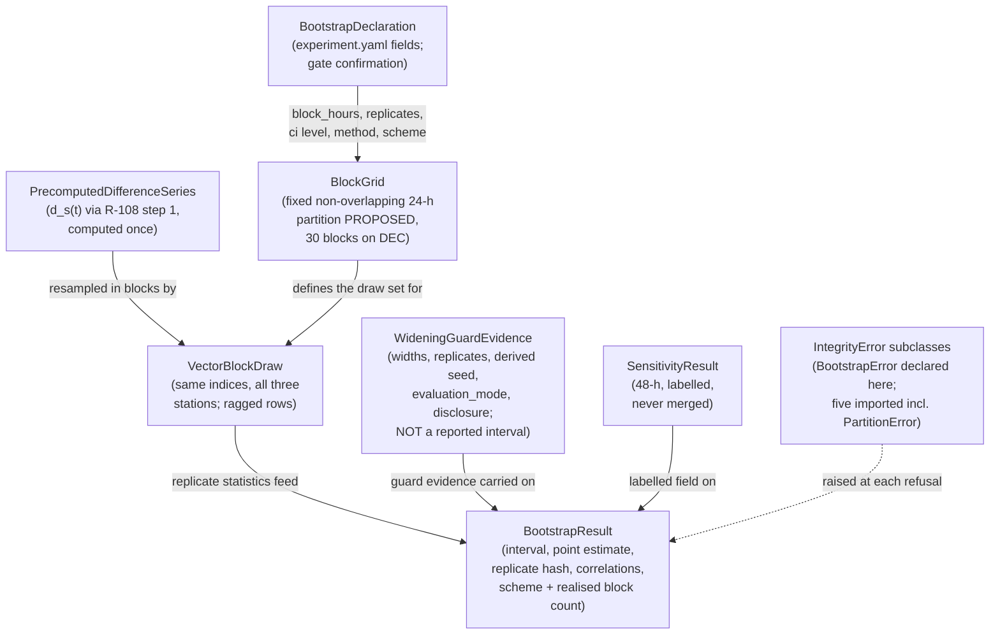

# Domain Entities — `statistical-inference`

> ## ✳ G-09 IS SIGNED — 2026-08-28, **D-31** (read this before any G-09 statement below)
>
> The project decision owner **signed and approved G-09 (Agent preflight)** on 2026-08-28,
> recorded as **D-31** in `evidence/DECISIONS.md` with change record
> `governance/CHANGE_RECORD_2026-08-28_G09_signed.md`. **Every statement below of the form
> "G-09 is not signed" / "G-09 stays unsigned" is superseded as to the gate's status**, and
> is left standing as the accurate record of the constraint that applied when it was
> written.
>
> ⚠ **D-31 records the gate's own TE §18.3 preconditions as UNMET, and that disclosure
> travels with the signature.** `configs/`, and until 2026-08-28 `src/`, did not exist, so
> the mandated automated zero-TBD preflight **could not run**; the ten named critical tests
> **cannot be executed in this environment** (no Python interpreter is installed — a
> zero-byte Windows Store stub, no registry entry, no interpreter on disk); and the evidence
> artifact `aws_ai_dlc_preflight_report` **does not exist**. "No failing critical test" is
> therefore **unproven, not proven** — an absence of executions, not an absence of failures.
> This is the owner **opening the gate by authority**, not a record that its evidentiary
> conditions were satisfied, and no reader may infer the second from the first.
>
> **What the signature changes here:** module creation is authorised, and any defect this
> unit deferred *solely* because G-09 barred editing a file is now correctable.
> **What it does NOT change:** G-05 and G-06 remain `Blocked`; G-P1A, G-P2, G-P3A, G-P3C
> and G-07 are unaffected; **TE §18.2's absolute rule stands** — every scientific value this
> unit routed to G-04/G-05 **stays routed**, and no agent may fill a freeze-gate value by
> convenience; and **§18.3's stop-and-report obligation survives its own gate**, being a
> standing rule on implementation rather than a one-time gate condition.

**Unit** `statistical-inference` · **Kind** `library` · **Complexity** M ·
**Deployment** embedded · **Depends on** `evaluation-and-comparison`

The intra-package shapes `component-methods.md` § Open and § Depth assign to this stage:
**`BootstrapResult`** — referenced there as a type and left unspecified — plus the block
shapes that make the grid and the ragged vector draw assertable facts, the precomputed
difference series the replicates resample, the quarantined widening-guard evidence, and
the labelled sensitivity result. Field names are indicative (§ Depth Q1 = B); the
**obligations** each shape carries are the contract. **No scientific value is fixed here;
G-09 is not signed and no module is created; BLK-03 ↓, BLK-04 ↓, BLK-08 ↓ and BLK-09 ↓
remain open exit conditions on this stage** — BLK-08 ↓ bounds the interval's units for
**`ABL-DIFF` only** after **D-27** (2026-08-24), which froze the primary target as **raw
TECU**, so § 5's primary interval is TECU by **recorded fact** while R-113's precondition 4
remains as the check that proves it.

> **Remediation, 2026-08-28 — `GOV-2026-08-28-FD-01`, verdict FAIL.** This file changed at
> four sites, each with a dated note: **§ 2** and **§ 5** gain the block scheme and realised
> block count (**Rec 26**); **§ 5** and **§ 6** carry the widening guard's fixture-raise /
> real-data-disclosure split and drop the TE §9.3 memory-ceiling wording (**Rec 23**,
> **Rec 40**); **§ 1** records TE §15.3's reduced replicate count as an apparatus constant
> outside `experiment.yaml` (**Rec 24**); **§ 8** gains `PartitionError` and cites R-01's
> amended **fifteen**-exception enumeration (**Rec 8**); the header and § Assumptions cite
> **D-27** (**Rec 7 as narrowed**). **No blocker closes; no scientific value is decided.**
> Entity count stays **8** and the live negative-control count is now **24** — both
> re-derived programmatically.

## Sources

- `../../../inception/application-design/component-methods.md` — the approved `vector_block_bootstrap` boundary call and raise contract (quoted in `business-logic-model.md` W-1); § Open (`BootstrapResult` an intra-package shape, this stage's to specify); § Depth; § Assumptions (**as written**: fourteen exceptions declared where raised until 3.1 places them — the figure Recommendation 8's owner ruling amends to **fifteen** with `PartitionError` promoted in; cited as that artifact's own text, not as the live enumeration).
- `../../../inception/units-generation/unit-of-work.md` § 10 — the boundary paragraph, the ADR-05 seed carve-out, the blockers.
- `../../../inception/units-generation/unit-of-work-story-map.md` — WS-17's evidence column (replicate hash from seed 20221201), TA-14's (reproducible 24-hour output, 48-hour sensitivity, cross-station correlation, synthetic correlated data).
- `../../../inception/requirements-analysis/requirements.md` FR-P1-05-8 — the eight checks these shapes must make assertable.
- `../evaluation-and-comparison/functional-design/domain-entities.md` — § 2 (`ComparisonMask` and its stamps), § 4 (`EstimandResult`, whose scalar § 5 here equality-checks against), § 5 (`PredictionHashReceipt`, consumed by R-113), § 8 (the exception-placement table this file's § 8 extends; being corrected in parallel to carry `PartitionError` under Rec 8).
- `evidence/DECISIONS.md` — **D-27** (2026-08-24): the primary target stays **raw TECU**, so § 5's interval needs no inverse and `ABL-DIFF` alone retains the obligation. **D-28** (2026-08-28): the scored set is **2–31 December 2022, 30 days**, bounding § 2's DEC grid. **D-14**: fixture 2 is March 2022, 1–31 March. **D-11**: the seven-day plumbing window.
- `governance/reviews/GOV-2026-08-28-FD-01.md` — Recommendations 7 (as narrowed), 8, 23, 24, 26 and 40.
- `PreFlight/Technical_Environment_and_Research_Implementation(1)(2).md` **§15.3** (line 913): fixture 2 runs *"one bootstrap execution at reduced replicate count for timing"* — § 1's apparatus-constant note. **TE §9.3** (line 532, "Storage budget") and **TE §9.2** (peak memory, **no numeric value**) — § 6's corrected wording; distinct from **Vision §9.3** (Geomagnetic Regimes and Storm Events).
- `../features-and-splits/functional-design/` — **FU-7 = A** (2–31 December, 30 days), bounding § 2's DEC grid.
- `../foundation/functional-design/business-rules.md` — R-01: the fourteen-exception `IntegrityError` hierarchy, its `src/data/config.py` base, **`BootstrapError` named among the eight raised by other units**, and the constructor contract (file or resource + violated expectation).
- `aidlc/spaces/default/memory/project.md` § Mandated — the vector time-block bootstrap rule, seeds from `seeds.yaml`, TC-03e, the `phase_id`/`source_id`/`target_definition_id` stamp.
- `PreFlight/Technical_Environment_and_Research_Implementation(1)(2).md` §13.6, §13.7, §15.2, §7.2.
- `functional-design-questions.md` (**Q1 through Q10**, answered; summary receipted), `business-rules.md`, `business-logic-model.md`.

## Entity map

Text fallback: the bootstrap declaration in `experiment.yaml` fixes block hours, replicate
count, CI level and — once the gate confirms them — the interval method and the block
scheme, all passed explicitly through `ConfigSnapshot`, while TE §15.3's reduced replicate
count lives in the fixture manifest as an apparatus constant instead; the per-(station,
hour) paired squared-error difference series is computed once through R-108's step-1 path;
the block grid partitions the scored range into fixed non-overlapping blocks (30 on DEC, the
scheme being the proposed reading); each replicate draw applies the same resampled block
indices to all three stations simultaneously over ragged per-station masked rows; the
replicate statistics feed the `BootstrapResult`, which also carries the widening guard's
quarantined evidence — with its mandatory disclosure when the real-data comparison fails —
the recorded scheme and realised block count, and the labelled 48-hour sensitivity result;
and every refusal raises an `IntegrityError` subclass, five of them imported (including
`PartitionError`, R-01's fifteenth) and only `BootstrapError` declared here.

---

## 1. `BootstrapDeclaration` — the frozen numbers live in config, and the fields go to the gate

Read from `experiment.yaml` through `ConfigSnapshot` (TC-03e keeps the values out of
source; R-118). Indicative fields: `block_hours` (24), `replicates` (10_000), `ci_level`
(0.95), `interval_method` (**percentile, PROPOSED — recorded here only once the gate
confirms it**, R-119), and the **predeclared 48-hour sensitivity run** — a named run with a
run ID per TE §7.2's registration discipline (`block_hours = 48`, same seed on its own
child stream).

- Every call receives these **explicitly from `ConfigSnapshot`**; the approved signature's
  two defaults are never exercised, and their removal is the R-118 amendment, **proposed
  at the gate, not applied**.
- The seed is **not** here: 20221201 lives in `configs/seeds.yaml` and arrives as
  `ConfigSnapshot.seeds`' bootstrap entry (TE §13.5; the key name is `foundation`'s
  surface).
- **TE §15.3's reduced replicate count is not here either** *(added 2026-08-28 —
  `GOV-2026-08-28-FD-01` Recommendation 24, board option 2)*. §15.3 requires fixture 2 to run
  *"one bootstrap execution at **reduced replicate count** for timing"*. That count exists
  solely to time a smoke path, is never reported, and is therefore declared as a **constant
  of the test apparatus** in `tests/fixtures/scientific_1month/fixture_manifest.yaml` on
  R-122's authority — **explicitly not a scientific value** and **not a fifth
  `experiment.yaml` field**, which would make a timing execution look like a scientific run
  in the registry. `fixtures-and-reproducibility` owns that declaration, together with the
  execution's **scored range** and its **realised block counts** (R-115's arithmetic: the raw
  March window is 744 h — 31 blocks at 24 h, **indivisible at 48 h** — against 720 h after a
  24-h exclusion). The declared execution is at a **24-hour** block length. Two consequences
  land on shapes here: § 5's `replicates` echoes **whatever count the call received**, and
  § 6's `comparator_replicates` **tracks its primary's count** rather than a fixed 10,000.
- **The field contents are gate confirmations under the four-config regime** — proposed by
  this design, frozen by the owner, never defaulted by an implementer (TE §18.2/§18.3).
- **`interval_method` and `block_scheme` are both PROPOSED, both routed to the gate**
  *(scheme added 2026-08-28 — Recommendation 26)*: TE §13.6 names neither an
  interval-construction method nor a block-resampling scheme, and TE §18.2 bars an
  implementer or an artifact filling either by convenience. `block_scheme`'s proposed value
  is the **fixed non-overlapping partition** (30 resampling units on the DEC range at 24 h),
  with the **moving-block (Künsch) scheme** (697 overlapping candidate blocks over the same
  720 h) named as the alternative; both figures derived and printed at R-115. It is § Gate
  items' **fifth** entry.

## 2. `BlockGrid` — the fixed non-overlapping partition as an assertable fact

Intra-package shape (R-115). Indicative fields: `scored_range_start_utc`,
`scored_range_end_utc`, `block_hours`, **`block_scheme`**, `n_blocks`,
`block_boundaries_utc`.

- **Alignment**: contiguous, non-overlapping blocks aligned to the scored range's start —
  on DEC, 00:00 UTC boundaries over exactly 2–31 December 2022 (FU-7 = A, recorded as
  **D-28**), giving **`n_blocks = 30`** at 24 h and **15** at the 48-hour sensitivity.
- **`block_scheme` is a recorded field, not an implied one** *(added 2026-08-28 —
  `GOV-2026-08-28-FD-01` Recommendation 26)*. TE §13.6 names **no** scheme —
  fixed-partition, moving/overlapping, or circular — so the fixed non-overlapping partition
  is this design's **proposed reading**, listed as § Gate items' **fifth** entry and
  **not settled here** (TE §18.2). Recording the scheme on the shape is what makes the
  choice auditable rather than inferable from `block_hours` alone. Derived and printed at
  R-115: over the DEC range (720 h) at 24 h, the fixed partition yields **30** resampling
  units; a moving-block scheme yields **720 − 24 + 1 = 697** overlapping candidate blocks —
  a materially different variance estimate, which is why the field exists and why the
  reading goes to the owner.
- **Divisibility**: a scored range not evenly divisible by `block_hours` **raises
  `BootstrapError`** at construction — a partial block is unrepresentable, not policy. The
  claim that this "never fires on the frozen ranges" was **corrected 2026-08-28**
  (Recommendation 24): it holds for the **DEC** range at both block lengths, and the raise
  **does** fire at 48 h on the raw March fixture window (744 h), on the April and November
  validation months after the 24-h exclusion (696 h each) and on the raw 7-day plumbing
  window (168 h). R-115 carries the full derivation.
- **Boundary**: every block lies wholly inside the mask's scored range, or construction
  **raises**; a 1 December block is unrepresentable upstream (R-109 limb 3) and refused
  here.
- The grid is recorded on `BootstrapResult` (via `block_scheme`, `n_blocks` and
  `block_hours`) so the **realised** block arithmetic — scheme and count, not just the
  configured length — is auditable after the fact.

## 3. `VectorBlockDraw` — same indices, all three stations, ragged contents

Intra-package shape (R-116). Indicative fields per replicate: `block_indices` (length
`n_blocks`, drawn with replacement from the grid), `per_station_row_counts` (the masked
rows each drawn block contributed, per station).

- **The vector property**: one `block_indices` sequence per replicate, applied to **all
  three stations simultaneously** — a per-station index sequence is unrepresentable in the
  shape, which is what the same-indices test asserts (control (11), the Q-27
  anti-pattern).
- **Ragged contents under the declared rule**: per station, exactly the masked rows falling
  inside each drawn block's window — the mask's own facts, never a new exclusion and never
  a narrowing of the scored population.
- **Zero support**: a replicate in which any station's total drawn rows is zero **raises
  `BootstrapError`** naming the station and window (the equal-station mean is undefined) —
  structurally guarded, practically unreachable on December's measured coverage.

## 4. `PrecomputedDifferenceSeries` — d_s(t), one copy, computed once

Intra-package shape (R-114). Indicative fields: per station, the (`station`,
`interval_start_utc`)-keyed series of paired squared-error differences (**benchmark minus
model**), computed **once** on masked rows only **through the same step-1 code path R-108's
`paired_loss_differential` uses**.

- The replicates resample **blocks of this series** and reapply only R-108's steps 2–3 —
  the replicate statistic is the estimand by construction.
- The full-data point estimate derived from this series must equal
  `paired_loss_differential`'s scalar **exactly** (§13.7) or **`BootstrapError`** — the
  one-copy claim as a checked invariant.
- This is also the series the three pairwise correlations are computed on (R-121), over
  common masked timestamps of each pair — one series, two consumers, no second copy.

## 5. `BootstrapResult` — the result carries its own evidence

The approved return type, specified at last (`component-methods.md` § Open assigned it to
this stage). Indicative fields:

| Group | Fields | Obligation |
|---|---|---|
| Interval | `ci_lower`, `ci_upper`, `ci_level`, `interval_method`, `block_hours`, **`block_scheme`**, `replicates` | The confirmatory interval, **TECU-denominated by recorded fact for the primary path (D-27) and by check for `ABL-DIFF`** (R-113 precondition 4); method recorded from config (R-119); **scheme recorded, its reading a gate item** (R-115, Rec 26); `block_hours`/`replicates` echo the config-declared values **on a confirmatory run** (control (17) as scoped by Rec 24) and, on the declared §15.3 fixture execution, the fixture manifest's reduced count |
| Point estimate | `point_estimate`, `per_station_components` | Equality-checked against `EstimandResult.scalar` **exactly** (R-114); orientation and weighting inherited from R-108, never restated |
| Determinism | `seed_key`, `generator_identity`, `replicate_hash` | WS-17's evidence emitted by the producing path (R-117; the R-110 pattern) — `default_rng` (PCG64), the `ConfigSnapshot.seeds` key consumed, the hash the acceptance row asserts |
| Guard | `widening_guard` → § 6 | Machine-readable evidence of the check — expressly **not** a reported interval (R-120). **Carries the mandatory disclosure when the real-data comparison fails** (Rec 23); the raise itself is the fixture-time assertion |
| Correlation | `pairwise_correlations` (ARUC–BSHM, ARUC–NICO, BSHM–NICO) | Pairwise Pearson on d_s(t) over common masked timestamps, all three pairs (R-121); `regimes-diagnostics-reporting` asserts presence, restates nothing. **Load-bearing twice** since 2026-08-28: TE §13.6's mandated disclosure, **and** the content of § 6's real-data disclosure — reported and disclosed, never a gate on the raise |
| Sensitivity | `sensitivity` → § 7 | The labelled 48-hour result, **never merged** (R-118) |
| Provenance | `mask_id`, `set_id`, `partition_id`, `model_id`, `benchmark_id`, `n_blocks` | The mask/stamp identifiers the interval was computed over — provenance on the result, not in a log. `n_blocks` is the **realised** count, which with `block_scheme` makes the partition actually used auditable (Rec 26) |

## 6. `WideningGuardEvidence` — evidence of the check, quarantined from reporting

Intra-package shape carried on `BootstrapResult` (R-120). Indicative fields:
`comparator_width`, `comparator_replicates` (**the primary call's count** — 10,000 on a
confirmatory run, the fixture manifest's reduced count on the §15.3 timing execution; never
the rejected variant's fixed 2,000), `comparator_derived_seed`, `vector_width`, `passed`,
**`evaluation_mode`** (`fixture` | `real_data`), **`disclosure`** (present when
`evaluation_mode = real_data` and `passed = false`).

- The comparator is the **rejected Q-27 within-station method, run on the same masked
  data, same block length, and the same replicate count as its primary call**, seeded from a
  derived child stream — present solely to be beaten. Tracking the primary's count keeps the
  comparison **like-for-like**: a reduced-replicate primary against a full-replicate
  comparator biases it toward failing, because a 2.5/97.5 percentile interval is unstable at
  low replicate counts (Rec 24).
- **What a failure does depends on `evaluation_mode`** *(amended 2026-08-28 —
  `GOV-2026-08-28-FD-01` Recommendation 23, board option 1 with option 2's condition folded
  into the disclosure)*. On the **TA-14 synthetic fixture**, where planted cross-station and
  temporal correlation makes widening hold **by construction**, a **narrower** vector
  interval **raises `BootstrapError`** — the assertion TE §13.6's final sentence actually
  specifies. On **real data** it sets `passed = false` and populates **`disclosure`**, and
  the run continues. The shape therefore admits a serialized `BootstrapResult` with
  `passed = false` **only** in `real_data` mode; a serialized `fixture`-mode result always
  implies `passed = true`, because the raise fired otherwise.
  - Why: widening follows **only** where cross-station paired-error covariance is positive —
    the equal-station mean's variance is (1/9)ΣΣCov(d̄_s,d̄_t) under the vector construction
    and loses its s≠t terms under within-station resampling — and **no frozen document
    asserts that sign for ARUC/BSHM/NICO**. The guard's firing point is the **DEC**
    partition, so a false raise there aborts G-06 **after** the lock is opened and the access
    logged, and Vision §8.3 then labels whatever follows exploratory. **The
    runtime-versus-fixture reading is routed to the gate, not asserted**, as an amendment
    owed against `component-methods.md`'s approved raise contract; **the G-06 abort policy is
    owed to the Supervisor at G-05**.
- **`disclosure` carries the discriminating quantity**: the two widths, the comparator's
  replicate count and derived seed, the block length, scheme and realised block count, and
  **the measured pairwise cross-station correlations** § 5 already holds. Its absence on a
  failed real-data comparison, or an omission of those correlations, **fails** control (22) —
  the check cannot be downgraded to a suppressible warning.
- **The comparator's numbers are never serialized as a reported interval** — no bounds, no
  CI level, width only; the Q-27 variant may not re-enter any results artifact, table or
  notebook (control (20)). The disclosure is guard evidence too, not a second interval.
- The doubled CPU cost is **measured and recorded at fixture time** and frozen into
  `tests/fixtures/<fixture_id>/fixture_manifest.yaml` (§15.2), never invented; **storage is
  bounded by TE §9.3's 10.0 GB plan, and no numeric memory ceiling is currently frozen**
  *(corrected 2026-08-28 — Recommendation 40: **TE §9.3**, line 532, is titled "Storage
  budget" and is a capacity plan across eight disk categories; **TE §9.2** records peak
  memory with no numeric value; the conflation originates in `services.md:258-259`/`:264`
  and `unit-of-work.md:453`, approved upstream, where a change record is owed and which are
  not edited from here. **Vision §9.3** is a different section entirely)*.

## 7. `SensitivityResult` — labelled, separate, never merged

Intra-package shape carried on `BootstrapResult` (R-118). Indicative fields:
`label = "sensitivity"`, `block_hours` (48), `n_blocks` (15 on DEC), `ci_lower`,
`ci_upper`, `ci_level`, `run_id` (the predeclared `experiment.yaml` named run),
`derived_seed`.

- Same seed 20221201 on its **own deterministically derived child stream** (R-117) — the
  sensitivity cannot perturb the confirmatory draws.
- **Never merged into or substituted for** the 24-hour confirmatory interval: distinct
  labelled fields, asserted by control (16); the confirmatory interval's `block_hours`
  must read 24 and this shape's 48.
- Predeclared as a named run with a run ID (TE §7.2's registration discipline applied to a
  required sensitivity) — invocable, auditable, un-confusable.

## 8. `IntegrityError` subclasses raised here — placement under R-01's amended fifteen-exception hierarchy

`foundation` R-01: every project exception derives from `IntegrityError` (base in
`src/data/config.py`), and each raising unit declares its own as subclasses. **R-01's
enumeration is fifteen, not fourteen, as of 2026-08-28** — `PartitionError` promoted into it
by owner ruling on `GOV-2026-08-28-FD-01` Recommendation 8. **`BootstrapError` is one of the
enumerated set — R-01 names it among those raised by other units — and this is the unit that
raises it**, so it is declared here, not minted under the any-future clause:

| Exception | In R-01's enumeration? | Declared | Raised on |
|---|---|---|---|
| **`BootstrapError`** | **yes** | **here** (`src/evaluation/bootstrap.py`, this unit's raise site), importing the base from `src/data/config.py` | point-estimate inequality (R-114); indivisible range, boundary-crossing block (R-115); zero-support replicate (R-116); unrecognized interval method (R-119); the widening comparison failing **at fixture time** (R-120 as amended — on real data the failure is a mandatory disclosure, not a raise) |
| `FairnessError` | yes | by `evaluation-and-comparison` (`src/evaluation`); imported | unregistered or ad-hoc mask, wrong-partition mask at the bootstrap boundary (R-113) |
| **`PartitionError`** | **yes — R-01's fifteenth**, promoted 2026-08-28 per Rec 8 | by `models-and-baselines` (its R-92 raise sites); **imported** | a **`partition_id` mismatch** between the two `Prediction`s at the bootstrap boundary (R-113 precondition 2, via **R-105 as corrected**) |
| `LeakageError` | yes | by `features-and-splits` (its raise sites); imported | an **absent (`None`)** stamp of either kind, or a **`transform_id` mismatch**, on either `Prediction` (R-113, via R-105 as corrected) — no longer the `partition_id`-mismatch case, which is `PartitionError`'s |
| `LockedTestError` | yes | by `governance-guards` (`locked_test.py`); imported | DEC receipt absence/mismatch/ordering before any draw (R-113, via R-109 limb 1) |
| `InverseTransformError` | **`foundation`'s to settle** — previously recorded here as the sibling's unit-local under R-01's any-future clause; Rec 8 puts its placement to `foundation`, and **this unit cites whatever that unit settles rather than deciding it** | by `evaluation-and-comparison` (`src/evaluation`); imported | transformed-space input at the bootstrap boundary (R-113, via R-104) — reachable only through **`ABL-DIFF`** after **D-27**, the primary target being raw TECU |

> **Applied 2026-08-28 — `GOV-2026-08-28-FD-01` Recommendation 8.** The owner ruled option
> (1): `PartitionError` becomes R-01's **fifteenth**, and `evaluation-and-comparison`'s R-105
> is corrected to raise it for the `partition_id`-mismatch limb, matching
> `models-and-baselines` R-92 (*"`partition_id` disagreement or a training partition raises
> `PartitionError`; `transform_id` disagreement or `None` raises `LeakageError`"*). This unit
> previously imported R-105 *"as written"* and so inherited the disagreement — the concrete
> failure being a test asserting `pytest.raises(PartitionError)` that passed at `06` and
> failed at `07`, plus an exception outside the declared hierarchy exiting with **no
> `aborted` registry row** against NFR-AUD-01. **This unit declares nothing new**: it imports
> the fifteenth and asserts both types by discrimination in control (2).
> **Dependency, stated not assumed:** on disk today `foundation` R-01 still reads "all
> fourteen" and lists no `PartitionError`, and R-105 still raises `LeakageError` for the
> mismatch; both are being corrected in parallel under the same ruling, and this table
> follows **their** settled text.

Every raise carries the affected file or resource and the violated expectation — R-01's
constructor contract, enforced by construction. The stage-entry catch (`foundation` R-10)
therefore writes the `aborted` registry row for every one of them without a hand-maintained
list. A call without `seed` is a **`TypeError` by signature**, not an `IntegrityError` —
the never-defaulted rule is unrepresentable rather than checked (R-117).

---

## Requirement coverage

| Requirement | Entities | Acceptance |
|---|---|---|
| FR-P1-05-8 | § 1 (checks 3–4 as config), § 2 (check 3), § 3 (checks 2, 7), § 4 (checks 1, 5), § 5 (check 6; the correlation), § 6 (check 8), § 7 (the sensitivity), § 8 (the raises) | WS-17 (primary), TA-14 (primary) |

**1 requirement, 0 untested — derived from the story map's rows.** **8 entities**, derived
by counting this file's numbered sections and re-derived programmatically on 2026-08-28
after the remediation (unchanged: the six applied Recommendations added fields and
obligations to existing shapes, and minted no new shape).

## Assumptions & Open Questions

- **[assumption]** Every field name above is indicative (§ Depth Q1 = B); the obligations are the contract. **Two** surfaces exceed the intra-package grant, both amendments owed and **proposed not applied**: the **R-118 signature amendment** and — added 2026-08-28 per Recommendation 23 — the **R-120 raise-contract amendment** (the widening raise relocated to fixture time, the real-data comparison made a mandatory disclosure, the comparator's replicate count stated as its primary's). § 1's `experiment.yaml` fields are gate confirmations under the four-config regime, and `block_scheme` joins `interval_method` among them.
- **[assumption]** `BootstrapResult` was `component-methods.md` § Open's unspecified type and is finalized here per that section's assignment to this stage.
- **[assumption]** The declared fixture tolerances (§ 6's runtime, § 5's correlation-recovery tolerance) live in `tests/fixtures/<fixture_id>/fixture_manifest.yaml` (§15.2) — no tolerance or runtime value is decided here; §15.1 fixes that they are measured from the fixtures and frozen, never invented. **Added 2026-08-28 (Recommendation 24):** fixture 2's manifest additionally carries TE §15.3's **reduced replicate count**, the execution's **scored range** and its **realised block counts**, all as apparatus constants declared by `fixtures-and-reproducibility` — expressly not scientific values, and expressly not `experiment.yaml` fields.
- **[assumption]** **No numeric memory ceiling is frozen anywhere in the authorities** (Recommendation 40). § 6's cost figure is **measured and recorded**; **storage** is bounded by **TE §9.3**'s 10.0 GB plan (line 532, "Storage budget", eight disk categories). The upstream conflation of that plan with a RAM ceiling sits in `services.md:258-259`/`:264` and `unit-of-work.md:453`, where **a change record is owed**; those artifacts are approved upstream and are **not edited from here**. **TE §9.3** and **Vision §9.3** are different sections and are always written with their document prefix in this artifact set. A real memory envelope **could be frozen from measurement after the fixtures run** (§15.1 permits); inventing one now it forbids.
- **[assumption]** The seed 20221201 reaches § 5's `seed_key` as `ConfigSnapshot.seeds`' bootstrap entry; the key name is `foundation`'s surface, and this unit consumes whatever key its config schema fixes.
- **Verification obligations owned here:** § 2's divisibility and boundary raises **and its recorded scheme/realised-block-count fields**; § 3's same-indices and zero-support controls; § 4's exact-equality control; § 5's presence and hash controls (different seed → different hash, same seed → identical); § 6's quarantine control, its **fixture-time guard-raise** control (19) and its **mandatory-disclosure** control (22); § 7's never-merged labelling control; § 8's constructor-contract compliance on every `BootstrapError` raise **and the discriminated-type assertion on `PartitionError` versus `LeakageError`** (control (2)).
- **Governance dependencies owned outside:** BLK-03's limbs (`models-and-baselines`); BLK-04's limbs and BLK-09's `train_start` (`features-and-splits`); **BLK-08 ↓ narrowed to `ABL-DIFF` alone on D-27's strength** — § 5's primary interval is TECU by **recorded fact**, and the residual is the `ABL-DIFF` inverse mechanism plus its error-propagation record, jointly owned by `features-and-splits` and `evaluation-and-comparison` (the latter narrowing its resolver to `load_inverse(transform_id) -> Inverse`); the **R-118 and R-120 amendments** (the gate); the § 1 `interval_method`, § 1/§ 2 `block_scheme` and R-121 series confirmations (student/supervisor); **`foundation` R-01's amended fifteen-exception enumeration, `evaluation-and-comparison`'s corrected R-105, and `InverseTransformError`'s placement** (Recommendation 8); **TE §15.3's reduced replicate count and the fixture manifest fields** (`fixtures-and-reproducibility`); **the G-06 abort policy for a failed widening comparison** (Supervisor, at G-05); **a change record against `services.md` and `unit-of-work.md`** for the TE §9.3 conflation (their owners, before G-07); G-05's freeze of the evaluation code (Supervisor).
- **Open — BLK-03 ↓, BLK-04 ↓, BLK-08 ↓, BLK-09 ↓ are exit conditions on this stage.** Nothing in this file closes any of them; no implementation may proceed while any stands.
- **G-09 is not signed.** ⚠ **G-09 IS SIGNED as of 2026-08-28 (D-31)** — this prohibition's stated ground no longer holds, and module creation is authorised. **The other grounds stated alongside it, if any, are untouched**, and D-31's disclosure travels with the signature: the §18.3 preflight never ran, the critical tests are unexecuted in this environment, and `aws_ai_dlc_preflight_report` does not exist. **No scientific value becomes fillable** — TE §18.2 and §18.3's stop-and-report rule are unchanged. These shapes are design only; no module, dataclass or test is created.
- **None** of the above adopts a reading on a supervisor-owned value, and none decides a scientific constant.

---

> **Re-confirmation receipt, 2026-08-29 — `statistical-inference`.** The 2026-08-27T21:49:36Z REDO jump reset every unit's
> receipt floor, and this unit's content had already changed after that floor under the 2026-08-28
> post-execution pass (D-29 through D-32; **G-09 signed under D-31 with its TE §18.3 preconditions
> disclosed unmet**). The owner re-confirmed that post-execution content via the Consolidated
> Summary Confirmation at the foot of `functional-design-questions.md`, receipted `2026-08-29`.
> **No line above this marker was touched by this pass**, no count was re-derived, and nothing here
> discharges TA-15, WS-18 or TA-18, creates `aws_ai_dlc_preflight_report`, or alters the fact that
> stage 3.1 remains **FAIL** with no board having passed it.
