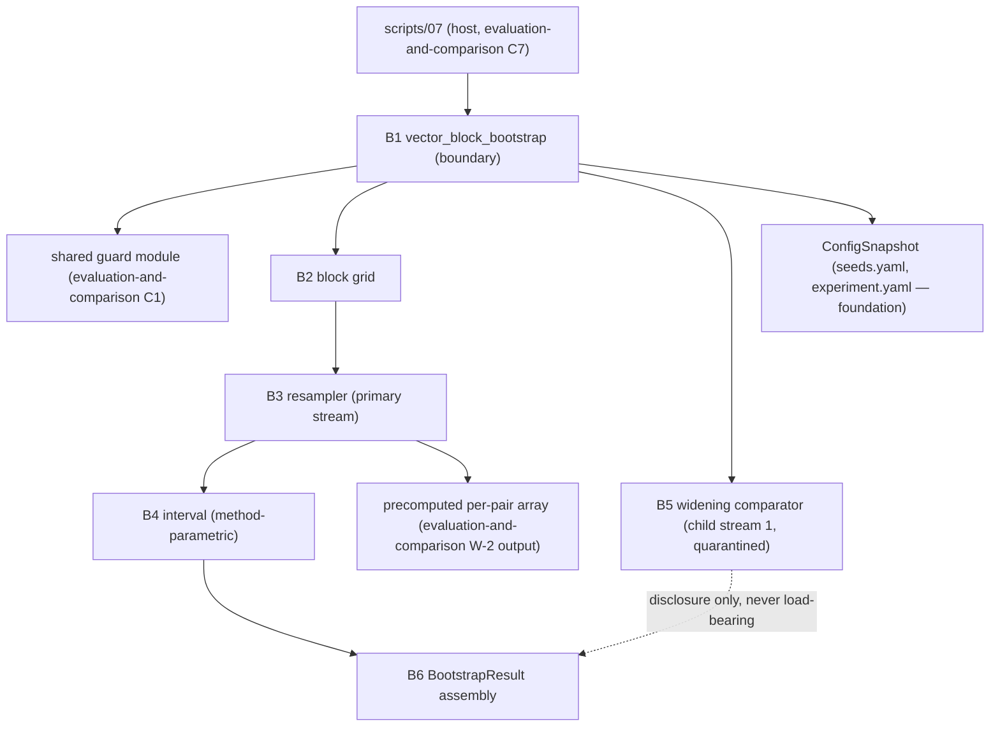

# Logical Components — `statistical-inference`

**Unit** `statistical-inference` (Bolt 10) · **Kind** `library` · **Stage** `nfr-design`

> ## ⚠ NOTHING HERE IS CLAIMED SATISFIED
>
> Component inventory for modules that **do not exist** — `src/evaluation/` is absent, no
> interpreter is installed, no bootstrap has ever executed. **The interval method, the
> block-resampling scheme and the correlation series are proposed to gates, not decided**;
> this inventory is method-parametric around all three. BLK-03/04/08/09 remain open exit
> conditions. Every component below is design for 3.5, not a claim that anything runs.

## Sources

- `nfr-design-questions.md` — **Q1 = A**, **Q2 = A**, receipted.
- `security-design.md` (this stage) — SD-S-01…SD-S-04.
- `../nfr-requirements/security-requirements.md` and `../nfr-requirements/tech-stack-decisions.md` — SEC-S-01…SEC-S-04, TS-S-01…TS-S-05; the `library`-kind Scope note standing in for the absent `performance-requirements.md`, `scalability-requirements.md` and `reliability-requirements.md` (not produced for this unit by design — performance's real-and-unmeasured assessment is inherited at C5).
- `../functional-design/business-logic-model.md` — W-1…W-8, mapped onto components here; the approved `vector_block_bootstrap` signature quoted at W-1.
- `../../evaluation-and-comparison/nfr-design/logical-components.md` — C1 (the shared guard module this unit consumes) and C7 (`scripts/07`, the host process).
- `../../../inception/application-design/component-methods.md` — § `src/evaluation`'s approved `vector_block_bootstrap` boundary; `BootstrapResult` left as an intra-package shape.

---

## Component inventory

All inside `src/evaluation` (R-112's path grant co-owns the package with
`evaluation-and-comparison` and `regimes-diagnostics-reporting`). Names proposed to 3.5;
shapes and boundaries are this stage's. This unit owns **no script** — it runs inside
`scripts/07_evaluate_and_report.py` after `foundation`'s six-step stage entry.

| # | Component (proposed) | Owns | Workflows | Raises |
|---|---|---|---|---|
| B1 | `bootstrap` module — `vector_block_bootstrap` | the approved public boundary; precondition re-assertion via the **shared guard module** (Q2 = A); orchestration of B2–B5 | W-1 | via shared guards; `BootstrapError` |
| B2 | block grid builder | fixed non-overlapping 24-hour partition over `features-and-splits`' folds/embargo **(PROPOSED reading — the block-resampling scheme is a gate item, Rec 26; §18.3 stop-and-report stands at 3.5)**; boundary-violation raise | W-3 | `BootstrapError` |
| B3 | resampler | index draws from the **primary** PCG64 stream into the precomputed per-pair array; **no estimand arithmetic in the loop** | W-2, W-4 | — |
| B4 | interval component | **method-parametric** construction reading `experiment.yaml`; refuses unrecognised/absent/unconfirmed method naming the config key | W-5 | `BootstrapError` |
| B5 | widening comparator | the rejected Q-27 within-station method, **exact and quarantined**, child stream 1; fixture-time raise, real-data disclosure | W-6 | `BootstrapError` (fixture only) |
| B6 | result assembly | `BootstrapResult`: interval, correlation series, seed key, generator identity, **replicate hash + four canonical-form facts** (Q1 = A), stream assignments; correlation **emitted by the producing path** | W-7 | — |
| B7 | `tests/test_bootstrap.py` (specified, unwritten) | the eight R-122 checks plus the byte-grounded hash controls (SD-S-01) and this entry point's negative controls in the sibling's per-entry set | W-8 | — |

## Component boundaries and isolation

Text fallback: `07` calls B1; B1 first calls the shared guard module (Q2 = A), then builds
the block grid (B2), resamples indices from the primary stream into the precomputed
per-pair array (B3), constructs the interval by the configured method (B4), runs the
quarantined widening comparator on child stream 1 (B5, disclosure-only), and assembles
`BootstrapResult` (B6). Seed and replicate count arrive via `ConfigSnapshot`; seed is a
required parameter (`TypeError` by signature).

- **B5 is the quarantine boundary.** The comparator's output reaches B6 only as a
  disclosure field; no interval, refusal, or metric depends on it. Making it load-bearing
  would invert the yardstick into an authority — the exact failure SEC-S-03 forbids.
- **B3 touches no estimand arithmetic.** The single copy lives in
  `evaluation-and-comparison` (its W-2); B3 consumes its precomputed output. One copy of
  the estimand, one copy of the guards (Q2 = A) — the unit's whole isolation strategy is
  single-definition.
- **Stream isolation is structural**: B3 owns the primary stream; B5 and the 48-hour
  sensitivity own spawned children (assignment fixed: child 0 = sensitivity, child 1 =
  comparator, recorded in B6's output). No component can perturb another's draws.
- **Import boundary (TA-07):** nothing here imports `src/external/iri.py` or
  `src/external/gim.py`; this unit consumes predictions and masks, never comparators.

## Failure domains and blast radius

| Failure | Domain | Blast radius | Containment |
|---|---|---|---|
| Guard defect | shared module (sibling's C1) | all metric entry points, both units | single failure domain by design; per-entry negative controls; sibling owns the fix |
| B1 forgets a guard call | B1 | one entry point unguarded | this entry point's negative controls in the shared per-entry set (Q2 = A) |
| Estimand drift in the loop | none possible | — | B3 resamples indices only; no second estimand copy exists to drift |
| Block-grid violation | B2 | run refuses | `BootstrapError` naming the block |
| Wrong/unconfirmed interval method | B4 | run refuses | `BootstrapError` naming the config key; §18.3 stop-and-report at 3.5 |
| Comparator defect | B5 | disclosure field only | quarantined — never load-bearing |
| Hash irreproducibility across platforms | B6 | WS-17 evidence breaks loudly | Q1 = A's four pinned facts make the break diagnosable; same-seed control compares for equality |
| Non-widening outcome on real December | none (not a code failure) | supervisor adjudication | named G-06 item (Q1 = B upstream); abort policy owed at G-05 (Rec 23) |

Unit posture: **every code failure lands on "refuse loudly"** — this unit has loud failure
modes throughout, unlike its `external-products` sibling; the one silent risk (a too-narrow
interval from a wrong method or a substituted bootstrap) is closed by the method refusal
(B4), the vector rule's negative control, and the widening disclosure (B5).

## Shared resources

| Resource | Owner | This unit's access |
|---|---|---|
| Shared guard module | `evaluation-and-comparison` (SD-C-01) | consumed by B1 (Q2 = A); half-contract stated both sides |
| Precomputed per-pair array | `evaluation-and-comparison` (W-2) | read-only input to B3; never recomputed |
| `ConfigSnapshot` (seeds, replicates, method) | `foundation` / governed configs | read-only; seed never defaulted |
| DEC access record + containment fields | `governance-guards` | inherited through the shared guard's receipt check; nothing added |
| `BootstrapResult` | **this unit (B6)** | written once per run, append-safe; consumers: `07`'s output assembly, `regimes-diagnostics-reporting`, `04_results_and_figures.ipynb` (TE §14) |
| Replicate hash + canonical-form facts | **this unit (B6)** | WS-17 evidence, emitted by the producing path |

## Cross-cutting notes for 3.5

- Owed: guard-module import surface (tracks the sibling's SD-C-01 naming); the
  `BootstrapResult` field list as an intra-package dataclass (add: four canonical-form
  facts, stream assignments); measurement of peak memory on the fixtures before any
  holding-strategy choice beyond the materialised replicate vector (SD-S-04).
- Stop-and-report triggers standing at 3.5: interval method unconfirmed; block-resampling
  scheme undecided; correlation series undecided (§18.3).
- No new dependency, no new platform; `numpy` only, `scipy.stats` never (TS-S-02).

## Assumptions & Open Questions

- **[Q2]** The shared guard module is a design-level dependency on a sibling module that
  does not exist yet; the contract is check semantics, not a file name. If 3.5 reshapes it,
  B1's calls move with it.
- **[assumption]** The precomputed per-pair array's producer (`evaluation-and-comparison`
  W-2) and this consumer agree on the pairing key (`station`, `interval_start_utc`, R-92).
  Asserted by the shared stamp guard; the alignment itself is the producer's.
- **Carried — the §15.3 reduced-replicate fixture count's classification is open**
  (apparatus constant vs named run, Rec 24); B7 reads it from the fixture manifest either
  way and hardcodes nothing.
- **None** of the above decides a scientific value, fills a `TBD — freeze gate` field, or
  claims a gate, acceptance row or test as discharged.
