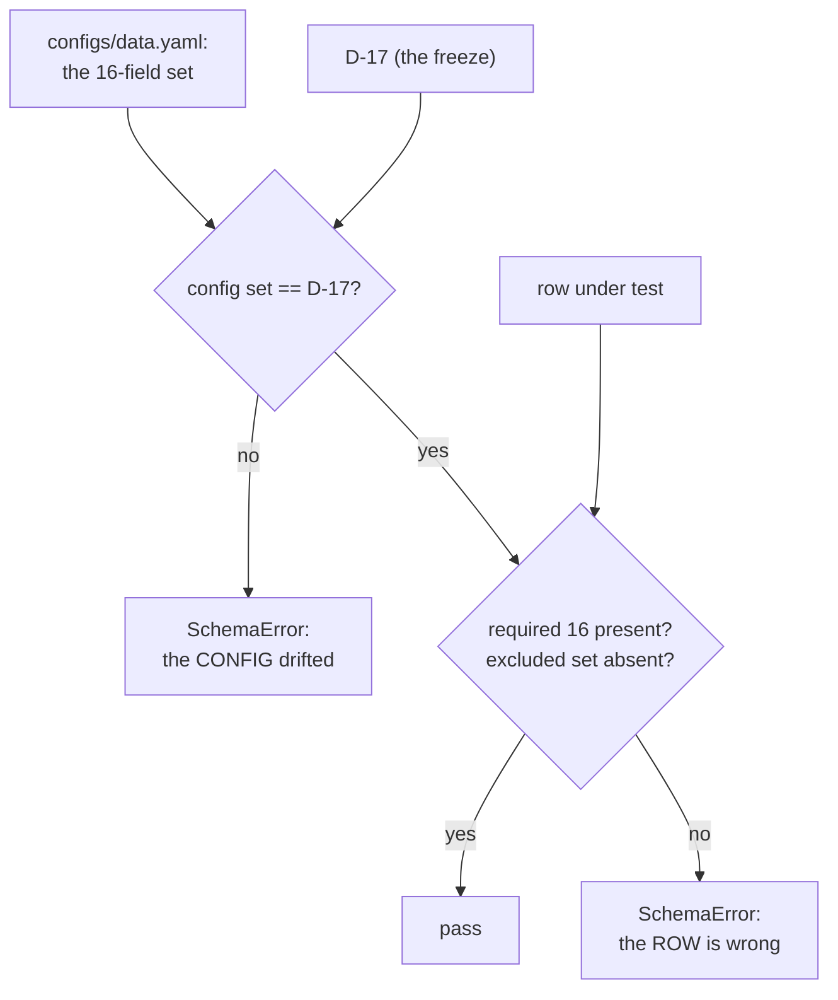

# Business Logic Model — `target-standardization`

> ## ✳ G-09 IS SIGNED — 2026-08-28, **D-31** (read this before any G-09 statement below)
>
> The project decision owner **signed and approved G-09 (Agent preflight)** on 2026-08-28,
> recorded as **D-31** in `evidence/DECISIONS.md` with change record
> `governance/CHANGE_RECORD_2026-08-28_G09_signed.md`. **Every statement below of the form
> "G-09 is not signed" / "G-09 stays unsigned" is superseded as to the gate's status**, and
> is left standing as the accurate record of the constraint that applied when it was
> written.
>
> ⚠ **D-31 records the gate's own TE §18.3 preconditions as UNMET, and that disclosure
> travels with the signature.** `configs/`, and until 2026-08-28 `src/`, did not exist, so
> the mandated automated zero-TBD preflight **could not run**; the ten named critical tests
> **cannot be executed in this environment** (no Python interpreter is installed — a
> zero-byte Windows Store stub, no registry entry, no interpreter on disk); and the evidence
> artifact `aws_ai_dlc_preflight_report` **does not exist**. "No failing critical test" is
> therefore **unproven, not proven** — an absence of executions, not an absence of failures.
> This is the owner **opening the gate by authority**, not a record that its evidentiary
> conditions were satisfied, and no reader may infer the second from the first.
>
> **What the signature changes here:** module creation is authorised, and any defect this
> unit deferred *solely* because G-09 barred editing a file is now correctable.
> **What it does NOT change:** G-05 and G-06 remain `Blocked`; G-P1A, G-P2, G-P3A, G-P3C
> and G-07 are unaffected; **TE §18.2's absolute rule stands** — every scientific value this
> unit routed to G-04/G-05 **stays routed**, and no agent may fill a freeze-gate value by
> convenience; and **§18.3's stop-and-report obligation survives its own gate**, being a
> standing rule on implementation rather than a one-time gate condition.

**Unit** `target-standardization` (Bolt 6) · **Kind** `library` · **Depends on**
`inventory-and-registry`

> **Re-established a sixth time 2026-08-24**, on a **new stage attempt** — Inception closed
> and Construction opened at 2026-08-24T11:46:26Z, resetting the receipt floor for every
> unit. **No content of this unit changed.** Both `foundation` passes of that day (the
> amendment pass and the sites 9–11 addendum, in
> `governance/CHANGE_RECORD_2026-08-24_foundation_amendments.md`) touch nothing this unit
> reads. **Stated because this unit leans on it hardest:** `component-methods.md` **§ Depth**
> — the cross-package-boundary-calls-only policy that makes intra-package shapes this
> stage's to specify — is **not** what Amendment B changed; B added fields to a `foundation`
> entity. Amendment A was declined, so **no count moved**. **The READY verdict in § Review
> belongs to the previous attempt.**

> **Corrected and re-established 2026-08-23, after two adversarial passes.** Iteration 1
> found a **Critical** — nine citations of "`inventory-and-registry` R-20", a unit whose
> rules run R-44…R-53 and which has no R-20 — and a **Major**: **"documented QC"**, one of
> the four permitted transformations, is defined nowhere in scope, which defeated the
> closed-set claim as first stated. Both are fixed here, with the superseded readings
> preserved; the citations now point at **`governance-guards` R-20**, the rule that actually
> boxes the inherited question. A fifth redo then swept the four remaining stale citations
> out of this unit's **question file**, which had been locked when the artifacts were
> corrected. **No answer to any question changed.**

The workflows this unit implements: turning validated provider files into the Phase 1
hourly target rows under **D-17**'s contract, stamping the three definition IDs on every
row, labelling the product **location-sampled gridded VTEC**, and producing the Phase 1
portion of the verification and target-uncertainty evidence.

**Phase 1 only.** This unit must never produce a DCB, STEC, mapping, satellite or arc
field, and must never label the gridded product a receiver-specific station observation.

**It decides no scientific value.** The aggregation statistic is **D-16**, the cell rule
**D-1**, the field contract **D-17**, the four support values **D-19** — all frozen
elsewhere and applied here.

## Sources

- `../../../inception/units-generation/unit-of-work.md` § 5 — the `Owns` list, the boundary, the 6 requirements, the implementation notes; and **BLK-05** with its four-limb status table.
- `../../../inception/units-generation/unit-of-work-story-map.md` — Tables 1 and 2 plus § Per-unit coverage summary. **Derived by reading the rows:** 6 requirements, **1** with no acceptance row (FR-P1-03-5); **owns** TA-19; **supports** TA-15. § Cross-unit responsibilities carries the NFR-DQ-01 / FR-P1-05-10 / TA-19 crossing.
- `../../../inception/requirements-analysis/requirements.md` — FR-P1-03-1…-5; NFR-TDEF-01; NFR-DQ-01; FR-P1-05-10; § Known defects rows 10 and 11.
- `../../../inception/application-design/components.md` — `prepared.py`'s row and § Assumptions' record of the `02` ordinal collision.
- `../../../inception/application-design/component-methods.md` § Depth — **cross-package boundary calls only**; intra-package shapes are **this stage's** to specify.
- `../../../inception/application-design/services.md` § The nine stage scripts, § Stage entry contract.
- `../inventory-and-registry/functional-design/business-rules.md` — R-45's registry and R-49's prepared-product schema.
- `../governance-guards/functional-design/business-rules.md` — **R-23**, **R-24**.
- `evidence/DECISIONS.md` — **D-1**, **D-16**, **D-17**, **D-19**.
- Workspace inspection, 2026-08-23: `tests/` holds three modules, none this unit's; `src/` and `configs/` absent.
- `functional-design-questions.md` (**Q1 through Q9**), `domain-entities.md`, `business-rules.md`.
- `governance/reviews/GOV-2026-08-28-FD-01.md` — the full-board stage-3.1 review, verdict **FAIL**; **Recommendation 18** is this unit's. *(Added 2026-08-28, re-saved under the post-remediation receipt.)*

---

## W-1 — Standardizing the Phase 1 hourly target

```
INPUT   validated provider files; the station registry; config: ConfigSnapshot
OUTPUT  Phase 1 target rows under D-17's 16-field contract
RAISES  StandardizationError; PhaseBoundaryError (through the stage entry contract)
```

**Exactly four transformations are permitted** (FR-P1-03-1), and no fifth:

1. **Documented QC**
2. **UTC normalization**
3. **Cell selection** — `cell = (floor(lat), floor(lon))`, half-open `[floor, floor+1)`
   (D-1)
4. **The hourly aggregation** — **D-16**: the **median** of the valid provider VTEC samples
   inside the UTC hour for the station's frozen cell

**Provider values are preserved.** Every row carries `phase_id`, `source_id` and
`target_definition_id` (FR-P1-03-3).

**Enters through `foundation`'s six-step stage entry contract**, whose **step 4** is
`governance-guards.assert_phase_boundary` — `02_standardize_prepared_target.py` is Phase 1
and does not skip it.

## W-2 — Proving "only the documented transformations"

FR-P1-03-1's criterion has **two limbs**, and the second exists because the first is not
enough:

> *"A value-level diff against the provider bytes shows only the documented
> transformations, **and** the aggregation statistic cited by the run resolves to **D-16**
> rather than to a default."*

**Limb 1 — the diff enumerates the four permitted transformations and fails on a fifth**
(Q7 = D). *"Only"* is a closed-set claim, and an open-ended diff cannot express it: it can
show what changed, not that nothing else was allowed to. Enumerating makes a fifth
transformation a **failure** rather than something a reviewer must notice.

> ## ⚠ "DOCUMENTED QC" IS NOT DEFINED UPSTREAM, AND THE CLOSED SET IS ONLY AS CLOSED AS ITS WEAKEST MEMBER
>
> **Corrected 2026-08-23 after an adversarial pass.** Three of the four permitted
> transformations are fully specified — **UTC normalization**, **cell selection** (D-1's
> floor rule, half-open), **the hourly aggregation** (D-16's median). The fourth,
> **"documented QC"**, is named by FR-P1-03-1 and **defined nowhere in scope** — not in this
> unit's artifacts, not upstream.
>
> **That defeats the closed-set claim as first stated.** A value-level diff can only fail on
> "a fifth transformation" if it can attribute each observed change to one of four **known**
> operations. With one member's content unspecified, an undocumented change is
> indistinguishable from a QC-attributable one — which is exactly the failure this mechanism
> was written to prevent.
>
> **The fix, and it is this stage's to make:** the QC operations are **enumerated as a named
> list in `configs/data.yaml`**, so "documented QC" becomes a closed sub-set rather than an
> open category, and **an operation outside that list fails like a fifth transformation
> would**. `component-methods.md` § Depth assigns intra-package specification to this stage,
> so enumerating them here is in scope.
>
> **What is NOT settled here: which operations belong on that list.** No upstream document
> enumerates them, and this stage does not invent a set of QC operations for a product whose
> quality characteristics are recorded in D-19 rather than in a QC catalogue. **The
> enumeration's membership is raised at the gate**, and until it is fixed the closed-set
> check is **specified but not yet satisfiable** — stated rather than claimed.


**Limb 2 — the statistic is resolved from `configs/data.yaml` citing D-16, and a run cannot
proceed on a default.** *"Recording which statistic it used"* is satisfiable by a run that
recorded a default; refusing to run without an explicit D-16 citation is the zero-TBD
preflight's shape, and the same treatment `external-products` gave FR-P1-04-18's unset
interpolation rule.

> **Zenith-weighted aggregation is DEFERRED as not computable, and nothing is substituted.**
> The Phase 1 product carries five columns — `ut1_unix`, `gdlat`, `glon`, `tec`, `dtec` —
> with **no elevation, zenith angle or satellite identifier**. TE §18.2 lists the
> aggregation statistic as a **Student + Supervisor forbidden choice**, exercised under the
> recorded authority delegation. **A later implementer with a richer product may not
> reinstate zenith weighting as an improvement**: it would silently change a §18.2 item.

**A correction worth carrying, from the requirement's own history.** An earlier revision
*"asserted 'the frozen hourly aggregation' when no decision had frozen it; that false
statement was corrected first, and the freeze recorded second, as two explicit stages."* The
order matters: a claim of frozen-ness is not the freeze.

## W-3 — The D-17 field contract, and the schema test against it

**Sixteen fields, counted from D-17's enumeration** and matching BLK-05's own *"exactly
D-17's approved 16 fields"*:

| # | Field | # | Field |
|---|---|---|---|
| 1 | `interval_start_utc` | 9 | `within_hour_spread_tecu` |
| 2 | `station_id` | 10 | `largest_internal_gap_s` |
| 3 | `cell_gdlat` | 11 | `provider_dtec_summary` |
| 4 | `cell_glon` | 12 | `aggregation_config_id` |
| 5 | `cell_lat_bounds` | 13 | `target_valid` |
| 6 | `cell_lon_bounds` | 14 | `phase_id` |
| 7 | `vtec_tecu` (median, D-16) | 15 | `source_id` |
| 8 | `valid_observation_count` | 16 | `target_definition_id` |

**Excluded and NEVER substituted**: `valid_satellite_count`, any per-satellite or per-IPP
quantity, zenith angle or weight, elevation, DCB, STEC, mapping output, arc or slip
statistics. *"None is derivable from a five-column gridded product"*, audited 2026-08-21
across all twelve request manifests.

**`processor_qc_flags` carries aggregation flags only.** The package, DCB, arc, elevation,
slip and mapping classes are **Phase 2 and recorded not-applicable rather than emitted
empty**.

**The check (Q5 = D), three ordered steps:**



Text fallback: the field set is read from config; before any row is compared, the config set
is asserted equal to D-17's; only then is the row checked for the sixteen required fields
and for the absence of every excluded one. A config drift and a row defect fail differently
and say which layer broke.

**Why the config-equals-D-17 assertion.** A config-sourced field list can drift from the
decision that froze it, and then **every row passes against the wrong contract** — config
and artifact agreeing while both drift from the authority.

> **The open half, inherited rather than re-solved:** where step 2 reads D-17 **from**.
> **`governance-guards` R-20** carries the same question for D-24 and states it exactly:
> *"it must assert against the **authority**, not merely against the config — otherwise
> config and manifest can agree with each other while both drift."* Its two routes each
> carry a named cost, and **no third option is invented** there or here.

**Why the excluded set is asserted, not only the required one.** BLK-05's approved
acceptance behaviour names **both**: an **excluded or additional** field fails, and a
**missing required** field fails. A required-only assertion catches the second and misses the
first — and the first is exactly where a Phase 2 quantity would appear. `governance-guards`
**R-23**'s produced-field limb guards the same boundary independently; **two checks on that
boundary is the design's intent, not duplication.**

> ## ⚠ BLK-05 — TWO LIMBS RESOLVED, TWO OPEN, AND THIS STAGE DISCHARGES NEITHER OPEN ONE
>
> | Limb | Status |
> |---|---|
> | Module naming — `tests/test_prepared_target_schema.py` | **RESOLVED 2026-08-22** (`CR-2026-08-22-TARGET-SCHEMA-TEST`) |
> | Documentation — §12 tree entry and provenance table | **RESOLVED 2026-08-22** |
> | **Test implementation** | **PENDING** — the module **does not exist**; gated by G-09 and stage 3.5 |
> | **Execution evidence** | **PENDING** — **never run.** *"No result of any kind is claimed"* |
>
> The register states that *"approving a filename does not resolve the blocker."* **The
> symmetric statement is made here: approving this design does not resolve it either.** The
> two open limbs survive this stage's approval unchanged.
>
> Every citation of the module in this unit's artifacts carries its non-existence. A module
> or row cited without its status reads as coverage — the failure that let FR-P1-02-8 sit
> behind a withdrawn `TA-29` for five revisions, and that had TA-36 cited without `Pending`.

## W-4 — Verification: what Phase 1 actually runs

`unit-of-work.md` § 5: *"`03_verify_processing.py`'s Phase 1 scope is thinner than its §12
description implies… `functional-design` settles exactly what it runs."*

**Vision §6.9 lists six uncertainty-budget contents. Four are Phase 2 quantities** — per
satellite, per IPP, or geometry — that the five-column product cannot yield (§ Known defects
row 11).

| Content | Phase 1 | Treatment |
|---|---|---|
| The two applicable contents | ✅ | **Produced** |
| The **asymmetry statement** | ✅ | **Produced**, stated below |
| The four Phase 2 quantities | ❌ | **Recorded not-applicable with their reason**, never emitted empty |

**The asymmetry statement, quoted** (FR-P1-05-10): a slowly varying per-station-day bias
partially cancels in the paired difference but *"does not cancel in the derived percentage
summary, because it inflates the reference denominator."*

**The budget asserts its own completeness against the Phase 1-applicable set** (Q3 = D).
FR-P1-05-10's failure condition is *"a budget file that exists and states nothing"*, and a
completeness assertion is what turns that from a reading into a check.

> **§6.9's list is UNQUALIFIED in the source.** Row 11 records it: *"§6.9 states the list
> without a phase qualifier"*, and *"adding the phase qualifier to §6.9 runs through Vision
> §15.2."* A reader who checks §6.9 finds six required items and this unit producing two —
> **without this note that reads as non-compliance rather than a recorded, governed gap.**

## W-5 — Labelling, and the two mismatch disclosures

**FR-P1-03-4**: the Phase 1 target is labelled **location-sampled gridded VTEC**, *"never
receiver-specific station-observed VTEC, everywhere it is described."*
**NFR-TDEF-01** adds that the **grid-cell-versus-IPP mismatch is disclosed**.

**Its criterion is a review, not a test** — *"a claims-checklist review over every artifact
and figure caption finds no mislabelling"* — over artifacts that mostly do not exist yet.

> ## ⚠ TWO PHYSICALLY DIFFERENT MISMATCHES, SEPARATED 2026-08-28 — ONE MECHANISM WAS DISCHARGING BOTH
>
> **Corrected 2026-08-28 per `governance/reviews/GOV-2026-08-28-FD-01.md` Recommendation 18**
> (`High`, finding `TEC-06`), **owner-ruled `FAIL`.** The superseded
> limb 2 read: *"The grid-cell-versus-IPP mismatch statement is emitted by the reporting
> path."* It merged two physically different mismatches and discharged both through the
> comparison-reporting path, so a Phase 1 artifact carrying **no** IRI/GIM comparison
> disclosed the target-lineage one through **no mechanism at all**.
>
> | | **Comparison-geometry mismatch** | **Cross-phase target-lineage mismatch** |
> |---|---|---|
> | Required by | `project.md` § Mandated / **TEC-06**; Vision §6.6; TE §5 | `requirements.md` **NFR-TDEF-01**; Vision §6.6, §2.2 |
> | What differs | the Phase 1 **target grid cell** against the **station-coordinate evaluation** the comparator is sampled at | the Phase 1 **grid-cell target population** against the Phase 2 **IPP target population** |
> | Trigger | *"at the point where any IRI or GIM comparison is reported"* | **every artifact that describes or carries the Phase 1 target** |
> | Emitting path | the **comparison-producing** path — **not this unit's**; `evaluation-and-comparison` **R-110 limb 3** emits it on every serialized IRI/GIM comparison | the **target-writing** path — **this unit's**, beside the `location-sampled gridded VTEC` label (limb 2 below) |
> | Negative control | a comparison report without the spatial-representativeness sentence → **fails** (`evaluation-and-comparison` control 25) | a target artifact written without the grid-cell-versus-IPP statement → **fails** (this unit, W-5 limb 2) |
>
> **The lineage mismatch is neither of TEC-06's two limbs.** TEC-06's limbs are grid-cell
> versus station-coordinate (Phase 1) and IPP cloud versus zenith estimate (Phase 2);
> NFR-TDEF-01's is grid cell versus IPP. Routing it through the comparison path therefore
> discharged it on comparison reports and on nothing else — not on a dataset release, a
> target artifact, a coverage report or a results table.
>
> **Why the separation matters.** This is the mismatch `project.md` § Forbidden protects:
> *"NEVER claim numerical equivalence between the Phase 1 and Phase 2 targets… agreement is
> not proof that the two estimate the same physical quantity."* Phase 2 compares against
> Phase 1's **reported December timestamps**, so **the moment the lineage mismatch matters
> most is the moment no comparison report is in scope.** The `target_definition_id` stamp
> keeps the distinction machine-readable — real mitigation — but the human-readable
> disclosure NFR-TDEF-01 requires reached one artifact class only.
>
> **This restores Q8 = D's literal reading rather than overriding it.** Option D reads
> *"C, with the grid-cell-versus-IPP mismatch statement emitted by **the same path**"*, and
> the path in options B and C is *"the code that writes the target"*. The conflation entered
> through D's impact line, which imported `project.md` § Mandated's comparison trigger. **No
> answer to any question changes.**
>
> **The one-string alternative was considered and rejected** (the board's option 2):
> broadening a single trigger to "any reported artifact describing the Phase 1 target" and
> stating both mismatches in one string closes the coverage gap while **preserving the
> conflation** — a comparison report would carry a cross-phase lineage caveat it does not
> need while a Phase-1-only table carried a comparison-geometry caveat that does not apply,
> and a later reviewer would have to separate them again.

**Four limbs (Q8 = D; the mismatch limb split in two on 2026-08-28), and one stated gap:**

1. **The label is emitted by the code that writes the target**, travelling with the rows the
   way `target_definition_id` already does. This removes the commonest cause of
   mislabelling: a writer who does not know which product they have.
2. **The grid-cell-versus-IPP lineage statement is emitted by that same target-writing
   path**, beside the label, so the caveat **travels with the product** and cannot be
   separated from it. Its trigger is the **target artifact**, not a comparison: it fires on a
   dataset release, a target artifact, a coverage report and a results table alike. Placing
   it beside the label removes the same failure mode limb 1 removes — a writer who does not
   know which product they have. This is the emit-from-the-path pattern
   `external-products` W-7 obligation 3 uses, re-anchored to the path that produces **this**
   unit's artifact, which is the writer, because this unit produces no IRI/GIM comparison.
3. **TEC-06's spatial-representativeness sentence stays on the comparison-producing path**,
   where its subject lives — and **that path is not this unit's.**
   `evaluation-and-comparison` R-110 limb 3 already emits it, in the wording the governing
   documents fix: *"Phase 1 compares a grid cell against a station-coordinate evaluation, and
   part of any measured difference is a geometry and sampling artefact rather than skill."*
   Recorded here so the obligation is visible rather than owned twice.
4. **A grep-class check** that the prohibited phrasing does not appear in this unit's
   outputs — the pattern this project already uses for SSN, residual and GRU absence.
5. **⚠ Stated gap:** a **figure caption inside a notebook image** reaches none of the four.
   That case stays with the claims-checklist review, and saying so is the difference between
   a bounded mechanism and an overclaimed one — but **that checklist owes two rows it does
   not yet carry**, per the box below.

> ## ⚠ THE CLAIMS-CHECKLIST DESTINATION DOES NOT YET EXIST — TWO ROWS OWED BY A SIBLING
>
> **Recorded 2026-08-28 per Recommendation 18.** The gap above routes the notebook-caption
> residue to FR-P1-03-4's **claims-checklist review**, and that checklist is
> `regimes-diagnostics-reporting`'s. Its `reference` enumeration
> (`regimes-diagnostics-reporting/functional-design/domain-entities.md` § 2) lists
> **FR-P1-05-19, FR-P1-05-20, VAL-05, TEC-06, D-8, D-7** — **no NFR-TDEF-01 row and no
> FR-P1-03-4 row.** The routing points at a destination that does not exist. ⚠ **As-found, and correct when written — SUPERSEDED 2026-08-28 on the resume pass**: both rows were written into that unit that day (its `domain-entities.md` § 2 and `business-rules.md` R-126 addition 4). See § Assumptions & Open Questions for the closure and its stated bound (those artifacts carry no review receipt yet).
>
> **Stated as a dependency on that unit, not fixed here.** Its claims-and-limitations
> checklist owes an **NFR-TDEF-01** row — the grid-cell-versus-IPP lineage statement present
> on every artifact that describes or carries the Phase 1 target — and an **FR-P1-03-4** row
> — the `location-sampled gridded VTEC` label present, and the prohibited receiver-specific
> phrasing absent, everywhere the target is described. **That unit is being remediated in
> parallel and this stage does not edit it.** Until both rows exist the notebook-caption
> residue is **routed but not yet landable** — stated rather than claimed.

**Why not the review alone.** §16 and §19 both hold that visual inspection is insufficient,
and this rule governs artifacts nobody has written.

## W-6 — The `02` ordinal collision

`scripts/02_standardize_prepared_target.py` (Phase 1, this unit) and
`scripts/02_build_vtec_target.py` (Phase 2) share the ordinal in §12's tree.

**The adopted reading**, quoted from `unit-of-work.md` § 5: *"the ordinal denotes the
pipeline position and `--phase` selects exactly one, so a clean run contains one `02` per
phase."*

**This is a recorded §12 defect, not a resolved one.** Both `unit-of-work.md` § 5 and
`components.md` § Assumptions say so, and the register adds that **`code-generation` must
not invent a `02a`/`02b` convention.**

**Mechanism (Q4 = C):** the clean-run contract asserts that a run contains **exactly one**
`02` script, selected by `--phase`. That makes the adopted reading **falsifiable** — two
`02` scripts executing in one run is the failure the reading assumes cannot happen, and
nothing currently detects it — and it makes the `02a`/`02b` workaround visibly unnecessary,
because the ambiguity it would resolve is already resolved by `--phase`.

> **Not asserted here:** that `02_build_vtec_target.py` is unreachable under `--phase 1`.
> That script is the one which **skips step 4** and asserts `phase == 2` instead, so its
> reachability is a **phase-boundary** question belonging to `governance-guards` R-23.
> **Noted for that unit rather than guarded twice** — two rules about one fact is how they
> drift apart.

## W-7 — The target uncertainty budget, and what this unit does not own

**NFR-DQ-01 has four contents**, not one:

| # | Content | Built here |
|---|---|---|
| 1 | Units, times, signs and fill values **documented** | ✅ |
| 2 | **Unexplained negative VTEC rejected** | ✅ |
| 3 | Missingness and support reported **by cell and month** | ✅ |
| 4 | Target uncertainty budget **produced** | ✅ |

**Content 2's operative word is "unexplained".** A negative VTEC is not a small value but an
**impossible** one, so an explained negative requires a **recorded explanation** rather than
silent acceptance; an unexplained one is rejected.

**Content 3 is keyed to the same cell and month identifiers `inventory-and-registry`'s
G-P1A record uses** (Q9 = D). The two artifacts describe the same coverage from different
sides, and a G-P1A reviewer reading both must be able to line them up. Different keying is
how two reports about one dataset become impossible to reconcile.

> **TA-19 has two halves and this unit owns one.** § Cross-unit responsibilities:
> *"`target-standardization` (produces it)"*; *"`regimes-diagnostics-reporting` (reports it
> adjacent to the primary result)"* — *"Production and adjacent reporting are separate
> obligations in the same requirement family."* TA-19's evidence is *"uncertainty budget
> artifact **+ its placement in the results section**"*, and **the placement half is not this
> unit's**.
>
> Stated because the symmetric error was made two units ago: `external-products` claimed
> TA-36's primary test while it was sited in `features-and-splits`' module.

## W-8 — The §12 module count, and a file that contradicts itself

`unit-of-work.md` § 5 says FR-P1-03-5's test *"exists in none of the **19** modules TE §12's
amended tree enumerates."* **The same file's BLK-05 limb table says 21.**

**Derived, not carried** (Q2 = D):

| Source | Count |
|---|---|
| `unit-of-work.md` § 5 | **19** — froze at the first of three same-day amendments |
| `unit-of-work.md` BLK-05 limb table | **21**, with the history 17 → 19 → 20 → 21 and its derivation command |
| `requirements.md` REQ-ENG-4 | **21**, *"re-derived from that amended tree on 2026-08-22 by listing its `test_*.py` entries"* |

**Two independent sources read 21.** This unit uses **21**.

**The BLK-05 comment records that its own "20" was itself a fourth stale site**, missed by a
prior sweep's Rec 3 — so § 5's 19 is that file's second known stale-count site, not an
isolated slip.

**Reported at the gate for an annotate-in-place decision**, not edited:
`CHANGE_RECORD_PROCEDURE.md` reserves approved-stage artifacts, and the owner **has** granted
annotate-in-place before, at `GOV-2026-08-22-INC-01` Rec 7 — the precedent is recorded in the
very comment documenting the last such correction.

## W-9 — What Bolt 6 builds, and what it must not

**Permitted before G-09**: module structure, interfaces, placeholder CLI definitions,
configuration wiring, safe fail-fast behaviour, and this unit's `tests/` scaffolding.

**Barred until G-09 is signed for the affected component**: implementing any component whose
P0 decision is unresolved; filling any `TBD — freeze gate` field; executing any governed
run; generating code for a unit carrying an open blocker on that scope.

> **`src/data/prepared.py`, `scripts/02_standardize_prepared_target.py`,
> `scripts/03_verify_processing.py` and `tests/test_prepared_target_schema.py` DO NOT
> EXIST**, and neither does `src/` or `configs/`.
>
> **The zero-TBD preflight is NOT YET RUNNABLE on this component**, because `configs/` does
> not exist. D-19's four values are **a decision made, never a check passed**.
>
> **No numerical equivalence may be claimed between the Phase 1 and Phase 2 targets.**
> Cross-phase results test protocol transfer across a **target-domain shift**.

---

## Requirement-to-workflow map

Acceptance derived from story-map Table 1; owners from Table 2's `primary` cell, with
§ Cross-unit responsibilities consulted for the TA-19 crossing.

| Requirement | Workflow | Tested by (Table 1) | Row primary owner |
|---|---|---|---|
| FR-P1-03-1 | W-1, W-2 | TA-04 | `inventory-and-registry` |
| FR-P1-03-2 | W-1 (through the stage entry contract) | TA-27 | `governance-guards` |
| FR-P1-03-3 | W-1, W-3 | TA-15 | `foundation` |
| FR-P1-03-4 | W-5 | TA-15 | `foundation` |
| **FR-P1-03-5** | W-3 | ⚠ **NO ACCEPTANCE ROW** | — |
| NFR-TDEF-01 | W-5 | TA-15 | `foundation` |
| NFR-DQ-01 | W-7 | TA-19 | **`target-standardization`** — **production half only**; placement is `regimes-diagnostics-reporting`'s |

**6 requirements, 1 without an acceptance row.** This unit **owns** TA-19 and **supports**
TA-15.

### The one without a row, and what would close it

No §19 criterion is drafted — §19 rows are owned by stage 3.2 and change control.

| Requirement | Evidence that would close it |
|---|---|
| **FR-P1-03-5** | An approved §19 row asserting D-17's field contract — a valid 16-field row passes, an excluded or additional field fails, a missing required field fails — plus a **passing result** from `tests/test_prepared_target_schema.py`. **Both limbs are open**: the row does not exist, and neither does the module |

> **Why it has no row today, stated so the gap is legible.** WS-05 — the only field-contract
> row — is **deferred to G-P3A by FR-WS-4**. FR-P1-03-5 is enforced by the D-17 schema test
> and `tests/test_phase_boundary.py`; **neither is an acceptance row**, and one of the two
> does not exist.

## Assumptions & Open Questions

- **[assumption]** Rule IDs continue the single sequence — `foundation` R-01…R-17, `governance-guards` R-18…R-29, `acquisition` R-30…R-43, `inventory-and-registry` R-44…R-53, `external-products` R-54…R-63 — so `business-rules.md` opens at **R-64**. If per-unit numbering was intended, say so at the gate.
- **[assumption]** `src/data/prepared.py` is **intra-package** and its shape is **this stage's to specify** (`component-methods.md` § Depth). **No amendment is owed**, and the running total stays **five across three units**.
- **[assumption]** The §12 tree enumerates **21** test modules; § 5's **19** is stale. See W-8.
- **[assumption]** D-17's field count is **16**, counted from its enumeration and matching BLK-05's own wording.
- **Open — BLK-05's implementation and execution limbs.** The module does not exist and has never been run. **Approving this stage discharges neither.**
- **Open — where the D-17 conformance check reads the frozen field set from.** W-3 asserts config-equals-D-17, which raises the same authority question **`governance-guards` R-20** already carries for D-24: *"it must assert against the **authority**, not merely against the config — otherwise config and manifest can agree with each other while both drift."* **No third option is invented**; carried to the gate. **Citation corrected 2026-08-23**: the first issue read *"`inventory-and-registry` R-20"*, a unit whose rules run R-44…R-53 and which has no R-20; the rule carrying this question is `governance-guards`'. `inventory-and-registry` **R-49** carries a related but distinct point — that D-24's protected set is not reopened.
- **Open — `unit-of-work.md` § 5's stale "19"**, reported for an annotate-in-place decision, not edited.
- **Open — the `02` ordinal collision**, a recorded §12 defect. **No `02a`/`02b` convention.** The Phase-2-script reachability check is left to `governance-guards` R-23.
- **Open — Vision §6.9's content list is unqualified in the source.** The phase qualifier runs through **Vision §15.2**.
- **Open — the zero-TBD preflight is not yet runnable** on this component; D-19 is a decision made, not a check passed.
- **Open — the notebook-caption case of FR-P1-03-4 reaches no machine check** and stays with the claims-checklist review. **Widened 2026-08-28 per Recommendation 18:** that checklist is `regimes-diagnostics-reporting`'s, and its `reference` enumeration carries **no NFR-TDEF-01 row and no FR-P1-03-4 row**, so the routing currently has **no destination**. Both rows are **owed by that unit**, which is being remediated in parallel; **the dependency is stated, not edited here**. ⚠ **CLOSED on the 2026-08-28 resume pass.** Both rows were written into `regimes-diagnostics-reporting` that day (`domain-entities.md` § 2 and `business-rules.md` R-126 addition 4, plus its W-4 mirror): `NFR-TDEF-01` as the **cross-phase target-lineage** disclosure row, kept distinct from the TEC-06 comparison-geometry row and required on **every reported artifact describing the Phase 1 target**, not only serialized IRI/GIM comparisons; `FR-P1-03-4` as the notebook-caption row with `human_residue` recorded. The routing now has a destination. **Bound, stated rather than assumed:** those artifacts carry **no review receipt and no adversarial pass yet** — the rows exist in draft and the stage verdict is still **FAIL**, so this is a closed *dependency*, not a discharged *obligation*.
- **Open — NFR-TDEF-01's lineage disclosure and TEC-06's comparison-geometry disclosure are now two obligations, not one** (W-5, corrected 2026-08-28 per Recommendation 18). This unit emits **only** the lineage statement, from the target-writing path. TEC-06's sentence is `evaluation-and-comparison` R-110 limb 3's, and **no obligation is created on that unit here** — it is recorded so the split is legible rather than owned twice.
- **Open — an obligation stated on a sibling:** W-7's cell-and-month keying must agree with `inventory-and-registry`'s G-P1A record.
- **G-09 is not signed.** ⚠ **G-09 IS SIGNED as of 2026-08-28 (D-31)** — this prohibition's stated ground no longer holds, and module creation is authorised. **The other grounds stated alongside it, if any, are untouched**, and D-31's disclosure travels with the signature: the §18.3 preflight never ran, the critical tests are unexecuted in this environment, and `aws_ai_dlc_preflight_report` does not exist. **No scientific value becomes fillable** — TE §18.2 and §18.3's stop-and-report rule are unchanged. No workflow here authorises creating any module.
- **None** of the above adopts a reading on a supervisor-owned value, and none decides a scientific constant.

## Review

**Verdict:** READY
**Reviewer:** aidlc-architecture-reviewer-agent
**Date:** 2026-08-23T07:03:44Z
**Iteration:** 2 (final)

### Disposition of iteration-1 findings

| # | Iteration-1 finding | Disposition | How verified |
|---|---|---|---|
| 1 | Critical — every "`inventory-and-registry` R-20" cross-reference is broken (no R-20 in that unit; R-49 carries the content). Recommended: repoint to `inventory-and-registry` R-49. | **Resolved — and my recommendation was the near-miss, correctly not taken.** Read both candidate rules directly. `governance-guards` R-20 ("The canonical contract handles every mutation of the protected set") carries an open box worded *"Where this test gets D-24's list from is OPEN… It must assert against the **authority**, not merely against the config — otherwise config and manifest can agree with each other while both drift from D-24"* — this is verbatim the same structural question `target-standardization`'s W-3/R-66/§5 raise for D-17 (config-vs-authority drift on a frozen field/protected set). `inventory-and-registry` R-49 ("Schema validation runs against a governed schema") carries a different point in its own box — that D-24's 17-item protected set is **not reopened** as an 18th item — which is not the question being inherited. The correction (repoint to `governance-guards` R-20, with an inline note distinguishing it from R-49) is the correct referent; R-49 would have been a wrong fix compounding the original error. | Read `governance-guards/functional-design/business-rules.md` R-20 (l.280-309) and `inventory-and-registry/functional-design/business-rules.md` R-49 (l.253-281) in full, in the two carved-out sibling files, and compared each rule's own boxed open question against the exact open-question wording repeated at every corrected citation site in this unit's four artifacts. |
| 2 | Major — "Documented QC" is one of four enumerated permitted transformations in the closed-set diff check (R-64/W-2) but is never defined anywhere in scope, so the closed-set claim is unimplementable as designed. | **Resolved as an honest, bounded disclosure — not a restatement of the gap.** The added box states plainly that three of four transformations are fully specified and the fourth is not, that this "defeats the closed-set claim as first stated," names the fix (`configs/data.yaml` enumerates the QC operations as a named list, so an out-of-list operation fails like a fifth transformation), cites the correct authority for assigning that specification to this stage (`component-methods.md` § Depth), and explicitly declines to invent the list's membership, stating it is "specified but not yet satisfiable" and raised at the gate. This mirrors the project's own accepted pattern for supervisor/authority-owned gaps elsewhere in the same artifact (the R-20 authority question, the `02` ordinal collision) — flagged, mechanism specified, membership left to the gate rather than invented by convenience, consistent with `project.md` § Forbidden's rule against filling a TBD value by convenience. R-64's negative controls gained two matching cases ("Apply a QC operation absent from the enumerated QC list → fails like a fifth transformation" and "Leave the QC list unset → the closed-set check is not satisfiable, and the run says so rather than passing vacuously"), which actually make the new state testable rather than merely asserting it away. | Reread the box and the surrounding W-2/R-64/§4 text in all three affected artifacts (`business-logic-model.md` l.72-96, `business-rules.md` l.58-96, `domain-entities.md` l.158-194) and confirmed the box's wording, the negative-control additions, and the § Depth citation are identical and consistent across all three. Checked the box does not contradict its own body (it doesn't: the body still calls the diff "what turns only into a check," and the box narrows that claim rather than negating it). |

### New findings (this iteration)

None survived verification. One item is deliberately not yet fixed and is reported for visibility rather than as a defect: `functional-design-questions.md` still carries four stale "`inventory-and-registry` R-20" citations (Q5's option-C impact line l.234, the Q5 recommendation l.242, and two `## Assumptions & Open Questions` entries l.416 and l.450) because that file's confirmation receipt is locked and a redo jump would be required to edit it — a known, deliberate deferral, not an undiscovered defect. It is a live stale reference and should be corrected the next time this file's receipt is reopened, but it does not block this stage: the three artifacts actually under construction-design authority here (`business-logic-model.md`, `business-rules.md`, `domain-entities.md`) all carry the corrected `governance-guards` R-20 citation with an inline note recording and explaining the correction, so an implementer reading the design (rather than the interview transcript) sees the right reference. No other live stale reference, duplicated/mangled text, orphaned heading, or box-body contradiction was found in the three primary artifacts.

### Failed refutation attempts

- **Re-litigating disposition 1 the other way.** Attempted to construct a reading under which `inventory-and-registry` R-49 was in fact the intended referent (e.g., treating "protected set not reopened" as loosely the same idea as "assert against authority not config"). It isn't: R-49's box is about declining to add an eighteenth protected item, a scope-boundary decision, not an assertion-source mechanism; R-20's box is about where a conformance check reads its authoritative list from. The two boxes answer different questions, and only R-20's wording matches what W-3/R-66/§5 quote verbatim.
- **Re-litigating disposition 2 as evasion.** Attempted to treat "specified but not yet satisfiable" as a restatement dressed up in new language. It isn't: the box adds a concrete mechanism (a named config list), a concrete authority for who specifies it (`component-methods.md` § Depth), and two new negative-control cases that make the interim state (list absent, or an operation outside the list) itself testable — none of which existed in the pre-correction text, which only asserted the enumeration and said nothing about how to close it.
- **§12 module count (21 vs. 19), D-17's 16 fields, D-19's four values, the TA-19 split, the 6/1 requirement/acceptance arithmetic, R-73's `02` mechanism, and the workspace facts (`tests/` three modules, `src/`/`configs/` absent).** Re-spot-checked; none of the underlying artifact text in these sections changed between iterations, and the workspace facts checked directly against the filesystem still hold exactly as iteration 1 recorded them.
- **A fresh defect from the correction pass itself.** Compared the "Documented QC" box and the "Citation corrected" notes word-for-word across all three files where each appears (`business-logic-model.md`, `business-rules.md`, `domain-entities.md`); found no divergence, no duplicated paragraph, and no heading left orphaned by the edit.

### Summary

Both iteration-1 findings resolve correctly on independent verification, not merely on trust in the correction pass. The Critical cross-reference now points at `governance-guards` R-20, and reading both candidate rules directly confirms that is the right unit and the right rule — R-20's own boxed open question is worded almost identically to the question this unit inherits for D-17, while `inventory-and-registry` R-49 (my own iteration-1 recommendation) turns out to carry a different, unrelated point; had the correction gone the way I recommended, it would have traded one broken reference for a plausible-looking wrong one. The Major "Documented QC" gap is now an honest, bounded disclosure: three of four permitted transformations remain fully specified, the fourth is named as unspecified with a concrete fix (a governed named list in `configs/data.yaml`), the fix is attributed to the correct authority (`component-methods.md` § Depth), the list's membership is explicitly not invented and is raised at the gate, and two new negative-control cases make the interim state testable rather than merely asserted. This is consistent with the project's own accepted pattern for authority-owned open items elsewhere in the same design (the R-20 authority question itself, the `02` ordinal collision) and with `project.md` § Forbidden's bar on filling a TBD value by convenience. The single residual issue — four stale "`inventory-and-registry` R-20" citations remaining in `functional-design-questions.md` because that file's receipt is locked pending a redo jump — is a known, deliberate deferral rather than an undiscovered defect, and does not appear in any of the three artifacts that carry this stage's actual design authority. No fresh defect from the correction pass itself was found: the added boxes and correction notes are word-for-word consistent across all three files where each appears, with no duplication, no orphaned heading, and no box contradicting its surrounding body. The design is implementable as stated, with its remaining open points (the D-17 authority-source question, the QC-list membership, the `02` ordinal collision) correctly carried to the gate rather than resolved by invention.

---

> **Re-saved 2026-08-24 under the post-redo receipt floor.** The project decision owner
> authorised a redo jump on `functional-design` at 2026-08-24T14:57:07Z so that three
> standing reviewer findings on `models-and-baselines` could be fixed and re-reviewed;
> a redo resets the receipt floor for **every** unit of the stage. **No content of this unit
> changed** — not a question, answer, amendment, rule, entity, workflow, count or scientific
> value. The only artifacts edited after the redo were `models-and-baselines`'s, whose
> three fixes are confined to its own files. That unit returned **READY** on the second pass of
> the restored budget, which is what the redo was authorised for. The two residuals riding that
> verdict — R-96's `PartitionError` mechanism and R-95's field label — are carried to the stage
> gate rather than applied, per the rule that a suggestion riding a READY verdict is gate input.

---

> **Re-saved unchanged 2026-08-26 under the fourteenth-redo re-confirmation receipt** (redo taken
> for `external-products`; floor reset mechanical). **No content of this unit changed.** The four
> stale `inventory-and-registry` R-20 citations the terminal READY deferred were already corrected
> in the questions file on 2026-08-23. **G-09 remains unsigned. ⚠ **G-09 IS SIGNED as of 2026-08-28 (D-31)** — this prohibition's stated ground no longer holds, and module creation is authorised. **The other grounds stated alongside it, if any, are untouched**, and D-31's disclosure travels with the signature: the §18.3 preflight never ran, the critical tests are unexecuted in this environment, and `aws_ai_dlc_preflight_report` does not exist. **No scientific value becomes fillable** — TE §18.2 and §18.3's stop-and-report rule are unchanged.**

## Review — 2026-08-26 fourteenth-receipt confirming pass

**Reviewer:** aidlc-architecture-reviewer-agent

Narrow confirming pass over the fourteenth-redo re-confirmation receipt. Findings:

1. **No regression in any of the three design artifacts.** `business-logic-model.md`, `business-rules.md`, and `domain-entities.md` each carry, after their terminal-READY `## Review` section, only the two disclosed provenance blockquotes (`Re-saved 2026-08-24 under the post-redo receipt floor` and `Re-saved unchanged 2026-08-26 under the fourteenth-redo re-confirmation receipt`) — nothing else was added, removed, or altered.
2. **Stale-citation fix confirmed discharged.** Every live "R-20" citation across all four files — including in `functional-design-questions.md` — now reads `governance-guards` R-20. The only occurrences of the superseded `inventory-and-registry` R-20 wording are historical quotations inside correction/disposition records (business-logic-model.md l.18-22, l.437, l.442; business-rules.md l.174-175; domain-entities.md l.229-230; functional-design-questions.md l.234, l.242, l.416, l.481-484), each explicitly framed as quoting the old, corrected text. No live cross-reference is broken.
3. **New questions-file section is well-formed.** `### Re-confirmation, 2026-08-26 — under the fourteenth-redo floor` carries `> **Impact**:` under both options (`Looks correct`, `Request changes`), exactly one `> **💡 Recommendation**:` line placed after the options and before `[Answer]:`, and `[Answer]: Looks correct` is the filled tag — matching the mandated question-file format.
4. **No mojibake.** Scripted scan (Bun) across all four files for `Ã`/`Â`-prefixed byte-pair artifacts and C1 control characters (U+0080–U+009F) returned zero matches in each file.
5. **Spot re-derivation matches every asserted count.** `business-rules.md` has exactly 10 rule headings `R-64` through `R-73`; `business-logic-model.md` has exactly 9 workflow headings `W-1` through `W-9`; `domain-entities.md` has exactly 9 numbered entity sections (`TargetRow` through `IntegrityError` subclasses); its Requirement coverage table lists 6 requirements with exactly 1 (`FR-P1-03-5`) marked "⚠ NO ROW" — all matching the questions file's 2026-08-26 re-confirmation summary line.
6. G-09 remains unsigned, as disclosed; this narrow pass does not adjudicate content, only regression since the terminal READY.

No regression found. This narrow confirming pass finds nothing that would disturb the terminal READY verdict.

READY

---

> ## Remediation, 2026-08-28 — GOV-2026-08-28-FD-01 Recommendation 18
>
> **The project decision owner ruled `FAIL` on Recommendation 18** (`High`, finding `TEC-06`)
> and directed the board's **option 1 plus option 3's checklist rows**. A redo jump cleared
> the write-freeze. **Only `W-5` and two `## Assumptions & Open Questions` bullets changed in
> this file.** The `## Review` sections above and every dated provenance box are unchanged.
>
> **What changed.** NFR-TDEF-01's **cross-phase target-lineage** disclosure (grid-cell target
> population versus IPP target population) is separated from TEC-06's **comparison-geometry**
> disclosure (grid cell versus station-coordinate evaluation) and moved onto the
> **target-writing** path beside the `location-sampled gridded VTEC` label, with its own
> negative control: **a target artifact written without the grid-cell-versus-IPP statement
> fails.** TEC-06's sentence stays on the comparison-producing path, which is
> `evaluation-and-comparison` R-110 limb 3's and not this unit's, with its existing control.
> The two rows `regimes-diagnostics-reporting`'s claims-and-limitations checklist owes —
> **NFR-TDEF-01** and **FR-P1-03-4** — are recorded as a dependency; **that unit is not
> edited here.** The board's option 2 (one broadened trigger stating both mismatches in one
> string) was **rejected**, on the record, because it closes the coverage gap while preserving
> the conflation.
>
> **What did not change.** No question, no answer, no rule ID, no entity, no count, no
> scientific value. **G-09 remains unsigned**; **BLK-05 stands as it is**, both open limbs
> intact; Phase 1 still produces no DCB, STEC, mapping, satellite or arc field; the gridded
> product is still never labelled a receiver-specific station observation. **D-1's cell rule,
> D-16's median and D-17's sixteen fields are applied, not reinterpreted.** The three open
> items the terminal READY carried to the gate — the **"documented QC"** enumeration's
> membership, the **D-17 conformance check's authority source** (`governance-guards` R-20),
> and the **`02` ordinal collision** — are **all still open and unresolved**, verified
> in place.
>
> **Derived counts, re-checked after the edit and unchanged:** **9** workflows (`W-1`…`W-9`),
> **10** rules (`R-64`…`R-73`), **9** numbered entity sections, **6** requirements with
> **1** (`FR-P1-03-5`) carrying no acceptance row.
