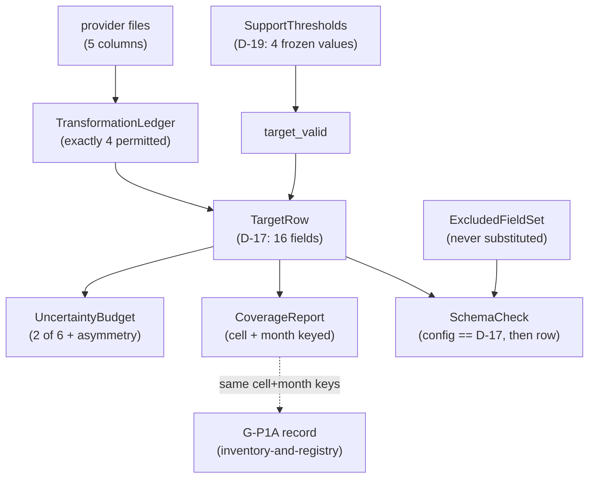

# Domain Entities — `target-standardization`

> ## ✳ G-09 IS SIGNED — 2026-08-28, **D-31** (read this before any G-09 statement below)
>
> The project decision owner **signed and approved G-09 (Agent preflight)** on 2026-08-28,
> recorded as **D-31** in `evidence/DECISIONS.md` with change record
> `governance/CHANGE_RECORD_2026-08-28_G09_signed.md`. **Every statement below of the form
> "G-09 is not signed" / "G-09 stays unsigned" is superseded as to the gate's status**, and
> is left standing as the accurate record of the constraint that applied when it was
> written.
>
> ⚠ **D-31 records the gate's own TE §18.3 preconditions as UNMET, and that disclosure
> travels with the signature.** `configs/`, and until 2026-08-28 `src/`, did not exist, so
> the mandated automated zero-TBD preflight **could not run**; the ten named critical tests
> **cannot be executed in this environment** (no Python interpreter is installed — a
> zero-byte Windows Store stub, no registry entry, no interpreter on disk); and the evidence
> artifact `aws_ai_dlc_preflight_report` **does not exist**. "No failing critical test" is
> therefore **unproven, not proven** — an absence of executions, not an absence of failures.
> This is the owner **opening the gate by authority**, not a record that its evidentiary
> conditions were satisfied, and no reader may infer the second from the first.
>
> **What the signature changes here:** module creation is authorised, and any defect this
> unit deferred *solely* because G-09 barred editing a file is now correctable.
> **What it does NOT change:** G-05 and G-06 remain `Blocked`; G-P1A, G-P2, G-P3A, G-P3C
> and G-07 are unaffected; **TE §18.2's absolute rule stands** — every scientific value this
> unit routed to G-04/G-05 **stays routed**, and no agent may fill a freeze-gate value by
> convenience; and **§18.3's stop-and-report obligation survives its own gate**, being a
> standing rule on implementation rather than a one-time gate condition.

**Unit** `target-standardization` (Bolt 6) · **Kind** `library` · **Depends on**
`inventory-and-registry`

> **Re-established a sixth time 2026-08-24**, on a **new stage attempt** (Construction opened
> 2026-08-24T11:46:26Z, resetting every unit's receipt floor). **No content of this unit
> changed.** Both `foundation` passes of that day touch nothing this unit reads — in
> particular `component-methods.md` **§ Depth**, the clause this unit depends on most, is not
> what Amendment B changed. Amendment A was declined, so **no count moved**. **The READY
> verdict in § Review belongs to the previous attempt.**

> **Corrected and re-established 2026-08-23**, after two adversarial passes: the R-20
> citations repointed to **`governance-guards`**, and **"documented QC"** disclosed as
> undefined upstream, with the closed-set check stated as *"specified but not yet
> satisfiable"* until the QC list is fixed. A fifth redo then swept the same citations out of
> this unit's question file. **No answer to any question changed.**

The data shapes this unit owns: the **D-17 target row** in its sixteen-field entirety, the
support thresholds that decide `target_valid`, the transformation ledger that makes
"only the documented transformations" checkable, the Phase 1 uncertainty budget, and the
coverage report keyed to reconcile with the G-P1A record.

**Nothing here is a scientific value.** These shapes *carry* governed values — D-16's
aggregation statistic, D-1's cell rule, D-17's field contract, D-19's four thresholds — and
record what is and is not derivable from the product that exists.

## Sources

- `../../../inception/units-generation/unit-of-work.md` § 5 — the `Owns` list, the boundary, the 6 requirements, the implementation notes; **BLK-05** with its four-limb table.
- `../../../inception/units-generation/unit-of-work-story-map.md` — Tables 1 and 2, § Per-unit coverage summary, § Cross-unit responsibilities. **Derived by reading the rows:** 6 requirements, **1** with no acceptance row; **owns** TA-19 (production half); **supports** TA-15.
- `../../../inception/requirements-analysis/requirements.md` — FR-P1-03-1…-5; NFR-TDEF-01; NFR-DQ-01; FR-P1-05-10; § Known defects rows 10 and 11.
- `../../../inception/application-design/components.md` — `prepared.py`'s row; § Assumptions on the `02` collision.
- `../../../inception/application-design/component-methods.md` § Depth — cross-package boundary calls only.
- `../../../inception/application-design/services.md` § The nine stage scripts, § Stage entry contract.
- `../inventory-and-registry/functional-design/domain-entities.md` — `Station`, `PreparedSchema`, the G-P1A record's keying.
- `../governance-guards/functional-design/business-rules.md` — **R-20**, which carries the open authority question § 5 inherits.
- `../governance-guards/functional-design/domain-entities.md` — the produced-field limb this unit's excluded set is checked against independently.
- `evidence/DECISIONS.md` — **D-1**, **D-16**, **D-17**, **D-19**.
- Workspace inspection, 2026-08-23: `tests/` holds three modules, none this unit's; `src/` and `configs/` absent.
- `functional-design-questions.md` (**Q1 through Q9**), `business-logic-model.md`, `business-rules.md`.
- `governance/reviews/GOV-2026-08-28-FD-01.md` — the full-board stage-3.1 review, verdict **FAIL**; **Recommendation 18** is this unit's. *(Added 2026-08-28, re-saved under the post-remediation receipt.)*

---

## Entity map

Text fallback: provider files pass through exactly four permitted transformations into the
D-17 target row; the four frozen support thresholds decide `target_valid`; the schema check
asserts the config field set equals D-17 before checking any row, against both the required
and the excluded sets; the row feeds the uncertainty budget and the coverage report, and the
coverage report is keyed to reconcile with `inventory-and-registry`'s G-P1A record.

---

## 1. `TargetRow` — D-17's sixteen fields, and the set that is never substituted

**Sixteen fields**, counted from D-17's enumeration and matching BLK-05's own *"exactly
D-17's approved 16 fields"*:

| # | Field | Meaning |
|---|---|---|
| 1 | `interval_start_utc` | The UTC hour the row aggregates |
| 2 | `station_id` | ARUC / BSHM / NICO |
| 3 | `cell_gdlat` | The frozen cell's latitude index (D-1) |
| 4 | `cell_glon` | The frozen cell's longitude index (D-1) |
| 5 | `cell_lat_bounds` | Half-open `[floor, floor+1)` (D-1) |
| 6 | `cell_lon_bounds` | Half-open `[floor, floor+1)` (D-1) |
| 7 | `vtec_tecu` | **The median** of valid provider samples in the hour (**D-16**) |
| 8 | `valid_observation_count` | Support count; threshold **3** (D-19) |
| 9 | `within_hour_spread_tecu` | **Range (max − min)**; threshold **10.0 TECU** (D-19) |
| 10 | `largest_internal_gap_s` | Maximum **1800 s** (D-19) |
| 11 | `provider_dtec_summary` | **Median of `dtec`**; flag at **1.5 TECU** (D-19) |
| 12 | `aggregation_config_id` | Which config produced the aggregation |
| 13 | `target_valid` | Whether the row clears § 2's thresholds |
| 14 | `phase_id` | FR-P1-03-3 |
| 15 | `source_id` | FR-P1-03-3 |
| 16 | `target_definition_id` | FR-P1-03-3; the label's machine-readable half |

**Defined from the product that exists**, not from TE §6.1's Phase 2-shaped list.

**`processor_qc_flags` carries aggregation flags only.** The package, DCB, arc, elevation,
slip and mapping classes are **Phase 2 and recorded not-applicable rather than emitted
empty**.

## 2. `ExcludedFieldSet` — the half that catches a Phase 2 quantity

**Never present, and never substituted**: `valid_satellite_count`; any per-satellite or
per-IPP quantity; zenith angle or weight; elevation; DCB; STEC; mapping output; arc or slip
statistics.

**The reason is measured, not stylistic.** *"None is derivable from a five-column gridded
product"* — `ut1_unix`, `gdlat`, `glon`, `tec`, `dtec` — **audited 2026-08-21 across all
twelve request manifests**.

**Why this set is asserted and not merely the required one.** BLK-05's approved acceptance
behaviour names **both** failure modes — an **excluded or additional** field fails, and a
**missing required** field fails. A required-only check catches the second and misses the
first, and **the first is where a Phase 2 quantity would appear**.

**`governance-guards` R-23's produced-field limb guards the same boundary independently.**
Two checks on that boundary is the design's intent: one asks *is this row D-17-shaped*, the
other asks *has Phase 1 emitted a forbidden class*. Neither substitutes for the other.

## 3. `SupportThresholds` — D-19's four frozen values, with their measured basis

Frozen **2026-08-21** from measured January–November distributions, **December excluded by
construction**:

| Field | Statistic | Threshold | Measured basis |
|---|---|---|---|
| `valid_observation_count` | minimum | **3** | keeps **95.24%** of 23,709 deduplicated cell-hours |
| `within_hour_spread_tecu` | **range (max − min)** | **10.0 TECU** | p99 = **9.616** |
| `largest_internal_gap_s` | maximum | **1800 s** | keeps **93.39%**; median gap 300 s confirms the 5-minute cadence |
| `provider_dtec_summary` | **median of `dtec`** | **1.5 TECU** flag | p99 = **1.314** |

**Each carries its measured basis into `configs/data.yaml`.** A threshold without its basis
is indistinguishable from a chosen one — which matters here specifically, because a
superseded value in the governing document looks equally authoritative until you know why it
was superseded.

> **TE §6.1's provisional `valid_observation_count >= 20` is SUPERSEDED for Phase 1, and the
> reason is a measured fact:** it retains **zero** cell-hours. The deduplicated maximum is
> **12**, the product's native cadence being 5-minutely. Recorded because a superseded
> threshold still written in the source will be found by someone, and *"superseded"* without
> a reason invites reinstatement.
>
> **`valid_satellite_count`'s provisional minimum of 4 is NOT APPLICABLE in Phase 1**, rather
> than open — the field is in § 2's excluded set.

> ## ⚠ A DECISION MADE, NEVER A CHECK PASSED
>
> These four values *"move into `configs/data.yaml` carrying that provenance when the
> REQ-ENG scaffold is built."* **`configs/` does not exist**, so the **zero-TBD preflight
> (REQ-ENG-2, FR-WS-7) is not yet runnable on this component.** The requirement states it in
> its own words: *"until then this row claims a decision made, never a check passed."*
>
> Four frozen values with provenance look like a component that has passed its gate. It has
> not.

## 4. `TransformationLedger` — what makes "only" checkable

The **four permitted transformations**, enumerated (FR-P1-03-1): **documented QC**, **UTC
normalization**, **cell selection** (D-1), **the hourly aggregation** (**D-16**: the median
of valid provider VTEC samples inside the UTC hour for the station's frozen cell).

**A fifth transformation is a failure.** *"Only the documented transformations"* is a
closed-set claim, and an open-ended value diff cannot express it — it can show what changed,
not that nothing else was permitted to. The ledger is what turns *only* into a check.

> ## ⚠ "DOCUMENTED QC" IS NOT DEFINED UPSTREAM, AND THE CLOSED SET IS ONLY AS CLOSED AS ITS WEAKEST MEMBER
>
> **Corrected 2026-08-23 after an adversarial pass.** Three of the four permitted
> transformations are fully specified — **UTC normalization**, **cell selection** (D-1's
> floor rule, half-open), **the hourly aggregation** (D-16's median). The fourth,
> **"documented QC"**, is named by FR-P1-03-1 and **defined nowhere in scope** — not in this
> unit's artifacts, not upstream.
>
> **That defeats the closed-set claim as first stated.** A value-level diff can only fail on
> "a fifth transformation" if it can attribute each observed change to one of four **known**
> operations. With one member's content unspecified, an undocumented change is
> indistinguishable from a QC-attributable one — which is exactly the failure this mechanism
> was written to prevent.
>
> **The fix, and it is this stage's to make:** the QC operations are **enumerated as a named
> list in `configs/data.yaml`**, so "documented QC" becomes a closed sub-set rather than an
> open category, and **an operation outside that list fails like a fifth transformation
> would**. `component-methods.md` § Depth assigns intra-package specification to this stage,
> so enumerating them here is in scope.
>
> **What is NOT settled here: which operations belong on that list.** No upstream document
> enumerates them, and this stage does not invent a set of QC operations for a product whose
> quality characteristics are recorded in D-19 rather than in a QC catalogue. **The
> enumeration's membership is raised at the gate**, and until it is fixed the closed-set
> check is **specified but not yet satisfiable** — stated rather than claimed.

**The statistic resolves from config citing D-16, and a run cannot proceed on a default.**
FR-P1-03-1's second limb requires the statistic to *"resolve to D-16 rather than to a
default"*; a run that merely **records** which statistic it used satisfies the words and not
the purpose.

> **Zenith-weighted aggregation: DEFERRED as not computable. Nothing is substituted.** The
> product has **no elevation, zenith angle or satellite identifier**. TE §18.2 lists the
> aggregation statistic as a **Student + Supervisor forbidden choice**, exercised under the
> recorded authority delegation. **A later implementer with a richer product may not
> reinstate it as an improvement.**

> **From the requirement's own history, carried because the ordering is the lesson.** An
> earlier revision *"asserted 'the frozen hourly aggregation' when no decision had frozen it;
> that false statement was corrected first, and the freeze recorded second, as two explicit
> stages."* A claim of frozen-ness is not the freeze.

## 5. `SchemaCheck` — three ordered steps, two distinguishable failures

1. Read the sixteen-field set from **`configs/data.yaml`**, alongside the prepared-product
   schema `inventory-and-registry` **R-49** already puts there.
2. **Assert the config set equals D-17** — before any row is compared.
3. Check the row: all sixteen required present, **and** every § 2 excluded field absent.

**Why step 2 exists.** A config-sourced field list can drift from the decision that froze it,
and then **every row passes against the wrong contract** — config and artifact agreeing
while both drift from the authority. Step 2 also makes the two failures say which layer
broke: a config drift and a row defect are different problems.

> **Open, and inherited rather than re-solved:** where step 2 reads D-17 **from**. This is the
> same authority question **`governance-guards` R-20** carries for D-24 — asserting against
> config alone lets config and manifest agree while both drift. **No third option is invented
> here.** **Citation corrected 2026-08-23** from *"`inventory-and-registry` R-20"*; that
> unit's rules run R-44…R-53 and it has no R-20.

> ## ⚠ THE MODULE THAT RUNS THIS DOES NOT EXIST
>
> `tests/test_prepared_target_schema.py` — **named and documented 2026-08-22**
> (`CR-2026-08-22-TARGET-SCHEMA-TEST`), **not implemented, never run.** *"No result of any
> kind is claimed."* Creation is gated by **G-09** and stage 3.5.
>
> **BLK-05's implementation and execution limbs stay open, and approving this design does not
> discharge them** — the symmetric statement to the register's own *"approving a filename does
> not resolve the blocker."*

## 6. `UncertaintyBudget` — two of six, plus the asymmetry statement

| Vision §6.9 content | Phase 1 |
|---|---|
| The two applicable contents | **Produced** |
| The **asymmetry statement** | **Produced** |
| Four per-satellite / per-IPP / geometry quantities | **Recorded not-applicable with their reason** — never emitted empty |

**The asymmetry statement, quoted** (FR-P1-05-10): a slowly varying per-station-day bias
partially cancels in the paired difference but *"does not cancel in the derived percentage
summary, because it inflates the reference denominator."*

**The budget asserts its own completeness against the Phase 1-applicable set.**
FR-P1-05-10's failure condition is *"a budget file that exists and states nothing"* — a
completeness assertion is what makes that a check rather than a reading.

> **§6.9's list is UNQUALIFIED in the source.** § Known defects row 11: *"§6.9 states the
> list without a phase qualifier"*, and adding one *"runs through Vision §15.2."* A reader
> who checks §6.9 finds six required items and this unit producing two; without this note
> that reads as non-compliance rather than a recorded, governed gap.

## 7. `CoverageReport` — keyed to reconcile with G-P1A

NFR-DQ-01 requires missingness and support reported **by cell and month**.

**Keyed to the same cell and month identifiers `inventory-and-registry`'s `GP1ADecisionRecord`
uses.** The two artifacts describe the same coverage from different sides, and a G-P1A
reviewer reading both must be able to line them up. **Different keying is how two reports
about one dataset become impossible to reconcile** — the shape `project.md` records for
counts compared by total rather than set-differenced.

**Also NFR-DQ-01's, and built here:** units, times, signs and fill values **documented**; and
**unexplained negative VTEC rejected**.

**"Unexplained" is doing the work.** A negative VTEC is not a small value but an
**impossible** one. An **explained** negative requires a **recorded explanation**; an
unexplained one is **rejected**, not accepted quietly.

## 8. `TargetLabel` — the label and the lineage caveat, one shape carrying both

**Location-sampled gridded VTEC.** Never receiver-specific station-observed VTEC,
*"everywhere it is described"* (FR-P1-03-4).

**Three parts, and they are one shape because they travel together:**

| Part | Half | Emitted by |
|---|---|---|
| `target_definition_id` | machine-readable | the row writer — already on every row (§ 1) |
| The **label** *"location-sampled gridded VTEC"* | human-readable | the **target-writing** path |
| The **grid-cell-versus-IPP lineage statement** | human-readable | the **target-writing** path, **beside the label** |

**The label is emitted by the same writing path** that writes the rows, so an artifact cannot
be described without it — which removes the commonest cause of mislabelling, a writer who
does not know which product they have.

**The grid-cell-versus-IPP lineage statement is emitted by that same writing path, beside the
label** (NFR-TDEF-01). It is a statement about the **target's lineage** — the Phase 1
grid-cell target population against the Phase 2 IPP target population — so it belongs on
**every artifact that describes or carries the Phase 1 target**: a dataset release, a target
artifact, a coverage report, a results table. **A comparison is not its trigger.** Keeping it
beside the label is what stops the caveat being separated from the thing it qualifies.

> ## ⚠ TWO PHYSICALLY DIFFERENT MISMATCHES, SEPARATED 2026-08-28 — ONE SHAPE WAS CARRYING BOTH
>
> **Corrected 2026-08-28 per `governance/reviews/GOV-2026-08-28-FD-01.md` Recommendation 18**
> (`High`, finding `TEC-06`), **owner-ruled `FAIL`.** The superseded paragraph read: *"The
> grid-cell-versus-IPP mismatch statement is emitted by the reporting path (NFR-TDEF-01, and
> `project.md` § Mandated's requirement that the spatial-representativeness statement appear
> 'at the point where any IRI or GIM comparison is reported')."* That merged two physically
> different mismatches into one mechanism, so a Phase 1 artifact carrying **no** IRI/GIM
> comparison disclosed the target-lineage one through **no mechanism at all**.
>
> | | **Comparison-geometry mismatch** | **Cross-phase target-lineage mismatch** |
> |---|---|---|
> | Required by | `project.md` § Mandated / **TEC-06**; Vision §6.6; TE §5 | `requirements.md` **NFR-TDEF-01**; Vision §6.6, §2.2 |
> | What differs | the Phase 1 **target grid cell** against the **station-coordinate evaluation** the comparator is sampled at | the Phase 1 **grid-cell target population** against the Phase 2 **IPP target population** |
> | Trigger | *"at the point where any IRI or GIM comparison is reported"* | **every artifact that describes or carries the Phase 1 target** |
> | Emitting path | the **comparison-producing** path — **not this unit's**; `evaluation-and-comparison` **R-110 limb 3** | the **target-writing** path — **this unit's**, this section |
> | Negative control | a comparison report without the spatial-representativeness sentence → **fails** (`evaluation-and-comparison` control 25) | a target artifact written without the grid-cell-versus-IPP statement → **fails** (this unit, R-69) |
>
> **The lineage mismatch is neither of TEC-06's two limbs** — TEC-06's are grid cell versus
> station-coordinate (Phase 1) and IPP cloud versus zenith estimate (Phase 2); NFR-TDEF-01's
> is grid cell versus IPP.
>
> **This is the shape `project.md` § Forbidden protects:** *"NEVER claim numerical equivalence
> between the Phase 1 and Phase 2 targets… agreement is not proof that the two estimate the
> same physical quantity."* Phase 2 compares against Phase 1's **reported December
> timestamps**, so **the moment the lineage mismatch matters most is the moment no comparison
> report is in scope.** `target_definition_id` keeps the distinction machine-readable — real
> mitigation — but a stamp a human never reads does not disclose a mismatch.
>
> **Q8 = D's literal reading is restored, not overridden**: option D emits the statement *"by
> the same path"*, and the path in options B and C is *"the code that writes the target"*.
> **No answer to any question changes.** The board's **option 2** — one broadened trigger
> stating both mismatches in one string — was **rejected on the record** for preserving the
> conflation it would have covered up.

**TEC-06's spatial-representativeness sentence is not this shape's, and not this unit's.** It
stays on the comparison-producing path, where its subject lives:
`evaluation-and-comparison` **R-110 limb 3** emits it on every serialized IRI/GIM comparison,
in the wording the governing documents fix — *"Phase 1 compares a grid cell against a
station-coordinate evaluation, and part of any measured difference is a geometry and sampling
artefact rather than skill."* Recorded so the obligation is visible rather than owned twice.
`external-products` W-7 obligation 3 is the same emit-from-the-path pattern; here it is
re-anchored to the path that produces **this** unit's artifact, which is the writer, because
this unit produces no IRI/GIM comparison.

**A grep-class check** covers the machine-readable outputs, the pattern this project uses for
SSN, residual and GRU absence.

> **⚠ Stated gap:** a **figure caption inside a notebook image** reaches none of these. That
> case stays with FR-P1-03-4's **claims-checklist review**, and saying so is the difference
> between a bounded mechanism and an overclaimed one.
>
> **Widened 2026-08-28 per Recommendation 18: that review has no destination row yet.** ⚠ **As-found, and correct when written — SUPERSEDED 2026-08-28 on the resume pass**: both rows were written into that unit that day (its `domain-entities.md` § 2 and `business-rules.md` R-126 addition 4). See § Assumptions & Open Questions for the closure and its stated bound (those artifacts carry no review receipt yet). The
> checklist is `regimes-diagnostics-reporting`'s, and its `reference` enumeration lists
> **FR-P1-05-19, FR-P1-05-20, VAL-05, TEC-06, D-8, D-7** — **no NFR-TDEF-01 row and no
> FR-P1-03-4 row.** That unit's claims-and-limitations checklist **owes both**: an
> **NFR-TDEF-01** row (the lineage statement present on every artifact that describes or
> carries the Phase 1 target) and an **FR-P1-03-4** row (the label present and the prohibited
> receiver-specific phrasing absent, everywhere the target is described). **Stated as a
> dependency on that unit, which is being remediated in parallel; not edited here.** Until
> both rows exist the notebook-caption residue is **routed but not yet landable**.

## 9. `IntegrityError` subclasses raised here

Deriving from `foundation`'s base, each naming the affected resource and the violated
expectation:

| Exception | Raised when |
|---|---|
| `StandardizationError` | A fifth transformation appears in the ledger; the aggregation statistic resolves to a default rather than to D-16; a provider value is altered outside the four permitted transformations |
| `SchemaError` | The config field set does not equal D-17; a required field is missing; an **excluded** field is present |
| `TargetQualityError` | An **unexplained** negative VTEC is encountered |
| `BudgetError` | The uncertainty budget omits an applicable content, or emits a Phase 2 quantity empty rather than recording it not-applicable |
| `PhaseBoundaryError` | Raised **through** the stage entry contract's step 4, and independently by `governance-guards` R-23's produced-field limb |

Catching `foundation`'s base is what lets the stage entry contract write the `aborted`
registry row for any of them.

> **⚠ Disclosed 2026-08-28, not invented:** none of the five subclasses is the one raised when
> § 8's **label** or its **grid-cell-versus-IPP lineage statement** is missing from a written
> target artifact. R-69's controls state both as *"fails"* without naming an exception, and
> that was already true of the label control before Recommendation 18 added the lineage one —
> the split introduces no new gap, and **naming a sixth subclass is a design choice this
> remediation does not make.** Carried to the gate alongside `foundation`'s exception
> inventory, which owns the hierarchy.

---

## Requirement coverage

Acceptance derived from story-map Table 1; owners from Table 2's `primary` cell, with
§ Cross-unit responsibilities consulted for the TA-19 crossing.

| Requirement | Entities | Tested by (Table 1) | Row primary owner |
|---|---|---|---|
| FR-P1-03-1 | `TransformationLedger`, `TargetRow` | TA-04 | `inventory-and-registry` |
| FR-P1-03-2 | (through the stage entry contract) | TA-27 | `governance-guards` |
| FR-P1-03-3 | `TargetRow` fields 14–16 | TA-15 | `foundation` |
| FR-P1-03-4 | `TargetLabel` | TA-15 | `foundation` |
| **FR-P1-03-5** | `TargetRow`, `ExcludedFieldSet`, `SchemaCheck` | ⚠ **NO ROW** | — |
| NFR-TDEF-01 | `TargetLabel` | TA-15 | `foundation` |
| NFR-DQ-01 | `UncertaintyBudget`, `CoverageReport` | TA-19 | **`target-standardization`** — **production half only** |

**6 requirements, 1 without an acceptance row.** **Owns** TA-19 (production); **supports**
TA-15.

> ## TA-19 HAS TWO HALVES AND THIS UNIT OWNS ONE
>
> § Cross-unit responsibilities: *"`target-standardization` (produces it)"*;
> *"`regimes-diagnostics-reporting` (reports it adjacent to the primary result)"* —
> *"Production and adjacent reporting are separate obligations in the same requirement
> family."*
>
> TA-19's evidence is *"uncertainty budget artifact **+ its placement in the results
> section**"*. **The placement half is not this unit's.**
>
> Stated because the symmetric error was made two units ago, when `external-products` claimed
> TA-36's primary test while it was sited in `features-and-splits`' module.

> **FR-P1-03-5 has no row, and the reason is legible.** WS-05 — the only field-contract row —
> is **deferred to G-P3A by FR-WS-4**. The requirement is enforced by the D-17 schema test and
> `tests/test_phase_boundary.py`; **neither is an acceptance row**, and the first **does not
> exist**. Closing it needs an approved §19 row **and** a passing result: both limbs open.

## Assumptions & Open Questions

- **[assumption]** Rule IDs continue the single sequence, so `business-rules.md` opens at **R-64**. If per-unit numbering was intended, say so at the gate.
- **[assumption]** `src/data/prepared.py` is **intra-package**; `component-methods.md` § Depth names this stage as where its shape is specified. **No amendment owed**; the running total stays **five across three units**.
- **[assumption]** The §12 tree enumerates **21** test modules; `unit-of-work.md` § 5's **19** is stale — see `business-logic-model.md` § W-8.
- **[assumption]** D-17's field count is **16**, counted from its enumeration.
- **Open — BLK-05's implementation and execution limbs**, neither discharged by approving this stage.
- **Open — where the D-17 conformance check reads the frozen field set from** (§ 5), the same authority question **`governance-guards` R-20** carries for D-24. **No third option invented.** **Citation corrected 2026-08-23.**
- **Open — `unit-of-work.md` § 5's stale "19"**, reported for annotate-in-place, not edited.
- **Open — the `02` ordinal collision.** **No `02a`/`02b` convention**; the Phase-2-script reachability check is left to `governance-guards` R-23.
- **Open — Vision §6.9's list is unqualified in the source**; the phase qualifier runs through Vision §15.2.
- **Open — the zero-TBD preflight is not yet runnable**; D-19 is a decision made, not a check passed.
- **Open — the notebook-caption case reaches no machine check** and stays with the claims-checklist review. **Widened 2026-08-28 per Recommendation 18:** that checklist is `regimes-diagnostics-reporting`'s and carries **no NFR-TDEF-01 row and no FR-P1-03-4 row**, so the routing has **no destination**. Both rows are **owed by that unit**, remediated in parallel; **the dependency is stated, not edited here**. ⚠ **CLOSED on the 2026-08-28 resume pass.** Both rows were written into `regimes-diagnostics-reporting` that day (`domain-entities.md` § 2 and `business-rules.md` R-126 addition 4, plus its W-4 mirror): `NFR-TDEF-01` as the **cross-phase target-lineage** disclosure row, kept distinct from the TEC-06 comparison-geometry row and required on **every reported artifact describing the Phase 1 target**, not only serialized IRI/GIM comparisons; `FR-P1-03-4` as the notebook-caption row with `human_residue` recorded. The routing now has a destination. **Bound, stated rather than assumed:** those artifacts carry **no review receipt and no adversarial pass yet** — the rows exist in draft and the stage verdict is still **FAIL**, so this is a closed *dependency*, not a discharged *obligation*.
- **Open — NFR-TDEF-01's lineage disclosure and TEC-06's comparison-geometry disclosure are two obligations, not one** (§ 8, corrected 2026-08-28 per Recommendation 18). `TargetLabel` carries **only** the lineage statement, emitted by the target-writing path. TEC-06's sentence is **`evaluation-and-comparison` R-110 limb 3's**; recorded so the split is legible, and **no obligation is created on that unit by this stage**.
- **Open — no `IntegrityError` subclass is named for a missing label or missing lineage statement** (§ 9), disclosed rather than filled; the exception hierarchy is `foundation`'s.
- **Open — an obligation stated on a sibling:** § 7's cell-and-month keying must agree with `inventory-and-registry`'s G-P1A record.
- **G-09 is not signed.** ⚠ **G-09 IS SIGNED as of 2026-08-28 (D-31)** — this prohibition's stated ground no longer holds, and module creation is authorised. **The other grounds stated alongside it, if any, are untouched**, and D-31's disclosure travels with the signature: the §18.3 preflight never ran, the critical tests are unexecuted in this environment, and `aws_ai_dlc_preflight_report` does not exist. **No scientific value becomes fillable** — TE §18.2 and §18.3's stop-and-report rule are unchanged. No entity here authorises creating `src/data/prepared.py`, `scripts/02_standardize_prepared_target.py`, `scripts/03_verify_processing.py` or `tests/test_prepared_target_schema.py`.
- **None** of the above adopts a reading on a supervisor-owned value, and none decides a scientific constant.

---

> **Re-saved 2026-08-24 under the post-redo receipt floor.** The project decision owner
> authorised a redo jump on `functional-design` at 2026-08-24T14:57:07Z so that three
> standing reviewer findings on `models-and-baselines` could be fixed and re-reviewed;
> a redo resets the receipt floor for **every** unit of the stage. **No content of this unit
> changed** — not a question, answer, amendment, rule, entity, workflow, count or scientific
> value. The only artifacts edited after the redo were `models-and-baselines`'s, whose
> three fixes are confined to its own files. That unit returned **READY** on the second pass of
> the restored budget, which is what the redo was authorised for. The two residuals riding that
> verdict — R-96's `PartitionError` mechanism and R-95's field label — are carried to the stage
> gate rather than applied, per the rule that a suggestion riding a READY verdict is gate input.

---

> **Re-saved unchanged 2026-08-26 under the fourteenth-redo re-confirmation receipt** (redo taken
> for `external-products`; floor reset mechanical). **No content of this unit changed.**
> **G-09 remains unsigned. ⚠ **G-09 IS SIGNED as of 2026-08-28 (D-31)** — this prohibition's stated ground no longer holds, and module creation is authorised. **The other grounds stated alongside it, if any, are untouched**, and D-31's disclosure travels with the signature: the §18.3 preflight never ran, the critical tests are unexecuted in this environment, and `aws_ai_dlc_preflight_report` does not exist. **No scientific value becomes fillable** — TE §18.2 and §18.3's stop-and-report rule are unchanged.**

---

> ## Remediation, 2026-08-28 — GOV-2026-08-28-FD-01 Recommendation 18
>
> **The project decision owner ruled `FAIL` on Recommendation 18** (`High`, finding `TEC-06`)
> and directed the board's **option 1 plus option 3's checklist rows**. A redo jump cleared
> the write-freeze. **Only § 8, one disclosure under § 9, and three
> `## Assumptions & Open Questions` bullets changed in this file.** Every dated provenance box
> above is unchanged.
>
> **What changed.** NFR-TDEF-01's **cross-phase target-lineage** disclosure (grid-cell target
> population versus IPP target population) is separated from TEC-06's **comparison-geometry**
> disclosure (grid cell versus station-coordinate evaluation) and moved onto the
> **target-writing** path beside the `location-sampled gridded VTEC` label, so `TargetLabel`
> now carries three parts that travel together — the stamp, the label and the lineage caveat.
> Each statement has **its own emitting path and its own negative control**. TEC-06's sentence
> stays on the comparison-producing path, which is `evaluation-and-comparison` R-110 limb 3's,
> **not this unit's**. The two rows `regimes-diagnostics-reporting`'s
> claims-and-limitations checklist owes — **NFR-TDEF-01** and **FR-P1-03-4** — are recorded as
> a dependency; **that unit is not edited here.** The board's option 2 was **rejected on the
> record**.
>
> **What did not change.** No question, no answer, no entity name, no field, no count, no
> scientific value. **§ 1's sixteen D-17 fields, § 2's excluded set and § 3's four D-19
> thresholds are untouched.** **G-09 remains unsigned**; **BLK-05 stands as it is**, both open
> limbs intact; Phase 1 still produces no DCB, STEC, mapping, satellite or arc field; the
> gridded product is still never labelled a receiver-specific station observation. **D-1's
> cell rule, D-16's median and D-17's sixteen fields are applied, not reinterpreted.** The
> three open items the terminal READY carried to the gate — the **"documented QC"**
> enumeration's membership, the **D-17 conformance check's authority source**
> (`governance-guards` R-20), and the **`02` ordinal collision** — are **all still open and
> unresolved**, verified in place.
>
> **Derived counts, re-checked after the edit and unchanged:** **9** numbered entity sections
> (§ 1…§ 9), **10** rules (`R-64`…`R-73`), **9** workflows (`W-1`…`W-9`), **6** requirements
> with **1** (`FR-P1-03-5`) carrying no acceptance row.

---

> **Re-confirmation receipt, 2026-08-29 — `target-standardization`.** The 2026-08-27T21:49:36Z REDO jump reset every unit's
> receipt floor, and this unit's content had already changed after that floor under the 2026-08-28
> post-execution pass (D-29 through D-32; **G-09 signed under D-31 with its TE §18.3 preconditions
> disclosed unmet**). The owner re-confirmed that post-execution content via the Consolidated
> Summary Confirmation at the foot of `functional-design-questions.md`, receipted `2026-08-29`.
> **No line above this marker was touched by this pass**, no count was re-derived, and nothing here
> discharges TA-15, WS-18 or TA-18, creates `aws_ai_dlc_preflight_report`, or alters the fact that
> stage 3.1 remains **FAIL** with no board having passed it.
